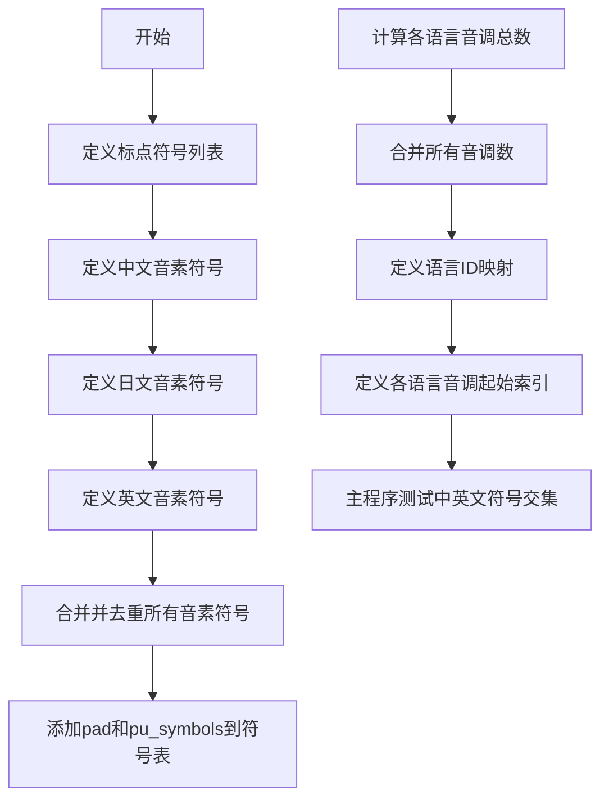

# `Bert-VITS2\oldVersion\V200\text\symbols.py` 详细设计文档

该代码定义了用于多语言语音合成系统的音素符号表，包含中文、日文和英文的音素集合，以及标点符号和静音音素的统一映射，同时配置了语言ID、音调数量等关键参数，为后续的语音合成模型提供基础的符号表示支持。

## 整体流程



## 类结构

```
无类层次结构（全模块级变量和函数）
```

## 全局变量及字段


### `punctuation`
    
标点符号列表，包含常见的语句结束和分隔符号

类型：`List[str]`
    


### `pu_symbols`
    
标点符号和特殊符号的集合，包含SP（空格）和UNK（未知）标记

类型：`List[str]`
    


### `pad`
    
填充符号，用于序列对齐和批处理

类型：`str`
    


### `zh_symbols`
    
中文音素符号列表，涵盖汉语拼音的所有基本音节

类型：`List[str]`
    


### `num_zh_tones`
    
中文声调数量，包括轻声共6个声调

类型：`int`
    


### `ja_symbols`
    
日语音素符号列表，包含片假名和平假名的音素表示

类型：`List[str]`
    


### `num_ja_tones`
    
日语声调数量，日语音调相对简单共2种

类型：`int`
    


### `en_symbols`
    
英语音素符号列表，使用ARPABET音标表示

类型：`List[str]`
    


### `num_en_tones`
    
英语声调数量，英语有4种主要语调

类型：`int`
    


### `normal_symbols`
    
去重排序后的所有语言正常音素符号集合

类型：`List[str]`
    


### `symbols`
    
完整符号表，包含填充符、正常符号和标点特殊符号

类型：`List[str]`
    


### `sil_phonemes_ids`
    
静音音素在符号表中的索引位置列表

类型：`List[int]`
    


### `num_tones`
    
所有语言的总声调数量

类型：`int`
    


### `language_id_map`
    
语言代码到ID的映射，ZH=0, JP=1, EN=2

类型：`Dict[str, int]`
    


### `num_languages`
    
支持的语言总数量

类型：`int`
    


### `language_tone_start_map`
    
每种语言声调索引的起始偏移量映射

类型：`Dict[str, int]`
    


### `a`
    
临时变量，用于计算中文和英语符号的交集

类型：`Set[str]`
    


### `b`
    
临时变量，用于计算中文和英语符号的交集

类型：`Set[str]`
    


    

## 全局函数及方法


### 全局变量和符号定义

该代码定义了多语言（中文、日文、英文）语音合成系统中使用的音素符号集、音调数量、语言ID映射以及相关索引变量。这些变量构成了语音合成系统的符号表基础，用于音素序列的编码和解码。

#### 全局变量列表

##### 1. 符号相关变量

- `punctuation`：列表，标点符号集合，包含 "!"、"?"、"…"、","、"."、'"'"、"-"
- `pu_symbols`：列表，标点符号加上特殊符号 "SP"（空格）和 "UNK"（未知）
- `pad`：字符串，填充符号，值为 "_"，用于序列padding
- `zh_symbols`：列表，中文音素符号集，包含声母、韵母等69个符号
- `num_zh_tones`：整数，中文的音调数量，值为 6
- `ja_symbols`：列表，日语音素符号集，包含假名对应的音素46个符号
- `num_ja_tones`：整数，日语的音调数量，值为 2
- `en_symbols`：列表，英文音素符号集（CMU音素），包含39个符号
- `num_en_tones`：整数，英文的音调数量，值为 4

##### 2. 组合符号变量

- `normal_symbols`：列表，去重并排序后的所有语言符号集（不含padding和标点）
- `symbols`：列表，所有可用符号的完整列表，顺序为：[pad] + normal_symbols + pu_symbols
- `sil_phonemes_ids`：列表，标点符号在symbols中的索引位置列表

##### 3. 语言和音调配置变量

- `num_tones`：整数，总音调数量，为三种语言音调之和（6+2+4=12）
- `language_id_map`：字典，语言名称到ID的映射，{"ZH": 0, "JP": 1, "EN": 2}
- `num_languages`：整数，支持的语言数量，值为 3
- `language_tone_start_map`：字典，每种语言音调起始索引映射

#### 无全局函数定义

该代码文件中**没有定义任何全局函数**（使用 `def` 关键字定义的函数）。代码仅包含：

1. 全局变量的初始化定义
2. 一个 `if __name__ == "__main__":` 入口块，用于测试：求中文和英文符号的交集并排序输出

#### 流程图

```mermaid
flowchart TD
    A[开始] --> B[定义标点符号 punctuation]
    B --> C[定义 pu_symbols = punctuation + SP + UNK]
    C --> D[定义中文音素符号 zh_symbols]
    D --> E[定义日文音素符号 ja_symbols]
    E --> F[定义英文音素符号 en_symbols]
    F --> G[合并去重排序 normal_symbols]
    G --> H[组合完整符号表 symbols = [pad] + normal_symbols + pu_symbols]
    H --> I[计算标点符号索引 sil_phonemes_ids]
    I --> J[计算总音调数 num_tones]
    J --> K[定义语言映射 language_id_map]
    K --> L[定义音调起始索引 language_tone_start_map]
    L --> M{是否为主程序入口}
    M -->|是| N[测试: 计算符号交集]
    M -->|否| O[结束]
    N --> O
```

#### 带注释源码

```python
# -*- coding: utf-8 -*-
"""
语音合成符号表定义模块
定义中文、日文、英文的音素符号集和语言/音调映射关系
"""

# ==================== 标点符号定义 ====================
punctuation = ["!", "?", "…", ",", ".", "'", "-"]  # 基础标点符号列表
pu_symbols = punctuation + ["SP", "UNK"]  # 标点符号集：标点 + 空格(Space) + 未知(Unknown)
pad = "_"  # 填充符号，用于批处理时统一序列长度

# ==================== 中文音素符号定义 ====================
zh_symbols = [
    "E", "En",  # 元音 E 及其鼻化形式
    "a", "ai", "an", "ang", "ao",  # 单元音和复合元音
    "b", "c", "ch", "d",  # 声母（爆破音）
    "e", "ei", "en", "eng", "er",  # 元音和儿化音
    "f", "g", "h",  # 声母（擦音）
    "i", "i0",  # 元音 i 及其独立形式
    "ia", "ian", "iang", "iao", "ie",  # 复合元音 i 开头的
    "in", "ing", "iong", "ir", "iu",  # 鼻音和复合元音
    "j", "k", "l", "m", "n",  # 声母（鼻音、边音）
    "o", "ong", "ou",  # 元音 o 及其组合
    "p", "q", "r",  # 声母
    "s", "sh",  # 声母（擦音）
    "t",  # 声母（爆破音）
    "u", "ua", "uai", "uan", "uang", "ui", "un", "uo",  # 元音 u 组合
    "v", "van", "ve", "vn",  # 元音 v（ü）及组合
    "w", "x", "y", "z", "zh",  # 声母
    "AA", "EE", "OO",  # 长元音标记
]
num_zh_tones = 6  # 中文声调数量：4个基本声调 + 轻声 + 轻声变体

# ==================== 日文音素符号定义 ====================
ja_symbols = [
    "N",  # 拨音
    "a", "a:",  # 短元音和长元音
    "b", "by",  # 辅音 + 半元音
    "ch", "d", "dy",  # 塞擦音和塞音
    "e", "e:",  # 元音
    "f", "g", "gy",  # 辅音
    "h", "hy",  # 辅音
    "i", "i:",  # 元音
    "j", "k", "ky",  # 辅音
    "m", "my",  # 鼻音
    "n", "ny",  # 鼻音
    "o", "o:",  # 元音
    "p", "py",  # 辅音
    "q", "r", "ry",  # 辅音
    "s", "sh",  # 擦音
    "t", "ts", "ty",  # 塞擦音和塞音
    "u", "u:",  # 元音
    "w", "y",  # 半元音
    "z", "zy",  # 擦音和塞擦音
]
num_ja_tones = 2  # 日语调：平板型和起伏型（ accent 0 和 accent 1+）

# ==================== 英文音素符号定义 ====================
en_symbols = [
    "aa", "ae", "ah", "ao", "aw", "ay",  # 元音（双元音）
    "b", "ch", "d", "dh",  # 辅音
    "eh", "er", "ey",  # 元音
    "f", "g", "hh",  # 辅音
    "ih", "iy",  # 元音
    "jh", "k", "l", "m", "n", "ng",  # 辅音和鼻音
    "ow", "oy",  # 双元音
    "p", "r", "s", "sh",  # 辅音
    "t", "th",  # 辅音
    "uh", "uw",  # 元音
    "V",  # 元音（可能表示某个特定元音）
    "w", "y", "z", "zh",  # 辅音和半元音
]
num_en_tones = 4  # 英文语调等级

# ==================== 符号表合并 ====================
# 合并三种语言的符号，去重后排序，保证符号表确定性
normal_symbols = sorted(set(zh_symbols + ja_symbols + en_symbols))
# 完整符号表：填充符 + 正常符号 + 标点符号
symbols = [pad] + normal_symbols + pu_symbols
# 计算标点符号在符号表中的索引位置，用于快速查找
sil_phonemes_ids = [symbols.index(i) for i in pu_symbols]

# ==================== 音调配置 ====================
# 总音调数 = 三种语言音调之和
num_tones = num_zh_tones + num_ja_tones + num_en_tones

# ==================== 语言映射配置 ====================
# 语言名称到ID的映射，用于模型输入
language_id_map = {"ZH": 0, "JP": 1, "EN": 2}
num_languages = len(language_id_map.keys())  # 支持的语言数量

# 每种语言的音调起始索引，用于音调ID的偏移计算
language_tone_start_map = {
    "ZH": 0,  # 中文音调从0开始
    "JP": num_zh_tones,  # 日文音调从中文后开始
    "EN": num_zh_tones + num_ja_tones,  # 英文音调从日文后开始
}

# ==================== 主程序入口 ====================
if __name__ == "__main__":
    # 测试代码：找出中文和英文中共有的音素符号
    a = set(zh_symbols)
    b = set(en_symbols)
    print(sorted(a & b))  # 输出交集并排序
```

#### 关键组件信息

| 组件名称 | 一句话描述 |
|---------|-----------|
| symbols | 完整的音素符号表，包含填充符、正常音素和标点符号 |
| language_id_map | 语言名称到整数ID的映射字典 |
| language_tone_start_map | 每种语言音调ID的起始偏移量映射 |
| sil_phonemes_ids | 标点符号在符号表中的索引列表 |

#### 潜在技术债务和优化空间

1. **符号冗余**：`zh_symbols`、`ja_symbols`、`en_symbols` 中可能存在重复符号（如 "a", "i", "n" 等），虽然代码使用 `set` 去重，但原始定义存在冗余
2. **硬编码配置**：所有符号和映射都是硬编码在代码中，建议抽取到配置文件（JSON/YAML）
3. **测试代码不完整**：`if __name__ == "__main__"` 块中的测试功能过于简单，仅测试了符号交集，未验证符号表完整性
4. **缺少文档注释**：符号的具体含义和用途缺乏详细注释
5. **无错误处理**：假设所有符号都是有效的，未做边界检查
6. **可扩展性**：添加新语言时需要手动修改多处代码，建议使用配置驱动的方式

#### 其他项目说明

**设计目标**：
- 提供统一的音素符号表示，用于多语言语音合成系统
- 支持中文、日文、英文三种语言的音素编码

**约束**：
- 符号表索引从 0 开始
- pad 符号固定为第一个符号（索引 0）
- 语言 ID 和音调 ID 必须是连续整数

**外部依赖**：
- 无外部依赖，仅使用 Python 内置数据结构

**数据流**：
- 符号表 → 音素到ID的映射 → 模型输入
- 语言和音调映射 → 模型的条件输入（language embedding, tone embedding）


## 关键组件


### 标点符号与特殊符号定义 (pu_symbols)

定义了标点符号列表（"!", "?", "…", ",", ".", "'", "-"）以及特殊符号（"SP", "UNK"），用于处理文本中的标点符号和未知字符。

### 中文音素符号表 (zh_symbols)

定义了中文（普通话）的音素符号列表，包含声母、韵母等共79个音素单位，涵盖完整的汉语拼音系统。

### 日文音素符号表 (ja_symbols)

定义了日语音素符号列表，包含清音、浊音、拗音等共46个音素单位，覆盖日语音节结构。

### 英文音素符号表 (en_symbols)

定义了英语音素符号列表（采用ARPABET音标系统），包含元音和辅音共39个音素单位。

### 符号表合并与索引系统 (symbols, sil_phonemes_ids)

将中文、日文、英文音素符号表合并去重后排序，并添加填充符(pad)和特殊符号，构建统一的符号表。同时生成静音/填充音素的ID列表用于后续处理。

### 语言标识映射 (language_id_map)

定义语言到整数ID的映射关系：ZH(中文)=0, JP(日文)=1, EN(英文)=2，用于多语言模型的语言识别。

### 音调起始位置映射 (language_tone_start_map)

定义各语言音调ID的起始偏移量，ZH从0开始，JP从中文音调数量开始，EN从中文+日文音调数量开始，实现多语言音调的连续编码。

### 音调总数统计 (num_tones)

汇总三种语言的音调数量得到总音调数(num_zh_tones + num_ja_tones + num_en_tones = 12)，用于模型输出层的维度设计。

### 辅助测试代码

包含简单的集合交集测试代码，用于找出中英文中共有的音素符号。


## 问题及建议


### 已知问题

- **硬编码配置**：所有音素、符号和语言参数均以硬编码方式直接写在代码中，缺乏外部配置文件（如 JSON、YAML）支持，导致维护成本高、修改不灵活。
- **调试代码残留**：`if __name__ == "__main__"` 块中包含测试交集的打印语句，属于开发调试代码，不应出现在生产或发布版本中。
- **无类型注解**：代码中未使用 Python 类型提示（type hints），降低了代码的可读性和静态检查工具的效能。
- **缺少文档字符串**：所有全局变量和配置均无 docstring 或注释，后续开发者难以理解各符号集的定义依据和使用场景。
- **集合去重风险**：`sorted(set(zh_symbols + ja_symbols + en_symbols))` 会丢弃跨语言重复的音素符号，可能导致语言间共享音素信息丢失。
- **魔法数字**：语言 ID（0、1、2）和音调起始索引使用魔法数字，未通过枚举或常量显式定义，降低了代码可维护性。
- **无验证机制**：缺乏对符号完整性、语言映射一致性和音调范围的有效性校验，可能在后续数据处理中引入隐蔽错误。
- **单文件职责过重**：符号定义、语言映射、音调配置等混在同一模块，未按职责分离（可拆分为 config、symbols、languages 等子模块）。

### 优化建议

- **外部化配置**：将 zh_symbols、ja_symbols、en_symbols 等音素表迁移至独立的 JSON 或 YAML 文件，通过配置加载器读取，便于非技术用户调整音素集合。
- **清理调试代码**：删除 `if __name__ == "__main__"` 块，或将其重构为正式的单元测试模块。
- **添加类型注解**：为所有全局变量、函数参数和返回值添加明确的类型标注（如 `List[str]`、`Dict[str, int]`），提升 IDE 静态分析能力。
- **完善文档**：为每个符号集合、语言映射和计算逻辑添加 docstring，说明数据来源、语言学依据和预期用途。
- **使用数据结构**：引入 `Enum` 定义语言 ID，使用 `dataclass` 或 `TypedDict` 封装语言配置对象，提升结构化程度。
- **增加校验函数**：编写 `validate_symbols()`、`validate_language_map()` 等校验函数，在模块加载时自动检查数据一致性并抛出明确异常。
- **重构组织结构**：将符号定义、语言映射、音调配置分别放入独立的子模块或类中，通过统一接口暴露，提升代码可测试性和可扩展性。
- **添加日志替换打印**：若需运行时调试信息，使用 `logging` 模块替代直接的 `print` 语句，并配置可调整的日志级别。

## 其它


### 设计目标与约束

本代码模块的核心目标是定义多语言语音合成/识别系统所需的音素符号表，包括中文、日文和英文的音素集合，以及标点符号和特殊标记，为后续的语音处理模型提供统一的符号映射基础。设计约束包括：1）符号表必须包含所有支持语言的完整音素；2）符号索引从0开始，其中索引0保留给填充符（pad）；3）语言ID和音调ID必须连续且不冲突；4）符号表需要保持有序以确保跨语言的一致性。

### 错误处理与异常设计

本模块为纯数据定义模块，不涉及运行时错误处理。潜在的索引越界风险存在于`language_tone_start_map`的访问中，但当前实现通过硬编码的起始值保证正确性。建议在后续扩展语言时，需要同步更新`num_zh_tones`、`num_ja_tones`、`num_en_tones`的值，否则会导致语言音调范围计算错误。模块内的`symbols.index(i)`操作在符号不存在时会抛出`ValueError`，但当前符号表已完整定义，不会触发此异常。

### 数据流与状态机

本模块的数据流为单向流动：输入为各语言的原始音素列表（zh_symbols、ja_symbols、en_symbols）和标点符号列表（punctuation、pu_symbols），经过集合去重、排序、合并、索引分配等处理后，输出为完整的symbols列表和各类映射表。状态机不适用于此模块，因为该模块仅进行静态数据初始化，不涉及状态转换逻辑。

### 外部依赖与接口契约

本模块无外部依赖，仅使用Python标准库（set、sorted）。接口契约包括：1）symbols列表的第一个元素必须为填充符（pad），索引为0；2）sil_phonemes_ids返回标点符号在symbols中的索引列表，用于标识静音音素；3）language_id_map提供语言名称到ID的映射；4）language_tone_start_map提供各语言音调ID的起始偏移量；5）num_tones、num_languages提供全局计数信息。所有接口返回值均为整数或列表，不可变。

### 性能考虑

当前实现性能良好，主要操作包括集合去重（O(n)）、排序（O(n log n)）和列表索引查找（O(n)）。由于符号表为静态定义，仅在模块加载时执行一次，因此运行时性能开销可忽略不计。潜在优化点：若符号表需要频繁查询，可将symbols列表转换为字典以实现O(1)查找，但这会增加内存开销，对于当前规模的符号表（约150个符号）而言并非必要。

### 安全考虑

本模块不涉及用户输入、网络通信或文件操作，无安全风险。符号表内容为公开的语音学知识，不包含敏感信息。

### 配置管理

本模块采用硬编码配置方式，所有符号和参数直接定义在源代码中。优点是简单直接、无外部依赖；缺点是修改需要修改源代码。适用于符号表相对稳定的场景。若需动态配置，可考虑将符号表迁移至JSON/YAML配置文件。

### 版本兼容性

本代码使用Python 3标准语法，无版本兼容性问题。依赖的set、sorted等特性在Python 3.6+版本中保持一致。

### 测试策略

建议测试用例包括：1）验证symbols[0]等于pad；2）验证sil_phonemes_ids中的所有索引在symbols范围内；3）验证language_id_map的值连续（0, 1, 2）；4）验证language_tone_start_map的值与num_tones逻辑一致；5）验证各语言符号集合之间无重复（除共同存在的符号外）；6）验证normal_symbols已正确排序。

### 部署考虑

本模块为库代码，不涉及独立部署。作为其他语音处理模块的依赖项分发，建议使用版本管理（如semver）以追踪符号表定义的变更。模块的__main__块仅用于调试目的，生产环境中不应直接执行。

    