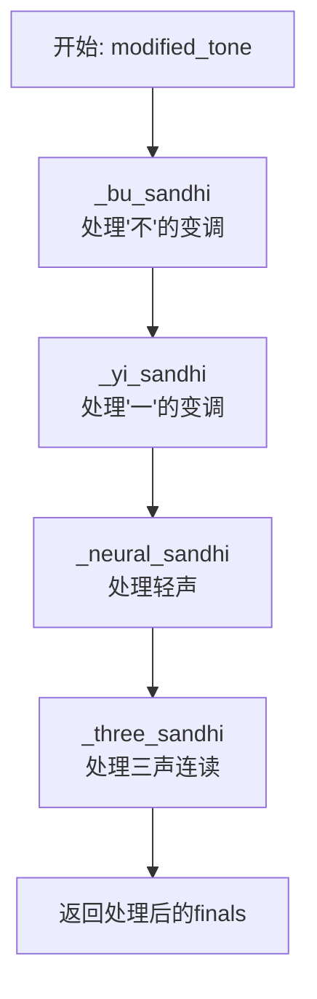
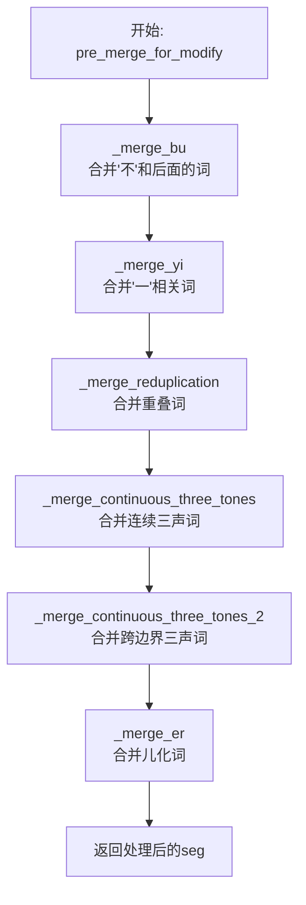
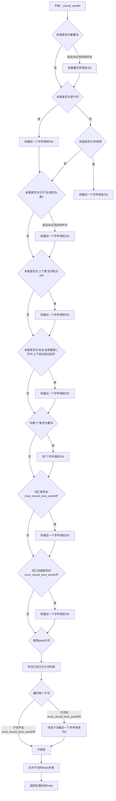
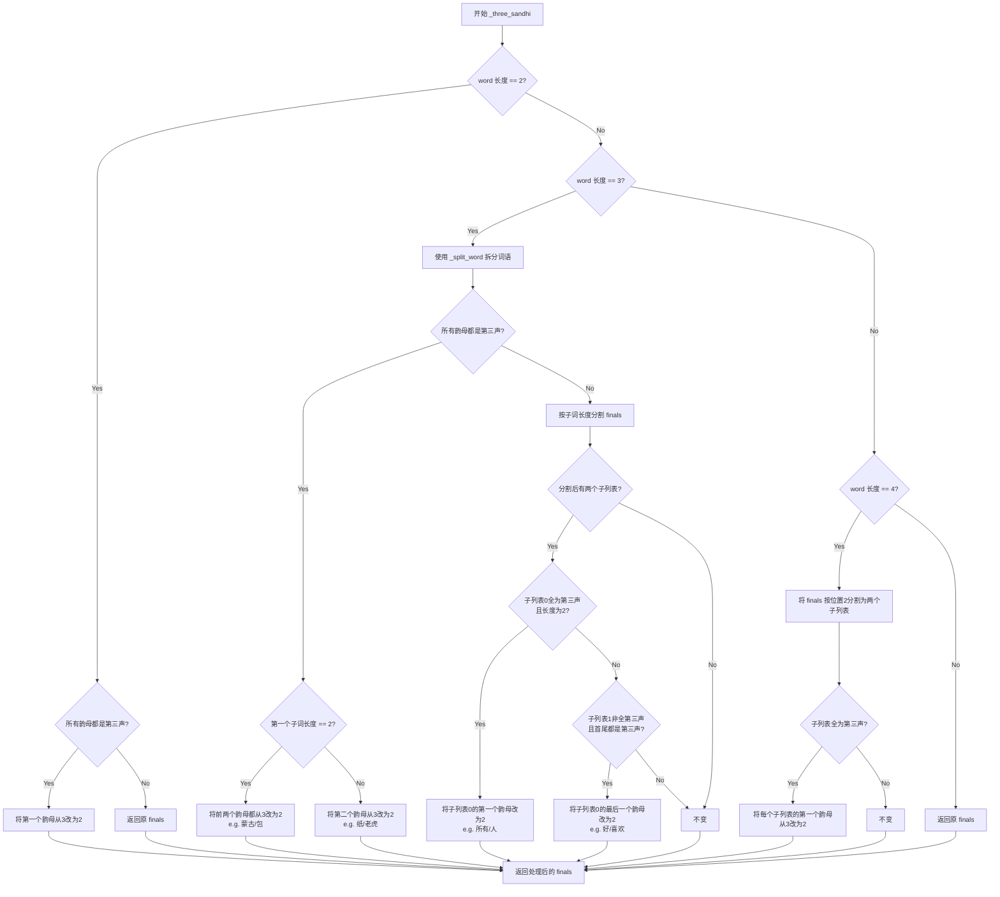
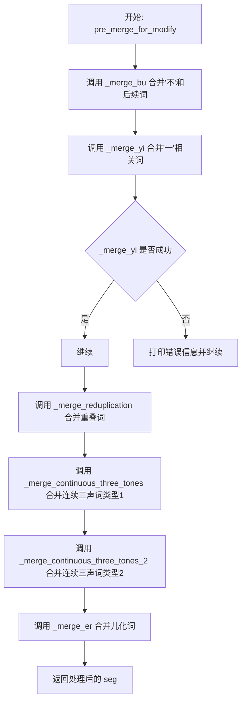
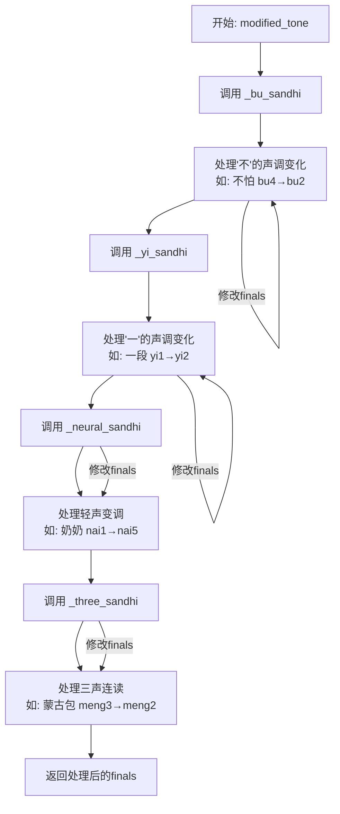
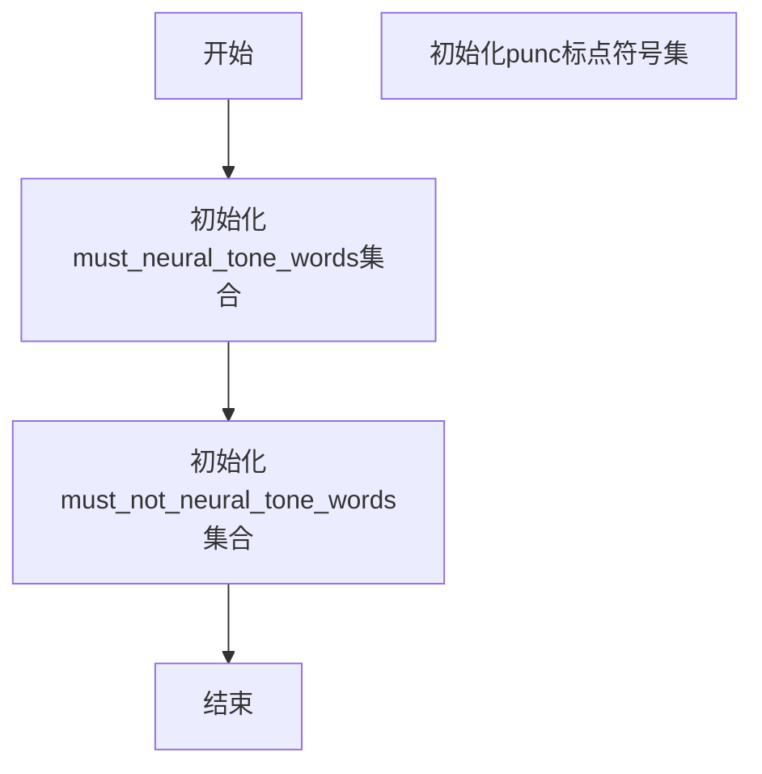

# `Bert-VITS2\oldVersion\V200\text\tone_sandhi.py` 详细设计文档

ToneSandhi是PaddlePaddle项目中的中文声调处理模块，主要用于中文语音合成中的声调变化（sandhi）处理。该模块实现了对中文轻声、三声连读、不和一连读等复杂声调规则的算法，支持对分词后的文本进行声调标注修正，是中文语音合成前端处理的关键组件。

## 整体流程

```mermaid
graph TD
A[接收输入: (word, pos) 词性标注对] --> B[pre_merge_for_modify 预处理合并]
B --> C{遍历每个词}
C -->|对于每个词| D[modified_tone 声调修改]
D --> E[_bu_sandhi 处理'不'的声调]
E --> F[_yi_sandhi 处理'一'的声调]
F --> G[_neural_sandhi 处理轻声规则]
G --> H[_three_sandhi 处理三声连读]
H --> I[返回修改后的finals列表]
C -->|所有词处理完成| J[返回最终结果]
B --> B1[_merge_bu 合并'不'和后续词]
B1 --> B2[_merge_yi 合并'一'相关词]
B2 --> B3[_merge_reduplication 合并重叠词]
B3 --> B4[_merge_continuous_three_tones 合并连续三声词]
B4 --> B5[_merge_continuous_three_tones_2 合并三声词2]
B5 --> B6[_merge_er 合并儿化音]
```

## 类结构

```
ToneSandhi (声调处理类)
├── 字段: must_neural_tone_words (必须读轻声的词语词典)
├── 字段: must_not_neural_tone_words (不能读轻声的词语词典)
├── 字段: punc (标点符号集)
└── 方法群: 声调处理与词语合并方法
```

## 全局变量及字段


### `ToneSandhi.must_neural_tone_words`
    
必需轻声词词典，约700+个中文词语

类型：`Set[str]`
    


### `ToneSandhi.must_not_neural_tone_words`
    
禁止轻声词词典，约10+个词语

类型：`Set[str]`
    


### `ToneSandhi.punc`
    
中文标点符号集合

类型：`str`
    
    

## 全局函数及方法


# ToneSandhi类详细设计文档

## 一段话描述

ToneSandhi类是PaddlePaddle中文语音合成系统中的声调处理模块，负责处理中文语音中的各种声调变化现象（包括轻声、不的变调、一的变调、三声连读等），确保合成语音的声调符合自然语言的发音规则。

## 文件的整体运行流程

```
输入文本（分词后的词语和词性）
    ↓
pre_merge_for_modify() 预处理合并
    ↓ (依次经过 _merge_bu, _merge_yi, _merge_reduplication, 
       _merge_continuous_three_tones, _merge_continuous_three_tones_2, _merge_er)
    ↓
modified_tone() 核心声调修改
    ↓ (依次经过 _bu_sandhi, _yi_sandhi, _neural_sandhi, _three_sandhi)
    ↓
输出修改后的音节(finals)
```

## 类详细信息

### 类字段

| 名称 | 类型 | 描述 |
|------|------|------|
| `must_neural_tone_words` | `Set[str]` | 必须读轻声的词语集合，包含约600+个常用词 |
| `must_not_neural_tone_words` | `Set[str]` | 不应读轻声的词语集合，包含重叠词和特定词 |
| `punc` | `str` | 中文标点符号集合，用于判断"一"后是否为标点 |

### 类方法

以下为主要方法的详细信息：

---

### ToneSandhi.modified_tone

该方法是声调处理的核心入口，按顺序调用四个声调处理子方法，依次完成"不"的变调、"一"的变调、轻声处理和三声连读变调。

参数：
- `word`：`str`，待处理的中文词语
- `pos`：`str`，jieba分词后的词性标注
- `finals`：`List[str]`，词语的音节韵母列表（带声调，如['ia1', 'i3']）

返回值：`List[str]`，处理后的音节韵母列表

#### 流程图



#### 带注释源码

```python
def modified_tone(self, word: str, pos: str, finals: List[str]) -> List[str]:
    """
    核心声调修改方法，按顺序执行四种声调处理规则
    
    参数:
        word: 待处理的词语，如"不能"
        pos: 词性标注，如"v"
        finals: 音节韵母列表，如["u4", "n2"]
    
    返回:
        处理后的韵母列表，声调已根据规则修改
    """
    # 1. 处理"不"的变调：
    #    - "不"在去声(4声)前读第二声，如"不怕"
    #    - 复合词中"不"读轻声，如"看不懂"
    finals = self._bu_sandhi(word, finals)
    
    # 2. 处理"一"的变调：
    #    - 在去声前读第二声，如"一段"
    #    - 在非去声前读第四声，如"一天"
    #    - 夹在重叠词中间读轻声，如"听一听"
    #    - 序数词中读第一声，如"第一"
    finals = self._yi_sandhi(word, finals)
    
    # 3. 处理轻声（中性声调）：
    #    - 特定词语需要读轻声，如"东西"、"规矩"
    #    - 重叠词第二个字读轻声，如"奶奶"
    #    - 虚词（吧、呢、啊）读轻声
    finals = self._neural_sandhi(word, pos, finals)
    
    # 4. 处理三声连读变调：
    #    - 两个三声连读时，第一个变二声，如"蒙古"
    #    - 三个三声连读需根据词语结构处理
    finals = self._three_sandhi(word, finals)
    
    return finals
```

---

### ToneSandhi._bu_sandhi

处理中文"不"字的声调变化规则。

参数：
- `word`：`str`，待处理的词语
- `finals`：`List[str]`，词语的音节韵母列表

返回值：`List[str]`，处理后的音节韵母列表

#### 流程图

```mermaid
flowchart TD
    A[开始: _bu_sandhi] --> B{word长度为3<br/>且第二个字是'不'?}
    B -->|是| C[将'不'改为轻声5<br/>finals[1]末尾改为5]
    B -->|否| D{遍历word中每个字符}
    D --> E{找到'不'且<br/>下一个字是4声?}
    E -->|是| F[将'不'改为2声<br/>finals[i]末尾改为2]
    E -->|否| G[不变]
    C --> H[返回finals]
    F --> H
    G --> H
```

#### 带注释源码

```python
def _bu_sandhi(self, word: str, finals: List[str]) -> List[str]:
    """
    处理"不"的声调变化
    
    规则:
    1. 复合词中的"不"读轻声，如"懂得"、"来不及"
    2. "不"在去声(4声)前变读第二声，如"不怕"、"不要"
    
    参数:
        word: 词语，如"不怕"或"懂得"
        finals: 韵母列表，如["u4", "n5"]或["b u4", "d5"]
    
    返回:
        修改后的韵母列表
    """
    # 处理复合词中的"不"，如"看不懂"
    if len(word) == 3 and word[1] == "不":
        finals[1] = finals[1][:-1] + "5"  # 将韵母末尾4改为5，读轻声
    else:
        # 遍历处理"不"在去声前的情况
        for i, char in enumerate(word):
            # "不"在4声前读2声，如"不怕"
            if char == "不" and i + 1 < len(word) and finals[i + 1][-1] == "4":
                finals[i] = finals[i][:-1] + "2"  # 改为第二声
    return finals
```

---

### ToneSandhi._yi_sandhi

处理中文"一"字的声调变化规则。

参数：
- `word`：`str`，待处理的词语
- `finals`：`List[str]`，词语的音节韵母列表

返回值：`List[str]`，处理后的音节韵母列表

#### 流程图

```mermaid
flowchart TD
    A[开始: _yi_sandhi] --> B{"一"在数字序列中?}
    B -->|是| H[直接返回finals]
    B -->|否| C{"一"在重叠词中间?<br/>如"听一听"}
    C -->|是| I[将"一"改为轻声5]
    C -->|否| D{以"第一"开头?}
    D -->|是| J[将"一"改为1声]
    D -->|否| E{遍历查找"一"}
    E --> F{"一"后是4声?}
    F -->|是| K[将"一"改为2声]
    F -->|否| G{"一"后是标点?}
    G -->|否| L[将"一"改为4声]
    G -->|是| M[保持1声不变]
    H --> N[返回finals]
    I --> N
    J --> N
    K --> N
    L --> N
    M --> N
```

#### 带注释源码

```python
def _yi_sandhi(self, word: str, finals: List[str]) -> List[str]:
    """
    处理"一"的声调变化
    
    规则:
    1. 在数字序列中保持1声，如"一九八六"
    2. 在重叠动词中间读轻声，如"听一听"、"看一看"
    3. 序数词"第一"中读1声
    4. 在去声(4声)前读2声，如"一段"、"一律"
    5. 在非去声前读4声，如"一天"、"一年"
    6. 在标点符号前保持1声
    
    参数:
        word: 词语
        finals: 韵母列表
    
    返回:
        修改后的韵母列表
    """
    # "一"在数字序列中，保持原声调
    if word.find("一") != -1 and all(
        [item.isnumeric() for item in word if item != "一"]
    ):
        return finals
    
    # "一"在重叠词中间，读轻声，如"试一试"
    elif len(word) == 3 and word[1] == "一" and word[0] == word[-1]:
        finals[1] = finals[1][:-1] + "5"
    
    # "一"是序数词，读第一声，如"第一"
    elif word.startswith("第一"):
        finals[1] = finals[1][:-1] + "1"
    
    else:
        for i, char in enumerate(word):
            if char == "一" and i + 1 < len(word):
                # "一"在4声前读2声，如"一段"
                if finals[i + 1][-1] == "4":
                    finals[i] = finals[i][:-1] + "2"
                # "一"在非4声前读4声，如"一天"
                else:
                    # "一"后面如果是标点，还读一声
                    if word[i + 1] not in self.punc:
                        finals[i] = finals[i][:-1] + "4"
    return finals
```

---

### ToneSandhi._neural_sandhi

处理中文轻声（中性声调）的规则。

参数：
- `word`：`str`，待处理的词语
- `pos`：`str`，词性标注
- `finals`：`List[str]`，词语的音节韵母列表

返回值：`List[str]`，处理后的音节韵母列表

#### 带注释源码

```python
def _neural_sandhi(self, word: str, pos: str, finals: List[str]) -> List[str]:
    """
    处理轻声（中性声调）的规则
    
    规则:
    1. 重叠词（名词/动词/形容词）第二个字读轻声，如"奶奶"、"试试"
    2. 语气词（吧、呢、啊、呐等）读轻声
    3. 结构助词（的、地、得）读轻声
    4. 复数词缀（们、子）在人称代词或名词后读轻声
    5. 方位词（上、下、里）在方位词后读轻声
    6. 趋向动词（来、去）在动词后读轻声
    7. 量词"个"在特定情况下读轻声
    8. 特定词语必须读轻声（如"东西"、"规矩"）
    
    参数:
        word: 词语
        pos: 词性（n=名词, v=动词, a=形容词, r=代词等）
        finals: 韵母列表
    
    返回:
        修改后的韵母列表
    """
    # 重叠词处理：名词、动词、形容词的重叠词第二个字读轻声
    for j, item in enumerate(word):
        if (
            j - 1 >= 0
            and item == word[j - 1]  # 重叠字
            and pos[0] in {"n", "v", "a"}  # 名词/动词/形容词
            and word not in self.must_not_neural_tone_words  # 排除特定词
        ):
            finals[j] = finals[j][[:-1]] + "5"  # 改为轻声
    
    # 语气词处理
    ge_idx = word.find("个")
    if len(word) >= 1 and word[-1] in "吧呢啊呐噻嘛吖嗨呐哦哒额滴哩哟喽啰耶喔诶":
        finals[-1] = finals[-1][:-1] + "5"
    # 结构助词处理
    elif len(word) >= 1 and word[-1] in "的地得":
        finals[-1] = finals[-1][:-1] + "5"
    # 复数词缀处理（们、子）
    elif (
        len(word) > 1
        and word[-1] in "们子"
        and pos in {"r", "n"}
        and word not in self.must_not_neural_tone_words
    ):
        finals[-1] = finals[-1][:-1] + "5"
    # 方位词处理
    elif len(word) > 1 and word[-1] in "上下里" and pos in {"s", "l", "f"}:
        finals[-1] = finals[-1][:-1] + "5"
    # 趋向动词处理
    elif len(word) > 1 and word[-1] in "来去" and word[-2] in "上下进出回过起开":
        finals[-1] = finals[-1][:-1] + "5"
    # 量词"个"处理
    elif (
        ge_idx >= 1
        and (
            word[ge_idx - 1].isnumeric()
            or word[ge_idx - 1] in "几有两半多各整每做是"
        )
    ) or word == "个":
        finals[ge_idx] = finals[ge_idx][:-1] + "5"
    # 特定词语必须读轻声
    else:
        if (
            word in self.must_neural_tone_words
            or word[-2:] in self.must_neural_tone_words
        ):
            finals[-1] = finals[-1][:-1] + "5"
    
    # 处理复合词中的轻声词
    word_list = self._split_word(word)
    finals_list = [finals[: len(word_list[0])], finals[len(word_list[0]) :]]
    for i, word in enumerate(word_list):
        if (
            word in self.must_neural_tone_words
            or word[-2:] in self.must_neural_tone_words
        ):
            finals_list[i][-1] = finals_list[i][-1][:-1] + "5"
    finals = sum(finals_list, [])
    return finals
```

---

### ToneSandhi._three_sandhi

处理三声连读变调规则。当两个或三个三声字连续出现时，第一个三声会变成二声。

参数：
- `word`：`str`，待处理的词语
- `finals`：`List[str]`，词语的音节韵母列表

返回值：`List[str]`，处理后的音节韵母列表

#### 带注释源码

```python
def _three_sandhi(self, word: str, finals: List[str]) -> List[str]:
    """
    处理三声连读变调（Third tone sandhi）
    
    规则:
    1. 两个三声连读：前一个三声变二声，如"蒙古"、"老虎"
    2. 三个三声连读：根据词语结构决定变调方式
       - 双音节+单音节：前两个变二声
       - 单音节+双音节：后两个变二声
    
    参数:
        word: 词语
        finals: 韵母列表
    
    返回:
        修改后的韵母列表
    """
    # 双音节词：两个三声连读
    if len(word) == 2 and self._all_tone_three(finals):
        finals[0] = finals[0][:-1] + "2"
    
    # 三音节词处理
    elif len(word) == 3:
        word_list = self._split_word(word)
        if self._all_tone_three(finals):
            # 双音节+单音节，如"蒙古/包"
            if len(word_list[0]) == 2:
                finals[0] = finals[0][:-1] + "2"
                finals[1] = finals[1][:-1] + "2"
            # 单音节+双音节，如"纸/老虎"
            elif len(word_list[0]) == 1:
                finals[1] = finals[1][:-1] + "2"
        else:
            finals_list = [finals[: len(word_list[0])], finals[len(word_list[0]) :]]
            if len(finals_list) == 2:
                for i, sub in enumerate(finals_list):
                    # 双音节都是三声，如"所有/人"
                    if self._all_tone_three(sub) and len(sub) == 2:
                        finals_list[i][0] = finals_list[i][0][:-1] + "2"
                    # 特殊处理：如"好/喜欢"
                    elif (
                        i == 1
                        and not self._all_tone_three(sub)
                        and finals_list[i][0][-1] == "3"
                        and finals_list[0][-1][-1] == "3"
                    ):
                        finals_list[0][-1] = finals_list[0][-1][:-1] + "2"
                finals = sum(finals_list, [])
    
    # 四字成语：分成两个双音节处理
    elif len(word) == 4:
        finals_list = [finals[:2], finals[2:]]
        finals = []
        for sub in finals_list:
            if self._all_tone_three(sub):
                sub[0] = sub[0][:-1] + "2"
            finals += sub

    return finals
```

---

### ToneSandhi.pre_merge_for_modify

预处理合并方法，在进行声调修改前，将某些需要一起处理的字合并为一个词，避免分词导致的声调错误。

参数：
- `seg`：`List[Tuple[str, str]]`，分词结果列表，每个元素为(词语, 词性)元组

返回值：`List[Tuple[str, str]]`，合并后的分词结果列表

#### 流程图



#### 带注释源码

```python
def pre_merge_for_modify(self, seg: List[Tuple[str, str]]) -> List[Tuple[str, str]]:
    """
    预处理合并：在声调修改前合并需要一起处理的词语
    
    目的：
    - jieba分词可能将某些应该一起处理的字分开
    - 分开处理会导致声调错误
    - 合并后再进行声调处理
    
    处理顺序：
    1. _merge_bu: 合并"不"和后面的词
    2. _merge_yi: 合并"一"和重叠词
    3. _merge_reduplication: 合并重叠词
    4. _merge_continuous_three_tones: 合并连续三声
    5. _merge_continuous_three_tones_2: 合并跨边界三声
    6. _merge_er: 合并儿化词
    
    参数:
        seg: 分词结果，如[('听', 'v'), ('一', 'm'), ('听', 'v')]
    
    返回:
        合并后的分词结果，如[('听一听', 'v')]
    """
    # 步骤1：合并"不"
    # 输入：[('不', 'd'), ('懂', 'v')] -> 输出：[('不懂', 'v')]
    seg = self._merge_bu(seg)
    
    # 步骤2：合并"一"
    # 输入：[('听', 'v'), ('一', 'm'), ('听', 'v')] -> 输出：[('听一听', 'v')]
    try:
        seg = self._merge_yi(seg)
    except:
        print("_merge_yi failed")
    
    # 步骤3：合并重叠词
    seg = self._merge_reduplication(seg)
    
    # 步骤4：合并连续三声（同一词内）
    seg = self._merge_continuous_three_tones(seg)
    
    # 步骤5：合并连续三声（跨词边界）
    seg = self._merge_continuous_three_tones_2(seg)
    
    # 步骤6：合并儿化词
    seg = self._merge_er(seg)
    
    return seg
```

---

### ToneSandhi._split_word

使用jieba分词工具将词语进一步细分为子词，用于精确的声调处理。

参数：
- `word`：`str`，待分割的词语

返回值：`List[str]`，子词列表

#### 带注释源码

```python
def _split_word(self, word: str) -> List[str]:
    """
    使用jieba的cut_for_search将词语分割为子词
    
    用途：
    - 声调处理需要更细粒度的词语结构
    - 例如"蒙古包"需要分成"蒙古"+"包"
    
    参数:
        word: 词语，如"蒙古包"
    
    返回:
        子词列表，如["蒙古", "包"]
    """
    # 使用jieba的搜索引擎模式分词
    word_list = jieba.cut_for_search(word)
    # 按长度升序排列
    word_list = sorted(word_list, key=lambda i: len(i), reverse=False)
    
    first_subword = word_list[0]
    first_begin_idx = word.find(first_subword)
    
    if first_begin_idx == 0:
        # 子词在开头：["蒙古", "包"]
        second_subword = word[len(first_subword):]
        new_word_list = [first_subword, second_subword]
    else:
        # 子词在结尾：["纸", "老虎"]
        second_subword = word[: -len(first_subword)]
        new_word_list = [second_subword, first_subword]
    
    return new_word_list
```

---

### ToneSandhi._merge_bu

将分词后的"不"与后面的词语合并，避免"不"单独出现导致声调错误。

参数：
- `seg`：`List[Tuple[str, str]]`，分词结果列表

返回值：`List[Tuple[str, str]]`，合并后的分词结果

#### 带注释源码

```python
def _merge_bu(self, seg: List[Tuple[str, str]]) -> List[Tuple[str, str]]:
    """
    合并"不"和后面的词语
    
    原因：
    - jieba可能将"不"单独分出来
    - "不"单独处理时声调可能错误
    - 合并后可正确应用变调规则
    
    示例：
    输入：[('不', 'd'), ('懂', 'v'), ('了', 'u')]（假设分词错误）
    输出：[('不懂', 'v'), ('了', 'u')]
    
    参数:
        seg: 分词结果列表
    
    返回:
        合并后的分词结果
    """
    new_seg = []
    last_word = ""
    
    for word, pos in seg:
        if last_word == "不":
            word = last_word + word  # 合并"不"和当前词
        if word != "不":
            new_seg.append((word, pos))
        last_word = word[:]
    
    # 处理末尾的"不"
    if last_word == "不":
        new_seg.append((last_word, "d"))
        last_word = ""
    
    return new_seg
```

---

## 关键组件信息

| 组件名称 | 描述 |
|----------|------|
| `must_neural_tone_words` | 包含600+个必须读轻声的汉语词语，如"东西"、"规矩"、"棉花"等 |
| `must_not_neural_tone_words` | 包含不应读轻声的词语集合，主要是重叠词如"人人"、"虎虎" |
| `punc` | 中文标点符号集合，用于判断"一"后是否为标点 |
| `_bu_sandhi` | 处理"不"字的声调变化规则实现 |
| `_yi_sandhi` | 处理"一"字的声调变化规则实现 |
| `_neural_sandhi` | 处理轻声（中性声调）的规则实现 |
| `_three_sandhi` | 处理三声连读变调的规则实现 |

## 潜在的技术债务或优化空间

1. **硬编码词汇表**：轻声词汇表`must_neural_tone_words`是硬编码的600+个词语，未来可考虑使用配置文件或数据库管理，便于维护和扩展

2. **异常处理不完善**：`_merge_yi`方法中使用空的except块，仅打印错误信息，可能隐藏潜在bug

3. **分词依赖**：依赖jieba进行分词和词性标注，引入外部依赖，增加了系统的复杂度

4. **效率优化**：多次遍历字符串和列表，对于大规模文本处理可能存在性能瓶颈

5. **规则覆盖不全**：声调规则主要覆盖常见情况，某些方言或特殊用法可能未覆盖

6. **类型注解不完整**：部分内部变量缺少类型注解，如`_merge_yi`中的列表操作

## 其它项目

### 设计目标与约束

- **目标**：实现中文语音合成中的声调自动处理，使合成语音更加自然
- **约束**：依赖jieba分词和pypinyin库，遵循现代汉语普通话声调规则

### 错误处理与异常设计

- 使用try-except捕获`_merge_yi`异常，但仅打印错误信息
- 缺少详细的错误日志记录机制
- 未对输入参数进行有效性验证

### 数据流与状态机

数据流为单向流水线：原始文本 → 分词 → 预处理合并 → 声调修改 → 结果输出

状态机主要体现在声调处理流程中，每个字根据其位置、词性和上下文决定最终声调

### 外部依赖与接口契约

- **jieba**：中文分词和词性标注
- **pypinyin**：汉语拼音转换，提供`lazy_pinyin`和`Style.FINALS_TONE3`
- **输入接口**：`modified_tone(word, pos, finals)` 或 `pre_merge_for_modify(seg)`
- **输出接口**：处理后的`finals`列表或`seg`列表


### `ToneSandhi._neural_sandhi`

该方法用于处理中文声调中的「轻声」规则，根据词的词性、位置、词缀等条件，将某些字的声调调整为轻声（标记为"5"），包括重叠词、语气词、结构助词、方位词、量词「个」以及必须读轻声的词汇等场景。

参数：

- `word`：`str`，待处理的汉字词汇
- `pos`：`str`，jieba分词后的词性标注（Part-of-Speech tag）
- `finals`：`List[str]`，汉字对应的拼音韵母列表（带声调），如 `['ia1', 'i3']`

返回值：`List[str]`，处理后的拼音韵母列表，其中需要读轻声的字其声调被替换为"5"

#### 流程图



#### 带注释源码

```python
def _neural_sandhi(self, word: str, pos: str, finals: List[str]) -> List[str]:
    """
    处理中文轻声规则（Neural Tone Sandhi）
    
    轻声是普通话中一种特殊的声调变化，主要出现在：
    1. 重叠词的后一个字：如"奶奶"、"试试"
    2. 语气词：如"吧"、"呢"、"啊"
    3. 结构助词：如"的"、"地"、"得"
    4. 某些词缀：如"们"、"子"
    5. 方位词：如"上"、"下"、"里"
    6. 趋向动词：如"来"、"去"
    7. 量词"个"的特殊用法
    8. 约定俗成的必读轻声词
    """
    
    # 处理重叠词：名词、动词、形容词的重叠词第二个字读轻声
    # 例如：奶奶(n.)、试试(v.)、旺旺(a.)
    for j, item in enumerate(word):
        if (
            j - 1 >= 0  # 确保不是第一个字
            and item == word[j - 1]  # 当前字与前一个字相同（重叠）
            and pos[0] in {"n", "v", "a"}  # 词性为名词、动词或形容词
            and word not in self.must_not_neural_tone_words  # 不在必须不读轻声的列表中
        ):
            finals[j] = finals[j][:-1] + "5"  # 将声调改为轻声5
    
    # 查找"个"字的位置（可能是量词）
    ge_idx = word.find("个")
    
    # 规则1：语气词结尾，读轻声
    # 包括：吧、呢、啊、呐、噻、嘛、吖、嗨、哦、哒、额、滴、哩、哟、喽、啰、耶、喔、诶
    if len(word) >= 1 and word[-1] in "吧呢啊呐噻嘛吖嗨呐哦哒额滴哩哟喽啰耶喔诶":
        finals[-1] = finals[-1][:-1] + "5"
    
    # 规则2：结构助词"的、地、得"结尾，读轻声
    elif len(word) >= 1 and word[-1] in "的地得":
        finals[-1] = finals[-1][:-1] + "5"
    
    # 规则3：名词/代词后缀"们、子"结尾，且非必须非轻声词，读轻声
    # 例如："我们"、"他们"、"孩子"、"椅子"
    # 注意：某些"子"结尾的词如"男子"、"女子"不读轻声（在must_not_neural_tone_words中）
    elif (
        len(word) > 1
        and word[-1] in "们子"
        and pos in {"r", "n"}  # 词性为代词(r)或名词(n)
        and word not in self.must_not_neural_tone_words
    ):
        finals[-1] = finals[-1][:-1] + "5"
    
    # 规则4：方位词"上、下、里"结尾，且词性为s/l/f（方位词），读轻声
    # 例如："桌上"、"地下"、"家里"
    elif len(word) > 1 and word[-1] in "上下里" and pos in {"s", "l", "f"}:
        finals[-1] = finals[-1][:-1] + "5"
    
    # 规则5：趋向动词"来、去"在特定动词后，读轻声
    # 例如："上来"、"下去"、"出去"、"回来"、"过去"、"起来"、"开除"（"开"也作动词）
    elif len(word) > 1 and word[-1] in "来去" and word[-2] in "上下进出回过起开":
        finals[-1] = finals[-1][:-1] + "5"
    
    # 规则6：量词"个"作量词时读轻声
    # 条件：前面是数字、或"几有两半多各整每做是"等词，或单词就是"个"
    elif (
        ge_idx >= 1
        and (
            word[ge_idx - 1].isnumeric()  # 前一个是数字
            or word[ge_idx - 1] in "几有两半多各整每做是"  # 前一个是特定量词/数词
        )
    ) or word == "个":
        finals[ge_idx] = finals[ge_idx][:-1] + "5"
    
    # 规则7：其他约定俗成的必读轻声词
    # 检查整个词或后两字是否在must_neural_tone_words中
    else:
        if (
            word in self.must_neural_tone_words
            or word[-2:] in self.must_neural_tone_words
        ):
            finals[-1] = finals[-1][:-1] + "5"

    # 使用jieba对词汇进行细粒度分词，处理复合词中的轻声规则
    # 例如："东西"可能需要拆分为"东"+"西"分别处理
    word_list = self._split_word(word)
    
    # 根据分词结果将finals也相应拆分
    finals_list = [finals[: len(word_list[0])], finals[len(word_list[0]) :]]
    
    # 遍历每个子词，检查是否在轻声词表中
    for i, word in enumerate(word_list):
        # conventional neural in Chinese: 检查子词是否在轻声词表中
        if (
            word in self.must_neural_tone_words
            or word[-2:] in self.must_neural_tone_words
        ):
            finals_list[i][-1] = finals_list[i][-1][:-1] + "5"
    
    # 合并子词的finals列表
    finals = sum(finals_list, [])
    return finals
```


### `ToneSandhi._bu_sandhi`

该函数用于处理中文声调中的"不"字变调规则，根据"不"在词语中的位置及其后面字的声调，将"不"的声调调整为正确的值（轻声5或第二声2）。

参数：

- `word`：`str`，待处理的词语
- `finals`：`List[str]`，词语的拼音韵母列表，包含声调标记（如"bù"对应"bu4"）

返回值：`List[str]`，调整声调后的拼音韵母列表

#### 流程图

```mermaid
flowchart TD
    A[开始 _bu_sandhi] --> B{词语长度 == 3<br/>且第二个字符是'不'?}
    B -->|是| C[将'不'的声调改为5<br/>finals[1] = finals[1][:-1] + '5']
    B -->|否| D[遍历词语中的每个字符]
    D --> E{当前字符 == '不'<br/>且下一个字符存在<br/>且下一个字是第四声?}
    E -->|是| F[将'不'的声调改为2<br/>finals[i] = finals[i][:-1] + '2']
    E -->|否| G{继续检查下一个字符?}
    G -->|是| E
    G -->|否| H[返回处理后的finals]
    C --> H
    F --> H
```

#### 带注释源码

```python
def _bu_sandhi(self, word: str, finals: List[str]) -> List[str]:
    # 处理三字词中"不"在中间的情况，如"看不懂"
    # 此时"不"读作轻声(5声)
    if len(word) == 3 and word[1] == "不":
        finals[1] = finals[1][:-1] + "5"  # 将第二个字符的韵母声调改为5
    else:
        # 遍历词语中的每个字符
        for i, char in enumerate(word):
            # "不"在第四声(4)字前面时，应该变为第二声(2)
            # 例如："不怕"中"不"读作bú
            if char == "不" and i + 1 < len(word) and finals[i + 1][-1] == "4":
                finals[i] = finals[i][:-1] + "2"  # 将"不"的声调改为2
    return finals
```


### `ToneSandhi._yi_sandhi`

该方法是 `ToneSandhi` 类中专门用于处理汉字“一”声调变化（声调变调）的核心逻辑。根据普通话声调规则，“一”在不同语境下会发生变调：位于去声（第四声）前读第二声，位于非去声前读第四声，在数词序列中保持原声调，在叠词中间读轻声，在序数词“第一”中读第一声。

参数：

- `word`：`str`，待处理的汉字词语，包含需要处理声调的“一”
- `finals`：`List[str]`，汉字对应的拼音韵母列表，每个元素为带声调的拼音（如 "yi1"），与方法参数 `word` 字符一一对应

返回值：`List[str]`，返回处理后的拼音韵母列表，其中“一”的声调根据规则发生变化

#### 流程图

```mermaid
flowchart TD
    A[开始 _yi_sandhi] --> B{word 中是否包含"一"且其他字符均为数字}
    B -->|是| B1[直接返回 finals 不做处理]
    B -->|否| C{word 长度为3<br/>且 word[1] == '一'<br/>且 word[0] == word[-1]}
    C -->|是| C1[将 finals[1] 改为轻声 '5' 版本<br/>例: 看一看 → yi5]
    C -->|否| D{word 是否以"第一"开头}
    D -->|是| D1[将 finals[1] 改为第一声 '1' 版本<br/>例: 第一 → yi1]
    D -->|否| E[遍历 word 中的每个字符]
    E --> F{找到"一"且后面还有字符}
    F -->|否| F1[返回 finals]
    F -->|是| G{下一个字的声调是否为第四声}
    G -->|是| G1[将"一"改为第二声 '2'<br/>例: 一段 → yi2]
    G -->|否| H{下一个字符是否为标点}
    H -->|是| H1[保持第一声<br/>例: 一， → yi1]
    H -->|否| I[将"一"改为第四声 '4'<br/>例: 一天 → yi4]
    G1 --> J[返回处理后的 finals]
    H1 --> J
    I --> J
    C1 --> J
    D1 --> J
```

#### 带注释源码

```python
def _yi_sandhi(self, word: str, finals: List[str]) -> List[str]:
    """
    处理汉字"一"的声调变调规则
    
    变调规则:
    1. 在数词序列中保持原声调(一声), 如 "一零零", "二一零"
    2. 在叠词中间读轻声(五声), 如 "看一看", "想一想"
    3. 在序数词"第一"中读一声, 如 "第一", "第一名"
    4. 在去声(第四声)前读第二声, 如 "一段", "一度"
    5. 在非去声前读第四声, 如 "一天", "一年"
    6. 在标点符号前保持一声, 如 "一，"
    """
    
    # 规则1: "一" 在数字序列中, 如 "一零零", "二一零"
    # 判断条件: 包含"一"且除"一"外的其他字符都是数字
    if word.find("一") != -1 and all(
        [item.isnumeric() for item in word if item != "一"]
    ):
        return finals  # 直接返回, 不做任何声调变化
    
    # 规则2: "一" 在重叠词中间应读轻声(5), 如 "看一看", "想一想"
    # 判断条件: 长度为3, 中间字符是"一", 首位和末位相同
    elif len(word) == 3 and word[1] == "一" and word[0] == word[-1]:
        finals[1] = finals[1][:-1] + "5"  # 将声调改为5(轻声)
    
    # 规则3: "一" 作为序数词时读第一声, 如 "第一"
    elif word.startswith("第一"):
        finals[1] = finals[1][:-1] + "1"  # 将声调改为1
    
    else:
        # 规则4和5: 根据"一"后面字符的声调决定变调
        for i, char in enumerate(word):
            if char == "一" and i + 1 < len(word):
                # "一" 在去声(第四声, 4)前应读第二声(2), 如 "一段"
                if finals[i + 1][-1] == "4":
                    finals[i] = finals[i][:-1] + "2"
                # "一" 在非去声前应读第四声(4), 如 "一天"
                else:
                    # 特例: "一" 后面如果是标点符号, 仍读第一声
                    if word[i + 1] not in self.punc:
                        finals[i] = finals[i][:-1] + "4"
    
    return finals
```


### ToneSandhi._split_word

该方法用于将输入的词语分割成两个子词，以便后续进行声调处理（主要是三声连读变调）。它使用 jieba 的搜索引擎模式进行分词，然后根据子词在原词中的位置将其分割为两部分。

参数：

- `word`：`str`，待分割的中文词语

返回值：`List[str]`，分割后得到的两个子词列表

#### 流程图

```mermaid
flowchart TD
    A[开始: _split_word] --> B[调用 jieba.cut_for_search 对词语分词]
    B --> C[按照长度升序排序子词列表]
    C --> D[取最短子词 first_subword]
    D --> E{first_subword 在词首?}
    E -->|是| F[second_subword = word[len(first_subword):]
    F --> G[new_word_list = [first_subword, second_subword]]
    E -->|否| H[second_subword = word[: -len(first_subword)]
    H --> I[new_word_list = [second_subword, first_subword]]
    G --> J[返回 new_word_list]
    I --> J
```

#### 带注释源码

```python
def _split_word(self, word: str) -> List[str]:
    """
    将词语分割成两个子词，用于声调处理（如三声连读变调）
    
    参数:
        word: str, 待分割的中文词语，如 "蒙古包"、"老虎"
        
    返回:
        List[str]: 包含两个子词的列表，如 ["蒙古", "包"] 或 ["纸", "老虎"]
    """
    # 使用 jieba 的搜索引擎模式进行分词，返回所有可能的分词结果
    # 例如 "蒙古包" 可能返回 ["蒙古包", "蒙古", "包"] 等
    word_list = jieba.cut_for_search(word)
    
    # 将生成器转换为列表，并按照长度升序排序
    # 这样最短的子词会排在最前面，便于后续处理
    word_list = sorted(word_list, key=lambda i: len(i), reverse=False)
    
    # 取最短的子词作为第一个分割的子词
    first_subword = word_list[0]
    
    # 查找第一个子词在原词中的起始位置
    first_begin_idx = word.find(first_subword)
    
    # 判断第一个子词是否在词首
    if first_begin_idx == 0:
        # 如果第一个子词在词首，则第二个子词为剩余部分
        # 例如 "蒙古包" 中 first_subword="蒙古"，则 second_subword="包"
        second_subword = word[len(first_subword):]
        new_word_list = [first_subword, second_subword]
    else:
        # 如果第一个子词不在词首，则为剩余部分
        # 例如 "老虎" 中 first_subword="虎"，则 second_subword="老"
        second_subword = word[: -len(first_subword)]
        new_word_list = [second_subword, first_subword]
    
    return new_word_list
```

#### 补充说明

**设计目标**：
- 该方法是声调处理流程中的辅助函数，主要服务于三声连读变调（_three_sandhi）逻辑
- 将复合词分割为两个部分，以便分别判断每个部分的声调是否符合三声变调规则

**潜在优化空间**：
1. **异常处理缺失**：如果 `word_list` 为空（未登录词导致 jieba 无法分词），直接访问 `word_list[0]` 会抛出 IndexError，建议添加容错处理
2. **边界情况**：单字词（如 "山"、"水"）经过 jieba 分词后可能返回空列表或单字符列表，当前实现可能产生空字符串的 second_subword
3. **依赖外部库**：强依赖 jieba 分词结果，如果分词结果不理想会影响后续声调处理准确性


### `ToneSandhi._three_sandhi`

该函数实现汉语普通话的"三声连读"（Third-tone Sandhi）变调规则。当两个或多个第三声（降调）字连续出现时，第一个第三声字需要变调为第二声（升调），以符合自然语音习惯。

参数：

- `word`：`str`，待处理的词语
- `finals`：`List[str]`，词语的拼音韵母列表，每个元素包含声调信息（如 "ia1"、"i3"）

返回值：`List[str]`，处理后的拼音韵母列表

#### 流程图



#### 带注释源码

```python
def _three_sandhi(self, word: str, finals: List[str]) -> List[str]:
    """
    处理汉语三声连读变调规则（Third-tone Sandhi）
    
    规则说明：
    - 两个第三声字连读时，第一个字变为第二声
    - 三个字时根据词语结构决定变调位置
    - 四字成语通常将后两字视为一个词处理
    """
    
    # 情况一：两字词
    # 规则：两个第三声字连读，第一个变第二声
    # 示例：美满 -> me3i3n -> mei2man3
    if len(word) == 2 and self._all_tone_three(finals):
        finals[0] = finals[0][:-1] + "2"
    
    # 情况二：三字词
    elif len(word) == 3:
        # 先将词语拆分为两个子词
        word_list = self._split_word(word)
        
        # 情况2.1：三个字全是第三声
        if self._all_tone_three(finals):
            # 2.1.1 双音节 + 单音节（如"蒙古/包"）
            if len(word_list[0]) == 2:
                finals[0] = finals[0][:-1] + "2"
                finals[1] = finals[1][:-1] + "2"
            # 2.1.2 单音节 + 双音节（如"纸/老虎"）
            elif len(word_list[0]) == 1:
                finals[1] = finals[1][:-1] + "2"
        
        # 情况2.2：非全部第三声
        else:
            # 按子词长度分割韵母列表
            finals_list = [finals[: len(word_list[0])], finals[len(word_list[0]) :]]
            
            if len(finals_list) == 2:
                for i, sub in enumerate(finals_list):
                    # 情况2.2.1：子词全为第三声且长度为2
                    # 示例：所有/人 -> suoyou3/ren2
                    if self._all_tone_three(sub) and len(sub) == 2:
                        finals_list[i][0] = finals_list[i][0][:-1] + "2"
                    
                    # 情况2.2.2：第二子词首字为第三声，第一子词末字也为第三声
                    # 示例：好/喜欢 -> hao3/xi3huan3 -> hao2xi3huan3
                    elif (
                        i == 1
                        and not self._all_tone_three(sub)
                        and finals_list[i][0][-1] == "3"
                        and finals_list[0][-1][-1] == "3"
                    ):
                        finals_list[0][-1] = finals_list[0][-1][:-1] + "2"
                    
                    # 合并处理后的韵母列表
                    finals = sum(finals_list, [])
    
    # 情况三：四字词（成语）
    # 规则：将成语按2+2分割，分别检查是否需要变调
    # 示例：美好/愿望 -> mei3hao3/yuan4wang4 -> mei2hao3yuan4wang4
    elif len(word) == 4:
        finals_list = [finals[:2], finals[2:]]
        finals = []
        for sub in finals_list:
            if self._all_tone_three(sub):
                sub[0] = sub[0][:-1] + "2"
            finals += sub

    return finals
```


### ToneSandhi._all_tone_three

该方法是一个辅助函数，用于检查输入的韵母列表（finals）是否全部为第三声（tone 3）。它通过检查每个韵母字符串的最后一个字符是否为"3"来判断。

参数：

- `self`：ToneSandhi，类的实例本身
- `finals`：`List[str]`，韵母列表，每个元素是一个表示韵母带声调的字符串（如"a1"、"i3"等）

返回值：`bool`，如果列表中所有韵母都是第三声则返回True，否则返回False

#### 流程图

```mermaid
flowchart TD
    A[开始] --> B{遍历finals中的每个元素x}
    B --> C{检查x[-1] == '3'}
    C -->|是| D{还有下一个元素?}
    C -->|否| E[返回False]
    D -->|是| B
    D -->|否| F[返回True]
```

#### 带注释源码

```python
def _all_tone_three(self, finals: List[str]) -> bool:
    """
    检查韵母列表是否全部为第三声
    
    参数:
        finals: 韵母列表，每个元素是带声调的韵母字符串，如['ia1', 'i3']
    
    返回:
        bool: 如果所有韵母都是第三声返回True，否则返回False
    """
    # 使用all()函数检查列表中的每个元素
    # x[-1]获取韵母字符串的最后一个字符（即声调）
    # 如果所有声调都是'3'，则返回True
    return all(x[-1] == "3" for x in finals)
```


### `ToneSandhi._merge_bu`

该函数用于合并分词结果中相邻的"不"字与其后面的词语，防止"不"字单独出现导致拼音声调（轻声）处理错误。如果"不"字在末尾未与后续词合并，则将其词性标记为"d"（副词）后添加到结果中。

参数：

- `self`：ToneSandhi 类实例本身，包含必要的词典数据
- `seg`：`List[Tuple[str, str]]`，分词后的词序列，每个元素为 (词语, 词性) 的元组，例如 [('不', 'd'), ('好', 'a'), ('看', 'v')]

返回值：`List[Tuple[str, str]]`，合并"不"后的新词序列，例如 [('不好', 'a'), ('看', 'v')]

#### 流程图

```mermaid
flowchart TD
    A[开始: 输入 seg 列表] --> B[初始化 new_seg 为空列表, last_word 为空字符串]
    B --> C{遍历 seg 中的每个 word, pos}
    C --> D{last_word == "不"?}
    D -->|是| E[word = last_word + word 合并]
    D -->|否| F[跳过合并]
    E --> G{word != "不"?}
    F --> G
    G -->|是| H[new_seg.append((word, pos))]
    G -->|否| I[不添加]
    H --> J[last_word = word 复制]
    I --> J
    J --> C
    C -->|遍历结束| K{last_word == "不"?}
    K -->|是| L[new_seg.append(('不', 'd'))]
    K -->|否| M[跳过]
    L --> N[返回 new_seg]
    M --> N
```

#### 带注释源码

```python
def _merge_bu(self, seg: List[Tuple[str, str]]) -> List[Tuple[str, str]]:
    """
    合并"不"和其后面的词，防止"不"单独出现导致声调错误
    
    参数:
        seg: 分词后的词序列，元素为 (词语, 词性) 元组
    
    返回:
        合并"不"后的新词序列
    """
    # 存储合并后的结果
    new_seg = []
    # 记录上一个处理的词语，用于判断是否需要与"不"合并
    last_word = ""
    
    # 遍历分词结果中的每个词
    for word, pos in seg:
        # 如果上一个词是"不"，则将"不"与当前词合并
        # 例如：['不', '好'] -> '不好'
        if last_word == "不":
            word = last_word + word
        
        # 如果合并后的词不是单独的"不"，则添加到结果中
        # 单独的"不"不直接添加，等待后续处理
        if word != "不":
            new_seg.append((word, pos))
        
        # 更新 last_word 为当前处理过的词
        last_word = word[:]
    
    # 处理末尾可能存在的单独"不"字
    # 如果最后一个词是"不"，给它添加副词词性 'd' 后添加到最后
    if last_word == "不":
        new_seg.append((last_word, "d"))
        last_word = ""
    
    return new_seg
```


### `ToneSandhi._merge_yi`

该函数是 `ToneSandhi` 类中的核心方法，主要实现两个功能：一是将重叠词（如“听一听”）中的“一”与其左右两侧的词语进行合并；二是将单独的“一”与紧随其后的词语合并，以避免因 jieba 分词导致“一”单独出现而产生声调错误。

参数：

- `seg`：`List[Tuple[str, str]]`，分词后的词序列，每个元素为 (词语, 词性) 的元组

返回值：`List[Tuple[str, str]]`，合并处理后的新词序列

#### 流程图

```mermaid
flowchart TD
    A[开始: _merge_yi] --> B[初始化空列表 new_seg]
    B --> C{遍历 seg 中的每个词}
    C -->|当前词为"一"且前后词相同且为动词| D[执行功能1: 合并重叠词<br/>new_seg[i-1][0] = new_seg[i-1][0] + "一" + new_seg[i-1][0]]
    C -->|否则| E{检查是否跳过}
    E -->|满足跳过条件| F[跳过当前词]
    E -->|不满足跳过条件| G[将当前词加入 new_seg]
    D --> H{继续遍历}
    F --> H
    G --> H
    H -->|未遍历完| C
    H -->|遍历完成| I[将 seg 指向 new_seg]
    I --> J[重新初始化 new_seg 为空列表]
    J --> K{再次遍历 seg 中的每个词}
    K -->|new_seg 最后一个词的词语为"一"| L[执行功能2: 合并单独"一"<br/>new_seg[-1][0] = new_seg[-1][0] + word]
    K -->|否则| M[将当前词加入 new_seg]
    L --> N{继续遍历}
    M --> N
    N -->|未遍历完| K
    N -->|遍历完成| O[返回 new_seg]
    O --> P[结束]
```

#### 带注释源码

```python
def _merge_yi(self, seg: List[Tuple[str, str]]) -> List[Tuple[str, str]]:
    """
    合并"一"与重叠词及其后方的词
    
    功能1: 合并"一"和左右重叠词，如 "听","一","听" -> "听一听"
    功能2: 合并单独的"一"和其后面的词，避免 jieba 分词导致"一"单独出现产生声调错误
    
    参数:
        seg: 分词后的词序列，元素为 (词语, 词性) 的元组列表
    返回:
        合并处理后的新词序列
    """
    new_seg = []
    
    # ========== 功能1: 合并重叠词中的"一" ==========
    # 遍历每个词，寻找 "词A" + "一" + "词A" 的模式（词A必须是动词）
    for i, (word, pos) in enumerate(seg):
        # 检查是否满足重叠词合并条件:
        # 1. 当前词是"一"
        # 2. 前后相邻词相同
        # 3. 前一个词是动词(v)
        if (
            i - 1 >= 0                    # 确保前一个词存在
            and word == "一"              # 当前词是"一"
            and i + 1 < len(seg)          # 确保后一个词存在
            and seg[i - 1][0] == seg[i + 1][0]  # 前后词相同
            and seg[i - 1][1] == "v"      # 前一个词是动词
        ):
            # 将"一"合并到前一个词中，形成 "词A一词A" 形式
            new_seg[i - 1][0] = new_seg[i - 1][0] + "一" + new_seg[i - 1][0]
        else:
            # 检查是否应该跳过当前词（已在上一次迭代中被合并）
            if (
                i - 2 >= 0
                and seg[i - 1][0] == "一"
                and seg[i - 2][0] == word
                and pos == "v"
            ):
                # 当前词是重叠词的第二个，无需处理（已在前面合并）
                continue
            else:
                # 正常添加当前词到新列表
                new_seg.append([word, pos])
    
    # 将处理结果赋值给 seg，进入功能2处理阶段
    seg = new_seg
    new_seg = []
    
    # ========== 功能2: 合并单独的"一"和其后方的词 ==========
    # 遍历处理后的 seg，将单独的"一"与后面词语合并
    for i, (word, pos) in enumerate(seg):
        if new_seg and new_seg[-1][0] == "一":
            # 如果前一个词是"一"，则将当前词合并到"一"后面
            new_seg[-1][0] = new_seg[-1][0] + word
        else:
            # 否则正常添加当前词
            new_seg.append([word, pos])
    
    return new_seg
```


### `ToneSandhi._merge_continuous_three_tones`

该函数用于合并连续两个全为第三声（tone 3）的词语，以避免拼音注音错误。它是 ToneSandhi 类的一个私有方法，主要在预处理阶段调用，用于处理连续三声连读变调的情况。

参数：

-  `seg`：`List[Tuple[str, str]]`，分词后的词语列表，每个元素为 (词语, 词性) 的元组

返回值：`List[Tuple[str, str]]`，合并后的词语列表，合并后的词语会去掉中间的空格

#### 流程图

```mermaid
flowchart TD
    A[开始] --> B[初始化 new_seg, sub_finals_list, merge_last]
    B --> C{遍历 seg 中的每个词语}
    C --> D{i > 0 且前一个词和当前词都是第三声且前一个词未被合并}
    D -->|是| E{前一个词不是叠词 且 两词总长度 <= 3}
    D -->|否| G[将当前词加入 new_seg]
    E -->|是| F[将当前词合并到前一个词中, 标记 merge_last[i] = True]
    E -->|否| G
    F --> C
    G --> C
    C --> H{遍历完成?}
    H -->|否| C
    H -->|是| I[返回 new_seg]
```

#### 带注释源码

```python
def _merge_continuous_three_tones(
    self, seg: List[Tuple[str, str]]
) -> List[Tuple[str, str]]:
    """
    合并连续两个全为第三声的词语。
    
    规则：
    1. 前一个词和当前词都全为第三声
    2. 前一个词不是叠词（如"奶奶"）
    3. 两词总长度不超过3个字符
    
    例如："蒙古/包" -> "蒙古包"
    """
    new_seg = []
    # 使用 lazy_pinyin 获取每个词的拼音final（带声调）
    sub_finals_list = [
        lazy_pinyin(word, neutral_tone_with_five=True, style=Style.FINALS_TONE3)
        for (word, pos) in seg
    ]
    assert len(sub_finals_list) == len(seg)
    # 标记哪些词已经被合并过
    merge_last = [False] * len(seg)
    
    # 遍历每个词语
    for i, (word, pos) in enumerate(seg):
        if (
            i - 1 >= 0  # 不是第一个词
            and self._all_tone_three(sub_finals_list[i - 1])  # 前一个词全为第三声
            and self._all_tone_three(sub_finals_list[i])  # 当前词全为第三声
            and not merge_last[i - 1]  # 前一个词未被合并
        ):
            # 如果前一个词是叠词，不合并（因为叠词需要做 _neural_sandhi 处理）
            # 且两词总长度不超过3个字符
            if (
                not self._is_reduplication(seg[i - 1][0])
                and len(seg[i - 1][0]) + len(seg[i][0]) <= 3
            ):
                # 将当前词合并到前一个词中
                new_seg[-1][0] = new_seg[-1][0] + seg[i][0]
                merge_last[i] = True
            else:
                new_seg.append([word, pos])
        else:
            new_seg.append([word, pos])

    return new_seg
```


### `ToneSandhi._merge_continuous_three_tones_2`

该函数用于合并连续的三声音节。具体来说，当一个词的最后一个字符是第三声，且下一个词的第一个字符也是第三声时，将这两个词合并为一个词（前提是合并后总长度不超过3个字符，且前一个词不是叠词）。这是汉语语音合成中处理三声连读变调的规则之一。

参数：

- `self`：ToneSandhi 类实例本身
- `seg`：`List[Tuple[str, str]]`，分词后的句子列表，每个元素为 (词, 词性) 元组

返回值：`List[Tuple[str, str]]`，合并连续三声后的分词列表

#### 流程图

```mermaid
flowchart TD
    A[开始: 输入 seg 列表] --> B[为每个词计算三声拼音列表 sub_finals_list]
    B --> C[初始化 new_seg 和 merge_last]
    C --> D{遍历 seg 中的每个词 i}
    D --> E{检查合并条件}
    E -->|是| F{检查是否是叠词且长度 <= 3}
    E -->|否| I[将当前词加入 new_seg]
    F -->|是| G[合并到前一词, merge_last[i]=True]
    F -->|否| I
    G --> H{继续遍历}
    H --> D
    I --> H
    H --> J[返回 new_seg]
```

#### 带注释源码

```python
def _merge_continuous_three_tones_2(
    self, seg: List[Tuple[str, str]]
) -> List[Tuple[str, str]]:
    """
    合并连续的三声音节。
    当一个词的最后一个字符是第三声，下一个词的第一个字符也是第三声时，
    将这两个词合并（前提是合并后总长度不超过3个字符，且前一个词不是叠词）。
    这是汉语三声连读变调的规则。
    
    参数:
        seg: 分词后的列表，每个元素是 (词, 词性) 的元组
    
    返回:
        合并连续三声后的分词列表
    """
    # 初始化结果列表
    new_seg = []
    
    # 计算每个词的三声拼音（使用 Style.FINALS_TONE3 样式）
    # 例如：'你好' -> [['ia'], ['ao']]
    sub_finals_list = [
        lazy_pinyin(word, neutral_tone_with_five=True, style=Style.FINALS_TONE3)
        for (word, pos) in seg
    ]
    
    # 断言：确保拼音列表长度与分词列表长度一致
    assert len(sub_finals_list) == len(seg)
    
    # 标记每个位置是否已被合并（避免重复合并）
    merge_last = [False] * len(seg)
    
    # 遍历分词列表
    for i, (word, pos) in enumerate(seg):
        # 检查是否满足连续三声合并的条件：
        # 1. 不是第一个词 (i - 1 >= 0)
        # 2. 前一个词的最后一个音节是第三声 (sub_finals_list[i - 1][-1][-1] == "3")
        # 3. 当前词的第一个音节是第三声 (sub_finals_list[i][0][-1] == "3")
        # 4. 前一个词没有被合并过 (not merge_last[i - 1])
        if (
            i - 1 >= 0
            and sub_finals_list[i - 1][-1][-1] == "3"
            and sub_finals_list[i][0][-1] == "3"
            and not merge_last[i - 1]
        ):
            # 如果前一个词是叠词，不合并，因为叠词需要进行 _neural_sandhi 处理
            # 合并后总长度不超过3个字符
            if (
                not self._is_reduplication(seg[i - 1][0])
                and len(seg[i - 1][0]) + len(seg[i][0]) <= 3
            ):
                # 将当前词合并到前一个词中
                new_seg[-1][0] = new_seg[-1][0] + seg[i][0]
                # 标记当前词已被合并
                merge_last[i] = True
            else:
                # 不满足合并条件，正常添加当前词
                new_seg.append([word, pos])
        else:
            # 不满足合并条件，正常添加当前词
            new_seg.append([word, pos])
    
    return new_seg
```


### `_merge_er`

该方法用于合并分词结果中的“儿”字，将“儿”与前一个词语合并成一个词，例如将["小孩", "儿"]合并为["小孩儿"]。它遍历分词列表，检查当前词语是否为“儿”且前一个词语不是占位符"#"，如果是，则合并；否则保持原样。

参数：
- `seg`：`List[Tuple[str, str]]`，分词列表，每个元素为（词语, 词性）的元组列表。

返回值：`List[Tuple[str, str]]`，合并“儿”字后的分词列表。

#### 流程图

```mermaid
graph TD
    A[开始] --> B[输入 seg]
    B --> C[初始化 new_seg = []]
    C --> D[遍历 seg 中的每个元素 i, (word, pos)]
    D --> E{判断条件: i - 1 >= 0 且 word == '儿' 且 seg[i-1][0] != '#'}
    E -->|是| F[将 '儿' 合并到 new_seg 最后一个词语]
    E -->|否| G[将 (word, pos) 添加到 new_seg]
    F --> H{遍历是否结束}
    G --> H
    H -->|未结束| D
    H -->|已结束| I[返回 new_seg]
    I --> J[结束]
```

#### 带注释源码

```python
def _merge_er(self, seg: List[Tuple[str, str]]) -> List[Tuple[str, str]]:
    """
    合并分词结果中的“儿”字，将其与前一个词语合并。
    
    参数:
        seg: 分词列表，每个元素为（词语, 词性）的元组，例如 [('小孩', 'n'), ('儿', 'n')]
    
    返回:
        合并“儿”字后的分词列表，例如 [('小孩儿', 'n')]
    """
    new_seg = []  # 初始化新的分词列表
    # 遍历原始分词列表
    for i, (word, pos) in enumerate(seg):
        # 如果当前词语是“儿”，且前一个词语存在且不是占位符“#”，则合并
        if i - 1 >= 0 and word == "儿" and seg[i - 1][0] != "#":
            # 将“儿”合并到前一个词语的末尾
            new_seg[-1][0] = new_seg[-1][0] + seg[i][0]
        else:
            # 否则，将当前词语和词性添加到新列表
            new_seg.append([word, pos])
    return new_seg  # 返回合并后的分词列表
```


### `ToneSandhi._merge_reduplication`

该函数用于合并分词结果中连续重复的词语，将相邻的相同词语合并为一个词语，主要用于处理如"奶奶"、"看看"等重叠词的情况。

参数：

-  `seg`：`List[Tuple[str, str]]`，分词后的词语列表，每个元素为(词语, 词性)元组

返回值：`List[Tuple[str, str]]`，合并连续重复词后的新列表

#### 流程图

```mermaid
flowchart TD
    A[开始] --> B[初始化 new_seg 为空列表]
    B --> C{遍历 seg 中的每个 word, pos}
    C --> D{new_seg 不为空 且 word 等于 new_seg 最后一个元素的词语?}
    D -->|是| E[将当前词语追加到 new_seg 最后一个元素的词语后面]
    D -->|否| F[将 (word, pos) 作为新元素添加到 new_seg]
    E --> G{是否还有下一个元素?}
    F --> G
    G -->|是| C
    G -->|否| H[返回 new_seg]
    H --> I[结束]
```

#### 带注释源码

```
def _merge_reduplication(self, seg: List[Tuple[str, str]]) -> List[Tuple[str, str]]:
    """
    合并连续重复的词语
    
    参数:
        seg: 分词后的词语列表，每个元素为(词语, 词性)元组
             例如: [('奶奶', 'n'), ('奶奶', 'n'), ('看', 'v'), ('看', 'v')]
    
    返回:
        合并连续重复词后的新列表
        例如: [('奶奶奶奶', 'n'), ('看看', 'v')]
    """
    # 初始化结果列表
    new_seg = []
    
    # 遍历输入的每个词语-词性对
    for i, (word, pos) in enumerate(seg):
        # 如果结果列表不为空，且当前词语与上一个词语相同
        if new_seg and word == new_seg[-1][0]:
            # 将当前词语合并到上一个词语后面（实现重叠词合并）
            new_seg[-1][0] = new_seg[-1][0] + seg[i][0]
        else:
            # 否则，将当前词语-词性对添加到结果列表
            new_seg.append([word, pos])
    
    # 返回合并后的结果
    return new_seg
```


### `ToneSandhi.pre_merge_for_modify`

该函数是声调合并预处理的核心方法，在进行汉语声调修改（如三声连读、不/一变调等）之前，对分词结果进行一系列合并操作，以确保后续声调处理的准确性。它主要处理"不"、"一"、重叠词、连续三声词和"儿"化词的合并问题。

参数：

- `seg`：`List[Tuple[str, str]]`，分词后的词性标注序列，每个元素为(词, 词性)的元组

返回值：`List[Tuple[str, str]]`，合并处理后的词性标注序列

#### 流程图



#### 带注释源码

```python
def pre_merge_for_modify(self, seg: List[Tuple[str, str]]) -> List[Tuple[str, str]]:
    """
    声调修改前的合并预处理
    
    该方法对分词结果进行一系列合并操作，为后续的声调处理做准备：
    1. 合并"不"和其后面的词（如"不"+"怕"→"不怕"）
    2. 合并"一"和重叠词或单独"一"和其后面的词（如"听"+"一"+"听"→"听一听"）
    3. 合并重叠词（如"奶奶"、"试试"等）
    4. 合并连续三声词（两种不同规则）
    5. 合并儿化词（如"花"+"儿"→"花儿"）
    
    参数:
        seg: 分词后的词性标注列表，每个元素为(词, 词性)元组
             例如: [('听', 'v'), ('一', 'm'), ('听', 'v')]
    
    返回:
        合并处理后的词性标注列表
    """
    
    # 步骤1: 合并"不"和其后面的词
    # 原因: 如果不合并，"不"有时会单独出现，可能导致声调错误
    # 例如: "不" + "怕" → "不怕"
    seg = self._merge_bu(seg)
    
    # 步骤2: 合并"一"相关的词
    # 功能1: 合并"一"和其左右重叠词，如"听"+"一"+"听" → "听一听"
    # 功能2: 合并单独的"一"和其后面的词，如"一"+"段" → "一段"
    try:
        seg = self._merge_yi(seg)
    except:
        # 捕获异常以保证流程继续，但打印错误信息便于调试
        print("_merge_yi failed")
    
    # 步骤3: 合并重叠词
    # 处理连续重复的词，如"奶奶"、"叔叔"等
    seg = self._merge_reduplication(seg)
    
    # 步骤4: 合并连续三声词（类型1）
    # 处理两个连续三声词的情况，根据规则可能合并为一个词
    # 例如: "蒙古"+"包" → "蒙古包"（两词都为三声）
    seg = self._merge_continuous_three_tones(seg)
    
    # 步骤5: 合并连续三声词（类型2）
    # 处理前一词的最后一个字和后一词的第一个字都是三声的情况
    # 例如: "好"+"喜欢" → "好喜欢"（"好"末尾"好"是三声，"喜欢"首字"喜"也是三声）
    seg = self._merge_continuous_three_tones_2(seg)
    
    # 步骤6: 合并儿化词
    # 将"儿"与前面的词合并，如"花"+"儿" → "花儿"
    seg = self._merge_er(seg)
    
    # 返回处理后的分词结果
    return seg
```

#### 相关依赖方法说明

| 方法名 | 功能描述 |
|--------|----------|
| `_merge_bu` | 合并"不"和其后面的词，防止"不"单独出现导致声调错误 |
| `_merge_yi` | 合并"一"与重叠词或单独"一"与后续词，处理"一看一看"和"一段"等模式 |
| `_merge_reduplication` | 合并连续的重叠词，如"奶奶"、"叔叔" |
| `_merge_continuous_three_tones` | 合并两个连续三声词（整体都是三声） |
| `_merge_continuous_three_tones_2` | 合并首尾字符都是三声的词组 |
| `_merge_er` | 合并儿化词，如"花儿"、"鸟儿" |


### `ToneSandhi.modified_tone`

该方法是`ToneSandhi`类的核心方法，用于对中文词语进行声调变化处理。通过依次调用"不"字声调处理、"一"字声调处理、轻声处理和三声连读处理四个子方法，将原始的拼音韵母列表按照中文声调规则进行转换，最终返回处理后的拼音韵母列表。

参数：

- `word`：`str`，要进行声调处理的中文词语
- `pos`：`str`，该词语的词性标注（来自jieba分词）
- `finals`：`List[str]`，该词语的拼音韵母列表（如["ia1", "i3"]）

返回值：`List[str]`，处理后的拼音韵母列表

#### 流程图



#### 带注释源码

```python
def modified_tone(self, word: str, pos: str, finals: List[str]) -> List[str]:
    """
    对中文词语进行声调变化处理的主方法
    
    该方法按照中文声调规则的优先级顺序，依次调用四个声调处理方法：
    1. _bu_sandhi: 处理"不"字的声调变化
    2. _yi_sandhi: 处理"一"字的声调变化  
    3. _neural_sandhi: 处理轻声变调
    4. _three_sandhi: 处理三声连读变调
    
    参数:
        word: str - 要处理的中文词语，如"不会"
        pos: str - 词性标注，如"v"
        finals: List[str] - 原始拼音韵母列表，如["bu4", "hui4"]
    
    返回:
        List[str] - 处理后的拼音韵母列表，如["bu2", "hui4"]
    """
    
    # 第一步：处理"不"的声调变化
    # 规则1: "不"在复合词中间（如"看不懂"），"不"读轻声
    # 规则2: "不"在第四声（去声）前，"不"读第二声（阳平）
    finals = self._bu_sandhi(word, finals)
    
    # 第二步：处理"一"的声调变化
    # 规则1: "一"在数字序列中，读原声
    # 规则2: "一"在叠词中间（如"看一看"），读轻声
    # 规则3: "一"在序数词中（如"第一"），读第一声
    # 规则4: "一"在第四声前，读第二声；否则读第四声
    finals = self._yi_sandhi(word, finals)
    
    # 第三步：处理轻声变调
    # 规则1: 叠词（名词/动词/形容词）读轻声
    # 规则2: 语气词（吧/呢/啊等）读轻声
    # 规则3: 结构助词（的/地/得）读轻声
    # 规则4: 复数后缀（们/子）在特定词性下读轻声
    # 规则5: 方位词（上下里）在特定词性下读轻声
    # 规则6: 趋向动词（来/去）在特定动词后读轻声
    # 规则7: 量词"个"在特定情况下读轻声
    # 规则8: 特定词语必须读轻声（如"麻烦"、"骨头"等）
    finals = self._neural_sandhi(word, pos, finals)
    
    # 第四步：处理三声连读变调
    # 规则1: 两个三声字连读，前一个变二声
    # 规则2: 三个三声字连读，根据词语结构进行变调
    # 规则3: 四字成语按两字一组处理
    finals = self._three_sandhi(word, finals)
    
    # 返回最终处理后的拼音韵母列表
    return finals
```

## 关键组件


### 代码概述

该代码是一个中文语音处理模块，专注于中文声调变化（变调）规则的实现，通过集成jieba分词和pypinyin拼音库，对中文文本进行分词、拼音标注，并应用轻声、"不"和"一"字变调、三声连读等声调规则，最终生成符合普通话发音规范的拼音序列。

### 文件整体运行流程

代码的核心运行流程遵循"分词 → 合并 → 变调处理 → 输出"的管道式处理架构。首先通过jieba对输入文本进行分词，得到词语和词性标注的列表；然后通过一系列_merge_*方法对分词结果进行预处理合并（如合并"不"和后续词语、合并"一"与重叠词、合并连续三声词语、合并儿化音、合并重叠词等）；接着对每个词语调用modified_tone方法，依次应用"不"变调规则、轻声变调规则、三声连读变调规则；最后返回处理后的拼音韵母（带声调标记）列表。

### 类详细信息

#### 类名：ToneSandhi

##### 类字段

| 字段名称 | 类型 | 描述 |
|---------|------|------|
| must_neural_tone_words | set | 必须读作轻声的词语集合，包含大量中文常用词 |
| must_not_neural_tone_words | set | 不应读作轻声的词语集合，主要为重叠词和特定词汇 |
| punc | str | 中文标点符号集合，用于判断"一"字后面是否为标点 |

##### 类方法

**__init__方法**

- 参数：无
- 返回值：无
- 功能：初始化ToneSandhi类实例，填充必须轻声和不禁用轻声的词语集合，定义中文标点符号集
- 流程图：

- 源码：
```python
def __init__(self):
    self.must_neural_tone_words = {
        "麻烦",
        "麻利",
        # ... 大量词语
    }
    self.must_not_neural_tone_words = {
        "男子",
        "女子",
        # ... 少量词语
    }
    self.punc = "：，；。？！""''':,;.?!"
```

**_neural_sandhi方法**

- 参数：word(str, 待处理词语)、pos(str, 词性标注)、finals(List[str], 拼音韵母列表)
- 返回值：List[str]，处理后的拼音韵母列表
- 功能：应用轻声变调规则，根据词语位置、词性、词尾字符等条件将韵母转换为轻声（声调5）
- 流程图：
```mermaid
graph TD
A[开始] --> B{检查重叠词}
B -->|是| C[将韵母改为轻声5]
C --> D{检查词尾语气词}
D -->|是| E[将韵母改为轻声5]
E --> F{检查'的'}
F -->|是| G[将韵母改为轻声5]
G --> H{检查'们子'}
H -->|是| I[将韵母改为轻声5]
I --> J{检查'上下里'}
J -->|是| K[将韵母改为轻声5]
K --> L{检查'来去'}
L -->|是| M[将韵母改为轻声5]
M --> N{检查'个'量词}
N -->|是| O[将韵母改为轻声5]
O --> P{检查must_neural_tone_words}
P -->|是| Q[将韵母改为轻声5]
Q --> R{拆分词语}
R --> S[遍历子词]
S --> T{子词在轻声词表}
T -->|是| U[修改对应韵母为轻声5]
U --> V[返回最终韵母列表]
B -->|否| D
D -->|否| F
F -->|否| H
H -->|否| J
J -->|否| L
L -->|否| N
N -->|否| P
P -->|否| R
T -->|否| S
```
- 源码：
```python
def _neural_sandhi(self, word: str, pos: str, finals: List[str]) -> List[str]:
    # reduplication words for n. and v. e.g. 奶奶, 试试, 旺旺
    for j, item in enumerate(word):
        if (
            j - 1 >= 0
            and item == word[j - 1]
            and pos[0] in {"n", "v", "a"}
            and word not in self.must_not_neural_tone_words
        ):
            finals[j] = finals[j][:-1] + "5"
    ge_idx = word.find("个")
    if len(word) >= 1 and word[-1] in "吧呢啊呐噻嘛吖嗨呐哦哒额滴哩哟喽啰耶喔诶":
        finals[-1] = finals[-1][:-1] + "5"
    elif len(word) >= 1 and word[-1] in "的地得":
        finals[-1] = finals[-1][:-1] + "5"
    elif (
        len(word) > 1
        and word[-1] in "们子"
        and pos in {"r", "n"}
        and word not in self.must_not_neural_tone_words
    ):
        finals[-1] = finals[-1][:-1] + "5"
    elif len(word) > 1 and word[-1] in "上下里" and pos in {"s", "l", "f"}:
        finals[-1] = finals[-1][:-1] + "5"
    elif len(word) > 1 and word[-1] in "来去" and word[-2] in "上下进出回过起开":
        finals[-1] = finals[-1][:-1] + "5"
    elif (
        ge_idx >= 1
        and (
            word[ge_idx - 1].isnumeric()
            or word[ge_idx - 1] in "几有两半多各整每做是"
        )
    ) or word == "个":
        finals[ge_idx] = finals[ge_idx][:-1] + "5"
    else:
        if (
            word in self.must_neural_tone_words
            or word[-2:] in self.must_neural_tone_words
        ):
            finals[-1] = finals[-1][:-1] + "5"

    word_list = self._split_word(word)
    finals_list = [finals[: len(word_list[0])], finals[len(word_list[0]) :]]
    for i, word in enumerate(word_list):
        if (
            word in self.must_neural_tone_words
            or word[-2:] in self.must_neural_tone_words
        ):
            finals_list[i][-1] = finals_list[i][-1][:-1] + "5"
    finals = sum(finals_list, [])
    return finals
```

**_bu_sandhi方法**

- 参数：word(str, 待处理词语)、finals(List[str], 拼音韵母列表)
- 返回值：List[str]，处理后的拼音韵母列表
- 功能：应用"不"字的变调规则，当"不"在四声字前时变调为二声
- 流程图：
```mermaid
graph TD
A[开始] --> B{词语长度=3且中间字是'不'}
B -->|是| C[将'不'韵母改为二声]
B -->|否| D{遍历每个字符}
D --> E{'不'在四声字前?}
E -->|是| F[将'不'韵母改为二声]
E -->|否| G[返回原韵母]
F --> G
C --> G
G --> H[结束]
```
- 源码：
```python
def _bu_sandhi(self, word: str, finals: List[str]) -> List[str]:
    # e.g. 看不懂
    if len(word) == 3 and word[1] == "不":
        finals[1] = finals[1][:-1] + "5"
    else:
        for i, char in enumerate(word):
            # "不" before tone4 should be bu2, e.g. 不怕
            if char == "不" and i + 1 < len(word) and finals[i + 1][-1] == "4":
                finals[i] = finals[i][:-1] + "2"
    return finals
```

**_yi_sandhi方法**

- 参数：word(str, 待处理词语)、finals(List[str], 拼音韵母列表)
- 返回值：List[str]，处理后的拼音韵母列表
- 功能：应用"一"字的变调规则，处理数序中的"一"、重叠词中的"一"、序数词中的"一"以及"一"在四声前变四声、非四声前变二声等情况
- 源码：
```python
def _yi_sandhi(self, word: str, finals: List[str]) -> List[str]:
    # "一" in number sequences, e.g. 一零零, 二一零
    if word.find("一") != -1 and all(
        [item.isnumeric() for item in word if item != "一"]
    ):
        return finals
    # "一" between reduplication words should be yi5, e.g. 看一看
    elif len(word) == 3 and word[1] == "一" and word[0] == word[-1]:
        finals[1] = finals[1][:-1] + "5"
    # when "一" is ordinal word, it should be yi1
    elif word.startswith("第一"):
        finals[1] = finals[1][:-1] + "1"
    else:
        for i, char in enumerate(word):
            if char == "一" and i + 1 < len(word):
                # "一" before tone4 should be yi2, e.g. 一段
                if finals[i + 1][-1] == "4":
                    finals[i] = finals[i][:-1] + "2"
                # "一" before non-tone4 should be yi4, e.g. 一天
                else:
                    # "一" 后面如果是标点，还读一声
                    if word[i + 1] not in self.punc:
                        finals[i] = finals[i][:-1] + "4"
    return finals
```

**_split_word方法**

- 参数：word(str, 待拆分的词语)
- 返回值：List[str]，拆分后的词语列表
- 功能：使用jieba的cut_for_search对词语进行细粒度分词，并按照长度排序组合成两个子词
- 源码：
```python
def _split_word(self, word: str) -> List[str]:
    word_list = jieba.cut_for_search(word)
    word_list = sorted(word_list, key=lambda i: len(i), reverse=False)
    first_subword = word_list[0]
    first_begin_idx = word.find(first_subword)
    if first_begin_idx == 0:
        second_subword = word[len(first_subword) :]
        new_word_list = [first_subword, second_subword]
    else:
        second_subword = word[: -len(first_subword)]
        new_word_list = [second_subword, first_subword]
    return new_word_list
```

**_three_sandhi方法**

- 参数：word(str, 待处理词语)、finals(List[str], 拼音韵母列表)
- 返回值：List[str]，处理后的拼音韵母列表
- 功能：应用三声连读变调规则，当两个或三个连续的三声字在一起时，前一个或多个变调为二声
- 源码：
```python
def _three_sandhi(self, word: str, finals: List[str]) -> List[str]:
    if len(word) == 2 and self._all_tone_three(finals):
        finals[0] = finals[0][:-1] + "2"
    elif len(word) == 3:
        word_list = self._split_word(word)
        if self._all_tone_three(finals):
            #  disyllabic + monosyllabic, e.g. 蒙古/包
            if len(word_list[0]) == 2:
                finals[0] = finals[0][:-1] + "2"
                finals[1] = finals[1][:-1] + "2"
            #  monosyllabic + disyllabic, e.g. 纸/老虎
            elif len(word_list[0]) == 1:
                finals[1] = finals[1][:-1] + "2"
        else:
            finals_list = [finals[: len(word_list[0])], finals[len(word_list[0]) :]]
            if len(finals_list) == 2:
                for i, sub in enumerate(finals_list):
                    # e.g. 所有/人
                    if self._all_tone_three(sub) and len(sub) == 2:
                        finals_list[i][0] = finals_list[i][0][:-1] + "2"
                    # e.g. 好/喜欢
                    elif (
                        i == 1
                        and not self._all_tone_three(sub)
                        and finals_list[i][0][-1] == "3"
                        and finals_list[0][-1][-1] == "3"
                    ):
                        finals_list[0][-1] = finals_list[0][-1][:-1] + "2"
                    finals = sum(finals_list, [])
    # split idiom into two words who's length is 2
    elif len(word) == 4:
        finals_list = [finals[:2], finals[2:]]
        finals = []
        for sub in finals_list:
            if self._all_tone_three(sub):
                sub[0] = sub[0][:-1] + "2"
            finals += sub

    return finals
```

**_all_tone_three方法**

- 参数：finals(List[str], 拼音韵母列表)
- 返回值：bool，判断是否所有韵母都是三声
- 功能：检查传入的韵母列表是否全部为三声（以"3"结尾）
- 源码：
```python
def _all_tone_three(self, finals: List[str]) -> bool:
    return all(x[-1] == "3" for x in finals)
```

**_merge_bu方法**

- 参数：seg(List[Tuple[str, str]]，分词结果列表，每个元素为词语和词性元组)
- 返回值：List[Tuple[str, str]]，合并后的分词列表
- 功能：合并"不"与后面的词语，防止jieba将"不"单独分出导致变调错误
- 源码：
```python
def _merge_bu(self, seg: List[Tuple[str, str]]) -> List[Tuple[str, str]]:
    new_seg = []
    last_word = ""
    for word, pos in seg:
        if last_word == "不":
            word = last_word + word
        if word != "不":
            new_seg.append((word, pos))
        last_word = word[:]
    if last_word == "不":
        new_seg.append((last_word, "d"))
        last_word = ""
    return new_seg
```

**_merge_yi方法**

- 参数：seg(List[Tuple[str, str]]，分词结果列表)
- 返回值：List[Tuple[str, str]]，合并后的分词列表
- 功能：合并重叠词中间的"一"（如"听一听"）以及单独的"一"与后面词语，防止变调错误
- 源码：
```python
def _merge_yi(self, seg: List[Tuple[str, str]]) -> List[Tuple[str, str]]:
    new_seg = []
    # function 1
    for i, (word, pos) in enumerate(seg):
        if (
            i - 1 >= 0
            and word == "一"
            and i + 1 < len(seg)
            and seg[i - 1][0] == seg[i + 1][0]
            and seg[i - 1][1] == "v"
        ):
            new_seg[i - 1][0] = new_seg[i - 1][0] + "一" + new_seg[i - 1][0]
        else:
            if (
                i - 2 >= 0
                and seg[i - 1][0] == "一"
                and seg[i - 2][0] == word
                and pos == "v"
            ):
                continue
            else:
                new_seg.append([word, pos])
    seg = new_seg
    new_seg = []
    # function 2
    for i, (word, pos) in enumerate(seg):
        if new_seg and new_seg[-1][0] == "一":
            new_seg[-1][0] = new_seg[-1][0] + word
        else:
            new_seg.append([word, pos])
    return new_seg
```

**_merge_continuous_three_tones方法**

- 参数：seg(List[Tuple[str, str]]，分词结果列表)
- 返回值：List[Tuple[str, str]]，合并后的分词列表
- 功能：当连续两个词语都是三声时，合并它们以便应用三声连读规则
- 源码：
```python
def _merge_continuous_three_tones(
    self, seg: List[Tuple[str, str]]
) -> List[Tuple[str, str]]:
    new_seg = []
    sub_finals_list = [
        lazy_pinyin(word, neutral_tone_with_five=True, style=Style.FINALS_TONE3)
        for (word, pos) in seg
    ]
    assert len(sub_finals_list) == len(seg)
    merge_last = [False] * len(seg)
    for i, (word, pos) in enumerate(seg):
        if (
            i - 1 >= 0
            and self._all_tone_three(sub_finals_list[i - 1])
            and self._all_tone_three(sub_finals_list[i])
            and not merge_last[i - 1]
        ):
            # if the last word is reduplication, not merge, because reduplication need to be _neural_sandhi
            if (
                not self._is_reduplication(seg[i - 1][0])
                and len(seg[i - 1][0]) + len(seg[i][0]) <= 3
            ):
                new_seg[-1][0] = new_seg[-1][0] + seg[i][0]
                merge_last[i] = True
            else:
                new_seg.append([word, pos])
        else:
            new_seg.append([word, pos])

    return new_seg
```

**_is_reduplication方法**

- 参数：word(str, 待检查词语)
- 返回值：bool，判断是否为重叠词
- 功能：判断词语是否为两个相同字符组成的重叠词
- 源码：
```python
def _is_reduplication(self, word: str) -> bool:
    return len(word) == 2 and word[0] == word[1]
```

**_merge_continuous_three_tones_2方法**

- 参数：seg(List[Tuple[str, str]]，分词结果列表)
- 返回值：List[Tuple[str, str]]，合并后的分词列表
- 功能：处理上一个词语末字和下一个词语首字都是三声的情况，用于更细粒度的三声连读处理
- 源码：
```python
def _merge_continuous_three_tones_2(
    self, seg: List[Tuple[str, str]]
) -> List[Tuple[str, str]]:
    new_seg = []
    sub_finals_list = [
        lazy_pinyin(word, neutral_tone_with_five=True, style=Style.FINALS_TONE3)
        for (word, pos) in seg
    ]
    assert len(sub_finals_list) == len(seg)
    merge_last = [False] * len(seg)
    for i, (word, pos) in enumerate(seg):
        if (
            i - 1 >= 0
            and sub_finals_list[i - 1][-1][-1] == "3"
            and sub_finals_list[i][0][-1] == "3"
            and not merge_last[i - 1]
        ):
            # if the last word is reduplication, not merge, because reduplication need to be _neural_sandhi
            if (
                not self._is_reduplication(seg[i - 1][0])
                and len(seg[i - 1][0]) + len(seg[i][0]) <= 3
            ):
                new_seg[-1][0] = new_seg[-1][0] + seg[i][0]
                merge_last[i] = True
            else:
                new_seg.append([word, pos])
        else:
            new_seg.append([word, pos])
    return new_seg
```

**_merge_er方法**

- 参数：seg(List[Tuple[str, str]]，分词结果列表)
- 返回值：List[Tuple[str, str]]，合并后的分词列表
- 功能：合并儿化音词语，如"这儿"合并为"这儿儿"
- 源码：
```python
def _merge_er(self, seg: List[Tuple[str, str]]) -> List[Tuple[str, str]]:
    new_seg = []
    for i, (word, pos) in enumerate(seg):
        if i - 1 >= 0 and word == "儿" and seg[i - 1][0] != "#":
            new_seg[-1][0] = new_seg[-1][0] + seg[i][0]
        else:
            new_seg.append([word, pos])
    return new_seg
```

**_merge_reduplication方法**

- 参数：seg(List[Tuple[str, str]]，分词结果列表)
- 返回值：List[Tuple[str, str]]，合并后的分词列表
- 功能：合并相邻的相同词语
- 源码：
```python
def _merge_reduplication(self, seg: List[Tuple[str, str]]) -> List[Tuple[str, str]]:
    new_seg = []
    for i, (word, pos) in enumerate(seg):
        if new_seg and word == new_seg[-1][0]:
            new_seg[-1][0] = new_seg[-1][0] + seg[i][0]
        else:
            new_seg.append([word, pos])
    return new_seg
```

**pre_merge_for_modify方法**

- 参数：seg(List[Tuple[str, str]]，分词结果列表)
- 返回值：List[Tuple[str, str]]，预处理合并后的分词列表
- 功能：执行所有预处理合并操作的主方法，按顺序调用各_merge_*方法
- 源码：
```python
def pre_merge_for_modify(self, seg: List[Tuple[str, str]]) -> List[Tuple[str, str]]:
    seg = self._merge_bu(seg)
    try:
        seg = self._merge_yi(seg)
    except:
        print("_merge_yi failed")
    seg = self._merge_reduplication(seg)
    seg = self._merge_continuous_three_tones(seg)
    seg = self._merge_continuous_three_tones_2(seg)
    seg = self._merge_er(seg)
    return seg
```

**modified_tone方法**

- 参数：word(str, 待处理词语)、pos(str, 词性标注)、finals(List[str], 拼音韵母列表)
- 返回值：List[str]，应用所有变调规则后的拼音韵母列表
- 功能：按顺序应用"不"变调、"一"变调、轻声变调和三声连读变调规则
- 流程图：
```mermaid
graph TD
A[开始] --> B[调用_bu_sandhi处理'不'变调]
B --> C[调用_yi_sandhi处理'一'变调]
C --> D[调用_neural_sandhi处理轻声变调]
D --> E[调用_three_sandhi处理三声连读]
E --> F[返回最终韵母列表]
```
- 源码：
```python
def modified_tone(self, word: str, pos: str, finals: List[str]) -> List[str]:
    finals = self._bu_sandhi(word, finals)
    finals = self._yi_sandhi(word, finals)
    finals = self._neural_sandhi(word, pos, finals)
    finals = self._three_sandhi(word, finals)
    return finals
```

### 关键组件信息

#### 轻声词表管理组件

包含must_neural_tone_words和must_not_neural_tone_words两个集合，用于存储必须读轻声和不应读轻声的词语，是变调规则的核心数据支撑

#### 分词预处理管道组件

由_merge_bu、_merge_yi、_merge_reduplication、_merge_continuous_three_tones、_merge_continuous_three_tones_2、_merge_er等方法组成，负责在应用变调规则前对jieba分词结果进行合并优化，防止分词错误导致的变调错误

#### 变调规则引擎组件

由_bu_sandhi、_yi_sandhi、_neural_sandhi、_three_sandhi方法组成，分别实现"不"字变调规则、"一"字变调规则、轻声变调规则和三声连读变调规则，是代码的核心业务逻辑

#### 词语拆分组件

_split_word方法使用jieba的细粒度分词能力将复合词拆分为子词，用于更精确地应用变调规则

### 潜在技术债务与优化空间

1. 异常处理不足：_merge_yi方法中的try-except块过于简单，仅打印错误信息而不进行适当处理，可能导致静默失败

2. 缺少单元测试：整个类没有对应的单元测试用例，难以保证变调规则的正确性和边界条件处理

3. 硬编码问题：轻声词表直接硬编码在__init__方法中，词表更新维护困难，应考虑外部配置化

4. 文档缺失：方法缺少详细的docstring文档注释，特别是参数和返回值的使用场景说明不足

5. 可读性问题：部分逻辑如_neural_sandhi中嵌套大量if-elif分支，代码圈复杂度较高，可考虑重构为规则引擎模式

6. 外部依赖：依赖jieba和pypinyin两个外部库，未见版本兼容性和异常处理，pypinyin的Style.FINALS_TONE3使用需要确认API稳定性

7. 返回值不一致：_merge_yi返回List[List[str, str]]而非List[Tuple[str, str]]，与其他_merge方法返回类型不一致

### 其它项目

#### 设计目标与约束

代码设计目标为实现中文普通话语流中的声调变化规则，包括轻声、"不"和"一"变调、三声连读等常见现象的自动处理。设计约束为依赖jieba分词和pypinyin拼音库，假设输入为正确分词后的文本。

#### 错误处理与异常设计

当前代码错误处理较为薄弱，pre_merge_for_modify中对_merge_yi的异常捕获过于简单，仅打印失败信息后继续执行。_all_tone_three等辅助方法缺乏输入校验。分词失败或拼音获取异常时可能产生不可预期的结果。

#### 数据流与状态机

整体数据流为：原始文本 → jieba分词 → 预处理合并 → 逐词变调处理 → 输出处理后的拼音韵母列表。状态转换主要体现在预处理阶段的多次合并操作，每次合并都可能改变分词列表的结构。

#### 外部依赖与接口契约

主要外部依赖包括jieba（用于中文分词和词语搜索）、pypinyin（用于获取汉字拼音和韵母）。接口契约方面，modified_tone方法接收词语、词性和韵母列表，返回处理后的韵母列表；pre_merge_for_modify方法接收分词结果列表，返回合并后的分词列表。调用方需要自行完成文本分词和拼音获取工作。

## 问题及建议


### 已知问题

- **硬编码词典问题**：`must_neural_tone_words` 和 `must_not_neural_tone_words` 包含大量硬编码词汇，修改和维护困难，应支持从外部配置文件加载。
- **代码重复**：`_merge_continuous_three_tones` 和 `_merge_continuous_three_tones_2` 方法存在大量重复逻辑，可提取公共逻辑进行复用。
- **魔法值缺乏定义**：声调标记（如"5"、"4"、"3"、"2"、"1"）作为魔法值散落在代码中，缺乏常量定义，降低了可读性和可维护性。
- **错误处理不足**：`pre_merge_for_modify` 方法中的 try-except 块仅打印错误信息，未进行适当的异常恢复或日志记录。
- **文档缺失**：所有方法均缺少文档字符串（docstring），尤其是公共方法，增加了后续维护难度。
- **类型注解不完整**：部分方法参数和返回值缺少类型注解，如 `_merge_bu`、`_merge_yi` 等方法的返回类型声明不够明确。
- **状态管理不清晰**：类实例可变状态过多（`self.must_neural_tone_words` 等），难以进行单元测试和并发使用。
- **正则表达式未使用**：代码处理了大量字符串模式匹配，但未使用正则表达式，导致部分逻辑复杂且易出错。

### 优化建议

- **提取配置与常量**：将声调标记定义为类常量或枚举，将词汇词典迁移至外部 JSON/YAML 配置文件，实现配置与代码解耦。
- **消除重复代码**：重构 `_merge_continuous_three_tones` 系列方法，提取公共逻辑为独立私有方法。
- **添加文档和类型注解**：为所有公共方法添加完整的 docstring，明确参数、返回值和异常说明；完善类型注解。
- **改进错误处理**：在 `pre_merge_for_modify` 中实现结构化日志记录，考虑使用 logging 模块替代 print，并添加异常向上抛出机制。
- **引入正则表达式**：对于复杂字符串模式匹配（如语气词、量词判断），使用 re 模块提升可读性和健壮性。
- **缓存优化**：对 `_split_word` 中频繁调用的 jieba 分词结果添加缓存机制，减少重复计算。
- **增强可测试性**：将词典数据通过构造函数注入，支持依赖注入，便于单元测试。
- **添加单元测试**：补充针对各处理方法的边界条件和典型用例测试，确保声调处理逻辑的正确性。

## 其它


### 设计目标与约束

本模块旨在实现中文语音合成中的声调变化（tone sandhi）处理功能，支持"不"变调、"一"变调、中性调以及三声连读变调。设计目标包括：准确处理常见的汉字变调规则，兼容jieba分词结果，基于pypinyin库获取拼音韵母。约束条件包括：依赖jieba和pypinyin两个外部库，仅支持简体中文处理，不处理繁体字和生僻字。

### 错误处理与异常设计

在_merge_yi方法中包含try-except捕获机制，当_merge_yi失败时打印错误信息但继续执行后续处理。代码中使用assert语句验证sub_finals_list与seg长度一致。分词结果处理假设jieba分词始终返回有效结果，未对空列表或None进行防御性检查。

### 数据流与状态机

数据流主要经过以下阶段：输入原始文本（已分词）→ pre_merge_for_modify进行预处理合并（合并"不"、"一"、儿化音、重叠词、连续三声）→ modified_tone对每个词应用具体变调规则（依次调用_bu_sandhi、_yi_sandhi、_neural_sandhi、_three_sandhi）→ 输出变调后的拼音韵母列表。无显式状态机，使用过程式处理流程。

### 外部依赖与接口契约

主要依赖包括：jieba库（用于分词和分词搜索），pypinyin库的lazy_pinyin函数和Style.FINALS_TONE3样式。输入接口为modified_tone(word: str, pos: str, finals: List[str])，其中word为单字或词语，pos为jieba词性标注，finals为初始拼音韵母列表。输出接口为处理后的finals列表。所有公共方法返回List[str]类型的韵母列表。

### 性能考虑

使用jieba.cut_for_search进行搜索模式分词，对每个词调用lazy_pinyin获取拼音。_split_word方法对分词结果进行排序和子词划分，存在重复计算可能性。大量must_neural_tone_words和must_not_neural_tone_words字典使用字典结构，查找效率为O(1)。

### 安全性与限制

代码仅处理已知词汇表中的词语变调，未收录的词汇可能无法正确处理。must_neural_tone_words字典包含约700个常用词语，覆盖常见场景但不完整。对于多音字处理使用默认拼音，未考虑上下文语境选择。代码不涉及用户输入验证和安全敏感操作。

### 测试策略建议

建议测试用例包括：单字变调测试（如"不"、"一"、"啊"）、词语变调测试（如"不是"、"一定"、"高粱"）、连续三声测试（如"蒙古"、"老虎"）、儿化音测试、重叠词测试（如"奶奶"、"试试"）、特殊字符测试（标点符号、数字）。应覆盖边界条件如空字符串、单字符、长度为2-4的词语。

    