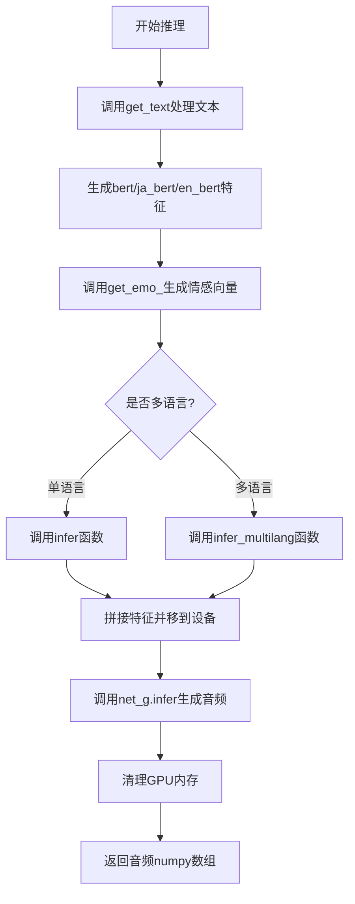
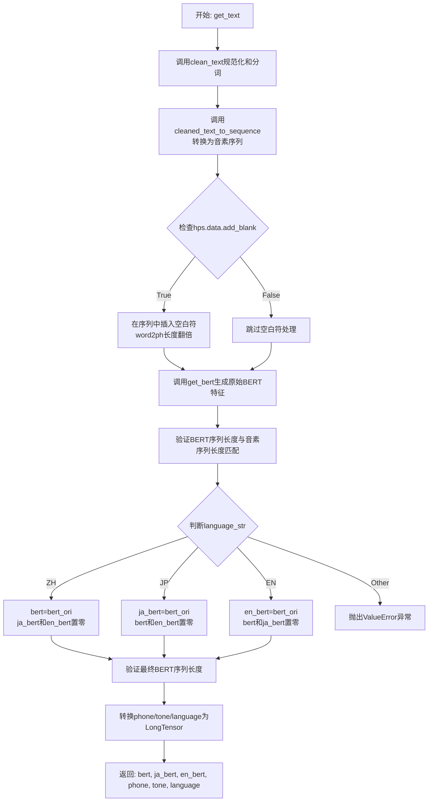
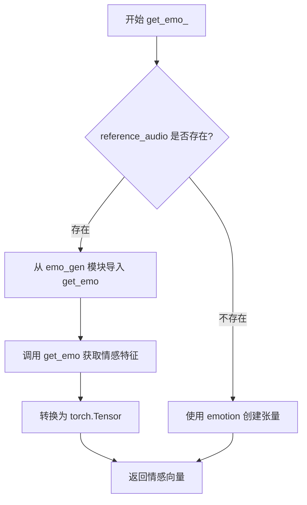
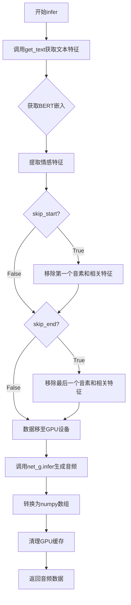
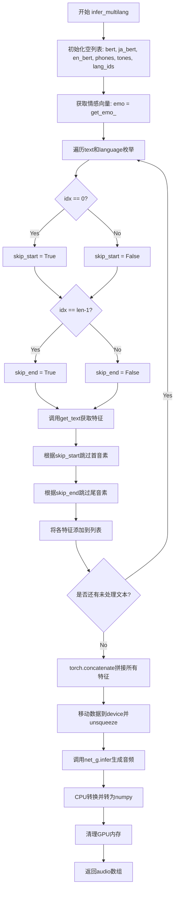

# `Bert-VITS2\oldVersion\V210\__init__.py` 详细设计文档

这是一个文本到语音(TTS)合成推理模块，支持中英日三种语言的语音合成，包含文本预处理、情感向量生成、多语言推理等功能，可通过风格文本和情感参考音频控制合成语音的风格和情感。

## 整体流程



## 类结构

```
inference.py (模块文件，无类定义)
├── 全局函数
│   ├── get_text
│   ├── get_emo_
│   ├── infer
│   └── infer_multilang
```

## 全局变量及字段


### `torch`
    
PyTorch深度学习框架模块，提供张量计算和神经网络构建功能

类型：`torch module`
    


### `commons`
    
通用工具模块，提供如intersperse等文本处理辅助函数

类型：`commons module`
    


### `cleaned_text_to_sequence`
    
将清洗后的文本（音素、音调、语言）转换为序列的函数

类型：`function`
    


### `get_bert`
    
根据文本、词到音素映射和语言获取BERT嵌入向量的函数

类型：`function`
    


### `clean_text`
    
对输入文本进行清洗处理的函数，返回规范化文本、音素序列、声调和词音素映射

类型：`function`
    


### `get_emo`
    
从参考音频中提取情感特征向量的函数

类型：`function`
    


    

## 全局函数及方法


### `get_text`

该函数是VITS语音合成模型中的文本前端处理核心函数，负责将输入文本转换为模型可用的多语言BERT嵌入、音素序列、语调序列和语言标识序列，支持中文、日语和英语三种语言的文本规范化、发音序列生成及BERT特征提取。

参数：

- `text`：`str`，待合成的原始文本输入
- `language_str`：`str`，目标语言代码，支持"ZH"（中文）、"JP"（日语）、"EN"（英语）
- `hps`：`object`，包含模型配置的超参数对象，需访问`hps.data.add_blank`和`hps.data.spk2id`
- `device`：`torch.device`，用于BERT模型计算的设备（CPU或CUDA）
- `style_text`：`str | None`，可选的风格文本参考，用于情感风格迁移
- `style_weight`：`float`，风格文本的影响权重，默认值为0.7

返回值：`tuple`，包含6个元素的元组：
- `bert`：`torch.Tensor`，维度(1024, phone_len)，主语言BERT特征
- `ja_bert`：`torch.Tensor`，维度(1024, phone_len)，日语BERT特征
- `en_bert`：`torch.Tensor`，维度(1024, phone_len)，英语BERT特征
- `phone`：`torch.LongTensor`，音素序列
- `tone`：`torch.LongTensor`，语调序列
- `language`：`torch.LongTensor`，语言标识序列

#### 流程图



#### 带注释源码

```python
def get_text(text, language_str, hps, device, style_text=None, style_weight=0.7):
    """
    将输入文本转换为多语言BERT嵌入及音素/语调/语言序列
    
    参数:
        text: 待合成的原始文本
        language_str: 语言代码 ("ZH"/"JP"/"EN")
        hps: 包含模型配置的超参数对象
        device: 计算设备
        style_text: 可选的风格文本参考
        style_weight: 风格权重因子
    返回:
        包含BERT特征和序列信息的元组
    """
    # 第一步：文本规范化 - 清理文本并获取词到音素的映射
    norm_text, phone, tone, word2ph = clean_text(text, language_str)
    
    # 第二步：将清理后的文本转换为音素序列、语调和语言ID
    phone, tone, language = cleaned_text_to_sequence(phone, tone, language_str)
    
    # 第三步：可选的空白符插入 - 用于提高音素边界的清晰度
    if hps.data.add_blank:
        # 使用0值在音素序列中插入空白位置
        phone = commons.intersperse(phone, 0)
        tone = commons.intersperse(tone, 0)
        language = commons.intersperse(language, 0)
        
        # 更新word2ph以匹配插入空白后的长度
        for i in range(len(word2ph)):
            word2ph[i] = word2ph[i] * 2
        word2ph[0] += 1  # 补偿首个位置
    
    # 第四步：生成BERT特征表示 - 支持多语言和风格控制
    bert_ori = get_bert(
        norm_text, word2ph, language_str, device, style_text, style_weight
    )
    del word2ph  # 释放中间变量内存
    
    # 验证BERT特征维度与音素序列长度一致
    assert bert_ori.shape[-1] == len(phone), phone
    
    # 第五步：根据目标语言分配BERT特征到对应槽位
    if language_str == "ZH":
        bert = bert_ori           # 中文使用提取的BERT特征
        ja_bert = torch.zeros(1024, len(phone))   # 日语槽位填充零
        en_bert = torch.zeros(1024, len(phone))    # 英语槽位填充零
    elif language_str == "JP":
        bert = torch.zeros(1024, len(phone))       # 中文槽位填充零
        ja_bert = bert_ori         # 日语使用提取的BERT特征
        en_bert = torch.zeros(1024, len(phone))    # 英语槽位填充零
    elif language_str == "EN":
        bert = torch.zeros(1024, len(phone))       # 中文槽位填充零
        ja_bert = torch.zeros(1024, len(phone))    # 日语槽位填充零
        en_bert = bert_ori         # 英语使用提取的BERT特征
    else:
        raise ValueError("language_str should be ZH, JP or EN")
    
    # 最终验证所有BERT张量维度一致
    assert bert.shape[-1] == len(
        phone
    ), f"Bert seq len {bert.shape[-1]} != {len(phone)}"
    
    # 第六步：转换为PyTorch张量并返回
    phone = torch.LongTensor(phone)
    tone = torch.LongTensor(tone)
    language = torch.LongTensor(language)
    return bert, ja_bert, en_bert, phone, tone, language
```


### `get_emo_`

该函数用于从参考音频中提取情感向量表示，若未提供参考音频则使用预设的情感标签。函数根据是否传入参考音频选择从外部模块 `emo_gen` 动态获取情感特征或直接使用给定的情感标签。

参数：

- `reference_audio`：音频数据（numpy 数组或 None），用于提取情感特征的参考音频输入，若为 None 则使用 emotion 参数
- `emotion`：整数或浮点数，当无参考音频时直接作为情感向量返回

返回值：`torch.Tensor`，一维情感向量张量，用于后续语音合成模型的情绪调节

#### 流程图



#### 带注释源码

```python
def get_emo_(reference_audio, emotion):
    """
    从参考音频提取情感向量，或使用预设的情感标签
    
    Args:
        reference_audio: 参考音频数据，numpy数组格式，若为None则使用emotion参数
        emotion: 情感标签值，当没有参考音频时直接作为情感向量返回
    
    Returns:
        torch.Tensor: 情感特征向量，用于语音合成模型的情绪控制
    """
    # 动态导入情感生成模块，避免循环依赖
    from .emo_gen import get_emo

    # 根据是否有参考音频选择处理方式
    emo = (
        # 如果提供了参考音频，调用get_emo函数提取情感特征并转为PyTorch张量
        torch.from_numpy(get_emo(reference_audio))
        # 如果没有参考音频，直接使用emotion参数构建单元素张量
        if reference_audio
        else torch.Tensor([emotion])
    )
    # 返回处理后的情感向量
    return emo
```


### `infer`

该函数是VITS文本转语音系统的核心推理函数，负责将输入文本转换为语音音频。它通过`get_text`获取文本的音素、语调和BERT嵌入，结合情感向量，最后调用生成器网络进行推理，输出numpy数组格式的音频波形。

参数：

- `text`：`str`，要合成语音的输入文本
- `sdp_ratio`：`float`，随机时长预测的比例，用于控制语音的韵律变化
- `noise_scale`：`float`，采样噪声尺度，影响音频生成的随机性
- `noise_scale_w`：`float`，波形生成噪声尺度，控制音频质量
- `length_scale`：`float`，长度缩放因子，用于调整语音速度（大于1较慢，小于1较快）
- `sid`：`str` 或 `int`，说话者ID，用于多说话人合成
- `language`：`str`，语言标识（"ZH"、"JP"或"EN"）
- `hps`：`object`，超参数配置对象，包含数据路径、说话人映射等配置
- `net_g`：`object`，生成器网络模型（VITS的生成器）
- `device`：`torch.device`，计算设备（CPU或CUDA）
- `reference_audio`：`str` 或 `path`，可选，参考音频路径，用于情感迁移
- `emotion`：`int` 或 `str`，可选，情感标签，当没有参考音频时使用
- `skip_start`：`bool`，是否跳过第一个音素（用于对齐调整）
- `skip_end`：`bool`，是否跳过最后一个音素（用于对齐调整）
- `style_text`：`str`，可选，风格文本，用于控制语调韵律
- `style_weight`：`float`，风格文本权重（默认0.7），值越大风格影响越强

返回值：`numpy.ndarray`，生成的音频波形数据

#### 流程图



#### 带注释源码

```python
def infer(
    text,                      # 输入文本字符串
    sdp_ratio,                 # 随机时长预测比例，控制韵律多样性
    noise_scale,               # 噪声尺度，控制音频变化程度
    noise_scale_w,             # 波形噪声尺度，控制音质
    length_scale,              # 长度缩放，调整语速
    sid,                       # 说话人ID
    language,                  # 语言：ZH/JP/EN
    hps,                       # 超参数配置对象
    net_g,                     # VITS生成器网络
    device,                    # 计算设备
    reference_audio=None,      # 参考音频路径（可选）
    emotion=None,              # 情感标签（可选）
    skip_start=False,          # 是否跳过起始音素
    skip_end=False,            # 是否跳过结束音素
    style_text=None,           # 风格文本（可选）
    style_weight=0.7,          # 风格权重
):
    # 步骤1：文本预处理，获取音素、语调、语言ID和BERT嵌入
    # get_text内部调用clean_text进行文本清洗，然后转换为音素序列
    # 根据language返回中文、日文、英文的BERT embeddings
    bert, ja_bert, en_bert, phones, tones, lang_ids = get_text(
        text, language, hps, device, style_text, style_weight
    )
    
    # 步骤2：获取情感向量
    # 如果提供了reference_audio，则从中提取情感特征
    # 否则使用emotion标签直接创建情感向量
    emo = get_emo_(reference_audio, emotion)
    
    # 步骤3：根据skip标记调整序列长度（用于对齐修正）
    # 移除第一个元素
    if skip_start:
        phones = phones[1:]
        tones = tones[1:]
        lang_ids = lang_ids[1:]
        bert = bert[:, 1:]
        ja_bert = ja_bert[:, 1:]
        en_bert = en_bert[:, 1:]
    
    # 移除最后一个元素
    if skip_end:
        phones = phones[:-1]
        tones = tones[:-1]
        lang_ids = lang_ids[:-1]
        bert = bert[:, :-1]
        ja_bert = ja_bert[:, :-1]
        en_bert = en_bert[:, :-1]
    
    # 步骤4：推理阶段，关闭梯度计算以节省显存
    with torch.no_grad():
        # 将数据移至指定设备并扩展维度以适配批量推理
        x_tst = phones.to(device).unsqueeze(0)           # 音素序列 [1, seq_len]
        tones = tones.to(device).unsqueeze(0)            # 语调序列 [1, seq_len]
        lang_ids = lang_ids.to(device).unsqueeze(0)      # 语言ID [1, seq_len]
        bert = bert.to(device).unsqueeze(0)               # BERT嵌入 [1, 1024, seq_len]
        ja_bert = ja_bert.to(device).unsqueeze(0)         # 日文BERT [1, 1024, seq_len]
        en_bert = en_bert.to(device).unsqueeze(0)         # 英文BERT [1, 1024, seq_len]
        
        # 序列长度用于mask
        x_tst_lengths = torch.LongTensor([phones.size(0)]).to(device)
        
        # 情感向量 [1, emo_dim]
        emo = emo.to(device).unsqueeze(0)
        
        # 释放原始phones变量以节省内存
        del phones
        
        # 说话人ID转换为张量
        speakers = torch.LongTensor([hps.data.spk2id[sid]]).to(device)
        
        # 调用生成器网络进行推理
        # 返回的形状为 [1, 1, audio_length]
        audio = (
            net_g.infer(
                x_tst,                # 音素
                x_tst_lengths,        # 序列长度
                speakers,             # 说话人
                tones,                # 语调
                lang_ids,             # 语言ID
                bert,                 # 中文BERT
                ja_bert,              # 日文BERT
                en_bert,              # 英文BERT
                emo,                  # 情感向量
                sdp_ratio=sdp_ratio,  # 随机时长预测比例
                noise_scale=noise_scale,       # 噪声尺度
                noise_scale_w=noise_scale_w,   # 波形噪声尺度
                length_scale=length_scale,     # 长度缩放
            )[0][0, 0]              # 提取音频数据 [audio_length]
            .data.cpu()             # 移至CPU
            .float()                 # 转换为Float32
            .numpy()                 # 转换为numpy数组
        )
        
        # 步骤5：清理GPU显存
        del x_tst, tones, lang_ids, bert, x_tst_lengths, speakers, ja_bert, en_bert, emo
        
        # 如果使用CUDA则清空缓存
        if torch.cuda.is_available():
            torch.cuda.empty_cache()
        
        # 返回生成的音频波形
        return audio
```


### `infer_multilang`

该函数是多语言文本到语音（TTS）推理的核心入口，接收多语言文本列表和对应语言列表，依次对每段文本进行文本预处理（包括文本清洗、音素转换、BERT特征提取），然后将所有文本段的特征拼接后送入神经网络生成器进行联合推理，最终输出合成音频。

参数：

- `text`：`List[str]`，输入的多语言文本列表，每个元素对应一段文本
- `sdp_ratio`：`float`，随机时长预测器的比例参数，控制语音合成的节奏随机性
- `noise_scale`：`float`，噪声规模参数，用于控制生成音频的噪声水平
- `noise_scale_w`：`float`，噪声规模w参数，用于控制噪声的宽度
- `length_scale`：`float`，长度缩放参数，用于调整输出语音的时长
- `sid`：`str`，说话人ID，用于选择特定的说话人声音
- `language`：`List[str]`，与text对应的语言代码列表，支持"ZH"、"JP"、"EN"
- `hps`：`object`，超参数配置对象，包含数据处理配置（如spk2id映射、add_blank等）
- `net_g`：`torch.nn.Module`，神经网络生成器模型，负责最终音频合成
- `device`：`torch.device`，计算设备（CPU或CUDA设备）
- `reference_audio`：`Optional[str]`，参考音频路径，用于情感克隆（可选）
- `emotion`：`Optional[int]`，情感标签，当无参考音频时使用（可选）
- `skip_start`：`bool`，是否跳过每段文本的第一个音素（用于句段拼接时的过渡）
- `skip_end`：`bool`，是否跳过每段文本的最后一个音素（用于句段拼接时的过渡）

返回值：`numpy.ndarray`，合成的音频数据，以float32格式存储

#### 流程图



#### 带注释源码

```python
def infer_multilang(
    text,                      # List[str]: 多语言文本列表，如["你好", "Hello"]
    sdp_ratio,                 # float: 随机时长预测比例，控制语音节奏变化
    noise_scale,               # float: 噪声规模，控制音频生成噪声水平
    noise_scale_w,             # float: 噪声宽度参数，控制噪声分布
    length_scale,              # float: 长度缩放因子，调整输出语音时长
    sid,                       # str: 说话人ID，用于声音克隆
    language,                  # List[str]: 语言代码列表["ZH", "EN"]
    hps,                       # object: 超参数配置对象
    net_g,                     # torch.nn.Module: 神经网络生成器
    device,                    # torch.device: 计算设备
    reference_audio=None,      # Optional[str]: 参考音频路径，用于情感克隆
    emotion=None,              # Optional[int]: 情感标签
    skip_start=False,          # bool: 是否跳过首音素
    skip_end=False,            # bool: 是否跳过尾音素
):
    # 1. 初始化各语言特征的空列表，用于收集每段文本的处理结果
    bert, ja_bert, en_bert, phones, tones, lang_ids = [], [], [], [], [], []
    
    # 2. 获取情感向量，根据reference_audio是否存在决定是提取还是使用标签
    emo = get_emo_(reference_audio, emotion)
    
    # 3. 遍历每段文本和对应语言，进行单独处理
    for idx, (txt, lang) in enumerate(zip(text, language)):
        # 4. 确定当前段是否需要跳过首尾音素
        # 首段不跳过起始位置除非显式指定skip_start，非首段需要跳过以保证连贯
        skip_start = (idx != 0) or (skip_start and idx == 0)
        # 尾段不跳过结束位置除非显式指定skip_end，非尾段需要跳过以保证连贯
        skip_end = (idx != len(text) - 1) or (skip_end and idx == len(text) - 1)
        
        # 5. 调用get_text进行文本预处理：清洗、转换为音素序列、提取BERT特征
        (
            temp_bert,         # 中文BERT特征 [1024, phone_len]
            temp_ja_bert,      # 日文BERT特征
            temp_en_bert,      # 英文BERT特征
            temp_phones,       # 音素序列
            temp_tones,        # 音调序列
            temp_lang_ids,    # 语言ID序列
        ) = get_text(txt, lang, hps, device)
        
        # 6. 如果需要跳过起始位置，则截断各特征的的第一个时间步
        if skip_start:
            temp_bert = temp_bert[:, 1:]
            temp_ja_bert = temp_ja_bert[:, 1:]
            temp_en_bert = temp_en_bert[:, 1:]
            temp_phones = temp_phones[1:]
            temp_tones = temp_tones[1:]
            temp_lang_ids = temp_lang_ids[1:]
        
        # 7. 如果需要跳过结束位置，则截断各特征的最后一个时间步
        if skip_end:
            temp_bert = temp_bert[:, :-1]
            temp_ja_bert = temp_ja_bert[:, :-1]
            temp_en_bert = temp_en_bert[:, :-1]
            temp_phones = temp_phones[:-1]
            temp_tones = temp_tones[:-1]
            temp_lang_ids = temp_lang_ids[:-1]
        
        # 8. 将当前文本段的特征追加到列表中
        bert.append(temp_bert)
        ja_bert.append(temp_ja_bert)
        en_bert.append(temp_en_bert)
        phones.append(temp_phones)
        tones.append(temp_tones)
        lang_ids.append(temp_lang_ids)
    
    # 9. 使用torch.concatenate将所有文本段的特征在相应维度上拼接
    # BERT特征在序列维度(dim=1)拼接，音素等在(dim=0)拼接
    bert = torch.concatenate(bert, dim=1)
    ja_bert = torch.concatenate(ja_bert, dim=1)
    en_bert = torch.concatenate(en_bert, dim=1)
    phones = torch.concatenate(phones, dim=0)
    tones = torch.concatenate(tones, dim=0)
    lang_ids = torch.concatenate(lang_ids, dim=0)
    
    # 10. 进入推理阶段，使用torch.no_grad()禁用梯度计算以节省显存
    with torch.no_grad():
        # 11. 将所有张量移动到指定设备并增加batch维度(unsqueeze)
        x_tst = phones.to(device).unsqueeze(0)        # [1, total_phones]
        tones = tones.to(device).unsqueeze(0)          # [1, total_phones]
        lang_ids = lang_ids.to(device).unsqueeze(0)   # [1, total_phones]
        bert = bert.to(device).unsqueeze(0)            # [1, 1024, total_phones]
        ja_bert = ja_bert.to(device).unsqueeze(0)      # [1, 1024, total_phones]
        en_bert = en_bert.to(device).unsqueeze(0)      # [1, 1024, total_phones]
        emo = emo.to(device).unsqueeze(0)              # [1, emo_dim]
        
        # 12. 构建输入长度张量
        x_tst_lengths = torch.LongTensor([phones.size(0)]).to(device)
        
        # 13. 释放phones变量，节省内存
        del phones
        
        # 14. 构建说话人ID张量
        speakers = torch.LongTensor([hps.data.spk2id[sid]]).to(device)
        
        # 15. 调用神经网络生成器的infer方法进行音频合成
        audio = (
            net_g.infer(
                x_tst,           # 音素序列
                x_tst_lengths,  # 序列长度
                speakers,       # 说话人ID
                tones,          # 音调
                lang_ids,       # 语言ID
                bert,           # 中文BERT
                ja_bert,        # 日文BERT
                en_bert,        # 英文BERT
                emo,            # 情感向量
                sdp_ratio=sdp_ratio,
                noise_scale=noise_scale,
                noise_scale_w=noise_scale_w,
                length_scale=length_scale,
            )[0][0, 0]          # 提取输出音频张量 [audio_len]
            .data.cpu()         # 移至CPU
            .float()            # 转为Float32
            .numpy()            # 转为NumPy数组
        )
        
        # 16. 清理推理过程中使用的中间张量，释放显存
        del x_tst, tones, lang_ids, bert, x_tst_lengths, speakers, ja_bert, en_bert, emo
        
        # 17. 如果使用CUDA，清空CUDA缓存
        if torch.cuda.is_available():
            torch.cuda.empty_cache()
        
        # 18. 返回合成的音频数据
        return audio
```

## 关键组件


### 文本处理与phoneme转换

负责将输入文本清洗、转换为音素序列、音调序列和词素到音素的映射关系，并支持添加空白符进行韵律调节

### BERT嵌入生成

根据文本内容和语言生成对应的BERT上下文嵌入向量，支持中文、日文、英文三种语言，并为多语言模型提供分别的BERT输入通道

### 情感嵌入生成

从参考音频中提取情感特征向量，或使用预定义的情感标签，兼容emo_gen模块的情感生成功能

### 单语言推理引擎

整合文本嵌入、情感嵌入、说话人ID等输入，调用神经网络生成器进行推理，支持跳过起始/结束标记的灵活控制

### 多语言推理引擎

支持批量处理多种语言的文本输入，自动处理语言边界处的序列拼接与标记跳过逻辑，实现跨语言平滑过渡

### 设备管理与内存优化

自动处理CPU/GPU设备转移，包含推理后显式内存释放与CUDA缓存清理，防止显存泄漏

### 张量索引与惰性加载

通过动态切片实现skip_start和skip_end的序列裁剪，支持在多语言模式下对每段文本独立控制标记跳过

### 量化策略与精度控制

提供noise_scale、noise_scale_w和length_scale等参数控制生成多样性、噪声水平和语速，支持灵活的推理质量调节


## 问题及建议


### 已知问题

-   **代码重复**：infer 和 infer_multilang 函数存在大量重复代码，包括张量设备转移、推理调用和内存清理逻辑，增加维护成本
-   **异常处理不足**：多处使用 assert 进行条件检查，部署环境下会被优化掉，应使用显式异常抛出
-   **魔法数字和硬编码值**：BERT 维度 1024、默认 style_weight=0.7 等硬编码值散落各处，缺乏配置管理
-   **类型注解缺失**：所有函数均无类型提示，降低代码可读性和 IDE 支持
-   **文档字符串缺失**：核心函数无文档说明参数含义和返回值
-   **设备管理不一致**：多处使用 .to(device) 和 torch.cuda.empty_cache()，未统一封装设备管理逻辑
-   **条件导入**：get_emo_ 函数内部导入 emo_gen 模块，影响启动性能和代码可测试性
-   **变量命名冗余**：bert_ori/ja_bert/en_bert 等变量命名过长且不一致
-   **张量创建方式不一致**：部分使用 torch.LongTensor()，部分使用 torch.tensor()
-   **skip_start/skip_end 逻辑在 infer_multilang 中被错误覆盖**：循环内部重新赋值会导致原始参数失效

### 优化建议

-   **抽取公共逻辑**：将设备转移、推理调用、内存清理等公共逻辑封装为独立函数或使用模板方法模式
-   **添加类型注解**：为所有函数参数和返回值添加 Python 类型提示
-   **统一异常处理**：将 assert 替换为 raise ValueError/TypeError，并在关键路径添加 try-except
-   **配置外部化**：将 1024、BERT 维度、默认权重等抽取为配置类或从 hps 统一读取
-   **添加文档字符串**：使用 Google/NumPy 风格为每个函数编写完整文档
-   **设备管理封装**：创建 DeviceManager 类统一处理 CPU/GPU 切换和显存清理
-   **模块级导入**：将 emo_gen 移至文件顶部导入，配合延迟加载机制
-   **统一张量创建**：统一使用 torch.tensor() 或 torch.as_tensor()
-   **修复参数覆盖问题**：infer_multilang 中应为局部变量使用不同名称或重构逻辑
-   **添加日志记录**：替换部分 print 为 logging 模块，便于生产环境调试


## 其它


### 设计目标与约束

本模块旨在为VITS语音合成模型提供推理接口，支持中英日三种语言的文本到语音转换，并兼容v2.1版本。设计约束包括：设备必须支持CUDA（用于GPU加速推理），输入文本语言必须为ZH/JP/EN之一，参考音频和情感标签二选一提供，样式文本权重默认为0.7。

### 错误处理与异常设计

代码中的异常处理主要包括：1)语言参数验证，当language_str不为ZH/JP/EN时抛出ValueError；2)BERT序列长度一致性检查，使用assert确保bert_ori的序列长度与phone长度匹配；3)GPU内存管理，在推理完成后显式调用torch.cuda.empty_cache()释放显存。潜在未处理异常包括：net_g.infer()调用失败、get_emo()返回异常、样式文本处理异常等。

### 数据流与状态机

单文本推理流程：输入文本→文本清洗(normalize)→音素序列转换→BERT嵌入生成→情感向量获取→序列裁剪(skip_start/skip_end)→模型推理→音频张量转numpy输出。多语言推理流程：遍历各语言文本分段→分别获取各语言特征→特征拼接→统一推理→输出拼接音频。

### 外部依赖与接口契约

主要外部依赖包括：1)commons模块的intersperse函数用于插入空白符；2).text.cleaned_text_to_sequence和.get_bert用于文本处理和BERT特征提取；3).text.cleaner.clean_text用于文本规范化；4).emo_gen.get_emo用于情感特征提取；5)torch和net_g(VITS生成器模型)。接口契约要求hps包含data.add_blank和spk2id配置，net_g.infer返回音频张量，device需为torch.device对象。

### 性能考虑与优化建议

1)使用torch.no_inference()减少推理时的梯度计算开销；2)及时删除不再使用的大张量(phones/bert等)并手动触发GPU缓存清理；3)多语言推理中分段处理可能导致内存碎片化，建议预先分配张量空间；4)infer_multilang中循环内的skip_start/skip_end逻辑判断可优化；5)可考虑将CPU到GPU的数据迁移合并以减少同步开销。

### 配置参数说明

关键参数包括：sdp_ratio(decoder采样比例0-1)、noise_scale和noise_scale_w(噪声控制参数)、length_scale(语速控制)、sid(说话人ID)、style_weight(样式权重0-1)。skip_start和skip_end用于裁剪序列首尾帧以避免边界伪影。

### 边界条件处理

代码处理的边界条件包括：1)word2ph在add_blank时需同步扩展并调整首元素；2)多语言推理时首段和末段分别处理skip标记；3)当reference_audio为None时使用emotion数值直接构造张量；4)空文本或纯空白文本可能产生异常需上游验证。

### 版本兼容性说明

该模块明确标注为v2.1版本兼容，主要优化包括：多语言支持(ZH/JP/EN)、情感生成(emo_gen模块)、BERT特征处理(分离为bert/ja_bert/en_bert三路)。代码通过判断语言类型动态分配BERT特征到不同通道实现版本兼容。
    