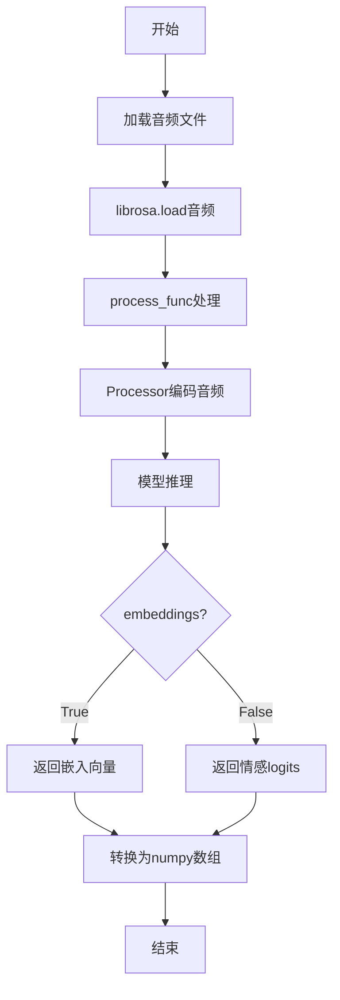
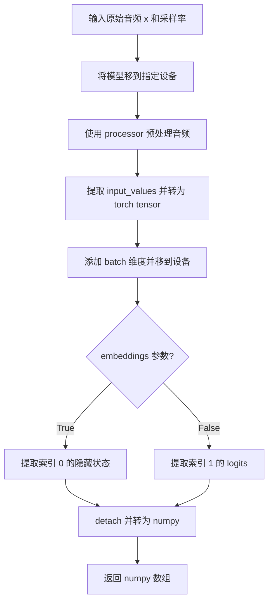
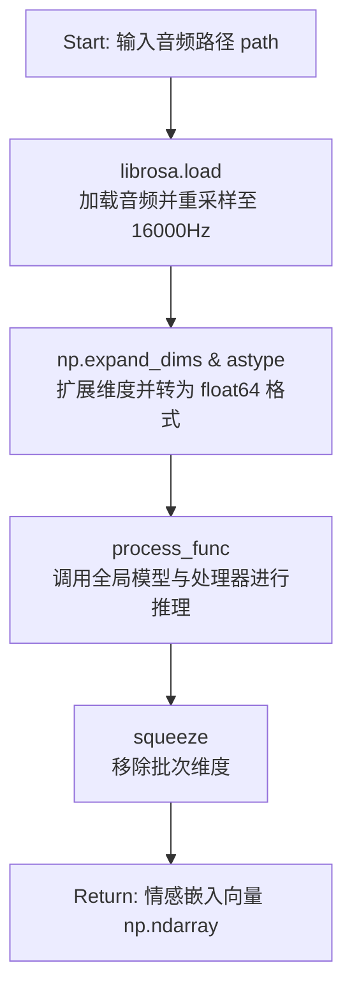
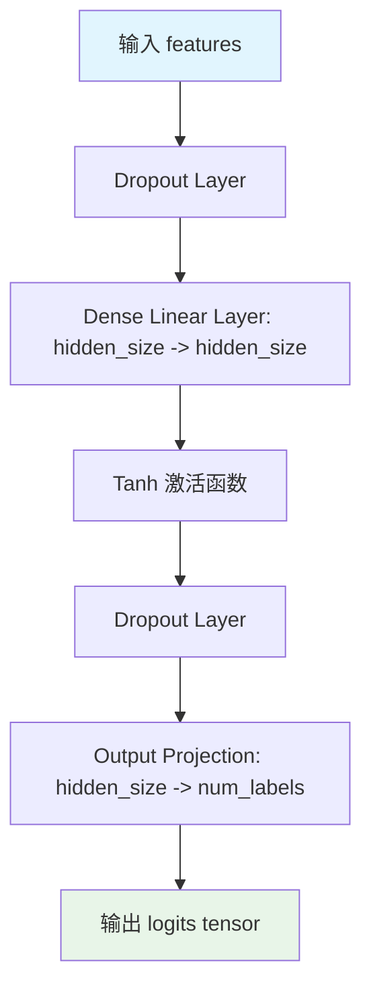
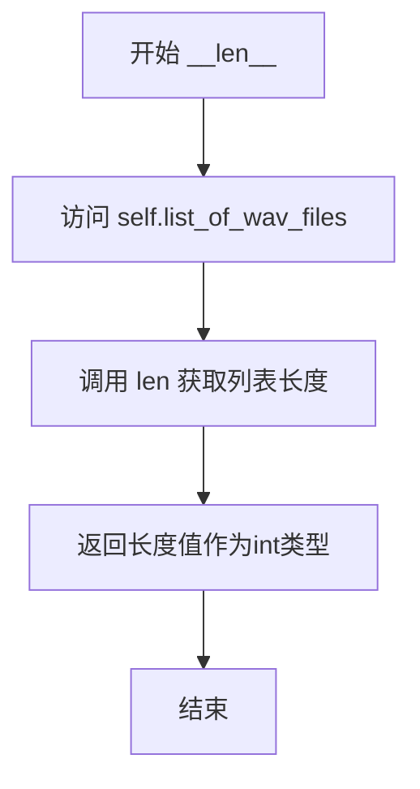

# `Bert-VITS2\oldVersion\V210\emo_gen.py` 详细设计文档

基于Wav2Vec2的语音情感分类系统，支持从原始音频信号中提取情感嵌入向量或预测情感标签，包含模型定义、数据集加载和推理流程。

## 整体流程



## 类结构

```
nn.Module (PyTorch基类)
├── RegressionHead
│   └── 用于情感分类的全连接层
└── Wav2Vec2PreTrainedModel (HuggingFace)
    └── EmotionModel (语音情感分类器)

Dataset (PyTorch)
└── AudioDataset (音频数据集)
```

## 全局变量及字段


### `device`
    
计算设备 (GPU/CPU)

类型：`str`
    


### `model_name`
    
预训练模型路径

类型：`str`
    


### `processor`
    
音频预处理器

类型：`Wav2Vec2Processor`
    


### `model`
    
情感分类模型实例

类型：`EmotionModel`
    


### `RegressionHead.dense`
    
第一个全连接层

类型：`nn.Linear`
    


### `RegressionHead.dropout`
    
Dropout层

类型：`nn.Dropout`
    


### `RegressionHead.out_proj`
    
输出投影层

类型：`nn.Linear`
    


### `EmotionModel.config`
    
模型配置

类型：`Config`
    


### `EmotionModel.wav2vec2`
    
Wav2Vec2编码器

类型：`Wav2Vec2Model`
    


### `EmotionModel.classifier`
    
分类头

类型：`RegressionHead`
    


### `AudioDataset.list_of_wav_files`
    
WAV文件路径列表

类型：`list`
    


### `AudioDataset.processor`
    
音频处理器

类型：`WavVec2Processor`
    


### `AudioDataset.sr`
    
采样率

类型：`int`
    
    

## 全局函数及方法


### `process_func`

从原始音频信号中预测情绪或提取嵌入向量的音频推理函数。

参数：

- `x`：`np.ndarray`，原始音频信号数组
- `sampling_rate`：`int`，音频采样率
- `model`：`EmotionModel`，Wav2Vec2情感分类模型实例
- `processor`：`Wav2Vec2Processor`，音频预处理器
- `device`：`str`，计算设备（如"cuda"或"cpu"）
- `embeddings`：`bool`，是否提取嵌入向量而非情绪logits（默认为False）

返回值：`np.ndarray`，模型输出结果（embeddings=True时为嵌入向量，否则为情绪预测logits）

#### 流程图



#### 带注释源码

```python
def process_func(
    x: np.ndarray,
    sampling_rate: int,
    model: EmotionModel,
    processor: Wav2Vec2Processor,
    device: str,
    embeddings: bool = False,
) -> np.ndarray:
    r"""Predict emotions or extract embeddings from raw audio signal."""
    # 确保模型在正确的设备上运行
    model = model.to(device)
    
    # 使用 Wav2Vec2Processor 对原始音频进行预处理
    # 返回包含 input_values 的字典
    y = processor(x, sampling_rate=sampling_rate)
    
    # 提取预处理后的 input_values（第一个元素）
    y = y["input_values"][0]
    
    # 将 numpy 数组转换为 PyTorch tensor
    # 添加 batch 维度（unsqueeze(0)）以适配模型输入要求
    # 移到指定计算设备
    y = torch.from_numpy(y).unsqueeze(0).to(device)

    # 禁用梯度计算以提高推理效率
    with torch.no_grad():
        # 模型前向传播
        # 返回 (hidden_states, logits) 元组
        # 根据 embeddings 参数选择输出：
        #   - True: 返回隐藏状态（嵌入向量）
        #   - False: 返回分类 logits
        y = model(y)[0 if embeddings else 1]

    # 将 PyTorch tensor 转换为 numpy 数组
    # 先 detach 脱离计算图，再移到 CPU，最后转为 numpy
    y = y.detach().cpu().numpy()

    return y
```


### `get_emo`

该函数是情感识别流水线的入口封装，接收音频文件路径，加载音频数据并进行预处理，随后调用底层的`process_func`执行模型推理，最终返回音频的情感嵌入向量（Embedding）。

参数：
-  `path`：`str`，要处理的音频文件路径（例如 .wav 文件）。

返回值：`np.ndarray`，提取得到的情感嵌入向量，通常为一个一维的 NumPy 数组。

#### 流程图



#### 带注释源码

```python
def get_emo(path):
    """
    获取指定音频文件的情感嵌入向量。

    参数:
        path (str): 音频文件的路径。

    返回:
        np.ndarray: 情感嵌入向量。
    """
    # 1. 使用 librosa 加载音频，默认采样率为 16000Hz
    # 返回原始波形数据 wav 和采样率 sr
    wav, sr = librosa.load(path, 16000)
    
    # 2. 调用处理函数进行预处理和模型推理
    # 参数 embeddings=True 指定输出为嵌入向量（hidden states）而非分类 logits
    return process_func(
        # 扩展维度：将 (n,) 变为 (1, n)，因为模型期望批量输入
        np.expand_dims(wav, 0).astype(np.float64),
        sr,
        model,
        processor,
        device,
        embeddings=True,
    ).squeeze(0) # 移除批次维度 (1, hidden_size) -> (hidden_size)
```


### RegressionHead.forward

该方法实现了回归/分类头的前向传播过程，将Wav2Vec2模型提取的隐藏状态特征通过全连接层、非线性激活函数和Dropout处理，最终输出分类logits。

参数：
- `features`：`torch.Tensor`，输入的特征向量，通常为Wav2Vec2模型提取的隐藏状态（hidden states），形状为 `(batch_size, hidden_size)`
- `**kwargs`：`Any`，可选的关键字参数，用于兼容接口或传递额外配置（当前实现中未直接使用）

返回值：`torch.Tensor`，经过全连接层变换后的输出张量，形状为 `(batch_size, num_labels)`，其中 `num_labels` 为分类标签数量

#### 流程图



#### 带注释源码

```python
def forward(self, features, **kwargs):
    r"""前向传播方法，将特征向量映射到分类logits。
    
    该方法实现了一个典型的前馈神经网络分类头，包含两次Dropout正则化、
    一次全连接层变换以及Tanh非线性激活。
    
    Args:
        features (torch.Tensor): 输入特征张量，形状为 (batch_size, hidden_size)
            通常来自Wav2Vec2模型的隐藏状态输出
        **kwargs: 额外关键字参数，用于接口兼容性
    
    Returns:
        torch.Tensor: 分类logits，形状为 (batch_size, num_labels)
    """
    # 获取输入特征
    x = features
    
    # 第一次Dropout正则化，防止过拟合
    x = self.dropout(x)
    
    # 全连接层：将特征从hidden_size映射到hidden_size
    # dense: nn.Linear(config.hidden_size, config.hidden_size)
    x = self.dense(x)
    
    # Tanh非线性激活函数，引入非线性变换
    x = torch.tanh(x)
    
    # 第二次Dropout正则化，进一步防止过拟合
    x = self.dropout(x)
    
    # 输出投影层：将特征从hidden_size映射到num_labels（分类数量）
    # out_proj: nn.Linear(config.hidden_size, config.num_labels)
    x = self.out_proj(x)
    
    # 返回分类logits
    return x
```

---

### 类详细信息：RegressionHead

**所属文件**: 完整的模型定义文件（包含EmotionModel等类）

**类描述**: 
`RegressionHead` 是基于Wav2Vec2的语音情感分类模型的输出头模块，继承自PyTorch的`nn.Module`。该类实现了从隐藏状态到分类标签的映射逻辑，是整个情感分类模型的核心组成部分。

#### 类字段

| 字段名称 | 类型 | 描述 |
|---------|------|------|
| `dense` | `nn.Linear` | 第一全连接层，将hidden_size映射到hidden_size的特征变换层 |
| `dropout` | `nn.Dropout` | Dropout正则化层，用于防止过拟合 |
| `out_proj` | `nn.Linear` | 输出投影层，将hidden_size映射到num_labels的分类层 |

#### 类方法

| 方法名称 | 描述 |
|---------|------|
| `__init__(self, config)` | 初始化方法，构建分类头的网络结构 |
| `forward(self, features, **kwargs)` | 前向传播方法，执行特征到logits的变换 |

---

### 关键组件信息

| 组件名称 | 描述 |
|---------|------|
| `EmotionModel` | 基于Wav2Vec2的语音情感分类模型，封装了特征提取和分类逻辑 |
| `AudioDataset` | PyTorch数据集类，负责加载和预处理音频文件 |
| `process_func` | 音频推理函数，封装了模型调用和结果处理流程 |
| `get_emo` | 情感嵌入提取函数，调用process_func获取情感特征向量 |

---

### 潜在的技术债务或优化空间

1. **forward方法签名不够严格**: 使用`**kwargs`但未实际利用，可考虑移除或明确参数定义
2. **Tanh激活函数选择**: 经典的Tanh激活在现代架构中常被ReLU/GELU替代，可考虑性能优化
3. **Dropout位置**: 两次相同的dropout配置，可提取为可配置参数
4. **缺乏Layer Normalization**: 分类头中未使用LayerNorm，可能影响训练稳定性
5. **代码注释与文档**: 类注释错误（"Classification head"应为"Regression head"）

---

### 其它项目

#### 设计目标与约束
- **设计目标**: 将Wav2Vec2提取的高维隐藏特征映射为低维分类logits
- **约束**: 必须与Wav2Vec2PreTrainedModel接口兼容

#### 错误处理与异常设计
- 当前实现无显式错误处理，依赖PyTorch自动求导系统的异常抛出
- 建议添加输入形状验证

#### 数据流与状态机
```
输入特征(features) 
  → Dropout → Dense → Tanh → Dropout → Out_Proj 
    → 输出logits
```

#### 外部依赖与接口契约
- 依赖PyTorch nn.Module框架
- 输入features必须为torch.Tensor类型
- 输出logits的num_labels由config.num_labels决定


### EmotionModel.__init__(config)

该方法是 Speech emotion classifier（情感分类模型）的构造函数，负责初始化模型结构，包括加载预训练的 Wav2Vec2 编码器和用于情感回归的分类头，并完成权重的初始化。

参数：

- `config`：`PretrainedConfig`（或类似配置对象），包含模型的超参数配置，如 `hidden_size`（隐藏层维度）、`num_labels`（标签数量）、`final_dropout`（Dropout 比率）等，用于初始化 Wav2Vec2 模型和回归分类器头。

返回值：`None`，无返回值（构造函数）。

#### 流程图

```mermaid
flowchart TD
    A[开始 __init__] --> B[调用父类构造函数 super().__init__config]
    B --> C[保存 config 到 self.config]
    D[初始化 Wav2Vec2Model] --> E[加载 self.wav2vec2]
    E --> F[初始化 RegressionHead]
    F --> G[创建 self.classifier]
    G --> H[调用 self.init_weights 初始化权重]
    H --> I[结束 __init__]
    
    style A fill:#f9f,color:#000
    style I fill:#9f9,color:#000
```

#### 带注释源码

```python
def __init__(self, config):
    r"""Speech emotion classifier 初始化方法。
    
    初始化情感分类模型，加载预训练的 Wav2Vec2 编码器，
    并配置用于情感回归的分类头。
    
    参数:
        config: 模型配置对象，包含 hidden_size, num_labels, final_dropout 等参数
    """
    # 调用父类 Wav2Vec2PreTrainedModel 的初始化方法
    # 负责加载配置和初始化基础模型架构
    super().__init__(config)

    # 保存配置对象到实例属性，供后续方法使用
    self.config = config
    
    # 初始化 Wav2Vec2 编码器模型
    # 负责将原始音频特征编码为隐藏状态表示
    self.wav2vec2 = Wav2Vec2Model(config)
    
    # 初始化情感回归分类头
    # 包含一个全连接层、Dropout 层和输出投影层
    self.classifier = RegressionHead(config)
    
    # 调用父类的权重初始化方法
    # 根据配置对模型参数进行初始化（如权重归零、 Xavier 初始化等）
    self.init_weights()
```


### `EmotionModel.forward`

该方法是情感分类模型的前向传播核心实现，接收原始音频特征输入，通过Wav2Vec2编码器提取语音表示，再经回归头生成情感分类logits，同时返回隐藏状态用于特征嵌入提取。

#### 参数

- `input_values`：`torch.Tensor`，原始音频经过处理器预处理后的输入张量，通常形状为 `(batch_size, seq_length)`，包含Wav2Vec2模型所需的音频特征序列。

#### 返回值

`tuple[torch.Tensor, torch.Tensor]`，返回两个张量组成的元组：
- `hidden_states`：`torch.Tensor`，Wav2Vec2模型输出的隐藏状态序列经过时间维度平均池化后的表示，形状为 `(batch_size, hidden_size)`，可用于情感特征嵌入提取。
- `logits`：`torch.Tensor`，回归分类头的输出，形状为 `(batch_size, num_labels)`，表示各类别的原始预测分数，可进一步用于Softmax得到情感概率分布。

#### 流程图

```mermaid
flowchart TD
    A[input_values 输入] --> B[调用 self.wav2vec2.forward]
    B --> C[outputs 元组输出]
    C --> D[提取 hidden_states = outputs[0]]
    D --> E[torch.mean 池化]
    E --> F[调用 self.classifier.forward]
    F --> G[输出 logits]
    E --> H[返回 hidden_states]
    G --> H
```

#### 带注释源码

```python
def forward(
    self,
    input_values,  # torch.Tensor: 预处理后的音频输入，形状为 (batch, time)
):
    """
    前向传播：编码音频并生成分类logits
    
    Args:
        input_values: Wav2Vec2处理器输出的浮点张量
        
    Returns:
        tuple: (hidden_states, logits) 隐藏状态和情感分类logits
    """
    # Step 1: 将输入传入Wav2Vec2编码器
    # outputs是一个元组，第一个元素是最后一层的隐藏状态序列
    # 形状: (batch, seq_len, hidden_size)
    outputs = self.wav2vec2(input_values)
    
    # Step 2: 从输出元组中提取隐藏状态序列
    # outputs[0] 是最后一层Transformer的输出，形状为 (batch, time, hidden_size)
    hidden_states = outputs[0]
    
    # Step 3: 对时间维度进行平均池化，将变长序列压缩为固定维度向量
    # 形状变换: (batch, seq_len, hidden_size) -> (batch, hidden_size)
    # 这样可以得到一个能代表整个音频片段的全局特征表示
    hidden_states = torch.mean(hidden_states, dim=1)
    
    # Step 4: 将池化后的特征传入回归分类头
    # 分类头包含: Linear -> Dropout -> Tanh -> Dropout -> Linear
    # 输出形状: (batch, num_labels) 即各类别的logits
    logits = self.classifier(hidden_states)
    
    # Step 5: 返回隐藏状态和logits
    # hidden_states 可用于特征提取/嵌入层
    # logits 可用于计算情感分类损失或通过softmax得到概率
    return hidden_states, logits
```


### `AudioDataset.__len__`

该方法为Python数据集类的魔术方法，用于返回音频数据集的样本数量，使数据集可以通过len()函数获取其大小。

参数：
- `self`：隐式参数，AudioDataset实例本身，不需要显式传递

返回值：`int`，返回数据集中音频文件列表的长度，即数据集包含的样本总数

#### 流程图



#### 带注释源码

```python
def __len__(self):
    r"""返回数据集的样本数量。
    
    这是Python的魔术方法__len__，使得Dataset对象可以配合
    torch.utils.data.DataLoader使用，实现批量数据加载功能。
    
    Returns:
        int: 数据集中音频文件列表的长度，即样本总数
    """
    return len(self.list_of_wav_files)
```


### `AudioDataset.__getitem__`

该方法根据给定的索引从音频文件列表中加载并处理单个音频样本，将其转换为模型可用的PyTorch张量格式。

参数：

- `idx`：`int`，数据集的索引，用于从音频文件列表中获取对应的音频文件路径

返回值：`torch.Tensor`，处理后的音频样本数据，包含模型所需的input_values

#### 流程图

```mermaid
flowchart TD
    A[开始 __getitem__] --> B[根据 idx 从 list_of_wav_files 获取文件路径]
    B --> C[librosa.load 加载音频文件<br/>参数: wav_file, sr]
    C --> D[processor 处理音频数据<br/>参数: audio_data, sampling_rate]
    D --> E[提取 input_values[0]]
    E --> F[torch.from_numpy 转换为 Tensor]
    F --> G[返回处理后的音频 Tensor]
```

#### 带注释源码

```python
def __getitem__(self, idx):
    # 根据索引从音频文件列表中获取对应的文件路径
    wav_file = self.list_of_wav_files[idx]
    
    # 使用 librosa 库加载音频文件
    # 返回: audio_data (音频数据数组), _ (采样率，忽略因为已指定self.sr)
    audio_data, _ = librosa.load(wav_file, sr=self.sr)
    
    # 使用预处理器处理音频数据
    # processor 会将原始音频转换为模型所需的输入格式
    # 提取 "input_values" 键的第一个元素
    processed_data = self.processor(audio_data, sampling_rate=self.sr)[
        "input_values"
    ][0]
    
    # 将处理后的 numpy 数组转换为 PyTorch Tensor 并返回
    return torch.from_numpy(processed_data)
```


## 关键组件


### RegressionHead

情感分类的线性层头，负责将隐藏状态映射到情感标签空间。包含全连接层、Dropout层和输出投影层。

### EmotionModel

基于Wav2Vec2的语音情感分类模型，继承自Wav2Vec2PreTrainedModel。整合了预训练的Wav2Vec2编码器和自定义分类器头，支持情感分类和嵌入提取两种模式。

### AudioDataset

PyTorch数据集类，负责加载和处理音频文件。采用惰性加载机制，在`__getitem__`方法中按需读取和预处理音频数据，包含音频采样率处理和特征提取。

### process_func

核心推理函数，将原始音频信号转换为情感预测或嵌入向量。内部包含模型推理流程：音频预处理→张量转换→模型前向传播→结果转换。关键设计点在于灵活返回隐藏状态（embeddings=True）或logits（embeddings=False）。

### get_emotion_embedding

全局推理封装函数，简化情感嵌入提取流程。自动处理音频加载、维度扩展和结果压缩，提供简洁的API接口。

### 全局模型与处理器

包含预训练模型（EmotionModel）、特征处理器（Wav2Vec2Processor）和计算设备配置。模型从本地路径加载，支持GPU/CPU推理。

### 配置管理

通过config模块统一管理设备选择等配置项，实现配置与代码的解耦。


## 问题及建议


### 已知问题

- **全局模型加载导致启动开销**：模型和processor在模块导入时就被加载，如果不需要使用该模块的功能，也会造成不必要的资源消耗，且不利于单元测试
- **设备管理冗余**：模型在模块级别已经执行 `.to(device)`，但 `process_func` 中每次调用仍会执行 `model.to(device)`，造成重复操作
- **数据集每次重新加载音频**：`AudioDataset.__getitem__` 中每次都调用 `librosa.load` 读取原始音频文件，训练时IO开销巨大，应预处理并缓存
- **类型注解不完整**：部分方法如 `RegressionHead.forward()`、`AudioDataset.__getitem__()` 缺少返回类型注解
- **硬编码配置**：`model_name` 直接硬编码在代码中，未从 `config` 读取，违背了配置与代码分离的原则
- **错误处理缺失**：文件读取（`librosa.load`）没有异常捕获，文件不存在或损坏时会导致程序直接崩溃
- **不必要的类型转换**：`get_emo` 中使用 `np.float64` 且在 `process_func` 中又进行 numpy 到 tensor 的转换，可能引入额外的类型开销
- **函数注释错误**：`RegressionHead` 类的 docstring 写的是 "Classification head" 但实际是用于回归任务

### 优化建议

- **延迟加载模型**：将模型和processor的初始化改为按需加载或使用单例模式，或提供显式的初始化函数
- **移除冗余设备转移**：删除 `process_func` 中多余的 `model.to(device)` 调用，或添加设备检查逻辑
- **预处理数据集**：在 `AudioDataset` 初始化时预处理所有音频为特征，或使用内存映射/缓存机制，避免重复IO
- **完善类型注解**：为所有公开方法添加完整的类型注解，提高代码可维护性
- **配置外置**：将 `model_name` 等路径配置移至 `config.py`，支持多模型切换
- **添加错误处理**：为文件读取操作添加 try-except 包裹，提供友好的错误提示
- **统一数据类型**：统一使用 `np.float32` 或根据模型要求选择合适精度，减少不必要的内存和计算开销
- **修正文档注释**：将注释与实际功能对齐，避免误导开发者

## 其它


### 设计目标与约束

本项目旨在构建一个基于Wav2Vec2的语音情感分类系统，能够从原始音频信号中预测情感标签或提取情感嵌入向量。设计约束包括：模型基于Wav2Vec2-large-robust架构，要求输入采样率为16000Hz；模型文件存储于"./emotional/wav2vec2-large-robust-12-ft-emotion-msp-dim"路径；设备支持CPU和GPU（通过config.emo_gen_config.device配置）；依赖Python生态中的librosa、torch、transformers等库。

### 错误处理与异常设计

代码中缺乏显式的错误处理机制。潜在异常包括：文件路径不存在或无效（librosa.load失败）；模型或处理器加载失败；音频数据格式不符合要求；GPU内存不足；采样率不匹配。改进建议：添加try-except捕获文件加载异常；验证音频数据维度；添加模型加载失败的重试机制；处理空音频或过短音频的边界情况。

### 数据流与状态机

数据流如下：原始音频文件 → librosa.load加载为numpy数组 → processor处理转换为input_values → 模型推理 → 输出隐藏状态或logits。状态转换包括：音频加载状态、预处理状态、模型推理状态、结果后处理状态。get_embedding模式输出隐藏状态均值，classification模式输出分类logits。

### 外部依赖与接口契约

核心依赖包括：librosa（音频加载与处理）、numpy（数值计算）、torch（深度学习框架）、transformers（模型加载，包含Wav2Vec2Processor和Wav2Vec2Model）、config模块（配置管理）。接口契约：process_func接受numpy数组、采样率、模型、处理器、设备和embeddings标志，返回numpy数组；get_emotion接受文件路径，返回情感嵌入向量。

### 配置管理

配置通过config模块的emo_gen_config子模块管理，核心配置项为device（计算设备）。模型路径和采样率（16000Hz）硬编码在全局变量中，建议提取至配置文件以提高灵活性。

### 性能考虑与优化空间

当前实现每次调用process_func都执行model.to(device)，造成不必要的设备迁移开销；processor对象可复用；批量推理支持不足；缺少音频预处理缓存机制；GPU内存管理可以优化（使用torch.cuda.empty_cache()）。建议：移除冗余的device迁移；支持批量输入；添加推理结果缓存。

### 安全性考虑

代码未包含用户输入验证和路径安全检查；模型文件路径存在注入风险；缺少音频文件大小和长度的限制检查。建议添加：输入路径验证；音频文件大小限制（如最大10MB）；音频长度限制（防止过长音频导致内存溢出）。

### 测试策略建议

建议补充单元测试覆盖：RegressionHead的前向传播；EmotionModel的输出维度验证；AudioDataset的__getitem__和__len__；process_func的输入输出格式；get_emo的异常处理。集成测试应验证端到端的情感预测流程，以及不同音频格式的兼容性。

### 部署注意事项

部署时需确保模型文件存在于指定路径；设备配置需根据部署环境调整（CPU/GPU）；依赖库版本需兼容（特别是transformers和torch的版本匹配）；生产环境建议添加日志记录和监控；考虑模型预热（warm-up）以避免首次推理延迟。

### 版本兼容性与维护

当前代码依赖transformers库内部模块（transformers.models.wav2vec2.modeling_wav2vec2），这种直接导入内部模块的方式可能随库版本升级而失效。建议：使用公开API或添加版本兼容层；定期更新依赖版本；添加版本检查机制。

    