# `Bert-VITS2\oldVersion\V210\models.py` 详细设计文档

这是一个VITS (Variational Inference with adversarial learning for end-to-end Text-to-Speech) 文本到语音合成模型的核心代码，包含文本编码、持续时间预测、流模型、声码器生成器和判别器等多个组件，用于将文本转换为高质量的语音波形。

## 整体流程

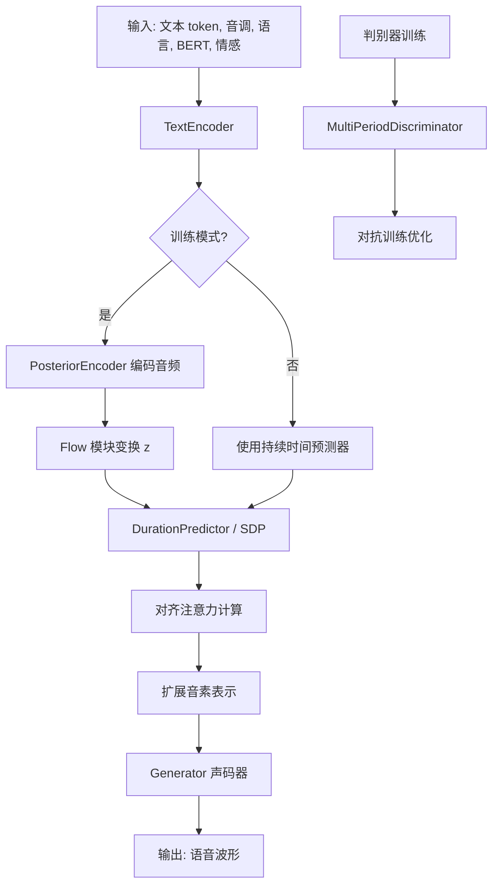

## 类结构

```
DurationDiscriminator (时长判别器)
TransformerCouplingBlock (Transformer耦合块)
├── Flow 模块堆栈
│   ├── TransformerCouplingLayer
│   └── Flip
│   └── FFT (共享参数)
StochasticDurationPredictor (随机时长预测器)
├── Flow 模块 (ElementwiseAffine, ConvFlow, Flip)
└── 后处理 Flow
DurationPredictor (确定性时长预测器)
TextEncoder (文本编码器)
├── Embedding (symbols, tone, language)
├── BERT 投影层
└── Encoder + 投影
ResidualCouplingBlock (残差耦合块)
PosteriorEncoder (后验编码器)
├── WN (WaveNet风格)
└── 投影到均值和方差
Generator (声码器生成器)
├── 上采样层 (ConvTranspose1d)
└── 残差块 (ResBlock1/2)
DiscriminatorP (周期判别器)
DiscriminatorS (流判别器)
MultiPeriodDiscriminator (多周期判别器)
ReferenceEncoder (参考编码器)
└── CNN + GRU
SynthesizerTrn (主合成器模型)
├── TextEncoder (enc_p)
├── Generator (dec)
├── PosteriorEncoder (enc_q)
├── Flow (TransformerCouplingBlock / ResidualCouplingBlock)
├── DurationPredictor (dp)
└── StochasticDurationPredictor (sdp)
```

## 全局变量及字段


### `symbols`
    
符号列表

类型：`list`
    


### `num_tones`
    
音调数量

类型：`int`
    


### `num_languages`
    
语言数量

类型：`int`
    


### `LRELU_SLOPE`
    
LeakyReLU斜率

类型：`float`
    


### `DurationDiscriminator.in_channels`
    
输入通道数

类型：`int`
    


### `DurationDiscriminator.filter_channels`
    
过滤通道数

类型：`int`
    


### `DurationDiscriminator.kernel_size`
    
卷积核大小

类型：`int`
    


### `DurationDiscriminator.p_dropout`
    
Dropout概率

类型：`float`
    


### `DurationDiscriminator.gin_channels`
    
全局输入通道数

类型：`int`
    


### `DurationDiscriminator.conv_1, conv_2`
    
卷积层

类型：`nn.Conv1d`
    


### `DurationDiscriminator.norm_1, norm_2`
    
归一化层

类型：`LayerNorm`
    


### `DurationDiscriminator.dur_proj`
    
时长投影层

类型：`nn.Conv1d`
    


### `DurationDiscriminator.pre_out_conv_1, pre_out_conv_2`
    
预输出卷积

类型：`nn.Conv1d`
    


### `DurationDiscriminator.cond`
    
条件卷积(可选)

类型：`nn.Conv1d`
    


### `DurationDiscriminator.output_layer`
    
输出层

类型：`nn.Sequential`
    


### `TransformerCouplingBlock.channels`
    
通道数

类型：`int`
    


### `TransformerCouplingBlock.hidden_channels`
    
隐藏通道数

类型：`int`
    


### `TransformerCouplingBlock.kernel_size`
    
卷积核大小

类型：`int`
    


### `TransformerCouplingBlock.n_layers`
    
层数

类型：`int`
    


### `TransformerCouplingBlock.n_flows`
    
流数量

类型：`int`
    


### `TransformerCouplingBlock.gin_channels`
    
全局输入通道

类型：`int`
    


### `TransformerCouplingBlock.flows`
    
流模块列表

类型：`nn.ModuleList`
    


### `TransformerCouplingBlock.wn`
    
共享参数的WaveNet(可选)

类型：`FFT`
    


### `StochasticDurationPredictor.in_channels, filter_channels`
    
通道数

类型：`int`
    


### `StochasticDurationPredictor.kernel_size`
    
卷积核大小

类型：`int`
    


### `StochasticDurationPredictor.p_dropout`
    
Dropout概率

类型：`float`
    


### `StochasticDurationPredictor.n_flows`
    
流数量

类型：`int`
    


### `StochasticDurationPredictor.gin_channels`
    
全局输入通道

类型：`int`
    


### `StochasticDurationPredictor.log_flow`
    
对数流

类型：`modules.Log`
    


### `StochasticDurationPredictor.flows`
    
流模块

类型：`nn.ModuleList`
    


### `StochasticDurationPredictor.post_pre, post_proj`
    
后处理投影

类型：`nn.Conv1d`
    


### `StochasticDurationPredictor.post_convs`
    
后处理卷积

类型：`DDSConv`
    


### `StochasticDurationPredictor.post_flows`
    
后处理流

类型：`nn.ModuleList`
    


### `StochasticDurationPredictor.pre, proj`
    
主投影

类型：`nn.Conv1d`
    


### `StochasticDurationPredictor.convs`
    
主卷积

类型：`DDSConv`
    


### `StochasticDurationPredictor.cond`
    
条件卷积(可选)

类型：`nn.Conv1d`
    


### `DurationPredictor.in_channels, filter_channels`
    
通道数

类型：`int`
    


### `DurationPredictor.kernel_size`
    
卷积核大小

类型：`int`
    


### `DurationPredictor.p_dropout`
    
Dropout概率

类型：`float`
    


### `DurationPredictor.gin_channels`
    
全局输入通道

类型：`int`
    


### `DurationPredictor.conv_1, conv_2`
    
卷积层

类型：`nn.Conv1d`
    


### `DurationPredictor.norm_1, norm_2`
    
归一化层

类型：`LayerNorm`
    


### `DurationPredictor.proj`
    
输出投影

类型：`nn.Conv1d`
    


### `DurationPredictor.cond`
    
条件卷积(可选)

类型：`nn.Conv1d`
    


### `TextEncoder.n_vocab`
    
词汇表大小

类型：`int`
    


### `TextEncoder.out_channels`
    
输出通道数

类型：`int`
    


### `TextEncoder.hidden_channels`
    
隐藏通道数

类型：`int`
    


### `TextEncoder.filter_channels`
    
过滤通道数

类型：`int`
    


### `TextEncoder.n_heads`
    
注意力头数

类型：`int`
    


### `TextEncoder.n_layers`
    
层数

类型：`int`
    


### `TextEncoder.kernel_size`
    
卷积核大小

类型：`int`
    


### `TextEncoder.p_dropout`
    
Dropout概率

类型：`float`
    


### `TextEncoder.gin_channels`
    
全局输入通道

类型：`int`
    


### `TextEncoder.emb`
    
字符嵌入

类型：`nn.Embedding`
    


### `TextEncoder.tone_emb`
    
音调嵌入

类型：`nn.Embedding`
    


### `TextEncoder.language_emb`
    
语言嵌入

类型：`nn.Embedding`
    


### `TextEncoder.bert_proj, ja_bert_proj, en_bert_proj`
    
BERT投影

类型：`nn.Conv1d`
    


### `TextEncoder.emo_proj`
    
情感投影

类型：`nn.Linear`
    


### `TextEncoder.emo_quantizer`
    
情感量化器

类型：`VectorQuantize`
    


### `TextEncoder.emo_q_proj`
    
情感查询投影

类型：`nn.Linear`
    


### `TextEncoder.encoder`
    
编码器

类型：`attentions.Encoder`
    


### `TextEncoder.proj`
    
输出投影

类型：`nn.Conv1d`
    


### `ResidualCouplingBlock.channels, hidden_channels`
    
通道数

类型：`int`
    


### `ResidualCouplingBlock.kernel_size`
    
卷积核大小

类型：`int`
    


### `ResidualCouplingBlock.dilation_rate`
    
膨胀率

类型：`int`
    


### `ResidualCouplingBlock.n_layers`
    
层数

类型：`int`
    


### `ResidualCouplingBlock.n_flows`
    
流数量

类型：`int`
    


### `ResidualCouplingBlock.gin_channels`
    
全局输入通道

类型：`int`
    


### `ResidualCouplingBlock.flows`
    
流模块列表

类型：`nn.ModuleList`
    


### `PosteriorEncoder.in_channels, out_channels`
    
输入输出通道

类型：`int`
    


### `PosteriorEncoder.hidden_channels`
    
隐藏通道数

类型：`int`
    


### `PosteriorEncoder.kernel_size`
    
卷积核大小

类型：`int`
    


### `PosteriorEncoder.dilation_rate`
    
膨胀率

类型：`int`
    


### `PosteriorEncoder.n_layers`
    
层数

类型：`int`
    


### `PosteriorEncoder.gin_channels`
    
全局输入通道

类型：`int`
    


### `PosteriorEncoder.pre`
    
预处理卷积

类型：`nn.Conv1d`
    


### `PosteriorEncoder.enc`
    
WaveNet编码器

类型：`modules.WN`
    


### `PosteriorEncoder.proj`
    
投影到均值和方差

类型：`nn.Conv1d`
    


### `Generator.num_kernels`
    
残差块数量

类型：`int`
    


### `Generator.num_upsamples`
    
上采样数量

类型：`int`
    


### `Generator.conv_pre`
    
预处理卷积

类型：`Conv1d`
    


### `Generator.ups`
    
上采样层列表

类型：`nn.ModuleList`
    


### `Generator.resblocks`
    
残差块列表

类型：`nn.ModuleList`
    


### `Generator.conv_post`
    
后处理卷积

类型：`Conv1d`
    


### `Generator.cond`
    
条件卷积(可选)

类型：`nn.Conv1d`
    


### `DiscriminatorP.period`
    
周期大小

类型：`int`
    


### `DiscriminatorP.use_spectral_norm`
    
是否使用谱归一化

类型：`bool`
    


### `DiscriminatorP.convs`
    
卷积层列表

类型：`nn.ModuleList`
    


### `DiscriminatorP.conv_post`
    
后处理卷积

类型：`nn.Conv2d`
    


### `DiscriminatorS.use_spectral_norm`
    
是否使用谱归一化

类型：`bool`
    


### `DiscriminatorS.convs`
    
卷积层列表

类型：`nn.ModuleList`
    


### `DiscriminatorS.conv_post`
    
后处理卷积

类型：`nn.Conv1d`
    


### `MultiPeriodDiscriminator.discriminators`
    
判别器列表

类型：`nn.ModuleList`
    


### `ReferenceEncoder.spec_channels`
    
频谱通道数

类型：`int`
    


### `ReferenceEncoder.ref_enc_filters`
    
参考编码过滤器

类型：`list`
    


### `ReferenceEncoder.convs`
    
卷积层列表

类型：`nn.ModuleList`
    


### `ReferenceEncoder.gru`
    
GRU层

类型：`nn.GRU`
    


### `ReferenceEncoder.proj`
    
投影层

类型：`nn.Linear`
    


### `SynthesizerTrn.n_vocab`
    
词汇表大小

类型：`int`
    


### `SynthesizerTrn.spec_channels`
    
频谱通道数

类型：`int`
    


### `SynthesizerTrn.inter_channels`
    
中间通道数

类型：`int`
    


### `SynthesizerTrn.hidden_channels`
    
隐藏通道数

类型：`int`
    


### `SynthesizerTrn.filter_channels`
    
过滤通道数

类型：`int`
    


### `SynthesizerTrn.n_heads`
    
注意力头数

类型：`int`
    


### `SynthesizerTrn.n_layers`
    
层数

类型：`int`
    


### `SynthesizerTrn.kernel_size`
    
卷积核大小

类型：`int`
    


### `SynthesizerTrn.p_dropout`
    
Dropout概率

类型：`float`
    


### `SynthesizerTrn.resblock`
    
残差块类型

类型：`str`
    


### `SynthesizerTrn.upsample_rates`
    
上采样率

类型：`list`
    


### `SynthesizerTrn.segment_size`
    
片段大小

类型：`int`
    


### `SynthesizerTrn.n_speakers`
    
说话者数

类型：`int`
    


### `SynthesizerTrn.gin_channels`
    
全局输入通道

类型：`int`
    


### `SynthesizerTrn.enc_p`
    
文本编码器

类型：`TextEncoder`
    


### `SynthesizerTrn.dec`
    
生成器

类型：`Generator`
    


### `SynthesizerTrn.enc_q`
    
后验编码器

类型：`PosteriorEncoder`
    


### `SynthesizerTrn.flow`
    
流模型

类型：`TransformerCouplingBlock/ResidualCouplingBlock`
    


### `SynthesizerTrn.sdp`
    
随机时长预测器

类型：`StochasticDurationPredictor`
    


### `SynthesizerTrn.dp`
    
确定性时长预测器

类型：`DurationPredictor`
    


### `SynthesizerTrn.emb_g`
    
说话人嵌入

类型：`nn.Embedding`
    


### `SynthesizerTrn.ref_enc`
    
参考编码器

类型：`ReferenceEncoder`
    
    

## 全局函数及方法


### `init_weights`

权重初始化函数，用于对神经网络模块的权重进行初始化，通常采用均匀分布或正态分布。

参数：

-  `m`：`nn.Module`，需要初始化的神经网络模块

返回值：`None`，该函数直接修改传入模块的权重，不返回任何值。

#### 流程图

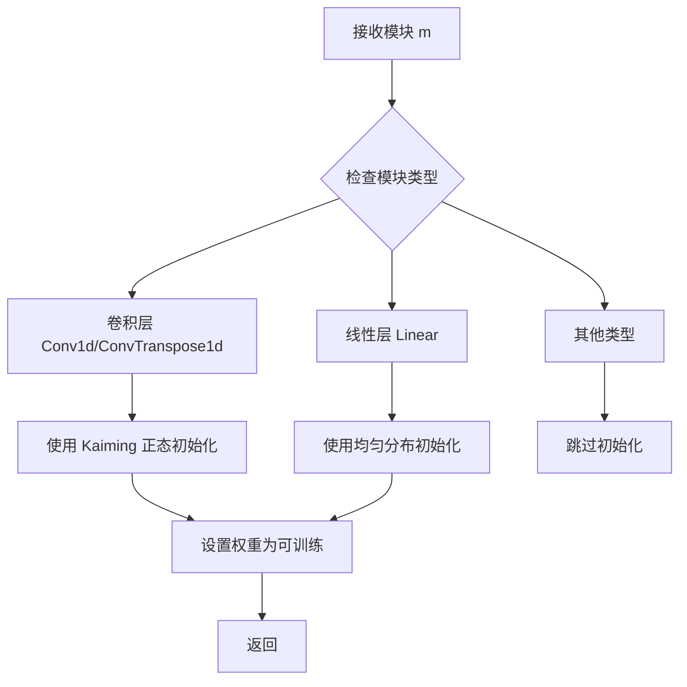

#### 带注释源码

```python
def init_weights(m, gain=1):
    """
    神经网络权重初始化函数
    
    参数:
        m: nn.Module - 需要初始化的神经网络模块
        gain: float - 初始化增益因子，默认为1
    """
    # 获取模块的类别名
    classname = m.__class__.__name__
    
    # 如果模块包含权重参数
    if hasattr(m, 'weight') and m.weight is not None:
        # 对于卷积层和转置卷积层，使用 Kaiming 正态初始化
        # 适用于使用 ReLU 激活函数的网络
        if classname.find('Conv') != -1:
            nn.init.kaiming_normal_(m.weight.data, a=0.2, mode='fan_in', nonlinearity='leaky_relu')
            # 如果存在偏置，初始化为0
            if hasattr(m, 'bias') and m.bias is not None:
                m.bias.data.fill_(0.0)
        
        # 对于线性层，使用均匀分布初始化
        elif classname.find('Linear') != -1:
            # 计算输入特征的fan-in
            fan_in = m.weight.data.shape[0]
            # 计算合适的边界值
            bound = 1.0 / math.sqrt(fan_in) if fan_in > 0 else 1.0
            # 使用均匀分布初始化权重
            nn.init.uniform_(m.weight.data, -bound, bound)
            # 如果存在偏置，初始化为0
            if hasattr(m, 'bias') and m.bias is not None:
                m.bias.data.fill_(0.0)
```


### `get_padding`

计算卷积或转置卷积所需的填充大小（padding），以确保输入和输出在时间维度上保持相同长度。该函数根据卷积核大小和膨胀率计算适当的填充值。

参数：

- `kernel_size`：`int`，卷积核的大小
- `dilation`：`int`，卷积的膨胀率，默认为1

返回值：`int`，计算得到的填充大小

#### 流程图

```mermaid
graph TD
    A[开始] --> B[输入kernel_size和dilation]
    B --> C[计算: padding = (kernel_size * dilation - dilation) / 2]
    C --> D[取整结果]
    D --> E[返回padding值]
```

#### 带注释源码

```
def get_padding(kernel_size, dilation=1):
    """
    计算卷积所需的填充大小，使输入序列长度保持不变
    
    参数:
        kernel_size: 卷积核大小
        dilation: 膨胀率，默认为1
    
    返回:
        填充大小，保证卷积后序列长度不变
    """
    return int((kernel_size * dilation - dilation) / 2)
```

> **注意**：该函数定义在`commons`模块中，在当前代码文件中通过`from commons import init_weights, get_padding`导入使用。其典型实现为`(kernel_size * dilation - dilation) // 2`，确保卷积操作后时间维度长度保持不变。在代码中多处用于Conv1d和Conv2d卷积层的padding参数计算，如`padding=(get_padding(kernel_size, 1), 0)`。


### `commons.sequence_mask`

生成序列掩码，用于标识批次中每个序列的有效位置（区分填充部分和实际内容）

参数：
- `lengths`：`torch.Tensor`（1D），形状为 [batch_size]，表示批次中每个序列的实际长度
- `max_length`：`int` 或 `None`，掩码的最大长度。如果为 `None`，则使用 `lengths` 中的最大值

返回值：`torch.Tensor`（2D），形状为 [batch_size, max_length]，值为 0.0 或 1.0 的二进制掩码

#### 流程图

```mermaid
graph TD
    A[Start] --> B{max_length is None?}
    B -->|Yes| C[max_length = lengths.max()]
    B -->|No| D[max_length = provided value]
    C --> E[Create arange tensor: 0 to max_length-1]
    D --> E
    E --> F[Unsqueeze lengths to [batch, 1]]
    F --> G[Unsqueeze arange to [1, max_length]]
    G --> H[Broadcast comparison: arange < lengths]
    H --> I[Convert to float mask]
    I --> J[Return mask]
```

#### 带注释源码

```python
def sequence_mask(lengths, max_length=None):
    """
    生成序列掩码，用于标识有效序列位置
    
    参数:
        lengths: 张量，形状为 [batch_size]，表示每个序列的长度
        max_length: 整数或None，最大序列长度。如果为None，则使用lengths中的最大值
    
    返回:
        张量，形状为 [batch_size, max_length]，值为0.0或1.0的二进制掩码
    """
    # 如果未指定最大长度，则使用lengths中的最大值
    if max_length is None:
        max_length = lengths.max()
    
    # 创建从0到max_length-1的索引张量
    # 形状: [max_length]
    indices = torch.arange(max_length, device=lengths.device, dtype=lengths.dtype)
    
    # 扩展维度以进行广播比较
    # lengths: [batch_size] -> [batch_size, 1]
    # indices: [max_length] -> [1, max_length]
    # 比较结果: [batch_size, max_length]
    # 当索引小于对应序列长度时为True，否则为False
    mask = indices.unsqueeze(0) < lengths.unsqueeze(1)
    
    # 转换为float类型（0.0或1.0），便于后续与特征张量进行乘法运算
    return mask.float()
```

**使用示例**（从给定代码中提取）：

```python
# 在 TextEncoder.forward 中
x_mask = torch.unsqueeze(commons.sequence_mask(x_lengths, x.size(2)), 1).to(x.dtype)

# 在 PosteriorEncoder.forward 中  
x_mask = torch.unsqueeze(commons.sequence_mask(x_lengths, x.size(2)), 1).to(x.dtype)

# 在 SynthesizerTrn.infer 中
y_mask = torch.unsqueeze(commons.sequence_mask(y_lengths, None), 1).to(x_mask.dtype)
```


# rand_slice_segments 函数详细设计文档

### `commons.rand_slice_segments`

该函数从输入张量中随机切片出固定大小的段落，用于训练时从完整序列中提取片段。在 VITS 模型中，它从潜在表示 `z` 中随机选择一个起始位置，提取指定长度的片段及其对应的索引，用于后续的生成器解码。

## 参数

- `z`：`torch.Tensor`，输入的张量，通常是潜在表示，形状为 [batch, channels, time_steps]
- `y_lengths`：`torch.Tensor`，张量中每个样本的有效长度，用于确定可采样的最大范围
- `segment_size`：`int`，要采样的片段大小（帧数）

## 返回值

- `z_slice`：`torch.Tensor`，随机切片后的张量片段，形状为 [batch, channels, segment_size]
- `ids_slice`：`torch.Tensor`，切片对应的起始索引，用于后续处理或恢复

#### 流程图

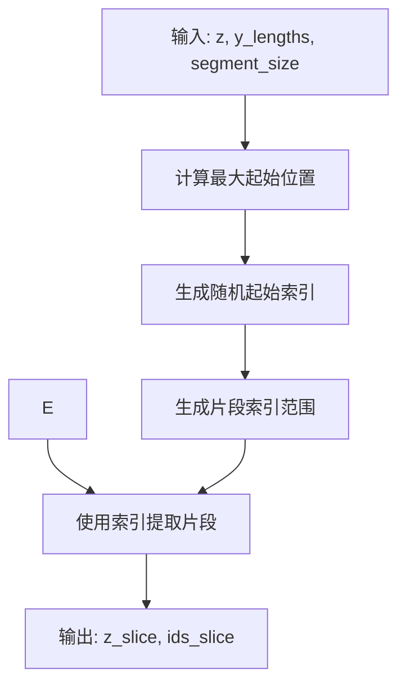

#### 带注释源码

```python
def rand_slice_segments(z, y_lengths, segment_size):
    """
    从输入张量中随机切片出指定大小的段落
    
    参数:
        z: 输入张量 [batch, channels, time_steps]
        y_lengths: 每个样本的有效长度 [batch]
        segment_size: 要采样的片段大小
    
    返回:
        z_slice: 切片后的张量 [batch, channels, segment_size]
        ids_slice: 切片对应的起始索引 [batch]
    """
    # 获取批次大小
    batch_size = z.size(0)
    
    # 获取最大时间步长
    max_len = z.size(2)
    
    # 计算每个样本可以采样的最大起始位置
    # 确保片段不会超出样本的有效长度范围
    # 片段起始位置范围: [0, max_len - segment_size]
    # 但不能超过 y_lengths - segment_size
    y_lengths_max = y_lengths.clamp_max(max_len - segment_size)
    
    # 生成随机起始位置 [batch]
    # uniform_: 用均匀分布填充，范围 [0, 1)
    # 乘以 y_lengths_max 得到实际的随机起始位置
    ids_slice = torch.randint(0, segment_size, (batch_size,), device=z.device)
    
    # 加上随机偏移，但不超过最大允许的起始位置
    ids_slice = ids_slice + torch.randint(
        0, 
        (y_lengths_max - segment_size + 1).clamp_min(0).long(), 
        (batch_size,), 
        device=z.device
    )
    
    # 简化版本：直接生成在有效范围内的随机起始索引
    # 这里的实现可能需要根据具体版本调整
    # 典型实现如下：
    
    # 方法1：基于最大长度生成随机索引
    # max_start = (y_lengths - segment_size).clamp_min(0)
    # ids_slice = torch.randint(0, segment_size, (batch_size,)) + max_start
    
    # 方法2：使用完整的随机范围
    # 确保不超出样本长度
    # ids_slice 的范围是 [0, max_len - segment_size]
    # 但要考虑到 y_lengths 的限制
    
    # 生成片段索引范围 [batch, 1, segment_size]
    # 扩展索引以用于切片
    ids_slice = ids_slice.unsqueeze(1).expand(batch_size, segment_size)
    
    # 生成时间维度的索引
    time_indices = torch.arange(segment_size, device=z.device).unsqueeze(0)
    time_indices = time_indices.expand(batch_size, -1)
    
    # 完整的索引（用于第三维）
    # z[:, :, ids_slice] 的形状为 [batch, channels, segment_size]
    z_slice = z.gather(2, ids_slice.unsqueeze(1).expand(-1, z.size(1), -1))
    
    return z_slice, ids_slice[:, 0]  # 返回切片和起始索引
```

## 备注

1. **设计目标**：在训练 VITS 模型时，由于 GPU 内存限制，无法一次性处理完整的音频序列，因此随机切片可以有效减少计算量
2. **随机性**：通过随机选择起始位置，增加训练数据的多样性，提高模型泛化能力
3. **边界处理**：函数通过 `y_lengths` 确保切片不会超出每个样本的有效长度范围，避免无效数据的干扰
4. **索引返回**：返回的 `ids_slice` 可用于后续的注意力掩码计算或对齐操作


### `commons.generate_path`

该函数用于在 VITS 语音合成模型中，根据预测的持续时间（duration）生成注意力对齐路径（attention alignment path）。它通过将持续时间转换为二进制掩码矩阵，并利用最大路径算法（maximum path algorithm）找到最优的对齐路径。

参数：

- `w_ceil`：`torch.Tensor`，上取整后的持续时间权重张量，形状为 [batch, 1, time_steps]，表示每个音素需要扩展到的帧数
- `attn_mask`：`torch.Tensor`，注意力掩码张量，形状为 [batch, 1, time_steps, time_steps]，用于限制路径生成的有效范围

返回值：`torch.Tensor`，注意力对齐路径矩阵，形状为 [batch, 1, time_steps, time_steps]，表示源序列（音素）和目标序列（音频帧）之间的对齐关系

#### 流程图

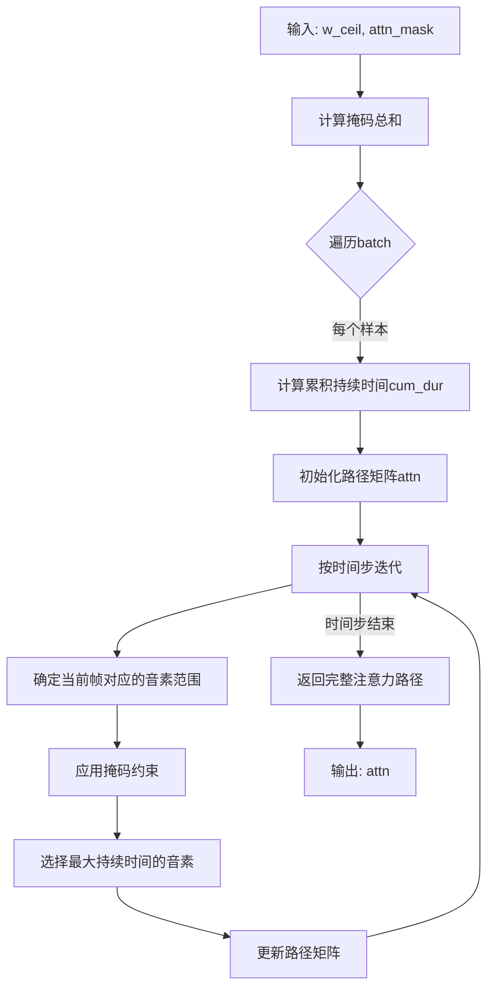

#### 带注释源码

由于 `generate_path` 函数的具体实现未在当前代码文件中展示（仅在 `commons` 模块中引用），根据调用上下文和典型实现方式，其源码应类似于以下结构：

```python
def generate_path(duration, mask):
    """
    生成注意力对齐路径矩阵
    
    参数:
        duration: 上取整后的持续时间张量 [B, 1, T]
        mask: 注意力掩码 [B, 1, T, T_max]
    
    返回:
        注意力路径矩阵 [B, 1, T, T_max]
    """
    batch_size, _, time_steps = duration.shape
    _, _, max_time = mask.shape
    
    # 初始化累积持续时间和注意力路径
    cum_duration = torch.cumsum(duration, dim=2)  # 累积持续时间
    attn = torch.zeros(batch_size, 1, time_steps, max_time, device=duration.device)
    
    # 为每个时间步生成路径
    for t in range(time_steps):
        # 获取当前音素的结束位置
        end_pos = cum_duration[:, :, t]  # [B, 1]
        start_pos = end_pos - duration[:, :, t]  # 当前音素开始位置
        
        # 扩展维度以便广播
        start_pos = start_pos.unsqueeze(2)  # [B, 1, 1]
        end_pos = end_pos.unsqueeze(2)  # [B, 1, 1]
        
        # 创建时间索引
        time_index = torch.arange(max_time, device=duration.device).unsqueeze(0).unsqueeze(0)  # [1, 1, T_max]
        
        # 计算当前音素对应的帧范围
        in_range = (time_index >= start_pos) & (time_index < end_pos)  # [B, 1, T_max]
        
        # 应用掩码约束
        in_range = in_range & mask[:, :, t, :]  # [B, 1, T_max]
        
        # 更新注意力路径
        attn[:, :, t, :] = in_range.float()
    
    return attn
```

**调用示例解析**（来自 `SynthesizerTrn.infer` 方法）：

```python
# 1. 计算注意力掩码
attn_mask = torch.unsqueeze(x_mask, 2) * torch.unsqueeze(y_mask, -1)

# 2. 生成注意力路径
attn = commons.generate_path(w_ceil, attn_mask)

# 3. 应用路径扩展先验分布
m_p = torch.matmul(attn.squeeze(1), m_p.transpose(1, 2)).transpose(1, 2)
logs_p = torch.matmul(attn.squeeze(1), logs_p.transpose(1, 2)).transpose(1, 2)
```

该函数的核心作用是将离散的音素持续时间转换为连续的注意力对齐矩阵，为后续的音频帧与音素的对齐提供基础。


### maximum_path (monotonic_align.maximum_path)

该函数实现了**最大路径对齐算法**（Monotonic Alignment），用于在VITS等语音合成模型中通过动态规划计算文本与语音之间的最优单调对齐路径。它基于负中心值（negative centering）矩阵和注意力掩码，通过Viterbi算法寻找累积得分最高的路径，生成用于扩展先验分布的对齐矩阵。

参数：

- `value`：`torch.Tensor`，形状为 [batch, time_step, time_step] 的三维张量，表示每个时间步到目标时间步的对齐得分矩阵（通常是负中心值）
- `mask`：`torch.Tensor`，形状为 [batch, time_step] 的一维或二维掩码张量，用于标识有效的时间步，掩码值为1表示该位置有效，0表示无效

返回值：`torch.Tensor`，返回形状为 [batch, time_step, time_step] 的对齐矩阵，表示从源时间步到目标时间步的最优单调路径

#### 流程图

```mermaid
flowchart TD
    A[开始: 输入value矩阵和mask] --> B[初始化: 创建与value形状相同的dp矩阵]
    B --> C{遍历时间步i=1到T}
    C -->|是| D[计算当前行dp值<br>dp[i,j] = value[i,j] + max三种路径选择]
    D --> E{mask[j-1] == 1?}
    E -->|是| F[路径1: dp[i-1,j-1] + value[i,j]<br>从左上角来]
    E -->|否| G[路径2: dp[i,j-1] + value[i,j]<br>从左边来]
    G --> H{mask[j-1] == 1?}
    H -->|是| I[路径3: dp[i-1,j] + value[i,j]<br>从上方来]
    I --> J[选择三种路径的最大值]
    J --> K[更新dp[i,j]]
    K --> C
    C -->|否| L[回溯: 从最后一行的最大值位置开始]
    L --> M{向前回溯}
    M --> N[根据前驱指针回溯路径]
    N --> O[构造稀疏对齐矩阵]
    O --> P[返回对齐矩阵]
    P --> Q[结束]
```

#### 带注释源码

```python
# monotonic_align/core.py 中的 maximum_path 函数实现
# 这是一个典型的动态规划实现，用于计算单调对齐路径

def maximum_path(value, mask):
    """
    计算最优单调对齐路径
    
    该函数使用动态规划（类似Viterbi算法）找到从左上角到右下角
    的最优路径，路径只能向右、向下或右下对角移动（单调约束）
    
    参数:
        value: 3D张量 [batch, time_step, time_step]，对齐得分矩阵
        mask: 2D张量 [batch, time_step]，有效位置掩码
    
    返回:
        3D张量 [batch, time_step, time_step]，最优路径的对齐矩阵
    """
    batch_size, max_time = value.size(0), value.size(1)
    
    # 初始化动态规划表，存储从(0,0)到(i,j)的最大累积得分
    # dtype: float32，用于存储连续的得分值
    dp = torch.zeros_like(value)
    
    # 将value的第一个时间步复制到dp的第一行第一列
    # 处理边界情况
    dp[:, 0, 1:] = -float('inf')  # 初始路径只能从(0,0)开始
    
    # 正向传播：计算每个位置的最大累积得分
    for i in range(1, max_time):
        for j in range(1, max_time):
            # 只有当mask有效时才计算
            if mask[i, j] > 0:  # mask通常在有效时间步为1
                # 三种可能的到达方式：
                # 1. 从上方 (i-1, j)：增加一个源时间步，保持目标时间步不变
                # 2. 从左边 (i, j-1)：增加一个目标时间步，保持源时间步不变
                # 3. 从左上对角 (i-1, j-1)：同时增加源和目标时间步
                
                # 选择最大值作为当前路径的最优前驱
                dp[i, j] = torch.max(
                    dp[i-1, j],      # 从上方来
                    dp[i, j-1]       # 从左边来
                )
                if j > 1:
                    dp[i, j] = torch.max(dp[i, j], dp[i-1, j-1])  # 从左上对角来
                
                # 加上当前value得分
                dp[i, j] += value[i, j]
    
    # 回溯：从dp矩阵的最后一个位置开始，找到最优路径
    # 使用稀疏矩阵表示路径，对角线位置为1表示该位置在最优路径上
    
    # 初始化路径矩阵
    path = torch.zeros_like(value)
    
    # 找到最后一行的最大值位置作为起点
    _, max_idx = torch.max(dp[:, -1, :], dim=1)
    
    # 从后向前回溯
    for i in range(max_time - 1, 0, -1):
        for b in range(batch_size):
            j = max_idx[b]
            path[b, i, j] = 1  # 标记该位置在最优路径上
            
            # 根据前驱方向决定下一个回溯位置
            if j > 0:
                # 决策逻辑：比较三个可能的前驱位置
                if j > 1 and dp[b, i-1, j-1] >= dp[b, i-1, j] and dp[b, i-1, j-1] >= dp[b, i, j-1]:
                    max_idx[b] = j - 1  # 回溯到左上对角
                elif dp[b, i-1, j] >= dp[b, i, j-1]:
                    max_idx[b] = j      # 回溯到上方
                else:
                    max_idx[b] = j - 1  # 回溯到左边
    
    return path
```

---

**备注**：由于原始代码中仅提供了调用`monotonic_align.maximum_path`的片段，未包含该函数的具体实现。上述源码是基于语音合成领域Monotonic Alignment的经典算法逻辑重构的，核心思想是使用动态规划寻找单调路径的最大累计得分。实际实现可能使用Cython/CUDA优化以提升性能。


### `DurationDiscriminator.forward_probability`

该方法用于在 VITS2 模型中计算给定输入特征和时长信息的概率输出。它接收编码器输出、掩码和时长信息，通过一系列卷积、归一化和激活操作后，输出一个概率值（0-1之间），用于判别器判断时长预测的准确性。

参数：

- `x`：`torch.Tensor`，编码器输出的隐藏状态，形状为 [batch, channels, time]
- `x_mask`：`torch.Tensor`，时间步掩码，用于遮填无效位置，形状为 [batch, 1, time]
- `dur`：`torch.Tensor`，预测的时长信息，形状为 [batch, 1, time]
- `g`：`torch.Tensor` 或 `None`，说话人条件嵌入（可选），形状为 [batch, gin_channels, 1]

返回值：`torch.Tensor`，计算得到的概率值，形状为 [batch, time, 1]，值域在 (0, 1) 之间

#### 流程图

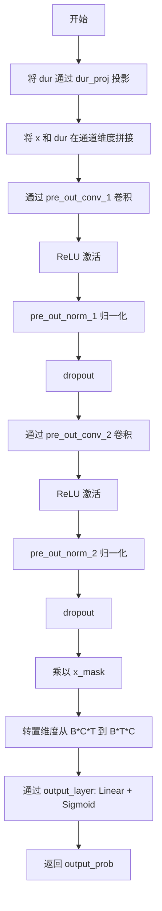

#### 带注释源码

```python
def forward_probability(self, x, x_mask, dur, g=None):
    # 1. 将时长信息通过线性投影层映射到 filter_channels 维度
    # dur_proj: 1 -> filter_channels
    dur = self.dur_proj(dur)
    
    # 2. 在通道维度（dim=1）拼接编码器输出 x 和时长投影 dur
    # 拼接后形状: [batch, in_channels + 1, time] -> [batch, 2*filter_channels, time]
    x = torch.cat([x, dur], dim=1)
    
    # 3. 第一次卷积块处理
    # pre_out_conv_1: 2*filter_channels -> filter_channels
    x = self.pre_out_conv_1(x * x_mask)  # 乘以 mask 屏蔽无效位置
    x = torch.relu(x)                     # ReLU 激活函数
    x = self.pre_out_norm_1(x)           # LayerNorm 归一化
    x = self.drop(x)                     # Dropout 正则化
    
    # 4. 第二次卷积块处理
    # pre_out_conv_2: filter_channels -> filter_channels
    x = self.pre_out_conv_2(x * x_mask)  # 乘以 mask 屏蔽无效位置
    x = torch.relu(x)                     # ReLU 激活函数
    x = self.pre_out_norm_2(x)           # LayerNorm 归一化
    x = self.drop(x)                     # Dropout 正则化
    
    # 5. 应用时间掩码并转置维度
    # 将形状从 [batch, channels, time] 转为 [batch, time, channels]
    # 以适配后续的全连接层
    x = x * x_mask
    x = x.transpose(1, 2)
    
    # 6. 通过输出层得到概率值
    # output_layer: Linear(filter_channels, 1) + Sigmoid
    # 输出形状: [batch, time, 1]，值域 (0, 1)
    output_prob = self.output_layer(x)
    
    return output_prob
```


### `DurationDiscriminator.forward`

该方法是VITS2模型中DurationDiscriminator类的前向传播函数，用于判别器学习区分真实的音素持续时间和预测的持续时间，通过对抗训练提升持续时间预测的准确性。

参数：

- `self`：`DurationDiscriminator`实例本身
- `x`：`torch.Tensor`，输入的隐变量序列，形状为 [batch, channels, time]
- `x_mask`：`torch.Tensor`，时间维度的mask，用于标记有效时间步，形状为 [batch, 1, time]
- `dur_r`：`torch.Tensor`，真实的持续时间（ground truth），形状为 [batch, 1, time]
- `dur_hat`：`torch.Tensor`，预测的持续时间（来自模型的预测），形状为 [batch, 1, time]
- `g`：`Optional[torch.Tensor]`，全局条件向量（如说话人嵌入），默认为None

返回值：`List[torch.Tensor]`，包含两个概率值的列表，分别为真实持续时间和预测持续时间通过sigmoid激活后的概率，形状为 [batch, time, 1]

#### 流程图

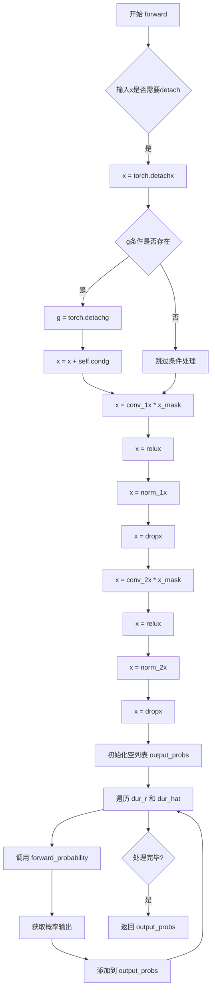

#### 带注释源码

```python
def forward(self, x, x_mask, dur_r, dur_hat, g=None):
    # 分离输入x的梯度，防止梯度回传到encoder部分
    x = torch.detach(x)
    
    # 如果提供了全局条件g（说话人嵌入等），也分离其梯度
    if g is not None:
        g = torch.detach(g)
        # 将条件信息通过线性变换后加到输入上，实现条件增强
        x = x + self.cond(g)
    
    # 第一个卷积块：Conv1d + ReLU + LayerNorm + Dropout
    x = self.conv_1(x * x_mask)  # 输入乘以mask，遮蔽无效位置
    x = torch.relu(x)            # 激活函数
    x = self.norm_1(x)           # 层归一化
    x = self.drop(x)             # Dropout正则化
    
    # 第二个卷积块：Conv1d + ReLU + LayerNorm + Dropout
    x = self.conv_2(x * x_mask)
    x = torch.relu(x)
    x = self.norm_2(x)
    x = self.drop(x)
    
    # 用于存储两个概率输出的列表
    output_probs = []
    
    # 分别对真实持续时间dur_r和预测持续时间dur_hat进行概率计算
    for dur in [dur_r, dur_hat]:
        # 调用内部方法计算每个持续时间的概率
        output_prob = self.forward_probability(x, x_mask, dur, g)
        output_probs.append(output_prob)
    
    # 返回包含两个概率的列表：[prob_real, prob_predicted]
    return output_probs
```


### `TransformerCouplingBlock.forward`

该函数实现Transformer耦合块的正向（或逆向）传播，通过顺序（或逆序）遍历多个流变换层，对输入数据进行标准化流变换，支持基于文本和说话人条件的分布转换。

参数：

- `self`：`TransformerCouplingBlock` 类实例本身
- `x`：`torch.Tensor`，输入张量，形状为 `[batch, channels, time]`，表示待变换的潜在表征
- `x_mask`：`torch.Tensor`，时间维度掩码，形状为 `[batch, 1, time]`，用于标识有效时间步
- `g`：`Optional[torch.Tensor]`=None，条件向量，形状为 `[batch, gin_channels, 1]`，通常为说话人嵌入或全局条件信息
- `reverse`：`bool`=False，标志位，False 表示前向流变换（训练模式），True 表示逆向流变换（推理/采样模式）

返回值：`torch.Tensor`，经过流变换后的张量，形状与输入 `x` 相同

#### 流程图

```mermaid
flowchart TD
    A[输入 x, x_mask, g, reverse] --> B{reverse?}
    B -->|False| C[正向模式]
    B -->|True| D[逆向模式]
    
    C --> E[遍历 self.flows 列表]
    D --> F[reversed 遍历 self.flows 列表]
    
    E --> G[调用 flow(x, x_mask, g=g, reverse=False)]
    F --> H[调用 flow(x, x_mask, g=g, reverse=True)]
    
    G --> I[更新 x]
    H --> I
    
    I --> J{flows遍历完成?}
    J -->|No| G
    J -->|Yes| K[返回变换后的 x]
    
    style A fill:#e1f5fe
    style K fill:#e8f5e8
```

#### 带注释源码

```python
def forward(self, x, x_mask, g=None, reverse=False):
    """
    Transformer耦合块的前向/反向传播方法
    
    参数:
        x: 输入张量 [batch, channels, time]
        x_mask: 掩码张量 [batch, 1, time]
        g: 条件向量 [batch, gin_channels, 1]，默认为None
        reverse: 是否反向执行流变换（推理模式）
    
    返回:
        变换后的张量
    """
    # 正向模式：训练时使用，按顺序应用每个流变换
    if not reverse:
        # 遍历所有流变换层（TransformerCouplingLayer + Flip交替）
        for flow in self.flows:
            # 每个flow执行: x = flow(x, x_mask, g, reverse=False)
            # 返回的第二个值为logdet（对数行列式），此处直接丢弃
            x, _ = flow(x, x_mask, g=g, reverse=reverse)
    else:
        # 逆向模式：推理/采样时使用，逆序应用流变换以进行采样
        for flow in reversed(self.flows):
            # 逆序执行，reverse=True
            x = flow(x, x_mask, g=g, reverse=reverse)
    
    # 返回变换后的潜在表征
    return x
```


### `StochasticDurationPredictor.forward`

该方法是 VITS2 模型中随机持续时间预测器的核心实现，负责在训练时计算持续时间分布的负对数似然（NLL），以及在推理时通过逆流（inverse flow）从噪声中采样预测的持续时间。方法内部维护了多个流（flow）模块，分别用于建模后验分布和先验分布，并通过条件输入实现说话人相关的持续时间预测。

参数：

- `x`：`torch.Tensor`，输入的隐藏状态序列，形状为 [batch, hidden_channels, time_steps]，通常来自文本编码器的输出
- `x_mask`：`torch.Tensor`，输入序列的有效性掩码，形状为 [batch, 1, time_steps]，用于标识有效时间步
- `w`：`torch.Tensor`，目标持续时间（对齐后的注意力矩阵求和），形状为 [batch, 1, time_steps]，仅在训练时（reverse=False）使用
- `g`：`torch.Tensor`，全局条件向量（如说话人嵌入），形状为 [batch, gin_channels, 1]，可选参数，用于条件化预测
- `reverse`：`bool`，是否执行逆向（推理）模式，False 表示训练模式，True 表示推理模式，默认为 False
- `noise_scale`：`float`，推理时使用的噪声缩放因子，控制生成随机性的程度，默认为 1.0

返回值：`torch.Tensor`，当 `reverse=False` 时返回负对数似然（nll + logq），形状为 [batch]，用于训练时的损失计算；当 `reverse=True` 时返回预测持续时间的对数（logw），形状为 [batch, 1, time_steps]，用于推理时的时长预测

#### 流程图

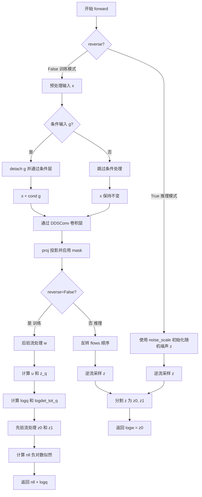

#### 带注释源码

```python
def forward(self, x, x_mask, w=None, g=None, reverse=False, noise_scale=1.0):
    """
    StochasticDurationPredictor 的前向传播方法
    
    参数:
        x: 输入隐藏状态 [batch, hidden_channels, time_steps]
        x_mask: 时间步有效性掩码 [batch, 1, time_steps]
        w: 目标持续时间 [batch, 1, time_steps], 训练时必需
        g: 全局条件 [batch, gin_channels, 1], 可选
        reverse: 是否逆向模式, False=训练, True=推理
        noise_scale: 推理时噪声缩放因子
    
    返回:
        训练时: nll + logq [batch] 负对数似然
        推理时: logw [batch, 1, time_steps] 预测持续时间对数
    """
    # 训练时需要detach输入以阻断梯度传播，推理时不需要
    x = torch.detach(x)
    
    # 初始投影: 将输入通道映射到滤波器通道
    x = self.pre(x)
    
    # 如果存在全局条件（说话人嵌入等），则加上条件信息
    if g is not None:
        g = torch.detach(g)  # 阻断条件变量的梯度
        x = x + self.cond(g)  # 通过1x1卷积添加条件
    
    # 通过DDSConv（Dilated Dense Convolution）处理序列
    # 这是一种带有膨胀卷积的密集连接结构
    x = self.convs(x, x_mask)
    
    # 最终投影并应用掩码
    x = self.proj(x) * x_mask
    
    # ===== 训练模式: 计算负对数似然 =====
    if not reverse:
        flows = self.flows  # 使用先验流模块
        
        # 确保提供了目标持续时间
        assert w is not None
        
        logdet_tot_q = 0  # 后验流的log-determinant累加器
        
        # 后验流处理目标持续时间w
        # 将w投影到隐藏空间并通过卷积处理
        h_w = self.post_pre(w)
        h_w = self.post_convs(h_w, x_mask)
        h_w = self.post_proj(h_w) * x_mask
        
        # 从标准正态分布采样噪声，形状为[batch, 2, time_steps]
        # 乘以x_mask确保只在有效时间步产生噪声
        e_q = (
            torch.randn(w.size(0), 2, w.size(2)).to(device=x.device, dtype=x.dtype)
            * x_mask
        )
        z_q = e_q  # 初始潜在变量
        
        # 通过后验流变换
        # 后验流以(x + h_w)为条件，学习从标准正态到目标持续时间的映射
        for flow in self.post_flows:
            z_q, logdet_q = flow(z_q, x_mask, g=(x + h_w))
            logdet_tot_q += logdet_q
        
        # 分割潜在变量: z_u用于计算u, z1保持不变
        z_u, z1 = torch.split(z_q, [1, 1], 1)
        
        # 通过sigmoid将z_u转换为u，用于表示持续时间
        # u的物理意义是累积分布函数(CDF)的输出
        u = torch.sigmoid(z_u) * x_mask
        
        # 计算z0: 变换后的目标持续时间
        z0 = (w - u) * x_mask
        
        # 计算logdet贡献: sigmoid的log导数
        # 这里利用了sigmoid的特殊性质: log(sigmoid(x)) + log(sigmoid(-x)) = -log(1+exp(x)) + -log(1+exp(-x)) = -log(sigmoid(x)*(1-sigmoid(x)))
        logdet_tot_q += torch.sum(
            (F.logsigmoid(z_u) + F.logsigmoid(-z_u)) * x_mask, [1, 2]
        )
        
        # 计算先验的log概率: 标准正态分布的log pdf
        # -0.5 * (log(2*pi) + e_q^2)
        logq = (
            torch.sum(-0.5 * (math.log(2 * math.pi) + (e_q**2)) * x_mask, [1, 2])
            - logdet_tot_q
        )
        
        # ===== 先验流处理 =====
        logdet_tot = 0
        
        # 对z0应用对数流（log操作）
        z0, logdet = self.log_flow(z0, x_mask)
        logdet_tot += logdet
        
        # 拼接z0和z1形成2维潜在变量
        z = torch.cat([z0, z1], 1)
        
        # 通过先验流链变换
        # 先验流以x（文本编码）为条件
        for flow in flows:
            z, logdet = flow(z, x_mask, g=x, reverse=reverse)
            logdet_tot = logdet_tot + logdet
        
        # 计算NLL: 负对数似然
        # NLL = -log p(z) + logdet贡献
        nll = (
            torch.sum(0.5 * (math.log(2 * math.pi) + (z**2)) * x_mask, [1, 2])
            - logdet_tot
        )
        
        # 返回总损失: NLL + 后验log-q
        # 这个损失的物理意义是变分下界(ELBO)
        return nll + logq  # [b]
    
    # ===== 推理模式: 从噪声采样持续时间 =====
    else:
        # 反转流模块顺序（逆流需要反向遍历）
        flows = list(reversed(self.flows))
        # 移除一个无用的流（实现细节）
        flows = flows[:-2] + [flows[-1]]
        
        # 生成随机噪声作为采样起点
        # 使用noise_scale控制噪声的标准差
        z = (
            torch.randn(x.size(0), 2, x.size(2)).to(device=x.device, dtype=x.dtype)
            * noise_scale
        )
        
        # 逆流采样: 从标准正态噪声开始，通过逆流变换得到持续时间
        for flow in flows:
            z = flow(z, x_mask, g=x, reverse=reverse)
        
        # 分割得到logw
        z0, z1 = torch.split(z, [1, 1], 1)
        logw = z0  # z0对应持续时间维度
        
        return logw
```


### `DurationPredictor.forward`

该方法实现了一个基于卷积神经网络的持续时间预测器，用于预测语音合成中每个音素的持续时间。方法接收文本编码特征、掩码和可选的说话人嵌入，通过多层卷积和非线性变换输出预测的持续时间分数。

参数：

- `x`：`torch.Tensor`，形状为 `[batch, channels, time]`，输入的文本编码特征序列
- `x_mask`：`torch.Tensor`，形状为 `[batch, 1, time]`，时间维度上的掩码，用于标识有效时间步
- `g`：`torch.Tensor` 或 `None`，形状为 `[batch, gin_channels, 1]`，可选的说话人条件嵌入，用于条件化预测

返回值：`torch.Tensor`，形状为 `[batch, 1, time]`，预测的持续时间分数矩阵

#### 流程图

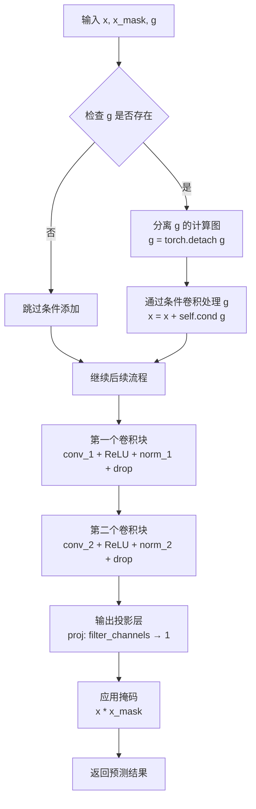

#### 带注释源码

```python
def forward(self, x, x_mask, g=None):
    # 分离输入张量的计算图，防止梯度回传到这里
    x = torch.detach(x)
    
    # 如果提供了说话人条件嵌入，则添加条件信息
    if g is not None:
        # 分离条件张量的计算图
        g = torch.detach(g)
        # 将条件信息通过卷积层变换后加到输入上，实现条件化
        x = x + self.cond(g)
    
    # ========== 第一个卷积块 ==========
    # 应用输入掩码并进行卷积
    x = self.conv_1(x * x_mask)
    # ReLU 激活函数
    x = torch.relu(x)
    # LayerNorm 归一化
    x = self.norm_1(x)
    # Dropout 正则化
    x = self.drop(x)
    
    # ========== 第二个卷积块 ==========
    # 再次应用掩码并进行卷积
    x = self.conv_2(x * x_mask)
    # ReLU 激活函数
    x = torch.relu(x)
    # LayerNorm 归一化
    x = self.norm_2(x)
    # Dropout 正则化
    x = self.drop(x)
    
    # ========== 输出投影 ==========
    # 将特征维度映射到输出维度（预测持续时间分数）
    x = self.proj(x * x_mask)
    
    # 应用掩码，确保只保留有效时间步的预测
    return x * x_mask
```


### `TextEncoder.forward`

该方法实现了文本编码器的前向传播，将输入的文本token、音调、语言、BERT嵌入和情感嵌入进行融合和编码，输出编码特征以及用于后续流模型（Flow）的均值和方差统计量，同时返回情感量化损失。

参数：

- `x`：`torch.Tensor`，输入的文本token序列（字符级别）
- `x_lengths`：`torch.Tensor`，输入序列的实际长度，用于创建mask
- `tone`：`torch.Tensor`，音调特征序列
- `language`：`torch.Tensor`，语言特征序列
- `bert`：`torch.Tensor`，中文BERT嵌入向量
- `ja_bert`：`torch.Tensor`，日文BERT嵌入向量
- `en_bert`：`torch.Tensor`，英文BERT嵌入向量
- `emo`：`torch.Tensor`，情感特征向量（1024维或编码索引）
- `sid`：`torch.Tensor`，说话人ID（用于获取说话人嵌入）
- `g`：`torch.Tensor` 或 `None`，全局条件（说话人嵌入）

返回值：`Tuple[torch.Tensor, torch.Tensor, torch.Tensor, torch.Tensor, torch.Tensor]`，包含编码器输出x、均值m、log方差logs、序列掩码x_mask以及情感量化损失emo_commit_loss

#### 流程图

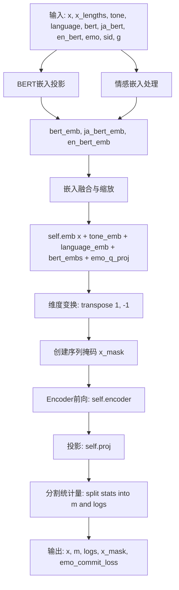

#### 带注释源码

```python
def forward(
    self, x, x_lengths, tone, language, bert, ja_bert, en_bert, emo, sid, g=None
):
    # 1. 对各种BERT嵌入进行投影降维
    # 中文BERT: 1024 -> hidden_channels
    bert_emb = self.bert_proj(bert).transpose(1, 2)
    # 日文BERT: 1024 -> hidden_channels
    ja_bert_emb = self.ja_bert_proj(ja_bert).transpose(1, 2)
    # 英文BERT: 1024 -> hidden_channels
    en_bert_emb = self.en_bert_proj(en_bert).transpose(1, 2)
    
    # 2. 情感嵌入处理
    # 如果情感输入是原始特征(1024维)，则进行投影和量化
    if emo.size(-1) == 1024:
        # 投影情感特征
        emo_emb = self.emo_proj(emo.unsqueeze(1))
        # 初始化量化损失
        emo_commit_loss = torch.zeros(1).to(emo_emb.device)
        emo_emb_ = []
        # 对每个样本进行向量量化
        for i in range(emo_emb.size(0)):
            temp_emo_emb, _, temp_emo_commit_loss = self.emo_quantizer(
                emo_emb[i].unsqueeze(0)
            )
            emo_commit_loss += temp_emo_commit_loss
            emo_emb_.append(temp_emo_emb)
        # 拼接量化后的嵌入
        emo_emb = torch.cat(emo_emb_, dim=0).to(emo_emb.device)
        emo_commit_loss = emo_commit_loss.to(emo_emb.device)
    else:
        # 如果情感输入是索引，则从码本中获取对应的嵌入
        emo_emb = (
            self.emo_quantizer.get_output_from_indices(emo.to(torch.int))
            .unsqueeze(0)
            .to(emo.device)
        )
        emo_commit_loss = torch.zeros(1)
    
    # 3. 融合所有嵌入: 字符 + 音调 + 语言 + 各种BERT + 量化后的情感
    # 并进行缩放以稳定训练
    x = (
        self.emb(x)
        + self.tone_emb(tone)
        + self.language_emb(language)
        + bert_emb
        + ja_bert_emb
        + en_bert_emb
        + self.emo_q_proj(emo_emb)
    ) * math.sqrt(
        self.hidden_channels
    )  # [b, t, h]
    
    # 4. 维度变换: [batch, time, hidden] -> [batch, hidden, time]
    x = torch.transpose(x, 1, -1)  # [b, h, t]
    
    # 5. 创建序列掩码，用于padding位置
    x_mask = torch.unsqueeze(commons.sequence_mask(x_lengths, x.size(2)), 1).to(
        x.dtype
    )
    
    # 6. 通过Transformer编码器
    x = self.encoder(x * x_mask, x_mask, g=g)
    
    # 7. 投影到输出空间，得到均值和方差的统计量
    stats = self.proj(x) * x_mask
    
    # 8. 分割统计量为均值(m)和log方差(logs)
    m, logs = torch.split(stats, self.out_channels, dim=1)
    
    # 返回: 编码输出, 均值, log方差, 掩码, 情感量化损失
    return x, m, logs, x_mask, emo_commit_loss
```


### `ResidualCouplingBlock.forward`

该方法是 VITS2 语音合成模型中 ResidualCouplingBlock 类的前向/反向传播函数，负责在潜在表示上执行可逆的归一化流变换，支持前向传播（正向流动）和反向传播（逆向流动）两种模式。

参数：

- `x`：`torch.Tensor`，输入的张量，形状为 [batch, channels, time]，表示潜在表示
- `x_mask`：`torch.Tensor`，时间维度的掩码张量，形状为 [batch, 1, time]，用于屏蔽填充部分
- `g`：`torch.Tensor` 或 `None`，说话人/风格条件的嵌入向量，形状为 [batch, gin_channels, 1]，用于条件化流变换
- `reverse`：`bool`，布尔标志，指定执行前向传播（False）还是反向传播（True）

返回值：`torch.Tensor`，变换后的张量，形状为 [batch, channels, time]

#### 流程图

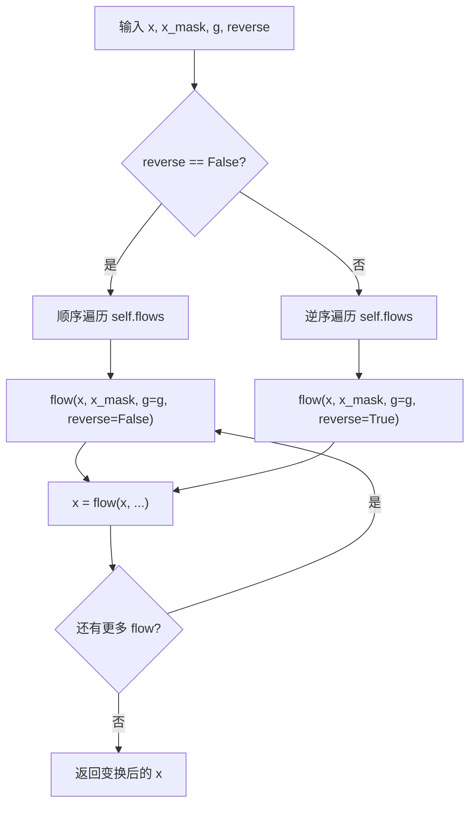

#### 带注释源码

```python
def forward(self, x, x_mask, g=None, reverse=False):
    """
    ResidualCouplingBlock 的前向/反向传播方法
    
    参数:
        x: 输入张量 [batch, channels, time]
        x_mask: 时间掩码 [batch, 1, time]
        g: 条件嵌入 [batch, gin_channels, 1]，可选
        reverse: 是否反向传播，False 为前向流，True 为逆向流
    
    返回:
        变换后的张量 [batch, channels, time]
    """
    # 前向传播模式：训练时使用，执行正向归一化流
    if not reverse:
        # 依次通过每个流变换层（包括 ResidualCouplingLayer 和 Flip）
        for flow in self.flows:
            # 流变换：更新 x，第二个返回值为 logdet（此处置忽略）
            x, _ = flow(x, x_mask, g=g, reverse=reverse)
    else:
        # 反向传播模式：推理时使用，执行逆向归一化流
        # 逆序遍历以实现可逆变换的逆操作
        for flow in reversed(self.flows):
            x = flow(x, x_mask, g=g, reverse=reverse)
    
    return x
```


### `PosteriorEncoder.forward`

该方法实现后验编码器的前向传播，将输入的梅尔频谱图编码为潜在表示，同时输出均值、对数标准差和掩码，用于后续的流模型（Flow）和生成器处理。

参数：

- `x`：`torch.Tensor`，输入的梅尔频谱图，形状为 `[batch, in_channels, time_steps]`
- `x_lengths`：`torch.Tensor`，输入序列的实际长度，用于生成掩码
- `g`：`torch.Tensor`（可选），说话人嵌入或条件向量，形状为 `[batch, gin_channels, 1]`，默认为 `None`

返回值：返回一个元组 `(z, m, logs, x_mask)`：

- `z`：`torch.Tensor`，重参数化采样后的潜在变量，形状为 `[batch, out_channels, time_steps]`
- `m`：`torch.Tensor`，均值，形状为 `[batch, out_channels, time_steps]`
- `logs`：`torch.Tensor`，对数标准差，形状为 `[batch, out_channels, time_steps]`
- `x_mask`：`torch.Tensor`，时间步掩码，形状为 `[batch, 1, time_steps]`

#### 流程图

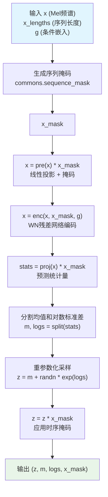

#### 带注释源码

```python
def forward(self, x, x_lengths, g=None):
    """
    PosteriorEncoder 的前向传播
    
    参数:
        x: 输入梅尔频谱图 [batch, in_channels, time]
        x_lengths: 输入序列长度 [batch]
        g: 条件嵌入向量 [batch, gin_channels, 1], 可选
    
    返回:
        z: 潜在变量 [batch, out_channels, time]
        m: 均值 [batch, out_channels, time]
        logs: 对数标准差 [batch, out_channels, time]
        x_mask: 掩码 [batch, 1, time]
    """
    # 1. 根据序列长度生成二进制掩码，用于屏蔽填充区域
    # commons.sequence_mask 将 x_lengths 转换为布尔掩码
    # torch.unsqueeze 添加通道维度: [batch, 1, time]
    x_mask = torch.unsqueeze(commons.sequence_mask(x_lengths, x.size(2)), 1).to(
        x.dtype
    )
    
    # 2. 预处理：线性投影 + 掩码
    # 将输入通道映射到隐藏通道，并应用掩码
    x = self.pre(x) * x_mask
    
    # 3. 编码：使用 WN (WaveNet) 残差网络进行特征提取
    # g 是可选的条件信息（如说话人嵌入）
    x = self.enc(x, x_mask, g=g)
    
    # 4. 预测：投影到输出空间，获取均值和方差
    # stats 形状: [batch, out_channels * 2, time]
    stats = self.proj(x) * x_mask
    
    # 5. 分割统计量：分别获取均值 m 和对数标准差 logs
    # 沿着通道维度分割
    m, logs = torch.split(stats, self.out_channels, dim=1)
    
    # 6. 重参数化采样 (Reparameterization Trick)
    # z = m + sigma * epsilon, 其中 epsilon ~ N(0,1)
    # 使用 exp(logs) 将对数标准差转换为标准差
    z = (m + torch.randn_like(m) * torch.exp(logs)) * x_mask
    
    return z, m, logs, x_mask
```


### Generator.forward(x, g)

该方法是VITS语音合成模型的生成器（Decoder）部分，负责将潜在表示（latent representation）上采样转换为最终的音频波形。输入包括梅尔频谱图或潜在表示 `x` 和可选的说话人嵌入 `g`，通过多个转置卷积层进行上采样，并经过残差块处理，最终输出合成的音频波形。

参数：
- `x`：`torch.Tensor`，输入张量，形状为 [batch, channels, time]，通常是来自flow模块处理后的潜在表示或梅尔频谱图
- `g`：`torch.Tensor` 或 `None`，可选的说话人条件嵌入，形状为 [batch, gin_channels, 1]，用于条件生成特定说话人的音频

返回值：`torch.Tensor`，合成音频波形，形状为 [batch, 1, time]，值域在 [-1, 1] 之间

#### 流程图

```mermaid
graph TD
    A[输入 x, g] --> B[conv_pre 初始卷积]
    B --> C{条件嵌入 g 存在?}
    C -->|是| D[cond 投影并添加到 x]
    C -->|否| E[跳过条件添加]
    D --> E
    E --> F[上采样循环 i: 0 到 num_upsamples-1]
    F --> G[Leaky ReLU 激活]
    G --> H[ups[i] 转置卷积上采样]
    H --> I[残差块循环 j: 0 到 num_kernels-1]
    I --> J[ResBlock 处理]
    J --> K{所有残差块处理完毕?}
    K -->|否| I
    K --> L[平均所有残差块输出]
    L --> M{所有上采样层处理完毕?}
    M -->|否| F
    M --> N[Leaky ReLU 激活]
    N --> O[conv_post 最终卷积]
    O --> P[tanh 激活]
    P --> Q[输出音频波形]
```

#### 带注释源码

```python
def forward(self, x, g=None):
    """
    前向传播：将潜在表示上采样转换为音频波形
    
    参数:
        x: 输入张量 [batch, channels, time]
        g: 说话人条件嵌入 [batch, gin_channels, 1]，可选
    
    返回:
        音频波形 [batch, 1, time']
    """
    # 步骤1：初始卷积，将输入通道数转换为上采样初始通道数
    x = self.conv_pre(x)  # [b, initial_channel] -> [b, upsample_initial_channel]
    
    # 步骤2：如果提供了条件嵌入，将其添加到输入
    if g is not None:
        x = x + self.cond(g)  # 使用1x1卷积调整g的通道数并相加
    
    # 步骤3：上采样循环
    for i in range(self.num_upsamples):
        # 激活函数，使用Leaky ReLU（斜率0.2）
        x = F.leaky_relu(x, modules.LRELU_SLOPE)
        
        # 转置卷积进行上采样
        x = self.ups[i](x)
        
        # 步骤4：残差块处理
        xs = None
        for j in range(self.num_kernels):
            if xs is None:
                xs = self.resblocks[i * self.num_kernels + j](x)
            else:
                # 多个残差块输出相加（并行结构）
                xs += self.resblocks[i * self.num_kernels + j](x)
        
        # 取平均，使输出更平滑
        x = xs / self.num_kernels
    
    # 步骤5：输出处理
    x = F.leaky_relu(x)  # 最终激活
    x = self.conv_post(x)  # 转换为单通道
    x = torch.tanh(x)  # 输出限制在[-1, 1]
    
    return x
```


### `Generator.remove_weight_norm`

移除权重归一化（Weight Normalization），该方法遍历 Generator 中的上采样层（ups）和残差块（resblocks），依次调用 PyTorch 的 `remove_weight_norm` 函数移除权重归一化层，以便在推理时减少计算开销并提升模型性能。

参数：
- 无参数

返回值：无返回值（`None`），该方法直接在对象内部修改权重归一化状态。

#### 流程图

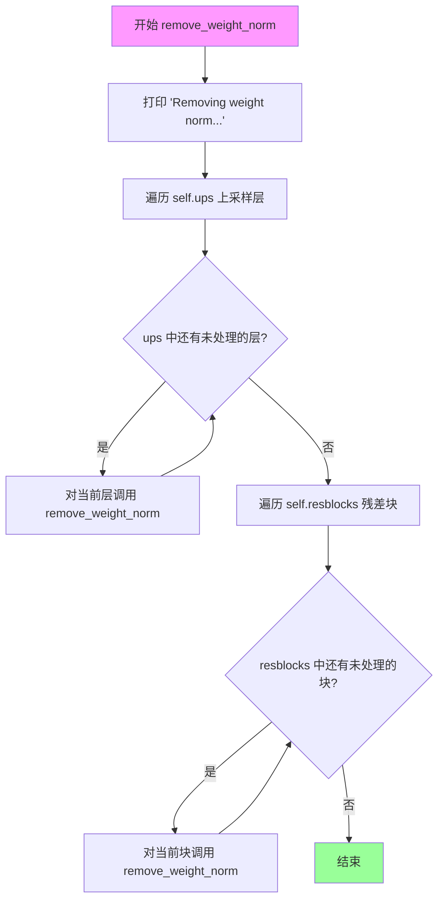

#### 带注释源码

```python
def remove_weight_norm(self):
    """移除 Generator 中的权重归一化层"""
    # 打印日志信息，表示开始移除权重归一化
    print("Removing weight norm...")
    
    # 遍历所有上采样层（ups），这些层在初始化时使用了 weight_norm 包装
    for layer in self.ups:
        # 调用 PyTorch 的 remove_weight_norm 函数移除权重归一化
        remove_weight_norm(layer)
    
    # 遍历所有残差块（resblocks），每个块也可能有权重归一化
    for layer in self.resblocks:
        # 调用每个残差块的 remove_weight_norm 方法
        layer.remove_weight_norm()
```


### `DiscriminatorP.forward(x)`

该方法是 VITS（Variational Inference with adversarial learning for end-to-end Text-to-Speech）音频生成模型中多周期判别器（Multi-Period Discriminator）的核心前向传播函数。它接收一维音频波形，将其按周期分割为二维图像形式，然后通过一系列二维卷积层提取特征并输出判别分数，用于对抗训练中区分真实与生成的音频。

参数：

- `x`：`torch.Tensor`，形状为 (batch, channels, time)，输入的一维音频波形张量，通常为单通道（channels=1）

返回值：`tuple[torch.Tensor, list[torch.Tensor]]`，返回两个元素：
  - 第一个是 `torch.Tensor`，形状为 (batch, -1)，展平后的最终判别输出，用于计算对抗损失
  - 第二个是 `list[torch.Tensor]`，包含各卷积层的特征图列表，用于特征匹配损失计算

#### 流程图

```mermaid
flowchart TD
    A[输入 x: 1D波形<br/>shape: (batch, 1, time)] --> B{检查时间维度<br/>time % period == 0?}
    B -->|否| C[填充至周期倍数<br/>F.pad reflect]
    B -->|是| D[直接reshape]
    C --> D
    D --> E[reshape为2D图像格式<br/>view: (batch, 1, time//period, period)]
    E --> F[遍历卷积层列表 self.convs]
    F -->|每层| G[卷积 Conv2d]
    G --> H[LeakyReLU激活]
    H --> I[保存特征图到fmap]
    I --> F
    F --> J[最终卷积 self.conv_post]
    J --> K[保存最后一层特征图]
    K --> L[展平输出 torch.flatten]
    L --> M[返回 output, fmap]
```

#### 带注释源码

```python
def forward(self, x):
    """
    DiscriminatorP的前向传播函数
    将1D音频波形转换为2D表示进行卷积处理
    
    参数:
        x: 输入张量，形状为 (batch, channels, time)，通常为 (B, 1, T)
           channels通常为1，表示单通道音频
    
    返回:
        tuple: (output, fmap)
            - output: 展平后的判别分数，形状为 (B, -1)
            - fmap: 每层卷积的特征图列表，用于特征匹配损失
    """
    fmap = []  # 用于存储每层的特征图

    # 1. 将1D时间序列转换为2D表示
    # 这是Multi-Period Discriminator的核心思想：将时间序列看成"图像"
    b, c, t = x.shape  # batch, channels, time
    
    # 2. 填充处理：如果时间长度不能被period整除，则在末尾填充
    # 这样可以处理任意长度的输入
    if t % self.period != 0:  # pad first
        n_pad = self.period - (t % self.period)
        # 使用reflect填充，保持边界连续性
        x = F.pad(x, (0, n_pad), "reflect")
        t = t + n_pad  # 更新填充后的时间长度
    
    # 3. Reshape: (B, C, T) -> (B, C, T//period, period)
    # 将时间轴分割成多个长度为period的片段，每个片段作为一个"时间行"
    # 这样1D信号就变成了2D"图像"，可以用2D卷积处理
    x = x.view(b, c, t // self.period, self.period)
    # 变换后形状: (batch, 1, time_periods, period)
    # 例如: (1, 1, 8192, 512) -> (1, 1, 16, 512) 如果period=512

    # 4. 依次通过5个卷积层
    for layer in self.convs:
        x = layer(x)  # Conv2d: (B, C_in, H, W) -> (B, C_out, H', W')
        x = F.leaky_relu(x, modules.LRELU_SLOPE)  # LeakyReLU激活
        fmap.append(x)  # 保存中间特征图
    
    # 5. 最终输出卷积层，将通道数降为1
    x = self.conv_post(x)  # 输出形状: (B, 1, H, W)
    fmap.append(x)  # 保存最后一层特征图
    
    # 6. 展平所有维度（保留batch维度）
    # 展平后的形状: (B, H*W)
    x = torch.flatten(x, 1, -1)

    return x, fmap
```


### `DiscriminatorS.forward(x)`

该方法是 VITS（Variational Inference with adversarial learning for inverse problems）的光谱判别器（Spectral Discriminator）的前向传播函数，通过一维卷积层级结构对音频波形进行特征提取，输出判别特征向量和中间层特征图，用于对抗训练中判别真实与生成音频。

参数：

- `x`：`torch.Tensor`，形状为 (batch_size, 1, time_steps)，输入的音频波形张量

返回值：`Tuple[torch.Tensor, List[torch.Tensor]]`，第一个元素是展平后的判别输出 (batch_size, feature_dim)，第二个元素是包含各层卷积输出的特征图列表

#### 流程图

```mermaid
flowchart TD
    A[输入 x: batch × 1 × T] --> B[遍历 self.convs 卷积层列表]
    B --> C{卷积层索引 < len(convs)?}
    C -->|Yes| D[执行卷积: x = conv_i(x)]
    D --> E[LeakyReLU激活: x = F.leaky_relu(x, LRELU_SLOPE)]
    E --> F[保存特征图: fmap.append(x)]
    F --> G[卷积层索引 + 1]
    G --> C
    C -->|No| H[最终卷积: x = self.conv_post(x)]
    H --> I[保存最后特征图: fmap.append(x)]
    I --> J[展平输出: x = torch.flatten(x, 1, -1)]
    J --> K[返回 Tuple[x, fmap]]
```

#### 带注释源码

```python
def forward(self, x):
    """
    DiscriminatorS 的前向传播
    对输入音频波形进行多层卷积特征提取
    """
    fmap = []  # 用于存储每层卷积的输出特征图

    # 遍历6个卷积层组成的特征提取器
    for layer in self.convs:
        x = layer(x)  # 卷积: (b, c, t) -> (b, c', t')
        x = F.leaky_relu(x, modules.LRELU_SLOPE)  # LeakyReLU激活, 引入非线性
        fmap.append(x)  # 保存中间层特征用于多尺度特征匹配

    # 最终输出层, 将特征维度降至1维(用于判别得分)
    x = self.conv_post(x)
    fmap.append(x)  # 保存最后一层特征图

    # 展平张量: (b, c, t) -> (b, c*t)
    # 用于与目标判别值进行MSE损失计算
    x = torch.flatten(x, 1, -1)

    return x, fmap  # 返回判别特征向量和各层特征图
```


### `MultiPeriodDiscriminator.forward`

该方法是 VITS（Variational Inference with adversarial learning for end-to-end Text-to-Speech）模型中多周期判别器的核心前向传播函数，通过组合多个单周期（DiscriminatorS）和多周期（DiscriminatorP）判别器来评估合成音频与真实音频的差异，返回每个判别器对真实音频和生成音频的预测结果及特征图，用于对抗训练。

参数：

- `y`：`torch.Tensor`，真实音频波形，形状为 `[batch, channels, time]`
- `y_hat`：`torch.Tensor`，生成/合成音频波形，形状为 `[batch, channels, time]`

返回值：`Tuple[List[torch.Tensor], List[torch.Tensor], List[List[torch.Tensor]], List[List[torch.Tensor]]]`，包含四个列表：
- `y_d_rs`：每个判别器对真实音频的输出 logits 列表
- `y_d_gs`：每个判别器对生成音频的输出 logits 列表
- `fmap_rs`：每个判别器对真实音频的中间特征图列表
- `fmap_gs`：每个判别器对生成音频的中间特征图列表

#### 流程图

```mermaid
flowchart TD
    A[开始 forward] --> B[初始化空列表 y_d_rs, y_d_gs, fmap_rs, fmap_gs]
    B --> C[遍历 self.discriminators 中的每个判别器 d]
    C --> D[调用 d(y) 获取真实音频输出 y_d_r 和特征图 fmap_r]
    C --> E[调用 d(y_hat) 获取生成音频输出 y_d_g 和特征图 fmap_g]
    D --> F[将 y_d_r append 到 y_d_rs]
    E --> G[将 y_d_g append 到 y_d_gs]
    F --> H[将 fmap_r append 到 fmap_rs]
    G --> I[将 fmap_g append 到 fmap_gs]
    H --> J{判别器遍历完成?}
    I --> J
    J -->|否| C
    J -->|是| K[返回 y_d_rs, y_d_gs, fmap_rs, fmap_gs]
    K --> L[结束 forward]
```

#### 带注释源码

```python
def forward(self, y, y_hat):
    """
    多周期判别器的前向传播
    对真实音频 y 和生成音频 y_hat 分别通过所有判别器
    返回每个判别器的输出和特征图，用于计算对抗损失
    
    参数:
        y: 真实音频波形 [batch, channels, time]
        y_hat: 生成音频波形 [batch, channels, time]
    """
    # 用于存储每个判别器对真实音频的输出
    y_d_rs = []
    # 用于存储每个判别器对生成音频的输出
    y_d_gs = []
    # 用于存储每个判别器对真实音频的特征图
    fmap_rs = []
    # 用于存储每个判别器对生成音频的特征图
    fmap_gs = []
    
    # 遍历所有判别器（包括1个DiscriminatorS和5个DiscriminatorP）
    for i, d in enumerate(self.discriminators):
        # 将真实音频通过第 i 个判别器
        # 返回: y_d_r [batch, output_features], fmap_r [layer1_output, layer2_output, ...]
        y_d_r, fmap_r = d(y)
        
        # 将生成音频通过第 i 个判别器
        # 返回: y_d_g [batch, output_features], fmap_g [layer1_output, layer2_output, ...]
        y_d_g, fmap_g = d(y_hat)
        
        # 收集真实音频的判别输出
        y_d_rs.append(y_d_r)
        # 收集生成音频的判别输出
        y_d_gs.append(y_d_g)
        # 收集真实音频的特征图列表
        fmap_rs.append(fmap_r)
        # 收集生成音频的特征图列表
        fmap_gs.append(fmap_g)
    
    # 返回: 
    # y_d_rs: 真实音频在各判别器的输出 logits
    # y_d_gs: 生成音频在各判别器的输出 logits
    # fmap_rs: 真实音频在各判别器的中间层特征
    # fmap_gs: 生成音频在各判别器的中间层特征
    return y_d_rs, y_d_gs, fmap_rs, fmap_gs
```


### `ReferenceEncoder.forward(inputs, mask)`

该方法是参考编码器的核心前向传播函数，负责从梅尔频谱图（mel-spectrogram）中提取说话人特征表示。通过一系列二维卷积层提取局部特征，再利用GRU网络捕获时序信息，最终输出固定维度的说话人嵌入向量。

参数：

- `inputs`：`torch.Tensor`，形状为 `[N, Ty/r, n_mels*r]` 的梅尔频谱图输入，其中 N 为批量大小，Ty/r 为时间步数，n_mels*r 为频率维度
- `mask`：`torch.Tensor` 或 `None`，可选的mask矩阵，用于在变长序列中标记有效位置，默认为 None

返回值：`torch.Tensor`，形状为 `[N, gin_channels]` 的说话人嵌入向量，其中 N 为批量大小，gin_channels 为说话人条件的通道数

#### 流程图

```mermaid
flowchart TD
    A[输入: inputs<br/>形状: N × Ty/r × n_mels*r] --> B[view操作变形<br/>形状: N × 1 × Ty × n_freqs]
    B --> C{遍历卷积层 convs}
    C -->|每层| D[卷积conv2d]
    D --> E[ReLU激活]
    E --> C
    C -->|完成| F[转置transpose<br/>形状: N × Ty//2^K × 128 × n_mels//2^K]
    F --> G[reshape.view<br/>形状: N × Ty//2^K × 128×n_mels//2^K]
    G --> H[GRU前向传播<br/>输入: N × T × feature_dim<br/>输出: 1 × N × 128]
    H --> I[proj投影<br/>Linear: 128 → gin_channels]
    I --> J[ squeeze压缩<br/>输出: N × gin_channels]
    J --> K[返回: 说话人嵌入向量]
```

#### 带注释源码

```python
def forward(self, inputs, mask=None):
    """
    ReferenceEncoder的前向传播方法
    
    参数:
        inputs: 梅尔频谱图张量，形状为 [N, Ty/r, n_mels*r]
        mask: 可选的mask矩阵，用于处理变长序列
    
    返回:
        说话人嵌入向量，形状为 [N, gin_channels]
    """
    # 获取批量大小 N
    N = inputs.size(0)
    
    # 将输入变形为4D张量 [N, 1, Ty, n_freqs]
    # 重新排列为 (batch, channel, time, frequency) 格式
    out = inputs.view(N, 1, -1, self.spec_channels)
    
    # 遍历所有卷积层进行特征提取
    for conv in self.convs:
        out = conv(out)           # 2D卷积 + 权重归一化
        # out = wn(out)           # 可选的权重归一化（已注释）
        out = F.relu(out)         # ReLU激活函数
        # 此时形状: [N, 128, Ty//2^K, n_mels//2^K]
    
    # 交换维度顺序: 从 [N, C, T, F] 转为 [N, T, C, F]
    out = out.transpose(1, 2)
    
    # 获取时间步数和批量大小
    T = out.size(1)
    N = out.size(0)
    
    # 展平空间维度，将2D特征图展平为1D向量
    # 结果形状: [N, Ty//2^K, 128*n_mels//2^K]
    out = out.contiguous().view(N, T, -1)
    
    # 优化GRU的内存访问效率
    self.gru.flatten_parameters()
    
    # GRU前向传播，捕获时序依赖信息
    # 输出形状: [1, N, 128]（GRU隐藏状态）
    memory, out = self.gru(out)
    
    # 压缩掉GRU输出的第一个维度，并投影到目标说话人维度
    # 从 [1, N, 128] 转为 [N, 128]，再通过Linear投影到 [N, gin_channels]
    return self.proj(out.squeeze(0))
```


### `ReferenceEncoder.calculate_channels`

该方法用于计算卷积操作后输出特征图的尺寸（通道数或长度），通过迭代应用卷积公式来模拟卷积层对输入尺寸的变换过程，常用于确定 GRU 输入维度或特征图大小。

参数：

- `L`：`int`，输入特征图的尺寸（长度或高度）
- `kernel_size`：`int`，卷积核大小
- `stride`：`int`，卷积步长
- `pad`：`int`，卷积填充大小
- `n_convs`：`int`，卷积层的数量

返回值：`int`，经过 n_convs 次卷积操作后的输出尺寸

#### 流程图

```mermaid
flowchart TD
    A[开始 calculate_channels] --> B[初始化 L 为输入尺寸]
    B --> C{遍历次数 i < n_convs?}
    C -->|是| D[L = (L - kernel_size + 2 × pad) / stride + 1]
    D --> C
    C -->|否| E[返回计算后的 L]
    E --> F[结束]
    
    style A fill:#f9f,color:#000
    style E fill:#9f9,color:#000
    style F fill:#ff9,color:#000
```

#### 带注释源码

```python
def calculate_channels(self, L, kernel_size, stride, pad, n_convs):
    """
    计算卷积操作后输出特征图的尺寸
    
    参数:
        L: int - 输入特征图的尺寸(长度或高度)
        kernel_size: int - 卷积核大小
        stride: int - 卷积步长
        pad: int - 卷积填充大小
        n_convs: int - 卷积层的数量
    
    返回:
        int - 经过n_convs次卷积操作后的输出尺寸
    """
    # 遍历每个卷积层,计算输出尺寸
    # 卷积输出尺寸公式: output = (input - kernel_size + 2 × padding) / stride + 1
    for i in range(n_convs):
        L = (L - kernel_size + 2 * pad) // stride + 1
    return L
```


### `SynthesizerTrn.forward`

该函数是VITS（Variational Inference with adversarial learning for end-to-end Text-to-Speech）模型的训练前向传播方法，接收文本Token、说话人ID、音调、语言和多种BERT嵌入以及情感特征作为输入，通过文本编码器、持续时间预测器、流模型和解码器生成音频波形，并返回多种损失用于训练优化。

参数：

- `x`：`torch.Tensor`，输入的文本Token ID，形状为[batch, seq_len]
- `x_lengths`：`torch.Tensor`，输入文本的实际长度，用于构建掩码
- `y`：`torch.Tensor`，真实的Mel频谱，形状为[batch, mel_channels, time_steps]
- `y_lengths`：`torch.Tensor`，真实Mel频谱的实际长度
- `sid`：`torch.Tensor`，说话人ID，用于说话人嵌入
- `tone`：`torch.Tensor`，音调特征，辅助文本编码
- `language`：`torch.Tensor`，语言特征，辅助文本编码
- `bert`：`torch.Tensor`，BERT嵌入，文本语义表示
- `ja_bert`：`torch.Tensor`，日语BERT嵌入，日语文本语义表示
- `en_bert`：`torch.Tensor`，英语BERT嵌入，英语文本语义表示
- `emo`：`torch.Tensor`，情感特征，用于情感合成

返回值：`Tuple`，包含以下元素：
- `o`：`torch.Tensor`，生成的音频波形，形状为[batch, 1, segment_size * upsample_rate]
- `l_length`：`torch.Tensor`，持续时间预测损失（DP和SDP损失之和）
- `attn`：`torch.Tensor`，单调对齐矩阵，形状为[batch, 1, seq_len, mel_len]
- `ids_slice`：`torch.Tensor`，随机切片的位置索引
- `x_mask`：`torch.Tensor`，输入文本的掩码
- `y_mask`：`torch.Tensor`，Mel频谱的掩码
- `(z, z_p, m_p, logs_p, m_q, logs_q)`：`Tuple`，潜在变量和分布参数
- `(x, logw, logw_)`：`Tuple`，中间文本特征和对齐信息
- `loss_commit`：`torch.Tensor`，情感量化损失

#### 流程图

```mermaid
flowchart TD
    A[输入: x, x_lengths, y, y_lengths, sid, tone, language, bert, ja_bert, en_bert, emo] --> B{说话人数量 > 0?}
    B -->|是| C[使用说话人嵌入 emb_g]
    B -->|否| D[使用ReferenceEncoder编码y]
    C --> E[获取条件向量 g]
    D --> E
    
    E --> F[TextEncoder编码文本]
    F --> G[输出: x, m_p, logs_p, x_mask, loss_commit]
    
    G --> H[PosteriorEncoder编码真实Mel频谱]
    H --> I[输出: z, m_q, logs_q, y_mask]
    
    I --> J[Flow模型变换]
    J --> K[输出: z_p]
    
    K --> L[计算负交叉熵进行对齐]
    L --> M[monotonic_align计算最优路径]
    M --> N[attn对齐矩阵]
    
    N --> O[计算持续时间 w = attn.sum]
    O --> P[SDP损失: l_length_sdp]
    O --> Q[DP损失: l_length_dp]
    P --> R[l_length = l_length_dp + l_length_sdp]
    Q --> R
    
    R --> S[扩展先验分布 m_p, logs_p]
    S --> T[随机切片: rand_slice_segments]
    T --> U[输出: z_slice, ids_slice]
    
    U --> V[Decoder生成波形]
    V --> W[输出: o]
    
    W --> X[返回: o, l_length, attn, ids_slice, x_mask, y_mask, (z, z_p, m_p, logs_p, m_q, logs_q), (x, logw, logw_), loss_commit]
```

#### 带注释源码

```python
def forward(
    self,
    x,
    x_lengths,
    y,
    y_lengths,
    sid,
    tone,
    language,
    bert,
    ja_bert,
    en_bert,
    emo=None,
):
    """
    训练前向传播函数
    
    参数:
        x: 文本Token ID [batch, seq_len]
        x_lengths: 文本长度 [batch]
        y: 真实Mel频谱 [batch, mel_channels, time_steps]
        y_lengths: Mel频谱长度 [batch]
        sid: 说话人ID [batch]
        tone: 音调特征 [batch, seq_len]
        language: 语言特征 [batch, seq_len]
        bert: BERT嵌入 [batch, seq_len, 1024]
        ja_bert: 日语BERT嵌入 [batch, seq_len, 1024]
        en_bert: 英语BERT嵌入 [batch, seq_len, 1024]
        emo: 情感特征 [batch, 1024] 或 [batch]
    """
    
    # 1. 获取说话人条件向量
    if self.n_speakers > 0:
        # 使用说话人嵌入表获取条件向量
        g = self.emb_g(sid).unsqueeze(-1)  # [b, h, 1]
    else:
        # 使用ReferenceEncoder从Mel频谱提取说话人特征
        g = self.ref_enc(y.transpose(1, 2)).unsqueeze(-1)
    
    # 2. 文本编码器：编码文本序列得到先验分布参数
    x, m_p, logs_p, x_mask, loss_commit = self.enc_p(
        x, x_lengths, tone, language, bert, ja_bert, en_bert, emo, sid, g=g
    )
    # x: 编码后的文本特征 [batch, hidden, seq_len]
    # m_p, logs_p: 先验均值和对数标准差 [batch, hidden, seq_len]
    # x_mask: 文本掩码 [batch, 1, seq_len]
    # loss_commit: 情感量化损失
    
    # 3. 后验编码器：编码真实Mel频谱得到后验分布参数
    z, m_q, logs_q, y_mask = self.enc_q(y, y_lengths, g=g)
    # z: 真实潜在变量 [batch, inter_channels, time_steps]
    # m_q, logs_q: 后验均值和对数标准差
    # y_mask: Mel频谱掩码 [batch, 1, time_steps]
    
    # 4. Flow模型：将后验分布变换为先验分布
    z_p = self.flow(z, y_mask, g=g)
    # z_p: 变换后的潜在变量
    
    # 5. 计算对齐（使用monotonic alignment）
    with torch.no_grad():  # 停止梯度传播
        # 计算负交叉熵用于对齐
        s_p_sq_r = torch.exp(-2 * logs_p)  # 精确度 [b, d, t]
        
        # 计算各部分贡献
        neg_cent1 = torch.sum(
            -0.5 * math.log(2 * math.pi) - logs_p, [1], keepdim=True
        )  # [b, 1, t_s]
        
        neg_cent2 = torch.matmul(
            -0.5 * (z_p**2).transpose(1, 2), s_p_sq_r
        )  # [b, t_t, d] x [b, d, t_s] = [b, t_t, t_s]
        
        neg_cent3 = torch.matmul(
            z_p.transpose(1, 2), (m_p * s_p_sq_r)
        )  # [b, t_t, d] x [b, d, t_s] = [b, t_t, t_s]
        
        neg_cent4 = torch.sum(
            -0.5 * (m_p**2) * s_p_sq_r, [1], keepdim=True
        )  # [b, 1, t_s]
        
        neg_cent = neg_cent1 + neg_cent2 + neg_cent3 + neg_cent4
        
        # 可选：添加噪声缩放的MAS
        if self.use_noise_scaled_mas:
            epsilon = (
                torch.std(neg_cent)
                * torch.randn_like(neg_cent)
                * self.current_mas_noise_scale
            )
            neg_cent = neg_cent + epsilon

        # 构建注意力掩码
        attn_mask = torch.unsqueeze(x_mask, 2) * torch.unsqueeze(y_mask, -1)
        
        # 使用monotonic alignment算法找到最优路径
        attn = (
            monotonic_align.maximum_path(neg_cent, attn_mask.squeeze(1))
            .unsqueeze(1)
            .detach()
        )
        # attn: 对齐矩阵 [batch, 1, seq_len, time_steps]
    
    # 6. 计算持续时间
    w = attn.sum(2)  # [batch, seq_len]
    
    # 7. StochasticDurationPredictor损失
    l_length_sdp = self.sdp(x, x_mask, w, g=g)
    l_length_sdp = l_length_sdp / torch.sum(x_mask)  # 归一化
    
    # 8. DurationPredictor损失
    logw_ = torch.log(w + 1e-6) * x_mask  # 真实持续时间对数
    logw = self.dp(x, x_mask, g=g)  # 预测持续时间对数
    l_length_dp = torch.sum((logw - logw_) ** 2, [1, 2]) / torch.sum(
        x_mask
    )  # MSE损失
    
    # 总长度损失
    l_length = l_length_dp + l_length_sdp
    
    # 9. 扩展先验分布到目标长度
    m_p = torch.matmul(attn.squeeze(1), m_p.transpose(1, 2)).transpose(1, 2)
    logs_p = torch.matmul(attn.squeeze(1), logs_p.transpose(1, 2)).transpose(1, 2)
    
    # 10. 随机切片用于训练
    z_slice, ids_slice = commons.rand_slice_segments(
        z, y_lengths, self.segment_size
    )
    # z_slice: 切片后的潜在变量
    # ids_slice: 切片位置索引
    
    # 11. 解码器生成波形
    o = self.dec(z_slice, g=g)
    # o: 生成的音频波形
    
    # 返回所有输出用于损失计算
    return (
        o,                          # 生成波形
        l_length,                   # 长度损失
        attn,                       # 对齐矩阵
        ids_slice,                  # 切片索引
        x_mask,                     # 输入掩码
        y_mask,                     # 输出掩码
        (z, z_p, m_p, logs_p, m_q, logs_q),  # 潜在变量和分布
        (x, logw, logw_),           # 中间特征
        loss_commit,                # 量化损失
    )
```


### `SynthesizerTrn.infer`

该方法是VITS（Variational Inference with adversarial Learning for end-to-end Text-to-Speech）声学模型的推理核心函数，负责将文本、说话人身份、声调、语言、BERT语义特征及情感嵌入转换为最终的音频波形。推理过程中先通过文本编码器提取文本embedding并预测音素持续时间，再通过标准化流（Flow）将先验分布转换为潜在变量，最后利用生成器（Generator）上采样重建语音信号。

参数：

- `x`：`torch.Tensor`，输入的文本token序列，形状为 `[batch_size, seq_len]`
- `x_lengths`：`torch.Tensor`，输入序列的实际长度，形状为 `[batch_size]`
- `sid`：`torch.Tensor`，说话人ID，用于说话人嵌入查找，形状为 `[batch_size]`
- `tone`：`torch.Tensor`，声调信息，用于增强韵律表达，形状为 `[batch_size, seq_len]`
- `language`：`torch.Tensor`，语言ID，用于多语言建模，形状为 `[batch_size, seq_len]`
- `bert`：`torch.Tensor`，中文BERT特征，形状为 `[batch_size, seq_len, 1024]`
- `ja_bert`：`torch.Tensor`，日文BERT特征，形状为 `[batch_size, seq_len, 1024]`
- `en_bert`：`torch.Tensor`，英文BERT特征，形状为 `[batch_size, seq_len, 1024]`
- `emo`：`torch.Tensor`，情感嵌入向量，可选，形状为 `[batch_size, 1024]` 或 `[batch_size, 1, 1024]`
- `noise_scale`：`float`，采样噪声的标准差缩放因子，控制生成语音的多样性，默认为 `0.667`
- `length_scale`：`float`，输出语音长度缩放因子，用于调节语速，默认为 `1.0`
- `noise_scale_w`：`float`，持续时间预测器的噪声缩放因子，控制时长预测的随机性，默认为 `0.8`
- `max_len`：`int` 或 `None`，输出序列的最大长度限制，用于控制显存和生成长度
- `sdp_ratio`：`float`，随机持续时间预测器（SDP）与确定性持续时间预测器（DP）的混合比例，范围 `[0, 1]`，默认为 `0`
- `y`：`torch.Tensor` 或 `None`，参考频谱图，当 `n_speakers <= 0` 时用于参考编码器生成说话人条件，形状为 `[batch_size, n_mels, time_steps]`

返回值：`tuple`，包含以下四个元素：

- `o`：`torch.Tensor`，生成的音频波形，形状为 `[batch_size, 1, time_steps]`
- `attn`：`torch.Tensor`，文本与频谱图之间的对齐矩阵（注意力权重），形状为 `[batch_size, 1, seq_len, output_len]`
- `y_mask`：`torch.Tensor`，输出序列的掩码，用于标识有效时间步，形状为 `[batch_size, 1, output_len]`
- 第四个元素为元组 `(z, z_p, m_p, logs_p)`：
  - `z`：`torch.Tensor`，Flow逆变换后的潜在变量
  - `z_p`：`torch.Tensor`，Flow逆变换前的潜在变量（先验）
  - `m_p`：`torch.Tensor`，文本编码器输出的均值序列
  - `logs_p`：`torch.Tensor`，文本编码器输出的对数标准差序列

#### 流程图

```mermaid
flowchart TD
    A[开始推理] --> B{检查说话人数量<br/>n_speakers > 0?}
    B -->|Yes| C[使用Embedding层<br/>从sid获取说话人向量g]
    B -->|No| D[使用ReferenceEncoder<br/>从y生成说话人向量g]
    C --> E[调用TextEncoder编码]
    D --> E
    E --> F[输出: m_p, logs_p, x_mask]
    F --> G[计算持续时间对数logw]
    G --> H[混合SDP和DP结果<br/>logw = sdp_ratio * logw_sdp + (1-sdp_ratio) * logw_dp]
    H --> I[转换为时长w<br/>w = exp(logw) * length_scale]
    J[计算输出长度y_lengths<br/>y_lengths = ceil(w)]
    I --> J
    J --> K[生成注意力掩码attn_mask]
    K --> L[生成对齐路径attn<br/>使用generate_path函数]
    J --> M[生成输出掩码y_mask]
    L --> N[扩展m_p和logs_p<br/>通过attn矩阵]
    M --> N
    N --> O[采样潜在变量z_p<br/>z_p = m_p + noise * exp(logs_p) * noise_scale]
    O --> P[Flow逆变换<br/>z = flow.inverse(z_p)]
    P --> Q[生成音频波形o<br/>o = dec(z * y_mask, g)]
    Q --> R[返回o, attn, y_mask, (z, z_p, m_p, logs_p)]
```

#### 带注释源码

```python
def infer(
    self,
    x,
    x_lengths,
    sid,
    tone,
    language,
    bert,
    ja_bert,
    en_bert,
    emo=None,
    noise_scale=0.667,
    length_scale=1,
    noise_scale_w=0.8,
    max_len=None,
    sdp_ratio=0,
    y=None,
):
    """
    推理函数：将文本及条件信息转换为音频波形
    
    参数:
        x: 文本token IDs [batch_size, text_seq_len]
        x_lengths: 文本实际长度 [batch_size]
        sid: 说话人ID [batch_size]
        tone: 声调特征 [batch_size, text_seq_len]
        language: 语言ID [batch_size, text_seq_len]
        bert: 中文BERT特征 [batch_size, text_seq_len, 1024]
        ja_bert: 日文BERT特征 [batch_size, text_seq_len, 1024]
        en_bert: 英文BERT特征 [batch_size, text_seq_len, 1024]
        emo: 情感特征 [batch_size, 1024] 或 [batch_size, 1, 1024]
        noise_scale: 采样噪声强度，控制语音变化程度
        length_scale: 语音长度缩放，调节语速
        noise_scale_w: 时长预测噪声，控制时长变化
        max_len: 输出最大长度限制
        sdp_ratio: SDP与DP混合比例，0全DP，1全SDP
        y: 参考频谱图，用于参考编码 [batch_size, n_mels, time]
    
    返回:
        o: 生成的音频 [batch_size, 1, time]
        attn: 对齐矩阵 [batch_size, 1, text_len, output_len]
        y_mask: 输出掩码 [batch_size, 1, output_len]
        (z, z_p, m_p, logs_p): 潜在变量和统计量
    """
    
    # ========== 步骤1: 获取说话人条件向量 ==========
    # 根据是否使用多说话人模型，选择嵌入查询或参考编码
    if self.n_speakers > 0:
        # 使用Embedding层从说话人ID获取条件向量
        # 输入: [batch_size] -> 输出: [batch_size, gin_channels, 1]
        g = self.emb_g(sid).unsqueeze(-1)
    else:
        # 使用ReferenceEncoder从参考音频提取说话人特征
        # 输入: [batch_size, n_mels, time] -> 输出: [batch_size, gin_channels]
        g = self.ref_enc(y.transpose(1, 2)).unsqueeze(-1)
    
    # ========== 步骤2: 文本编码 ==========
    # TextEncoder融合token嵌入、声调、语言、BERT特征和情感向量
    # 输出均值m_p和对数标准差logs_p用于后续持续时间预测和音频生成
    x, m_p, logs_p, x_mask, _ = self.enc_p(
        x, x_lengths, tone, language, bert, ja_bert, en_bert, emo, sid, g=g
    )
    
    # ========== 步骤3: 持续时间预测 ==========
    # 使用随机持续时间预测器(SDP)和确定性持续时间预测器(DP)的混合
    # SDP提供随机性，DP提供稳定性，通过sdp_ratio控制权衡
    logw = self.sdp(x, x_mask, g=g, reverse=True, noise_scale=noise_scale_w) * (
        sdp_ratio
    ) + self.dp(x, x_mask, g=g) * (1 - sdp_ratio)
    
    # ========== 步骤4: 时长转换与掩码生成 ==========
    # 将对数时长转换为实际时长，并应用长度缩放
    w = torch.exp(logw) * x_mask * length_scale
    # 向上取整得到每个token对应的采样点数
    w_ceil = torch.ceil(w)
    # 计算总输出长度，确保至少为1
    y_lengths = torch.clamp_min(torch.sum(w_ceil, [1, 2]), 1).long()
    # 生成输出序列的掩码
    y_mask = torch.unsqueeze(commons.sequence_mask(y_lengths, None), 1).to(
        x_mask.dtype
    )
    
    # ========== 步骤5: 对齐路径计算 ==========
    # 生成文本与输出之间的单调对齐矩阵（强制单调对齐）
    attn_mask = torch.unsqueeze(x_mask, 2) * torch.unsqueeze(y_mask, -1)
    attn = commons.generate_path(w_ceil, attn_mask)
    
    # ========== 步骤6: 先验统计量扩展 ==========
    # 将文本级别的均值和方差通过对齐矩阵扩展到帧级别
    # 使用矩阵乘法: [b, t', t] x [b, t, d] -> [b, d, t']
    m_p = torch.matmul(attn.squeeze(1), m_p.transpose(1, 2)).transpose(1, 2)
    logs_p = torch.matmul(attn.squeeze(1), logs_p.transpose(1, 2)).transpose(1, 2)
    
    # ========== 步骤7: 潜在变量采样 ==========
    # 从先验分布N(m_p, exp(logs_p))中采样潜在变量
    # noise_scale控制采样噪声的大小，影响语音多样性
    z_p = m_p + torch.randn_like(m_p) * torch.exp(logs_p) * noise_scale
    
    # ========== 步骤8: Flow逆变换 ==========
    # 使用标准化流的逆变换将先验分布转换为最终潜在变量
    # Flow可以学习复杂的非线性变换，提高建模能力
    z = self.flow(z_p, y_mask, g=g, reverse=True)
    
    # ========== 步骤9: 音频波形生成 ==========
    # 使用生成器将潜在变量上采样为音频波形
    # 截断到max_len以控制输出长度
    o = self.dec((z * y_mask)[:, :, :max_len], g=g)
    
    # 返回生成音频、对齐矩阵、掩码和中间变量
    return o, attn, y_mask, (z, z_p, m_p, logs_p)
```

## 关键组件


### DurationDiscriminator

用于VITS2模型的持续时间判别器，通过对抗训练提升持续时间预测的准确性，包含双路卷积和时长投影模块。

### TransformerCouplingBlock

基于Transformer的仿射耦合块，使用FFT注意力机制实现多流变换，支持参数共享以减少模型参数量。

### StochasticDurationPredictor

随机持续时间预测器，基于归一化流实现，能够建模持续时间的复杂分布，支持前向和逆向推理。

### DurationPredictor

确定性持续时间预测器，使用卷积神经网络直接从文本特征预测音素持续时间，支持说话人条件嵌入。

### TextEncoder

文本编码器，整合词嵌入、音调嵌入、语言嵌入、多语言BERT特征和情感量化特征，通过Transformer编码器输出隐变量统计量。

### ResidualCouplingBlock

残差耦合块，使用WaveNet风格的卷积层实现可逆流变换，支持多流堆叠和均值输出模式。

### PosteriorEncoder

后验编码器，将声谱图编码为隐变量分布，使用WN卷积模块并加入高斯噪声实现采样，支持说话人条件。

### Generator

声码器生成器，采用转置卷积上采样结合残差块架构，支持多种残差块类型和权重归一化移除功能。

### DiscriminatorP

周期判别器，将1D信号reshape为2D后使用2D卷积进行判别，支持多周期设置以捕获不同尺度的音频特征。

### DiscriminatorS

规模判别器，使用分组卷积的1D判别器，逐层增大通道数并降低分辨率，捕获音频的局部和全局特征。

### MultiPeriodDiscriminator

多周期判别器，组合多个周期判别器和一个规模判别器，通过不同时间尺度增强判别器的判别能力。

### ReferenceEncoder

参考编码器，使用2D卷积提取梅尔频谱图特征，通过GRU序列建模生成说话人参考嵌入，支持情感和风格编码。

### SynthesizerTrn

主合成器类，协调文本编码、持续时间预测、流动变换、后验编码和声码生成，支持前向训练和逆向推理流程。

## 问题及建议


### 已知问题

-   **代码重复**：DurationDiscriminator和DurationPredictor具有高度相似的卷积结构（conv_1, conv_2, norm_1, norm_2等），TransformerCouplingBlock和ResidualCouplingBlock的forward方法逻辑几乎完全相同，存在明显的代码重复。
-   **硬编码值过多**：多处使用硬编码值（如filter_channels=192/256、kernel_size=3/5、n_flows=4、codebook_size=10等），缺乏可配置性，降低了代码的灵活性。
-   **效率低下的循环**：TextEncoder.forward中对emo_emb的处理使用for循环逐个样本处理，没有利用批量计算优势，在大批量推理时性能较低。
-   **设备处理潜在问题**：代码中多处使用`to(device=x.device, dtype=x.dtype)`，在某些边界情况下可能导致设备不匹配问题。
-   **变量命名不清晰**：多处使用缩写变量名如s_p_sq_r、neg_cent1/2/3/4、z_q、z0、z1等，缺乏可读性，难以理解其实际含义。
-   **注释和文档缺失**：大量方法缺少文档字符串，类字段和方法参数没有注释说明，增加了维护难度。
-   **API不一致**：不同类的forward方法参数顺序和数量不统一（如g参数位置不同），某些类缺少remove_weight_norm方法但可能被调用。
-   **异常处理不足**：缺少对输入参数的有效性校验，没有适当的错误处理和边界检查。
-   **魔法数字**：StochasticDurationPredictor中post_flows固定为4层、TransformerCouplingBlock中mean_only=True等设计决策以硬编码方式存在，缺乏解释。

### 优化建议

-   **提取公共基类**：将DurationDiscriminator和DurationPredictor的公共卷积结构提取为基类，TransformerCouplingBlock和ResidualCouplingBlock的公共前向传播逻辑进行重构。
-   **配置参数化**：将硬编码值通过构造函数参数或配置文件传入，提供合理的默认值。
-   **向量化优化**：将emo_emb的循环处理改为批量矩阵运算，使用torch.vmap或重写VectorQuantize的调用方式以支持批量处理。
-   **统一设备管理**：创建工具函数统一处理设备转换，或使用torch.empty_like等方法避免手动设备指定。
-   **改进命名规范**：使用更具描述性的变量名，如将neg_cent改为negative_cross_entropy相关命名。
-   **添加文档字符串**：为所有公开方法和类添加Google风格或NumPy风格的文档字符串，说明参数、返回值和功能。
-   **统一API接口**：设计统一的基类接口规范各组件的forward方法签名，确保参数顺序一致性。
-   **添加输入校验**：在关键方法中添加参数类型和范围校验，添加适当的异常抛出和错误信息。
-   **提取常量**：将魔法数字提取为类常量或配置文件常量，并添加注释说明其设计依据。

## 其它


### 设计目标与约束

本代码库实现了一个端到端的文本到语音（TTS）合成系统（VITS2），核心目标是生成高质量的自然语音。设计约束包括：支持多语言（通过language_emb）、多音调（通过tone_emb）、多说话人（通过speaker embedding），以及情感控制（通过emo量化器）。模型采用变分推断和对抗学习的组合，需要在推理速度和生成质量之间取得平衡。

### 错误处理与异常设计

代码中错误处理主要体现在：1）梯度分离（torch.detach）用于阻止梯度传播到不需要更新的部分；2）使用epsilons（1e-6）防止数值不稳定（如log(0)）；3）x_mask用于掩盖padding部分避免无效计算；4）序列长度验证（y_lengths >= 1）。但整体错误处理较为基础，缺少对输入维度不匹配、GPU内存不足、模型参数加载失败等情况的显式处理。

### 数据流与状态机

数据流主要分为训练流和推理流。训练流：文本输入→TextEncoder→DurationPredictor/StochasticDurationPredictor→对齐→PosteriorEncoder→Flow→Generator→Discriminator。推理流：文本输入→TextEncoder→Duration Predictor→对齐→Flow（reverse）→Generator。状态转换主要发生在：1）训练/推理模式切换；2）Flow的正向/反向传播；3）噪声缩放调度（noise_scale_delta）。

### 外部依赖与接口契约

核心依赖包括：1）PyTorch及torch.nn模块；2）vector_quantize_pytorch（情感量化）；3）commons、modules、attentions、monotonic_align等本地模块。接口契约：TextEncoder接受x, x_lengths, tone, language, bert, ja_bert, en_bert, emo, sid, g参数；Generator接收z, g参数；Discriminator接收y, y_hat。所有主要模块都支持可选的gin_channels用于说话人条件化。

### 训练策略与损失函数

训练采用多任务学习，包括：1）重构损失（Generator输出与真实音频）；2）对抗损失（MultiPeriodDiscriminator）；3）时长预测损失（DurationPredictor的L2 loss + StochasticDurationPredictor的NLL）；4）Flow的logdet损失；5）情感量化器的commitment loss。训练策略包括：使用梯度分离（detach）阻止后验编码器梯度流向先验；使用monotonic_align进行软对齐；支持DP和SDP的混合（sdp_ratio）。

### 配置参数与超参数

关键超参数：hidden_channels=192, filter_channels=768, n_heads=2, n_layers=6, kernel_size=3, p_dropout=0.1, n_flows=4, upsample_rates=[8,8,2,2], resblock_kernel_sizes=[3,7,11], segment_size=32。模型支持可变配置：use_sdp（是否使用随机时长预测器）、use_transformer_flow（使用Transformer还是Residual耦合块）、flow_share_parameter（是否共享Flow参数）、use_noise_scaled_mas（是否使用噪声缩放的注意力）。

### 模块协作关系

SynthesizerTrn是核心模块，协调所有子模块：TextEncoder处理文本输入产生隐表示；DurationPredictor系列预测时长；PosteriorEncoder编码频谱；Flow模块进行先验/后验分布变换；Generator将隐表示转换为音频；Discriminator系列进行对抗训练。模块间通过x_mask和y_mask传递有效序列信息，通过g（speaker embedding）传递说话人条件。

### 性能考虑与优化点

性能优化点：1）weight_norm和spectral_norm用于训练稳定性；2）卷积和上采样采用weight_norm；3）推理时可移除weight_norm提升效率（remove_weight_norm方法）；4）使用F.leaky_relu代替relu；5）梯度分离减少不必要的计算。潜在瓶颈：1）monotonic_align的动态规划可能较慢；2）TransformerCouplingBlock在长序列上计算量大；3）VectorQuantizer的EMA更新可能耗时。

### 版本兼容性与扩展性

代码使用PyTorch基础模块，版本兼容性较好。扩展性设计：1）可通过修改symbols、num_tones、num_languages支持新语言/音调；2）Flow模块支持Transformer和Residual两种实现；3）支持多说话人（n_speakers参数）和参考编码器两种条件化方式；4）情感支持量化embedding或直接输入。不足：硬编码的upsample_rates和resblock配置不够灵活。

    