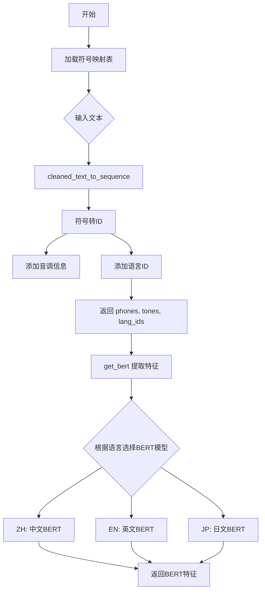
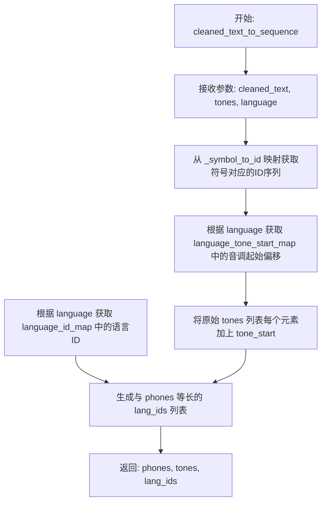
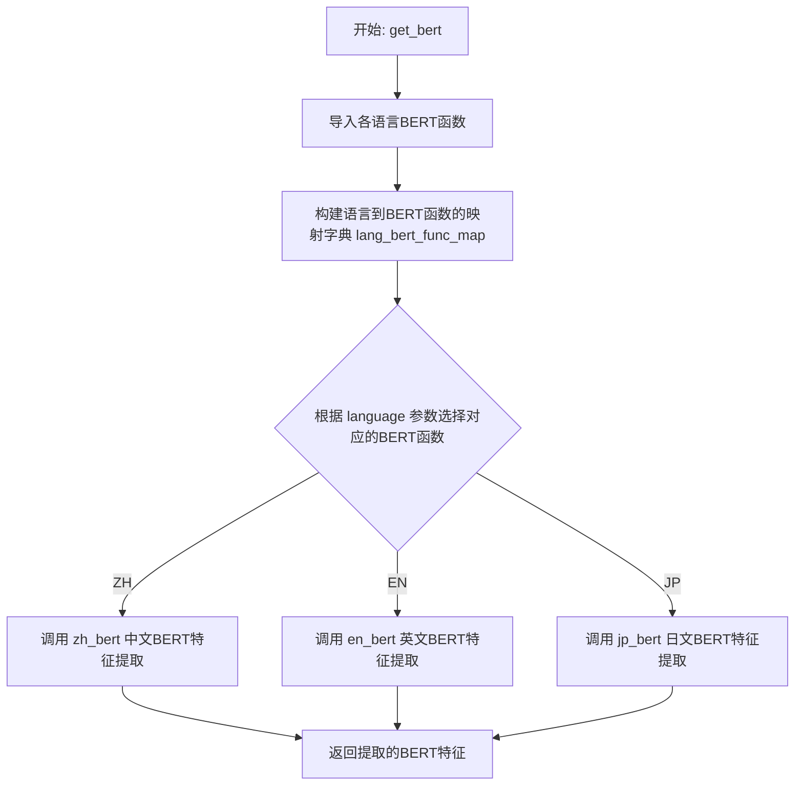
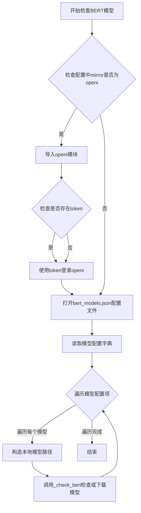
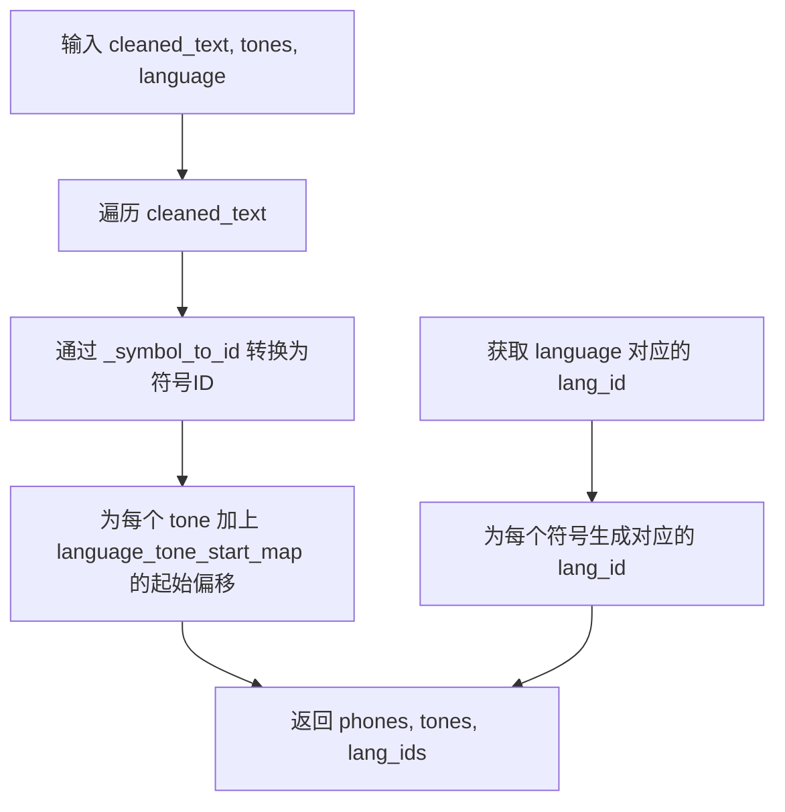
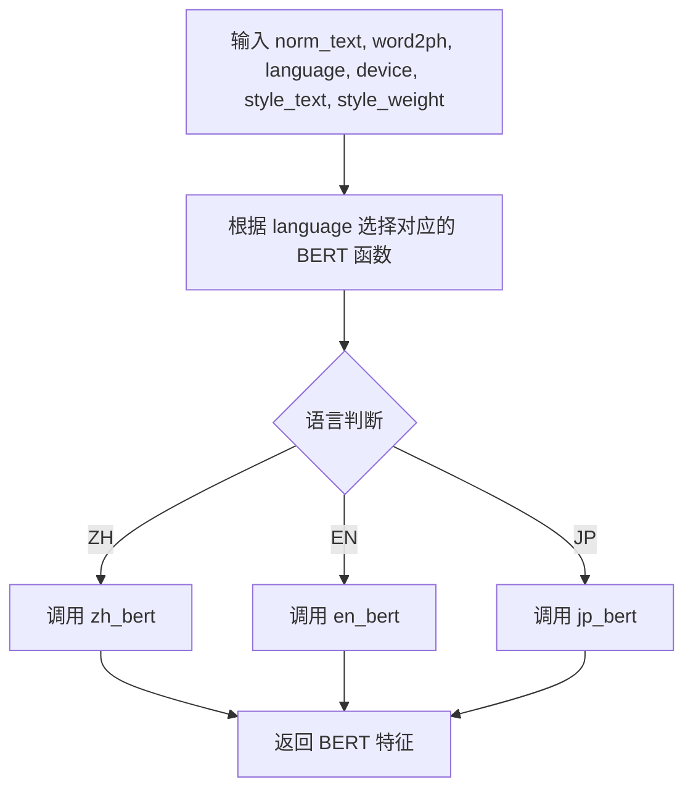
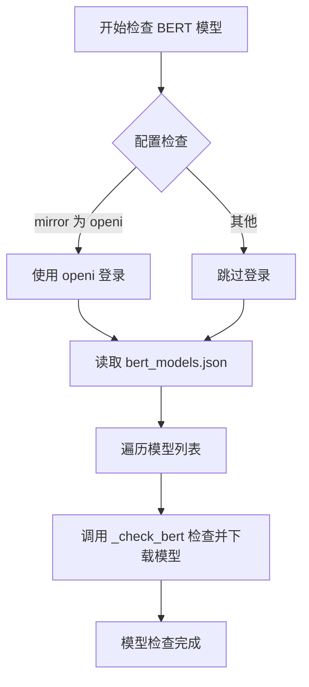

# `Bert-VITS2\oldVersion\V210\text\__init__.py` 详细设计文档

这是一个文本转语音(TTS)系统的文本处理模块，负责将输入文本转换为符号ID序列，并调用多语言BERT模型提取文本特征，支持中文(ZH)、英文(EN)和日文(JP)三种语言的文本处理。

## 整体流程



## 类结构

```
模块级别 (无类定义)
├── 全局变量
│   └── _symbol_to_id (符号到ID的映射字典)
├── 全局函数
│   ├── cleaned_text_to_sequence (文本转序列)
│   ├── get_bert (BERT特征提取)
│   └── check_bert_models (模型检查)
```

## 全局变量及字段


### `_symbol_to_id`
    
符号到ID的映射字典，由symbols列表生成

类型：`dict`
    


    

## 全局函数及方法


### `cleaned_text_to_sequence`

将清洗后的文本符号序列转换为对应的ID序列，同时根据语言调整音调偏移并生成语言ID，用于后续的语音合成模型输入。

参数：

- `cleaned_text`：`list[str]` 或 `str`，清洗后的文本符号列表，每个元素为符号（如音素）
- `tones`：`list[int]`，原始音调列表，每个元素表示对应符号的音调值
- `language`：`str`，语言标识符（如 "ZH"、"EN"、"JP"），用于获取对应的音调起始值和语言ID

返回值：`tuple[list[int], list[int], list[int]]`，返回三个列表 —— 符号ID列表、调整后的音调列表、语言ID列表

#### 流程图



#### 带注释源码

```python
# 全局符号到ID的映射表，由 symbols 列表生成
# 例如: {'aa': 0, 'ae': 1, 'ah': 2, ...}
_symbol_to_id = {s: i for i, s in enumerate(symbols)}


def cleaned_text_to_sequence(cleaned_text, tones, language):
    """Converts a string of text to a sequence of IDs corresponding to the symbols in the text.
    Args:
      text: string to convert to a sequence
    Returns:
      List of integers corresponding to the symbols in the text
    """
    # 第一步：将清洗后的文本符号转换为对应的ID序列
    # cleaned_text 中的每个 symbol 通过 _symbol_to_id 映射获取其ID
    phones = [_symbol_to_id[symbol] for symbol in cleaned_text]
    
    # 第二步：根据语言获取音调起始偏移量，并调整所有音调值
    # 不同语言的音调空间不同，需要加上起始偏移量进行归一化
    tone_start = language_tone_start_map[language]
    tones = [i + tone_start for i in tones]
    
    # 第三步：根据语言获取语言ID，并生成与音素序列等长的语言ID列表
    # 用于告诉后续模型当前序列属于哪种语言
    lang_id = language_id_map[language]
    lang_ids = [lang_id for i in phones]
    
    # 返回：符号ID序列、调整后的音调序列、语言ID序列
    return phones, tones, lang_ids
```


### `get_bert`

根据输入的语言参数，动态选择对应语言的BERT模型（中文、英文或日文），将规范化文本转换为BERT特征向量，并支持风格文本和权重的自定义处理。

参数：

- `norm_text`：`str`，规范化后的输入文本，用于BERT特征提取
- `word2ph`：`dict` 或类似结构，词汇到音素的映射关系，用于对齐文本和音素
- `language`：`str`，语言标识符，值为 "ZH"（中文）、"EN"（英文）或 "JP"（日文）
- `device`：`str` 或 `torch.device`，计算设备（如 "cuda" 或 "cpu"）
- `style_text`：`str`，风格文本，用于控制生成文本的风格特征
- `style_weight`：`float`，风格权重，控制风格文本对特征提取的影响程度

返回值：`tensor` 或 `ndarray`，提取的BERT特征向量

#### 流程图



#### 带注释源码

```python
def get_bert(norm_text, word2ph, language, device, style_text, style_weight):
    """根据语言调用对应的BERT模型提取文本特征
    
    Args:
        norm_text: 规范化后的输入文本
        word2ph: 词汇到音素的映射关系，用于文本-音素对齐
        language: 语言标识符，支持 ZH/EN/JP
        device: 计算设备
        style_text: 风格文本，控制输出风格
        style_weight: 风格权重，影响特征提取
        
    Returns:
        bert: 提取的BERT特征向量
    """
    # 导入各语言对应的BERT特征提取函数
    from .chinese_bert import get_bert_feature as zh_bert
    from .english_bert_mock import get_bert_feature as en_bert
    from .japanese_bert import get_bert_feature as jp_bert

    # 构建语言标识符到BERT函数的映射字典
    lang_bert_func_map = {"ZH": zh_bert, "EN": en_bert, "JP": jp_bert}
    
    # 根据language参数选择对应的BERT函数并调用
    bert = lang_bert_func_map[language](
        norm_text, word2ph, device, style_text, style_weight
    )
    
    # 返回提取的BERT特征
    return bert
```


### `check_bert_models`

该函数负责检查本地BERT模型文件是否存在，并在模型缺失时从配置的远程仓库（如OpenI）下载所需的BERT模型文件，确保后续语音合成或文本处理流程能够正常调用BERT特征提取功能。

参数：无需参数。

返回值：`None`，该函数直接操作文件系统或下载模型，不返回任何值。

#### 流程图



#### 带注释源码

```python
def check_bert_models():
    """检查并下载BERT模型文件，确保本地存在所需模型。
    该函数读取bert_models.json配置文件，遍历每个模型条目，
    调用_check_bert工具函数进行模型文件的校验与下载。
    """
    import json
    from pathlib import Path

    # 导入全局配置对象，用于获取模型仓库镜像源和认证信息
    from config import config
    # 导入BERT模型检查工具函数，负责实际的模型文件校验与下载逻辑
    from .bert_utils import _check_bert

    # 如果配置指定使用OpenI镜像源，则需要先登录OpenI账号
    if config.mirror.lower() == "openi":
        import openi

        # 根据是否存在token决定登录参数
        kwargs = {"token": config.openi_token} if config.openi_token else {}
        openi.login(**kwargs)

    # 打开BERT模型配置文件，读取模型仓库ID和文件列表
    with open("./bert/bert_models.json", "r") as fp:
        models = json.load(fp)
        # 遍历每个模型配置，触发模型文件的检查与下载流程
        for k, v in models.items():
            # 构造本地模型存储路径
            local_path = Path("./bert").joinpath(k)
            # 调用底层工具函数执行模型文件的检查与下载
            _check_bert(v["repo_id"], v["files"], local_path)
```

#### 全局变量与函数说明

- `_symbol_to_id`：字典类型，将音素符号映射到对应的整数ID，用于文本到序列的转换。
- `cleaned_text_to_sequence(cleaned_text, tones, language)`：函数，输入清洁文本、音调和语言，返回对应的音素ID序列、音调序列和语言ID序列。
- `get_bert(norm_text, word2ph, language, device, style_text, style_weight)`：函数，根据语言类型调用对应的BERT特征提取函数，返回BERT特征。

#### 关键组件信息

- `bert_models.json`：配置文件，位于"./bert/"目录下，存储BERT模型的仓库ID和需要下载的文件列表。
- `_check_bert`：`bert_utils`模块提供的工具函数，负责从远程仓库检查并下载模型文件到本地路径。
- `config`：全局配置对象，包含镜像源（mirror）和OpenI访问令牌（openi_token）等配置信息。

#### 潜在的技术债务或优化空间

1. **硬编码路径**：模型配置文件路径"./bert/bert_models.json"和本地存储路径"./bert/"采用硬编码方式，建议提取为配置项或支持自定义路径。
2. **错误处理缺失**：函数未对文件读取异常、JSON解析错误、网络下载失败等情况进行捕获和处理，可能导致程序中断。
3. **登录逻辑冗余**：OpenI登录逻辑仅在mirror为"openi"时执行，但未考虑其他镜像源或认证方式，扩展性受限。
4. **同步阻塞操作**：模型下载为同步操作，在网络较差时可能阻塞主线程，建议考虑异步下载或后台任务。

#### 其它项目

- **设计目标**：确保BERT模型文件本地可用，支持多语言（中文、英文、日文）BERT特征的提取。
- **约束条件**：依赖config中的mirror配置决定模型仓库来源；需要网络连接以下载模型；本地存储空间需满足模型文件大小要求。
- **错误处理**：当前版本未实现系统的异常捕获机制，建议增加文件缺失、网络超时、仓库访问权限等场景的错误提示与回退策略。
- **外部依赖**：需要正确安装config模块、bert_utils模块、openi库（当使用OpenI镜像时），以及json、pathlib等标准库。


## 关键组件


### symbols 符号表

从 symbols 模块导入的所有符号定义，构成文本到语音转换的基础符号集

### _symbol_to_id 全局变量

将符号映射为唯一ID的字典，用于快速查找符号对应的数值索引

### cleaned_text_to_sequence 函数

将输入的清理文本、语调信息和语言类型转换为对应的符号ID、语调序列和语言ID序列的函数

### get_bert 函数

根据语言类型动态加载并调用对应语言的BERT模型获取文本特征表示，支持中文、英文、日文三种语言

### check_bert_models 函数

检查并确保所需的BERT模型文件已正确下载，通过配置文件和远程模型仓库进行模型验证

### language_tone_start_map 映射

定义不同语言的语调起始偏移值，用于调整语调序列

### language_id_map 映射

定义不同语言对应的语言ID，用于标识文本所属语言

### lang_bert_func_map 语言BERT函数映射

根据语言代码动态路由到对应的BERT特征提取函数

### bert_models.json 配置文件

存储BERT模型仓库ID和文件列表的JSON配置文件，用于模型下载和验证


## 问题及建议


### 已知问题

-   **硬编码路径问题**：代码中使用了硬编码路径 `"./bert/bert_models.json"` 和 `Path("./bert")`，缺乏灵活的配置机制
-   **缺少错误处理**：`cleaned_text_to_sequence` 中遍历 `cleaned_text` 时没有处理符号不在 `_symbol_to_id` 字典中的情况，会抛出 `KeyError` 异常
-   **模块级副作用**：`check_bert_models()` 在模块导入时立即执行，会导致模块加载变慢，且可能在不需要BERT功能时也触发模型检查/下载
-   **函数内部导入**：`get_bert` 函数内部进行条件导入，虽然可能避免循环依赖，但影响代码可读性和性能
-   **全局变量依赖不明确**：代码依赖 `symbols`、`language_tone_start_map`、`language_id_map` 等全局变量，但这些在当前代码片段中未定义
-   **缺乏类型注解**：所有函数都缺少类型提示（type hints），降低代码可维护性
-   **列表推导式低效**：`[lang_id for i in phones]` 可以简化为 `[lang_id] * len(phones)`，后者更高效

### 优化建议

-   将硬编码路径提取为配置文件或环境变量，使用 `pathlib.Path` 结合项目根目录计算相对路径
-   为 `cleaned_text_to_sequence` 添加异常处理，对未知符号记录警告或使用默认ID代替
-   延迟执行 `check_bert_models()`，改为按需调用或提供显式初始化函数
-   将 `get_bert` 中的导入移至模块顶部或使用延迟加载装饰器/缓存机制
-   为所有函数添加类型注解，提升代码可读性和 IDE 支持
-   使用 `[lang_id] * len(phones)` 替换列表推导式
-   对 `language` 参数进行校验，确保只接受支持的语言代码
-   将 `check_bert_models` 中的文件读取和JSON解析包裹在 try-except 块中，提供友好的错误信息

## 其它


### 项目概述

本模块是文本转语音（TTS）系统的核心文本处理模块，主要负责将清洗后的文本转换为符号ID序列，并支持多语言（中文、英文、日文）的BERT特征提取，为后续的语音合成提供文本表示基础。

### 整体流程

本模块的运行流程如下：首先通过`check_bert_models()`函数在模块加载时检查并下载所需的BERT模型；然后`cleaned_text_to_sequence()`函数将输入的文本字符串转换为符号ID序列，同时处理音调和语言信息；最后`get_bert()`函数根据语言类型调用对应的BERT模型获取文本的语义特征。整个流程确保了文本到语音合成的数据准备完整性。

### 全局变量

### _symbol_to_id

- **类型**: Dict[str, int]
- **描述**: 符号到ID的映射字典，将symbols列表中的每个符号映射到对应的索引值，用于文本到ID的转换

### 语言映射变量

- **类型**: 字典（来自symbols模块）
- **描述**: 包含symbols列表、language_tone_start_map和language_id_map等从symbols模块导入的全局映射变量，用于文本处理的语言相关配置

### 全局函数

### cleaned_text_to_sequence

- **参数**:
  - cleaned_text: List[str], 待转换的清洗后文本符号列表
  - tones: List[int], 文本对应的音调信息列表
  - language: str, 语言类型标识
- **返回值类型**: Tuple[List[int], List[int], List[int]]
- **返回值描述**: 返回三个列表，分别是符号ID序列、音调序列（已加上语言音调起始偏移）、语言ID序列
- **流程图**:



- **源码**:

```python
def cleaned_text_to_sequence(cleaned_text, tones, language):
    """Converts a string of text to a sequence of IDs corresponding to the symbols in the text.
    Args:
      text: string to convert to a sequence
    Returns:
      List of integers corresponding to the symbols in the text
    """
    phones = [_symbol_to_id[symbol] for symbol in cleaned_text]
    tone_start = language_tone_start_map[language]
    tones = [i + tone_start for i in tones]
    lang_id = language_id_map[language]
    lang_ids = [lang_id for i in phones]
    return phones, tones, lang_ids
```

### get_bert

- **参数**:
  - norm_text: str, 归一化后的文本
  - word2ph: List[int], 字到音素的映射
  - device: str, 计算设备标识
  - style_text: str, 风格文本（用于风格控制）
  - style_weight: float, 风格权重
- **返回值类型**: Any（BERT特征矩阵）
- **返回值描述**: 返回指定语言的BERT模型提取的文本特征向量
- **流程图**:



- **源码**:

```python
def get_bert(norm_text, word2ph, language, device, style_text, style_weight):
    from .chinese_bert import get_bert_feature as zh_bert
    from .english_bert_mock import get_bert_feature as en_bert
    from .japanese_bert import get_bert_feature as jp_bert

    lang_bert_func_map = {"ZH": zh_bert, "EN": en_bert, "JP": jp_bert}
    bert = lang_bert_func_map[language](
        norm_text, word2ph, device, style_text, style_weight
    )
    return bert
```

### check_bert_models

- **参数**: 无
- **返回值类型**: None
- **返回值描述**: 无返回值，仅执行模型检查和下载操作
- **流程图**:



- **源码**:

```python
def check_bert_models():
    import json
    from pathlib import Path

    from config import config
    from .bert_utils import _check_bert

    if config.mirror.lower() == "openi":
        import openi

        kwargs = {"token": config.openi_token} if config.openi_token else {}
        openi.login(**kwargs)

    with open("./bert/bert_models.json", "r") as fp:
        models = json.load(fp)
        for k, v in models.items():
            local_path = Path("./bert").joinpath(k)
            _check_bert(v["repo_id"], v["files"], local_path)
```

### 关键组件信息

### symbols 模块

- **描述**: 导入symbols列表、language_tone_start_map和language_id_map，定义文本处理所需的符号集和语言映射关系

### 多语言BERT模块

- **描述**: 包含chinese_bert、english_bert_mock和japanese_bert三个子模块，分别实现对应语言的BERT特征提取功能

### bert_utils 模块

- **描述**: 提供_check_bert函数用于检查和下载BERT模型资源

### 设计目标与约束

本模块的设计目标是为TTS系统提供文本到符号ID的转换能力和多语言语义特征提取能力。约束条件包括：仅支持ZH、EN、JP三种语言；依赖外部BERT模型文件；需要配置文件指定模型下载源（mirror）；文本输入必须经过清洗和归一化处理。

### 错误处理与异常设计

模块主要存在以下错误处理需求：`cleaned_text_to_sequence`中如果遇到未定义的符号会抛出KeyError，建议增加符号验证和错误提示；`get_bert`中如果传入不支持的语言代码会抛出KeyError，建议在函数入口增加语言合法性检查；`check_bert_models`中文件读取失败会抛出FileNotFoundError，模型下载失败会抛出相应异常，建议增加重试机制和更友好的错误提示；配置文件缺失或mirror配置错误会导致模型检查失败。

### 外部依赖与接口契约

模块依赖以下外部组件：symbols模块（symbols列表、language_tone_start_map、language_id_map）；config模块（提供mirror配置和openi_token）；bert_models.json配置文件（定义BERT模型仓库ID和文件列表）；chinese_bert/english_bert_mock/japanese_bert三个BERT特征提取模块；bert_utils模块的_check_bert函数。接口契约要求：`cleaned_text_to_sequence`输入的cleaned_text必须是已存在于symbols中的符号列表，tones和language必须与配置匹配；`get_bert`的language参数必须是ZH/EN/JP之一，device必须是有效的PyTorch设备标识。

### 潜在技术债务与优化空间

当前代码存在以下优化空间：BERT模块采用延迟导入（函数内部导入），这虽然减少了启动时间，但增加了首次调用的延迟，可以考虑使用预加载策略；`check_bert_models`在模块级别自动执行，可能导致不必要的启动开销，建议改为按需调用或提供显式初始化接口；`cleaned_text_to_sequence`中列表推导式可以进一步优化为生成器以减少内存占用；缺少对输入参数的类型注解，建议增加typing以提升代码可维护性；english_bert_mock命名表明当前英文BERT可能是模拟实现，需要在后续替换为真实模型。


    