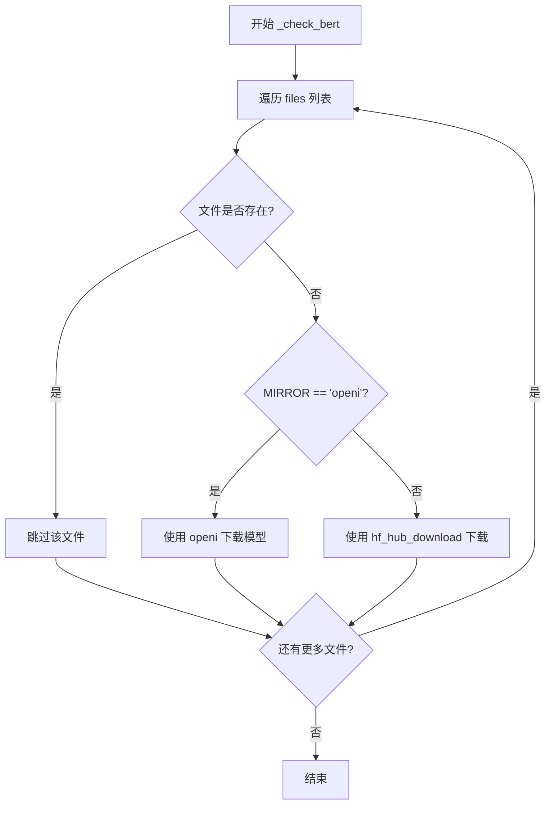
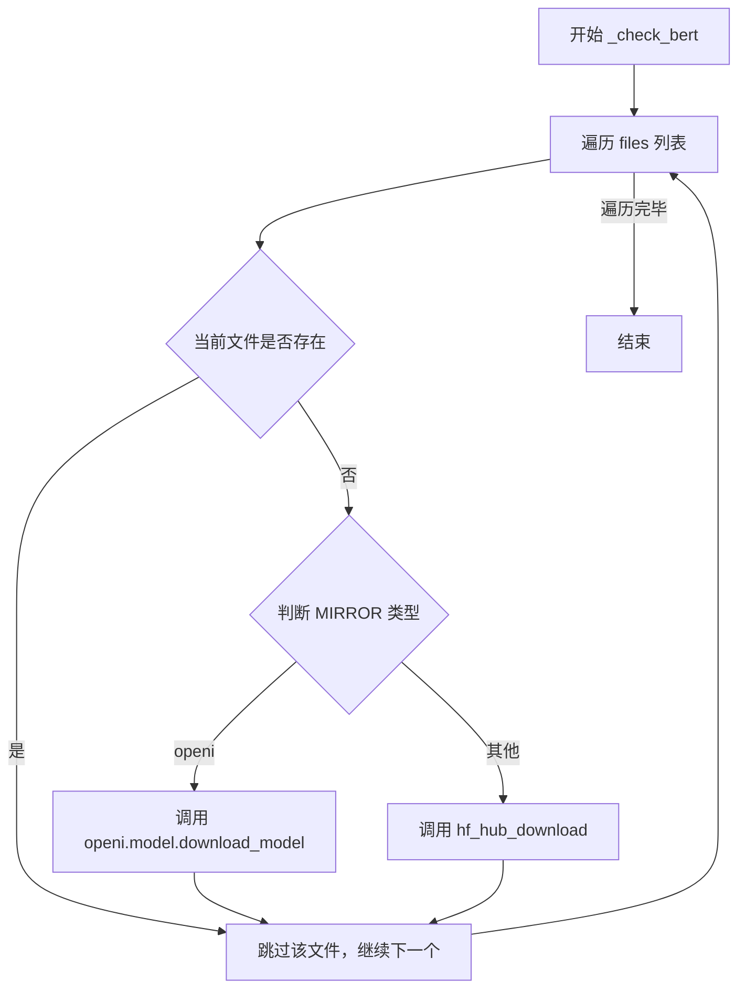

# `Bert-VITS2\oldVersion\V210\text\bert_utils.py` 详细设计文档

该代码实现了一个BERT模型文件的检查与下载功能，支持从HuggingFace Hub或OpenI镜像站下载模型文件，并根据配置文件中的MIRROR字段选择不同的下载源。

## 整体流程



## 类结构

```
模块: bert_downloader.py (无类定义)
├── 全局变量: MIRROR
└── 全局函数: _check_bert
```

## 全局变量及字段


### `MIRROR`
    
从config获取的镜像源配置

类型：`str`
    


    

## 全局函数及方法


### `_check_bert`

该函数用于检查本地是否存在指定的BERT模型文件，若文件缺失则根据配置的镜像源从远程仓库下载相应的模型文件。

参数：

- `repo_id`：`str`，HuggingFace Hub 上的模型仓库 ID，格式为 `username/repo_name`
- `files`：`list`，需要检查并下载的文件名列表
- `local_path`：`str`，本地用于存储模型文件的目录路径

返回值：`None`，该函数仅执行文件检查和下载操作，无返回值

#### 流程图



#### 带注释源码

```python
from pathlib import Path

from huggingface_hub import hf_hub_download

from config import config

# 全局变量：从配置中读取模型下载镜像源
MIRROR: str = config.mirror


def _check_bert(repo_id, files, local_path):
    """
    检查并下载BERT模型文件
    
    参数:
        repo_id: HuggingFace仓库ID
        files: 需要检查的文件名列表
        local_path: 本地存储路径
    """
    # 遍历需要检查的每个文件
    for file in files:
        # 拼接完整文件路径并检查文件是否存在
        if not Path(local_path).joinpath(file).exists():
            # 根据MIRROR配置选择不同的下载方式
            if MIRROR.lower() == "openi":
                # 使用OpenI镜像站下载模型
                import openi

                openi.model.download_model(
                    "Stardust_minus/Bert-VITS2", repo_id.split("/")[-1], "./bert"
                )
            else:
                # 使用HuggingFace Hub官方渠道下载
                # local_dir_use_symlinks=False 表示直接下载文件而非创建符号链接
                hf_hub_download(
                    repo_id, file, local_dir=local_path, local_dir_use_symlinks=False
                )
```

## 关键组件


### MIRROR 全局变量

全局配置变量，字符串类型，用于控制模型下载的镜像源。当值为"openi"时使用OpenI镜像，否则使用HuggingFace Hub官方源。

### _check_bert 函数

核心下载检查函数，负责验证本地是否存在指定的BERT模型文件，若不存在则根据MIRROR配置选择对应的下载渠道进行模型文件获取。

### openi 模块（条件导入）

OpenI镜像平台的模型下载模块，仅当MIRROR配置为"openi"时导入，用于从OpenI平台下载Stardust_minus/Bert-VITS2模型。

### hf_hub_download 函数

HuggingFace Hub官方下载工具，当MIRROR不为"openi"时使用，支持从HuggingFace Hub仓库下载指定的模型文件到本地目录。

### config 配置模块

外部配置模块，提供mirror配置项，用于运行时指定模型下载的镜像源。

### Path 文件路径工具

Python标准库pathlib.Path类，用于构建和检查本地文件路径，判断模型文件是否已存在于本地。


## 问题及建议


### 已知问题

-   **硬编码的模型信息**: "Stardust_minus/Bert-VITS2" 和 "./bert" 路径被硬编码在代码中，降低了函数的通用性和可复用性
-   **异常处理缺失**: 缺少 try-except 块，网络下载操作可能因网络问题、仓库不存在等原因失败，但没有错误处理机制
-   **类型注解缺失**: 函数参数和返回值没有类型注解，影响代码可读性和 IDE 智能提示支持
-   **导入语句位置不当**: `import openi` 放在条件分支内部，每次调用时都会执行 MIRROR.lower() 判断，逻辑可优化
-   **函数名与实际功能不符**: 函数名 `_check_bert` 暗示仅做检查，但实际包含下载逻辑，命名具有误导性
-   **魔法字符串**: 仓库 ID 和本地路径未作为参数化配置，违反 DRY 原则
-   **无返回值机制**: 调用方无法获知文件是否已下载或下载是否成功，状态反馈不明确
-   **路径验证缺失**: 未检查 local_path 是否有效或可创建，直接使用可能引发路径错误

### 优化建议

-   **添加类型注解**: 为函数参数和返回值添加类型提示，提升代码可维护性
-   **异常处理**: 包装下载逻辑为 try-except 块，捕获网络异常、文件不存在等错误，并进行适当处理或日志记录
-   **参数化配置**: 将 repo_id 和 local_path 作为函数参数传入，或从配置文件读取，提高函数通用性
-   **重构函数职责**: 将检查和下载逻辑分离，或重命名为如 `_ensure_bert_files` 等更描述性的名称
-   **模块级导入优化**: 将 `import openi` 移至文件顶部条件导入，避免重复判断
-   **添加返回值**: 返回布尔值或下载状态信息，使调用方能够感知执行结果
-   **路径预检查**: 在使用路径前验证其有效性，必要时自动创建目录
-   **日志记录**: 添加日志输出，跟踪文件检查和下载状态，便于调试和监控


## 其它


### 设计目标与约束

本模块的设计目标是在本地缺少BERT模型文件时自动下载相应的模型文件。约束条件包括：1) 仅支持HuggingFace Hub和OpenI两种镜像源；2) 下载路径默认为"./bert"目录；3) 不使用符号链接，直接复制文件到本地。

### 错误处理与异常设计

当MIRROR配置为"openi"时，调用openi.model.download_model可能会抛出网络异常、认证失败等异常。当MIRROR为其他值时，hf_hub_download可能抛出连接超时、仓库不存在、文件不存在等异常。当前代码未对这些异常进行捕获和处理，建议添加try-except块并记录日志。

### 数据流与状态机

该模块的数据流较为简单：首先检查本地路径是否存在目标文件，若文件不存在则根据MIRROR配置选择对应的下载方式（OpenI或HuggingFace），最后将模型文件下载到本地目录。状态机包含两个状态：文件存在（跳过下载）和文件不存在（执行下载）。

### 外部依赖与接口契约

本模块依赖以下外部组件：1) huggingface_hub库的hf_hub_download函数，用于从HuggingFace Hub下载模型；2) openi库的model.download_model函数，用于从OpenI镜像站下载模型；3) config模块提供的mirror配置项。接口契约要求调用方传入正确的repo_id、files列表和local_path参数。

### 版本兼容性说明

该代码适用于Python 3.8+环境，huggingface_hub版本需>=0.19.0，pathlib为Python标准库无需额外安装。


    