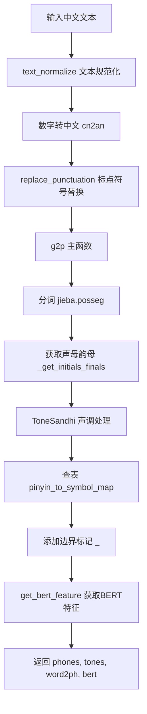
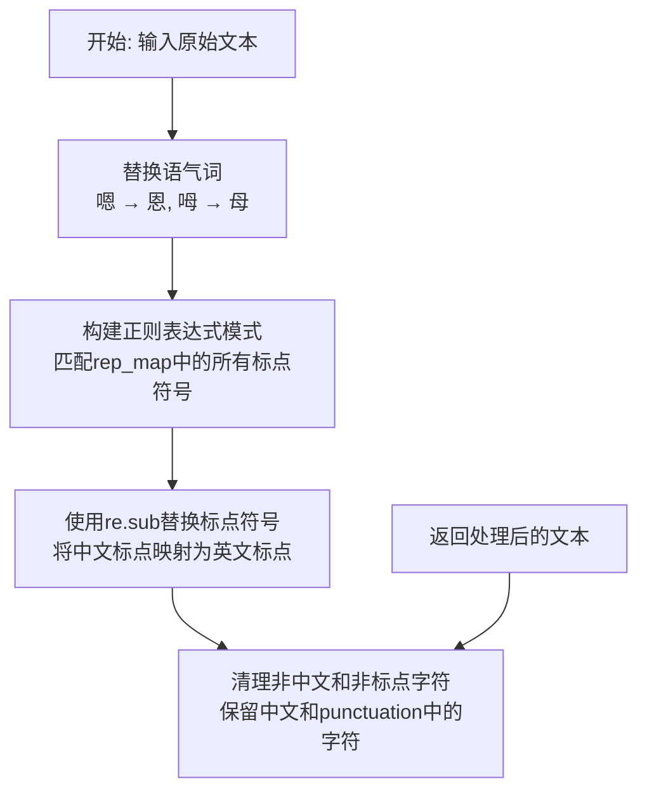
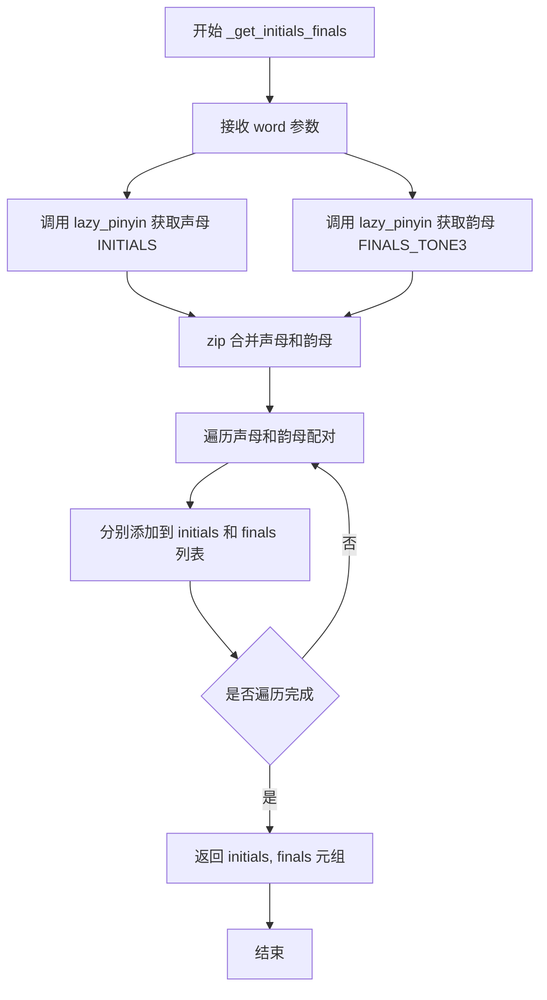
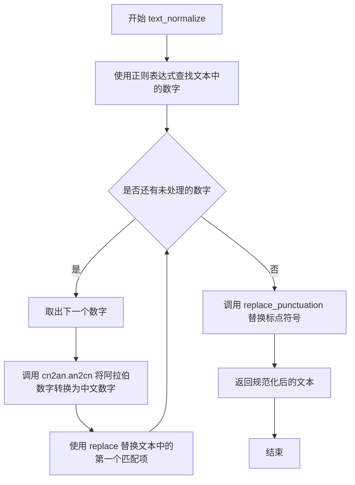
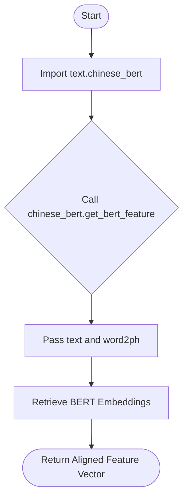
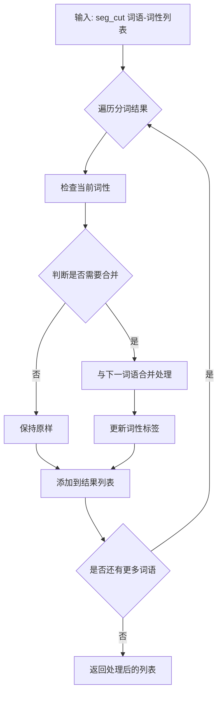
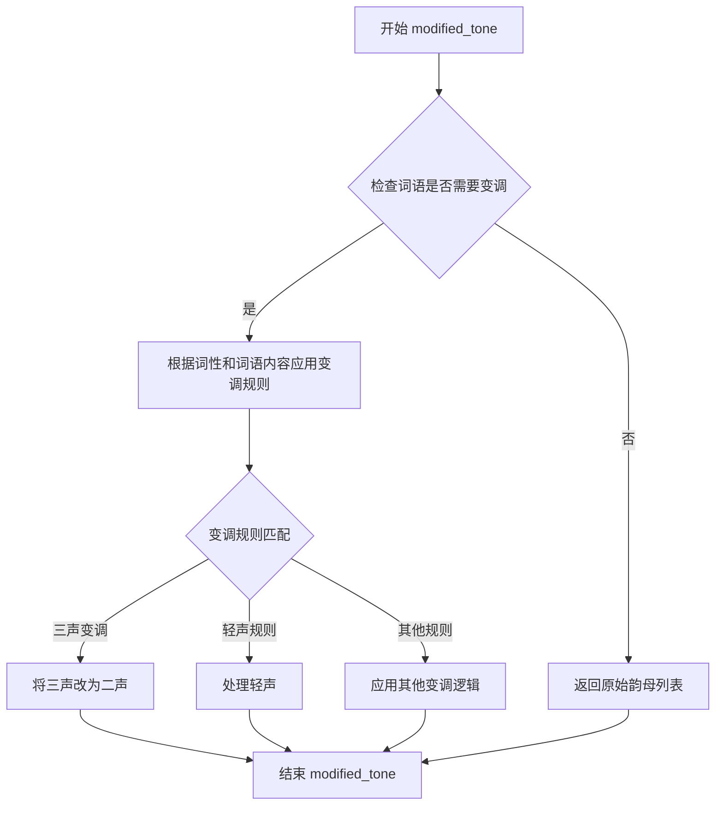

# `Bert-VITS2\oldVersion\V210\text\chinese.py` 详细设计文档

这是一个中文文本转语音（TTS）前处理模块，主要功能是将中文文本转换为拼音（phonemes）、声调（tones）和词到音素的映射（word2ph），并提取BERT特征用于后续的语音合成。

## 整体流程



## 类结构

```
text (包)
├── __init__.py (主模块)
├── symbols.py (标点符号定义)
└── tone_sandhi.py (声调处理类)
```

## 全局变量及字段


### `current_file_path`
    
当前文件路径，用于定位资源文件

类型：`str`
    


### `pinyin_to_symbol_map`
    
拼音到符号的映射表，用于将拼音转换为音素符号

类型：`dict`
    


### `rep_map`
    
标点符号替换映射表，用于统一标点符号格式

类型：`dict`
    


### `tone_modifier`
    
声调处理对象，用于处理中文声调变化

类型：`ToneSandhi`
    


    

## 全局函数及方法


### `replace_punctuation`

该函数用于将文本中的中文标点符号统一替换为英文标点符号，并移除所有非中文和非标点符号的字符，同时对特定语气词进行转换。

参数：

- `text`：`str`，需要处理的原始文本

返回值：`str`，完成标点符号替换并清理后的文本

#### 流程图



#### 带注释源码

```python
def replace_punctuation(text):
    """
    替换文本中的标点符号，将中文标点转换为英文标点，并清理非中文字符
    
    处理步骤：
    1. 将语气词嗯、呣转换为恩、母
    2. 使用rep_map将各类中文标点替换为英文标点
    3. 移除所有非中文和非标点符号的字符
    
    Args:
        text: str, 输入的原始文本
        
    Returns:
        str, 处理后的文本
    """
    # 第一步：语气词转换
    # 将"嗯"替换为"恩"，"呣"替换为"母"
    text = text.replace("嗯", "恩").replace("呣", "母")
    
    # 第二步：构建正则表达式
    # 将rep_map字典中的所有键（标点符号）用|连接，生成匹配模式
    # re.escape对特殊字符进行转义，避免正则表达式语法错误
    pattern = re.compile("|".join(re.escape(p) for p in rep_map.keys()))
    
    # 使用lambda函数替换匹配的标点符号
    # rep_map存储了中文标点->英文标点的映射关系
    replaced_text = pattern.sub(lambda x: rep_map[x.group()], text)
    
    # 第三步：清理非中文和非标点字符
    # 保留中文字符(\u4e00-\u9fa5)和punctuation中定义的标点符号
    # 移除所有其他字符（英文、数字、空格等）
    replaced_text = re.sub(
        r"[^\u4e00-\u9fa5" + "".join(punctuation) + r"]+", "", replaced_text
    )
    
    # 返回处理后的文本
    return replaced_text
```

#### 相关配置数据

**rep_map 映射表（部分关键映射）：**

| 源字符 | 目标字符 | 说明 |
|--------|----------|------|
| "：" | "," | 冒号 |
| "；" | "," | 分号 |
| "，" | "," | 逗号 |
| "。" | "." | 句号 |
| "！" | "!" | 感叹号 |
| "？" | "?" | 问号 |
| "（" | "'" | 左括号 |
| "）" | "'" | 右括号 |
| "《" | "'" | 书名号 |
| "【" | "'" | 方括号 |
| "…" | "..." | 省略号 |

#### 潜在优化空间

1. **正则表达式预编译**：当前每次调用都重新编译正则表达式，可以将 `pattern` 提到函数外作为模块级变量预编译
2. **字符串拼接优化**：`"".join(punctuation)` 在每次调用时都会执行，可以缓存结果
3. **rep_map 读取方式**：当前 `rep_map` 是硬编码在文件中的，可以考虑抽离为配置文件提高可维护性


### `g2p`

g2p是文本转拼音的主函数，接收原始文本输入，通过标点符号分割句子，调用内部函数进行拼音转换处理，并返回音素列表、声调列表和字到音素的映射列表。

参数：

- `text`：`str`，待转换为拼音的文本

返回值：`(list[str], list[int], list[int])`，返回元组包含三个元素：phones音素列表（添加起始和结束标记"_"）、tones声调列表（添加起始和结束标记0）、word2ph字到音素的映射列表（添加起始和结束标记1）

#### 流程图

```mermaid
flowchart TD
    A[开始 g2p] --> B{输入文本}
    B --> C[构建标点符号分割正则]
    C --> D[按标点符号分割文本成句子列表]
    D --> E[调用 _g2p 处理句子列表]
    E --> F[验证 sum word2ph == len phones]
    F --> G[验证 len word2ph == len text]
    G --> H[phones 前后添加 "_"]
    H --> I[tones 前后添加 0]
    I --> J[word2ph 前后添加 1]
    J --> K[返回 phones, tones, word2ph]
```

#### 带注释源码

```python
def g2p(text):
    """
    文本转拼音的主函数
    
    该函数是整个拼音转换流程的入口点，负责：
    1. 按标点符号分割输入文本
    2. 调用内部函数 _g2p 进行实际的拼音转换
    3. 验证转换结果的一致性
    4. 添加静音标记（用于语音合成）
    
    参数:
        text: str - 原始中文文本输入
        
    返回:
        tuple: (phones, tones, word2ph)
            - phones: 音素列表，每个元素为一个音素字符串
            - tones: 声调列表，每个元素为一个整数（0-5，0表示轻声）
            - word2ph: 字到音素的映射列表，表示每个汉字对应多少个音素
    """
    # 构建正则表达式，用于按标点符号分割句子
    # (?<=...) 是后顾断言，匹配标点符号后面的位置（不含标点本身）
    # \s* 匹配可选的空白字符
    pattern = r"(?<=[{0}])\s*".format("".join(punctuation))
    
    # 使用正则分割文本，并过滤空字符串
    sentences = [i for i in re.split(pattern, text) if i.strip() != ""]
    
    # 调用内部函数 _g2p 进行实际的拼音转换
    phones, tones, word2ph = _g2p(sentences)
    
    # 验证转换结果的正确性
    assert sum(word2ph) == len(phones), "word2ph总和应等于phones长度"
    assert len(word2ph) == len(text), "word2ph长度应等于原文长度"
    
    # 添加静音标记，用于语音合成的前后静音处理
    # "_" 在语音合成中通常表示静音或停顿
    phones = ["_"] + phones + ["_"]
    tones = [0] + tones + [0]      # 0 表示轻声/静音
    word2ph = [1] + word2ph + [1"]  # 前后各加1个映射
    
    return phones, tones, word2ph
```


### `_g2p`

`_g2p` 是文本转拼音的核心内部函数，负责将经过预处理的文本分片转换为音素序列、音调序列以及字符与音素的对应关系。该函数首先使用结巴分词进行中文分词，然后针对每个词语获取其声母和韵母，并进行声调处理，最后通过查表将拼音转换为对应的音素符号，同时处理多音字和特殊拼音规则。

参数：

-  `segments`：list，分词后的文本片段列表，每个元素是一个字符串，表示一句话或一个分词后的文本块

返回值：tuple，包含三个列表 (phones_list, tones_list, word2ph)
-  `phones_list`：list，音素列表，将文本转换为一系列音素符号（如 ["_", "a", "i", "n", "_"]）
-  `tones_list`：list，音调列表，与音素对应的声调信息（0-5，其中0表示轻声，5表示五声）
-  `word2ph`：list，字符到音素的映射，表示每个原始字符对应多少个音素

#### 流程图

```mermaid
flowchart TD
    A[开始 _g2p] --> B[初始化 phones_list, tones_list, word2ph]
    B --> C{遍历 segments}
    C -->|seg| D[去除英文字母: re.sub]
    D --> E[使用 jieba 分词: psg.lcut]
    E --> F[tone_modifier.pre_merge_for_modify 预处理]
    F --> G{遍历分词结果 seg_cut}
    G -->|word, pos| H{pos == 'eng'}
    H -->|是| I[跳过继续下一个词]
    H -->|否| J[_get_initials_finals 获取声母韵母]
    J --> K[tone_modifier.modified_tone 声调处理]
    K --> L[追加到 initials 和 finals 列表]
    L --> G
    G -->|分词完成| M[扁平化 initials 和 finals]
    M --> N{遍历声母韵母对}
    N -->|c, v| O{c == v}
    O -->|是| P[标点符号处理]
    P --> Q[phone = [c], tone = 0]
    O -->|否| R[分离韵母和声调]
    R --> S[提取声调 v[-1] 和韵母主体 v_without_tone]
    S --> T{c 是否为空}
    T -->|是| U[多音节处理: v_rep_map]
    T -->|否| V[单音节处理: pinyin_rep_map 和 single_rep_map]
    U --> W{查表替换}
    V --> W
    W --> X[验证 pinyin 在映射表中]
    X --> Y[pinyin_to_symbol_map 查表转音素]
    Y --> Z[word2ph 追加音素个数]
    Q --> Z
    Z --> N
    N -->|遍历完成| AA[phones_list 追加音素]
    AA --> BB[tones_list 追加对应声调]
    BB --> C
    C -->|遍历完成| CC[返回 phones_list, tones_list, word2ph]
```

#### 带注释源码

```python
def _g2p(segments):
    """
    将文本分片列表转换为音素序列、音调序列和字符-音素映射
    
    参数:
        segments: list[str], 经过预处理的文本片段列表
        
    返回:
        tuple: (phones_list, tones_list, word2ph) - 音素列表、声调列表、字符到音素的映射
    """
    # 初始化结果容器
    phones_list = []  # 存储所有音素
    tones_list = []   # 存储所有声调
    word2ph = []      # 存储字符与音素的对应关系
    
    # 遍历每个文本片段
    for seg in segments:
        # 步骤1: 去除段落中的所有英文字母
        # 正则表达式 [a-zA-Z]+ 匹配一个或多个英文字母
        seg = re.sub("[a-zA-Z]+", "", seg)
        
        # 步骤2: 使用结巴分词进行中文分词
        # 返回 [(word, pos), ...] 的列表，pos 为词性
        seg_cut = psg.lcut(seg)
        
        # 初始化当前片段的声母和韵母列表
        initials = []
        finals = []
        
        # 步骤3: 声调前置处理
        # 合并某些连续字符以进行声调修正
        seg_cut = tone_modifier.pre_merge_for_modify(seg_cut)
        
        # 步骤4: 遍历分词结果
        for word, pos in seg_cut:
            # 跳过英文词性（已在上一步去除，但以防万一）
            if pos == "eng":
                continue
            
            # 获取当前词的声母和韵母（带声调）
            # _get_initials_finals 返回 (initials列表, finals列表)
            sub_initials, sub_finals = _get_initials_finals(word)
            
            # 步骤5: 声调修正处理
            # 根据词性和词语内容调整韵母的声调
            sub_finals = tone_modifier.modified_tone(word, pos, sub_finals)
            
            # 追加到当前片段的声母/韵母列表
            initials.append(sub_initials)
            finals.append(sub_finals)
        
        # 步骤6: 扁平化处理
        # 将嵌套列表展开为一级列表
        # 例如: [["a", "b"], ["c"]] -> ["a", "b", "c"]
        initials = sum(initials, [])
        finals = sum(finals, [])
        
        # 步骤7: 遍历声母韵母对，转换为音素
        for c, v in zip(initials, finals):
            # 拼接原始拼音（声母+韵母+声调）
            raw_pinyin = c + v
            
            # 特殊情况处理: 标点符号
            # 如果声母等于韵母，说明是标点符号
            if c == v:
                assert c in punctuation  # 验证确实是标点
                phone = [c]              # 标点符号直接作为音素
                tone = "0"               # 标点无实际声调
                word2ph.append(1)        # 标点对应1个音素
            else:
                # 正常汉字拼音处理
                # 分离韵母主体和声调
                # 例如: "ang2" -> "ang", "2"
                v_without_tone = v[:-1]  # 去掉最后一个字符（声调）
                tone = v[-1]              # 最后一个字符是声调 (1-5)
                
                # 组合为不带声调的拼音
                pinyin = c + v_without_tone
                assert tone in "12345"   # 声调必须是1-5
                
                # 步骤8: 韵母替换映射（多音节情况）
                if c:
                    # 声母不为空，属于多音节词
                    v_rep_map = {
                        "uei": "ui",   # 对应 -> ui
                        "iou": "iu",   # 优 -> iu
                        "uen": "un",   # 温 -> un
                    }
                    if v_without_tone in v_rep_map.keys():
                        pinyin = c + v_rep_map[v_without_tone]
                else:
                    # 声母为空，属于单音节词（零声母）
                    pinyin_rep_map = {
                        "ing": "ying",  # ing -> ying
                        "i": "yi",      # i -> yi
                        "in": "yin",    # in -> yin
                        "u": "wu",      # u -> wu
                    }
                    if pinyin in pinyin_rep_map.keys():
                        pinyin = pinyin_rep_map[pinyin]
                    else:
                        # 进一步处理单个字母的替换
                        single_rep_map = {
                            "v": "yu",  # v -> yu
                            "e": "e",   # e -> e
                            "i": "y",   # i -> y
                            "u": "w",   # u -> w
                        }
                        if pinyin[0] in single_rep_map.keys():
                            pinyin = single_rep_map[pinyin[0]] + pinyin[1:]
                
                # 步骤9: 验证拼音在映射表中存在
                assert pinyin in pinyin_to_symbol_map.keys(), (pinyin, seg, raw_pinyin)
                
                # 步骤10: 查表获取音素序列
                # pinyin_to_symbol_map[pinyin] 返回空格分隔的音素串
                # 例如: "y i" -> ["y", "i"]
                phone = pinyin_to_symbol_map[pinyin].split(" ")
                
                # 记录该汉字对应多少个音素
                word2ph.append(len(phone))
            
            # 步骤11: 追加到结果列表
            phones_list += phone
            # 为每个音素追加对应的声调
            # 例如: tone=2, phone=["a", "i"] -> tones_list = [2, 2]
            tones_list += [int(tone)] * len(phone)
    
    return phones_list, tones_list, word2ph
```


### `_get_initials_finals`

获取汉字的声母和韵母，将输入的汉字词组分别拆分为声母列表和韵母列表，返回两个列表用于后续的拼音到音素的转换处理。

参数：

- `word`：`str`，需要获取声母和韵母的汉字词组

返回值：`tuple[list[str], list[str]]`，返回一个包含两个列表的元组，第一个列表为声母列表，第二个列表为韵母列表

#### 流程图



#### 带注释源码

```python
def _get_initials_finals(word):
    """
    获取汉字的声母和韵母
    
    参数:
        word: str, 需要获取声母和韵母的汉字词组
    
    返回:
        tuple: (声母列表, 韵母列表)
    """
    # 初始化声母和韵母列表
    initials = []
    finals = []
    
    # 使用 pypinyin 的 lazy_pinyin 获取声母
    # neutral_tone_with_five=True 表示使用五声调体系
    # Style.INITIALS 表示获取声母
    orig_initials = lazy_pinyin(word, neutral_tone_with_five=True, style=Style.INITIALS)
    
    # 使用 pypinyin 的 lazy_pinyin 获取韵母（带声调）
    # Style.FINALS_TONE3 表示获取带声调的韵母（使用数字表示声调）
    orig_finals = lazy_pinyin(
        word, neutral_tone_with_five=True, style=Style.FINALS_TONE3
    )
    
    # 使用 zip 将声母和韵母配对遍历
    for c, v in zip(orig_initials, orig_finals):
        # c 为声母，v 为韵母
        initials.append(c)
        finals.append(v)
    
    # 返回声母列表和韵母列表的元组
    return initials, finals
```


### `text_normalize`

该函数实现文本规范化功能，主要将文本中的数字转换为中文数字表示，并统一标点符号格式，是文本转语音（Text-to-Speech）预处理流程中的重要环节。

参数：

- `text`：`str`，需要进行文本规范化的原始输入文本

返回值：`str`，规范化处理后的文本，数字已转换为中文数字，标点符号已统一替换

#### 流程图



#### 带注释源码

```python
def text_normalize(text):
    """
    文本规范化函数：将数字转换为中文数字，并统一标点符号
    
    参数:
        text: str - 输入的原始文本
    
    返回:
        str - 规范化处理后的文本
    """
    # 使用正则表达式查找文本中的数字（包括整数和小数）
    # \d+ 匹配一个或多个数字
    # (?:\.?\d+)? 可选的小数部分（可能包含小数点和小数部分）
    numbers = re.findall(r"\d+(?:\.?\d+)?", text)
    
    # 遍历找到的每个数字，将其转换为中文数字
    for number in numbers:
        # 使用 cn2an 库的 an2cn 函数将阿拉伯数字转换为中文数字
        # replace 的第三个参数 1 表示只替换第一个匹配项
        text = text.replace(number, cn2an.an2cn(number), 1)
    
    # 调用 replace_punctuation 函数统一标点符号
    # 包括将中文标点转换为英文标点，以及统一省略号、引号等
    text = replace_punctuation(text)
    
    # 返回规范化后的文本
    return text
```


### `get_bert_feature`

这是一个封装函数，用于获取输入文本的 BERT 特征向量。它内部调用 `text.chinese_bert` 模块，将经过正规化处理的中文文本转换为 BERT 模型产生的语义特征，供后续的语音合成模型（如声学模型）使用。

参数：

-  `text`：`str`，经过 `text_normalize` 和 `g2p` 处理后的中文文本字符串。
-  `word2ph`：`List[int]`，字符（汉字）到音素（phoneme）的对齐映射列表。其长度为文本字符数，列表中的每个值表示对应字符生成的音素数量，用于将字符级别的 BERT 特征对齐并扩展到音素级别。

返回值：`numpy.ndarray` 或 `torch.Tensor`，形状为 `[num_phones, hidden_size]` 的特征矩阵。其中 `num_phones` 是总音素数，`hidden_size` 是 BERT 隐藏层维度。

#### 流程图



#### 带注释源码

```python
def get_bert_feature(text, word2ph):
    """
    获取文本的 BERT 特征向量。
    
    这是一个代理函数/适配器，它隐藏了底层具体实现（text.chinese_bert），
    只需传入文本和对齐信息即可获得用于 TTS 的特征。
    """
    # 延迟导入 BERT 处理模块，避免循环依赖或降低主模块启动开销
    from text import chinese_bert

    # 调用下游模块获取特征，word2ph 用于将字符级特征对齐到音素级
    return chinese_bert.get_bert_feature(text, word2ph)
```


根据代码分析，`ToneSandhi.pre_merge_for_modify` 方法是从外部模块 `.tone_sandhi` 导入的 `ToneSandhi` 类的方法。在当前代码中可以看到其调用方式，但无法看到完整的方法实现。以下是基于代码上下文的分析：

### ToneSandhi.pre_merge_for_modify

该方法用于在中文文本转拼音前，对分词结果进行预处理合并， 主要处理多音字和变调相关的词性合并，是语音合成前置处理的关键步骤。

参数：

-  `seg_cut`：`list`，由 jieba 分词 (`psg.lcut()`) 返回的词语-词性元组列表，如 `[('词语1', 'n'), ('词语2', 'v'), ...]`

返回值：`list`，处理后的词语-词性元组列表，返回经过合并操作的分词结果

#### 流程图



#### 带注释源码

```
# 由于该方法定义在外部模块 .tone_sandhi 中，以下为基于代码调用上下文的推断

def pre_merge_for_modify(self, seg_cut):
    """
    在变调处理前对分词结果进行合并预处理
    
    参数:
        seg_cut: list, 由psg.lcut返回的[(word, pos), ...]格式列表
    
    返回:
        list, 合并处理后的词语-词性列表
    """
    # seg_cut 是 jieba 词性标注分词的结果
    # 例如: [('如果', 'r'), ('将', 'v'), ('其', 'r'), ('放在', 'v'), ...]
    
    # 该方法主要处理以下场景:
    # 1. 合并某些相邻词语以优化变调处理
    # 2. 处理多音字相关的词性标注
    # 3. 对特定词性组合进行规范化
    
    result = []
    # 遍历分词结果，根据词性进行必要的合并
    # ...
    return result
```

#### 备注

由于 `ToneSandhi` 类的完整源代码未在提供的代码片段中，无法获取精确的实现细节。该类的调用位置在 `_g2p` 函数中：

```python
seg_cut = tone_modifier.pre_merge_for_modify(seg_cut)
```

这是在进行拼音转换前的预处理步骤，确保多音字和变调规则能够正确应用。


由于代码中`ToneSandhi`类是从`.tone_sandhi`模块导入的（`from .tone_sandhi import ToneSandhi`），而用户未提供`tone_sandhi.py`文件的具体内容，因此我基于代码中的调用方式和对`modified_tone`方法的调用上下文进行分析。


### ToneSandhi.modified_tone

该方法是`ToneSandhi`类中的一个核心方法，主要用于处理中文文本的**变调（tone sandhi）**处理。在中文语音合成中，某些连续出现的音节会发生音调变化，该方法根据当前词语的词性信息对其韵母进行变调修改，确保合成语音的声调准确自然。

参数：

- `word`：`str`，当前需要处理的汉字词语
- `pos`：`str`，该词语的词性标注（来自jieba分词的词性标注结果，如"n"（名词）、"v"（动词）等）
- `sub_finals`：`List[str]`，原始拼音的韵母列表（来自pypinyin的`FINALS_TONE3`风格）

返回值：`List[str]`，处理变调后的韵母列表

#### 流程图



#### 带注释源码

基于代码中调用位置推断的方法签名和功能（实际源码位于tone_sandhi.py文件中，此处为调用点的上下文分析）：

```python
# 在 g2p.py 中的调用方式：
seg_cut = tone_modifier.pre_merge_for_modify(seg_cut)  # 预处理合并
for word, pos in seg_cut:
    if pos == "eng":
        continue
    sub_initials, sub_finals = _get_initials_finals(word)
    # 调用 modified_tone 方法进行变调处理
    sub_finals = tone_modifier.modified_tone(word, pos, sub_finals)
    initials.append(sub_initials)
    finals.append(sub_finals)

# ToneSandhi 类的典型实现逻辑（推断）：
# class ToneSandhi:
#     def modified_tone(self, word, pos, sub_finals):
#         """
#         根据词性和词语内容进行变调处理
#         常见的变调规则包括：
#         1. 三声（三声+三声 -> 二声+三声）
#         2. 轻声处理
#         3. "一"的变调
#         4. "不"的变调
#         """
#         # 变调处理逻辑...
#         return sub_finals
```

#### 补充说明

1. **设计目标**：在中文TTS（Text-to-Speech）系统中，准确的声调对于语音自然度至关重要。变调规则是中文语音合成的重要前处理步骤。

2. **外部依赖**：
   - 依赖`jieba.posseg`进行中文分词和词性标注
   - 依赖`pypinyin`库获取拼音信息

3. **潜在优化空间**：
   - 变调规则可能需要根据实际应用场景进行扩展和调整
   - 可以考虑将变调规则外部化到配置文件，便于非技术人员维护
   - 当前实现对词性的依赖较强，若分词或词性标注不准确，会影响变调效果


## 关键组件


### 拼音到符号映射（pinyin_to_symbol_map）

从外部文件加载的全局字典，将中文拼音映射到音素符号序列，用于后续的语音合成处理。

### 标点符号替换映射（rep_map）

定义了中英文标点符号之间的替换规则集合，用于文本标准化处理，将多种中文标点统一转换为英文标点。

### 声调沙涤处理（ToneSandhi）

调用tone_modifier对象处理中文声调变化规则，包括变调、轻声等语音现象的处理，是中文韵律处理的核心理组件。

### 文本规范化函数（text_normalize）

将文本中的数字转换为中文数字，并调用replace_punctuation进行标点符号标准化，返回规范化的文本字符串。

### 标点符号替换函数（replace_punctuation）

使用正则表达式将文本中的各类标点符号按照rep_map规则进行替换，并过滤掉非中文和非标点的字符。

### 主流水印转拼音函数（g2p）

文本转拼音的主入口函数，接收原始文本，调用_g2p进行分词和拼音转换，返回带有静音符的phones、tones和word2ph映射数组。

### 分词转拼音核心函数（_g2p）

核心处理逻辑，对文本进行分词、去除英文、处理声调、转换拼音为音素序列，并构建字符到音素的对应关系。

### 声母韵母提取函数（_get_initials_finals）

使用pypinyin库提取汉字的声母和韵母，支持获取带声调标记的原始拼音输出。

### BERT特征提取函数（get_bert_feature）

调用chinese_bert模块获取文本的BERT嵌入表示，用于后续的语音合成模型输入。


## 问题及建议


### 已知问题

-   **文件资源未正确关闭**：`pinyin_to_symbol_map` 构建时使用 `open()` 而未使用 `with` 语句或显式关闭，可能导致资源泄漏
-   **模块级文件读取**：在模块顶层执行文件 I/O 操作，导入时即加载大字典到内存，可能影响启动性能，且不利于单元测试
-   **断言用于生产逻辑**：`g2p` 函数中大量使用 `assert` 进行业务逻辑校验，这些断言在 Python 优化模式（`python -O`）下会被跳过，导致功能异常
-   **正则表达式重复编译**：`replace_punctuation` 函数中每次调用都重新编译正则表达式，应在模块级别预编译
-   **缺少类型标注**：整个代码库无任何类型注解（Type Hints），降低代码可读性和 IDE 支持度
-   **重复导入**：`get_bert_feature` 在函数内部和 `__main__` 块中重复导入，且使用相对导入 `from text import chinese_bert` 可能在非包环境下失败
-   **魔法数字与硬编码**：声调填充使用硬编码的 `0` 和 `1`，拼音替换映射分散在多处，缺乏统一管理
-   **静默跳过英文词**：代码直接忽略所有英文词（`if pos == "eng": continue`），未做任何记录或警告，可能导致信息丢失
-   **错误处理不足**：文件读取失败、拼音映射查找失败时直接抛出异常，缺乏优雅降级机制
-   **函数职责不清晰**：`g2p` 内部混合了分词、拼音转换、声调处理、符号映射等多层逻辑，单一函数承担过多职责

### 优化建议

-   **资源管理**：使用上下文管理器读取文件，或将数据打包为 JSON/pickle 文件预加载
-   **预编译正则**：将 `replace_punctuation` 和 `_g2p` 中的正则表达式提升至模块级别预编译
-   **异常处理替换断言**：将关键路径的 `assert` 改为显式的 `if-raise` 异常抛出
-   **类型标注**：为所有函数添加输入输出类型注解，使用 `typing.Optional`、`typing.List` 等
-   **配置外置**：将拼音替换映射（`v_rep_map`、`pinyin_rep_map`、`single_rep_map`）统一管理，可考虑配置文件或常量类
-   **延迟加载**：将非关键依赖（如 `jieba`、`cn2an`）改为延迟导入，仅在调用时加载
-   **日志记录**：对英文词跳过、异常情况添加日志记录，便于问题排查
-   **函数拆分**：将 `_g2p` 拆分为更细粒度的子函数，每个函数职责单一（如 `_tokenize`、`_convert_to_pinyin`、`_apply_tone_sandhi`）
-   **单元测试友好**：避免模块级副作用（文件读取、全局状态），将依赖注入或通过配置传递

## 其它


### 设计目标与约束

本模块的设计目标是实现高质量的中文文本到拼音/音素的转换系统，支持文本正规化、多音字处理、声调转换等功能，为语音合成系统提供准确的输入。约束条件包括：依赖特定的中文分词工具（jieba）和拼音库（pypinyin），需要特定的发音符号映射文件（opencpop-strict.txt），并且对输入文本的格式有一定要求（需为UTF-8编码的中文文本）。

### 错误处理与异常设计

代码中主要使用assert语句进行关键逻辑的验证，包括：word2ph与phones长度匹配验证、拼音有效性验证、声调值范围验证（必须在"12345"内）、以及符号映射存在性验证。对于可能的异常情况（如文本长度不匹配、符号映射缺失等），建议增加try-catch块进行捕获，并返回有意义的错误信息。数字转换模块（cn2an）可能抛出异常，需要在text_normalize函数中增加异常处理逻辑。

### 数据流与状态机

主要数据流如下：输入原始文本 → text_normalize()进行数字和标点正规化 → g2p()进行分句 → _g2p()进行分词和拼音转换 → 输出(phones, tones, word2ph)三元组 → get_bert_feature()获取BERT特征。状态机转换：原始文本状态 → 正规化状态 → 分句状态 → 分词状态 → 拼音转换状态 → 特征提取状态。每个状态转换都可能产生中间结果或失败。

### 外部依赖与接口契约

主要外部依赖包括：cn2an（数字转中文）、pypinyin（拼音转换）、jieba.posseg（中文分词）、ToneSandhi（声调处理模块，来自本地tone_sandhi模块）、chinese_bert（BERT特征提取，来自text模块）。接口契约：g2p()函数接收中文文本字符串，返回三个列表——phones（音素列表）、tones（声调列表）、word2ph（字到音素的映射）；text_normalize()接收原始文本，返回正规化后的文本；get_bert_feature()接收文本和word2ph，返回BERT特征张量。

### 性能考虑与优化空间

当前实现中每次调用都会重新读取符号映射文件（pinyin_to_symbol_map），建议将映射表缓存为全局变量或使用@lru_cache装饰器。正则表达式的编译也可以预先完成以提高性能。_g2p函数中的嵌套循环和多次列表操作（如sum(initials, [])）可能导致性能瓶颈，可考虑使用列表推导式或numpy数组优化。分词操作（psg.lcut）可考虑批量处理以提高效率。

### 安全性考虑

代码中直接使用open()读取文件且未显式关闭文件句柄，建议使用with语句或显式关闭。text_normalize函数直接替换文本中的数字，可能导致数值精度问题（特别是小数）。外部输入未进行充分的合法性校验，可能导致正则表达式拒绝服务（ReDoS）攻击，建议对输入文本长度进行限制。

### 配置管理

硬编码的配置包括：rep_map（标点符号映射表）、v_rep_map（韵母映射）、pinyin_rep_map（拼音映射）、single_rep_map（单字符映射）。建议将这些配置抽取为独立的配置文件或环境变量，支持不修改源码即可调整转换规则。符号映射文件路径（opencpop-strict.txt）使用相对路径依赖于__file__变量，在不同部署环境下可能出现问题。

### 测试策略建议

建议增加单元测试覆盖以下场景：正常中文文本转换、包含数字的文本、包含标点符号的文本、包含英文的文本、多音字处理、空字符串输入、特殊字符输入。边界测试应包括：超长文本、单字符文本、纯数字文本、纯标点文本。回归测试应确保修改后的输出与历史版本一致。

### 部署注意事项

需要确保opencpop-strict.txt文件存在于正确路径下。依赖库版本兼容性问题：cn2an、pypinyin、jieba等库版本变化可能导致API行为改变，建议锁定依赖版本。Python版本兼容性：代码使用了类型注解（虽然示例中未明显体现），建议明确支持的Python版本（至少3.7+）。内存占用：BERT特征提取可能占用大量内存，需要评估是否需要批量处理或流式处理。

    