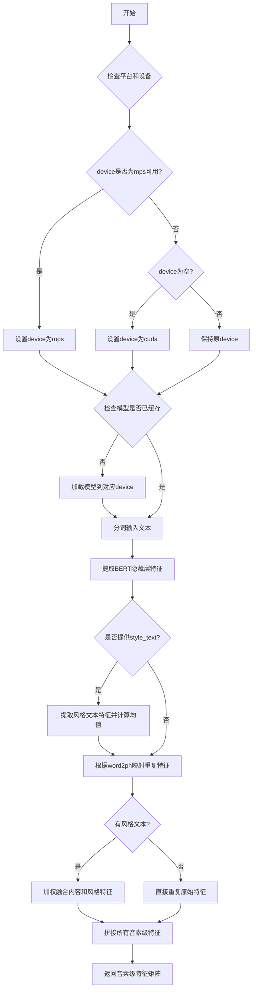

# `Bert-VITS2\oldVersion\V210\text\chinese_bert.py` 详细设计文档

该代码是一个BERT特征提取模块，用于从预训练的中文RoBERTa-wwm-ext-large模型中提取文本特征，并将词级别特征转换为音素级别特征，支持可选的风格迁移功能。

## 整体流程



## 类结构

```
无类层次结构 (函数式编程实现)
```

## 全局变量及字段


### `LOCAL_PATH`
    
BERT模型本地路径

类型：`str`
    


### `tokenizer`
    
分词器实例

类型：`AutoTokenizer`
    


### `models`
    
缓存不同设备的模型实例

类型：`dict`
    


    

## 全局函数及方法


### `get_bert_feature`

主特征提取函数，用于提取文本的BERT特征并转换为音素级特征，支持可选的风格迁移混合。

参数：

- `text`：`str`，输入的中文文本字符串
- `word2ph`：`List[int]`，词到音素的映射列表，表示每个词对应多少个音素帧
- `device`：`str`，计算设备（cpu/cuda/mps），默认从 `config.bert_gen_config.device` 读取
- `style_text`：`str`，可选的风格参考文本，用于特征混合
- `style_weight`：`float`，风格混合权重，默认 0.7

返回值：`torch.Tensor`，形状为 `(特征维度, 音素总数)` 的音素级别特征矩阵（转置后）

#### 流程图

```mermaid
flowchart TD
    A[开始 get_bert_feature] --> B{平台检查}
    B -->|darwin + mps可用 + cpu| C[设置device为mps]
    B -->|其他| D{device为空?}
    C --> D
    D -->|是| E[设置device为cuda]
    D -->|否| F{device在models中?}
    E --> F
    F -->|否| G[加载BERT模型并缓存]
    F -->|是| H[获取缓存的模型]
    G --> I[tokenize输入文本]
    H --> I
    I --> J[将tensor移到device]
    J --> K[调用模型获取hidden_states]
    K --> L[提取倒数第三层隐藏状态]
    L --> M{style_text存在?}
    M -->|是| N[tokenize风格文本]
    M -->|否| P[跳过风格处理]
    N --> O[获取风格特征]
    O --> P
    P --> Q[断言word2ph长度 = len(text) + 2]
    Q --> R{遍历每个词}
    R -->|i < len| S{有style_text?}
    S -->|是| T[混合主特征和风格特征]
    S -->|否| U[仅使用主特征]
    T --> V[重复特征word2ph[i]次]
    U --> V
    V --> R
    R -->|完成| W[拼接所有音素级特征]
    W --> X[转置并返回]
```

#### 带注释源码

```python
def get_bert_feature(
    text,
    word2ph,
    device=config.bert_gen_config.device,
    style_text=None,
    style_weight=0.7,
):
    """
    从文本中提取BERT特征并转换为音素级别特征
    
    参数:
        text: 输入的中文文本
        word2ph: 词到音素的映射列表
        device: 计算设备
        style_text: 可选的风格文本
        style_weight: 风格混合权重
    
    返回:
        音素级别的特征矩阵
    """
    # 在MacOS上，如果MPS可用且指定了CPU，自动切换到MPS加速
    if (
        sys.platform == "darwin"
        and torch.backends.mps.is_available()
        and device == "cpu"
    ):
        device = "mps"
    
    # 如果未指定设备，默认使用CUDA
    if not device:
        device = "cuda"
    
    # 模型缓存：按设备缓存模型实例，避免重复加载
    if device not in models.keys():
        models[device] = AutoModelForMaskedLM.from_pretrained(LOCAL_PATH).to(device)
    
    with torch.no_grad():  # 推理阶段禁用梯度计算
        # 对输入文本进行tokenize
        inputs = tokenizer(text, return_tensors="pt")
        # 将所有tensor移动到指定设备
        for i in inputs:
            inputs[i] = inputs[i].to(device)
        
        # 获取BERT模型的输出（包括所有隐藏状态）
        res = models[device](**inputs, output_hidden_states=True)
        # 提取倒数第三层的隐藏状态（索引-3:-2取-3层），并拼接最后维度
        # 结果形状: [seq_len, hidden_size]
        res = torch.cat(res["hidden_states"][-3:-2], -1)[0].cpu()
        
        # 如果提供了风格文本，进行风格特征提取
        if style_text:
            style_inputs = tokenizer(style_text, return_tensors="pt")
            for i in style_inputs:
                style_inputs[i] = style_inputs[i].to(device)
            style_res = models[device](**style_inputs, output_hidden_states=True)
            style_res = torch.cat(style_res["hidden_states"][-3:-2], -1)[0].cpu()
            # 计算风格特征的平均值
            style_res_mean = style_res.mean(0)

    # 断言：word2ph长度应等于文本长度加2（BOS和EOS token）
    assert len(word2ph) == len(text) + 2
    word2phone = word2ph
    phone_level_feature = []
    
    # 将词级别特征展开为音素级别特征
    for i in range(len(word2phone)):
        if style_text:
            # 加权混合主特征和风格特征，然后按音素数重复
            repeat_feature = (
                res[i].repeat(word2phone[i], 1) * (1 - style_weight)
                + style_res_mean.repeat(word2phone[i], 1) * style_weight
            )
        else:
            # 直接重复词特征word2phone[i]次
            repeat_feature = res[i].repeat(word2phone[i], 1)
        phone_level_feature.append(repeat_feature)

    # 拼接所有音素级特征: [total_phones, hidden_dim]
    phone_level_feature = torch.cat(phone_level_feature, dim=0)

    # 转置返回: [hidden_dim, total_phones]
    return phone_level_feature.T
```

## 关键组件


### 模型加载与缓存机制

使用字典`models`缓存不同设备上的BERT模型，实现惰性加载，只有在首次需要某设备时才加载模型，避免内存浪费。

### 设备自动选择与适配

自动检测并选择运行设备，支持CPU、CUDA和Apple MPS（Mac平台），优先使用GPU加速。

### BERT特征提取器

从预训练的Chinese RoBERTa-wwm-ext-large模型提取词级别隐藏状态特征，选取倒数第三层作为输出。

### 词到音素级别特征映射

通过`word2ph`参数将词级别特征展开为音素级别特征，根据每个词的音素数量重复对应特征。

### 样式迁移特征融合

支持可选的样式文本输入，将内容特征与样式特征按`style_weight`权重进行线性插值融合。

### Tokenizer与输入处理

使用预训练的中文RoBERTa分词器将文本转换为模型输入张量，并移至目标计算设备。

### 隐藏状态裁剪

通过`torch.cat(res["hidden_states"][-3:-2], -1)`选取倒数第三层隐藏状态并压缩维度。


## 问题及建议


### 已知问题

-   **全局状态管理不当**：`models` 字典作为全局模型缓存，缺乏线程安全保护，多线程环境下可能导致竞态条件；`tokenizer` 在模块导入时立即加载，若路径不存在会导致程序无法启动
-   **设备选择逻辑混乱**：当 `device="cpu"` 且 MPS 可用时强制切换到 "mps"，逻辑不符合常规预期；没有处理 CUDA 内存不足的异常情况
-   **变量命名不一致**：函数参数 `word2ph` 与内部变量 `word2phone` 混用，容易造成理解混淆
-   **风格特征计算效率低**：在循环内每次迭代都调用 `.mean(0)` 计算风格特征均值，应在循环前一次性计算
-   **缺少输入验证**：未对 `text` 为空、`word2ph` 长度不匹配等异常情况进行检查，直接使用断言且位置靠后
-   **资源泄漏风险**：无模型卸载机制，随着设备增加 `models` 字典会持续膨胀
-   **硬编码Magic Number**：`hidden_states[-3:-2]` 的选择缺乏注释说明，依赖隐性知识
-   **类型注解缺失**：函数参数和返回值均无类型标注，降低代码可读性和可维护性
-   **配置耦合严重**：`LOCAL_PATH` 和 `config.bert_gen_config.device` 硬编码，缺乏灵活的配置注入

### 优化建议

-   引入 `threading.Lock` 保护 `models` 字典的并发访问，或使用单例模式管理模型缓存
-   将 `tokenizer` 和模型加载延迟到首次调用时，并添加异常处理和回退机制
-   统一变量命名，规范化 `word2ph` 的使用
-   在循环前预先计算 `style_res_mean`，避免重复计算
-   在函数入口添加完整的输入验证，包括 `text` 非空检查、`word2ph` 长度校验等
-   添加模型缓存上限控制，支持 `evict()` 方法释放不活跃的模型实例
-   为关键逻辑（如 `-3:-2` 的选择）添加注释说明其业务含义
-   使用 Python 类型注解（`typing` 模块）完善函数签名
-   将硬编码路径和配置参数提取到配置文件或通过函数参数传入，提高可测试性

## 其它


### 设计目标与约束

本模块旨在为语音合成系统提供词级别到音素级别的特征转换功能，利用预训练的中文RoBERTa模型提取语义特征，并支持通过style_text实现特征风格迁移。约束条件包括：输入文本必须为中文、word2ph长度必须等于text长度+2、设备支持cpu/mps/cuda三种模式。

### 错误处理与异常设计

1. 模型加载异常：捕获AutoModelForMaskedLM.from_pretrained可能的异常，返回有意义的错误信息
2. tokenizer异常：若文本无法被tokenizer处理，应抛出ValueError并提示检查输入格式
3. 设备异常：若指定设备不可用，应fallback到cuda或cpu，并发出警告
4. shape不匹配异常：word2ph长度与text长度不匹配时，断言失败并提示具体长度差异
5. 内存不足异常：捕获OOM错误，建议减小batch size或更换设备

### 数据流与状态机

数据流：text输入 → tokenizer分词 → 模型推理 → 提取hidden_states → word2phone映射 → 风格加权(可选) → 重复特征 → phone_level_feature输出。状态机包含：设备初始化状态、模型加载状态、推理完成状态、特征展开状态。

### 外部依赖与接口契约

1. transformers库：版本≥4.0，用于AutoModelForMaskedLM和AutoTokenizer
2. torch库：版本≥1.0，用于张量操作
3. config模块：需提供bert_gen_config.device配置项
4. LOCAL_PATH：模型路径 "./bert/chinese-roberta-wwm-ext-large"，需确保路径存在且包含完整模型文件
5. 接口契约：text为str类型、word2ph为list[int]类型、style_text为str可选、style_weight为float默认0.7、返回torch.Tensor

### 配置与参数说明

config.bert_gen_config.device：全局设备配置，默认为None（自动选择cuda）
LOCAL_PATH：本地模型路径，支持从HuggingFace远程加载
style_weight：风格融合权重，范围[0,1]，值越大style_text特征占比越高

### 性能考虑与优化空间

1. 模型缓存：models字典缓存已加载模型，避免重复加载
2. 设备自动选择：优先使用mps(Mac)、cuda(GPU)、cpu顺序
3. torch.no_grad()：推理时禁用梯度计算，减少显存占用
4. 潜在优化点：支持batch推理、支持模型量化、异步加载模型、预计算style_res_mean

### 安全性考虑

1. 模型路径安全：应验证LOCAL_PATH路径合法性，防止路径遍历攻击
2. 输入长度限制：建议对text长度设置上限，防止过长输入导致内存溢出
3. 设备资源限制：长时间运行应监控显存使用情况

### 测试策略建议

1. 单元测试：测试tokenizer输出格式、模型加载、特征shape正确性
2. 集成测试：测试完整流程的输入输出匹配
3. 边界测试：空字符串、单个字符、超长文本、设备切换
4. 回归测试：确保修改后输出特征维度一致性

### 部署注意事项

1. 模型文件需随项目部署，包含config.json、pytorch_model.bin、vocab.txt等
2. 首次运行需下载模型，建议提前下载或配置镜像源
3. 生产环境建议设置合理的超时时间和重试机制
4. 多进程部署时需考虑模型缓存的线程安全性

### 版本兼容性

代码兼容Python 3.8+，torch 1.0+，transformers 4.0+。不同版本的transformers可能存在API差异，建议锁定具体版本号。Mac MPS支持需要torch 1.12+版本。

    