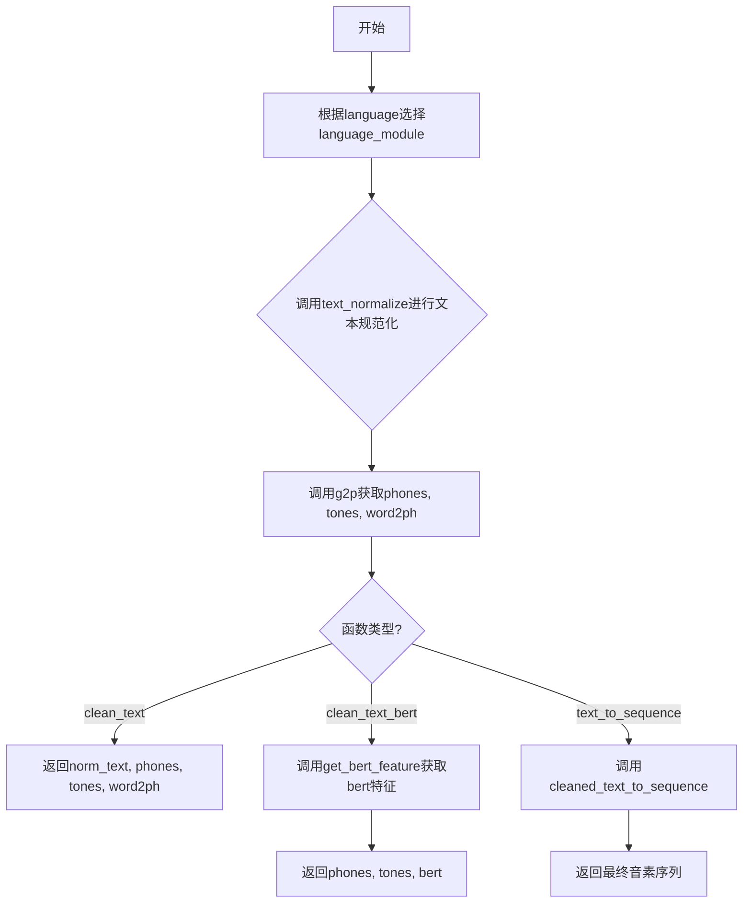
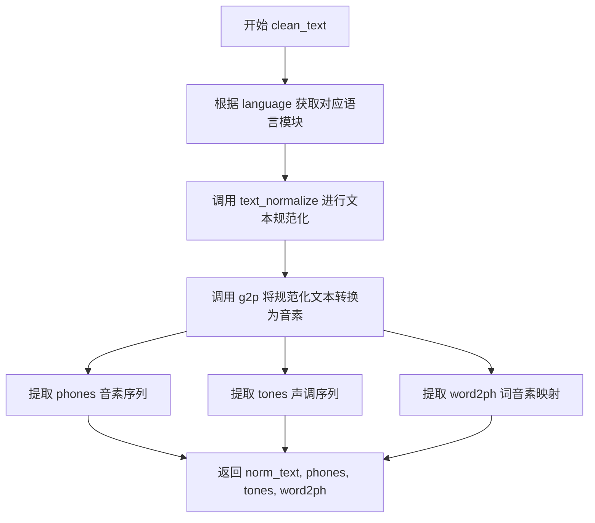
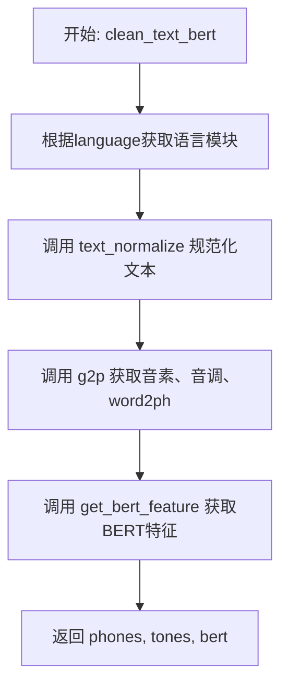
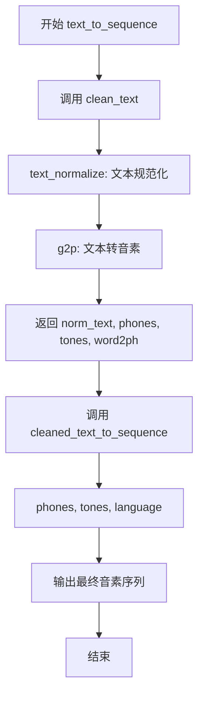

# `Bert-VITS2\oldVersion\V210\text\cleaner.py` 详细设计文档

一个多语言文本处理模块，用于将文本转换为语音合成的音素序列。支持中文（ZH）、日文（JP）和英文（EN）三种语言，提供文本规范化、图素到音素转换（g2p）、音调处理以及BERT特征提取功能。

## 整体流程



## 类结构

```
全局模块层
├── language_module_map (全局变量)
├── clean_text (全局函数)
├── clean_text_bert (全局函数)
└── text_to_sequence (全局函数)

底层语言模块 (外部依赖)
├── chinese (中文处理模块)
│   ├── text_normalize
│   ├── g2p
│   └── get_bert_feature
├── japanese (日文处理模块)
│   ├── text_normalize
│   ├── g2p
│   └── get_bert_feature
├── english (英文处理模块)
text_normalize
g2p
get_bert_feature
└── cleaned_text_to_sequence (序列清洗模块)
```

## 全局变量及字段


### `language_module_map`
    
语言代码到语言处理模块的映射字典，用于根据语言代码动态调用相应的文本处理模块

类型：`dict`
    


    

## 全局函数及方法


### `clean_text`

该函数是文本处理的核心入口，接收原始文本和语言代码，通过动态加载对应语言模块完成文本规范化、转换为音素序列、提取声调信息以及建立词到音素的映射关係，最终返回规范化文本、音素序列、声调序列和词音素映射。

参数：

- `text`：`str`，待处理的原始文本输入
- `language`：`str`，语言代码，指定文本所属语言（"ZH"代表中文、"JP"代表日文、"EN"代表英文）

返回值：`(str, list, list, list)`，返回四元组，包括规范化后的文本、音素列表、声调列表和词到音素的映射关系

#### 流程图



#### 带注释源码

```python
def clean_text(text, language):
    """
    文本规范化并获取音素、音调和词phoneme映射
    
    参数:
        text: str - 待处理的原始文本
        language: str - 语言代码，支持 "ZH", "JP", "EN"
    
    返回:
        tuple: (norm_text, phones, tones, word2ph)
            - norm_text: 规范化后的文本字符串
            - phones: 音素序列列表
            - tones: 声调序列列表
            - word2ph: 词到音素的映射关系列表
    """
    # 根据语言代码从映射表中获取对应的语言处理模块
    # ZH -> chinese, JP -> japanese, EN -> english
    language_module = language_module_map[language]
    
    # 调用语言模块的文本规范化方法
    # 该方法负责将原始文本进行预处理，如全角转半角、去除特殊字符等
    norm_text = language_module.text_normalize(text)
    
    # 调用语言模块的G2P（Grapheme-to-Phoneme）方法
    # 将规范化后的文本转换为音素序列，同时提取声调和词音素映射信息
    phones, tones, word2ph = language_module.g2p(norm_text)
    
    # 返回四个结果：规范化文本、音素序列、声调序列、词音素映射
    return norm_text, phones, tones, word2ph
```


### `clean_text_bert`

该函数接收文本和语言代码，首先进行文本规范化，然后通过语言特定的G2P（Grapheme-to-Phoneme）转换获取音素、音调及词到音素的映射关系，最后利用BERT模型提取文本的语义特征，最终返回音素序列、音调序列和BERT特征向量。

参数：

- `text`：`str`，待处理的原始文本输入
- `language`：`str`，语言代码（支持 "ZH" 中文、"JP" 日文、"EN" 英文）

返回值：`tuple`，包含以下三个元素：
- `phones`：`list`，转换后的音素序列
- `tones`：`list`，对应的音调序列
- `bert`：`ndarray` 或 `Tensor`，BERT模型提取的文本特征向量

#### 流程图



#### 带注释源码

```python
def clean_text_bert(text, language):
    """
    文本规范化并获取音素、音调和BERT特征
    
    参数:
        text: str - 输入的原始文本
        language: str - 语言代码，支持 "ZH", "JP", "EN"
    
    返回:
        tuple: (phones, tones, bert) - 音素序列、音调序列、BERT特征
    """
    # 根据语言代码从映射表中获取对应的语言处理模块
    # ZH -> chinese, JP -> japanese, EN -> english
    language_module = language_module_map[language]
    
    # 第一步：文本规范化处理
    # 调用对应语言模块的文本规范化方法，转换为规范化的文本形式
    # 例如：数字转中文、标点处理、繁简转换等
    norm_text = language_module.text_normalize(text)
    
    # 第二步：G2P转换（Grapheme to Phoneme）
    # 将规范化后的文本转换为音素序列，同时获取音调信息和词到音素的映射
    # phones: 音素序列，如 ['a', 'i', 'u', ...]
    # tones: 音调序列，如 [1, 2, 3, ...]
    # word2ph: 词到音素的映射关系，用于对齐
    phones, tones, word2ph = language_module.g2p(norm_text)
    
    # 第三步：获取BERT特征
    # 使用预训练BERT模型提取文本的语义特征向量
    # 输入：规范化文本和词到音素的映射
    # 输出：BERT最后一层的隐藏状态向量
    bert = language_module.get_bert_feature(norm_text, word2ph)
    
    # 返回音素、音调和BERT特征，供后续语音合成使用
    return phones, tones, bert
```


### `text_to_sequence`

该函数是文本转语音（Text-to-Speech）流程中的核心转换环节，接收原始文本和语言代码，经过文本规范化、文本到音素的转换（Grapheme-to-Phoneme，G2P），最终输出符合语音合成模型要求的音素序列。

参数：

- `text`：`str`，待转换的原始输入文本
- `language`：`str`，语言代码，支持 "ZH"（中文）、"JP"（日语）、"EN"（英语）

返回值：`list`，音素序列列表，供后续语音合成模型使用

#### 流程图



#### 带注释源码

```python
def text_to_sequence(text, language):
    """
    将输入文本转换为最终的音素序列
    
    参数:
        text (str): 输入的原始文本
        language (str): 语言代码，支持 "ZH", "JP", "EN"
    
    返回:
        list: 处理后的音素序列
    """
    # 第一步：调用 clean_text 进行文本规范化和 G2P 转换
    # 返回值包含：规范化文本、音素序列、音调序列、词到音素的映射
    norm_text, phones, tones, word2ph = clean_text(text, language)
    
    # 第二步：调用 cleaned_text_to_sequence 进行最终清洗和转换
    # 输入：音素序列、音调序列、语言代码
    # 输出：符合模型要求的最终音素序列
    return cleaned_text_to_sequence(phones, tones, language)
```

## 关键组件


### 语言模块映射 (language_module_map)

该模块通过字典结构建立了语言代码与对应处理模块的映射关系，支持 ZH(中文)、JP(日文)、EN(英文) 三种语言的动态切换，为多语言文本处理提供统一的访问入口。

### 文本清理与规范化 (clean_text)

该函数接收原始文本和语言代码，调用对应语言模块的文本规范化方法进行预处理，然后通过语言特定的 g2p (grapheme-to-phoneme) 转换引擎将规范文本转换为音素序列，同时输出声调信息和词到音素的对应关系。

### BERT特征提取 (clean_text_bert)

该函数在完成文本规范化和音素转换的基础上，额外调用语言模块的 BERT 特征提取接口，获取文本的上下文语义嵌入表示，用于提升语音合成的自然度和表现力。

### 文本到序列转换 (text_to_sequence)

该函数是文本处理流程的最终环节，将 clean_text 的输出结果通过序列清理模块转换为模型可直接使用的数值序列，包含音素序列、声调序列和语言标识。

### 多语言模块接口契约

各语言模块 (chinese/japanese/english) 需要统一实现 text_normalize()、g2p() 和 get_bert_feature() 三个标准接口，确保语言处理逻辑的可替换性和扩展性。


## 问题及建议


### 已知问题

-   **缺乏错误处理**：language_module_map[language] 使用字典直接索引，若传入不支持的语言代码会抛出 KeyError 异常，没有优雅的错误提示或默认值处理
-   **魔法字符串硬编码**：语言代码 "ZH", "JP", "EN" 作为硬编码字符串散落在代码中，容易出现拼写错误，且缺乏统一管理
-   **代码重复**：clean_text 和 clean_text_bert 函数中重复实现了 text_normalize 和 g2p 的调用逻辑，可提取公共方法
-   **缺乏类型注解**：所有函数均无类型提示（Type Hints），不利于 IDE 智能提示、静态分析和代码维护
-   **缺少文档字符串**：函数无 docstring，无法直观了解函数用途、参数含义、返回值格式
-   **返回值不一致**：clean_text 返回4个值（包含 norm_text），clean_text_bert 返回3个值（不包含 norm_text），text_to_sequence 只返回1个值，接口设计不统一
-   **模块导入耦合**：language_module_map 在模块级别硬编码绑定，若需动态添加语言需修改源代码，扩展性差
-   **无日志记录**：代码执行过程中无任何日志输出，问题排查困难
-   **命名规范不统一**：函数名混合使用 snake_case（clean_text）和其他风格（cleaned_text_to_sequence），影响可读性

### 优化建议

-   添加语言代码枚举类或常量定义，统一管理支持的语言标识
-   实现异常处理机制，对不支持的语言或处理失败情况抛出自定义异常或返回默认值
-   提取公共逻辑到私有函数（如 _normalize_and_g2p），避免 clean_text 和 clean_text_bert 中的重复代码
-   为所有函数添加类型注解和 docstring，提升代码可读性和可维护性
-   考虑重构返回值设计，保持接口一致性或通过命名元组/dataclass 封装返回结果
-   提供语言模块注册机制，支持运行时动态添加新语言，降低模块耦合度
-   添加基础日志记录功能，便于调试和监控
-   补充单元测试用例，覆盖正常流程和异常场景

## 其它


### 设计目标与约束

本模块旨在为多语言文本转语音（TTS）系统提供统一的文本预处理接口，支持中文（ZH）、日文（JP）、英文（EN）三种语言的文本规范化、语音合成和BERT特征提取。设计约束包括：语言模块必须实现text_normalize、g2p、get_bert_feature三个标准接口；所有输入文本必须为Unicode编码；返回值遵循固定的元组结构。

### 错误处理与异常设计

本模块采用显式异常抛出策略。当传入不支持的语言代码时，language_module_map查询会触发KeyError，建议在上层调用时进行语言代码校验。语言模块内部的text_normalize和g2p若处理失败，应向上抛出ValueError或RuntimeError。当前实现缺乏try-except保护，建议增加异常封装层。

### 数据流与状态机

数据流分为三条路径：clean_text路径（文本→规范化→G2P→返回规范化文本、韵律、phoneme对齐）、clean_text_bert路径（文本→规范化→G2P→BERT特征→返回phoneme、韵律、BERT特征）、text_to_sequence路径（clean_text→序列转换→返回线性序列）。状态机表现为：输入验证→语言路由→模块调用→数据组装→输出。

### 外部依赖与接口契约

language_module_map为外部依赖注入点，各语言模块需严格遵循接口契约：text_normalize(text)接受字符串返回字符串；g2p(text)返回(phones_list, tones_list, word2ph_list)三元组；get_bert_feature(text, word2ph)返回BERT特征张量。cleaned_text_to_sequence为独立依赖函数，需确保phones/tones顺序与language参数匹配。

### 模块初始化与加载策略

language_module_map采用运行时动态加载，模块在import时立即绑定。建议改为延迟加载或插件式注册机制，以便支持运行时语言扩展而无需修改主模块代码。当前硬编码方式不利于扩展新语言。

### 关键组件信息

- language_module_map：语言模块路由字典，键为语言代码字符串，值为对应语言处理模块对象
- clean_text：主文本处理函数，返回规范化文本、phoneme序列、韵律序列、对齐信息
- clean_text_bert：带BERT特征的文本处理函数，返回phoneme序列、韵律序列、 BERT嵌入
- text_to_sequence：端到端序列转换函数，直接输出模型可用序列

### 潜在的技术债务与优化空间

当前实现存在以下优化点：1) 重复调用language_module_map查询两次（clean_text和clean_text_bert），可提取为局部变量；2) clean_text与clean_text_bert存在代码重复，可抽象基类或混入类；3) 缺乏缓存机制，相同文本重复处理时效率低下；4) 未实现接口抽象层，无法在编译期校验语言模块完整性；5) 缺少日志记录，难以追踪处理异常。

### 配置与扩展性设计

建议将language_module_map从硬编码字典改为配置驱动模式，支持YAML/JSON配置文件定义语言与模块映射。扩展新语言只需在配置中添加映射并实现标准接口模块，无需修改核心代码。同时可引入工厂模式封装模块创建逻辑。

    