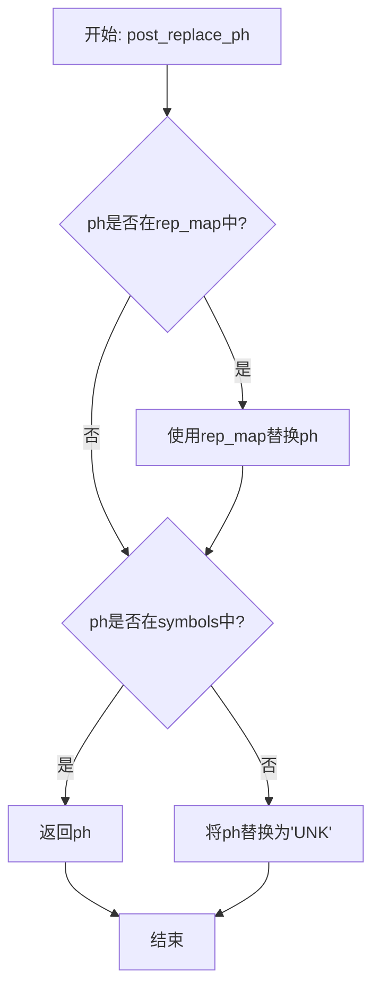
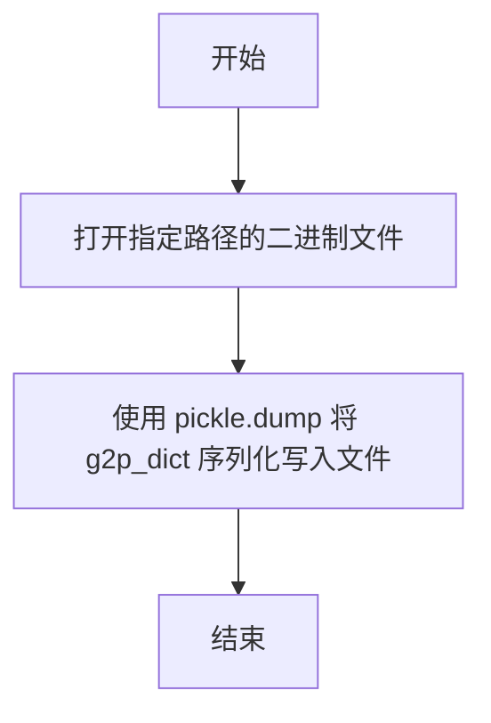
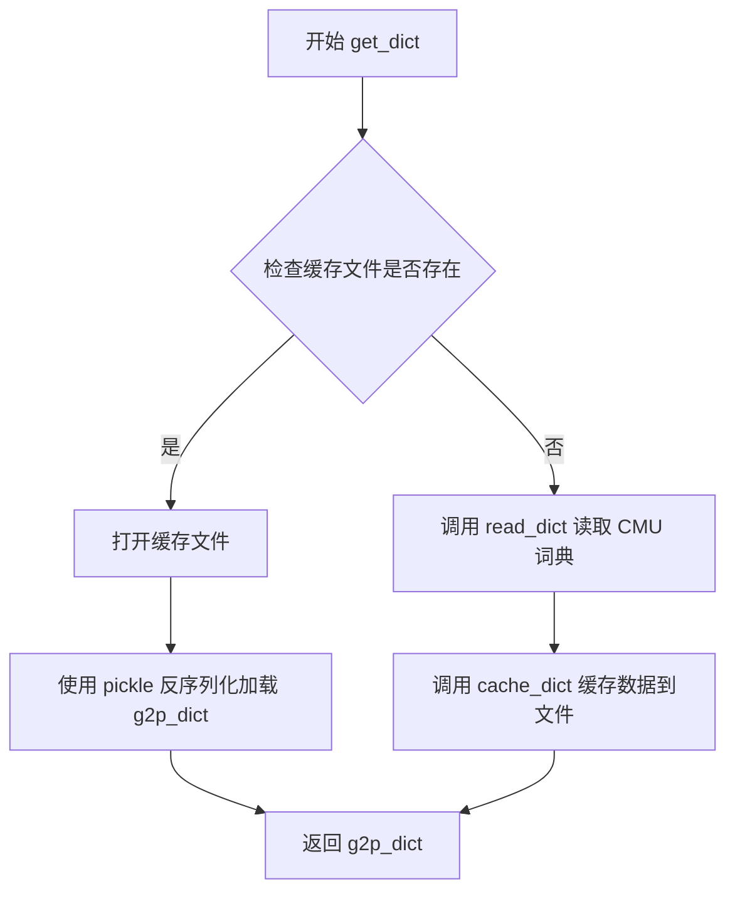
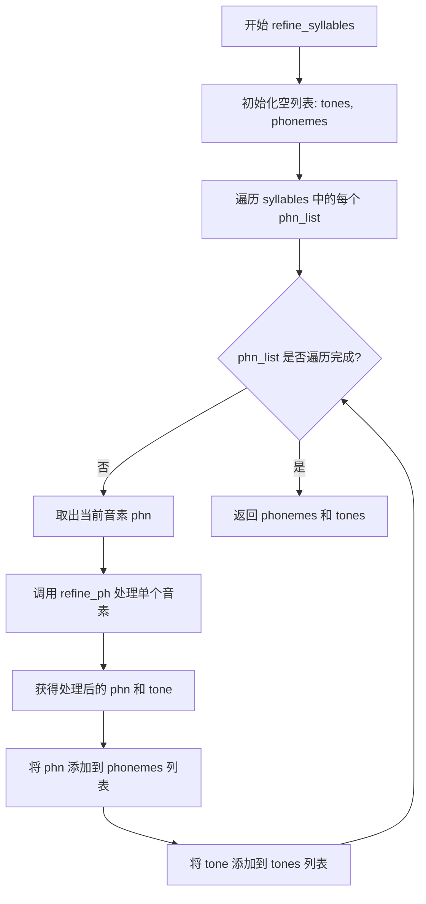
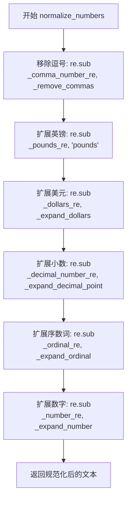
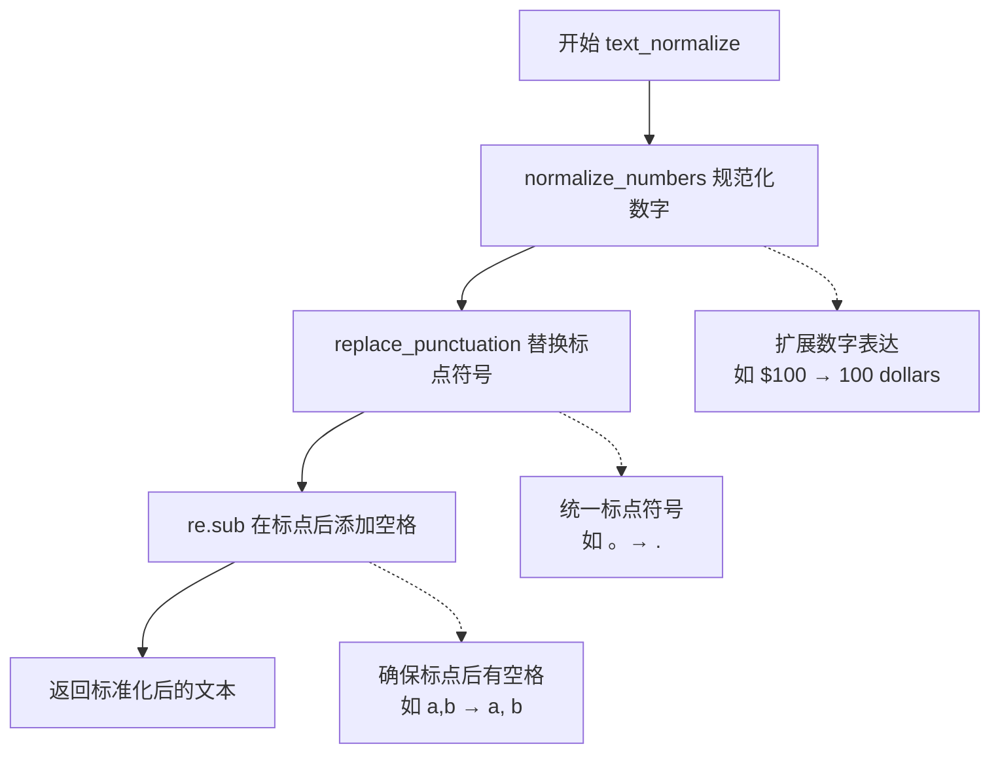
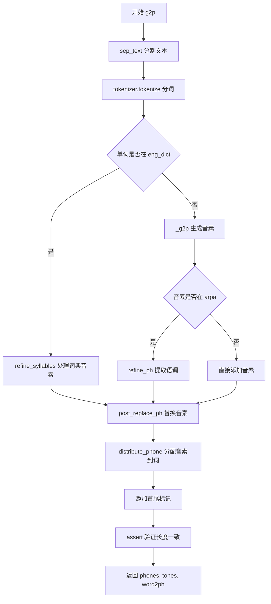
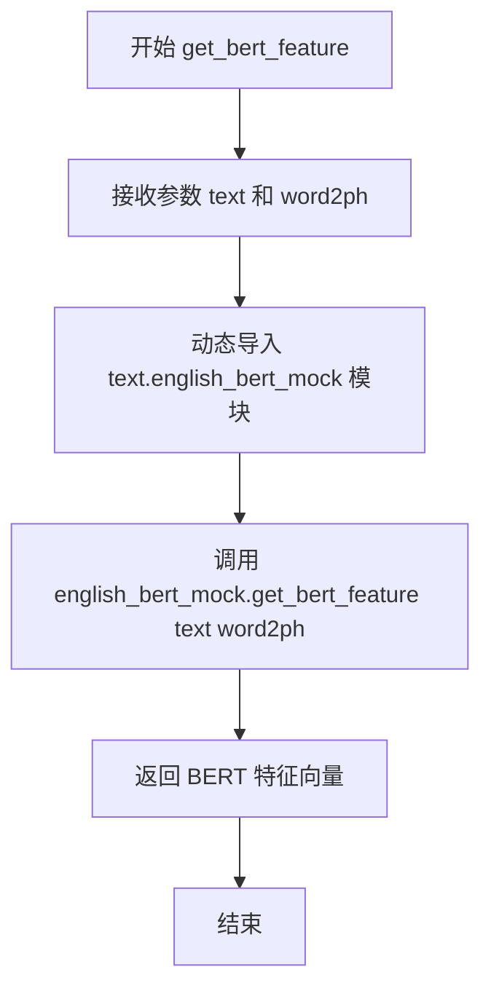

# `Bert-VITS2\oldVersion\V210\text\english.py` 详细设计文档

This module implements an English Grapheme-to-Phoneme (G2P) converter for a Text-to-Speech (TTS) system. It provides text normalization, CMU dictionary lookup with fallback to the g2p_en library, phoneme refinement (tone extraction), and alignment generation (word2ph) for model training/inference.

## 整体流程

```mermaid
graph TD
    A([Input Text]) --> B[sep_text]
    B --> C[Tokenize Words (Deberta)]
    C --> D{For Each Word}
    D --> E{Is in eng_dict?}
    E -- Yes --> F[refine_syllables]
    E -- No --> G[_g2p Library]
    F --> H[distribute_phone]
    G --> I[refine_ph]
    I --> H
    H --> J[Format Output (Add '_' start/end)]
    J --> K([Return phones, tones, word2ph])
```

## 类结构

```
Module: text_en.py (Functional Module)
├── No explicit class definitions found
├── Core Components:
│   ├── G2P Logic (g2p function)
│   ├── Text Normalization (text_normalize function)
│   └── Data: CMU Dictionary (cached in pickle)
└── Dependencies: g2p_en, transformers, inflect
```

## 全局变量及字段


### `CMU_DICT_PATH`
    
CMU发音词典文件的绝对路径

类型：`str`
    


### `CACHE_PATH`
    
CMU词典缓存pickle文件的绝对路径

类型：`str`
    


### `LOCAL_PATH`
    
Deberta-v3-large预训练模型的本地路径

类型：`str`
    


### `_g2p`
    
G2P（Grapheme-to-Phoneme）转换器实例，用于将未知单词转换为音素序列

类型：`G2p`
    


### `tokenizer`
    
Deberta V2分词器实例，用于对单词进行tokenize以计算word2ph

类型：`DebertaV2Tokenizer`
    


### `arpa`
    
ARPA音素符号集合，用于验证音素是否属于有效的CMU发音词典音素

类型：`set`
    


### `rep_map`
    
标点符号统一替换映射表，将各种语言的标点符号映射到英文标点

类型：`dict`
    


### `eng_dict`
    
从CMU词典加载的英语单词到音素列表的映射字典

类型：`dict`
    


### `_inflect`
    
英语语法变化引擎实例，用于将数字和序数词转换为英文单词

类型：`inflect.engine`
    


### `_comma_number_re`
    
匹配带逗号的数字的正则表达式模式

类型：`re.Pattern`
    


### `_decimal_number_re`
    
匹配小数数字的正则表达式模式

类型：`re.Pattern`
    


### `_pounds_re`
    
匹配英镑金额的正则表达式模式

类型：`re.Pattern`
    


### `_dollars_re`
    
匹配美元金额的正则表达式模式

类型：`re.Pattern`
    


### `_ordinal_re`
    
匹配英文序数词（如1st, 2nd, 3rd, 4th）的正则表达式模式

类型：`re.Pattern`
    


### `_number_re`
    
匹配普通数字的正则表达式模式

类型：`re.Pattern`
    


### `_abbreviations`
    
缩写词到完整形式映射的列表，用于文本正规化

类型：`list`
    


### `_lazy_ipa`
    
标准IPA音标到懒散版IPA（第一版本）的映射列表

类型：`list`
    


### `_lazy_ipa2`
    
标准IPA音标到懒散版IPA（第二版本）的映射列表

类型：`list`
    


### `_ipa_to_ipa2`
    
标准IPA音标到IPA2的映射列表，用于音标转换

类型：`list`
    


    

## 全局函数及方法


### `post_replace_ph`

该函数用于对音素（phoneme）进行后处理替换，将特殊字符和标点符号映射为标准符号，并处理未知音素。

参数：

-  `ph`：`str`，待处理的音素或符号

返回值：`str`，处理后的标准化音素

#### 流程图



#### 带注释源码

```python
def post_replace_ph(ph):
    """
    对音素进行后处理替换
    
    处理逻辑：
    1. 首先将特殊字符/标点符号映射为标准符号
    2. 然后检查是否在symbols定义的音素集合中
    3. 不在symbols中的音素统一替换为UNK
    
    参数:
        ph: 待处理的音素或符号
    
    返回:
        处理后的标准化音素字符串
    """
    # 定义特殊字符到标准符号的映射表
    rep_map = {
        "：": ",",      # 中文冒号 -> 英文逗号
        "；": ",",      # 中文分号 -> 英文逗号
        "，": ",",      # 中文逗号 -> 英文逗号
        "。": ".",      # 中文句号 -> 英文句号
        "！": "!",      # 中文感叹号 -> 英文感叹号
        "？": "?",      # 中文问号 -> 英文问号
        "\n": ".",      # 换行符 -> 句号
        "·": ",",       # 中间点 -> 逗号
        "、": ",",      # 顿号 -> 逗号
        "…": "...",     # 省略号 -> 三个点
        "···": "...",   # 三个点 -> 三个点
        "♪": "...",     # 音符 -> 三个点
        "v": "V",       # 小写v -> 大写V
    }
    
    # 步骤1: 检查是否需要映射替换
    if ph in rep_map.keys():
        ph = rep_map[ph]
    
    # 步骤2: 检查是否在有效音素集合中
    if ph in symbols:
        return ph
    
    # 步骤3: 不在有效集合中,返回未知标记
    if ph not in symbols:
        ph = "UNK"
    
    return ph
```


### `replace_punctuation`

该函数用于将文本中的各种标点符号替换为预定义的映射符号，实现文本标点符号的标准化处理。

参数：

-  `text`：`str`，需要处理的输入文本

返回值：`str`，标点符号被替换后的文本

#### 流程图

```mermaid
flowchart TD
    A([开始]) --> B[编译正则表达式模式<br/>将rep_map的所有键用|连接])
    C[执行替换<br/>使用lambda函数根据映射替换匹配的标点符号] --> D([返回替换后的文本])
    B --> C
    
    subgraph rep_map [rep_map 替换映射表]
        direction TB
        R1["：→,"]
        R2["；→,"]
        R3["，→,"]
        R4["。→."]
        R5["！→!"]
        R6["？→?"]
        R7["\\n→."]
        R8["“/'"]
        R9["(→'"]
        R10[")→'"]
        R11["...→..."]
    end
```

#### 带注释源码

```python
def replace_punctuation(text):
    """
    将文本中的标点符号替换为预定义的标准化符号
    
    参数:
        text: 输入的需要处理标点的文本
        
    返回:
        标点符号已被替换的文本
    """
    
    # 使用re.escape转义rep_map中的所有特殊字符（如.、?等）
    # 将所有标点符号键用|连接成正则表达式
    # 例如：'\\:\\;\\，\\。\\！\\？' 这样的模式
    pattern = re.compile("|".join(re.escape(p) for p in rep_map.keys()))

    # 使用pattern.sub进行全局替换
    # lambda函数：x.group()返回匹配到的标点符号
    # rep_map[x.group()]获取对应的替换值
    # 例如：输入"你好，世界！"输出"你好,世界!"
    replaced_text = pattern.sub(lambda x: rep_map[x.group()], text)

    # 下面是已注释的代码，原本用于过滤非日文/中文字符
    # replaced_text = re.sub(
    #     r"[^\u3040-\u309F\u30A0-\u30FF\u4E00-\u9FFF\u3400-\u4DBF\u3005"
    #     + "".join(punctuation)
    #     + r"]+",
    #     "",
    #     replaced_text,
    # )

    # 返回替换后的文本
    return replaced_text
```

#### 关联的全局变量

- `rep_map`：`dict`，标点符号映射字典，将各种语言的标点符号统一转换为英文标点或简化符号


### `read_dict`

该函数用于从CMU发音词典文件中读取发音字典数据，将每个单词及其对应的音素序列解析为嵌套列表结构并返回。

参数：  
- 无参数

返回值：`dict`，返回一个大字典，其键为单词（字符串），值为嵌套列表结构，每个内层列表表示该单词的一个音节，每个音节内的元素为该音节的音素（phoneme）列表。

#### 流程图

```mermaid
flowchart TD
    A([函数开始]) --> B[初始化空字典 g2p_dict]
    B --> C[设置起始行号 start_line = 49]
    C --> D[打开 CMU_DICT_PATH 文件]
    D --> E[读取第一行, 初始化 line_index = 1]
    E --> F{line 是否存在}
    F -->|否| G[返回 g2p_dict]
    F -->|是| H{line_index >= start_line}
    H -->|否| I[line_index + 1, 读取下一行]
    I --> F
    H -->|是| J[去除行首尾空白]
    J --> K[按双空格分割获取单词和发音]
    K --> L[按" - "分割获取音节列表]
    L --> M[初始化 g2p_dict[word] 为空列表]
    M --> N{遍历每个音节}
    N -->|音节 O| P[按空格分割获取音素列表]
    P --> Q[将音素列表添加到 g2p_dict[word]]
    Q --> N
    N -->|遍历结束| I
```

#### 带注释源码

```
def read_dict():
    """从CMU发音词典文件读取发音字典并返回嵌套字典结构"""
    g2p_dict = {}  # 初始化空字典用于存储发音映射
    start_line = 49  # CMU词典文件从第49行开始为实际数据（之前为注释头部）
    
    # 打开CMU发音词典文件
    with open(CMU_DICT_PATH) as f:
        line = f.readline()  # 读取第一行
        line_index = 1  # 初始化行索引计数器
        
        # 遍历文件的每一行
        while line:
            # 仅处理从start_line开始的数据行（跳过文件头部）
            if line_index >= start_line:
                line = line.strip()  # 去除首尾空白字符
                
                # 按双空格分割：第一部分为单词，第二部分为发音串
                word_split = line.split("  ")
                word = word_split[0]  # 提取单词
                
                # 按" - "分割发音串得到多个音节
                syllable_split = word_split[1].split(" - ")
                g2p_dict[word] = []  # 初始化该单词的音节列表
                
                # 遍历每个音节
                for syllable in syllable_split:
                    # 按空格分割音节得到单个音素列表
                    phone_split = syllable.split(" ")
                    # 将音素列表作为子列表添加到单词的音节列表中
                    g2p_dict[word].append(phone_split)
            
            # 更新行索引并读取下一行
            line_index = line_index + 1
            line = f.readline()
    
    return g2p_dict  # 返回构建好的发音字典
```


### `cache_dict`

该函数用于将发音字典（g2p_dict）以 pickle 格式序列化并缓存到指定路径的文件中，以加速后续读取。

参数：

- `g2p_dict`：`dict`，需要缓存的 g2p 发音字典
- `file_path`：`str`，缓存文件的保存路径

返回值：`None`，无返回值

#### 流程图



#### 带注释源码

```python
def cache_dict(g2p_dict, file_path):
    """
    将发音字典缓存到指定路径的 pickle 文件中
    
    参数:
        g2p_dict: dict 类型，发音字典数据
        file_path: str 类型，缓存文件路径
    返回:
        None
    """
    # 以二进制写入模式打开文件
    with open(file_path, "wb") as pickle_file:
        # 使用 pickle 将字典序列化并写入文件
        pickle.dump(g2p_dict, pickle_file)
```


### `get_dict`

该函数用于获取英文字典数据，首先检查是否存在缓存文件，如果存在则直接从缓存加载，否则从CMU发音词典文件读取数据并进行缓存，以提高后续调用的性能。

参数：无

返回值：`dict`，返回CMU发音词典数据，键为单词（大写形式），值为发音音素列表的嵌套列表。

#### 流程图



#### 带注释源码

```python
def get_dict():
    """
    获取CMU发音词典数据
    
    优先从缓存文件加载，如果缓存不存在则从源文件读取并生成缓存
    
    Returns:
        dict: CMU发音词典，键为单词（大写），值为发音音素列表
    """
    # 检查缓存文件是否存在
    if os.path.exists(CACHE_PATH):
        # 缓存存在，直接从pickle文件加载（反序列化）
        with open(CACHE_PATH, "rb") as pickle_file:
            g2p_dict = pickle.load(pickle_file)
    else:
        # 缓存不存在，从CMU词典源文件读取数据
        g2p_dict = read_dict()
        # 将读取的数据缓存到pickle文件，供后续使用
        cache_dict(g2p_dict, CACHE_PATH)

    # 返回发音词典字典
    return g2p_dict
```


### `refine_ph`

该函数用于处理单个音素（phoneme），提取其声调信息并将音素转换为小写形式。如果音素末尾包含数字（CMU发音字典中的声调标记），则提取该数字并加1作为声调值，同时去除末尾数字；否则声调默认为0。

参数：

- `phn`：`str`，原始音素字符串，可能包含末尾的数字声调标记（如"AH0"、"EY2"等）

返回值：`tuple`，返回一个元组，包含处理后的音素（小写字符串）和提取的声调值（整数）

#### 流程图

```mermaid
flowchart TD
    A[开始 refine_ph] --> B{检查 phn 末尾是否匹配数字正则 \d$}
    B -->|是| C[提取末尾数字 phn[-1]]
    C --> D[tone = int(数字) + 1]
    D --> E[phn = phn[:-1] 去除末尾数字]
    B -->|否| F[tone = 0]
    E --> G[phn = phn.lower 转换为小写]
    F --> G
    G --> H[返回 tuple: (phn, tone)]
```

#### 带注释源码

```python
def refine_ph(phn):
    """
    处理单个音素，提取声调并将音素转为小写
    
    参数:
        phn: str, 原始音素字符串，可能包含末尾数字表示声调
             例如: "AH0", "EY2", "S" 等
    
    返回:
        tuple: (处理后的音素字符串, 声调整数)
              例如: ("ah", 1), ("ey", 3), ("s", 0)
    """
    # 初始化声调为0，表示无声调
    tone = 0
    
    # 使用正则表达式检查音素末尾是否包含数字
    # CMU发音字典中数字表示声调：0=轻声, 1=第一声, 2=第二声等
    if re.search(r"\d$", phn):
        # 提取末尾数字字符
        tone_digit = phn[-1]
        # 声调值 = 数字 + 1（将0-indexed转为1-indexed）
        tone = int(tone_digit) + 1
        # 去除末尾的数字部分，得到纯音素
        phn = phn[:-1]
    
    # 将音素转换为小写（CMU字典中音素为大写）
    return phn.lower(), tone
```


### `refine_syllables`

该函数接收音节列表（嵌套列表结构），遍历每个音节中的音素，调用 `refine_ph` 函数对每个音素进行处理（提取声调并规范化音素），最终返回处理后的音素列表和对应的声调列表。

参数：

- `syllables`：`List[List[str]]`，输入的音节列表，每个元素是一个包含音素的列表（例如 `[['AH0', 'B'], ['K', 'AO1', 'R']]`）

返回值：

- `phonemes`：`List[str]`，处理后的音素列表（音素名称规范化，去除数字后缀）
- `tones`：`List[int]`，对应的声调列表（0表示无声调，1-3表示不同声调）

#### 流程图



#### 带注释源码

```python
def refine_syllables(syllables):
    """
    处理音节列表，将每个音素规范化并提取声调
    
    参数:
        syllables: 嵌套列表结构，外层列表代表单词的音节，内层列表代表每个音节的音素
                   例如: [['AH0', 'B'], ['K', 'AO1', 'R']]
    
    返回:
        tuple: (phonemes, tones) - 处理后的音素列表和对应的声调列表
    """
    # 初始化声调列表和音素列表
    tones = []
    phonemes = []
    
    # 外层循环：遍历每个音节（音素组）
    for phn_list in syllables:
        # 内层循环：遍历当前音节中的每个音素
        for i in range(len(phn_list)):
            # 获取当前音素
            phn = phn_list[i]
            
            # 调用 refine_ph 函数处理单个音素：
            # - 提取数字作为声调（0-2）
            # - 将音素转换为小写
            phn, tone = refine_ph(phn)
            
            # 将处理后的音素添加到音素列表
            phonemes.append(phn)
            
            # 将对应的声调添加到声调列表
            tones.append(tone)
    
    # 返回处理结果：音素列表和声调列表
    return phonemes, tones
```


### `_expand_dollars`

该函数用于将美元金额（如 "$10.50"）的匹配结果转换为文字形式的读法（如 "10 dollars, 50 cents"），支持整数美元、 cents 以及两者的组合。

参数：

-  `m`：`re.Match`，正则表达式匹配对象，包含美元金额（如 "$10.50" 中的 "10.50"）

返回值：`str`，美元金额的文字读法描述

#### 流程图

```mermaid
flowchart TD
    A[开始: 接收匹配对象 m] --> B[提取匹配组 match = m.group(1)]
    B --> C{检查是否有小数点}
    C -->|有多个小数点| D[返回原始匹配 + 'dollars']
    C -->|格式正常| E[分割 parts = match.split('.')]
    E --> F[提取美元整数部分: dollars = int(parts[0]) if parts[0] else 0]
    F --> G[提取美分数: cents = int(parts[1]) if len > 1 and parts[1] else 0]
    G --> H{判断金额组合情况}
    H -->|dollars > 0 且 cents > 0| I[返回 'd dollars, c cents' 或单复数形式]
    H -->|仅dollars > 0| J[返回 'd dollars' 或单复数形式]
    H -->|仅cents > 0| K[返回 'c cents' 或单复数形式]
    H -->|均为0| L[返回 'zero dollars']
    I --> M[结束]
    J --> M
    K --> M
    D --> M
    L --> M
```

#### 带注释源码

```python
def _expand_dollars(m):
    """
    将美元金额字符串转换为文字读法。
    
    参数:
        m: re.Match对象，正则表达式匹配到的美元金额字符串（不含$符号）
           例如：匹配 "$10.50" 时，m.group(1) 为 "10.50"
    
    返回值:
        str: 美元金额的文字读法
             - "10.50" -> "10 dollars, 50 cents"
             - "1.00"  -> "1 dollar"
             - "0.50"  -> "50 cents"
             - "0"     -> "zero dollars"
    """
    # 从匹配对象中提取捕获的金额字符串（不含$符号）
    match = m.group(1)
    
    # 按小数点分割，检查格式是否合法
    parts = match.split(".")
    
    # 如果有多于两个部分（如 "10.50.50"），格式异常，直接返回原字符串
    if len(parts) > 2:
        return match + " dollars"  # Unexpected format
    
    # 提取美元整数部分，空字符串视为0
    dollars = int(parts[0]) if parts[0] else 0
    
    # 提取美分数，若无小数部分或小数部分为空则视为0
    cents = int(parts[1]) if len(parts) > 1 and parts[1] else 0
    
    # 根据金额数量返回相应的文字描述（处理单复数）
    if dollars and cents:
        # 既有美元又有cents，如 "10 dollars, 50 cents"
        dollar_unit = "dollar" if dollars == 1 else "dollars"
        cent_unit = "cent" if cents == 1 else "cents"
        return "%s %s, %s %s" % (dollars, dollar_unit, cents, cent_unit)
    elif dollars:
        # 仅有美元，如 "1 dollar" 或 "10 dollars"
        dollar_unit = "dollar" if dollars == 1 else "dollars"
        return "%s %s" % (dollars, dollar_unit)
    elif cents:
        # 仅有cents，如 "1 cent" 或 "50 cents"
        cent_unit = "cent" if cents == 1 else "cents"
        return "%s %s" % (cents, cent_unit)
    else:
        # 金额为0
        return "zero dollars"
```


### `_remove_commas`

该函数是一个私有辅助函数，用于在正则表达式替换过程中移除数字字符串中的逗号分隔符，通常与 `_comma_number_re` 正则表达式配合使用来处理带逗号的数字（如 "1,000" 转换为 "1000"）。

参数：

-  `m`：`re.Match`，正则表达式匹配对象，代表匹配到的数字字符串（如 "1,000"）

返回值：`str`，返回移除所有逗号后的数字字符串（如 "1000"）

#### 流程图

```mermaid
flowchart TD
    A[开始: 接收正则匹配对象 m] --> B[提取匹配组1: m.group(1)]
    B --> C{检查是否包含逗号}
    C -->|是| D[移除所有逗号: replace ',', '']
    C -->|否| E[返回原字符串]
    D --> F[返回处理后的字符串]
    E --> F
```

#### 带注释源码

```python
def _remove_commas(m):
    """
    移除数字字符串中的逗号分隔符。
    
    该函数作为 re.sub() 的替换函数使用，用于将带有千位分隔符的数字
    （如 "1,000"、"10,000" 等）转换为不带逗号的格式（如 "1000"、"10000"）。
    
    参数:
        m: re.Match 对象，由正则表达式 _comma_number_re 匹配产生，
           匹配模式为 ([0-9][0-9\,]+[0-9])，即包含逗号的数字字符串。
    
    返回:
        str: 移除逗号后的数字字符串。
             例如: "1,000" -> "1000", "10,000" -> "10000"
    
    示例:
        >>> import re
        >>> pattern = re.compile(r'([0-9][0-9\,]+[0-9])')
        >>> text = "I have 1,000 apples and 10,000 oranges."
        >>> result = pattern.sub(_remove_commas, text)
        >>> print(result)
        "I have 1000 apples and 10000 oranges."
    """
    # 从匹配对象中提取第一个捕获组的内容（即完整的数字字符串）
    # group(1) 对应正则表达式中括号 ([0-9][0-9\,]+[0-9]) 捕获的部分
    matched_text = m.group(1)
    
    # 使用字符串的 replace 方法将所有逗号替换为空字符串
    # 这样就去除了千位分隔符，保留纯数字字符串
    return matched_text.replace(",", "")
```


### `_expand_ordinal`

将数字序词（如 "1st", "2nd", "3rd", "4th" 等）转换为完整的英文单词形式（如 "first", "second", "third", "fourth" 等）。

参数：

-  `m`：`re.Match`，正则表达式匹配对象，包含要转换的数字序词（如 "1st", "2nd" 等）

返回值：`str`，转换后的英文单词序数词（如 "first", "second" 等）

#### 流程图

```mermaid
flowchart TD
    A[开始] --> B[接收正则匹配对象 m]
    B --> C[调用 m.group(0) 获取匹配的序词字符串]
    C --> D[调用 _inflect.number_to_words 转换为英文单词]
    D --> E[返回转换后的字符串]
```

#### 带注释源码

```python
def _expand_ordinal(m):
    """
    将数字序词转换为英文单词
    
    参数:
        m: re.Match对象，正则表达式匹配结果
        
    返回值:
        str: 转换后的英文单词形式
    """
    # 使用inflect库的number_to_words方法将数字序词转换为英文单词
    # 例如: '1st' -> 'first', '2nd' -> 'second', '3rd' -> 'third'
    return _inflect.number_to_words(m.group(0))
```


### `_expand_number`

该函数是正则表达式替换回调函数，用于将数字（以字符串形式）转换为对应的英文单词表示形式。函数特别处理了年份（1000-3000）的常见读法，并使用 inflect 库处理一般数字的转换。

参数：

-  `m`：`re.Match`，正则表达式匹配对象，包含待转换的数字

返回值：`str`，数字对应的英文单词表达

#### 流程图

```mermaid
flowchart TD
    A[开始: _expand_number] --> B[提取数字: num = int(m.group(0))]
    B --> C{num 在 1000-3000 范围内?}
    C -->|是| D{num == 2000?}
    D -->|是| E[返回 "two thousand"]
    D -->|否| F{2000 < num < 2010?}
    F -->|是| G[返回 "two thousand " + _inflect.number_to_words(num % 100)]
    F -->|否| H{num % 100 == 0?}
    H -->|是| I[返回 _inflect.number_to_words(num // 100) + " hundred"]
    H -->|否| J[返回 _inflect.number_to_words(num, andword='', zero='oh', group=2).replace(', ', ' ')]
    C -->|否| K[返回 _inflect.number_to_words(num, andword='')]
    E --> L[结束]
    G --> L
    I --> L
    J --> L
    K --> L
```

#### 带注释源码

```python
def _expand_number(m):
    """
    正则表达式替换回调函数：将数字转换为英文单词表达
    
    参数:
        m: re.Match对象，包含待转换的数字字符串
    
    返回:
        str: 数字对应的英文单词表示
    """
    # 从正则匹配中提取数字并转换为整数类型
    num = int(m.group(0))
    
    # 特殊处理1000-3000范围内的数字（主要用于年份转换）
    if num > 1000 and num < 3000:
        # 2000年直接返回"two thousand"
        if num == 2000:
            return "two thousand"
        # 2001-2009年返回"two thousand + 个位数字"
        elif num > 2000 and num < 2010:
            return "two thousand " + _inflect.number_to_words(num % 100)
        # 整百数（如2100, 2200）返回"二十一百"格式
        elif num % 100 == 0:
            return _inflect.number_to_words(num // 100) + " hundred"
        # 其他1000-3000的数字，使用inflect库转换
        else:
            return _inflect.number_to_words(
                num, andword="", zero="oh", group=2
            ).replace(", ", " ")
    # 1000以下或3000以上的数字，直接使用inflect库转换
    else:
        return _inflect.number_to_words(num, andword="")
```


### `_expand_decimal_point`

该函数是一个私有辅助函数，用于在文本数字规范化过程中将小数点（.）转换为单词 "point"。它通常作为正则表达式替换函数使用，配合 `_decimal_number_re` 正则表达式匹配小数数字，并将匹配结果中的小数点替换为可读的文字形式。

参数：

-  `m`：`re.Match` 对象，由正则表达式 `_decimal_number_re` 匹配产生的匹配对象，包含要处理的数字字符串

返回值：`str`，返回将小数点替换为单词 "point" 后的字符串，例如 "3.14" 会转换为 "3 point 14"

#### 流程图

```mermaid
flowchart TD
    A[开始: 接收 Match 对象 m] --> B[获取匹配组1: m.group(1)]
    B --> C{检查是否存在小数点}
    C -->|是| D[替换 '.' 为 ' point ']
    C -->|否| E[返回原字符串]
    D --> F[返回转换后的字符串]
    E --> F
```

#### 带注释源码

```python
def _expand_decimal_point(m):
    """
    将正则匹配的小数点替换为单词 'point'
    
    该函数作为 re.sub() 的替换函数使用，配合 _decimal_number_re 正则表达式
    将数字中的小数点转换为可读的英文单词形式。例如：3.14 -> '3 point 14'
    
    参数:
        m: re.Match 对象，包含正则表达式匹配的结果
        
    返回:
        str: 将小数点替换为 ' point ' 后的字符串
    """
    # 获取正则匹配的第一个捕获组（即小数点前面的数字部分）
    # 例如对于 '3.14'，group(1) 返回 '3'
    return m.group(1).replace(".", " point ")
```

---

### 关联信息

#### 在 `normalize_numbers` 函数中的调用

```python
def normalize_numbers(text):
    text = re.sub(_comma_number_re, _remove_commas, text)
    text = re.sub(_pounds_re, r"\1 pounds", text)
    text = re.sub(_dollars_re, _expand_dollars, text)
    text = re.sub(_decimal_number_re, _expand_decimal_point, text)  # 此处调用
    text = re.sub(_ordinal_re, _expand_ordinal, text)
    text = re.sub(_number_re, _expand_number, text)
    return text
```

#### 相关正则表达式

```python
_decimal_number_re = re.compile(r"([0-9]+\.[0-9]+)")
```

该正则表达式匹配包含小数点的数字格式，如 "3.14"、"0.5" 等。

#### 技术债务与优化空间

1. **函数功能单一**：该函数仅处理标准小数点，未考虑其他小数格式（如千分位逗号）
2. **缺乏错误处理**：未对空匹配或异常情况进行处理
3. **国际化限制**：硬编码英文 "point"，不适配多语言场景
4. **可测试性**：建议添加单元测试验证各种小数格式的转换结果


### `normalize_numbers`

该函数负责将文本中的数字、货币和序数词转换为单词形式，实现数字的规范化处理，支持逗号分隔的数字、英镑、美元、小数、序数词和普通数字的转换。

参数：

- `text`：`str`，需要进行数字规范化的原始文本

返回值：`str`，返回完成数字规范化处理后的文本

#### 流程图



#### 带注释源码

```python
def normalize_numbers(text):
    """
    将文本中的数字、货币和序数词转换为单词形式
    
    该函数依次执行以下转换：
    1. 移除数字中的逗号 (如 1,000 -> 1000)
    2. 扩展英镑金额为单词形式 (如 £100 -> 100 pounds)
    3. 扩展美元金额为单词形式 (如 $100 -> 100 dollars)
    4. 扩展小数为单词形式 (如 1.5 -> 1 point 5)
    5. 扩展序数词为单词形式 (如 1st -> first)
    6. 扩展普通数字为单词形式 (如 100 -> one hundred)
    
    参数:
        text: str, 需要进行数字规范化的原始文本
        
    返回:
        str, 完成数字规范化处理后的文本
    """
    # 步骤1: 移除数字中的逗号分隔符
    # 示例: "1,000" -> "1000"
    text = re.sub(_comma_number_re, _remove_commas, text)
    
    # 步骤2: 将英镑金额转换为单词形式
    # 示例: "£100" -> "100 pounds"
    text = re.sub(_pounds_re, r"\1 pounds", text)
    
    # 步骤3: 将美元金额转换为单词形式
    # 示例: "$100.50" -> "100 dollars, 50 cents"
    text = re.sub(_dollars_re, _expand_dollars, text)
    
    # 步骤4: 将小数点转换为单词形式
    # 示例: "3.14" -> "3 point 14"
    text = re.sub(_decimal_number_re, _expand_decimal_point, text)
    
    # 步骤5: 将序数词转换为单词形式
    # 示例: "1st" -> "first", "2nd" -> "second"
    text = re.sub(_ordinal_re, _expand_ordinal, text)
    
    # 步骤6: 将普通数字转换为单词形式
    # 示例: "100" -> "one hundred", "2000" -> "two thousand"
    text = re.sub(_number_re, _expand_number, text)
    
    return text
```


### `text_normalize`

该函数是文本规范化流程的核心环节，负责将输入的原始文本进行数字标准化、标点符号替换以及标点后添加空格等处理，最终返回符合语音合成系统要求的规范化文本。

参数：

- `text`：`str`，需要标准化的原始文本

返回值：`str`，标准化处理后的文本

#### 流程图



#### 带注释源码

```python
def text_normalize(text):
    """
    对输入文本进行标准化处理
    
    处理流程:
    1. 规范化数字表达 (如货币、序数、大数字等)
    2. 替换特殊标点符号为统一格式
    3. 在标点符号后添加空格,方便后续分词
    
    Args:
        text: 需要处理的原始文本
        
    Returns:
        标准化后的文本字符串
    """
    # 第一步:规范化数字表达
    # 处理货币($100 → 100 dollars)、序数(1st → first)、大数字(2000 → two thousand)等
    text = normalize_numbers(text)
    
    # 第二步:替换标点符号
    # 将中文标点(，。！？)替换为英文标点
    # 将特殊符号(《》「」)统一替换为单引号
    text = replace_punctuation(text)
    
    # 第三步:在标点后添加空格
    # 使用正则表达式在 [,;.\?\!] 后跟字母数字的位置添加空格
    # 例如: "hello,world" → "hello, world"
    # 这样可以确保后续分词时标点和单词分开
    text = re.sub(r"([,;.\?\!])([\w])", r"\1 \2", text)
    
    return text
```


### `distribute_phone`

该函数实现了一个公平分配算法，将给定数量的音素（phones）尽可能均匀地分配到指定数量的单词中。它通过维护一个记录每个单词已分配音素数量的数组，每次循环选择当前分配最少音素的单词进行分配，从而实现均衡分配。

参数：

- `n_phone`：`int`，需要分配的音素总数
- `n_word`：`int`，接收音素分配的单词数量

返回值：`List[int]`，返回每个单词分配到的音素数量列表

#### 流程图

```mermaid
flowchart TD
    A[Start distribute_phone] --> B[Initialize phones_per_word = [0] * n_word]
    B --> C{Loop for task in range n_phone}
    C --> D[min_tasks = min phones_per_word]
    D --> E[min_index = phones_per_word.index min_tasks]
    E --> F[phones_per_word[min_index] += 1]
    F --> C
    C -->|All tasks done| G[Return phones_per_word]
```

#### 带注释源码

```python
def distribute_phone(n_phone, n_word):
    """
    将 n_phone 个音素均匀分配到 n_word 个单词中
    
    参数:
        n_phone: int - 需要分配的音素总数
        n_word: int - 接收分配的单词数量
    
    返回:
        List[int] - 每个单词分配到的音素数量
    """
    # 初始化一个长度为 n_word 的列表，所有值为 0
    # 用于记录每个单词当前已分配的音素数量
    phones_per_word = [0] * n_word
    
    # 遍历每个需要分配的音素
    for task in range(n_phone):
        # 找出当前分配最少音素的单词数量
        min_tasks = min(phones_per_word)
        
        # 找出分配最少音素的单词的索引
        # 如果有多个单词音素数量相同，选择第一个
        min_index = phones_per_word.index(min_tasks)
        
        # 给该单词增加一个音素分配
        phones_per_word[min_index] += 1
    
    # 返回最终的分配结果
    return phones_per_word
```


### `sep_text`

该函数用于将输入的文本按标点符号和空白字符进行分割，过滤空字符串后返回单词列表，常用于文本转语音（Text-to-Speech）处理流程中分词。

参数：

- `text`：`str`，需要分割的原始文本

返回值：`list[str]`，分割后过滤空字符串得到的单词列表

#### 流程图

```mermaid
flowchart TD
    A[开始: 输入文本 text] --> B[使用正则表达式 re.split 分割文本]
    B --> C[按 [,;.\?\!\s+] 模式分割]
    C --> D[使用列表推导式过滤空字符串]
    D --> E{word.strip 是否为空}
    E -->|是| F[丢弃该元素]
    E -->|否| G[保留该元素]
    F --> H[返回 words 列表]
    G --> H
```

#### 带注释源码

```python
def sep_text(text):
    """
    将文本按标点符号和空白字符分割成单词列表
    
    参数:
        text: str, 输入的原始文本字符串
        
    返回:
        list: 分割并过滤空字符串后的单词列表
    """
    # 使用正则表达式按标点符号和空白字符分割文本
    # 正则表达式 [,;.\?\!\s+] 匹配: 逗号、分号、句号、问号、感叹号、空白字符
    # 括号()包裹分隔符，保留分隔符在结果中
    words = re.split(r"([,;.\?\!\s+])", text)
    
    # 过滤掉空白字符串
    # 遍历每个分割结果，去除首尾空格后判断是否为空
    words = [word for word in words if word.strip() != ""]
    
    # 返回处理后的单词列表
    return words
```


### `g2p`

该函数是文本到语音（Grapheme-to-Phoneme）转换的核心功能模块，接受文本输入并通过词典查找或G2P引擎生成对应的音素序列、语调标记以及词语音素对齐信息。

参数：

- `text`：`str`，待转换为音素的文本输入

返回值：返回三个列表的元组
- `phones`：`list[str]`，音素序列列表，首尾包含静音标记"_"
- `tones`：`list[int]`，对应音素的语调值列表，首尾为0
- `word2ph`：`list[int]`，词与音素的对齐长度列表，首尾为1

#### 流程图



#### 带注释源码

```python
def g2p(text):
    """
    将文本转换为音素序列、语调序列以及词语音素对齐信息
    
    参数:
        text: 输入的英文字符串
    返回:
        (phones, tones, word2ph): 三元组，包含音素列表、语调列表和词语音素映射
    """
    phones = []    # 存储所有音素列表的列表
    tones = []     # 存储所有语调列表的列表
    # word2ph = []   # 注释掉的变量
    
    # 1. 文本预处理：按标点和空格分割文本为单词列表
    words = sep_text(text)
    
    # 2. 使用Deberta分词器对每个单词进行分词（用于后续对齐）
    tokens = [tokenizer.tokenize(i) for i in words]
    
    # 3. 遍历每个单词，查找或生成音素
    for word in words:
        # 3.1 如果单词在CMU发音词典中
        if word.upper() in eng_dict:
            # 从词典获取音素并精炼处理
            phns, tns = refine_syllables(eng_dict[word.upper()])
            # 对每个音素进行后替换处理（如符号转换）
            phones.append([post_replace_ph(i) for i in phns])
            tones.append(tns)
            # word2ph.append(len(phns))
        else:
            # 3.2 使用g2p_en库生成发音
            # 过滤掉空格
            phone_list = list(filter(lambda p: p != " ", _g2p(word)))
            phns = []   # 音素列表
            tns = []    # 语调列表
            for ph in phone_list:
                if ph in arpa:
                    # 如果是ARPA音标，提取音素和语调
                    ph, tn = refine_ph(ph)
                    phns.append(ph)
                    tns.append(tn)
                else:
                    # 非ARPA音素直接添加，语调设为0
                    phns.append(ph)
                    tns.append(0)
            # 后替换处理并添加到结果
            phones.append([post_replace_ph(i) for i in phns])
            tones.append(tns)
            # word2ph.append(len(phns))
    
    # 4. 计算词语音素对齐：均匀分配音素到每个分词
    word2ph = []
    for token, phoneme in zip(tokens, phones):
        phone_len = len(phoneme)    # 音素数量
        word_len = len(token)       # 分词数量
        
        # 均匀分配算法：将n_phone个音素分配到n_word个词
        aaa = distribute_phone(phone_len, word_len)
        word2ph += aaa
    
    # 5. 添加首尾标记（静音符）
    phones = ["_"] + [j for i in phones for j in i] + ["_"]
    tones = [0] + [j for i in tones for j in i] + [0]
    word2ph = [1] + word2ph + [1]
    
    # 6. 验证数据一致性
    assert len(phones) == len(tones), text
    assert len(phones) == sum(word2ph), text
    
    return phones, tones, word2ph
```


### `get_bert_feature`

该函数是一个代理/包装函数，用于调用 `text` 模块中的 `english_bert_mock.get_bert_feature` 方法，获取文本的 BERT 特征表示。它接收原始文本和词-音素对齐信息，返回 BERT 模型生成的特征向量。

参数：

- `text`：`str`，需要提取 BERT 特征的原始文本输入
- `word2ph`：`List[int]`，表示文本中每个词对应的音素数量列表，用于 BERT 特征与音素的对齐

返回值：未明确定义（取决于 `english_bert_mock.get_bert_feature` 的返回类型，通常为 `torch.Tensor` 或 `np.ndarray`，表示 BERT 模型输出的特征向量）

#### 流程图



#### 带注释源码

```python
def get_bert_feature(text, word2ph):
    """
    获取文本的 BERT 特征表示。
    
    这是一个代理函数，内部调用 text 模块中的 english_bert_mock 对象
    来获取 BERT 特征。这种设计可能是为了：
    1. 简化 BERT 模型的使用
    2. 提供统一的接口
    3. 可能在某些环境下使用 mock 实现进行测试
    
    参数:
        text (str): 输入的文本字符串
        word2ph (List[int]): 词到音素数量的映射列表，用于特征对齐
    
    返回:
        来自 english_bert_mock.get_bert_feature 的返回值，通常是特征向量
    """
    # 动态导入模块，避免循环导入问题
    # english_bert_mock 可能是真实的 BERT 模型封装或测试用的 mock 对象
    from text import english_bert_mock

    # 调用 mock 对象的方法获取 BERT 特征
    # 该方法内部会使用 DebertaV2Tokenizer 进行分词，
    # 并使用 BERT 模型提取特征，然后根据 word2ph 进行对齐
    return english_bert_mock.get_bert_feature(text, word2ph)
```

## 关键组件


### G2P 引擎与 CMU 词典系统

负责将英文文本转换为音素序列，集成 g2p_en 库和 CMU 发音词典，提供单词到音素的转换能力，包含词典读取、缓存和查询功能。

### 文本规范化模块

对输入文本进行预处理，包括标点符号标准化、数字转文字、文本清理等操作，为后续音素转换提供格式统一的输入。

### 标点符号替换系统

维护中英文标点符号映射表，实现全角到半角、特殊符号到标准符号的转换，支持多种语言标点的统一处理。

### 音素精炼与声调提取

从原始音素中提取声调信息，处理 CMU 词典中的数字后缀，将带声调标记的音素转换为标准形式和独立声调值。

### 韵律分布计算

将音素序列按词数均匀分配，计算每个单词应分配的音素数量，确保音素与单词的对齐关系正确。

### IPA 映射与懒加载

提供多种 IPA（国际语音字母）变体映射，包括标准 IPA 到懒加载 IPA 的转换，支持不同音素表示方式的灵活切换。

### BERT 特征提取接口

集成 DebertaV2Tokenizer 和 BERT 模型，为文本生成词级对齐的语义特征，用于后续语音合成模型。

### 数字与序数扩展

使用 inflect 库将阿拉伯数字和序数词转换为英文单词形式，支持货币、分数、小数等多种数字格式。

### 主 G2P 函数

核心入口函数，协调文本分词、词典查询、发音转换和韵律分配，输出音素序列、声调序列和词-音素对齐信息。


## 问题及建议


### 已知问题

-   **硬编码路径**: `LOCAL_PATH = "./bert/deberta-v3-large"` 和 `CMU_DICT_PATH` 使用硬编码路径，缺乏灵活性
-   **魔法数字**: `read_dict()` 函数中 `start_line = 49` 是未注释的神秘数字
-   **模块级副作用**: `eng_dict = get_dict()` 在模块导入时立即加载大字典，增加启动时间
-   **重复代码**: `rep_map` 在全局和 `post_replace_ph` 函数内部重复定义
-   **导入顺序混乱**: `import inflect` 放在文件中间，违反 PEP8 规范
-   **无错误处理**: 文件读取、pickle 加载、字典查询等操作均无异常处理
-   **函数内导入**: `get_bert_feature` 函数内部动态导入 `english_bert_mock`，影响可维护性
-   **正则未预编译**: 部分正则表达式在函数内每次调用时重新编译
-   **逻辑冗余**: `post_replace_ph` 函数中 `if ph in symbols` 和 `if ph not in symbols` 逻辑冗余
-   **注释代码残留**: 多处 `# word2ph` 相关代码被注释但未清理
-   **无类型注解**: 整个代码库缺乏类型提示，降低可读性和可维护性
-   **tokenizer 未使用**: `tokenizer` 全局初始化但实际只调用了 `tokenize` 方法获取长度
-   **ARPA 音素集硬编码**: 包含 90+ 元素的大型集合内联在代码中

### 优化建议

-   将所有导入移到文件顶部，使用标准库 `pathlib` 处理路径，增加配置文件或环境变量支持路径设置
-   为 `start_line` 添加常量注释说明其来源，或改为从文件头自动检测
-   将 `eng_dict` 改为懒加载或提供显式初始化函数，避免模块导入时的副作用
-   合并 `rep_map` 定义，使用单一数据源
-   添加 `try-except` 块处理文件 I/O 和 pickle 反序列化异常
-   将 `get_bert_feature` 的导入移到文件顶部或使用依赖注入
-   将正则表达式预编译为模块级常量（如 `_comma_number_re` 等）
-   重构 `post_replace_ph` 消除冗余判断，合并两个 `if` 分支
-   删除所有注释掉的废弃代码
-   为关键函数添加类型注解（`text_normalize`, `g2p`, `distribute_phone` 等）
-   考虑使用 `tokenizer` 的 `__len__` 或其他方法替代 `tokenize` 调用
-   将 ARPA 音素集移至外部配置文件或从 `g2p_en` 库获取
-   考虑优化 `distribute_phone` 算法，使用整数除法替代线性搜索最小值

## 其它


### 设计目标与约束

本模块旨在为TTS（文本转语音）系统提供英文文本预处理能力，将输入的英文文本转换为音素序列、语调序列以及词到音素的对齐信息。核心约束包括：1）依赖CMU发音词典和g2p_en库进行准确的音素转换；2）使用Deberta-v3-large tokenizer进行分词，确保与后续BERT特征提取模型的一致性；3）必须处理各种文本格式包括数字、缩写、标点符号等；4）输出格式需严格满足assert断言检查，确保phones、tones、word2ph三者长度一致。

### 错误处理与异常设计

代码中主要通过assert语句进行关键数据的一致性检查，包括`len(phones) == len(tones)`和`len(phones) == sum(word2ph)`。对于词典查找失败的情况，采用备选方案使用g2p_en库进行动态转换。若CMU词典加载失败或缓存损坏，系统会重新读取原始词典文件。替换标点符号时使用UNK标记处理未知符号。潜在异常包括：文件路径不存在、pickle缓存格式错误、tokenizer加载失败等，目前通过try-except隐式处理或直接抛出。

### 数据流与状态机

主要数据流如下：输入文本 → normalize_numbers(数字规范化) → replace_punctuation(标点替换) → sep_text(分词) → g2p(音素转换) → 输出(phones, tones, word2ph)。状态转换涉及：文本规范化状态、词典查询状态（优先查CMU词典，失败则用g2p库）、音素细化状态（提取声调）、对齐计算状态（distribute_phone分配音素到词）。其中get_dict()函数使用懒加载模式，首次调用时加载词典并缓存。

### 外部依赖与接口契约

核心外部依赖包括：1）g2p_en库 - 提供grapheme到phoneme的转换能力；2）transformers库的DebertaV2Tokenizer - 用于英文分词；3）inflect库 - 用于数字到英文单词的转换；4）CMU发音词典文件(cmudict.rep) - 静态词库；5）symbols模块 - 提供有效音素符号集。模块导出接口：g2p(text)返回(phones, tones, word2ph)三元组；get_bert_feature(text, word2ph)返回BERT特征；get_dict()返回CMU词典。调用方需保证输入text为字符串类型，且word2ph参数需与g2p返回值配合使用。

### 性能考虑与优化空间

当前性能瓶颈包括：1）CMU词典每次import时通过get_dict()全量加载，可考虑按需lazy load；2）正则表达式在replace_punctuation和normalize_numbers中重复编译，可预编译后复用；3）g2p函数中tokenizer.tokenize和phoneme处理存在冗余计算；4）字符串拼接phones列表可改用list extend方式提升效率。缓存机制已实现（cmudict_cache.pickle），但未设置缓存过期策略。建议：使用functools.lru_cache装饰器缓存高频调用结果，考虑将大型静态数据迁移到数据库或内存映射文件。

### 安全性考虑

代码不涉及用户输入验证和敏感数据处理，安全性风险较低。但需注意：1）pickle反序列化信任CMU缓存文件，恶意构造的缓存可能导致代码执行，建议添加签名验证或使用更安全的json格式；2）文件路径操作使用os.path.join防止路径遍历攻击；3）Deberta模型文件来自本地路径./bert/deberta-v3-large，需确保模型文件来源可信且目录权限受控。

### 测试策略建议

建议补充以下测试用例：1）单元测试覆盖各函数：normalize_numbers处理各种数字格式、replace_punctuation处理各类标点、refine_ph提取声调、distribute_phone均匀分配；2）集成测试验证g2p主流程，使用标准测试集如"Hello World"、"123"、"2023年"等；3）边界条件测试：空字符串、超长文本、特殊Unicode字符、词典未收录词汇；4）一致性测试：验证phones/tones/word2ph长度关系满足assert条件；5）性能测试：测量大文本批量处理的响应时间。

### 部署注意事项

部署时需确保：1）Python环境包含所有依赖库（g2p_en, transformers, inflect, pickle）；2）模型文件路径./bert/deberta-v3-large需正确配置，可通过环境变量或配置文件指定；3）CMU词典文件cmudict.rep和缓存文件cmudict_cache.pickle需放在脚本同目录或配置指定路径；4）首次运行会生成缓存文件，需确保写入权限；5）多进程环境下get_dict()的缓存加载可能存在竞态条件，建议添加文件锁保护；6）生产环境建议定期更新CMU词典以覆盖新词汇。

### 版本兼容性与环境要求

代码依赖Python 3.x标准库及外部包。建议使用Python 3.8+以获得最佳性能。关键依赖版本：transformers库需支持DebertaV2Tokenizer；g2p_en库需支持G2p类接口；inflect库需支持number_to_words方法。CMU词典文件格式需与read_dict()解析逻辑兼容（特定起始行49及双空格分隔格式）。缓存格式为Python pickle，需注意不同Python版本间的兼容性，跨版本部署时建议清除旧缓存。

    