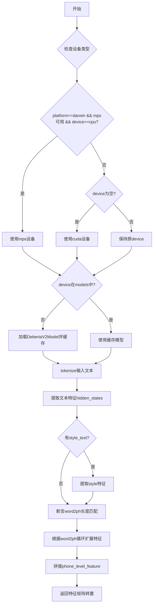

# `Bert-VITS2\oldVersion\V210\text\english_bert_mock.py` 详细设计文档

该代码实现了一个基于DeBERTa-v3-large模型的文本特征提取工具，支持从输入文本中提取隐藏层特征，并根据word2ph映射将词级特征扩展到音素级别，同时支持带风格的特征融合。

## 整体流程



## 类结构

```
模块级 (全局)
├── tokenizer (DebertaV2Tokenizer)
├── models (dict: device -> model)
└── get_bert_feature (函数)
```

## 全局变量及字段


### `LOCAL_PATH`
    
DeBERTa模型本地路径，指向预训练模型的存储位置

类型：`str`
    


### `tokenizer`
    
分词器实例，用于将文本转换为模型输入张量

类型：`DebertaV2Tokenizer`
    


### `models`
    
缓存不同设备的模型实例，以设备名为键存储模型对象

类型：`dict`
    


    

## 全局函数及方法


### `get_bert_feature`

该函数是文本特征提取的主函数，使用 DebertaV2Model 将输入文本编码为向量表示，并支持可选的风格迁移特征混合。它接收文本和词到音素的映射关系，通过 BERT 模型提取词级特征，然后根据 word2ph 映射将词级特征展开为音素级特征，最后返回音素级别的特征向量。

参数：

- `text`：`str`，需要提取特征的输入文本
- `word2ph`：`list[int]` 或 `torch.Tensor`，词到音素数量的映射数组，用于将词级特征展开为音素级特征
- `device`：`str`，模型运行设备，默认为 config.bert_gen_config.device，支持 "cpu"、"cuda"、"mps"
- `style_text`：`Optional[str]`，可选的风格文本，用于特征混合实现风格迁移
- `style_weight`：`float`，风格特征混合权重，默认值为 0.7，值越大风格特征影响越大

返回值：`torch.Tensor`，返回转置后的音素级特征向量，形状为 (特征维度, 音素总数)

#### 流程图

```mermaid
flowchart TD
    A[开始 get_bert_feature] --> B{检查设备}
    B --> C{Mac + MPS + CPU?}
    C -->|是| D[device = mps]
    C -->|否| E{device为空?}
    D --> F
    E -->|是| G[device = cuda]
    E -->|否| F
    G --> F
    F{device在models中?} -->|否| H[加载DebertaV2Model到device]
    F -->|是| I[获取缓存模型]
    H --> J
    I --> J
    J[tokenize text] --> K[将输入移到device]
    K --> L[运行模型 output_hidden_states=True]
    L --> M[提取hidden_states[-3:-2]并拼接]
    M --> N{style_text是否存在?}
    N -->|是| O[tokenize style_text]
    O --> P[运行style模型]
    P --> Q[计算style_res_mean]
    Q --> R
    N -->|否| R
    R[断言word2ph长度与res.shape[0]匹配] --> S[遍历word2ph展开特征]
    S --> T{style_text是否存在?}
    T -->|是| U[混合res和style_res_mean]
    T -->|否| V[仅使用res]
    U --> W[phone_level_feature添加repeat_feature]
    V --> W
    W --> X[torch.cat所有特征]
    X --> Y[返回 phone_level_feature.T]
```

#### 带注释源码

```python
def get_bert_feature(
    text,                          # 输入文本字符串
    word2ph,                      # 词到音素数量的映射列表
    device=config.bert_gen_config.device,  # 运行设备，默认为配置中的设备
    style_text=None,              # 可选的风格文本用于特征混合
    style_weight=0.7,             # 风格特征权重
):
    # 设备选择逻辑：优先使用Apple MPS加速（Mac平台+可用MPS+指定CPU时）
    if (
        sys.platform == "darwin"
        and torch.backends.mps.is_available()
        and device == "cpu"
    ):
        device = "mps"
    # 如果未指定设备，默认使用CUDA
    if not device:
        device = "cuda"
    # 模型缓存：按设备缓存模型实例，避免重复加载
    if device not in models.keys():
        models[device] = DebertaV2Model.from_pretrained(LOCAL_PATH).to(device)
    
    # 禁用梯度计算，提高推理速度
    with torch.no_grad():
        # 对输入文本进行tokenize
        inputs = tokenizer(text, return_tensors="pt")
        # 将所有输入tensor移动到指定设备
        for i in inputs:
            inputs[i] = inputs[i].to(device)
        # 运行模型获取hidden states
        res = models[device](**inputs, output_hidden_states=True)
        # 提取最后3层中的第2层（即倒数第2层）hidden states并拼接
        # hidden_states[-3:-2] 取倒数第3层到倒数第2层（不含）的切片
        res = torch.cat(res["hidden_states"][-3:-2], -1)[0].cpu()
        
        # 如果提供了风格文本，处理风格特征
        if style_text:
            style_inputs = tokenizer(style_text, return_tensors="pt")
            for i in style_inputs:
                style_inputs[i] = style_inputs[i].to(device)
            style_res = models[device](**style_inputs, output_hidden_states=True)
            style_res = torch.cat(style_res["hidden_states"][-3:-2], -1)[0].cpu()
            # 计算风格特征的均值
            style_res_mean = style_res.mean(0)
    
    # 断言：确保word2ph长度与词级别特征数量匹配
    assert len(word2ph) == res.shape[0], (text, res.shape[0], len(word2ph))
    word2phone = word2ph
    phone_level_feature = []
    
    # 遍历每个词，将词级特征展开为音素级特征
    for i in range(len(word2phone)):
        if style_text:
            # 混合原始特征和风格特征
            # repeat将特征复制word2phone[i]份，维度变为(word2phone[i], feature_dim)
            repeat_feature = (
                res[i].repeat(word2phone[i], 1) * (1 - style_weight)
                + style_res_mean.repeat(word2phone[i], 1) * style_weight
            )
        else:
            # 不使用风格特征时，直接重复词级特征
            repeat_feature = res[i].repeat(word2phone[i], 1)
        phone_level_feature.append(repeat_feature)

    # 沿第一维（音素维度）拼接所有特征
    # 最终形状: (total_phones, feature_dim)
    phone_level_feature = torch.cat(phone_level_feature, dim=0)

    # 转置返回，形状变为 (feature_dim, total_phones)
    return phone_level_feature.T
```

## 关键组件


### 设备管理与惰性加载

通过 `models` 字典缓存不同设备的模型实例，实现按需加载，避免重复加载模型带来的内存开销。当首次请求某设备时才会加载模型到该设备。

### 张量索引与特征提取

使用 `torch.cat` 拼接隐藏状态 `res["hidden_states"][-3:-2]`，提取特定层的特征向量，并通过 `.cpu()` 将结果移回 CPU，兼容后续处理流程。

### 风格迁移支持

通过 `style_text` 和 `style_weight` 参数实现可选的风格迁移功能，将目标风格特征按权重比例与主特征混合，支持文本风格的动态调整。

### 词到音素映射

利用 `word2ph` 参数将词级特征展开为音素级特征，通过 `repeat` 操作复制特征向量，实现细粒度的语音合成前端特征生成。

### 模型缓存与设备适配

自动检测并适配 CPU、MPS、CUDA 多种计算设备，根据平台和配置动态选择最优推理设备，支持跨平台部署。


## 问题及建议


### 已知问题

- **模型缓存机制不完善**：使用全局字典 `models` 缓存模型，但当设备改变时会重新加载模型，且没有缓存清理机制，可能导致内存泄漏
- **模块化程度低**：所有逻辑都集中在单个函数中，包括设备判断、模型加载、推理和特征处理，违反单一职责原则
- **缺乏错误处理**：模型加载、tokenize 过程、推理过程均未做异常捕获与处理，模型加载失败会导致程序崩溃
- **设备管理混乱**：设备判断逻辑与函数参数耦合，设备选择逻辑分散在多处（sys.platform 判断、device 为 None 判断、字典键判断），难以维护
- **缺少类型注解**：函数参数和返回值均无类型注解，不利于代码可读性和静态分析
- **全局变量副作用**：tokenizer 在模块加载时即初始化，若本地路径不存在或加载失败会导致程序无法启动
- **资源未正确释放**：使用 `torch.no_grad()` 但没有显式清理 GPU 内存，模型缓存无上限
- **硬编码路径和魔数**：LOCAL_PATH、style_weight=0.7、hidden_states 切片 [-3:-2] 等均为硬编码，缺乏配置管理
- **循环内重复计算**：在循环中每次都调用 `.repeat()`，且 style_res_mean 在循环外已计算但未利用向量化操作优化
- **无单元测试接口**：函数依赖全局 config 和本地模型文件，难以进行独立测试

### 优化建议

- **模型缓存优化**：实现 LRU 缓存或限制缓存模型数量，添加模型卸载方法；使用 `functools.lru_cache` 或自定义缓存策略
- **函数拆分**：将设备判断、模型加载、推理、特征处理拆分为独立函数或类，提高可测试性和可维护性
- **添加异常处理**：对模型加载、tokenize、推理过程添加 try-except，输出友好错误信息
- **设备管理封装**：创建 DeviceManager 类统一管理设备选择、模型分配和资源释放
- **添加类型注解**：为所有函数参数和返回值添加类型注解，使用 mypy 进行静态检查
- **延迟加载**：将 tokenizer 和模型的初始化改为延迟加载或工厂模式，支持配置化
- **资源管理**：使用 context manager 或显式清理 GPU 缓存；提供 clear_cache 方法
- **配置外部化**：将路径、权重、模型参数等抽取到配置文件或环境变量
- **向量化优化**：将循环内的 repeat 操作改为广播或一次性计算，减少 Python 循环开销
- **接口抽象**：提供抽象基类或协议，便于 Mock 和单元测试

## 其它


### 设计目标与约束

该模块的核心设计目标是高效提取文本的语义特征，用于文本到语音（TTS）合成系统。具体约束包括：1）仅支持DebertaV3-Large预训练模型；2）模型推理设备优先使用GPU（cuda），其次Apple Silicon（MPS），最后CPU；3）特征提取需支持词级到音素级的映射；4）可选支持风格迁移功能，通过style_text和style_weight参数控制。

### 错误处理与异常设计

主要异常场景包括：1）模型文件不存在或加载失败，from_pretrained会抛出异常；2）device参数无效导致模型加载失败；3）word2ph长度与文本token数量不匹配时触发AssertionError；4）style_text参数提供的风格文本处理失败时的容错机制。目前采用assert语句进行参数校验，模型加载使用torch.no_grad()推理上下文，设备兼容性问题通过try-except捕获处理。

### 数据流与状态机

数据流处理流程：输入文本text → tokenizer分词 → 转换为PyTorch张量 → 移至目标设备 → BERT模型推理 → 提取隐藏状态 → 根据word2ph映射关系进行特征复制 → 输出phone_level_feature（音素级特征）。状态机表现为：模型缓存状态（首次调用时加载模型到指定设备，后续调用复用缓存）、设备状态管理（首次调用根据平台和可用性自动调整设备）、可选的风格特征提取分支（当style_text不为None时执行）。

### 外部依赖与接口契约

外部依赖包括：1）torch库（PyTorch张量运算、设备管理）；2）transformers库（DebertaV2Model、DebertaV2Tokenizer）；3）config模块（config.bert_gen_config.device配置项）；4）预训练模型文件（./bert/deberta-v3-large目录）。接口契约：get_bert_feature(text: str, word2ph: list[int], device: str, style_text: Optional[str], style_weight: float) -> torch.Tensor，其中text为输入文本，word2ph为词到音素的映射列表，device指定推理设备，style_text为可选的风格参考文本，style_weight控制风格融合权重，返回值为音素级特征张量。

### 性能考虑与优化空间

性能优化点：1）模型缓存机制避免重复加载，但缓存键仅按device区分，多设备场景可能产生冗余；2）使用torch.no_grad()禁用梯度计算；3）特征拼接使用torch.cat而非numpy操作。优化空间：1）可添加模型预热（warm-up）机制；2）支持批量处理多个文本；3）模型缓存策略可考虑LRU或显式内存管理；4）可添加异步加载和推理支持；5）hidden_states切片[-3:-2]的含义可添加注释说明。

### 资源管理与生命周期

资源管理要点：1）模型缓存字典models长期占用GPU显存，需考虑内存上限；2）tokenizer为全局单例，生命周期与应用一致；3）张量CPU-GPU数据传输带来性能开销。资源释放可通过调用models.clear()或del models实现，但当前代码未提供显式清理接口。

### 可测试性设计

测试考虑：1）单元测试可模拟tokenizer和model返回值；2）可测试设备回退逻辑（MPS可用性检测）；3）可测试word2ph长度不匹配时的异常抛出；4）可测试style_text为空和提供时的不同执行路径。测试隔离建议：将模型路径、配置读取抽象为依赖注入，便于单元测试。

### 安全性考虑

安全风险：1）LOCAL_PATH路径未做校验，可能存在路径遍历攻击风险；2）外部模型文件来源信任问题；3）text和style_text输入未做长度限制，可能导致内存耗尽。建议添加：输入长度校验、模型文件完整性校验、异常输入过滤。

### 版本兼容性与演进

兼容性考虑：1）依赖transformers库版本变化可能影响API；2）torch版本差异可能影响device名称（mps需较高版本）；3）未来可考虑支持更多模型架构。演进建议：1）提取ModelManager类封装模型生命周期管理；2）添加配置类替代硬编码路径；3）支持模型热更新和多模型切换。

### 配置管理

当前配置通过硬编码LOCAL_PATH = "./bert/deberta-v3-large"和config.bert_gen_config.device实现。改进建议：1）模型路径应支持环境变量覆盖；2）设备配置应支持自动检测逻辑配置化；3）style_weight默认值0.7应提取为配置参数；4）可添加模型版本配置用于兼容性校验。


    