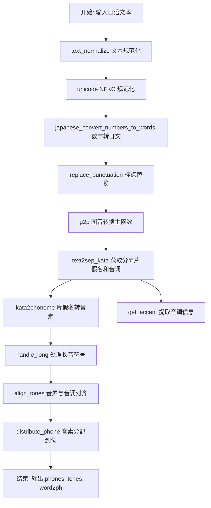
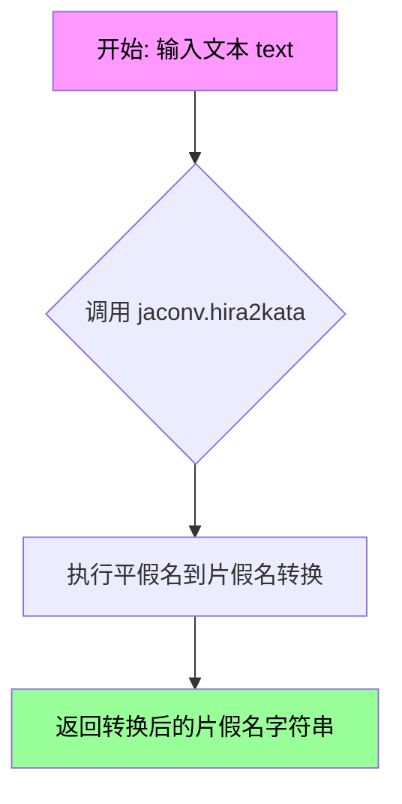
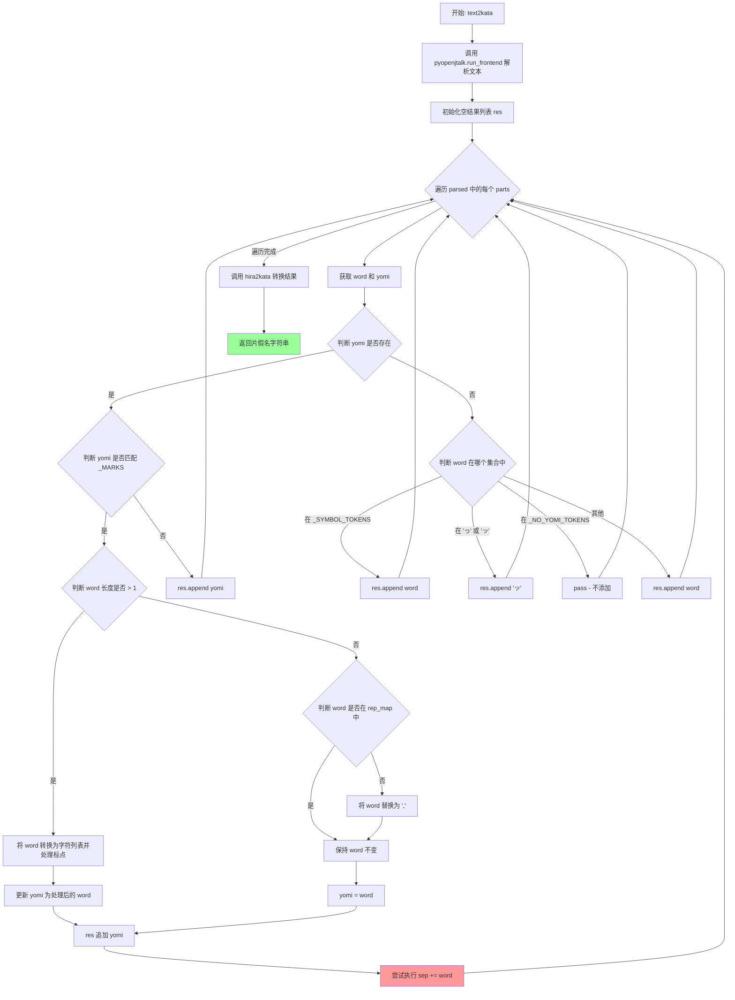
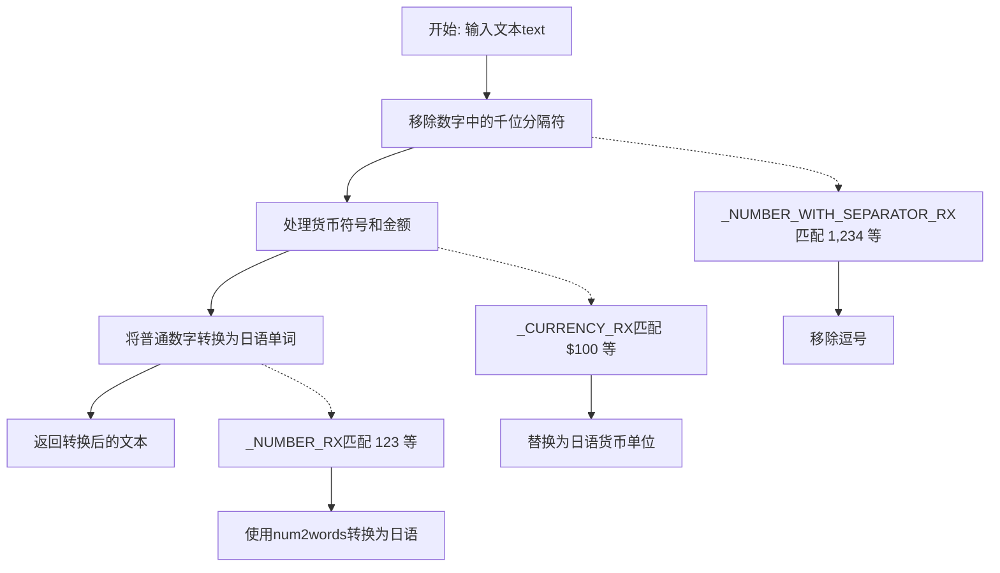
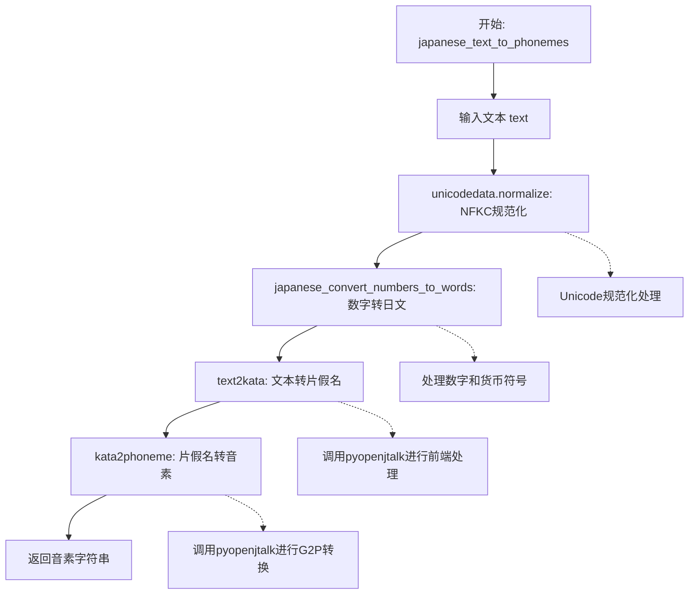
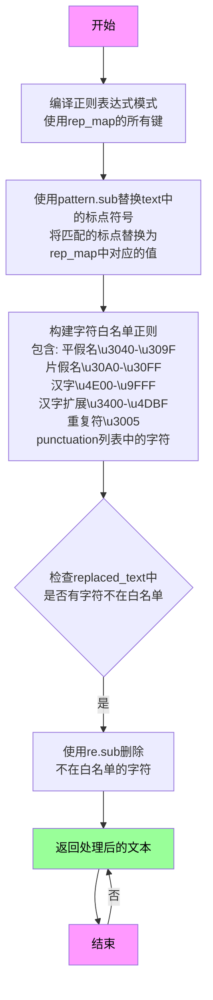
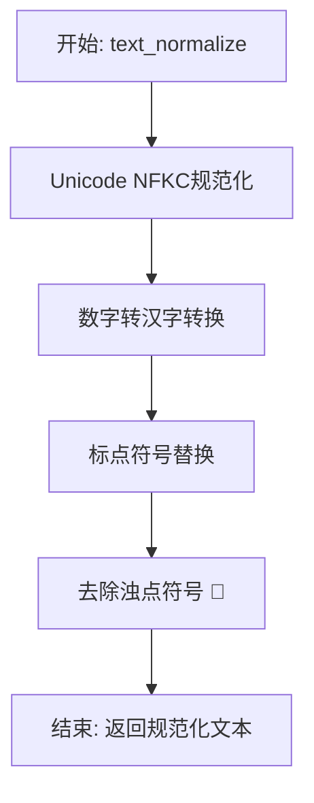
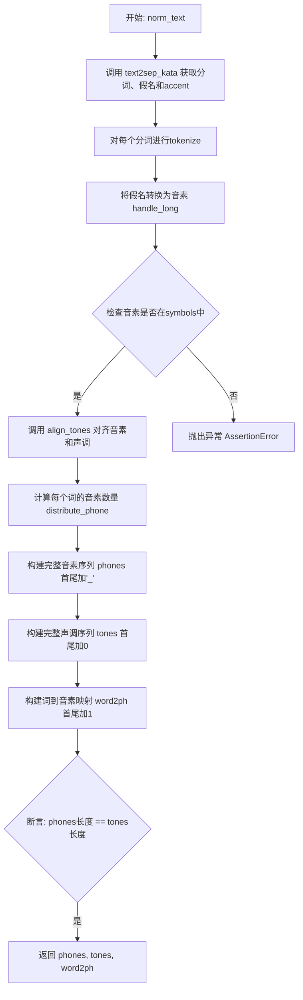
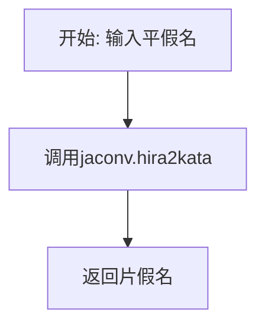
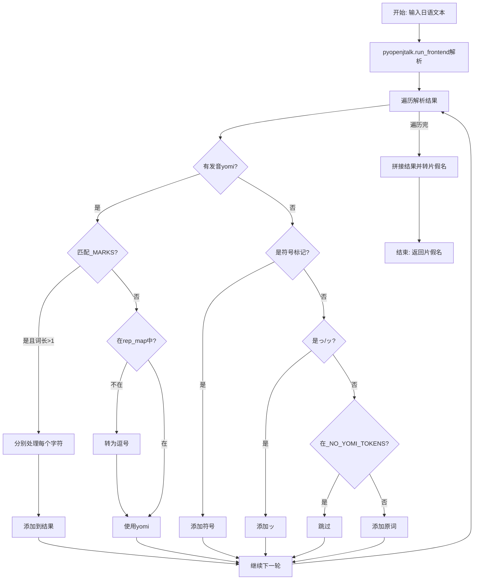

# `Bert-VITS2\oldVersion\V210\text\japanese.py` 详细设计文档

该代码库实现了一个日语文本到音素的转换系统，兼容Julius语音识别工具包。核心功能包括日文文本 normalization（unicode 规范化、数字转文字、标点符号替换）、平假名/片假名转换、OpenJTalk 语音合成前端处理、音调（accent）提取、以及最终的音素对齐和输出。支持将日文文本转换为音素序列、音调序列和词素-音素对齐信息，主要用于日文语音合成（TTS）系统。

## 整体流程



## 类结构

```
无类层次结构（纯函数式模块）
主要模块划分:
├── 文本规范化 (text_normalize, replace_punctuation)
├── 假名转换 (hira2kata, kata2phoneme, text2kata)
├── OpenJTalk 集成 (text2sep_kata, get_accent)
├── 数字/符号转换 (japanese_convert_numbers_to_words, japanese_convert_alpha_symbols_to_words)
├── 音素处理 (handle_long, align_tones, distribute_phone)
└── 主入口 (g2p, japanese_text_to_phonemes)
```

## 全局变量及字段


### `_SYMBOL_TOKENS`
    
用于识别文本中标点符号的集合，包含常见的日语和中文标点符号

类型：`set`
    


### `_NO_YOMI_TOKENS`
    
用于识别没有对应读音的日语括号和引号类符号集合

类型：`set`
    


### `_MARKS`
    
正则表达式模式，用于匹配日语字符、平假名、片假名、汉字以及字母数字

类型：`re.Pattern`
    


### `_ALPHASYMBOL_YOMI`
    
字母和符号到日语读音的映射字典，用于将英文字母和希腊字母转换为日语发音

类型：`dict`
    


### `_NUMBER_WITH_SEPARATOR_RX`
    
正则表达式模式，用于匹配带千位分隔符的数字（如1,234）

类型：`re.Pattern`
    


### `_CURRENCY_MAP`
    
货币符号到日语表示的映射字典，包含美元、日元、英镑、欧元

类型：`dict`
    


### `_CURRENCY_RX`
    
正则表达式模式，用于匹配货币符号后跟数字的组合

类型：`re.Pattern`
    


### `_NUMBER_RX`
    
正则表达式模式，用于匹配整数或小数形式的数字

类型：`re.Pattern`
    


### `rep_map`
    
标点符号替换映射表，用于将各种语言的标点符号统一转换为英文标点

类型：`dict`
    


### `tokenizer`
    
用于日语的DeBERTa-v2-large分词器实例，用于文本分词处理

类型：`transformers.AutoTokenizer`
    


    

## 全局函数及方法


### `kata2phoneme`

将片假名文本转换为音素序列。该函数是日语文本转音素流程中的核心组件，主要处理片假名输入，通过 pyopenjtalk 库进行语音合成前的音素转换，同时处理特殊符号如长音符号"ー"的逻辑延伸。

参数：

- `text`：`str`，输入的片假名文本字符串

返回值：`List[str]`，返回转换后的音素列表（注：代码中类型注解为 `str` 但实际返回 `List[str]`）

#### 流程图

```mermaid
flowchart TD
    A[开始: kata2phoneme] --> B[text = text.strip 去除首尾空白]
    B --> C{text == 'ー'}
    C -->|是| D[返回 ['ー']] 
    C -->|否| E{text startswith 'ー'}
    E -->|是| F[返回 ['ー'] + kata2phoneme(text[1:])]
    E -->|否| G[初始化 res = [], prev = None]
    G --> H{while text 非空}
    H --> I{re.match _MARKS, text}
    I -->|是| J[res.append text[0], text = text[1:], 继续]
    J --> H
    I -->|否| K{text startswith 'ー'}
    K -->|是| L{prev 存在}
    L -->|是| M[res.append prev[-1]]
    L -->|否| N[跳过]
    M --> O[text = text[1:], 继续]
    O --> H
    K -->|否| P[res += pyopenjtalk.g2p text 小写 replace cl->q 空格分割]
    P --> Q[break 退出循环]
    Q --> R[返回 res]
```

#### 带注释源码

```python
def kata2phoneme(text: str) -> str:
    """Convert katakana text to phonemes.
    
    将片假名文本转换为音素序列。
    处理特殊字符如长音符号（ー）以及非假名字符。
    
    Args:
        text: 输入的片假名文本
        
    Returns:
        音素列表（实际返回 List[str]，类型注解有误）
    """
    # 去除输入文本首尾的空白字符
    text = text.strip()
    
    # 特殊情况：单个长音符号"ー"，直接返回
    if text == "ー":
        return ["ー"]
    
    # 特殊情况：以长音符号开头，递归处理剩余部分
    # 例如 "ーア" -> ["ー"] + kata2phoneme("ア")
    elif text.startswith("ー"):
        return ["ー"] + kata2phoneme(text[1:])
    
    # 初始化结果列表和前一个音素
    res = []
    prev = None
    
    # 主循环：逐字符处理文本
    while text:
        # 检查是否匹配标点符号或特殊标记（非假名字符）
        if re.match(_MARKS, text):
            # 将标记字符添加到结果中
            res.append(text)
            # 移处理下一个字符
            text = text[1:]
            continue
        
        # 处理文本中非开头的长音符号"ー"
        if text.startswith("ー"):
            # 如果存在前一个音素，复制其最后一个音素（延长音）
            if prev:
                res.append(prev[-1])
            # 跳过这个"ー"字符
            text = text[1:]
            continue
        
        # 核心转换：使用 pyopenjtalk 将假名转换为音素
        # .lower() 转为小写
        # .replace("cl", "q") 将闭塞音 cl 替换为 q
        # .split(" ") 按空格分割为音素列表
        res += pyopenjtalk.g2p(text).lower().replace("cl", "q").split(" ")
        
        # 完成转换，跳出循环
        break
    
    # 返回音素列表（注意：类型注解声称返回 str，实际返回 list）
    # res = _COLON_RX.sub(":", res)  # 注释掉的代码，可能用于处理冒号
    return res
```


### `hira2kata`

该函数是日语文本处理管道中的一个基础转换函数，用于将输入的日语文本中的平假名字符转换为对应的片假名字符串。

参数：

- `text`：`str`，待转换的日语文本字符串，可以包含平假名、片假名、汉字等其他字符

返回值：`str`，转换后的片假名文本，其中所有平假名字符已被转换为片假名

#### 流程图



#### 带注释源码

```python
def hira2kata(text: str) -> str:
    """将日语文本中的平假名转换为片假名。
    
    该函数是日语音素转换流程中的辅助函数，依赖于 jaconv 库
    提供的字符转换功能。它直接调用 jaconv.hira2kata 方法，
    可以处理包含平假名、片假名、汉字等混合文本，只会将
    平假名部分转换为片假名，其他字符保持不变。
    
    Args:
        text: 输入的日语文本字符串
        
    Returns:
        转换后的片假名字符串
    """
    return jaconv.hira2kata(text)
```


### `text2kata`

将输入的日文文本转换为片假名表示，处理标点符号和特殊字符，并返回转换后的片假名字符串。

参数：

- `text`：`str`，需要转换的日文文本输入

返回值：`str`，转换后的片假名字符串

#### 流程图



#### 带注释源码

```python
def text2kata(text: str) -> str:
    """
    将日文文本转换为片假名表示
    
    处理流程：
    1. 使用 pyopenjtalk 解析文本获取发音信息
    2. 遍历每个词素，处理标点符号替换
    3. 根据发音情况分类处理不同类型的词汇
    4. 最后将结果转换为片假名输出
    
    Args:
        text: 输入的日文文本字符串
        
    Returns:
        转换后的片假名字符串
    """
    # 使用 pyopenjtalk 的前端处理获取文本的形态素解析结果
    # 返回包含 string(原文) 和 pron(发音) 的字典列表
    parsed = pyopenjtalk.run_frontend(text)

    # 存储最终结果的列表
    res = []
    
    # 遍历每个形态素分析结果
    for parts in parsed:
        # 获取当前词的原文和处理后的发音
        # parts["string"]: 原始文本
        # parts["pron"]: 发音信息，需要去除撇号字符
        word, yomi = replace_punctuation(parts["string"]), parts["pron"].replace(
            "'", ""  # 移除发音中的撇号
        )
        
        # 存在发音信息时的处理逻辑
        if yomi:
            # 检查发音是否匹配特殊标记（非字母数字和日文字符）
            if re.match(_MARKS, yomi):
                # 如果原文本长度大于1（多字符词）
                if len(word) > 1:
                    # 将每个字符单独处理标点符号替换
                    word = [replace_punctuation(i) for i in list(word)]
                    # 发音列表与处理后的单词同步
                    yomi = word
                    # 累加到结果中
                    res += yomi
                    # ⚠️ 注意：此行存在 bug - sep 变量未定义
                    # 在 text2sep_kata 函数中 sep 才有定义
                    sep += word
                    continue  # 跳过后续处理
                elif word not in rep_map.keys() and word not in rep_map.values():
                    # 如果词不在映射表中，替换为逗号
                    word = ","
                # 将发音设置为处理后的词
                yomi = word
            # 将发音添加到结果列表
            res.append(yomi)
        else:
            # 没有发音时的处理逻辑（处理无法获取发音的词）
            if word in _SYMBOL_TOKENS:
                # 符号直接添加
                res.append(word)
            elif word in ("っ", "ッ"):
                # 日语促音添加"ッ"
                res.append("ッ")
            elif word in _NO_YOMI_TOKENS:
                # 无发音标记的词直接跳过
                pass
            else:
                # 其他情况添加原词
                res.append(word)
    
    # 将结果列表连接并转换为片假名
    # hira2kata 将平假名/混合假名转换为片假名
    return hira2kata("".join(res))
```


### `text2sep_kata`

该函数将日语文本转换为片假名表示，并分离出词汇单位，同时获取每个音素的语调信息。函数使用 pyopenjtalk 进行文本前端处理，然后对处理结果进行词素分离、片假名转换和语调提取。

参数：

-  `text`：`str`，输入的日语文本字符串

返回值：`tuple`，返回三元组 (sep, katakana_list, accents)，其中 sep 是原始词素列表，katakana_list 是转换为片假名的列表，accents 是音素与语调配对的列表

#### 流程图

```mermaid
flowchart TD
    A[开始: text2sep_kata] --> B[调用 pyopenjtalk.run_frontend 解析文本]
    B --> C[初始化空列表 res 和 sep]
    C --> D[遍历解析结果 parts]
    D --> E{检查 yomi 是否存在}
    E -->|是| F{检查 yomi 是否匹配 _MARKS}
    F -->|是| G{检查 word 长度是否 > 1}
    G -->|是| H[对 word 每个字符替换标点]
    H --> I[res += yomi, sep += word]
    I --> D
    G -->|否| J{检查 word 是否在映射中}
    J -->|否| K[word = ',']
    J -->|是| L[yomi = word]
    L --> M[res.append yomi]
    K --> M
    F -->|否| M
    E -->|否| N{检查 word 类型}
    N --> O{word in _SYMBOL_TOKENS}
    O -->|是| P[res.append word]
    O -->|否| Q{word in ('っ', 'ッ')}
    Q -->|是| R[res.append 'ッ']
    Q -->|否| S{word in _NO_YOMI_TOKENS}
    S -->|是| T[pass]
    S -->|否| U[res.append word]
    T --> V[sep.append word]
    P --> V
    R --> V
    U --> V
    M --> V
    V --> D
    D --> W{遍历完成?}
    W -->|否| D
    W -->|是| X[构建返回值: sep, hira2kata转换res, get_accent解析结果]
    X --> Y[结束: 返回三元组]
```

#### 带注释源码

```python
def text2sep_kata(text: str) -> (list, list):
    """将日语文本转换为片假名并分离词素，同时提取语调信息。
    
    Args:
        text: 输入的日语文本字符串
        
    Returns:
        三元组 (sep, katakana_list, accents):
            - sep: 原始词素列表
            - katakana_list: 转换为片假名的列表
            - accents: 音素与语调配对的列表 [(phoneme, accent), ...]
    """
    # 使用 pyopenjtalk 的前端处理解析输入文本
    # 返回包含每个词素信息的列表，每个元素包含 'string' 和 'pron' 字段
    parsed = pyopenjtalk.run_frontend(text)

    # res: 存储处理后的发音信息（用于后续片假名转换）
    # sep: 存储原始词素分割结果
    res = []
    sep = []
    
    # 遍历解析后的每个词素部分
    for parts in parsed:
        # 获取当前词素及其发音
        # replace_punctuation: 替换标点符号为英文符号
        # parts["pron"]: 原始发音，移除撇号字符
        word, yomi = replace_punctuation(parts["string"]), parts["pron"].replace(
            "'", ""
        )
        
        # 如果存在发音信息
        if yomi:
            # 检查发音是否匹配标记（非字母数字等字符）
            if re.match(_MARKS, yomi):
                # 如果原始词长度大于1（多字符词）
                if len(word) > 1:
                    # 对每个字符单独处理标点替换
                    word = [replace_punctuation(i) for i in list(word)]
                    yomi = word
                    # 将处理后的词添加到结果列表
                    res += yomi
                    sep += word
                    continue
                # 单字符情况：检查是否在映射表中
                elif word not in rep_map.keys() and word not in rep_map.values():
                    word = ","
                yomi = word
            # 将发音添加到结果列表
            res.append(yomi)
        else:
            # 没有发音时的处理
            
            # 符号标记（如・、。？！）
            if word in _SYMBOL_TOKENS:
                res.append(word)
            # 促音处理（っ/ッ）
            elif word in ("っ", "ッ"):
                res.append("ッ")
            # 无发音标记（如「」『』―（）［］[]）
            elif word in _NO_YOMI_TOKENS:
                pass
            else:
                # 其他情况直接添加原词
                res.append(word)
        
        # 将原始词添加到分离列表
        sep.append(word)
    
    # 返回三元组：
    # 1. sep: 原始词素列表
    # 2. katakana_list: 将结果转换为片假名
    # 3. accents: 通过 get_accent 获取的语调信息
    return sep, [hira2kata(i) for i in res], get_accent(parsed)
```


### `get_accent`

该函数用于从 pyopenjtalk 解析的文本标签中提取音素（phoneme）和重音标记（accent），通过分析音素标签中的重音位置信息，判断每个音素的重音类型（升调、降调或平调），最终返回音素与重音的元组列表。

参数：

- `parsed`：`list`，pyopenjtalk.run_frontend() 返回的解析结果列表，每个元素包含 "string" 和 "pron" 键

返回值：`list`，返回由 (phoneme, accent) 元组组成的列表，其中 accent 为 -1（降调）、0（平调）或 1（升调）

#### 流程图

```mermaid
flowchart TD
    A[开始: 接收 parsed 数据] --> B[调用 pyopenjtalk.make_label 生成标签列表]
    B --> C[初始化空列表 phonemes 和 accents]
    C --> D{遍历标签 enumerate}
    D -->|当前索引 n, 标签 label| E[提取音素: 正则匹配 \-([^\+]*)\+]
    E --> F{检查音素是否为 sil 或 pau}
    F -->|是| G[跳过当前循环, 继续]
    F -->|否| H[添加音素到 phonemes 列表]
    H --> I[提取重音位置 a1: 正则匹配 /A:(\-?[0-9]+)\+]
    I --> J[提取音素索引 a2: 正则匹配 \+(\d+)\+]
    J --> K{检查下一个标签的音素}
    K -->|下一个是 sil/pau| L[a2_next = -1]
    K -->|否则| M[a2_next = 下一个标签的索引]
    L --> N{判断重音类型}
    M --> N
    N -->|a1 == 0 且 a2_next == a2 + 1| O[accent = -1 降调]
    N -->|a2 == 1 且 a2_next == 2| P[accent = 1 升调]
    N -->|其他情况| Q[accent = 0 平调]
    O --> R[添加 accent 到 accents 列表]
    P --> R
    Q --> R
    R --> D
    D -->|遍历完成| S[返回 zip(phonemes, accents)]
    S --> T[结束]
```

#### 带注释源码

```python
def get_accent(parsed):
    """
    从 pyopenjtalk 解析结果中提取音素和重音信息。
    
    该函数通过分析 pyopenjtalk 生成的音素标签，识别每个音素的重音模式。
    重音模式分为三种：
    - -1: 降调（Falling），表示重音在此音素后下降
    - 0: 平调（Flat），表示无明显重音变化
    - 1: 升调（Rising），表示重音在此音素上升
    
    参数:
        parsed: pyopenjtalk.run_frontend() 返回的解析结果列表
        
    返回值:
        由 (phoneme, accent) 元组组成的列表
    """
    # 调用 pyopenjtalk 的 make_label 函数将解析结果转换为标签列表
    # 标签格式包含音素信息和重音位置信息
    labels = pyopenjtalk.make_label(parsed)

    # 初始化存储音素和重音的列表
    phonemes = []
    accents = []
    
    # 遍历每个标签，提取音素和重音信息
    for n, label in enumerate(labels):
        # 使用正则表达式提取音素: 格式为 -phoneme+
        # 例如: "a-i+k" 中的 "a"
        phoneme = re.search(r"\-([^\+]*)\+", label).group(1)
        
        # 过滤掉静音标记 sil (silence) 和 pau (pause)
        if phoneme not in ["sil", "pau"]:
            # 将 'cl' 替换为 'q'（闭合辅音），并转换为小写
            phonemes.append(phoneme.replace("cl", "q").lower())
        else:
            # 跳过静音标记，不进行重音处理
            continue
        
        # 提取重音位置 a1: 格式为 /A:accent+
        # a1 表示绝对重音位置，-1 表示在音素开头，0 表示无重音
        a1 = int(re.search(r"/A:(\-?[0-9]+)\+", label).group(1))
        
        # 提取当前音素在词中的索引位置 a2: 格式为 +index+
        a2 = int(re.search(r"\+(\d+)\+", label).group(1))
        
        # 检查下一个标签的音素类型
        # 判断是否为句子的结束（sil 或 pau）
        if re.search(r"\-([^\+]*)\+", labels[n + 1]).group(1) in ["sil", "pau"]:
            # 如果下一个是静音标记，设置 a2_next 为 -1
            a2_next = -1
        else:
            # 否则获取下一个音素的索引
            a2_next = int(re.search(r"\+(\d+)\+", labels[n + 1]).group(1))
        
        # 判断重音类型
        # 降调 (Falling): 当前音素无重音 (a1=0) 且下一个音素索引增加
        if a1 == 0 and a2_next == a2 + 1:
            accents.append(-1)
        # 升调 (Rising): 当前音素是第一个有重音的 (a2=1) 且下一个音素索引为 2
        elif a2 == 1 and a2_next == 2:
            accents.append(1)
        # 平调 (Flat): 其他情况
        else:
            accents.append(0)
    
    # 将音素和重音配对返回
    return list(zip(phonemes, accents))
```


### `japanese_convert_numbers_to_words`

该函数用于将日语文本中的数字（包括带分隔符的数字、货币符号和普通数字）转换为日语单词形式，以便后续的语音合成处理。

参数：
- `text`：`str`，需要转换的日语文本

返回值：`str`，数字已转换为日语单词的文本

#### 流程图



#### 带注释源码

```python
def japanese_convert_numbers_to_words(text: str) -> str:
    """
    将日语文本中的数字转换为日语单词形式
    
    处理流程:
    1. 移除千位分隔符 (如 1,234 -> 1234)
    2. 处理货币符号 (如 $100 -> 100ドル)
    3. 将数字转换为日语单词 (如 100 -> 百)
    
    参数:
        text: 输入的日语文本，可能包含数字、货币符号
        
    返回:
        转换后的日语文本，数字已转换为日语单词
    """
    # 第一步：移除千位分隔符
    # 匹配模式: [0-9]{1,3}(,[0-9]{3})+
    # 例如: 1,234,567 -> 1234567
    res = _NUMBER_WITH_SEPARATOR_RX.sub(lambda m: m[0].replace(",", ""), text)
    
    # 第二步：处理货币符号
    # 匹配模式: ([$¥£€])([0-9.]*[0-9])
    # 例如: $100 -> 100ドル, ¥500 -> 500円
    res = _CURRENCY_RX.sub(lambda m: m[2] + _CURRENCY_MAP.get(m[1], m[1]), res)
    
    # 第三步：将剩余数字转换为日语单词
    # 匹配模式: [0-9]+(\.[0-9]+)?
    # 例如: 123 -> 百二十三
    res = _NUMBER_RX.sub(lambda m: num2words(m[0], lang="ja"), res)
    
    return res


# 全局变量定义

# 匹配带千位分隔符的数字正则表达式
# 匹配1-3位数字 followed by 一个或多个 逗号+3位数字
# 例如: 1,234,567
_NUMBER_WITH_SEPARATOR_RX = re.compile("[0-9]{1,3}(,[0-9]{3})+")

# 货币符号到日语单位的映射字典
_CURRENCY_MAP = {"$": "ドル", "¥": "円", "£": "ポンド", "€": "ユーロ"}

# 匹配货币符号和数字的正则表达式
# 捕获组1: 货币符号 ($¥£€)
# 捕获组2: 数字部分
_CURRENCY_RX = re.compile(r"([$¥£€])([0-9.]*[0-9])")

# 匹配普通数字的正则表达式
# 匹配整数或小数 (如 123 或 123.45)
_NUMBER_RX = re.compile(r"[0-9]+(\.[0-9]+)?")
```


### `japanese_convert_alpha_symbols_to_words`

该函数将输入文本中的拉丁字母（a-z）和常见符号转换为对应的日语音读（hiragana/katakana），例如将"%"转换为"パーセント"，将"α"转换为"アルファ"等，常用于日语语音合成前的文本规范化处理。

参数：

- `text`：`str`，需要转换的文本，包含拉丁字母、数字或符号

返回值：`str`，转换后的字符串，原始字符中能在映射表中找到对应音读的会被替换，否则保持原样

#### 流程图

```mermaid
flowchart TD
    A[开始] --> B[接收text参数]
    B --> C[调用text.lower转为小写]
    C --> D[初始化空结果列表]
    D --> E{遍历text中的每个字符ch}
    E -->|是| F[在_ALPHASYMBOL_YOMI字典中查找ch]
    F --> G{找到对应音读?}
    G -->|是| H[获取映射值_ALPHASYMBOL_YOMI[ch]]
    G -->|否| I[使用原字符ch]
    H --> J[将结果添加到列表]
    I --> J
    J --> E
    E -->|遍历完成| K[使用.join连接所有结果]
    K --> L[返回转换后的字符串]
    L --> M[结束]
```

#### 带注释源码

```python
def japanese_convert_alpha_symbols_to_words(text: str) -> str:
    """
    将文本中的拉丁字母和符号转换为对应的日语音读。
    
    参数:
        text: str，需要转换的文本
        
    返回:
        str，转换后的文本
    """
    # 使用列表推导式遍历文本中的每个字符
    # 1. text.lower() - 将输入文本转换为小写（因为映射表中的键都是小写）
    # 2. for ch in text.lower() - 遍历每个字符
    # 3. _ALPHASYMBOL_YOMI.get(ch, ch) - 查找映射表：
    #    - 如果在字典中找到对应键，返回对应的日语音读（如"a" -> "エー"）
    #    - 如果找不到，返回原字符本身（如中文字符保持不变）
    # 4. "".join([...]) - 将列表中的所有字符/字符串连接成最终结果
    return "".join([_ALPHASYMBOL_YOMI.get(ch, ch) for ch in text.lower()])
```


### `japanese_text_to_phonemes`

该函数是日语文本转音素的核心入口函数，通过NFKC规范化、数字转换、片假名转换和音素转换四个步骤，将输入的日语文本字符串转换为兼容Julius语音识别框架的音素序列。

参数：

- `text`：`str`，待转换的日语文本字符串

返回值：`str`，转换后的日语音素字符串

#### 流程图



#### 带注释源码

```python
def japanese_text_to_phonemes(text: str) -> str:
    """Convert Japanese text to phonemes.
    
    This function is the main entry point for converting Japanese text
    into phonemes compatible with Julius speech recognition framework.
    
    The conversion pipeline consists of 4 steps:
    1. NFKC normalization (Unicode normalization)
    2. Convert numbers to Japanese words
    3. Convert text to katakana
    4. Convert katakana to phonemes
    
    Args:
        text: Input Japanese text string
        
    Returns:
        String of phonemes separated by spaces
    """
    # Step 1: NFKC Unicode normalization
    # This normalizes characters to their canonical composed form
    # 处理全角半角统一、兼容分解字符合成等
    res = unicodedata.normalize("NFKC", text)
    
    # Step 2: Convert numbers and currencies to Japanese words
    # 将阿拉伯数字转换为日文读法，如"123"转换为"百二十三"
    # 将货币符号如"$"转换为"ドル"
    res = japanese_convert_numbers_to_words(res)
    
    # Note: Alpha-symbols conversion is commented out
    # If needed, uncomment the following line:
    # res = japanese_convert_alpha_symbols_to_words(res)
    
    # Step 3: Convert normalized text to katakana
    # 使用pyopenjtalk进行形态素分析，获取词性和读音
    # 然后将平假名转换为片假名
    res = text2kata(res)
    
    # Step 4: Convert katakana to phonemes
    # 使用pyopenjtalk的g2p (grapheme-to-phoneme) 功能
    # 将片假名转换为音素序列，并进行小写化和cl->q替换
    res = kata2phoneme(res)
    
    # Return the final phoneme string
    # 返回音素列表（可能需要根据实际返回类型调整）
    return res
```


### `is_japanese_character`

该函数用于检测输入的单个字符是否属于日语文字系统（平假名、片假名、汉字等）。

参数：

- `char`：`str`，需要检测是否为日语字符的单个字符

返回值：`bool`，如果字符属于日语文字系统返回 `True`，否则返回 `False`

#### 流程图

```mermaid
flowchart TD
    A[开始: 输入字符 char] --> B[获取字符的Unicode码点 char_code = ord(char)]
    B --> C[初始化 japanese_ranges 列表]
    C --> D{遍历 japanese_ranges}
    D -->|对于每个范围 start, end| E{检查 char_code 是否在 [start, end] 范围内}
    E -->|是| F[返回 True]
    E -->|否| G{还有更多范围?}
    G -->|是| D
    G -->|否| H[返回 False]
    F --> I[结束]
    H --> I
```

#### 带注释源码

```python
def is_japanese_character(char):
    """
    检测给定字符是否为日语文字系统中的字符。
    
    支持的日语文字范围包括：
    - 平假名 (0x3040-0x309F)
    - 片假名 (0x30A0-0x30FF)
    - 汉字 CJK统一表意文字 (0x4E00-0x9FFF)
    - 汉字扩展A (0x3400-0x4DBF)
    - 汉字扩展B (0x20000-0x2A6DF)
    
    参数:
        char (str): 需要检测的单个字符
        
    返回:
        bool: 如果字符属于日语文字系统返回True，否则返回False
    """
    # 定义日语文字系统的 Unicode 范围
    japanese_ranges = [
        (0x3040, 0x309F),  # 平假名 (Hiragana)
        (0x30A0, 0x30FF),  # 片假名 (Katakana)
        (0x4E00, 0x9FFF),  # 汉字 (CJK Unified Ideographs)
        (0x3400, 0x4DBF),  # 汉字扩展 A (CJK Unified Ideographs Extension A)
        (0x20000, 0x2A6DF),  # 汉字扩展 B (CJK Unified Ideographs Extension B)
        # 可以根据需要添加其他汉字扩展范围
    ]

    # 将字符的 Unicode 编码转换为整数
    char_code = ord(char)

    # 检查字符是否在任何一个日语范围内
    for start, end in japanese_ranges:
        if start <= char_code <= end:
            return True

    return False
```


### `replace_punctuation`

该函数用于将日语文本中的标点符号替换为对应的映射值，并移除所有非日语字符（平假名、片假名、汉字、CJK扩展汉字和指定标点符号除外）。

参数：

-  `text`：`str`，待处理的日语文本字符串

返回值：`str`，替换标点符号并移除非日语字符后的文本字符串

#### 流程图



#### 带注释源码

```python
def replace_punctuation(text):
    """
    替换日语文本中的标点符号并移除非日语字符
    
    处理流程:
    1. 将文本中的标点符号替换为ASCII标点符号
    2. 删除所有非日语字符（保留平假名、片假名、汉字、重复符和指定标点）
    
    参数:
        text: str, 输入的日语文本字符串
    
    返回:
        str, 处理后的文本字符串
    """
    # 步骤1: 构建正则表达式模式，匹配rep_map中所有的标点符号键
    # 使用re.escape转义特殊字符，使用|连接所有模式
    pattern = re.compile("|".join(re.escape(p) for p in rep_map.keys()))

    # 使用pattern.sub替换匹配到的标点符号
    # lambda函数根据匹配到的字符查找rep_map中的对应值进行替换
    replaced_text = pattern.sub(lambda x: rep_map[x.group()], text)

    # 步骤2: 构建字符白名单正则表达式
    # 保留以下字符:
    # - 平假名: \u3040-\u309F
    # - 片假名: \u30A0-\u30FF
    # - CJK统一汉字: \u4E00-\u9FFF
    # - CJK汉字扩展A: \u3400-\u4DBF
    # - 重复符(々): \u3005
    # - punctuation列表中的字符(从外部导入)
    replaced_text = re.sub(
        r"[^\u3040-\u309F\u30A0-\u30FF\u4E00-\u9FFF\u3400-\u4DBF\u3005"
        + "".join(punctuation)
        + r"]+",
        "",
        replaced_text,
    )

    # 返回处理后的文本
    return replaced_text
```


### `text_normalize`

该函数是日语文本规范化处理的核心入口，接收原始日语文本并进行Unicode规范化、数字转汉字、标点符号替换等处理，最终输出清洗后的规范化文本。

参数：

- `text`：`str`，需要规范化的原始日语文本输入

返回值：`str`，经过NFKC规范化、数字转文字、标点符号替换和特殊字符去除后的规范化日语文本

#### 流程图



#### 带注释源码

```python
def text_normalize(text):
    """对日语文本进行规范化处理，包括Unicode规范化、数字转换和标点符号替换。
    
    处理流程:
    1. Unicode NFKC规范化 - 统一字符编码表示形式
    2. 数字转汉字 - 将阿拉伯数字转换为日文汉字读法
    3. 标点符号标准化 - 将各种标点映射为统一形式
    4. 去除特殊符号 - 移除浊点等不需要的字符
    
    参数:
        text: str - 输入的原始日语文本字符串
        
    返回:
        str - 规范化处理后的日语文本字符串
    """
    # Step 1: Unicode NFKC规范化
    # 将文本转换为NFKC规范化形式，处理全角半角字符统一等问题
    res = unicodedata.normalize("NFKC", text)
    
    # Step 2: 数字转汉字转换
    # 将阿拉伯数字(如123)转换为日文汉字读法(如一百二十三)
    # 同时处理货币符号($, ¥, €, £)的转换
    res = japanese_convert_numbers_to_words(res)
    
    # 注释掉的部分: 按字符过滤保留日语字符
    # res = "".join([i for i in res if is_japanese_character(i)])
    
    # Step 3: 标点符号标准化替换
    # 将各种形式的标点符号(中文、英文、日文)统一替换为标准形式
    # 例如：'。' -> '.', '，' -> ',', '！' -> '!'
    res = replace_punctuation(res)
    
    # Step 4: 去除浊点符号
    # 移除Unicode组合浊点符号'゙' (U+3099)
    # 这是日语中用于生成浊音的组合符号
    res = res.replace("゙", "")
    
    # 返回最终规范化后的文本
    return res
```


### `distribute_phone`

该函数实现了一个简单的负载均衡算法，用于将 n_phone 个音素尽可能均匀地分配到 n_word 个词语中。每个音素依次分配给当前音素数量最少的词语，从而实现均匀分布。

参数：

- `n_phone`：`int`，需要分配的音素总数
- `n_word`：`int`，需要分配到的词语数量

返回值：`list[int]`，每个词分配到的音素数量列表

#### 流程图

```mermaid
flowchart TD
    A[开始] --> B[初始化 phones_per_word = [0] * n_word]
    B --> C{循环次数 < n_phone?}
    C -->|是| D[找到 phones_per_word 中的最小值 min_tasks]
    D --> E[找到最小值第一次出现的索引 min_index]
    E --> F[phones_per_word[min_index] += 1]
    F --> C
    C -->|否| G[返回 phones_per_word]
    G --> H[结束]
```

#### 带注释源码

```python
def distribute_phone(n_phone, n_word):
    """将 n_phone 个音素尽可能均匀地分配到 n_word 个词语中。
    
    使用负载均衡算法：每次将音素分配给当前拥有最少音素的词。
    这样可以确保音素在词之间均匀分布。
    
    参数:
        n_phone: int, 需要分配的音素总数
        n_word: int, 需要分配到的词语数量
    
    返回:
        list[int]: 每个词分配到的音素数量列表
    """
    # 初始化一个长度为 n_word 的列表，所有元素为 0
    # 用于记录每个词当前分配到的音素数量
    phones_per_word = [0] * n_word
    
    # 遍历每个音素，依次分配
    for task in range(n_phone):
        # 找到当前音素数量最少的词（可能有多个，取第一个）
        min_tasks = min(phones_per_word)
        # 获取最小值第一次出现的位置索引
        min_index = phones_per_word.index(min_tasks)
        # 给该词增加一个音素
        phones_per_word[min_index] += 1
    
    # 返回最终的分配结果
    return phones_per_word
```

#### 设计目标与约束

- **设计目标**：实现音素到词语的均匀分配，确保在后续的文本转语音（Text-to-Speech）处理中，每个词都能获得合理的音素资源。
- **约束条件**：当 n_word 为 0 时，会返回空列表；当 n_phone 为 0 时，会返回全 0 的列表。

#### 错误处理与异常设计

- 当前实现未进行显式的参数校验，若 n_phone 或 n_word 为负数，可能导致不符合预期的行为。
- 若 n_word 为 0，`min(phones_per_word)` 会抛出 ValueError，因为无法从空列表中获取最小值。

#### 优化空间

- 当前使用 `list.index()` 查找最小值索引的时间复杂度为 O(n)，可以改用堆（Heap）或维护最小值索引来优化到 O(1) 或 O(log n)。
- 如果需要更复杂的分配策略（如考虑词长、权重等），可以扩展此函数。


### `handle_long`

该函数用于处理日语音素序列中的长音符号"ー"，将其替换为前一个音素的最后一个音节，确保语音合成的准确性。

参数：

- `sep_phonemes`：`list`，二维列表，表示已分割的音素序列，每个元素是一个音素列表

返回值：`list`，处理后的音素序列，其中"ー"已根据上下文替换为相应的前一个音素的最后一个音节

#### 流程图

```mermaid
flowchart TD
    A[开始: handle_long] --> B[遍历sep_phonemes列表]
    B --> C{当前索引i < 列表长度?}
    C -->|是| D{检查sep_phonemes[i][0] == 'ー'?}
    D -->|是| E[将sep_phonemes[i][0]替换为sep_phonemes[i-1][-1]]
    D -->|否| F{检查'ー'是否在sep_phonemes[i]中?}
    E --> F
    F -->|是| G[遍历sep_phonemes[i]中的每个元素]
    G --> H{当前元素 == 'ー'?}
    H -->|是| I[将当前'ー'替换为前一元素[-1]]
    H -->|否| J[继续下一个元素]
    I --> J
    J --> K{遍历完所有元素?}
    K -->|否| G
    K -->|是| L[i加1, 继续主循环]
    F -->|否| L
    C -->|否| M[返回处理后的sep_phonemes]
    M --> N[结束]
```

#### 带注释源码

```python
def handle_long(sep_phonemes):
    """
    处理日语音素序列中的长音符号"ー"。
    
    该函数遍历音素序列，对于每个包含"ー"的元素，
    将"ー"替换为前一个音素的最后一个音节，
    以确保语音合成时长音的发音正确。
    
    参数:
        sep_phonemes: 二维列表，每个子列表包含一个词或短语的音素序列
        
    返回值:
        处理后的音素序列
    """
    # 遍历每一个词/短语的音素列表
    for i in range(len(sep_phonemes)):
        # 处理当前音素列表的第一个元素为"ー"的情况
        # 将其替换为前一个词/短语的最后一个音素
        if sep_phonemes[i][0] == "ー":
            sep_phonemes[i][0] = sep_phonemes[i - 1][-1]
        
        # 检查当前音素列表中是否包含"ー"
        if "ー" in sep_phonemes[i]:
            # 遍历当前音素列表中的每个元素
            for j in range(len(sep_phonemes[i])):
                # 如果当前元素是"ー"，则替换为前一元素的最后一个音节
                if sep_phonemes[i][j] == "ー":
                    sep_phonemes[i][j] = sep_phonemes[i][j - 1][-1]
    
    return sep_phonemes
```


### `align_tones`

该函数用于将音素序列（phones）与对应的语调/重音模式（tones）进行对齐，将二维的音素-语调对应关系转换为一维的每个音素的语调值序列。

参数：

- `phones`：`List[List[str]]`，二维列表，外层列表代表词，内层列表代表每个词包含的音素序列
- `tones`：`List[Tuple[str, int]]`，二维列表，每个元素为(音素, 语调值)的元组，表示音素及其对应的重音/语调信息

返回值：`List[int]`，返回一维整数列表，表示每个音素对应的语调值（0、1、2、3等），用于语音合成中的语调控制

#### 流程图

```mermaid
flowchart TD
    A[开始 align_tones] --> B[初始化空结果列表 res]
    B --> C[遍历 phones 中的每个词 pho]
    C --> D[创建临时列表 temp, 长度为当前词的音素个数, 初始值为0]
    D --> E[遍历当前词中的每个音素 p, 获取索引 idx]
    E --> F{tones 列表是否为空?}
    F -->|是| H[跳出内层循环]
    F -->|否| G{当前音素 p 是否等于 tones[0][0]?}
    G -->|否| H
    G -->|是| I[将 temp[idx] 设为 tones[0][1]]
    I --> J{idx > 0?}
    J -->|是| K[temp[idx] 加上 temp[idx-1] 累加前面的语调值]
    J -->|否| L[从 tones 列表中移除第一个元素]
    K --> L
    L --> H
    H --> M[在 temp 前后添加 0]
    M --> N[移除末尾的 0]
    N --> O{检查 temp 中是否有 -1?}
    O -->|是| P[将 temp 中所有值加 1, 消除 -1]
    O -->|否| Q
    P --> Q
    Q --> R[将 temp 添加到结果列表 res]
    R --> S{phones 遍历完成?}
    S -->|否| C
    S --> T[将 res 展平成一维列表]
    T --> U[断言: 所有值在 0-1 之间]
    U --> V[返回结果列表]
```

#### 带注释源码

```python
def align_tones(phones, tones):
    """
    将音素序列与语调/重音模式进行对齐
    
    参数:
        phones: 二维列表, 外层列表代表词, 内层列表代表每个词包含的音素
        tones: 二维列表, 每个元素为(音素, 语调值)的元组
    
    返回:
        一维列表, 表示每个音素对应的语调值
    """
    res = []
    # 遍历每个词对应的音素序列
    for pho in phones:
        # 初始化临时数组, 长度为当前词音素个数, 初始值全为0
        temp = [0] * len(pho)
        
        # 遍历当前词的每个音素
        for idx, p in enumerate(pho):
            # 如果语调列表已空, 跳出循环
            if len(tones) == 0:
                break
            
            # 检查当前音素是否与tones中第一个音素匹配
            if p == tones[0][0]:
                # 匹配成功, 记录对应的语调值
                temp[idx] = tones[0][1]
                
                # 如果不是第一个音素, 累加前面的语调值
                # 这是一个关键逻辑: 将相对语调转换为绝对语调
                if idx > 0:
                    temp[idx] += temp[idx - 1]
                
                # 消耗已匹配的语调元素
                tones.pop(0)
        
        # 在结果前后添加0, 确保音素与词边界对齐
        # 这是为了保持输出长度与输入音素总数一致
        temp = [0] + temp
        temp = temp[:-1]
        
        # 处理-1值(下降调标记), 转换为非负数
        # -1表示语调下降, 转换后保持语义
        if -1 in temp:
            temp = [i + 1 for i in temp]
        
        # 将当前词的语调结果添加到总结果
        res.append(temp)
    
    # 将二维结果展平为一维列表
    res = [i for j in res for i in j]
    
    # 断言确保所有语调值都在有效范围内 [0, 1]
    assert not any([i < 0 for i in res]) and not any([i > 1 for i in res])
    
    return res
```


### `rearrange_tones`

该函数用于重新排列日语语音合成中的语调数据，根据当前的音素和语调信息，将语调标记转换为对应的韵律标记（0、1、2、3），用于表示语调的变化趋势。

参数：

- `tones`：`list`，语调数据列表，表示每个音节的语调值（0表示平板，1表示上升，-1表示下降）
- `phones`：`list`，音素列表，表示对应的音素序列

返回值：`list`，重新排列后的韵律标记列表，包含0（保持）、1（开始）、2（上升）、3（下降）四种标记

#### 流程图

```mermaid
flowchart TD
    A[开始 rearrange_tones] --> B[初始化结果列表 res, 长度为 len tones]
    B --> C[遍历 tones 列表]
    C --> D{i == 0?}
    D -->|是| E{tones[i] not in punctuation?}
    E -->|是| F[res[i] = 1]
    E -->|否| G[res[i] = 0]
    D -->|否| H{tones[i] == prev?}
    H -->|是| I{phones[i] in punctuation?}
    I -->|是| J[res[i] = 0]
    I -->|否| K[res[i] = 1]
    H -->|否| L{tones[i] > prev?}
    L -->|是| M[res[i] = 2]
    L -->|否| N{tones[i] < prev?}
    N -->|是| O[res[i-1] = 3]
    O --> P[res[i] = 1]
    N -->|否| Q[res[i] = 0]
    M --> R[prev = tones[i]]
    Q --> R
    P --> R
    K --> R
    J --> R
    G --> R
    F --> R
    R --> C
    C --> S{遍历结束?}
    S -->|否| C
    S -->|是| T[返回 res]
    T --> U[结束]
```

#### 带注释源码

```python
def rearrange_tones(tones, phones):
    """
    重新排列语调数据，将其转换为韵律标记。
    
    该函数根据当前音素的语调与前一个音素语调的比较结果，
    生成表示语调变化趋势的标记序列。
    
    标记含义:
    - 0: 保持当前语调
    - 1: 开始新的语调短语
    - 2: 语调上升
    - 3: 前一个音节语调下降
    
    参数:
        tones: 语调值列表，0表示平板，1表示上升，-1表示下降
        phones: 对应的音素列表
    
    返回:
        重新排列后的韵律标记列表
    """
    # 初始化结果列表，长度与输入的tones相同，默认为0
    res = [0] * len(tones)
    
    # 遍历每个语调值
    for i in range(len(tones)):
        # 处理第一个音节
        if i == 0:
            # 如果第一个音节不是标点符号，标记为语调开始
            if tones[i] not in punctuation:
                res[i] = 1
        # 如果当前音节语调等于前一个音节语调
        elif tones[i] == prev:
            # 检查当前音素是否为标点符号
            if phones[i] in punctuation:
                # 标点符号处标记为0（保持）
                res[i] = 0
            else:
                # 非标点处标记为1（继续）
                res[i] = 1
        # 如果当前音节语调上升（大于前一个）
        elif tones[i] > prev:
            # 标记为2（上升）
            res[i] = 2
        # 如果当前音节语调下降（小于前一个）
        elif tones[i] < prev:
            # 前一个音节标记为3（下降）
            res[i - 1] = 3
            # 当前音节标记为1（开始新的语调）
            res[i] = 1
        
        # 更新prev变量为当前音节的语调值
        prev = tones[i]
    
    # 返回重新排列后的韵律标记列表
    return res
```

#### 技术债务和潜在问题

1. **变量未初始化错误**：`prev` 变量在第一次循环时未被初始化，当 `i == 0` 且不满足 `if i == 0` 条件时（即 `i > 0` 第一次进入循环时），`prev` 变量未被定义，会导致 `NameError`。需要在循环开始前初始化 `prev` 变量。

2. **标点符号依赖**：函数依赖外部导入的 `punctuation` 变量，但该变量在当前文件中未定义，运行时需要确保 `punctuation` 已被正确导入。

3. **逻辑不完整**：函数在 `elif tones[i] < prev` 分支中修改了 `res[i-1]`，但如果 `i == 0`，这会导致数组越界错误。

4. **返回值未被使用**：在 `g2p` 函数中，该函数的返回值被注释掉了（`# tones = [0] + rearrange_tones(tones, phones[1:-1]) + [0]`），表明该函数可能尚未完全实现或被弃用。


### `g2p`

该函数是日语文本转音素（Grapheme-to-Phoneme）的核心转换函数，接收规范化后的日语文本，通过分词、假名转换、音素生成和声调对齐等步骤，输出用于语音合成的音素序列、声调序列以及词到音素的映射关系。

参数：

- `norm_text`：`str`，规范化后的日语文本输入

返回值：`tuple`，包含三个元素：
- `phones`：`list[str]`，音素序列，首尾添加了静音标记 `"_"`
- `tones`：`list[int]`，声调序列，与音素序列长度一致，首尾添加了初始/结束声调标记 `0`
- `word2ph`：`list[int]`，词到音素的映射，表示每个词对应多少个音素

#### 流程图



#### 带注释源码

```python
def g2p(norm_text):
    """
    将规范化日语文本转换为音素序列、声调序列和词到音素映射
    
    参数:
        norm_text: str, 经过text_normalize处理的日语文本
    
    返回:
        tuple: (phones, tones, word2ph)
            - phones: 音素列表,首尾含静音标记"_"
            - tones: 声调列表,与phones等长
            - word2ph: 词到音素的映射列表
    """
    # Step 1: 将文本分离为分词、假名和重音信息
    sep_text, sep_kata, acc = text2sep_kata(norm_text)
    
    # Step 2: 对每个分词进行tokenize
    sep_tokenized = []
    for i in sep_text:
        if i not in punctuation:
            # 使用BERT tokenizer对词进行分词
            sep_tokenized.append(tokenizer.tokenize(i))
        else:
            # 标点符号直接作为单一token
            sep_tokenized.append([i])

    # Step 3: 将假名转换为音素,并处理长音
    sep_phonemes = handle_long([kata2phoneme(i) for i in sep_kata])
    
    # 异常处理:检查所有音素是否在symbols中
    # MeCab不认识的词会导致异常,稀有的生僻词可能出现此情况
    for i in sep_phonemes:
        for j in i:
            assert j in symbols, (sep_text, sep_kata, sep_phonemes)
    
    # Step 4: 对齐音素和声调
    tones = align_tones(sep_phonemes, acc)

    # Step 5: 计算每个词对应的音素数量
    word2ph = []
    for token, phoneme in zip(sep_tokenized, sep_phonemes):
        phone_len = len(phoneme)
        word_len = len(token)
        # 将phone_len个音素分配到word_len个词
        aaa = distribute_phone(phone_len, word_len)
        word2ph += aaa
    
    # Step 6: 构建完整的音素序列,首尾添加静音标记
    phones = ["_"] + [j for i in sep_phonemes for j in i] + ["_"]
    
    # Step 7: 构建完整的声调序列,首尾添加初始/结束标记
    # tones = [0] + rearrange_tones(tones, phones[1:-1]) + [0]  # 备选方案
    tones = [0] + tones + [0]
    
    # Step 8: 构建词到音素映射,首尾添加边界标记
    word2ph = [1] + word2ph + [1]
    
    # 验证音素和声调长度一致
    assert len(phones) == len(tones)
    
    return phones, tones, word2ph
```

## 关键组件


### 文本标准化与预处理

该模块负责对输入的日语文本进行标准化处理，包括Unicode正规化、数字和货币符号转换为日语单词、标点符号替换等操作，为后续的文本转音素流程提供干净的输入数据。

### 标点符号映射表（rep_map）

定义了日语和中文标点符号到英语符号的映射关系，用于统一处理不同类型的标点符号，确保文本处理的 consistenza（一致性）。

### 数字转日语单词（japanese_convert_numbers_to_words）

将文本中的数字、货币符号转换为对应的日语单词表示，例如"100"转换为"百"、"$50"转换为"五十ドル"等。

### 字母符号转日语单词（japanese_convert_alpha_symbols_to_words）

将英文字母和希腊字母转换为对应的日语读音，例如"α"转换为"アルファ"、"b"转换为"ビー"等。

### 平假名转片假名（hira2kata）

使用jaconv库将平假名转换为片假名，是文本转音素流程中的重要预处理步骤。

### 文本转片假名（text2kata）

使用pyopenjtalk的run_frontend接口解析日语文本，获取每个单词的假名读音，并进行一系列处理包括标点符号替换、特殊字符处理等。

### 文本转分离片假名（text2sep_kata）

在text2kata基础上增加了分词信息（sep），返回分离的片假名列表、分词结果和重音信息。

### 片假名转音素（kata2phoneme）

将片假名转换为音素序列，使用pyopenjtalk的g2p功能，并处理长音符号"ー"和特殊标记，返回音素列表。

### 重音提取（get_accent）

解析pyopenjtalk生成的标签，提取每个音素的重音信息（上升、下降或平坦），返回音素-重音的元组列表。

### 文本转音素主函数（japanese_text_to_phonemes）

整个转换流程的顶层入口函数，依次调用文本标准化、数字转换、文本转假名、假名转音素等步骤，最终返回音素序列。

### 文本标准化（text_normalize）

对日语文本进行标准化处理，包括NFKC正规化、数字转换、标点符号替换、特殊字符删除等，生成规范的文本表示。

### 长音处理（handle_long）

处理片假名中的长音符号"ー"，将其替换为前一个假名的最后一个音素，确保音素序列的正确性。

### 音素分配（distribute_phone）

将n个音素均匀分配到n个单词中，采用贪心算法确保每个单词获得的音素数量尽可能均衡。

### 音调对齐（align_tones）

将重音信息与音素序列进行对齐，为每个音素分配对应的重音值（-1下降、0平坦、1上升），并处理边界情况。

### 音调重排（rearrange_tones）

根据重音变化模式重新排列音调值，生成用于语音合成的重音标签序列。

### 图形转音素主函数（g2p）

整个日语语音合成的核心函数，整合文本标准化、分词、假名转换、音素生成、重音提取、音素-单词对齐等全部流程，返回音素序列、重音序列和词素到音素的对齐信息。

### BERT特征提取

使用预训练的日语DeBERTa模型提取文本的语义特征，用于语音合成模型的输入。

### 分词器（tokenizer）

使用HuggingFace的AutoTokenizer加载日语DeBERTa分词器，用于对文本进行分词处理。

### 符号表（symbols）

从punctuation和symbols模块导入的音素符号集合，用于验证生成的音素是否合法。

### 标点符号集（punctuation）

从punctuation模块导入的标点符号集合，用于音调重排等处理。

### 正则表达式模式

包括_MARKS（匹配非日语字符）、_NUMBER_WITH_SEPARATOR_RX（匹配带分隔符的数字）、_CURRENCY_RX（匹配货币符号）、_NUMBER_RX（匹配数字）等，用于文本解析和转换。

## 问题及建议


### 已知问题

-   **变量未定义错误**：`text2kata`函数中使用了`sep += word`，但`sep`变量在此之前未定义，会导致`NameError`
-   **代码重复**：`text2kata`和`text2sep_kata`函数存在大量重复代码，可以提取公共逻辑
-   **边界检查缺失**：`get_accent`函数中访问`labels[n + 1]`时未检查数组越界，可能导致IndexError
-   **断言代替异常处理**：使用`assert`进行验证而非抛出具体异常，生产环境中断言可能被禁用
-   **列表操作效率低下**：`align_tones`函数中使用`tones.pop(0)`，该操作时间复杂度为O(n)
-   **Tokenizer重复加载**：模块级别和`__main__`块中分别加载了不同的tokenizer
-   **未使用的变量**：`kata2phoneme`函数中的`res`变量在某些分支被注释或未正确使用
-   **`rearrange_tones`函数bug**：函数中引用`prev`变量但未在循环开始前初始化
-   **类型不一致**：`kata2phoneme`函数返回类型不稳定，有时返回列表，有时可能被其他代码当作字符串处理
-   **魔法数字**：代码中存在硬编码的数字如`-1`、`0`、`1`、`2`、`3`用于表示声调，缺乏常量定义

### 优化建议

-   **重构公共逻辑**：将`text2kata`和`text2sep_kata`的共同逻辑提取为独立函数，接受参数控制返回值
-   **修复变量定义**：在`text2kata`和`text2sep_kata`函数开头初始化`sep = []`
-   **添加边界检查**：在`get_accent`中添加`n + 1 < len(labels)`检查
-   **使用deque替代list**：将`tones`参数改为`collections.deque`以优化`pop(0)`性能
-   **统一异常处理**：用`raise ValueError`或自定义异常替代assert语句
-   **单例模式加载tokenizer**：创建tokenizer实例并缓存，避免重复加载
-   **定义常量类**：创建声调类型、默认值等常量类提高可读性
-   **修复rearrange_tones**：在循环前初始化`prev = 0`
-   **类型注解完善**：为所有函数添加完整的类型注解，提高代码可维护性
-   **添加日志记录**：在关键转换步骤添加日志便于调试和监控


## 其它


### 1. 一段话描述

该代码是一个日语文本转音素（phoneme）的转换工具，主要用于语音合成系统（如Julius语音识别工具包）。它通过pyopenjtalk进行文本到假名的转换，使用jaconv进行平假名到片假名的转换，并结合transformers的tokenizer和num2words处理数字和标点符号，最终生成可用于语音合成的音素序列、重音标记和词素对齐信息。

### 2. 文件的整体运行流程

整体流程为：输入原始日语文本 → 文本标准化（NFKC规范化、数字转文字、标点符号替换） → 文本转片假名（pyopenjtalk.run_frontend） → 片假名转音素（pyopenjtalk.g2p） → 获取重音信息（get_accent） → 音素与词素对齐（align_tones、distribute_phone） → 输出最终的音素序列、重音序列和词素对齐数组。

### 3. 类的详细信息

本代码为模块形式，无类定义，全部为函数式编程。

### 4. 全局变量详细信息

### _SYMBOL_TOKENS

**类型**: set
**描述**: 包含常用日语符号的集合，用于判断是否为符号标记

### _NO_YOMI_TOKENS

**类型**: set
**描述**: 包含无发音符号的集合，如引号、括号等

### _MARKS

**类型**: re.compile
**描述**: 正则表达式，用于匹配非日语字符（包括平假名、片假名、汉字、阿拉伯数字、英文字母等）

### _ALPHASYMBOL_YOMI

**类型**: dict
**描述**: 字母符号到日文发音的映射字典，用于将英文字母和希腊字母转换为日文读音

### _NUMBER_WITH_SEPARATOR_RX

**类型**: re.compile
**描述**: 正则表达式，用于匹配带千位分隔符的数字（如1,234）

### _CURRENCY_MAP

**类型**: dict
**描述**: 货币符号到日文的映射（美元、日元、英镑、欧元）

### _CURRENCY_RX

**类型**: re.compile
**描述**: 正则表达式，用于匹配货币符号加数字的模式

### _NUMBER_RX

**类型**: re.compile
**描述**: 正则表达式，用于匹配纯数字（包括小数）

### rep_map

**类型**: dict
**描述**: 标点符号替换映射表，将各种中文、日文标点统一转换为英文标点

### tokenizer

**类型**: transformers.AutoTokenizer
**描述**: 预训练的日语DeBERTa分词器，用于文本分词

### 5. 函数详细信息

### kata2phoneme(text: str) -> str

**参数**:
- text: str, 输入的片假名字符串

**返回值**: str, 转换后的音素列表

**mermaid流程图**:
```mermaid
flowchart TD
    A[开始: 输入片假名文本] --> B{检查是否为空}
    B -->|是| C[返回空列表]
    B -->|否| D{是否为特殊字符"ー"}
    D -->|是| E[返回["ー"]]]
    D -->|否| F{是否以"ー"开头}
    F -->|是| G[递归处理后续字符]
    F -->|否| H{是否匹配_MARKS}
    H -->|是| I[添加标记并前移]
    H -->|否| J[使用pyopenjtalk.g2p转换]
    J --> K[将cl替换为q并转小写]
    K --> L[按空格分割为列表]
    L --> M[结束: 返回音素列表]
```

**源码**:
```python
def kata2phoneme(text: str) -> str:
    """Convert katakana text to phonemes."""
    text = text.strip()
    if text == "ー":
        return ["ー"]
    elif text.startswith("ー"):
        return ["ー"] + kata2phoneme(text[1:])
    res = []
    prev = None
    while text:
        if re.match(_MARKS, text):
            res.append(text)
            text = text[1:]
            continue
        if text.startswith("ー"):
            if prev:
                res.append(prev[-1])
            text = text[1:]
            continue
        res += pyopenjtalk.g2p(text).lower().replace("cl", "q").split(" ")
        break
    return res
```

### hira2kata(text: str) -> str

**参数**:
- text: str, 输入的平假名字符串

**返回值**: str, 转换后的片假名字符串

**mermaid流程图**:


**源码**:
```python
def hira2kata(text: str) -> str:
    return jaconv.hira2kata(text)
```

### text2kata(text: str) -> str

**参数**:
- text: str, 输入的日语文本字符串

**返回值**: str, 转换后的片假名字符串

**mermaid流程图**:


**源码**:
```python
def text2kata(text: str) -> str:
    parsed = pyopenjtalk.run_frontend(text)

    res = []
    for parts in parsed:
        word, yomi = replace_punctuation(parts["string"]), parts["pron"].replace(
            "'", ""
        )
        if yomi:
            if re.match(_MARKS, yomi):
                if len(word) > 1:
                    word = [replace_punctuation(i) for i in list(word)]
                    yomi = word
                    res += yomi
                    sep += word  # 此处存在变量未定义问题
                    continue
                elif word not in rep_map.keys() and word not in rep_map.values():
                    word = ","
                yomi = word
            res.append(yomi)
        else:
            if word in _SYMBOL_TOKENS:
                res.append(word)
            elif word in ("っ", "ッ"):
                res.append("ッ")
            elif word in _NO_YOMI_TOKENS:
                pass
            else:
                res.append(word)
    return hira2kata("".join(res))
```

### text2sep_kata(text: str) -> (list, list)

**参数**:
- text: str, 输入的日语文本字符串

**返回值**: tuple, 返回(分词列表, 片假名列表, 重音列表)

**mermaid流程图**:
```mermaid
flowchart TD
    A[开始: 输入日语文本] --> B[pyopenjtalk.run_frontend解析]
    B --> C[初始化res和sep列表]
    C --> D[遍历解析结果]
    D --> E{有发音yomi?}
    E -->|是| F{匹配_MARKS?}
    E -->|否| G{是符号?}
    F -->|是且词长>1| H[分别处理]
    F -->|否| I{在rep_map?}
    G -->|是| J[添加符号]
    G -->|否| K{是っ/ッ?}
    H --> L[添加到res和sep]
    I -->|不在| M[转为逗号]
    I -->|在| N[使用yomi]
    J --> O[继续]
    K -->|是| P[添加ッ]
    K -->|否| Q{无发音标记?}
    L --> O
    M --> N
    N --> O
    O --> R[添加sep]
    P --> O
    Q -->|是| S[跳过]
    Q -->|否| T[添加原词]
    S --> O
    T --> O
    R --> D
    D -->|遍历完| U[调用get_accent]
    U --> V[返回sep, 片假名列表, 重音]
```

**源码**:
```python
def text2sep_kata(text: str) -> (list, list):
    parsed = pyopenjtalk.run_frontend(text)

    res = []
    sep = []
    for parts in parsed:
        word, yomi = replace_punctuation(parts["string"]), parts["pron"].replace(
            "'", ""
        )
        if yomi:
            if re.match(_MARKS, yomi):
                if len(word) > 1:
                    word = [replace_punctuation(i) for i in list(word)]
                    yomi = word
                    res += yomi
                    sep += word
                    continue
                elif word not in rep_map.keys() and word not in rep_map.values():
                    word = ","
                yomi = word
            res.append(yomi)
        else:
            if word in _SYMBOL_TOKENS:
                res.append(word)
            elif word in ("っ", "ッ"):
                res.append("ッ")
            elif word in _NO_YOMI_TOKENS:
                pass
            else:
                res.append(word)
        sep.append(word)
    return sep, [hira2kata(i) for i in res], get_accent(parsed)
```

### get_accent(parsed)

**参数**:
- parsed: list, pyopenjtalk.run_frontend的解析结果

**返回值**: list, 音素和重音的元组列表

**mermaid流程图**:
```mermaid
flowchart TD
    A[开始: 解析结果] --> B[pyopenjtalk.make_label生成标签]
    B --> C[初始化phonemes和accents]
    C --> D[遍历标签]
    D --> E[提取音素]
    E -->|sil或pau| F[跳过]
    E -->|其他| G[添加到phonemes]
    F --> H[继续]
    G --> I[提取重音信息a1和a2]
    I --> J[获取下一个标签的a2_next]
    J --> K{判断重音模式}
    K -->|a1==0且a2_next==a2+1| L[下降重音-1]
    K -->|a2==1且a2_next==2| M[上升重音1]
    K -->|其他| N[平调0]
    L --> O[添加重音]
    M --> O
    N --> O
    O --> D
    D -->|遍历完| P[返回zip列表]
```

**源码**:
```python
def get_accent(parsed):
    labels = pyopenjtalk.make_label(parsed)

    phonemes = []
    accents = []
    for n, label in enumerate(labels):
        phoneme = re.search(r"\-([^\+]*)\+", label).group(1)
        if phoneme not in ["sil", "pau"]:
            phonemes.append(phoneme.replace("cl", "q").lower())
        else:
            continue
        a1 = int(re.search(r"/A:(\-?[0-9]+)\+", label).group(1))
        a2 = int(re.search(r"\+(\d+)\+", label).group(1))
        if re.search(r"\-([^\+]*)\+", labels[n + 1]).group(1) in ["sil", "pau"]:
            a2_next = -1
        else:
            a2_next = int(re.search(r"\+(\d+)\+", labels[n + 1]).group(1))
        # Falling
        if a1 == 0 and a2_next == a2 + 1:
            accents.append(-1)
        # Rising
        elif a2 == 1 and a2_next == 2:
            accents.append(1)
        else:
            accents.append(0)
    return list(zip(phonemes, accents))
```

### japanese_convert_numbers_to_words(text: str) -> str

**参数**:
- text: str, 输入的需要转换数字的文本

**返回值**: str, 数字转换为日文后的文本

**mermaid流程图**:
```mermaid
flowchart TD
    A[开始: 输入文本] --> B[移除千位分隔符]
    B --> C[替换货币符号]
    C --> D[转换数字为日文]
    D --> E[返回结果]
```

**源码**:
```python
def japanese_convert_numbers_to_words(text: str) -> str:
    res = _NUMBER_WITH_SEPARATOR_RX.sub(lambda m: m[0].replace(",", ""), text)
    res = _CURRENCY_RX.sub(lambda m: m[2] + _CURRENCY_MAP.get(m[1], m[1]), res)
    res = _NUMBER_RX.sub(lambda m: num2words(m[0], lang="ja"), res)
    return res
```

### japanese_convert_alpha_symbols_to_words(text: str) -> str

**参数**:
- text: str, 输入的需要转换字母符号的文本

**返回值**: str, 字母符号转换为日文后的文本

**源码**:
```python
def japanese_convert_alpha_symbols_to_words(text: str) -> str:
    return "".join([_ALPHASYMBOL_YOMI.get(ch, ch) for ch in text.lower()])
```

### japanese_text_to_phonemes(text: str) -> str

**参数**:
- text: str, 输入的日语文本

**返回值**: str, 转换后的音素序列

**mermaid流程图**:
```mermaid
flowchart TD
    A[开始: 输入日语文本] --> B[NFKC规范化]
    B --> C[数字转日文]
    C --> D[文本转片假名]
    D --> E[片假名转音素]
    E --> F[返回音素]
```

**源码**:
```python
def japanese_text_to_phonemes(text: str) -> str:
    """Convert Japanese text to phonemes."""
    res = unicodedata.normalize("NFKC", text)
    res = japanese_convert_numbers_to_words(res)
    # res = japanese_convert_alpha_symbols_to_words(res)
    res = text2kata(res)
    res = kata2phoneme(res)
    return res
```

### is_japanese_character(char)

**参数**:
- char: str, 单个字符

**返回值**: bool, 是否为日语字符

**源码**:
```python
def is_japanese_character(char):
    japanese_ranges = [
        (0x3040, 0x309F),  # 平假名
        (0x30A0, 0x30FF),  # 片假名
        (0x4E00, 0x9FFF),  # 汉字
        (0x3400, 0x4DBF),  # 汉字扩展A
        (0x20000, 0x2A6DF),  # 汉字扩展B
    ]
    char_code = ord(char)
    for start, end in japanese_ranges:
        if start <= char_code <= end:
            return True
    return False
```

### replace_punctuation(text)

**参数**:
- text: str, 输入的文本

**返回值**: str, 标点符号替换后的文本

**源码**:
```python
def replace_punctuation(text):
    pattern = re.compile("|".join(re.escape(p) for p in rep_map.keys()))
    replaced_text = pattern.sub(lambda x: rep_map[x.group()], text)
    replaced_text = re.sub(
        r"[^\u3040-\u309F\u30A0-\u30FF\u4E00-\u9FFF\u3400-\u4DBF\u3005"
        + "".join(punctuation)
        + r"]+",
        "",
        replaced_text,
    )
    return replaced_text
```

### text_normalize(text)

**参数**:
- text: str, 输入的日语文本

**返回值**: str, 标准化后的文本

**源码**:
```python
def text_normalize(text):
    res = unicodedata.normalize("NFKC", text)
    res = japanese_convert_numbers_to_words(res)
    # res = "".join([i for i in res if is_japanese_character(i)])
    res = replace_punctuation(res)
    res = res.replace("゙", "")
    return res
```

### distribute_phone(n_phone, n_word)

**参数**:
- n_phone: int, 音素数量
- n_word: int, 单词数量

**返回值**: list, 每个单词分配的音素数量

**mermaid流程图**:
```mermaid
flowchart TD
    A[开始: n_phone音素, n_word单词] --> B[初始化phones_per_word列表]
    B --> C{还有音素需要分配?}
    C -->|是| D[找最小值索引]
    D --> E[该位置加1]
    E --> C
    C -->|否| F[返回列表]
```

**源码**:
```python
def distribute_phone(n_phone, n_word):
    phones_per_word = [0] * n_word
    for task in range(n_phone):
        min_tasks = min(phones_per_word)
        min_index = phones_per_word.index(min_tasks)
        phones_per_word[min_index] += 1
    return phones_per_word
```

### handle_long(sep_phonemes)

**参数**:
- sep_phonemes: list, 分离的音素列表

**返回值**: list, 处理长音后的音素列表

**源码**:
```python
def handle_long(sep_phonemes):
    for i in range(len(sep_phonemes)):
        if sep_phonemes[i][0] == "ー":
            sep_phonemes[i][0] = sep_phonemes[i - 1][-1]
        if "ー" in sep_phonemes[i]:
            for j in range(len(sep_phonemes[i])):
                if sep_phonemes[i][j] == "ー":
                    sep_phonemes[i][j] = sep_phonemes[i][j - 1][-1]
    return sep_phonemes
```

### align_tones(phones, tones)

**参数**:
- phones: list, 音素列表
- tones: list, 重音列表

**返回值**: list, 对齐后的重音列表

**源码**:
```python
def align_tones(phones, tones):
    res = []
    for pho in phones:
        temp = [0] * len(pho)
        for idx, p in enumerate(pho):
            if len(tones) == 0:
                break
            if p == tones[0][0]:
                temp[idx] = tones[0][1]
                if idx > 0:
                    temp[idx] += temp[idx - 1]
                tones.pop(0)
        temp = [0] + temp
        temp = temp[:-1]
        if -1 in temp:
            temp = [i + 1 for i in temp]
        res.append(temp)
    res = [i for j in res for i in j]
    assert not any([i < 0 for i in res]) and not any([i > 1 for i in res])
    return res
```

### rearrange_tones(tones, phones)

**参数**:
- tones: list, 重音列表
- phones: list, 音素列表

**返回值**: list, 重排后的重音列表

**源码**:
```python
def rearrange_tones(tones, phones):
    res = [0] * len(tones)
    for i in range(len(tones)):
        if i == 0:
            if tones[i] not in punctuation:
                res[i] = 1
        elif tones[i] == prev:
            if phones[i] in punctuation:
                res[i] = 0
            else:
                res[i] = 1
        elif tones[i] > prev:
            res[i] = 2
        elif tones[i] < prev:
            res[i - 1] = 3
            res[i] = 1
        prev = tones[i]
    return res
```

### g2p(norm_text)

**参数**:
- norm_text: str, 标准化后的日语文本

**返回值**: tuple, (音素列表, 重音列表, 词素对齐列表)

**mermaid流程图**:
```mermaid
flowchart TD
    A[开始: 标准化文本] --> B[text2sep_kata获取分词、片假名、重音]
    B --> C[对分词进行tokenize]
    C --> D[片假名转音素并处理长音]
    D --> E[断言所有音素在symbols中]
    E --> F[align_tones对齐音素和重音]
    F --> G[distribute_phone分配音素到词]
    G --> H[添加起始结束标记]
    H --> I[断言长度匹配]
    I --> J[返回phones, tones, word2ph]
```

**源码**:
```python
def g2p(norm_text):
    sep_text, sep_kata, acc = text2sep_kata(norm_text)
    sep_tokenized = []
    for i in sep_text:
        if i not in punctuation:
            sep_tokenized.append(tokenizer.tokenize(i))
        else:
            sep_tokenized.append([i])

    sep_phonemes = handle_long([kata2phoneme(i) for i in sep_kata])
    # 异常处理，MeCab不认识的词的话会一路传到这里来，然后炸掉
    for i in sep_phonemes:
        for j in i:
            assert j in symbols, (sep_text, sep_kata, sep_phonemes)
    tones = align_tones(sep_phonemes, acc)

    word2ph = []
    for token, phoneme in zip(sep_tokenized, sep_phonemes):
        phone_len = len(phoneme)
        word_len = len(token)
        aaa = distribute_phone(phone_len, word_len)
        word2ph += aaa
    phones = ["_"] + [j for i in sep_phonemes for j in i] + ["_"]
    tones = [0] + tones + [0]
    word2ph = [1] + word2ph + [1]
    assert len(phones) == len(tones)
    return phones, tones, word2ph
```

### 6. 关键组件信息

### pyopenjtalk

**名称**: pyopenjtalk
**描述**: 基于Open JTalk的日语文本分析库，用于文本到假名转换和音素生成

### jaconv

**名称**: jaconv
**描述**: 日语转换库，用于平假名与片假名之间的转换

### num2words

**名称**: num2words
**描述**: 数字到文字转换库，用于将阿拉伯数字转换为日文数字读音

### transformers.AutoTokenizer

**名称**: transformers.AutoTokenizer
**描述**: Hugging Face Transformers库的分词器，用于日语文本分词

### 7. 潜在的技术债务或优化空间

### 代码质量问题

1. **text2kata函数中存在未定义变量**: 第47行使用了变量`sep`，但该变量在函数中未定义，会导致NameError
2. **text2sep_kata函数中变量sep += word的错误**: 在第89行`sep += word`会在某些条件下执行，但sep是列表，应该使用`sep.extend(word)`或`sep.append(word)`
3. **rearrange_tones函数中prev变量未初始化**: 在第248行使用`prev`变量但未在循环开始前初始化，会导致NameError

### 可优化点

1. **错误处理不足**: 缺少对MeCab无法识别的稀有词汇的异常处理（代码中有注释提到但未实现）
2. **重复代码**: text2kata和text2sep_kata有大量重复逻辑，可提取为共享函数
3. **性能优化**: 正则表达式在循环中重复编译，可提前编译并缓存
4. **断言使用**: g2p函数中使用了assert进行验证，生产环境应改为异常处理

### 8. 其它项目

### 设计目标与约束

**目标**: 将日语文本转换为语音合成所需的音素序列，支持重音标注和词素对齐
**约束**:
- 依赖外部库：pyopenjtalk、jaconv、num2words、transformers
- 需要预训练模型文件：./bert/deberta-v2-large-japanese-char-wwm
- 仅支持日语处理，不支持其他语言

### 错误处理与异常设计

1. **assert断言**: g2p函数中使用assert验证音素是否在symbols中、长度是否匹配
2. **异常注释**: 代码注释提到MeCab无法识别的稀有词会导致错误，但未实现具体处理
3. **待修复错误**:
   - text2kata中未定义变量sep
   - rearrange_tones中prev未初始化

### 数据流与状态机

**数据流**:
```
原始文本 → text_normalize → 标准化文本 
→ text2sep_kata → 分词列表 + 片假名列表 + 重音信息 
→ tokenizer分词 + kata2phoneme转音素 
→ handle_long处理长音 
→ align_tones对齐重音 
→ distribute_phone分配音素到词 
→ 最终输出: phones, tones, word2ph
```

### 外部依赖与接口契约

**依赖库**:
- re: 正则表达式处理
- unicodedata: Unicode规范化
- transformers: 预训练模型tokenizer
- pyopenjtalk: 日语文本分析
- jaconv: 日语转换
- num2words: 数字转文字

**接口契约**:
- g2p(norm_text): 输入标准化日语文本，返回(phones, tones, word2ph)三元组
- text_normalize(text): 输入原始文本，返回标准化文本
- japanese_text_to_phonemes(text): 输入日语文本，返回音素列表

### 假设与前置条件

1. 输入文本必须是有效的日语文本
2. tokenizer模型文件必须存在于指定路径
3. symbols变量必须在导入的symbols模块中定义
4. punctuation变量必须在导入的punctuation模块中定义

    