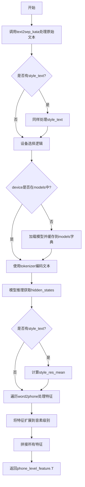
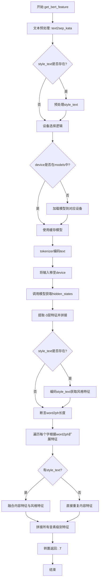
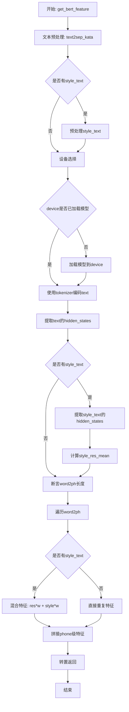

# `Bert-VITS2\oldVersion\V210\text\japanese_bert.py` 详细设计文档

该代码是一个基于BERT的日语文本特征提取模块，用于语音合成任务。它加载预训练的deberta-v2-large-japanese-char-wwm模型，将输入的日语文本转换为高维特征向量，支持风格文本迁移功能，并将词级别特征扩展到音素级别以匹配语音合成的需求。

## 整体流程



## 类结构

```
模块层级结构:
├── bert_gen.py (主模块)
│   ├── 依赖: transformers.AutoModelForMaskedLM
│   ├── 依赖: transformers.AutoTokenizer
│   ├── 依赖: config.bert_gen_config
│   └── 依赖: .japanese.text2sep_kata
```

## 全局变量及字段


### `tokenizer`
    
用于文本编码的AutoTokenizer实例

类型：`AutoTokenizer`
    


### `models`
    
缓存不同设备上的BERT模型实例

类型：`dict`
    


### `LOCAL_PATH`
    
模型本地路径 './bert/deberta-v2-large-japanese-char-wwm'

类型：`str`
    


    

## 全局函数及方法


### `get_bert_feature`

该函数是文本特征提取的核心模块，使用DeBERTa-v2大型日文字符模型将输入文本转换为BERT隐藏状态特征向量，支持通过word2ph映射将字级别特征扩展到音素级别，并可选地集成风格迁移功能。

参数：

- `text`：`str`，需要提取BERT特征的日语文本输入
- `word2ph`：`list` 或 `torch.Tensor`，字到音素数量的映射关系，用于决定每个字对应的特征重复次数
- `device`：`str`，计算设备（cpu/cuda/mps），默认读取配置文件中的bert_gen_config.device
- `style_text`：`str | None`，可选的风格参考文本，用于风格迁移，默认None
- `style_weight`：`float`，风格融合权重，取值范围0-1，默认0.7

返回值：`torch.Tensor`，返回音素级别的特征向量，形状为 (特征维度, 总音素数)

#### 流程图



#### 带注释源码

```python
import sys

import torch
from transformers import AutoModelForMaskedLM, AutoTokenizer

from config import config
from .japanese import text2sep_kata

# 本地BERT模型路径，使用的DeBERTa-v2大型日文字符模型
LOCAL_PATH = "./bert/deberta-v2-large-japanese-char-wwm"

# 加载tokenizer，用于文本分词
tokenizer = AutoTokenizer.from_pretrained(LOCAL_PATH)

# 全局模型缓存字典，按设备存储已加载的模型，避免重复加载
models = dict()


def get_bert_feature(
    text,
    word2ph,
    device=config.bert_gen_config.device,
    style_text=None,
    style_weight=0.7,
):
    # 步骤1: 文本预处理 - 将日文文本转换为分离的片假名形式并合并
    text = "".join(text2sep_kata(text)[0])
    
    # 步骤2: 如果存在风格文本，同样进行预处理
    if style_text:
        style_text = "".join(text2sep_kata(style_text)[0])
    
    # 步骤3: 设备选择逻辑
    # 如果在macOS平台且MPS可用，同时device为cpu，则优先使用mps
    if (
        sys.platform == "darwin"
        and torch.backends.mps.is_available()
        and device == "cpu"
    ):
        device = "mps"
    
    # 如果device为空或None，默认使用cuda
    if not device:
        device = "cuda"
    
    # 步骤4: 模型加载/缓存 - 根据设备加载或获取缓存的模型
    if device not in models.keys():
        models[device] = AutoModelForMaskedLM.from_pretrained(LOCAL_PATH).to(device)
    
    # 步骤5: 编码输入文本并提取BERT特征
    with torch.no_grad():
        inputs = tokenizer(text, return_tensors="pt")
        # 将所有输入tensor移动到指定设备
        for i in inputs:
            inputs[i] = inputs[i].to(device)
        
        # 调用模型获取包含hidden_states的输出
        res = models[device](**inputs, output_hidden_states=True)
        
        # 提取最后3层中的第-3:-2层（即倒数第3层），并沿最后一维拼接
        # 得到字级别的特征表示
        res = torch.cat(res["hidden_states"][-3:-2], -1)[0].cpu()
        
        # 步骤6: 如果存在风格文本，提取风格特征
        if style_text:
            style_inputs = tokenizer(style_text, return_tensors="pt")
            for i in style_inputs:
                style_inputs[i] = style_inputs[i].to(device)
            style_res = models[device](**style_inputs, output_hidden_states=True)
            style_res = torch.cat(style_res["hidden_states"][-3:-2], -1)[0].cpu()
            # 计算风格特征的平均值
            style_res_mean = style_res.mean(0)

    # 步骤7: 验证word2ph长度与文本长度的匹配性
    # 预期长度 = 文本长度 + 2（可能是起始/结束标记）
    assert len(word2ph) == len(text) + 2
    
    word2phone = word2ph
    phone_level_feature = []
    
    # 步骤8: 将字级别特征扩展到音素级别
    for i in range(len(word2phone)):
        if style_text:
            # 融合内容特征和风格特征
            repeat_feature = (
                res[i].repeat(word2phone[i], 1) * (1 - style_weight)
                + style_res_mean.repeat(word2phone[i], 1) * style_weight
            )
        else:
            # 仅使用内容特征
            repeat_feature = res[i].repeat(word2phone[i], 1)
        phone_level_feature.append(repeat_feature)

    # 步骤9: 拼接所有音素级别的特征
    phone_level_feature = torch.cat(phone_level_feature, dim=0)

    # 步骤10: 转置返回，输出形状为 (特征维度, 总音素数)
    return phone_level_feature.T
```

## 关键组件


### 模型加载与缓存（models字典）

在get_bert_feature函数中，使用全局字典models根据设备(device)缓存不同的模型实例，避免重复加载模型，提高性能。

### 文本预处理（text2sep_kata）

调用japanese模块的text2sep_kata函数将输入文本转换为分离的片假名，处理日语字符的特殊性。

### 特征提取（BERT前向传播）

使用AutoModelForMaskedLM.from_pretrained加载deberta-v2-large-japanese-char-wwm模型，对输入文本进行前向传播，提取隐藏状态作为文本特征。

### 风格混合（style_text）

支持可选的style_text参数，当提供风格文本时，使用style_weight权重混合原始特征和风格特征，实现特征层面的风格迁移。

### 词到音素映射（word2ph）

通过word2phone列表将词级别特征展开为音素级别特征，使用repeat方法复制特征向量以匹配音素数量。

### 设备自动选择

自动检测并选择计算设备，支持CPU、CUDA（GPU）和MPS（Apple Silicon）三种设备，优先使用MPS加速。


## 问题及建议


### 已知问题

-   **硬编码模型路径**：`LOCAL_PATH = "./bert/deberta-v2-large-japanese-char-wwm"` 硬编码在全局，后续迁移或部署时不灵活
-   **全局变量管理风险**：`tokenizer` 和 `models` 作为全局变量，无法进行序列化和单元测试，模型缓存无清理机制
-   **不恰当的参数校验**：使用 `assert` 进行 `word2ph` 长度校验，在 Python 优化模式（`python -O`）下会被跳过，导致运行时错误
-   **设备选择逻辑缺陷**：当 `platform == "darwin"` 且 MPS 可用且 `device == "cpu"` 时才使用 MPS，逻辑反直觉；未处理 CUDA 不可用时的回退方案
-   **代码重复**：tokenizer 处理逻辑（`inputs` 和 `style_inputs`）存在重复代码
-   **函数职责过重**：`get_bert_feature` 同时处理特征提取和风格迁移两个职责，违反单一职责原则
-   **类型注解缺失**：无任何函数参数和返回值的类型注解，降低代码可读性和可维护性
-   **资源管理不当**：模型长期缓存在全局字典中，无显式释放机制，可能导致内存泄漏

### 优化建议

-   将 `LOCAL_PATH` 和默认 `device` 移至 `config` 模块统一管理
-   将 `tokenizer` 和 `models` 改为类成员变量或通过依赖注入方式管理，提供 `cleanup()` 方法释放模型资源
-   将 `assert` 改为显式的参数校验，抛出 `ValueError` 异常
-   重构设备选择逻辑，提供明确的设备优先级：CUDA > MPS > CPU，并增加 CUDA 不可用时的明确提示或回退
-   抽取重复的 tokenizer 处理逻辑为私有方法
-   考虑拆分函数为 `extract_features()` 和 `apply_style_transfer()`，或创建独立的 `StyleFeatureExtractor` 类
-   为所有函数添加类型注解，使用 `typing` 模块声明参数和返回值类型
-   考虑增加批处理支持以提升推理效率

## 其它


### 1. 一段话描述

该代码实现了一个基于DeBERTa-v2-large-japanese-char-wwm预训练模型的日语文本特征提取功能，主要用于文本到语音（Text-to-Speech）场景中的phoneme级别特征生成，支持可选的风格迁移功能，能够将输入文本转换为高维特征向量并按照word2ph映射进行phone级别的特征展开。

### 2. 文件的整体运行流程

代码的整体运行流程如下：首先加载预训练的DeBERTa分词器（tokenizer），并初始化一个空模型缓存字典（models）。当调用get_bert_feature函数时，流程如下：1）输入文本经过text2sep_kata进行日文文本预处理；2）根据系统平台和设备可用性自动选择计算设备（cuda/mps/cpu）；3）如果设备对应的模型未加载，则从本地路径加载模型并缓存；4）使用tokenizer对文本进行编码并送入模型提取hidden states；5）如果有风格文本输入，同样提取其特征并计算均值；6）根据word2ph映射将词级别特征展开为phone级别特征；7）如存在风格文本，按照style_weight权重混合主文本和风格文本的特征；8）最终返回转置后的phone级别特征矩阵。

### 3. 类的详细信息

本代码文件中不包含类定义，所有功能通过模块级全局函数实现。

### 4. 全局变量

#### tokenizer
- **类型**: transformers.tokenization_utils_base.PreTrainedTokenizer
- **描述**: 预训练的DeBERTa日文字符级别的分词器实例，用于将输入文本转换为模型输入的token ids

#### models
- **类型**: dict
- **描述**: 模型缓存字典，键为设备字符串（"cuda"/"mps"/"cpu"），值为对应设备加载的AutoModelForMaskedLM模型实例，用于避免重复加载模型

#### LOCAL_PATH
- **类型**: str
- **描述**: 预训练模型文件的本地存储路径，指向DeBERTa-v2-large-japanese-char-wwm模型目录

### 5. 全局函数

#### get_bert_feature

**参数:**
| 参数名称 | 参数类型 | 参数描述 |
|---------|---------|---------|
| text | str | 输入的日文文本字符串 |
| word2ph | list[int] | 词到phone数量的映射列表，长度应等于处理后文本长度加2 |
| device | str | 指定计算设备，默认为config.bert_gen_config.device |
| style_text | str | 可选的风格文本，用于风格迁移 |
| style_weight | float | 风格特征混合权重，默认为0.7 |

**返回值:**
- **类型**: torch.Tensor
- **描述**: 返回形状为(特征维度, phone总数)的float张量，表示phone级别的特征矩阵

**mermaid流程图:**



**带注释源码:**

```python
def get_bert_feature(
    text,
    word2ph,
    device=config.bert_gen_config.device,
    style_text=None,
    style_weight=0.7,
):
    # 第一步：文本预处理，使用text2sep_kata将文本转换为分离的片假名形式
    # 并将结果合并为单一字符串
    text = "".join(text2sep_kata(text)[0])
    
    # 如果存在风格文本，同样进行预处理
    if style_text:
        style_text = "".join(text2sep_kata(style_text)[0])
    
    # 设备选择逻辑：优先检查MPS加速（macOS平台），然后回退到CUDA或CPU
    if (
        sys.platform == "darwin"
        and torch.backends.mps.is_available()
        and device == "cpu"
    ):
        device = "mps"
    
    # 如果未指定设备，默认使用CUDA
    if not device:
        device = "cuda"
    
    # 模型缓存机制：按设备缓存模型，避免重复加载
    if device not in models.keys():
        models[device] = AutoModelForMaskedLM.from_pretrained(LOCAL_PATH).to(device)
    
    # 特征提取阶段
    with torch.no_grad():
        # 对主文本进行tokenize
        inputs = tokenizer(text, return_tensors="pt")
        for i in inputs:
            inputs[i] = inputs[i].to(device)
        
        # 获取模型输出，提取最后三层hidden states中的倒数第三层
        res = models[device](**inputs, output_hidden_states=True)
        res = torch.cat(res["hidden_states"][-3:-2], -1)[0].cpu()
        
        # 如果存在风格文本，提取风格特征
        if style_text:
            style_inputs = tokenizer(style_text, return_tensors="pt")
            for i in style_inputs:
                style_inputs[i] = inputs[i].to(device)  # 注意：这里应该用style_inputs[i]
            style_res = models[device](**style_inputs, output_hidden_states=True)
            style_res = torch.cat(style_res["hidden_states"][-3:-2], -1)[0].cpu()
            style_res_mean = style_res.mean(0)

    # 验证输入长度一致性：[CLS] + text + [SEP] = len(text) + 2
    assert len(word2ph) == len(text) + 2
    word2phone = word2ph
    phone_level_feature = []
    
    # 将词级别特征展开为phone级别特征
    for i in range(len(word2phone)):
        if style_text:
            # 特征混合：主文本特征与风格特征按权重混合
            repeat_feature = (
                res[i].repeat(word2phone[i], 1) * (1 - style_weight)
                + style_res_mean.repeat(word2phone[i], 1) * style_weight
            )
        else:
            # 直接重复词级别特征到phone级别
            repeat_feature = res[i].repeat(word2phone[i], 1)
        phone_level_feature.append(repeat_feature)

    # 拼接所有phone级别的特征
    phone_level_feature = torch.cat(phone_level_feature, dim=0)

    return phone_level_feature.T
```

### 6. 关键组件信息

#### DeBERTa-v2-large-japanese-char-wwm模型
- **描述**: Google发布的DeBERTa大模型日文字符级版本，使用Whole Word Masking预训练，适用于日语文本理解和特征提取任务

#### text2sep_kata函数
- **描述**: 日文文本处理函数，将输入文本转换为分离的片假名形式，用于后续的tokenization和特征对齐

#### config.bert_gen_config.device
- **描述**: 全局配置中的设备参数，用于指定模型运行的计算设备

### 7. 潜在的技术债务或优化空间

#### 模型缓存策略不完善
- models字典仅按设备键存储，如果传入不同的device字符串会创建新的模型实例，可能导致显存溢出
- 建议：实现LRU缓存或最大数量限制

#### 设备检测逻辑存在缺陷
- 在检查`torch.backends.mps.is_available()`时同时要求`device == "cpu"`，逻辑不清晰
- style_inputs的to(device)操作错误地使用了inputs而非style_inputs

#### 缺少模型卸载机制
- 没有提供显式的模型卸载或显存清理函数
- 建议：添加clear_models()或__del__方法

#### 错误处理不足
- 缺少对LOCAL_PATH路径有效性的检查
- 缺少对word2ph中元素类型和值的验证（应为正整数）
- 缺少对text为空字符串的边界处理
- 缺少对transformers库加载失败的异常捕获

#### 硬编码路径
- LOCAL_PATH作为模块级常量，缺乏灵活性，建议通过config配置注入

#### 风格迁移实现简化
- style_res_mean直接对所有token取平均，可能不是最优的风格特征提取方式
- 建议：考虑使用[CLS] token或特殊设计的风格向量

### 8. 设计目标与约束

#### 设计目标
1. 实现高效的日语文本到phoneme级别特征的转换
2. 支持基于预训练语言模型的风格迁移功能
3. 通过模型缓存实现多次调用时的性能优化
4. 支持多设备灵活部署（CPU/CUDA/MPS）

#### 设计约束
1. 依赖特定预训练模型（DeBERTa-v2-large-japanese-char-wwm）
2. 输入文本必须为日文
3. word2ph映射长度必须精确匹配文本长度+2（考虑[CLS]和[SEP]）
4. 风格权重style_weight必须在[0,1]范围内
5. 需要足够的GPU显存或内存加载大模型

### 9. 错误处理与异常设计

#### 当前实现的错误处理
- 使用assert验证word2ph长度与文本长度的匹配性
- 使用torch.no_grad()避免梯度计算，减少内存使用

#### 建议增加的异常处理
1. **模型加载失败**: 捕获OSError/Exception，提示模型路径无效或文件损坏
2. **设备不可用**: 检查CUDA/MPS可用性并给出明确错误信息
3. **输入验证**: 验证text非空、word2ph为正整数列表、style_weight在[0,1]范围
4. **Tokenization失败**: 捕获tokenizer异常，处理特殊字符或超长输入
5. **显存不足**: 捕获RuntimeError (CUDA out of memory)，建议清理缓存或切换设备

### 10. 数据流与状态机

#### 输入数据流
```
原始文本(str) → text2sep_kata处理 → 合并为单字符串 → tokenizer编码 → 模型输入
     ↓
word2ph映射(list) → 长度验证 → 用于特征展开控制
     ↓
style_text(可选) → 相同处理流程 → 特征提取 → 均值计算 → 用于风格混合
```

#### 特征提取状态机
```
状态1: 初始化 → 设备选择 → 模型加载/缓存检查
状态2: 文本编码 → 模型推理 → hidden states提取
状态3: 特征展开 → phone级别特征拼接 → 转置输出
```

#### 风格迁移数据流
```
主文本特征(res) ──┐
                  ├─→ 加权混合 → phone级特征
风格特征(style) ──┘
```

### 11. 外部依赖与接口契约

#### 外部依赖
| 依赖库 | 版本要求 | 用途 |
|-------|---------|------|
| torch | - | 张量计算和深度学习框架 |
| transformers | - | 预训练模型加载和tokenization |
| config | 本地 | 全局配置管理 |
| japanese | 本地 | 日文文本预处理 |

#### 公开接口契约
- **函数签名**: `get_bert_feature(text: str, word2ph: List[int], device: str = None, style_text: str = None, style_weight: float = 0.7) -> torch.Tensor`
- **前置条件**: 
  - text必须为非空日文字符串
  - word2ph长度必须等于len(text) + 2
  - word2ph中所有元素必须为正整数
  - style_weight必须在[0, 1]范围内
- **后置条件**: 
  - 返回形状为(特征维度, sum(word2ph))的二维张量
  - 返回张量位于CPU设备上
- **副作用**: 
  - 首次调用指定device时会加载模型到该设备
  - models字典会增加新条目

### 12. 配置管理

#### 模型路径配置
- 当前代码使用硬编码路径`./bert/deberta-v2-large-japanese-char-wwm`
- 建议：从config模块读取，支持环境变量覆盖

#### 设备配置
- 默认设备从config.bert_gen_config.device获取
- 运行时支持覆盖，但不支持动态切换到已加载模型的设备

#### 性能相关配置
- style_weight默认为0.7，可通过参数调整
- 模型缓存策略为永久缓存，缺乏超时或数量限制机制


    