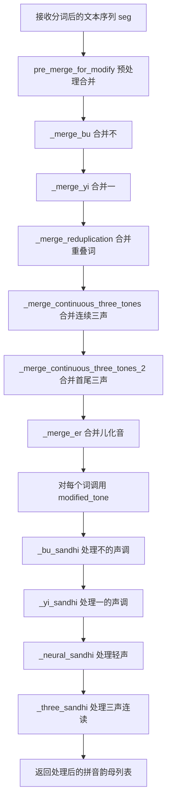
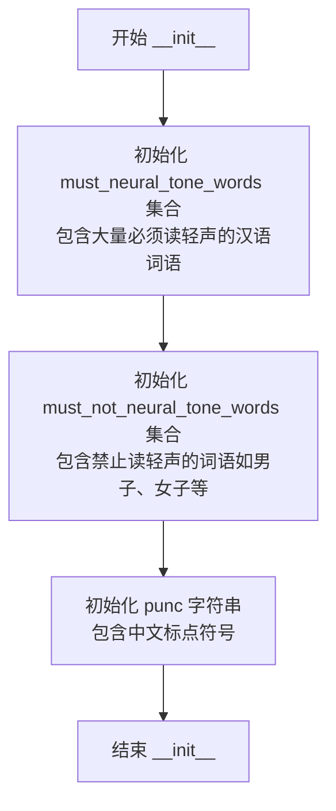
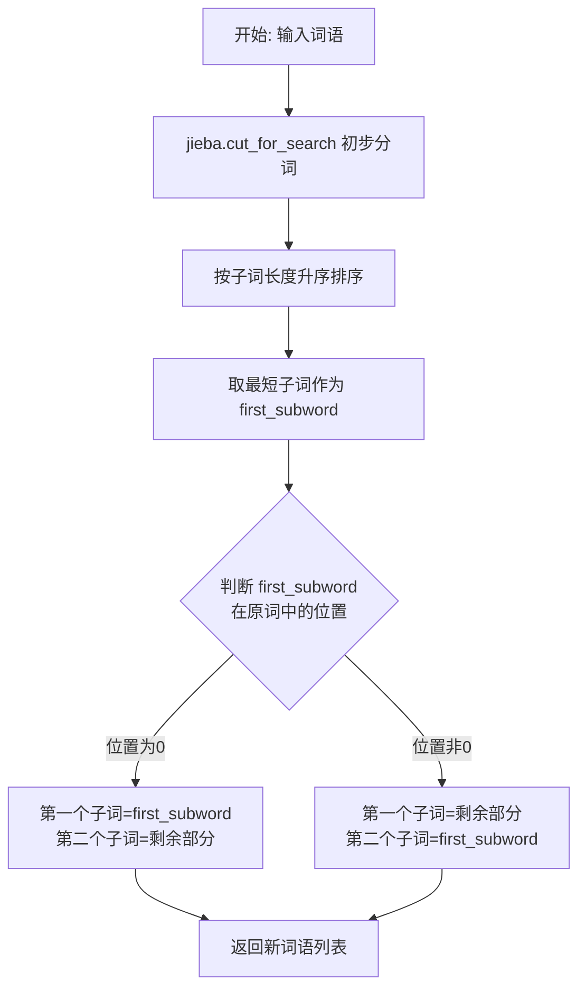
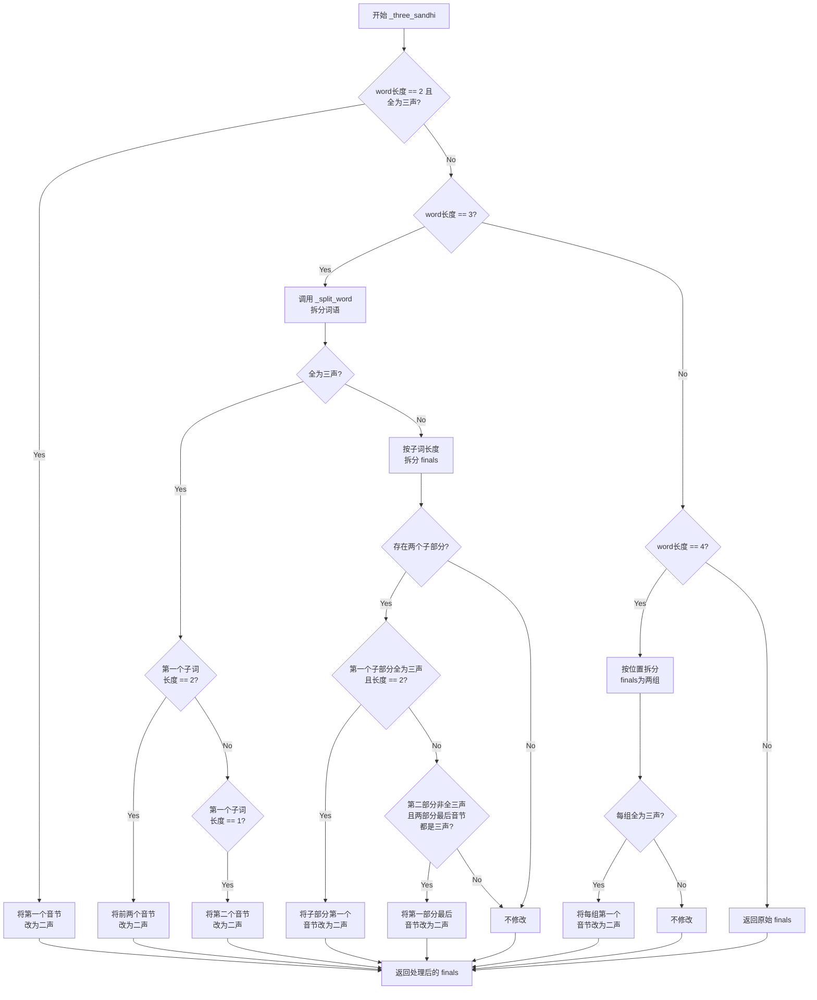
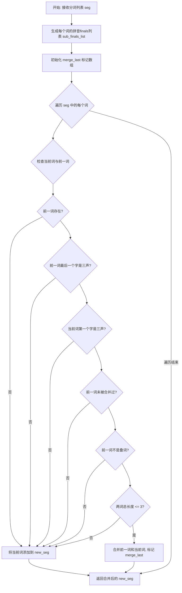
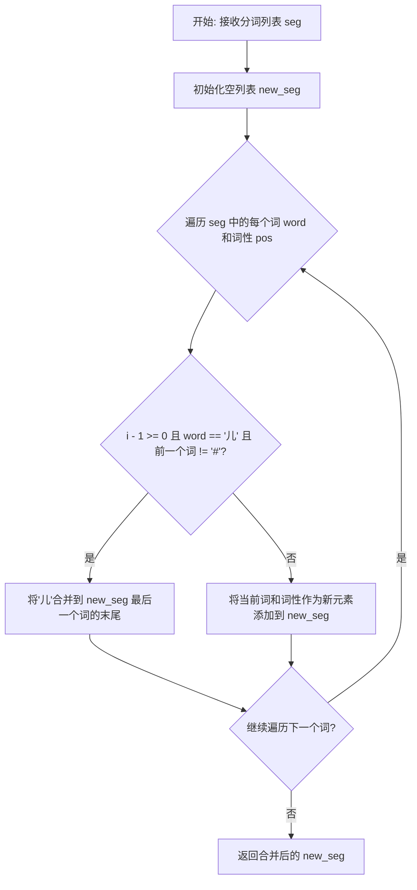
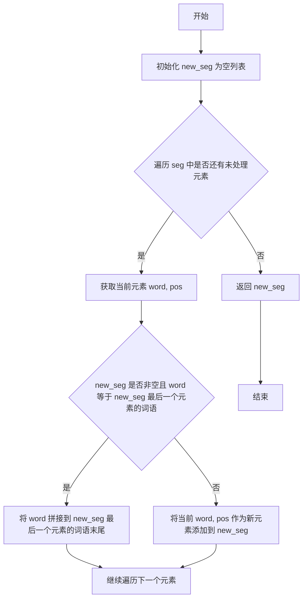

# `Bert-VITS2\oldVersion\V210\text\tone_sandhi.py` 详细设计文档

这是一个中文声调连读处理模块，通过jieba分词和pypinyin拼音库，实现对中文文本的声调变化处理，包括轻声、儿化音、不（一）三声连读等语言现象的自动识别和转换。

## 整体流程



## 类结构

```
ToneSandhi (声调连读处理类)
├── 字段: must_neural_tone_words (必须读轻声的词语集合)
├── 字段: must_not_neural_tone_words (不应读轻声的词语集合)
├── 字段: punc (标点符号集合)
└── 方法: 15+ 个处理方法
```

## 全局变量及字段


### `must_neural_tone_words`
    
必须读轻声的汉语词语集合，存储大量需要读轻声的常见词汇

类型：`set`
    


### `must_not_neural_tone_words`
    
不应读轻声的词语集合，主要包含重叠词和特定词汇

类型：`set`
    


### `punc`
    
中文标点符号字符串，用于判断一字后面的标点是否保持原声调

类型：`str`
    


### `ToneSandhi.must_neural_tone_words`
    
必须读轻声的汉语词语集合，存储大量需要读轻声的常见词汇

类型：`set`
    


### `ToneSandhi.must_not_neural_tone_words`
    
不应读轻声的词语集合，主要包含重叠词和特定词汇

类型：`set`
    


### `ToneSandhi.punc`
    
中文标点符号字符串，用于判断一字后面的标点是否保持原声调

类型：`str`
    
    

## 全局函数及方法


### `ToneSandhi.__init__`

该方法是ToneSandhi类的构造函数，负责初始化三个关键的词语集合：必须读轻声的词语（must_neural_tone_words）、禁止读轻声的词语（must_not_neural_tone_words）以及标点符号集合（punc），为后续的中文声调（轻声、连读变调等）处理提供数据支持。

参数：

- `self`：`ToneSandhi`，隐式参数，类的实例本身

返回值：`None`，无返回值，该方法仅进行实例属性的初始化操作

#### 流程图



#### 带注释源码

```python
def __init__(self):
    """
    初始化ToneSandhi类，创建必须读轻声的词语集合、禁止读轻声的词语集合
    以及标点符号集合，用于后续的中文声调处理
    """
    # 初始化必须读轻声的词语集合（must_neural_tone_words）
    # 这些词语在汉语口语中约定俗成地读作轻声
    # 例如：麻烦、麻利、鸳鸯、高粱、骨头、骆驼、马虎、首饰、馒头、馄饨、风筝等
    # 涵盖了大量日常生活中的双音节词
    self.must_neural_tone_words = {
        "麻烦",
        "麻利",
        "鸳鸯",
        "高粱",
        "骨头",
        "骆驼",
        "马虎",
        "首饰",
        "馒头",
        "馄饨",
        "风筝",
        "难为",
        "队伍",
        "阔气",
        "闺女",
        "门道",
        "锄头",
        "铺盖",
        "铃铛",
        "铁匠",
        "钥匙",
        "里脊",
        "里头",
        "部分",
        "那么",
        "道士",
        "造化",
        "迷糊",
        "连累",
        "这么",
        "这个",
        "运气",
        "过去",
        "软和",
        "转悠",
        "踏实",
        "跳蚤",
        "跟头",
        "趔趄",
        "财主",
        "豆腐",
        "讲究",
        "记性",
        "记号",
        "认识",
        "规矩",
        "见识",
        "裁缝",
        "补丁",
        "衣裳",
        "衣服",
        "衙门",
        "街坊",
        "行李",
        "行当",
        "蛤蟆",
        "蘑菇",
        "薄荷",
        "葫芦",
        "葡萄",
        "萝卜",
        "荸荠",
        "苗条",
        "苗头",
        "苍蝇",
        "芝麻",
        "舒服",
        "舒坦",
        "舌头",
        "自在",
        "膏药",
        "脾气",
        "脑袋",
        "脊梁",
        "能耐",
        "胳膊",
        "胭脂",
        "胡萝",
        "胡琴",
        "胡同",
        "聪明",
        "耽误",
        "耽搁",
        "耷拉",
        "耳朵",
        "老爷",
        "老实",
        "老婆",
        "老头",
        "老太",
        "翻腾",
        "罗嗦",
        "罐头",
        "编辑",
        "结实",
        "红火",
        "累赘",
        "糨糊",
        "糊涂",
        "精神",
        "粮食",
        "簸箕",
        "篱笆",
        "算计",
        "算盘",
        "答应",
        "笤帚",
        "笑语",
        "笑话",
        "窟窿",
        "窝囊",
        "窗户",
        "稳当",
        "稀罕",
        "称呼",
        "秧歌",
        "秀气",
        "秀才",
        "福气",
        "祖宗",
        "砚台",
        "码头",
        "石榴",
        "石头",
        "石匠",
        "知识",
        "眼睛",
        "眯缝",
        "眨巴",
        "眉毛",
        "相声",
        "盘算",
        "白净",
        "痢疾",
        "痛快",
        "疟疾",
        "疙瘩",
        "疏忽",
        "畜生",
        "生意",
        "甘蔗",
        "琵琶",
        "琢磨",
        "琉璃",
        "玻璃",
        "玫瑰",
        "玄乎",
        "狐狸",
        "状元",
        "特务",
        "牲口",
        "牙碜",
        "牌楼",
        "爽快",
        "爱人",
        "热闹",
        "烧饼",
        "烟筒",
        "烂糊",
        "点心",
        "炊帚",
        "灯笼",
        "火候",
        "漂亮",
        "滑溜",
        "溜达",
        "温和",
        "清楚",
        "消息",
        "浪头",
        "活泼",
        "比方",
        "正经",
        "欺负",
        "模糊",
        "槟榔",
        "棺材",
        "棒槌",
        "棉花",
        "核桃",
        "栅栏",
        "柴火",
        "局势",
        "枕头",
        "枇杷",
        "机灵",
        "本事",
        "木头",
        "木匠",
        "朋友",
        "月饼",
        "月亮",
        "暖和",
        "明白",
        "时候",
        "新鲜",
        "故事",
        "收拾",
        "收成",
        "提防",
        "挖苦",
        "挑剔",
        "指甲",
        "指头",
        "拾掇",
        "拳头",
        "拨弄",
        "招牌",
        "招呼",
        "抬举",
        "护士",
        "折腾",
        "扫帚",
        "打量",
        "打算",
        "打点",
        "打扮",
        "打听",
        "打发",
        "扎实",
        "扁担",
        "戒指",
        "懒得",
        "意识",
        "意思",
        "情形",
        "悟性",
        "怪物",
        "思量",
        "怎么",
        "念头",
        "念叨",
        "快活",
        "忙活",
        "志气",
        "心思",
        "得罪",
        "张罗",
        "弟兄",
        "开通",
        "应酬",
        "庄稼",
        "干事",
        "帮手",
        "帐篷",
        "希罕",
        "师父",
        "师傅",
        "巴结",
        "巴掌",
        "差事",
        "工夫",
        "岁数",
        "屁股",
        "尾巴",
        "少爷",
        "小气",
        "小伙",
        "将就",
        "对头",
        "对付",
        "寡妇",
        "家伙",
        "客气",
        "实在",
        "官司",
        "学问",
        "学生",
        "字号",
        "嫁妆",
        "媳妇",
        "媒人",
        "婆家",
        "娘家",
        "委屈",
        "姑娘",
        "姐夫",
        "妯娌",
        "妥当",
        "妖精",
        "奴才",
        "女婿",
        "头发",
        "太阳",
        "大爷",
        "大方",
        "大意",
        "大夫",
        "多少",
        "多么",
        "外甥",
        "壮实",
        "地道",
        "地方",
        "在乎",
        "困难",
        "嘴巴",
        "嘱咐",
        "嘟囔",
        "嘀咕",
        "喜欢",
        "喇嘛",
        "喇叭",
        "商量",
        "唾沫",
        "哑巴",
        "哈欠",
        "哆嗦",
        "咳嗽",
        "和尚",
        "告诉",
        "告示",
        "含糊",
        "吓唬",
        "后头",
        "名字",
        "名堂",
        "合同",
        "吆喝",
        "叫唤",
        "口袋",
        "厚道",
        "厉害",
        "千斤",
        "包袱",
        "包涵",
        "匀称",
        "勤快",
        "动静",
        "动弹",
        "功夫",
        "力气",
        "前头",
        "刺猬",
        "刺激",
        "别扭",
        "利落",
        "利索",
        "利害",
        "分析",
        "出息",
        "凑合",
        "凉快",
        "冷战",
        "冤枉",
        "冒失",
        "养活",
        "关系",
        "先生",
        "兄弟",
        "便宜",
        "使唤",
        "佩服",
        "作坊",
        "体面",
        "位置",
        "似的",
        "伙计",
        "休息",
        "什么",
        "人家",
        "亲戚",
        "亲家",
        "交情",
        "云彩",
        "事情",
        "买卖",
        "主意",
        "丫头",
        "丧气",
        "两口",
        "东西",
        "东家",
        "世故",
        "不由",
        "不在",
        "下水",
        "下巴",
        "上头",
        "上司",
        "丈夫",
        "丈人",
        "一辈",
        "那个",
        "菩萨",
        "父亲",
        "母亲",
        "咕噜",
        "邋遢",
        "费用",
        "冤家",
        "甜头",
        "介绍",
        "荒唐",
        "大人",
        "泥鳅",
        "幸福",
        "熟悉",
        "计划",
        "扑腾",
        "蜡烛",
        "姥爷",
        "照顾",
        "喉咙",
        "吉他",
        "弄堂",
        "蚂蚱",
        "凤凰",
        "拖沓",
        "寒碜",
        "糟蹋",
        "倒腾",
        "报复",
        "逻辑",
        "盘缠",
        "喽啰",
        "牢骚",
        "咖喱",
        "扫把",
        "惦记",
    }
    
    # 初始化必须不变读的词语集合（must_not_neural_tone_words）
    # 这些词语虽然在某些情况下可能被误读为轻声，但按照标准汉语发音规则不应读轻声
    # 主要包括：男子、女子、分子、原子、量子、莲子、石子、瓜子、电子、人人、虎虎等
    self.must_not_neural_tone_words = {
        "男子",
        "女子",
        "分子",
        "原子",
        "量子",
        "莲子",
        "石子",
        "瓜子",
        "电子",
        "人人",
        "虎虎",
    }
    
    # 初始化中文标点符号集合（punc）
    # 用于在声调处理时判断"一"后面是否为标点符号，如果是标点则仍读一声
    self.punc = "：，；。？！""'''':,;.?!\""
```


### `ToneSandhi._neural_sandhi`

该方法是 `ToneSandhi` 类中的核心方法，负责处理中文词语的轻声（neutral tone）变化。它根据词性、词语结构以及预定义的必读轻声词列表，对拼音韵母进行修改，将需要读作轻声的音节标记为轻声（通过将韵母末尾的数字替换为"5"）。

参数：

- `word`：`str`，待处理的中文词语
- `pos`：`str`，jieba 分词后的词性标注（如 "n" 表示名词，"v" 表示动词，"a" 表示形容词等）
- `finals`：`List[str]`，词语对应的拼音韵母列表，每个元素如 "ia1"、"i3" 等，末尾数字表示声调

返回值：`List[str]`，处理后的拼音韵母列表，其中需要读轻声的音节被修改为以 "5" 结尾

#### 流程图

```mermaid
flowchart TD
    A[开始: _neural_sandhi] --> B{检查是否为叠词<br/>且词性为n/v/a<br/>且不在必不读轻声词列表}
    B -->|是| C[将叠词第二个字改为轻声<br/>finals[j] 末尾改为5]
    B -->|否| D{检查末尾字符是否为语气词<br/>吧呢啊呐噻...}
    C --> D
    D -->|是| E[将末尾改为轻声]
    D -->|否| F{检查末尾字符是否为<br/>助词的地得}
    E --> F
    F -->|是| G[将末尾改为轻声]
    F --> H{检查末尾字符是否为我<br/>们子且词性为r/n<br/>且不在必不读轻声词列表}
    G --> H
    H -->|是| I[将末尾改为轻声]
    H --> J{检查是否为方位词<br/>上下里且词性为s/l/f}
    I --> J
    J -->|是| K[将末尾改为轻声]
    J --> L{检查是否为方向词<br/>来去且前一字为上下进出回过起开}
    K --> L
    L -->|是| M[将末尾改为轻声]
    L --> N{检查是否为量词个<br/>前面是数字/几/两/半/多/各...}
    M --> N
    N -->|是| O[将个改为轻声]
    N --> P{检查词语或词语后两位<br/>是否在必读轻声词列表}
    O --> P
    P -->|是| Q[将末尾改为轻声]
    P --> R{拆分词语为两部分<br/>调用_split_word}
    Q --> R
    R --> S[遍历两部分<br/>检查是否在必读轻声词列表]
    S --> T{检查词语在轻声词列表}
    T -->|是| U[将对应部分末尾改为轻声]
    T -->|否| V[合并两部分韵母]
    U --> V
    V --> W[返回处理后的finals]
```

#### 带注释源码

```python
def _neural_sandhi(self, word: str, pos: str, finals: List[str]) -> List[str]:
    """
    处理中文词语的轻声变化
    
    根据多种规则将需要读作轻声的音节标记为轻声（将韵母末尾数字改为5）：
    1. 叠词（奶奶、试试）
    2. 语气词结尾（吧、呢、啊）
    3. 助词（的、地、得）
    4. 后缀（们、子）
    5. 方位词（上、下、里）
    6. 方向词组合（上来、下去）
    7. 量词（个）
    8. 必读轻声词
    """
    
    # 处理叠词情况，如"奶奶"（n.）、"试试"（v.）、"旺旺"（n./v.）
    # 叠词中第二个字通常读轻声
    for j, item in enumerate(word):
        if (
            j - 1 >= 0  # 确保不是第一个字符
            and item == word[j - 1]  # 当前字符与前一个字符相同（叠词）
            and pos[0] in {"n", "v", "a"}  # 词性为名词、动词或形容词
            and word not in self.must_not_neural_tone_words  # 不在"必不读轻声"列表
        ):
            # 将叠词第二个字的韵母末尾改为5（轻声）
            finals[j] = finals[j][:-1] + "5"
    
    # 查找"个"字的位置，用于后续量词判断
    ge_idx = word.find("个")
    
    # 处理语气词结尾的情况，如"走吧"、"看呢"、"好啊"等
    # 这些语气词通常读轻声
    if len(word) >= 1 and word[-1] in "吧呢啊呐噻嘛吖嗨呐哦哒额滴哩哟喽啰耶喔诶":
        finals[-1] = finals[-1][:-1] + "5"
    # 处理助词"的"、"地"、"得"，它们在语法功能中常读轻声
    elif len(word) >= 1 and word[-1] in "的地得":
        finals[-1] = finals[-1][:-1] + "5"
    # 以下elif被注释掉了，是处理动态助词"了着过"的规则（已禁用）
    # elif len(word) == 1 and word in "了着过" and pos in {"ul", "uz", "ug"}:
    #     finals[-1] = finals[-1][:-1] + "5"
    # 处理后缀"们"（表示复数）和"子"（名词后缀），如"我们"、"孩子"
    elif (
        len(word) > 1
        and word[-1] in "们子"  # 末尾是"们"或"子"
        and pos in {"r", "n"}  # 词性为代词或名词
        and word not in self.must_not_neural_tone_words  # 不在"必不读轻声"列表
    ):
        finals[-1] = finals[-1][:-1] + "5"
    # 处理方位词，如"桌上"、"地下"、"家里"
    elif len(word) > 1 and word[-1] in "上下里" and pos in {"s", "l", "f"}:
        finals[-1] = finals[-1][:-1] + "5"
    # 处理方向词组合，如"上来"、"下去"、"出去"、"回来"等
    elif len(word) > 1 and word[-1] in "来去" and word[-2] in "上下进出回过起开":
        finals[-1] = finals[-1][:-1] + "5"
    # 处理量词"个"在特定情况下的轻声
    # 当"个"前有数字、量词或特定字时，"个"读轻声
    elif (
        ge_idx >= 1
        and (
            word[ge_idx - 1].isnumeric()  # 前一个是数字
            or word[ge_idx - 1] in "几有两半多各整每做是"  # 前一个是特定量词或字
        )
    ) or word == "个":
        finals[ge_idx] = finals[ge_idx][:-1] + "5"
    else:
        # 处理必读轻声词，这些词在普通话中必须读轻声
        if (
            word in self.must_neural_tone_words  # 整个词在列表中
            or word[-2:] in self.must_neural_tone_words  # 词的后两位在列表中
        ):
            finals[-1] = finals[-1][:-1] + "5"

    # 使用jieba分词将词语拆分为子词，分别处理轻声规则
    word_list = self._split_word(word)
    # 将韵母列表按照子词长度分割为两部分
    finals_list = [finals[: len(word_list[0])], finals[len(word_list[0]) :]]
    
    # 遍历每个子词，检查是否在必读轻声词列表中
    for i, word in enumerate(word_list):
        # 检查整个词或词的后两位是否在必读轻声词列表中
        if (
            word in self.must_neural_tone_words
            or word[-2:] in self.must_neural_tone_words
        ):
            # 将对应子词的最后一个音节改为轻声
            finals_list[i][-1] = finals_list[i][-1][:-1] + "5"
    
    # 合并两个子词的韵母列表
    finals = sum(finals_list, [])
    return finals
```


### `ToneSandhi._bu_sandhi`

该方法处理中文声调变化中的"不"变调规则。当"不"位于三字词中间位置（如"看不懂"）时，将"不"改为轻声（5声）；当"不"位于四声（去声）字前面时，将"不"改为二声（阳平），如"不怕"。

参数：
- `word`：`str`，待处理的词语
- `finals`：`List[str]`，词语的拼音韵母列表，每个元素包含声调信息（如"bu4"）

返回值：`List[str]`，处理后的拼音韵母列表

#### 流程图

```mermaid
flowchart TD
    A[开始 _bu_sandhi] --> B{word长度为3且word[1]为'不'?}
    B -->|是| C[将finals[1]的声调改为5]
    C --> G[返回处理后的finals]
    B -->|否| D[遍历word中的每个字符]
    D --> E{当前字符为'不'且下一字符存在且下一字符声调为4?}
    E -->|是| F[将当前'不'的声调改为2]
    E -->|否| D
    D --> H{遍历完成?}
    H -->|否| E
    H -->|是| G
```

#### 带注释源码

```python
def _bu_sandhi(self, word: str, finals: List[str]) -> List[str]:
    """
    处理"不"的声调变化规则
    
    规则1: 当"不"位于三字词中间位置时，读轻声(5声)
           例如: "看不懂" 中的 "不" 读作 "bu5"
    规则2: 当"不"位于四声(去声)字前面时，读二声(阳平)
           例如: "不怕" 中的 "不" 读作 "bu2"
    
    参数:
        word: 待处理的词语，如"看不懂"、"不怕"
        finals: 词语的拼音韵母列表，如["bu4", "dong4", "kan4"]
    
    返回:
        处理后的拼音韵母列表，如["bu5", "dong4", "kan4"]或["bu2", "pa4"]
    """
    
    # 规则1：处理三字词中间位置的"不"，如"看不懂"、"吃不开"
    # 此时"不"读轻声(5声)
    if len(word) == 3 and word[1] == "不":
        # 将"不"的声调从原声调改为5(轻声)
        # 例如: "bu4" -> "bu5"
        finals[1] = finals[1][:-1] + "5"
    else:
        # 规则2：处理"不"在四声字前面的情况
        # 遍历词语中的每个字符
        for i, char in enumerate(word):
            # 找到"不"字，且后面还有字符
            if char == "不" and i + 1 < len(word):
                # 检查下一字符的声调是否为4声(去声)
                # finals[i+1][-1]获取下一字符声调标记
                if finals[i + 1][-1] == "4":
                    # "不"在四声前读二声(阳平)
                    # 例如: "bu4" -> "bu2"
                    finals[i] = finals[i][:-1] + "2"
    
    # 返回处理后的韵母列表
    return finals
```


### `ToneSandhi._yi_sandhi`

处理汉字"一"的声调变化（"一"变调规则），根据"一"在词中的位置和后续字的声调，将其拼音的声调调整为正确值（"一"在去声前读第二声，在非去声前读第四声，在序数词中读第一声，在重叠词中读轻声）。

参数：
- `word`：`str`，待处理的中文词语
- `finals`：`List[str]`，该词语对应的拼音韵母列表（带声调）

返回值：`List[str]`，处理后的拼音韵母列表

#### 流程图

```mermaid
flowchart TD
    A[开始 _yi_sandhi] --> B{word中是否包含"一"且其他字符全为数字}
    B -->|是| F[直接返回原finals]
    B -->|否| C{word长度为3<br/>且word[1]为"一"<br/>且word[0] == word[-1]}
    C -->|是| G[将finals[1]改为5声<br/>例: 看一看]
    C -->|否| D{word以"第一"开头}
    D -->|是| H[将finals[1]改为1声<br/>例: 第一]
    D -->|否| E[遍历word中的"一"]
    E --> I{"一"后面是第4声}
    I -->|是| J[将"一"改为2声<br/>例: 不怕]
    I -->|否| K{下一个字符不是标点}
    K -->|是| L[将"一"改为4声<br/>例: 一天]
    K -->|否| M[保持原声调]
    J --> N[返回处理后的finals]
    L --> N
    M --> N
    G --> N
    H --> N
```

#### 带注释源码

```python
def _yi_sandhi(self, word: str, finals: List[str]) -> List[str]:
    # 情况1: "一"在数字序列中，如"一零零"、"二一零"，直接返回不变
    if word.find("一") != -1 and all(
        [item.isnumeric() for item in word if item != "一"]
    ):
        return finals
    
    # 情况2: "一"在重叠词中间，读轻声5声，如"看一看"、"听一听"
    elif len(word) == 3 and word[1] == "一" and word[0] == word[-1]:
        finals[1] = finals[1][:-1] + "5"
    
    # 情况3: "一"在序数词中，读第一声，如"第一"、"第一个"
    elif word.startswith("第一"):
        finals[1] = finals[1][:-1] + "1"
    
    # 情况4: 其他情况，根据后面字的声调进行变调
    else:
        for i, char in enumerate(word):
            if char == "一" and i + 1 < len(word):
                # "一"在去声（第四声）前，读第二声，如"一段"、"一律"
                if finals[i + 1][-1] == "4":
                    finals[i] = finals[i][:-1] + "2"
                # "一"在非去声前，读第四声，如"一天"、"一年"
                else:
                    # "一"后面如果是标点，还读一声
                    if word[i + 1] not in self.punc:
                        finals[i] = finals[i][:-1] + "4"
    return finals
```


### `ToneSandhi._split_word`

使用 jieba 搜索引擎模式将词语拆分为两个子词，返回包含两个子词的列表，用于后续的三声连读变调处理。

参数：

- `word`：`str`，待拆分的中文词语

返回值：`List[str]`，包含两个子词的列表（例如 `["蒙古", "包"]`）

#### 流程图



#### 带注释源码

```python
def _split_word(self, word: str) -> List[str]:
    """
    使用 jieba 搜索引擎模式将词语拆分为两个子词
    用于三声连读变调处理：将词语拆分为双音节+单音节或单音节+双音节的形式
    
    Args:
        word: 待拆分的中文词语
        
    Returns:
        包含两个子词的列表
    """
    # 使用 jieba 搜索引擎模式进行粗粒度分词，返回生成器
    word_list = jieba.cut_for_search(word)
    # 转换为列表并按子词长度升序排序，确保最短的子词排在前面
    word_list = sorted(word_list, key=lambda i: len(i), reverse=False)
    
    # 取最短的子词作为第一个子词（用于判断位置）
    first_subword = word_list[0]
    # 查找该子词在原词中的起始位置
    first_begin_idx = word.find(first_subword)
    
    # 如果子词从位置0开始，说明是前缀
    if first_begin_idx == 0:
        # 第一个子词是 first_subword，第二个是剩余部分
        second_subword = word[len(first_subword):]
        new_word_list = [first_subword, second_subword]
    else:
        # 第一个子词是剩余部分，第二个是 first_subword（后缀）
        second_subword = word[:-len(first_subword)]
        new_word_list = [second_subword, first_subword]
    
    return new_word_list
```


### `ToneSandhi._three_sandhi`

处理三声连读变调规则。在中文普通话中，当两个或三个第三声（ˇˊˇ）字连读时，第一个字会变成第二声（ˇˊ）。该方法根据词的长度（三字词、四字词等）和变调条件，应用正确的变调规则，修改 finals 列表中的声调标记。

参数：

- `word`：`str`，待处理的词语
- `finals`：`List[str]`，词语的拼音韵母列表，每个元素包含声调标记（如 "a3", "i4" 等）

返回值：`List[str]`，应用三声连读变调规则后的拼音韵母列表

#### 流程图



#### 带注释源码

```python
def _three_sandhi(self, word: str, finals: List[str]) -> List[str]:
    """
    处理三声连读变调规则
    
    中文三声连读规则：
    - 两个第三声连读时，第一个变第二声
    - 三个第三声连读时，前两个变第二声（或根据词语结构决定）
    - 四字词按两字词处理
    
    Args:
        word: 待处理的词语
        finals: 词语的拼音韵母列表，如 ['a3', 'i3']
    
    Returns:
        应用变调规则后的韵母列表
    """
    # 处理两字词：两个都是三声，第一个变二声
    # 例如："蒙古" 两个都是第三声，变成 "蒙古"
    if len(word) == 2 and self._all_tone_three(finals):
        finals[0] = finals[0][:-1] + "2"  # 将声调3改为2
    
    # 处理三字词
    elif len(word) == 3:
        # 先拆分词语为两个子词
        word_list = self._split_word(word)
        
        # 如果三个字都是三声
        if self._all_tone_three(finals):
            # 双音节 + 单音节结构，如 "蒙古/包"
            if len(word_list[0]) == 2:
                finals[0] = finals[0][:-1] + "2"  # 前两个都变二声
                finals[1] = finals[1][:-1] + "2"
            # 单音节 + 双音节结构，如 "纸/老虎"
            elif len(word_list[0]) == 1:
                finals[1] = finals[1][:-1] + "2"  # 后两个变二声
        else:
            # 非全部三声，按子词长度拆分 finals
            finals_list = [finals[: len(word_list[0])], finals[len(word_list[0]) :]]
            if len(finals_list) == 2:
                for i, sub in enumerate(finals_list):
                    # 双音节子词且全是三声，如 "所有/人"
                    if self._all_tone_three(sub) and len(sub) == 2:
                        finals_list[i][0] = finals_list[i][0][:-1] + "2"
                    # 第二部分非全三声，但两部分末尾都是三声，如 "好/喜欢"
                    elif (
                        i == 1
                        and not self._all_tone_three(sub)
                        and finals_list[i][0][-1] == "3"
                        and finals_list[0][-1][-1] == "3"
                    ):
                        finals_list[0][-1] = finals_list[0][-1][:-1] + "2"
                    finals = sum(finals_list, [])  # 合并列表
    
    # 处理四字成语：按两字分组处理
    # 将成语拆分为两个双音节词，分别应用三声连读规则
    elif len(word) == 4:
        finals_list = [finals[:2], finals[2:]]  # 分成前后各两字
        finals = []
        for sub in finals_list:
            if self._all_tone_three(sub):
                sub[0] = sub[0][:-1] + "2"  # 每组第一个字变二声
            finals += sub

    return finals
```


### `ToneSandhi._all_tone_three`

该方法用于判断给定的拼音韵母列表（finals）中的所有韵母是否都是三声（即以 "3" 结尾）。这是三声连读变调规则的前置判断条件。

参数：

- `finals`：`List[str]`，拼音韵母列表，每个元素为带声调的拼音韵母（如 "a1", "i3", "ang3" 等）

返回值：`bool`，如果列表中所有韵母都以 "3" 结尾则返回 `True`，否则返回 `False`

#### 流程图

```mermaid
flowchart TD
    A[开始] --> B{遍历 finals 中的每个元素 x}
    B --> C{x[-1] == '3'?}
    C -->|是| D{还有更多元素?}
    D -->|是| B
    D -->|否| E[返回 True]
    C -->|否| F[返回 False]
    E --> G[结束]
    F --> G
```

#### 带注释源码

```python
def _all_tone_three(self, finals: List[str]) -> bool:
    """
    判断给定的拼音韵母列表是否全部为三声
    
    参数:
        finals: 拼音韵母列表，每个元素为带声调的拼音韵母字符串
                例如：['a3', 'i3', 'ang3'] 表示三个三声音节
    返回:
        bool: 如果所有韵母都以'3'结尾（即为三声），返回True；否则返回False
    """
    # 使用 all() 函数检查列表中的每个元素
    # x[-1] 获取元素的最后一个字符（即声调）
    # 判断是否所有元素的声调都是 '3'（三声）
    return all(x[-1] == "3" for x in finals)
```


### `ToneSandhi._merge_bu`

该函数用于合并分词结果中的"不"与后续词语，解决jieba分词后"不"单独出现导致的声调错误问题。

参数：

- `seg`：`List[Tuple[str, str]]`，输入的分词列表，每个元素为(词语, 词性)的元组

返回值：`List[Tuple[str, str]]`，合并"不"之后的分词列表

#### 流程图

```mermaid
flowchart TD
    A[开始] --> B[初始化 new_seg = [], last_word = '']
    B --> C{遍历 seg 中的每个 word, pos}
    C --> D{last_word == '不'}
    D -->|是| E[word = last_word + word 合并]
    D -->|否| F{word != '不'}
    F -->|是| G[new_seg.append((word, pos))]
    F -->|否| H[不添加]
    G --> I[last_word = word]
    H --> I
    I --> C
    C --> J{遍历结束}
    J --> K{last_word == '不'}
    K -->|是| L[new_seg.append(('不', 'd'))]
    K -->|否| M[返回 new_seg]
    L --> M
```

#### 带注释源码

```python
def _merge_bu(self, seg: List[Tuple[str, str]]) -> List[Tuple[str, str]]:
    """
    合并"不"与后续词语
    
    问题说明：如果不进行合并，jieba分词后"不"有时会单独出现，
    可能导致声调错误（声调变化规则失效）
    
    Args:
        seg: 分词结果列表，每个元素为(词语, 词性)元组
        
    Returns:
        合并"不"之后的分词列表
    """
    new_seg = []       # 存储合并后的分词结果
    last_word = ""    # 记录上一个处理的词语
    
    # 遍历分词结果
    for word, pos in seg:
        # 如果上一个词是"不"，则与当前词合并
        if last_word == "不":
            word = last_word + word
        
        # 只添加非"不"的词（合并后或单独的词）
        if word != "不":
            new_seg.append((word, pos))
        
        # 更新 last_word 为当前词（用于下一次迭代判断）
        last_word = word[:]
    
    # 处理末尾的"不"（如果最后一项是"不"，添加为副词"d"）
    if last_word == "不":
        new_seg.append((last_word, "d"))
        last_word = ""
    
    return new_seg
```


### `ToneSandhi._merge_yi`

该函数用于合并中文分词结果中的"一"与前后词语，解决jieba分词后"一"单独出现导致的声调错误问题。函数实现两个功能：1）合并ABB型重叠词中间的"一"（如"听一听"）；2）合并单独的"一"与后继词（如"一听"）。

参数：

- `seg`：`List[Tuple[str, str]]`，输入的分词列表，每个元素为(词语, 词性标注)的元组

返回值：`List[Tuple[str, str]]`，合并后的分词列表，每个元素为[词语, 词性标注]的列表

#### 流程图

```mermaid
flowchart TD
    A[开始 _merge_yi] --> B[初始化 new_seg为空列表]
    B --> C{遍历 seg 中的每个词}
    C -->|当前词=一 且 前后词相同 且 前词为动词| D[执行Function 1: 合并重叠词<br/>new_seg[i-1][0] = 前词 + 一 + 前词]
    C -->|否则| E{检查前前词和前一词}
    E -->|满足跳过条件| F[continue 跳过当前词]
    E -->|不满足| G[append 当前词到 new_seg]
    D --> H[更新 seg = new_seg]
    F --> H
    G --> H
    H --> I[重置 new_seg = 空列表]
    I --> J{遍历 seg 中的每个词}
    J -->|new_seg最后一个词为一| K[执行Function 2: 合并单独的一<br/>new_seg[-1][0] += word]
    J -->|否则| L[append 当前词到 new_seg]
    K --> M[返回 new_seg]
    L --> M
```

#### 带注释源码

```python
def _merge_yi(self, seg: List[Tuple[str, str]]) -> List[Tuple[str, str]]:
    """
    合并"一"与前后词语的函数
    
    Function 1: 合并重叠词中间的"一"
        例如: "听" + "一" + "听" → "听一听"
    Function 2: 合并单独的"一"与后继词
        例如: "一" + "听" → "一听"
    
    参数:
        seg: 分词列表，每个元素为(词语, 词性)元组
            例如: [('听', 'v'), ('一', 'm'), ('听', 'v')]
            
    返回:
        合并后的分词列表
            例如: [['听一经', 'v']]
    """
    new_seg = []
    
    # ==================== Function 1: 处理重叠词中的"一" ====================
    # 遍历每个词语，检查是否符合合并条件
    for i, (word, pos) in enumerate(seg):
        # 条件检查：
        # 1. i-1 >= 0: 不是第一个词
        # 2. word == "一": 当前词是"一"
        # 3. i+1 < len(seg): 不是最后一个词
        # 4. seg[i-1][0] == seg[i+1][0]: 前一个词和后一个词相同
        # 5. seg[i-1][1] == "v": 前一个词是动词（重叠词通常是动词）
        if (
            i - 1 >= 0
            and word == "一"
            and i + 1 < len(seg)
            and seg[i - 1][0] == seg[i + 1][0]
            and seg[i - 1][1] == "v"
        ):
            # 合并为 "听一听" 格式
            # new_seg[i-1][0] 已经是前一个词
            new_seg[i - 1][0] = new_seg[i - 1][0] + "一" + new_seg[i - 1][0]
        else:
            # 检查是否需要跳过（处理 "听一听" 的后半部分）
            # 条件：前前词存在、前词是"一"、前前词等于当前词、当前词是动词
            if (
                i - 2 >= 0
                and seg[i - 1][0] == "一"
                and seg[i - 2][0] == word
                and pos == "v"
            ):
                # 跳过这个"一"和当前词，因为已经在前面合并过了
                continue
            else:
                # 正常添加当前词
                new_seg.append([word, pos])
    
    # 将第一阶段结果赋值给 seg，进入第二阶段
    seg = new_seg
    new_seg = []
    
    # ==================== Function 2: 处理单独的"一" ====================
    # 遍历处理后的 seg，合并单独的"一"与后面的词
    for i, (word, pos) in enumerate(seg):
        # 如果 new_seg 不为空且最后一个词的第一个元素是"一"
        if new_seg and new_seg[-1][0] == "一":
            # 将当前词合并到"一"后面
            # 例如: "一" + "听" → "一听"
            new_seg[-1][0] = new_seg[-1][0] + word
        else:
            # 正常添加当前词
            new_seg.append([word, pos])
    
    return new_seg
```


### `ToneSandhi._merge_continuous_three_tones`

该函数用于合并连续的三声音节。当相邻的两个词都是第三声（阳平）时，在满足特定条件下将它们合并为一个词，以避免三声连读时发生变调错误。

参数：

- `self`：当前 ToneSandhi 类的实例
- `seg`：`List[Tuple[str, str]]`，分词后的词性标注序列，每个元素为 (词, 词性) 的元组

返回值：`List[Tuple[str, str]]`，处理后的词性标注序列，合并连续三声音节后的结果

#### 流程图

```mermaid
flowchart TD
    A[开始: _merge_continuous_three_tones] --> B[获取分词结果的拼音韵母列表 sub_finals_list]
    B --> C[初始化 merge_last 标记数组, 长度与 seg 相同]
    C --> D[遍历 seg 中的每个词和词性, 索引为 i]
    D --> E{判断条件: i > 0 且 前一个词全为三声 且 当前词全为三声 且 前一个词未被合并}
    E -->|是| F{判断条件: 前一个词不是重叠词 且 两词总长度 <= 3}
    F -->|是| G[将当前词合并到前一个词, 设置 merge_last[i] = True]
    F -->|否| H[将当前词作为新元素添加到 new_seg]
    E -->|否| I[将当前词作为新元素添加到 new_seg]
    G --> J{检查是否还有未处理的词}
    H --> J
    I --> J
    J -->|是| D
    J -->|否| K[返回 new_seg]
```

#### 带注释源码

```
def _merge_continuous_three_tones(
    self, seg: List[Tuple[str, str]]
) -> List[Tuple[str, str]]:
    """
    合并连续三声音节
    规则：当相邻两个词都是第三声时，合并为一个词（总长度不超过3）
    避免三声连读变调错误
    
    参数:
        seg: 分词后的词性标注序列, 每个元素为 (词, 词性) 元组
    返回:
        合并连续三声音节后的词性标注序列
    """
    new_seg = []
    
    # 步骤1: 获取每个词的拼音韵母（带声调，使用第三声风格）
    # lazy_pinyin 返回如 ['ia1', 'i3'] 格式的韵母列表
    # neutral_tone_with_five=True 表示轻声用5表示
    sub_finals_list = [
        lazy_pinyin(word, neutral_tone_with_five=True, style=Style.FINALS_TONE3)
        for (word, pos) in seg
    ]
    
    # 断言检查：韵母列表长度应与输入分词列表长度一致
    assert len(sub_finals_list) == len(seg)
    
    # 步骤2: 初始化标记数组，记录每个词是否已被合并到前一个词
    merge_last = [False] * len(seg)
    
    # 步骤3: 遍历每个词，检查是否需要与前一个词合并
    for i, (word, pos) in enumerate(seg):
        # 合并条件：
        # 1. 不是第一个词 (i - 1 >= 0)
        # 2. 前一个词的韵母全部是第三声
        # 3. 当前词的韵母全部是第三声
        # 4. 前一个词尚未被合并
        if (
            i - 1 >= 0
            and self._all_tone_three(sub_finals_list[i - 1])
            and self._all_tone_three(sub_finals_list[i])
            and not merge_last[i - 1]
        ):
            # 进一步检查：
            # 1. 前一个词不是重叠词（如"奶奶"、"看看"）
            #    因为重叠词需要进行儿化处理
            # 2. 合并后总长度不超过3个字符
            if (
                not self._is_reduplication(seg[i - 1][0])
                and len(seg[i - 1][0]) + len(seg[i][0]) <= 3
            ):
                # 执行合并：将当前词合并到前一个词的末尾
                new_seg[-1][0] = new_seg[-1][0] + seg[i][0]
                merge_last[i] = True  # 标记当前词已被合并
            else:
                # 不满足合并条件，作为新元素添加
                new_seg.append([word, pos])
        else:
            # 不满足合并条件，作为新元素添加
            new_seg.append([word, pos])

    return new_seg
```


### `ToneSandhi._merge_continuous_three_tones_2`

该方法用于合并首尾相连且都是三声的词语。当前一词的最后一个字和当前词的第一个字都是第三声（tone 3）时，将它们合并为一个词，但需排除叠词且合并后总长度不超过3个字符。

参数：

- `self`：`ToneSandhi`类实例，当前类的引用
- `seg`：`List[Tuple[str, str]]`，分词后的词列表，每个元素为(词语, 词性)元组

返回值：`List[Tuple[str, str]]`，合并连续三声后的新词列表

#### 流程图



#### 带注释源码

```python
def _merge_continuous_three_tones_2(
    self, seg: List[Tuple[str, str]]
) -> List[Tuple[str, str]]:
    """
    合并首尾相连的三声词语。
    当前一词的最后一个字和当前词的第一个字都是第三声(tone 3)时，
    将它们合并为一个词。
    
    参数:
        seg: 分词后的词列表，每个元素为(词语, 词性)元组
    返回:
        合并连续三声后的新词列表
    """
    # 初始化新的分词列表
    new_seg = []
    
    # 为每个词生成拼音finals列表，使用FINALS_TONE3风格
    # finals_tone3格式：声调作为单独字符，如 'ia1', 'i3'
    sub_finals_list = [
        lazy_pinyin(word, neutral_tone_with_five=True, style=Style.FINALS_TONE3)
        for (word, pos) in seg
    ]
    
    # 断言确保生成的finals数量与输入词数量一致
    assert len(sub_finals_list) == len(seg)
    
    # 标记数组：记录哪些词已经被合并过
    merge_last = [False] * len(seg)
    
    # 遍历每个词
    for i, (word, pos) in enumerate(seg):
        # 检查是否满足合并条件:
        # 1. 不是第一个词 (i - 1 >= 0)
        # 2. 前一词的最后一个字是三声 (sub_finals_list[i - 1][-1][-1] == "3")
        # 3. 当前词的第一个字是三声 (sub_finals_list[i][0][-1] == "3")
        # 4. 前一词尚未被合并 (not merge_last[i - 1])
        if (
            i - 1 >= 0
            and sub_finals_list[i - 1][-1][-1] == "3"
            and sub_finals_list[i][0][-1] == "3"
            and not merge_last[i - 1]
        ):
            # 额外检查:
            # 1. 前一词不是叠词 (如"奶奶"、"试试")
            #    因为叠词需要进行_neural_sandhi处理
            # 2. 两词总长度不超过3个字符
            if (
                not self._is_reduplication(seg[i - 1][0])
                and len(seg[i - 1][0]) + len(seg[i][0]) <= 3
            ):
                # 合并：将当前词合并到前一词的末尾
                new_seg[-1][0] = new_seg[-1][0] + seg[i][0]
                # 标记当前词已被合并
                merge_last[i] = True
            else:
                # 不满足合并条件，正常添加
                new_seg.append([word, pos])
        else:
            # 不满足合并条件，正常添加
            new_seg.append([word, pos])
    
    return new_seg
```


### `ToneSandhi._merge_er`

该函数用于合并中文分词结果中的儿化音"儿"与前一个词语，将分离的"儿"字合并到前面的词中形成儿化词，例如将["小孩", "儿"]合并为["小孩儿"]。这是中文语音合成前处理中处理儿化音的步骤之一。

参数：

- `seg`：`List[Tuple[str, str]]`，输入的分词列表，每个元素为(词, 词性)的元组，例如 [('小孩', 'n'), ('儿', 'n')]

返回值：`List[Tuple[str, str]]`，合并儿化音后的分词列表，每个元素为(词, 词性)的列表

#### 流程图



#### 带注释源码

```python
def _merge_er(self, seg: List[Tuple[str, str]]) -> List[Tuple[str, str]]:
    """
    合并儿化音：将分词结果中的"儿"与前一个词合并
    
    参数:
        seg: 分词列表，每个元素为 (词, 词性) 的元组
             例如: [('小孩', 'n'), ('儿', 'n')]
    
    返回:
        合并后的分词列表，每个元素为 [词, 词性] 的列表
             例如: [['小孩儿', 'n']]
    """
    # 创建新的分词列表用于存储合并后的结果
    new_seg = []
    
    # 遍历输入的分词列表，enumerate 提供索引 i 和 (word, pos) 元组
    for i, (word, pos) in enumerate(seg):
        # 判断条件：
        # 1. i - 1 >= 0：确保不是第一个词，前面有词可以合并
        # 2. word == "儿"：当前词必须是"儿"
        # 3. seg[i - 1][0] != "#"：前一个词不是占位符"#"
        if i - 1 >= 0 and word == "儿" and seg[i - 1][0] != "#":
            # 将"儿"字合并到前一个词的末尾
            # 例如：['小孩', 'n'] + '儿' -> ['小孩儿', 'n']
            new_seg[-1][0] = new_seg[-1][0] + seg[i][0]
        else:
            # 不满足合并条件，将当前词添加到结果列表
            # 注意：使用列表形式 [word, pos] 以便后续修改
            new_seg.append([word, pos])
    
    # 返回合并儿化音后的分词结果
    return new_seg
```


### `ToneSandhi._merge_reduplication`

该函数用于合并分词结果中的重叠词（如连续出现的相同词语），将连续重复的词语合并为单一词语，以避免后续语音合成或语音标注时出现错误。

参数：

- `seg`：`List[Tuple[str, str]]`，输入的分词列表，每个元素为词语与词性标注的元组

返回值：`List[Tuple[str, str]]`，合并重叠词后的分词列表

#### 流程图



#### 带注释源码

```python
def _merge_reduplication(self, seg: List[Tuple[str, str]]) -> List[Tuple[str, str]]:
    """
    合并分词结果中的重叠词
    例如：['奶奶', 'n'], ['奶奶', 'n'] -> ['奶奶奶奶', 'n']
    
    参数:
        seg: 分词列表，每个元素为 (词语, 词性) 元组
    
    返回:
        合并重叠词后的分词列表
    """
    new_seg = []  # 初始化结果列表
    for i, (word, pos) in enumerate(seg):  # 遍历输入的分词列表
        # 判断当前词语是否与上一个词语相同
        if new_seg and word == new_seg[-1][0]:
            # 如果相同，则将当前词语拼接到上一个词语末尾
            new_seg[-1][0] = new_seg[-1][0] + seg[i][0]
        else:
            # 如果不同，则作为新元素添加到结果列表
            new_seg.append([word, pos])
    return new_seg  # 返回合并后的结果
```


### `ToneSandhi._is_reduplication`

判断输入的词语是否为重叠词（即两个相同字符组成的词，如"奶奶"、"试试"）。

参数：

- `word`：`str`，待判断的词语

返回值：`bool`，如果词语长度为2且两个字符相同返回`True`，否则返回`False`

#### 流程图

```mermaid
flowchart TD
    A[开始] --> B{len(word) == 2?}
    B -->|否| C[返回 False]
    B -->|是| D{word[0] == word[1]?}
    D -->|是| E[返回 True]
    D -->|否| F[返回 False]
```

#### 带注释源码

```
def _is_reduplication(self, word: str) -> bool:
    """
    判断词语是否为重叠词
    
    重叠词是指两个相同字符组成的词语，如"奶奶"、"试试"、"旺旺"等。
    在声调处理中，重叠词需要进行特殊的轻声处理。
    
    参数:
        word: str，待判断的词语
              例如："奶奶"、"试试"、"学习"等
    
    返回:
        bool，True表示是重叠词，False表示不是重叠词
              例如：_is_reduplication("奶奶") -> True
                   _is_reduplication("学习") -> False
    """
    # 检查词语长度是否为2
    # 重叠词必须是两个字符组成
    if len(word) == 2:
        # 检查两个字符是否相同
        # 例如："奶奶"的word[0]='奶', word[1]='奶'，相等
        #      "学习"的word[0]='学', word[1]='习'，不相等
        return word[0] == word[1]
    
    # 长度不为2的词语不可能是重叠词，直接返回False
    return False
```


### `ToneSandhi.pre_merge_for_modify`

该方法是**预处理合并操作的入口函数**，用于在执行声调修改之前对分词结果进行一系列合并处理，包括合并"不"字、"一"字、重叠词、连续三声以及"儿"化音等，以减少分词导致的声调错误。

参数：

- `seg`：`List[Tuple[str, str]]`，表示经过 jieba 分词后的词性标注序列，每个元素为 (词语, 词性) 的元组

返回值：`List[Tuple[str, str]]`，返回合并处理后的词性标注序列

#### 流程图

```mermaid
flowchart TD
    A[开始: pre_merge_for_modify] --> B[调用 _merge_bu 合并"不"和后面的词]
    B --> C[调用 _merge_yi 合并"一"和重叠词/后面的词]
    C --> D[调用 _merge_reduplication 合并重叠词]
    D --> E[调用 _merge_continuous_three_tones 合并连续三声词语]
    E --> F[调用 _merge_continuous_three_tones_2 合并另一种连续三声]
    F --> G[调用 _merge_er 合并儿化音]
    G --> H[返回合并后的 seg]
```

#### 带注释源码

```python
def pre_merge_for_modify(self, seg: List[Tuple[str, str]]) -> List[Tuple[str, str]]:
    """
    预处理合并操作的入口函数
    
    该方法依次执行以下合并操作：
    1. 合并"不"和其后面的词语（避免"不"单独出现导致声调错误）
    2. 合并"一"和重叠词或后面的词语
    3. 合并重叠词（如"奶奶"、"试试"）
    4. 合并连续三声音节（第一种规则）
    5. 合并连续三声音节（第二种规则，针对首尾）
    6. 合并儿化音
    
    参数:
        seg: 经过 jieba 分词后的词性标注序列，元素为 (词语, 词性) 元组
    
    返回:
        合并处理后的词性标注序列
    """
    # 步骤1: 合并"不"和其后面的词语
    # 例如：看 + 不 + 懂 -> 看不懂
    seg = self._merge_bu(seg)
    
    # 步骤2: 合并"一"和相关词语
    # 例如：听 + 一 + 听 -> 听一听，或者 统一 + 一 + 遍 -> 统一一遍
    try:
        seg = self._merge_yi(seg)
    except:
        # 捕获异常避免程序中断，打印错误信息
        print("_merge_yi failed")
    
    # 步骤3: 合并重叠词
    # 例如：奶奶、试试等重叠形式的词语
    seg = self._merge_reduplication(seg)
    
    # 步骤4: 合并连续三声音节（全三声合并）
    # 例如：蒙古/包 -> 蒙古包
    seg = self._merge_continuous_three_tones(seg)
    
    # 步骤5: 合并连续三声音节（首尾三声合并）
    # 例如：好/喜欢 -> 好喜欢
    seg = self._merge_continuous_three_tones_2(seg)
    
    # 步骤6: 合并儿化音
    # 例如：小孩 + 儿 -> 小孩儿
    seg = self._merge_er(seg)
    
    # 返回合并后的结果
    return seg
```


### `ToneSandhi.modified_tone`

该方法是修改单个词声调的主方法，通过依次调用四个声调变换规则方法（不、一、轻声、三声）来完整处理一个词的声调变化。

参数：

- `word`：`str`，待处理的中文词语
- `pos`：`str`，jieba分词给出的词性标注（如 "n" 名词，"v" 动词等）
- `finals`：`List[str]`，由pypinyin生成的带声调拼音韵母列表，格式如 ["ia1", "i3"]

返回值：`List[str]`，经过声调变换规则处理后的带声调拼音韵母列表

#### 流程图

```mermaid
flowchart TD
    A[开始: modified_tone] --> B[调用 _bu_sandhi]
    B --> C{检查"不"的位置和后续音节}
    C -->|在3字词中间| D[将"不"改为轻声5]
    C -->|后接四声| E[将"不"改为二声2]
    C -->|其他情况| F[不变]
    D --> G[返回处理后的finals]
    E --> G
    F --> G
    G --> H[调用 _yi_sandhi]
    H --> I{检查"一"的位置}
    I -->|数词序列中| J[保持原声调]
    I -->|重叠词中| K[改为轻声5]
    I -->|"第一"序数词| L[改为一声音调1]
    I -->|后接四声| M[改为二声2]
    I -->|后接非四声| N[改为四声4]
    J --> O[返回处理后的finals]
    K --> O
    L --> O
    M --> O
    N --> O
    O --> P[调用 _neural_sandhi]
    P --> Q{检查轻声规则}
    Q -->|重叠词n/v/a| R[末音节改轻声5]
    Q -->|助词吧呢啊等| S[末音节改轻声5]
    Q -->|"个"量词| T["个"改轻声5]
    Q -->|必须读轻声词| U[末音节改轻声5]
    R --> V[返回处理后的finals]
    S --> V
    T --> V
    U --> V
    V --> W[调用 _three_sandhi]
    W --> X{检查三声连读规则}
    X -->|两字词全三声| Y[首字改二声2]
    X -->|三字词全三声| Z[按结构拆分处理]
    X -->|四字成语| AA[按两字分组处理]
    Y --> AB[返回处理后的finals]
    Z --> AB
    AA --> AB
    AB --> AC[结束: 返回最终处理后的finals]
```

#### 带注释源码

```python
def modified_tone(self, word: str, pos: str, finals: List[str]) -> List[str]:
    """
    修改单个词声调的主方法
    
    该方法是ToneSandhi类的核心入口，依次调用四个声调变换规则：
    1. 不规则 (bu_sandhi) - 处理"不"的变调
    2. 一规则 (yi_sandhi) - 处理"一"的变调
    3. 轻声规则 (neural_sandhi) - 处理轻声词
    4. 三声规则 (three_sandhi) - 处理三声连读变二声
    
    参数:
        word: str, 中文词语，如"家里"
        pos: str, jieba词性标注，如"s"(方位词)、"n"(名词)、"v"(动词)等
        finals: List[str], pypinyin生成的韵母列表，如['ia1', 'i3']
    
    返回:
        List[str], 经过所有声调规则处理后的韵母列表
    """
    
    # 步骤1: 处理"不"的声调变化
    # 规则1: 3字词中间的不读轻声，如"看不懂"
    # 规则2: 不后接四声时，不读二声，如"不怕"
    finals = self._bu_sandhi(word, finals)
    
    # 步骤2: 处理"一"的声调变化
    # 规则1: 在数词序列中保持原声调，如"二零零"
    # 规则2: 重叠词中间的"一"读轻声，如"看一看"
    # 规则3: "第一"中读一声，如"第一"
    # 规则4: 后接四声读二声，如"一段"
    # 规则5: 后接非四声读四声，如"一天"
    finals = self._yi_sandhi(word, finals)
    
    # 步骤3: 处理轻声规则
    # 规则1: 重叠词(名词/动词/形容词)末字读轻声，如"奶奶"、"试试"
    # 规则2: 助词(吧/呢/啊/呐等)读轻声，如"走啊"
    # 规则3: 方位词后缀(上/下/里)读轻声，如"家里"
    # 规则4: 趋向动词(来/去)读轻声，如"上来"
    # 规则5: 量词"个"在数词后读轻声，如"一个"
    # 规则6: 必须读轻声的词汇(词典must_neural_tone_words)读轻声，如"石头"
    finals = self._neural_sandhi(word, pos, finals)
    
    # 步骤4: 处理三声连读规则
    # 规则1: 两个三声连读，前一个改二声，如"蒙古"
    # 规则2: 三个三声连读，按词语结构处理，如"蒙古包"
    # 规则3: 四字成语按两字分组处理
    finals = self._three_sandhi(word, finals)
    
    # 返回最终处理后的韵母列表
    return finals
```

## 关键组件


### 轻声处理规则库

包含 `must_neural_tone_words`（必须变轻声的词语）和 `must_not_neural_tone_words`（不变轻声的词语）两个词典，用于判断特定词语是否需要变为轻声。

### 轻声变调处理器

`_neural_sandhi` 方法，处理中文中的轻声变调规则，包括重叠词、量词"个"、助词（吧呢啊等）、方向词（上下里）、趋向动词（来去）等场景的声调调整。

### "不"字变调处理器

`_bu_sandhi` 方法，处理"不"字的变调规则：当"不"在四声字前时变二声，其他情况保持原声调。

### "一"字变调处理器

`_yi_sandhi` 方法，处理"一"字的多变调规则：序数词读一声、"一"在重叠词中间读五声、四声前读二声、其他声调前读四声。

### 三声连读变调处理器

`_three_sandhi` 方法，处理两个或三个三声字连读时的变调规则，将第一个或第二个三声字变为二声。

### 分词模块

`_split_word` 方法，使用 jieba 的分词搜索功能将词语分割为子词，用于更精细的声调处理。

### 词语合并预处理器

`pre_merge_for_modify` 方法，依次调用 `_merge_bu`、`_merge_yi`、`_merge_reduplication`、`_merge_continuous_three_tones`、`_merge_continuous_three_tones_2`、`_merge_er` 等方法，在应用变调规则前合并相关词语。

### 连续三声合并模块

`_merge_continuous_three_tones` 和 `_merge_continuous_three_tones_2` 方法，处理连续三声词语的合并，避免分词导致的变调错误。

### 重叠词处理模块

`_merge_reduplication` 方法，合并连续出现的相同词语，用于处理如"奶奶"、"试试"等重叠词的声调。

### 儿化音处理模块

`_merge_er` 方法，处理"儿"字与前字的合并，将儿化音与前面词语合并后再进行声调处理。

### 变调规则应用入口

`modified_tone` 方法，按照 _bu_sandhi → _yi_sandhi → _neural_sandhi → _three_sandhi 的顺序依次应用各声调规则，最终返回修改后的拼音韵母。

## 问题及建议


### 已知问题

-   硬编码的大型词典不易于维护和扩展，应考虑外部化。
-   异常处理简单，仅打印错误信息，缺乏适当的错误恢复机制。
-   缺少单元测试，无法保证代码正确性。
-   代码中存在重复逻辑，例如声调修改的代码片段。
-   性能未优化，多次调用分词和拼音转换，无缓存机制。
-   变量命名和注释不足，可读性较差。
-   边界条件处理可能不全面，如空字符串或单字符输入。
-   依赖外部库但未明确声明。

### 优化建议

-   将词典数据外部化，使用JSON文件或数据库管理。
-   添加更健壮的异常处理和日志记录，使用try-except捕获具体异常。
-   编写全面的单元测试，覆盖各种声调变化规则。
-   提取公共逻辑，创建辅助函数以减少重复代码。
-   实现缓存机制，如使用`functools.lru_cache`缓存分词和拼音结果。
-   改进代码注释，解释语言学规则，使用常量代替魔法数字（如声调数字）。
-   加强边界条件检查，确保对各种输入都能正确处理。
-   使用`requirements.txt`明确声明依赖。


## 其它


### 设计目标与约束

本代码旨在处理中文文本中的声调变调（tone sandhi）问题，包括"不"、"一"、"三"等特殊字的声调变化规则，以及连续三声变调、儿化音、轻声等语音现象的处理。设计目标为提供一个可扩展的、准确的中文声调处理模块，支持jieba分词和pypinyin拼音库。主要约束包括依赖jieba和pypinyin两个外部库，处理范围限定在现代汉语普通话的声调规则，不涉及方言变调。

### 错误处理与异常设计

代码中的异常处理主要体现在pre_merge_for_modify方法的_merge_yi调用处，使用try-except捕获可能出现的异常并打印错误信息。当前异常处理较为简单，仅打印"_merge_yi failed"后继续执行，可能导致部分分词合并失败但不影响整体流程。建议增加更详细的日志记录、异常分类处理（如字典查询异常、索引越界等），并考虑是否需要向上层抛出自定义异常。

### 数据流与状态机

整体数据流为：输入原始分词结果（词列表+词性标注）→ pre_merge_for_modify进行预处理合并（包括合并"不"、"一"、儿化音、连续三声等）→ modified_tone对每个词应用声调规则（依次执行Bu Sandhi、Yi Sandhi、Neural Sandhi、Three Sandhi）→ 输出处理后的拼音韵母 finals列表。状态转换主要体现在_merge_*系列方法的分词合并过程中，通过标记位（如merge_last）控制是否将相邻词合并。

### 外部依赖与接口契约

主要外部依赖包括：jieba库用于中文分词（cut_for_search方法），pypinyin库用于获取拼音（lazy_pinyin和Style.FINALS_TONE3）。公开接口为ToneSandhi类的pre_merge_for_modify(seg: List[Tuple[str, str]])和modified_tone(word: str, pos: str, finals: List[str])两个方法。输入seg为(word, pos)元组列表，其中pos为jieba词性标注；输入finals为拼音韵母列表。输出为处理后的seg列表或finals列表。调用方需确保输入格式正确，特别是finals的声调标记格式（末尾数字1-5表示声调）。

### 关键算法说明

核心算法包括：（1）_bu_sandhi处理"不"的变调，当"不"位于第四声字前时读作第二声；（2）_yi_sandhi处理"一"的变调，根据位置和后续字声调决定读音；（3）_neural_sandhi处理轻声规则，包括重叠词、语气词、结构助词、方位词、趋向动词、量词"个"等情况的轻声处理；（4）_three_sandhi处理三声连读变调规则，两个或三个三声音节相连时，前一个或多个变为第二声；（5）_split_word使用jieba分词将复合词拆分为子词以分别处理。

### 配置与常量

must_neural_tone_words字典包含约360个必须读轻声的词语，must_not_neural_tone_words字典包含11个不应读轻声的词语（如"男子"、"女子"等），punc字符串包含中文标点符号。这些配置硬编码在类中，建议未来可考虑外部配置文件以提高可维护性。

### 性能考虑

当前实现中_merge_continuous_three_tones和_merge_continuous_three_tones_2方法对每个分词调用lazy_pinyin进行拼音转换，当处理较长文本时可能产生性能瓶颈。建议考虑缓存已计算的拼音结果、批量处理优化或使用更高效的分词策略。

### 测试与验证建议

建议补充单元测试覆盖各个_sandhi方法的边界情况，如空字符串、单字符、多音字处理；集成测试验证完整流程的输入输出正确性；以及针对must_neural_tone_words和must_not_neural_tone_words字典的覆盖性测试。

### 版本与兼容性

代码基于Python 3，依赖jieba和pypinyin库。pypinyin的lazy_pinyin接口和Style枚举需与使用版本兼容。当前代码未声明Python版本要求和依赖版本范围，建议补充setup.py或requirements.txt明确版本约束。


    