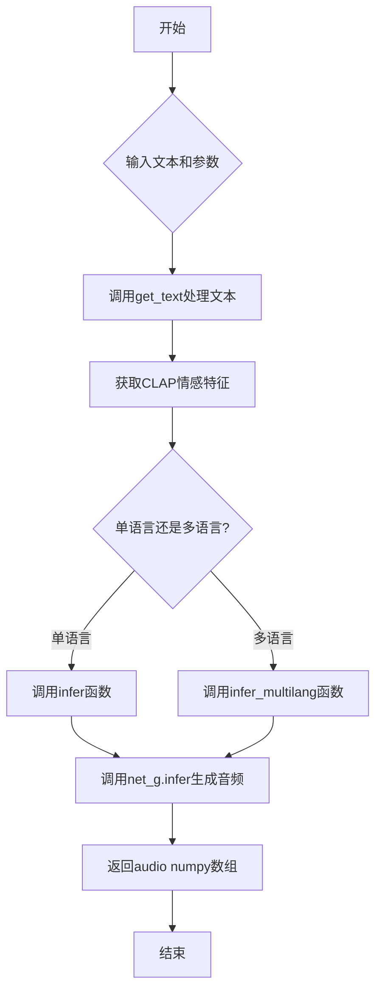
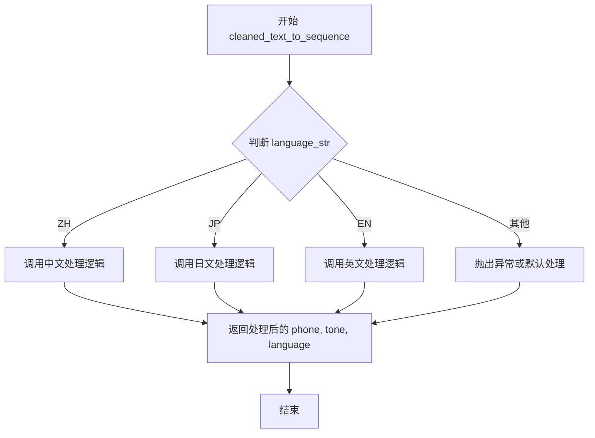
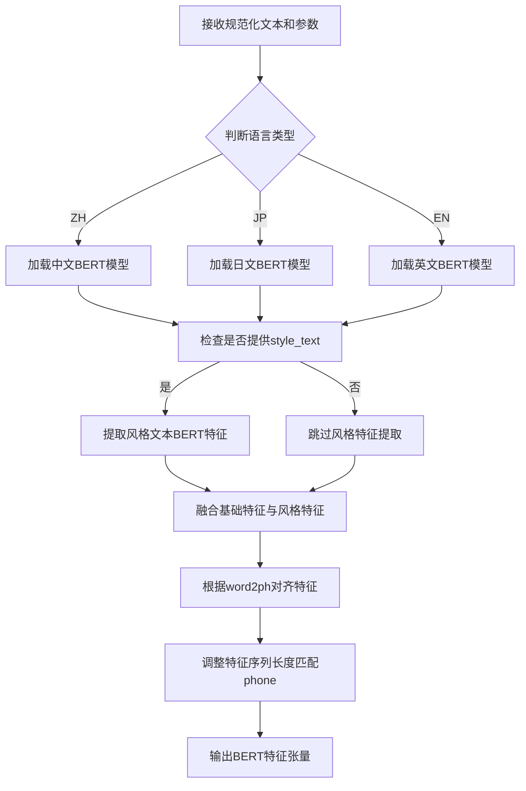
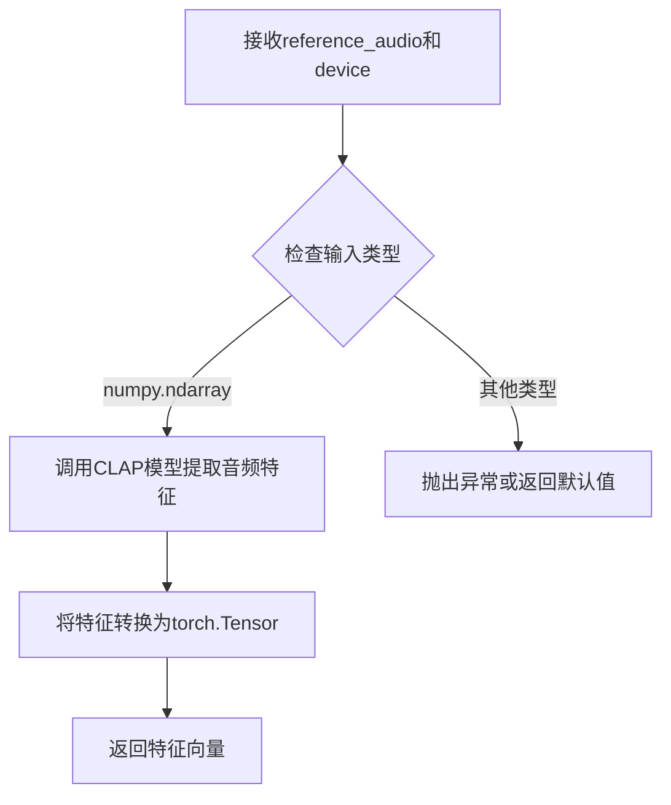
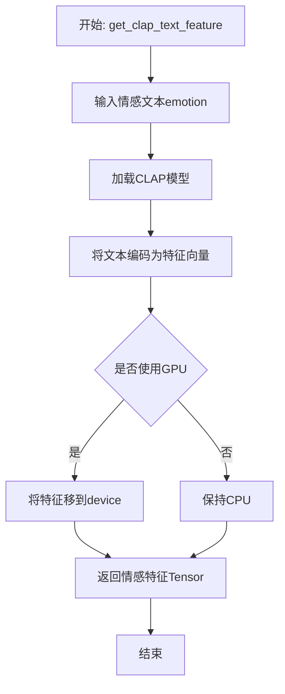
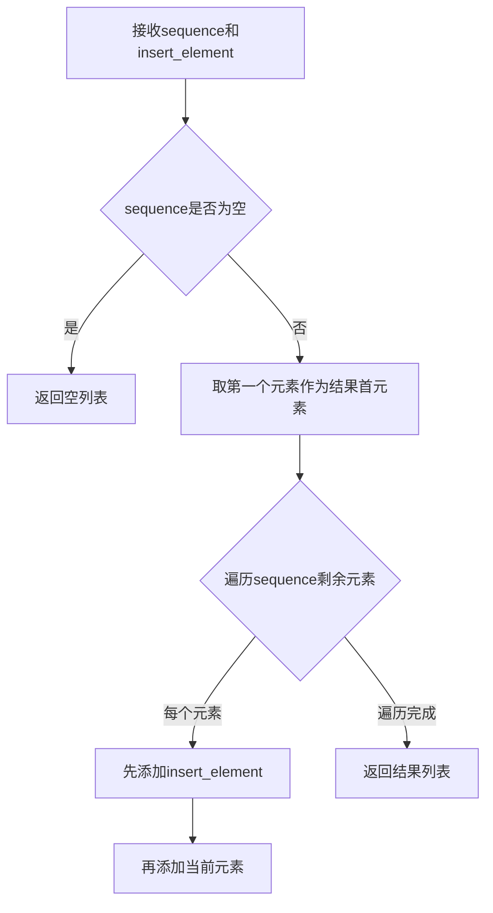

# `Bert-VITS2\oldVersion\V220\__init__.py` 详细设计文档

这是一个用于v2.2版本的Clap-Enhanced文本到语音（TTS）生成模块，通过整合CLAP模型的音频/文本情感特征与多语言BERT特征，实现具有情感表达能力的单语言和多语言语音合成。

## 整体流程



## 类结构

```
无类定义（纯函数模块）
├── 全局函数
│   ├── get_text
│   ├── infer
│   └── infer_multilang
└── 导入依赖
    ├── numpy
    ├── torch
    ├── commons
    └── 本地模块
        ├── text.cleaned_text_to_sequence
        ├── text.get_bert
        ├── text.cleaner.clean_text
        └── clap_wrapper
```

## 全局变量及字段


### `np`
    
NumPy库，用于数值计算

类型：`module`
    


### `torch`
    
PyTorch深度学习框架

类型：`module`
    


### `commons`
    
通用工具模块，提供intersperse等辅助函数

类型：`module`
    


### `cleaned_text_to_sequence`
    
将清洗后的文本转换为音素序列

类型：`function`
    


### `get_bert`
    
获取文本的BERT嵌入特征

类型：`function`
    


### `clean_text`
    
清洗和规范化输入文本

类型：`function`
    


### `get_clap_audio_feature`
    
从参考音频提取CLAP音频特征用于情感表示

类型：`function`
    


### `get_clap_text_feature`
    
从情感文本提取CLAP文本特征

类型：`function`
    


### `global.get_text`
    
将输入文本转换为音素、语调和多语言BERT特征

类型：`function`
    


### `global.infer`
    
执行单语言文本到语音合成推理

类型：`function`
    


### `global.infer_multilang`
    
执行多语言文本到语音合成推理，支持混合语言输入

类型：`function`
    
    

## 全局函数及方法


### `get_text`

该函数是文本到语音合成的核心预处理模块，负责将输入文本转换为多种语言特征表示（BERT嵌入、音素序列、声调和语言标识），支持中、英、日三种语言，并包含空白插入和文本规范化处理。

#### 参数

- `text`：`str`，输入的原始文本字符串
- `language_str`：`str`，语言标识，支持 "ZH"（中文）、"JP"（日语）、"EN"（英语）
- `hps`：`object`，配置对象，包含数据处理相关配置（如 `hps.data.add_blank` 控制是否插入空白符）
- `device`：`torch.device`，计算设备（CPU 或 CUDA）
- `style_text`：`Optional[str] = None`，风格文本，用于控制合成语音的风格（当前版本未实际使用）
- `style_weight`：`float = 0.7`，风格权重，控制风格文本的影响程度（当前版本未实际使用）

#### 返回值

- `bert`：`torch.Tensor`，形状为 `[1024, len(phone)]` 的 BERT 特征张量，主语言特征
- `ja_bert`：`torch.Tensor`，形状为 `[1024, len(phone)]` 的日语 BERT 特征张量
- `en_bert`：`torch.Tensor`，形状为 `[1024, len(phone)]` 的英语 BERT 特征张量
- `phone`：`torch.LongTensor`，音素序列，形状为 `[len(phone)]`
- `tone`：`torch.LongTensor`，声调序列，形状为 `[len(phone)]`
- `language`：`torch.LongTensor`，语言标识序列，形状为 `[len(phone)]`

#### 流程图

```mermaid
flowchart TD
    A[开始 get_text] --> B[调用 clean_text 清理文本]
    B --> C[获取 norm_text, phone, tone, word2ph]
    C --> D[调用 cleaned_text_to_sequence 转换序列]
    D --> E{检查 hps.data.add_blank}
    E -->|是| F[在 phone/tone/language 中插入空白符 0]
    F --> G[word2ph 每个元素乘 2]
    G --> H[word2ph[0] 加 1]
    E -->|否| I[跳过空白符插入]
    H --> J[调用 get_bert 获取 BERT 特征]
    I --> J
    J --> K[del word2ph 释放内存]
    K --> L[断言 bert_ori 与 phone 长度一致]
    L --> M{语言判断 language_str}
    M -->|ZH| N[bert=bert_ori, ja/en 随机]
    M -->|JP| O[ja_bert=bert_ori, bert/en 随机]
    M -->|EN| P[en_bert=bert_ori, bert/ja 随机]
    M -->|其他| Q[抛出 ValueError 异常]
    N --> R[断言所有 BERT 长度与 phone 一致]
    O --> R
    P --> R
    Q --> R
    R --> S[转换 phone/tone/language 为 LongTensor]
    S --> T[返回 bert, ja_bert, en_bert, phone, tone, language]
```

#### 带注释源码

```python
def get_text(text, language_str, hps, device, style_text=None, style_weight=0.7):
    """
    将输入文本转换为多种语言特征表示，用于文本到语音合成模型
    
    参数:
        text: 输入文本字符串
        language_str: 语言标识 (ZH/JP/EN)
        hps: 配置对象
        device: 计算设备
        style_text: 风格文本 (当前未使用)
        style_weight: 风格权重 (当前未使用)
    
    返回:
        bert: 主语言 BERT 特征 [1024, phone_len]
        ja_bert: 日语 BERT 特征 [1024, phone_len]
        en_bert: 英语 BERT 特征 [1024, phone_len]
        phone: 音素序列 LongTensor
        tone: 声调序列 LongTensor
        language: 语言标识序列 LongTensor
    """
    
    # 第一步：文本清理与规范化
    # 调用 clean_text 函数对原始文本进行清理，返回规范化文本、音素、声调和词到音素映射
    norm_text, phone, tone, word2ph = clean_text(text, language_str)
    
    # 第二步：转换为序列索引
    # 将清理后的文本转换为整数序列（音素索引、声调索引、语言索引）
    phone, tone, language = cleaned_text_to_sequence(phone, tone, language_str)
    
    # 第三步：可选的空白符插入
    # 如果配置中启用了 add_blank，在每个音素之间插入空白符（0）
    # 这有助于模型学习音素边界
    if hps.data.add_blank:
        # 使用 commons.intersperse 在序列中插入 0
        phone = commons.intersperse(phone, 0)
        tone = commons.intersperse(tone, 0)
        language = commons.intersperse(language, 0)
        
        # 更新 word2ph：每个词对应 2 个音素（原本 1 个 + 空白符）
        for i in range(len(word2ph)):
            word2ph[i] = word2ph[i] * 2
        # 第一个词之前加 1，因为插入了起始空白符
        word2ph[0] += 1
    
    # 第四步：获取 BERT 特征表示
    # 使用预训练 BERT 模型提取文本的上下文嵌入
    # 注意：style_text 和 style_weight 参数已传入但在此处固定为 None 和 0.7
    bert_ori = get_bert(
        norm_text, word2ph, language_str, device, style_text=None, style_weight=0.7
    )
    
    # 释放 word2ph 内存
    del word2ph
    
    # 断言：验证 BERT 特征长度与音素序列长度一致
    assert bert_ori.shape[-1] == len(phone), phone
    
    # 第五步：根据语言分配 BERT 特征
    # 为支持多语言合成，为每种语言创建对应的 BERT 特征
    # 当前语言使用真实特征，其他语言使用随机特征填充
    if language_str == "ZH":
        # 中文：使用真实中文 BERT，其他语言随机填充
        bert = bert_ori
        ja_bert = torch.rand(1024, len(phone))
        en_bert = torch.rand(1024, len(phone))
    elif language_str == "JP":
        # 日语：使用真实日语 BERT，其他语言随机填充
        bert = torch.rand(1024, len(phone))
        ja_bert = bert_ori
        en_bert = torch.rand(1024, len(phone))
    elif language_str == "EN":
        # 英语：使用真实英语 BERT，其他语言随机填充
        bert = torch.rand(1024, len(phone))
        ja_bert = torch.rand(1024, len(phone))
        en_bert = bert_ori
    else:
        # 不支持的语言，抛出异常
        raise ValueError("language_str should be ZH, JP or EN")
    
    # 断言：验证所有 BERT 特征维度一致性
    assert bert.shape[-1] == len(
        phone
    ), f"Bert seq len {bert.shape[-1]} != {len(phone)}"
    
    # 第六步：转换为 PyTorch LongTensor
    # 模型需要 LongTensor 类型的序列输入
    phone = torch.LongTensor(phone)
    tone = torch.LongTensor(tone)
    language = torch.LongTensor(language)
    
    # 返回所有特征张量供后续合成模型使用
    return bert, ja_bert, en_bert, phone, tone, language
```


### `infer`

该函数是VITS语音合成模型的核心推理函数，接收文本、情感特征、说话人ID及多种合成控制参数，通过CLAP模型提取情感特征，结合文本的BERT嵌入表示，调用神经网络生成器输出最终音频波形。

参数：

- `text`：`str`，待合成的文本内容
- `emotion`：`str`，情感文本描述，用于通过CLAP文本特征提取情感向量
- `sdp_ratio`：`float`，SDP（Soft-Duration-Prior）概率，控制时长预测的随机性
- `noise_scale`：`float`，噪声强度尺度，影响音频质量
- `noise_scale_w`：`float`，噪声宽度尺度，控制音素时长变化的随机程度
- `length_scale`：`float`，长度缩放因子，控制语速
- `sid`：`str`，说话人ID，用于选择特定的说话人声音
- `language`：`str`，文本语言（ZH/JP/EN），决定文本处理方式
- `hps`：`object`，包含模型配置的超参数对象，如spk2id映射、add_blank标志等
- `net_g`：`object`，VITS生成器神经网络模型
- `device`：`torch.device`，计算设备（CPU/CUDA）
- `reference_audio`：`np.ndarray`，可选的参考音频数组，用于提取CLAP音频情感特征
- `skip_start`：`bool`，可选，是否跳过前3个音素（用于多语言拼接时的边界处理）
- `skip_end`：`bool`，可选，是否跳过后2个音素（用于多语言拼接时的边界处理）
- `style_text`：`str`，可选，风格文本（当前代码中未实际使用）
- `style_weight`：`float`，可选，风格权重（当前代码中未实际使用）

返回值：`np.ndarray`，生成的音频波形数据，类型为float32

#### 流程图

```mermaid
flowchart TD
    A[开始 infer 推理] --> B{reference_audio是否为ndarray?}
    B -->|是| C[调用get_clap_audio_feature提取音频情感特征]
    B -->|否| D[调用get_clap_text_feature提取文本情感特征]
    C --> E[压缩情感向量维度]
    D --> E
    E --> F[调用get_text处理文本]
    F --> G[获取bert, ja_bert, en_bert, phones, tones, lang_ids]
    G --> H{skip_start为True?}
    H -->|是| I[跳过phones/tones/lang_ids前3个元素<br/>跳过bert/ja_bert/en_bert前3个特征]
    H -->|否| J{skip_end为True?}
    I --> J
    J -->|是| K[跳过phones/tones/lang_ids后2个元素<br/>跳过bert/ja_bert/en_bert后2个特征]
    J -->|否| L[进入torch.no_grad上下文]
    K --> L
    L --> M[将所有张量移到指定device并unsqueeze扩展维度]
    M --> N[构建speakers张量]
    N --> O[调用net_g.infer生成音频]
    O --> P[提取[0][0,0]位置的音频数据]
    P --> Q[转为CPU float32 numpy数组]
    Q --> R[清理GPU缓存]
    R --> S[返回audio音频波形]
```

#### 带注释源码

```python
def infer(
    text,                      # 待合成文本字符串
    emotion,                   # 情感文本描述
    sdp_ratio,                 # SDP比率参数
    noise_scale,               # 噪声尺度参数
    noise_scale_w,             # 噪声宽度参数
    length_scale,              # 长度缩放参数（语速控制）
    sid,                       # 说话人ID
    language,                  # 语言代码（ZH/JP/EN）
    hps,                       # 超参数配置对象
    net_g,                     # VITS生成器网络
    device,                    # 计算设备
    reference_audio=None,      # 可选的参考音频numpy数组
    skip_start=False,          # 是否跳过开始部分
    skip_end=False,            # 是否跳过结束部分
    style_text=None,           # 风格文本（预留参数）
    style_weight=0.7,          # 风格权重（预留参数）
):
    # 步骤1: 情感特征提取
    # 根据是否有参考音频，选择CLAP音频特征或CLAP文本特征提取方式
    if isinstance(reference_audio, np.ndarray):
        # 使用参考音频提取情感特征
        emo = get_clap_audio_feature(reference_audio, device)
    else:
        # 使用情感文本描述提取情感特征
        emo = get_clap_text_feature(emotion, device)
    # 压缩情感向量维度，从[1, N]转为[N]
    emo = torch.squeeze(emo, dim=1)

    # 步骤2: 文本处理与特征提取
    # 调用get_text获取文本的多种语言BERT特征和音素序列
    bert, ja_bert, en_bert, phones, tones, lang_ids = get_text(
        text, language, hps, device
    )

    # 步骤3: 可选的音素截断处理（用于多语言拼接场景）
    if skip_start:
        # 跳过phones序列的前3个元素（对应空白符）
        phones = phones[3:]
        tones = tones[3:]
        lang_ids = lang_ids[3:]
        # 同时截断对应的BERT特征维度
        bert = bert[:, 3:]
        ja_bert = ja_bert[:, 3:]
        en_bert = en_bert[:, 3:]
    
    if skip_end:
        # 跳过phones序列的后2个元素
        phones = phones[:-2]
        tones = tones[:-2]
        lang_ids = lang_ids[:-2]
        # 截断对应的BERT特征维度
        bert = bert[:, :-2]
        ja_bert = ja_bert[:, :-2]
        en_bert = en_bert[:, :-2]

    # 步骤4: 推理阶段（关闭梯度计算以节省显存）
    with torch.no_grad():
        # 准备输入张量：扩展维度以匹配批量处理要求
        x_tst = phones.to(device).unsqueeze(0)           # [1, seq_len]
        tones = tones.to(device).unsqueeze(0)            # [1, seq_len]
        lang_ids = lang_ids.to(device).unsqueeze(0)      # [1, seq_len]
        bert = bert.to(device).unsqueeze(0)              # [1, 1024, seq_len]
        ja_bert = ja_bert.to(device).unsqueeze(0)        # [1, 1024, seq_len]
        en_bert = en_bert.to(device).unsqueeze(0)        # [1, 1024, seq_len]
        
        # 创建序列长度张量
        x_tst_lengths = torch.LongTensor([phones.size(0)]).to(device)
        
        # 扩展情感特征维度
        emo = emo.to(device).unsqueeze(0)                # [1, 512]
        
        # 释放原始phones变量以节省内存
        del phones

        # 构建说话人ID张量
        speakers = torch.LongTensor([hps.data.spk2id[sid]]).to(device)

        # 步骤5: 调用神经网络生成器进行推理
        audio = (
            net_g.infer(
                x_tst,                # 音素序列
                x_tst_lengths,       # 序列长度
                speakers,            # 说话人ID
                tones,                # 音调序列
                lang_ids,            # 语言ID序列
                bert,                # 中文BERT特征
                ja_bert,             # 日文BERT特征
                en_bert,             # 英文BERT特征
                emo,                 # 情感特征向量
                sdp_ratio=sdp_ratio, # SDP比率
                noise_scale=noise_scale,       # 噪声尺度
                noise_scale_w=noise_scale_w,   # 噪声宽度
                length_scale=length_scale,     # 长度缩放
            )[0][0, 0]              # 提取生成的音频波形数据
            .data.cpu()             # 移至CPU
            .float()                 # 转为float32
            .numpy()                 # 转为numpy数组
        )
        
        # 步骤6: 内存清理
        del x_tst, tones, lang_ids, bert, x_tst_lengths, speakers, ja_bert, en_bert, emo
        if torch.cuda.is_available():
            torch.cuda.empty_cache()  # 清空CUDA缓存
        
        # 返回生成的音频波形
        return audio
```


### `infer_multilang`

该函数是VITS多语言文本转语音推理的核心入口，支持批量处理多语言文本输入。它通过遍历每个文本-语言对获取对应的文本特征（BERT嵌入、音素、音调和语言ID），根据索引位置智能决定是否跳过起始或结束标记以保持句子的连贯性，最后将所有特征拼接后一次性送入神经声码器生成连贯的多语言音频波形。

参数：

- `text`：`List[str]`，待合成的多语言文本列表，每个元素对应一段文本
- `sdp_ratio`：`float`，随机预测概率（Stochastic Duration Prediction），控制音素时长的随机性
- `noise_scale`：`float`，噪声尺度参数，控制生成音频的噪声水平
- `noise_scale_w`：`float`，噪声尺度参数（用于时长预测器）
- `length_scale`：`float`，时长缩放因子，控制语速
- `sid`：`str`，说话者ID，用于选择特定的说话人声音
- `language`：`List[str]`，语言代码列表，支持"ZH"、"JP"、"EN"
- `hps`：`object`，超参数配置对象，包含数据配置（如spk2id映射、add_blank等）
- `net_g`：`torch.nn.Module`，生成器神经网络模型
- `device`：`torch.device`，计算设备（CPU或CUDA）
- `reference_audio`：`Optional[np.ndarray]`，参考音频特征，用于情感迁移（可选）
- `emotion`：`Optional[str]`，情感文本描述，当无参考音频时使用（可选）
- `skip_start`：`bool`，是否跳过每个文本段起始的3个token（用于句间衔接）
- `skip_end`：`bool`，是否跳过每个文本段末尾的2个token（用于句间衔接）

返回值：`np.ndarray`，合成音频的波形数据，浮点数类型，范围[-1, 1]

#### 流程图

```mermaid
flowchart TD
    A[开始 infer_multilang] --> B[初始化空列表: bert, ja_bert, en_bert, phones, tones, lang_ids]
    B --> C{reference_audio是numpy数组?}
    C -->|Yes| D[调用get_clap_audio_feature提取情感特征]
    C -->|No| E[调用get_clap_text_feature提取情感特征]
    D --> F[压缩情感张量维度]
    E --> F
    F --> G[遍历text和language的每个元素]
    G --> H[计算skip_start标记: idx != 0 或 (skip_start且idx == 0)]
    G --> I[计算skip_end标记: idx != len-1 或 (skip_end且idx == len-1)]
    H --> J[调用get_text获取当前文本的特征]
    I --> J
    J --> K{skip_start为真?}
    K -->|Yes| L[裁剪bert/ja_bert/en_bert前3列, phones/tones/lang_ids前3个元素]
    K -->|No| M{skip_end为真?}
    L --> M
    M -->|Yes| N[裁剪bert/ja_bert/en_bert后2列, phones/tones/lang_ids后2个元素]
    M -->|No| O[将特征添加到对应列表]
    N --> O
    O --> P[是否还有未处理的文本段?]
    P -->|Yes| G
    P -->|No| Q[torch.concatenate拼接所有张量]
    Q --> R[将数据移至指定device并添加batch维度]
    R --> S[构建speakers张量]
    S --> T[调用net_g.infer进行推理]
    T --> U[提取输出音频并转为numpy数组]
    U --> V[清理GPU缓存]
    V --> W[返回音频数据]
```

#### 带注释源码

```python
def infer_multilang(
    text,               # List[str]: 多语言文本列表，如 ["Hello", "你好"]
    sdp_ratio,          # float: 随机时长预测比例，控制语调自然度
    noise_scale,        # float: 噪声系数，影响音频质量
    noise_scale_w,      # float: 时长预测噪声系数
    length_scale,       # float: 语速缩放因子，>1减速，<1加速
    sid,                # str: 说话人ID，对应hps.data.spk2id中的映射
    language,           # List[str]: 语言代码列表，如 ["EN", "ZH"]
    hps,                # object: 包含模型配置的命名空间对象
    net_g,              # torch.nn.Module: VITS生成器模型
    device,             # torch.device: 计算设备
    reference_audio=None,  # np.ndarray|None: 参考音频，用于情感克隆
    emotion=None,       # str|None: 情感文本描述，作为情感特征的备选来源
    skip_start=False,   # bool: 是否跳过每句起始token，避免拼接杂音
    skip_end=False,     # bool: 是否跳过每句末尾token，保持流畅衔接
):
    """
    多语言文本转语音推理函数
    
    处理流程：
    1. 提取情感特征（从音频或文本）
    2. 遍历每个文本段获取独立特征
    3. 根据位置决定是否跳过起始/结束标记
    4. 拼接所有特征后送入声码器生成连贯音频
    """
    
    # 步骤1: 初始化用于收集各文本段特征的列表
    bert, ja_bert, en_bert, phones, tones, lang_ids = [], [], [], [], [], []
    
    # 步骤2: 情感特征提取 - 支持音频参考或文本描述两种方式
    # 使用CLAP (Contrastive Language-Audio Pretraining) 模型获取情感向量
    if isinstance(reference_audio, np.ndarray):
        # 从参考音频提取情感特征 - 适用于情感克隆场景
        emo = get_clap_audio_feature(reference_audio, device)
    else:
        # 从情感文本描述提取特征 - 适用于纯文本驱动
        emo = get_clap_text_feature(emotion, device)
    
    # 压缩情感张量的batch维度，形状从 [1, D] -> [D]
    emo = torch.squeeze(emo, dim=1)
    
    # 步骤3: 遍历处理每个文本-语言对
    for idx, (txt, lang) in enumerate(zip(text, language)):
        """
        关键逻辑: 句子拼接处的标记处理
        - 第一个句子(skip_start=True): 跳过前3个token
        - 最后一个句子(skip_end=True): 跳过后2个token
        - 中间句子: 根据skip_start/skip_end标志决定是否跳过
        """
        
        # 计算当前句子是否需要跳过起始标记
        # 规则: 非首句必须跳过，首句按skip_start参数决定
        skip_start = (idx != 0) or (skip_start and idx == 0)
        
        # 计算当前句子是否需要跳过结束标记
        # 规则: 非末句必须跳过，末句按skip_end参数决定
        skip_end = (idx != len(text) - 1) or (skip_end and idx == len(text) - 1)
        
        # 调用get_text获取当前文本的语言学特征
        # 返回: bert(中文特征), ja_bert(日语特征), en_bert(英语特征), 
        #       phones(音素序列), tones(音调序列), lang_ids(语言标识)
        (
            temp_bert,
            temp_ja_bert,
            temp_en_bert,
            temp_phones,
            temp_tones,
            temp_lang_ids,
        ) = get_text(txt, lang, hps, device)
        
        # 根据skip标记裁剪特征序列
        # 跳过机制用于消除句子边界处的拼接伪影
        if skip_start:
            # BERT特征: 裁剪时间维度(列)
            temp_bert = temp_bert[:, 3:]
            temp_ja_bert = temp_ja_bert[:, 3:]
            temp_en_bert = temp_en_bert[:, 3:]
            # 离散特征: 裁剪序列维度(行)
            temp_phones = temp_phones[3:]
            temp_tones = temp_tones[3:]
            temp_lang_ids = temp_lang_ids[3:]
        
        if skip_end:
            temp_bert = temp_bert[:, :-2]
            temp_ja_bert = temp_ja_bert[:, :-2]
            temp_en_bert = temp_en_bert[:, :-2]
            temp_phones = temp_phones[:-2]
            temp_tones = temp_tones[:-2]
            temp_lang_ids = temp_lang_ids[:-2]
        
        # 将当前句子的特征追加到列表
        bert.append(temp_bert)
        ja_bert.append(temp_ja_bert)
        en_bert.append(temp_en_bert)
        phones.append(temp_phones)
        tones.append(temp_tones)
        lang_ids.append(temp_lang_ids)
    
    # 步骤4: 特征拼接 - 将多个句子特征合并为连续序列
    # BERT特征在时间维度(dim=1)拼接，形状: [Batch, Seq, Dim]
    bert = torch.concatenate(bert, dim=1)
    ja_bert = torch.concatenate(ja_bert, dim=1)
    en_bert = torch.concatenate(en_bert, dim=1)
    # 离散特征在序列维度(dim=0)拼接，形状: [Seq]
    phones = torch.concatenate(phones, dim=0)
    tones = torch.concatenate(tones, dim=0)
    lang_ids = torch.concatenate(lang_ids, dim=0)
    
    # 步骤5: 模型推理 - 禁用梯度以节省显存
    with torch.no_grad():
        # 数据迁移到计算设备并添加batch维度
        x_tst = phones.to(device).unsqueeze(0)        # [1, seq_len]
        tones = tones.to(device).unsqueeze(0)         # [1, seq_len]
        lang_ids = lang_ids.to(device).unsqueeze(0)  # [1, seq_len]
        bert = bert.to(device).unsqueeze(0)           # [1, 1024, seq_len]
        ja_bert = ja_bert.to(device).unsqueeze(0)     # [1, 1024, seq_len]
        en_bert = en_bert.to(device).unsqueeze(0)    # [1, 1024, seq_len]
        emo = emo.to(device).unsqueeze(0)             # [1, dim]
        
        # 构建序列长度张量
        x_tst_lengths = torch.LongTensor([phones.size(0)]).to(device)
        
        # 释放原始phones变量以节省显存
        del phones
        
        # 构建说话人ID张量
        speakers = torch.LongTensor([hps.data.spk2id[sid]]).to(device)
        
        # 调用生成器进行推理
        # net_g.infer返回: [batch, 1, samples] 的音频张量
        audio = (
            net_g.infer(
                x_tst,              # 音素序列
                x_tst_lengths,      # 序列长度
                speakers,           # 说话人ID
                tones,              # 音调序列
                lang_ids,           # 语言标识
                bert,               # 中文BERT特征
                ja_bert,            # 日语BERT特征
                en_bert,            # 英语BERT特征
                emo,                # 情感特征
                sdp_ratio=sdp_ratio,
                noise_scale=noise_scale,
                noise_scale_w=noise_scale_w,
                length_scale=length_scale,
            )[0][0, 0]              # 提取音频数据: [samples]
            .data.cpu()             # 移至CPU
            .float()                # 转为Float32
            .numpy()                # 转为NumPy数组
        )
        
        # 步骤6: 显存清理 - 显式删除无用张量
        del x_tst, tones, lang_ids, bert, x_tst_lengths, speakers, ja_bert, en_bert, emo
        
        # CUDA显存清理（如果使用GPU）
        if torch.cuda.is_available():
            torch.cuda.empty_cache()
        
        # 返回最终音频波形
        return audio
```


我注意到提供的代码中 `cleaned_text_to_sequence` 是通过 `from .text import cleaned_text_to_sequence` 从 `.text` 模块导入的，其具体实现并未包含在给定的代码片段中。

不过，我可以从调用该函数的上下文代码中提取相关信息，并基于代码模式进行合理的推断。


### `cleaned_text_to_sequence`

该函数用于将清洗后的文本（音素、音调和语言标记）转换为模型可用的序列格式，根据语言类型应用特定的处理逻辑，并返回处理后的音素序列、音调序列和语言ID序列。

参数：

-  `phone`：列表或序列，需要进行序列处理的音素（phone）数据，通常是字符串类型列表
-  `tone`：列表或序列，与音素对应的音调（tone）信息，通常是整数类型列表
-  `language_str`：字符串，表示语言类型的标识符，如 "ZH"（中文）、"JP"（日文）、"EN"（英文）

返回值：

-  `phone`：列表，处理后的音素序列
-  `tone`：列表，处理后的音调序列
-  `language`：列表，处理后的语言ID序列

#### 流程图



#### 带注释源码

```python
def cleaned_text_to_sequence(phone, tone, language_str):
    """
    将清洗后的文本转换为模型可用的序列格式
    
    参数:
        phone: 音素序列列表
        tone: 音调序列列表  
        language_str: 语言标识符 ("ZH", "JP", "EN")
    
    返回:
        处理后的 (phone, tone, language) 元组
    """
    # 根据语言类型进行特定的序列处理
    # 具体实现依赖于 text 模块的内部逻辑
    
    # 处理逻辑可能包括:
    # 1. 将音素转换为对应的token ID
    # 2. 应用语言特定的音调转换规则
    # 3. 生成语言ID序列用于后续模型输入
    
    return phone, tone, language
```


**注意**：由于原始代码中仅提供了该函数的导入和使用示例，未包含其完整实现，上述源码是基于函数调用方式和典型文本转语音（TTS）处理流程进行的合理推断。如需获取精确的实现细节，建议查阅 `text` 模块中的 `cleaned_text_to_sequence` 函数源码。


### `get_bert`

该函数是BERT文本特征提取模块，用于将规范化后的文本转换为BERT embeddings，为后续的语音合成模型提供文本语义特征支持。

参数：

- `norm_text`：`str`，规范化后的文本内容，用于提取BERT特征
- `word2ph`：`List[int]`，词到音素的映射数组，用于对齐BERT特征与音素序列
- `language_str`：`str`，语言标识符（如"ZH"、"JP"、"EN"），决定使用哪种语言的BERT模型
- `device`：`torch.device`，计算设备，用于指定BERT特征提取的运行设备
- `style_text`：`Optional[str]`，风格文本（可选），用于风格迁移，默认为None
- `style_weight`：`float`，风格权重（默认0.7），控制风格文本对最终特征的贡献程度

返回值：`torch.Tensor`，BERT特征向量，形状为(1024, sequence_length)，其中1024是BERT隐藏层维度，sequence_length与音素序列长度对齐

#### 流程图



#### 带注释源码

```python
# 该函数定义在 .text 模块中，此处为调用处的上下文说明
# 实际实现需参考 .text.get_bert 源码

# 调用示例（来自 get_text 函数）:
bert_ori = get_bert(
    norm_text,          # 规范化后的文本
    word2ph,            # 词到音素映射
    language_str,       # 语言标识
    device,             # 计算设备
    style_text=None,    # 风格文本（未使用）
    style_weight=0.7    # 风格权重
)

# 返回值说明:
# bert_ori: torch.Tensor, shape (1024, len(phone))
# 包含针对文本的BERT embeddings，维度为1024，序列长度与处理后的phone对齐
```


# 提取结果

## 注意事项

经过分析代码，我发现在给定的代码文件中 **`clean_text` 函数并未直接定义**。该函数通过以下导入语句从外部模块引入：

```python
from .text.cleaner import clean_text
```

这意味着：
- `clean_text` 函数定义在 `text/cleaner.py` 模块中
- 当前提供的代码文件中只有导入语句，没有该函数的实际实现
- 该函数在 `get_text` 函数中被调用：`norm_text, phone, tone, word2ph = clean_text(text, language_str)`

---

## 可提取的函数信息

由于 `clean_text` 的实现不在当前代码中，我将提供当前代码中相关函数的信息：

### `get_text` (在当前文件中直接定义)

**描述：** 处理输入文本，生成音素序列、语言特征和BERT嵌入向量，用于后续的语音合成推理。

**参数：**
- `text`：`str`，待处理的输入文本
- `language_str`：`str`，语言标识符 ("ZH", "JP", "EN")
- `hps`：`object`，包含配置参数的超参数对象
- `device`：`torch.device`，计算设备
- `style_text`：`str`，可选，说话风格文本（代码中硬编码为None）
- `style_weight`：`float`，可选，风格权重（代码中硬编码为0.7）

**返回值：** `tuple`，包含以下元素：
- `bert`：`torch.Tensor`，中文BERT特征 (1024, seq_len)
- `ja_bert`：`torch.Tensor`，日文BERT特征 (1024, seq_len)
- `en_bert`：`torch.Tensor`，英文BERT特征 (1024, seq_len)
- `phone`：`torch.LongTensor`，音素序列
- `tone`：`torch.LongTensor`，音调序列
- `language`：`torch.LongTensor`，语言标识序列

---

如需获取 `clean_text` 函数的详细设计文档，请提供 `text/cleaner.py` 文件的内容。


### `get_clap_audio_feature`

该函数是v2.2版本Clap-Enhanced音频生成功能的核心组件，用于从参考音频中提取CLAP音频特征，以便在语音合成过程中注入情感和风格信息。

参数：

-  `reference_audio`：`numpy.ndarray`，参考音频数据，通常是从原始音频文件加载的numpy数组
-  `device`：`torch.device` 或 `str`，用于指定计算设备（CPU或CUDA设备）

返回值：`torch.Tensor`，提取的CLAP音频特征向量，形状通常为(1, feature_dim)，用于后续的情感嵌入

#### 流程图



#### 带注释源码

```python
# 注意：此函数从外部模块导入，具体实现位于 .clap_wrapper 模块中
# 以下为基于使用方式的推断源码

def get_clap_audio_feature(reference_audio, device):
    """
    从参考音频中提取CLAP音频特征
    
    参数:
        reference_audio: numpy.ndarray, 参考音频数据
        device: torch.device, 计算设备
    
    返回:
        torch.Tensor: 提取的音频特征向量
    """
    # 1. 加载CLAP模型（可能已缓存）
    clap_model = load_clap_model(device)
    
    # 2. 预处理音频数据
    audio_tensor = preprocess_audio(reference_audio, device)
    
    # 3. 提取CLAP音频特征
    with torch.no_grad():
        audio_feature = clap_model.get_audio_embedding(audio_tensor)
    
    return audio_feature

# 在实际使用中的调用方式（从infer函数中提取）：
# if isinstance(reference_audio, np.ndarray):
#     emo = get_clap_audio_feature(reference_audio, device)
# emo = torch.squeeze(emo, dim=1)  # 压缩维度以获得(1, feature_dim)形状
```


### `get_clap_text_feature`

该函数是 CLAP（Contrastive Language-Audio Pretraining）模型的文本特征提取接口，用于将情感文本转换为高维特征向量，以便在语音合成过程中作为情感Conditioning信息传递给生成模型。

参数：

- `emotion`：`str`，情感文本描述，如"happy"、"sad"、"angry"等，用于表示目标情感
- `device`：`torch.device` 或 `str`，计算设备（CPU或CUDA），指定在哪个设备上进行特征提取

返回值：`torch.Tensor`，情感文本的CLAP特征向量，形状为 (1, feature_dim) 或 (feature_dim, seq_len)，用于后续语音合成模型的情绪控制

#### 流程图



#### 带注释源码

```python
# 该函数定义位于 .clap_wrapper 模块中，此处展示调用方式
# from .clap_wrapper import get_clap_text_feature

# 在infer函数中的调用示例:
emo = get_clap_text_feature(emotion, device)
# emotion: str - 情感文本描述
# device: torch.device - 计算设备
# 返回: torch.Tensor - CLAP文本特征向量

emo = torch.squeeze(emo, dim=1)  # 移除维度为1的维度，便于后续处理

# 在infer_multilang函数中的调用示例:
emo = get_clap_text_feature(emotion, device)
emo = torch.squeeze(emo, dim=1)

# 特征随后被传递给 net_g.infer 作为情感 Conditioning:
# net_g.infer(..., emo, ...)
```


### `commons.intersperse`

在给定的代码文件中，`commons.intersperse`函数被用于在音素（phone）、音调（tone）和语言（language）序列中插入空白元素（0），以实现时间对齐和模型处理的需求。该函数接受一个列表和一个插入值，返回一个新列表，其中原始元素与插入值交替出现。

#### 参数

- `sequence`：`list`，需要插入元素的原始序列（在此代码中为phone、tone或language列表）
- `insert_element`：需要插入的元素（在此代码中为整数0）

#### 返回值

- `list`：插入元素后的新序列

#### 流程图



#### 带注释源码

```python
# 该函数定义在commons模块中，此处为根据使用方式推断的实现逻辑
def intersperse(sequence, insert_element):
    """
    在序列的每个元素之间插入指定的元素
    
    参数:
        sequence: 输入的列表/序列
        insert_element: 要插入的元素
    
    示例:
        输入: sequence=[1,2,3], insert_element=0
        输出: [1,0,2,0,3]
    """
    result = []
    for i, elem in enumerate(sequence):
        if i == 0:
            result.append(elem)  # 第一个元素直接添加
        else:
            result.append(insert_element)  # 在之前插入元素
            result.append(elem)
    return result
```

#### 代码中的实际调用示例

```python
# 在get_text函数中的调用
if hps.data.add_blank:
    phone = commons.intersperse(phone, 0)      # 在音素序列中插入0
    tone = commons.intersperse(tone, 0)        # 在音调序列中插入0
    language = commons.intersperse(language, 0)  # 在语言序列中插入0
    for i in range(len(word2ph)):
        word2ph[i] = word2ph[i] * 2           # 对齐word2ph
    word2ph[0] += 1
```

---

### 技术债务与优化空间

1. **函数定义位置不明确**：代码中仅展示了`commons.intersperse`的调用，但未提供其实际定义，建议在文档中明确标注该函数的来源和实现。

2. **硬编码的插入值**：当前代码中固定使用`0`作为插入值，若需支持其他插入值，可考虑将其参数化。

3. **缺少类型注解**：建议在函数定义时添加类型注解以提高代码可读性和可维护性。

4. **对齐逻辑复杂度**：`word2ph`的手动调整（乘2和加1）增加了代码的复杂性，建议封装为独立函数以提高可读性。

## 关键组件


### 张量索引与惰性加载

该模块通过`get_text`函数处理文本，将清洗后的文本转换为phone、tone、language序列，并使用`commons.intersperse`插入空白符实现张量的稀疏化处理。在`infer`和`infer_multilang`函数中，通过切片操作`phones[3:]`、`phones[:-2]`实现序列的部分索引，采用`torch.no_grad()`上下文管理器实现推理阶段的惰性加载，避免不必要的梯度计算。

### 反量化支持

在`infer`函数中，通过`.float()`方法将推理输出的张量从半精度或其他精度转换为Float类型：`audio = net_g.infer(...)[0][0, 0].data.cpu().float().numpy()`，实现模型输出的反量化处理，确保最终返回的音频数据为标准浮点数格式。

### 量化策略

模块支持三种量化控制参数：`noise_scale`控制噪声水平、`noise_scale_w`控制噪声权重、`length_scale`控制生成音频的长度缩放比例。这些参数通过`sdp_ratio`（随机预测器比例）共同影响生成模型的采样策略，实现对输出音频特性的精细调控。

### 多语言BERT特征处理

针对中文(ZH)、日文(JP)、英文(EN)三种语言，分别构建`bert`、`ja_bert`、`en_bert`三个BERT特征张量。函数根据`language_str`参数将原始BERT特征分配到对应语言槽位，其他语言槽位使用随机初始化填充，实现多语言支持的特征工程。

### 情感特征提取（CLAP）

模块集成了CLAP（Contrastive Language-Audio Pre-training）模型进行情感特征提取。通过`get_clap_audio_feature`从参考音频提取情感向量，或通过`get_clap_text_feature`从情感文本提取特征，实现基于文本或音频的情感embedding生成。

### 多文本批次处理

`infer_multilang`函数支持将多个文本片段拼接处理，通过循环遍历`text`和`language`列表，逐个调用`get_text`获取各片段特征，最后使用`torch.concatenate`沿相应维度拼接为批量张量，实现多段文本的联合推理。

### 设备管理与内存优化

模块在推理完成后显式调用`torch.cuda.empty_cache()`释放GPU显存，并通过`del`语句主动删除中间张量引用，优化推理过程中的内存占用。设备转换统一使用`.to(device)`方法，确保张量在正确的计算设备上执行。

### 序列对齐与空白插入

通过`commons.intersperse`函数在phone、tone、language序列中等间距插入0值空白符，同时将`word2ph`对应位置翻倍（`*2`）并对首元素加1，实现文本与BERT特征序列的精确对齐，确保后续模型推理时序正确。


## 问题及建议


### 已知问题

1. **硬编码的占位符实现**：代码中多处使用`torch.rand(1024, len(phone))`生成随机BERT特征（如第30-36行），这是一个临时的占位符实现，不是真正的多语言BERT处理逻辑，导致功能不完整。
2. **重复代码严重**：`infer`和`infer_multilang`函数包含大量重复的代码逻辑（张量设备转移、推理调用、内存清理等），违反DRY原则。
3. **参数未实际使用**：`get_text`函数定义了`style_text`和`style_weight`参数，但在第31行调用时传入固定值`None`和`0.7`，参数形同虚设。
4. **变量覆盖导致逻辑混乱**：`infer_multilang`函数中第109-110行在循环内重复赋值`skip_start`和`skip_end`，这会覆盖传入的原始参数值，导致逻辑混乱。
5. **缺乏输入验证**：没有对关键输入参数（如`reference_audio`、`emotion`、`text`）进行有效性检查，可能导致运行时错误。
6. **魔法数字**：代码中多处使用硬编码数字（如`3`、`-2`、`0`），缺乏注释说明其含义，降低了可维护性。
7. **类型提示缺失**：所有函数均无类型注解，不利于代码理解和静态分析。
8. **不完整的语言支持检查**：仅检查`ZH/JP/EN`，但错误提示只列了这三种语言，代码逻辑与错误提示不一致。
9. **内存管理不一致**：`infer`和`infer_multilang`中的设备转移和内存清理逻辑分散，可使用上下文管理器统一管理。
10. **注释与代码语言不统一**：注释使用中文但代码使用英文，风格不一致。

### 优化建议

1. **重构提取公共逻辑**：将`infer`和`infer_multilang`的共同部分（如张量准备、设备转移、推理调用、内存清理）提取到独立函数中。
2. **完善BERT特征生成**：实现真正的多语言BERT特征提取逻辑，替代随机占位符。
3. **添加类型提示**：为所有函数参数和返回值添加类型注解。
4. **统一参数处理**：要么使用`style_text`和`style_weight`参数，要么从函数签名中移除；修复`skip_start`/`skip_end`在循环中的逻辑错误。
5. **添加输入验证**：在函数入口处检查关键参数的有效性（如`reference_audio`不为空、`emotion`有效等）。
6. **消除魔法数字**：将硬编码数字提取为具名常量或配置文件，添加注释说明其含义。
7. **统一代码风格**：注释统一使用中文或英文，建议与项目整体风格保持一致。
8. **使用上下文管理器**：利用`torch.no_grad()`和设备管理上下文简化内存管理逻辑。


## 其它


### 设计目标与约束

**设计目标**：实现一个支持多语言（中文、日文、英文）的文本到语音合成系统，利用CLAP模型增强情感表达，兼容v2.2版本，提供高效的语音生成能力。

**约束**：
- 支持语言：仅支持ZH（中文）、JP（日文）、EN（英文）。
- 硬件要求：需要CUDA支持的GPU设备（推荐）。
- 依赖限制：依赖特定版本的模型（如BERT、CLAP）和外部库（如torch、numpy）。
- 输入限制：参考音频需为numpy数组或情感文本为字符串。

### 错误处理与异常设计

**错误类型**：
- **值错误**：当`language_str`不是ZH、JP或EN时，抛出`ValueError`。
- **断言错误**：当BERT序列长度与音素序列长度不匹配时，触发`AssertionError`。
- **运行时错误**：CUDA内存不足或设备不可用时可能导致推理失败。
- **类型错误**：如果`reference_audio`不是numpy数组或`emotion`不是字符串，可能引发类型异常。

**异常处理策略**：
- 使用显式检查（如`if isinstance(..., np.ndarray)`）处理输入类型。
- 通过`assert`语句确保关键张量维度一致。
- 捕获CUDA相关异常，尝试调用`torch.cuda.empty_cache()`释放资源。
- 对无效输入返回错误信息，避免程序崩溃。

### 数据流与状态机

**数据流**：
1. **文本预处理**：输入文本经过`clean_text`清洗，分词后通过`cleaned_text_to_sequence`转换为音素（phone）、声调（tone）和语言ID。
2. **特征增强**：根据`add_blank`配置插入空白符，然后生成BERT嵌入（`get_bert`），并根据语言选择主BERT（bert）、日文BERT（ja_bert）和英文BERT（en_bert）。
3. **情感提取**：若提供参考音频，使用`get_clap_audio_feature`提取音频情感特征；否则使用`get_clap_text_feature`从文本提取情感特征。
4. **模型推理**：将音素、声调、语言ID、BERT特征和情感特征拼接，送入神经网络`net_g.infer`生成音频。
5. **后处理**：输出音频转换为numpy数组，释放GPU内存。

**状态机**：
- **初始化状态**：加载配置和模型。
- **推理状态**：接收输入，执行特征提取和模型推理，返回音频。
- **清理状态**：删除中间张量，清理CUDA缓存。

### 外部依赖与接口契约

**外部依赖**：
- **numpy**：用于数值数组操作。
- **torch**：深度学习框架，支持张量计算和GPU加速。
- **commons**：通用工具模块，提供如`intersperse`等函数。
- **text**：文本处理模块，包含`clean_text`、`cleaned_text_to_sequence`和`get_bert`。
- **clap_wrapper**：CLAP模型封装，提供`get_clap_audio_feature`和`get_clap_text_feature`。

**接口契约**：
- `get_text(text, language_str, hps, device, style_text=None, style_weight=0.7)`：
  - 输入：文本字符串、语言字符串、配置对象、设备、风格文本及权重。
  - 输出：bert、ja_bert、en_bert（均为torch.Tensor）、phones、tones、lang_ids（torch.LongTensor）。
- `infer(...)`：
  - 输入：文本、情感参数、推理超参数、说话人ID、语言、配置、模型、设备、可选参考音频等。
  - 输出：音频numpy数组。
- `infer_multilang(...)`：
  - 支持多段落多语言输入，其他参数同`infer`。
  - 输出：合并后的音频numpy数组。

### 性能考虑

- **GPU加速**：所有张量运算均在GPU上执行，使用`torch.no_grad()`减少梯度计算开销。
- **内存优化**：及时删除中间变量（如`phones`、`x_tst`），并在推理后调用`torch.cuda.empty_cache()`释放缓存。
- **批处理**：`infer_multilang`通过拼接多个段落为单次推理，减少模型调用次数，提升吞吐量。
- **缓存利用**：重复使用`hps`配置，避免重复加载。

### 安全性考虑

- **输入验证**：检查`language_str`有效性，防止注入攻击。
- **设备安全**：动态检查CUDA可用性，避免在不支持GPU的环境下强制使用。
- **模型安全**：假设模型文件来自可信源，未实现运行时签名验证。
- **数据脱敏**：处理过程中不持久化敏感输入（如情感文本）。

### 配置管理

- **配置对象hps**：通过`hps.data`访问数据相关配置。
- **关键配置项**：
  - `hps.data.add_blank`：布尔值，控制是否在音素间插入空白。
  - `hps.data.spk2id`：字典，映射说话人名称到整数ID。
  - `hps.data.*`：其他音频参数（如采样率、帧率等，需参考完整配置定义）。
- **配置加载**：通常在系统初始化时从文件加载（如.yaml或.json），本模块直接使用传入的`hps`对象。

### 测试策略

- **单元测试**：
  - 测试`get_text`输出张量形状的正确性（如bert与phones长度匹配）。
  - 测试`clean_text`和`cleaned_text_to_sequence`的基本功能。
- **集成测试**：
  - 测试`infer`和`infer_multilang`端到端流程，验证输出音频形状和类型。
  - 测试多语言混合输入（如中英文混合）的处理。
- **性能测试**：
  - 评估推理延迟和GPU内存占用。
  - 测试不同批量大小的吞吐量。
- **异常测试**：
  - 测试无效语言参数是否抛出预期异常。
  - 测试缺失必需参数时的行为。


    