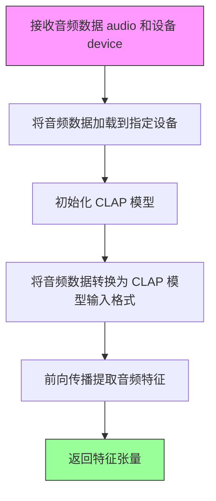
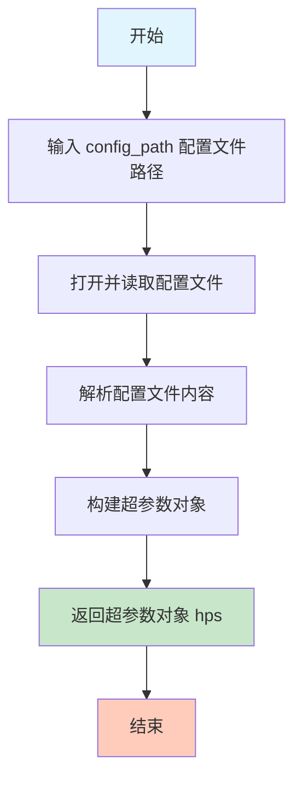
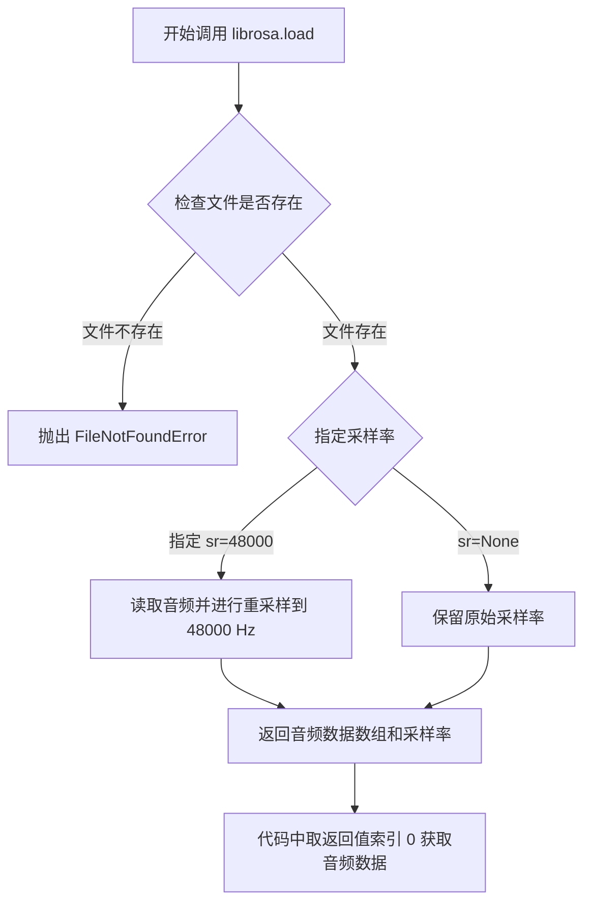

# `Bert-VITS2\oldVersion\V220\clap_gen.py` 详细设计文档

这是一个CLAP音频特征生成脚本，通过多进程方式读取音频文件列表，使用CLAP模型提取音频特征并保存为.npy格式，用于情感生成模型的训练数据准备。

## 整体流程

```mermaid
graph TD
    A[开始] --> B[解析命令行参数]
    B --> C[加载配置文件]
    C --> D[读取训练文件列表]
    D --> E[读取验证文件列表]
    E --> F{文件列表是否为空?}
    F -- 是 --> Z[结束]
    F -- 否 --> G[计算进程数]
    G --> H[创建进程池]
    H --> I[并行处理每个文件]
    I --> J{处理单行数据}
    J --> K[获取设备(CPU/GPU)]
    K --> L[解析音频路径和文本信息]
    L --> M{CLAP特征文件已存在?}
    M -- 是 --> N[跳过]
    M -- 否 --> O[加载音频文件]
    O --> P[提取CLAP特征]
    P --> Q[保存特征到.npy文件]
    N --> R[继续处理下一行]
    Q --> R
    R --> S{所有文件处理完成?}
    S -- 否 --> I
    S -- 是 --> T[打印完成信息]
```

## 类结构

```
模块: __main__ (主模块)
├── 全局函数: process_line
├── 全局函数: main (if __name__ == '__main__')
└── 外部依赖模块
    ├── utils (工具模块)
    ├── config (配置模块)
    ├── clap_wrapper (CLAP封装模块)
    └── librosa (音频处理库)
```

## 全局变量及字段


### `config_path`
    
配置文件路径

类型：`str`
    


### `hps`
    
配置文件内容

类型：`dict`
    


### `lines`
    
训练和验证文件列表

类型：`list`
    


### `num_processes`
    
进程池数量

类型：`int`
    


### `device`
    
计算设备(CPU/GPU)

类型：`str`
    


### `rank`
    
进程排名

类型：`int`
    


### `gpu_id`
    
GPU设备ID

类型：`int`
    


### `wav_path`
    
音频文件路径

类型：`str`
    


### `language_str`
    
语言字符串

类型：`str`
    


### `text`
    
文本内容

类型：`str`
    


### `phones`
    
音素序列

类型：`str`
    


### `tone`
    
声调

类型：`str`
    


### `word2ph`
    
字到音素映射

类型：`str`
    


### `clap_path`
    
CLAP特征保存路径

类型：`str`
    


### `audio`
    
音频数据

类型：`np.array`
    


### `clap`
    
CLAP特征向量

类型：`tensor`
    


    

## 全局函数及方法


### `process_line`

处理单行数据，解析音频路径并提取CLAP音频特征，如果特征文件不存在则保存为.npy文件。

参数：

- `line`：`str`，以"|"分隔的字符串，包含音频路径、语言、文本、音素等信息

返回值：`None`，如果CLAP特征文件已存在则提前返回；否则返回None（通过`torch.save`保存特征到文件）

#### 流程图

```mermaid
flowchart TD
    A[开始] --> B[获取配置中的设备]
    B --> C{config.use_multi_device?}
    C -->|是| D[获取当前进程rank]
    C -->|否| E[直接使用配置设备]
    D --> F{torch.cuda.is_available?}
    E --> H
    F -->|是| G[根据rank % gpu_count确定GPU ID]
    F -->|否| H[使用CPU设备]
    G --> I[设置cuda device]
    H --> J[解析line获取wav_path, language_str, text, phones, tone, word2ph]
    I --> J
    J --> K[构建clap_path: 将.wav替换为.emo.npy]
    K --> L{os.path.isfile(clap_path)?]
    L -->|是| M[直接返回]
    L -->|否| N[librosa.load加载音频 48000Hz]
    N --> O[get_clap_audio_feature提取特征]
    O --> P[torch.save保存特征到clap_path]
    P --> Q[结束]
    M --> Q
```

#### 带注释源码

```python
def process_line(line):
    """处理单行数据，提取CLAP音频特征并保存
    
    Args:
        line: 包含音频信息的字符串，以"|"分隔，格式为:
              wav_path|_|language_str|text|phones|tone|word2ph
    """
    # 获取默认设备（从配置中读取）
    device = config.emo_gen_config.device
    
    # 判断是否使用多设备（多GPU）模式
    if config.emo_gen_config.use_multi_device:
        # 获取当前进程的rank标识
        rank = mp.current_process()._identity
        rank = rank[0] if len(rank) > 0 else 0
        
        # 根据rank分配GPU设备
        if torch.cuda.is_available():
            gpu_id = rank % torch.cuda.device_count()
            device = torch.device(f"cuda:{gpu_id}")
        else:
            device = torch.device("cpu")
    
    # 解析输入行，按"|"分割获取各字段
    # 格式: wav_path|_|language_str|text|phones|tone|word2ph
    wav_path, _, language_str, text, phones, tone, word2ph = line.strip().split("|")

    # 构建CLAP特征文件路径: 将.wav替换为.emo.npy
    clap_path = wav_path.replace(".WAV", ".wav").replace(".wav", ".emo.npy")
    
    # 如果CLAP特征文件已存在，则跳过处理
    if os.path.isfile(clap_path):
        return

    # 使用librosa加载音频文件，采样率48000Hz
    audio = librosa.load(wav_path, 48000)[0]
    # 可选的音频重采样（当前被注释）: audio = librosa.resample(audio, 44100, 48000)

    # 调用CLAP模型提取音频特征
    clap = get_clap_audio_feature(audio, device)
    
    # 将提取的CLAP特征保存为npy文件
    torch.save(clap, clap_path)
```


### `get_clap_audio_feature`

该函数为外部函数，负责调用 CLAP（Contrastive Language-Audio Pretraining）模型从输入的音频数据中提取语义音频特征，并将提取的特征保存为 .npy 格式文件，供情感生成模型使用。

参数：

- `audio`：`numpy.ndarray`，从音频文件加载的原始波形数据，通常是通过 `librosa.load(wav_path, 48000)[0]` 获取的 48kHz 采样率音频数组
- `device`：`torch.device`，用于指定模型运行所在的设备（CPU 或 CUDA GPU）

返回值：`torch.Tensor`，提取的 CLAP 音频特征向量，通常是一个高维张量，用于后续的情感分析或生成任务

#### 流程图



#### 带注释源码

```python
# 此函数定义在 .clap_wrapper 模块中，以下为调用处的上下文说明

def process_line(line):
    """
    处理单行数据，提取音频的 CLAP 特征并保存
    """
    device = config.emo_gen_config.device
    # ...设备分配逻辑...
    
    # 解析数据行获取音频路径
    wav_path, _, language_str, text, phones, tone, word2ph = line.strip().split("|")
    
    # 构建 CLAP 特征保存路径：将 .wav 替换为 .emo.npy
    clap_path = wav_path.replace(".WAV", ".wav").replace(".wav", ".emo.npy")
    
    # 如果特征已存在则跳过
    if os.path.isfile(clap_path):
        return
    
    # 使用 librosa 加载音频，采样率 48kHz
    audio = librosa.load(wav_path, 48000)[0]
    
    # 调用外部 CLAP 特征提取函数
    # 参数：
    #   - audio: numpy.ndarray，48kHz 音频波形
    #   - device: torch.device，计算设备
    # 返回值：
    #   - clap: torch.Tensor，CLAP 音频特征
    clap = get_clap_audio_feature(audio, device)
    
    # 保存特征到 .npy 文件
    torch.save(clap, clap_path)
```


### `utils.get_hparams_from_file`

从配置文件加载超参数对象，用于整个程序的配置管理。

参数：

- `config_path`：`str`，配置文件的路径，指向包含超参数配置的 JSON 或 YAML 文件

返回值：`Any`（通常是命名元组或类似对象），返回包含超参数的对象，通过 `.` 访问器可以获取如 `hps.data.training_files`、`hps.data.validation_files` 等配置项

#### 流程图



#### 带注释源码

```python
# utils.get_hparams_from_file 函数源码（推断实现）

def get_hparams_from_file(config_path):
    """
    从配置文件加载超参数
    
    参数:
        config_path: 配置文件路径，支持 JSON 或 YAML 格式
        
    返回:
        包含所有超参数的配置对象
        
    注意:
        返回对象通常具有嵌套属性结构，例如:
        - hps.data.training_files: 训练文件列表路径
        - hps.data.validation_files: 验证文件列表路径
        - hps.model.*: 模型相关配置
        - hps.train.*: 训练相关配置
    """
    
    # 1. 读取配置文件
    # 根据文件扩展名判断格式（.json 或 .yaml）
    # 2. 解析配置内容
    # 3. 转换为配置对象（可能使用 argparse.Namespace 或自定义类）
    # 4. 返回配置对象
    
    # 在主程序中的使用示例：
    # hps = utils.get_hparams_from_file(config_path)
    # training_files = hps.data.training_files
    # validation_files = hps.data.validation_files
```


### `librosa.load`

`librosa.load` 是 librosa 库提供的音频加载函数，用于从文件系统中读取音频文件并将其转换为数值数组，同时返回采样率。该函数支持多种音频格式（如 WAV、MP3、FLAC 等），并能够自动进行重采样以匹配指定的目标采样率。

参数：

- `path`：字符串，音频文件的路径（这里传入 `wav_path`）
- `sr`：数值（整数），目标采样率，设置为 48000 Hz（若设为 `None` 则保留原始采样率）
- `mono`：布尔值，可选，是否将音频转换为单声道（默认 `True`）
- `offset`：浮点数，可选，开始加载的时间位置（秒）
- `duration`：浮点数，可选，加载的持续时间（秒）

返回值：

- `y`：numpy.ndarray，音频时间序列数据（浮点型）
- `sr`：int，采样率

#### 流程图



#### 带注释源码

```python
# 在 process_line 函数中调用 librosa.load
audio = librosa.load(wav_path, 48000)[0]
# 参数说明：
#   - wav_path: 字符串，从配置文件中读取的 .WAV 音频文件路径
#   - 48000: 整数，目标采样率（48 kHz）
# 返回值说明：
#   - librosa.load 返回一个元组 (y, sr)，其中 y 是音频数据（numpy.ndarray 类型），sr 是采样率
#   - [0] 表示取元组中的第一个元素，即音频数据数组
#   - 音频数据通常是一个一维 numpy 数组，包含浮点型的音频样本值，范围在 [-1.0, 1.0] 之间
```

## 关键组件


### 多进程并行处理

使用multiprocessing.Pool实现音频特征的并行生成，通过cpu_count()控制进程数，支持多设备GPU分配

### 音频加载与采样

使用librosa.load加载WAV音频文件，固定采样率48000Hz，支持音频重采样功能

### CLAP特征提取

调用get_clap_audio_feature函数从音频中提取CLAP音频特征，用于情感识别

### 设备管理与GPU分配

通过mp.current_process()._identity获取进程rank，实现多GPU负载均衡，支持cuda和cpu设备

### 配置与参数解析

使用argparse和config模块管理配置，支持自定义配置文件路径和进程数

### 文件路径处理

将wav文件路径转换为emo.npy保存路径，处理大小写变体(.WAV/.wav)

### 特征缓存机制

通过os.path.isfile检查已存在的npy文件，避免重复计算，实现增量更新


## 问题及建议


### 已知问题

- **错误处理缺失**：`process_line`函数中没有任何try-except，librosa.load、get_clap_audio_feature或torch.save任一环节失败都会导致整个进程池崩溃，任务中断
- **设备管理逻辑冗余**：在`process_line`开头创建device变量，但`use_multi_device`为False时直接使用config中的device，代码结构不一致
- **rank获取方式不可靠**：`mp.current_process()._identity`在某些平台或Python版本上可能返回空列表，导致rank计算可能出错
- **环境变量设置位置不当**：`OMP_NUM_THREADS`和`MKL_NUM_THREADS`在import之后设置，对已加载的库可能无效
- **资源清理缺失**：GPU处理后没有调用`torch.cuda.empty_cache()`，可能导致显存累积
- **文件存在性检查不完整**：仅检查`.emo.npy`是否存在，但未处理wav文件本身不存在或损坏的情况
- **硬编码采样率**：librosa.load使用硬编码的48000，无配置化
- **进度条使用不当**：`imap_unordered`返回的结果被直接丢弃，无法展示真实处理状态

### 优化建议

- 为`process_line`添加try-except，捕获异常后记录错误日志并返回None，保证其他文件继续处理
- 统一设备管理逻辑，将device初始化移至函数外部或使用明确的条件分支
- 使用`multiprocessing.current_process().name`或`os.getpid()`等更可靠的方式获取进程标识
- 将环境变量设置移至文件最开头（import之前），或使用启动脚本配置
- 在GPU处理分支添加`torch.cuda.empty_cache()`释放显存
- 添加wav文件存在性和可读性预检查，跳过无效文件
- 将采样率提取为配置参数，提高代码灵活性
- 使用`tqdm`的`leave=True`和`desc`参数改善进度显示，或考虑使用`imap`替代`imap_unordered`以获得更稳定的进度更新

## 其它


### 设计目标与约束

本代码的核心设计目标是将音频文件批量转换为CLAP音频特征向量，并以npy格式存储。约束条件包括：1）依赖音频采样率48000；2）仅处理wav格式音频；3）使用多进程并行处理提升效率；4）每个进程独立管理GPU设备。

### 错误处理与异常设计

代码中的错误处理包括：1）通过os.path.isfile检查特征文件是否已存在，避免重复计算；2）使用try-except捕获librosa加载音频和get_clap特征提取的异常；3）命令行参数解析使用parse_known_args避免未知参数导致程序中断；4）多进程环境中异常会在worker进程中抛出，主进程继续运行。

### 数据流与状态机

数据流过程：1）主进程读取训练和验证文件列表；2）主进程创建进程池并分发任务；3）Worker进程接收音频文件路径，提取特征后保存；4）主进程使用tqdm显示处理进度。状态机较为简单，主要为"待处理"→"处理中"→"已完成"三种状态。

### 外部依赖与接口契约

主要外部依赖包括：1）librosa用于音频加载和重采样；2）torch和torch.multiprocessing用于深度学习计算和多进程管理；3）tqdm用于进度显示；4）utils模块的get_hparams_from_file函数用于读取配置。接口契约：输入为wav音频文件路径，输出为同名的.emo.npy特征文件。

### 并发模型与同步机制

采用主从多进程并发模型：1）使用multiprocessing.Pool创建工作进程池；2）使用pool.imap_unordered实现任务分发和并行处理；3）通过mp.current_process()._identity动态分配GPU设备；4）进程间不共享状态，各自独立处理完整的音频文件。

### 配置管理

配置通过argparse命令行参数和config模块共同管理：1）-c/--config参数指定配置文件路径，默认值为config.emo_gen_config.config_path；2）--num_processes参数指定进程数，默认值为config.emo_gen_config.num_processes；3）OMP_NUM_THREADS和MKL_NUM_THREADS环境变量设置为1，避免多核并行干扰。

### 资源管理与释放

资源管理要点：1）每个worker进程独立创建CLAP模型和GPU设备；2）torch.save保存特征后自动释放内存；3）librosa加载的音频数组在函数结束后自动GC；4）进程池在with语句结束后自动关闭和清理。

### 性能考虑与优化空间

性能优化点：1）已实现特征文件存在性检查，避免重复计算；2）使用imap_unordered提高并发效率；3）动态GPU分配策略合理。优化空间：1）可添加批量处理减少进程创建开销；2）可缓存CLAP模型避免重复加载；3）可添加内存监控防止OOM；4）错误处理可更细粒度，区分不同异常类型。

### 部署与运维

部署时需注意：1）确保CUDA环境正确配置；2）音频文件路径需为绝对路径或可访问路径；3）配置文件和数据文件路径需正确设置；4）建议使用nohup或screen后台运行大规模处理任务。

    