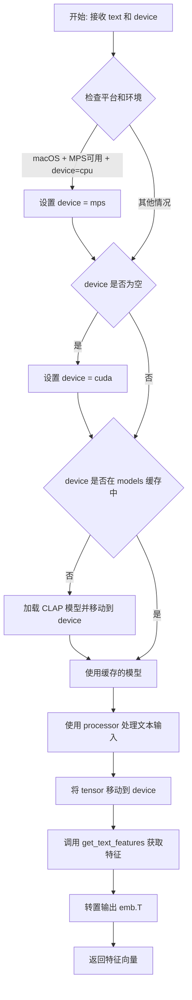

# `Bert-VITS2\oldVersion\V220\clap_wrapper.py` 详细设计文档

该模块用于加载CLAP（Contrastive Language-Audio Pretraining）预训练模型，并提供获取音频和文本特征嵌入（embedding）的功能。支持CPU、MPS（Apple Silicon）和CUDA设备，通过模型缓存机制提高效率。

## 整体流程

```mermaid
graph TD
    A[开始] --> B{设备参数为空?}
    B -- 是 --> C{平台是darwin且MPS可用?}
    B -- 否 --> D{设备已在models中?}
    C -- 是 --> E[设置device='mps']
    C -- 否 --> F[设置device='cuda']
    E --> D
    F --> D
    D -- 否 --> G[加载ClapModel到对应设备]
    D -- 是 --> H{调用函数类型?}
    H -- 音频 --> I[processor处理audio_data]
    H -- 文本 --> J[processor处理text]
    I --> K[models[device].get_audio_features]
    J --> L[models[device].get_text_features]
    K --> M[返回emb.T]
    L --> M
```

## 类结构

```
模块: clap_feature_extractor (无类定义)
├── 全局变量
│   ├── models (dict) - 模型缓存字典
│   └── processor (ClapProcessor) - 预加载的处理器
└── 全局函数
    ├── get_clap_audio_feature() - 获取音频特征
    └── get_clap_text_feature() - 获取文本特征
```

## 全局变量及字段


### `models`
    
存储不同设备的ClapModel实例，key为设备名称，value为对应的模型对象

类型：`dict`
    


### `processor`
    
预加载的CLAP处理器，用于将音频和文本数据转换为模型输入

类型：`ClapProcessor`
    


### `sys`
    
系统平台检查模块，用于判断操作系统类型

类型：`module`
    


### `torch`
    
PyTorch深度学习框架，提供张量运算和模型运行支持

类型：`module`
    


### `ClapModel`
    
transformers库中的CLAP模型类，用于加载预训练CLAP模型

类型：`class`
    


### `ClapProcessor`
    
transformers库中的CLAP处理器类，用于数据预处理

类型：`class`
    


### `config`
    
配置模块，包含模型和设备的配置信息

类型：`module`
    


    

## 全局函数及方法


### `get_clap_audio_feature`

该函数用于从音频数据中提取CLAP模型的音频特征嵌入（audio embedding），通过加载预训练的CLAP模型并将音频数据转换为高维特征向量返回。

参数：

- `audio_data`：任意，支持原始音频数据（numpy数组或原始波形），将作为CLAP处理器的输入
- `device`：`str`，指定计算设备，默认为`config.bert_gen_config.device`（可选值："cpu"、"cuda"、"mps"）

返回值：`torch.Tensor`，返回CLAP模型生成的音频特征嵌入矩阵（形状为[特征维度, 1]的转置向量）

#### 流程图

```mermaid
flowchart TD
    A[开始 get_clap_audio_feature] --> B{平台是darwin<br/>且MPS可用<br/>且device=='cpu'}
    B -->|是| C[device = 'mps']
    B -->|否| D{device为空?}
    C --> D
    D -->|是| E[device = 'cuda']
    D -->|否| F{device在models中?}
    E --> F
    F -->|否| G[加载ClapModel<br/>并移动到device]
    G --> H[models[device] = 模型]
    F -->|是| I[直接使用models[device]]
    H --> J
    I --> J
    J[with torch.no_grad] --> K[processor处理音频<br/>sampling_rate=48000]
    K --> L[inputs.to(device)]
    L --> M[models[device].get_audio_features]
    M --> N[emb = 音频特征]
    N --> O[return emb.T]
    O --> P[结束]
```

#### 带注释源码

```python
def get_clap_audio_feature(audio_data, device=config.bert_gen_config.device):
    """
    从音频数据中提取CLAP模型的音频特征嵌入
    
    参数:
        audio_data: 原始音频数据（numpy数组或原始波形）
        device: 计算设备，默认为config.bert_gen_config.device
    
    返回:
        torch.Tensor: 音频特征嵌入（转置后的特征向量）
    """
    
    # 如果在macOS平台且MPS加速可用，且当前设备为CPU，则自动切换到MPS设备
    if (
        sys.platform == "darwin"
        and torch.backends.mps.is_available()
        and device == "cpu"
    ):
        device = "mps"
    
    # 如果未指定设备，默认使用CUDA（GPU）
    if not device:
        device = "cuda"
    
    # 根据设备加载或复用模型（模型缓存，避免重复加载）
    if device not in models.keys():
        models[device] = ClapModel.from_pretrained("./emotional/clap-htsat-fused").to(
            device
        )
    
    # 使用torch.no_grad()上下文管理器，禁用梯度计算以节省显存和计算资源
    with torch.no_grad():
        # 使用ClapProcessor将原始音频数据转换为模型输入张量
        # 指定采样率为48000Hz
        inputs = processor(
            audios=audio_data, return_tensors="pt", sampling_rate=48000
        ).to(device)
        
        # 调用CLAP模型的get_audio_features方法获取音频特征嵌入
        emb = models[device].get_audio_features(**inputs)
    
    # 返回转置后的特征向量（从[1, 特征维度]转为[特征维度, 1]）
    return emb.T
```


### `get_clap_text_feature`

该函数用于从预训练的 CLAP（Contrastive Language-Audio Pretraining）模型中提取文本特征嵌入向量，通过将文本输入传递到模型的对齐文本编码器，生成固定维度的文本表示，可用于后续的音频-文本相似度计算、检索或情感分析等任务。

参数：

- `text`：`str`，需要提取特征的文本输入
- `device`：`str`，指定计算设备（默认为 `config.bert_gen_config.device`，如 "cuda" 或 "cpu"）

返回值：`torch.Tensor`，形状为 `(特征维度, 1)` 的文本特征嵌入向量（经转置处理）

#### 流程图



#### 带注释源码

```python
def get_clap_text_feature(text, device=config.bert_gen_config.device):
    """
    从预训练 CLAP 模型提取文本特征嵌入
    
    参数:
        text: str, 输入文本
        device: str, 计算设备 (cpu/cuda/mps)
    返回:
        torch.Tensor, 文本特征向量 (特征维度, 1)
    """
    # 平台兼容处理：macOS 下优先使用 MPS 加速
    if (
        sys.platform == "darwin"  # 判断是否为 macOS 系统
        and torch.backends.mps.is_available()  # 检查 MPS (Apple Silicon 加速) 是否可用
        and device == "cpu"  # 仅当显式指定 cpu 时才降级到 mps
    ):
        device = "mps"  # 使用 Apple Metal Performance Shaders 加速
    
    # 设备默认值处理：未指定设备时默认使用 CUDA
    if not device:
        device = "cuda"
    
    # 模型缓存机制：按设备缓存模型实例，避免重复加载
    if device not in models.keys():
        # 从本地路径加载预训练的 CLAP 模型并移动到指定设备
        models[device] = ClapModel.from_pretrained("./emotional/clap-htsat-fused").to(
            device
        )
    
    # 推理模式：禁用梯度计算以提升性能并减少内存占用
    with torch.no_grad():
        # 使用 processor 将文本转换为模型输入格式 (tokenize + normalize)
        inputs = processor(text=text, return_tensors="pt").to(device)
        # 调用 CLAP 模型的文本编码器获取特征表示
        emb = models[device].get_text_features(**inputs)
    
    # 转置输出：将 (batch, features) 转换为 (features, batch) 格式
    return emb.T
```

#### 关键组件信息

| 组件名称 | 一句话描述 |
|---------|-----------|
| `ClapModel` | Hugging Face Transformers 提供的 CLAP 预训练模型封装类 |
| `ClapProcessor` | 文本/音频预处理处理器，负责 tokenization 和特征归一化 |
| `models` | 全局字典，缓存不同设备上的 CLAP 模型实例以复用 |
| `processor` | 全局 CLAP 处理器单例，从本地路径加载预训练模型 |

#### 潜在技术债务与优化空间

1. **模型重复加载风险**：`device not in models.keys()` 判断在并发场景下可能存在竞态条件，建议使用线程锁保护模型加载逻辑
2. **硬编码路径**：模型路径 `./emotional/clap-htsat-fused` 应抽取至配置文件
3. **设备检测冗余**：与 `get_clap_audio_feature` 存在重复的设备选择逻辑，可抽取为独立工具函数
4. **MPS 兼容性**：当前仅处理了 `device == "cpu"` 时的 MPS 降级，未考虑显式指定 `device="mps"` 的场景
5. **错误处理缺失**：未处理模型加载失败、文本为空、processor 处理异常等情况

#### 其它设计要点

- **设计目标**：提供统一的文本特征提取接口，屏蔽模型加载和设备管理细节
- **约束条件**：依赖本地预训练模型文件存在，需确保 `./emotional/clap-htsat-fused` 路径有效
- **错误处理**：无显式异常捕获，模型加载失败时将抛出 `OSError` 或 `RuntimeError`
- **数据流**：输入文本 → Processor Tokenize → Model Encode → 特征向量输出
- **外部依赖**：`transformers` 库（ClapModel/ClapProcessor）、`torch` 库、`config` 模块

## 关键组件


### 全局模型缓存 (models)

用于缓存不同设备上的CLAP模型实例，避免重复加载模型，支持多设备切换。

### 全局处理器 (processor)

CLAP预训练处理器，负责将音频和文本数据转换为模型所需的输入格式。

### get_clap_audio_feature 函数

接收音频数据，调用CLAP模型提取音频特征向量，返回转置后的嵌入张量。包含设备自动选择逻辑（MPS/CUDA/CPU）和模型惰性加载机制。

### get_clap_text_feature 函数

接收文本输入，调用CLAP模型提取文本特征向量，返回转置后的嵌入张量。包含与音频特征函数相同的设备选择和模型缓存逻辑。

### 设备自动选择逻辑

自动检测macOS平台MPS加速、CUDA可用性及传入设备参数，动态选择最优计算设备。

### 模型惰性加载机制

通过models字典实现按需加载，同一设备仅加载一次模型，复用缓存的模型实例。


## 问题及建议


### 已知问题

-   **代码重复**：设备选择逻辑（`sys.platform == "darwin"`、`torch.backends.mps.is_available()`、device fallback）在两个函数中完全重复，违反DRY原则
-   **全局状态管理**：`models`字典和`processor`使用全局变量，存在隐式依赖关系，难以进行单元测试和模块化
-   **硬编码路径**：模型路径`"./emotional/clap-htsat-fused"`在多处重复硬编码，不利于配置管理和迁移
-   **缺少类型注解**：函数参数和返回值均无类型提示，影响代码可读性和IDE支持
-   **设备不一致**：processor始终在CPU上，而模型在指定device上，可能导致不必要的数据传输
-   **无错误处理**：模型加载和推理过程无任何异常捕获机制，运行时失败会直接崩溃
-   **无资源释放机制**：模型加载后常驻内存，缺乏缓存清理或显式卸载接口
-   **线程安全问题**：`models`字典的读写操作在多线程环境下存在潜在竞态条件
-   **单输入限制**：函数仅支持单条音频/文本处理，缺少批量处理能力

### 优化建议

-   **提取设备选择逻辑**：创建`_get_device()`辅助函数，统一处理MPS/CPU/CUDA设备选择逻辑
-   **封装为类**：将全局变量和函数封装为`CLAPFeatureExtractor`类，提供初始化、提取特征、清理资源等方法
-   **配置外部化**：从`config`模块统一读取模型路径，避免硬编码
-   **添加类型注解**：为函数参数、返回值添加`Optional`、`Union`等类型提示
-   **processor设备管理**：根据设备选择是否将processor也移至对应设备，减少数据传输开销
-   **添加异常处理**：用try-except包装模型加载和推理逻辑，添加降级策略或日志记录
-   **实现资源管理**：实现`__del__`方法或提供`clear_cache()`方法释放模型资源
-   **线程安全设计**：使用`threading.Lock`保护`models`字典的并发访问
-   **支持批量输入**：修改函数签名支持`List[audio_data]`或`List[text]`的批量处理
-   **考虑懒加载**：processor和模型可改为首次调用时再加载，而非模块导入时立即加载
-   **返回值文档化**：明确`emb.T`的返回形状和语义，或考虑返回原始tensor以减少困惑
-   **日志记录**：添加logging模块记录模型加载、设备选择等关键操作


## 其它


### 设计目标与约束

本模块的设计目标是封装CLAP模型的音频和文本特征提取功能，提供统一的接口供其他模块调用。约束条件包括：1) 模型文件存储在本地路径"./emotional/clap-htsat-fused"；2) 音频采样率固定为48000Hz；3) 设备支持CPU、CUDA和MPS（Apple Silicon）；4) 模型采用单例模式缓存，不同设备独立缓存模型实例以避免频繁加载。

### 错误处理与异常设计

主要异常场景包括：1) 模型加载失败（文件路径错误或损坏）抛出`OSError`；2) 设备不支持时抛出`RuntimeError`；3) 输入数据格式错误时由`processor`处理并抛出`ValueError`；4) CUDA/MPS不可用时自动回退到CPU。当前实现缺少显式的异常捕获和友好的错误提示，建议添加try-except块并记录详细日志。

### 数据流与状态机

数据流：音频数据→processor预处理→模型推理→特征向量输出；文本数据→processor预处理→模型推理→特征向量输出。状态机涉及模型加载状态（未加载/已加载）、设备状态（CPU/CUDA/MPS），当前通过`models`字典维护设备与模型实例的映射关系。

### 外部依赖与接口契约

外部依赖包括：1) `transformers`库的`ClapModel`和`ClapProcessor`；2) `torch`深度学习框架；3) `config`模块（需提供`bert_gen_config.device`配置）。接口契约：输入音频为原始波形数据（numpy数组或类似格式），文本为字符串；输出为PyTorch张量（形状为[1, feature_dim]的转置向量）。

### 性能考虑与优化空间

性能优化点：1) 使用`torch.no_grad()`禁用梯度计算；2) 模型按设备缓存避免重复加载；3) 可考虑批处理多个音频/文本请求。技术债务：1) 设备检测逻辑在两个函数中重复，可提取为私有方法；2) 模型路径硬编码，建议从config读取；3) 缺少模型预热（warm-up）逻辑，首次调用延迟较高；4) 未实现模型卸载机制，长期运行可能导致显存泄漏。

### 资源管理与生命周期

模型资源：使用字典缓存已加载的模型实例，键为设备名称，值为模型对象。Processor为全局单例，在模块加载时初始化。资源释放需在应用退出时调用`models.clear()`或逐个调用`del models[device]`。

### 并发考虑

当前实现非线程安全：1) `models`字典的读写操作无锁保护；2) 多线程同时调用可能触发模型竞争。建议：1) 添加线程锁（`threading.Lock`）保护模型访问；2) 或使用线程本地存储（`threading.local`）为每个线程维护独立模型实例。

### 配置管理

模型路径"./emotional/clap-htsat-fused"和采样率48000应从config模块读取而非硬编码。设备选择逻辑可提取为独立函数，支持配置优先、平台自动检测、CUDA/MPS可用性检查的优先级策略。

### 单元测试考虑

测试用例应覆盖：1) 正常音频/文本特征提取；2) 不同设备（CPU/CUDA/MPS）切换；3) 模型缓存命中测试；4) 异常输入（空音频、空文本、None值）处理；5) 多线程并发调用。建议使用`unittest.mock`模拟`ClapModel`和`ClapProcessor`以加速测试。

    