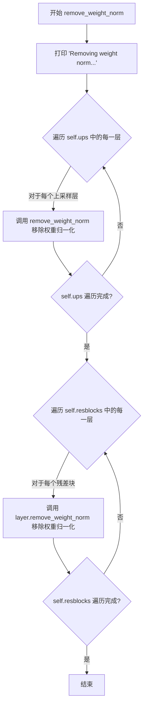
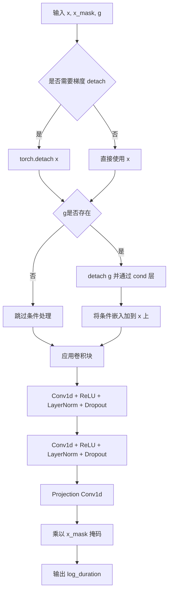
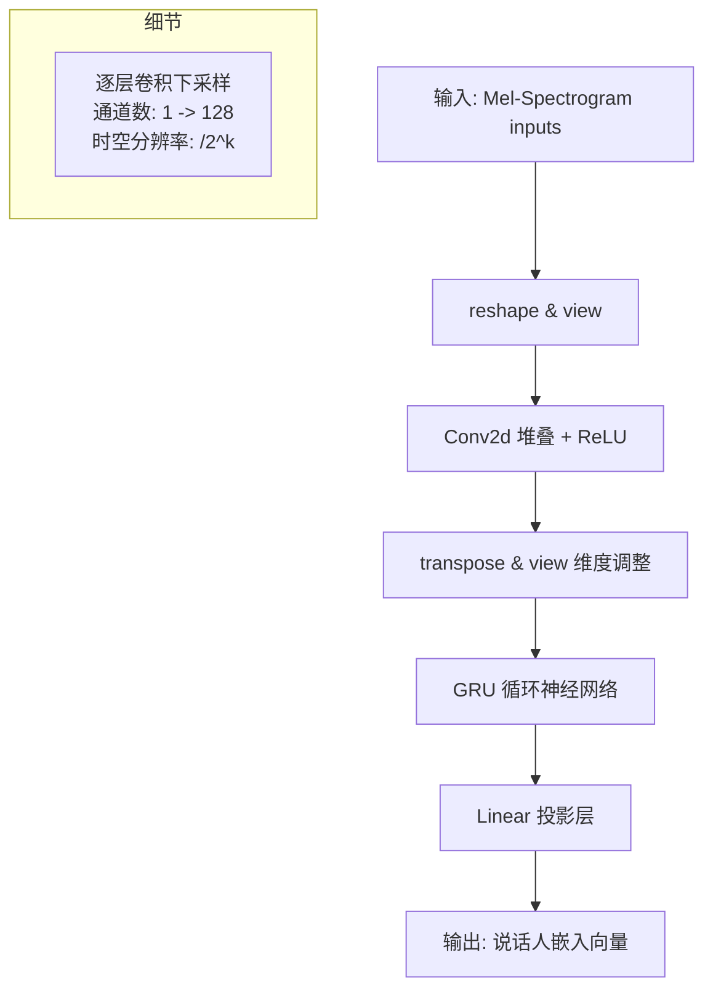
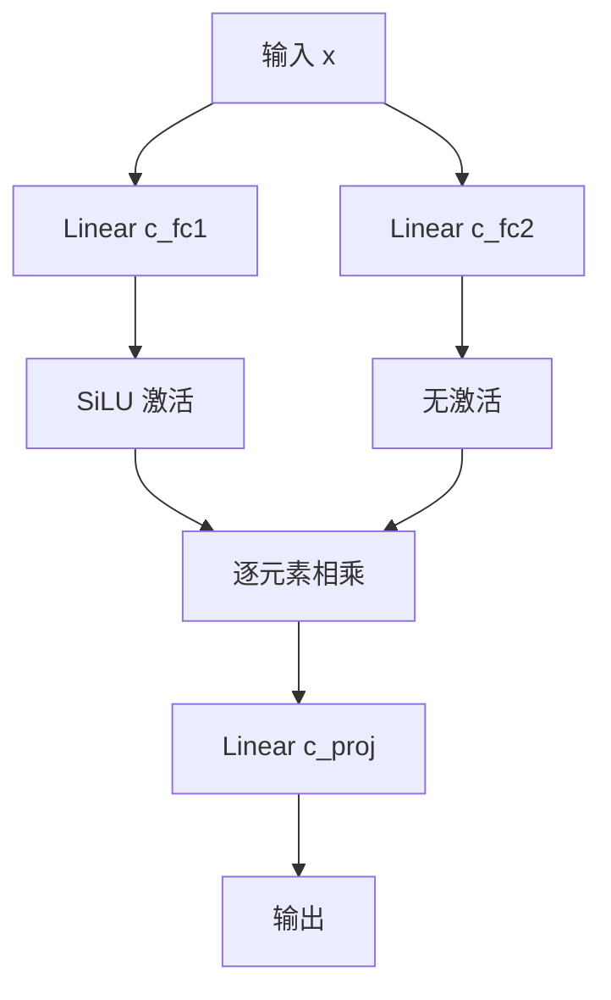
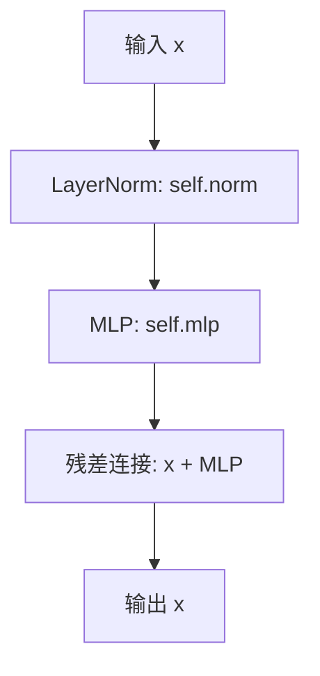

# `Bert-VITS2\oldVersion\V220\models.py` 详细设计文档

该代码实现了一个完整的VITS (Variational Inference with adversarial learning for end-to-end Text-to-Speech) 语音合成模型。模型主要由文本编码器(TextEncoder)、基于Transformer或残差流的时长预测模块(DurationPredictor/StochasticDurationPredictor)、后验编码器(PosteriorEncoder)、流式变换模块(Flow)以及HiFi-GAN生成器(Generator)组成，并包含了多周期判别器(MultiPeriodDiscriminator)用于对抗训练，能够直接从文本和说话人ID生成高保真语音波形。

## 整体流程

```mermaid
graph TD
    Inputs(输入: x, y, sid, tone, lang, bert, emo) --> SynthesizerTrn
    subgraph Encoders [编码阶段]
        TextEncoder --> EncP[enc_p: 文本特征]
        PosteriorEncoder --> EncQ[enc_q: 音频隐变量 z]
    end
    subgraph DurationPrediction [时长预测]
        EncP --> SDP[StochasticDurationPredictor]
        EncP --> DP[DurationPredictor]
        SDP --> Duration[预测时长 logw]
        DP --> Duration
    end
    subgraph Alignment [对齐与扩展]
        Duration --> MonotonicAlign[Monotonic Alignment]
        MonotonicAlign --> ExpandedM[展开后的 m_p, logs_p]
    end
    subgraph Flow [潜在流变换]
        EncQ --> Flow[TransformerCouplingBlock]
        Flow --> Z_P[z_p (先验隐变量)]
    end
    subgraph Decoder [解码阶段]
        Z_P --> Generator[HiFi-GAN Generator]
        Generator --> Waveform[输出波形]
    end
```

## 类结构

```
nn.Module (PyTorch基类)
├── DurationDiscriminator (VITS2时长判别器)
├── TransformerCouplingBlock (Transformer流变换模块)
├── StochasticDurationPredictor (随机流时长预测器)
├── DurationPredictor (确定性卷积时长预测器)
├── Bottleneck (MLP容器)
├── Block (TransformerBlock)
├── MLP (前馈神经网络)
├── TextEncoder (文本与特征编码器)
├── ResidualCouplingBlock (残差流变换模块)
├── PosteriorEncoder (后验编码器)
├── Generator (声码器生成器)
├── DiscriminatorP (周期discriminator)
├── DiscriminatorS (尺度discriminator)
├── MultiPeriodDiscriminator (多周期discriminator集成)
├── ReferenceEncoder (参考音频编码器)
└── SynthesizerTrn (主模型合成器)
```

## 全局变量及字段


### `symbols`
    
文本符号列表

类型：`list/tuple`
    


### `num_tones`
    
音调数量

类型：`int`
    


### `num_languages`
    
语言数量

类型：`int`
    


### `SynthesizerTrn.n_vocab`
    
词汇表大小

类型：`int`
    


### `SynthesizerTrn.enc_p`
    
文本编码器，将输入文本转换为隐表示

类型：`TextEncoder`
    


### `SynthesizerTrn.dec`
    
生成器，将隐表示转换为音频波形

类型：`Generator`
    


### `SynthesizerTrn.enc_q`
    
后验编码器，编码音频到潜在变量z

类型：`PosteriorEncoder`
    


### `SynthesizerTrn.flow`
    
流变换模块，用于分布变换

类型：`Module`
    


### `SynthesizerTrn.sdp`
    
随机时长预测器，预测字符时长分布

类型：`StochasticDurationPredictor`
    


### `SynthesizerTrn.dp`
    
确定性时长预测器，预测平均时长

类型：`DurationPredictor`
    


### `SynthesizerTrn.emb_g`
    
说话人嵌入，将说话人ID映射为嵌入向量

类型：`nn.Embedding`
    


### `TextEncoder.emb`
    
字符嵌入，将文本符号映射为向量

类型：`nn.Embedding`
    


### `TextEncoder.tone_emb`
    
音调嵌入，编码输入文本的音调信息

类型：`nn.Embedding`
    


### `TextEncoder.language_emb`
    
语言嵌入，编码输入文本的语言信息

类型：`nn.Embedding`
    


### `TextEncoder.bert_proj`
    
BERT投影层，将BERT特征映射到隐藏空间

类型：`nn.Conv1d`
    


### `TextEncoder.ja_bert_proj`
    
日语文BERT投影层

类型：`nn.Conv1d`
    


### `TextEncoder.en_bert_proj`
    
英语BERT投影层

类型：`nn.Conv1d`
    


### `TextEncoder.encoder`
    
Transformer编码器，处理序列特征

类型：`attentions.Encoder`
    


### `TextEncoder.proj`
    
输出投影，将编码器输出映射到均值和方差

类型：`nn.Conv1d`
    


### `TextEncoder.in_feature_net`
    
输入特征网络，处理情感特征

类型：`nn.Sequential`
    


### `TextEncoder.emo_vq`
    
情感向量量化器，离散化情感嵌入

类型：`VectorQuantize`
    


### `TextEncoder.out_feature_net`
    
输出特征网络，映射VQ后的情感向量

类型：`nn.Linear`
    


### `Generator.conv_pre`
    
输入卷积层，处理初始潜在表示

类型：`Conv1d`
    


### `Generator.ups`
    
上采样层列表，逐步上采样潜在表示

类型：`nn.ModuleList`
    


### `Generator.resblocks`
    
残差块列表，用于上采样后的特征处理

类型：`nn.ModuleList`
    


### `Generator.cond`
    
条件卷积，注入说话人/情感条件信息

类型：`nn.Conv1d`
    


### `Generator.conv_post`
    
输出卷积层，生成最终波形

类型：`Conv1d`
    


### `PosteriorEncoder.pre`
    
预处理卷积

类型：`Conv1d`
    


### `PosteriorEncoder.enc`
    
WaveNet编码器

类型：`modules.WN`
    


### `PosteriorEncoder.proj`
    
投影层，输出均值和方差

类型：`Conv1d`
    


### `TransformerCouplingBlock.channels`
    
通道数

类型：`int`
    


### `TransformerCouplingBlock.hidden_channels`
    
隐藏层通道数

类型：`int`
    


### `TransformerCouplingBlock.flows`
    
流层模块列表

类型：`nn.ModuleList`
    


### `TransformerCouplingBlock.wn`
    
共享参数的注意力网络

类型：`attentions.FFT`
    


### `StochasticDurationPredictor.log_flow`
    
对数流变换

类型：`modules.Log`
    


### `StochasticDurationPredictor.flows`
    
流模块列表

类型：`nn.ModuleList`
    


### `StochasticDurationPredictor.post_pre`
    
后处理预投影

类型：`nn.Conv1d`
    


### `StochasticDurationPredictor.post_proj`
    
后处理投影

类型：`nn.Conv1d`
    


### `StochasticDurationPredictor.post_convs`
    
后处理卷积

类型：`modules.DDSConv`
    


### `StochasticDurationPredictor.post_flows`
    
后处理流模块

类型：`nn.ModuleList`
    


### `StochasticDurationPredictor.pre`
    
预处理投影

类型：`nn.Conv1d`
    


### `StochasticDurationPredictor.proj`
    
主投影层

类型：`nn.Conv1d`
    


### `StochasticDurationPredictor.convs`
    
主卷积块

类型：`modules.DDSConv`
    


### `StochasticDurationPredictor.cond`
    
条件投影

类型：`nn.Conv1d`
    


### `DurationPredictor.conv_1`
    
第一卷积层

类型：`Conv1d`
    


### `DurationPredictor.conv_2`
    
第二卷积层

类型：`Conv1d`
    


### `DurationPredictor.norm_1`
    
第一层归一化

类型：`modules.LayerNorm`
    


### `DurationPredictor.norm_2`
    
第二层归一化

类型：`modules.LayerNorm`
    


### `DurationPredictor.proj`
    
输出投影到标量

类型：`Conv1d`
    


### `DurationPredictor.cond`
    
条件投影

类型：`nn.Conv1d`
    


### `DurationPredictor.drop`
    
Dropout层

类型：`nn.Dropout`
    


### `MultiPeriodDiscriminator.discriminators`
    
判别器列表，包含S和P类判别器

类型：`nn.ModuleList`
    


### `DurationDiscriminator.conv_1`
    
第一卷积层

类型：`nn.Conv1d`
    


### `DurationDiscriminator.conv_2`
    
第二卷积层

类型：`nn.Conv1d`
    


### `DurationDiscriminator.norm_1`
    
第一层归一化

类型：`modules.LayerNorm`
    


### `DurationDiscriminator.norm_2`
    
第二层归一化

类型：`modules.LayerNorm`
    


### `DurationDiscriminator.dur_proj`
    
时长投影层

类型：`nn.Conv1d`
    


### `DurationDiscriminator.pre_out_conv_1`
    
预输出卷积1

类型：`nn.Conv1d`
    


### `DurationDiscriminator.pre_out_norm_1`
    
预输出归一化1

类型：`modules.LayerNorm`
    


### `DurationDiscriminator.pre_out_conv_2`
    
预输出卷积2

类型：`nn.Conv1d`
    


### `DurationDiscriminator.pre_out_norm_2`
    
预输出归一化2

类型：`modules.LayerNorm`
    


### `DurationDiscriminator.cond`
    
条件卷积

类型：`nn.Conv1d`
    


### `DurationDiscriminator.output_layer`
    
输出层，输出概率

类型：`nn.Sequential`
    


### `DurationDiscriminator.drop`
    
Dropout层

类型：`nn.Dropout`
    


### `ReferenceEncoder.convs`
    
卷积层列表

类型：`nn.ModuleList`
    


### `ReferenceEncoder.gru`
    
GRU循环网络

类型：`nn.GRU`
    


### `ReferenceEncoder.proj`
    
线性投影层

类型：`nn.Linear`
    


### `MLP.c_fc1`
    
第一全连接层

类型：`nn.Linear`
    


### `MLP.c_fc2`
    
第二全连接层

类型：`nn.Linear`
    


### `MLP.c_proj`
    
输出投影层

类型：`nn.Linear`
    


### `Block.norm`
    
层归一化

类型：`nn.LayerNorm`
    


### `Block.mlp`
    
多层感知机

类型：`MLP`
    


### `ResidualCouplingBlock.channels`
    
通道数

类型：`int`
    


### `ResidualCouplingBlock.hidden_channels`
    
隐藏层通道数

类型：`int`
    


### `ResidualCouplingBlock.kernel_size`
    
卷积核大小

类型：`int`
    


### `ResidualCouplingBlock.dilation_rate`
    
膨胀率

类型：`int`
    


### `ResidualCouplingBlock.n_layers`
    
层数

类型：`int`
    


### `ResidualCouplingBlock.n_flows`
    
流数量

类型：`int`
    


### `ResidualCouplingBlock.gin_channels`
    
条件输入通道

类型：`int`
    


### `ResidualCouplingBlock.flows`
    
流层模块列表

类型：`nn.ModuleList`
    


### `DiscriminatorP.period`
    
周期值

类型：`int`
    


### `DiscriminatorP.use_spectral_norm`
    
是否使用谱归一化

类型：`bool`
    


### `DiscriminatorP.convs`
    
卷积层列表

类型：`nn.ModuleList`
    


### `DiscriminatorP.conv_post`
    
后处理卷积

类型：`nn.Conv2d`
    


### `DiscriminatorS.convs`
    
卷积层列表

类型：`nn.ModuleList`
    


### `DiscriminatorS.conv_post`
    
后处理卷积

类型：`nn.Conv1d`
    
    

## 全局函数及方法


### `SynthesizerTrn.forward`

这是 VITS（Variational Inference with adversarial Learning for end-to-end Text-to-Speech）模型的核心前向传播方法，用于训练阶段。该方法接收文本/音素序列和音频频谱作为输入，经过文本编码、流模型（Flow）、后验编码器、持续时间预测器和持续时间对齐等多个组件的处理，最终输出生成的音频片段、对齐矩阵以及各类损失值。

参数：

- `x`：`torch.Tensor`，输入的文本/音素序列，形状为 [batch, seq_len]
- `x_lengths`：`torch.Tensor`，输入序列的实际长度，形状为 [batch]
- `y`：`torch.Tensor`，目标音频频谱，形状为 [batch, channels, time_steps]
- `y_lengths`：`torch.Tensor`，频谱的实际长度，形状为 [batch]
- `sid`：`torch.Tensor`，说话人ID，形状为 [batch]
- `tone`：`torch.Tensor`，音调特征，形状为 [batch, seq_len]
- `language`：`torch.Tensor`，语言特征，形状为 [batch, seq_len]
- `bert`：`torch.Tensor`，BERT嵌入，形状为 [batch, seq_len, 1024]
- `ja_bert`：`torch.Tensor`，日语BERT嵌入，形状为 [batch, seq_len, 1024]
- `en_bert`：`torch.Tensor`，英语BERT嵌入，形状为 [batch, seq_len, 1024]
- `emo`：`torch.Tensor`，情感嵌入（可选），形状为 [batch, 512]

返回值：`tuple`，包含以下元素：
- `o`：`torch.Tensor`，生成的音频片段，形状为 [batch, 1, segment_size]
- `l_length`：`torch.Tensor`，持续时间预测损失（DP + SDP），形状为 [batch]
- `attn`：`torch.Tensor`，单调对齐矩阵，形状为 [batch, 1, seq_len, time_steps]
- `ids_slice`：`torch.Tensor`，随机片段的起始位置索引
- `x_mask`：`torch.Tensor`，输入序列的掩码
- `y_mask`：`torch.Tensor`，目标序列的掩码
- `z, z_p, m_p, logs_p, m_q, logs_q`：`tuple`，流模型的潜在变量和统计量
- `x, logw, logw_`：`tuple`，文本编码器输出和持续时间预测器的输出
- `g`：`torch.Tensor`，说话人嵌入向量
- `loss_commit`：`torch.Tensor`，向量量化（VQ）的承诺损失

#### 流程图

```mermaid
flowchart TD
    A[输入: x, x_lengths, y, y_lengths, sid, tone, language, bert, ja_bert, en_bert, emo] --> B{是否有说话人ID}
    B -->|是| C[使用emb_g获取说话人嵌入]
    B -->|否| D[使用ReferenceEncoder获取说话人嵌入]
    C --> E[g = emb_g(sid).unsqueeze(-1)]
    D --> E
    
    E --> F[enc_p: TextEncoder]
    F --> G[输出: x, m_p, logs_p, x_mask, loss_commit]
    
    G --> H[enc_q: PosteriorEncoder]
    H --> I[输出: z, m_q, logs_q, y_mask]
    
    I --> J[flow: TransformerCouplingBlock]
    J --> K[z_p = flow(z, y_mask, g)]
    
    K --> L[计算负中心值neg_cent]
    L --> M[monotonic_align.maximum_path]
    M --> N[attn: 单调对齐矩阵]
    
    N --> O[w = attn.sum(2)]
    O --> P[sdp: StochasticDurationPredictor]
    O --> Q[dp: DurationPredictor]
    
    P --> R[l_length_sdp]
    Q --> S[logw]
    O --> T[logw_ = log(w + eps)]
    
    S --> U[l_length_dp = (logw - logw_)^2]
    U --> V[l_length = l_length_dp + l_length_sdp]
    R --> V
    
    V --> W[展开先验: m_p, logs_p]
    W --> X[rand_slice_segments: 随机切片]
    X --> Y[z_slice, ids_slice]
    
    Y --> Z[dec: Generator]
    Z --> AA[o: 生成音频]
    
    AA --> BB[返回: o, l_length, attn, ids_slice, x_mask, y_mask, z_tuple, x_tuple, g, loss_commit]
```

#### 带注释源码

```python
def forward(
    self,
    x,
    x_lengths,
    y,
    y_lengths,
    sid,
    tone,
    language,
    bert,
    ja_bert,
    en_bert,
    emo=None,
):
    """
    前向传播（训练模式）
    
    参数:
        x: 文本/音素序列 [batch, seq_len]
        x_lengths: 输入序列长度 [batch]
        y: 音频频谱 [batch, channels, time_steps]
        y_lengths: 频谱长度 [batch]
        sid: 说话人ID [batch]
        tone: 音调特征 [batch, seq_len]
        language: 语言特征 [batch, seq_len]
        bert: BERT嵌入 [batch, seq_len, 1024]
        ja_bert: 日语BERT嵌入 [batch, seq_len, 1024]
        en_bert: 英语BERT嵌入 [batch, seq_len, 1024]
        emo: 情感嵌入 [batch, 512] (可选)
    
    返回:
        包含生成音频、损失值、对齐矩阵等的元组
    """
    
    # 1. 获取说话人嵌入
    if self.n_speakers > 0:
        # 使用Embedding层获取说话人嵌入
        g = self.emb_g(sid).unsqueeze(-1)  # [b, h, 1]
    else:
        # 使用ReferenceEncoder从音频中提取说话人特征
        g = self.ref_enc(y.transpose(1, 2)).unsqueeze(-1)
    
    # 2. 文本编码器：处理文本/音素序列，生成先验分布参数
    # 输入: x(音素), tone(音调), language(语言), bert/ja_bert/en_bert(多语言BERT), emo(情感)
    # 输出: x(编码后), m_p(均值), logs_p(对数方差), x_mask(掩码), loss_commit(VQ损失)
    x, m_p, logs_p, x_mask, loss_commit = self.enc_p(
        x, x_lengths, tone, language, bert, ja_bert, en_bert, emo, sid, g=g
    )
    
    # 3. 后验编码器：从音频频谱中提取潜在变量
    # 输入: y(频谱), y_lengths(长度), g(说话人嵌入)
    # 输出: z(潜在变量), m_q(均值), logs_q(对数方差), y_mask(掩码)
    z, m_q, logs_q, y_mask = self.enc_q(y, y_lengths, g=g)
    
    # 4. 流模型(Flow): 将后验分布转换为先验分布
    # 输入: z, y_mask, g
    # 输出: z_p (在先验空间中的潜在变量)
    z_p = self.flow(z, y_mask, g=g)

    with torch.no_grad():
        # 5. 计算负交叉熵，用于对齐
        # s_p_sq_r: 缩放因子 = exp(-2 * logs_p)
        s_p_sq_r = torch.exp(-2 * logs_p)  # [b, d, t]
        
        # neg_cent1: 常数项 -0.5 * log(2*pi) - logs_p
        neg_cent1 = torch.sum(
            -0.5 * math.log(2 * math.pi) - logs_p, [1], keepdim=True
        )  # [b, 1, t_s]
        
        # neg_cent2: 潜在变量与均值的二次项
        neg_cent2 = torch.matmul(
            -0.5 * (z_p**2).transpose(1, 2), s_p_sq_r
        )  # [b, t_t, d] x [b, d, t_s] = [b, t_t, t_s]
        
        # neg_cent3: 线性项
        neg_cent3 = torch.matmul(
            z_p.transpose(1, 2), (m_p * s_p_sq_r)
        )  # [b, t_t, d] x [b, d, t_s] = [b, t_t, t_s]
        
        # neg_cent4: 均值的二次项
        neg_cent4 = torch.sum(
            -0.5 * (m_p**2) * s_p_sq_r, [1], keepdim=True
        )  # [b, 1, t_s]
        
        # 合并所有项得到负中心值
        neg_cent = neg_cent1 + neg_cent2 + neg_cent3 + neg_cent4
        
        # 可选：添加噪声缩放的MAS（Monotonic Alignment Search）
        if self.use_noise_scaled_mas:
            epsilon = (
                torch.std(neg_cent)
                * torch.randn_like(neg_cent)
                * self.current_mas_noise_scale
            )
            neg_cent = neg_cent + epsilon

        # 创建对齐掩码
        attn_mask = torch.unsqueeze(x_mask, 2) * torch.unsqueeze(y_mask, -1)
        
        # 6. 使用单调对齐路径算法找到最优对齐
        attn = (
            monotonic_align.maximum_path(neg_cent, attn_mask.squeeze(1))
            .unsqueeze(1)
            .detach()
        )

    # 7. 从对齐矩阵计算持续时间
    w = attn.sum(2)

    # 8. 随机持续时间预测器(SDP)损失
    l_length_sdp = self.sdp(x, x_mask, w, g=g)
    l_length_sdp = l_length_sdp / torch.sum(x_mask)

    # 9. 确定性持续时间预测器(DP)损失
    logw_ = torch.log(w + 1e-6) * x_mask
    logw = self.dp(x, x_mask, g=g)
    l_length_dp = torch.sum((logw - logw_) ** 2, [1, 2]) / torch.sum(
        x_mask
    )  # for averaging

    # 10. 总持续时间损失
    l_length = l_length_dp + l_length_sdp

    # 11. 通过对齐矩阵展开先验分布参数
    # 将m_p和logs_p从[batch, channels, seq_len]扩展到与音频对齐的维度
    m_p = torch.matmul(attn.squeeze(1), m_p.transpose(1, 2)).transpose(1, 2)
    logs_p = torch.matmul(attn.squeeze(1), logs_p.transpose(1, 2)).transpose(1, 2)

    # 12. 随机切片：从潜在变量中随机采样固定长度的片段
    z_slice, ids_slice = commons.rand_slice_segments(
        z, y_lengths, self.segment_size
    )
    
    # 13. 解码器（生成器）：将潜在变量转换为音频波形
    o = self.dec(z_slice, g=g)
    
    # 返回所有输出
    return (
        o,                      # 生成的音频片段
        l_length,               # 持续时间损失
        attn,                   # 对齐矩阵
        ids_slice,              # 片段索引
        x_mask,                 # 输入掩码
        y_mask,                 # 输出掩码
        (z, z_p, m_p, logs_p, m_q, logs_q),  # 流相关变量
        (x, logw, logw_),       # 文本编码器和DP输出
        g,                      # 说话人嵌入
        loss_commit,            # VQ承诺损失
    )
```


### `SynthesizerTrn.infer`

该方法是VITS（Variational Inference with adversarial learning for end-to-end Text-to-Speech）模型的推理生成方法，接收文本序列、说话人ID、韵律特征等输入，通过文本编码器提取文本表示，使用持续时间预测器（SDP和DP）预测音素时长，通过注意力对齐模块生成对齐矩阵，将文本表示扩展到声学帧级别，经流模型逆变换生成潜在表示，最终通过解码器将潜在表示转换为音频波形输出。

参数：

- `self`：`SynthesizerTrn`，模型实例本身
- `x`：`torch.Tensor`，文本输入，形状为 `[batch_size, seq_len]`，表示音素或字符序列
- `x_lengths`：`torch.Tensor`，文本序列长度，形状为 `[batch_size]`，用于掩码处理变长序列
- `sid`：`torch.Tensor`，说话人ID，形状为 `[batch_size]`，用于多说话人场景的说话人嵌入
- `tone`：`torch.Tensor`，语调特征，形状为 `[batch_size, seq_len]`，表示音调轮廓信息
- `language`：`torch.Tensor`，语言特征，形状为 `[batch_size, seq_len]`，表示语言标识
- `bert`：`torch.Tensor`，BERT文本嵌入，形状为 `[batch_size, seq_len, 1024]`，提供上下文语义信息
- `ja_bert`：`torch.Tensor`，日语BERT嵌入，形状为 `[batch_size, seq_len, 1024]`，用于日语的语义特征
- `en_bert`：`torch.Tensor`，英语BERT嵌入，形状为 `[batch_size, seq_len, 1024]`，用于英语的语义特征
- `emo`：`torch.Tensor`，情感特征（可选），形状为 `[batch_size, 512]`，用于情感合成，默认为 `None`
- `noise_scale`：`float`，采样噪声缩放因子，默认为 `0.667`，控制逆变换时随机噪声的强度
- `length_scale`：`float`，时长缩放因子，默认为 `1`，用于调整生成语音的速度
- `noise_scale_w`：`float`，持续时间预测噪声缩放因子，默认为 `0.8`，控制SDP逆采样时的噪声
- `max_len`：`int`，生成音频的最大长度（可选），默认为 `None`，用于限制输出序列长度
- `sdp_ratio`：`float`，SDP与DP的混合比例，默认为 `0`，0表示纯DP，1表示纯SDP
- `y`：`torch.Tensor`，参考音频（可选），形状为 `[batch_size, spec_channels, time_steps]`，用于参考编码器提取说话人特征，默认为 `None`

返回值：`tuple`，包含以下四个元素：
- `o`：`torch.Tensor`，生成的音频波形，形状为 `[batch_size, 1, time_steps]`
- `attn`：`torch.Tensor`，文本与声学的对齐矩阵，形状为 `[batch_size, 1, seq_len, time_steps]`
- `y_mask`：`torch.Tensor`，声学序列的掩码，形状为 `[batch_size, 1, time_steps]`
- `tuple`：包含 `(z, z_p, m_p, logs_p)`，其中 `z` 是潜在表示、`z_p` 是流变换后的表示、`m_p` 是均值、`logs_p` 是对数标准差

#### 流程图

```mermaid
flowchart TD
    A[开始推理] --> B{判断多说话人模式}
    B -->|n_speakers > 0| C[使用说话人嵌入 emb_g]
    B -->|n_speakers <= 0| D[使用参考编码器 ref_enc]
    
    C --> E[文本编码器 enc_p]
    D --> E
    
    E --> F[提取文本特征: x, m_p, logs_p, x_mask]
    F --> G[持续时间预测: SDP + DP混合]
    
    G --> H[计算时长 w = exp(logw) * length_scale]
    H --> I[计算ceil时长 w_ceil]
    I --> J[计算声学序列长度 y_lengths]
    J --> K[生成声学掩码 y_mask]
    K --> L[生成注意力对齐矩阵 attn]
    
    L --> M[扩展均值和方差: m_p, logs_p]
    M --> N[采样潜在表示 z_p = m_p + noise * exp(logs_p)]
    N --> O[流模型逆变换: z = flow(z_p, reverse=True)]
    O --> P[解码器生成波形: o = dec(z * y_mask)]
    P --> Q[返回 o, attn, y_mask, (z, z_p, m_p, logs_p)]
```

#### 带注释源码

```python
def infer(
    self,
    x,              # 文本输入 [batch_size, seq_len]
    x_lengths,      # 文本序列长度 [batch_size]
    sid,            # 说话人ID [batch_size]
    tone,           # 语调特征 [batch_size, seq_len]
    language,       # 语言特征 [batch_size, seq_len]
    bert,           # BERT嵌入 [batch_size, seq_len, 1024]
    ja_bert,        # 日语BERT嵌入 [batch_size, seq_len, 1024]
    en_bert,        # 英语BERT嵌入 [batch_size, seq_len, 1024]
    emo=None,       # 情感特征（可选）[batch_size, 512]
    noise_scale=0.667,    # 逆变换噪声缩放因子
    length_scale=1,        # 时长缩放因子（控制语速）
    noise_scale_w=0.8,    # 持续时间预测噪声缩放
    max_len=None,         # 最大输出长度限制
    sdp_ratio=0,          # SDP/DP混合比例
    y=None,              # 参考音频（用于参考编码器）
):
    # 判断多说话人模式：若有多个说话人则使用嵌入，否则使用参考编码器
    if self.n_speakers > 0:
        # 使用说话人嵌入层获取说话人条件向量 [batch_size, gin_channels, 1]
        g = self.emb_g(sid).unsqueeze(-1)
    else:
        # 使用参考编码器从参考音频提取说话人特征
        # 输入 [batch_size, spec_channels, time] -> 输出 [batch_size, gin_channels]
        g = self.ref_enc(y.transpose(1, 2)).unsqueeze(-1)
    
    # 通过文本编码器处理输入，获取文本表示和统计量
    # x: 文本特征, m_p: 均值, logs_p: 对数标准差, x_mask: 文本掩码
    x, m_p, logs_p, x_mask, _ = self.enc_p(
        x, x_lengths, tone, language, bert, ja_bert, en_bert, emo, sid, g=g
    )
    
    # 持续时间预测：混合SDP（随机持续时间预测器）和DP（确定性持续时间预测器）
    # SDP通过逆流采样获取时长分布，DP直接预测时长
    # noise_scale_w 控制SDP采样时的噪声水平
    logw = self.sdp(x, x_mask, g=g, reverse=True, noise_scale=noise_scale_w) * (
        sdp_ratio
    ) + self.dp(x, x_mask, g=g) * (1 - sdp_ratio)
    
    # 将对数时长转换为实际时长，并应用时长缩放因子
    w = torch.exp(logw) * x_mask * length_scale
    # 向上取整获取离散时长
    w_ceil = torch.ceil(w)
    # 计算生成的声学序列长度，确保至少为1
    y_lengths = torch.clamp_min(torch.sum(w_ceil, [1, 2]), 1).long()
    # 生成声学序列的掩码
    y_mask = torch.unsqueeze(commons.sequence_mask(y_lengths, None), 1).to(
        x_mask.dtype
    )
    
    # 生成文本与声学的注意力对齐矩阵
    # attn_mask 用于排除填充位置的影响
    attn_mask = torch.unsqueeze(x_mask, 2) * torch.unsqueeze(y_mask, -1)
    # 使用动态规划算法（VITS中为monotonic alignment）找到最优对齐路径
    attn = commons.generate_path(w_ceil, attn_mask)
    
    # 通过对齐矩阵扩展先验分布的均值和方差
    # 将 [batch_size, seq_len, dim] 扩展为 [batch_size, dim, frame_len]
    m_p = torch.matmul(attn.squeeze(1), m_p.transpose(1, 2)).transpose(
        1, 2
    )  # [b, t', t], [b, t, d] -> [b, d, t']
    logs_p = torch.matmul(attn.squeeze(1), logs_p.transpose(1, 2)).transpose(
        1, 2
    )  # [b, t', t], [b, t, d] -> [b, d, t']
    
    # 从先验分布采样潜在表示 z_p
    # m_p: 均值, logs_p: 对数方差, noise_scale: 采样噪声缩放
    z_p = m_p + torch.randn_like(m_p) * torch.exp(logs_p) * noise_scale
    
    # 通过标准化流（flow）的逆变换将 z_p 转换为 z
    # 流模型学习从复杂分布到标准高斯分布的映射，逆变换可用于生成
    z = self.flow(z_p, y_mask, g=g, reverse=True)
    
    # 通过解码器将潜在表示转换为音频波形
    # 截取指定最大长度，添加说话人条件向量 g
    o = self.dec((z * y_mask)[:, :, :max_len], g=g)
    
    # 返回生成的波形、对齐矩阵、掩码以及中间潜在表示
    return o, attn, y_mask, (z, z_p, m_p, logs_p)
```


### `TextEncoder.forward`

该方法是VITS2语音合成模型中TextEncoder的核心前向传播函数，负责将文本序列（包含音素、音调、语言特征、BERT嵌入和情感嵌入）编码为隐层表示，同时输出均值和日志标准差用于后续的概率流建模。

参数：

- `self`：TextEncoder类实例本身
- `x`：`torch.Tensor`，输入的音素索引序列，形状为 [batch, seq_len]
- `x_lengths`：`torch.Tensor`，输入序列的实际长度，用于生成掩码
- `tone`：`torch.Tensor`，音调特征序列
- `language`：`torch.Tensor`，语言特征序列
- `bert`：`torch.Tensor`，英语BERT嵌入，形状为 [batch, seq_len, 1024]
- `ja_bert`：`torch.Tensor`，日语BERT嵌入，形状为 [batch, seq_len, 1024]
- `en_bert`：`torch.Tensor`，另一个英语BERT嵌入（可能是不同模型），形状为 [batch, seq_len, 1024]
- `emo`：`torch.Tensor`，情感嵌入向量，形状为 [batch, 512]
- `sid`：`torch.Tensor`，说话人ID，用于条件嵌入（注意：代码中实际并未使用，仅做CPU迁移）
- `g`：`torch.Tensor` 或 `None`，全局条件特征（如说话人嵌入）

返回值：

- `x`：`torch.Tensor`，Encoder输出的隐藏表示
- `m`：`torch.Tensor`，均值输出，用于后续flow建模
- `logs`：`torch.Tensor`，日志标准差输出，用于后续flow建模
- `x_mask`：`torch.Tensor`，序列掩码，形状为 [batch, 1, seq_len]
- `loss_commit`：`torch.Tensor`，情感向量量化器的承诺损失（commitment loss）

#### 流程图

```mermaid
flowchart TD
    A[输入: x, x_lengths, tone, language, bert, ja_bert, en_bert, emo, sid] --> B[将sid移到CPU]
    B --> C[bert_emb = bert_proj.permute]
    C --> D[ja_bert_emb = ja_bert_proj.permute]
    D --> E[en_bert_emb = en_bert_proj.permute]
    E --> F[emo_emb = in_feature_net]
    F --> G[emo_emb, _, loss_commit = emo_vq]
    G --> H[emo_emb = out_feature_net]
    H --> I[合并所有嵌入: emb + tone_emb + language_emb + bert_emb + ja_bert_emb + en_bert_emb + emo_emb]
    I --> J[乘以 sqrt(hidden_channels) 进行缩放]
    J --> K[转置: [b, t, h] -> [b, h, t]]
    K --> L[生成序列掩码 x_mask]
    L --> M[encoder(x * x_mask, x_mask, g)]
    M --> N[proj(x) * x_mask]
    N --> O[split stats -> m, logs]
    O --> P[输出: x, m, logs, x_mask, loss_commit]
```

#### 带注释源码

```python
def forward(
    self, x, x_lengths, tone, language, bert, ja_bert, en_bert, emo, sid, g=None
):
    """
    TextEncoder的前向传播函数
    
    参数:
        x: 音素索引 [batch, seq_len]
        x_lengths: 序列长度 [batch]
        tone: 音调特征 [batch, seq_len]
        language: 语言特征 [batch, seq_len]
        bert: 英语BERT嵌入 [batch, seq_len, 1024]
        ja_bert: 日语BERT嵌入 [batch, seq_len, 1024]
        en_bert: 英语BERT嵌入2 [batch, seq_len, 1024]
        emo: 情感嵌入 [batch, 512]
        sid: 说话人ID [batch]
        g: 全局条件特征 [batch, gin_channels, 1] 或 None
    
    返回:
        x: Encoder输出
        m: 均值 [batch, out_channels, seq_len]
        logs: 日志标准差 [batch, out_channels, seq_len]
        x_mask: 序列掩码 [batch, 1, seq_len]
        loss_commit: VQ承诺损失
    """
    # 将说话人ID移到CPU（这里处理有问题，sid应该用于查表而不是直接丢弃）
    sid = sid.cpu()
    
    # 对不同语言的BERT嵌入进行投影并转置维度 [b, t, 1024] -> [b, t, h]
    bert_emb = self.bert_proj(bert).transpose(1, 2)
    ja_bert_emb = self.ja_bert_proj(ja_bert).transpose(1, 2)
    en_bert_emb = self.en_bert_proj(en_bert).transpose(1, 2)
    
    # 处理情感嵌入：先通过特征网络
    emo_emb = self.in_feature_net(emo)
    # 通过VectorQuantize进行量化
    emo_emb, _, loss_commit = self.emo_vq(emo_emb.unsqueeze(1))
    # 计算平均承诺损失
    loss_commit = loss_commit.mean()
    # 通过输出特征网络
    emo_emb = self.out_feature_net(emo_emb)
    
    # 合并所有嵌入：音素嵌入 + 音调嵌入 + 语言嵌入 + BERT嵌入 + 情感嵌入
    x = (
        self.emb(x)           # 基础音素嵌入
        + self.tone_emb(tone)       # 音调嵌入
        + self.language_emb(language)  # 语言嵌入
        + bert_emb             # 英语BERT
        + ja_bert_emb          # 日语BERT
        + en_bert_emb          # 英语BERT2
        + emo_emb              # 情感嵌入
    ) * math.sqrt(
        self.hidden_channels  # 缩放因子，确保方差一致
    )  # [b, t, h]
    
    # 转置以适应CNN/Transformer的输入格式 [b, t, h] -> [b, h, t]
    x = torch.transpose(x, 1, -1)
    
    # 生成序列掩码，用于mask填充部分
    x_mask = torch.unsqueeze(commons.sequence_mask(x_lengths, x.size(2)), 1).to(
        x.dtype
    )
    
    # 通过Transformer Encoder
    x = self.encoder(x * x_mask, x_mask, g=g)
    
    # 投影并应用掩码，得到均值和方差
    stats = self.proj(x) * x_mask
    
    # 分离均值和日志标准差
    m, logs = torch.split(stats, self.out_channels, dim=1)
    return x, m, logs, x_mask, loss_commit
```


### `Generator.forward`

该方法是VITS声码器的核心生成模块，负责将中间隐藏变量转换为最终的音频波形。输入的隐变量首先经过初始卷积层，如果存在说话人条件信息则进行融合，然后通过多个上采样阶段，每个阶段包含转置卷积上采样和多个残差块的特征提取与融合，最后通过输出卷积层和Tanh激活生成最终的音频波形。

参数：

- `x`：`torch.Tensor`，输入的隐变量张量，形状为 [batch, channels, time]
- `g`：`torch.Tensor`（可选），条件嵌入向量，如说话人ID的嵌入表示，形状为 [batch, gin_channels, 1]

返回值：`torch.Tensor`，生成的音频波形，形状为 [batch, 1, time']

#### 流程图

```mermaid
graph TD
    A[输入隐变量 x] --> B[conv_pre 初始卷积]
    B --> C{条件 g 是否存在?}
    C -->|是| D[cond(g) 投影后相加]
    C -->|否| E[跳过条件融合]
    D --> E
    E --> F[第 i 个上采样阶段]
    F --> G[Leaky ReLU 激活]
    G --> H[ups[i] 转置卷积上采样]
    H --> I[遍历 num_kernels 个 ResBlock]
    I --> J[ResBlock 前向计算]
    J --> K[累加各 ResBlock 输出]
    K --> L{是否遍历完所有 ResBlock?}
    L -->|否| I
    L --> M[求平均]
    M --> N{是否遍历完所有上采样阶段?}
    N -->|否| F
    N -->|是| O[Leaky ReLU 激活]
    O --> P[conv_post 输出卷积]
    P --> Q[Tanh 激活]
    Q --> R[输出波形]
```

#### 带注释源码

```python
def forward(self, x, g=None):
    """
    将隐变量转换为波形的正向传播过程
    
    参数:
        x: 输入的隐变量张量 [batch, channels, time]
        g: 条件嵌入向量（可选）[batch, gin_channels, 1]
    
    返回:
        生成的音频波形 [batch, 1, time']
    """
    # 1. 初始卷积：将隐变量投影到初始通道数
    x = self.conv_pre(x)  # [b, upsample_initial_channel, t]
    
    # 2. 条件融合：如果提供了说话人条件，则相加
    if g is not None:
        x = x + self.cond(g)  # [b, upsample_initial_channel, t]
    
    # 3. 上采样阶段循环：逐步将时间维度扩展
    for i in range(self.num_upsamples):
        # 激活函数
        x = F.leaky_relu(x, modules.LRELU_SLOPE)
        
        # 转置卷积上采样：时间维度扩展 upsample_rates[i] 倍
        x = self.ups[i](x)
        
        # 4. 残差块处理：将多个残差块输出相加并平均
        xs = None
        for j in range(self.num_kernels):
            if xs is None:
                xs = self.resblocks[i * self.num_kernels + j](x)
            else:
                xs += self.resblocks[i * self.num_kernels + j](x)
        
        # 多个残差块输出求平均，增强稳定性
        x = xs / self.num_kernels
    
    # 5. 最终处理：激活、卷积、激活
    x = F.leaky_relu(x)
    x = self.conv_post(x)
    
    # 6. 输出范围限制到 [-1, 1]
    x = torch.tanh(x)
    
    return x
```


### `Generator.remove_weight_norm`

该方法用于移除 Generator 模型中所有权重归一化（Weight Normalization），通常在模型推理或导出时调用，以减少推理时的计算开销并使模型权重更易于部署。

参数：
- 该方法无显式参数（隐式参数 `self` 表示 Generator 实例本身）。

返回值：`None`，无返回值（该方法直接修改模型状态）。

#### 流程图



#### 带注释源码

```python
def remove_weight_norm(self):
    """
    移除 Generator 模型中所有卷积层和残差块的权重归一化。
    
    该方法通常在模型训练完成后推理阶段调用，以：
    1. 减少推理时的计算开销
    2. 使模型权重更易于导出和部署
    3. 恢复原始卷积权重格式
    """
    # 打印日志信息，表明开始移除权重归一化操作
    print("Removing weight norm...")
    
    # 遍历所有上采样层（ups），逐个移除权重归一化
    # self.ups 是 nn.ModuleList，包含多个 ConvTranspose1d 上采样卷积层
    for layer in self.ups:
        # 调用 PyTorch 的 remove_weight_norm 工具函数
        # 该函数会将权重归一化的权重还原为普通权重
        remove_weight_norm(layer)
    
    # 遍历所有残差块（resblocks），逐个移除权重归一化
    # self.resblocks 是 nn.ModuleList，包含多个 ResBlock1 或 ResBlock2 残差块
    for layer in self.resblocks:
        # 调用残差块自身的 remove_weight_norm 方法
        # 每个残差块内部可能包含多个卷积层需要处理
        layer.remove_weight_norm()
```


### `PosteriorEncoder.forward`

该方法接收音频频谱特征，通过卷积层和WaveNet编码器进行编码，生成潜在变量z及其统计量（均值m和对数标准差logs），实现了从音频到隐空间的概率映射。

参数：

- `x`：`torch.Tensor`，输入的音频频谱特征，形状为 [batch, in_channels, time]
- `x_lengths`：`torch.Tensor`，输入序列的实际长度，用于生成mask
- `g`：`torch.Tensor` 或 `None`，说话人条件嵌入，形状为 [batch, gin_channels, 1]，用于条件生成

返回值：`Tuple[torch.Tensor, torch.Tensor, torch.Tensor, torch.Tensor]`

- `z`：`torch.Tensor`，编码后的潜在变量，包含随机采样噪声，形状为 [batch, out_channels, time]
- `m`：`torch.Tensor`，潜在变量的均值，形状为 [batch, out_channels, time]
- `logs`：`torch.Tensor`，潜在变量的对数标准差，形状为 [batch, out_channels, time]
- `x_mask`：`torch.Tensor`，时间维度掩码，形状为 [batch, 1, time]

#### 流程图

```mermaid
flowchart TD
    A[输入 x, x_lengths, g] --> B[生成序列掩码 x_mask]
    B --> C[卷积投影: x = pre(x) * x_mask]
    C --> D[WN编码器: x = enc(x, x_mask, g)]
    D --> E[统计量投影: stats = proj(x) * x_mask]
    E --> F[分割统计量: m, logs = split(stats)]
    F --> G[采样: z = (m + randn * exp(logs)) * x_mask]
    G --> H[输出 z, m, logs, x_mask]
```

#### 带注释源码

```python
def forward(self, x, x_lengths, g=None):
    # 根据输入长度生成序列掩码，用于标记有效时间步
    # commons.sequence_mask 将长度转换为布尔掩码，然后扩展维度并转换为与输入相同的 dtype
    x_mask = torch.unsqueeze(commons.sequence_mask(x_lengths, x.size(2)), 1).to(
        x.dtype
    )
    
    # 第一个卷积层：将输入通道映射到隐藏通道，并乘以掩码屏蔽填充区域
    x = self.pre(x) * x_mask
    
    # WaveNet 编码器：堆叠多层膨胀卷积，提取音频特征
    # 支持可选的条件输入 g（说话人嵌入）
    x = self.enc(x, x_mask, g=g)
    
    # 投影层：将隐藏特征映射到输出通道的2倍（均值+对数标准差）
    stats = self.proj(x) * x_mask
    
    # 沿通道维度分割：前 out_channels 为均值 m，后 out_channels 为对数标准差 logs
    m, logs = torch.split(stats, self.out_channels, dim=1)
    
    # 重参数化采样：从标准正态分布采样噪声，乘以 exp(logs) 得到标准差，加上均值 m
    # 乘以 x_mask 确保填充区域为零
    z = (m + torch.randn_like(m) * torch.exp(logs)) * x_mask
    
    # 返回：潜在变量 z、均值 m、对数标准差 logs、掩码 x_mask
    return z, m, logs, x_mask
```


### `TransformerCouplingBlock.forward`

该方法是 `TransformerCouplingBlock` 类的核心前向传播函数，负责执行归一化流（Normalizing Flow）的变换操作。它根据 `reverse` 参数决定是进行前向流变换（通常用于训练时的潜在变量推演）还是逆向流变换（通常用于推理时的采样）。它遍历内部的 `self.flows` 模块列表，依次调用每个耦合层（Coupling Layer）和翻转层（Flip Layer）来处理输入张量 `x`，并结合全局条件 `g`。

参数：

-  `self`：类实例本身。
-  `x`：`torch.Tensor`，输入的潜在变量张量，形状通常为 [batch, channels, time]。
-  `x_mask`：`torch.Tensor`，用于掩盖填充区域的二进制掩码（1.0 表示有效，0.0 表示填充），形状为 [batch, 1, time]。
-  `g`：`torch.Tensor` (可选)，全局条件向量（例如说话人嵌入），形状为 [batch, gin_channels, 1]。默认为 `None`。
-  `reverse`：`bool`，布尔标志。`False` 表示执行前向流变换（训练/推理）；`True` 表示执行逆向流变换（采样）。默认为 `False`。

返回值：`torch.Tensor`，经过流模型变换后的张量。

#### 流程图

```mermaid
flowchart TD
    A([输入 x, x_mask, g, reverse]) --> B{reverse == False?}
    B -- 是 --> C[遍历 self.flows]
    C --> D[调用 flow(x, x_mask, g, reverse)]
    D --> E[更新 x]
    E --> C
    C --> F([返回变换后的 x])
    
    B -- 否 --> G[遍历 reversed(self.flows)]
    G --> H[调用 flow(x, x_mask, g, reverse)]
    H --> I[更新 x]
    I --> G
    I --> F
```

#### 带注释源码

```python
def forward(self, x, x_mask, g=None, reverse=False):
    # 如果不是反向模式（训练模式或前向推理）
    if not reverse:
        # 依次流经每个流操作模块（TransformerCouplingLayer -> Flip）
        for flow in self.flows:
            # 执行流变换，更新 x。忽略第二个返回值（logdet）
            x, _ = flow(x, x_mask, g=g, reverse=reverse)
    else:
        # 如果是反向模式（采样/生成）
        # 逆序遍历流操作模块
        for flow in reversed(self.flows):
            # 执行逆变换
            x = flow(x, x_mask, g=g, reverse=reverse)
    # 返回变换后的潜在变量
    return x
```


### `StochasticDurationPredictor.forward`

该方法是 VITS2 语音合成模型中的随机时长预测器前向传播函数，支持两种模式：正向模式（计算负对数似然 NLL）和反向模式（从噪声生成时长对数）。方法基于标准化流（Normalizing Flow）概率建模，通过可逆变换对时长进行概率分布建模，支持随机采样和确定性推断。

参数：

- `x`：`torch.Tensor`，输入特征张量，形状为 [batch, channels, time]，来自文本编码器的隐藏状态
- `x_mask`：`torch.Tensor`，时间步掩码，形状为 [batch, 1, time]，用于标记有效时间步
- `w`：`torch.Tensor` 或 `None`，目标时长对数，形状为 [batch, 1, time]，仅在正向模式（reverse=False）时需要
- `g`：`torch.Tensor` 或 `None`，说话人嵌入条件向量，形状为 [batch, gin_channels, 1]，可选条件输入
- `reverse`：`bool`，推断标志，False 表示训练模式（计算 NLL），True 表示生成模式（采样时长）
- `noise_scale`：`float`，生成模式下的噪声缩放因子，默认 1.0，控制采样随机性

返回值：`torch.Tensor`，形状为 [batch]，当 reverse=False 时返回负对数似然（用于训练损失），当 reverse=True 时返回生成的对数时长 logw（用于推断）

#### 流程图

```mermaid
flowchart TD
    A[开始 forward] --> B{reverse?}
    B -->|False| C[训练模式: 计算NLL]
    B -->|True| D[生成模式: 采样时长]
    
    C --> C1[detach x, 预处理]
    C1 --> C2[条件嵌入: x + cond(g)]
    C2 --> C3[卷积变换: convs + proj]
    C3 --> C4[后处理时长: post_pre + post_convs]
    C4 --> C5[采样噪声 e_q ~ N(0,1)]
    C5 --> C6[后验流变换: z_q = flow(e_q | x + h_w)]
    C6 --> C7[计算 u = sigmoid(z_u) * mask]
    C7 --> C8[计算 z0 = (w - u) * mask]
    C8 --> C9[计算 logq: 原始分布概率]
    C9 --> C10[主流变换: z = flow(z0, z1 | x)]
    C10 --> C11[计算 NLL: -log p(z) + log q]
    C11 --> C12[返回 NLL]
    
    D --> D1[detach x, 预处理]
    D1 --> D2[条件嵌入: x + cond(g)]
    D2 --> D3[卷积变换: convs + proj]
    D3 --> D4[采样噪声 z ~ N(0, noise_scale)]
    D4 --> D5[逆流变换: z = flow^-1(z | x)]
    D5 --> D6[提取 logw = z0]
    D6 --> D7[返回 logw]
```

#### 带注释源码

```python
def forward(self, x, x_mask, w=None, g=None, reverse=False, noise_scale=1.0):
    """
    StochasticDurationPredictor 的前向传播函数
    
    参数:
        x: 输入特征 [batch, in_channels, time]
        x_mask: 时间掩码 [batch, 1, time]
        w: 目标时长对数 [batch, 1, time], 仅训练时需要
        g: 说话人条件嵌入 [batch, gin_channels, 1], 可选
        reverse: True=生成模式, False=训练模式
        noise_scale: 生成时的噪声缩放因子
    
    返回:
        reverse=False: 返回负对数似然 NLL [batch]
        reverse=True: 返回生成的对数时长 logw [batch, 1, time]
    """
    
    # ========== 公共预处理步骤 ==========
    # 1. 分离输入梯度（阻断反向传播到编码器）
    x = torch.detach(x)
    
    # 2. 初始特征投影: in_channels -> filter_channels
    x = self.pre(x)  # [b, filter_channels, t]
    
    # 3. 条件嵌入: 如果提供了说话人嵌入，则叠加
    if g is not None:
        g = torch.detach(g)  # 阻断说话人嵌入的梯度
        x = x + self.cond(g)  # [b, filter_channels, t]
    
    # 4. DDSConv 变换（ dilated dense convolutions )
    x = self.convs(x, x_mask)  # [b, filter_channels, t]
    
    # 5. 投影并应用掩码
    x = self.proj(x) * x_mask  # [b, filter_channels, t]
    
    # ========== 训练模式: 计算负对数似然 ==========
    if not reverse:
        flows = self.flows
        assert w is not None, "训练时必须提供目标时长 w"
        
        # --- 后验流部分: 对目标时长进行建模 ---
        logdet_tot_q = 0  # 累计 log determinant
        
        # 准备辅助输入: 对目标时长进行卷积处理
        h_w = self.post_pre(w)  # [b, filter_channels, t]
        h_w = self.post_convs(h_w, x_mask)  # [b, filter_channels, t]
        h_w = self.post_proj(h_w) * x_mask  # [b, filter_channels, t]
        
        # 从标准正态分布采样噪声
        e_q = (
            torch.randn(w.size(0), 2, w.size(2)).to(device=x.device, dtype=x.dtype)
            * x_mask  # [b, 2, t]
        )
        z_q = e_q
        
        # 通过后验流变换: z_q = flow(e_q | x + h_w)
        for flow in self.post_flows:
            z_q, logdet_q = flow(z_q, x_mask, g=(x + h_w))
            logdet_tot_q += logdet_q
        
        # 分割流输出: z_u (用于计算 u) 和 z1
        z_u, z1 = torch.split(z_q, [1, 1], 1)  # 各 [b, 1, t]
        
        # 计算 u = sigmoid(z_u) * mask, 作为时长分布的均值偏移
        u = torch.sigmoid(z_u) * x_mask  # [b, 1, t]
        
        # 计算 z0 = (w - u) * mask, 目标时长减去预测偏移
        z0 = (w - u) * x_mask  # [b, 1, t]
        
        # 累加 sigmoid 部分的 log determinant
        # log(sigmoid(x)) + log(sigmoid(-x)) = -softplus(-x)
        logdet_tot_q += torch.sum(
            (F.logsigmoid(z_u) + F.logsigmoid(-z_u)) * x_mask, [1, 2]
        )
        
        # 计算 log q(w): 目标时长在给定变换后的分布下的对数概率
        # q(w) = N(w; u, 1) 变换后的形式
        logq = (
            torch.sum(-0.5 * (math.log(2 * math.pi) + (e_q**2)) * x_mask, [1, 2])
            - logdet_tot_q
        )  # [b]
        
        # --- 主流部分: 预测时长分布 ---
        logdet_tot = 0
        
        # 对 z0 应用对数流变换
        z0, logdet = self.log_flow(z0, x_mask)  # [b, 1, t]
        logdet_tot += logdet
        
        # 拼接 z0 和 z1
        z = torch.cat([z0, z1], 1)  # [b, 2, t]
        
        # 通过主流变换链
        for flow in flows:
            z, logdet = flow(z, x_mask, g=x, reverse=reverse)
            logdet_tot = logdet_tot + logdet
        
        # 计算 NLL: -log p(z) = -0.5*log(2π) - 0.5*z² + log|det|
        nll = (
            torch.sum(0.5 * (math.log(2 * math.pi) + (z**2)) * x_mask, [1, 2])
            - logdet_tot
        )  # [b]
        
        # 返回总负对数似然: NLL + log q
        return nll + logq  # [b]
    
    # ========== 生成模式: 从噪声采样时长 ==========
    else:
        flows = list(reversed(self.flows))
        # 移除无用的流（最后一个流）
        flows = flows[:-2] + [flows[-1]]
        
        # 从噪声采样作为输入
        z = (
            torch.randn(x.size(0), 2, x.size(2)).to(device=x.device, dtype=x.dtype)
            * noise_scale  # [b, 2, t]
        )
        
        # 逆流变换: z = flow^-1(z | x)
        for flow in flows:
            z = flow(z, x_mask, g=x, reverse=reverse)
        
        # 分割得到 logw
        z0, z1 = torch.split(z, [1, 1], 1)  # 各 [b, 1, t]
        logw = z0  # [b, 1, t]
        
        return logw
```


### `DurationPredictor.forward`

该方法是 VITS（Variational Inference with adversarial learning for end-to-end Text-to-Speech）模型中的时长预测器（Duration Predictor）前向传播函数，负责根据文本编码器输出的隐表示预测每个音素的持续时间。

参数：

- `x`：`torch.Tensor`，输入张量，形状为 [batch, in_channels, time]，即文本编码器输出的隐表示
- `x_mask`：`torch.Tensor`，时间轴掩码张量，形状为 [batch, 1, time]，用于标记有效时间步并屏蔽填充部分
- `g`：`Optional[torch.Tensor]`，说话人/音色嵌入条件向量，形状为 [batch, gin_channels, 1]，用于条件化预测（可选）

返回值：`torch.Tensor`，预测的持续时间对数，形状为 [batch, 1, time]，需要经过 exp 变换才能得到实际持续时间

#### 流程图



#### 带注释源码

```python
def forward(self, x, x_mask, g=None):
    """
    DurationPredictor 的前向传播，用于预测每个音素的持续时间
    
    参数:
        x: 输入张量 [batch, in_channels, time]
        x_mask: 时间掩码 [batch, 1, time]
        g: 可选的条件嵌入 [batch, gin_channels, 1]
    
    返回:
        预测的持续时间对数 [batch, 1, time]
    """
    
    # 断开输入梯度，防止反向传播破坏文本编码器的参数
    x = torch.detach(x)
    
    # 如果提供了说话人/条件嵌入，则将其添加到输入
    if g is not None:
        # 断开条件嵌入的梯度
        g = torch.detach(g)
        # 将条件嵌入投影到与输入相同的通道维度并相加
        x = x + self.cond(g)
    
    # 第一次卷积变换：提升特征维度并提取局部模式
    # 输入: [B, in_channels, T] -> 输出: [B, filter_channels, T]
    x = self.conv_1(x * x_mask)  # 乘掩码确保填充位置为0
    x = torch.relu(x)            # 非线性激活
    x = self.norm_1(x)           # 层归一化，稳定训练
    x = self.drop(x)             # Dropout，防止过拟合
    
    # 第二次卷积变换：进一步提取特征
    # 输入: [B, filter_channels, T] -> 输出: [B, filter_channels, T]
    x = self.conv_2(x * x_mask)
    x = torch.relu(x)
    x = self.norm_2(x)
    x = self.drop(x)
    
    # 投影到1维输出：预测持续时间对数
    # 输入: [B, filter_channels, T] -> 输出: [B, 1, T]
    x = self.proj(x * x_mask)
    
    # 乘以掩码，确保填充位置的预测为0
    return x * x_mask
```


### `MultiPeriodDiscriminator.forward`

该方法为 VITS 语音合成模型中的多周期判别器前向传播过程。它接收真实音频和生成的音频作为输入，遍历内部所有的判别器（包括一个序列判别器 DiscriminatorS 和多个周期判别器 DiscriminatorP），分别对两者进行判别，并收集判别输出和中间特征图，以用于计算 GAN 损失和特征匹配损失。

参数：

- `y`：`torch.Tensor`，真实音频张量，形状通常为 `[batch_size, 1, time_steps]`（单通道）。
- `y_hat`：`torch.Tensor`，由生成器产生的伪造音频张量，形状与 `y` 相同。

返回值：

- `y_d_rs`：`List[torch.Tensor]`，真实音频在各个判别器上的输出分数列表。
- `y_d_gs`：`List[torch.Tensor]`，生成音频在各个判别器上的输出分数列表。
- `fmap_rs`：`List[List[torch.Tensor]]`，真实音频在各个判别器中间层的特征图列表。
- `fmap_gs`：`List[List[torch.Tensor]]`，生成音频在各个判别器中间层的特征图列表。

#### 流程图

```mermaid
graph TD
    A[输入: 真实音频 y, 生成音频 y_hat] --> B[初始化空列表 y_d_rs, y_d_gs, fmap_rs, fmap_gs]
    B --> C[遍历 self.discriminators 中的每个判别器 d]
    C --> D[调用 d(y) 获得真实音频输出 y_d_r 和特征图 fmap_r]
    D --> E[调用 d(y_hat) 获得生成音频输出 y_d_g 和特征图 fmap_g]
    E --> F[将 y_d_r, fmap_r 加入列表]
    F --> G[将 y_d_g, fmap_g 加入列表]
    G --> H{判别器遍历完毕?}
    H -->|否| C
    H -->|是| I[返回 y_d_rs, y_d_gs, fmap_rs, fmap_gs]
```

#### 带注释源码

```python
def forward(self, y, y_hat):
    """
    多周期判别器的前向传播函数。

    参数:
        y (torch.Tensor): 真实音频数据。
        y_hat (torch.Tensor): 生成器生成的音频数据。

    返回:
        tuple: 包含四个列表的元组，分别是真实音频和生成音频的判别输出及特征图。
    """
    y_d_rs = []  # 用于存储真实音频在各判别器上的输出
    y_d_gs = []  # 用于存储生成音频在各判别器上的输出
    fmap_rs = [] # 用于存储真实音频在各判别器中间层的特征图
    fmap_gs = [] # 用于存储生成音频在各判别器中间层的特征图

    # 遍历所有的判别器（包括一个DiscriminatorS和多个DiscriminatorP）
    for i, d in enumerate(self.discriminators):
        # 对真实音频进行前向传播，获取输出和特征图
        y_d_r, fmap_r = d(y)
        # 对生成的（伪造）音频进行前向传播，获取输出和特征图
        y_d_g, fmap_g = d(y_hat)
        
        # 收集结果
        y_d_rs.append(y_d_r)
        y_d_gs.append(y_d_g)
        fmap_rs.append(fmap_r)
        fmap_gs.append(fmap_g)

    return y_d_rs, y_d_gs, fmap_rs, fmap_gs
```


### `DurationDiscriminator.forward`

DurationDiscriminator的forward方法是VITS2模型中的时长判别器前向传播函数，通过卷积神经网络对真实时长和预测时长进行判别，输出对应的概率值，用于对抗训练提升时长预测的准确性。

参数：

- `x`：`torch.Tensor`，输入的文本编码特征，形状为 [batch, channels, time]
- `x_mask`：`torch.Tensor`，时间维度掩码，用于遮填无效位置，形状为 [batch, 1, time]
- `dur_r`：`torch.Tensor`，真实时长，形状为 [batch, 1, time]
- `dur_hat`：`torch.Tensor`，预测时长（由时长预测器生成），形状为 [batch, 1, time]
- `g`：`torch.Tensor` 或 `None`，说话人嵌入向量（条件信息），形状为 [batch, gin_channels, 1]，默认为None

返回值：`List[torch.Tensor]`，包含两个概率值的列表，索引0为真实时长的判别概率，索引1为预测时长的判别概率，每个概率值形状为 [batch, time, 1]

#### 流程图

```mermaid
flowchart TD
    A[输入: x, x_mask, dur_r, dur_hat, g] --> B{检查g是否为空}
    B -->|是| C[跳过条件嵌入]
    B -->|否| D[detach g和x]
    D --> E[x = x + cond(g)]
    C --> F[x = conv_1(x * x_mask)]
    E --> F
    F --> G[x = relu, norm_1, drop]
    G --> H[x = conv_2(x * x_mask)]
    H --> I[x = relu, norm_2, drop]
    I --> J[初始化空列表output_probs]
    J --> K[遍历: dur_r, dur_hat]
    K -->|当前dur| L[调用forward_probability]
    L --> M[计算output_prob]
    M --> N[追加到output_probs]
    N --> K
    K -->|遍历结束| O[返回output_probs]
```

#### 带注释源码

```python
def forward(self, x, x_mask, dur_r, dur_hat, g=None):
    """
    DurationDiscriminator的前向传播函数
    
    参数:
        x: 输入特征 [batch, in_channels, time]
        x_mask: 时间掩码 [batch, 1, time]
        dur_r: 真实时长 [batch, 1, time]
        dur_hat: 预测时长 [batch, 1, time]
        g: 说话人条件嵌入 [batch, gin_channels, 1]，可选
    
    返回:
        output_probs: [真实时长概率, 预测时长概率] 列表
    """
    # 分离输入梯度，防止梯度回流到文本编码器
    x = torch.detach(x)
    
    # 如果提供了说话人嵌入， detach 并添加到输入
    if g is not None:
        g = torch.detach(g)
        # 条件嵌入：通过1x1卷积调整维度后相加
        x = x + self.cond(g)
    
    # 第一个卷积块：提取特征
    # 输入: [batch, in_channels, time] -> 卷积 -> [batch, filter_channels, time]
    x = self.conv_1(x * x_mask)  # 乘以掩码屏蔽padding位置
    x = torch.relu(x)            # ReLU激活
    x = self.norm_1(x)           # LayerNorm归一化
    x = self.drop(x)             # Dropout正则化
    
    # 第二个卷积块：进一步特征提取
    x = self.conv_2(x * x_mask)
    x = torch.relu(x)
    x = self.norm_2(x)
    x = self.drop(x)
    
    # 初始化输出列表，存储真实和预测时长的概率
    output_probs = []
    
    # 遍历真实时长和预测时长，分别计算判别概率
    for dur in [dur_r, dur_hat]:
        # 调用辅助函数计算单个时长的概率
        output_prob = self.forward_probability(x, x_mask, dur, g)
        output_probs.append(output_prob)
    
    # 返回包含两个概率的列表
    return output_probs
```


### `DurationDiscriminator.forward_probability`

该方法是 VITS2 模型中 `DurationDiscriminator` 的核心组成部分，负责计算输入特征与对应持续时间（Duration）之间的概率得分。它通过持续时间投影、特征融合和卷积神经网络（CNN）提取两者的联合表示，最终输出一个介于 0 到 1 之间的概率值，用于判断持续时间的合理性或作为对抗训练的判别信号。

参数：

- `x`：`torch.Tensor`，输入特征张量，来源于编码器或主判别器卷积层的输出，维度为 `[batch, channels, time]`。
- `x_mask`：`torch.Tensor`，时间步掩码，用于标识有效时间步并屏蔽填充（padding）部分，维度为 `[batch, 1, time]`。
- `dur`：`torch.Tensor`，持续时间张量，包含每个时间步的持续长度信息，维度为 `[batch, 1, time]`。
- `g`：`torch.Tensor` (可选)，全局条件向量（如说话人嵌入），虽然在当前方法实现中未直接使用，但为保持接口一致性而保留，默认为 `None`。

返回值：`torch.Tensor`，计算得到的概率分数，维度为 `[batch, time, 1]`。该值经过 Sigmoid 激活，范围在 (0, 1) 之间。

#### 流程图

```mermaid
graph TD
    A[Start: forward_probability] --> B[Input: x, x_mask, dur]
    B --> C[Project Duration: dur_proj]
    C --> D[Concat: torch.cat [x, dur]]
    D --> E[Conv Block 1: pre_out_conv_1 -> ReLU -> Norm_1 -> Dropout]
    E --> F[Conv Block 2: pre_out_conv_2 -> ReLU -> Norm_2 -> Dropout]
    F --> G[Apply Mask: x * x_mask]
    G --> H[Transpose: (B, C, T) -> (B, T, C)]
    H --> I[Output: Linear -> Sigmoid]
    I --> J[Return: output_prob]
```

#### 带注释源码

```python
def forward_probability(self, x, x_mask, dur, g=None):
    # 1. 持续时间投影：将持续时间标量映射到与特征 x 相同的维度空间
    # 输入 dur 形状: [batch, 1, time] -> 输出 dur 形状: [batch, filter_channels, time]
    dur = self.dur_proj(dur)
    
    # 2. 特征融合：在通道维度（dim=1）上拼接输入特征 x 和处理后的持续时间 dur
    # 拼接后形状: [batch, channels + filter_channels, time] (假设 x 为 channels)
    x = torch.cat([x, dur], dim=1)
    
    # 3. 第一个卷积块：提取融合特征的初步表示
    x = self.pre_out_conv_1(x * x_mask) # 应用掩码，防止填充区域干扰卷积
    x = torch.relu(x)                   # 激活函数
    x = self.pre_out_norm_1(x)          # 层归一化
    x = self.drop(x)                    # Dropout 正则化
    
    # 4. 第二个卷积块：进一步提取深度特征
    x = self.pre_out_conv_2(x * x_mask)
    x = torch.relu(x)
    x = self.pre_out_norm_2(x)
    x = self.drop(x)
    
    # 5. 掩码处理：再次应用时间掩码，确保无效位置不参与后续计算
    x = x * x_mask
    
    # 6. 维度变换：将通道维度移至最后，以便接入全连接层 (Linear)
    # 从 [batch, channels, time] 转换为 [batch, time, channels]
    x = x.transpose(1, 2)
    
    # 7. 输出层：全连接层将特征映射为概率值，并通过 Sigmoid 激活
    # 输出形状: [batch, time, 1]
    output_prob = self.output_layer(x)
    
    return output_prob
```


### `ReferenceEncoder.forward`

该方法是 VITS（Variational Inference with adversarial learning for end-to-End Text-to-Speech）模型中参考编码器的核心前向传播逻辑。其主要功能是将输入的参考音频的梅尔频谱图（Mel-spectrogram）通过卷积神经网络进行局部特征提取，再通过GRU网络捕捉时序依赖关系，最终映射到说话人嵌入空间，生成用于说话人条件控制的嵌入向量。

#### 参数

- `self`：类实例本身。
- `inputs`：`torch.Tensor`，输入的梅尔频谱图，形状通常为 `[N, Time, Freq]`（或按代码逻辑视为 `[N, 1, Time, Freq]`）。
- `mask`：`torch.Tensor` (可选)，用于遮蔽的掩码，但在当前实现中未被使用。

#### 返回值

- `torch.Tensor`：生成的说话人参考嵌入向量，形状为 `[N, gin_channels]`。

#### 流程图



#### 带注释源码

```python
def forward(self, inputs, mask=None):
    """
    输入: [N, Ty/r, n_mels*r] 这里的 inputs 通常是 [N, Time, Freq]
    输出: [N, ref_enc_gru_size] 即 [N, gin_channels]
    """
    N = inputs.size(0) # 获取 batch size
    
    # 1. 数据预处理与 reshaping
    # 将输入视为 [N, 1, Time, Freq] 的单通道图像，以便使用 2D 卷积
    # self.spec_channels 对应 n_mels (梅尔频谱维度)
    out = inputs.view(N, 1, -1, self.spec_channels) 

    # 2. 卷积特征提取
    # 通过预定义的 Conv2d 层进行下采样和特征提取
    for conv in self.convs:
        out = conv(out)
        # out = wn(out) # 注释掉的权重归一化
        out = F.relu(out) 
        # 此时形状: [N, 128, Ty//2^K, n_mels//2^K]

    # 3. 维度变换以适配 RNN (GRU)
    # 将 [N, C, T, F] 转换为 [N, T, C]
    out = out.transpose(1, 2) # [N, Ty//2^K, 128, n_mels//2^K]
    T = out.size(1)
    N = out.size(0)
    # flatten 空间维度，将频率维度和通道维度融合
    out = out.contiguous().view(N, T, -1) # [N, Ty//2^K, 128*n_mels//2^K]

    # 4. 时序建模 (GRU)
    # 优化 GPU 并行计算效率
    self.gru.flatten_parameters()
    # GRU 输入: [N, T, input_size], 输出: [1, N, hidden_size] (因为 batch_first=False 默认或这里实际逻辑)
    # 注意：代码中 GRU hidden_size=256//2=128
    memory, out = self.gru(out) 

    # 5. 投影输出
    # 取出最后一个时序的输出 (out.squeeze(0)) 并映射到目标说话人维度 (gin_channels)
    return self.proj(out.squeeze(0))
```

#### 关键组件信息

1.  **Conv2d Stack (`self.convs`)**：由多个 `weight_norm` 包装的二维卷积组成，采用 (2,2) 的步长进行下采样，负责从梅尔频谱图中提取高级声学特征。
2.  **GRU (`self.gru`)**：双向（或单向，代码中通常设为单向，hidden=128）门控循环单元，用于捕捉参考音频的上下文时序信息，理解声音的整体风格。
3.  **Linear Projection (`self.proj`)**：将 GRU 输出的高维特征向量映射到说话人嵌入空间（`gin_channels`），供后续生成器使用。

#### 潜在的技术债务或优化空间

1.  **未使用的 `mask` 参数**：在 `forward` 方法签名中定义了 `mask=None`，但在具体的特征提取逻辑中完全没有使用。这意味着该方法目前不支持变长参考音频的精确掩码处理，可能在极端情况下（如静音片段过多）存在特征提取不准的情况。
2.  **硬编码的维度计算**：`calculate_channels` 方法虽然在 `__init__` 中被调用，但逻辑相对独立，且部分参数（如 kernel_size, stride, pad）直接硬编码在 `calculate_channels` 调用处或 Conv2d 初始化中，降低了模块的可配置性。
3.  **GRU 输出处理**：直接使用 `squeeze(0)` 丢弃了所有中间时刻的状态，仅利用了最后一个时刻的输出。这对于很长的音频可能会丢失部分中间信息，不过对于提取“speaker style”这种全局特征，通常认为最后一个汇总状态是足够的。

#### 其它项目

*   **设计目标**：该模块的主要设计目标是从参考音频中提取出与文本内容无关的说话人音色和风格特征（Speaker Embedding），是 VITS 模型实现零样本克隆（Zero-shot Cloning）或说话人表征的关键。
*   **错误处理**：代码中主要依赖于 PyTorch 的自动微分机制，若输入维度不匹配（例如 `spec_channels` 设置错误），会在运行时抛出 `RuntimeError`，缺乏显式的维度检查或友好的错误提示。
*   **数据流**：输入的是经过预处理（可能是重采样或归一化）的梅尔频谱图，输出直接连接到主生成器（`SynthesizerTrn`）的条件嵌入向量中，作为全局条件参与后续的音频生成。


### `ReferenceEncoder.calculate_channels`

该方法用于计算经过多个二维卷积层后输出特征图的通道数（维度），常用于确定后续GRU层的输入维度。

参数：

- `L`：`int`，输入特征图的长度（对应频谱图的时间维度）
- `kernel_size`：`int`，卷积核大小（这里固定为3）
- `stride`：`int`，卷积步长（这里固定为2）
- `pad`：`int`，填充大小（这里固定为1）
- `n_convs`：`int`，卷积层的数量（对应`ref_enc_filters`列表的长度，即6）

返回值：`int`，经过所有卷积层后输出的长度/通道数

#### 流程图

```mermaid
flowchart TD
    A[开始: 输入L] --> B{循环 i < n_convs?}
    B -->|是| C[L = (L - kernel_size + 2×pad) // stride + 1]
    C --> B
    B -->|否| D[返回 L]
```

#### 带注释源码

```python
def calculate_channels(self, L, kernel_size, stride, pad, n_convs):
    """
    计算经过多个卷积层后输出特征图的维度
    
    参数:
        L: 输入特征图的长度/宽度
        kernel_size: 卷积核大小
        stride: 卷积步长
        pad: 填充大小
        n_convs: 卷积层数量
    
    返回:
        L: 经过所有卷积层后的输出维度
    """
    # 遍历每一个卷积层
    for i in range(n_convs):
        # 标准的卷积层输出维度计算公式
        # L_out = (L_in - kernel_size + 2*padding) // stride + 1
        L = (L - kernel_size + 2 * pad) // stride + 1
    return L
```


### `MLP.forward`

该方法实现了一个使用 SiLU（Sigmoid Linear Unit，又称 Swish）激活的前馈神经网络（FFN），采用 SwiGLU 变体结构。该 FFN 包含两个平行的线性层，其中一个经过 SiLU 激活后与另一个的输出逐元素相乘，最后通过投影层映射回原始输入维度。

参数：

- `x`：`torch.Tensor`，输入张量，形状为 (batch_size, seq_len, in_dim) 或 (batch_size, in_dim)

返回值：`torch.Tensor`，输出张量，形状与输入相同 (batch_size, seq_len, in_dim) 或 (batch_size, in_dim)

#### 流程图



#### 带注释源码

```python
def forward(self, x: torch.Tensor):
    """
    MLP 前馈网络前向传播，使用 SiLU 激活函数（SwiGLU 变体）
    
    参数:
        x: 输入张量，形状为 (batch_size, seq_len, in_dim) 或 (batch_size, in_dim)
    
    返回:
        输出张量，形状与输入相同
    """
    # 第一个线性层：将输入映射到隐藏维度
    # x: (batch_size, seq_len, in_dim) -> (batch_size, seq_len, hidden_dim)
    x = F.silu(self.c_fc1(x)) * self.c_fc2(x)
    # SiLU 激活公式: x * sigmoid(x)
    # SwiGLU 变体：将 c_fc1 的 SiLU 输出与 c_fc2 的原始输出逐元素相乘
    
    # 第二个线性层：将隐藏维度映射回输入维度
    # x: (batch_size, seq_len, hidden_dim) -> (batch_size, seq_len, in_dim)
    x = self.c_proj(x)
    
    return x
```


### `Block.forward`

该方法是Transformer块的前向传播函数，采用残差连接结构：先对输入进行LayerNorm，再通过MLP变换，最后与原始输入相加后输出。这种设计使得模型能够学习到更深的特征表示，同时缓解梯度消失问题。

参数：

- `x`：`torch.Tensor`，输入的张量，形状为 `[batch_size, seq_len, in_dim]`

返回值：`torch.Tensor`，输出张量，形状与输入相同，经过残差连接和MLP变换后的结果

#### 流程图



#### 带注释源码

```python
def forward(self, x: torch.Tensor) -> torch.Tensor:
    """
    Transformer块的前向传播
    
    采用残差连接结构：
    1. 对输入进行LayerNorm归一化
    2. 通过MLP进行非线性变换
    3. 将变换结果与原始输入相加（残差连接）
    
    这种设计允许梯度直接流过网络，有助于训练更深的模型
    """
    # Step 1: 对输入x进行LayerNorm归一化
    # LayerNorm对最后一个维度进行归一化，有助于稳定训练
    normalized = self.norm(x)
    
    # Step 2: 通过MLP进行特征变换
    # MLP包含两个线性变换和一个非线性激活(siLU)
    mlp_output = self.mlp(normalized)
    
    # Step 3: 残差连接
    # 将MLP的输出与原始输入相加，这是Transformer的核心机制之一
    # 公式: output = x + MLP(LayerNorm(x))
    x = x + mlp_output
    
    return x
```


### `ResidualCouplingBlock.forward`

该方法实现了残差耦合块的前向传播（正向流变换）或反向传播（逆向流变换），通过顺序或逆序遍历多个流模块（包括残差耦合层和翻转层）对输入张量进行仿射耦合变换，支持基于说话人嵌入的条件化处理。

参数：

-  `x`：`torch.Tensor`，输入张量，形状为 [batch, channels, time]，表示待变换的隐变量或音频特征
-  `x_mask`：`torch.Tensor`，时间维度掩码，形状为 [batch, 1, time]，用于标识有效时间步并屏蔽填充部分
-  `g`：`Optional[torch.Tensor]`，说话人嵌入张量，形状为 [batch, gin_channels, 1]，用于条件化流变换，可选
-  `reverse`：`bool`，布尔标志，指定变换方向；`False` 表示正向流变换（训练时），`True` 表示逆向流变换（推理时），默认为 `False`

返回值：`torch.Tensor`，变换后的张量，形状与输入 `x` 相同，为 [batch, channels, time]

#### 流程图

```mermaid
flowchart TD
    A[输入 x, x_mask, g, reverse] --> B{reverse?}
    B -->|False 正向| C[顺序遍历 self.flows]
    B -->|True 逆向| D[逆序遍历 self.flows]
    C --> E[调用 flow(x, x_mask, g=g, reverse=False)]
    D --> F[调用 flow(x, x_mask, g=g, reverse=True)]
    E --> G[x = flow(x, x_mask, ...)]
    F --> G
    G --> H{是否还有更多 flow?}
    H -->|是| E
    H -->|否| I[返回变换后的 x]
```

#### 带注释源码

```python
def forward(self, x, x_mask, g=None, reverse=False):
    """
    残差耦合块的前向/反向传播
    
    参数:
        x: 输入张量 [batch, channels, time]
        x_mask: 时间掩码 [batch, 1, time]
        g: 说话人嵌入条件 [batch, gin_channels, 1], 可选
        reverse: 是否逆向流动 (训练=False, 推理=True)
    
    返回:
        变换后的张量 [batch, channels, time]
    """
    # 正向流动 (训练模式): 顺序应用所有流模块
    if not reverse:
        # 遍历流模块列表 (交替为 ResidualCouplingLayer -> Flip)
        for flow in self.flows:
            # 调用每个流的 forward 方法
            # flow 可以是 ResidualCouplingLayer 或 Flip
            # ResidualCouplingLayer 执行仿射耦合变换
            # Flip 执行通道维度翻转 (用于增强模型容量)
            x, _ = flow(x, x_mask, g=g, reverse=reverse)
    # 逆向流动 (推理模式): 逆序应用流模块以实现完美重构
    else:
        # 逆序遍历以实现流的逆操作
        for flow in reversed(self.flows):
            # 在逆向模式下执行流的反向变换
            x = flow(x, x_mask, g=g, reverse=reverse)
    
    # 返回变换后的隐变量
    return x
```


### `DiscriminatorP.forward`

周期判别器的前向传播方法，将1D音频特征转换为2D表示后通过多个卷积层提取特征，用于判断音频是否符合特定周期模式。

参数：

- `x`：`torch.Tensor`，输入的1D音频特征，形状为 (batch, channels, time)
- `fmap`：`list`，用于存储每层卷积输出的特征映射列表

返回值：`tuple`，包含两个元素：

- `x`：`torch.Tensor`，展平后的卷积输出，形状为 (batch, -1)
- `fmap`：`list`，每层卷积（包括最后的conv_post）的输出特征映射列表

#### 流程图

```mermaid
flowchart TD
    A[输入 x: (batch, channels, time)] --> B{检查时间步是否能被period整除}
    B -->|不能整除| C[使用F.pad反射填充至整除]
    B -->|能整除| D[跳过填充]
    C --> E[reshape为4D: (batch, channels, time//period, period)]
    D --> E
    E --> F[遍历self.convs卷积层]
    F -->|每层| G[卷积操作]
    G --> H[Leaky ReLU激活]
    H --> I[保存特征到fmap]
    I --> F
    F --> J[最后conv_post卷积]
    J --> K[保存最终特征到fmap]
    K --> L[flatten x: (batch, -1)]
    L --> M[返回 x 和 fmap]
```

#### 带注释源码

```python
def forward(self, x):
    fmap = []  # 存储每层卷积的输出特征映射

    # 1d to 2d: 将1D时序数据转换为2D表示
    # 这是周期判别器的核心：将时序数据按周期分割成多个子序列
    b, c, t = x.shape  # batch, channels, time
    
    # 检查时间步是否能够被period整除
    if t % self.period != 0:  # 如果不能整除，需要填充
        n_pad = self.period - (t % self.period)  # 计算需要填充的长度
        # 使用反射填充，保持数据的连续性
        x = F.pad(x, (0, n_pad), "reflect")
        t = t + n_pad  # 更新填充后的时间步
    
    # 将数据reshape为(batch, channels, time//period, period)
    # 相当于将时序数据按period分割成多个短片段
    x = x.view(b, c, t // self.period, self.period)

    # 依次通过5个卷积层进行特征提取
    for layer in self.convs:
        x = layer(x)  # 卷积操作
        x = F.leaky_relu(x, modules.LRELU_SLOPE)  # Leaky ReLU激活，增加非线性
        fmap.append(x)  # 保存每层的特征输出
    
    # 最后的输出层
    x = self.conv_post(x)
    fmap.append(x)  # 保存最终特征
    
    # 将多维输出展平为一维向量，便于后续损失计算
    x = torch.flatten(x, 1, -1)

    return x, fmap
```


### `DiscriminatorS.forward`

尺度判别器的正向传播过程，对输入的音频特征进行多尺度卷积处理，输出判别结果和中间特征图，用于对抗训练中的真假音频判别。

参数：

- `x`：`torch.Tensor`，输入的音频特征，形状为 `[batch, channels, time]`
- `self`：`DiscriminatorS`，模块自身

返回值：`Tuple[torch.Tensor, List[torch.Tensor]]`，第一个元素是展平后的判别输出，第二个元素是各层特征图列表

#### 流程图

```mermaid
flowchart TD
    A[输入 x: batch×1×T] --> B[conv_0: Conv1d 1→16]
    B --> C[LeakyReLU]
    C --> D[conv_1: Conv1d 16→64]
    D --> E[LeakyReLU]
    E --> F[conv_2: Conv1d 64→256]
    F --> G[LeakyReLU]
    G --> H[conv_3: Conv1d 256→1024]
    H --> I[LeakyReLU]
    I --> J[conv_4: Conv1d 1024→1024]
    J --> K[LeakyReLU]
    K --> L[conv_5: Conv1d 1024→1024]
    L --> M[LeakyReLU]
    M --> N[conv_post: Conv1d 1024→1]
    N --> O[LeakyReLU]
    O --> P[flatten]
    P --> Q[输出: (output, fmap)]
    
    B -.-> D
    D -.-> F
    F -.-> H
    H -.-> J
    J -.-> L
    L -.-> N
    N -.-> P
```

#### 带注释源码

```python
def forward(self, x):
    """
    尺度判别器的前向传播
    
    Args:
        x: 输入音频特征，形状为 [batch, 1, time]
    
    Returns:
        x: 展平后的判别输出，形状为 [batch, -1]
        fmap: 包含各层输出的特征图列表，用于特征匹配损失
    """
    fmap = []  # 用于存储每层的特征图，供特征匹配使用

    # 遍历所有卷积层
    for layer in self.convs:
        x = layer(x)  # 卷积操作
        x = F.leaky_relu(x, modules.LRELU_SLOPE)  # LeakyReLU激活，斜率0.2
        fmap.append(x)  # 保存特征图
    
    # 最终输出层
    x = self.conv_post(x)
    fmap.append(x)  # 保存最终特征图
    x = torch.flatten(x, 1, -1)  # 展平，保留batch维度

    return x, fmap
```

## 关键组件


### DurationDiscriminator

用于VITS2模型的时长判别器，通过对抗训练提升时长预测的准确性，接收文本编码、时长和说话人嵌入，输出时长概率值。

### TransformerCouplingBlock

基于Transformer架构的仿射耦合块，使用注意力机制进行特征变换，支持前向和逆向流变换，用于建模文本到语音的复杂分布。

### StochasticDurationPredictor

随机时长预测器，结合流模型(Flow-based)和神经网络预测时长，支持前向推断和逆向生成，提供多样化的时长预测结果。

### DurationPredictor

确定性时长预测器，使用卷积神经网络直接预测音素时长，作为VITS模型的辅助训练目标。

### TextEncoder

文本编码器，整合词嵌入、音调嵌入、语言嵌入、BERT特征和情感嵌入，通过VectorQuantize对情感特征进行量化，支持多说话人条件。

### PosteriorEncoder

后验编码器，将梅尔频谱编码为潜在变量z，使用WN(WaveNet)架构并结合说话人嵌入，输出均值和对数方差用于重参数化。

### Generator

HiFi-GAN风格的神经声码器生成器，通过多级上采样和残差块将潜在表示转换为音频波形，支持权重归一化的移除。

### MultiPeriodDiscriminator

多周期判别器组合，包含一个标准判别器和多个周期判别器(2,3,5,7,11)，用于对抗训练提升音频质量。

### ReferenceEncoder

参考编码器，从梅尔频谱中提取说话人风格特征，使用2D卷积和GRU网络，用于无监督说话人建模。

### SynthesizerTrn

主合成器模型，整合文本编码器、后验编码器、流模型、时长预测器和声码器，支持训练前向传播和推理逆向生成。

### VectorQuantize (情感量化)

向量量化模块，对情感嵌入进行离散化处理，使用多个codebook头和随机采样，提供承诺损失用于训练。


## 问题及建议


### 已知问题

-   **StochasticDurationPredictor中的废弃代码**：第157行有注释`filter_channels = in_channels  # it needs to be removed from future version.`，表明该变量赋值是技术债务，应该被移除。
-   **Generator中未定义的变量**：第353行`self.conv_post = Conv1d(ch, 1, 7, 1, padding=3, bias=False)`中使用了变量`ch`，但该变量在循环外未正确定义，应该使用`upsample_initial_channel // (2 ** (len(self.ups)))`。
-   **TextEncoder中重复的Projection网络**：`bert_proj`、`ja_bert_proj`、`en_bert_proj`三个卷积层结构完全相同（均为Conv1d(1024, hidden_channels, 1)），代码重复，可以合并或共享权重。
-   **TextEncoder中实验性代码未清理**：包含注释掉的`emo_proj`和部分LayerNorm，代码中有大量注释掉的备选方案，表明开发过程中存在未完成的实验。
-   **ReferenceEncoder中无效参数**：`calculate_channels`方法接收了`kernel_size`、`stride`、`pad`参数但未使用，导致计算出的out_channels可能不准确。
-   **硬编码的配置值**：多处使用硬编码值如`192`、`256`、`3`、`0.5`等magic numbers（如DurationPredictor和StochasticDurationPredictor的初始化参数），降低了代码的可配置性。
-   **MultiPeriodDiscriminator的硬编码周期**：`periods = [2, 3, 5, 7, 11]`是硬编码的，应该通过参数传入。
-   **TransformerCouplingBlock中条件分支的冗余**：当`share_parameter=True`时创建`self.wn`，但在`TransformerCouplingLayer`中又传递了`wn_sharing_parameter`，逻辑可以简化。

### 优化建议

-   移除StochasticDurationPredictor中废弃的`filter_channels = in_channels`赋值，直接使用传入的`filter_channels`参数。
-   修复Generator中`ch`变量的定义，在循环外计算正确的通道数。
-   重构TextEncoder的多个bert projection层，使用单一的可学习线性层或通过配置选择不同的bert模型。
-   清理TextEncoder中注释掉的实验性代码，或将其转换为可选的模块。
-   修复ReferenceEncoder的`calculate_channels`方法，确保正确使用传入参数计算输出通道数。
-   将硬编码的magic numbers提取为配置参数或类属性，提高代码可维护性。
-   将MultiPeriodDiscriminator的periods列表改为构造函数参数。
-   简化TransformerCouplingBlock的参数共享逻辑，避免不必要的条件分支。
-   考虑为复杂的前向传播方法（如SynthesizerTrn.forward和infer）添加详细的文档字符串，说明数据流和状态转换。
-   添加类型注解以提高代码可读性和IDE支持。


## 其它


### 设计目标与约束

本代码实现了一个完整的端到端文本到语音（Text-to-Speech, TTS）合成系统VITS（Variational Inference with adversarial learning for end-to-end Text-to-Speech），核心设计目标包括：（1）实现高质量的语音合成，支持多语言、多音调和说话人嵌入；（2）通过变分推断和对抗学习提升生成效果；（3）支持基于Transformer的流式变换和随机时长预测。设计约束包括：输入的文本符号数量受n_vocab限制、说话人数量受n_speakers限制、音频采样率由外部配置决定（通常为22050Hz或24000Hz）、模型参数量和计算复杂度与hidden_channels、filter_channels、n_layers等超参数正相关。

### 错误处理与异常设计

代码中的错误处理主要依赖PyTorch的自动求导机制和运行时检查。在`TextEncoder.forward`中，使用`sid.cpu()`将说话人ID移至CPU以避免设备不匹配问题；在生成注意力矩阵时，使用`torch.clamp_min`确保y_lengths至少为1，防止空张量问题；对于填充操作，通过`torch.pad`处理周期不匹配的情况。对于模型加载和推理，需确保输入的x_lengths不超过x的实际维度，否则会触发索引越界错误。建议在调用`forward`方法前对输入进行合法性校验，包括x_lengths与x维度一致性检查、bert/ja_bert/en_bert维度匹配检查、emo特征维度验证等。

### 数据流与状态机

数据流主要分为训练流（forward）和推理流（infer）两条路径。训练流：输入文本x经过TextEncoder编码为隐表示x，结合说话人嵌入g计算时长分布；音频y经过PosteriorEncoder编码得到z；通过Monotonic Alignment计算注意力矩阵attn；使用StochasticDurationPredictor和DurationPredictor预测时长；将z分割为片段后送入Generator生成波形；通过MultiPeriodDiscriminator进行对抗训练。推理流：文本编码后直接使用DurationPredictor或StochasticDurationPredictor预测时长（reverse=True）；根据时长扩展隐表示；通过流模型（flow）进行逆向变换；最后通过Generator生成语音波形。状态转换主要体现在流模型（TransformerCouplingBlock/ResidualCouplingBlock）的reverse参数控制：训练时reverse=False，推理时reverse=True。

### 外部依赖与接口契约

代码依赖以下外部库和模块：（1）torch及torch.nn：PyTorch深度学习框架；（2）math：数学运算；（3）commons：通用工具模块，提供sequence_mask、rand_slice_segments、generate_path、init_weights、get_padding等函数；（4）modules：自定义模块库，包含LayerNorm、WN、ResBlock1/2、TransformerCouplingLayer、ResidualCouplingLayer、Flip、ElementwiseAffine、ConvFlow、Log、DDSConv等；（5）attentions：注意力机制模块，提供Encoder和FFT；（6）monotonic_align：单调对齐模块，提供maximum_path；（7）text：文本符号定义模块，提供symbols、num_tones、num_languages；（8）VectorQuantize from vector_quantize_pytorch：向量量化模块。接口契约方面，SynthesizerTrn的forward方法接收(x, x_lengths, y, y_lengths, sid, tone, language, bert, ja_bert, en_bert, emo)并返回(o, l_length, attn, ids_slice, x_mask, y_mask, (z, z_p, m_p, logs_p, m_q, logs_q), (x, logw, logw_), g, loss_commit)；infer方法接收(x, x_lengths, sid, tone, language, bert, ja_bert, en_bert, emo, noise_scale, length_scale, noise_scale_w, max_len, sdp_ratio, y)并返回(o, attn, y_mask, (z, z_p, m_p, logs_p))。

### 配置与超参数

主要超参数包括：（1）模型结构：n_vocab（词汇表大小）、hidden_channels（隐层维度）、filter_channels（滤波器维度）、n_heads（注意力头数）、n_layers（编码器层数）、kernel_size（卷积核大小）；（2）流模型：n_flows/n_flow_layer（流层数）、n_layers_trans_flow（Transformer流层数）、flow_share_parameter（是否共享参数）、use_transformer_flow（是否使用Transformer流）；（3）时长预测：use_sdp（是否使用随机时长预测器）、use_noise_scaled_mas（是否使用噪声缩放的对齐）、mas_noise_scale_initial（初始噪声缩放）、noise_scale_delta（噪声缩放增量）；（4）上采样：upsample_rates（上采样率列表）、upsample_initial_channel（初始通道数）、upsample_kernel_sizes（上采样核大小）；（5）判别器：periods=[2,3,5,7,11]（多周期判别器周期）；（6）说话人：n_speakers（说话人数量）、gin_channels（说话人嵌入维度）。这些超参数通过SynthesizerTrn的__init__方法传入，不同配置会影响模型性能和计算开销。

### 训练策略与损失函数

训练采用多任务学习框架，包含以下损失组件：（1）重建损失：通过Generator重建音频的L1/L2损失；（2）KL散度损失：用于变分推断，优化后验编码器与先验的匹配度；（3）时长损失：结合DurationPredictor的MSE损失和StochasticDurationPredictor的负对数似然损失；（4）对抗损失：通过MultiPeriodDiscriminator和DurationDiscriminator进行对抗训练；（5）量化损失：emo_vq的commitment_loss用于情感嵌入的向量量化。训练技巧包括：使用detach()阻止某些梯度反传以实现teacher-forcing效果、使用noise_scale控制推理时的随机性、使用max_len限制生成音频长度、sdp_ratio控制两种时长预测器的混合比例。

### 模型版本与兼容性

代码中包含VITS2相关实现（DurationDiscriminator注释标注为vits2），表明这是VITS的改进版本。VectorQuantize使用了较新的参数配置（heads、separate_codebook_per_head、stochastic_sample_codes等），需要vector_quantize_pytorch>=1.0版本。部分代码存在版本兼容性注意事项：（1）nn.GELU在PyTorch 1.0+可用；（2）F.silu在PyTorch 1.7+可用；（3）spectral_norm在较新版本中API可能有变化。in_feature_net中包含注释掉的emo_proj和LayerNorm，表明情感嵌入方案经历过迭代修改。代码中部分硬编码维度（如bert_proj的1024、in_feature_net的1028）需要与外部特征提取器保持一致。

### 安全性与隐私

本代码为纯前向推理模型，不涉及用户数据上传或持久化存储。安全考虑点主要包括：（1）模型反序列化：加载预训练模型时需验证来源可靠性，防止恶意权重文件攻击；（2）输入验证：推理时需对输入文本长度、音素序列长度进行限制，防止资源耗尽攻击；（3）说话人嵌入：如果使用预训练的说话人嵌入，需确保授权合规；（4）参考编码器：ReferenceEncoder从音频中提取说话人特征时，音频数据仅在本地处理，不涉及隐私泄露。模型本身不包含水印或溯源机制，建议在部署时添加日志记录以便审计。

### 性能优化空间

代码存在以下性能优化机会：（1）权重归一化移除：Generator.remove_weight_norm方法在推理前被调用以提升推理速度，但实现中使用print语句输出日志，建议改为日志框架；（2）显存优化：部分中间变量（如attn、z_p）占用大量显存，可在不需要梯度时及时释放；（3）批处理：当前实现对非均匀长度的支持依赖padding，建议优化为真正的变长批处理；（4）流模型推理：TransformerCouplingBlock的推理采用循环结构，可考虑JIT编译优化；（5）向量化：StochasticDurationPredictor中存在循环遍历flows，可尝试融合操作；（6）设备一致性：代码中多处使用.to(device=x.device, dtype=x.dtype)，建议在初始化时统一设备，减少运行时设备转换开销。


    