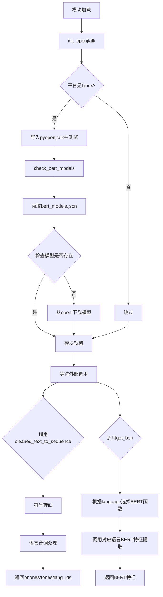
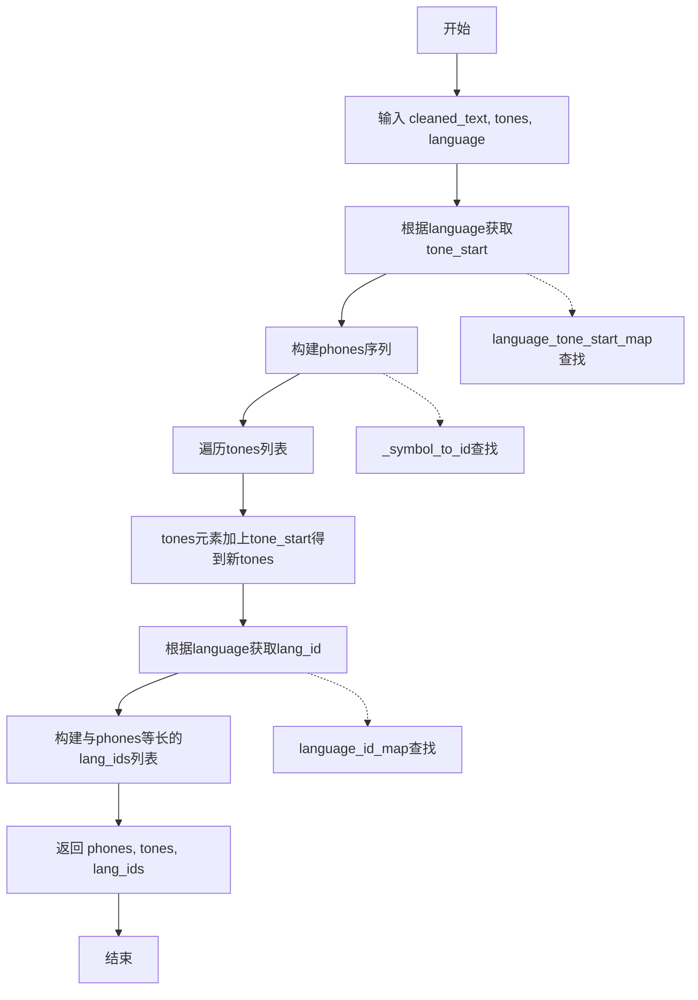
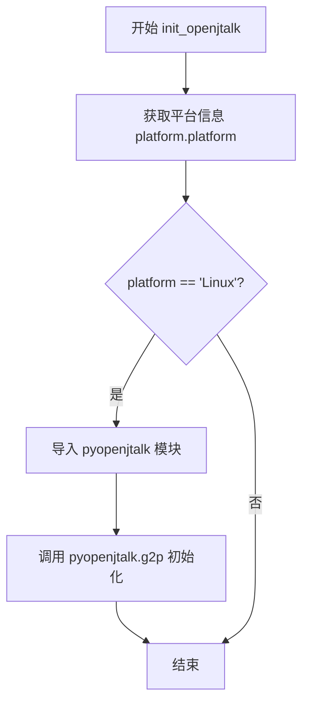

# `Bert-VITS2\oldVersion\V220\text\__init__.py` 详细设计文档

这是一个文本到语音(TTS)预处理模块，负责将文本转换为语音符号序列，并集成多语言BERT特征提取功能，支持中文、英文和日文的文本处理与特征向量化。

## 整体流程



## 类结构

```
模块级
├── _symbol_to_id (全局变量/映射表)
├── cleaned_text_to_sequence (全局函数)
├── get_bert (全局函数)
├── check_bert_models (全局函数)
└── init_openjtalk (全局函数)
```

## 全局变量及字段


### `_symbol_to_id`
    
符号到ID的映射字典，由symbols列表生成

类型：`dict`
    


    

## 全局函数及方法


### `cleaned_text_to_sequence`

将清洗后的文本转换为符号ID序列，同时处理音调偏移和语言标识，输出三个并行序列：音素序列（phones）、调整后的音调序列（tones）和语言ID序列（lang_ids），用于后续的语音合成模型输入。

#### 参数

- `cleaned_text`：`list`，清洗后的文本符号列表，每个元素为文本中的单个符号（如拼音或音素）
- `tones`：`list`，原始音调信息列表，与cleaned_text中的符号一一对应
- `language`：`str`，语言标识符（如"ZH"、"EN"、"JP"），用于确定音调偏移起始值和语言ID

#### 返回值

- `tuple`，包含三个list的元组：
  - `phones`：`list[int]`，符号对应的ID序列
  - `tones`：`list[int]`，调整后的音调序列（加上语言特定的音调起始偏移值）
  - `lang_ids`：`list[int]`，语言ID序列（与phones等长）

#### 流程图



#### 带注释源码

```python
# 符号到ID的映射字典，由symbols列表构建
# symbols从symbols模块导入，包含所有可能的文本符号
_symbol_to_id = {s: i for i, s in enumerate(symbols)}


def cleaned_text_to_sequence(cleaned_text, tones, language):
    """将文本字符串转换为对应符号的ID序列
    
    该函数是文本到语音合成的预处理步骤之一，将人类可读的文本
    转换为模型可处理的数值序列。
    
    Args:
      cleaned_text: 清洗后的文本符号列表，每个元素为文本中的单个符号
      tones: 音调信息列表，与cleaned_text中的符号一一对应
      language: 语言标识符，用于确定音调偏移和语言ID
      
    Returns:
      包含phones, tones, lang_ids的元组
      - phones: 符号对应的ID序列
      - tones: 调整后的音调序列
      - lang_ids: 语言ID序列
    """
    # 第一步：将文本符号转换为ID序列
    # 使用_symbol_to_id字典进行符号到数值的映射
    phones = [_symbol_to_id[symbol] for symbol in cleaned_text]
    
    # 第二步：调整音调序列
    # 不同语言有不同的音调起始值，需要将原始音调加上语言特定的起始偏移
    tone_start = language_tone_start_map[language]
    tones = [i + tone_start for i in tones]
    
    # 第三步：生成语言ID序列
    # 为每个音素分配对应的语言ID，用于多语言合成
    lang_id = language_id_map[language]
    lang_ids = [lang_id for i in phones]
    
    # 返回三个并行序列，长度一致
    return phones, tones, lang_ids
```

#### 关键组件信息

| 组件名称 | 描述 |
|---------|------|
| `_symbol_to_id` | 全局字典，将符号映射到从0开始的整数ID |
| `symbols` | 从`.symbols`模块导入的符号列表，包含所有可能的文本符号 |
| `language_tone_start_map` | 从`.symbols`导入的语言音调起始值映射表 |
| `language_id_map` | 从`.symbols`导入的语言标识到ID的映射表 |

#### 潜在的技术债务或优化空间

1. **缺乏输入验证**：函数未对输入参数进行有效性检查，如`cleaned_text`中包含未知符号、`tones`与`cleaned_text`长度不匹配等情况会导致运行时错误或静默失败

2. **硬编码的语言处理**：目前仅支持预定义的语言类型，若需支持新语言需要修改映射表和函数逻辑

3. **错误处理缺失**：未定义异常处理机制，当`_symbol_to_id`查找不到符号时应返回默认值还是抛出异常语义不明确

4. **性能优化空间**：当前实现使用列表推导式，对于超长文本可考虑生成器或批量处理

5. **重复计算**：`lang_ids`列表推导式中的`for i in phones`仅用于计数，可改用`*`运算符直接复制

#### 其它项目

**设计目标与约束**

- 设计目标：将文本符号转换为模型可处理的数值序列，同时保留音调和语言信息
- 约束条件：输入的`cleaned_text`、`tones`、`lang_ids`三个序列必须保持长度一致

**错误处理与异常设计**

- 当`cleaned_text`中的符号不在`_symbol_to_id`映射中时，会抛出`KeyError`
- 当`language`不在`language_tone_start_map`或`language_id_map`中时，会抛出`KeyError`
- 建议增加默认值处理或自定义异常类以提供更友好的错误信息

**数据流与状态机**

- 该函数位于预处理流水线的中间位置：文本清洗 → `cleaned_text_to_sequence` → 嵌入层 → 声学模型
- 接收清洗后的文本和人工标注的音调信息，输出可直接用于模型推理的数值张量

**外部依赖与接口契约**

- 依赖`.symbols`模块中导出的`symbols`、`language_tone_start_map`、`language_id_map`
- 调用方需保证`tones`列表与`cleaned_text`列表长度一致
- 返回值为固定格式的三元素元组，任何接收方需按顺序解包使用


### `get_bert`

根据传入的语言参数调用对应的BERT模型（中文、英文或日文），将规范化文本转换为BERT特征向量，用于后续的语音合成任务。

参数：

- `norm_text`：`str`，已规范化的文本输入
- `word2ph`：`dict`，词到音素的映射关系，用于确定每个词对应的音素数量
- `language`：`str`，语言标识符，支持 "ZH"（中文）、"EN"（英文）、"JP"（日文）
- `device`：`str` 或 `torch.device`，指定计算设备（如 "cuda" 或 "cpu"）
- `style_text`：`str`，可选，样式文本用于控制合成语音的风格
- `style_weight`：`float`，可选，默认 0.7，样式文本的影响权重

返回值：`Tensor`，BERT模型输出的文本特征向量，通常为形状 `[batch, seq_len, hidden_dim]` 的张量

#### 流程图

```mermaid
flowchart TD
    A[开始 get_bert] --> B[根据 language 参数]
    B --> C{language == "ZH"}
    C -->|是| D[调用 chinese_bert.get_bert_feature]
    C -->|否| E{language == "EN"}
    E -->|是| F[调用 english_bert_mock.get_bert_feature]
    E -->|否| G[调用 japanese_bert.get_bert_feature]
    D --> H[返回 BERT 特征张量]
    F --> H
    G --> H
```

#### 带注释源码

```python
def get_bert(norm_text, word2ph, language, device, style_text=None, style_weight=0.7):
    """
    根据语言调用对应的BERT模型提取文本特征
    
    该函数根据language参数动态导入并调用相应语言的BERT特征提取器，
    支持中文(ZH)、英文(EN)和日文(JP)三种语言的文本特征提取。
    
    参数:
        norm_text: str, 规范化后的文本
        word2ph: dict, 词到音素的映射
        language: str, 语言代码 "ZH", "EN", "JP"
        device: str, 计算设备
        style_text: str, 可选的样式文本
        style_weight: float, 样式权重，默认0.7
    
    返回:
        bert: 对应语言的BERT特征向量
    """
    # 从各语言模块动态导入BERT特征提取函数
    # 中文BERT特征提取器
    from .chinese_bert import get_bert_feature as zh_bert
    # 英文BERT特征提取器（Mock版本）
    from .english_bert_mock import get_bert_feature as en_bert
    # 日文BERT特征提取器
    from .japanese_bert import get_bert_feature as jp_bert

    # 建立语言代码到对应BERT函数的映射字典
    lang_bert_func_map = {"ZH": zh_bert, "EN": en_bert, "JP": jp_bert}
    
    # 根据language参数从映射表中获取对应的BERT函数并调用
    # 传入文本、词到音素映射、设备、样式文本和样式权重
    bert = lang_bert_func_map[language](
        norm_text, word2ph, device, style_text, style_weight
    )
    
    # 返回提取的BERT特征向量
    return bert
```


### `check_bert_models`

该函数负责检查并下载BERT模型文件。它首先检查配置中的镜像源，如果是OpenI镜像则进行登录认证，然后读取bert_models.json配置文件，遍历其中的模型信息，对每个模型调用_check_bert函数进行存在性检查和下载。

参数：无

返回值：无（`None`），该函数仅执行副作用（检查/下载模型文件），不返回任何值。

#### 流程图

```mermaid
flowchart TD
    A[开始 check_bert_models] --> B[导入依赖: json, Path, config, _check_bert]
    B --> C{config.mirror == 'openi'?}
    C -->|是| D[导入 openi 模块]
    D --> E{config.openi_token 存在?}
    E -->|是| F[创建 kwargs = {'token': config.openi_token}]
    E -->|否| G[创建 kwargs = {}]
    F --> H[调用 openi.login kwargs]
    G --> H
    H --> I[打开 ./bert/bert_models.json 文件]
    C -->|否| I
    I --> J[使用 json.load 读取模型配置]
    J --> K[遍历 models.items]
    K --> L[构建 local_path = Path ./bert / k]
    L --> M[调用 _check_bert repo_id, files, local_path]
    M --> N{还有更多模型?}
    N -->|是| L
    N -->|否| O[结束]
```

#### 带注释源码

```python
def check_bert_models():
    """
    检查并下载BERT模型文件。
    
    该函数执行以下操作：
    1. 如果配置中指定了OpenI镜像源，则进行登录认证
    2. 读取bert_models.json配置文件获取模型列表
    3. 遍历每个模型，调用_check_bert检查本地是否存在，
       如不存在则从远程仓库下载
    """
    # 导入所需的模块
    import json
    from pathlib import Path

    # 导入项目配置和BERT工具函数
    from config import config
    from .bert_utils import _check_bert

    # 检查是否配置了OpenI镜像源
    # 如果是，则需要进行登录认证才能下载模型
    if config.mirror.lower() == "openi":
        import openi

        # 如果配置中提供了token，则使用token登录
        # 否则使用匿名登录
        kwargs = {"token": config.openi_token} if config.openi_token else {}
        openi.login(**kwargs)

    # 打开BERT模型配置文件
    # 该JSON文件包含所有需要检查的模型信息
    with open("./bert/bert_models.json", "r") as fp:
        models = json.load(fp)
        # 遍历配置文件中的每个模型条目
        # k: 模型名称, v: 包含repo_id和files的字典
        for k, v in models.items():
            # 构建模型文件的本地存储路径
            local_path = Path("./bert").joinpath(k)
            # 调用_check_bert函数检查模型是否已存在
            # 如果不存在，则从v["repo_id"]指定的仓库下载v["files"]中的文件
            # 到local_path指定的本地目录
            _check_bert(v["repo_id"], v["files"], local_path)
```


### `init_openjtalk`

该函数用于初始化OpenJTalk日语语音合成系统，仅在Linux平台上执行，通过调用pyopenjtalk的g2p方法完成初始化操作。

参数： 无

返回值：`None`，无返回值

#### 流程图



#### 带注释源码

```python
def init_openjtalk():
    """初始化OpenJTalk日语语音合成系统。
    
    仅在Linux平台上执行，用于加载和初始化日语语音合成引擎。
    该函数会在模块导入时自动执行，确保OpenJTalk在需要时已准备就绪。
    """
    import platform  # 导入platform模块用于检测操作系统平台

    # 检查当前是否为Linux系统
    if platform.platform() == "Linux":
        # Linux平台：导入pyopenjtalk模块进行日语语音合成
        import pyopenjtalk
        
        # 调用g2p (grapheme-to-phoneme) 函数进行初始化测试
        # 传入日文测试文本"こんにちは，世界。"（你好，世界。）
        pyopenjtalk.g2p("こんにちは，世界。")
    # 非Linux平台：不执行任何操作，OpenJTalk暂不支持


# 模块加载时立即执行初始化函数
init_openjtalk()
```

## 关键组件


### 符号映射系统（Symbol Mapping System）

将文本符号转换为数值的核心映射机制，通过_symbol_to_id字典建立symbols与ID的一一对应关系，为后续语音合成提供基础符号索引。

### 文本到序列转换器（Text to Sequence Converter）

负责将清理后的文本转换为符号ID序列，同时处理音调（tones）和语言ID的映射。该函数是文本前端处理的关键环节，确保文本信息准确转换为模型可处理的数值序列。

### 多语言BERT特征提取器（Multi-language BERT Feature Extractor）

动态加载并调用对应语言的BERT特征提取函数，支持中文（ZH）、英文（EN）和日文（JP）三种语言的语义特征提取，并支持风格文本（style_text）和风格权重（style_weight）调节。

### BERT模型管理器（BERT Model Manager）

检查本地BERT模型是否存在，如缺失则从OpenI镜像站或HuggingFace下载对应模型。实现了模型的自动检漏和按需下载功能。

### 日语G2P初始化器（Japanese G2P Initializer）

初始化OpenJTalk引擎，用于日语文本到音素的转换（grapheme-to-phoneme）。根据平台判断仅在Linux环境加载pyopenjtalk模块。

### 语言配置映射（Language Configuration Mapping）

通过language_tone_start_map和language_id_map建立语言与音调起始值、语言ID的映射关系，支持多语言场景下的参数配置。


## 问题及建议


### 已知问题

-   **模块级副作用**：在模块导入时执行`init_openjtalk()`和`check_bert_models()`，导致导入时的性能开销和潜在的初始化失败风险，影响模块的可测试性和延迟加载
-   **硬编码路径**：使用硬编码路径`"./bert/bert_models.json"`和`"./bert"`，缺乏灵活性和可配置性，不支持自定义模型目录
-   **错误处理不足**：`cleaned_text_to_sequence`中对无效符号没有错误处理或容错机制，可能导致KeyError异常；`check_bert_models`中文件读取和模型检查缺少异常捕获
-   **语言支持硬编码**：仅支持"ZH"、"EN"、"JP"三种语言，`lang_bert_func_map`和相关的tone/language映射都是硬编码，扩展性差
-   **全局变量缺乏封装**：`_symbol_to_id`作为模块级全局变量，没有提供访问控制或初始化检查
-   **导入语句在函数内部**：`get_bert`函数内部进行条件导入，虽实现延迟加载但影响代码可读性和IDE静态分析
-   **魔法数值**：`tone_start`、`lang_id`等数值计算逻辑缺乏清晰的常量定义和注释
-   **日志缺失**：整个模块没有任何日志输出，无法追踪执行过程和调试问题

### 优化建议

-   将`init_openjtalk()`和`check_bert_models()`调用改为显式初始化函数，由调用方在应用启动时主动触发
-   通过配置参数或环境变量传入模型路径，支持多模型目录和运行时配置
-   为`cleaned_text_to_sequence`添加符号验证和错误处理，对未知符号返回默认值或抛出明确异常
-   使用枚举或配置类管理语言类型，将语言映射关系外部化到配置文件
-   使用类或单例模式封装全局变量，提供初始化检查和线程安全的访问接口
-   将函数内导入移至模块顶部，区分必需导入和可选导入（可选导入可使用`importlib`动态加载）
-   添加Python标准日志模块`logging`支持，提供不同级别的日志输出
-   考虑将`check_bert_models`拆分为模型检查和模型下载两个独立函数，提高函数单一职责性

## 其它


### 设计目标与约束

该模块主要服务于文本转语音（TT5）系统，负责将文本转换为语音合成所需的符号ID序列，并获取对应的BERT语言特征。设计目标是支持多语言（中文、英文、日文）的文本处理，并确保BERT模型的正确加载。约束条件包括：依赖特定目录结构（./bert）、需要config模块提供配置信息、支持Python 3.x平台。

### 错误处理与异常设计

模块在以下场景进行异常处理：1）JSON文件读取失败时抛出FileNotFoundError；2）BERT模型检查失败时调用_check_bert函数处理；3）语言不支持时会在lang_bert_func_map查找时抛出KeyError；4）平台非Linux时init_openjtalk不执行任何操作。建议增加语言参数校验、文件路径校验、模型下载失败的重试机制。

### 数据流与状态机

数据流如下：输入文本→符号映射（symbols）→ID序列→语言调值映射→调值序列→语言ID映射→最终输出（phones, tones, lang_ids）。BERT特征获取流程：norm_text+word2ph→语言检测→对应语言BERT函数→BERT特征输出。模块无复杂状态机，主要为顺序执行流程。

### 外部依赖与接口契约

外部依赖包括：1）symbols模块（符号定义）；2）config模块（配置管理）；3）bert_utils模块（模型检查）；4）chinese_bert/english_bert_mock/japanese_bert模块（多语言BERT）；5）pyopenjtalk（日语分词）；6）openi库（模型下载）。接口契约：cleaned_text_to_sequence接收清洗文本、语调数组、语言标识，返回三个列表；get_bert接收规范化文本、词音素映射、语言、设备等参数，返回BERT特征张量。

### 配置与常量定义

关键常量包括：_symbol_to_id字典（符号到ID的映射）、language_tone_start_map（各语言语调起始值）、language_id_map（语言ID映射）。配置依赖config.mirror和config.openi_token，用于决定模型下载源。建议将硬编码路径"./bert"和"./bert/bert_models.json"提取为配置项。

### 性能考虑与优化空间

性能优化点：1）_symbol_to_id在模块加载时创建一次，避免重复计算；2）check_bert_models中的JSON读取可缓存；3）get_bert根据语言动态导入模块，建议改为预导入或延迟加载后缓存；4）init_openjtalk在模块导入时执行，可能影响导入速度，建议改为懒加载。可考虑使用functools.lru_cache缓存BERT特征结果。

### 安全考虑

安全风险点：1）文件路径"./bert"使用相对路径，可能存在路径遍历风险，建议使用绝对路径或Path对象的安全方法；2）config.openi_token作为敏感信息明文传递，建议使用环境变量或密钥管理系统；3）JSON文件读取未做内容校验，建议增加schema验证。

### 测试策略

建议测试覆盖：1）cleaned_text_to_sequence的边界情况（空列表、未知符号）；2）get_bert对不支持语言的处理；3）check_bert_models的模型不存在场景；4）init_openjtalk在非Linux平台的行为；5）各语言BERT函数的输出维度一致性。测试数据应包含中英日三语样本。

### 版本兼容性

模块依赖Python 3.x语法（类型注解、字典推导式）。平台兼容性：init_openjtalk仅支持Linux。外部库版本要求：pyopenjtalk（Linux平台）、json（标准库）、pathlib（标准库）。建议在requirements.txt中明确标注依赖版本范围。

### 部署注意事项

部署时需确保：1）./bert目录存在且有写权限；2）bert_models.json文件存在且格式正确；3）config模块正确配置；4）Linux环境下pyopenjtalk已安装；5）网络连接正常（首次部署需下载BERT模型）。建议使用虚拟环境隔离依赖，并设置环境变量控制模型下载行为。

    