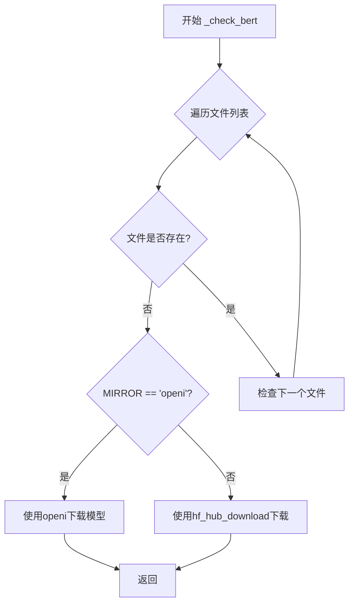
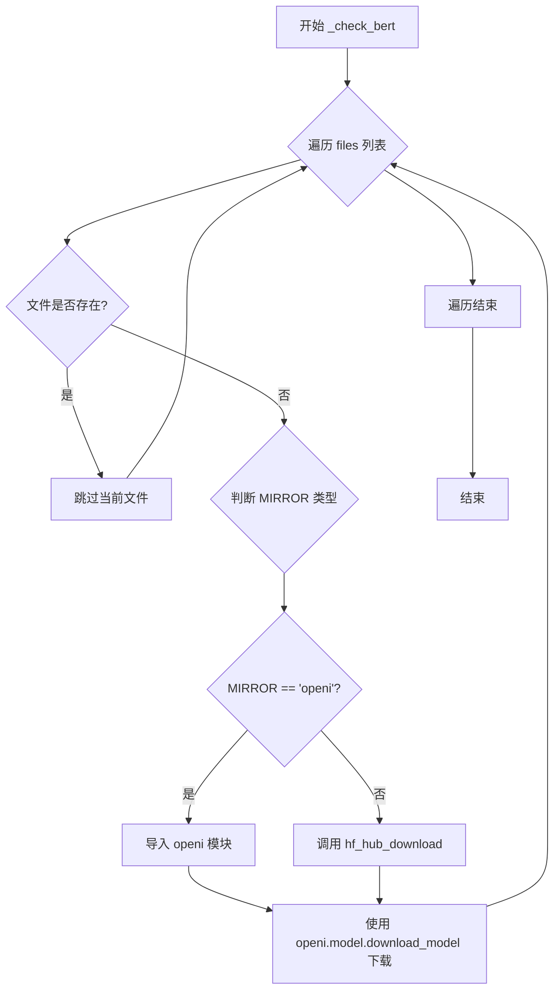

# `Bert-VITS2\oldVersion\V220\text\bert_utils.py` 详细设计文档

该代码实现了一个BERT模型检查和下载功能，支持从HuggingFace Hub或OpenI镜像站下载模型文件，确保本地路径下包含所需的BERT模型文件。

## 整体流程



## 类结构

```
无类层次结构（仅包含全局函数）
```

## 全局变量及字段


### `MIRROR`
    
全局配置变量，存储当前使用的模型下载镜像源

类型：`str`
    


    

## 全局函数及方法


### `_check_bert`

检查并下载BERT模型文件的主函数，遍历指定文件列表，若文件不存在则根据配置的镜像源选择对应的下载方式（OpenI镜像或Hugging Face Hub）进行模型文件下载。

参数：

- `repo_id`：`str`，Hugging Face模型仓库ID，格式如"username/model-name"
- `files`：`list[str]`，需要检查的模型文件名称列表
- `local_path`：`str`，本地存储路径，用于存放下载的模型文件

返回值：`None`，该函数无返回值，仅执行文件检查和下载操作

#### 流程图



#### 带注释源码

```
from pathlib import Path

# 导入Hugging Face Hub下载工具
from huggingface_hub import hf_hub_download

# 导入配置模块，获取全局配置
from config import config

# 全局变量：从配置中读取模型下载镜像源
MIRROR: str = config.mirror


def _check_bert(repo_id, files, local_path):
    """
    检查并下载BERT模型文件
    
    参数:
        repo_id: Hugging Face仓库ID
        files: 需要检查的文件列表
        local_path: 本地存储路径
    """
    # 遍历需要检查的每个文件
    for file in files:
        # 拼接完整文件路径并检查文件是否存在
        if not Path(local_path).joinpath(file).exists():
            # 根据MIRROR配置选择下载方式
            if MIRROR.lower() == "openi":
                # 使用OpenI镜像站下载（国内加速）
                import openi
                
                openi.model.download_model(
                    "Stardust_minus/Bert-VITS2",  # OpenI模型路径
                    repo_id.split("/")[-1],       # 提取模型名称
                    "./bert"                      # 下载保存目录
                )
            else:
                # 使用Hugging Face Hub官方下载
                hf_hub_download(
                    repo_id,                      # 模型仓库ID
                    file,                         # 要下载的文件名
                    local_dir=local_path,         # 本地保存目录
                    local_dir_use_symlinks=False  # 禁用符号链接，直接下载文件
                )
```

## 关键组件


### MIRROR 全局变量

配置镜像源，用于决定从HuggingFace Hub还是OpenI镜像下载模型文件

### _check_bert 函数

检查本地路径是否存在指定的BERT模型文件，如果文件缺失则根据MIRROR配置选择从HuggingFace Hub或OpenI镜像下载相应的模型文件

### hf_hub_download

HuggingFace Hub官方下载函数，当MIRROR不是openi时使用，用于从HuggingFace Hub下载指定的模型文件到本地目录

### openi.model.download_model

OpenI镜像模型的下载接口，当MIRROR为openi时调用，用于从OpenI平台下载Stardust_minus/Bert-VITS2模型

### 文件检查逻辑

通过Path.joinpath().exists()检查本地文件是否存在，作为触发下载的前提条件


## 问题及建议


### 已知问题

-   **异常处理缺失**：函数没有 try-except 包装，网络异常、磁盘空间不足、权限问题等都会导致程序直接崩溃
-   **硬编码问题严重**：`"Stardust_minus/Bert-VITS2"` 模型名和 `"./bert"` 下载路径直接写在代码中，降低了复用性
-   **类型注解完全缺失**：参数和返回值都没有类型提示，影响代码可维护性和 IDE 辅助
-   **函数命名与职责不符**：函数名 `_check_bert` 暗示仅做检查，但实际包含下载逻辑，职责不单一
-   **条件判断逻辑脆弱**：仅通过 `MIRROR.lower() == "openi"` 判断，非 openi 时假设走 HuggingFace，但未处理其他镜像或配置错误的情况
-   **文件完整性无校验**：仅检查文件是否存在，未验证文件大小或哈希值，可能导致下载不完整但被误判为成功
-   **模块级导入副作用**：`import openi` 放在函数内部而非顶部，异常时不会暴露问题，且每次调用都会执行导入检查
-   **无重试机制**：下载可能因网络波动失败，缺少重试逻辑

### 优化建议

-   为函数添加完整的类型注解（参数类型、返回值类型）
-   将硬编码的模型名和路径提取为函数参数或配置项
-   添加 try-except 包裹下载逻辑，捕获网络异常、IO 异常等，并提供有意义的错误信息
-   考虑添加可选的 SHA256 校验或在下载后验证文件大小
-   重命名函数为 `_ensure_bert_files` 或类似名称，准确反映其检查并下载的职责
-   将 `import openi` 移至模块顶部，或使用延迟导入并处理导入失败的情况
-   增加重试机制（如使用 tenacity 库），并支持通过配置自定义重试次数
-   添加日志记录，便于排查问题（当前完全没有日志输出）
-   考虑将镜像判断逻辑抽象为策略模式或配置驱动，提高扩展性


## 其它


### 设计目标与约束

本模块用于自动检查并下载BERT模型文件，确保本地存在模型运行所需的BERT权重文件。支持从HuggingFace Hub或OpenI镜像站下载，需确保网络连通性和磁盘写入权限。

### 错误处理与异常设计

- 文件不存在时触发下载逻辑
- 网络异常由hf_hub_download或openi.model.download_model内部抛出
- 建议调用方捕获网络超时和磁盘空间不足异常
- MIRROR配置无效时默认回退到HuggingFace Hub

### 外部依赖与接口契约

- 依赖huggingface_hub库的hf_hub_download函数
- 依赖openi库（仅MIRROR为openi时导入）
- 依赖config模块的config.mirror配置项
- repo_id格式需为"namespace/model_name"，如"bert-base-chinese"
- files为文件名列表，如["pytorch_model.bin","config.json"]

### 配置说明

MIRROR全局变量从config模块读取，支持"huggingface"或"openi"等值，区分大小写但比较时转为小写。

### 使用示例

```python
# 检查并下载BERT模型
_check_bert(
    repo_id="bert-base-chinese",
    files=["pytorch_model.bin","config.json","vocab.txt"],
    local_path="./bert"
)
```

    