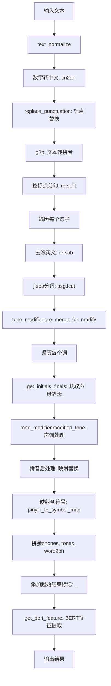
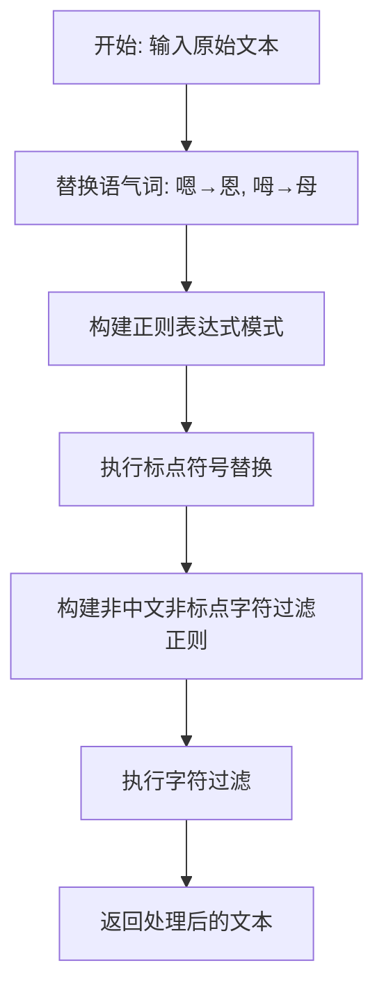
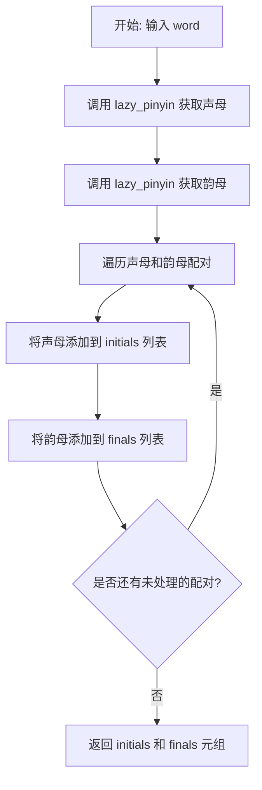
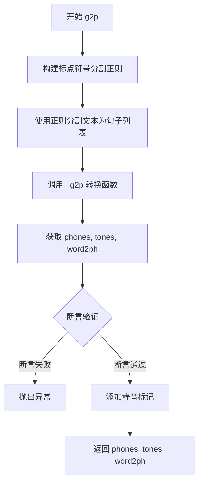
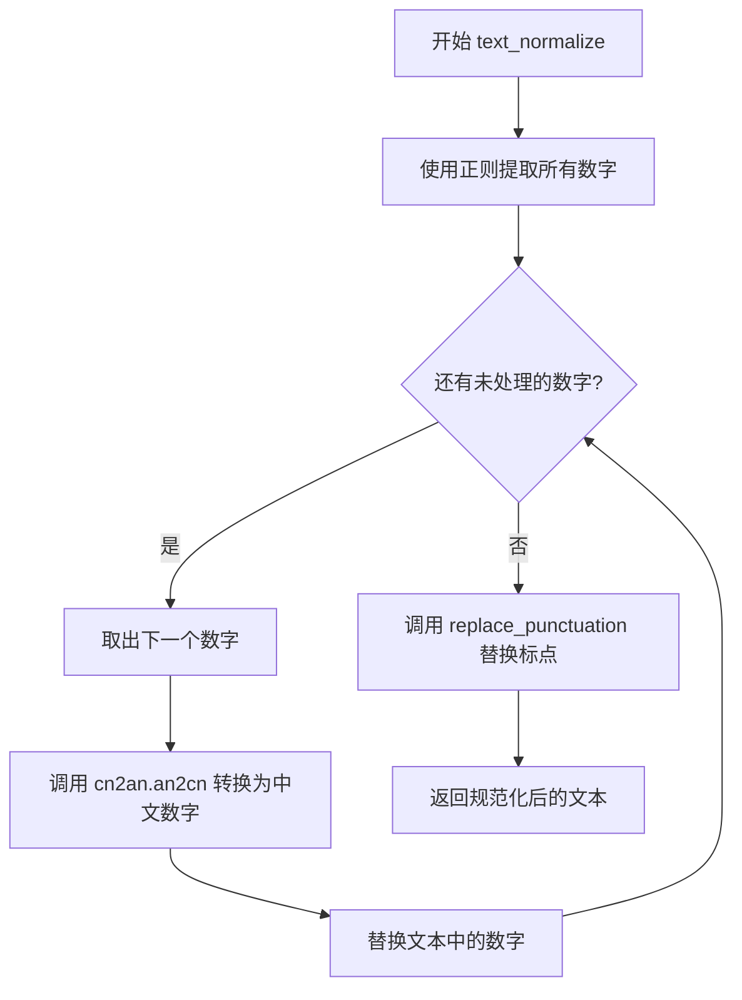
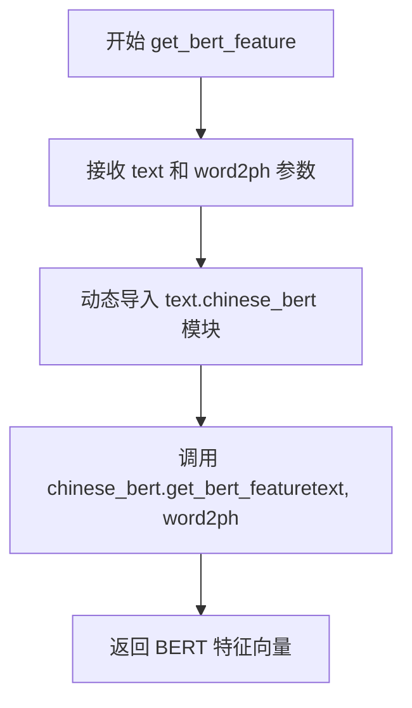
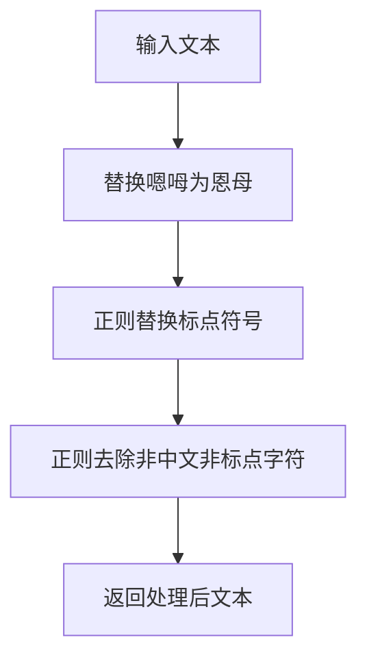
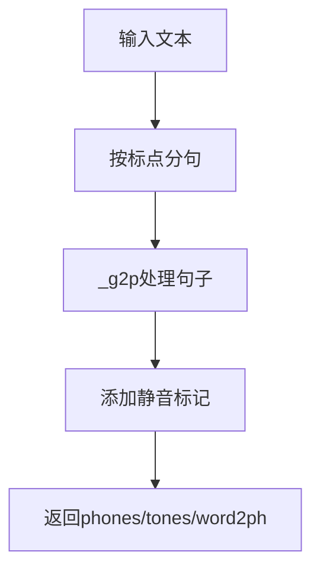
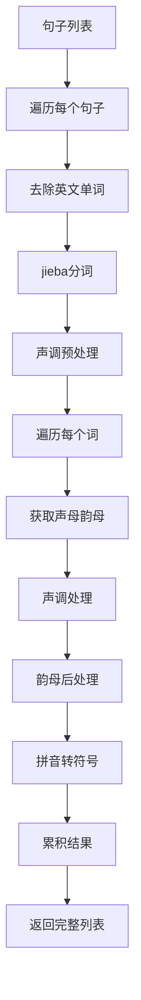

```mermaid
flowchart TD
    A[开始 g2p] --> B[按标点符号分割文本]
    B --> C[调用 _g2p 处理分段]
    C --> D[验证: sum&#40;word2ph&#41; == len&#40;phones&#41;]
    D --> E[验证: len&#40;word2ph&#41; == len&#40;text&#41;]
    E --> F[添加静音标记和首尾填充]
    F --> G[返回 phones, tones, word2ph]
    
    subgraph _g2p内部处理
    C --> C1[遍历每个句子分段]
    C1 --> C2[移除英文单词]
    C2 --> C3[使用 jieba 分词]
    C3 --> C4[预处理合并 &#91; ToneSandhi&#93;]
    C4 --> C5[遍历每个词语]
    C5 --> C6[获取声母和韵母]
    C6 --> C7[修改声调 &#91; ToneSandhi&#93;]
    C7 --> C8[后处理拼音映射]
    C8 --> C9[转换为音素符号]
    C9 --> C10[构建 word2ph 映射]
    end
```

# `Bert-VITS2\oldVersion\V220\text\chinese.py` 详细设计文档

这是一个中文文本转拼音系统，将输入的中文文本规范化后转换为拼音序列（phones）、声调（tones）、字音对应关系（word2ph）以及BERT特征（bert），用于文本转语音（TTS）系统。

## 整体流程



## 类结构

```
无类层次结构（本文件未定义类，使用了外部ToneSandhi类）
```

## 全局变量及字段


### `current_file_path`
    
当前文件的目录路径

类型：`str`
    


### `pinyin_to_symbol_map`
    
拼音到符号的映射字典，用于将拼音转换为对应的音素符号

类型：`dict`
    


### `rep_map`
    
标点符号映射字典，用于将各种标点符号统一替换为标准符号

类型：`dict`
    


### `tone_modifier`
    
ToneSandhi类实例，用于处理中文声调变化

类型：`ToneSandhi`
    


    

## 全局函数及方法


### `replace_punctuation`

该函数是文本预处理模块的核心组成部分，主要用于规范化文本中的标点符号并过滤非目标字符。它首先将语气词转换为标准写法，然后通过预定义的映射表替换各类标点符号为统一格式，最后利用正则表达式删除所有非中文且非标点符号的字符，确保后续拼音转换处理的输入数据清洁一致。

参数：

- `text`：`str`，需要处理的原始文本输入

返回值：`str`，完成标点符号替换和非目标字符过滤后的文本

#### 流程图



#### 带注释源码

```python
def replace_punctuation(text):
    """
    标点符号替换与非目标字符过滤函数
    
    处理流程：
    1. 将语气词嗯、呣转换为标准写法恩、母
    2. 将各类中文标点符号统一映射为英文或统一符号
    3. 移除所有非中文且非标点符号的字符（英文、数字、特殊符号等）
    
    参数:
        text (str): 输入的原始文本
        
    返回:
        str: 规范化处理后的文本
    """
    # 第一步：语气词标准化
    # 将"嗯"替换为"恩"，"呣"替换为"母"
    text = text.replace("嗯", "恩").replace("呣", "母")
    
    # 第二步：构建标点符号替换的正则表达式模式
    # 使用re.escape转义特殊字符，使用|连接所有需要替换的标点
    pattern = re.compile("|".join(re.escape(p) for p in rep_map.keys()))
    
    # 执行标点符号替换，将各类中文标点统一转换为英文标点
    # rep_map定义了从中文标点（如：，、。）到英文标点的映射关系
    replaced_text = pattern.sub(lambda x: rep_map[x.group()], text)
    
    # 第三步：构建非目标字符过滤正则
    # 保留中文汉字(\u4e00-\u9fa5)和预定义的标点符号(punctuation)
    # 移除其他所有字符：英文、数字、空格、特殊符号等
    replaced_text = re.sub(
        r"[^\u4e00-\u9fa5" + "".join(punctuation) + r"]+", "", replaced_text
    )
    
    # 返回处理后的文本，仅保留中文和标点符号
    return replaced_text
```

---

#### 关键组件信息

| 组件名称 | 一句话描述 |
|---------|-----------|
| `rep_map` | 标点符号映射字典，将各类中文标点统一转换为英文或统一格式 |
| `punctuation` | 从 symbols 模块导入的标点符号列表，定义需保留的合法标点范围 |
| `pattern` | 编译后的正则表达式对象，用于快速匹配并替换标点符号 |

#### 潜在的技术债务或优化空间

1. **文件读取优化**：`pinyin_to_symbol_map` 在模块加载时直接读取文件并解析，建议使用延迟加载或缓存机制，避免程序启动时不必要的 I/O 操作
2. **正则表达式编译**：每次调用 `replace_punctuation` 都会重新编译正则表达式，建议将 `pattern` 和过滤正则表达式提升为模块级变量预编译
3. **硬编码映射**：语气词替换（嗯、呣）硬编码在函数中，建议抽取为配置项以提高扩展性
4. **异常处理缺失**：未对输入类型进行校验，若传入非字符串类型会导致运行时错误

#### 其它项目

- **设计目标**：为中文文本转拼音（g2p）模块提供规范化的输入数据，确保后续处理的一致性
- **约束条件**：仅保留中文汉字和预定义的标点符号，过滤所有英文、数字及特殊字符
- **错误处理**：当前实现无显式错误处理，需依赖调用方保证输入类型正确
- **数据流**：text → replace_punctuation → text_normalize → g2p，是文本处理流水线的第一道清洗工序


### `g2p`

将输入的中文文本转换为音素（phones）、声调（tones）以及字到音素的映射（word2ph），是文本转语音（TTS）系统的核心前置模块。

参数：

- `text`：`str`，需要转换的中文文本

返回值：`Tuple[List[str], List[int], List[int]]`，返回三个元素的元组：
  - `phones`：音素列表（字符串列表），如 `["_", "a", "b", "_"]`
  - `tones`：声调列表（整数列表），如 `[0, 1, 2, 0]`
  - `word2ph`：字到音素的映射（整数列表），表示每个汉字对应的音素数量

#### 流程图



#### 带注释源码

```python
def g2p(text):
    """
    将中文文本转换为音素序列、声调和字到音素的映射
    
    Args:
        text: 输入的中文文本字符串
        
    Returns:
        tuple: (phones, tones, word2ph)
            - phones: 音素列表，首尾添加静音标记"_"
            - tones: 声调列表，首尾添加0
            - word2ph: 每个汉字对应的音素数量映射，首尾添加1
    """
    # 1. 构建标点符号分割正则表达式
    # 使用前瞻断言 (?<=...) 匹配标点符号后的零个或多个空格
    pattern = r"(?<=[{0}])\s*".format("".join(punctuation))
    
    # 2. 按标点符号分割文本，去除空字符串
    # 例如: "你好，世界！" -> ["你好", "世界"]
    sentences = [i for i in re.split(pattern, text) if i.strip() != ""]
    
    # 3. 调用内部函数 _g2p 进行核心转换
    phones, tones, word2ph = _g2p(sentences)
    
    # 4. 验证转换结果的正确性
    # word2ph 的总和应该等于 phones 的长度
    assert sum(word2ph) == len(phones)
    # word2ph 的长度应该等于原始文本的长度
    # 注意：有时会崩溃，可以添加 try-catch 处理
    assert len(word2ph) == len(text)
    
    # 5. 添加静音标记和填充
    # 在序列首尾添加静音标记"_"，用于语音合成时的自然停顿
    phones = ["_"] + phones + ["_"]
    # 声调首尾添加0，表示静音/填充部分的声调
    tones = [0] + tones + [0]
    # word2ph 首尾添加1，保持映射一致性
    word2ph = [1] + word2ph + [1]
    
    # 6. 返回转换结果
    return phones, tones, word2ph
```


### `_get_initials_finals`

该函数是中文文本转拼音处理流程中的核心组件，负责将单个汉字或词语分离为声母（initials）和韵母（finals）两部分。它利用 pypinyin 库分别提取声母风格和带声调韵母风格的拼音表示，然后通过 zip 函数将两者组合成对应的声母和韵母列表返回。

参数：

- `word`：`str`，待处理的中文词语或单个汉字

返回值：`Tuple[List[str], List[str]]`，返回一个包含两个列表的元组——第一个列表为声母列表，第二个列表为韵母列表

#### 流程图



#### 带注释源码

```python
def _get_initials_finals(word):
    """
    将中文词语分解为声母和韵母列表
    
    参数:
        word: str - 待处理的中文词语或单个汉字
    
    返回:
        Tuple[List[str], List[str]] - 包含声母列表和韵母列表的元组
    """
    initials = []  # 用于存储提取的声母
    finals = []    # 用于存储提取的韵母
    
    # 使用 pypinyin 的 Style.INITIALS 风格提取声母
    # neutral_tone_with_fone=True 表示将轻声设为 5
    orig_initials = lazy_pinyin(word, neutral_tone_with_five=True, style=Style.INITIALS)
    
    # 使用 pypinyin 的 Style.FINALS_TONE3 风格提取带声调标记的韵母
    # 返回如 "a1", "ang2" 等带声调数字的韵母
    orig_finals = lazy_pinyin(
        word, neutral_tone_with_five=True, style=Style.FINALS_TONE3
    )
    
    # 将声母和韵母按字符位置一一对应配对
    for c, v in zip(orig_initials, orig_finals):
        initials.append(c)  # 添加声母到列表
        finals.append(v)    # 添加韵母到列表
    
    return initials, finals  # 返回声母和韵母的元组
```


### `g2p`

该函数是文本转拼音（Grapheme-to-Phoneme）的核心入口函数，负责将输入的中文文本转换为对应的音素序列、声调和字符到音素的映射关系。函数首先使用标点符号对文本进行句子分割，然后调用内部函数 `_g2p` 进行实际的拼音转换，最后对结果进行填充（添加静音标记）以适配语音合成模型的需求。

参数：

- `text`：`str`，待转换的中文文本输入

返回值：`tuple`，包含三个元素：
  - `phones`：`list[str]`，音素列表，首尾添加了静音标记"_"
  - `tones`：`list[int]`，声调列表，首尾添加了0（静音调）
  - `word2ph`：`list[int]`，字符到音素的映射关系，首尾添加了1

#### 流程图



#### 带注释源码

```python
def g2p(text):
    """
    文本转拼音的主入口函数
    
    处理流程：
    1. 使用标点符号作为分隔符分割文本
    2. 调用内部函数 _g2p 进行实际的拼音转换
    3. 添加静音标记（_）到音素序列的首尾
    4. 对声调和映射关系做相应调整
    """
    # 构建正则表达式，使用标点符号作为句子分隔符
    # 例如：在每个标点符号前分割，但不包含标点本身
    pattern = r"(?<=[{0}])\s*".format("".join(punctuation))
    
    # 使用正则分割文本，去除空字符串
    # re.split 会保留分隔符，这里使用前瞻断言所以不包含标点
    sentences = [i for i in re.split(pattern, text) if i.strip() != ""]
    
    # 调用核心转换函数 _g2p 处理句子列表
    # 返回：音素列表、声调列表、字符到音素映射
    phones, tones, word2ph = _g2p(sentences)
    
    # 断言验证：确保映射关系正确
    # word2ph 总和应等于音素总数（每个字符对应的音素数量之和）
    assert sum(word2ph) == len(phones)
    
    # 断言验证：映射长度应等于原始文本长度
    # 注意：这里可能因为文本处理导致长度不匹配
    assert len(word2ph) == len(text)
    
    # 添加静音标记（_）到音素序列首尾
    # 用于语音合成时的静音段
    phones = ["_"] + phones + ["_"]
    
    # 静音调用0表示
    tones = [0] + tones + [0]
    
    # 映射关系首尾各加1（对应静音段）
    word2ph = [1] + word2ph + [1]
    
    # 返回转换结果
    return phones, tones, word2ph
```


### `text_normalize`

该函数用于将文本中的阿拉伯数字转换为中文数字，并统一标点符号格式，完成文本的规范化处理。

参数：

- `text`：`str`，需要规范化的原始文本

返回值：`str`，规范化处理后的文本

#### 流程图



#### 带注释源码

```python
def text_normalize(text):
    """
    文本规范化函数
    
    处理流程：
    1. 将阿拉伯数字转换为中文数字
    2. 统一标点符号格式
    """
    # 使用正则表达式匹配整数或小数形式的数字
    # \d+ 匹配一个或多个数字
    # (?:\.?\d+)? 非捕获组，可选的小数部分
    numbers = re.findall(r"\d+(?:\.?\d+)?", text)
    
    # 遍历找到的每个数字进行转换
    for number in numbers:
        # 将阿拉伯数字转换为中文数字
        # an2cn: Arabic Numeral to Chinese Numeral
        # replace 使用 count=1 每次只替换第一个匹配项
        text = text.replace(number, cn2an.an2cn(number), 1)
    
    # 调用 replace_punctuation 函数进行标点符号替换
    # 统一各种标点为标准形式
    text = replace_punctuation(text)
    
    # 返回规范化后的文本
    return text
```


### `get_bert_feature`

该函数是一个文本特征提取的包装器方法，通过调用 `chinese_bert` 模块将输入文本转换为 BERT 特征向量，用于后续的语音合成任务。

参数：

- `text`：`str`，原始输入文本，需要进行 BERT 特征提取的文本内容
- `word2ph`：`list[int]` 或类似结构，字到音素的映射数组，用于对齐文本字符与音素序列的长度

返回值：类型取决于 `chinese_bert.get_bert_feature` 的具体实现（通常为 `torch.Tensor` 或 `numpy.ndarray`），返回文本的 BERT 特征表示

#### 流程图



#### 带注释源码

```python
def get_bert_feature(text, word2ph):
    """
    获取输入文本的 BERT 特征表示
    
    该函数是一个包装器，委托给 text 模块中的 chinese_bert 对象执行实际的特征提取。
    主要用于语音合成任务中，将文本转换为神经网络可处理的特征向量。
    
    参数:
        text (str): 输入的中文文本字符串
        word2ph (list[int] 或类似): 字到音素的映射列表，长度应与文本字符数一致，
                                    用于指定每个字符对应的音素数量（帮助特征对齐）
    
    返回:
        任意: 返回 BERT 模型的隐藏状态特征，类型取决于 chinese_bert.get_bert_feature 的实现
              通常为 PyTorch Tensor 或 NumPy 数组，形状通常为 [seq_len, hidden_dim]
    """
    # 动态导入 chinese_bert 模块，避免顶层导入带来的循环依赖问题
    # 这种延迟导入模式在大型项目中常见，可提升模块加载速度
    from text import chinese_bert

    # 调用 chinese_bert 模块中的 get_bert_feature 方法
    # 传递原始文本和字音映射，由下游模块负责实际的 BERT 编码
    return chinese_bert.get_bert_feature(text, word2ph)
```

---

**补充说明**：

1. **设计模式**：该函数采用了**代理模式（Proxy Pattern）** 或**适配器模式**，本身不包含实际业务逻辑，仅负责模块导入和方法转发。

2. **依赖外部模块**：函数依赖 `text.chinese_bert` 模块中的 `get_bert_feature` 函数，该模块通常封装了预训练 BERT 模型（如中文 BERT）的推理逻辑。

3. **潜在优化点**：
   - 缺少对输入参数的有效性校验（如 `text` 是否为空、`word2ph` 长度是否匹配）
   - 动态导入在每次调用时都会执行，建议在模块级别缓存导入或使用函数级缓存
   - 未提供错误处理机制，如果 `chinese_bert` 模块导入失败或方法不存在，会抛出运行时异常

## 关键组件


# 中文文本转音素系统设计文档

## 一段话描述

该代码是一个中文文本到音素（Text-to-Phoneme）的转换系统，核心功能是将中文文本经过规范化处理后转换为语音合成所需的音素序列、基频（声调）以及词到音素的映射关系，主要应用于文本转语音（TTS）前处理流程。

## 文件整体运行流程

```
输入文本 
    ↓
[text_normalize] 数字转中文、标点符号规范化
    ↓
[replace_punctuation] 标点符号替换与清洗
    ↓
[g2p] 文本分句
    ↓
[_g2p] 循环处理每个句子
    ↓
[jieba分词] + [声调处理] + [拼音转换]
    ↓
[拼音到符号映射] + [韵母声母后处理]
    ↓
输出: phones, tones, word2ph
```

## 类详细信息

### ToneSandhi 类

#### 字段
无公开字段声明（从tone_sandhi模块导入）

#### 方法
由于ToneSandhi类为外部导入，其具体方法需参考tone_sandhi模块源码。根据代码调用推断，主要包含：
- `pre_merge_for_modify(seg_cut)`: 预处理分词结果，进行声调合并修改
- `modified_tone(word, pos, sub_finals)`: 根据词性和词语修改声调

## 全局变量详细信息

### pinyin_to_symbol_map

- **名称**: pinyin_to_symbol_map
- **类型**: dict
- **描述**: 拼音到音素符号的映射字典，从opencpop-strict.txt文件加载，用于将拼音转换为CSM符号

### rep_map

- **名称**: rep_map
- **类型**: dict
- **描述**: 标点符号替换映射表，将各种中文标点统一转换为英文标点

### punctuation

- **名称**: punctuation
- **类型**: list
- **描述**: 从symbols模块导入的标点符号列表，用于分句和文本清洗

### tone_modifier

- **名称**: tone_modifier
- **类型**: ToneSandhi
- **描述**: 声调处理对象，用于处理中文连读变调

### current_file_path

- **名称**: current_file_path
- **类型**: str
- **描述**: 当前文件所在目录路径，用于构建资源文件路径

## 函数详细信息

### replace_punctuation(text)

- **参数名称**: text
- **参数类型**: str
- **参数描述**: 待处理的原始文本
- **返回值类型**: str
- **返回值描述**: 规范化后的文本，保留中文和标点符号
- **流程图**:

- **源码**:
```python
def replace_punctuation(text):
    text = text.replace("嗯", "恩").replace("呣", "母")
    pattern = re.compile("|".join(re.escape(p) for p in rep_map.keys()))

    replaced_text = pattern.sub(lambda x: rep_map[x.group()], text)

    replaced_text = re.sub(
        r"[^\u4e00-\u9fa5" + "".join(punctuation) + r"]+", "", replaced_text
    )

    return replaced_text
```

### g2p(text)

- **参数名称**: text
- **参数类型**: str
- **参数描述**: 已规范化的中文文本
- **返回值类型**: tuple
- **返回值描述**: (phones音素列表, tones声调列表, word2ph词到音素映射)
- **流程图**:

- **源码**:
```python
def g2p(text):
    pattern = r"(?<=[{0}])\s*".format("".join(punctuation))
    sentences = [i for i in re.split(pattern, text) if i.strip() != ""]
    phones, tones, word2ph = _g2p(sentences)
    assert sum(word2ph) == len(phones)
    assert len(word2ph) == len(text)
    phones = ["_"] + phones + ["_"]
    tones = [0] + tones + [0]
    word2ph = [1] + word2ph + [1]
    return phones, tones, word2ph
```

### _get_initials_finals(word)

- **参数名称**: word
- **参数类型**: str
- **参数描述**: 单个汉字或词语
- **返回值类型**: tuple
- **返回值描述**: (initials声母列表, finals韵母列表)
- **源码**:
```python
def _get_initials_finals(word):
    initials = []
    finals = []
    orig_initials = lazy_pinyin(word, neutral_tone_with_five=True, style=Style.INITIALS)
    orig_finals = lazy_pinyin(word, neutral_tone_with_five=True, style=Style.FINALS_TONE3)
    for c, v in zip(orig_initials, orig_finals):
        initials.append(c)
        finals.append(v)
    return initials, finals
```

### _g2p(segments)

- **参数名称**: segments
- **参数类型**: list
- **参数描述**: 分句后的文本段落列表
- **返回值类型**: tuple
- **返回值描述**: (phones_list, tones_list, word2ph)
- **流程图**:

- **源码**:
```python
def _g2p(segments):
    phones_list = []
    tones_list = []
    word2ph = []
    for seg in segments:
        seg = re.sub("[a-zA-Z]+", "", seg)
        seg_cut = psg.lcut(seg)
        initials = []
        finals = []
        seg_cut = tone_modifier.pre_merge_for_modify(seg_cut)
        for word, pos in seg_cut:
            if pos == "eng":
                continue
            sub_initials, sub_finals = _get_initials_finals(word)
            sub_finals = tone_modifier.modified_tone(word, pos, sub_finals)
            initials.append(sub_initials)
            finals.append(sub_finals)
        initials = sum(initials, [])
        finals = sum(finals, [])
        
        for c, v in zip(initials, finals):
            raw_pinyin = c + v
            if c == v:
                assert c in punctuation
                phone = [c]
                tone = "0"
                word2ph.append(1)
            else:
                v_without_tone = v[:-1]
                tone = v[-1]
                pinyin = c + v_without_tone
                assert tone in "12345"
                
                if c:
                    v_rep_map = {"uei": "ui", "iou": "iu", "uen": "un"}
                    if v_without_tone in v_rep_map.keys():
                        pinyin = c + v_rep_map[v_without_tone]
                else:
                    pinyin_rep_map = {"ing": "ying", "i": "yi", "in": "yin", "u": "wu"}
                    if pinyin in pinyin_rep_map.keys():
                        pinyin = pinyin_rep_map[pinyin]
                    else:
                        single_rep_map = {"v": "yu", "e": "e", "i": "y", "u": "w"}
                        if pinyin[0] in single_rep_map.keys():
                            pinyin = single_rep_map[pinyin[0]] + pinyin[1:]
                
                assert pinyin in pinyin_to_symbol_map.keys(), (pinyin, seg, raw_pinyin)
                phone = pinyin_to_symbol_map[pinyin].split(" ")
                word2ph.append(len(phone))
            
            phones_list += phone
            tones_list += [int(tone)] * len(phone)
    return phones_list, tones_list, word2ph
```

### text_normalize(text)

- **参数名称**: text
- **参数类型**: str
- **参数描述**: 原始输入文本
- **返回值类型**: str
- **返回值描述**: 规范化后的文本
- **源码**:
```python
def text_normalize(text):
    numbers = re.findall(r"\d+(?:\.?\d+)?", text)
    for number in numbers:
        text = text.replace(number, cn2an.an2cn(number), 1)
    text = replace_punctuation(text)
    return text
```

### get_bert_feature(text, word2ph)

- **参数名称**: text, word2ph
- **参数类型**: str, list
- **参数描述**: 文本和词到音素映射
- **返回值类型**: Tensor
- **返回值描述**: BERT提取的文本特征向量
- **源码**:
```python
def get_bert_feature(text, word2ph):
    from text import chinese_bert
    return chinese_bert.get_bert_feature(text, word2ph)
```

## 关键组件信息

### 拼音到符号映射系统

将标准汉语拼音转换为CSM（音素）符号的系统，支持多音节和单音节的后处理映射

### 标点符号规范化

将各类中文标点统一转换为标准英文标点的文本预处理模块

### 数字中文转换

使用cn2an库将阿拉伯数字转换为中文数字的模块

### 声调处理模块（ToneSandhi）

处理中文连读变调规则的外部模块，集成于拼音转换流程中

### 拼音转换管道

完整的中文转音素管道，包含分词、声母韵母提取、声调处理、拼音规范化等步骤

### BERT特征提取接口

连接外部chinese_bert模块的接口函数，用于获取文本的深度语义特征

## 潜在技术债务与优化空间

1. **文件IO阻塞**: pinyin_to_symbol_map在模块加载时直接读取文件，应考虑惰性加载或缓存机制
2. **硬编码路径**: 资源文件路径使用__file__相对路径，缺乏灵活性
3. **正则表达式编译**: replace_punctuation中每次调用都重新编译正则表达式，应提升到模块级别
4. **缺少错误处理**: g2p中的assert用于调试，生产环境应使用异常处理
5. **外部依赖隐式导入**: get_bert_feature函数内部动态导入，可能影响性能和类型检查
6. **拼音映射表无校验**: 映射表加载时无有效性校验，可能导致运行时错误
7. **英文词处理简单粗暴**: 直接删除所有英文单词，未考虑英文专有名词保留

## 其它项目

### 设计目标与约束

- **目标**: 将中文文本转换为TTS系统可用的音素序列
- **约束**: 仅支持简体中文，不支持繁体中文和混合语言

### 错误处理与异常设计

- 使用assert进行开发和调试阶段的校验
- 拼音不存在于映射表时抛出AssertionError
- 声调值必须为"12345"之一，否则断言失败

### 数据流与状态机

```
原始文本 → 数字转换 → 标点替换 → 分句 → 分词 → 声母韵母提取 → 声调处理 → 拼音规范化 → 符号映射 → 结果输出
```

### 外部依赖与接口契约

- **cn2an**: 数字到中文转换
- **pypinyin**: 汉语拼音转换
- **jieba.posseg**: 中文分词
- **text.chinese_bert**: BERT特征提取（内部模块）
- **symbols**: 标点符号定义
- **tone_sandhi**: 声调处理规则
- **opencpop-strict.txt**: 拼音到符号映射表资源文件


## 问题及建议


### 已知问题

-   **文件句柄未正确关闭**：`pinyin_to_symbol_map` 使用 `open()` 读取文件但未使用 `with` 语句，也没有手动关闭文件句柄，可能导致资源泄漏
-   **正则表达式重复编译**：`replace_punctuation` 和 `g2p` 函数中每次调用都重新编译正则表达式，浪费性能
-   **缺少类型注解**：所有函数和变量都没有类型注解，降低代码可读性和可维护性
-   **模块级副作用**：`pinyin_to_symbol_map` 在模块加载时读取大文件，且没有任何错误处理机制，如果文件不存在会导致程序启动失败
-   **重复导入**：`chinese_bert` 模块被重复导入（一次在 `get_bert_feature` 函数内，一次在 `__main__` 块中）
-   **魔法数字和字符串**：多处使用硬编码的字符串和数字（如 `"_"`、`[0]`、tone值 `"12345"`），缺乏常量定义
-   **错误处理不足**：大量使用 `assert` 语句进行运行时检查，应该用正式的异常处理替代
-   **字符串拼接低效**：`_g2p` 函数中使用 `+=` 进行列表拼接，应使用 `extend()` 方法
-   **变量命名不清晰**：使用单字母变量名如 `c`, `v`, `seg`, `i` 等，降低代码可读性
-   **依赖导入时机不当**：`jieba.posseg` 在函数内部使用时才导入，应在模块顶部统一导入

### 优化建议

-   使用 `with open()` 语句或显式关闭文件句柄，确保资源正确释放
-   将正则表达式预编译为模块级常量，避免重复编译
-   为所有函数添加类型注解（Python 3.5+ 类型提示），提高代码可读性
-   将文件读取操作包装在 `try-except` 块中，提供友好的错误信息
-   在模块顶部统一导入所有依赖，避免重复导入
-   将硬编码的字符串和数字提取为模块级常量
-   将 `assert` 语句替换为正式的异常处理（`raise ValueError` 或自定义异常）
-   使用 `list.extend()` 替代列表的 `+=` 操作，提高性能
-   改进变量命名，使用有意义的名称替代单字母变量
-   考虑使用 `functools.lru_cache` 缓存频繁调用的结果（如 `_get_initials_finals`）
-   为关键函数添加文档字符串（docstring），说明参数和返回值
-   考虑将大型字典（如 `rep_map`）移动到单独的配置文件中，提高可维护性


## 其它


### 设计目标与约束

本模块的设计目标是将中文文本转换为语音合成所需的音素（phones）、声调（tones）以及词到音素的映射（word2ph），支持数字转中文、标点符号规范化、多音字处理和轻声处理。主要约束包括：1）输入文本需为UTF-8编码的中文文本；2）依赖pypinyin、jieba、cn2an等NLP库；3）需要符号表文件opencpop-strict.txt提供拼音到音素的映射；4）声调仅支持1-5及0（轻声）。

### 错误处理与异常设计

代码中的异常处理主要包括：1）g2p函数中使用assert验证word2ph与phones长度之和匹配、word2ph与输入文本长度匹配；2）对pinyin_to_symbol_map的键进行断言检查，确保转换后的拼音在符号表中；3）对声调值进行断言验证是否为"12345"；4）对标点符号相同的特殊情况（c==v）进行特殊处理并断言c在标点符号集中。当前实现缺少try-catch包装，崩溃时需手动添加异常捕获。

### 数据流与状态机

数据处理流程为：输入文本 → text_normalize（数字转中文、标点替换） → replace_punctuation（标点规范化） → g2p（分句） → _g2p（分词、拼音转换、声调处理） → 输出phones/tones/word2ph。状态机方面：1）文本规范化状态：原始文本 → 数字转换 → 标点替换 → 清洗；2）拼音转换状态：分句 → 分词 → 声母韵母分离 → 声调修改 → 拼音规范化 → 音素映射；3）韵母处理状态：根据是否有声母（c是否为空）选择单音节或多音节映射规则。

### 外部依赖与接口契约

外部依赖包括：1）cn2an：数字转中文；2）pypinyin（lazy_pinyin, Style）：获取拼音的声母、韵母和声调；3）jieba.posseg (psg)：中文分词和词性标注；4）text.chinese_bert：获取BERT特征（get_bert_feature函数）。接口契约：g2p(text)输入字符串返回(phones_list, tones_list, word2ph)三元组；text_normalize(text)返回规范化后的字符串；get_bert_feature(text, word2ph)返回BERT特征张量。

### 性能考虑

当前实现的主要性能瓶颈：1）文件读取：pinyin_to_symbol_map在模块加载时一次性读取整个符号表，适合中小规模场景；2）正则表达式：replace_punctuation中每次调用都编译正则，可考虑预编译；3）循环处理：_g2p中多次使用list.append和sum操作，可优化为预分配或使用生成器；4）jieba分词：首次调用需加载词典，可通过jieba.initialize()预热。

### 安全性考虑

代码安全性风险较低，主要关注点：1）文件读取：open()未指定编码，应显式指定encoding='utf-8'；2）正则表达式：re.sub中的字符类拼接需确保punctuation来源可信；3）外部命令：无执行外部命令的风险；4）用户输入：text_normalize和g2p函数需对超长输入进行限制，防止DoS。

### 配置与可扩展性

可配置项：1）punctuation符号集合（在symbols模块中定义）；2）rep_map标点映射规则；3）v_rep_map、pinyin_rep_map、single_rep_map拼音转换映射表。扩展点：1）可通过修改ToneSandhi类添加新的声调规则；2）可替换符号表文件支持其他音素集；3）可添加新的文本规范化规则（如英文大小写转换）。

### 测试策略

建议的测试用例：1）基本功能测试：常见中文句子转换为音素；2）数字测试：包含阿拉伯数字和中文数字的文本；3）标点测试：各种标点符号的规范化；4）多音字测试：例如"行长"、"重音"等；5）轻声测试：助词"的"、"了"等；6）特殊字符测试：英文、空白字符、表情符号等；7）边界条件：空字符串、单字符、极长文本；8）性能测试：大批量文本处理速度。

### 部署注意事项

部署时需注意：1）确保opencpop-strict.txt文件存在于正确路径；2）安装依赖：pip install cn2an pypinyin jieba；3）BERT模型文件需提前下载配置；4）多进程场景下pinyin_to_symbol_map的加载需考虑线程安全；5）生产环境建议使用jieba缓存和预热；6）内存占用主要来自符号表和BERT模型，需根据服务器配置调整。

    