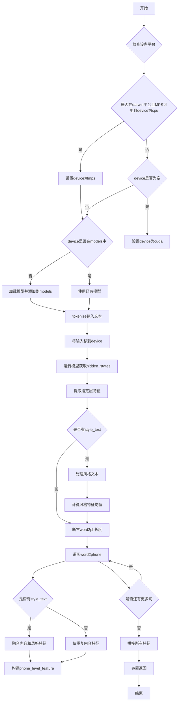

# `Bert-VITS2\oldVersion\V220\text\chinese_bert.py` 详细设计文档

该代码是一个BERT特征提取模块，用于将中文文本转换为音素级别的特征表示。它使用chinese-roberta-wwm-ext-large预训练模型提取词级别特征，并通过word2ph映射将词特征展开为音素特征，同时支持通过style_text和style_weight进行样式特征融合。

## 整体流程

```mermaid
graph TD
    A[开始] --> B[检查设备类型]
    B --> C{平台是darwin且MPS可用?}
    C -- 是 --> D[使用mps设备]
    C -- 否 --> E{device参数为空?}
    E -- 是 --> F[使用cuda设备]
    E -- 否 --> G[使用传入的device]
    D --> H[检查模型缓存]
    F --> H
    G --> H
    H --> I{device在models中?]
    I -- 否 --> J[加载模型到对应设备]
    I -- 是 --> K[使用缓存模型]
    J --> L[tokenize输入文本]
    K --> L
    L --> M[提取BERT隐藏层特征]
    M --> N{有style_text?]
    N -- 是 --> O[提取样式文本特征并计算均值]
    N -- 否 --> P[遍历word2phone映射]
    O --> P
    P --> Q[对每个词特征进行重复扩展]
    Q --> R{有样式文本?]
    R -- 是 --> S[融合原始特征和样式特征]
    R -- 否 --> T[仅重复原始特征]
    S --> U[拼接所有音素级别特征]
    T --> U
    U --> V[返回转置后的特征矩阵]
```

## 类结构

```
无类层次结构（基于函数的模块化设计）
└── get_bert_feature (全局函数)
```

## 全局变量及字段


### `LOCAL_PATH`
    
本地BERT模型路径，指向预训练的中文Roberta大模型

类型：`str`
    


### `tokenizer`
    
用于文本分词的BERT分词器实例，加载自本地模型路径

类型：`AutoTokenizer`
    


### `models`
    
缓存不同设备上的BERT模型的字典，键为设备名称，值为模型对象

类型：`dict`
    


    

## 全局函数及方法


### `get_bert_feature`

该函数使用预训练的中文 RoBERTa 模型（chinese-roberta-wwm-ext-large）将输入文本转换为词级隐藏状态特征，并根据 `word2ph` 映射将词级特征展开为音素级特征。支持可选的风格迁移功能，通过 `style_text` 和 `style_weight` 参数控制风格特征的混合。

参数：

- `text`：`str`，需要进行特征提取的输入文本
- `word2ph`：`List[int]`，词到音素数量的映射列表，长度必须等于 `len(text) + 2`
- `device`：`str`，计算设备，默认为 `config.bert_gen_config.device`，支持 "cpu"、"cuda"、"mps"
- `style_text`：`Optional[str]`，可选的风格文本，用于风格迁移，若为 `None` 则不启用风格融合
- `style_weight`：`float`，风格融合权重，默认为 0.7，值越大风格特征权重越高

返回值：`torch.Tensor`，形状为 `(特征维度, 音素序列长度)` 的转置后音素级特征张量

#### 流程图

```mermaid
flowchart TD
    A[开始 get_bert_feature] --> B{检查平台和设备}
    B --> C{device == 'cpu' 且 macOS 且 MPS可用?}
    C -->|是| D[设置 device = 'mps']
    C -->|否| E{device 为空?}
    E -->|是| F[device = 'cuda']
    E -->|否| G[保持原有 device]
    D --> H
    F --> H
    G --> H
    H{device 在 models 中?}
    H -->|否| I[加载模型并移到 device]
    I --> J
    H -->|是| J
    J[tokenize 输入文本] --> K[将输入移到 device]
    K --> L[模型推理获取 hidden_states]
    L --> M[提取最后第三层隐藏状态]
    M --> N{style_text 存在?}
    N -->|是| O[tokenize style_text]
    O --> P[将 style_inputs 移到 device]
    P --> Q[模型推理获取 style hidden_states]
    Q --> R[提取风格特征均值 style_res_mean]
    R --> S
    N -->|否| S[word2ph 长度验证]
    S --> T[遍历 word2phone]
    T --> U{style_text 存在?}
    U -->|是| V[混合特征: res * (1-weight) + style_mean * weight]
    V --> W[重复特征 word2phone[i] 次]
    U -->|否| X[直接重复特征 word2phone[i] 次]
    W --> Y
    X --> Y
    Y[拼接所有音素级特征] --> Z[转置并返回]
```

#### 带注释源码

```python
import sys

import torch
from transformers import AutoModelForMaskedLM, AutoTokenizer

from config import config

# 本地预训练模型路径：中文 RoBERTa-wwm-ext-large
LOCAL_PATH = "./bert/chinese-roberta-wwm-ext-large"

# 全局分词器实例，用于将文本转换为 token ID
tokenizer = AutoTokenizer.from_pretrained(LOCAL_PATH)

# 模型缓存字典，以 device 为 key 缓存不同设备的模型实例
# 避免重复加载模型，提高推理效率
models = dict()


def get_bert_feature(
    text,                          # 输入文本字符串
    word2ph,                       # 词到音素的映射列表，如 [1, 2, 1, 2, ...]
    device=config.bert_gen_config.device,  # 计算设备，默认为配置中的设备
    style_text=None,               # 可选的风格文本，用于风格迁移
    style_weight=0.7,              # 风格融合权重，0-1之间
):
    """
    使用预训练 BERT 模型提取文本特征，并将词级特征展开为音素级特征
    
    参数:
        text: 输入文本
        word2ph: 词到音素数量的映射，长度必须为 len(text) + 2
        device: 计算设备
        style_text: 可选的风格文本
        style_weight: 风格权重
    
    返回:
        音素级特征张量，形状为 (特征维度, 音素序列长度)
    """
    
    # 设备选择逻辑：优先使用 Apple Silicon 的 MPS 加速
    if (
        sys.platform == "darwin"
        and torch.backends.mps.is_available()
        and device == "cpu"
    ):
        device = "mps"  # 使用 M1/M2 芯片的金属加速
    
    # 如果未指定设备，默认使用 CUDA
    if not device:
        device = "cuda"
    
    # 按设备缓存模型，避免重复加载
    if device not in models.keys():
        # 从本地路径加载预训练的中文 RoBERTa 模型
        models[device] = AutoModelForMaskedLM.from_pretrained(LOCAL_PATH).to(device)
    
    # 禁用梯度计算，提升推理速度
    with torch.no_grad():
        # 对输入文本进行 token 化，转换为 PyTorch 张量
        inputs = tokenizer(text, return_tensors="pt")
        
        # 将所有输入张量移到指定计算设备
        for i in inputs:
            inputs[i] = inputs[i].to(device)
        
        # 模型前向传播，获取隐藏状态
        # output_hidden_states=True 要求返回所有层的隐藏状态
        res = models[device](**inputs, output_hidden_states=True)
        
        # 提取最后第三层的隐藏状态 [-3:-2] 选取倒数第三层
        # torch.cat(..., -1) 在最后一个维度拼接，结果形状: (seq_len, 1024)
        res = torch.cat(res["hidden_states"][-3:-2], -1)[0].cpu()
        
        # 处理风格迁移（如果提供了风格文本）
        if style_text:
            # 对风格文本进行 token 化
            style_inputs = tokenizer(style_text, return_tensors="pt")
            
            # 将风格输入移到指定设备
            for i in style_inputs:
                style_inputs[i] = style_inputs[i].to(device)
            
            # 获取风格文本的隐藏状态
            style_res = models[device](**style_inputs, output_hidden_states=True)
            
            # 提取风格特征并计算词级别的平均
            style_res = torch.cat(style_res["hidden_states"][-3:-2], -1)[0].cpu()
            style_res_mean = style_res.mean(0)  # 在词维度求平均

    # 验证 word2ph 长度：必须等于文本长度加上起始和结束标记
    assert len(word2ph) == len(text) + 2
    
    word2phone = word2ph
    phone_level_feature = []  # 存储音素级特征列表
    
    # 遍历每个词，将词级特征展开为多个音素级特征
    for i in range(len(word2phone)):
        if style_text:
            # 风格融合：原始特征 * (1-权重) + 风格特征 * 权重
            # repeat(word2phone[i], 1) 将特征重复 word2phone[i] 次
            repeat_feature = (
                res[i].repeat(word2phone[i], 1) * (1 - style_weight)
                + style_res_mean.repeat(word2phone[i], 1) * style_weight
            )
        else:
            # 无风格迁移时，直接重复词级特征
            repeat_feature = res[i].repeat(word2phone[i], 1)
        
        phone_level_feature.append(repeat_feature)

    # 沿第一个维度（音素序列维度）拼接所有特征
    phone_level_feature = torch.cat(phone_level_feature, dim=0)

    # 返回转置后的特征，形状: (特征维度, 音素序列长度)
    return phone_level_feature.T
```

#### 全局变量信息

| 名称 | 类型 | 描述 |
|------|------|------|
| `LOCAL_PATH` | `str` | 预训练中文 RoBERTa-wwm-ext-large 模型的本地路径 |
| `tokenizer` | `AutoTokenizer` | 全局分词器实例，用于文本到 token ID 的转换 |
| `models` | `dict` | 模型缓存字典，以设备名为键存储不同设备的模型实例 |

#### 关键组件信息

| 组件名称 | 一句话描述 |
|----------|------------|
| `transformers.AutoModelForMaskedLM` | Hugging Face 的掩码语言模型加载器，用于加载 BERT 系列预训练模型 |
| `transformers.AutoTokenizer` | 自动分词器，根据模型名称加载对应的分词配置 |
| `config.bert_gen_config.device` | 配置对象中的 BERT 生成设备配置项 |

#### 潜在技术债务与优化空间

1. **全局状态管理**：`models` 字典作为全局变量缓存模型实例，虽提升性能但可能导致内存占用过高，建议增加模型数量上限控制或 LRU 淘汰机制。

2. **设备检测逻辑**：MPS 设备检测嵌套在 `device == "cpu"` 条件内，逻辑不够直观，建议重构为更清晰的设备选择策略。

3. **硬编码 Magic Number**：特征提取层选择 `[-3:-2]` 是硬编码的魔法数字，应提取为配置参数。

4. **缺少错误处理**：函数未对模型加载失败、GPU 内存不足、输入文本为空等情况进行异常处理。

5. **类型注解缺失**：函数参数和返回值缺少 Python 类型注解，不利于静态分析和 IDE 智能提示。

6. **重复代码模式**：`inputs` 和 `style_inputs` 的设备转移逻辑重复，可抽取为辅助函数。

#### 其他设计说明

- **设计目标**：将变长文本转换为固定维度的音素级特征序列，供下游语音合成任务使用。
- **约束条件**：`word2ph` 长度必须严格等于 `len(text) + 2`，这是为了兼容文本的起始和结束标记。
- **错误处理**：仅在 `word2ph` 长度不匹配时使用 `assert` 抛出断言错误，其他错误情况未做处理。
- **数据流**：输入文本 → Token 化 → BERT 编码 → 隐藏状态提取 → 词级到音素级展开 → 风格融合（如有）→ 转置输出。
- **外部依赖**：依赖 `transformers` 库和本地预训练模型文件 `./bert/chinese-roberta-wwm-ext-large`，需要确保模型文件存在。


## 关键组件


### 核心功能概述

该代码实现了一个基于预训练中文RoBERTa-wwm-ext-large模型的文本特征提取工具，主要功能是将输入文本的词级别特征转换为音素级别的特征，并支持可选的风格迁移功能。

### 文件运行流程

1. 导入必要的系统库和第三方库（torch、transformers）
2. 从config模块导入配置
3. 定义本地模型路径常量
4. 加载预训练的分词器
5. 创建模型缓存字典
6. 定义get_bert_feature函数用于特征提取
7. 如果作为主程序运行，则执行测试代码

### 类详细信息

#### 全局变量

| 名称 | 类型 | 描述 |
|------|------|------|
| LOCAL_PATH | str | 预训练BERT模型的本地路径 "./bert/chinese-roberta-wwm-ext-large" |
| tokenizer | AutoTokenizer | 预训练的中文分词器实例 |
| models | dict | 模型缓存字典，用于存储不同设备上的模型实例 |

#### 全局函数

##### get_bert_feature

**参数：**
- text (str): 输入文本
- word2ph (list): 词到音素的映射列表，表示每个词对应多少个音素
- device (str): 运行设备，默认为config.bert_gen_config.device
- style_text (str, optional): 风格文本，用于风格迁移，默认为None
- style_weight (float): 风格权重，默认为0.7

**返回值：**
- phone_level_feature (torch.Tensor): 音素级别的特征向量，形状为(特征维度, 音素数量)

**流程图：**



**源码：**

```python
def get_bert_feature(
    text,
    word2ph,
    device=config.bert_gen_config.device,
    style_text=None,
    style_weight=0.7,
):
    # 设备选择逻辑：根据平台和可用性自动选择最佳设备
    if (
        sys.platform == "darwin"
        and torch.backends.mps.is_available()
        and device == "cpu"
    ):
        device = "mps"
    if not device:
        device = "cuda"
    
    # 模型惰性加载：按设备缓存模型，避免重复加载
    if device not in models.keys():
        models[device] = AutoModelForMaskedLM.from_pretrained(LOCAL_PATH).to(device)
    
    # 提取主文本特征
    with torch.no_grad():
        inputs = tokenizer(text, return_tensors="pt")
        for i in inputs:
            inputs[i] = inputs[i].to(device)
        res = models[device](**inputs, output_hidden_states=True)
        # 提取倒数第三层的隐藏状态
        res = torch.cat(res["hidden_states"][-3:-2], -1)[0].cpu()
        
        # 处理风格文本（可选）
        if style_text:
            style_inputs = tokenizer(style_text, return_tensors="pt")
            for i in style_inputs:
                style_inputs[i] = style_inputs[i].to(device)
            style_res = models[device](**style_inputs, output_hidden_states=True)
            style_res = torch.cat(style_res["hidden_states"][-3:-2], -1).cpu()
            style_res_mean = style_res.mean(0)

    # 验证输入长度：word2ph应该等于文本长度加2（BOS和EOS）
    assert len(word2ph) == len(text) + 2
    word2phone = word2ph
    phone_level_feature = []
    
    # 词级别到音素级别的特征转换
    for i in range(len(word2phone)):
        if style_text:
            # 风格迁移：加权融合内容特征和风格特征
            repeat_feature = (
                res[i].repeat(word2phone[i], 1) * (1 - style_weight)
                + style_res_mean.repeat(word2phone[i], 1) * style_weight
            )
        else:
            # 纯内容特征：按word2phone映射重复特征
            repeat_feature = res[i].repeat(word2phone[i], 1)
        phone_level_feature.append(repeat_feature)

    # 拼接所有音素级别的特征
    phone_level_feature = torch.cat(phone_level_feature, dim=0)

    return phone_level_feature.T
```

### 关键组件信息

| 名称 | 描述 |
|------|------|
| 张量索引与惰性加载 | 使用models字典缓存不同设备的模型，实现惰性加载，避免重复加载模型，提高内存效率 |
| 反量化支持 | 代码支持MPS（Apple Silicon GPU）、CUDA和CPU多种设备，通过device参数灵活切换 |
| 量化策略 | 使用torch.no_grad()上下文管理器禁用梯度计算，减少内存占用和计算开销 |
| 特征层选择 | 固定选择倒数第三层（-3:-2）的hidden states作为输出，这是BERT特征提取的常见策略 |
| 风格迁移机制 | 通过style_weight参数控制内容和风格特征的融合比例，实现可控的风格迁移 |

### 潜在技术债务或优化空间

1. **设备管理硬编码**: 设备选择逻辑中包含平台特定代码，可考虑抽象为独立的设备管理模块
2. **模型缓存无过期机制**: models字典会持续增长，缺乏清理机制，可能导致内存泄漏
3. **错误处理缺失**: 缺少对模型加载失败、tokenizer失败等异常情况的处理
4. **类型注解缺失**: 函数参数和返回值缺乏类型注解，影响代码可维护性和IDE支持
5. **重复代码**: 风格文本处理与主文本处理存在重复代码块，可抽象为通用方法
6. **全局状态管理**: models字典作为全局变量可能导致并发访问问题
7. **硬编码路径**: LOCAL_PATH和默认参数硬编码在函数中，缺乏配置灵活性
8. **测试代码混在主模块**: if __name__ == "__main__"中的测试代码应该分离到独立的测试文件

### 其它项目

#### 设计目标与约束

- **目标**: 提供高效的词级别到音素级别特征转换能力，支持风格迁移
- **约束**: 必须使用指定的预训练模型路径，输出特征维度固定为1024

#### 错误处理与异常设计

- 仅包含长度断言检查（word2ph == len(text) + 2）
- 缺少对以下异常情况的处理：
  - 模型文件不存在或损坏
  - 分词失败
  - 设备不支持
  - GPU内存不足

#### 数据流与状态机

- 输入: 文本字符串 + 词到音素映射数组
- 处理流程: 分词 -> 模型推理 -> 特征提取 -> 特征映射 -> 特征融合（可选）-> 特征拼接
- 输出: 音素级别特征矩阵（转置后）

#### 外部依赖与接口契约

- 依赖: torch, transformers, config模块
- 接口契约: 
  - text参数必须为非空字符串
  - word2ph必须为整数列表，长度等于len(text) + 2
  - 返回值为torch.Tensor，形状为(1024, total_phones)


## 问题及建议


### 已知问题

- **设备选择逻辑混乱**：当 `device == "cpu"` 时，代码会将其改为 "mps"，但这在逻辑上是矛盾的——用户明确指定了 CPU 设备，却被无声地覆盖
- **全局状态非线程安全**：`models` 字典在多线程环境下直接访问和修改，可能导致竞态条件和模型重复加载
- **变量作用域隐患**：`style_res_mean` 在 `if style_text:` 代码块内定义，但如果 `style_text` 为空，后续代码仍可能引用该变量（虽然当前逻辑不会执行）
- **缺乏错误处理**：模型加载、tokenizer 调用、GPU 内存分配等关键操作均无异常捕获，失败时会导致程序崩溃
- **硬编码路径与配置**：`LOCAL_PATH` 硬编码在模块级别，违反配置与代码分离原则
- **重复计算问题**：每次调用都执行 tokenizer，没有缓存机制，且在循环中重复调用 `.to(device)`

### 优化建议

- 修复设备选择逻辑，尊重用户显式指定的 device 参数，或提供明确的警告而非静默覆盖
- 使用线程锁（如 `threading.Lock`）保护 `models` 字典的并发访问，或采用单例模式管理模型实例
- 重新组织变量定义，明确区分有/无 style_text 的代码路径，避免潜在的作用域混淆
- 添加完整的异常处理：对模型加载失败、GPU 内存不足、tokenizer 错误等情况进行捕获和合理反馈
- 将 `LOCAL_PATH` 移至配置文件或通过参数注入，支持多模型切换场景
- 考虑添加 tokenizer 结果缓存、模型预加载选项、批量推理支持等性能优化
- 提供模型卸载或显存清理的接口，防止长时间运行时的内存泄漏

## 其它


### 设计目标与约束

本模块旨在为语音合成系统提供高质量的文本特征提取能力，通过BERT模型获取中文文本的深层语义表示，并将词级别特征映射为音素级别特征，支持风格迁移功能。约束条件包括：设备优先使用GPU（cuda），如不可用则回退至MPS或CPU；模型仅加载一次并在内存中缓存；输入文本长度需与word2ph映射匹配。

### 错误处理与异常设计

主要异常场景包括：1) 模型加载失败时抛出transformers库相关异常；2) device参数无效导致模型加载失败；3) word2ph长度与text+2不匹配时触发assertion error；4) tokenizer返回空结果时可能导致后续处理异常；5) 风格文本处理时需确保模型已正确加载。建议增加更友好的错误提示信息，处理device不支持时的优雅降级，以及增加输入验证逻辑。

### 数据流与状态机

数据流向为：输入原始文本text → Tokenizer分词编码 → BERT模型前向传播 → 提取hidden_states倒数第3层 → 如有风格文本则额外提取风格特征 → 计算加权融合 → 根据word2ph映射将词级别特征重复扩展为音素级别 → 拼接所有音素特征 → 输出最终的phone_level_feature张量。状态机涉及：模型加载状态（未加载/已加载）、设备状态（cpu/cuda/mps）、风格迁移状态（启用/禁用）。

### 外部依赖与接口契约

核心依赖包括：torch>=1.0、transformers>=4.0、config模块（需提供bert_gen_config.device配置）。接口契约方面：get_bert_feature函数接收text(str)、word2ph(list[int])、device(str可选)、style_text(str可选)、style_weight(float，默认0.7)，返回torch.Tensor(shape=[特征维度, 音素总数])。调用方需确保word2ph长度为len(text)+2，text应为有效中文文本。

### 配置参数说明

LOCAL_PATH指定BERT模型本地路径为"./bert/chinese-roberta-wwm-ext-large"；config.bert_gen_config.device控制默认计算设备；style_weight参数控制风格特征融合比例，范围建议0.0-1.0；模型缓存字典models以device为键实现跨调用复用。

### 性能考虑与基准测试

当前实现通过torch.no_grad()禁用梯度计算减少内存占用，模型缓存避免重复加载。建议基准测试项：单次调用延迟（目标<500ms）、批量处理吞吐量、内存占用峰值（模型约1.3GB）、不同设备(cuda/mps/cpu)性能对比。可考虑增加batch处理支持以提升批量文本处理效率。

### 安全性考虑

当前代码无用户输入校验，建议增加：text非空校验、word2ph数值有效性校验（正整数）、style_weight范围校验。模型文件路径LOCAL_PATH建议支持配置化而非硬编码，防止路径遍历风险。

### 兼容性说明

代码明确支持macOS平台(MPS加速)和Linux/Windows(CUDA)；Python版本建议3.8+；transformers库版本需兼容AutoModelForMaskedLM和AutoTokenizer的API。BERT模型需使用与chinese-roberta-wwm-ext-large相同架构的模型以保证兼容性。

### 使用示例

基础调用：features = get_bert_feature("你好世界", [1,2,1,2,2,1,2])；风格迁移调用：features = get_bert_feature("你好", [1,2,1], style_text="高兴", style_weight=0.5)；自定义设备：features = get_bert_feature("测试", [1,1,1], device="cuda")。


    