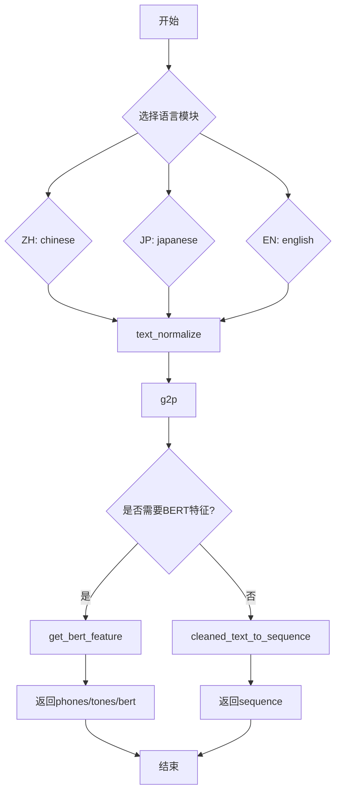
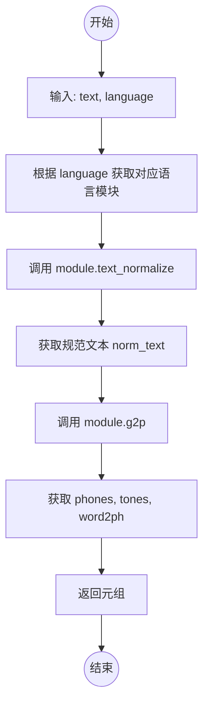
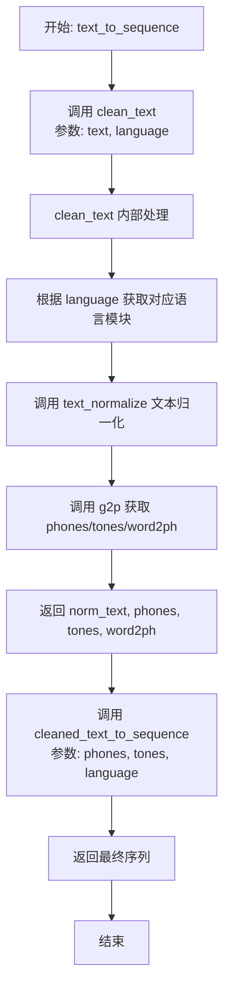

# `Bert-VITS2\oldVersion\V220\text\cleaner.py` 详细设计文档

这是一个多语言文本预处理模块，支持中文、日文和英文的文本清理、规范化、拼音转换、韵律提取以及BERT特征生成，为语音合成系统提供标准化的文本输入。

## 整体流程



## 类结构

```
模块级函数集合
├── language_module_map (全局变量)
├── clean_text (全局函数)
├── clean_text_bert (全局函数)
└── text_to_sequence (全局函数)
```

## 全局变量及字段


### `language_module_map`
    
语言模块映射表，将语言代码（如"ZH"、"JP"、"EN"）映射到对应的语言处理模块

类型：`dict`
    


    

## 全局函数及方法


### `clean_text`

该函数是文本转语音（TTs）预处理流程的核心环节。它接收原始文本和语言代码，动态加载对应的语言处理模块，对文本进行规范化（Normalization），并利用G2P（Grapheme-to-Phoneme）模型将文本转换为音素（Phonemes）、声调（Tones）以及词素到音素的映射（Word2Ph）。

参数：
- `text`：`str`，输入的原始文本字符串。
- `language`：`str`，语言代码（如 "ZH", "EN", "JP"），用于从映射表中获取对应的处理模块。

返回值：`tuple`，包含四个元素：
- `norm_text`：`str`，规范化后的文本。
- `phones`：`list`，转换后的音素序列。
- `tones`：`list`，对应的声调序列。
- `word2ph`：`dict/list`，词到音素的映射关系，用于对齐。

#### 流程图



#### 带注释源码

```python
def clean_text(text, language):
    # 1. 根据传入的语言代码 (如 'ZH', 'EN') 从全局映射表中获取对应的处理模块
    language_module = language_module_map[language]
    
    # 2. 调用模块中的文本规范化方法
    # 例如：将数字转换为汉字/英文单词，处理特殊符号等
    norm_text = language_module.text_normalize(text)
    
    # 3. 调用模块中的 G2P (Grapheme-to-Phoneme) 方法
    # 将规范化的文本转换为语言特定的音素序列、声调和词素映射
    phones, tones, word2ph = language_module.g2p(norm_text)
    
    # 4. 返回规范化文本及音素分析结果
    return norm_text, phones, tones, word2ph
```


### `clean_text_bert`

带BERT特征的文本清理函数，该函数接收输入文本和语言代码，通过语言特定的模块进行文本规范化、语音合成和BERT特征提取，最终返回音素序列、声调序列和BERT特征向量。

参数：

- `text`：`str`，需要处理的原始输入文本
- `language`：`str`，语言代码，指定文本所属语言（如"ZH"代表中文，"JP"代表日语，"EN"代表英语）

返回值：`(phones, tones, bert)` 元组，其中：

- `phones`：`list`，处理后的音素序列
- `tones`：`list`，对应的声调序列
- `bert`：`numpy.ndarray` 或 `tensor`，从BERT模型提取的文本特征表示

#### 流程图

```mermaid
flowchart TD
    A[开始: clean_text_bert] --> B[根据language获取对应语言模块]
    B --> C[调用text_normalize进行文本规范化]
    C --> D[调用g2p获取音素、声调和词素phoneme映射]
    D --> E[调用get_bert_feature提取BERT特征]
    E --> F[返回phones, tones, bert元组]
    
    B -->|language="ZH"| B1[chinese模块]
    B -->|language="JP"| B2[japanese模块]
    B -->|language="EN"| B3[english模块]
```

#### 带注释源码

```python
def clean_text_bert(text, language):
    """
    带BERT特征的文本清理函数
    
    该函数是文本处理流水线中的核心组件，负责将原始文本转换为
    语音合成所需的音素序列、声调序列以及BERT嵌入特征。
    
    参数:
        text: str - 输入的原始文本字符串
        language: str - 语言代码，支持"ZH"(中文)、"JP"(日语)、"EN"(英语)
    
    返回:
        tuple: (phones, tones, bert) - 音素序列、声调序列和BERT特征
    """
    # 根据语言代码从映射表中获取对应的语言处理模块
    # language_module_map在模块级别定义，包含了各语言特定的文本处理逻辑
    language_module = language_module_map[language]
    
    # 步骤1: 文本规范化
    # 调用语言模块的text_normalize方法，将原始文本转换为规范化格式
    # 包括但不限于：全角转半角、繁简转换、特殊字符处理等
    norm_text = language_module.text_normalize(text)
    
    # 步骤2: 语音合成前的图音转换(G2P)
    # 调用语言模块的g2p(Grapheme-to-Phoneme)方法，将规范化文本转换为音素
    # 返回三个结果：phones(音素序列)、tones(声调信息)、word2ph(词到音素的映射)
    phones, tones, word2ph = language_module.g2p(norm_text)
    
    # 步骤3: BERT特征提取
    # 使用预训练的BERT模型提取文本的语义特征表示
    # 输入为规范化文本和词素映射关系，输出为高维特征向量
    # 这个特征将用于增强语音合成的自然度和表达能力
    bert = language_module.get_bert_feature(norm_text, word2ph)
    
    # 返回处理结果元组
    # phones: 用于声学模型输入的音素序列
    # tones: 决定音高变化的关键信息
    # bert: 语义增强特征，提升合成语音的表现力
    return phones, tones, bert
```


### `text_to_sequence`

该函数是文本转序列的核心函数，接收输入文本和语言代码，先通过 `clean_text` 进行文本归一化、音素提取和声调处理，再调用 `cleaned_text_to_sequence` 将处理后的音素转换为最终的文本序列并返回。

参数：

- `text`：`str`，待转换的输入文本
- `language`：`str`，语言代码（如 "ZH" / "JP" / "EN"）

返回值：返回转换后的文本序列（类型取决于 `cleaned_text_to_sequence` 的具体实现，通常为 `list[int]` 或类似序列类型）

#### 流程图



#### 带注释源码

```python
def text_to_sequence(text, language):
    """
    将输入文本和语言代码转换为文本序列
    
    参数:
        text: str, 待转换的输入文本
        language: str, 语言代码 (如 "ZH", "JP", "EN")
    
    返回:
        转换后的文本序列
    """
    # 第一步：调用 clean_text 进行文本清理和音素提取
    # 返回归一化文本、音素序列、声调序列、词到音素的映射
    norm_text, phones, tones, word2ph = clean_text(text, language)
    
    # 第二步：调用 cleaned_text_to_sequence 将音素序列转换为最终序列
    # 该函数由外部模块导入，负责将 phones/tones 按语言规则转换为模型可用的序列
    return cleaned_text_to_sequence(phones, tones, language)
```

## 关键组件


### language_module_map

全局变量，语言模块映射字典，用于根据语言代码动态加载对应的语言处理模块（ZH->chinese, JP->japanese, EN->english）

### clean_text

文本清理核心函数，接受文本和语言参数，返回规范化文本、音素序列、声调和词素到音素的映射关系。流程：加载语言模块 → 文本规范化 → G2P转换

### clean_text_bert

带BERT特征提取的文本清理函数，在clean_text基础上增加BERT特征获取，用于需要语义特征的下游任务

### text_to_sequence

文本转序列入口函数，调用clean_text获取处理结果，最终通过cleaned_text_to_sequence转换为模型可用序列

### 语言模块接口契约

各语言模块需实现text_normalize、g2p、get_bert_feature三个标准接口，遵循统一的文本处理流水线设计


## 问题及建议


### 已知问题

- **硬编码的语言映射**：language_module_map 使用硬编码字典，不支持动态扩展语言，添加新语言需要修改源码
- **缺乏错误处理**：language_module_map[language] 直接访问，若传入不支持的语言会抛出 KeyError 未被捕获
- **重复代码逻辑**：clean_text 和 clean_text_bert 中 text_normalize 和 g2p 调用完全重复，可提取公共方法
- **魔法字符串**：语言标识 "ZH", "JP", "EN" 以硬编码字符串形式出现，缺乏常量定义
- **缺少类型注解**：所有函数均无类型提示，不利于静态分析和IDE支持
- **返回值设计不一致**：clean_text 返回4元组，clean_text_bert 返回3元组，接口语义不清晰
- **全局可变状态**：language_module_map 作为全局字典，存在潜在的线程安全问题
- **无输入验证**：text 和 language 参数未做合法性校验，可能传递空值或异常数据

### 优化建议

- 使用枚举或常量类定义语言标识，替代魔法字符串
- 在函数入口添加参数校验，对不支持的语言抛出自定义异常
- 抽取公共逻辑为内部函数，减少代码重复
- 为所有函数添加类型注解和文档字符串
- 考虑将 language_module_map 改为只读配置或使用 dataclass/frozen 装饰器
- 统一返回值结构，可使用 dataclass 或 NamedTuple 封装
- 添加单元测试覆盖边界条件和异常场景

## 其它


### 设计目标与约束

该模块的设计目标是提供一个统一的多语言文本预处理接口，将任意语言的文本转换为语音合成所需的音素序列、声调序列和词-音素对齐信息。约束条件包括：仅支持ZH（日文）、JP（中文）、EN（英文）三种语言；各语言模块必须实现text_normalize、g2p、get_bert_feature（可选）等标准接口；输入文本必须为字符串类型，输出音素序列为列表类型。

### 错误处理与异常设计

当传入不支持的语言代码时，language_module_map[language]会抛出KeyError，建议在模块初始化时增加语言合法性校验或提供默认语言回退机制。language_module内部的text_normalize和g2p方法可能抛出异常（如空字符串、非法字符），应由调用方负责捕获处理。当前代码未实现任何异常捕获逻辑，属于潜在风险点。

### 数据流与状态机

数据流分为三条路径：路径一（clean_text）接收原始文本和语言代码，经过文本规范化、分词/注音后返回规范文本、音素序列、声调序列、词-音素映射；路径二（clean_text_bert）在路径一基础上增加BERT特征提取步骤，返回音素序列、声调序列、BERT特征；路径三（text_to_sequence）在路径一基础上调用cleaned_text_to_sequence生成最终音素索引序列。无状态机设计，纯函数式数据转换。

### 外部依赖与接口契约

外部依赖包括四个语言处理模块（chinese、japanese、english）和cleaned_text_to_sequence工具函数。各语言模块需暴露text_normalize(text: str) -> str、g2p(text: str) -> (phones, tones, word2ph)、get_bert_feature(text: str, word2ph) -> bert（可选）三个标准接口。cleaned_text_to_sequence接收phones、tones、language参数返回整数序列。调用方需保证text非空且language为支持的语言代码。

### 关键组件信息

language_module_map：字典类型，映射语言代码到对应语言处理模块，提供运行时动态加载能力。clean_text：核心函数，负责完整文本清理流程。clean_text_bert：扩展函数，增加BERT特征提取步骤。text_to_sequence：顶层函数，将文本转换为可用的音素索引序列。

### 潜在技术债务与优化空间

当前实现存在以下优化空间：1）缺乏异常处理机制，语言代码错误时程序直接崩溃；2）language_module_map为硬编码字典，扩展新语言需要修改源码；3）clean_text和clean_text_bert存在重复代码（norm_text、phones、tones、word2ph计算逻辑相同），可通过内部函数复用；4）未实现缓存机制，相同文本重复调用时造成计算浪费；5）缺少日志记录，无法追踪调试；6）get_bert_feature为可选实现，但代码中未做兼容处理。

### 类详细信息

本代码无类定义，仅包含模块级函数和全局变量，属于过程式编程风格。建议后续重构时可考虑将language_module_map封装为LanguageProcessor类，统一管理语言模块加载和错误处理。

### 全局变量详细信息

language_module_map：dict类型，键为语言代码字符串（"ZH"/"JP"/"EN"），值为对应语言处理模块对象，用于运行时动态路由。

### 全局函数详细信息

clean_text(text: str, language: str) -> tuple，返回规范文本(str)、音素列表(list)、声调列表(list)、词音素映射(list)。无Mermaid流程图，纯顺序执行。clean_text_bert(text: str, language: str) -> tuple，返回音素列表(list)、声调列表(list)、BERT特征(ndarray)。text_to_sequence(text: str, language: str) -> list，返回音素索引列表(list)。

    