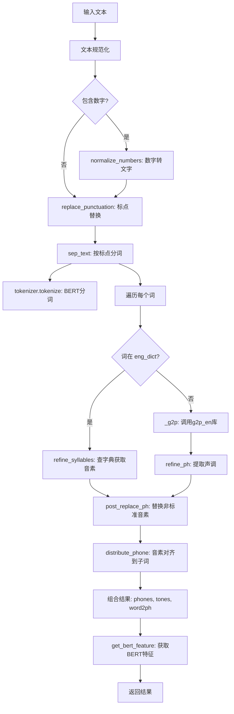
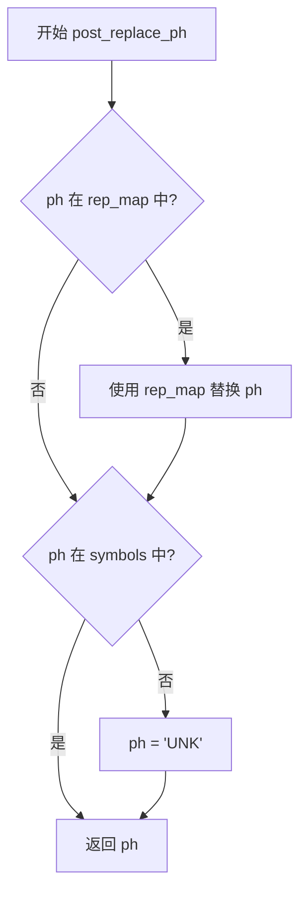
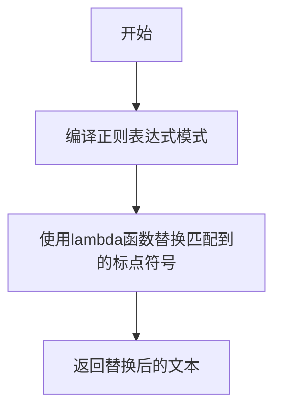
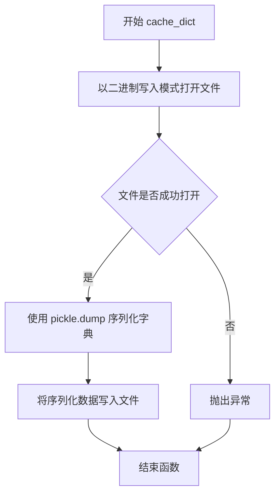
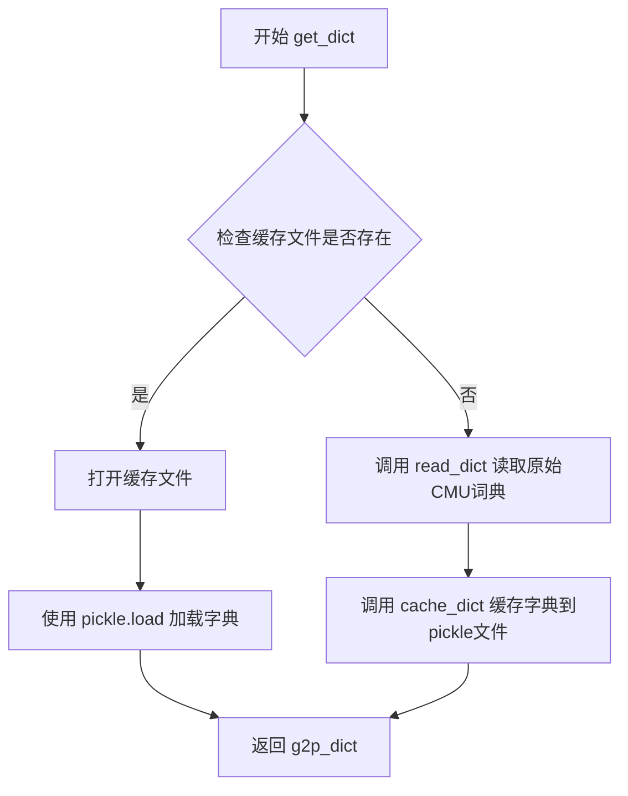
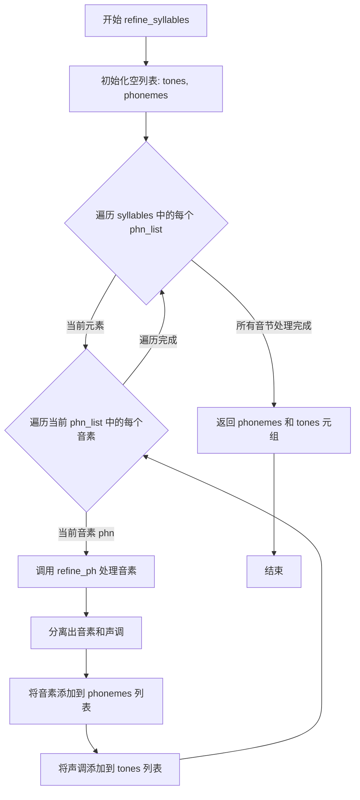
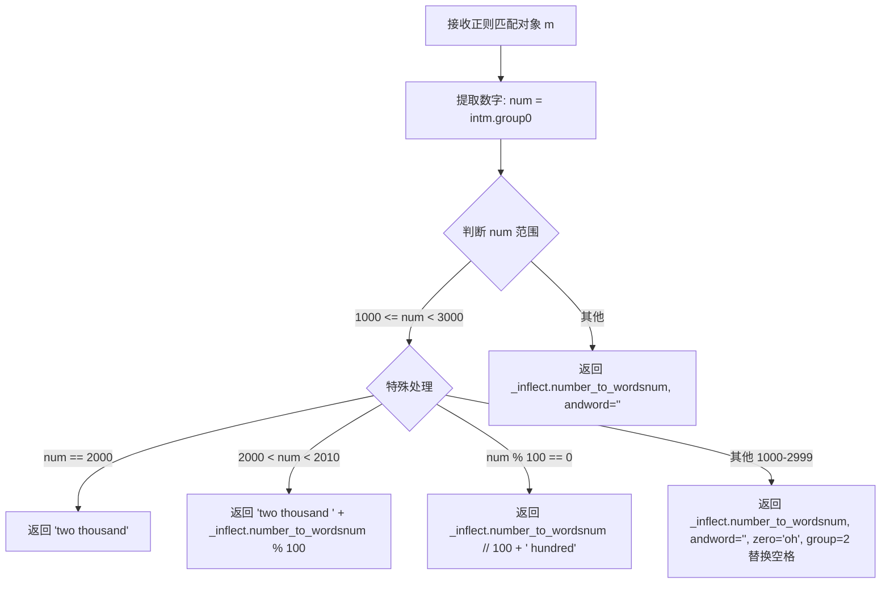
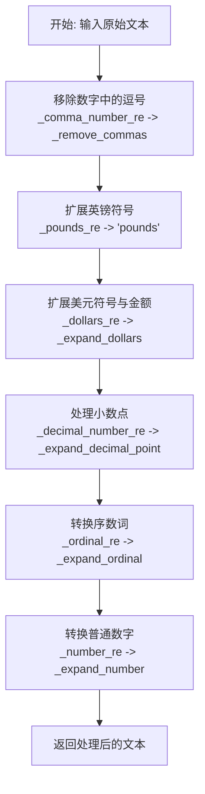
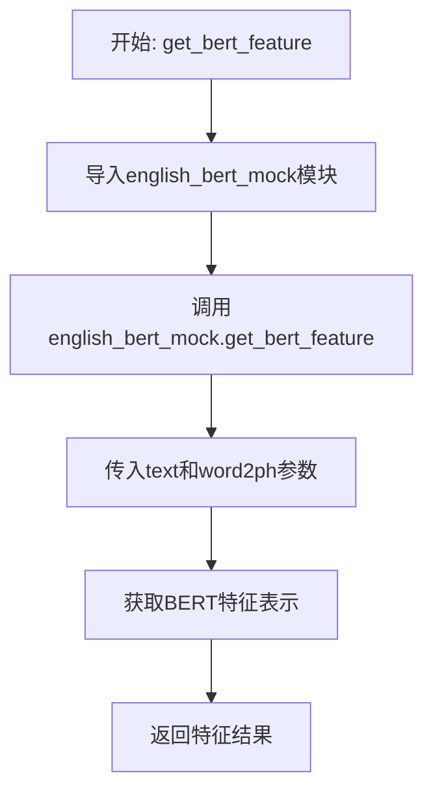

# `Bert-VITS2\oldVersion\V220\text\english.py` 详细设计文档

这是一个文本转音素（Grapheme-to-Phoneme, G2P）的处理模块，主要用于TTS（文本到语音）系统的前端。它负责将原始文本进行规范化、数字转换、标点替换，然后通过查字典或调用g2p_en库将文本转换为音素（phones）、声调（tones）以及词素到音素的对齐关系（word2ph），同时集成了BERT特征提取接口。

## 整体流程



## 类结构

```
该文件为模块脚本，未定义用户类。
主要逻辑由全局函数实现，依赖于第三方类实例：
* _g2p (g2p_en.G2p 实例)
* tokenizer (transformers.DebertaV2Tokenizer 实例)
```

## 全局变量及字段


### `CMU_DICT_PATH`
    
CMU发音词典文件路径，用于加载英文单词到音素的映射

类型：`str`
    


### `CACHE_PATH`
    
缓存的pickle文件路径，用于存储序列化后的发音词典以加速加载

类型：`str`
    


### `_g2p`
    
g2p_en库的G2p对象实例，用于将未登录词（不在CMU词典中的词）转换为音素序列

类型：`G2p`
    


### `tokenizer`
    
Hugging Face的Deberta分词器实例，用于对文本进行tokenize以实现与BERT特征的对齐

类型：`DebertaV2Tokenizer`
    


### `arpa`
    
ARPA音素符号集合，用于过滤和验证有效的英文音素

类型：`set`
    


### `rep_map`
    
标点符号和多字节字符到ASCII或统一符号的替换映射表，用于文本标准化

类型：`dict`
    


### `eng_dict`
    
从CMU词典加载的英文单词到音素序列的映射字典，用于快速查找已知单词的发音

类型：`dict`
    


### `_inflect`
    
inflect库的引擎实例，用于将数字和序数词转换为英文单词文本

类型：`inflect.engine`
    


### `_comma_number_re`
    
正则表达式模式，用于匹配逗号分隔的大数字（如1,000）

类型：`re.Pattern`
    


### `_decimal_number_re`
    
正则表达式模式，用于匹配小数（如3.14）

类型：`re.Pattern`
    


### `_pounds_re`
    
正则表达式模式，用于匹配英镑金额（如£100）

类型：`re.Pattern`
    


### `_dollars_re`
    
正则表达式模式，用于匹配美元金额（如$99.99）

类型：`re.Pattern`
    


### `_ordinal_re`
    
正则表达式模式，用于匹配英文序数词（如1st, 2nd, 3rd）

类型：`re.Pattern`
    


### `_number_re`
    
正则表达式模式，用于匹配阿拉伯数字

类型：`re.Pattern`
    


### `_abbreviations`
    
常见英文缩写到完整形式替换规则的列表，用于文本规范化

类型：`list`
    


### `_lazy_ipa`
    
IPA音标到懒音（简化发音）IPA的映射规则列表，用于语音合成优化

类型：`list`
    


### `_lazy_ipa2`
    
第二套IPA到懒音IPA2的映射规则列表，用于发音变体处理

类型：`list`
    


### `_ipa_to_ipa2`
    
不同IPA音标体系之间的转换映射列表，用于音标标准化

类型：`list`
    


    

## 全局函数及方法


### `post_replace_ph`

该函数用于将非标准的音素（ph）替换为符号集（symbols）中的标准符号，若不在符号集中则返回UNK未知标记，同时也会将一些中英文标点符号映射为标准符号。

参数：

- `ph`：`str`，待替换的音素或标点符号

返回值：`str`，替换后的标准音素或UNK未知标记

#### 流程图



#### 带注释源码

```python
def post_replace_ph(ph):
    """
    替换非标准音素为符号集符号或UNK
    
    参数:
        ph: str, 待替换的音素或标点符号
        
    返回:
        str, 替换后的标准音素或UNK未知标记
    """
    # 定义标点符号映射表，将中文标点及特殊符号映射为英文标点
    rep_map = {
        "：": ",",
        "；": ",",
        "，": ",",
        "。": ".",
        "！": "!",
        "？": "?",
        "\n": ".",
        "·": ",",
        "、": ",",
        "…": "...",
        "···": "...",
        "花儿": "...",   # 省略号映射
        "v": "V",        # 小写v映射为大写V
    }
    
    # 步骤1: 如果音素在映射表中，则进行替换
    if ph in rep_map.keys():
        ph = rep_map[ph]
    
    # 步骤2: 如果音素在符号集symbols中，直接返回
    if ph in symbols:
        return ph
    
    # 步骤3: 如果音素不在符号集中，返回UNK表示未知音素
    if ph not in symbols:
        ph = "UNK"
    
    return ph
```


### replace_punctuation

该函数使用正则表达式批量替换文本中的各类标点符号，将中文、日文、特殊符号等统一转换为英文或特定符号，以便后续的文本处理流程（如音素转换、文本标准化等）。

#### 参数

- `text`：`str`，需要被替换标点符号的原始文本。

#### 返回值

`str`，替换标点符号后的文本。

#### 流程图



#### 带注释源码

```python
# 定义标点符号映射表，将各类标点符号统一替换为英文或特定符号
rep_map = {
    "：": ",",
    "；": ",",
    "，": ",",
    "。": ".",
    "！": "!",
    "？": "?",
    "\n": ".",
    "．": ".",
    "…": "...",
    "···": "...",
    "・・・": "...",
    "·": ",",
    "・": ",",
    "、": ",",
    "$": ".",
    "“": "'",
    "”": "'",
    '"': "'",
    "‘": "'",
    "’": "'",
    "（": "'",
    "）": "'",
    "(": "'",
    ")": "'",
    "《": "'",
    "》": "'",
    "【": "'",
    "】": "'",
    "[": "'",
    "]": "'",
    "—": "-",
    "−": "-",
    "～": "-",
    "~": "-",
    "「": "'",
    "」": "'",
}

def replace_punctuation(text):
    # 编译正则表达式，通过re.escape处理映射表中所有键（即标点符号），构建一个匹配所有标点符号的正则模式
    pattern = re.compile("|".join(re.escape(p) for p in rep_map.keys()))

    # 使用pattern.sub方法替换文本中匹配到的标点符号，lambda函数根据匹配到的标点符号从rep_map中获取对应的替换值
    replaced_text = pattern.sub(lambda x: rep_map[x.group()], text)

    # 注释掉的代码块：原本用于删除非特定语言字符（包括日文、中文等）和标点符号，但目前已被替换逻辑取代
    # replaced_text = re.sub(
    #     r"[^\u3040-\u309F\u30A0-\u30FF\u4E00-\u9FFF\u3400-\u4DBF\u3005"
    #     + "".join(punctuation)
    #     + r"]+",
    #     "",
    #     replaced_text,
    # )

    return replaced_text
```

### 关键组件信息

- `rep_map`：字典类型，定义了原始标点符号到目标替换符号的映射关系，是替换逻辑的核心数据源。

### 潜在的技术债务或优化空间

1. **硬编码映射表**：`rep_map` 被硬编码在全局，如果需要扩展标点符号，需要手动修改字典，未来可考虑配置化或外部文件加载。
2. **正则表达式性能**：对于大规模文本处理，当前正则表达式可能存在性能瓶颈，可考虑预编译更多模式或使用字符串替换方法（如 `str.translate`）来优化。
3. **未处理的边界情况**：如果输入文本中包含映射表中未定义的标点符号，函数会保留原符号，可能导致后续处理不一致，建议增加日志或默认处理策略。

### 其它项目

- **设计目标与约束**：该函数主要目标是统一文本标点符号，为后续的文本标准化（如数字转换、音素转换）提供干净的输入。约束是仅处理标点符号，不涉及文本内容修改。
- **错误处理与异常设计**：函数未显式处理异常，如果输入为 `None` 或非字符串类型，可能抛出异常，建议增加类型检查。
- **数据流与状态机**：该函数是文本预处理流程的一环，接收原始文本，输出替换后的文本，不维护状态，属于无状态函数。
- **外部依赖与接口契约**：依赖 Python 标准库 `re`，无外部接口，契约是输入字符串输出字符串。


### `read_dict`

该函数用于逐行读取CMU发音字典文件（CMU Dict），解析文件中的单词和对应发音音素，构建并返回一个包含所有单词发音映射的字典。

参数：
- 该函数无显式参数

返回值：`dict`，返回一个字典对象，其中键（key）为单词（字符串），值（value）为该单词的发音音素列表（嵌套列表结构，每个内层列表代表一个音节）。

#### 流程图

```mermaid
flowchart TD
    A[开始 read_dict] --> B[初始化空字典 g2p_dict]
    B --> C[设置起始行 start_line = 49]
    C --> D[打开 CMU_DICT_PATH 文件]
    D --> E[读取第一行]
    E --> F{line_index >= start_line?}
    F -- 否 --> G[line_index + 1, 读取下一行]
    G --> F
    F -- 是 --> H[去除行首尾空白]
    H --> I[按双空格分割行: word_split = line.split]
    I --> J[提取单词 word = word_split[0]]
    J --> K[提取发音部分并按 ' - ' 分割: syllable_split]
    K --> L[初始化 g2p_dict[word] = []]
    L --> M{遍历每个音节 syllable}
    M --> N[按空格分割音节: phone_split]
    N --> O[将 phone_split 添加到 g2p_dict[word]]
    O --> M
    M --> P{文件未结束?}
    P -- 是 --> G
    P -- 否 --> Q[返回 g2p_dict]
    Q --> R[结束]
```

#### 带注释源码

```python
def read_dict():
    """
    逐行读取CMU发音字典文件并解析发音
    
    该函数读取CMU字典文件（cmudict.rep），跳过文件头部信息，
    从第49行开始解析单词和对应的发音音素，构建发音字典。
    
    Returns:
        dict: 键为单词（字符串），值为发音音素的嵌套列表（列表的列表）
              外层列表代表音节，内层列表代表每个音节的音素
    """
    # 初始化用于存储发音字典的变量
    # 字典结构: {word: [[phoneme1, phoneme2], [phoneme3, ...]]}
    g2p_dict = {}
    
    # 设置起始行号，CMU字典文件前49行是头部注释信息
    start_line = 49
    
    # 打开CMU字典文件（使用相对路径，路径在模块加载时定义）
    with open(CMU_DICT_PATH) as f:
        # 读取文件的第一行
        line = f.readline()
        
        # 初始化行索引计数器，从1开始
        line_index = 1
        
        # 循环遍历文件的所有行
        while line:
            # 检查当前行是否达到需要开始解析的起始行
            if line_index >= start_line:
                # 去除行首尾的空白字符（包括换行符）
                line = line.strip()
                
                # 按双空格分割行（CMU字典使用双空格作为分隔符）
                # 分割结果: ['WORD', 'P H O N E M E S']
                word_split = line.split("  ")
                
                # 提取单词（第一部分）
                word = word_split[0]
                
                # 提取发音部分，并按" - "（空格连字符空格）分割成音节
                # CMU字典中音节之间用" - "分隔
                syllable_split = word_split[1].split(" - ")
                
                # 初始化该单词的发音列表
                g2p_dict[word] = []
                
                # 遍历每个音节
                for syllable in syllable_split:
                    # 按空格分割音节，得到单个音素列表
                    phone_split = syllable.split(" ")
                    
                    # 将该音节的音素列表添加到单词的发音字典中
                    g2p_dict[word].append(phone_split)
            
            # 行索引自增
            line_index = line_index + 1
            
            # 读取文件的下一行
            line = f.readline()
    
    # 返回构建完成的发音字典
    return g2p_dict
```

#### 关键信息补充

| 项目 | 说明 |
|------|------|
| **全局变量依赖** | `CMU_DICT_PATH` - CMU字典文件路径，在模块顶部定义 |
| **调用关系** | 被 `get_dict()` 函数调用，用于初始化发音缓存 |
| **数据来源** | CMU Pronouncing Dictionary (cmudict.rep) |
| **文件格式** | CMU字典格式：单词后跟双空格，再跟发音音素，音素之间用空格分隔，音节之间用" - "分隔 |
| **典型输出示例** | `{'HELLO': [['HH', 'AH', 'L', 'OW1'], ['AH', 'L', 'OW1']]}` |

#### 潜在技术债务与优化空间

1. **硬编码起始行号**：使用固定的 `start_line = 49`，如果CMU字典文件版本更新可能导致解析失败
2. **缺乏错误处理**：文件读取、字符串分割操作均无异常捕获机制
3. **性能问题**：逐行读取效率较低，可考虑使用缓存机制（虽然已有 `get_dict()` 函数实现缓存）
4. **空行处理**：未显式处理空行或格式异常的行，可能导致 `IndexError` 或 `KeyError`
5. **重复解析**：每次调用都会重新解析文件，应依赖缓存机制避免重复计算


### `cache_dict`

该函数用于将拼音字典（g2p_dict）序列化为 pickle 格式并写入指定文件路径，以实现字典数据的持久化缓存，便于后续快速加载而无需重新解析原始 CMU 词典文件。

参数：

- `g2p_dict`：`dict`，需要缓存的拼音字典，键为单词（字符串），值为对应的音素列表
- `file_path`：`str`，目标缓存文件的路径，用于存储序列化的 pickle 数据

返回值：`None`，该函数无返回值，仅执行文件写入操作

#### 流程图



#### 带注释源码

```python
def cache_dict(g2p_dict, file_path):
    """
    将 g2p 字典序列化为 pickle 缓存文件
    
    参数:
        g2p_dict: 字典对象，包含单词到音素的映射关系
        file_path: str，目标文件的路径
    
    返回:
        无返回值
    """
    # 以二进制写入模式 ('wb') 打开指定路径的文件
    with open(file_path, "wb") as pickle_file:
        # 使用 pickle.dump 将字典对象序列化并写入文件
        # pickle.dump 会将 Python 对象转换为字节流
        pickle.dump(g2p_dict, pickle_file)
```


### `get_dict`

获取发音字典，优先读取缓存文件，如果缓存不存在则读取原始CMU发音词典并缓存到pickle文件，最后返回发音字典。

参数： 无

返回值：`dict`，发音字典，键为单词（字符串），值为音素列表（列表的列表）

#### 流程图



#### 带注释源码

```python
def get_dict():
    """
    获取发音字典。
    优先尝试从缓存文件加载，如果缓存不存在则读取原始CMU词典并缓存。
    
    Returns:
        dict: 发音字典，键为单词（字符串），值为音素列表（列表的列表）
    """
    # 检查缓存文件是否存在
    if os.path.exists(CACHE_PATH):
        # 从缓存文件读取
        with open(CACHE_PATH, "rb") as pickle_file:
            g2p_dict = pickle.load(pickle_file)
    else:
        # 缓存不存在，读取原始CMU词典
        g2p_dict = read_dict()
        # 将读取的词典缓存到pickle文件
        cache_dict(g2p_dict, CACHE_PATH)

    # 返回发音字典
    return g2p_dict
```


### `refine_ph`

该函数用于分离音素（phoneme）和声调（tone），从输入的音素字符串中提取末尾的数字声调标记，将其转换为标准声调值（1-5），同时将音素部分转换为小写形式，并返回处理后的音素和声调组成的元组。

参数：

- `phn`：`str`，输入的音素字符串，可能包含末尾的数字声调标记（如 "AH0"、"EY2" 等）

返回值：`tuple`，返回包含两个元素的元组 `(phoneme, tone)`，其中 `phoneme` 为 `str` 类型（处理后的小写音素），`tone` 为 `int` 类型（声调值，0 表示无声调，1-5 表示实际声调）

#### 流程图

```mermaid
flowchart TD
    A[开始: 输入音素字符串 phn] --> B[初始化 tone = 0]
    B --> C{检查 phn 是否以数字结尾}
    C -->|是| D[提取末尾数字: tone = int(phn[-1]) + 1]
    D --> E[移除末尾数字: phn = phn[:-1]]
    E --> F[转换为小写: phn = phn.lower()]
    C -->|否| F
    F --> G[返回元组 (phn, tone)]
    G --> H[结束]
```

#### 带注释源码

```python
def refine_ph(phn):
    """
    分离音素和声调
    
    该函数从输入的音素字符串中提取声调信息，并将音素转换为小写。
    CMU 字典中的音素使用末尾数字表示声调：
    - 0: 非重音 (unstressed)
    - 1: 次重音 (secondary stress)
    - 2: 重音 (primary stress)
    
    为了与后续处理系统兼容，函数将数字转换为 1-3 的声调值。
    
    参数:
        phn: str, 输入的音素字符串，如 "AH0", "EY2", "B" 等
        
    返回:
        tuple: (phoneme, tone) 元组
            - phoneme: 处理后的小写音素字符串
            - tone: 整数声调值，0 表示无声调，1-3 表示实际声调
    """
    # 初始化声调为 0（表示无声调）
    tone = 0
    
    # 使用正则表达式检查音素字符串是否以数字结尾
    # CMU 字典中声调标记为末尾的数字 (0, 1, 2)
    if re.search(r"\d$", phn):
        # 提取末尾数字并转换为声调值
        # CMU 的 0,1,2 映射为我们的 1,2,3（加1操作）
        tone = int(phn[-1]) + 1
        # 移除末尾的数字部分，获取纯净的音素
        phn = phn[:-1]
    
    # 将音素转换为小写（CMU 字典中音素为大写）
    return phn.lower(), tone
```

---

### 关键组件信息

| 组件名称 | 一句话描述 |
|---------|-----------|
| `refine_ph` | 分离音素中的声调标记，返回处理后的音素和声调元组 |
| `refine_syllables` | 对整个音节列表调用 `refine_ph`，提取所有音素和声调 |
| `g2p` | 文本转音素的核心函数，调用字典查询或 G2P 模型生成音素序列 |
| `eng_dict` | CMU 音素字典的缓存加载对象，用于单词到音素的映射 |
| `post_replace_ph` | 将特殊符号或非标准音素替换为标准符号集中的符号 |

---

### 潜在的技术债务或优化空间

1. **声调映射逻辑不明确**：将 CMU 的 0/1/2 映射为 1/2/3 的逻辑缺乏注释说明，可能导致后续维护时的困惑
2. **缺少输入验证**：函数未对输入进行有效性检查，可能在接收空字符串或非字符串类型时出现异常
3. **正则表达式重复编译**：每次调用都执行 `re.search`，可预先编译正则表达式以提升性能
4. **魔法数字**：声调计算中的 `+1` 操作缺乏常量定义，可定义为具名常量增强可读性

---

### 其它项目

#### 设计目标与约束

- **目标**：将 CMU 字典格式的音素（包含末尾声调标记）转换为标准化的音素-声调分离格式
- **约束**：输入必须为字符串类型，输出声调值范围为 0-3

#### 错误处理与异常设计

- 函数未包含显式的异常处理机制
- 若输入为非字符串类型（如 `None` 或数字），`re.search` 和字符串切片操作可能抛出 `TypeError`
- 建议添加类型检查或异常捕获逻辑

#### 数据流与状态机

该函数是文本转语音（Text-to-Speech）流水线中的关键节点：

```
文本输入 → text_normalize → g2p → refine_ph → 音素序列 + 声调序列 → BERT特征提取 → 声学模型
```

#### 外部依赖与接口契约

- **依赖**：`re` 模块（Python 标准库）
- **上游调用**：`refine_syllables` 函数
- **下游使用者**：音素序列处理流程，最终传递给声学模型


### `refine_syllables`

该函数接收音节列表，遍历每个音节中的音素，调用 `refine_ph` 函数精炼处理每个音素，分离出音素本身和对应的声调，最终返回处理后的音素列表和声调列表。

参数：

- `syllables`：List[List[str]]，输入的音节列表，每个音节是一个字符串列表，表示一个单词的多个音素组

返回值：`(List[str], List[int])`，返回两个列表——第一个是处理后的音素列表（phoenemes），第二个是对应的声调列表（tones）

#### 流程图



#### 带注释源码

```python
def refine_syllables(syllables):
    """
    精炼音节列表，处理音素和声调
    
    参数:
        syllables: 音节列表，每个元素是一个包含多个音素的列表
                  例如: [['AH0', 'F'], ['AO0', 'R']]
    
    返回:
        (phonemes, tones): 两个列表，第一个是处理后的音素列表，第二个是声调列表
    """
    # 初始化空列表用于存储处理后的声调和音素
    tones = []
    phonemes = []
    
    # 遍历外层音节列表（每个单词可能有多个音节/音素组）
    for phn_list in syllables:
        # 遍历当前音素组中的每个音素
        for i in range(len(phn_list)):
            # 获取当前音素
            phn = phn_list[i]
            
            # 调用 refine_ph 函数精炼音素，分离出音素本身和声调
            # refine_ph 函数会提取末尾的数字作为声调，并返回小写的音素
            phn, tone = refine_ph(phn)
            
            # 将处理后的音素添加到音素列表
            phonemes.append(phn)
            
            # 将对应的声调添加到声调列表
            tones.append(tone)
    
    # 返回处理后的音素列表和声调列表
    return phonemes, tones
```


### `_expand_dollars(m)`

该函数是一个正则表达式回调函数，用于将美元金额（如 "$10.50"）扩展为口语化的单词表达（如 "10 dollars, 50 cents"）。它根据金额的数值正确处理单复数形式（dollar/dollars, cent/cents）。

参数：

-  `m`：`re.Match`，正则表达式匹配对象，包含从文本中捕获的美元金额字符串（例如 "10.50"）

返回值：`str`，返回口语化的美元金额描述字符串

#### 流程图

```mermaid
flowchart TD
    A[开始: 接收Match对象m] --> B[提取匹配组: match = m.group(1)]
    B --> C[按句点分割: parts = match.split('.')]
    C --> D{parts长度 > 2?}
    D -->|是| E[返回原字符串 + 'dollars']
    D -->|否| F[提取美元部分: dollars = int(parts[0]) if parts[0] else 0]
    F --> G[提取美分部分: cents = int(parts[1]) if len > 1 and parts[1] else 0]
    G --> H{dollars > 0 且 cents > 0?}
    H -->|是| I[确定单复数单位<br>dollar_unit = 'dollar' if dollars==1 else 'dollars'<br>cent_unit = 'cent' if cents==1 else 'cents']
    I --> J[返回: 'dollars dollar_unit, cents cent_unit']
    H -->|否| K{dollars > 0?}
    K -->|是| L[确定美元单复数<br>dollar_unit = 'dollar' if dollars==1 else 'dollars']
    L --> M[返回: 'dollars dollar_unit']
    K -->|否| N{cents > 0?}
    N -->|是| O[确定美分单复数<br>cent_unit = 'cent' if cents==1 else 'cents']
    O --> P[返回: 'cents cent_unit']
    N -->|否| Q[返回: 'zero dollars']
```

#### 带注释源码

```python
def _expand_dollars(m):
    """
    正则表达式回调函数，用于将美元金额字符串扩展为口语化表达
    
    参数:
        m: re.Match对象，由_dollars_re正则表达式匹配产生
           捕获组包含美元金额数字（如 "10.50", "100", ".99"）
    
    返回:
        str: 口语化的美元金额描述
    """
    
    # 从匹配对象中提取捕获的金额字符串（不含$符号）
    # 例如: "$10.50" -> "10.50"
    match = m.group(1)
    
    # 按小数点分割字符串
    # "10.50" -> ["10", "50"]
    # "100" -> ["100"]
    # ".99" -> ["", "99"]
    parts = match.split(".")
    
    # 处理异常格式：如果有多于2个部分（如 "1.2.3"），返回原字符串加"dollars"
    if len(parts) > 2:
        return match + " dollars"  # Unexpected format
    
    # 提取美元整数部分
    # parts[0]为空字符串时（如".99"情况），则dollars为0
    dollars = int(parts[0]) if parts[0] else 0
    
    # 提取美分部分（如果有）
    # 只有当存在第二部分且不为空时才提取
    cents = int(parts[1]) if len(parts) > 1 and parts[1] else 0
    
    # 情况1: 同时存在美元和美分
    # 例如: $10.50 -> "10 dollars, 50 cents"
    #       $1.01 -> "1 dollar, 1 cent"
    if dollars and cents:
        # 根据数值确定单复数形式
        dollar_unit = "dollar" if dollars == 1 else "dollars"
        cent_unit = "cent" if cents == 1 else "cents"
        return "%s %s, %s %s" % (dollars, dollar_unit, cents, cent_unit)
    
    # 情况2: 只有美元，没有美分
    # 例如: $100 -> "100 dollars"
    #       $1 -> "1 dollar"
    elif dollars:
        dollar_unit = "dollar" if dollars == 1 else "dollars"
        return "%s %s" % (dollars, dollar_unit)
    
    # 情况3: 没有美元，只有美分
    # 例如: $.99 -> "99 cents"
    #       $.01 -> "1 cent"
    elif cents:
        cent_unit = "cent" if cents == 1 else "cents"
        return "%s %s" % (cents, cent_unit)
    
    # 情况4: 零金额
    # $0 或 $0.00 -> "zero dollars"
    else:
        return "zero dollars"
```


### `_remove_commas`

该函数是文本正则处理中的内部回调函数，专门用于移除数字字符串中的逗号（例如将 "1,234" 转换为 "1234"），常配合 `re.sub()` 使用以标准化数字格式。

参数：

- `m`：`re.Match`，正则表达式匹配对象，匹配到包含逗号的数字字符串（如 "1,234"）

返回值：`str`，返回移除逗号后的纯数字字符串（如 "1234"）

#### 流程图

```mermaid
flowchart TD
    A[接收正则匹配对象 m] --> B[获取匹配组1的内容 m.group(1)]
    B --> C[调用 replace 方法移除所有逗号]
    C --> D[返回处理后的字符串]
```

#### 带注释源码

```python
def _remove_commas(m):
    """
    正则回调函数：移除数字中的逗号
    
    该函数作为 re.sub() 的替换函数使用，接受正则匹配对象，
    从中提取数字字符串并移除千位分隔符逗号。
    
    参数:
        m: re.Match 对象，由正则表达式 _comma_number_re 匹配产生
        
    返回:
        str: 移除逗号后的数字字符串
    """
    # m.group(1) 获取正则表达式中第一个捕获组（即数字部分）
    # replace(",", "") 移除所有逗号字符
    return m.group(1).replace(",", "")
```


### `_expand_ordinal(m)`

这是一个内部正则回调函数，用于将正则表达式匹配到的序数词（如1st、2nd、3rd、4th等）转换为对应的英文文字表示。

参数：

-  `m`：`re.Match` 对象，正则表达式匹配到的序数词结果

返回值：`str`，将序数词转换为英文文字后的字符串（例如 "1st" -> "first"）

#### 流程图

```mermaid
flowchart TD
    A[开始] --> B[接收re.Match对象m]
    B --> C[调用m.group(0)获取匹配的完整序数词字符串]
    C --> D[调用_inflect.number_to_words将序数词转换为英文文字]
    D --> E[返回转换后的文字字符串]
```

#### 带注释源码

```python
def _expand_ordinal(m):
    """
    正则表达式回调函数，用于将序数词转换为英文文字。
    
    该函数作为正则表达式的替换回调使用，将匹配到的序数词
    (如1st, 2nd, 3rd, 4th等)转换为对应的英文单词形式
    (如first, second, third, fourth等)。
    
    参数:
        m: re.Match对象，正则表达式匹配到的序数词
        
    返回:
        str: 序数词对应的英文文字表示
    """
    return _inflect.number_to_words(m.group(0))
```


### `_expand_number(m)`

将正则匹配到的数字转换为英文文字表示的内部回调函数，支持千、百以及特殊年份（如2000-2009）的格式化处理。

参数：

-  `m`：`re.Match`，正则表达式匹配对象，包含待转换的数字字符串

返回值：`str`，数字的英文文字表示形式

#### 流程图



#### 带注释源码

```python
def _expand_number(m):
    """
    正则回调函数：将数字转换为英文文字表示
    
    处理逻辑：
    - 2000年：返回 "two thousand"
    - 2001-2009年：返回 "two thousand " + 数字
    - 整百数（如1100, 1200）：返回 "数字 hundred"
    - 其他1000-2999：按每两位分组转换
    - 其他数字：直接转换为英文
    """
    # 从正则匹配对象中提取数字字符串并转为整数
    num = int(m.group(0))
    
    # 判断数字是否在1000-3000范围内（用于处理千和百的特殊表达）
    if num > 1000 and num < 3000:
        # 处理2000年
        if num == 2000:
            return "two thousand"
        # 处理2001-2009年（如2005 -> "two thousand five"）
        elif num > 2000 and num < 2010:
            return "two thousand " + _inflect.number_to_words(num % 100)
        # 处理整百数（如1500 -> "fifteen hundred"）
        elif num % 100 == 0:
            return _inflect.number_to_words(num // 100) + " hundred"
        # 处理其他1000-2999的数字，按两位分组转换
        else:
            return _inflect.number_to_words(
                num, andword="", zero="oh", group=2
            ).replace(", ", " ")
    else:
        # 其他数字直接使用inflect库转换
        return _inflect.number_to_words(num, andword="")
```


### `_expand_decimal_point(m)`

该函数是正则表达式的回调函数，用于将小数数字中的小数点转换为文字描述 "point"，例如 "3.14" 会被转换为 "3 point 14"。

参数：

-  `m`：`re.Match`，正则表达式匹配对象，包含小数数字的匹配结果

返回值：`str`，将小数点替换为 " point " 后的字符串

#### 流程图

```mermaid
flowchart TD
    A[接收正则匹配对象 m] --> B[获取第一个捕获组 m.group(1)]
    B --> C{检查是否包含小数点}
    C -->|是| D[将 '.' 替换为 ' point ']
    C -->|否| E[返回原字符串]
    D --> F[返回替换后的字符串]
    E --> F
```

#### 带注释源码

```python
def _expand_decimal_point(m):
    """
    正则表达式回调函数：将小数点转换为文字 'point'
    
    该函数作为 re.sub() 的替换函数使用，将小数数字中的小数点
    替换为英文单词 'point'，以便后续进行语音合成处理
    
    参数:
        m: re.Match对象，正则表达式匹配结果，包含要处理的小数
    
    返回:
        str: 将小数点替换为 ' point ' 后的字符串
             例如: '3.14' -> '3 point 14'
    """
    # 获取正则匹配的第一个捕获组（即小数点前后的数字部分）
    # _decimal_number_re = r"([0-9]+\.[0-9]+)" 会匹配如 "3.14" 的字符串
    # m.group(1) 会返回 "3.14"
    return m.group(1).replace(".", " point ")
    # 将字符串中的小数点 '.' 替换为 ' point '（注意空格）
    # 结果: "3.14" -> "3 point 14"
```


### `normalize_numbers`

该函数是文本规范化的核心组件，专门用于将输入文本中的数字、货币金额和序数词转换为对应的英文文字表示形式，以便后续的语音合成处理。

参数：

- `text`：`str`，待处理的原始文本，包含数字、货币符号（£/$）、序数词等需要转换的内容

返回值：`str`，转换后的文本，数字、货币金额和序数词已被替换为对应的英文单词

#### 流程图



#### 带注释源码

```python
def normalize_numbers(text):
    """
    统一处理数字、货币、序数词的文字转换
    
    该函数按照特定顺序对文本进行多轮正则替换:
    1. 先移除数字中的逗号分隔符(如1,000 -> 1000)
    2. 扩展英镑符号为英文单词
    3. 扩展美元符号和金额为英文表达
    4. 处理小数点为 'point'
    5. 将序数词(st/nd/rd/th)转换为英文单词
    6. 将阿拉伯数字转换为英文单词
    
    Args:
        text: 待处理的原始文本字符串
        
    Returns:
        处理后的文本字符串，数字已被转换为英文单词形式
    """
    # 步骤1: 移除千分位的逗号，如 "1,234" -> "1234"
    text = re.sub(_comma_number_re, _remove_commas, text)
    
    # 步骤2: 将英镑符号替换为英文单词 "pounds"
    # 例如: "£100" -> "100 pounds"
    text = re.sub(_pounds_re, r"\1 pounds", text)
    
    # 步骤3: 展开美元金额为英文表达
    # 例如: "$10.50" -> "10 dollars, 50 cents"
    #       "$1" -> "1 dollar"
    #       "$0.50" -> "50 cents"
    text = re.sub(_dollars_re, _expand_dollars, text)
    
    # 步骤4: 将小数点替换为 "point"
    # 例如: "3.14" -> "3 point 14"
    text = re.sub(_decimal_number_re, _expand_decimal_point, text)
    
    # 步骤5: 将序数词转换为英文单词
    # 例如: "1st" -> "1st"(由inflect库进一步处理)
    #      "21st" -> "twenty first"
    text = re.sub(_ordinal_re, _expand_ordinal, text)
    
    # 步骤6: 将阿拉伯数字转换为英文单词
    # 例如: "123" -> "one hundred twenty three"
    # 特殊处理1000-2999范围的年份和数字
    text = re.sub(_number_re, _expand_number, text)
    
    return text
```

---

**相关依赖函数说明**：

| 函数名 | 作用 |
|--------|------|
| `_comma_number_re` | 正则匹配带逗号的数字，如 "1,234" |
| `_pounds_re` | 正则匹配英镑符号和金额 |
| `_dollars_re` | 正则匹配美元符号和金额 |
| `_decimal_number_re` | 正则匹配小数数字 |
| `_ordinal_re` | 正则匹配序数词后缀 (st/nd/rd/th) |
| `_number_re` | 正则匹配普通阿拉伯数字 |
| `_remove_commas` | 回调函数，移除数字中的逗号 |
| `_expand_dollars` | 回调函数，将美元金额展开为英文表达 |
| `_expand_ordinal` | 回调函数，将序数词转换为英文 |
| `_expand_number` | 回调函数，将数字转换为英文单词 |


### `text_normalize`

该函数是文本规范化的主入口，通过组合数字规范化、标点符号替换以及标点后添加空格等步骤，将原始输入文本转换为更适合语音合成或处理的标准化格式。

参数：

- `text`：`str`，需要规范化的原始输入文本

返回值：`str`，规范化处理后的文本字符串

#### 流程图

```mermaid
flowchart TD
    A[开始 text_normalize] --> B[调用 normalize_numbers]
    B --> C[调用 replace_punctuation]
    C --> D[正则处理: 标点后加空格]
    D --> E[返回规范化文本]
    
    B -.-> B1[数字转英文单词<br/>处理 ordinal/decimal/dollars]
    C -.-> C1[全角转半角<br/>中英文标点互转]
    D -.-> D1[[,;.\?!]后插入空格<br/>连接下一单词]
```

#### 带注释源码

```python
def text_normalize(text):
    """
    文本规范化主入口函数
    
    该函数将输入的原始文本进行三步处理：
    1. 数字规范化 - 将数字转换为英文单词表示
    2. 标点替换 - 将各种标点符号统一替换为英文标点
    3. 标点后空格处理 - 确保标点符号后与单词之间有空格分隔
    
    Args:
        text: 需要规范化的原始文本字符串
        
    Returns:
        规范化处理后的文本字符串
    """
    # 第一步：数字规范化
    # 调用 normalize_numbers 函数将数字转换为英文单词
    # 例如: "123" -> "one hundred twenty three"
    #       "$50" -> "fifty dollars"
    #       "2nd" -> "second"
    text = normalize_numbers(text)
    
    # 第二步：标点符号替换
    # 调用 replace_punctuation 函数将全角/中文标点转换为英文标点
    # 例如: "，" -> ",", "。" -> ".", "！" -> "!"
    # 同时处理引号、括号等特殊字符的规范化
    text = replace_punctuation(text)
    
    # 第三步：标点后添加空格
    # 使用正则表达式在 [,;.\?\!] 后插入空格
    # 确保标点符号与下一个单词之间有空格分隔
    # 例如: "Hello,world" -> "Hello, world"
    text = re.sub(r"([,;.\?\!])([\w])", r"\1 \2", text)
    
    # 返回最终规范化后的文本
    return text
```


### `distribute_phone`

将音素（phoneme）均匀分配给多个词或子词单元，返回每个词/子词单元应分配的音素数量列表。该函数采用贪心策略，始终将下一个音素分配给当前拥有最少音素的单元，从而实现近似均匀的分配。

参数：

- `n_phone`：`int`，要分配的音素总数
- `n_word`：`int`，目标词或子词单元的数量

返回值：`list[int]`，长度为 `n_word` 的列表，其中每个元素表示对应词/子词单元分配的音素数量

#### 流程图

```mermaid
flowchart TD
    A[开始 distribute_phone] --> B[创建长度为 n_word 的列表<br/>phones_per_word = 0, 0, ... 0]
    B --> C{循环次数 < n_phone?}
    C -->|是| D[找出当前最小值<br/>min_tasks = min(phones_per_word)]
    D --> E[找出最小值对应的索引<br/>min_index = phones_per_word.index]
    E --> F[该位置加1<br/>phones_per_word[min_index] += 1]
    F --> C
    C -->|否| G[返回 phones_per_word]
    G --> H[结束]
```

#### 带注释源码

```python
def distribute_phone(n_phone, n_word):
    """
    将 n_phone 个音素均匀分配给 n_word 个词/子词单元。
    采用贪心策略：每次将音素分配给当前拥有最少音素的单元。
    
    参数:
        n_phone: int - 需要分配的音素总数
        n_word: int - 目标词或子词单元的数量
    
    返回:
        list[int] - 每个单元分配的音素数量列表
    """
    # 初始化一个长度为 n_word 的列表，所有值为 0
    # 表示每个词/子词单元当前分配的音素数量
    phones_per_word = [0] * n_word
    
    # 遍历每个需要分配的音素
    for task in range(n_phone):
        # 找出当前分配数量最少的词/子词单元
        # 这是贪心策略的核心：始终选择负载最小的单元
        min_tasks = min(phones_per_word)
        
        # 找到该最小值对应的索引（如果有多个，取第一个）
        min_index = phones_per_word.index(min_tasks)
        
        # 将当前音素分配给该单元，计数加 1
        phones_per_word[min_index] += 1
    
    # 返回最终的分配结果
    return phones_per_word
```


### `sep_text`

该函数用于将输入文本按标点符号和空格分割成词列表，返回一个非空的词数组。

参数：

-  `text`：`str`，需要分割的输入文本

返回值：`List[str]`，分割后的词列表（已去除空字符串）

#### 流程图

```mermaid
flowchart TD
    A[开始] --> B[接收text参数]
    B --> C{text是否为空}
    C -->|是| D[返回空列表]
    C -->|否| E[使用正则表达式分割文本]
    E --> F[正则表达式: r&quot;([,;.\?\!\s+])&quot;]
    F --> G[过滤空字符串]
    G --> H[word.strip != &quot;&quot;]
    H --> I[返回词列表]
    I --> J[结束]
```

#### 带注释源码

```
def sep_text(text):
    # 使用正则表达式按标点符号和空格分割文本
    # 正则表达式中的字符类 [,;.\?\!\s+] 匹配:
    # - , 逗号
    # - ; 分号
    # - . 句号
    # - ? 问号
    # - ! 感叹号
    # - \s+ 一个或多个空白字符
    # 用括号包裹分割符，保留分割符在结果中
    words = re.split(r"([,;.\?\!\s+])", text)
    
    # 过滤掉空字符串
    # strip() 去除字符串两端的空白字符
    # 只保留非空的词
    words = [word for word in words if word.strip() != ""]
    
    # 返回处理后的词列表
    return words
```

#### 潜在技术债务或优化空间

1. **正则表达式效率**：当前正则表达式 `r"([,;.\?\!\s+])"` 使用了字符类，但未考虑中文标点符号（如，。！？）和更多特殊字符。建议扩展正则表达式以支持多语言标点。

2. **分割符丢失**：使用 `re.split` 时保留分割符在结果中（如逗号、句号会被保留在列表中），如果业务逻辑不需要标点符号，应当过滤掉这些分割符。

3. **Unicode支持**：未明确处理Unicode特殊字符，可能在处理emoji或其他复杂字符时出现问题。

4. **空输入处理**：未显式处理 `text` 为 `None` 或空字符串的情况，可能抛出异常。

#### 其它项目

**设计目标**：将文本按标点符号和空格简单分割，为后续的 g2p（grapheme-to-phoneme）转换提供词列表输入。

**约束**：
- 输入必须是字符串类型
- 依赖 Python 标准库 `re` 模块

**错误处理**：
- 当前未对 `text` 参数进行类型检查
- 未处理 `None` 值传入的情况


### `g2p`

该函数是G2P（Grapheme-to-Phoneme）模块的核心入口，接收一段文本并将其转换为音素序列、声调序列以及单词到音素的映射关系，支持从预定义CMU词典查询和基于g2p_en库的回退生成两种方式。

参数：
-  `text`：`str`，待转换的文本输入

返回值：`tuple`，包含三个元素 `(phones, tones, word2ph)`，其中 phones 是音素列表（str类型），tones 是对应声调列表（int类型），word2ph 是每个词符对应的音素数量列表（int类型）

#### 流程图

```mermaid
flowchart TD
    A[开始: 输入文本 text] --> B[初始化空列表 phones, tones]
    B --> C[调用 sep_text 分割文本为单词列表 words]
    C --> D[调用 tokenizer.tokenize 对每个单词进行分词得到 tokens]
    D --> E{遍历每个 word in words}
    E -->|word 在 eng_dict 中| F[从 eng_dict 获取音素和声调]
    F --> G[调用 refine_syllables 处理音素和声调]
    G --> H[调用 post_replace_ph 替换音素]
    H --> I[添加到 phones, tones]
    E -->|word 不在 eng_dict 中| J[使用 _g2p 库获取音素]
    J --> K{遍历每个 ph in phone_list}
    K -->|ph 在 arpa 集合| L[调用 refine_ph 提取声调]
    L --> M[添加处理后的音素和声调]
    K -->|ph 不在 arpa 集合| N[直接添加音素, 声调为0]
    M --> I
    N --> I
    I --> E
    E --> O{遍历 tokens 和 phones 对}
    O --> P[调用 distribute_phone 分配每个token的音素数]
    P --> Q[构建 word2ph 列表]
    Q --> R[添加起始结束标记 '_' 到 phones]
    R --> S[添加0到tones两端]
    S --> T[添加1到word2ph两端]
    T --> U[断言检查 phones 与 tones 长度一致]
    U --> V[断言检查 phones 长度与 word2ph 总和一致]
    V --> W[返回 (phones, tones, word2ph)]
```

#### 带注释源码

```python
def g2p(text):
    """
    核心G2P主函数，将输入文本转换为音素序列、声调序列和词-音素映射
    
    参数:
        text: str, 待转换的英文文本
        
    返回:
        tuple: (phones, tones, word2ph)
            - phones: 音素列表，首尾添加静音标记 '_'
            - tones: 声调列表，首尾添加0
            - word2ph: 每个词符对应的音素数量，首尾添加1
    """
    phones = []  # 存储所有音素
    tones = []   # 存储所有声调
    
    # 使用 sep_text 函数按标点和空格分割文本为单词列表
    words = sep_text(text)
    
    # 使用 DebertaV2Tokenizer 对每个单词进行子词分词
    # 用于后续计算 word2ph 映射关系
    tokens = [tokenizer.tokenize(i) for i in words]
    
    # 遍历每个单词进行音素转换
    for word in words:
        # 优先尝试从预加载的 CMU 词典中查找
        if word.upper() in eng_dict:
            # 从词典获取音素序列（已按 syllable 组织）
            phns, tns = refine_syllables(eng_dict[word.upper()])
            # 对每个音素进行后处理替换（如符号映射）
            phones.append([post_replace_ph(i) for i in phns])
            tones.append(tns)
        else:
            # 词典中未找到，使用 g2p_en 库进行推断
            # filter 掉空格，得到音素列表
            phone_list = list(filter(lambda p: p != " ", _g2p(word)))
            phns = []
            tns = []
            for ph in phone_list:
                if ph in arpa:
                    # ARPA 音素包含数字尾缀表示声调
                    # 例如 AH0, AH1, AH2
                    ph, tn = refine_ph(ph)
                    phns.append(ph)
                    tns.append(tn)
                else:
                    # 非 ARPA 音素（如静音符）直接添加，声调为0
                    phns.append(ph)
                    tns.append(0)
            phones.append([post_replace_ph(i) for i in phns])
            tones.append(tns)
    
    # 计算 word2ph：每个子词 token 对应多少个音素
    # 使用 distribute_phone 均匀分配
    word2ph = []
    for token, phoneme in zip(tokens, phones):
        phone_len = len(phoneme)   # 该单词的音素数量
        word_len = len(token)       # 该单词的子词 token 数量
        
        # 将 phone_len 个音素分配给 word_len 个 token
        aaa = distribute_phone(phone_len, word_len)
        word2ph += aaa  # 展平添加到列表
    
    # 添加起始和结束静音标记 '_'
    phones = ["_"] + [j for i in phones for j in i] + ["_"]
    # 首尾添加声调0（静音标记的默认声调）
    tones = [0] + [j for i in tones for j in i] + [0]
    # 首尾添加1（静音标记占1个位置）
    word2ph = [1] + word2ph + [1]
    
    # 断言检查数据一致性
    assert len(phones) == len(tones), text
    assert len(phones) == sum(word2ph), text
    
    return phones, tones, word2ph
```


### `get_bert_feature`

该函数是一个封装接口，用于调用外部BERT模块（通过`english_bert_mock`）获取文本的BERT特征表示，并将特征与词到音素的映射进行对齐处理。

参数：

- `text`：`str`，待处理的目标文本字符串
- `word2ph`：`list[int]` 或类似序列，表示每个词对应的音素数量列表，用于特征与音素的对齐

返回值：`any`，返回外部BERT模块生成的特征向量（具体类型取决于`english_bert_mock.get_bert_feature`的实现，通常为张量、数组或特征字典）

#### 流程图



#### 带注释源码

```python
def get_bert_feature(text, word2ph):
    """
    封装接口，调用外部BERT模块获取文本特征。
    
    该函数作为桥梁，将text和word2ph传递给底层的BERT特征提取模块。
    实际的BERT模型推理逻辑封装在english_bert_mock中。
    
    参数:
        text: str - 输入的文本字符串
        word2ph: list[int] - 词到音素的映射列表，用于特征对齐
    
    返回:
        any - BERT模型生成的特征表示（具体类型取决于实现）
    """
    # 从text模块导入english_bert_mock，用于获取BERT特征
    # 这里使用了延迟导入，避免循环依赖
    from text import english_bert_mock

    # 调用外部BERT特征提取函数，传入文本和词-音素映射
    # 返回处理后的特征表示
    return english_bert_mock.get_bert_feature(text, word2ph)
```

## 关键组件


### G2P (Grapheme-to-Phoneme) 转换引擎

负责将英文文本转换为音素序列，使用 g2p_en 库实现，支持 CMU 字典查询和动态发音生成。

### CMU 字典加载与缓存系统

从 cmudict.rep 文件加载英文发音词典，支持 pickle 序列化缓存以加速后续加载，包含 read_dict、cache_dict 和 get_dict 函数实现字典的读取、序列化与反序列化。

### 文本规范化模块

包含 replace_punctuation、normalize_numbers 和 text_normalize 函数，实现标点符号标准化、数字转英文读音、特殊字符处理等文本预处理功能。

### 音素后处理与精修模块

post_replace_ph 函数处理符号映射和未知符号替换，refine_ph 和 refine_syllables 函数提取声调信息并规范化音素格式。

### 词到音素映射分配器

distribute_phone 函数通过贪心算法将音素均匀分配到每个词，生成 word2ph 列表用于对齐。

### Deberta-v2 分词器集成

使用 transformers 库的 DebertaV2Tokenizer 对文本进行分词，用于计算词长以进行音素分配。

### ARPA 音素集定义

包含 94 个 ARPA 音素的集合，用于过滤和验证 g2p 生成的音素是否有效。

### IPA 懒加载映射表

_ lazy_ipa、_lazy_ipa2 和 _ipa_to_ipa2 列表定义音标到懒加载音标的转换规则，用于发音优化。

### 主 G2P 入口函数

g2p 函数整合所有模块，接收文本输入，返回 phones 音素列表、tones 声调列表和 word2ph 词音素映射三元组。

### BERT 特征提取接口

get_bert_feature 函数调用 english_bert_mock 模块获取文本的 BERT 嵌入特征，用于后续声学模型。

### 数字展开引擎

_expand_dollars、_expand_ordinal、_expand_number 等函数使用 inflect 库将数字、序数、货币金额展开为英文单词形式。


## 问题及建议


### 已知问题

- **硬编码路径和魔数**: `start_line = 49` 是硬编码的行号，且 `LOCAL_PATH = "./bert/deberta-v3-large"` 使用相对路径，缺乏灵活性
- **模块级副作用**: `eng_dict = get_dict()` 在模块导入时立即加载词典，可能导致启动缓慢和内存占用
- **未使用的导入和变量**: `symbols` 从 `.` 模块导入但可能未定义，`tokens` 变量未被使用
- **缺少错误处理**: 文件操作（读取CMU词典、加载tokenizer）没有任何异常捕获机制
- **不一致的命名**: `aaa` 作为变量名缺乏描述性，注释掉的 `word2ph` 代码未清理
- **不完整的 `arpa` 集合**: ARPA音素集以硬编码集合形式定义，可能遗漏或包含不需要的音素
- **重复代码**: `rep_map` 在 `replace_punctuation` 和 `post_replace_ph` 中重复定义
- **缺乏类型注解**: 整个代码库没有使用类型提示，降低了可维护性和IDE支持
- **正则表达式编译**: 在函数内部重复编译正则表达式而非模块级预编译（如 `_comma_number_re` 等）
- **缓存机制不完善**: 使用pickle序列化但没有版本控制，词典更新后需手动删除缓存

### 优化建议

- 将配置参数（路径、起始行号）提取到配置文件或环境变量
- 使用延迟加载或单例模式处理词典和模型初始化
- 添加完整的类型注解和文档字符串
- 对文件操作添加 try-except 异常处理和日志记录
- 在模块级预编译所有正则表达式以提高性能
- 使用更高效的数据格式（如JSON）替代pickle，或考虑使用 `mmap` 处理大型词典
- 清理注释掉的代码，统一变量命名规范
- 实现词典版本检查机制，自动更新过期缓存
- 考虑将 `arpa` 集合定义为常量或从配置文件加载
- 添加单元测试覆盖核心功能


## 其它


### 设计目标与约束

本模块的设计目标是实现一个完整的英文文本到音素/声调转换系统，支持文本规范化、标点符号处理、发音词典查询、G2P转换、以及与BERT特征提取的集成。约束条件包括：依赖CMU发音词典和g2p_en库进行音素转换，使用Deberta-v3-large作为BERT特征提取器，需要Python 3.x环境以及transformers、inflect等依赖库。

### 错误处理与异常设计

代码中的错误处理主要体现在以下几个方面：1) 词典缓存机制通过try-except处理文件读取失败；2) g2p函数中使用filter过滤空格音素；3) 对于未在词典中的单词使用G2p库进行转换；4) 音素未在symbols中时返回"UNK"；5) 使用assertion验证phones、tones、word2ph的长度一致性。潜在改进：可添加更详细的异常日志记录、对网络请求（如模型下载）添加超时处理、对非法输入进行预校验。

### 数据流与状态机

数据流主要分为三条路径：1) 文本规范化流程：text_normalize() → normalize_numbers() → replace_punctuation()；2) 音素提取流程：g2p() → sep_text() → 词典查询/G2p转换 → refine_syllables() → post_replace_ph() → distribute_phone()；3) BERT特征流程：get_bert_feature() → english_bert_mock.get_bert_feature()。状态机表现为文本从原始输入经过分词、规范、音素化、最终输出的转换过程。

### 外部依赖与接口契约

本模块依赖以下外部组件：1) g2p_en.G2p: 用于将未登录词转换为音素；2) transformers.DebertaV2Tokenizer: 用于BERT分词；3) inflect.engine: 用于数字和序数词的文字转换；4) symbols模块: 定义有效的音素符号集；5) text.english_bert_mock: 提供BERT特征提取的mock实现。接口契约：g2p()函数接收文本字符串，返回(phones, tones, word2ph)三元组；get_bert_feature()接收text和word2ph参数返回BERT特征；所有路径需确保返回结果长度一致。

### 关键组件信息

CMU词典加载器：负责加载cmudict.rep并缓存为pickle格式；文本规范化器：统一处理数字、标点符号和特殊字符；G2P引擎：结合词典查询和g2p_en库实现单词到音素的转换；音素后处理器：post_replace_ph()处理特殊符号并验证音素有效性；BERT特征提取器：调用Deberta-v3-large tokenizer和mock BERT模块。

### 潜在技术债务与优化空间

1) 缓存机制可升级为LRU或分布式缓存；2) g2p函数中tokens和phones的zip可能导致对齐问题；3) 重复的正则表达式编译可移至模块级别；4) english_bert_mock为mock实现，生产环境需替换为真实BERT模型；5) arpa集合可动态生成而非硬编码；6) get_dict()函数存在竞态条件风险，多进程同时调用可能重复读取词典；7) 代码注释部分包含已注释的unicode范围处理逻辑，可清理；8) distribute_phone算法可优化为更高效的轮询分配。

### 配置与常量定义

ARPA音素集定义了所有支持的音素变体（包括带声调的AH0/AH1/AH2等）；rep_map定义了中英文标点符号到英文标点的映射关系；_abbreviations定义了常见缩写及扩展形式；_lazy_ipa和_lazy_ipa2定义了IPA音素的懒加载转换规则；_ipa_to_ipa2定义了IPA到IPA2的转换映射。这些配置主要用于文本规范化和音素标准化处理。

    