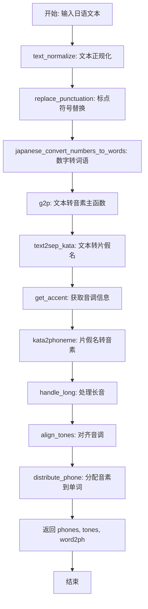
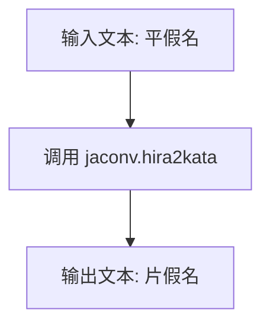
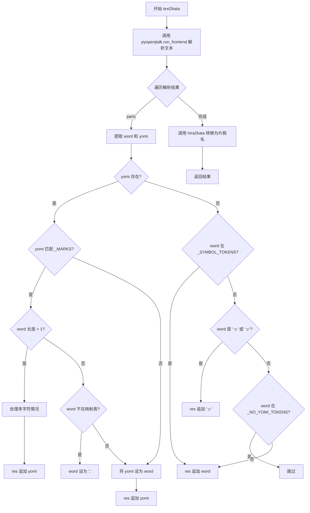
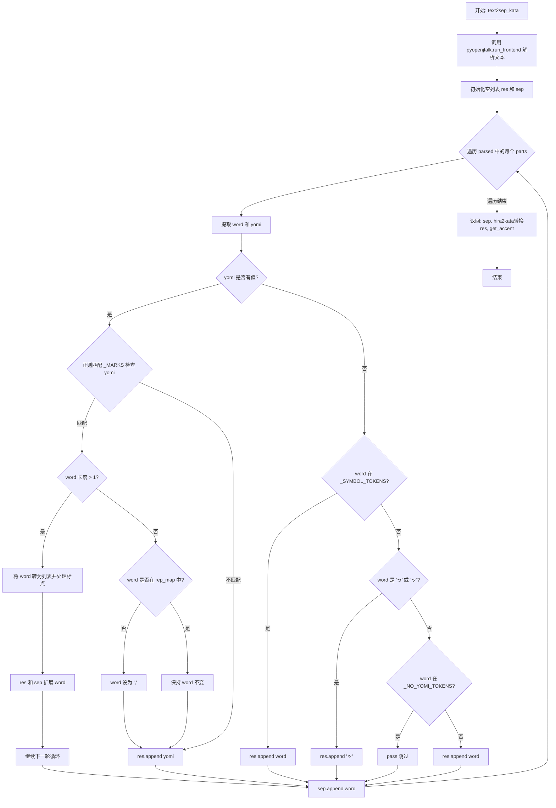
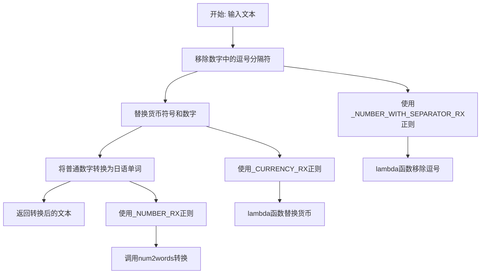
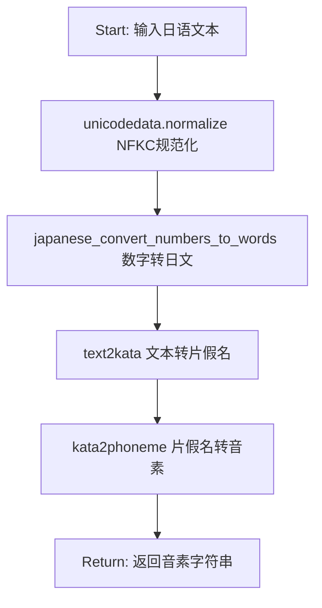
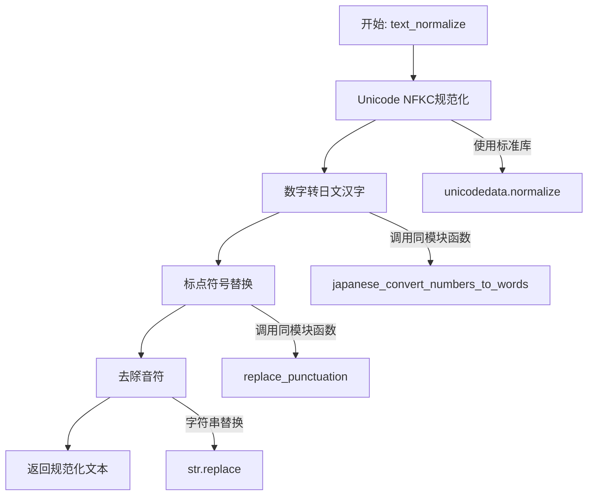
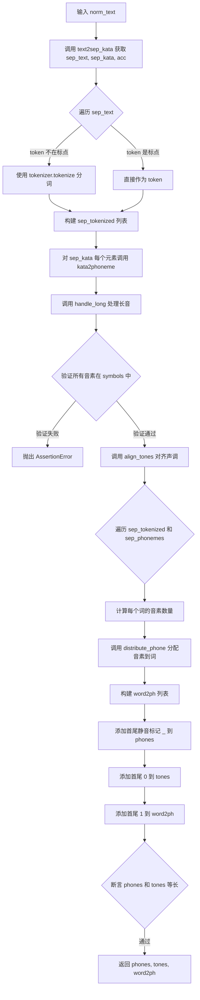

# `Bert-VITS2\oldVersion\V220\text\japanese.py` 详细设计文档

该代码库主要实现日语文本到音素的转换功能，支持数字、标点符号、特殊字符的转换，并通过pyopenjtalk和jaconv等库进行文本正规化和语音学处理，最终生成兼容Julius语音识别工具的音素序列。

## 整体流程



## 类结构

```
模块: japanese_text_to_phonemes (主模块)
├── 子模块: punctuation (标点符号定义)
├── 子模块: symbols (音素符号定义)
└── 子模块: text.japanese_bert (BERT特征提取)
```

## 全局变量及字段


### `_SYMBOL_TOKENS`
    
用于识别和处理日语符号标记的集合，包括句号、逗号、问号、感叹号等

类型：`set`
    


### `_NO_YOMI_TOKENS`
    
存储没有对应读音的日语标记集合，如引号、括号等

类型：`set`
    


### `_MARKS`
    
编译后的正则表达式，用于匹配非日语字符（包括假名、汉字、数字、英文字母等）

类型：`re.Pattern`
    


### `_ALPHASYMBOL_YOMI`
    
字母和符号到日语读音的映射字典，用于将英文字母和希腊字母转换为对应的日语发音

类型：`dict`
    


### `_NUMBER_WITH_SEPARATOR_RX`
    
正则表达式，用于匹配带逗号分隔符的数字（如1,000）

类型：`re.Pattern`
    


### `_CURRENCY_MAP`
    
货币符号到日语单位的映射字典，包含美元、日元、英镑、欧元等

类型：`dict`
    


### `_CURRENCY_RX`
    
正则表达式，用于匹配货币表达式（如$100、¥1000）

类型：`re.Pattern`
    


### `_NUMBER_RX`
    
正则表达式，用于匹配数字（包括整数和小数）

类型：`re.Pattern`
    


### `rep_map`
    
标点符号替换映射字典，用于将各种日语和中文标点统一转换为英文标点

类型：`dict`
    


### `tokenizer`
    
预训练的日语DeBERTa分词器，用于文本分词和tokenization

类型：`AutoTokenizer`
    


    

## 全局函数及方法


### `kata2phoneme`

该函数将片假名文本转换为音素序列，处理长音符号（ー）并利用 pyopenjtalk 库进行语音转换，同时处理标点符号和特殊字符。

参数：

- `text`：`str`，输入的片假名文本

返回值：`list`，音素列表（注意：代码中类型标注为 `str` 但实际返回 `list`）

#### 流程图

```mermaid
flowchart TD
    A[开始: kata2phoneme] --> B{text是否为空或仅为空白}
    B -->|是| C[返回空列表]
    B -->|否| D{text == 'ー'}
    D -->|是| E[返回 ['ー']]
    D -->|否| F{text以'ー'开头}
    F -->|是| G[返回 ['ー'] + kata2phoneme[text[1:]]]
    F -->|否| H[初始化res=[], prev=None]
    H --> I{text不为空}
    I -->|是| J{text匹配_MARKS正则}
    J -->|是| K[res.append[text[0]]<br/>text = text[1:]]
    J -->|否| L{text以'ー'开头}
    L -->|是| M{prev存在}
    M -->|是| N[res.append[prev[-1]]<br/>text = text[1:]]
    M -->|否| O[text = text[1:]]
    L -->|否| P[res += pyopenjtalk.g2p<br/>.lower().replace<br/>.split[' ']]
    P --> Q[break退出循环]
    K --> I
    N --> I
    O --> I
    Q --> R[返回res]
    I -->|否| R
```

#### 带注释源码

```python
def kata2phoneme(text: str) -> str:
    """将片假名文本转换为音素序列。
    
    处理逻辑：
    1. 处理特殊情况：仅包含长音符号'ー'的输入
    2. 递归处理以'ー'开头的文本
    3. 遍历文本，处理标点符号和特殊字符
    4. 使用pyopenjtalk进行语音转换
    
    Args:
        text: 输入的片假名文本字符串
        
    Returns:
        list: 音素列表（注意：类型标注为str但实际返回list）
    """
    # 去除首尾空白字符
    text = text.strip()
    
    # 特殊情况1：输入仅为长音符号'ー'
    if text == "ー":
        return ["ー"]
    
    # 特殊情况2：输入以'ー'开头，递归处理剩余部分
    elif text.startswith("ー"):
        return ["ー"] + kata2phoneme(text[1:])
    
    # 初始化结果列表和前一个音素
    res = []
    prev = None
    
    # 主循环：逐字符处理文本
    while text:
        # 检查是否为标点符号或特殊标记
        if re.match(_MARKS, text):
            # 将标记添加到结果中
            res.append(text)
            # 跳过该字符
            text = text[1:]
            continue
        
        # 处理长音符号'ー'
        if text.startswith("ー"):
            if prev:
                # 重复前一个音素的最后一个音
                res.append(prev[-1])
            text = text[1:]
            continue
        
        # 使用pyopenjtalk进行语音转换
        # - pyopenjtalk.g2p(): 将文本转换为音素
        # - .lower(): 转换为小写
        # - .replace("cl", "q"): 将闭塞音cl替换为q
        # - .split(" "): 按空格分割为音素列表
        res += pyopenjtalk.g2p(text).lower().replace("cl", "q").split(" ")
        break  # 转换完成后退出循环
    
    # 返回音素列表
    # 注意：此处返回类型与函数签名中的-> str不符
    # res = _COLON_RX.sub(":", res)  # 注释掉的代码，可能是处理冒号的逻辑
    return res
```

#### 全局正则变量 `_MARKS`

- `_MARKS`：`re.compile`，用于匹配非字母数字、日语字符（平假名、片假名、汉字）和全角数字的字符

#### 技术债务/优化空间

1. **类型标注错误**：函数签声明返回 `str` 但实际返回 `list`，应修正为 `-> list`
2. **递归实现风险**：当文本中包含多个连续 'ー' 时会产生递归调用，可能导致栈溢出，建议改用迭代实现
3. **魔法字符串**：长音符号 'ー' 在多处硬编码，应提取为常量
4. **未处理的空输入**：当输入为空字符串时返回空列表 `[]`，但未在文档中说明


### `hira2kata`

该函数用于将日语文本从平假名（hiragana）转换为片假名（katakana），是日本语语音合成系统中的基础文本转换工具。

参数：

- `text`：`str`，输入的平假名文本

返回值：`str`，转换后的片假名文本

#### 流程图



#### 带注释源码

```python
def hira2kata(text: str) -> str:
    """将平假名转换为片假名。
    
    该函数是一个简单的封装函数，调用 jaconv 库的 hira2kata 方法
    实现平假名到片假名的转换。这是语音合成前处理流程中的基础步骤，
    用于统一文本的表示形式。
    
    参数:
        text: 输入的日语文本，需要是平假名形式
        
    返回:
        转换后的片假名文本字符串
    """
    return jaconv.hira2kata(text)
```


### `text2kata`

该函数是文本转语音流程中的核心组件，负责将输入的日语文本转换为片假名表示。它使用 `pyopenjtalk` 进行文本解析，提取词素和读音信息，然后通过标点符号映射和转换规则，最终将平假名结果转换为片假名输出。

参数：

- `text`：`str`，待转换的日语文本输入

返回值：`str`，转换后的片假名字符串

#### 流程图



#### 带注释源码

```python
def text2kata(text: str) -> str:
    """将日语文本转换为片假名表示
    
    处理流程：
    1. 使用 pyopenjtalk.run_frontend 解析输入文本，获取词素和读音信息
    2. 遍历每个词素，根据读音和标点符号规则进行转换
    3. 将最终结果从平假名转换为片假名
    
    参数:
        text: 输入的日语文本字符串
        
    返回:
        转换后的片假名字符串
    """
    # 使用 pyopenjtalk 的前端解析器获取文本的形态素分析结果
    # 返回格式: 列表，每个元素包含 'string'（原文本）和 'pron'（读音）字段
    parsed = pyopenjtalk.run_frontend(text)

    # 存储最终转换结果的列表
    res = []
    
    # 遍历解析后的每个词素单元
    for parts in parsed:
        # 提取当前词素的文本和读音
        # replace_punctuation: 将标点符号映射为英文符号
        # replace("'", ""): 移除读音中的单引号
        word, yomi = replace_punctuation(parts["string"]), parts["pron"].replace(
            "'", ""
        )
        
        # 判断是否存在有效读音
        if yomi:
            # 检查读音是否符合 _MARKS 正则表达式（包含非日语字符）
            if re.match(_MARKS, yomi):
                # 处理多字符词素的情况
                if len(word) > 1:
                    # 对每个字符分别进行标点符号替换
                    word = [replace_punctuation(i) for i in list(word)]
                    yomi = word
                    res += yomi
                    # 注意: 此处存在潜在 bug - sep 变量未定义
                    sep += word
                    continue
                # 处理单字符且不在映射表中的情况
                elif word not in rep_map.keys() and word not in rep_map.values():
                    word = ","
                yomi = word
            # 将处理后的读音添加到结果列表
            res.append(yomi)
        else:
            # 处理没有读音的情况（通常是符号或特殊字符）
            if word in _SYMBOL_TOKENS:
                # 符号字符直接添加到结果
                res.append(word)
            elif word in ("っ", "ッ"):
                # 促音统一转换为 'ッ'
                res.append("ッ")
            elif word in _NO_YOMI_TOKENS:
                # 无读音标记符号则跳过
                pass
            else:
                # 其他情况直接使用原文本
                res.append(word)
    
    # 将结果列表连接为字符串，并转换为片假名
    # hira2kata: 使用 jaconv 库进行平假名到片假名的转换
    return hira2kata("".join(res))
```


### `text2sep_kata`

该函数将输入的日语文本通过 pyopenjtalk 进行分词处理，分离出原始文本中的词素、对应假名发音以及重音信息，最终返回三个列表：词素列表、假名列表和重音列表。

参数：

- `text`：`str`，待处理的日语文本字符串

返回值：`(list, list, list)`，返回一个包含三个列表的元组，分别是词素列表（sep）、假名列表（hira2kata 转换后的 katakana）、以及重音列表（phoneme 和 accent 的元组列表）

#### 流程图



#### 带注释源码

```python
def text2sep_kata(text: str) -> (list, list):
    """将日语文本分词并分离为词素、假名和重音信息
    
    参数:
        text: 输入的日语文本字符串
    
    返回:
        三元素元组: (词素列表, 假名列表, 重音信息列表)
    """
    # 使用 pyopenjtalk 进行分词处理，返回分词后的词素和发音信息
    parsed = pyopenjtalk.run_frontend(text)

    # res: 存储处理后的发音/假名信息
    # sep: 存储原始词素序列
    res = []
    sep = []
    
    # 遍历每个分词结果
    for parts in parsed:
        # 提取当前词素和其假名发音
        # parts["string"]: 原始文本
        # parts["pron"]: 假名发音
        word, yomi = replace_punctuation(parts["string"]), parts["pron"].replace(
            "'", ""
        )
        
        # 如果存在假名发音
        if yomi:
            # 检查是否为标点符号（正则不匹配常见字符则为标点）
            if re.match(_MARKS, yomi):
                # 如果原词长度大于1（多字符词）
                if len(word) > 1:
                    # 对每个字符单独处理标点替换
                    word = [replace_punctuation(i) for i in list(word)]
                    yomi = word
                    res += yomi
                    sep += word
                    continue
                # 单字符词且不在替换映射表中
                elif word not in rep_map.keys() and word not in rep_map.values():
                    word = ","
                yomi = word
            # 添加处理后的发音到结果列表
            res.append(yomi)
        else:
            # 没有假名发音时的处理
            if word in _SYMBOL_TOKENS:
                # 符号标记直接添加
                res.append(word)
            elif word in ("っ", "ッ"):
                # 小写促音处理
                res.append("ッ")
            elif word in _NO_YOMI_TOKENS:
                # 无发音标记直接跳过
                pass
            else:
                # 其他情况直接添加原词
                res.append(word)
        
        # 将原始词素添加到分离列表
        sep.append(word)
    
    # 返回三个结果：
    # 1. sep: 原始词素列表
    # 2. hira2kata转换后的假名列表
    # 3. get_accent解析的重音信息
    return sep, [hira2kata(i) for i in res], get_accent(parsed)
```


### `get_accent`

该函数用于从 pyopenjtalk 解析的文本结果中提取音素（phoneme）和重音标记（accent），通过正则表达式解析语音标签文件，判断每个音素是处于重音下降（falling）、上升（rising）还是平坦（flat）状态，最终返回音素与重音的配对列表。

参数：

- `parsed`：`list`，pyopenjtalk 的 `run_frontend()` 方法返回的解析结果，包含文本的词素和发音信息

返回值：`list[tuple[str, int]]`，返回音素与重音标记的元组列表，其中整数值表示重音类型：`-1` 表示重音下降（Falling），`1` 表示重音上升（Rising），`0` 表示平坦（Flat）

#### 流程图

```mermaid
flowchart TD
    A[开始: get_accent] --> B[调用 pyopenjtalk.make_label 解析文本]
    B --> C[初始化空列表: phonemes, accents]
    C --> D[遍历 labels 中的每个 label]
    D --> E{当前 phoneme 是否为 sil/pau}
    E -->|Yes| D
    E -->|No| F[提取 phoneme 并转换为小写<br>将 'cl' 替换为 'q']
    F --> G[使用正则提取 a1: 重音位置 /A:(\-?[0-9]+)\+]
    G --> H[使用正则提取 a2: 音素在词中的位置 \+(\d+)\+]
    H --> I{下一个 label 的 phoneme<br>是否为 sil/pau}
    I -->|Yes| J[a2_next = -1]
    I -->|No| K[a2_next = 下一个 label 的 a2]
    J --> L{判断重音模式}
    K --> L
    L --> M{a1 == 0 且 a2_next == a2 + 1<br>重音下降}
    M -->|Yes| N[accents.append(-1)]
    M -->|No| O{a2 == 1 且 a2_next == 2<br>重音上升}
    O -->|Yes| P[accents.append(1)]
    O -->|No| Q[accents.append(0) 平稳]
    N --> R[将 phoneme 和 accent 配对]
    P --> R
    Q --> R
    R --> D
    D --> S[遍历结束]
    S --> T[返回 zip(phonemes, accents) 列表]
```

#### 带注释源码

```python
def get_accent(parsed):
    """
    从 pyopenjtalk 解析结果中提取音素和重音标记。
    
    该函数通过解析 pyopenjtalk 生成的 HTK 格式标签，识别每个音素的
    重音变化模式：上升、下降或平坦。
    
    参数:
        parsed: pyopenjtalk.run_frontend() 返回的解析结果列表，
                每个元素包含 'string' 和 'pron' 键
    
    返回:
        list: 音素与重音配对的元组列表，格式为 [(phoneme, accent), ...]
              accent 取值: -1 (下降), 0 (平坦), 1 (上升)
    """
    # 将解析结果转换为 HTK 格式标签
    labels = pyopenjtalk.make_label(parsed)

    # 存储提取的音素和重音标记
    phonemes = []
    accents = []
    
    # 遍历每个标签进行解析
    for n, label in enumerate(labels):
        # 使用正则表达式提取音素部分: 模式为 -phoneme+
        # 例如: "sil@+a:+i" 中的 "a"
        phoneme = re.search(r"\-([^\+]*)\+", label).group(1)
        
        # 跳过静音标记 (sil: silence, pau: pause)
        if phoneme not in ["sil", "pau"]:
            # 将 'cl' (closure) 转换为 'q' (喉塞音)
            # 并转换为小写
            phonemes.append(phoneme.replace("cl", "q").lower())
        else:
            # 遇到静音标记时跳过当前迭代
            continue
        
        # 提取重音核位置 a1: /A:(\-?[0-9]+)\+
        # a1 表示重音核在音素序列中的绝对位置
        a1 = int(re.search(r"/A:(\-?[0-9]+)\+", label).group(1))
        
        # 提取当前音素在词中的索引位置 a2: \+(\d+)\+
        a2 = int(re.search(r"\+(\d+)\+", label).group(1))
        
        # 检查下一个标签是否为静音
        # 如果是，则将下一个音素的 a2_next 设为 -1
        if re.search(r"\-([^\+]*)\+", labels[n + 1]).group(1) in ["sil", "pau"]:
            a2_next = -1
        else:
            # 否则提取下一个音素的索引位置
            a2_next = int(re.search(r"\+(\d+)\+", labels[n + 1]).group(1))
        
        # 判断重音变化模式
        # Falling (下降): 重音核在位置 0，且下一个音素索引递增
        if a1 == 0 and a2_next == a2 + 1:
            accents.append(-1)
        # Rising (上升): 当前音素索引为 1，下一个为 2
        elif a2 == 1 and a2_next == 2:
            accents.append(1)
        else:
            # Flat (平坦): 其他情况
            accents.append(0)
    
    # 将音素和重音标记配对返回
    return list(zip(phonemes, accents))
```


### `japanese_convert_numbers_to_words`

该函数将日语文本中的数字（包括带分隔符的数字、货币符号和普通数字）转换为对应的日语单词表示形式，使用正则表达式匹配不同格式的数字，并通过 `num2words` 库进行转换。

参数：

-  `text`：`str`，输入的日语文本字符串，包含需要转换的数字

返回值：`str`，返回转换后的文本，其中所有数字已被转换为日语单词形式

#### 流程图



#### 带注释源码

```python
# 全局正则表达式：匹配带分隔符的数字（如1,234或1,234,567）
_NUMBER_WITH_SEPARATOR_RX = re.compile("[0-9]{1,3}(,[0-9]{3})+")

# 货币符号到日语的映射字典
_CURRENCY_MAP = {"$": "ドル", "¥": "円", "£": "ポンド", "€": "ユーロ"}

# 正则表达式：匹配货币符号 followed by 数字（如$100, ¥500）
_CURRENCY_RX = re.compile(r"([$¥£€])([0-9.]*[0-9])")

# 正则表达式：匹配普通数字（整数或小数）
_NUMBER_RX = re.compile(r"[0-9]+(\.[0-9]+)?")


def japanese_convert_numbers_to_words(text: str) -> str:
    """
    将日语文本中的数字转换为日语单词表示形式
    
    处理流程：
    1. 首先移除数字中的千位分隔符（逗号）
    2. 处理货币符号，将货币符号放在数字后面
    3. 将剩余的数字转换为日语单词
    
    Args:
        text: 输入的日语文本字符串
        
    Returns:
        转换后的文本，数字已被替换为日语单词
    """
    # 步骤1：移除数字中的逗号分隔符
    # 例如 "1,234" -> "1234"
    res = _NUMBER_WITH_SEPARATOR_RX.sub(lambda m: m[0].replace(",", ""), text)
    
    # 步骤2：处理货币符号
    # 将 "$100" 转换为 "100ドル"，"¥500" 转换为 "500円"
    res = _CURRENCY_RX.sub(lambda m: m[2] + _CURRENCY_MAP.get(m[1], m[1]), res)
    
    # 步骤3：将数字转换为日语单词
    # 使用 num2words 库将 "123" 转换为 "百二十三" 或对应日语
    res = _NUMBER_RX.sub(lambda m: num2words(m[0], lang="ja"), res)
    
    return res
```

#### 相关全局变量

| 变量名 | 类型 | 描述 |
|--------|------|------|
| `_NUMBER_WITH_SEPARATOR_RX` | `re.Pattern` | 匹配带逗号分隔符的数字（如1,234）的正则表达式 |
| `_CURRENCY_MAP` | `dict` | 货币符号到日语的映射字典（$→ドル，¥→円等） |
| `_CURRENCY_RX` | `re.Pattern` | 匹配货币符号+数字组合的正则表达式 |
| `_NUMBER_RX` | `re.Pattern` | 匹配普通数字（整数或小数）的正则表达式 |
| `num2words` | `function` | 从 num2words 库导入的函数，用于将数字转换为文字 |

#### 技术债务与优化空间

1. **错误处理缺失**：如果 `num2words` 库对某些特殊数字格式处理失败，函数会抛出异常而没有错误处理
2. **正则表达式性能**：多次使用 `sub` 和 lambda 函数可能影响性能，可以考虑合并某些正则表达式
3. **硬编码映射**：货币映射是硬编码的，可考虑外部配置化
4. **数字范围限制**：没有处理超大数字（超过万亿级别），可能需要扩展 `num2words` 的 lang 参数配置

#### 外部依赖

- `num2words`：用于将数字转换为日语单词的第三方库
- `re`：Python 内置的正则表达式模块


### `japanese_convert_alpha_symbols_to_words`

将文本中的拉丁字母、希腊字母及特殊符号转换为对应的日文读音词（如 "a" → "エー", "α" → "アルファ"）。

参数：

- `text`：`str`，需要转换的输入文本

返回值：`str`，转换后的文本，将所有字母符号替换为日文读音后重新拼接

#### 流程图

```mermaid
flowchart TD
    A[开始: 输入 text] --> B[调用 text.lower 将文本转为小写]
    B --> C[遍历文本中的每个字符 ch]
    C --> D{检查 ch 是否在 _ALPHASYMBOL_YOMI 字典中}
    D -->|是| E[获取字典值 _ALPHASYMBOL_YOMI[ch]]
    D -->|否| F[返回原字符 ch]
    E --> G[将结果加入列表]
    F --> G
    G --> H{是否还有未处理的字符}
    H -->|是| C
    H -->|否| I[使用 ''.join 拼接所有结果]
    I --> J[返回转换后的字符串]
```

#### 带注释源码

```python
def japanese_convert_alpha_symbols_to_words(text: str) -> str:
    """
    将文本中的字母和符号转换为对应的日文读音词。
    
    该函数遍历输入文本的每个字符，查找预定义的映射字典 _ALPHASYMBOL_YOMI，
    将拉丁字母(a-z)、希腊字母(α-ω)及特殊符号(#, %, &, @等)转换为日文读音。
    如果字符不在映射字典中，则保留原字符。
    
    参数:
        text (str): 需要转换的输入文本，例如 "Hello α"
    
    返回:
        str: 转换后的字符串，例如 "はいら α"
    """
    # 步骤1: 将输入文本转换为小写，确保大小写字母都能正确映射
    # 步骤2: 使用列表推导式遍历每个字符
    # 步骤3: 对每个字符调用 dict.get(key, default) 方法
    #        - 如果字符在字典中，返回对应的日文读音
    #        - 如果字符不在字典中，返回原字符本身
    # 步骤4: 使用 join 方法将所有转换后的字符拼接成字符串
    return "".join([_ALPHASYMBOL_YOMI.get(ch, ch) for ch in text.lower()])
```

#### 相关全局变量

| 变量名 | 类型 | 描述 |
|--------|------|------|
| `_ALPHASYMBOL_YOMI` | `dict` | 映射字典，将拉丁字母、希腊字母及特殊符号映射到对应的日文读音词 |

#### 映射字典示例

```python
# 部分映射关系展示
_ALPHASYMBOL_YOMI = {
    "#": "シャープ",   # 井号
    "%": "パーセント", # 百分号
    "a": "エー",      # 拉丁字母 A
    "b": "ビー",
    "α": "アルファ",   # 希腊字母 Alpha
    "β": "ベータ",    # 希腊字母 Beta
    # ... 共约70个映射条目
}
```


### `japanese_text_to_phonemes`

该函数是日本语文本转音素的核心入口函数，接收日语文本字符串，经过Unicode规范化、数字转换、片假名转换和音素转换四个步骤，输出与Julius语音识别工具兼容的音素序列。

参数：

-  `text`：`str`，待转换的日语文本输入

返回值：`str`，转换后的音素字符串

#### 流程图



#### 带注释源码

```python
def japanese_text_to_phonemes(text: str) -> str:
    """Convert Japanese text to phonemes.
    
    该函数是日本语文本转音素的主入口函数，按照以下流程处理：
    1. 使用NFKC方式规范化Unicode字符
    2. 将阿拉伯数字转换为日文读法
    3. 将文本转换为片假名表示
    4. 将片假名转换为音素序列
    
    Args:
        text: 输入的日语文本字符串
        
    Returns:
        转换后的音素字符串，兼容Julius语音识别工具
    """
    # Step 1: Unicode NFKC规范化，统一字符表示形式
    # 例如将全角字符转换为半角，将组合字符分解为基本字符
    res = unicodedata.normalize("NFKC", text)
    
    # Step 2: 将阿拉伯数字转换为日文单词读法
    # 例如 "123" 转换为 "百二十三"
    res = japanese_convert_numbers_to_words(res)
    
    # Note: 字母符号转日文功能被注释掉
    # res = japanese_convert_alpha_symbols_to_words(res)
    
    # Step 3: 将规范化后的文本转换为片假名
    # 使用pyopenjtalk进行形态素分析，获取读音信息
    res = text2kata(res)
    
    # Step 4: 将片假名转换为音素表示
    # 处理长音符号"ー"等特殊字符，输出音素序列
    res = kata2phoneme(res)
    
    # 返回最终音素结果
    return res
```


### `is_japanese_character`

该函数用于检测输入的单个字符是否为日语字符（包括平假名、片假名、日语汉字及其扩展字符）。

参数：

- `char`：`str`，需要检测是否为日语字符的单个字符

返回值：`bool`，如果输入字符属于日语字符范围（平假名、片假名、汉字等），则返回 `True`；否则返回 `False`

#### 流程图

```mermaid
flowchart TD
    A[开始: 输入字符 char] --> B[将字符转换为Unicode码点: char_code = ord(char)]
    B --> C{遍历 japanese_ranges 列表}
    C -->|取出一个范围| D{检查 char_code 是否在范围内}
    D -->|是| E[返回 True]
    D -->|否| C
    C -->|全部检查完毕| F[返回 False]
```

#### 带注释源码

```python
def is_japanese_character(char):
    """检测给定字符是否为日语字符（平假名、片假名、汉字等）。
    
    参数:
        char: 需要检测的单个字符
        
    返回:
        bool: 如果字符是日语字符返回True，否则返回False
    """
    
    # 定义日语文字系统的 Unicode 范围
    japanese_ranges = [
        (0x3040, 0x309F),  # 平假名 (Hiragana)
        (0x30A0, 0x30FF),  # 片假名 (Katakana)
        (0x4E00, 0x9FFF),  # 汉字 (CJK Unified Ideographs)
        (0x3400, 0x4DBF),  # 汉字扩展 A (CJK Unified Ideographs Extension A)
        (0x20000, 0x2A6DF),  # 汉字扩展 B (CJK Unified Ideographs Extension B)
        # 可以根据需要添加其他汉字扩展范围
    ]

    # 将字符的 Unicode 编码转换为整数
    char_code = ord(char)

    # 检查字符是否在任何一个日语范围内
    for start, end in japanese_ranges:
        if start <= char_code <= end:
            return True

    return False
```


### `replace_punctuation`

该函数用于将日语文本中的标点符号替换为ASCII equivalents，并移除非日语字符（保留平假名、片假名、汉字和指定标点符号）。

参数：

-  `text`：`str`，需要进行标点符号替换和清理的日语文本

返回值：`str`，替换标点符号并清理非日语字符后的文本

#### 流程图

```mermaid
flowchart TD
    A[开始] --> B[编译正则表达式模式<br/>from rep_map keys]
    --> C[使用lambda替换匹配项<br/>pattern.sub lambda x: rep_map[x.group()]]
    --> D[应用第二个正则表达式<br/>移除非日语字符]
    --> E[返回处理后的文本 replaced_text]
    E --> F[结束]
    
    B -->|re.escape| B1[转义rep_map中所有标点符号]
    B1 --> C
    D -->|保留范围| D1[^\u3040-\u309F\u30A0-\u30FF<br/>u4E00-\u9FFF\u3400-\u4DBF\u3005]
    D1 --> E
```

#### 带注释源码

```python
def replace_punctuation(text):
    """
    将日语文本中的标点符号替换为ASCII equivalents，并移除非日语字符。
    
    处理流程：
    1. 将日文/中文标点映射到ASCII标点
    2. 移除非日语字符（保留假名、汉字、特定标点）
    
    参数:
        text: 输入的日语文本字符串
        
    返回:
        替换标点并清理后的文本字符串
    """
    # Step 1: 构建正则表达式模式，匹配rep_map中定义的所有标点符号
    # rep_map包含日文标点如 "：" -> "," , "。" -> "." 等
    # re.escape()用于转义特殊字符
    pattern = re.compile("|".join(re.escape(p) for p in rep_map.keys()))
    
    # Step 2: 使用pattern替换文本中的标点符号
    # lambda函数根据匹配到的标点返回对应的ASCII标点
    # 例如：将 "こんにちは、世界" 转换为 "こんにちは,世界"
    replaced_text = pattern.sub(lambda x: rep_map[x.group()], text)
    
    # Step 3: 移除非日语字符
    # 保留的字符范围：
    # - \u3040-\u309F: 平假名 (Hiragana)
    # - \u30A0-\u30FF: 片假名 (Katakana)
    # - \u4E00-\u9FFF: CJK统一表意文字 (CJK Unified Ideographs)
    # - \u3400-\u4DBF: CJK统一表意文字扩展A (CJK Extension A)
    # - \u3005: 叠字符号 (Iteration mark)
    # - punctuation: 从模块导入的额外标点符号
    replaced_text = re.sub(
        r"[^\u3040-\u309F\u30A0-\u30FF\u4E00-\u9FFF\u3400-\u4DBF\u3005"
        + "".join(punctuation)
        + r"]+",
        "",
        replaced_text,
    )
    
    # 返回处理后的文本
    return replaced_text
```


### `text_normalize`

该函数是日语文本规范化的核心入口，通过Unicode规范化、数字转日文汉字、标点符号替换和去除特殊音符等步骤，将原始日语文本转换为可供语音合成使用的规范化形式。

参数：

-  `text`：`str`，待规范化的原始日语文本

返回值：`str`，规范化处理后的日语文本字符串

#### 流程图



#### 带注释源码

```python
def text_normalize(text):
    """
    日语文本规范化主函数
    
    处理流程:
    1. Unicode NFKC规范化 - 统一字符表示形式
    2. 数字转日文汉字 - 将阿拉伯数字转为日文读法
    3. 标点符号替换 - 将全角标点转为半角
    4. 去除特殊音符 - 移除平假名上的浊点音符
    
    参数:
        text: str - 原始日语文本输入
    
    返回:
        str - 规范化后的日语文本
    """
    # Step 1: Unicode NFKC规范化
    # 将文本统一为NFKC标准形式,处理全角半角字符统一等问题
    res = unicodedata.normalize("NFKC", text)
    
    # Step 2: 将阿拉伯数字转换为日文汉字读法
    # 例如: "123" -> "百二十三"
    res = japanese_convert_numbers_to_words(res)
    
    # Step 3: 替换标点符号
    # 将全角标点(，。！？等)转换为半角符号,并处理引号括号等特殊符号映射
    res = replace_punctuation(res)
    
    # Step 4: 去除平假名浊点音符
    # 移除゙(浊点符号),如"が"去除后变"か"
    res = res.replace("゙", "")
    
    # 返回规范化后的文本
    return res
```

#### 依赖函数信息

##### `japanese_convert_numbers_to_words`

将文本中的阿拉伯数字转换为日文汉字读法

- 参数：`text` - `str`，待处理的文本
- 返回值：`str`，数字转换为日文汉字后的文本

##### `replace_punctuation`

将日语文本中的全角标点符号替换为半角符号

- 参数：`text` - `str`，待处理的文本
- 返回值：`str`，标点替换后的文本

#### 全局变量依赖

| 变量名 | 类型 | 描述 |
|--------|------|------|
| `rep_map` | `dict` | 标点符号映射表，定义全角到半角的转换规则 |
| `_NUMBER_WITH_SEPARATOR_RX` | `re.Pattern` | 千分位数字正则表达式 |
| `_CURRENCY_MAP` | `dict` | 货币符号映射表 |
| `_CURRENCY_RX` | `re.Pattern` | 货币金额正则表达式 |
| `_NUMBER_RX` | `re.Pattern` | 数字正则表达式 |

#### 技术债务与优化空间

1. **代码注释中的死代码**：存在被注释掉的行 `# res = "".join([i for i in res if is_japanese_character(i)])`，如果不需要应删除
2. **标点符号映射表不完整**：`rep_map`中定义了部分映射，但`text2kata`函数中引用了`rep_map`可能存在KeyError风险
3. **缺乏输入验证**：函数未对输入进行空值检查或类型校验
4. **错误处理缺失**：数字转换和标点替换过程没有异常捕获机制
5. **可测试性不足**：建议添加单元测试覆盖边界情况（如空字符串、纯数字、纯标点等）


### `distribute_phone`

该函数实现了一个简单的负载均衡算法，用于将总音素数（`n_phone`）尽可能均匀地分配给单词数（`n_word`）。它返回一个列表，列表中的每个元素代表对应单词所分配到的音素数量，确保每个单词获得的音素数量差异不超过 1。

参数：

- `n_phone`：`int`，需要分配的总音素数量。
- `n_word`：`int`，目标单词的总数。

返回值：`list`，返回一个包含 `n_word` 个整数的列表，其中每个整数表示对应单词分配到的音素数量。

#### 流程图

```mermaid
graph TD
    A([开始]) --> B[初始化 phones_per_word = [0] * n_word]
    B --> C{循环 index 从 0 到 n_phone - 1}
    C -- 是 --> D[查找当前列表中的最小值 min_tasks]
    D --> E[查找最小值对应的索引 min_index]
    E --> F[phones_per_word[min_index] += 1]
    F --> C
    C -- 否 --> G[返回 phones_per_word 列表]
    G --> H([结束])
```

#### 带注释源码

```python
def distribute_phone(n_phone, n_word):
    """
    将 n_phone 个音素均匀分配给 n_word 个单词。
    
    参数:
        n_phone (int): 需要分配的总音素数量。
        n_word (int): 目标单词的总数。
        
    返回:
        list: 一个长度为 n_word 的列表，其中每个元素表示对应单词分配到的音素数量。
    """
    # 创建一个长度为 n_word 的列表，初始化所有值为 0
    # 用于记录每个单词当前分配到的音素数量
    phones_per_word = [0] * n_word
    
    # 遍历每一个需要分配的音素
    for task in range(n_phone):
        # 找出当前所有单词中，分配音素最少的数量
        min_tasks = min(phones_per_word)
        
        # 找到这个最小值对应的单词索引（如果多个单词数量相同，默认选择第一个）
        min_index = phones_per_word.index(min_tasks)
        
        # 将该单词的分配计数加 1，实现了尽可能均匀的分配
        phones_per_word[min_index] += 1
        
    return phones_per_word
```


### `handle_long`

处理片假名长音符号"ー"，将其替换为前一个假名的最后一个音素，以确保语音合成的准确性。

参数：

- `sep_phonemes`：`List[List[str]]`，二维列表，包含多个音素列表，每个内部列表代表一个假名对应的音素序列

返回值：`List[List[str]]`，返回处理完长音符号"ー"后的二维音素列表

#### 流程图

```mermaid
flowchart TD
    A[开始 handle_long] --> B{检查 sep_phonemes 是否为空}
    B -->|是| Z[直接返回原列表]
    B -->|否| C[遍历 sep_phonemes 列表]
    
    C --> D{当前元素 sep_phonemes[i] 第一个音素是否为 'ー'}
    D -->|是| E[将 sep_phonemes[i][0] 替换为 sep_phonemes[i-1][-1]]
    E --> F{当前元素是否包含 'ー'}
    D -->|否| F
    
    F -->|是| G[遍历当前音素列表的每个元素]
    G --> H{当前音素是否为 'ー'}
    H -->|是| I[将当前 'ー' 替换为前一个音素的最后一个字符]
    I --> J[继续遍历下一个音素]
    H -->|否| J
    G --> K{遍历完成?}
    K -->|否| H
    K -->|是| L[继续外层遍历下一个元素]
    F -->|否| L
    
    C --> M{遍历完成?}
    M -->|否| D
    M -->|是| N[返回处理后的 sep_phonemes]
    Z --> N
```

#### 带注释源码

```python
def handle_long(sep_phonemes):
    """
    处理片假名长音符号"ー"的替换。
    
    日语中的长音符号"ー"表示延长前一个假名的元音，
    该函数将其替换为前一个假名的最后一个音素，
    以确保语音合成时能够正确发音。
    
    参数:
        sep_phonemes: 二维列表，外层列表每个元素代表一个假名对应的音素列表
        
    返回:
        处理完长音符号后的二维音素列表
    """
    # 遍历每个假名对应的音素列表
    for i in range(len(sep_phonemes)):
        # 情况1：如果当前音素列表的第一个音素是长音符号"ー"
        # 将其替换为前一个假名音素列表的最后一个音素
        if sep_phonemes[i][0] == "ー":
            sep_phonemes[i][0] = sep_phonemes[i - 1][-1]
        
        # 情况2：如果当前音素列表中包含长音符号"ー"（不限于第一个）
        # 遍历当前音素列表，将每个"ー"替换为前一个音素的最后一个字符
        if "ー" in sep_phonemes[i]:
            for j in range(len(sep_phonemes[i])):
                if sep_phonemes[i][j] == "ー":
                    # 将"ー"替换为前一音素的最后一个字符
                    # 例如：前一个音素是"キ"（ki），则"ー"变为"i"
                    sep_phonemes[i][j] = sep_phonemes[i][j - 1][-1]
    
    # 返回处理后的音素列表
    return sep_phonemes
```

#### 备注

该函数主要解决日语音素合成中的长音符号处理问题。在日语语音合成中，长音符号"ー"需要根据其前面的假名元音进行正确替换，例如：
- "カー" (kaa) → ["k", "a"] + ["k", "a"] → 处理后保持一致性
- 当前实现通过查找前一音素的最后一个字符来实现这一转换


### `align_tones`

将音素序列与对应的声调（重音）信息进行对齐，为每个音素分配相应的声调值。该函数处理日语语音合成中的声调对齐问题，将来自文本分析的重音信息映射到音素序列上。

参数：

- `phones`：`List[List[str]]`，音素列表的列表，外层列表每个元素对应一个单词的音素序列，内层列表为该单词的所有音素
- `tones`：`List[Tuple[str, int]]`，声调元组列表，每个元素为(音素, 重音值)对，来源于`get_accent`函数的输出

返回值：`List[int]`，扁平化后的声调值列表，与所有音素一一对应，值为0、1、2、3之一，分别表示无声调、单词重音位置、上升调、下降调

#### 流程图

```mermaid
flowchart TD
    A[开始 align_tones] --> B[初始化空结果列表 res]
    B --> C[遍历 phones 中的每个 pho]
    C --> D[创建临时列表 temp, 长度与 pho 相同, 初始值为 0]
    D --> E[遍历 pho 中的每个音素 p 及索引 idx]
    E --> F{tones 列表是否为空?}
    F -->|是| G[跳出内层循环]
    F -->|否| H{p 是否等于 tones[0][0]?}
    H -->|否| I[继续下一音素]
    H -->|是| J[将 temp[idx] 设为 tones[0][1]]
    J --> K{idx > 0?}
    K -->|是| L[temp[idx] += temp[idx-1]]
    K -->|否| M[弹出 tones[0]]
    L --> M
    M --> I
    I --> E
    G --> N[在 temp 开头加 0]
    N --> O[去掉 temp 最后一个元素]
    O --> P{temp 中是否有 -1?}
    P -->|是| Q[temp 所有元素 +1]
    P -->|否| R[将 temp 加入 res]
    Q --> R
    R --> C
    S{遍历完成?}
    S -->|否| C
    S --> T[扁平化 res 列表]
    T --> U[断言: 所有值在 0-1 之间]
    U --> V[返回结果列表]
```

#### 带注释源码

```python
def align_tones(phones, tones):
    """
    将音素序列与声调对齐
    
    参数:
        phones: List[List[str]] - 音素列表的列表，外层每个元素对应一个单词
        tones: List[Tuple[str, int]] - (音素, 重音)元组列表
    
    返回:
        List[int] - 扁平化后的声调序列
    """
    res = []  # 存储最终结果的列表
    
    # 遍历每个单词的音素序列
    for pho in phones:
        temp = [0] * len(pho)  # 初始化临时列表，长度为当前单词的音素数
        
        # 遍历当前单词的每个音素
        for idx, p in enumerate(pho):
            if len(tones) == 0:  # 如果声调列表已空，跳出循环
                break
            # 匹配当前音素与声调列表的第一个元素
            if p == tones[0][0]:
                temp[idx] = tones[0][1]  # 分配重音值
                if idx > 0:
                    # 累加前一个音素的声调值（处理连读情况）
                    temp[idx] += temp[idx - 1]
                tones.pop(0)  # 移除已匹配的声调
        
        # 边界处理：在开头添加0，去掉末尾元素（实现音素与声调偏移对齐）
        temp = [0] + temp
        temp = temp[:-1]
        
        # 处理下降调标记：将-1转为1（重音核后移）
        if -1 in temp:
            temp = [i + 1 for i in temp]
        
        res.append(temp)  # 将处理后的声调添加到结果
    
    # 扁平化：将嵌套列表转为一位列表
    res = [i for j in res for i in j]
    
    # 断言验证：确保所有声调值在有效范围内 [0, 1]
    assert not any([i < 0 for i in res]) and not any([i > 1 for i in res])
    
    return res
```


### `rearrange_tones`

该函数用于重新排列音调（tones）信息，根据当前音调与前一个音调的关系以及对应的电话号码（phones）中的标点符号情况，生成新的音调模式序列。主要用于日语语音合成中处理音调变化。

参数：

- `tones`：`list`，表示输入的音调序列，通常包含整数类型的音调值（0表示无声或平调，1表示上升，-1表示下降等）
- `phones`：`list`，表示对应的电话号码/音素序列，用于判断标点符号位置

返回值：`list`，返回重新排列后的音调模式列表，值为0、1、2、3等整数，代表不同的音调类型

#### 流程图

```mermaid
flowchart TD
    A[开始 rearrange_tones] --> B[初始化 res 列表长度为 len tones]
    B --> C{遍历 i 从 0 到 len tones - 1}
    C --> D{i == 0?}
    D -->|是| E{tones[0] 不在 punctuation 中?}
    E -->|是| F[res[0] = 1]
    E -->|否| G[res[0] 保持 0]
    D -->|否| H{tones[i] == prev?}
    H -->|是| I{phones[i] 在 punctuation 中?}
    I -->|是| J[res[i] = 0]
    I -->|否| K[res[i] = 1]
    H -->|否| L{tones[i] > prev?}
    L -->|是| M[res[i] = 2]
    L -->|否| N{tones[i] < prev?}
    N -->|是| O[res[i-1] = 3, res[i] = 1]
    N -->|否| P[保持 res[i] 为 0]
    O --> Q[prev = tones[i]]
    F --> Q
    G --> Q
    J --> Q
    K --> Q
    M --> Q
    P --> Q
    Q --> C
    C -->|遍历完成| R[返回 res]
```

#### 带注释源码

```python
def rearrange_tones(tones, phones):
    """重新排列音调序列，根据音调变化和标点符号位置生成新的音调模式
    
    参数:
        tones: 音调序列列表，包含整数类型的音调值
        phones: 对应的电话号码/音素列表，用于判断标点符号
    
    返回:
        重新排列后的音调模式列表
    """
    # 初始化结果列表，长度与输入音调序列相同，初始值全为0
    res = [0] * len(tones)
    
    # 遍历音调序列中的每个元素
    for i in range(len(tones)):
        # 处理第一个元素（索引为0）
        if i == 0:
            # 如果第一个音调不在标点符号集合中，则标记为1（需要重读）
            if tones[i] not in punctuation:
                res[i] = 1
        # 如果当前音调等于前一个音调（平调情况）
        elif tones[i] == prev:
            # 检查对应的电话号码是否为标点符号
            if phones[i] in punctuation:
                # 如果是标点符号，设置音调为0
                res[i] = 0
            else:
                # 如果不是标点符号，设置音调为1
                res[i] = 1
        # 如果当前音调大于前一个音调（升调）
        elif tones[i] > prev:
            res[i] = 2
        # 如果当前音调小于前一个音调（降调）
        elif tones[i] < prev:
            # 前一个位置标记为3（降调结束），当前位置标记为1
            res[i - 1] = 3
            res[i] = 1
        # 更新 prev 变量为当前音调，供下一次迭代使用
        prev = tones[i]
    
    return res
```

#### 技术债务与潜在问题

1. **变量未初始化Bug**：`prev`变量在第一次循环时（i=0后的下一次迭代）被使用，但从未被初始化。代码逻辑中`prev`应该在循环开始前有一个初始值，否则会在运行时产生`NameError`或导致意外行为。这是一个明显的代码错误。

2. **逻辑假设问题**：函数假设`tones`和`phones`长度一致，且假设`prev`变量在第一次比较前已被赋值，这些假设可能在使用时导致边界情况错误。

3. **返回值语义不明确**：返回的0、1、2、3具体代表什么含义（如重读、轻读、升调、降调等）缺乏文档说明，可读性较差。


### `g2p`

该函数是日语文本转音素（Grapheme-to-Phoneme）的核心方法，接收规范化后的日语文本，经过分词、假名转换、音素提取、声调对齐和词素-音素映射等步骤，输出音素序列、声调序列和词素到音素的对齐信息。

参数：

-  `norm_text`：`str`，已规范化的日语文本输入

返回值：`(list, list, list)`，返回三个列表——`phones`（音素序列，首尾含静音标记`_`）、`tones`（声调序列，与音素等长）、`word2ph`（词素到音素的映射长度）

#### 流程图



#### 带注释源码

```python
def g2p(norm_text):
    """将规范化日语文本转换为音素序列、声调序列和词素-音素对齐
    
    参数:
        norm_text: str, 已通过 text_normalize 处理过的日语文本
        
    返回:
        tuple: (phones, tones, word2ph)
            - phones: list, 音素列表，首尾包含静音标记 '_'
            - tones: list, 声调列表，与 phones 等长
            - word2ph: list, 词素到音素的对齐长度列表
    """
    # 第一步：调用 text2sep_kata 进行文本分离，获取分离后的文本、片假名和重音信息
    # sep_text: 分离后的文本列表
    # sep_kata: 对应的片假名列表
    # acc: 重音标注信息
    sep_text, sep_kata, acc = text2sep_kata(norm_text)
    
    # 第二步：对分离后的文本进行分词（tokenize）
    # 使用预训练的 tokenizer 对每个文本片段进行分词
    # 标点符号直接作为单一 token
    sep_tokenized = []
    for i in sep_text:
        if i not in punctuation:
            sep_tokenized.append(tokenizer.tokenize(i))
        else:
            sep_tokenized.append([i])

    # 第三步：将片假名转换为音素
    # 对每个片假名调用 kata2phoneme 获取对应的音素序列
    # handle_long 函数用于处理长音（如 "ー"）的情况，将其转换为前一个音素
    sep_phonemes = handle_long([kata2phoneme(i) for i in sep_kata])
    
    # 第四步：异常处理与验证
    # 验证所有生成的音素都在预定义的 symbols 集合中
    # 这是一个安全检查，确保没有未知的音素（可能由生僻词导致）
    # 异常处理，MeCab不认识的词的话会一路传到这里来，然后炸掉。目前来看只有那些超级稀有的生僻词会出现这种情况
    for i in sep_phonemes:
        for j in i:
            assert j in symbols, (sep_text, sep_kata, sep_phonemes)
    
    # 第五步：声调对齐
    # 将重音信息 acc 与音素序列对齐，生成声调序列
    tones = align_tones(sep_phonemes, acc)

    # 第六步：计算词素到音素的映射
    # 遍历每个分词后的 token 和对应的音素序列
    # 计算每个词应该对应多少个音素，实现软对齐
    word2ph = []
    for token, phoneme in zip(sep_tokenized, sep_phonemes):
        phone_len = len(phoneme)  # 音素数量
        word_len = len(token)      # 词素数量

        # 使用 distribute_phone 将 phone_len 个音素分配到 word_len 个词中
        # 实现尽量均匀的分配
        aaa = distribute_phone(phone_len, word_len)
        word2ph += aaa
    
    # 第七步：添加首尾标记
    # phones 首尾添加静音标记 '_'，表示句子边界
    phones = ["_"] + [j for i in sep_phonemes for j in i] + ["_"]
    # tones 首尾添加 0，表示边界处无重音
    # 注意：rearrange_tones 函数被注释掉，未启用
    # tones = [0] + rearrange_tones(tones, phones[1:-1]) + [0]
    tones = [0] + tones + [0]
    # word2ph 首尾添加 1，表示边界处词素与音素一对一对应
    word2ph = [1] + word2ph + [1]
    
    # 第八步：最终验证
    # 确保音素序列和声调序列长度一致
    assert len(phones) == len(tones)
    
    # 返回最终结果
    return phones, tones, word2ph
```

## 关键组件


### 文本规范化 (Text Normalization)

负责将原始日语文本转换为统一格式，包括 Unicode 规范化、数字转日文词汇、标点符号替换等预处理操作，是整个流程的前置步骤。

### 假名转换 (Kana Conversion)

将平假名转换为片假名 (hira2kata)，以及将片假名转换为音素序列 (kata2phoneme)，实现假名到发音的映射。

### OpenJTalk 集成 (OpenJTalk Integration)

调用 pyopenjtalk 库的 run_frontend 和 make_label 函数进行日语文本解析，提取词素、读音和重音信息，是获取日语发音数据的核心依赖。

### 重音提取 (Accent Extraction)

从 OpenJTalk 生成的标签中提取每个音素的重音信息，通过正则表达式解析标签格式，生成音素-重音对列表。

### 音素对齐 (Tone Alignment)

将提取的重音信息与生成的音素序列对齐，处理重音的起伏变化，生成与音素序列对应的重音标记序列。

### 管道符计算 (Phone Distribution)

将多个音素分配到对应的词符上，确保音素与词符数量匹配，使用最小任务分配算法实现均衡分布。

### 长音处理 (Long Vowel Handling)

处理日语中的长音符号 "ー"，将其替换为前一个音素或前一个词的最后音素，确保长音的正确发音。

### BERT 分词器集成 (Tokenizer Integration)

加载 Japanese DeBERTa 分词器用于文本分词，将文本分割为词符序列以与音素序列对齐，是后续特征提取的基础。

### 主 G2P 管道 (Main Grapheme-to-Phoneme Pipeline)

整合上述所有组件的完整图音转换流程，输入规范化文本，输出音素序列、重音序列和词符到音素的映射。

### 全局符号映射 (Global Symbol Mappings)

包含标点符号映射表 (rep_map)、字母数字读音映射表 (_ALPHASYMBOL_YOMI)、货币符号映射表 (_CURRENCY_MAP) 等静态数据结构。


## 问题及建议


### 已知问题

-   **运行时错误风险**：`text2sep_kata`函数中`sep`变量在某些代码路径下未初始化就直接使用`sep += word`和`sep += yomi`，会导致`UnboundLocalError`
-   **变量未初始化**：`rearrange_tones`函数中使用`prev`变量但未在循环前初始化，导致`UnboundLocalError`
-   **魔法数字和硬编码**：代码中存在大量硬编码的Unicode范围、符号集合，缺乏常量定义
-   **代码重复**：`text2kata`和`text2sep_kata`函数存在大量重复逻辑（超过80%），违反DRY原则
-   **缺乏错误处理**：对`pyopenjtalk.run_frontend`、`jaconv.hira2kata`等外部库调用没有任何异常捕获机制
-   **assert用于业务逻辑**：`g2p`函数中使用`assert`验证音素合法性，非法输入会导致程序崩溃而非优雅处理
-   **Tokenizer重复加载**：全局的`tokenizer`在模块加载时和`if __name__ == "__main__"`块中重复加载，浪费资源
-   **变量作用域问题**：全局变量`rep_map`在函数内部被使用，但未明确导入或传递，代码可读性差
-   **函数设计不当**：`is_japanese_character`函数每次调用都遍历整个范围列表，效率低下
-   **类型标注不完整**：多个函数缺少返回类型标注，如`text2kata`、`text2sep_kata`、`get_accent`等
-   **正则表达式预编译冗余**：在模块级别已定义正则，但在函数内部仍有重复定义或编译
-   **注释不完整或缺失**：关键函数如`kata2phoneme`的逻辑缺乏详细注释，`_MARKS`正则表达式没有说明其用途

### 优化建议

-   **修复变量初始化问题**：为`text2sep_kata`函数中的`sep`变量添加初始值`sep = []`；为`rearrange_tones`函数中的`prev`变量初始化
-   **提取公共逻辑**：将`text2kata`和`text2sep_kata`的共同逻辑提取到一个私有函数`_process_parsed_text`中
-   **添加异常处理**：为所有外部库调用添加`try-except`块，捕获可能的异常并给出有意义的错误信息
-   **使用配置文件**：将Unicode范围、符号映射等配置信息提取到独立的配置模块或JSON/YAML文件中
-   **优化Tokenizer加载**：使用单例模式或缓存机制避免重复加载；考虑延迟加载（lazy loading）
-   **将assert改为异常处理**：在`g2p`函数中使用自定义异常类替代assert，提供更友好的错误提示
-   **完善类型标注**：为所有函数添加完整的类型注解，包括泛型类型
-   **优化性能**：使用`sre_constants`预编译正则；将`is_japanese_character`的Unicode范围转换为集合查询
-   **添加单元测试**：为每个核心函数编写单元测试，确保边界条件处理正确
-   **重构全局变量**：将`rep_map`、`_ALPHASYMBOL_YOMI`等配置放入专门的配置类或模块

## 其它


### 设计目标与约束

本代码的设计目标是将日语文本转换为音素序列，兼容Julius语音识别工具的格式。核心约束包括：输入文本应为UTF-8编码的日语文本；输出音素需符合Julius工具的音素定义；需支持数字、标点符号、日语字符的转换；重音标注需准确反映日语音调变化。

### 错误处理与异常设计

代码中多处使用assert语句进行断言检查，例如在g2p函数中验证音素是否在symbols列表中，以及检查phones和tones长度一致性。异常处理主要包括：MeCab（pyopenjtalk）无法识别的稀有词会导致后续处理失败；正则匹配失败时返回空结果；数字转换异常时使用lambda捕获。当前缺乏自定义异常类，错误信息不够详细，建议引入自定义异常如JapaneseTextConversionError。

### 数据流与状态机

主要数据流：输入文本 → text_normalize() 规范化 → japanese_convert_numbers_to_words() 数字转换 → replace_punctuation() 标点替换 → text2sep_kata() 获取片假名和重音 → kata2phoneme() 音素转换 → align_tones() 音调对齐 → g2p() 最终处理输出phones、tones、word2ph。状态机主要体现在text2sep_kata中处理有读音和无读音词汇的不同分支，以及get_accent中根据重音模式判断上升/下降/平坦。

### 外部依赖与接口契约

主要外部依赖包括：pyopenjtalk用于日语文本分析和音素生成；jaconv用于平假名转片假名；num2words用于数字转日文words；transformers的AutoTokenizer用于文本tokenization；punctuation和symbols为本地模块定义标点和音素符号。接口契约方面：g2p()输入规范化文本返回三元组(phones, tones, word2ph)；japanese_text_to_phonemes()输入任意日语文本返回音素列表；text_normalize()返回规范化后的文本。

### 性能考虑

当前性能瓶颈包括：pyopenjtalk.run_frontend()可能较慢，建议缓存结果；tokenizer.tokenize()在循环中调用效率低；正则表达式重复编译，建议预编译；AutoTokenizer加载大模型耗时，g2p函数中每次调用都会加载。建议优化：缓存pyopenjtalk结果、批量处理文本、预编译正则表达式、模型只加载一次。

### 安全性考虑

代码主要处理文本输入，安全性风险较低。潜在风险：输入文本可能包含恶意构造的Unicode字符；依赖的外部模型文件路径"./bert/deberta-v2-large-japanese-char-wwm"存在路径遍历风险；file I/O操作缺乏验证。建议增加输入验证、路径安全检查、限制输入长度。

### 测试策略

建议补充单元测试覆盖：各转换函数的基本功能测试；边界条件如空字符串、特殊字符、数字测试；异常输入的错误处理测试；集成测试验证完整流程g2p()的输出正确性。测试数据应包含日常对话、学术文本、数字混合、标点符号等场景。

### 配置说明

主要配置项：tokenizer模型路径"./bert/deberta-v2-large-japanese-char-wwm"；rep_map标点符号映射表；_ALPHASYMBOL_YOMI字母符号读音映射；_CURRENCY_MAP货币符号映射；_MARKS正则表达式模式。配置通常硬编码在模块中，建议抽取为配置文件或环境变量。

### 使用示例

```python
# 基本用法
text = "こんにちは、世界！"
normalized = text_normalize(text)
phones, tones, word2ph = g2p(normalized)
print(phones, tones, word2ph)

# 直接获取音素
phonemes = japanese_text_to_phonemes(text)
print(phonemes)

# 数字转换
text_with_num = "価格は1000円"
converted = japanese_convert_numbers_to_words(text_with_num)
```

### 参考文献与相关技术

pyopenjtalk: Open JTalk的Python封装，用于HMM基语音合成；jaconv: 日语转换库；num2words: 数字转文字库；Julius: 大词汇量连续语音识别引擎；MeCab: 日语形态素分析器；BERT日本語モデル: DeBERTa-v2-large-japanese。

### 关键组件交互关系

tokenizer (AutoTokenizer) ← sep_tokenized (词向量) ← g2p()  
pyopenjtalk.run_frontend() → parsed → text2sep_kata() → sep_kata, acc  
kata2phoneme() → sep_phonemes → align_tones() → tones  
replace_punctuation() → 规范化文本 → 各转换函数

### 潜在改进建议

1. 引入日志系统替代print和assert  
2. 抽取配置到独立配置文件  
3. 增加类型注解提高可维护性  
4. 优化循环结构减少复杂度  
5. 增加异步处理支持提升性能  
6. 完善错误处理和异常信息  
7. 增加缓存机制避免重复计算  
8. 补充完整的单元测试和集成测试  


    