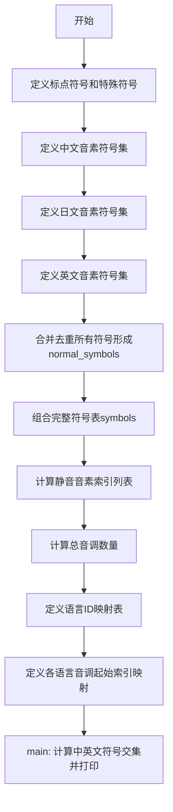

# `Bert-VITS2\oldVersion\V220\text\symbols.py` 详细设计文档

该代码定义了用于语音合成/识别系统的多语言（中文、日文、英文）音素符号表，包含各语言的音素符号、标点符号、特殊符号，并提供了语言ID映射、音调起始索引映射等辅助数据结构，为多语言语音处理提供基础的符号集支持。

## 整体流程



## 类结构

```
无类层次结构（脚本文件）
```

## 全局变量及字段


### `punctuation`
    
包含常见标点符号的列表，用于文本标点处理。

类型：`list[str]`
    


### `pu_symbols`
    
标点符号加上特殊符号SP和UNK的列表，用于表示标点和未知符号。

类型：`list[str]`
    


### `pad`
    
填充符号，用于序列对齐或结束标记。

类型：`str`
    


### `zh_symbols`
    
中文音素符号列表，涵盖汉语拼音音节。

类型：`list[str]`
    


### `num_zh_tones`
    
中文音调数量，值为6（包括轻声）。

类型：`int`
    


### `ja_symbols`
    
日文音素符号列表，涵盖假名发音。

类型：`list[str]`
    


### `num_ja_tones`
    
日文音调数量，值为2（重音和-flat)。

类型：`int`
    


### `en_symbols`
    
英文音素符号列表，基于ARPABET。

类型：`list[str]`
    


### `num_en_tones`
    
英文音调数量，值为4。

类型：`int`
    


### `normal_symbols`
    
合并中、日、英音素符号并去重排序后的列表。

类型：`list[str]`
    


### `symbols`
    
包含填充符、正常符号和标点符号的完整符号表。

类型：`list[str]`
    


### `sil_phonemes_ids`
    
标点符号在符号表中的索引列表，用于静音或填充。

类型：`list[int]`
    


### `num_tones`
    
总音调数量，汇总中、日、英的音调数。

类型：`int`
    


### `language_id_map`
    
语言名称到ID的映射，用于区分语言。

类型：`dict[str, int]`
    


### `num_languages`
    
语言数量，这里是3（中文、日文、英文）。

类型：`int`
    


### `language_tone_start_map`
    
语言到起始音调ID的映射，用于多语言音调处理。

类型：`dict[str, int]`
    


    

## 全局函数及方法


## 关键组件


### 标点符号与特殊符号定义

定义了标点符号列表和特殊符号（SP表示空格，UNK表示未知），用于文本处理的边界标识和未识别字符处理。

### 中文音素符号集

包含中文发音的音素符号，涵盖声母、韵母及声调标记（如E、En、a、ai、an等），共72个符号，用于中文语音合成或识别。

### 日文音素符号集

包含日文发音的音素符号，涵盖清音、浊音、半浊音及长音标记（如N、a、a:、b、by等），共42个符号，用于日文语音处理。

### 英文音素符号集

包含英文发音的音素符号，涵盖元音和辅音（如aa、ae、ah、b、ch等），共39个符号，采用CMU发音词典标准，用于英文语音处理。

### 符号索引映射系统

将所有语言的音素符号合并、去重并排序后创建索引映射，实现符号到ID的双向转换，支持快速查找和向量编码。

### 语言标识映射

建立语言代码到数字ID的映射表（ZH→0、JP→1、EN→2），用于多语言模型中的语言类别识别和条件生成。

### 音调起始索引映射

定义各语言音调ID的起始偏移量，解决不同语言音调体系冲突问题，支持多语言统一音调空间管理。

### 静音音素ID提取

从符号表中提取标点符号对应的索引ID列表，用于语音合成中的静音处理和停顿控制。


## 问题及建议


### 已知问题

- **硬编码的魔数（Magic Numbers）**：音调数量（num_zh_tones=6, num_ja_tones=2, num_en_tones=4）被硬编码，缺乏注释说明其来源和依据，增加了后续维护难度
- **调试代码未清理**：`if __name__ == "__main__"` 块中的交集测试代码是调试用途，不应存在于生产代码中
- **命名不一致**：符号列表中存在大小写混用（如 "E", "En", "AA" 与其他小写符号），可能导致大小写敏感场景下的匹配问题
- **全局变量过度使用**：所有变量均为模块级全局变量，缺乏封装，难以进行单元测试和依赖管理
- **缺少类型注解**：代码中没有任何类型提示（type hints），降低代码可读性和 IDE 辅助支持
- **语言映射脆弱性**：`language_tone_start_map` 硬编码了偏移量计算逻辑，与 `language_id_map` 的顺序耦合，新增语言时需要手动同步修改多处
- **无错误处理**：访问 `language_id_map` 中不存在的语言时会抛出 KeyError，缺乏防御性检查

### 优化建议

- 将硬编码的音调数量和符号列表抽取为配置文件（如 YAML/JSON），或至少添加详细的注释说明其定义依据
- 移除 `if __name__ == "__main__"` 块中的调试代码，改为独立的单元测试文件
- 统一符号的大小写规范，建议全部转为小写或大写，避免大小写敏感场景下的潜在 bug
- 使用类或函数封装全局变量，通过参数传递或依赖注入方式管理，降低模块耦合度
- 为关键变量和函数添加类型注解，提升代码可维护性
- 重构语言映射逻辑，通过数据结构动态计算偏移量，避免硬编码顺序依赖
- 添加输入验证和异常处理，例如在访问语言映射前检查键是否存在

## 其它


### 设计目标与约束

本代码模块的核心设计目标是建立一个统一的多语言音素符号表，为后续的语音合成、语音识别等任务提供标准化的音素标识符。设计约束包括：1）符号表必须包含中文、日语、英语三种语言的基本音素；2）符号表需要支持填充（pad）、静音（sil）等特殊符号；3）所有符号需要保证唯一性并支持快速查找；4）语言和音调的映射关系需要清晰明确。

### 错误处理与异常设计

代码中主要的数据处理操作是集合操作和索引查找。潜在的错误情况包括：1）如果pu_symbols中的符号不在symbols列表中，sil_phonemes_ids的列表推导式会抛出ValueError；2）language_id_map中不存在的语言键访问会导致KeyError；3）语言tone起始索引计算依赖硬编码的音调数量，任何数值变化都需要同步更新。当前代码通过if __name__ == "__main__"块进行了基础的符号交集测试，但没有实现完善的异常捕获机制。建议添加符号存在性验证函数，确保pu_symbols中的所有符号都在symbols列表中。

### 数据流与状态机

本模块的数据流相对简单：输入为三个独立的语言符号列表（zh_symbols、ja_symbols、en_symbols）和标点符号列表（punctuation），经过集合去重、排序、合并操作后，输出为统一的symbols列表。状态机方面，模块初始化时经历以下状态：1）原始符号定义状态；2）去重合并状态；3）索引映射状态；4）最终可用状态。最终的symbols列表顺序为：[pad符号, 排序后的normal_symbols, pu_symbols]。

### 外部依赖与接口契约

本模块为纯Python内置库实现，不依赖任何第三方包。模块提供的外部接口包括：1）symbols列表：包含所有可用符号的有序列表；2）sil_phonemes_ids：静音音素的索引列表；3）num_tones：总音调数量；4）language_id_map：语言名称到ID的映射字典；5）language_tone_start_map：各语言音调起始索引映射。使用方可以通过symbols.index(symbol_name)获取对应符号的ID，或通过language_id_map["ZH"]获取语言ID。

### 性能考虑与优化空间

当前实现使用列表推导式构建sil_phonemes_ids，时间复杂度为O(n*m)，其中n为pu_symbols长度，m为symbols长度，因为每次index调用需要遍历symbols列表。建议改为使用字典（dict）存储符号到索引的映射，将index操作的时间复杂度从O(n)降低到O(1)。此外，normal_symbols的构建使用了set转换和sorted操作，对于大规模符号表场景可以考虑预计算并缓存结果。

### 配置与可扩展性

代码的硬编码特性较强，扩展性有限。若要支持新的语言，需要：1）在对应语言符号列表中添加新符号；2）更新num_xx_tones变量；3）更新language_id_map和language_tone_start_map；4）更新num_tones总和。建议将配置数据外部化到JSON或YAML配置文件，通过配置加载方式提高模块的可维护性和灵活性。标点符号列表punctuation目前仅用于构建pu_symbols，未直接对外暴露，可能需要评估是否需要单独导出。

### 安全考虑

本模块为纯数据定义模块，不涉及用户输入处理、网络通信或文件操作，因此不存在明显的安全风险。但需要注意symbols列表的顺序依赖于Python的sorted函数，在不同Python版本或locale设置下，排序结果可能存在差异，建议明确指定排序规则（如使用特定locale或Unicode编码排序）以保证跨环境一致性。

### 测试策略

建议补充以下测试用例：1）符号唯一性验证测试，确保symbols列表中无重复元素；2）符号完整性验证测试，确保所有语言的基础音素都被包含；3）索引映射正确性测试，验证sil_phonemes_ids中的索引都指向pu_symbols中的对应符号；4）语言音调范围测试，验证各语言的音调索引范围正确；5）跨环境一致性测试，验证排序结果在不同运行环境下的一致性。

### 部署相关

本模块为轻量级数据定义模块，可以作为Python包的一部分进行部署。由于不依赖外部资源，部署时仅需确保目标环境支持Python 3.x即可。模块支持直接导入使用：from phoneme_symbols import symbols, language_id_map, sil_phonemes_ids。建议在包初始化文件（__init__.py）中导出常用接口，降低使用方的导入复杂度。

    