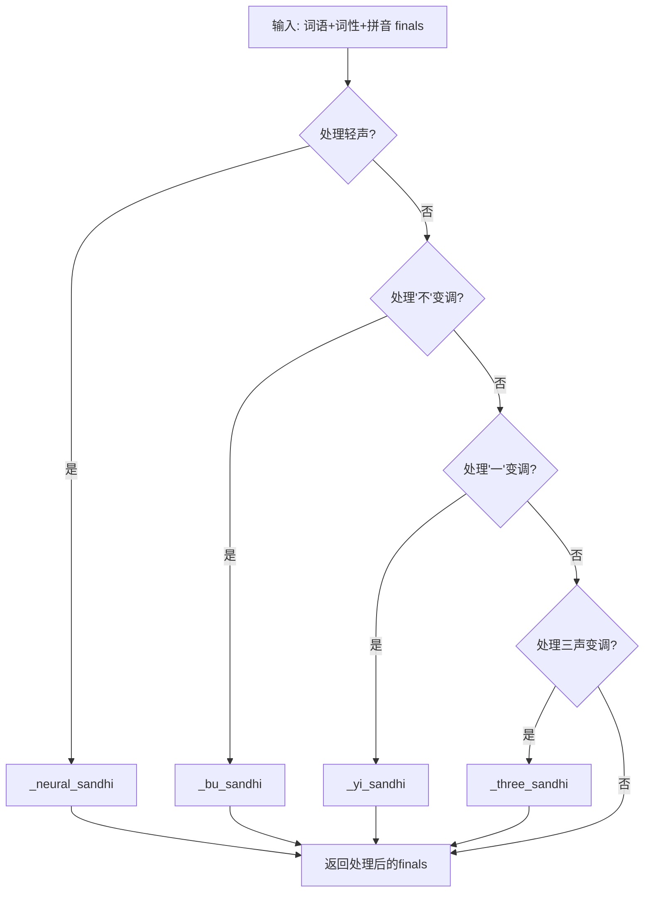
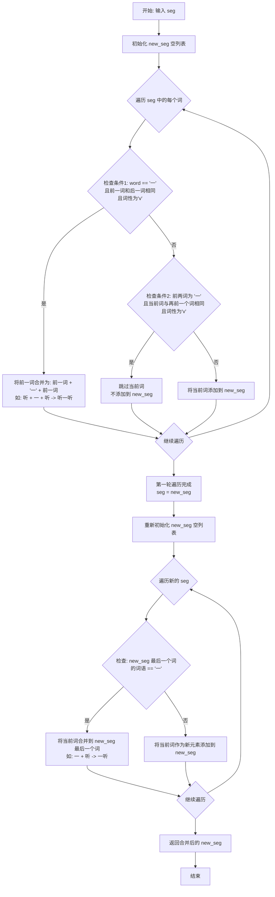
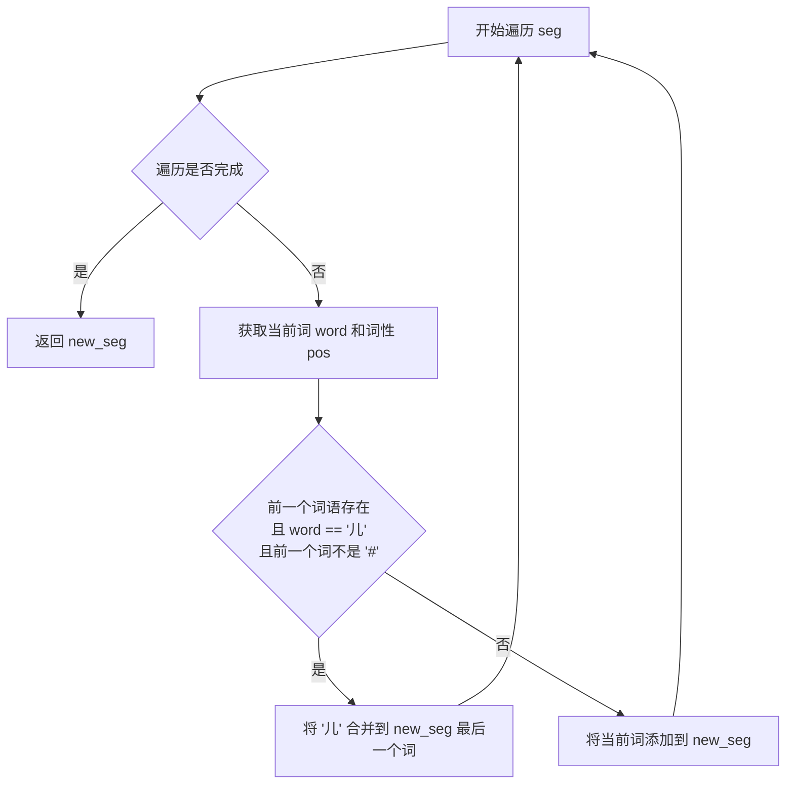
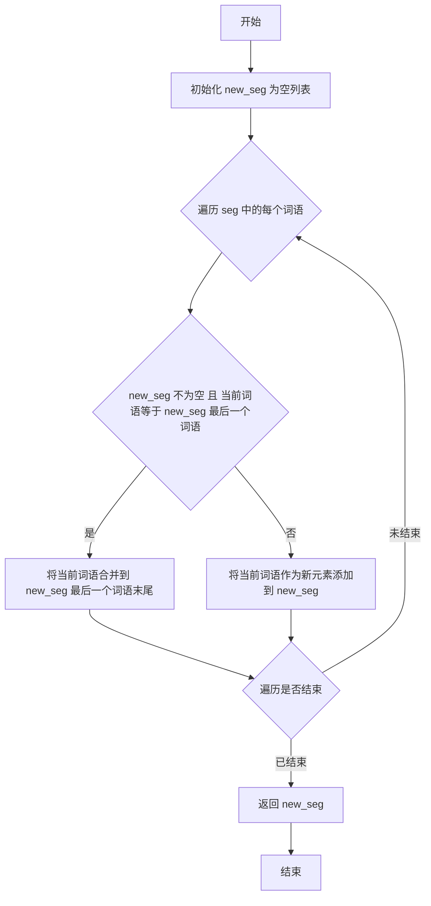
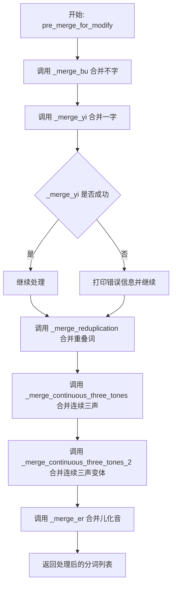

# `Bert-VITS2\oldVersion\V220\text\tone_sandhi.py` 详细设计文档

这是一个中文声调变调处理模块，通过jieba分词和pypinyin拼音库，实现对中文词语的声调变调处理，包括轻声变调、'不'变调、'一'变调、三声连读变调、儿化音合并等功能，主要用于语音合成或语音识别前端处理。

## 整体流程



## 类结构

```
ToneSandhi (声调变调处理类)
├── 字段:
│   ├── must_neural_tone_words (必须读轻声的词语集合)
│   ├── must_not_neural_tone_words (不应读轻声的词语集合)
│   └── punc (标点符号集合)
└── 方法:
    ├── _neural_sandhi (处理轻声变调)
    ├── _bu_sandhi (处理'不'变调)
    ├── _yi_sandhi (处理'一'变调)
    ├── _split_word (分词处理)
    ├── _three_sandhi (处理三声变调)
    ├── _all_tone_three (检查是否全为三声)
    ├── _merge_bu (合并'不'和后续词)
    ├── _merge_yi (合并'一')
    ├── _merge_continuous_three_tones (合并连续三声-方式1)
    ├── _merge_continuous_three_tones_2 (合并连续三声-方式2)
    ├── _merge_er (合并儿化音)
    ├── _merge_reduplication (合并重叠词)
    ├── pre_merge_for_modify (预处理合并)
    └── modified_tone (主处理函数-按顺序调用各变调处理)
```

## 全局变量及字段


### `ToneSandhi.must_neural_tone_words`
    
必须读轻声的汉语词语集合，包含约300+个常见词语如'麻烦'、'高粱'、'骆驼'等

类型：`set`
    


### `ToneSandhi.must_not_neural_tone_words`
    
不应读轻声的词语集合，包含约10个词语如'男子'、'女子'、'分子'等

类型：`set`
    


### `ToneSandhi.punc`
    
标点符号字符串，包含中英文标点用于判断'一'的变调规则

类型：`str`
    
    

## 全局函数及方法


### `ToneSandhi._neural_sandhi`

处理轻声变调，根据词性、词语结构等规则将某些字的声调改为轻声。

参数：
-  `word`：`str`，待处理的词语
-  `pos`：`str`，词性标注
-  `finals`：`List[str]`，拼音韵母列表

返回值：`List[str]`，处理后的拼音韵母列表

#### 流程图

```mermaid
flowchart TD
    A[开始 _neural_sandhi] --> B{检查叠词<br>word[j] == word[j-1] 且 pos in n/v/a?}
    B -->|是 且不在 must_not_neural_tone_words| C[将 finals[j] 改为 5 调]
    B -->|否| D{检查词尾语气词<br>word[-1] in '吧呢啊...'?}
    C --> D
    D -->|是| E[将 finals[-1] 改为 5 调]
    D -->|否| F{检查词尾助词<br>word[-1] in '的地得'?}
    E --> F
    F -->|是| G[将 finals[-1] 改为 5 调]
    F -->|否| H{检查词尾 '们子'<br>pos in r/n 且不在 must_not_neural_tone_words?}
    G --> H
    H -->|是| I[将 finals[-1] 改为 5 调]
    H -->|否| J{检查方位词<br>word[-1] in '上下里' 且 pos in s/l/f?}
    I --> J
    J -->|是| K[将 finals[-1] 改为 5 调]
    J -->|否| L{检查趋向补语<br>word[-1] in '来去' 且 word[-2] in '上下进出回过起开'?}
    K --> L
    L -->|是| M[将 finals[-1] 改为 5 调]
    L -->|否| N{检查量词 '个'<br>个前有数字/几有两半多各整每做是 或 word=='个'?}
    M --> N
    N -->|是| O[将 finals[ge_idx] 改为 5 调]
    N -->|否| P{检查 must_neural_tone_words<br>word in must_neural_tone_words 或 word[-2:] in must_neural_tone_words?}
    O --> P
    P -->|是| Q[将 finals[-1] 改为 5 调]
    P -->|否| R[调用 _split_word 拆分词语]
    Q --> R
    R --> S[将 finals 按子词长度拆分到 finals_list]
    S --> T{遍历子词列表}
    T -->|子词在 must_neural_tone_words| U[将子词最后一个音调改为 5]
    T -->|子词不在| V[不修改]
    U --> W{还有更多子词?}
    V --> W
    W -->|是| T
    W -->|否| X[合并 finals_list 为单一列表]
    X --> Y[返回处理后的 finals]
```

#### 带注释源码

```python
def _neural_sandhi(self, word: str, pos: str, finals: List[str]) -> List[str]:
    """
    处理轻声变调，根据词性、词语结构等规则将某些字的声调改为轻声
    
    参数:
        word: 待处理的词语
        pos: 词性标注
        finals: 拼音韵母列表
    
    返回:
        处理后的拼音韵母列表
    """
    # 处理叠词（重叠词），如奶奶、试试、旺旺
    # 规则：名词/动词/形容词中连续相同的字，第二个字改为轻声
    for j, item in enumerate(word):
        if (
            j - 1 >= 0
            and item == word[j - 1]  # 前后字相同（叠词）
            and pos[0] in {"n", "v", "a"}  # 词性为名词/动词/形容词
            and word not in self.must_not_neural_tone_words  # 不在排除列表中
        ):
            # 将韵母末尾的声调改为5（轻声）
            finals[j] = finals[j][:-1] + "5"
    
    # 处理语气词结尾（吧、呢、啊、呐、噻、嘛、吖、嗨、哦、哒、额、滴、哩、哟、啰、耶、喔、诶）
    # 语气词读轻声
    ge_idx = word.find("个")
    if len(word) >= 1 and word[-1] in "吧呢啊呐噻嘛吖嗨呐哦哒额滴哩哟喽啰耶喔诶":
        finals[-1] = finals[-1][:-1] + "5"
    # 处理助词（的、地、得）结尾，读轻声
    elif len(word) >= 1 and word[-1] in "的地得":
        finals[-1] = finals[-1][:-1] + "5"
    # 处理"了着过"在单字词中的情况（已注释）
    # elif len(word) == 1 and word in "了着过" and pos in {"ul", "uz", "ug"}:
    #     finals[-1] = finals[-1][:-1] + "5"
    # 处理名词/代词后缀"们、子"，读轻声
    # 如：人们、孩子
    elif (
        len(word) > 1
        and word[-1] in "们子"
        and pos in {"r", "n"}  # 代词或名词
        and word not in self.must_not_neural_tone_words
    ):
        finals[-1] = finals[-1][:-1] + "5"
    # 处理方位词结尾（桌上、地下、家里），读轻声
    elif len(word) > 1 and word[-1] in "上下里" and pos in {"s", "l", "f"}:
        finals[-1] = finals[-1][:-1] + "5"
    # 处理趋向补语（上来、下去、进来、出去等），读轻声
    elif len(word) > 1 and word[-1] in "来去" and word[-2] in "上下进出回过起开":
        finals[-1] = finals[-1][:-1] + "5"
    # 处理量词"个"的轻声变调
    # 规则：个前面是数字/几/有/两/半/多/各/整/每/做/是，或者整个词就是"个"
    elif (
        ge_idx >= 1
        and (
            word[ge_idx - 1].isnumeric()  # 数字
            or word[ge_idx - 1] in "几有两半多各整每做是"  # 指定汉字
        )
    ) or word == "个":
        finals[ge_idx] = finals[ge_idx][:-1] + "5"
    else:
        # 处理必须读轻声的词汇（词典中的词汇）
        if (
            word in self.must_neural_tone_words
            or word[-2:] in self.must_neural_tone_words
        ):
            finals[-1] = finals[-1][:-1] + "5"

    # 使用jieba分词拆分词语，处理复合词中的轻声规则
    word_list = self._split_word(word)
    # 将韵母按子词长度拆分到两个列表中
    finals_list = [finals[: len(word_list[0])], finals[len(word_list[0]) :]]
    # 遍历每个子词，检查是否在必须读轻声的词典中
    for i, word in enumerate(word_list):
        # 常规轻声词：词典中收录的词或词的后两个字在词典中
        if (
            word in self.must_neural_tone_words
            or word[-2:] in self.must_neural_tone_words
        ):
            finals_list[i][-1] = finals_list[i][-1][:-1] + "5"
    # 合并韵母列表
    finals = sum(finals_list, [])
    return finals
```


### `ToneSandhi._bu_sandhi`

处理汉语中"不"字的变调规则，当"不"出现在第四声（去声）字前时，"不"由原声调变为第二声（阳平）；当"不"出现在三字词中间位置时，"不"变为轻声（第五声）。该方法是 ToneSandhi 类中处理"不"变调的核心逻辑。

参数：

- `word`：`str`，待处理的词语
- `finals`：`List[str]`，拼音韵母列表

返回值：`List[str]`，处理后的拼音韵母列表

#### 流程图

```mermaid
flowchart TD
    A[开始 _bu_sandhi] --> B{word长度为3且<br>word[1] == '不'?}
    B -->|是| C[将 finals[1] 的声调<br>替换为 '5'（轻声）]
    C --> F[返回处理后的 finals]
    B -->|否| D[遍历 word 中的每个字符]
    D --> E{当前字符 == '不' 且<br>下一个字符存在 且<br>finals[i+1][-1] == '4'?}
    E -->|是| G[将 finals[i] 的声调<br>替换为 '2'（第二声）]
    E -->|否| H[继续遍历]
    G --> H
    H --> I{遍历结束?}
    I -->|否| D
    I -->|是| F
```

#### 带注释源码

```python
def _bu_sandhi(self, word: str, finals: List[str]) -> List[str]:
    """
    处理"不"的变调规则
    
    规则1：当"不"出现在三字词中间位置时（如"看不懂"），"不"读轻声（第五声）
    规则2：当"不"出现在第四声（去声）字前时（如"不怕"、"不去"），"不"变为第二声（阳平）
    
    参数:
        word: 待处理的词语，如"不怕"、"看不懂"
        finals: 对应的拼音韵母列表，如['bu4', 'pa4']
    
    返回:
        处理后的拼音韵母列表，如['bu2', 'pa4']
    """
    # 规则1：处理三字词中间位置的"不"，如"看不懂"
    # 此时"不"读轻声（第五声），将韵母的声调标记替换为"5"
    if len(word) == 3 and word[1] == "不":
        finals[1] = finals[1][:-1] + "5"
    else:
        # 规则2：处理"不"在第四声字前的情况
        # 遍历词语中的每个字符，寻找"不"字
        for i, char in enumerate(word):
            # 检查条件：
            # 1. 当前字符是"不"
            # 2. "不"后面还有字符（i + 1 < len(word)）
            # 3. 下一个字的韵母是第四声（以"4"结尾）
            if char == "不" and i + 1 < len(word) and finals[i + 1][-1] == "4":
                # 将"不"的声调从原声调变为第二声"2"
                # 例如：bu4 -> bu2, bu1 -> bu2
                finals[i] = finals[i][:-1] + "2"
    return finals
```


### ToneSandhi._yi_sandhi

处理'一'的变调，根据位置和后续字声调确定变调规则

参数：

- `word`：`str`，待处理的词语
- `finals`：`List[str]`，拼音韵母列表

返回值：`List[str]`，处理后的拼音韵母列表

#### 流程图

```mermaid
flowchart TD
    A[开始: _yi_sandhi] --> B{word中是否包含'一'且其他字符全为数字}
    B -->|是| C[直接返回finals不变]
    B -->|否| D{word长度为3且'一'在中间且首尾字符相同}
    D -->|是| E[将'一'的韵母改为5声<br/>finals[1] = finals[1][:-1] + '5']
    D -->|否| F{word以'第一'开头}
    F -->|是| F1[将'一'的韵母改为1声<br/>finals[1] = finals[1][:-1] + '1']
    F -->|否| G[遍历word中的每个字符]
    G --> H{找到'一'且后面还有字符}
    H -->|否| I[返回处理后的finals]
    H -->|是| J{下一个字符的韵母尾号为4}
    J -->|是| K[将'一'改为2声<br/>finals[i] = finals[i][:-1] + '2']
    J -->|否| L{下一个字符是否为标点}
    L -->|是| I
    L -->|否| M[将'一'改为4声<br/>finals[i] = finals[i][:-1] + '4']
    K --> I
    M --> I
    F1 --> I
    E --> I
```

#### 带注释源码

```python
def _yi_sandhi(self, word: str, finals: List[str]) -> List[str]:
    # 规则1: "一"在数字序列中，保持原声调
    # 例如: 一零零, 二一零 (数字序列中读yi1)
    if word.find("一") != -1 and all(
        [item.isnumeric() for item in word if item != "一"]
    ):
        return finals
    
    # 规则2: "一"在重叠词之间，读轻声5声
    # 例如: 看一看, 听一听
    # 结构为 A一A (A为相同字符)
    elif len(word) == 3 and word[1] == "一" and word[0] == word[-1]:
        finals[1] = finals[1][:-1] + "5"
    
    # 规则3: "一"作为序数词，读1声
    # 例如: 第一, 第一个
    elif word.startswith("第一"):
        finals[1] = finals[1][:-1] + "1"
    
    # 规则4: 根据后面音节声调进行变调
    else:
        # 遍历word中的每个字符
        for i, char in enumerate(word):
            # 找到"一"且后面还有字符
            if char == "一" and i + 1 < len(word):
                # "一"在第四声(去声)前，读第二声
                # 例如: 一段(yi2 duan4), 一度(yi2 du4), 一共(yi2 gong4)
                if finals[i + 1][-1] == "4":
                    finals[i] = finals[i][:-1] + "2"
                
                # "一"在非第四声前，读第四声
                # 例如: 一天(yi1 tian1), 一杯(yi1 bei1), 一条(yi1 tiao2)
                else:
                    # "一"后面如果是标点，仍读第一声
                    if word[i + 1] not in self.punc:
                        finals[i] = finals[i][:-1] + "4"
    
    return finals
```


### `_split_word`

使用jieba对词语进行分词处理，返回两个子词

参数：
- `word`：`str`，待分词的词语

返回值：`List[str]`，分词后的词语列表

#### 流程图

```mermaid
flowchart TD
    A[开始] --> B[jieba.cut_for_search 对词语分词]
    B --> C[将生成器转换为列表并按长度升序排序]
    C --> D[获取最短子词 first_subword]
    D --> E[查找 first_subword 在原词中的位置]
    E --> F{first_begin_idx == 0?}
    F -->|是| G[second_subword = word[len(first_subword):]
    G --> H[new_word_list = [first_subword, second_subword]]
    F -->|否| I[second_subword = word[: -len(first_subword)]
    I --> J[new_word_list = [second_subword, first_subword]]
    H --> K[返回 new_word_list]
    J --> K
```

#### 带注释源码

```python
def _split_word(self, word: str) -> List[str]:
    # 使用jieba的cut_for_search方法对词语进行分词，返回一个生成器对象
    word_list = jieba.cut_for_search(word)
    # 将生成器转换为列表，并按照子词长度升序排序
    # 这样最短的子词会排在最前面，便于后续处理
    word_list = sorted(word_list, key=lambda i: len(i), reverse=False)
    # 获取最短的子词作为第一个子词
    first_subword = word_list[0]
    # 查找第一个子词在原词中的起始位置
    first_begin_idx = word.find(first_subword)
    # 判断第一个子词是否从原词的起始位置开始
    if first_begin_idx == 0:
        # 如果从起始位置开始，第二个子词为原词剩余部分
        second_subword = word[len(first_subword):]
        # 组合成新的词语列表：[第一个子词, 第二个子词]
        new_word_list = [first_subword, second_subword]
    else:
        # 如果不是从起始位置开始，说明第一个子词在原词尾部
        # 第二个子词为原词开头到第一个子词之前的部分
        second_subword = word[:-len(first_subword)]
        # 组合成新的词语列表：[第二个子词, 第一个子词]
        new_word_list = [second_subword, first_subword]
    # 返回分词后的词语列表
    return new_word_list
```


### `ToneSandhi._three_sandhi`

处理三声连读变调的函数，当两个或三个三声字连读时，前面的字变为第二声（阳平）。该函数是中文语音处理中变调规则的核心实现部分。

参数：

- `word`：`str`，待处理的词语
- `finals`：`List[str]`，拼音韵母列表

返回值：`List[str]`，处理后的拼音韵母列表

#### 流程图

```mermaid
flowchart TD
    A[开始 _three_sandhi] --> B{len(word) == 2?}
    B -->|Yes| C{_all_tone_three(finals)?}
    C -->|Yes| D[finals[0] 改为第二声<br/>finals[0][:-1] + '2']
    C -->|No| E[返回 finals 不变]
    D --> E
    B -->|No| F{len(word) == 3?}
    F -->|Yes| G[word_list = _split_word(word)]
    G --> H{_all_tone_three(finals)?}
    H -->|Yes| I{len(word_list[0]) == 2?}
    I -->|Yes| J[双音节+单音节模式<br/>finals[0]和finals[1]都改为第二声]
    I -->|No| K[单音节+双音节模式<br/>finals[1]改为第二声]
    H -->|No| L[拆分finals为两部分<br/>finals_list = [finals[:len(word_list[0])], finals[len(word_list[0]):]]
    L --> M{len(finals_list) == 2?}
    M -->|Yes| N{检查每部分的变调规则}
    N --> O[根据规则修改对应的finals]
    M -->|No| E
    O --> E
    F -->|No| P{len(word) == 4?}
    P -->|Yes| Q[拆分finals为前后各两个<br/>finals_list = [finals[:2], finals[2:]]
    Q --> R[遍历每个子部分]
    R --> S{_all_tone_three(sub)?}
    S -->|Yes| T[sub[0] 改为第二声]
    S -->|No| U[不变]
    T --> V[合并sub到finals]
    U --> V
    V --> E
    P -->|No| E
    E --> Z[返回处理后的 finals]
```

#### 带注释源码

```python
def _three_sandhi(self, word: str, finals: List[str]) -> List[str]:
    """
    处理三声连读变调规则
    规则：当两个或三个三声字连读时，前面的字变为第二声（阳平）
    
    参数:
        word: 待处理的词语
        finals: 拼音韵母列表，如 ['i3', 'a3']
    
    返回:
        处理后的拼音韵母列表
    """
    
    # 情况一：两字词，且两字都是三声
    # 例如："蒙古" ['e3', 'u3'] -> ['e2', 'u3']
    if len(word) == 2 and self._all_tone_three(finals):
        # 将第一个字的声调从3改为2（第二声/阳平）
        finals[0] = finals[0][:-1] + "2"
    
    # 情况二：三字词
    elif len(word) == 3:
        # 使用jieba分词，将三字词拆分为两部分
        # 例如："蒙古包" -> ['蒙古', '包'] 或 ['纸', '老虎']
        word_list = self._split_word(word)
        
        # 情况2.1：三个字都是三声
        if self._all_tone_three(finals):
            # 2.1.1 双音节 + 单音节模式（如"蒙古/包"）
            # 前两个字都变为第二声
            if len(word_list[0]) == 2:
                finals[0] = finals[0][:-1] + "2"
                finals[1] = finals[1][:-1] + "2"
            # 2.1.2 单音节 + 双音节模式（如"纸/老虎"）
            # 后两个字变为第二声
            elif len(word_list[0]) == 1:
                finals[1] = finals[1][:-1] + "2"
        
        # 情况2.2：不是所有字都是三声
        else:
            # 将finals按word_list的分词位置拆分
            # 例如："好/喜欢" -> finals_list = [['h3', 'a3'], ['x3', 'i5', 'h3', 'a3']]
            finals_list = [finals[: len(word_list[0])], finals[len(word_list[0]) :]]
            
            if len(finals_list) == 2:
                # 遍历检查每部分是否符合变调条件
                for i, sub in enumerate(finals_list):
                    # 2.2.1 如果某部分全是三声且长度为2
                    # 例如："所有/人" -> '所'和'有'都变调
                    if self._all_tone_three(sub) and len(sub) == 2:
                        finals_list[i][0] = finals_list[i][0][:-1] + "2"
                    # 2.2.2 第二部分非全三声，但首字是三声，且第一部分末尾是三声
                    # 例如："好/喜欢" -> '好'变调
                    elif (
                        i == 1
                        and not self._all_tone_three(sub)
                        and finals_list[i][0][-1] == "3"
                        and finals_list[0][-1][-1] == "3"
                    ):
                        finals_list[0][-1] = finals_list[0][-1][:-1] + "2"
                
                # 展平嵌套列表
                finals = sum(finals_list, [])
    
    # 情况三：四字成语，拆分为两个两字词处理
    # 例如："酒酒酒酒"（虚构）-> 分别处理每两个字
    elif len(word) == 4:
        # 将四个字的finals拆分为 [前两个, 后两个]
        finals_list = [finals[:2], finals[2:]]
        finals = []
        
        # 对每部分应用三声变调规则
        for sub in finals_list:
            if self._all_tone_three(sub):
                # 该部分全是三声，首字变第二声
                sub[0] = sub[0][:-1] + "2"
            finals += sub
    
    # 返回处理后的拼音韵母列表
    return finals
```


### `ToneSandhi._all_tone_three`

辅助方法，检查拼音韵母列表是否全为第三声（即声调为3）

参数：

-  `finals`：`List[str]`，拼音韵母列表

返回值：`bool`，是否全为三声

#### 流程图

```mermaid
flowchart TD
    A[开始] --> B[输入: finals List[str]]
    B --> C{遍历 finals 中的每个韵母 x}
    C --> D{检查 x 的最后一个字符是否为 '3'}
    D -->|是| E{是否所有元素都满足条件?}
    D -->|否| F[返回 False]
    E -->|是| G[返回 True]
    E -->|否| F
    C --> E
```

#### 带注释源码

```python
def _all_tone_three(self, finals: List[str]) -> bool:
    """
    辅助方法，检查拼音韵母列表是否全为第三声
    
    参数:
        finals: 拼音韵母列表，每个元素是带声调的韵母字符串，如 'a3', 'i3'
    
    返回:
        bool: 如果所有韵母的最后一个字符都是 '3'（即第三声），返回 True；否则返回 False
    
    示例:
        >>> self._all_tone_three(['a3', 'i3', 'u3'])
        True
        >>> self._all_tone_three(['a3', 'i2', 'u3'])
        False
    """
    # 使用 all() 内置函数检查所有韵母是否都以 '3' 结尾
    # x[-1] 获取韵母字符串的最后一个字符（声调标记）
    # for x in finals 遍历列表中的每个韵母
    return all(x[-1] == "3" for x in finals)
```


### `ToneSandhi._merge_bu`

合并"不"和其后词语，防止jieba将"不"错误切分导致变调错误。

参数：

-  `seg`：`List[Tuple[str, str]]`，分词结果列表，其中每个元素为(词语, 词性)元组

返回值：`List[Tuple[str, str]]`，合并后的分词列表

#### 流程图

```mermaid
flowchart TD
    A[开始: 输入seg分词列表] --> B[初始化new_seg为空列表, last_word为空字符串]
    C[遍历seg中的每个word和pos] --> D{last_word == "不"?}
    D -->|是| E[将last_word与当前word合并: word = last_word + word]
    D -->|否| F{word != "不"?}
    E --> F
    F -->|是| G[将(word, pos)添加到new_seg]
    F -->|否| H[不添加, 跳过]
    G --> I[更新last_word = word的副本]
    H --> I
    I --> J{seg中还有更多元素?}
    J -->|是| C
    J -->|否| K{最后last_word == "不"?}
    K -->|是| L[将last_word和词性'd'添加到new_seg]
    K -->|否| M[返回new_seg]
    L --> M
```

#### 带注释源码

```python
def _merge_bu(self, seg: List[Tuple[str, str]]) -> List[Tuple[str, str]]:
    """
    合并"不"和其后词语，防止jieba将"不"错误切分导致变调错误
    
    参数:
        seg: 分词结果列表，每个元素为(词语, 词性)元组
    返回:
        合并后的分词列表
    """
    new_seg = []  # 存储合并后的分词结果
    last_word = ""  # 记录上一个处理的词语
    
    # 遍历分词结果列表
    for word, pos in seg:
        # 如果上一个词是"不"，则与当前词合并
        if last_word == "不":
            word = last_word + word
        
        # 如果当前词不是单独的"不"，则添加到结果列表
        if word != "不":
            new_seg.append((word, pos))
        
        # 更新last_word为当前词的副本
        last_word = word[:]
    
    # 处理末尾的"不"（如果最后一个词仍是"不"，添加默认词性"d"）
    if last_word == "不":
        new_seg.append((last_word, "d"))
        last_word = ""
    
    return new_seg
```

#### 逻辑详解

该方法的核心逻辑如下：

1. **遍历处理**：逐个遍历输入的分词结果列表
2. **合并条件**：当检测到上一个词是"不"时，将当前词与"不"合并成一个词
3. **过滤单独"不"**：避免将单独的"不"字添加到结果中（除非它与后续词合并）
4. **末尾处理**：如果整个列表遍历完后，最后一个词仍是"不"，为其添加默认的副词词性"d"
5. **防止错误切分**：解决jieba分词可能将"不"单独切分的问题，确保变调规则（如"不"在第四声前变调为第二声）能正确应用


### `ToneSandhi._merge_yi`

合并'一'与重叠词(如'听一听')和后续词，处理'一'的变调

参数：

-  `seg`：`List[Tuple[str, str]]`，分词结果列表，其中每个元素为(词语, 词性)元组

返回值：`List[Tuple[str, str]]`，合并后的分词列表

#### 流程图



#### 带注释源码

```python
def _merge_yi(self, seg: List[Tuple[str, str]]) -> List[Tuple[str, str]]:
    """
    合并'一'与重叠词(如'听一听')和后续词，处理'一'的变调
    
    功能1: 合并重叠词中的'一'，例如 "听","一","听" -> "听一听"
    功能2: 合并单独的'一'与后续词，例如 "一","听" -> "一听"
    
    参数:
        seg: 分词结果列表，每个元素为(词语, 词性)的元组
            例如: [('听', 'v'), ('一', 'm'), ('听', 'v')]
    
    返回:
        合并后的分词列表
            例如: [('听一听', 'v')]
    """
    new_seg = []
    
    # ========== 功能1: 合并重叠词中的'一' ==========
    # 例如: 听 + 一 + 听 -> 听一听
    # 这种结构中，"一"应该发轻声(变调)
    for i, (word, pos) in enumerate(seg):
        # 检查是否满足重叠词+一+重叠词的结构
        # 条件: 
        #   - 当前词是"一"
        #   - 前面有一个词
        #   - 后面有一个词
        #   - 前面的词和后面的词相同
        #   - 前面词的词性是动词(v)
        if (
            i - 1 >= 0                          # 前面有词
            and word == "一"                     # 当前词是"一"
            and i + 1 < len(seg)                 # 后面有词
            and seg[i - 1][0] == seg[i + 1][0]   # 前后词相同
            and seg[i - 1][1] == "v"             # 词性为动词
        ):
            # 合并为重叠词形式: 听 + 一 + 听 -> 听一听
            new_seg[i - 1][0] = new_seg[i - 1][0] + "一" + new_seg[i - 1][0]
        else:
            # 检查是否是需要跳过的重复情况
            # 例如: 听 + 一 + 听 结构中的后一个"听"
            if (
                i - 2 >= 0                       # 前面有两个词
                and seg[i - 1][0] == "一"        # 前一个词是"一"
                and seg[i - 2][0] == word        # 再前一个词与当前词相同
                and pos == "v"                   # 当前词是动词
            ):
                # 跳过当前词，因为已经在上面合并过了
                continue
            else:
                # 正常添加到结果列表
                new_seg.append([word, pos])
    
    # 将第一轮处理结果赋值给 seg，准备第二轮处理
    seg = new_seg
    new_seg = []
    
    # ========== 功能2: 合并单独的'一'与后续词 ==========
    # 例如: 一 + 听 -> 一听
    # 目的: 防止"一"单独出现导致变调错误
    for i, (word, pos) in enumerate(seg):
        # 如果 new_seg 不为空，且最后一个词的词语是"一"
        if new_seg and new_seg[-1][0] == "一":
            # 将当前词合并到"一"后面
            new_seg[-1][0] = new_seg[-1][0] + word
        else:
            # 正常添加
            new_seg.append([word, pos])
    
    return new_seg
```


### `ToneSandhi._merge_continuous_three_tones`

该函数用于合并连续三声音节，实现汉语普通话中的"三声连读变调"规则——当两个三声音节相连时，前一个三声音节变读为二声音节。

参数：

- `seg`：`List[Tuple[str, str]]`，分词结果列表，每个元素为(词语, 词性)元组

返回值：`List[Tuple[str, str]]`，合并后的分词列表

#### 流程图

```mermaid
flowchart TD
    A[开始: 输入seg分词列表] --> B[使用lazy_pinyin获取每个词的音调finals]
    B --> C[初始化merge_last标志数组,长度与seg相同]
    C --> D{遍历seg中的每个词语<br/>i从0到len-1}
    D --> E{检查条件:<br/>i>0 且 前一个词全三声 <br/>且 当前词全三声 <br/>且 前一个词未被合并}
    E -->|否| F[不合并,直接添加当前词到new_seg]
    E -->|是| G{检查条件:<br/>前一个词不是叠词<br/>且 两词总长度≤3}
    G -->|否| F
    G -->|是| H[将当前词合并到前一个词<br/>标记merge_last[i]=True]
    F --> I{遍历是否结束}
    H --> I
    I -->|否| D
    I -->|是| J[返回new_seg]
```

#### 带注释源码

```python
def _merge_continuous_three_tones(
    self, seg: List[Tuple[str, str]]
) -> List[Tuple[str, str]]:
    """
    合并连续三声音节
    规则: 两个三声字连读时前一个变二声
    例如: "蒙古" -> "蒙古" (蒙mēng古gǔ -> mēng变méng)
    
    参数:
        seg: 分词结果列表,每个元素为(词语, 词性)元组
    返回:
        合并后的分词列表
    """
    new_seg = []
    # 使用pypinyin的lazy_pinyin获取每个词的音调finals
    # Style.FINALS_TONE3表示带声调的数字形式,如"3"表示第三声
    # neutral_tone_with_five=True表示轻声用"5"表示
    sub_finals_list = [
        lazy_pinyin(word, neutral_tone_with_five=True, style=Style.FINALS_TONE3)
        for (word, pos) in seg
    ]
    # 断言确保获取的音调数量与分词数量一致
    assert len(sub_finals_list) == len(seg)
    # merge_last数组标记每个位置的词是否被合并过,避免重复处理
    merge_last = [False] * len(seg)
    
    # 遍历分词结果
    for i, (word, pos) in enumerate(seg):
        # 判断是否满足三声连读变调的条件:
        # 1. i > 0,不是第一个词
        # 2. 前一个词的音调全部是三声(3)
        # 3. 当前词的音调全部是三声(3)
        # 4. 前一个词没有被合并过
        if (
            i - 1 >= 0
            and self._all_tone_three(sub_finals_list[i - 1])
            and self._all_tone_three(sub_finals_list[i])
            and not merge_last[i - 1]
        ):
            # 额外检查:
            # 1. 前一个词不是叠词(如"奶奶"),因为叠词需要单独做_neural_sandhi处理
            # 2. 合并后的总长度不超过3个字符
            if (
                not self._is_reduplication(seg[i - 1][0])
                and len(seg[i - 1][0]) + len(seg[i][0]) <= 3
            ):
                # 满足条件,将当前词合并到前一个词
                # 例如: ["蒙古", "包"] -> ["蒙古包"]
                new_seg[-1][0] = new_seg[-1][0] + seg[i][0]
                merge_last[i] = True
            else:
                # 不满足合并条件,单独添加当前词
                new_seg.append([word, pos])
        else:
            # 不满足三声连读条件,直接添加当前词
            new_seg.append([word, pos])

    return new_seg
```


### `ToneSandhi._merge_continuous_three_tones_2`

处理首字尾音和次字首音都是三声的情况，当连续两个词满足特定声调条件时进行合并，以避免分词导致的声调错误。

参数：

- `self`：`ToneSandhi`类实例，当前类的实例本身
- `seg`：`List[Tuple[str, str]]`，分词结果列表，每个元素为(词, 词性)元组

返回值：`List[Tuple[str, str]]`，合并后的分词列表

#### 流程图

```mermaid
flowchart TD
    A[开始: _merge_continuous_three_tones_2] --> B[创建空列表 new_seg]
    B --> C[为seg中每个词获取拼音声调列表 sub_finals_list]
    C --> D[创建merge_last标记数组, 长度同seg]
    D --> E{遍历seg中的每个词 i=0到len-1}
    E --> F{检查条件: i>0 且<br/>前词尾音是三声 且<br/>当前词首音是三声 且<br/>前词未被合并}
    F -->|否| G[直接添加当前词到new_seg]
    F -->|是| H{检查: 前词非叠词<br/>且两词总长度≤3}
    H -->|否| G
    H -->|是| I[合并前词和当前词<br/>标记merge_last[i]=True]
    I --> J{遍历是否结束}
    G --> J
    J -->|未结束| E
    J -->|已结束| K[返回new_seg]
```

#### 带注释源码

```python
def _merge_continuous_three_tones_2(
    self, seg: List[Tuple[str, str]]
) -> List[Tuple[str, str]]:
    """
    处理首字尾音和次字首音都是三声的情况
    
    当连续两个词满足以下条件时进行合并：
    1. 前一个词的最后一个音节是三声
    2. 当前词的第一个音节是三声
    3. 前一个词不是叠词（如"奶奶"）
    4. 合并后总长度不超过3个字符
    
    Args:
        seg: 分词结果列表，每个元素为(词, 词性)元组
        
    Returns:
        合并后的分词列表
    """
    # 用于存储合并后的分词结果
    new_seg = []
    
    # 获取seg中每个词的拼音声调（使用FINALS_TONE3风格，返回带声调标记的韵母）
    # 例如：["你好"] -> [["ao3", "ao3"]]
    sub_finals_list = [
        lazy_pinyin(word, neutral_tone_with_five=True, style=Style.FINALS_TONE3)
        for (word, pos) in seg
    ]
    
    # 断言确保声调列表长度与分词结果一致
    assert len(sub_finals_list) == len(seg)
    
    # 标记数组，记录每个位置的词是否已被合并（避免重复合并）
    merge_last = [False] * len(seg)
    
    # 遍历分词结果
    for i, (word, pos) in enumerate(seg):
        # 检查是否满足三声连读条件：
        # 1. 不是第一个词（i-1 >= 0）
        # 2. 前一个词的最后一个音是三声（sub_finals_list[i-1][-1][-1] == "3"）
        # 3. 当前词的第一个音是三声（sub_finals_list[i][0][-1] == "3"）
        # 4. 前一个词没有被合并过（not merge_last[i-1]）
        if (
            i - 1 >= 0
            and sub_finals_list[i - 1][-1][-1] == "3"
            and sub_finals_list[i][0][-1] == "3"
            and not merge_last[i - 1]
        ):
            # 检查是否可以合并：
            # 1. 前一个词不是叠词（叠词需要保留进行_neural_sandhi处理）
            # 2. 两个词的总长度不超过3个字符
            if (
                not self._is_reduplication(seg[i - 1][0])
                and len(seg[i - 1][0]) + len(seg[i][0]) <= 3
            ):
                # 执行合并：将当前词合并到前一个词后面
                new_seg[-1][0] = new_seg[-1][0] + seg[i][0]
                # 标记当前词已被合并
                merge_last[i] = True
            else:
                # 不满足合并条件，正常添加当前词
                new_seg.append([word, pos])
        else:
            # 不满足三声连读条件，正常添加当前词
            new_seg.append([word, pos])
    
    return new_seg
```


### `ToneSandhi._merge_er`

合并儿化音，将"儿"字与前一个词语合并，形成儿化词，如"小孩"+"儿"→"小孩儿"。

参数：

- `seg`：`List[Tuple[str, str]]`，分词结果列表，每个元素为(词语, 词性)元组

返回值：`List[Tuple[str, str]]`，合并后的分词列表

#### 流程图



#### 带注释源码

```python
def _merge_er(self, seg: List[Tuple[str, str]]) -> List[Tuple[str, str]]:
    """
    合并儿化音，将"儿"字与前一个词语合并
    例如：['小孩', '儿'] -> ['小孩儿']
    
    参数:
        seg: 分词结果列表，每个元素为(词语, 词性)的元组
    返回:
        合并后的分词列表
    """
    # 存储合并后的分词结果
    new_seg = []
    
    # 遍历分词结果列表
    for i, (word, pos) in enumerate(seg):
        # 判断条件：
        # 1. i - 1 >= 0: 不是第一个词（存在前一个词）
        # 2. word == "儿": 当前词是"儿"
        # 3. seg[i - 1][0] != "#": 前一个词不是占位符"#"
        if i - 1 >= 0 and word == "儿" and seg[i - 1][0] != "#":
            # 将"儿"合并到前一个词的末尾
            new_seg[-1][0] = new_seg[-1][0] + seg[i][0]
        else:
            # 如果不满足合并条件，直接添加当前词
            # 注意：这里使用append添加列表，支持后续修改
            new_seg.append([word, pos])
    
    return new_seg
```


### `ToneSandhi._merge_reduplication`

该方法用于合并分词结果中的重叠词（如"奶奶"、"试试"等），将连续出现的相同词语合并为一个词语。

参数：

- `seg`：`List[Tuple[str, str]]`，分词结果列表，每个元素为词语和词性组成的元组

返回值：`List[Tuple[str, str]]`，合并重叠词后的分词列表

#### 流程图



#### 带注释源码

```python
def _merge_reduplication(self, seg: List[Tuple[str, str]]) -> List[Tuple[str, str]]:
    """
    合并重叠词，如'奶奶'、'试试'等
    
    参数:
        seg: 分词结果列表，每个元素为 (词语, 词性) 元组
    返回:
        合并重叠词后的分词列表
    """
    new_seg = []  # 用于存储合并后的分词结果
    for i, (word, pos) in enumerate(seg):  # 遍历输入的分词列表
        if new_seg and word == new_seg[-1][0]:  # 如果 new_seg 不为空且当前词语与前一个词语相同
            # 将当前词语合并到前一个词语的末尾，形成重叠词如"奶奶"、"试试"
            new_seg[-1][0] = new_seg[-1][0] + seg[i][0]
        else:  # 如果当前词语与前一个词语不同
            new_seg.append([word, pos])  # 将当前词语作为新元素添加到结果列表
    return new_seg  # 返回合并后的分词列表
```


### `ToneSandhi.pre_merge_for_modify`

该方法是一个预处理合并操作，用于在中文分词结果上进行声调合并处理。它按特定顺序依次调用多个合并方法，包括合并"不"字、合并"一"字、处理重叠词、连续三声以及儿化音等，以减少分词错误并为后续的声调处理做准备。

参数：

-  `seg`：`List[Tuple[str, str]]`，分词结果列表，每个元素为（词语，词性）元组

返回值：`List[Tuple[str, str]]`，预处理后的分词列表

#### 流程图



#### 带注释源码

```python
def pre_merge_for_modify(self, seg: List[Tuple[str, str]]) -> List[Tuple[str, str]]:
    """
    预处理合并操作，按顺序调用各合并方法
    
    该方法对分词结果进行一系列合并处理，以减少分词错误对后续声调处理的影响。
    合并操作包括：
    1. 合并"不"和后面的词
    2. 合并"一"和重叠词/后面的词
    3. 合并重叠词
    4. 合并连续三声
    5. 合并连续三声变体
    6. 合并儿化音
    
    参数:
        seg: 分词结果列表，每个元素为(词语, 词性)的元组
    
    返回:
        预处理后的分词列表
    """
    # 步骤1: 合并"不"和其后面的词
    # 例如："不" + "知道" -> "不知道"
    # 这样可以避免"不"单独出现导致声调错误
    seg = self._merge_bu(seg)
    
    # 步骤2: 合并"一"和相关词
    # 功能1: 合并重叠词中间的"一"，如"听"+"一"+"听" -> "听一听"
    # 功能2: 合并单独的"一"和后面的词
    # 使用try-except捕获可能的异常
    try:
        seg = self._merge_yi(seg)
    except:
        # 如果合并失败，打印错误信息但继续处理
        print("_merge_yi failed")
    
    # 步骤3: 合并连续的重叠词
    # 例如："奶奶"、"试试"等重叠词
    seg = self._merge_reduplication(seg)
    
    # 步骤4: 合并连续三声词（整个词都是三声）
    # 例如："蒙古"、"老虎"等连续三声词需要合并
    seg = self._merge_continuous_three_tones(seg)
    
    # 步骤5: 合并连续三声词的变体
    # 处理第一个词末尾和第二个词开头都是三声的情况
    seg = self._merge_continuous_three_tones_2(seg)
    
    # 步骤6: 合并儿化音
    # 例如："孩"+"儿" -> "孩儿"
    seg = self._merge_er(seg)
    
    # 返回处理后的分词列表
    return seg
```


### `ToneSandhi.modified_tone`

主处理函数，按顺序调用 `_bu_sandhi`、`_yi_sandhi`、`_neural_sandhi`、`_three_sandhi` 四个子处理函数，完成汉语声调连读变调的处理。

参数：

- `word`：`str`，待处理的词语
- `pos`：`str`，词性标注
- `finals`：`List[str]`，拼音韵母列表

返回值：`List[str]`，处理后的拼音韵母列表

#### 流程图

```mermaid
flowchart TD
    A[开始: modified_tone] --> B[调用 _bu_sandhi 处理]
    B --> C[调用 _yi_sandhi 处理]
    C --> D[调用 _neural_sandhi 处理]
    D --> E[调用 _three_sandhi 处理]
    E --> F[返回处理后的 finals]
    
    B -.-> B1[处理"不"字的变调<br/>如: 不怕→bùpà, 看不懂]
    C -.-> C1[处理"一"字的变调<br/>如: 一段→yíduàn, 一天→yìtiān]
    D -.-> D1[处理轻声变调<br/>如: 奶奶→nǎinai, 桌子→zhuōzi]
    E -.-> E1[处理三声连读变调<br/>如: 蒙古→ménggǔ, 老鼠→lǎoshǔ]
```

#### 带注释源码

```python
def modified_tone(self, word: str, pos: str, finals: List[str]) -> List[str]:
    """
    主处理函数，按顺序调用四个子处理函数进行汉语声调连读变调处理
    
    参数:
        word: 待处理的词语
        pos: 词性标注
        finals: 拼音韵母列表
    
    返回:
        处理后的拼音韵母列表
    
    处理流程:
        1. _bu_sandhi: 处理"不"字的变调规则
        2. _yi_sandhi: 处理"一"字的变调规则
        3. _neural_sandhi: 处理轻声变调规则
        4. _three_sandhi: 处理三声连读变调规则
    """
    # 第一步：处理"不"字的变调
    # - "不"在去声(4声)前读第二声，如"不怕(bù pà → bú pà)"
    # - "不"在复合词中间，如"看不懂"
    finals = self._bu_sandhi(word, finals)
    
    # 第二步：处理"一"字的变调
    # - "一"在去声(4声)前读第二声，如"一段(yí duàn)"
    # - "一"在非去声前读第四声，如"一天(yì tiān)"
    # - "一"在重叠词中间读轻声，如"听一听"
    finals = self._yi_sandhi(word, finals)
    
    # 第三步：处理轻声变调
    # - 叠词读轻声，如"奶奶(nǎi nai)", "试试(shì shì)"
    # - 特定词语固定读轻声，如"月亮", "石头"
    # - 助词"吧/呢/啊"等读轻声
    finals = self._neural_sandhi(word, pos, finals)
    
    # 第四步：处理三声连读变调
    # - 两个三声音节相连，前一个读第二声，如"蒙古(méng gǔ)"
    # - 三个三声音节相连，按规则变化，如"老鼠(lǎo shǔ)"
    finals = self._three_sandhi(word, finals)
    
    # 返回处理后的拼音韵母列表
    return finals
```

## 关键组件


### ToneSandhi 类

中文声调连读处理核心类，负责处理中文语音中的声调变化规则，包括轻声、不、一、三声连读等语音现象的自动识别与转换。

### must_neural_tone_words 词典

存储必须读轻声的汉语词汇集合，包含约350个常见词语，如"麻烦"、"高粱"、"骆驼"等，用于判断哪些词在特定语境下应读作轻声。

### must_not_neural_tone_words 词典

存储不应读轻声的词语集合，包含"男子"、"女子"、"分子"、"原子"等12个词，用于排除不应触发轻声规则的词汇。

### _neural_sandhi 方法

处理轻声变化的规则方法，根据词性、词缀（吧呢啊等助词）、方位词（上下里）、趋向词（来去）、量词"个"等语境，将相应字的声调调整为轻声（5声）。

### _bu_sandhi 方法

处理"不"字的声调变化规则，当"不"位于第四声（去声）前时，"不"读作第二声（bù→bú），如"不怕"；其他情况保持原声调。

### _yi_sandhi 方法

处理"一"字的声调变化规则，包括：序数词"第一"读第一声；位于重叠词中间读第五声；位于第四声前读第二声；位于其他声调前读第四声；数字序列中保持第一声。

### _three_sandhi 方法

处理三声连读变化规则，当两个或三个三声字连续时，第一个三声字变为第二声，如"蒙古/包"、"好/喜欢"等，需要结合分词结果进行判断。

### _split_word 方法

利用jieba分词库对词语进行细粒度切分，将复合词分解为多个子词单元，用于后续更精确的声调规则应用。

### _merge_bu 方法

将分词后的"不"与后面紧邻的词语合并，防止"不"单独出现导致声调错误，确保"不"与其修饰的词作为一个整体处理。

### _merge_yi 方法

合并"一"与周围的重叠词（如"听一听"）以及"一"与后面紧邻的词，确保"一"不单独出现，保持语义和声调的准确性。

### _merge_continuous_three_tones 方法

合并连续出现的全三声词组，当相邻两个词都是全三声时合并为一个词，避免连续三声导致的声调错误。

### _merge_continuous_three_tones_2 方法

处理三声连读的另一种情况，当前一个词的最后一个字和后一个词的第一个字都是三声时进行合并。

### _merge_er 方法

合并儿化音词素，将"儿"与前一个词根合并，形成儿化词。

### _merge_reduplication 方法

合并连续重复出现的词语，处理重叠词结构。

### pre_merge_for_modify 方法

预处理合并操作的主入口，按顺序调用各合并方法，先处理"不"和"一"，再处理重叠词和三声连读，最后处理儿化音。

### modified_tone 方法

执行声调修改的核心方法，按顺序调用_bu_sandhi、_yi_sandhi、_neural_sandhi和_three_sandhi四个规则方法，最终返回修改后的声调列表。

### punc 变量

存储标点符号集合，用于判断"一"后面是否为标点符号，若是标点则仍读第一声。

## 问题及建议


### 已知问题

- **硬编码大量静态数据**：类初始化时包含 thousands of 硬编码的中文词汇（must_neural_tone_words、must_not_neural_tone_words），这些数据应迁移至外部配置文件或数据库，以提高可维护性和减少内存占用
- **重复计算性能问题**：在 `pre_merge_for_modify` 方法中，`_merge_continuous_three_tones` 和 `_merge_continuous_three_tones_2` 都调用了 `lazy_pinyin` 进行相同的计算，导致重复计算和性能浪费
- **方法职责混乱**：类既包含数据（大量词典），又包含业务逻辑（各种声调处理方法），违反单一职责原则
- **异常处理不当**：`_merge_yi` 方法中使用空的 `except` 块捕获所有异常，仅打印消息后会继续执行，可能导致静默失败或数据不一致
- **方法可测试性差**：所有方法都是实例方法，依赖 `self` 的状态，难以独立单元测试，部分方法（如 `_neural_sandhi`、`_bu_sandhi` 等）实际是纯函数
- **数据冗余与错误**：词典中存在明显错误或不完整词条，如 "胡萝"（应为"胡萝卜"），可能导致分词或声调处理错误
- **缺乏配置化**：标点符号集合 `self.punc` 硬编码在类中，且声调变化规则（如 "吧呢啊" 等后缀）也写死在代码里

### 优化建议

- **配置外置**：将 `must_neural_tone_words` 和 `must_not_neural_tone_words` 词典移至 JSON/YAML 配置文件，支持热更新
- **缓存优化**：在 `_merge_continuous_three_tones` 和 `_merge_continuous_three_tones_2` 中添加 `lazy_pinyin` 结果缓存，或重构共享计算逻辑
- **方法重构**：将纯函数方法改为 `@staticmethod` 或独立模块函数，提高可测试性和可复用性
- **异常改进**：针对特定异常类型捕获，记录详细日志而非简单打印，必要时抛出自定义异常
- **数据校验**：建立词典数据的自动化校验流程，检测不完整词条、重复项等问题
- **线程安全**：如需在多线程环境使用，考虑添加线程锁或使用无状态设计
- **配置类封装**：将硬编码的规则阈值、后缀集合等抽取为配置类或配置文件

## 其它


### 设计目标与约束

本模块旨在实现中文语音合成中的声调变调规则处理，核心目标包括：正确处理"不"字的变调（"不"在四声前变二声）、"一"字的变调（"一"在四声前变二声，在非四声前变四声）、轻声规则（特定词汇需要读轻声）、三声连读变调（两个三声连读时第一个变二声）。主要约束包括依赖jieba分词和pypinyin库，需保证分词准确性，变调规则基于现代标准汉语（普通话）。

### 错误处理与异常设计

代码中的错误处理较为简单，主要通过try-except捕获_merge_yi方法的异常并打印错误信息，但未进行详细日志记录或向上抛出。_merge_continuous_three_tones和_merge_continuous_three_tones_2方法中使用assert断言验证finals_list长度与seg一致。建议增强异常处理机制，对分词失败、拼音获取失败等情况进行更完善的处理，并添加日志记录功能。

### 数据流与状态机

数据流主要经过以下阶段：输入原始分词结果（seg列表，每个元素为词-词性元组）→ pre_merge_for_modify方法进行预处理（合并"不"、"一"、儿化音、叠词、三声连读等）→ modified_tone方法应用各个变调规则（依次执行_bu_sandhi、_yi_sandhi、_neural_sandhi、_three_sandhi）→ 输出带有修改后声调的拼音finals列表。整个过程是流水线式处理，无复杂状态机。

### 外部依赖与接口契约

主要外部依赖包括：jieba库用于中文分词（_split_word方法使用jieba.cut_for_search），pypinyin库用于获取拼音（lazy_pinyin和Style.FINALS_TONE3）。公开接口为pre_merge_for_modify（输入分词列表，输出合并后的分词列表）和modified_tone（输入词、词性、原始拼音finals列表，输出变调后的拼音列表）。输入的seg参数应为List[Tuple[str, str]]类型，word为str类型，pos为词性标记字符串，finals为声调列表如['ia1', 'i3']。

### 性能考虑

当前实现中存在一些性能隐患：_split_word方法每次调用都会进行jieba分词和排序操作；多个merge方法中频繁创建新列表；_merge_continuous_three_tones和_merge_continuous_three_tones_2方法重复计算sub_finals_list。建议对常用词汇进行缓存，优化列表操作，避免重复计算。

### 测试策略建议

应针对以下场景编写单元测试：单个"不"字在四声前（如"不怕"）、非四声前（如"不多"）；"一"在数序中（如"一一零"）、叠词中（如"听一听"）、序数词中（如"第一"）、四声前（如"一段"）、非四声前（如"一天"）；轻声词汇（如"麻烦"、"豆腐"）；三声连读（如"蒙古包"、"老虎"）；儿化音合并（如"花儿"）；叠词合并（如"奶奶"）。同时需测试边界情况如空字符串、单字符、未知词汇等。

### 配置参数说明

类中包含两个重要的词汇集合配置：must_neural_tone_words字典存储必须读轻声的词汇（如"麻烦"、"高粱"等约500个词），must_not_neural_tone_words字典存储叠词中不读轻声的例外词（如"男子"、"女子"等约10个词）。这些词汇表可根据实际需求扩展或修改。

### 使用示例

```python
# 初始化
tone_sandhi = ToneSandhi()

# 分词结果示例
seg = [('我', 'r'), ('不', 'd'), ('怕', 'v')]

# 预处理
seg = tone_sandhi.pre_merge_for_modify(seg)
# 输出: [('我不怕', 'v')]

# 获取拼音并处理变调
from pypinyin import lazy_pinyin, Style
word = "不怕"
finals = lazy_pinyin(word, neutral_tone_with_five=True, style=Style.FINALS_TONE3)
# ['bu4', 'pa4']

# 应用变调
finals = tone_sandhi.modified_tone(word, 'v', finals)
# 输出: ['bu2', 'pa4']
```

### 关键假设与局限性

本模块假设输入的jieba分词结果基本正确，分词错误会导致变调处理异常。仅支持简体中文普通话的声调变调规则，不支持方言变调。对于多音字处理依赖pypinyin库的分词结果，可能存在个别多音字识别不准确的情况。部分规则基于经验性总结，可能与实际发音习惯存在偏差。

    