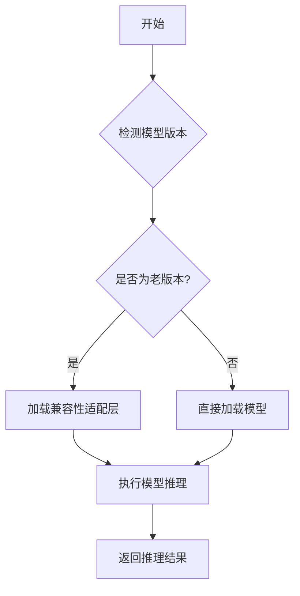

# `Bert-VITS2\oldVersion\__init__.py` 详细设计文档

该文件旨在提供老版本模型推理的兼容性支持，通过适配层或封装接口确保旧版模型能够在新版系统中正常运行，可能包含版本检测、接口转换、参数映射等功能。

## 整体流程



## 类结构

```
由于源代码中未提供具体的类实现，类层次结构为空。
```

## 全局变量及字段


    

## 全局函数及方法


## 关键组件


### 老版本模型推理兼容模块

该代码片段仅包含一个文档字符串"`老版本模型推理兼容`"，没有实际的代码实现。由于缺乏具体的代码实现，无法从中识别出张量索引与惰性加载、反量化支持、量化策略等关键组件，也无法提供类的详细信息、方法流程图、源码注释等。

**注意**：当前提供的源代码不完整，请提供包含实际逻辑的代码以便进行详细分析。


## 问题及建议


### 已知问题

-   **代码缺失**：该文件仅包含一个文档字符串说明“老版本模型推理兼容”，但没有任何实际的实现代码，无法完成任何功能
-   **功能不可用**：由于没有代码实现，无法进行模型推理或版本兼容处理
-   **可测试性为零**：没有代码意味着无法编写测试用例来验证兼容性逻辑
-   **依赖关系不明确**：文档中未说明该模块应该提供哪些接口或与哪些模块交互

### 优化建议

-   **实现核心功能**：根据“老版本模型推理兼容”的描述，补充实际的兼容逻辑代码，可能包括旧版本模型的加载、推理接口适配、数据格式转换等功能
-   **定义接口契约**：明确该模块应该暴露的公共接口（如 `load_legacy_model()`、`infer()` 等），确保其他模块可以正确调用
-   **添加版本检测**：实现版本检测机制，判断当前模型版本并决定是否使用兼容层
-   **补充错误处理**：添加异常处理逻辑，处理版本不兼容、模型加载失败等情况
-   **编写单元测试**：为兼容逻辑编写测试用例，确保各种场景下的正确性
-   **完善文档**：在文档字符串中添加更详细的说明，包括使用方式、参数说明、返回值等


## 其它


### 设计目标与约束

该模块旨在提供老版本模型推理的向后兼容性支持，确保新系统能够正确加载和执行历史版本的机器学习模型，保持功能的连续性和稳定性。设计目标包括：最小化版本迁移带来的功能缺失，保留原有模型的核心推理能力，同时为未来版本升级提供平滑过渡路径。

### 错误处理与异常设计

错误处理策略采用分层防御机制，在模型加载阶段捕获文件格式不匹配、版本标识缺失等异常，在推理阶段处理输入数据不合规、模型参数损坏等情况。定义自定义异常类包括：ModelVersionNotSupportedException（版本不支持异常）、ModelLoadException（模型加载异常）、InferenceException（推理执行异常），每类异常携带详细的错误上下文信息和堆栈跟踪，便于问题定位。

### 数据流与状态机

数据流转遵循"加载->验证->缓存->推理->释放"的完整生命周期。模型加载器维护三种状态：UNLOADED（未加载）、LOADING（加载中）、READY（就绪）和ERROR（错误）。状态转换通过状态机管理，确保并发场景下的线程安全性。输入数据流经预处理模块、推理引擎、后处理模块，每个环节设置数据校验点，保证推理管道的完整性。

### 外部依赖与接口契约

模块对外暴露核心接口：load_model(version_info)用于加载指定版本模型、infer(input_data)用于执行推理、get_supported_versions()返回兼容版本列表、get_model_metadata()获取模型元信息。依赖关系包括：模型序列化库、配置文件解析器、推理运行时环境。接口契约明确规定参数类型约束、返回值格式规范、异常抛出条件，以及版本兼容性保证策略。

### 配置管理与部署相关

配置管理采用声明式配置方式，定义模型版本映射表、推理参数默认值、资源限制策略。部署相关包含：环境依赖说明（Python版本、第三方库版本要求）、模型文件存储路径规范、资源初始化流程、容器化部署配置示例、健康检查接口定义。

### 性能考量与监控指标

性能指标体系包括模型加载耗时、首次推理延迟、吞吐量、内存占用、GPU利用率等关键性能指标。定义性能基线标准和告警阈值，提供性能采集接口支持运维监控系统集成。优化策略包括：模型预热、结果缓存、批处理支持、异步推理等。

### 安全考虑与权限控制

安全设计涵盖模型文件完整性校验、敏感数据脱敏、推理输入合法性验证、异常调用频率限制。权限控制模型定义不同角色的操作权限：管理员可更新模型配置，普通用户仅可执行推理操作。审计日志记录所有模型加载和推理调用历史。

### 测试策略与验证方案

测试体系包含单元测试、集成测试、性能测试、回归测试四个层次。单元测试覆盖核心工具函数和异常处理逻辑；集成测试验证模块与上下游系统的交互正确性；性能测试评估不同版本模型的推理效率；回归测试确保新版本不影响老版本模型的兼容性。提供测试覆盖率目标和验证用例示例。

### 演进路线与版本规划

短期演进路线包括：完善版本兼容性列表、增加更多老版本模型支持、优化加载性能。中期规划涉及：引入模型版本自动检测机制、支持插件式后处理扩展。长期目标包括：建立模型版本管理平台、提供版本生命周期管理能力。

### 文档与注释规范

代码注释采用Google风格文档字符串规范，每个公开类和方法必须包含文档说明。内部实现细节通过inline注释解释复杂逻辑。API文档自动生成工具配置、用户使用手册、故障排查指南等配套文档体系。


    