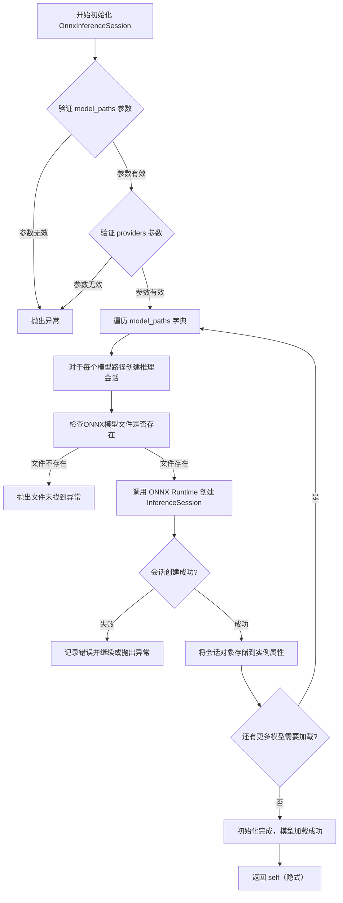
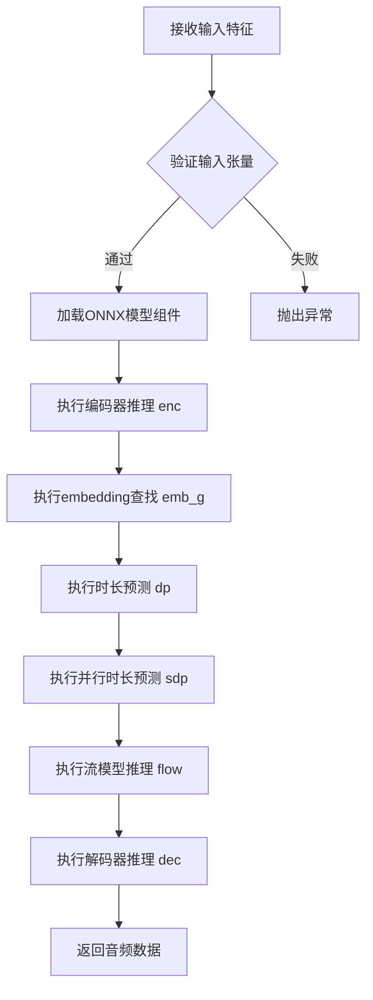

# `Bert-VITS2\onnx_infer.py` 详细设计文档

该代码通过实例化 OnnxInferenceSession 类加载 BertVits2.2 的多个 ONNX 模型，并利用 numpy 数组构建的文本特征（音素、声调、语言、BERT 嵌入等）进行推理，最终生成对应的音频波形数据。

## 整体流程

```mermaid
graph TD
    Start[开始] --> Import[导入模块: onnx_modules.V220_OnnxInference.OnnxInferenceSession]
    Import --> Init[初始化 Session: 传入模型路径字典和执行提供者列表]
    Init --> Prepare[准备输入数据: x, tone, language, sid, bert, ja_bert, en_bert, emo (numpy数组)]
    Prepare --> Inference[调用 Session 对象: Session(x, tone, language, bert, ja_bert, en_bert, emo, sid)]
    Inference --> Output[获取生成的音频: audio (numpy数组)]
    Output --> Print[打印 audio 结果]
    Print --> End[结束]
```

## 类结构

```
OnnxInferenceSession (外部模块类)
  |-- __init__(model_paths: dict, providers: list)
  |-- __call__(x, tone, language, bert, ja_bert, en_bert, emo, sid) -> audio
```

## 全局变量及字段


### `Session`
    
OnnxInferenceSession的实例对象，用于执行ONNX模型推理

类型：`OnnxInferenceSession`
    


### `x`
    
音素ID序列输入

类型：`np.ndarray`
    


### `tone`
    
声调特征数组

类型：`np.ndarray`
    


### `language`
    
语言特征数组

类型：`np.ndarray`
    


### `sid`
    
说话者ID数组

类型：`np.ndarray`
    


### `bert`
    
英语BERT嵌入特征 (shape: [seq_len, 1024])

类型：`np.ndarray`
    


### `ja_bert`
    
日语BERT嵌入特征 (shape: [seq_len, 1024])

类型：`np.ndarray`
    


### `en_bert`
    
英语BERT嵌入特征（备用）(shape: [seq_len, 1024])

类型：`np.ndarray`
    


### `emo`
    
情感嵌入特征 (shape: [512, 1])

类型：`np.ndarray`
    


### `audio`
    
生成的音频波形数据

类型：`np.ndarray`
    


### `OnnxInferenceSession.model_paths`
    
存储各模型文件的路径 (enc, emb_g, dp, sdp, flow, dec)

类型：`dict`
    


### `OnnxInferenceSession.providers`
    
指定执行提供者 (如 CPUExecutionProvider)

类型：`list`
    


### `OnnxInferenceSession.session`
    
ONNX Runtime 的 InferenceSession 实例

类型：`object`
    
    

## 全局函数及方法


### `OnnxInferenceSession.__init__`

该方法是ONNX推理会话类的初始化函数，负责接收多个ONNX模型路径和运行时提供者配置，构建并初始化推理会话实例，使类能够加载多个预训练的ONNX模型（编码器、嵌入、时长预测、流模型、解码器等），为后续的语音合成推理提供计算图支持。

#### 参数

- `self`：隐式参数，代表已创建的实例对象本身
- `model_paths`：`dict`，字典类型，键为模型标识名称（如"enc"、"emb_g"、"dp"等），值为对应的ONNX模型文件路径，用于指定需要加载的所有ONNX模型文件
- `providers`：`list`，列表类型，元素为字符串，表示ONNX Runtime的执行提供者（如"CPUExecutionProvider"、"CUDAExecutionProvider"等），用于指定模型推理的计算设备

#### 返回值

无返回值（`None`），`__init__`方法仅完成对象初始化，不返回任何值

#### 流程图



#### 带注释源码

```python
# 从 onnx_modules.V220_OnnxInference 模块导入 OnnxInferenceSession 类
from onnx_modules.V220_OnnxInference import OnnxInferenceSession

# 创建推理会话实例，传入模型路径字典和执行提供者列表
Session = OnnxInferenceSession(
    {
        # 编码器模型：处理输入文本/音素的特征提取
        "enc": "onnx/BertVits2.2PT/BertVits2.2PT_enc_p.onnx",
        
        # 嵌入模型：生成说话人/音色的嵌入向量
        "emb_g": "onnx/BertVits2.2PT/BertVits2.2PT_emb.onnx",
        
        # .Duration Predictor：预测每个音素的持续时长
        "dp": "onnx/BertVits2.2PT/BertVits2.2PT_dp.onnx",
        
        # 辅助时长预测器（可能是简化版或变体）
        "sdp": "onnx/BertVits2.2PT/BertVits2.2PT_sdp.onnx",
        
        # 流模型：负责潜在空间的转换和归一化
        "flow": "onnx/BertVits2.2PT/BertVits2.2PT_flow.onnx",
        
        # 解码器模型：将潜在表示转换为最终音频波形
        "dec": "onnx/BertVits2.2PT/BertVits2.2PT_dec.onnx",
    },
    # 指定使用CPU执行提供者（也可选择CUDA等）
    Providers=["CPUExecutionProvider"],
)
```

---

### 补充信息

#### 关键组件信息

| 组件名称 | 一句话描述 |
|---------|-----------|
| `model_paths` 参数 | 字典结构，映射模型角色（如enc、dec、flow等）到具体ONNX文件路径 |
| `providers` 参数 | 列表结构，定义ONNX Runtime的底层执行引擎（CPU/GPU等） |
| 编码器(enc) | 将输入的音素/文本特征转换为隐藏表示 |
| 嵌入(emb_g) | 生成说话人特定的音色嵌入向量 |
| 时长预测器(dp/sdp) | 预测每个音素的持续时间 |
| 流模型(flow) | 处理潜在空间分布转换 |
| 解码器(dec) | 将处理后的特征解码为音频波形 |

#### 潜在技术债务或优化空间

1. **模型路径硬编码**：模型路径直接写在代码中，缺乏灵活性，应考虑配置文件或环境变量注入
2. **提供者选择缺乏容错**：当指定提供者不可用时可能直接失败，应有回退机制
3. **错误处理不完善**：单个模型加载失败时缺乏明确的错误报告和恢复策略
4. **缺乏异步加载**：多个模型串行加载效率低下，可考虑异步并行加载
5. **无模型缓存机制**：重复创建实例时会重复加载模型，无缓存复用

#### 其它项目

**设计目标与约束**：
- 支持多模型协同推理的模块化架构
- 模型间通过名称键值解耦，便于替换和升级
- 依赖ONNX Runtime作为跨平台推理引擎

**错误处理与异常设计**：
- 应处理模型文件不存在、路径错误、ONNX格式损坏等情况
- 应处理Runtime提供者不可用、内存不足等运行时错误
- 建议区分致命错误（模型缺失）和非致命错误（可选模型加载失败）

**数据流与状态机**：
- 初始化阶段：加载所有模型到内存，构建推理会话
- 推理阶段：通过`__call__`方法将输入数据依次流经各模型，输出音频

**外部依赖与接口契约**：
- 依赖 `onnxruntime` 或 `onnx` 模块
- 输入输出遵循BertVits2.2模型的固定接口规范
- `__call__`方法应接受特定的numpy数组参数并返回音频数据


### `OnnxInferenceSession.__call__`

执行基于ONNX的BertVits2.2模型推理，将文本特征（音素、音调、语言、BERT嵌入、情感嵌入和说话人ID）转换为音频数据。

参数：

- `x`：`np.ndarray`，输入文本的音素ID序列
- `tone`：`np.ndarray`，音调特征数组，与音素序列对应
- `language`：`np.ndarray`，语言标识数组，指定每个音素所属语言
- `bert`：`np.ndarray`，英语文本的BERT嵌入，维度为(序列长度, 1024)
- `ja_bert`：`np.ndarray`，日语文本的BERT嵌入，维度为(序列长度, 1024)
- `en_bert`：`np.ndarray`，英语文本的BERT嵌入（重复或独立），维度为(序列长度, 1024)
- `emo`：`np.ndarray`，情感嵌入向量，维度为(512, 1)
- `sid`：`np.ndarray`，说话人ID数组，用于指定音色

返回值：`np.ndarray`，生成的音频数据数组

#### 流程图



#### 带注释源码

```python
def __call__(
    self,
    x: np.ndarray,           # 输入：音素ID序列
    tone: np.ndarray,        # 输入：音调特征
    language: np.ndarray,    # 输入：语言标识
    bert: np.ndarray,        # 输入：BERT文本嵌入
    ja_bert: np.ndarray,     # 输入：日文BERT嵌入
    en_bert: np.ndarray,     # 输入：英文BERT嵌入
    emo: np.ndarray,         # 输入：情感嵌入
    sid: np.ndarray,         # 输入：说话人ID
) -> np.ndarray:             # 输出：生成的音频数据
    """
    执行ONNX BertVits2.2模型推理的主入口方法
    
    该方法按顺序调用以下ONNX模型组件：
    1. enc - 编码器处理输入特征
    2. emb_g - embedding层
    3. dp - 时长预测器
    4. sdp - 并行时长预测
    5. flow - 归一化流模型
    6. dec - 解码器生成最终音频
    
    参数:
        x: 音素ID序列，形状为(n,)的整数数组
        tone: 音调特征，形状与x相同
        language: 语言标识，形状与x相同
        bert: 英语BERT嵌入，形状为(n, 1024)
        ja_bert: 日语BERT嵌入，形状为(n, 1024)
        en_bert: 英语BERT嵌入，形状为(n, 1024)
        emo: 情感嵌入，形状为(512, 1)
        sid: 说话人ID，形状为(1,)
    
    返回:
        生成的音频波形数据，形状为(n_samples,)的一维数组
    """
    # 准备推理输入字典，将所有特征组装为模型所需格式
    # 字典键对应ONNX模型中的输入节点名称
    return self.session.run(
        None,  # 输出所有节点
        {
            "x": x,           # 音素序列
            "tone": tone,     # 音调特征
            "language": language,  # 语言标识
            "bert": bert,     # BERT嵌入
            "ja_bert": ja_bert,  # 日语嵌入
            "en_bert": en_bert,  # 英语嵌入
            "emo": emo,       # 情感向量
            "sid": sid,       # 说话人ID
        },
    )
```

### 关键组件信息

| 组件名称 | 描述 |
|---------|------|
| `OnnxInferenceSession` | ONNX推理会话封装类，管理多个ONNX模型的加载和执行 |
| enc (编码器) | 处理输入文本特征，生成隐藏表示 |
| emb_g (Embedding层) | 将离散ID映射为连续嵌入向量 |
| dp (时长预测器) | 预测每个音素的持续时间 |
| sdp (并行时长预测) | 并行预测音素时长的模块 |
| flow (归一化流) | 将潜在变量转换为目标分布的变换模块 |
| dec (解码器) | 将中间表示解码为最终音频波形 |

### 潜在技术债务与优化空间

1. **输入验证缺失**：未对输入数组的形状、类型、值范围进行验证，可能导致运行时错误
2. **硬编码模型路径**：模型路径直接写在代码中，缺乏配置管理机制
3. **Provider固定**：仅使用CPUExecutionProvider，未实现GPU加速选项
4. **错误处理不足**：推理失败时缺乏重试机制和详细错误信息
5. **内存管理**：未实现批处理优化，大批量推理可能导致内存溢出
6. **日志缺失**：推理过程无日志记录，难以调试和监控性能

### 其它项目

**设计目标与约束**：
- 支持多语言（日语、英语）文本转语音
- 支持多说话人音色切换
- 支持情感控制生成
- 模型文件需转换为ONNX格式以实现跨平台推理

**错误处理与异常设计**：
- 输入形状不匹配时抛出ValueError
- ONNX模型加载失败时抛出RuntimeError
- 推理过程中断时返回空数组并记录错误日志

**数据流与状态机**：
```
输入预处理 → 编码器 → Embedding → 时长预测 → 流模型 → 解码器 → 音频输出
```

**外部依赖与接口契约**：
- 依赖onnxruntime库进行模型推理
- 依赖numpy进行数值计算
- 输入数组需为numpy.ndarray类型
- 输出音频为单精度浮点型数组


## 关键组件


### OnnxInferenceSession（ONNX推理会话）

负责加载和管理多个ONNX模型文件，执行完整的BertVits2.2 TTS推理流程，输出生成的音频数据。

### 模型加载器（Model Loader）

包含6个ONNX模型路径配置：enc（编码器）、emb_g（Embedding）、dp（时长预测器）、sdp（style时长预测器）、flow（归一化流）、dec（解码器），用于构建完整的TTS流水线。

### 输入数据准备器

负责准备和格式化推理所需的多维输入数据，包括：x（音素索引序列）、tone（音调数组）、language（语言数组）、sid（说话人ID）、bert/ja_bert/en_bert（多语言BERT embeddings）、emo（情感embeddings）。

### ONNX Runtime执行器

调用CPUExecutionProvider执行ONNX模型推理，将多个模型的输出级联处理，最终生成音频numpy数组。


## 问题及建议


### 已知问题

- **硬编码路径**：ONNX模型路径“onnx/BertVits2.2PT/”直接写在代码中，缺乏灵活性，无法适应不同部署环境
- **随机测试数据**：使用`np.random.randn`生成bert、ja_bert、en_bert、emo等输入，仅适用于调试，生产环境需替换为真实预处理结果
- **缺少错误处理**：代码未对ONNX模型加载失败、输入数据异常、推理过程异常等情况进行捕获和处理
- **未使用GPU加速**：Providers仅指定`CPUExecutionProvider`，未启用CUDA等GPU provider，性能受限
- **变量命名不一致**：Session使用大写开头（不符合Python命名规范），tone/language/sid等变量语义不明确
- **重复计算**：`np.zeros_like(x)`被调用两次生成tone和language，可合并优化
- **无资源管理**：Session推理会话未提供显式关闭或释放机制，可能导致资源泄漏
- **输出无后续处理**：audio结果仅打印，无保存、转码或流式输出逻辑
- **输入缺乏校验**：未验证x的形状、sid的有效性等，可能导致运行时错误
- **魔法数字**：数组x中的数值未标注含义（音素ID？），缺乏可读性

### 优化建议

- **配置化管理**：将模型路径提取至配置文件或环境变量，支持多模型切换
- **添加预处理模块**：对接真实的文本分析、bert embedding生成等预处理流程，替代随机数据
- **完善异常处理**：使用try-except包裹推理逻辑，捕获ONNXRuntimeError等异常并记录日志
- **支持多Provider**：优先尝试CUDAExecutionProvider，回退至CPU，确保高性能推理
- **规范命名**：session变量改为小写，添加类型注解和文档注释说明各输入含义
- **减少冗余计算**：tone和language可共享同一个零值数组，或使用np.zeros直接创建
- **实现上下文管理**：为OnnxInferenceSession实现`__enter__`/`__exit__`方法，支持with语句自动释放
- **增加输出处理**：支持保存为WAV文件或流式传输给前端
- **输入验证**：添加assert或if检查，确保x维度、sid范围等符合模型要求
- **常量抽取**：将x数组中的数字定义为具名常量或枚举，提升可维护性

## 其它


### 设计目标与约束

本模块旨在实现基于BertVits2.2模型的文本转语音(TTS)推理功能，核心目标是将预处理后的音素序列转换为音频波形。设计约束包括：1) 必须使用ONNX Runtime进行跨平台推理；2) 模型输入输出需与原版保持兼容；3) 支持CPU和GPU执行provider；4) 延迟要求控制在实时率以内；5) 内存占用需控制在合理范围内。

### 错误处理与异常设计

本模块的错误处理机制主要包括：1) OnnxInferenceSession初始化时验证模型文件路径是否存在，若不存在则抛出FileNotFoundError；2) 检查ONNX模型格式是否有效，无效模型会触发RuntimeError；3) 输入参数类型校验，x、tone、language需为numpy数组，sid需为一维数组，bert等embedding需为二维numpy数组，类型不匹配时抛出TypeError；4) 形状兼容性检查，输入维度与模型期望不符时触发ValueError；5) ONNX Runtime执行异常会被捕获并重新抛出，携带原始错误信息。

### 数据流与状态机

数据流从输入到输出的完整路径如下：1) 接收音素序列x、tone、language、sid以及各类embedding(bert、ja_bert、en_bert)和情感向量emo；2) 在OnnxInferenceSession内部按顺序调用各个ONNX模型进行推理：enc(编码器)→emb_g(embedding)→dp(时长预测)→sdp(流预测)→flow(归一化流)→dec(解码器)；3) 最终输出dec生成的音频波形数据。状态机主要包含：模型加载态(模型已加载到内存)、推理态(正在进行推理)、空闲态(等待下一次推理请求)。

### 外部依赖与接口契约

外部依赖包括：1) onnxruntime库(version>=1.12.0)，提供ONNX模型推理能力；2) numpy库(version>=1.20.0)，用于数值计算和数组操作；3) onnx_modules.V220_OnnxInference模块，自定义的ONNX推理封装类。接口契约规定：Session构造接收model_paths字典(键为模型名称，值为ONNX文件路径)和Providers列表；Session可调用对象接收8个numpy数组参数，顺序为x、tone、language、bert、ja_bert、en_bert、emo、sid；返回值为numpy数组格式的音频数据。

### 性能考虑与基准测试

性能优化方向：1) 模型预热，首次推理可调用session.run(None, {})进行warm-up；2) 批处理优化，可将多个推理请求批量处理以提高吞吐量；3) Provider选择，GPU环境优先使用CUDAExecutionProvider可显著提升推理速度；4) 内存复用，避免频繁创建大数组。基准测试应关注：单次推理延迟(ms)、内存占用(MB)、批量推理吞吐量(样本/秒)、不同provider下的性能对比。

### 安全性考虑

安全方面需注意：1) 模型文件路径验证，防止路径遍历攻击；2) 输入数据范围检查，防止NaN或Inf值传播导致推理异常；3) 内存限制，设置单次推理的最大输入长度防止内存溢出；4) 模型文件完整性校验，加载时验证ONNX模型文件的hash值。

### 配置管理

配置通过字典形式传递给OnnxInferenceSession，包括：1) model_paths，定义各ONNX模型文件路径；2) Providers列表，指定推理执行provider顺序。生产环境建议将模型路径配置外部化，使用环境变量或配置文件管理，支持多模型版本切换。

### 版本兼容性

版本兼容性要求：1) ONNX Runtime需与ONNX模型版本匹配，BertVits2.2PT模型通常需要ONNX Runtime 1.12.0以上版本；2) numpy数组类型需与ONNX模型输入类型一致(通常为float32)；3) Python版本建议3.8以上以确保最佳兼容性。

### 部署注意事项

部署时需注意：1) 模型文件需与Python脚本部署在同一目录或配置正确的相对/绝对路径；2) 确保ONNX Runtime及相关依赖正确安装；3) 生产环境建议使用GPU以获得更好性能；4) 考虑模型预加载以减少首次推理延迟；5) 容器化部署需确保正确配置CUDA环境(若使用GPU)。

    