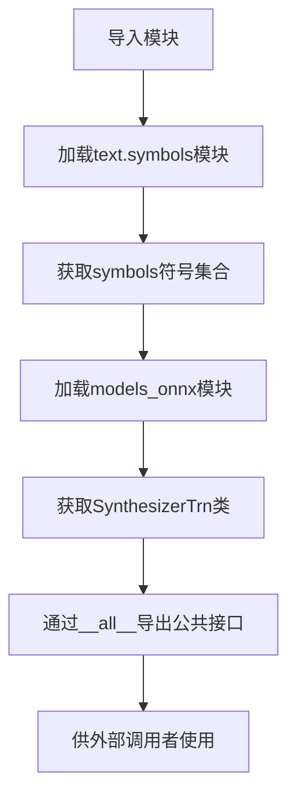

# `Bert-VITS2\onnx_modules\V200\__init__.py` 详细设计文档

这是VITS-tts项目的包初始化文件，主要用于导出文本符号集合symbols和ONNX推理模型类SynthesizerTrn，为上层调用提供统一的公共接口。

## 整体流程



## 类结构

```
包初始化模块
├── text.symbols (符号模块)
│   └── symbols (符号集合/列表)
└── models_onnx (ONNX模型模块)
    └── SynthesizerTrn (推理模型类)
```

## 全局变量及字段


### `symbols`
    
从text.symbols模块导入的符号集合，用于文本处理或语音合成的字符/音素映射

类型：`list/tuple[str]`
    


### `SynthesizerTrn.SynthesizerTrn`
    
基于Transformer架构的ONNX语音合成模型，用于将文本或音素转换为音频波形

类型：`class`
    
    

## 全局函数及方法


## 关键组件


### symbols

从 `text.symbols` 模块导入的音素符号集合，用于文本到语音合成中的文本表示

### SynthesizerTrn

从 `models_onnx` 模块导入的Transformer合成器模型类，负责ONNX格式的语音合成推理

### __all__

Python模块导出控制列表，定义了公开API接口，仅暴露symbols和SynthesizerTrn两个组件


## 问题及建议


### 已知问题

-   **模块级文档字符串缺失**：该 `__init__.py` 文件缺少模块级别的文档字符串（docstring），无法快速了解该包的核心用途和设计意图
-   **缺乏导入错误处理**：直接使用 `from ... import ...` 语句，没有 `try-except` 包装，若子模块（text.symbols 或 models_onnx）不存在或导入失败，会抛出难以追溯的 `ModuleNotFoundError`
-   **符号导出不完整**：`__all__` 仅暴露两个符号，但未考虑是否还有其他子模块中的功能需要导出，可能导致用户无法使用包内的其他功能
-   **类型注解完全缺失**：导出的 `symbols` 和 `SynthesizerTrn` 没有任何类型注解或类型提示，妨碍静态分析和 IDE 自动补全
-   **相对导入一致性风险**：使用相对导入（`.text.symbols`），但未在代码中明确标注包名或版本信息，可能在打包分发时产生路径解析问题
-   **潜在的循环导入风险**：若 `models_onnx` 或 `text.symbols` 模块反向导入此包，可能触发 Python 循环导入错误

### 优化建议

-   **添加模块文档字符串**：在文件开头添加模块级别的 docstring，说明该包为 VITS 文本转语音模型，提供 symbols 和 SynthesizerTrn 等核心组件
-   **引入异常处理机制**：使用 try-except 包装导入语句，提供更友好的错误提示，例如提示缺失的依赖项
-   **完善类型注解**：考虑添加 `TYPE_CHECKING` 条件导入或类型别名，提升代码可维护性和静态检查能力
-   **显式导出设计**：审查 `__all__` 内容，确保只暴露必要的公共 API，隐藏内部实现细节
-   **添加版本信息**：可引入 `__version__` 变量或从配置文件中读取版本号，方便依赖管理和调试
-   **统一导入风格**：根据项目规模，选择一致的导入方式（相对导入或绝对导入），并添加明确的包结构说明


## 其它


### 设计目标与约束

本模块作为VITS Text-to-Speech系统的核心入口模块，负责导出文本符号表和ONNX推理模型供外部调用。设计目标包括：1) 提供统一的模块导出接口；2) 解耦文本符号定义与模型实现；3) 支持ONNX runtime的高效推理部署。约束条件包括依赖PyTorch环境及ONNX Runtime，版本兼容性要求Python 3.8+。

### 错误处理与异常设计

本模块本身为纯导入模块，不涉及运行时错误处理。主要错误来源于导入依赖模块失败（如`.text.symbols`或`.models_onnx`不存在），会抛出`ModuleNotFoundError`。外部调用时需确保依赖模块正确安装，建议使用try-except捕获导入异常并进行友好提示。

### 外部依赖与接口契约

**依赖模块：**
- `.text.symbols`：文本符号定义模块，提供音素/字符符号集
- `.models_onnx`：ONNX模型推理模块，提供`SynthesizerTrn`类

**接口契约：**
- `symbols`：符号列表或符号定义对象
- `SynthesizerTrn`：继承自PyTorch nn.Module的ONNX兼容合成器类

**版本要求：**
- Python >= 3.8
- PyTorch >= 1.7
- onnxruntime >= 1.8

### 配置与参数说明

本模块无直接配置参数。`SynthesizerTrn`模型的配置由`.models_onnx`模块内部定义，通常包含音频采样率（默认22050）、模型维度、注意力头数等超参数。具体配置需参考模型训练时的配置json文件。

### 性能考虑

1) ONNX模型推理相比PyTorch原生推理通常有2-5倍加速；2) 首次导入模块时会加载模型结构，内存占用取决于模型规模；3) 建议使用`torch.jit.trace`优化推理图；4) 批量推理时需注意ONNX Runtime的会话配置优化。

### 安全性考虑

1) 模型文件来源需验证，防止恶意模型注入；2) 输入文本需进行长度限制防止DoS攻击；3) 符号表`symbols`应避免包含敏感字符；4) 部署时注意模型文件的访问权限控制。

### 测试策略

1) 单元测试：验证`symbols`和`SynthesizerTrn`可正常导入；2) 集成测试：验证模型可完成完整推理流程；3) ONNX兼容性测试：验证模型可成功转换为ONNX格式；4) 回归测试：确保符号表更新不影响已有模型推理结果。

### 使用示例

```python
# 导入模块
from vits import symbols, SynthesizerTrn

# 查看可用符号
print(f"符号数量: {len(symbols)}")

# 加载模型进行推理（需配合其他模块）
# model = SynthesizerTrn(...)
# audio = model.infer(text)
```

### 已知限制

1) 本模块仅作导入导出使用，无推理功能；2) `SynthesizerTrn`为ONNX优化版本，部分动态图特性可能受限；3) 符号表与模型强耦合，修改符号表需重新训练模型；4) 暂不支持多语言混合推理的符号定义。


    