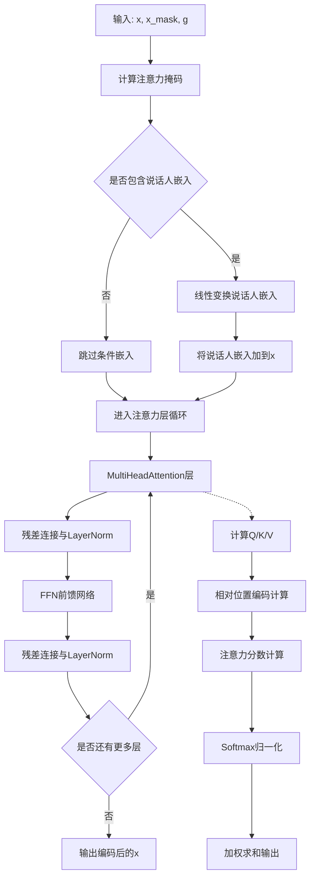
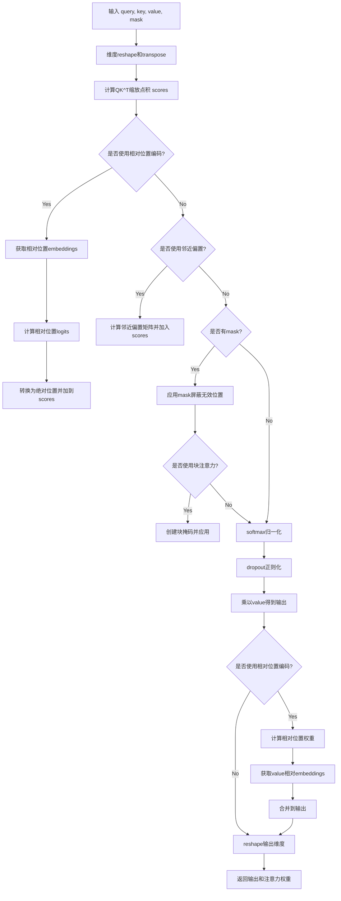
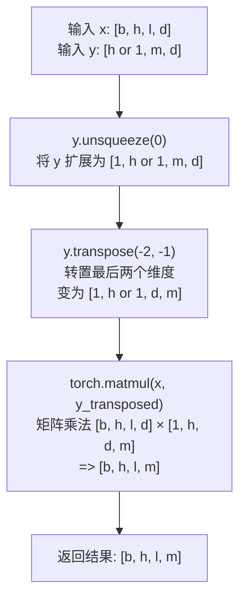
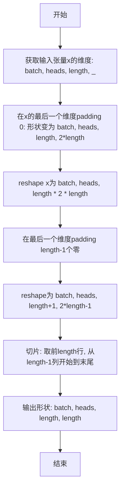
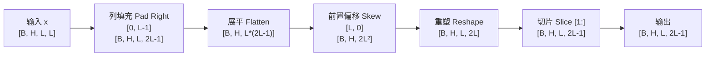
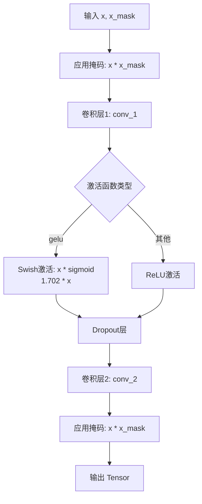

# `Bert-VITS2\onnx_modules\V200\attentions_onnx.py` 详细设计文档

该代码实现了一个基于Transformer架构的Encoder模块，包含多头注意力机制(MultiHeadAttention)、前馈神经网络(FFN)和层归一化(LayerNorm)，支持相对位置编码、因果卷积填充和说话人嵌入条件输入，主要用于语音合成或语音转换等序列到序列任务。

## 整体流程



## 类结构

```
nn.Module (PyTorch基类)
├── LayerNorm (层归一化)
├── Encoder (Transformer编码器)
│   ├── MultiHeadAttention (多头注意力)
│   └── FFN (前馈神经网络)
└── (全局函数)
    └── fused_add_tanh_sigmoid_multiply
```

## 全局变量及字段


### `logger`
    
模块级日志记录器

类型：`logging.Logger`
    


### `LayerNorm.LayerNorm.channels`
    
输入通道数

类型：`int`
    


### `LayerNorm.LayerNorm.eps`
    
防止除零的 epsilon 值

类型：`float`
    


### `LayerNorm.LayerNorm.gamma`
    
缩放参数

类型：`nn.Parameter`
    


### `LayerNorm.LayerNorm.beta`
    
偏置参数

类型：`nn.Parameter`
    


### `Encoder.Encoder.hidden_channels`
    
隐藏层通道数

类型：`int`
    


### `Encoder.Encoder.filter_channels`
    
FFN filter通道数

类型：`int`
    


### `Encoder.Encoder.n_heads`
    
注意力头数

类型：`int`
    


### `Encoder.Encoder.n_layers`
    
编码器层数

类型：`int`
    


### `Encoder.Encoder.kernel_size`
    
卷积核大小

类型：`int`
    


### `Encoder.Encoder.p_dropout`
    
dropout概率

类型：`float`
    


### `Encoder.Encoder.window_size`
    
相对注意力窗口大小

类型：`int`
    


### `Encoder.Encoder.cond_layer_idx`
    
条件嵌入层索引

类型：`int`
    


### `Encoder.Encoder.gin_channels`
    
说话人嵌入通道数

类型：`int`
    


### `Encoder.Encoder.spk_emb_linear`
    
说话人嵌入线性层

类型：`nn.Linear`
    


### `Encoder.Encoder.drop`
    
Dropout层

类型：`nn.Dropout`
    


### `Encoder.Encoder.attn_layers`
    
多头注意力层列表

类型：`nn.ModuleList`
    


### `Encoder.Encoder.norm_layers_1`
    
第一归一化层列表

类型：`nn.ModuleList`
    


### `Encoder.Encoder.ffn_layers`
    
FFN层列表

类型：`nn.ModuleList`
    


### `Encoder.Encoder.norm_layers_2`
    
第二归一化层列表

类型：`nn.ModuleList`
    


### `MultiHeadAttention.MultiHeadAttention.channels`
    
输入通道数

类型：`int`
    


### `MultiHeadAttention.MultiHeadAttention.out_channels`
    
输出通道数

类型：`int`
    


### `MultiHeadAttention.MultiHeadAttention.n_heads`
    
注意力头数

类型：`int`
    


### `MultiHeadAttention.MultiHeadAttention.p_dropout`
    
dropout概率

类型：`float`
    


### `MultiHeadAttention.MultiHeadAttention.window_size`
    
相对位置编码窗口大小

类型：`int`
    


### `MultiHeadAttention.MultiHeadAttention.heads_share`
    
是否共享头

类型：`bool`
    


### `MultiHeadAttention.MultiHeadAttention.block_length`
    
局部注意力块长度

类型：`int`
    


### `MultiHeadAttention.MultiHeadAttention.proximal_bias`
    
是否使用近端偏置

类型：`bool`
    


### `MultiHeadAttention.MultiHeadAttention.proximal_init`
    
是否初始化近端权重

类型：`bool`
    


### `MultiHeadAttention.MultiHeadAttention.attn`
    
注意力权重缓存

类型：`Optional[Tensor]`
    


### `MultiHeadAttention.MultiHeadAttention.k_channels`
    
每个头的通道数

类型：`int`
    


### `MultiHeadAttention.MultiHeadAttention.conv_q`
    
Query卷积层

类型：`nn.Conv1d`
    


### `MultiHeadAttention.MultiHeadAttention.conv_k`
    
Key卷积层

类型：`nn.Conv1d`
    


### `MultiHeadAttention.MultiHeadAttention.conv_v`
    
Value卷积层

类型：`nn.Conv1d`
    


### `MultiHeadAttention.MultiHeadAttention.conv_o`
    
输出卷积层

类型：`nn.Conv1d`
    


### `MultiHeadAttention.MultiHeadAttention.drop`
    
Dropout层

类型：`nn.Dropout`
    


### `MultiHeadAttention.MultiHeadAttention.emb_rel_k`
    
相对位置Key嵌入

类型：`nn.Parameter`
    


### `MultiHeadAttention.MultiHeadAttention.emb_rel_v`
    
相对位置Value嵌入

类型：`nn.Parameter`
    


### `FFN.FFN.in_channels`
    
输入通道数

类型：`int`
    


### `FFN.FFN.out_channels`
    
输出通道数

类型：`int`
    


### `FFN.FFN.filter_channels`
    
隐藏层通道数

类型：`int`
    


### `FFN.FFN.kernel_size`
    
卷积核大小

类型：`int`
    


### `FFN.FFN.p_dropout`
    
dropout概率

类型：`float`
    


### `FFN.FFN.activation`
    
激活函数类型

类型：`str`
    


### `FFN.FFN.causal`
    
是否因果卷积

类型：`bool`
    


### `FFN.FFN.padding`
    
填充函数

类型：`Callable`
    


### `FFN.FFN.conv_1`
    
第一个卷积层

类型：`nn.Conv1d`
    


### `FFN.FFN.conv_2`
    
第二个卷积层

类型：`nn.Conv1d`
    


### `FFN.FFN.drop`
    
Dropout层

类型：`nn.Dropout`
    
    

## 全局函数及方法


### `fused_add_tanh_sigmoid_multiply`

融合的tanh-sigmoid激活函数计算，用于WaveNet等模型，通过JIT编译优化将输入相加后并行计算tanh和sigmoid激活并相乘，提升计算效率。

#### 参数

- `input_a`：`Tensor`，第一个输入张量，通常为上一层的激活输出
- `input_b`：`Tensor`，第二个输入张量，通常为残差连接或偏置项
- `n_channels`：`Tensor`，通道数（注意：这里使用张量而非整数，可能是为了兼容TorchScript的静态类型推导），用于分割通道维度

#### 返回值

`Tensor`，返回融合激活后的输出张量，形状与输入相同

#### 流程图

```mermaid
flowchart TD
    A[输入 input_a, input_b, n_channels] --> B[获取通道数 n_channels_int = n_channels[0]]
    B --> C[计算 in_act = input_a + input_b]
    C --> D{通道分割}
    D --> E[计算 t_act = torch.tanh<br/>in_act[:, :n_channels_int, :]]
    D --> F[计算 s_act = torch.sigmoid<br/>in_act[:, n_channels_int:, :]]
    E --> G[计算 acts = t_act * s_act]
    F --> G
    G --> H[返回 acts]
```

#### 带注释源码

```python
@torch.jit.script
def fused_add_tanh_sigmoid_multiply(input_a, input_b, n_channels):
    """
    融合的tanh-sigmoid激活函数，用于WaveNet等模型
    
    该函数将两个输入相加后，同时计算tanh和sigmoid激活，
    然后将结果相乘。这种融合操作可以减少内存访问和kernel launch开销。
    
    参数:
        input_a: 第一个输入张量，形状为 [B, C, T]
        input_b: 第二个输入张量，形状为 [B, C, T]
        n_channels: 通道数，用于分割通道维度，形状为 [1]
    
    返回:
        融合激活后的输出张量，形状为 [B, C, T]
    """
    # 从n_channels张量中提取整数通道数
    n_channels_int = n_channels[0]
    
    # 将两个输入相加，得到激活前的值
    in_act = input_a + input_b
    
    # 对前半部分通道应用tanh激活
    # 假设n_channels_int = C//2，则取前C//2个通道
    t_act = torch.tanh(in_act[:, :n_channels_int, :])
    
    # 对后半部分通道应用sigmoid激活
    # 取后C//2个通道
    s_act = torch.sigmoid(in_act[:, n_channels_int:, :])
    
    # 将tanh和sigmoid结果相乘，得到最终输出
    acts = t_act * s_act
    
    return acts
```

---

#### 关键组件信息

| 组件名称 | 一句话描述 |
|---------|-----------|
| `@torch.jit_script` 装饰器 | TorchScript JIT编译装饰器，将函数编译为优化后的机器码 |
| `in_act` | 输入激活值，由两个输入张量相加得到 |
| `t_act` | tanh激活输出，用于Gated Activations的门控机制 |
| `s_act` | sigmoid激活输出，用于Gated Activations的门控机制 |

---

#### 潜在的技术债务或优化空间

1. **n_channels参数类型不一致**：使用`Tensor`类型的`n_channels`而非整数类型，这可能是为了兼容TorchScript，但增加了不必要的复杂度。建议在函数内部进行类型转换或使用整数类型的默认值处理。

2. **硬编码的通道分割比例**：当前实现假设通道被均匀分为两半（`n_channels_int`用于分割），缺乏灵活性。如果实际通道数不是偶数，可能导致错误。

3. **缺乏输入验证**：函数没有对输入形状和维度进行验证，可能导致运行时错误或难以调试的问题。

4. **注释与实现不完全匹配**：注释中提到形状为`[B, C, T]`，但实际上通道分割假设是`C/2`，这种假设在文档中应该更明确说明。

5. **JIT编译的潜在问题**：虽然使用了`@torch.jit.script`，但函数的某些操作（如动态索引`[:n_channels_int]`）可能在不同版本的PyTorch中导致性能下降或编译失败。

---

#### 其它项目

**设计目标与约束：**

- **核心目标**：通过融合操作减少GPU kernel调用次数，提升WaveNet类模型的推理性能
- **计算约束**：输入通道数必须为偶数，以确保能均匀分割为tanh和sigmoid两部分

**错误处理与异常设计：**

- 当前实现缺乏显式的错误处理
- 潜在的错误场景：
  - `n_channels_int`超出输入张量的通道维度范围
  - 输入形状不匹配
  - `n_channels`张量为空

**数据流与状态机：**

- 该函数是一个纯函数（无状态），每次调用独立
- 数据流：输入 → 相加 → 分割通道 → 并行激活 → 相乘 → 输出

**外部依赖与接口契约：**

- 依赖PyTorch核心库（`torch`）
- 输入张量应为FloatTensor或CUDA Tensor
- 输出张量类型与输入保持一致


### `LayerNorm.forward`

执行层归一化（Layer Normalization），对输入张量进行标准化处理，支持可学习的缩放（gamma）和偏移（beta）参数，并处理特定的数据维度顺序。

参数：

- `x`：`torch.Tensor`，输入张量，形状为 (batch, channels, time) 或类似的 3D 张量

返回值：`torch.Tensor`，归一化后的张量，形状与输入相同

#### 流程图

```mermaid
flowchart TD
    A[输入 x: Tensor] --> B[transpose: (1, -1)]
    B --> C[F.layer_norm 归一化]
    C --> D[transpose: (1, -1)]
    D --> E[输出: Tensor]
    
    subgraph "LayerNorm 参数"
        F[gamma: 可学习缩放参数]
        G[beta: 可学习偏移参数]
        H[eps: 数值稳定项]
    end
    
    C --> F
    C --> G
    C --> H
```

#### 带注释源码

```python
def forward(self, x):
    # 第一步：对输入张量进行维度置换
    # 将输入从 (batch, channels, time) 转换为 (batch, time, channels)
    # 这是因为 F.layer_norm 期望最后维度为归一化维度
    x = x.transpose(1, -1)
    
    # 第二步：执行层归一化
    # 使用 PyTorch 的 F.layer_norm 函数
    # 参数: 
    #   - x: 置换后的输入
    #   - (self.channels,): 归一化的维度大小
    #   - self.gamma: 可学习的缩放系数 (初始化为全1)
    #   - self.beta: 可学习的偏移系数 (初始化为全0)
    #   - self.eps: 防止除零的较小数值 (默认1e-5)
    x = F.layer_norm(x, (self.channels,), self.gamma, self.beta, self.eps)
    
    # 第三步：将维度置换回原始顺序
    # 从 (batch, time, channels) 恢复到 (batch, channels, time)
    return x.transpose(1, -1)
```


### `Encoder.forward`

该方法是 Transformer 风格的编码器前向传播函数，通过多层多头注意力机制和前馈网络处理输入序列，支持可选的条件输入（说话人嵌入）用于控制输出特征。

参数：

-  `x`：`Tensor`，输入特征序列，形状为 [batch, channels, time]
-  `x_mask`：`Tensor`，输入掩码张量，用于标识有效时间步，形状为 [batch, time]，值为 0 或 1
-  `g`：`Optional[Tensor]`，可选的条件输入（如说话人嵌入），形状为 [batch, gin_channels, 1]，用于在指定层注入条件信息

返回值：`Tensor`，编码后的特征序列，形状为 [batch, hidden_channels, time]

#### 流程图

```mermaid
flowchart TD
    A[输入 x, x_mask, g] --> B[生成注意力掩码 attn_mask = x_mask.unsqueeze2 × x_mask.unsqueeze-1]
    B --> C[输入掩码处理 x = x × x_mask]
    D[初始化循环 i = 0 to n_layers-1] --> E{检查条件层}
    
    E -->|i == cond_layer_idx 且 g 不为 None| F[说话人嵌入线性变换 spk_emb_linear]
    F --> G[g 维度变换和添加到 x]
    G --> H[掩码处理 x]
    
    E -->|其他情况| I[多头注意力计算 attn_layers[i]]
    I --> J[Dropout 处理]
    J --> K[残差连接 + LayerNorm: x = norm_layers_1[i](x + y)]
    
    K --> L[前馈网络计算 ffn_layers[i]]
    L --> M[Dropout 处理]
    M --> N[残差连接 + LayerNorm: x = norm_layers_2[i](x + y)]
    
    H --> I
    N --> O{是否还有更多层?}
    O -->|是| D
    O -->|否| P[最终掩码处理 x = x × x_mask]
    P --> Q[返回编码后的 x]
```

#### 带注释源码

```python
def forward(self, x, x_mask, g=None):
    """
    编码器前向传播
    
    参数:
        x: 输入特征张量 [batch, channels, time]
        x_mask: 输入掩码 [batch, time]，用于标识有效时间步
        g: 可选的说话人嵌入 [batch, gin_channels, 1]
    
    返回:
        编码后的特征张量 [batch, hidden_channels, time]
    """
    # 创建注意力掩码: 通过扩展 x_mask 维度并相乘
    # 使得掩码形状变为 [batch, time, time]，用于注意力计算
    attn_mask = x_mask.unsqueeze(2) * x_mask.unsqueeze(-1)
    
    # 对输入应用掩码，将填充位置置零
    x = x * x_mask
    
    # 遍历每一层编码器
    for i in range(self.n_layers):
        # 条件注入：在指定的cond_layer_idx层添加说话人嵌入
        if i == self.cond_layer_idx and g is not None:
            # 说话人嵌入线性变换: [batch, gin_channels, 1] -> [batch, hidden_channels, 1]
            g = self.spk_emb_linear(g.transpose(1, 2))
            g = g.transpose(1, 2)
            # 将条件信息添加到当前特征
            x = x + g
            # 再次应用掩码确保数值稳定
            x = x * x_mask
        
        # 多头注意力层
        # 自注意力: Q=K=V=x
        y = self.attn_layers[i](x, x, attn_mask)
        # 应用 Dropout
        y = self.drop(y)
        # 残差连接和层归一化
        x = self.norm_layers_1[i](x + y)
        
        # 前馈网络层
        y = self.ffn_layers[i](x, x_mask)
        # 应用 Dropout
        y = self.drop(y)
        # 残差连接和层归一化
        x = self.norm_layers_2[i](x + y)
    
    # 最终掩码处理，确保输出形状正确
    x = x * x_mask
    return x
```


### `MultiHeadAttention.forward`

多头注意力机制的前向传播方法，接收查询输入和上下文输入，通过计算Query、Key、Value的线性变换，应用多头注意力机制（包含相对位置编码和邻近偏置），最后通过输出卷积得到注意力增强的特征表示。

参数：

- `x`：`torch.Tensor`，查询输入张量，形状为 [batch, channels, time]，作为 self-attention 的查询来源
- `c`：`torch.Tensor`，上下文/键值输入张量，形状为 [batch, channels, time]，提供用于计算注意力分数的键和值
- `attn_mask`：`Optional[torch.Tensor]`，可选的注意力掩码张量，形状为 [batch, time, time]，用于屏蔽不需要关注的位置

返回值：`torch.Tensor`，经过多头注意力机制处理后的输出张量，形状为 [batch, out_channels, time]

#### 流程图

```mermaid
flowchart TD
    A[输入 x, c, attn_mask] --> B[线性投影: conv_q(x) → Q]
    A --> C[线性投影: conv_k(c) → K]
    A --> D[线性投影: conv_v(c) → V]
    
    B --> E[attention方法: 计算注意力权重]
    C --> E
    D --> E
    E --> F[多头注意力计算: Q×K^T / sqrt(d_k)]
    F --> G{是否使用相对位置编码?}
    G -->|是| H[添加相对位置偏置]
    G -->|否| I{是否使用邻近偏置?}
    I -->|是| J[添加邻近位置偏置]
    I -->|否| K{是否有注意力掩码?}
    K -->|是| L[应用掩码: masked_fill]
    K -->|否| M[Softmax归一化]
    H --> M
    J --> M
    L --> M
    M --> N[Dropout正则化]
    N --> O[加权求和: attention × V]
    O --> P{是否使用相对位置编码?}
    P -->|是| Q[添加相对值编码]
    P -->|否| R[形状重塑: [b, n_h, t_t, d_k] → [b, d, t_t]]
    Q --> R
    R --> S[输出投影: conv_o(x)]
    S --> T[返回输出 Tensor]
```

#### 带注释源码

```python
def forward(self, x, c, attn_mask=None):
    """
    多头注意力机制的前向传播
    
    参数:
        x: 查询张量 [batch, channels, time]
        c: 上下文张量 [batch, channels, time]
        attn_mask: 可选的注意力掩码 [batch, time, time]
    
    返回:
        输出张量 [batch, out_channels, time]
    """
    # 第一步：通过卷积层生成查询(Q)、键(K)、值(V)
    # conv_q 将输入 x 映射到查询空间
    q = self.conv_q(x)
    # conv_k 将上下文 c 映射到键空间（支持 cross-attention）
    k = self.conv_k(c)
    # conv_v 将上下文 c 映射到值空间
    v = self.conv_v(c)

    # 第二步：调用内部 attention 方法计算多头注意力
    # x: 注意力输出, self.attn: 注意力权重矩阵
    x, self.attn = self.attention(q, k, v, mask=attn_mask)

    # 第三步：通过输出卷积将注意力输出映射到目标维度
    x = self.conv_o(x)
    return x
```


### `MultiHeadAttention.attention`

该方法实现了多头注意力机制的核心计算逻辑，支持相对位置编码（Relative Position Encoding）、邻近偏置（Proximal Bias）和局部块注意力（Block Attention）等高级特性，用于在Transformer架构中计算Query、Key、Value之间的注意力权重并生成上下文相关的输出表示。

参数：

- `query`：`Tensor`，查询张量，形状为 [batch, channels, time]，由卷积层生成
- `key`：`Tensor`，键张量，形状为 [batch, channels, time]，由卷积层生成
- `value`：`Tensor`，值张量，形状为 [batch, channels, time]，由卷积层生成
- `mask`：`Optional[Tensor]`，可选的注意力掩码，形状为 [batch, 1, time, time]，用于屏蔽无效位置

返回值：`Tuple[Tensor, Tensor]`，第一个为注意力输出（形状 [batch, channels, time]），第二个为注意力权重矩阵（形状 [batch, n_heads, time, time]）

#### 流程图



#### 带注释源码

```python
def attention(self, query, key, value, mask=None):
    """
    多头注意力核心计算
    
    参数:
        query: Query张量 [batch, channels, time]
        key: Key张量 [batch, channels, time]
        value: Value张量 [batch, channels, time]
        mask: 可选的注意力掩码 [batch, 1, time, time]
    
    返回:
        output: 注意力输出 [batch, channels, time]
        p_attn: 注意力权重 [batch, n_heads, time, time]
    """
    # ---------- 步骤1: 维度变换 ----------
    # 从 [batch, channels, time] -> [batch, n_heads, time, k_channels]
    # 获取batch大小d、key的序列长度t_s和query的序列长度t_t
    b, d, t_s, t_t = (*key.size(), query.size(2))
    
    # view将通道维度分割成多个头，transpose调整维度顺序
    query = query.view(b, self.n_heads, self.k_channels, t_t).transpose(2, 3)
    key = key.view(b, self.n_heads, self.k_channels, t_s).transpose(2, 3)
    value = value.view(b, self.n_heads, self.k_channels, t_s).transpose(2, 3)

    # ---------- 步骤2: 计算缩放点积注意力分数 ----------
    # scores = Q * K^T / sqrt(d_k)
    scores = torch.matmul(query / math.sqrt(self.k_channels), key.transpose(-2, -1))
    
    # ---------- 步骤3: 相对位置编码 (可选) ----------
    # 支持相对位置编码以捕捉序列中的相对位置信息
    if self.window_size is not None:
        # 确保是自注意力 (t_s == t_t)
        assert (
            t_s == t_t
        ), "Relative attention is only available for self-attention."
        
        # 获取相对位置embeddings
        key_relative_embeddings = self._get_relative_embeddings(self.emb_rel_k, t_s)
        
        # 计算query与相对key的乘积
        rel_logits = self._matmul_with_relative_keys(
            query / math.sqrt(self.k_channels), key_relative_embeddings
        )
        
        # 将相对位置logits转换为绝对位置表示
        scores_local = self._relative_position_to_absolute_position(rel_logits)
        
        # 累加到主注意力分数
        scores = scores + scores_local
    
    # ---------- 步骤4: 邻近偏置 (可选) ----------
    # 鼓励模型更多关注相近位置的token
    if self.proximal_bias:
        assert t_s == t_t, "Proximal bias is only available for self-attention."
        scores = scores + self._attention_bias_proximal(t_s).to(
            device=scores.device, dtype=scores.dtype
        )
    
    # ---------- 步骤5: 应用掩码 ----------
    if mask is not None:
        # 将mask为0的位置设为极负值，使其softmax后接近0
        scores = scores.masked_fill(mask == 0, -1e4)
        
        # ---------- 步骤6: 块注意力 (可选) ----------
        # 限制每个位置只能关注一定范围内的token
        if self.block_length is not None:
            assert (
                t_s == t_t
            ), "Local attention is only available for self-attention."
            
            # 创建上三角矩阵，只保留block_length范围内的注意力
            block_mask = (
                torch.ones_like(scores)
                .triu(-self.block_length)    # 上三角置0（保留对角线上方）
                .tril(self.block_length)     # 下三角置0（保留对角线下方）
            )
            scores = scores.masked_fill(block_mask == 0, -1e4)
    
    # ---------- 步骤7: Softmax归一化 ----------
    p_attn = F.softmax(scores, dim=-1)  # [b, n_h, t_t, t_s]
    
    # dropout正则化，防止过拟合
    p_attn = self.drop(p_attn)
    
    # ---------- 步骤8: 计算输出 ----------
    output = torch.matmul(p_attn, value)
    
    # ---------- 步骤9: 相对位置值编码 (可选) ----------
    if self.window_size is not None:
        # 将注意力权重转换为相对位置表示
        relative_weights = self._absolute_position_to_relative_position(p_attn)
        
        # 获取value的相对位置embeddings
        value_relative_embeddings = self._get_relative_embeddings(
            self.emb_rel_v, t_s
        )
        
        # 将相对位置信息融入输出
        output = output + self._matmul_with_relative_values(
            relative_weights, value_relative_embeddings
        )
    
    # ---------- 步骤10: 维度恢复 ----------
    # 从 [b, n_h, t_t, d_k] -> [b, d, t_t]
    output = (
        output.transpose(2, 3).contiguous().view(b, d, t_t)
    )
    
    return output, p_attn
```


### `MultiHeadAttention._matmul_with_relative_values`

该方法实现了相对值（Relative Values）的矩阵乘法运算，用于在多头注意力机制中引入相对位置偏置。它接收形状为 `[b, h, l, m]` 的注意力权重张量 `x` 和形状为 `[h or 1, m, d]` 的相对值嵌入张量 `y`，通过矩阵乘法得到形状为 `[b, h, l, d]` 的上下文价值向量。

参数：

- `x`：`Tensor`，形状为 `[b, h, l, m]`，代表相对注意力权重（Relative Attention Weights）。其中 `b` 为批量大小（batch size），`h` 为注意力头数，`l` 为目标序列长度，`m` 为相对位置的范围（通常为 `2 * window_size + 1`）。
- `y`：`Tensor`，形状为 `[h or 1, m, d]`，代表相对值的嵌入向量（Relative Value Embeddings）。`h` 为头数，`m` 为相对位置数，`d` 为每个头的特征维度（`k_channels`）。

返回值：`Tensor`，形状为 `[b, h, l, d]`，表示结合相对位置信息后的价值向量（Contextualized Values），可直接用于计算最终的注意力输出。

#### 流程图

```mermaid
graph TD
    A([Start _matmul_with_relative_values]) --> B[Input x: Tensor, shape [b, h, l, m]]
    B --> C[Input y: Tensor, shape [h or 1, m, d]]
    C --> D{Operation: y.unsqueeze(0)}
    D --> E[Intermediate: y expanded to shape [1, h, m, d]]
    E --> F{Operation: torch.matmul}
    F --> G[Broadcasting: y expanded to match x's batch dim b]
    G --> H[Output: Tensor, shape [b, h, l, d]]
    H --> I([End])
```

#### 带注释源码

```python
def _matmul_with_relative_values(self, x, y):
    """
    x: [b, h, l, m]
    y: [h or 1, m, d]
    ret: [b, h, l, d]
    """
    # 1. 对 y 在第 0 维（batch 维）进行扩展 (unsqueeze)。
    #    原始形状 [h, m, d] 或 [1, m, d] 变为 [1, h, m, d]。
    #    这样做是为了能够与 x [b, h, l, m] 进行批量矩阵乘法。
    # 2. torch.matmul 会自动处理广播：
    #    x (b, h, l, m) @ y_unsqueezed (1, h, m, d) -> (b, h, l, d)。
    #    y 的第一维会自动广播复制以匹配 x 的批量大小 b。
    ret = torch.matmul(x, y.unsqueeze(0))
    return ret
```


### `MultiHeadAttention._matmul_with_relative_keys`

该方法执行相对键（relative keys）的矩阵乘法运算，用于在多头注意力机制中计算相对位置编码的注意力分数。它将查询张量与相对位置嵌入进行矩阵乘法，得到形状为 `[b, h, l, m]` 的相对位置 logits。

参数：

- `self`：`MultiHeadAttention`，隐式参数，调用此方法的类实例
- `x`：`Tensor`，形状为 `[b, h, l, d]`，经过缩放的查询（query）张量，其中 b 为批次大小，h 为头数，l 为序列长度，d 为每个头的维度
- `y`：`Tensor`，形状为 `[h or 1, m, d]`，相对位置键嵌入（relative key embeddings），其中 h 为头数（或1表示共享），m 为相对位置范围（通常为 2*window_size+1），d 为每个头的维度

返回值：`Tensor`，形状为 `[b, h, l, m]`，相对位置注意力 logits，用于后续与绝对位置注意力分数相加

#### 流程图



#### 带注释源码

```python
def _matmul_with_relative_keys(self, x, y):
    """
    执行相对键的矩阵乘法
    
    参数:
        x: [b, h, l, d] - 查询张量，经过缩放 (除以 sqrt(d_k))
        y: [h or 1, m, d] - 相对位置键嵌入，h 个头共享或独立
    返回:
        ret: [b, h, l, m] - 相对位置注意力 logits
    """
    # y.unsqueeze(0): 将 y 从 [h, m, d] 扩展为 [1, h, m, d]
    # .transpose(-2, -1): 转置最后两个维度，从 [1, h, m, d] 变为 [1, h, d, m]
    # 这样可以与 x [b, h, l, d] 进行批量矩阵乘法
    # 结果形状: [b, h, l, d] @ [1, h, d, m] -> [b, h, l, m]
    # 注意：广播机制会使 1 被扩展为 b
    ret = torch.matmul(x, y.unsqueeze(0).transpose(-2, -1))
    return ret
```


### `MultiHeadAttention._get_relative_embeddings`

获取相对位置嵌入，用于将预定义的相对位置嵌入矩阵裁剪或填充到指定长度，以适配不同长度的输入序列。

参数：

- `self`：类的实例（隐式参数）
- `relative_embeddings`：`Tensor`，原始的相对位置嵌入矩阵，形状为 `[n_heads_rel, 2*window_size+1, k_channels]` 或 `[1, 2*window_size+1, k_channels]`
- `length`：`int`，目标序列长度，用于确定需要裁剪或填充的嵌入向量数量

返回值：`Tensor`，处理后的相对位置嵌入矩阵，形状为 `[n_heads_rel, 2*length-1, k_channels]`

#### 流程图

```mermaid
flowchart TD
    A[开始] --> B[计算 max_relative_position = 2 * window_size + 1]
    B --> C[计算 pad_length = max(length - (window_size + 1), 0)]
    C --> D[计算 slice_start_position = max((window_size + 1) - length, 0)]
    D --> E[计算 slice_end_position = slice_start_position + 2 * length - 1]
    E --> F{pad_length > 0?}
    F -->|是| G[使用 F.pad 填充 relative_embeddings 前后各 pad_length]
    F -->|否| H[直接使用 relative_embeddings]
    G --> I[从 padded_relative_embeddings 切片]
    H --> I
    I --> J[返回 used_relative_embeddings]
```

#### 带注释源码

```python
def _get_relative_embeddings(self, relative_embeddings, length):
    """
    获取相对位置嵌入，用于将预定义的相对位置嵌入矩阵适配到指定长度。
    
    Args:
        relative_embeddings: 原始相对位置嵌入，形状为 [n_heads_rel, 2*window_size+1, k_channels]
        length: 目标序列长度
    
    Returns:
        处理后的相对位置嵌入，形状为 [n_heads_rel, 2*length-1, k_channels]
    """
    # 计算相对位置的最大范围（通常为 2*window_size+1）
    max_relative_position = 2 * self.window_size + 1
    
    # 计算需要填充的长度
    # 当 length <= window_size + 1 时，pad_length = 0，无需填充
    # 当 length > window_size + 1 时，需要填充以扩展嵌入矩阵
    pad_length = max(length - (self.window_size + 1), 0)
    
    # 计算切片的起始位置
    # 当 length < window_size + 1 时，需要从嵌入矩阵中间部分开始切片
    # 当 length >= window_size + 1 时，slice_start_position = 0
    slice_start_position = max((self.window_size + 1) - length, 0)
    
    # 计算切片的结束位置
    slice_end_position = slice_start_position + 2 * length - 1
    
    # 如果需要填充，则在嵌入矩阵两侧各填充 pad_length 个位置
    if pad_length > 0:
        padded_relative_embeddings = F.pad(
            relative_embeddings,
            commons.convert_pad_shape([[0, 0], [pad_length, pad_length], [0, 0]]),
        )
    else:
        padded_relative_embeddings = relative_embeddings
    
    # 从填充后的嵌入矩阵中切片出需要的长度
    # 切片后的形状为 [n_heads_rel, 2*length-1, k_channels]
    used_relative_embeddings = padded_relative_embeddings[
        :, slice_start_position:slice_end_position
    ]
    
    return used_relative_embeddings
```


### `MultiHeadAttention._relative_position_to_absolute_position`

该方法将相对位置编码的logits转换为绝对位置编码的logits，处理形状从 [batch, heads, length, 2*length-1] 变换到 [batch, heads, length, length]，用于在多头注意力机制中结合相对位置信息。

参数：

- `x`：`Tensor`，输入的相对位置logits张量，形状为 [batch, heads, length, 2*length-1]

返回值：`Tensor`，输出的绝对位置logits张量，形状为 [batch, heads, length, length]

#### 流程图



#### 带注释源码

```python
def _relative_position_to_absolute_position(self, x):
    """
    x: [b, h, l, 2*l-1]
    ret: [b, h, l, l]
    """
    # 获取输入张量的维度信息
    batch, heads, length, _ = x.size()
    
    # 步骤1: 在最后一个维度(2*l-1)后面concat一个0列, 扩展到2*l
    # 这样便于后续shift操作将相对位置索引转为绝对位置索引
    x = F.pad(x, commons.convert_pad_shape([[0, 0], [0, 0], [0, 0], [0, 1]]))

    # 步骤2: 将padding后的张量flatten成2D: [b*h, l*2*l]
    # 为下一步在末尾padding length-1个0做准备, 使得总长度为l*(2*l-1) + (l-1) = 2*l*l + l - 1
    x_flat = x.view([batch, heads, length * 2 * length])
    
    # 步骤3: 在flatten后的最后一个维度末尾padding length-1个0
    # 这里的padding是为了让整体长度能够完整reshape成 [l+1, 2*l-1]
    x_flat = F.pad(
        x_flat, commons.convert_pad_shape([[0, 0], [0, 0], [0, length - 1]])
    )

    # 步骤4: reshape回 [b, h, l+1, 2*l-1], 然后切片取[0:l, length-1:2*l-1]
    # 这样正好得到 [b, h, l, l] 的绝对位置logits
    # 解释: 相对位置编码中, 索引从-l+1到l-1, 通过这个变换映射到0到l-1的绝对位置
    x_final = x_flat.view([batch, heads, length + 1, 2 * length - 1])[
        :, :, :length, length - 1 :
    ]
    return x_final
```


### `MultiHeadAttention._absolute_position_to_relative_position`

将输入的注意力权重张量（形状为 `[batch, heads, length, length]`，表示绝对位置索引）通过填充（Padding）和重塑（Reshaping）操作转换为相对位置编码格式（形状为 `[batch, heads, length, 2*length-1]`），用于在相对位置注意力机制中计算位置偏移。

参数：
-  `x`：`Tensor`，输入的张量，形状为 `[batch, heads, length, length]`。

返回值：`Tensor`，输出转换后的张量，形状为 `[batch, heads, length, 2*length - 1]`。

#### 流程图



#### 带注释源码

```python
def _absolute_position_to_relative_position(self, x):
    """
    x: [b, h, l, l]
    ret: [b, h, l, 2*l-1]
    """
    batch, heads, length, _ = x.size()
    
    # 步骤1: 在最后一个维度（列维度）的末尾填充 (length - 1) 个零
    # 将形状从 [b, h, l, l] 扩展为 [b, h, l, 2*l-1]
    # 扩展的目的是为了在后续的移位操作中能够正确索引到2*l-1个相对位置
    x = F.pad(
        x, commons.convert_pad_shape([[0, 0], [0, 0], [0, 0], [0, length - 1]])
    )
    
    # 步骤2: 将张量展平，将空间维度合并为一个维度
    # 形状变为 [b, h, l * (2*l-1)]
    x_flat = x.view([batch, heads, length**2 + length * (length - 1)])
    
    # 步骤3: 在展平后的序列**开头**填充 length 个零
    # 这一步是实现相对位置编码（Skew）的关键：
    # 通过在前面填充0，使得重塑后的矩阵能够体现位移差，从而将绝对位置索引转换为相对位置索引
    # 填充后总长度变为 l*(2*l-1) + l = 2*l*l = 2*l^2
    x_flat = F.pad(x_flat, commons.convert_pad_shape([[0, 0], [0, 0], [length, 0]]))
    
    # 步骤4: 重塑回四维张量
    # 形状变为 [b, h, l, 2*l]
    # 此时，矩阵的第一列全为0（我们稍后会切掉它）
    x_final = x_flat.view([batch, heads, length, 2 * length])[:, :, :, 1:]
    
    # 步骤5: 切片去掉第一列
    # 最终得到形状 [b, h, l, 2*l-1] 的张量
    # 这个张量现在对应了从 -length+1 到 length-1 的相对位置偏移
    return x_final
```


### `MultiHeadAttention._attention_bias_proximal`

该方法用于生成近端注意力偏置（Proximal Attention Bias），通过计算位置索引之间的负对数距离（-log(1+|i-j|)）来鼓励模型更多地关注相近位置 的注意力权重，这在语音合成等时序任务中有助于捕获局部上下文信息。

参数：

- `self`：隐式参数，类型为 `MultiHeadAttention` 实例本身，表示调用该方法的对象。
- `length`：`int`，表示序列的长度，用于生成相应维度的位置索引向量。

返回值：`Tensor`，返回形状为 `[1, 1, length, length]` 的 4 维张量，表示近端注意力偏置矩阵，可直接加到注意力分数上。

#### 流程图

```mermaid
flowchart TD
    A[开始: 输入 length] --> B[生成位置索引向量 r = torch.arange(length, dtype=torch.float32)]
    B --> C[计算位置差分矩阵 diff = unsqueeze(r, 0) - unsqueeze(r, 1)]
    C --> D[计算绝对差值 abs_diff = torch.abs(diff)]
    D --> E[计算负对数变换 -torch.log1p(abs_diff) 即 -log(1 + abs_diff)]
    E --> F[扩展维度: unsqueeze两次 -> [1, 1, length, length]]
    F --> G[返回近端偏置张量]
```

#### 带注释源码

```python
def _attention_bias_proximal(self, length):
    """Bias for self-attention to encourage attention to close positions.
    
    该方法生成一个近端注意力偏置矩阵，使得注意力机制倾向于关注相近的位置。
    偏置计算公式为 -log(1 + |i - j|)，其中 i 和 j 是位置索引。
    距离越近的位置获得的负偏置越小（加到注意力分数上后相对更大），从而鼓励局部注意力。
    
    Args:
      length: an integer scalar, 表示序列的长度。
      
    Returns:
      a Tensor with shape [1, 1, length, length], 近端注意力偏置矩阵。
    """
    # 生成从 0 到 length-1 的位置索引向量，形状为 [length]
    r = torch.arange(length, dtype=torch.float32)
    
    # 计算位置之间的差分矩阵
    # unsqueeze(r, 0) 形状变为 [1, length]
    # unsqueeze(r, 1) 形状变为 [length, 1]
    # 相减后得到 [length, length] 的差分矩阵，diff[i][j] = i - j
    diff = torch.unsqueeze(r, 0) - torch.unsqueeze(r, 1)
    
    # 对差分取绝对值得到距离矩阵，然后使用 log1p(x) = log(1 + x) 进行变换
    # 再取负值，使得距离越近的位置偏置越大（负值越小，加到 attention score 上使结果更大）
    # 最后添加两个维度以适配注意力分数的 [batch, heads, query_len, key_len] 形状
    return torch.unsqueeze(torch.unsqueeze(-torch.log1p(torch.abs(diff)), 0), 0)
```


### FFN.forward

该方法是前馈神经网络（FFN）的前向传播函数，接收输入特征和掩码，经过两层卷积、激活函数和Dropout处理后输出变换后的特征。

参数：

- `x`：`Tensor`，输入特征张量，形状为 [batch, channels, time]
- `x_mask`：`Tensor`，掩码张量，用于屏蔽填充区域，形状为 [batch, time]

返回值：`Tensor`，经过FFN处理后的输出张量，形状与输入x相同

#### 流程图



#### 带注释源码

```python
def forward(self, x, x_mask):
    """
    FFN前向传播
    
    Args:
        x: 输入特征张量 [batch, channels, time]
        x_mask: 掩码张量 [batch, time]
    
    Returns:
        输出张量 [batch, channels, time]
    """
    # 第一步：对输入应用掩码，屏蔽填充区域
    # x * x_mask 会将padding位置的向量置零
    x = self.conv_1(self.padding(x * x_mask))
    
    # 第二步：应用激活函数
    # 支持两种激活函数：gelu/swish 或 relu（默认）
    if self.activation == "gelu":
        # Swish激活函数近似实现：x * sigmoid(1.702 * x)
        # 相比标准GELU计算更高效
        x = x * torch.sigmoid(1.702 * x)
    else:
        # 默认使用ReLU激活
        x = torch.relu(x)
    
    # 第三步：Dropout正则化，防止过拟合
    x = self.drop(x)
    
    # 第四步：第二个卷积层进行特征变换
    x = self.conv_2(self.padding(x * x_mask))
    
    # 第五步：再次应用掩码，确保输出与输入mask一致
    return x * x_mask
```


### `FFN._causal_padding`

该方法是 FFN（前馈网络）类中的私有方法，用于实现因果填充（Causal Padding），确保在卷积操作中当前时间步的输出只依赖于当前及之前时间步的输入，而不会泄露未来信息。这是因果卷积（Casual Convolution）的关键机制，常用于自回归模型如 WaveNet、VITS 等语音合成框架中。

参数：

- `x`：`Tensor`，输入的张量，通常为三维张量，形状为 `[batch, channels, time]`。

返回值：`Tensor`，返回填充后的张量，形状与输入相同，但在时间维度左侧进行了适当的填充。

#### 流程图

```mermaid
flowchart TD
    A[开始 _causal_padding] --> B{self.kernel_size == 1?}
    B -->|是| C[直接返回 x]
    B -->|否| D[计算左填充宽度: pad_l = self.kernel_size - 1]
    D --> E[右填充宽度: pad_r = 0]
    E --> F[构建填充配置: padding = [[0, 0], [0, 0], [pad_l, pad_r]]]
    F --> G[使用 F.pad 进行填充]
    G --> H[返回填充后的张量]
```

#### 带注释源码

```python
def _causal_padding(self, x):
    """
    对输入张量进行因果填充。
    
    因果填充确保卷积输出在时间维度 t 位置的值只依赖于输入在时间 t 及之前的值，
    避免未来信息泄露。这是自回归模型中的必要机制。
    
    参数:
        x: 输入张量，形状为 [batch, channels, time]
    
    返回:
        填充后的张量，形状与输入相同
    """
    # 如果卷积核大小为1，则不需要填充（1x1卷积不改变时间维度）
    if self.kernel_size == 1:
        return x
    
    # 计算左填充宽度：kernel_size - 1
    # 例如 kernel_size=3 时，左侧填充2个时间步
    pad_l = self.kernel_size - 1
    
    # 右填充宽度为0，因为是因果卷积
    pad_r = 0
    
    # 构建填充配置，格式为 [[dim0_left, dim0_right], [dim1_left, dim1_right], [dim2_left, dim2_right]]
    # 这里的维度顺序是 [batch, channel, time]
    padding = [[0, 0], [0, 0], [pad_l, pad_r]]
    
    # 使用 PyTorch 的 F.pad 进行填充
    # commons.convert_pad_shape 将列表转换为 F.pad 需要的元组格式
    x = F.pad(x, commons.convert_pad_shape(padding))
    
    return x
```


### `FFN._same_padding`

该方法实现卷积神经网络中的"相同填充"（Same Padding）逻辑，通过在时间维度（第三维）两侧对称填充，使得卷积输出与输入保持相同的时间步长。

参数：

- `x`：`Tensor`，需要进行填充的输入张量，通常形状为 `[batch, channels, time]`

返回值：`Tensor`，填充后的张量，形状与输入相同，时间维度可能增加

#### 流程图

```mermaid
flowchart TD
    A[开始] --> B{kernel_size == 1?}
    B -->|是| C[直接返回输入x]
    B -->|否| D[计算左侧填充 pad_l = (kernel_size - 1) // 2]
    D --> E[计算右侧填充 pad_r = kernel_size // 2]
    E --> F[构建填充形状 padding = [[0, 0], [0, 0], [pad_l, pad_r]]]
    F --> G[使用F.pad进行填充]
    G --> H[返回填充后的张量]
```

#### 带注释源码

```python
def _same_padding(self, x):
    """
    对输入张量进行相同填充（Same Padding）
    
    相同填充确保卷积操作后输出的时间维度与输入保持相同，
    通过在时间维度两侧对称填充来实现。
    
    Args:
        x: 输入张量，形状为 [batch, channels, time]
    
    Returns:
        填充后的张量
    """
    # 如果卷积核大小为1，则不需要填充（1x1卷积不改变空间维度）
    if self.kernel_size == 1:
        return x
    
    # 计算左侧填充长度：对于奇数核大小，两侧填充相等
    # 例如 kernel_size=3 时，pad_l=1, pad_r=1
    pad_l = (self.kernel_size - 1) // 2
    
    # 计算右侧填充长度：对于偶数核大小，右边比左边多填充1
    # 例如 kernel_size=4 时，pad_l=1, pad_r=2
    pad_r = self.kernel_size // 2
    
    # 定义填充形状：[batch维度, channel维度, 时间维度]
    # batch和channel维度不填充，时间维度两侧填充
    padding = [[0, 0], [0, 0], [pad_l, pad_r]]
    
    # 使用PyTorch的F.pad进行填充
    # commons.convert_pad_shape 将列表转换为pad函数需要的格式
    x = F.pad(x, commons.convert_pad_shape(padding))
    
    return x
```

## 关键组件


### LayerNorm

通道级别的层归一化模块，对输入在通道维度上进行归一化，使用可学习的 gamma（缩放）和 beta（偏移）参数。

### fused_add_tanh_sigmoid_multiply

融合的 tanh-sigmoid 乘法激活函数，通过 TorchScript 优化用于 WaveNet 风格的门控激活，计算 `tanh(input_a + input_b)[:n_channels] * sigmoid(input_a + input_b)[n_channels:]`。

### Encoder

多头注意力编码器模块，包含多层 MultiHeadAttention 和 FFN 堆叠，支持说话人嵌入条件注入（gin_channels），通过 window_size 实现局部注意力。

### MultiHeadAttention

支持相对位置编码的多头自注意力模块，实现 Relative Position Representations，包含 Relative Key/Value 投影，支持局部块注意力（block_length）和邻近偏置（proximal_bias），用于捕捉局部依赖关系。

### FFN

前馈神经网络模块，采用卷积实现，支持因果和非因果填充，可选 GELU 或 ReLU 激活，用于特征变换和非线性映射。


## 问题及建议


### 已知问题

- **LayerNorm 类存在冗余的维度转换**：在 forward 方法中对输入进行了两次 transpose 操作（x.transpose(1, -1)），增加了不必要的计算开销
- **fused_add_tanh_sigmoid_multiply 函数设计不灵活**：n_channels 参数使用列表包装（n_channels[0]）且依赖硬编码的通道分割方式，限制了通用性
- **Encoder 类中 gin_channels 处理逻辑混乱**：通过 kwargs 动态传递参数，cond_layer_idx 的默认值设置与条件判断混在一起，可读性差
- **条件分支处理不一致**：当 g 不为 None 时，代码假设 self.spk_emb_linear 一定存在，但在 __init__ 中该层仅在 gin_channels != 0 时创建，可能导致运行时错误
- **MultiHeadAttention 中 self.attn 状态存储风险**：将注意力权重存储为实例变量 self.attn，在训练时可能产生意外的梯度关联或内存泄漏
- **FFN 类激活函数使用硬编码的 GELU 近似**：使用 x * torch.sigmoid(1.702 * x) 而非 PyTorch 原生的 F.gelu，虽然性能相近但可读性差
- **卷积层缺少偏置项**：Encoder 和 MultiHeadAttention 中的所有 nn.Conv1d 层均未使用偏置（bias=False），可能影响模型表达能力
- **日志记录方式不统一**：代码中同时使用了 logging.debug() 和 logger.debug()，且部分调试信息使用了非标准参数传递
- **遗留代码未清理**：Encoder 类中存在大量注释掉的代码块（如 cond_layer 相关逻辑），增加了代码维护负担
- **类型注解缺失**：整个代码库缺少类型提示（type hints），降低了代码的可读性和 IDE 支持
- **相对位置编码计算复杂**：_get_relative_embeddings 和相关方法包含大量 pad 和 slice 操作，代码可读性差且难以优化

### 优化建议

- 重构 LayerNorm 以避免 transpose 操作，可直接在正确维度上应用 layer_norm 或考虑使用 nn.LayerNorm
- 将 fused_add_tanh_sigmoid_multiply 改为接收整数参数或使用更清晰的接口设计
- 整理 Encoder 类的 gin_channels 逻辑，将条件判断移至 __init__ 中明确处理，避免在 forward 中进行隐式假设
- 移除 MultiHeadAttention 中的 self.attn 状态存储，改为在 forward 方法中返回注意力权重或在必要时使用局部变量
- 统一使用 F.gelu 替代自定义 GELU 近似，或在 FFN 类中添加 bias=True 到卷积层定义
- 清理注释掉的代码块，若需要条件功能应通过参数化或配置类实现
- 添加完整的类型注解，特别是方法签名和变量声明
- 统一日志记录方式，全部使用 logger（已配置的 logging.getLogger(__name__)）并移除不必要的 logging.debug 调用
- 考虑使用 torch.nn.functional.conv1d 配合权重矩阵重塑替代 Conv1d 层，或在 Conv1d 中启用 bias=True
- 将相对位置编码相关方法提取为独立的工具类或模块，提高代码可测试性和可维护性


## 其它


### 设计目标与约束

本模块作为VITS2/Glow-TTS等声学模型的核心编码器组件，主要目标是实现高效的自回归/非自回归Transformer编码器，支持说话人嵌入条件注入、相对位置编码的局部注意力机制，并在保持模型性能的前提下优化推理速度。设计约束包括：hidden_channels必须能被n_heads整除以支持多头注意力；window_size用于控制相对注意力范围，需根据实际场景调整；filter_channels与hidden_channels的比例影响FFN的表达能力，通常设置为2-4倍；所有卷积操作均为1D卷积，不涉及空间维度处理。

### 错误处理与异常设计

模块的错误处理机制主要通过assert断言和条件检查实现。在MultiHeadAttention中，window_size相关操作会检查t_s == t_t，确保相对位置编码仅用于自注意力；proximal_bias要求key和query序列长度相等；block_length的局部注意力同样要求序列长度匹配。在Encoder中，cond_layer_idx必须小于n_layers，否则抛出AssertionError。输入验证方面，x_mask用于过滤无效位置，代码假设传入的mask为二进制形式（0/1），未对mask的具体数值范围进行显式检查。异常传播采用Python原生方式，调用方需自行处理Tensor维度不匹配等问题。

### 数据流与状态机

数据流遵循编码器的层级结构：输入x（batch, channels, time）首先与x_mask相乘以屏蔽padding区域，然后依次通过N层Transformer块，每层包含自注意力（Self-Attention）和前馈网络（FFN）两个子层，每个子层后接残差连接和LayerNorm。条件信息g（说话人嵌入）通过spk_emb_linear投影后，在指定的cond_layer_idx层注入到主路径。输出经过最后一层处理后再次乘以mask确保与输入长度对齐。状态机方面，模型本身无显式状态机设计，但attention模块内部维护self.attn用于存储注意力权重（可用于可视化或分析），该状态不参与梯度计算。

### 外部依赖与接口契约

主要外部依赖包括：PyTorch主框架（≥1.7.0），torch.nn函数式API（F.layer_norm, F.softmax, F.pad等），math模块用于计算缩放因子。内部依赖为commons模块（提供convert_pad_shape工具函数）。接口契约方面，Encoder.forward的输入要求：x为(B, C, T)的FloatTensor，x_mask为(B, T)的二进制FloatTensor（1.0表示有效位置），g为(B, gin_channels)的可选说话人嵌入；输出为(B, hidden_channels, T)的编码表示。MultiHeadAttention.forward支持交叉注意力（x与c可不同），但通常用于自回归场景。fused_add_tanh_sigmoid_multiply为JIT编译融合操作，输入维度需匹配n_channels参数。

### 性能特征与计算复杂度

时间复杂度方面，MultiHeadAttention的Self-Attention为O(T²·d)，其中T为序列长度，d为隐层维度；FFN复杂度为O(T·d·filter_channels)。空间复杂度主要来自attention矩阵的存储，为O(B·n_heads·T²)。相对位置编码将额外引入O(window_size·d)的参数。推理优化方面，fused_add_tanh_sigmoid_multiply通过JIT编译融合了加法、tanh、sigmoid、乘法四个操作，减少kernel launch开销；dropout在推理时被自动禁用；LayerNorm采用F.layer_norm实现，利用PyTorch内核级优化。

### 变体与扩展性设计

模块设计支持多种扩展：可通过修改cond_layer_idx将说话人条件注入到不同层级；kwargs机制允许传入gin_channels和cond_layer_idx参数；window_size和heads_share参数支持相对位置编码的灵活配置；FFN支持gelu或relu激活函数切换，以及causal卷积（用于自回归生成）。Flows变体支持通过设置isflow=True启用额外的条件卷积层（代码中已注释），可扩展用于并行生成。

### 配置与超参数建议

推荐配置为：hidden_channels=192或256，filter_channels=768或1024，n_heads=2或4，n_layers=6或12，kernel_size=3（FFN使用可捕获局部模式），p_dropout=0.1，window_size=4（平衡局部性和全局建模）。当gin_channels>0时，spk_emb_linear将说话人嵌入投影到hidden_channels维度，建议说话人嵌入维度为256或512。

### 版本与兼容性说明

代码基于PyTorch 1.x设计，使用torch.jit.script装饰器确保JIT兼容性。LayerNorm使用F.layer_norm（PyTorch 1.8+推荐API），若在更早版本运行需降级为手动实现。相对位置编码实现参考了Transformer-XL和Music Transformer论文，兼容主流相对注意力变体。


    