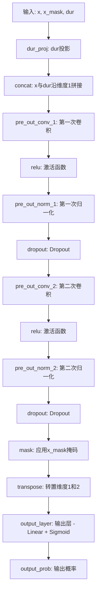
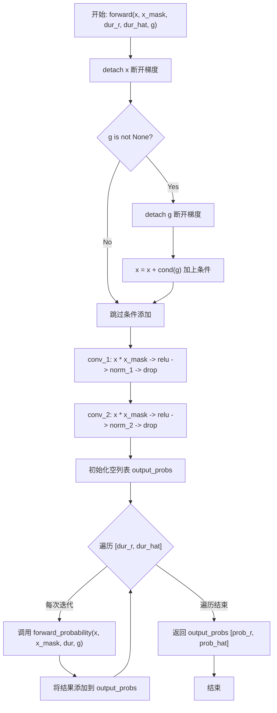
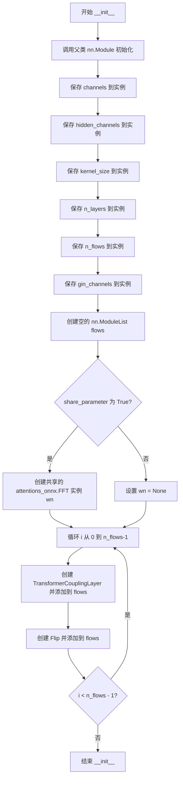
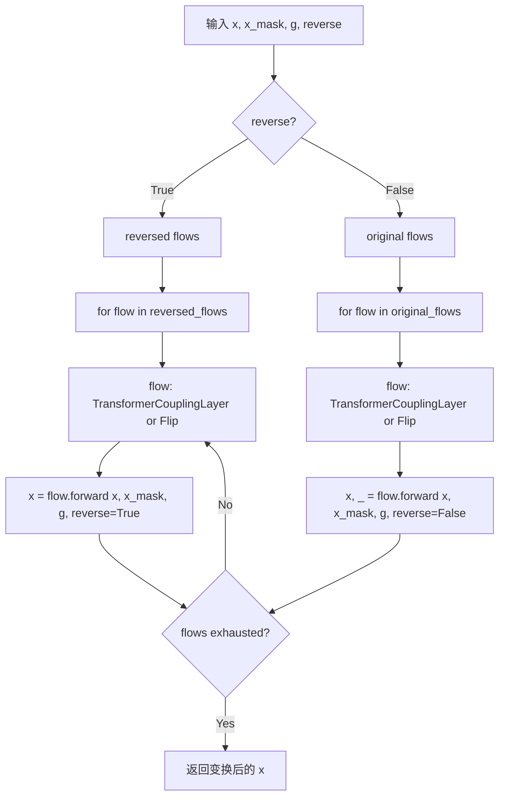
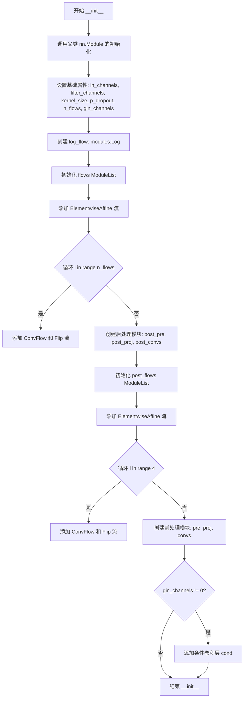
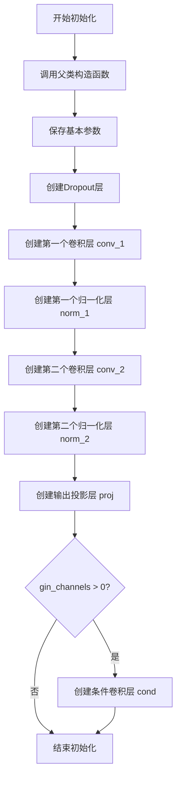
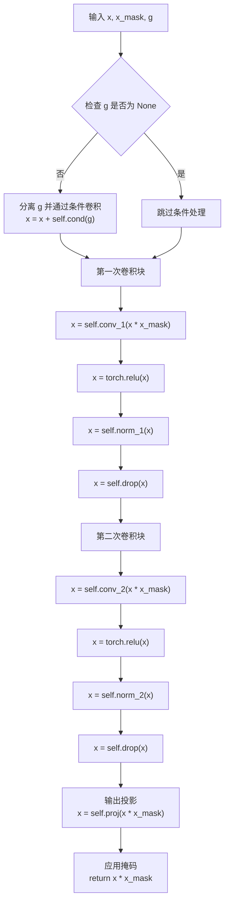
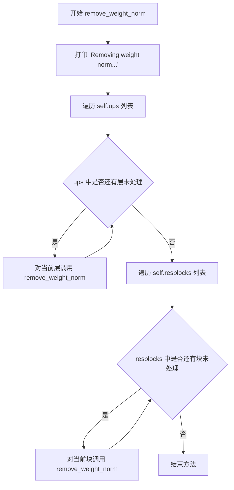

# `Bert-VITS2\onnx_modules\V200\models_onnx.py` 详细设计文档

这是VITS (Variational Inference with adversarial learning for end-to-end Text-to-Speech) 模型的核心代码文件，定义了文本编码器、时长预测器、流模型、后验编码器、神经声码器（生成器与多周期判别器）以及用于训练的完整SynthesizerTrn模型。

## 整体流程

```mermaid
graph TD
    Input[Text/Tone/Lang/BERT] --> Encoder[TextEncoder]
    Encoder --> Duration[Duration Predictors]
    Duration --> Alignment[Alignment Matrix]
    Encoder --> Flow[Flow (Transformer/Residual)]
    Alignment --> Flow
    Flow --> Vocoder[Generator (Vocoder)]
    Vocoder --> Audio[Waveform]
    Audio --> Discriminator[MultiPeriod Discriminator]
```

## 类结构

```
torch.nn.Module
├── DurationDiscriminator
├── TransformerCouplingBlock
├── StochasticDurationPredictor
├── DurationPredictor
├── TextEncoder
├── ResidualCouplingBlock
├── PosteriorEncoder
├── Generator (Vocoder)
├── DiscriminatorP
├── DiscriminatorS
├── MultiPeriodDiscriminator
├── ReferenceEncoder
└── SynthesizerTrn (Main Model)
```

## 全局变量及字段


### `symbols`
    
文本编码的字符符号列表

类型：`list`
    


### `num_tones`
    
音调（声调）数量，用于多音调语言处理

类型：`int`
    


### `num_languages`
    
支持的语言数量，用于多语言模型

类型：`int`
    


### `DurationDiscriminator.in_channels`
    
输入特征的通道数

类型：`int`
    


### `DurationDiscriminator.filter_channels`
    
卷积滤波器的通道数

类型：`int`
    


### `DurationDiscriminator.kernel_size`
    
卷积核的大小

类型：`int`
    


### `DurationDiscriminator.p_dropout`
    
Dropout的概率

类型：`float`
    


### `DurationDiscriminator.gin_channels`
    
说话人嵌入的通道数

类型：`int`
    


### `DurationDiscriminator.conv_1`
    
第一层卷积层

类型：`nn.Conv1d`
    


### `DurationDiscriminator.norm_1`
    
第一层归一化

类型：`modules.LayerNorm`
    


### `DurationDiscriminator.conv_2`
    
第二层卷积层

类型：`nn.Conv1d`
    


### `DurationDiscriminator.norm_2`
    
第二层归一化

类型：`modules.LayerNorm`
    


### `DurationDiscriminator.dur_proj`
    
持续时间投影层

类型：`nn.Conv1d`
    


### `DurationDiscriminator.pre_out_conv_1`
    
预输出卷积层1

类型：`nn.Conv1d`
    


### `DurationDiscriminator.pre_out_norm_1`
    
预输出归一化层1

类型：`modules.LayerNorm`
    


### `DurationDiscriminator.pre_out_conv_2`
    
预输出卷积层2

类型：`nn.Conv1d`
    


### `DurationDiscriminator.pre_out_norm_2`
    
预输出归一化层2

类型：`modules.LayerNorm`
    


### `DurationDiscriminator.cond`
    
条件卷积层，用于注入说话人信息

类型：`nn.Conv1d`
    


### `DurationDiscriminator.output_layer`
    
输出层，输出概率值

类型：`nn.Sequential`
    


### `TransformerCouplingBlock.channels`
    
输入输出的通道数

类型：`int`
    


### `TransformerCouplingBlock.hidden_channels`
    
隐藏层通道数

类型：`int`
    


### `TransformerCouplingBlock.kernel_size`
    
卷积核大小

类型：`int`
    


### `TransformerCouplingBlock.n_layers`
    
Transformer层数

类型：`int`
    


### `TransformerCouplingBlock.n_flows`
    
流的层数

类型：`int`
    


### `TransformerCouplingBlock.gin_channels`
    
说话人嵌入通道数

类型：`int`
    


### `TransformerCouplingBlock.flows`
    
流模块列表，包含耦合层和翻转层

类型：`nn.ModuleList`
    


### `TransformerCouplingBlock.wn`
    
共享参数的FFT块

类型：`attentions_onnx.FFT`
    


### `StochasticDurationPredictor.in_channels`
    
输入通道数

类型：`int`
    


### `StochasticDurationPredictor.filter_channels`
    
滤波器通道数

类型：`int`
    


### `StochasticDurationPredictor.kernel_size`
    
卷积核大小

类型：`int`
    


### `StochasticDurationPredictor.p_dropout`
    
Dropout概率

类型：`float`
    


### `StochasticDurationPredictor.n_flows`
    
标准化流的数量

类型：`int`
    


### `StochasticDurationPredictor.gin_channels`
    
说话人嵌入通道数

类型：`int`
    


### `StochasticDurationPredictor.log_flow`
    
对数流模块

类型：`modules.Log`
    


### `StochasticDurationPredictor.flows`
    
前向流模块列表

类型：`nn.ModuleList`
    


### `StochasticDurationPredictor.post_pre`
    
后处理预卷积层

类型：`nn.Conv1d`
    


### `StochasticDurationPredictor.post_proj`
    
后处理投影层

类型：`nn.Conv1d`
    


### `StochasticDurationPredictor.post_convs`
    
后处理DDS卷积块

类型：`modules.DDSConv`
    


### `StochasticDurationPredictor.post_flows`
    
后处理流模块列表

类型：`nn.ModuleList`
    


### `StochasticDurationPredictor.pre`
    
输入预处理卷积层

类型：`nn.Conv1d`
    


### `StochasticDurationPredictor.proj`
    
投影卷积层

类型：`nn.Conv1d`
    


### `StochasticDurationPredictor.convs`
    
DDS卷积块

类型：`modules.DDSConv`
    


### `StochasticDurationPredictor.cond`
    
条件卷积层

类型：`nn.Conv1d`
    


### `DurationPredictor.in_channels`
    
输入通道数

类型：`int`
    


### `DurationPredictor.filter_channels`
    
滤波器通道数

类型：`int`
    


### `DurationPredictor.kernel_size`
    
卷积核大小

类型：`int`
    


### `DurationPredictor.p_dropout`
    
Dropout概率

类型：`float`
    


### `DurationPredictor.gin_channels`
    
说话人嵌入通道数

类型：`int`
    


### `DurationPredictor.drop`
    
Dropout层

类型：`nn.Dropout`
    


### `DurationPredictor.conv_1`
    
第一层卷积

类型：`nn.Conv1d`
    


### `DurationPredictor.norm_1`
    
第一层归一化

类型：`modules.LayerNorm`
    


### `DurationPredictor.conv_2`
    
第二层卷积

类型：`nn.Conv1d`
    


### `DurationPredictor.norm_2`
    
第二层归一化

类型：`modules.LayerNorm`
    


### `DurationPredictor.proj`
    
输出投影层

类型：`nn.Conv1d`
    


### `DurationPredictor.cond`
    
条件卷积层

类型：`nn.Conv1d`
    


### `TextEncoder.n_vocab`
    
词汇表大小

类型：`int`
    


### `TextEncoder.out_channels`
    
输出通道数

类型：`int`
    


### `TextEncoder.hidden_channels`
    
隐藏层通道数

类型：`int`
    


### `TextEncoder.filter_channels`
    
滤波器通道数

类型：`int`
    


### `TextEncoder.n_heads`
    
注意力头数

类型：`int`
    


### `TextEncoder.n_layers`
    
编码器层数

类型：`int`
    


### `TextEncoder.kernel_size`
    
卷积核大小

类型：`int`
    


### `TextEncoder.p_dropout`
    
Dropout概率

类型：`float`
    


### `TextEncoder.gin_channels`
    
说话人嵌入通道数

类型：`int`
    


### `TextEncoder.emb`
    
文本字符嵌入层

类型：`nn.Embedding`
    


### `TextEncoder.tone_emb`
    
音调嵌入层

类型：`nn.Embedding`
    


### `TextEncoder.language_emb`
    
语言嵌入层

类型：`nn.Embedding`
    


### `TextEncoder.bert_proj`
    
BERT嵌入投影层

类型：`nn.Conv1d`
    


### `TextEncoder.ja_bert_proj`
    
日语BERT嵌入投影层

类型：`nn.Conv1d`
    


### `TextEncoder.en_bert_proj`
    
英语BERT嵌入投影层

类型：`nn.Conv1d`
    


### `TextEncoder.encoder`
    
Transformer编码器

类型：`attentions_onnx.Encoder`
    


### `TextEncoder.proj`
    
输出投影层

类型：`nn.Conv1d`
    


### `ResidualCouplingBlock.channels`
    
通道数

类型：`int`
    


### `ResidualCouplingBlock.hidden_channels`
    
隐藏层通道数

类型：`int`
    


### `ResidualCouplingBlock.kernel_size`
    
卷积核大小

类型：`int`
    


### `ResidualCouplingBlock.dilation_rate`
    
膨胀率

类型：`int`
    


### `ResidualCouplingBlock.n_layers`
    
层数

类型：`int`
    


### `ResidualCouplingBlock.n_flows`
    
流的层数

类型：`int`
    


### `ResidualCouplingBlock.gin_channels`
    
说话人嵌入通道数

类型：`int`
    


### `ResidualCouplingBlock.flows`
    
流模块列表

类型：`nn.ModuleList`
    


### `PosteriorEncoder.in_channels`
    
输入通道数

类型：`int`
    


### `PosteriorEncoder.out_channels`
    
输出通道数

类型：`int`
    


### `PosteriorEncoder.hidden_channels`
    
隐藏层通道数

类型：`int`
    


### `PosteriorEncoder.kernel_size`
    
卷积核大小

类型：`int`
    


### `PosteriorEncoder.dilation_rate`
    
膨胀率

类型：`int`
    


### `PosteriorEncoder.n_layers`
    
层数

类型：`int`
    


### `PosteriorEncoder.gin_channels`
    
说话人嵌入通道数

类型：`int`
    


### `PosteriorEncoder.pre`
    
预处理卷积层

类型：`nn.Conv1d`
    


### `PosteriorEncoder.enc`
    
WaveNet编码器

类型：`modules.WN`
    


### `PosteriorEncoder.proj`
    
输出投影层

类型：`nn.Conv1d`
    


### `Generator.num_kernels`
    
残差块卷积核数量

类型：`int`
    


### `Generator.num_upsamples`
    
上采样层数量

类型：`int`
    


### `Generator.conv_pre`
    
预处理卷积层

类型：`Conv1d`
    


### `Generator.ups`
    
上采样转置卷积层列表

类型：`nn.ModuleList`
    


### `Generator.resblocks`
    
残差块列表

类型：`nn.ModuleList`
    


### `Generator.conv_post`
    
后处理卷积层

类型：`Conv1d`
    


### `Generator.cond`
    
条件卷积层，用于注入说话人嵌入

类型：`nn.Conv1d`
    


### `DiscriminatorP.period`
    
判别器周期

类型：`int`
    


### `DiscriminatorP.use_spectral_norm`
    
是否使用谱归一化

类型：`bool`
    


### `DiscriminatorP.convs`
    
卷积层列表

类型：`nn.ModuleList`
    


### `DiscriminatorP.conv_post`
    
后处理卷积层

类型：`nn.Conv2d`
    


### `DiscriminatorS.use_spectral_norm`
    
是否使用谱归一化

类型：`bool`
    


### `DiscriminatorS.convs`
    
卷积层列表

类型：`nn.ModuleList`
    


### `DiscriminatorS.conv_post`
    
后处理卷积层

类型：`Conv1d`
    


### `MultiPeriodDiscriminator.discriminators`
    
多个周期判别器列表

类型：`nn.ModuleList`
    


### `ReferenceEncoder.spec_channels`
    
频谱通道数

类型：`int`
    


### `ReferenceEncoder.convs`
    
卷积层列表

类型：`nn.ModuleList`
    


### `ReferenceEncoder.gru`
    
GRU循环神经网络

类型：`nn.GRU`
    


### `ReferenceEncoder.proj`
    
输出投影层

类型：`nn.Linear`
    


### `SynthesizerTrn.n_vocab`
    
词汇表大小

类型：`int`
    


### `SynthesizerTrn.spec_channels`
    
频谱通道数

类型：`int`
    


### `SynthesizerTrn.inter_channels`
    
中间通道数

类型：`int`
    


### `SynthesizerTrn.hidden_channels`
    
隐藏层通道数

类型：`int`
    


### `SynthesizerTrn.filter_channels`
    
滤波器通道数

类型：`int`
    


### `SynthesizerTrn.n_heads`
    
注意力头数

类型：`int`
    


### `SynthesizerTrn.n_layers`
    
层数

类型：`int`
    


### `SynthesizerTrn.kernel_size`
    
卷积核大小

类型：`int`
    


### `SynthesizerTrn.p_dropout`
    
Dropout概率

类型：`float`
    


### `SynthesizerTrn.resblock`
    
残差块类型

类型：`str`
    


### `SynthesizerTrn.resblock_kernel_sizes`
    
残差块卷积核大小列表

类型：`list`
    


### `SynthesizerTrn.resblock_dilation_sizes`
    
残差块膨胀大小列表

类型：`list`
    


### `SynthesizerTrn.upsample_rates`
    
上采样率列表

类型：`list`
    


### `SynthesizerTrn.upsample_initial_channel`
    
上采样初始通道数

类型：`int`
    


### `SynthesizerTrn.upsample_kernel_sizes`
    
上采样卷积核大小列表

类型：`list`
    


### `SynthesizerTrn.segment_size`
    
训练分段大小

类型：`int`
    


### `SynthesizerTrn.n_speakers`
    
说话人数量

类型：`int`
    


### `SynthesizerTrn.gin_channels`
    
说话人嵌入通道数

类型：`int`
    


### `SynthesizerTrn.enc_gin_channels`
    
编码器说话人嵌入通道数

类型：`int`
    


### `SynthesizerTrn.enc_p`
    
文本编码器

类型：`TextEncoder`
    


### `SynthesizerTrn.dec`
    
声学模型生成器

类型：`Generator`
    


### `SynthesizerTrn.enc_q`
    
后验编码器

类型：`PosteriorEncoder`
    


### `SynthesizerTrn.flow`
    
归一化流模块

类型：`nn.Module`
    


### `SynthesizerTrn.sdp`
    
随机持续时间预测器

类型：`StochasticDurationPredictor`
    


### `SynthesizerTrn.dp`
    
持续时间预测器

类型：`DurationPredictor`
    


### `SynthesizerTrn.emb_g`
    
说话人嵌入层

类型：`nn.Embedding`
    


### `SynthesizerTrn.ref_enc`
    
参考编码器

类型：`ReferenceEncoder`
    
    

## 全局函数及方法


### `DurationDiscriminator.__init__`

初始化 VITS2 模型中的 `DurationDiscriminator`（时长判别器），用于区分真实的音频时长与预测的音频时长。该方法负责构建网络结构，包括用于提取文本特征的主干卷积层、专门处理时长信息的投影层、融合特征的前馈卷积层，以及可选的说话人条件嵌入层。

参数：

- `in_channels`：`int`，输入特征的通道数。
- `filter_channels`：`int`，卷积层中的滤波器数量（隐藏层维度）。
- `kernel_size`：`int`，卷积核的大小。
- `p_dropout`：`float`，Dropout 的概率，用于防止过拟合。
- `gin_channels`：`int`（可选，默认为 0），说话人嵌入（Global Embedding）的通道数，如果大于 0 则构建条件卷积层。

返回值：`None`，构造函数无返回值。

#### 流程图

```mermaid
graph TD
    A[Start __init__] --> B[调用 super().__init__]
    B --> C[初始化实例属性: in_channels, filter_channels 等]
    C --> D[初始化 self.drop: nn.Dropout]
    D --> E[初始化主干卷积块: conv_1, norm_1, conv_2, norm_2]
    E --> F[初始化时长投影层: dur_proj]
    F --> G[初始化特征融合卷积: pre_out_conv_1, pre_out_conv_2 及归一化层]
    G --> H{判断 gin_channels > 0?}
    H -- 是 --> I[初始化条件卷积层: self.cond]
    H -- 否 --> J[跳过条件层]
    I --> K[初始化输出层: nn.Sequential(Linear, Sigmoid)]
    J --> K
    K --> L[End]
```

#### 带注释源码

```python
def __init__(
    self, in_channels, filter_channels, kernel_size, p_dropout, gin_channels=0
):
    # 调用父类 nn.Module 的初始化方法，注册所有层
    super().__init__()

    # 保存网络配置参数
    self.in_channels = in_channels
    self.filter_channels = filter_channels
    self.kernel_size = kernel_size
    self.p_dropout = p_dropout
    self.gin_channels = gin_channels

    # 初始化 Dropout 层
    self.drop = nn.Dropout(p_dropout)
    
    # 第一个卷积块：处理输入的文本/音频特征
    self.conv_1 = nn.Conv1d(
        in_channels, filter_channels, kernel_size, padding=kernel_size // 2
    )
    self.norm_1 = modules.LayerNorm(filter_channels)
    
    # 第二个卷积块：进一步提取特征
    self.conv_2 = nn.Conv1d(
        filter_channels, filter_channels, kernel_size, padding=kernel_size // 2
    )
    self.norm_2 = modules.LayerNorm(filter_channels)
    
    # 时长投影层 (Duration Projection)
    # 将 1 维的时长标量映射到 filter_channels 维度，以便与主特征融合
    self.dur_proj = nn.Conv1d(1, filter_channels, 1)

    # 预输出卷积块：处理主特征与时长特征的融合
    # 输入是主特征和时长特征的拼接 (2 * filter_channels)
    self.pre_out_conv_1 = nn.Conv1d(
        2 * filter_channels, filter_channels, kernel_size, padding=kernel_size // 2
    )
    self.pre_out_norm_1 = modules.LayerNorm(filter_channels)
    self.pre_out_conv_2 = nn.Conv1d(
        filter_channels, filter_channels, kernel_size, padding=kernel_size // 2
    )
    self.pre_out_norm_2 = modules.LayerNorm(filter_channels)

    # 条件卷积层：如果有说话人信息 (gin_channels > 0)，则添加
    if gin_channels != 0:
        self.cond = nn.Conv1d(gin_channels, in_channels, 1)

    # 输出层：将特征映射到概率 [0, 1]
    self.output_layer = nn.Sequential(nn.Linear(filter_channels, 1), nn.Sigmoid())
```


### `DurationDiscriminator.forward_probability`

该方法接收输入特征、掩码和时长信息，通过卷积层和归一化层处理后，输出预测的概率值，用于判别器判断时长预测的质量。

参数：

- `self`：DurationDiscriminator 实例本身
- `x`：`torch.Tensor`，输入的特征张量，通常是编码器输出
- `x_mask`：`torch.Tensor`，输入特征的掩码，用于标识有效时间步
- `dur`：`torch.Tensor`，时长（duration）张量，待处理的预测或真实时长
- `g`：`torch.Tensor` 或 `None`，可选的说话人/语言条件嵌入

返回值：`torch.Tensor`，输出概率值，形状为 `[batch, time, 1]`，表示判别器对每个时间步的预测概率

#### 流程图



#### 带注释源码

```python
def forward_probability(self, x, x_mask, dur, g=None):
    """
    DurationDiscriminator 的前向传播概率计算方法
    
    参数:
        x: 输入特征张量 [batch, channels, time]
        x_mask: 时间步掩码 [batch, 1, time]
        dur: 时长张量 [batch, 1, time]
        g: 可选的条件嵌入 [batch, gin_channels, 1]
    
    返回:
        output_prob: 预测概率 [batch, time, 1]
    """
    # Step 1: 将时长dur投影到filter_channels维度
    # 通过1x1卷积将单通道的duration映射到filter_channels维度
    dur = self.dur_proj(dur)  # [batch, filter_channels, time]
    
    # Step 2: 沿通道维度拼接输入特征和duration
    # 将原始特征与duration信息融合
    x = torch.cat([x, dur], dim=1)  # [batch, in_channels+filter_channels, time]
    
    # Step 3: 第一次卷积块处理
    # 应用预输出卷积、激活、归一化和dropout
    x = self.pre_out_conv_1(x * x_mask)  # 卷积处理
    x = torch.relu(x)                    # ReLU激活
    x = self.pre_out_norm_1(x)           # LayerNorm归一化
    x = self.drop(x)                     # Dropout正则化
    
    # Step 4: 第二次卷积块处理
    x = self.pre_out_conv_2(x * x_mask)  # 卷积处理
    x = torch.relu(x)                    # ReLU激活
    x = self.pre_out_norm_2(x)           # LayerNorm归一化
    x = self.drop(x)                     # Dropout正则化
    
    # Step 5: 应用掩码并转置
    # 移除无效时间步的影响，并将维度转换为[batch, time, channels]
    x = x * x_mask                        # 应用掩码
    x = x.transpose(1, 2)                # 转置: [batch, time, channels]
    
    # Step 6: 输出层
    # 通过线性层+Sigmoid得到概率输出
    output_prob = self.output_layer(x)   # [batch, time, 1]
    
    return output_prob
```


### `DurationDiscriminator.forward`

该方法是VITS2模型中DurationDiscriminator（时长判别器）的前向传播函数，用于在GAN训练中区分真实的语音时长分布与预测的语音时长分布。通过对真实时长（dur_r）和预测时长（dur_hat）分别进行概率计算，返回两个概率值用于判别器的损失计算，从而指导生成器产生更准确的时长预测。

参数：

- `x`：`torch.Tensor`，输入特征张量，形状为 [batch, in_channels, time]，通常为文本编码器输出的隐藏状态
- `x_mask`：`torch.Tensor`，时间步掩码，形状为 [batch, 1, time]，用于标识有效时间步，值为0的位置表示padding
- `dur_r`：`torch.Tensor`，真实时长，形状为 [batch, 1, time]，表示Ground Truth的语音时长
- `dur_hat`：`torch.Tensor`，预测时长，形状为 [batch, 1, time]，表示模型预测的语音时长
- `g`：`torch.Tensor`（可选），全局条件特征，形状为 [batch, gin_channels, 1]，通常为说话人嵌入或语言嵌入，用于条件判别

返回值：`List[torch.Tensor]`，包含两个概率张量的列表，第一个元素为真实时长的概率（形状 [batch, time, 1]），第二个元素为预测时长的概率（形状 [batch, time, 1]）

#### 流程图



#### 带注释源码

```python
def forward(self, x, x_mask, dur_r, dur_hat, g=None):
    """
    DurationDiscriminator的前向传播函数
    用于判别真实时长和预测时长的概率分布
    
    参数:
        x: 输入特征 [batch, in_channels, time]
        x_mask: 时间掩码 [batch, 1, time]
        dur_r: 真实时长 [batch, 1, time]
        dur_hat: 预测时长 [batch, 1, time]
        g: 全局条件特征（可选）[batch, gin_channels, 1]
    
    返回:
        output_probs: [真实时长概率, 预测时长概率]
    """
    
    # 步骤1: 断开x的梯度，防止梯度回传到encoder
    x = torch.detach(x)
    
    # 步骤2: 处理全局条件特征（说话人/语言嵌入）
    if g is not None:
        # 断开g的梯度
        g = torch.detach(g)
        # 将条件信息通过线性变换加到输入特征上
        x = x + self.cond(g)
    
    # 步骤3: 第一个卷积块
    # 输入: [batch, in_channels, time] * [batch, 1, time] -> [batch, filter_channels, time]
    x = self.conv_1(x * x_mask)
    x = torch.relu(x)           # ReLU激活
    x = self.norm_1(x)          # LayerNorm
    x = self.drop(x)            # Dropout
    
    # 步骤4: 第二个卷积块
    x = self.conv_2(x * x_mask)
    x = torch.relu(x)
    x = self.norm_2(x)
    x = self.drop(x)
    
    # 步骤5: 分别对真实时长和预测时长计算概率
    output_probs = []
    for dur in [dur_r, dur_hat]:
        # 调用内部方法forward_probability计算每个时长的概率
        # dur: 时长信息 [batch, 1, time]
        output_prob = self.forward_probability(x, x_mask, dur, g)
        output_probs.append(output_prob)
    
    # 返回[真实时长概率, 预测时长概率]
    return output_probs
```


### `TransformerCouplingBlock.__init__`

该方法是 `TransformerCouplingBlock` 类的构造函数，用于初始化基于 Transformer 的流式耦合块（Flow-based Coupling Block），主要用于 VITS2 模型中的标准化流（Normalizing Flow）部分，支持参数共享和条件输入。

参数：

- `channels`：`int`，输入输出通道数
- `hidden_channels`：`int`，隐藏层通道数
- `filter_channels`：`int`，滤波器通道数，用于注意力机制
- `n_heads`：`int`，多头注意力机制的头数
- `n_layers`：`int`，Transformer 层数
- `kernel_size`：`int`，卷积核大小
- `p_dropout`：`float`，Dropout 概率
- `n_flows`：`int`（默认值=4），流层数量
- `gin_channels`：`int`（默认值=0），说话人条件嵌入通道数
- `share_parameter`：`bool`（默认值=False），是否在流层间共享 WaveNet 参数

返回值：`None`，无返回值（构造函数）

#### 流程图



#### 带注释源码

```python
def __init__(
    self,
    channels,              # int: 输入输出通道数
    hidden_channels,      # int: 隐藏层通道数
    filter_channels,      # int: 滤波器通道数，用于注意力机制
    n_heads,               # int: 多头注意力的头数
    n_layers,              # int: Transformer 层数
    kernel_size,           # int: 卷积核大小
    p_dropout,             # float: Dropout 概率
    n_flows=4,             # int: 流层数量，默认为4
    gin_channels=0,       # int: 说话人条件嵌入通道数，默认为0表示无条件
    share_parameter=False, # bool: 是否共享 WaveNet 参数，默认为 False
):
    super().__init__()  # 调用父类 nn.Module 的初始化方法
    
    # 保存配置参数到实例属性
    self.channels = channels
    self.hidden_channels = hidden_channels
    self.kernel_size = kernel_size
    self.n_layers = n_layers
    self.n_flows = n_flows
    self.gin_channels = gin_channels

    # 创建 ModuleList 用于存储流层
    self.flows = nn.ModuleList()

    # 如果启用参数共享，则创建一个共享的 FFT (Fast Fourier Transform) 注意力模块
    # 否则设置为 None，后续在每个 TransformerCouplingLayer 中独立创建
    self.wn = (
        attentions_onnx.FFT(
            hidden_channels,
            filter_channels,
            n_heads,
            n_layers,
            kernel_size,
            p_dropout,
            isflow=True,  # 标记为流模式
            gin_channels=self.gin_channels,
        )
        if share_parameter
        else None
    )

    # 循环创建 n_flows 个耦合层，每层后面跟一个 Flip 层
    for i in range(n_flows):
        # 添加 Transformer 耦合层
        self.flows.append(
            modules.TransformerCouplingLayer(
                channels,
                hidden_channels,
                kernel_size,
                n_layers,
                n_heads,
                p_dropout,
                filter_channels,
                mean_only=True,  # 仅预测均值
                wn_sharing_parameter=self.wn,  # 传入共享的 WN 参数
                gin_channels=self.gin_channels,
            )
        )
        # 添加翻转层，用于交替执行仿射耦合
        self.flows.append(modules.Flip())
```


### `TransformerCouplingBlock.forward`

该方法是 VITS2 文本转语音模型中基于 Transformer 的 normalizing flow 实现，通过交替应用 `TransformerCouplingLayer`（仿射耦合层）和 `Flip`（维度翻转）在潜在空间中执行可逆变换，支持前向（训练/推理）和反向（采样）两种运行模式，用于建模文本特征的复杂分布。

参数：

- `x`：`torch.Tensor`，输入张量，形状为 `[B, channels, T]`，表示批量大小、通道数和时间步长
- `x_mask`：`torch.Tensor`，时间步掩码，形状为 `[1, 1, T]`，用于屏蔽填充区域
- `g`：`torch.Tensor` 或 `None`，说话人条件向量，形状为 `[B, gin_channels, 1]`，可选用于说话人相关的流变换
- `reverse`：`bool`，流向标志，`False` 表示前向流动（训练模式），`True` 表示反向流动（采样/推理模式）

返回值：`torch.Tensor`，变换后的张量，形状为 `[B, channels, T]`

#### 流程图



#### 带注释源码

```python
def forward(self, x, x_mask, g=None, reverse=True):
    """
    Transformer Coupling Block 的前向/反向传播方法
    
    参数:
        x: 输入张量 [B, channels, T]
        x_mask: 时间步掩码 [1, 1, T]，用于屏蔽填充区域
        g: 说话人条件向量 [B, gin_channels, 1]，可选
        reverse: 流向标志，True 表示反向流动（采样），False 表示前向流动（训练）
    
    返回:
        x: 变换后的张量 [B, channels, T]
    """
    # 非反向模式：按原始顺序遍历所有流（训练阶段）
    # 此时每个 TransformerCouplingLayer 会输出变换后的 x 和 logdet（被丢弃）
    if not reverse:
        for flow in self.flows:
            x, _ = flow(x, x_mask, g=g, reverse=reverse)
    else:
        # 反向模式：按逆序遍历所有流（推理/采样阶段）
        # 仅返回变换后的 x，不返回 logdet
        for flow in reversed(self.flows):
            x = flow(x, x_mask, g=g, reverse=reverse)
    return x
```


### `StochasticDurationPredictor.__init__`

这是 `StochasticDurationPredictor` 类的初始化方法，用于构建基于流模型（Flow-based）的随机持续时间预测器。该预测器使用归一化流（Normalizing Flows）来建模音频帧的持续时间分布，是 VITS2 语音合成模型的关键组件之一。

参数：

- `in_channels`：`int`，输入特征的通道数
- `filter_channels`：`int`，滤波器通道数（内部会被设置为等于 `in_channels`）
- `kernel_size`：`int`，卷积核大小
- `p_dropout`：`float`，Dropout 概率
- `n_flows`：`int`，流模型的数量（默认为 4）
- `gin_channels`：`int`，说话人嵌入的通道数（默认为 0，表示不使用说话人条件）

返回值：`None`，`__init__` 方法不返回值，仅初始化对象属性

#### 流程图



#### 带注释源码

```python
def __init__(
    self,
    in_channels,
    filter_channels,
    kernel_size,
    p_dropout,
    n_flows=4,
    gin_channels=0,
):
    """
    初始化 StochasticDurationPredictor 模型
    
    参数:
        in_channels: 输入特征的通道数
        filter_channels: 内部滤波器的通道数
        kernel_size: 卷积核大小
        p_dropout: Dropout 概率
        n_flows: 流模型的数量
        gin_channels: 说话人条件的通道数
    """
    super().__init__()  # 调用 nn.Module 的初始化
    
    # 基础属性赋值
    filter_channels = in_channels  # 强制设置为 in_channels（注释说明未来版本需要移除此逻辑）
    self.in_channels = in_channels
    self.filter_channels = filter_channels
    self.kernel_size = kernel_size
    self.p_dropout = p_dropout
    self.n_flows = n_flows
    self.gin_channels = gin_channels

    # === 主流模型（Main Flows）===
    self.log_flow = modules.Log()  # 对数流，用于概率计算
    
    self.flows = nn.ModuleList()  # 存储流模块的列表
    self.flows.append(modules.ElementwiseAffine(2))  # 添加元素级仿射变换流
    
    # 循环添加 n_flows 个 ConvFlow 和 Flip 流
    for i in range(n_flows):
        self.flows.append(
            modules.ConvFlow(2, filter_channels, kernel_size, n_layers=3)
        )  # 卷积流，使用因果卷积
        self.flows.append(modules.Flip())  # 通道翻转操作

    # === 后处理流（Post-processing Flows）===
    # 用于处理持续时间的细粒度建模
    self.post_pre = nn.Conv1d(1, filter_channels, 1)   # 将持续时间嵌入到特征空间
    self.post_proj = nn.Conv1d(filter_channels, filter_channels, 1)  # 特征投影
    self.post_convs = modules.DDSConv(
        filter_channels, kernel_size, n_layers=3, p_dropout=p_dropout
    )  # DDSConv（Dilated Dilation Convolution），带膨胀的深度可分离卷积

    self.post_flows = nn.ModuleList()  # 后处理流模块列表
    self.post_flows.append(modules.ElementwiseAffine(2))  # 元素级仿射变换
    
    # 循环添加 4 个后处理流
    for i in range(4):
        self.post_flows.append(
            modules.ConvFlow(2, filter_channels, kernel_size, n_layers=3)
        )
        self.post_flows.append(modules.Flip())

    # === 前处理模块（Pre-processing）===
    # 将输入特征投影到内部特征空间
    self.pre = nn.Conv1d(in_channels, filter_channels, 1)   # 输入投影
    self.proj = nn.Conv1d(filter_channels, filter_channels, 1)  # 特征投影
    self.convs = modules.DDSConv(
        filter_channels, kernel_size, n_layers=3, p_dropout=p_dropout
    )  # 因果卷积堆叠

    # === 条件输入处理 ===
    # 如果提供了说话人嵌入，创建条件卷积层
    if gin_channels != 0:
        self.cond = nn.Conv1d(gin_channels, filter_channels, 1)  # 说话人条件投影
```


### `StochasticDurationPredictor.forward`

实现随机时长预测器的前向传播。该方法利用归一化流（Normalizing Flow）模型，基于输入的文本特征（`x`）和可选的说话人条件（`g`），对输入的噪声向量（`z`）进行变换，最终预测出每个音素的对数时长（log duration）。

参数：

-  `x`：`torch.Tensor`，输入的特征张量，通常来源于文本编码器的输出。
-  `x_mask`：`torch.Tensor`，二进制掩码，用于遮盖填充区域，确保卷积操作仅在有效序列长度上进行。
-  `z`：`torch.Tensor`，输入的噪声张量（潜在变量），作为流的输入，在前向传播（reverse=True）过程中被变换为目标分布。
-  `g`：`torch.Tensor`（可选，默认为 None），说话人嵌入向量，用于条件控制，使模型能够生成不同说话人的时长风格。

返回值：`torch.Tensor`，返回预测的对数时长 `logw`。

#### 流程图

```mermaid
graph TD
    A[输入: x, x_mask, z, g] --> B[梯度分离: torch.detach(x)]
    B --> C[预投影: self.pre(x)]
    C --> D{判断 g 是否存在}
    D -->|是| E[梯度分离 g 并相加: x + self.cond(g)]
    D -->|否| F[跳过条件嵌入]
    E --> G[卷积模块: self.convs(x, x_mask)]
    F --> G
    G --> H[投影与掩码: self.proj(x) * x_mask]
    H --> I[反转流列表并遍历]
    I --> J[流操作: z = flow(z, x_mask, g=x, reverse=True)]
    J --> K[分割结果: torch.split(z, ...)]
    K --> L[提取 logw = z0]
    L --> M[返回 logw]
```

#### 带注释源码

```python
def forward(self, x, x_mask, z, g=None):
    # 1. 梯度分离：停止从 x 反向传播到之前的编码器，确保时长预测器独立训练
    x = torch.detach(x)
    
    # 2. 初始投影：将输入特征维度映射到滤波器维度
    x = self.pre(x)
    
    # 3. 条件嵌入：如果提供了说话人嵌入 g，则将其添加到特征中
    if g is not None:
        g = torch.detach(g) # 同样分离 g 的梯度
        x = x + self.cond(g) # 通过卷积层融合条件信息
    
    # 4. 空洞深度可分离卷积：利用 DDSConv 进行细粒度的时间特征提取
    x = self.convs(x, x_mask)
    
    # 5. 最终投影与掩码：生成用于控制流的上下文向量，并应用掩码去除填充影响
    x = self.proj(x) * x_mask

    # 6. 流模型处理：
    # 获取流模块列表并反转，VITS 中通常使用反转的流来执行还原操作（reverse=True）
    flows = list(reversed(self.flows))
    # 移除一个无用的流层（代码中的硬编码处理）
    flows = flows[:-2] + [flows[-1]]  # remove a useless vflow
    
    # 遍历所有流模块，利用上下文 x 作为条件，对噪声 z 进行变换
    for flow in flows:
        z = flow(z, x_mask, g=x, reverse=True)
        
    # 7. 分割输出：流输出 z 包含两部分，一部分用于时长预测
    z0, z1 = torch.split(z, [1, 1], 1)
    
    # 8. 提取时长：z0 被视为预测的对数时长 logw
    logw = z0
    return logw
```


### `DurationPredictor.__init__`

这是 `DurationPredictor` 类的构造函数，用于初始化持续时间预测器的网络结构和参数。

参数：

- `in_channels`：`int`，输入特征的通道数
- `filter_channels`：`int`，卷积层中的滤波器通道数
- `kernel_size`：`int`，卷积核大小
- `p_dropout`：`float`，dropout 概率
- `gin_channels`：`int`，说话人嵌入的通道数，默认为 0

返回值：无（构造函数）

#### 流程图



#### 带注释源码

```python
def __init__(
    self, in_channels, filter_channels, kernel_size, p_dropout, gin_channels=0
):
    """
    初始化DurationPredictor持续时间预测器
    
    参数:
        in_channels: int - 输入特征的通道数
        filter_channels: int - 卷积层滤波器通道数
        kernel_size: int - 卷积核大小
        p_dropout: float - dropout概率
        gin_channels: int - 说话人条件输入的通道数,默认为0
    """
    # 调用父类nn.Module的初始化方法
    super().__init__()

    # 保存网络的基本配置参数
    self.in_channels = in_channels          # 输入通道数
    self.filter_channels = filter_channels  # 滤波器通道数
    self.kernel_size = kernel_size          # 卷积核大小
    self.p_dropout = p_dropout              # dropout概率
    self.gin_channels = gin_channels        # 说话人条件通道数

    # 创建Dropout层,用于正则化
    self.drop = nn.Dropout(p_dropout)
    
    # 第一个卷积层: in_channels -> filter_channels
    # 使用padding保持序列长度不变
    self.conv_1 = nn.Conv1d(
        in_channels, filter_channels, kernel_size, padding=kernel_size // 2
    )
    # 第一个LayerNorm层,用于归一化
    self.norm_1 = modules.LayerNorm(filter_channels)
    
    # 第二个卷积层: filter_channels -> filter_channels
    self.conv_2 = nn.Conv1d(
        filter_channels, filter_channels, kernel_size, padding=kernel_size // 2
    )
    # 第二个LayerNorm层
    self.norm_2 = modules.LayerNorm(filter_channels)
    
    # 输出投影层: filter_channels -> 1,用于预测持续时间
    self.proj = nn.Conv1d(filter_channels, 1, 1)

    # 如果提供了说话人条件信息,创建条件卷积层
    # 将说话人嵌入投影到与输入相同的维度
    if gin_channels != 0:
        self.cond = nn.Conv1d(gin_channels, in_channels, 1)
```


### `DurationPredictor.forward`

该方法实现了一个用于预测语音持续时间的卷积神经网络模块，包含两层卷积层、LayerNorm和Dropout，通过卷积操作从输入的文本/语言特征中提取时间维度的信息，并输出每个时间步的持续时间对数（log duration）。

参数：

-  `x`：`torch.Tensor`，输入张量，形状为 [batch, in_channels, time]，通常是从TextEncoder提取的隐藏状态特征
-  `x_mask`：`torch.Tensor`，时间步掩码，形状为 [batch, 1, time]，用于遮盖填充区域，防止无效位置参与计算
-  `g`：`torch.Tensor` 或 `None`，说话人/语言条件嵌入，形状为 [batch, gin_channels, 1]，可选输入用于条件化预测

返回值：`torch.Tensor`，形状为 [batch, 1, time]，每个时间步的持续时间预测值（已乘掩码）

#### 流程图



#### 带注释源码

```python
def forward(self, x, x_mask, g=None):
    """
    Duration Predictor 的前向传播方法
    
    参数:
        x: 输入特征张量 [batch, in_channels, time]
        x_mask: 时间步掩码 [batch, 1, time]
        g: 说话人条件嵌入 [batch, gin_channels, 1]，可选
    
    返回:
        预测的持续时间 log 值 [batch, 1, time]
    """
    # 分离输入以防止梯度回传到这里
    x = torch.detach(x)
    
    # 如果提供了说话人条件，则应用条件嵌入
    if g is not None:
        # 分离条件以防止梯度回传
        g = torch.detach(g)
        # 通过条件卷积将说话人信息添加到输入
        x = x + self.cond(g)
    
    # ===== 第一个卷积块 =====
    # 卷积 + ReLU + LayerNorm + Dropout
    x = self.conv_1(x * x_mask)  # [batch, filter_channels, time]
    x = torch.relu(x)
    x = self.norm_1(x)
    x = self.drop(x)
    
    # ===== 第二个卷积块 =====
    # 卷积 + ReLU + LayerNorm + Dropout
    x = self.conv_2(x * x_mask)  # [batch, filter_channels, time]
    x = torch.relu(x)
    x = self.norm_2(x)
    x = self.drop(x)
    
    # ===== 输出投影 =====
    # 将特征维度投影到1维（持续时间）
    x = self.proj(x * x_mask)  # [batch, 1, time]
    
    # 应用时间掩码，确保填充位置为0
    return x * x_mask
```


### TextEncoder.__init__

描述：TextEncoder类的初始化方法，用于构建文本编码器模块，包含了词嵌入、音调嵌入、语言嵌入、BERT特征投影、多头注意力编码器以及输出投影层等核心组件。

参数：

- `self`：隐式参数，PyTorch模块自身引用
- `n_vocab`：`int`，词汇表大小（vocabulary size），决定词嵌入表的总词数
- `out_channels`：`int`，输出通道数，用于控制最终输出的特征维度
- `hidden_channels`：`int`，隐藏层通道数，决定嵌入向量和中间层特征的维度
- `filter_channels`：`int`，过滤器通道数，用于注意力机制中的滤波器维度
- `n_heads`：`int`，多头注意力的头数，决定并行注意力的数量
- `n_layers`：`int`，编码器层数，决定Transformer编码器的深度
- `kernel_size`：`int`，卷积核大小，用于编码器中的卷积操作
- `p_dropout`：`float`，Dropout概率，用于正则化防止过拟合
- `gin_channels`：`int`，全局输入通道数（可选，默认为0），用于说话人条件嵌入

返回值：`None`，该方法为构造函数，不返回任何值，仅初始化对象属性和子模块

#### 流程图

```mermaid
flowchart TD
    A[TextEncoder.__init__开始] --> B[调用super().__init__初始化nn.Module]
    B --> C[保存配置参数<br/>n_vocab, out_channels, hidden_channels等]
    C --> D[创建词嵌入层self.emb<br/>nn.Embeddinglen(symbols, hidden_channels]
    D --> E[创建音调嵌入层self.tone_emb<br/>nn.Embeddingnum_tones, hidden_channels]
    E --> F[创建语言嵌入层self.language_emb<br/>nn.Embeddingnum_languages, hidden_channels]
    F --> G[创建BERT投影层self.bert_proj<br/>nn.Conv1d1024, hidden_channels, 1]
    G --> H[创建日语BERT投影层self.ja_bert_proj<br/>nn.Conv1d1024, hidden_channels, 1]
    H --> I[创建英语BERT投影层self.en_bert_proj<br/>nn.Conv1d1024, hidden_channels, 1]
    I --> J[创建Transformer编码器self.encoder<br/>attentions_onnx.Encoder]
    J --> K[创建输出投影层self.proj<br/>nn.Conv1dhidden_channels, out_channels*2, 1]
    K --> L[TextEncoder.__init__结束]
```

#### 带注释源码

```python
def __init__(
    self,
    n_vocab,            # int: 词汇表大小
    out_channels,       # int: 输出通道数
    hidden_channels,   # int: 隐藏层通道数
    filter_channels,   # int: 过滤器通道数
    n_heads,            # int: 多头注意力头数
    n_layers,           # int: 编码器层数
    kernel_size,        # int: 卷积核大小
    p_dropout,          # float: Dropout概率
    gin_channels=0,     # int: 全局输入通道数，可选参数
):
    # 调用父类nn.Module的初始化方法
    super().__init__()
    
    # 保存配置参数到实例属性
    self.n_vocab = n_vocab
    self.out_channels = out_channels
    self.hidden_channels = hidden_channels
    self.filter_channels = filter_channels
    self.n_heads = n_heads
    self.n_layers = n_layers
    self.kernel_size = kernel_size
    self.p_dropout = p_dropout
    self.gin_channels = gin_channels
    
    # 创建词嵌入层：将词汇索引映射到hidden_channels维度的向量空间
    # 使用symbols模块中定义的符号表
    self.emb = nn.Embedding(len(symbols), hidden_channels)
    # 使用正态分布初始化词嵌入权重，均值为0，标准差为hidden_channels^-0.5
    nn.init.normal_(self.emb.weight, 0.0, hidden_channels**-0.5)
    
    # 创建音调嵌入层：用于编码文本的音调信息（如声调语言的四声）
    self.tone_emb = nn.Embedding(num_tones, hidden_channels)
    nn.init.normal_(self.tone_emb.weight, 0.0, hidden_channels**-0.5)
    
    # 创建语言嵌入层：用于编码语言种类信息（如中文、英文、日文等）
    self.language_emb = nn.Embedding(num_languages, hidden_channels)
    nn.init.normal_(self.language_emb.weight, 0.0, hidden_channels**-0.5)
    
    # 创建BERT特征投影层：将预训练的BERT（1024维）特征投影到hidden_channels维度
    self.bert_proj = nn.Conv1d(1024, hidden_channels, 1)
    # 日语BERT特征投影层
    self.ja_bert_proj = nn.Conv1d(1024, hidden_channels, 1)
    # 英语BERT特征投影层
    self.en_bert_proj = nn.Conv1d(1024, hidden_channels, 1)
    
    # 创建Transformer编码器：使用注意力机制进行序列编码
    # 支持说话人条件嵌入（gin_channels > 0时）
    self.encoder = attentions_onnx.Encoder(
        hidden_channels,    # 输入维度
        filter_channels,    # 过滤器维度
        n_heads,            # 注意力头数
        n_layers,           # 编码器层数
        kernel_size,        # 卷积核大小
        p_dropout,          # Dropout概率
        gin_channels=self.gin_channels,  # 条件嵌入维度
    )
    
    # 创建输出投影层：将编码器输出投影到目标维度
    # 输出维度是out_channels * 2，用于分别预测均值m和对数标准差logs
    self.proj = nn.Conv1d(hidden_channels, out_channels * 2, 1)
```


### TextEncoder.forward

该方法是VITS语音合成模型中文本编码器的核心前向传播过程，负责将输入的文本序列（字符、韵律、语种）以及多语言BERT embeddings转换为隐层表示，并输出用于后续时长预测和声学特征生成的统计量（均值和日志标准差）。

参数：

- `x`：`torch.LongTensor`，输入的文本字符索引序列，形状为 [batch, time]
- `x_lengths`：`torch.LongTensor`，输入序列的实际长度（可选，当前实现中未使用）
- `tone`：`torch.LongTensor`，输入的音调/韵律索引序列，形状为 [batch, time]
- `language`：`torch.LongTensor`，输入的语言索引序列，形状为 [batch, time]
- `bert`：`torch.Tensor`，英语BERT embeddings，形状为 [time, 1024]
- `ja_bert`：`torch.Tensor`，日语BERT embeddings，形状为 [time, 1024]
- `en_bert`：`torch.Tensor`，另一个英语BERT embeddings，形状为 [time, 1024]
- `g`：`torch.Tensor`（可选），说话人嵌入向量，形状为 [batch, gin_channels, 1]

返回值：`Tuple[torch.Tensor, torch.Tensor, torch.Tensor, torch.Tensor]`，返回元组包含：

- 编码器输出 `x`：[batch, hidden_channels, time]
- 均值 `m`：[batch, out_channels, time]
- 日志标准差 `logs`：[batch, out_channels, time]
- 掩码 `x_mask`：[1, batch, time]

#### 流程图

```mermaid
flowchart TD
    A[输入: x, tone, language, bert, ja_bert, en_bert] --> B[创建x_mask掩码]
    B --> C[bert_proj投影英语BERT]
    C --> D[ja_bert_proj投影日语BERT]
    D --> E[en_bert_proj投影英语BERT2]
    E --> F[字符嵌入 + 音调嵌入 + 语言嵌入 + 三种BERT嵌入]
    F --> G[乘以sqrt hidden_channels缩放]
    G --> H[转置: [b,t,h] -> [b,h,t]]
    H --> I[调用Encoder模块]
    I --> J[投影到out_channels*2维度]
    J --> K[应用x_mask掩码]
    K --> L[分割stats为m和logs]
    L --> M[返回: x, m, logs, x_mask]
```

#### 带注释源码

```python
def forward(self, x, x_lengths, tone, language, bert, ja_bert, en_bert, g=None):
    """
    TextEncoder的前向传播
    
    参数:
        x: 输入文本索引 [batch, time]
        x_lengths: 序列长度（当前未使用）
        tone: 音调索引 [batch, time]
        language: 语言索引 [batch, time]
        bert: 英语BERT [time, 1024]
        ja_bert: 日语BERT [time, 1024]
        en_bert: 英语BERT2 [time, 1024]
        g: 说话人嵌入（可选）[batch, gin_channels, 1]
    
    返回:
        x: 编码器输出
        m: 均值
        logs: 日志标准差
        x_mask: 掩码
    """
    # 创建与输入形状相同的掩码，形状 [1, batch, time]
    x_mask = torch.ones_like(x).unsqueeze(0)
    
    # 对BERT embeddings进行投影降维 [time, 1024] -> [time, hidden_channels]
    bert_emb = self.bert_proj(bert.transpose(0, 1).unsqueeze(0)).transpose(1, 2)
    ja_bert_emb = self.ja_bert_proj(ja_bert.transpose(0, 1).unsqueeze(0)).transpose(1, 2)
    en_bert_emb = self.en_bert_proj(en_bert.transpose(0, 1).unsqueeze(0)).transpose(1, 2)
    
    # 嵌入层: 字符 + 音调 + 语言 + 三种BERT embeddings
    # 形状: [batch, time, hidden_channels]
    x = (
        self.emb(x)          # 字符嵌入
        + self.tone_emb(tone)       # 音调嵌入
        + self.language_emb(language)  # 语言嵌入
        + bert_emb           # 英语BERT
        + ja_bert_emb        # 日语BERT
        + en_bert_emb        # 英语BERT2
    ) * math.sqrt(self.hidden_channels)  # 缩放因子
    
    # 转置: [batch, time, hidden_channels] -> [batch, hidden_channels, time]
    x = torch.transpose(x, 1, -1)
    
    # 确保掩码数据类型与x一致
    x_mask = x_mask.to(x.dtype)
    
    # 通过Transformer编码器
    # 输入: [batch, hidden_channels, time]
    x = self.encoder(x * x_mask, x_mask, g=g)
    
    # 投影到输出通道的两倍维度（用于分离均值和方差）
    # 输出: [batch, out_channels*2, time]
    stats = self.proj(x) * x_mask
    
    # 沿通道维度分离为均值和日志标准差
    # m: [batch, out_channels, time]
    # logs: [batch, out_channels, time]
    m, logs = torch.split(stats, self.out_channels, dim=1)
    
    return x, m, logs, x_mask
```


### `ResidualCouplingBlock.__init__`

这是 `ResidualCouplingBlock` 类的初始化方法，用于构建一个基于残差耦合流的神经网络模块。该模块通过堆叠多个残差耦合层（ResidualCouplingLayer）和翻转层（Flip）来实现可逆的Flow-based生成模型，常用于VITS等语音合成模型中的先验分布建模。

参数：

- `self`：实例本身（隐式参数）
- `channels`：`int`，输入输出的通道数
- `hidden_channels`：`int`，隐藏层通道数
- `kernel_size`：`int`，卷积核大小
- `dilation_rate`：`int`，卷积膨胀率
- `n_layers`：`int`，残差耦合层的层数
- `n_flows`：`int`（默认值=4），Flow的数量
- `gin_channels`：`int`（默认值=0），说话人嵌入的通道数（条件信息）

返回值：无（`None`），构造函数仅初始化对象状态

#### 流程图

```mermaid
flowchart TD
    A[开始 __init__] --> B[调用 super().__init__]
    B --> C[保存 channels 到实例]
    C --> D[保存 hidden_channels 到实例]
    D --> E[保存 kernel_size 到实例]
    E --> F[保存 dilation_rate 到实例]
    F --> G[保存 n_layers 到实例]
    G --> H[保存 n_flows 到实例]
    H --> I[保存 gin_channels 到实例]
    I --> J[初始化 self.flows = nn.ModuleList]
    J --> K{遍历 i in range n_flows}
    K -->|是| L[创建 ResidualCouplingLayer]
    L --> M[添加到 self.flows]
    M --> N[创建 Flip 模块]
    N --> O[添加到 self.flows]
    O --> K
    K -->|否| P[结束 __init__]
```

#### 带注释源码

```python
class ResidualCouplingBlock(nn.Module):
    def __init__(
        self,
        channels,          # int: 输入输出通道数
        hidden_channels,   # int: 隐藏层通道数
        kernel_size,       # int: 卷积核大小
        dilation_rate,     # int: 膨胀率
        n_layers,          # int: 层数
        n_flows=4,         # int: Flow的数量，默认4
        gin_channels=0,    # int: 说话人条件通道，默认0表示无条件
    ):
        # 调用父类nn.Module的初始化方法
        super().__init__()
        
        # 保存通道相关配置
        self.channels = channels
        self.hidden_channels = hidden_channels
        self.kernel_size = kernel_size
        self.dilation_rate = dilation_rate
        self.n_layers = n_layers
        self.n_flows = n_flows
        self.gin_channels = gin_channels

        # 初始化Flow模块列表
        self.flows = nn.ModuleList()
        
        # 循环创建n_flows个残差耦合层和翻转层
        for i in range(n_flows):
            # 创建残差耦合层 - 用于学习可逆变换
            self.flows.append(
                modules.ResidualCouplingLayer(
                    channels,          # 输入输出通道
                    hidden_channels,   # 隐藏通道
                    kernel_size,       # 卷积核大小
                    dilation_rate,     # 膨胀率
                    n_layers,          # 内部层数
                    gin_channels=gin_channels,  # 条件信息
                    mean_only=True,    # 只预测均值（用于解码器）
                )
            )
            # 添加翻转层 - 用于保证可逆性
            self.flows.append(modules.Flip())
```


### `ResidualCouplingBlock.forward`

该方法是残差耦合块的前向传播函数，负责在归一化流模型中执行正向或逆向变换。当 `reverse=False` 时，按照流层的顺序依次执行变换；当 `reverse=True` 时，按逆序执行变换以实现从潜在空间到数据空间的映射。

参数：

- `x`：`torch.Tensor`，输入张量，形状为 `[batch, channels, time]`，表示需要进行变换的特征
- `x_mask`：`torch.Tensor`，时间维度上的掩码，用于掩盖填充区域，形状为 `[batch, 1, time]`
- `g`：`torch.Tensor` 或 `None`，说话人条件向量，用于条件生成，形状为 `[batch, gin_channels, 1]`，默认为 `None`
- `reverse`：`bool`，布尔标志，指定变换方向。`False` 表示正向流变换（训练时），`True` 表示逆向流变换（推理时），默认为 `True`

返回值：`torch.Tensor`，变换后的张量，形状为 `[batch, channels, time]`

#### 流程图

```mermaid
flowchart TD
    A[开始 forward] --> B{reverse 参数?}
    B -->|False| C[按正序遍历 self.flows]
    B -->|True| D[按逆序遍历 self.flows]
    
    C --> E[调用 flow(x, x_mask, g=g, reverse=False)]
    E --> F{流索引 < flows长度?}
    F -->|Yes| E
    F -->|No| G[返回变换后的 x]
    
    D --> H[调用 flow(x, x_mask, g=g, reverse=True)]
    H --> I{流索引 < flows长度?}
    I -->|Yes| H
    I -->|No| G
    
    G --> J[结束]
```

#### 带注释源码

```python
def forward(self, x, x_mask, g=None, reverse=True):
    """
    残差耦合块的前向/逆向传播方法
    
    参数:
        x: 输入张量 [batch, channels, time]
        x_mask: 时间掩码 [batch, 1, time]
        g: 条件向量 [batch, gin_channels, 1] 或 None
        reverse: 变换方向标志，False为正向，True为逆向
    
    返回:
        变换后的张量 [batch, channels, time]
    """
    # 判断是否为逆向变换（推理模式）
    if not reverse:
        # 正向流变换（训练模式）：按顺序遍历所有流层
        # self.flows 包含交替的 ResidualCouplingLayer 和 Flip 模块
        for flow in self.flows:
            # 执行流变换，忽略第二个返回值（可能有日志信息）
            x, _ = flow(x, x_mask, g=g, reverse=reverse)
    else:
        # 逆向流变换（推理模式）：按逆序遍历流层
        # 这样可以将潜在变量 z 映射回数据空间
        for flow in reversed(self.flows):
            # 执行逆向流变换
            x = flow(x, x_mask, g=g, reverse=reverse)
    
    # 返回变换后的张量
    return x
```


### `PosteriorEncoder.__init__`

该方法是 `PosteriorEncoder` 类的构造函数，负责初始化后验编码器的网络结构、卷积层和参数配置，用于将输入的频谱特征编码为潜在表示。

参数：

- `self`：隐式参数，PyTorch 模型类的实例本身
- `in_channels`：`int`，输入特征的通道数（即频谱维度）
- `out_channels`：`int`，输出潜在变量的通道数
- `hidden_channels`：`int`，隐藏层的通道数，用于中间计算
- `kernel_size`：`int`，卷积核大小，用于 WaveNet 模块
- `dilation_rate`：`int`，膨胀率，用于 WaveNet 中的膨胀卷积
- `n_layers`：`int`，WaveNet 模块的层数
- `gin_channels`：`int`，说话人嵌入条件的通道数，默认为 0（无条件）

返回值：`None`，构造函数无返回值

#### 流程图

```mermaid
flowchart TD
    A[开始 __init__] --> B[调用 super().__init__ 初始化 nn.Module]
    B --> C[保存输入参数到实例属性]
    C --> D[创建 self.pre: Conv1d]
    D --> E[创建 self.enc: modules.WN WaveNet]
    E --> F[创建 self.proj: Conv1d 输出双倍通道]
    F --> G[结束 __init__]
```

#### 带注释源码

```python
def __init__(
    self,
    in_channels,
    out_channels,
    hidden_channels,
    kernel_size,
    dilation_rate,
    n_layers,
    gin_channels=0,
):
    """
    后验编码器初始化
    
    参数:
        in_channels: 输入频谱特征的通道数
        out_channels: 输出潜在变量的通道数
        hidden_channels: 隐藏层维度
        kernel_size: 卷积核大小
        dilation_rate: 膨胀率
        n_layers: WaveNet层数
        gin_channels: 说话人条件embedding通道数
    """
    # 调用父类nn.Module的初始化方法
    super().__init__()
    
    # 保存配置参数到实例属性
    self.in_channels = in_channels
    self.out_channels = out_channels
    self.hidden_channels = hidden_channels
    self.kernel_size = kernel_size
    self.dilation_rate = dilation_rate
    self.n_layers = n_layers
    self.gin_channels = gin_channels

    # 初始卷积层: 将输入投影到隐藏维度
    # 输入: [B, in_channels, T] -> 输出: [B, hidden_channels, T]
    self.pre = nn.Conv1d(in_channels, hidden_channels, 1)
    
    # WaveNet编码器主体
    # 包含多层膨胀卷积和非线性变换
    self.enc = modules.WN(
        hidden_channels,
        kernel_size,
        dilation_rate,
        n_layers,
        gin_channels=gin_channels,  # 可选的说话人条件
    )
    
    # 输出投影层: 生成均值和log方差
    # 输出通道数为 out_channels * 2，用于分别输出均值和方差
    self.proj = nn.Conv1d(hidden_channels, out_channels * 2, 1)
```


### `PosteriorEncoder.forward`

该方法是VITS2语音合成模型中后验编码器的核心前向传播过程，负责将频谱特征编码为潜在变量z，同时输出均值和对数方差用于后续的概率流处理。

参数：

- `x`：`torch.Tensor`，输入的频谱特征张量，形状为 [batch, in_channels, time_steps]
- `x_lengths`：`torch.Tensor`，输入序列的实际长度，用于创建掩码
- `g`：`torch.Tensor`，可选的说话人嵌入条件向量，形状为 [batch, gin_channels, 1]

返回值：`Tuple[torch.Tensor, torch.Tensor, torch.Tensor, torch.Tensor]`，返回包含潜在变量z（形状：[batch, out_channels, time_steps]）、均值m（形状：[batch, out_channels, time_steps]）、对数方差logs（形状：[batch, out_channels, time_steps]）和掩码x_mask（形状：[batch, 1, time_steps]）的元组

#### 流程图

```mermaid
flowchart TD
    A[输入 x, x_lengths, g] --> B[创建序列掩码 x_mask]
    B --> C[线性投影: pre conv]
    C --> D[应用掩码: x * x_mask]
    D --> E[WN编码器处理: enc]
    E --> F[投影到统计量: proj conv]
    F --> G[应用掩码: stats * x_mask]
    G --> H[分割统计量: m, logs]
    H --> I[重参数化采样: z = m + randn * exp(logs)]
    I --> J[应用掩码输出: z * x_mask]
    J --> K[返回 z, m, logs, x_mask]
```

#### 带注释源码

```python
def forward(self, x, x_lengths, g=None):
    # 使用sequence_mask函数根据x_lengths创建掩码，并调整维度以适配后续操作
    # commons.sequence_mask根据序列长度生成布尔掩码，unsqueeze在第1维添加维度
    x_mask = torch.unsqueeze(commons.sequence_mask(x_lengths, x.size(2)), 1).to(
        x.dtype
    )
    
    # 步骤1：输入线性投影 - 将输入通道数转换为隐藏通道数
    # pre是一个Conv1d层，将in_channels映射到hidden_channels
    x = self.pre(x) * x_mask  # [b, hidden_channels, t]
    
    # 步骤2：通过WN（WaveNet）编码器进行处理
    # enc是modules.WN模块，包含多层膨胀卷积和非线性变换
    # g是可选的说话人嵌入条件，用于调节编码过程
    x = self.enc(x, x_mask, g=g)  # [b, hidden_channels, t]
    
    # 步骤3：投影到输出统计量
    # proj将hidden_channels映射到out_channels*2，用于生成均值和方差
    stats = self.proj(x) * x_mask  # [b, out_channels*2, t]
    
    # 步骤4：分割统计量为均值和对数方差
    # 在通道维度dim=1上分割，前out_channels个通道为均值m，后out_channels个为对数方差logs
    m, logs = torch.split(stats, self.out_channels, dim=1)  # 各 [b, out_channels, t]
    
    # 步骤5：重参数化采样 - 实现随机变分推理
    # 从标准正态分布采样，乘以exp(logs)得到指定方差，加上均值m
    # torch.randn_like(m)生成与m形状相同的标准正态分布随机数
    z = (m + torch.randn_like(m) * torch.exp(logs)) * x_mask  # [b, out_channels, t]
    
    # 返回：潜在变量z、均值m、对数方差logs、掩码x_mask
    return z, m, logs, x_mask
```


### `Generator.__init__`

这是 VITS（Variational Inference with adversarial Learning for end-to-end Text-to-Speech）语音合成模型的声码器（Generator）初始化方法，负责构建一个基于转置卷积的上采样网络，用于将低分辨率的中间表示上采样为最终的音频波形。

参数：

- `initial_channel`：`int`，输入初始通道数，指定输入特征的维度
- `resblock`：`str`，残差块类型，可选 "1" 或 "2"，分别对应 `modules.ResBlock1` 或 `modules.ResBlock2`
- `resblock_kernel_sizes`：`list`，残差块卷积核大小列表，用于定义每个残差块的卷积核尺寸
- `resblock_dilation_sizes`：`list`，残差块膨胀系数列表，用于定义每个残差块的膨胀卷积 dilation
- `upsample_rates`：`list`，上采样倍率列表，定义每个上采样层的倍率
- `upsample_initial_channel`：`int`，上采样初始通道数，决定网络的基础通道数
- `upsample_kernel_sizes`：`list`，上采样卷积核大小列表，定义每个转置卷积的卷积核尺寸
- `gin_channels`：`int`，可选，说话人条件嵌入的通道数，默认为 0（无条件）

返回值：无（`None`），该方法为构造函数，仅初始化对象属性

#### 流程图

```mermaid
flowchart TD
    A[开始初始化] --> B[调用父类nn.Module的初始化]
    B --> C[保存resblock_kernel_sizes长度到num_kernels]
    C --> D[保存upsample_rates长度到num_upsamples]
    D --> E[创建conv_pre: Conv1d初始通道 -> 上采样初始通道]
    F[根据resblock字符串选择ResBlock1或ResBlock2] --> G[循环创建上采样层ups列表]
    G --> H{遍历upsample_rates和upsample_kernel_sizes}
    H -->|第i次| I[创建weight_norm ConvTranspose1d]
    I --> J[通道数: upsample_initial_channel // 2^i -> 2^(i+1)]
    J --> K[将转置卷积添加到ups模块列表]
    K --> H
    H --> |结束| L[创建resblocks残差块模块列表]
    L --> M{遍历ups数量}
    M -->|第i次| N[计算当前通道ch = upsample_initial_channel // 2^(i+1)]
    N --> O{遍历resblock_kernel_sizes和resblock_dilation_sizes}
    O -->|第j次| P[创建ResBlock残差块并添加到resblocks]
    P --> O
    O --> |结束| M
    M --> |结束| Q[创建conv_post: 最后通道 -> 1通道]
    Q --> R[对ups应用init_weights初始化权重]
    R --> S{gin_channels是否大于0}
    S -->|是| T[创建条件卷积cond: gin_channels -> upsample_initial_channel]
    S -->|否| U[跳过条件卷积]
    T --> V[初始化完成]
    U --> V
```

#### 带注释源码

```python
def __init__(
    self,
    initial_channel,          # int: 输入初始通道数
    resblock,                 # str: 残差块类型，"1"或"2"
    resblock_kernel_sizes,    # list: 残差块卷积核大小列表
    resblock_dilation_sizes,  # list: 残差块膨胀系数列表
    upsample_rates,           # list: 上采样倍率列表
    upsample_initial_channel, # int: 上采样初始通道数
    upsample_kernel_sizes,   # list: 上采样卷积核大小列表
    gin_channels=0,           # int: 说话人条件嵌入通道数，默认为0
):
    # 调用父类nn.Module的初始化方法
    super(Generator, self).__init__()
    
    # 保存残差块数量（用于前向传播时累加多个残差块输出）
    self.num_kernels = len(resblock_kernel_sizes)
    
    # 保存上采样层数量（用于前向传播时遍历上采样）
    self.num_upsamples = len(upsample_rates)
    
    # 创建输入卷积层：将初始通道数转换为上采样初始通道数
    # 使用7x1卷积，padding=3保持长度不变
    self.conv_pre = Conv1d(
        initial_channel, upsample_initial_channel, 7, 1, padding=3
    )
    
    # 根据字符串参数选择残差块实现类
    # "1" 使用 ResBlock1，否则使用 ResBlock2
    resblock = modules.ResBlock1 if resblock == "1" else modules.ResBlock2

    # 创建上采样转置卷积模块列表
    self.ups = nn.ModuleList()
    # 遍历每个上采样率和对应的卷积核大小
    for i, (u, k) in enumerate(zip(upsample_rates, upsample_kernel_sizes)):
        # 计算当前层的输入输出通道数
        # 每经过一层上采样，通道数减半
        in_ch = upsample_initial_channel // (2**i)
        out_ch = upsample_initial_channel // (2 ** (i + 1))
        
        # 创建转置卷积并进行权重归一化
        self.ups.append(
            weight_norm(
                ConvTranspose1d(
                    in_ch,           # 输入通道数
                    out_ch,         # 输出通道数
                    k,              # 卷积核大小
                    u,              # 上采样倍率
                    padding=(k - u) // 2,  # 计算padding保证输出长度为输入×u
                )
            )
        )

    # 创建残差块模块列表
    self.resblocks = nn.ModuleList()
    # 遍历每个上采样层
    for i in range(len(self.ups)):
        # 计算当前上采样层后的通道数
        ch = upsample_initial_channel // (2 ** (i + 1))
        # 遍历每个残差块配置（卷积核大小和膨胀系数）
        for j, (k, d) in enumerate(
            zip(resblock_kernel_sizes, resblock_dilation_sizes)
        ):
            # 创建残差块并添加到列表
            self.resblocks.append(resblock(ch, k, d))

    # 创建输出卷积层：将最终通道数转换为1（单通道音频）
    # bias=False因为后面接tanh不需要偏置
    self.conv_post = Conv1d(ch, 1, 7, 1, padding=3, bias=False)
    
    # 对所有上采样层应用权重初始化
    self.ups.apply(init_weights)

    # 如果提供了说话人条件嵌入通道，创建条件卷积层
    # 用于将说话人嵌入加入到生成过程中
    if gin_channels != 0:
        self.cond = nn.Conv1d(gin_channels, upsample_initial_channel, 1)
```


### Generator.forward

该方法是VITS（Variational Inference with adversarial learning for end-to-end Text-to-Speech）语音合成模型中生成器（Generator）的核心前向传播方法，负责将中间表示（latent representation）上采样转换为最终的音频波形。

参数：

- `x`：`torch.Tensor`，输入的中间表示张量，形状为 [batch, initial_channel, time_steps]
- `g`：`torch.Tensor`（可选），说话人嵌入或条件信息，形状为 [batch, gin_channels, 1]，用于说话人条件化

返回值：`torch.Tensor`，生成的音频波形，形状为 [batch, 1, time_steps * prod(upsample_rates)]

#### 流程图

```mermaid
flowchart TD
    A[开始: 输入 x 和条件 g] --> B[conv_pre: 初始卷积]
    B --> C{是否有条件 g?}
    C -->|是| D[cond: 应用条件嵌入]
    C -->|否| E[跳过条件嵌入]
    D --> E
    E --> F[循环: for i in range num_upsamples]
    F --> G[leaky_relu 激活]
    G --> H[ups[i]: 上采样卷积]
    H --> I[内循环: for j in range num_kernels]
    I --> J[resblocks: 残差块处理]
    J --> K[累加多个残差块输出]
    K --> L[平均所有残差块输出]
    L --> M{还有更多上采样层?}
    M -->|是| F
    M -->|否| N[leaky_relu 激活]
    N --> O[conv_post: 最终卷积]
    O --> P[tanh: 激活函数]
    P --> Q[返回生成的音频波形]
```

#### 带注释源码

```python
def forward(self, x, g=None):
    """
    Generator 的前向传播，将中间表示上采样为音频波形
    
    参数:
        x: 输入张量 [batch, initial_channel, time]
        g: 条件嵌入 [batch, gin_channels, 1]，可选
    
    返回:
        生成的音频波形 [batch, 1, time * prod(upsample_rates)]
    """
    # 步骤1: 初始卷积，将初始通道数转换为上采样初始通道数
    # 输入: [batch, initial_channel, time] 
    # 输出: [batch, upsample_initial_channel, time]
    x = self.conv_pre(x)
    
    # 步骤2: 如果提供了说话人条件 g，则将其添加到当前表示
    # 条件投影: [batch, gin_channels, 1] -> [batch, upsample_initial_channel, 1]
    if g is not None:
        x = x + self.cond(g)
    
    # 步骤3: 遍历每个上采样层
    for i in range(self.num_upsamples):
        # 使用 Leaky ReLU 激活函数（使用 LRELU_SLOPE 作为负斜率）
        x = F.leaky_relu(x, modules.LRELU_SLOPE)
        
        # 执行转置卷积进行上采样
        # upsample_rates[i] 决定了当前层的上采样倍率
        x = self.ups[i](x)
        
        # 步骤4: 对每个残差核进行循环处理
        xs = None  # 初始化累加器
        for j in range(self.num_kernels):
            if xs is None:
                # 第一个残差块的结果直接赋值
                xs = self.resblocks[i * self.num_kernels + j](x)
            else:
                # 后续残差块的结果累加
                # 多残差块结构用于捕获不同感受野的特征
                xs += self.resblocks[i * self.num_kernels + j](x)
        
        # 步骤5: 对所有残差块的输出取平均
        # 这是 VITS 中的一种设计选择，用于融合多尺度特征
        x = xs / self.num_kernels
    
    # 步骤6: 最终激活和卷积
    x = F.leaky_relu(x)
    x = self.conv_post(x)  # 将通道数转换为1（单声道音频）
    
    # 步骤7: 使用 tanh 将输出限制在 [-1, 1] 范围
    # 这对应于音频的归一化范围
    x = torch.tanh(x)
    
    # 返回生成的音频波形
    return x
```


### `Generator.remove_weight_norm`

该方法用于从生成器的上采样层（ups）和残差块（resblocks）中移除权重归一化（Weight Normalization），通常在模型推理阶段调用，以减少推理时的计算开销并提升推理速度。

参数：
- 无显式参数（仅包含隐式参数 `self`）

返回值：`None`，无返回值

#### 流程图



#### 带注释源码

```python
def remove_weight_norm(self):
    """移除生成器中所有权重归一化层
    
    该方法通常在推理阶段调用，用于:
    1. 减少推理时的计算开销
    2. 提升模型的推理速度
    3. 减小内存占用
    """
    # 打印日志信息，标识开始移除权重归一化操作
    print("Removing weight norm...")
    
    # 遍历上采样层列表 (self.ups)，移除每个上采样卷积层的权重归一化
    # self.ups 包含多个 ConvTranspose1d 层，这些层在初始化时使用了 weight_norm 包装
    for layer in self.ups:
        # 调用 torch.nn.utils.remove_weight_norm 移除权重归一化
        remove_weight_norm(layer)
    
    # 遍历残差块列表 (self.resblocks)，移除每个残差块的权重归一化
    # self.resblocks 包含多个 ResBlock1 或 ResBlock2 类型的残差结构
    for layer in self.resblocks:
        # 每个残差块内部也有自己的 remove_weight_norm 方法
        layer.remove_weight_norm()
```


### `DiscriminatorP.__init__`

该构造函数用于初始化 VITS 模型中的周期判别器（Period Discriminator）。它根据传入的 `period`（周期）、`kernel_size`（卷积核大小）、`stride`（步长）和 `use_spectral_norm`（是否使用谱归一化）等参数，构建一系列二维卷积层（Conv2d），用于对音频特征进行多尺度的时序模式判别。

参数：

-  `period`：`int`，判别器的周期数，用于将一维时序数据重塑为 (Time, Period) 的二维图像形式。
-  `kernel_size`：`int`，卷积核的时间维度大小（默认 5）。
-  `stride`：`int`，卷积层的滑动步长（默认 3）。
-  `use_spectral_norm`：`bool`，如果为 `True`，则使用谱归一化（Spectral Norm），否则使用权重归一化（Weight Norm），默认 `False`。

返回值：`None`，该方法仅初始化对象状态，不返回任何值。

#### 流程图

```mermaid
graph TD
    A([开始 __init__]) --> B[调用父类 nn.Module 的 __init__]
    B --> C[保存属性: period, use_spectral_norm]
    C --> D{use_spectral_norm?}
    D -->|True| E[norm_f = spectral_norm]
    D -->|False| F[norm_f = weight_norm]
    E --> G[初始化 self.convs ModuleList]
    F --> G
    G --> H[构建 5 层 Conv2d: 1->32->128->512->1024->1024]
    H --> I[初始化 self.conv_post (1024->1)]
    I --> J([结束])
```

#### 带注释源码

```python
def __init__(self, period, kernel_size=5, stride=3, use_spectral_norm=False):
    # 调用父类 nn.Module 的初始化方法
    super(DiscriminatorP, self).__init__()
    
    # 保存判别器的周期参数，用于前向传播时的reshape操作
    self.period = period
    # 保存是否使用谱归一化的标志
    self.use_spectral_norm = use_spectral_norm
    
    # 根据 use_spectral_norm 选择归一化函数：权重归一化 或 谱归一化
    norm_f = weight_norm if use_spectral_norm is False else spectral_norm
    
    # 初始化卷积层列表
    self.convs = nn.ModuleList(
        [
            # 第一层卷积：输入通道1 (单通道音频/特征)，输出通道32
            norm_f(
                Conv2d(
                    1,
                    32,
                    (kernel_size, 1), # 核大小：(时间维, 频谱维)
                    (stride, 1),      # 步长：(时间维, 频谱维)
                    padding=(get_padding(kernel_size, 1), 0),
                )
            ),
            # 第二层卷积：32 -> 128
            norm_f(
                Conv2d(
                    32,
                    128,
                    (kernel_size, 1),
                    (stride, 1),
                    padding=(get_padding(kernel_size, 1), 0),
                )
            ),
            # 第三层卷积：128 -> 512
            norm_f(
                Conv2d(
                    128,
                    512,
                    (kernel_size, 1),
                    (stride, 1),
                    padding=(get_padding(kernel_size, 1), 0),
                )
            ),
            # 第四层卷积：512 -> 1024
            norm_f(
                Conv2d(
                    512,
                    1024,
                    (kernel_size, 1),
                    (stride, 1),
                    padding=(get_padding(kernel_size, 1), 0),
                )
            ),
            # 第五层卷积：1024 -> 1024，步长改为1
            norm_f(
                Conv2d(
                    1024,
                    1024,
                    (kernel_size, 1),
                    1, # 步长为1，不再下采样
                    padding=(get_padding(kernel_size, 1), 0),
                )
            ),
        ]
    )
    
    # 最终输出层：将特征通道映射到1维概率输出
    self.conv_post = norm_f(Conv2d(1024, 1, (3, 1), 1, padding=(1, 0)))
```


### `DiscriminatorP.forward`

该方法是VITS语音合成模型中多周期判别器的核心前向传播逻辑，负责将1D音频特征转换为2D特征图并通过多层卷积提取判别特征，同时记录中间层输出用于对抗训练。

参数：
- `x`：`torch.Tensor`，形状为 (batch_size, channels, time)，输入的1D音频特征张量

返回值：`tuple`，包含两个元素：
  - 第一个元素：`torch.Tensor`，形状为 (batch_size, -1)，展平后的最终输出特征
  - 第二个元素：`list`，包含所有卷积层（包括最后的卷积层）输出的特征图列表，用于特征匹配损失计算

#### 流程图

```mermaid
flowchart TD
    A[输入 x: 1D张量 (b, c, t)] --> B{检查时间维度}
    B -->|t % period != 0| C[填充张量]
    B -->|t % period == 0| D[直接reshape]
    C --> E[计算填充量 n_pad = period - t % period]
    E --> F[使用 reflect 模式填充]
    F --> D
    D --> G[reshape为2D: (b, c, t//period, period)]
    G --> H[遍历卷积层列表]
    H --> I[应用卷积层]
    I --> J[LeakyReLU激活]
    J --> K[保存特征图到列表]
    K --> H
    H --> L{所有卷积层处理完毕?}
    L -->|是| M[应用最后的卷积层 conv_post]
    M --> N[保存最终特征图]
    N --> O[flatten展平输出]
    O --> P[返回输出和特征图列表]
```

#### 带注释源码

```python
def forward(self, x):
    """
    DiscriminatorP 的前向传播方法
    
    参数:
        x: 输入张量，形状为 (batch_size, channels, time)
           通常是音频波形或音频特征
    
    返回:
        tuple: (output, fmap)
            - output: 展平后的输出，形状为 (batch_size, -1)
            - fmap: 特征图列表，包含每层卷积的输出
    """
    fmap = []

    # 获取输入张量的维度信息
    # b: batch_size, c: channels, t: time steps
    b, c, t = x.shape
    
    # 检查时间维度是否能被 period 整除
    if t % self.period != 0:  # pad first
        # 计算需要填充的长度，使时间维度能够被 period 整除
        n_pad = self.period - (t % self.period)
        # 使用反射模式填充张量末尾
        x = F.pad(x, (0, n_pad), "reflect")
        # 更新填充后的时间长度
        t = t + n_pad
    
    # 将1D特征reshape为2D特征
    # 从 (b, c, t) 变为 (b, c, t//period, period)
    # 这样可以将连续的时间序列转换为周期性的二维表示
    x = x.view(b, c, t // self.period, self.period)

    # 遍历所有卷积层
    for layer in self.convs:
        # 应用卷积层
        x = layer(x)
        # 使用LeakyReLU激活函数，斜率为 modules.LRELU_SLOPE
        x = F.leaky_relu(x, modules.LRELU_SLOPE)
        # 保存中间特征图，用于后续的特征匹配损失计算
        fmap.append(x)
    
    # 应用最后的卷积层
    x = self.conv_post(x)
    # 保存最终的特征图
    fmap.append(x)
    
    # 展平输出张量，从 (b, 1, 1, period) 变为 (b, period)
    x = torch.flatten(x, 1, -1)

    return x, fmap
```


### `DiscriminatorS.__init__`

该方法是 VITS2 语音合成模型中判别器组件 `DiscriminatorS` 的初始化方法，用于构建一个基于卷积的序列判别器（Scalar Discriminator），通过多层卷积神经网络对音频波形进行逐层特征提取，最终输出一个标量概率值用于对抗训练。

参数：

- `use_spectral_norm`：`bool`，可选参数，指定是否使用谱归一化（Spectral Normalization）代替权重归一化（Weight Normalization），默认为 `False`

返回值：`None`，该方法为构造函数，不返回任何值

#### 流程图

```mermaid
flowchart TD
    A[开始 __init__] --> B{use_spectral_norm?}
    B -->|True| C[norm_f = spectral_norm]
    B -->|False| D[norm_f = weight_norm]
    C --> E[初始化 super().__init__]
    D --> E
    E --> F[创建 self.convs ModuleList]
    F --> G[添加6层卷积层到convs]
    G --> H[创建 self.conv_post 输出层]
    I[结束 __init__]
```

#### 带注释源码

```python
def __init__(self, use_spectral_norm=False):
    """
    初始化 DiscriminatorS（标量判别器）
    
    参数:
        use_spectral_norm: 是否使用谱归一化，默认为False
    """
    # 调用父类 nn.Module 的初始化方法
    super(DiscriminatorS, self).__init__()
    
    # 根据 use_spectral_norm 参数选择归一化方法：
    # - False: 使用 weight_norm（权重归一化）
    # - True: 使用 spectral_norm（谱归一化），有助于训练稳定性
    norm_f = weight_norm if use_spectral_norm is False else spectral_norm
    
    # 构建卷积层列表，包含6个一维卷积层：
    # 1. Conv1d(1, 16, 15, 1, padding=7)   - 输入1通道，输出16通道，核大小15
    # 2. Conv1d(16, 64, 41, 4, groups=4, padding=20)   - 分组卷积，通道扩展
    # 3. Conv1d(64, 256, 41, 4, groups=16, padding=20) - 继续扩展
    # 4. Conv1d(256, 1024, 41, 4, groups=64, padding=20)- 深度分组卷积
    # 5. Conv1d(1024, 1024, 41, 4, groups=256, padding=20)- 保持通道数
    # 6. Conv1d(1024, 1024, 5, 1, padding=2) - 细粒度特征提取
    self.convs = nn.ModuleList(
        [
            norm_f(Conv1d(1, 16, 15, 1, padding=7)),
            norm_f(Conv1d(16, 64, 41, 4, groups=4, padding=20)),
            norm_f(Conv1d(64, 256, 41, 4, groups=16, padding=20)),
            norm_f(Conv1d(256, 1024, 41, 4, groups=64, padding=20)),
            norm_f(Conv1d(1024, 1024, 41, 4, groups=256, padding=20)),
            norm_f(Conv1d(1024, 1024, 5, 1, padding=2)),
        ]
    )
    
    # 最终输出卷积层：将1024通道压缩到1通道，输出标量概率
    self.conv_post = norm_f(Conv1d(1024, 1, 3, 1, padding=1))
```


### DiscriminatorS.forward

该方法是 VITS 语音合成模型中短期判别器（DiscriminatorS）的前向传播过程，通过堆叠的 6 层 1D 卷积结构对音频波形进行逐层特征提取，最终输出判别特征向量及中间层特征图，用于与生成音频进行对抗训练。

参数：

- `x`：`torch.Tensor`，输入的音频波形张量，形状为 `[batch, 1, time]`，其中 1 表示单通道

返回值：`tuple`，包含两个元素：

- `x`：`torch.Tensor`，展平后的判别特征向量，形状为 `[batch, -1]`，用于计算判别器损失
- `fmap`：`list`，各卷积层的输出特征图列表，用于特征匹配损失的计算

#### 流程图

```mermaid
flowchart TD
    A[输入 x: batch×1×T] --> B[遍历 self.convs 卷积层]
    B --> C{convs 中还有层吗?}
    C -->|是| D[layer = convs[i]]
    D --> E[x = layer(x)]
    E --> F[x = F.leaky_relu]
    F --> G[fmap.append]
    G --> B
    C -->|否| H[x = self.conv_post]
    H --> I[fmap.append]
    I --> J[x = torch.flatten]
    J --> K[返回 x, fmap]
```

#### 带注释源码

```python
def forward(self, x):
    """
    短期判别器前向传播
    参数:
        x: 输入音频波形张量 [batch, 1, time]
    返回:
        x: 展平后的特征向量
        fmap: 中间层特征图列表
    """
    fmap = []  # 用于存储各层特征图

    # 逐层卷积特征提取
    for layer in self.convs:
        x = layer(x)  # 卷积操作
        x = F.leaky_relu(x, modules.LRELU_SLOPE)  # Leaky ReLU 激活
        fmap.append(x)  # 保存特征图用于特征匹配损失

    # 最终输出层
    x = self.conv_post(x)
    fmap.append(x)
    
    # 展平为向量 [batch, features]
    x = torch.flatten(x, 1, -1)

    return x, fmap
```


### `MultiPeriodDiscriminator.__init__`

该方法是 `MultiPeriodDiscriminator` 类的构造函数，用于初始化多周期判别器。它创建一个由一个时间域判别器（DiscriminatorS）和多个周期域判别器（DiscriminatorP）组成的判别器列表，用于对抗训练中不同粒度的音频质量评估。

参数：

- `use_spectral_norm`：`bool`，是否在判别器中使用谱归一化（Spectral Normalization），默认为 `False`

返回值：`None`，该方法为构造函数，不返回任何值

#### 流程图

```mermaid
flowchart TD
    A[开始 __init__] --> B[设置 periods = [2, 3, 5, 7, 11]]
    B --> C[创建 DiscriminatorS 判别器]
    C --> D[根据 periods 列表创建多个 DiscriminatorP 判别器]
    D --> E[将所有判别器组合为 ModuleList]
    E --> F[赋值给 self.discriminators]
    F --> G[结束 __init__]
```

#### 带注释源码

```python
def __init__(self, use_spectral_norm=False):
    """
    初始化多周期判别器
    
    参数:
        use_spectral_norm: bool, 是否使用谱归一化，默认为 False
    """
    # 调用父类 nn.Module 的初始化方法
    super(MultiPeriodDiscriminator, self).__init__()
    
    # 定义周期列表，用于创建不同周期的判别器
    # 这些周期值决定了判别器如何对音频进行分片处理
    periods = [2, 3, 5, 7, 11]
    
    # 创建时间域判别器 (DiscriminatorS)
    # 用于捕获整体音频特征
    discs = [DiscriminatorS(use_spectral_norm=use_spectral_norm)]
    
    # 创建多个周期域判别器 (DiscriminatorP)
    # 每个周期对应一个判别器，用于捕获不同时间尺度的音频特征
    # periods 列表中的每个值都会创建一个对应周期的判别器
    discs = discs + [
        DiscriminatorP(i, use_spectral_norm=use_spectral_norm) for i in periods
    ]
    
    # 使用 nn.ModuleList 存储所有判别器
    # ModuleList 会将所有判别器的参数注册到当前模块中
    # 这样在训练时所有判别器的参数都会参与优化
    self.discriminators = nn.ModuleList(discs)
```


### `MultiPeriodDiscriminator.forward`

该方法是VITS语音合成模型中的多周期判别器的前向传播函数，通过组合多个不同周期的判别器（1个判别器S和5个判别器P）来对真实音频和生成音频进行多尺度对抗训练，以提高生成音频的质量。

参数：

- `y`：`torch.Tensor`，真实音频 tensor，形状为 [batch, 1, time_steps]，作为判别器的正样本输入
- `y_hat`：`torch.Tensor`，生成音频 tensor，形状为 [batch, 1, time_steps]，作为判别器的负样本输入

返回值：`Tuple[List[torch.Tensor], List[torch.Tensor], List[List[torch.Tensor]], List[List[torch.Tensor]]]`，包含四个列表：
- `y_d_rs`：真实音频在各个判别器上的输出 logits 列表
- `y_d_gs`：生成音频在各个判别器上的输出 logits 列表
- `fmap_rs`：真实音频在各个判别器中间层的特征图列表
- `fmap_gs`：生成音频在各个判别器中间层的特征图列表

#### 流程图

```mermaid
flowchart TD
    A[开始 forward] --> B[初始化空列表: y_d_rs, y_d_gs, fmap_rs, fmap_gs]
    B --> C{遍历 discriminators 中的每个判别器 d}
    C -->|第 i 个判别器| D[d.forward y 获得 y_d_r 和 fmap_r]
    D --> E[d.forward y_hat 获得 y_d_g 和 fmap_g]
    E --> F[将 y_d_r 追加到 y_d_rs]
    F --> G[将 y_d_g 追加到 y_d_gs]
    G --> H[将 fmap_r 追加到 fmap_rs]
    H --> I[将 fmap_g 追加到 fmap_gs]
    I --> J{是否还有下一个判别器?}
    J -->|是| C
    J -->|否| K[返回 y_d_rs, y_d_gs, fmap_rs, fmap_gs]
    K --> L[结束 forward]
```

#### 带注释源码

```python
def forward(self, y, y_hat):
    """
    多周期判别器的前向传播
    
    参数:
        y: 真实音频, shape=[batch, 1, time_steps]
        y_hat: 生成音频, shape=[batch, 1, time_steps]
    
    返回:
        (y_d_rs, y_d_gs, fmap_rs, fmap_gs): 
            - y_d_rs: 真实音频在各判别器的输出 logits 列表
            - y_d_gs: 生成音频在各判别器的输出 logits 列表  
            - fmap_rs: 真实音频在各判别器的特征图列表
            - fmap_gs: 生成音频在各判别器的特征图列表
    """
    # 用于存储真实音频在各判别器的输出 logits
    y_d_rs = []
    # 用于存储生成音频在各判别器的输出 logits
    y_d_gs = []
    # 用于存储真实音频在各判别器的中间特征图
    fmap_rs = []
    # 用于存储生成音频在各判别器的中间特征图
    fmap_gs = []
    
    # 遍历所有判别器（1个DiscriminatorS + 5个DiscriminatorP）
    for i, d in enumerate(self.discriminators):
        # 将真实音频输入判别器，获得输出和特征图
        y_d_r, fmap_r = d(y)
        # 将生成音频输入同一判别器，获得输出和特征图
        y_d_g, fmap_g = d(y_hat)
        
        # 收集真实音频的判别结果
        y_d_rs.append(y_d_r)
        # 收集生成音频的判别结果
        y_d_gs.append(y_d_g)
        # 收集真实音频的特征图（用于特征匹配损失）
        fmap_rs.append(fmap_r)
        # 收集生成音频的特征图（用于特征匹配损失）
        fmap_gs.append(fmap_g)

    # 返回所有判别器的输出和特征图
    return y_d_rs, y_d_gs, fmap_rs, fmap_gs
```


### `ReferenceEncoder.__init__`

该方法是 `ReferenceEncoder` 类的构造函数，用于初始化参考编码器。该编码器将梅尔频谱图作为输入，通过多层卷积神经网络提取空间特征，然后通过GRU循环神经网络提取时序特征，最后通过线性投影层输出说话人嵌入向量。

参数：

-  `spec_channels`：`int`，梅尔频谱图的频率维度数（即n_mels）
-  `gin_channels`：`int`，说话人嵌入向量的维度，默认为0

返回值：`None`，构造函数无返回值

#### 流程图

```mermaid
flowchart TD
    A[开始 __init__] --> B[设置 self.spec_channels]
    B --> C[定义 ref_enc_filters 列表]
    C --> D[计算卷积层数量 K = len(ref_enc_filters)]
    D --> E[构建 filters 列表: [1] + ref_enc_filters]
    E --> F[创建卷积层列表 convs]
    F --> G[将卷积层转换为 ModuleList 并赋值给 self.convs]
    G --> H[计算输出通道数: calculate_channels]
    H --> I[初始化 GRU: self.gru]
    I --> J[初始化线性投影层: self.proj]
    J --> K[结束 __init__]
```

#### 带注释源码

```python
def __init__(self, spec_channels, gin_channels=0):
    """
    ReferenceEncoder 构造函数
    
    参数:
        spec_channels: int, 梅尔频谱图的频率维度数
        gin_channels: int, 说话人嵌入维度，默认为0
    """
    # 调用父类 nn.Module 的初始化方法
    super().__init__()
    
    # 保存梅尔频谱图的频率维度数到实例属性
    self.spec_channels = spec_channels
    
    # 定义参考编码器卷积层的过滤器数量列表
    # 共6层卷积，通道数逐渐增加: 1 -> 32 -> 32 -> 64 -> 64 -> 128 -> 128
    ref_enc_filters = [32, 32, 64, 64, 128, 128]
    
    # 获取卷积层的数量
    K = len(ref_enc_filters)  # K = 6
    
    # 构建输入通道数列表: [1, 32, 32, 64, 64, 128, 128]
    # 第一个1表示原始输入是单通道的梅尔频谱图
    filters = [1] + ref_enc_filters
    
    # 创建卷积层列表，使用列表推导式
    # 每个卷积层都是二维卷积，用于处理梅尔频谱图
    # 包含权重归一化(weight_norm)，步长为(2,2)进行下采样
    convs = [
        weight_norm(
            nn.Conv2d(
                in_channels=filters[i],        # 输入通道数
                out_channels=filters[i + 1],   # 输出通道数
                kernel_size=(3, 3),            # 卷积核大小
                stride=(2, 2),                  # 步长，用于下采样
                padding=(1, 1),                 # 填充，保持尺寸
            )
        )
        for i in range(K)
    ]
    
    # 将卷积层列表转换为 nn.ModuleList 并保存为实例属性
    # ModuleList 允许将多个卷积层作为一个整体进行管理
    self.convs = nn.ModuleList(convs)
    
    # 计算经过所有卷积层后的输出通道数
    # 参数: spec_channels(输入频率维度), kernel_size=3, stride=2, pad=1, n_convs=K
    out_channels = self.calculate_channels(spec_channels, 3, 2, 1, K)
    
    # 初始化 GRU (门控循环单元)
    # input_size: GRU 输入特征维度 = 最后一层卷积的输出通道数 * 计算后的输出通道数
    # hidden_size: 隐藏层维度 = 256 // 2 = 128
    # batch_first: True 表示输入输出格式为 (batch, seq, features)
    self.gru = nn.GRU(
        input_size=ref_enc_filters[-1] * out_channels,  # 128 * out_channels
        hidden_size=256 // 2,                             # 128
        batch_first=True,
    )
    
    # 初始化线性投影层
    # 将 GRU 输出的128维向量投影到说话人嵌入空间
    # 输入维度: 128 (GRU hidden size)
    # 输出维度: gin_channels (说话人嵌入维度)
    self.proj = nn.Linear(128, gin_channels)
```


### ReferenceEncoder.forward

该方法是ReferenceEncoder类的前向传播函数，负责将输入的梅尔频谱图（mel-spectrogram）编码为说话人参考嵌入向量。方法首先通过一系列2D卷积层提取频谱特征，然后使用GRU循环神经网络进一步编码，最后通过线性投影层输出固定维度的说话人表征向量。

参数：

- `inputs`：`torch.Tensor`，输入的梅尔频谱图，形状为[N, Ty/r, n_mels*r]，其中N是batch大小，Ty/r是时间步数，n_mels是梅尔频谱维度
- `mask`：`torch.Tensor`或`None`，可选的mask参数，目前在代码中未被使用

返回值：`torch.Tensor`，形状为[N, gin_channels]的说话人参考嵌入向量，其中N是batch大小，gin_channels是说话人条件的通道数

#### 流程图

```mermaid
graph TD
    A[inputs: N, Ty/r, n_mels*r] --> B[reshape to N, 1, Ty, n_mels]
    B --> C{遍历卷积层}
    C -->|每个卷积| D[Conv2d + ReLU]
    D --> C
    C --> E[transpose: N, Ty//2^K, 128, n_mels//2^K]
    E --> F[view: N, Ty//2^K, 128*n_mels//2^K]
    F --> G[GRU forward]
    G --> H[gru output: 1, N, 128]
    H --> I[squeeze + proj]
    I --> J[output: N, gin_channels]
```

#### 带注释源码

```python
def forward(self, inputs, mask=None):
    """
    ReferenceEncoder forward pass
    inputs: [N, Ty/r, n_mels*r] mels
    output: [N, ref_enc_gru_size]
    """
    # 获取batch大小
    N = inputs.size(0)
    
    # 将输入reshape为2D图像形式 [N, 1, Ty, n_freqs]
    # 其中n_freqs = spec_channels (即n_mels)
    out = inputs.view(N, 1, -1, self.spec_channels)  # [N, 1, Ty, n_freqs]
    
    # 遍历所有卷积层进行特征提取
    for conv in self.convs:
        out = conv(out)          # 2D卷积处理
        # out = wn(out)          # 权重归一化（注释掉）
        out = F.relu(out)       # 激活函数
    
    # out形状: [N, 128, Ty//2^K, n_mels//2^K]
    # 其中K=6（ref_enc_filters的长度）
    
    # 调整维度顺序 [N, 128, Ty//2^K, n_mels//2^K] -> [N, Ty//2^K, 128, n_mels//2^K]
    out = out.transpose(1, 2)  # [N, Ty//2^K, 128, n_mels//2^K]
    
    # 获取时间维度和batch大小
    T = out.size(1)
    N = out.size(0)
    
    # 展平空间维度，将2D特征图转为1D特征向量
    # [N, Ty//2^K, 128, n_mels//2^K] -> [N, Ty//2^K, 128*n_mels//2^K]
    out = out.contiguous().view(N, T, -1)
    
    # 优化GRU参数内存布局以提高效率
    self.gru.flatten_parameters()
    
    # GRU forward: 输入[N, T, feature_dim], 输出[1, N, hidden_size]
    memory, out = self.gru(out)  # out --- [1, N, 128]
    
    # 移除GRU输出的第一维（隐藏状态维度），并通过线性层投影
    # out.squeeze(0): [1, N, 128] -> [N, 128]
    # self.proj: [N, 128] -> [N, gin_channels]
    return self.proj(out.squeeze(0))
```


### `ReferenceEncoder.calculate_channels`

该方法用于计算经过多个卷积层后的输出通道数/长度，基于卷积的输出尺寸计算公式：$L_{out} = \lfloor\frac{L_{in} - kernel\_size + 2 \times pad}{stride}\rfloor + 1$。

参数：

- `L`：`int`，输入的通道数或长度（维数）
- `kernel_size`：`int`，卷积核的大小
- `stride`：`int`，卷积的步长
- `pad`：`int`，卷积的填充大小
- `n_convs`：`int`，卷积层的数量

返回值：`int`，经过 n_convs 层卷积后输出的通道数/长度

#### 流程图

```mermaid
flowchart TD
    A[开始] --> B[初始化 L 值]
    B --> C{循环 i 从 0 到 n_convs-1}
    C -->|是| D[计算 L = (L - kernel_size + 2 \* pad) // stride + 1]
    D --> C
    C -->|否| E[返回 L]
    E --> F[结束]
```

#### 带注释源码

```python
def calculate_channels(self, L, kernel_size, stride, pad, n_convs):
    """
    计算经过多个卷积层后的输出通道数
    
    参数:
        L: int, 输入的通道数或长度
        kernel_size: int, 卷积核大小
        stride: int, 卷积步长
        pad: int, 填充大小
        n_convs: int, 卷积层数量
    
    返回:
        int, 输出通道数
    """
    # 遍历每个卷积层,应用卷积输出尺寸公式
    # 输出尺寸 = (输入尺寸 - 卷积核 + 2*填充) // 步长 + 1
    for i in range(n_convs):
        L = (L - kernel_size + 2 * pad) // stride + 1
    return L
```


### `SynthesizerTrn.__init__`

该方法是 VITS（Variational Inference with adversarial learning for end-to-end Text-to-Speech）模型中用于训练的 Synthesizer 类的初始化方法，负责构建完整的 TTS 模型架构，包括文本编码器、声学模型、持续时间预测器、流模型和声码器等核心组件。

参数：

- `n_vocab`：`int`，词汇表大小（字符/音素数量）
- `spec_channels`：`int`，频谱通道数（即梅尔频谱的维度）
- `segment_size`：`int`，训练时使用的段大小（采样点数）
- `inter_channels`：`int`，中间表示的通道数
- `hidden_channels`：`int`，隐藏层的通道数
- `filter_channels`：`int`，滤波器通道数（用于注意力机制）
- `n_heads`：`int`，多头注意力机制的头数
- `n_layers`：`int`，Transformer 编码器的层数
- `kernel_size`：`int`，卷积核大小
- `p_dropout`：`float`，Dropout 概率
- `resblock`：`str`，残差块类型（"1" 或 "2"）
- `resblock_kernel_sizes`：`list[int]`，残差块卷积核大小列表
- `resblock_dilation_sizes`：`list[list[int]]`，残差块膨胀系数列表
- `upsample_rates`：`list[int]`，上采样率列表
- `upsample_initial_channel`：`int`，上采样初始通道数
- `upsample_kernel_sizes`：`list[int]`，上采样卷积核大小列表
- `n_speakers`：`int`，说话者数量（默认 256）
- `gin_channels`：`int`，说话者嵌入通道数（默认 256）
- `use_sdp`：`bool`，是否使用随机持续时间预测器（默认 True）
- `n_flow_layer`：`int`，流模型的层数（默认 4）
- `n_layers_trans_flow`：`int`，Transformer 流模型的层数（默认 4）
- `flow_share_parameter`：`bool`，流模型是否共享参数（默认 False）
- `use_transformer_flow`：`bool`，是否使用 Transformer 流模型（默认 True）
- `**kwargs`：`dict`，其他可选关键字参数（如 `use_spk_conditioned_encoder`、`use_noise_scaled_mas` 等）

返回值：`None`，无返回值（初始化方法）

#### 流程图

```mermaid
graph TD
    A[开始 __init__] --> B[调用 super().__init__ 初始化基类]
    B --> C[保存模型配置参数<br/>n_vocab, spec_channels, hidden_channels 等]
    C --> D{gin_channels > 0 且使用说话者条件编码?}
    D -->|是| E[设置 enc_gin_channels = gin_channels]
    D -->|否| F[设置 enc_gin_channels = 0]
    E --> G[初始化 TextEncoder enc_p]
    F --> G
    G --> H[初始化 Generator dec]
    H --> I[初始化 PosteriorEncoder enc_q]
    I --> J{use_transformer_flow == True?}
    J -->|是| K[初始化 TransformerCouplingBlock flow]
    J -->|否| L[初始化 ResidualCouplingBlock flow]
    K --> M[初始化 StochasticDurationPredictor sdp]
    L --> M
    M --> N[初始化 DurationPredictor dp]
    N --> O{n_speakers >= 1?}
    O -->|是| P[初始化说话者嵌入 emb_g]
    O -->|否| Q[初始化 ReferenceEncoder ref_enc]
    P --> R[结束 __init__]
    Q --> R
```

#### 带注释源码

```python
def __init__(
    self,
    n_vocab,
    spec_channels,
    segment_size,
    inter_channels,
    hidden_channels,
    filter_channels,
    n_heads,
    n_layers,
    kernel_size,
    p_dropout,
    resblock,
    resblock_kernel_sizes,
    resblock_dilation_sizes,
    upsample_rates,
    upsample_initial_channel,
    upsample_kernel_sizes,
    n_speakers=256,
    gin_channels=256,
    use_sdp=True,
    n_flow_layer=4,
    n_layers_trans_flow=4,
    flow_share_parameter=False,
    use_transformer_flow=True,
    **kwargs,
):
    """
    初始化 SynthesizerTrn 模型

    参数:
        n_vocab: 词汇表大小
        spec_channels: 频谱通道数（梅尔维度）
        segment_size: 训练段大小
        inter_channels: 中间通道数
        hidden_channels: 隐藏通道数
        filter_channels: 滤波器通道数
        n_heads: 注意力头数
        n_layers: 编码器层数
        kernel_size: 卷积核大小
        p_dropout: Dropout 概率
        resblock: 残差块类型
        resblock_kernel_sizes: 残差块卷积核大小
        resblock_dilation_sizes: 残差块膨胀系数
        upsample_rates: 上采样率
        upsample_initial_channel: 上采样初始通道数
        upsample_kernel_sizes: 上采样卷积核大小
        n_speakers: 说话者数量
        gin_channels: 说话者嵌入通道数
        use_sdp: 是否使用随机持续时间预测器
        n_flow_layer: 流层数
        n_layers_trans_flow: Transformer 流层数
        flow_share_parameter: 流是否共享参数
        use_transformer_flow: 是否使用 Transformer 流
        **kwargs: 其他关键字参数
    """
    # 调用父类 nn.Module 的初始化方法
    super().__init__()

    # 保存模型配置参数到实例属性
    self.n_vocab = n_vocab
    self.spec_channels = spec_channels
    self.inter_channels = inter_channels
    self.hidden_channels = hidden_channels
    self.filter_channels = filter_channels
    self.n_heads = n_heads
    self.n_layers = n_layers
    self.kernel_size = kernel_size
    self.p_dropout = p_dropout
    self.resblock = resblock
    self.resblock_kernel_sizes = resblock_kernel_sizes
    self.resblock_dilation_sizes = resblock_dilation_sizes
    self.upsample_rates = upsample_rates
    self.upsample_initial_channel = upsample_initial_channel
    self.upsample_kernel_sizes = upsample_kernel_sizes
    self.segment_size = segment_size
    self.n_speakers = n_speakers
    self.gin_channels = gin_channels
    self.n_layers_trans_flow = n_layers_trans_flow

    # 从 kwargs 中提取可选配置
    self.use_spk_conditioned_encoder = kwargs.get(
        "use_spk_conditioned_encoder", True
    )
    self.use_sdp = use_sdp
    self.use_noise_scaled_mas = kwargs.get("use_noise_scaled_mas", False)
    self.mas_noise_scale_initial = kwargs.get("mas_noise_scale_initial", 0.01)
    self.noise_scale_delta = kwargs.get("noise_scale_delta", 2e-6)
    self.current_mas_noise_scale = self.mas_noise_scale_initial

    # 设置编码器的说话者嵌入通道数
    if self.use_spk_conditioned_encoder and gin_channels > 0:
        self.enc_gin_channels = gin_channels
    else:
        self.enc_gin_channels = 0

    # 初始化文本编码器 (TextEncoder)
    # 负责将输入的字符/音素序列编码为隐藏表示
    self.enc_p = TextEncoder(
        n_vocab,
        inter_channels,
        hidden_channels,
        filter_channels,
        n_heads,
        n_layers,
        kernel_size,
        p_dropout,
        gin_channels=self.enc_gin_channels,
    )

    # 初始化声码器生成器 (Generator)
    # 负责将声学特征转换为音频波形
    self.dec = Generator(
        inter_channels,
        resblock,
        resblock_kernel_sizes,
        resblock_dilation_sizes,
        upsample_rates,
        upsample_initial_channel,
        upsample_kernel_sizes,
        gin_channels=gin_channels,
    )

    # 初始化后验编码器 (PosteriorEncoder)
    # 负责将梅尔频谱编码为潜在表示 z
    self.enc_q = PosteriorEncoder(
        spec_channels,
        inter_channels,
        hidden_channels,
        5,
        1,
        16,
        gin_channels=gin_channels,
    )

    # 初始化流模型 (Flow)
    # 用于在潜在空间中进行变换，可选 Transformer 或 Residual 耦合块
    if use_transformer_flow:
        self.flow = TransformerCouplingBlock(
            inter_channels,
            hidden_channels,
            filter_channels,
            n_heads,
            n_layers_trans_flow,
            5,
            p_dropout,
            n_flow_layer,
            gin_channels=gin_channels,
            share_parameter=flow_share_parameter,
        )
    else:
        self.flow = ResidualCouplingBlock(
            inter_channels,
            hidden_channels,
            5,
            1,
            n_flow_layer,
            gin_channels=gin_channels,
        )

    # 初始化随机持续时间预测器 (Stochastic Duration Predictor)
    # 用于预测字符/音素的持续时间，带有随机性
    self.sdp = StochasticDurationPredictor(
        hidden_channels, 192, 3, 0.5, 4, gin_channels=gin_channels
    )

    # 初始化确定性持续时间预测器 (Duration Predictor)
    # 用于预测字符/音素的持续时间
    self.dp = DurationPredictor(
        hidden_channels, 256, 3, 0.5, gin_channels=gin_channels
    )

    # 根据说话者数量初始化说话者嵌入或参考编码器
    if n_speakers >= 1:
        # 使用说话者嵌入层
        self.emb_g = nn.Embedding(n_speakers, gin_channels)
    else:
        # 使用参考编码器（用于情绪控制等）
        self.ref_enc = ReferenceEncoder(spec_channels, gin_channels)
```


### `SynthesizerTrn.export_onnx`

该方法用于将 VITS 语音合成模型的各个子模块（文本编码器、时长预测器、流模型、解码器等）分别导出为 ONNX 格式，以便在非 PyTorch 环境中进行推理。方法内部构建了完整的推理流程，包括文本编码、时长预测、注意力图生成、流模型转换和音频合成，并使用 `torch.onnx.export` 将各组件保存为独立的 ONNX 文件。

参数：

- `path`：`str`，导出 ONNX 文件的路径前缀
- `max_len`：`int | None`，可选，限制输出音频的最大长度，默认为 None
- `sdp_ratio`：`float`，可选，控制在时长预测中随机预测器（StochasticDurationPredictor）和确定性预测器（DurationPredictor）的混合比例，默认为 0
- `y`：`Tensor | None`，可选，参考音频张量，当说话者数量 <= 0 时使用参考编码器，默认为 None

返回值：`None`，该方法无返回值，仅执行 ONNX 模型导出操作

#### 流程图

```mermaid
flowchart TD
    A[开始 export_onnx] --> B[设置噪声尺度参数]
    B --> C[构建输入张量: x, tone, language, bert等]
    C --> D{self.n_speakers > 0?}
    D -->|是| E[使用说话者嵌入层 emb_g]
    D -->|否| F[使用参考编码器 ref_enc]
    E --> G[导出 emb_g 为 ONNX]
    F --> G
    G --> H[导出 TextEncoder enc_p 为 ONNX]
    H --> I[调用 enc_p 获取编码结果]
    I --> J[生成随机输入 zinput]
    J --> K[导出 StochasticDurationPredictor sdp 为 ONNX]
    K --> L[导出 DurationPredictor dp 为 ONNX]
    L --> M[计算混合时长对数 w]
    M --> N[计算输出长度 y_lengths 和掩码 y_mask]
    N --> O[生成注意力路径 attn]
    O --> P[通过注意力图投影 m_p 和 logs_p]
    P --> Q[生成潜在变量 z_p]
    Q --> R[导出流模型 flow 为 ONNX]
    R --> S[执行流模型反向转换]
    S --> T[截取长度受限的潜在变量 z_in]
    T --> U[导出生成器 dec 为 ONNX]
    U --> V[执行解码生成音频]
    V --> W[结束]
```

#### 带注释源码

```python
def export_onnx(
    self,
    path,
    max_len=None,
    sdp_ratio=0,
    y=None,
):
    """
    将 VITS 模型的各个子模块导出为 ONNX 格式
    
    参数:
        path: 导出路径前缀
        max_len: 输出长度限制
        sdp_ratio: 随机时长预测器与确定性时长预测器的混合比例
        y: 参考音频张量（当无说话者嵌入时使用）
    """
    # 噪声缩放因子，用于潜在变量的随机采样
    noise_scale = 0.667
    # 长度缩放因子，控制输出语音时长
    length_scale = 1
    # 时长预测器的噪声缩放因子
    noise_scale_w = 0.8
    
    # 构建文本输入序列（硬编码的示例输入）
    x = (
        torch.LongTensor(
            [
                0,
                97,
                0,
                8,
                0,
                78,
                0,
                8,
                0,
                76,
                0,
                37,
                0,
                40,
                0,
                97,
                0,
                8,
                0,
                23,
                0,
                8,
                0,
                74,
                0,
                26,
                0,
                104,
                0,
            ]
        )
        .unsqueeze(0)
        .cpu()
    )
    # 音调特征（全零数组）
    tone = torch.zeros_like(x).cpu()
    # 语言特征（全零数组）
    language = torch.zeros_like(x).cpu()
    # 文本序列长度
    x_lengths = torch.LongTensor([x.shape[1]]).cpu()
    # 说话者 ID
    sid = torch.LongTensor([0]).cpu()
    # BERT 文本嵌入特征（随机初始化）
    bert = torch.randn(size=(x.shape[1], 1024)).cpu()
    ja_bert = torch.randn(size=(x.shape[1], 1024)).cpu()
    en_bert = torch.randn(size=(x.shape[1], 1024)).cpu()

    # 根据是否有多个说话者选择条件嵌入方式
    if self.n_speakers > 0:
        # 使用说话者嵌入表获取条件向量
        g = self.emb_g(sid).unsqueeze(-1)  # [b, h, 1]
        # 导出说话者嵌入模块为 ONNX
        torch.onnx.export(
            self.emb_g,
            (sid),
            f"onnx/{path}/{path}_emb.onnx",
            input_names=["sid"],
            output_names=["g"],
            verbose=True,
        )
    else:
        # 使用参考编码器从音频中提取说话人特征
        g = self.ref_enc(y.transpose(1, 2)).unsqueeze(-1)

    # 导出文本编码器模块为 ONNX
    torch.onnx.export(
        self.enc_p,
        (x, x_lengths, tone, language, bert, ja_bert, en_bert, g),
        f"onnx/{path}/{path}_enc_p.onnx",
        input_names=[
            "x",
            "x_lengths",
            "t",
            "language",
            "bert_0",
            "bert_1",
            "bert_2",
            "g",
        ],
        output_names=["xout", "m_p", "logs_p", "x_mask"],
        dynamic_axes={
            "x": [0, 1],
            "t": [0, 1],
            "language": [0, 1],
            "bert_0": [0],
            "bert_1": [0],
            "bert_2": [0],
            "xout": [0, 2],
            "m_p": [0, 2],
            "logs_p": [0, 2],
            "x_mask": [0, 2],
        },
        verbose=True,
        opset_version=16,
    )
    # 执行文本编码前向传播
    x, m_p, logs_p, x_mask = self.enc_p(
        x, x_lengths, tone, language, bert, ja_bert, en_bert, g=g
    )
    
    # 为随机时长预测器生成随机输入
    zinput = (
        torch.randn(x.size(0), 2, x.size(2)).to(device=x.device, dtype=x.dtype)
        * noise_scale_w
    )
    # 导出随机时长预测器为 ONNX
    torch.onnx.export(
        self.sdp,
        (x, x_mask, zinput, g),
        f"onnx/{path}/{path}_sdp.onnx",
        input_names=["x", "x_mask", "zin", "g"],
        output_names=["logw"],
        dynamic_axes={"x": [0, 2], "x_mask": [0, 2], "zin": [0, 2], "logw": [0, 2]},
        verbose=True,
    )
    # 导出确定性时长预测器为 ONNX
    torch.onnx.export(
        self.dp,
        (x, x_mask, g),
        f"onnx/{path}/{path}_dp.onnx",
        input_names=["x", "x_mask", "g"],
        output_names=["logw"],
        dynamic_axes={"x": [0, 2], "x_mask": [0, 2], "logw": [0, 2]},
        verbose=True,
    )
    
    # 计算混合时长对数（结合随机和确定性预测）
    logw = self.sdp(x, x_mask, zinput, g=g) * (sdp_ratio) + self.dp(
        x, x_mask, g=g
    ) * (1 - sdp_ratio)
    # 将对数时长转换为实际时长
    w = torch.exp(logw) * x_mask * length_scale
    # 向上取整得到离散的帧级别时长
    w_ceil = torch.ceil(w)
    # 计算输出序列长度
    y_lengths = torch.clamp_min(torch.sum(w_ceil, [1, 2]), 1).long()
    # 生成输出掩码
    y_mask = torch.unsqueeze(commons.sequence_mask(y_lengths, None), 1).to(
        x_mask.dtype
    )
    # 生成注意力掩码（结合输入和输出掩码）
    attn_mask = torch.unsqueeze(x_mask, 2) * torch.unsqueeze(y_mask, -1)
    # 生成从输入到输出的注意力路径矩阵
    attn = commons.generate_path(w_ceil, attn_mask)

    # 通过注意力图将输入统计量映射到输出帧
    m_p = torch.matmul(attn.squeeze(1), m_p.transpose(1, 2)).transpose(
        1, 2
    )  # [b, t', t], [b, t, d] -> [b, d, t']
    logs_p = torch.matmul(attn.squeeze(1), logs_p.transpose(1, 2)).transpose(
        1, 2
    )  # [b, t', t], [b, t, d] -> [b, d, t']

    # 从分布中采样潜在变量
    z_p = m_p + torch.randn_like(m_p) * torch.exp(logs_p) * noise_scale
    # 导出归一化流模块为 ONNX
    torch.onnx.export(
        self.flow,
        (z_p, y_mask, g),
        f"onnx/{path}/{path}_flow.onnx",
        input_names=["z_p", "y_mask", "g"],
        output_names=["z"],
        dynamic_axes={"z_p": [0, 2], "y_mask": [0, 2], "z": [0, 2]},
        verbose=True,
    )

    # 执行流模型反向转换（从先验分布采样）
    z = self.flow(z_p, y_mask, g=g, reverse=True)
    # 根据最大长度截取潜在变量
    z_in = (z * y_mask)[:, :, :max_len]

    # 导出生成器（解码器）模块为 ONNX
    torch.onnx.export(
        self.dec,
        (z_in, g),
        f"onnx/{path}/{path}_dec.onnx",
        input_names=["z_in", "g"],
        output_names=["o"],
        dynamic_axes={"z_in": [0, 2], "o": [0, 2]},
        verbose=True,
    )
    # 执行音频波形生成
    o = self.dec((z * y_mask)[:, :, :max_len], g=g)
```

## 关键组件


### DurationDiscriminator

VITS2中的音素持续时间判别器，用于在对抗训练中判别真实持续时间和预测持续时间的差异，帮助提升持续时间预测的准确性。

### TransformerCouplingBlock

基于Transformer结构的仿射耦合块，使用FFT（Fast Fourier Transform）注意力机制实现音频特征的流式变换，支持参数共享以减少模型参数量。

### StochasticDurationPredictor

随机持续时间预测器，基于流模型（Flow-based）实现，支持通过随机采样生成多样的持续时间预测结果，适用于增强生成音频的多样性。

### DurationPredictor

确定性持续时间预测器，使用卷积神经网络直接预测音素的持续时间，提供稳定的持续时间估计。

### TextEncoder

文本编码器，将输入的文本符号、声调、语言特征以及多语言BERT embeddings进行融合编码，输出文本的隐藏表示用于后续的持续时间预测和音频生成。

### ResidualCouplingBlock

残差耦合块，使用残差连接和仿射耦合层实现从文本表征到音频潜在表征的双向变换，支持流模型的前向和逆向变换。

### PosteriorEncoder

后验编码器，将真实音频编码为潜在表示，使用WaveNet风格的神经网络结构，并在训练时提供高质量的潜在向量。

### Generator

声码器生成器，基于转置卷积的上采样网络和残差块构成，将低分辨率的潜在表示上采样为高分辨率的原始音频波形。

### DiscriminatorP

周期判别器，以特定的周期（period）对音频进行切片后使用2D卷积进行判别，捕获音频的周期性和谐波特征。

### DiscriminatorS

短时判别器，使用1D卷积对原始音频波形进行逐层判别，捕获音频的细粒度特征。

### MultiPeriodDiscriminator

多周期判别器，由多个周期判别器（周期为2,3,5,7,11）和一个短时判别器组成，从不同时间尺度对生成音频进行判别。

### ReferenceEncoder

参考编码器，从输入的频谱图（mel-spectrogram）中提取说话人特征，用于无监督的说话人表征学习。

### SynthesizerTrn

主合成器模型，整合文本编码、持续时间预测、流模型变换和声码器生成，形成完整的端到端文本到语音合成pipeline。

## 问题及建议


### 已知问题

- **硬编码参数**：在 `StochasticDurationPredictor` 和 `DurationPredictor` 中存在大量硬编码的超参数（如 `192`、`256`、`3`、`0.5`），这些magic numbers应该通过构造函数参数传入以提高灵活性。
- **冗余代码**：`DurationDiscriminator` 和 `DurationPredictor` 的结构高度相似（conv_1、conv_2、norm_1、norm_2等），存在代码重复问题。
- **过时注释**：`StochasticDurationPredictor.__init__` 中有注释 "it needs to be removed from future version"，表明 `filter_channels = in_channels` 这行代码是遗留代码但尚未清理。
- **未使用的模块**：`StochasticDurationPredictor` 中初始化的 `self.log_flow` 模块在 `forward` 方法中未被调用。
- **export_onnx 方法职责过重**：`SynthesizerTrn.export_onnx` 方法不仅导出ONNX模型，还包含大量硬编码的示例数据、进行推理、计算注意力掩码等，违反单一职责原则，且硬编码了30个token的示例输入。
- **条件判断中的重复计算**：`TransformerCouplingBlock` 和 `ResidualCouplingBlock` 的 `forward` 方法中 `reverse=True` 和 `reverse=False` 的分支有重复逻辑。
- **未使用的导入**：`math` 模块被导入但未在代码中使用。
- **不一致的命名**：`DiscriminatorP` 和 `DiscriminatorS` 命名风格不统一（Period/Scale vs P/S），`MultiPeriodDiscriminator` 中的变量名 `discs` 与 `discriminators` 混用。
- **硬编码的Period列表**：`MultiPeriodDiscriminator` 中 `periods = [2, 3, 5, 7, 11]` 硬编码在类定义中。
- **类型注解缺失**：整个代码库没有使用类型注解，降低了代码可读性和可维护性。
- **字符串比较选择类**：`Generator.__init__` 中使用 `if resblock == "1"` 进行字符串比较来选择 `ResBlock1` 或 `ResBlock2`，这种设计不够优雅。

### 优化建议

- 将 `StochasticDurationPredictor` 和 `DurationPredictor` 的超参数提取为构造函数参数，消除硬编码值。
- 提取公共基类或使用组合模式来消除 `DurationDiscriminator` 和 `DurationPredictor` 的重复代码。
- 清理 `StochasticDurationPredictor` 中未使用的 `self.log_flow` 模块和过时的 `filter_channels = in_channels` 代码。
- 重构 `export_onnx` 方法，将ONNX导出逻辑与推理逻辑分离，移除硬编码的示例数据，改为接受参数或使用配置文件。
- 统一命名风格，如将 `DiscriminatorP`/`DiscriminatorS` 改为 `PeriodDiscriminator`/`ScaleDiscriminator`，或统一使用缩写形式。
- 提取 `periods` 列表为构造函数参数或配置常量。
- 添加类型注解以提高代码可读性。
- 使用枚举或配置类替代 `Generator` 中的字符串比较逻辑来选择 ResBlock 类。
- 移除未使用的 `math` 导入。
- 考虑使用 `@torch.jit.export` 或 `torch.jit.script` 替代手动ONNX导出，提高导出效率并减少代码量。

## 其它


### 设计目标与约束

本代码实现了一个端到端的文本到语音（TTS）合成系统VITS（Variational Inference with adversarial learning for end-to-end Text-to-Speech），其核心设计目标包括：
1. **高音质合成**：通过变分推断和对抗学习实现高质量的语音合成
2. **端到端训练**：从文本直接到声谱图，减少人工干预
3. **多语言支持**：通过语言嵌入和BERT特征融合支持多语言TTS
4. **说话人无关**：支持多说话人条件编码
5. **可导出性**：支持ONNX模型导出用于推理部署

主要约束包括：输入序列长度受内存限制、训练需要GPU支持、ONNX导出时某些动态操作可能受限。

### 错误处理与异常设计

1. **输入验证**：
   - `x`（文本索引）维度检查：需为2D张量 [batch, seq_len]
   - `x_lengths` 长度检查：需与x的第二维匹配
   - `g`（说话人嵌入）维度检查：需匹配gin_channels

2. **数值稳定性处理**：
   - 使用`torch.clamp_min`防止除零
   - 使用`torch.exp(logs)`可能导致溢出，已通过detach和mask处理
   - 持续时间预测中负值处理：使用`torch.ceil`和`torch.clamp_min`

3. **模型导出异常**：
   - ONNX导出时检查opset_version兼容性（使用opset_version=16）
   - 动态轴定义需与实际输入匹配

### 数据流与状态机

**训练阶段数据流**：
1. 文本输入 → TextEncoder → 隐表示 + 均值/对数方差
2. 隐表示 → DurationPredictor/StochasticDurationPredictor → 持续时间预测
3. 持续时间 + 隐表示 → 生成对齐矩阵attn
4. 声谱图输入 → PosteriorEncoder → 后验z
5. z → Flow (TransformerCouplingBlock/ResidualCouplingBlock) → 变换后的z
6. 变换后的z → Generator → 波形输出

**推理阶段数据流**：
1. 文本输入 → TextEncoder
2. 编码结果 → DurationPredictor → 持续时间
3. 持续时间 → 扩展隐表示 → Flow (reverse=True) → 潜在变量z
4. z → Generator → 波形输出

### 外部依赖与接口契约

**核心依赖**：
- `torch>=1.9.0`：深度学习框架
- `torch.nn`：神经网络模块
- `commons`：自定义工具模块（包含init_weights, get_padding, sequence_mask, generate_path等）
- `modules`：自定义模块（包含LayerNorm, DDSConv, TransformerCouplingLayer, ResidualCouplingLayer, ConvFlow, Flip, Log, ElementwiseAffine, WN, ResBlock1, ResBlock2等）
- `attentions_onnx`：自定义注意力模块（Encoder, FFT）
- `math`：数学库

**外部接口**：
- `symbols, num_tones, num_languages`：从.text模块导入的符号表和语言参数
- BERT特征接口：接受1024维BERT嵌入（bert, ja_bert, en_bert）

### 配置与超参数

关键超参数配置（通过SynthesizerTrn初始化）：
- `n_vocab`：词汇表大小
- `spec_channels`：声谱图通道数（典型值：513）
- `inter_channels`：中间通道数
- `hidden_channels`：隐藏层维度
- `filter_channels`：注意力filter通道数
- `n_heads`：注意力头数
- `n_layers`：Transformer层数
- `kernel_size`：卷积核大小
- `p_dropout`：Dropout概率
- `n_flow_layer`：Flow层数
- `n_layers_trans_flow`：Transformer Flow层数
- `upsample_rates`：上采样率列表
- `n_speakers`：说话人数量

### 训练相关

1. **判别器训练**：
   - DurationDiscriminator：区分真实持续时间和预测持续时间
   - MultiPeriodDiscriminator：多周期/多尺度对抗训练

2. **损失函数**：
   - 重建损失：波形重建
   - KL散度：变分推断部分
   - 对抗损失：判别器反馈

3. **优化器配置**：
   - 使用weight_norm和spectral_norm进行权重归一化
   - 学习率调度需外部配置

### 性能考虑

1. **计算优化**：
   - 使用weight_norm加速推理
   - 梯度分离（detach）避免不必要反向传播
   - DDSConv使用空洞卷积增加感受野

2. **内存优化**：
   - Segment-wise合成减少内存占用
   - 动态轴支持变长序列

3. **推理加速**：
   - Flow反转推理
   - 持续时间预测可选确定性/随机模式

### 模型变体与扩展

1. **Flow变体**：
   - TransformerCouplingBlock：基于Transformer的Flow
   - ResidualCouplingBlock：基于卷积的Flow（备选）

2. **持续时间预测**：
   - StochasticDurationPredictor：随机预测（可生成多样化输出）
   - DurationPredictor：确定性预测

3. **说话人条件**：
   - 说话人嵌入（n_speakers > 0）
   - 参考编码器（n_speakers = 0）

4. **多语言支持**：
   - 语言嵌入（language_emb）
   - 音调嵌入（tone_emb）
   - 多语言BERT融合（bert, ja_bert, en_bert）

### 部署与导出

1. **ONNX导出**：
   - 支持分模块导出（emb, enc_p, sdp, dp, flow, dec）
   - 动态轴支持变长推理
   - opset_version=16要求

2. **导出配置**：
   - 推理时使用固定噪声尺度（noise_scale=0.667, noise_scale_w=0.8）
   - 长度控制（length_scale=1）
   - SDP比例可调（sdp_ratio）

3. **部署限制**：
   - 动态操作（如torch.ceil）可能在某些部署框架受限
   - 条件分支（if n_speakers > 0）需在导出时确定

    