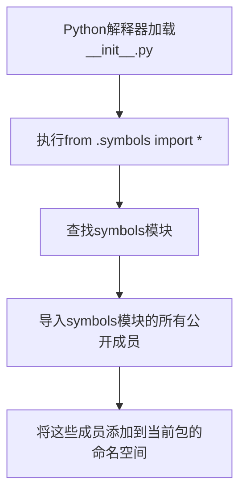
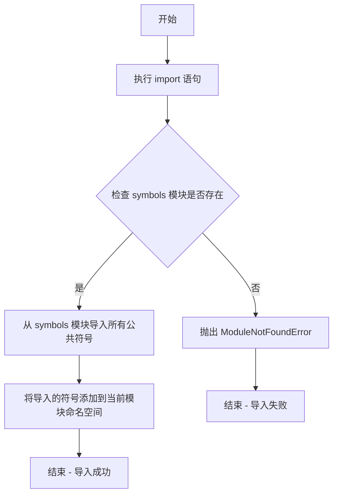

# `Bert-VITS2\onnx_modules\V200\text\__init__.py` 详细设计文档

这是一个Python包的初始化文件，通过`from .symbols import *`语句从同目录下的symbols模块导入所有公开成员，使这些成员可以在包级别直接访问。

## 整体流程



## 类结构

```
由于源代码仅包含导入语句，无法从当前文件分析类层次结构
需要查看symbols.py文件内容才能确定具体的类结构
```

## 全局变量及字段


    

## 全局函数及方法


由于您提供的代码仅包含一个导入语句 `from .symbols import *`，该代码片段本身不包含函数或方法定义。代码的功能完全取决于 `symbols` 模块中实际导出的内容。

根据您提供的代码片段，我只能为这个 **模块导入语句** 提供以下文档：

### `from .symbols import *`

这是一个模块导入语句，用于从当前包（`.` 表示当前目录）的 `symbols` 模块中导入所有公开的符号（类、函数、变量等）。

#### 参数

无（此为导入语句，不接受参数）

#### 返回值

无返回值（此为导入操作，不是函数）

#### 流程图



#### 带注释源码

```python
# 从当前包的 symbols 模块导入所有公开的符号
# . 表示当前包目录（相对导入）
# * 表示导入 symbols 模块中所有公开的名称（不含下划线开头的）
from .symbols import *
```

---

## 补充说明

### 1. 核心功能概述

该代码是一个Python模块导入语句，其功能是从当前包的 `symbols` 模块中导入所有公开的符号，使它们可以在当前模块中直接使用。

### 2. 潜在问题

- **不确定性**：使用 `import *` 会导入所有公开符号，可能导致命名空间污染，且无法明确知道导入了哪些名称。
- **维护性差**：如果 `symbols` 模块的导出内容发生变化，当前模块的行为也会随之改变，可能引入意外错误。
- **静态分析困难**：IDE 和静态分析工具难以确定哪些名称被导入到当前作用域。

### 3. 优化建议

考虑以下替代方案：

```python
# 方案1：明确导入需要的符号
from .symbols import SymbolA, SymbolB, FunctionC

# 方案2：使用别名避免命名冲突
from .symbols import SymbolA as SymA, SymbolB as SymB
```

### 4. 完整文档需要

要生成完整的类和方法文档，需要提供 `symbols` 模块的实际代码内容。您可以：

1. 提供 `symbols.py` 或 `symbols/__init__.py` 的完整代码
2. 或者指定您希望文档化的具体函数/类名称


## 关键组件


### 代码概述

该代码是一个Python包的初始化文件（`__init__.py`），通过通配符导入方式从同包下的`symbols`模块导入所有公共符号，作为包的公共接口。

### 文件运行流程

该文件在包被导入时自动执行，执行流程极为简单：
1. Python解释器导入该包时触发`__init__.py`执行
2. 执行`from .symbols import *`语句
3. 将`symbols`模块中所有公开成员导入到当前包的命名空间

### 类详细信息

由于该文件仅为导入语句，不包含任何类定义。如需类详细信息，请参考`symbols`模块的实现。

### 关键组件信息

由于提供的代码仅为一个导入语句，无法识别具体的"张量索引与惰性加载、反量化支持、量化策略"等关键组件。这些组件的详细信息需要查看`symbols.py`模块的实际实现代码。

### 潜在的技术债务或优化空间

由于代码信息不足，无法进行完整的技术债务分析。但基于代码结构，可能存在的优化空间包括：
- 考虑使用显式导入替代`*`导入，提高代码可读性和可维护性
- 添加适当的模块文档字符串说明包的功能

### 其它项目

由于代码信息不足，无法提供完整的设计目标、错误处理、数据流等详细信息。建议提供更完整的源代码以便进行详细分析。


## 问题及建议


### 已知问题

-   使用了通配符导入（`from .symbols import *`），导致命名空间污染，难以追踪具体导入了哪些符号，降低代码可读性和可维护性
-   缺少模块级文档字符串，未说明该文件的功能和用途
-   依赖关系不明确，静态分析工具难以分析模块依赖，可能影响重构和类型检查
-   符号来源不透明，后续开发者无法快速确定某个符号的定义位置
-   存在潜在的循环导入风险，如果 symbols 模块反向导入当前模块，会导致导入失败

### 优化建议

-   明确列出需要导入的具体符号，使用显式导入替代通配符导入，如 `from .symbols import SymbolA, SymbolB`
-   添加模块文档字符串，说明当前模块的功能和职责
-   考虑使用 `__all__` 变量控制 symbols 模块的公共导出接口，提高导入的可控性
-   如需导出 symbols 模块的所有公共接口，建议在当前模块的文档中说明原因和预期用途
-   进行依赖分析，确保不存在循环导入问题


## 其它


### 设计目标与约束

该代码是一个相对导入语句，旨在从当前包的symbols模块中导入所有公共符号。设计目标是实现模块化代码组织，使当前模块能够访问symbols模块中定义的符号（如常量、函数、类等），同时保持包的内部结构一致性。约束包括：1) 只能在包内部使用此导入方式；2) 依赖symbols模块的存在；3) 使用`*`导入可能导致命名空间污染。

### 模块职责

该代码所在的模块主要职责是通过`from .symbols import *`导入symbols模块中所有公开的符号（由`__all__`定义或非下划线开头的名称），使当前模块的使用者可以直接使用这些符号而无需前缀。symbols模块可能包含项目中使用的符号定义，如业务常量、枚举值、状态码等。

### 外部依赖与接口契约

**外部依赖**：symbols模块（相对路径导入）

**接口契约**：
- symbols模块必须存在于当前包目录中
- symbols模块应正确定义`__all__`列表以控制导入的符号集合，或遵循Python默认的公开符号约定
- 导入的符号将对当前模块的命名空间可见

### 错误处理与异常设计

由于该代码仅为导入语句，运行时错误主要来源于：
1. **ImportError**：symbols模块不存在或语法错误时触发
2. **ModuleNotFoundError**：symbols模块文件缺失时触发
3. **循环导入错误**：若symbols模块反向导入当前模块，可能导致循环导入问题

**处理方式**：这些错误属于模块加载时的基础错误，通常无需在代码中捕获，而应在环境配置和模块结构设计时确保正确。

### 数据流与状态机

该代码不涉及运行时数据流或状态机，仅在模块加载阶段执行。导入过程如下：
1. Python解释器解析相对导入`.symbols`
2. 定位并加载symbols模块
3. 执行symbols模块的顶层代码
4. 将symbols模块的公开符号绑定到当前模块的命名空间

### 关键组件信息

**symbols模块**：包含项目使用的符号定义（如常量、枚举、状态码等），是当前模块的核心依赖组件。

### 潜在的技术债务或优化空间

1. **使用`*`导入的风险**：无法明确知道导入了哪些符号，可能引入意外的命名冲突。建议改为显式导入：`from .symbols import SymbolA, SymbolB`
2. **缺少文档注释**：未说明导入symbols模块的用途和期望使用的符号集合
3. **无symbols模块的容错机制**：若symbols模块不存在会导致整个包无法加载

### 其它项目

**导入原则建议**：
- 若symbols模块包含大量符号，考虑仅导入需要的符号而非全部
- 确保symbols模块的公共接口稳定，避免因内部实现变更破坏导入方
- 建议在symbols模块中使用`__all__`明确定义公开接口


    