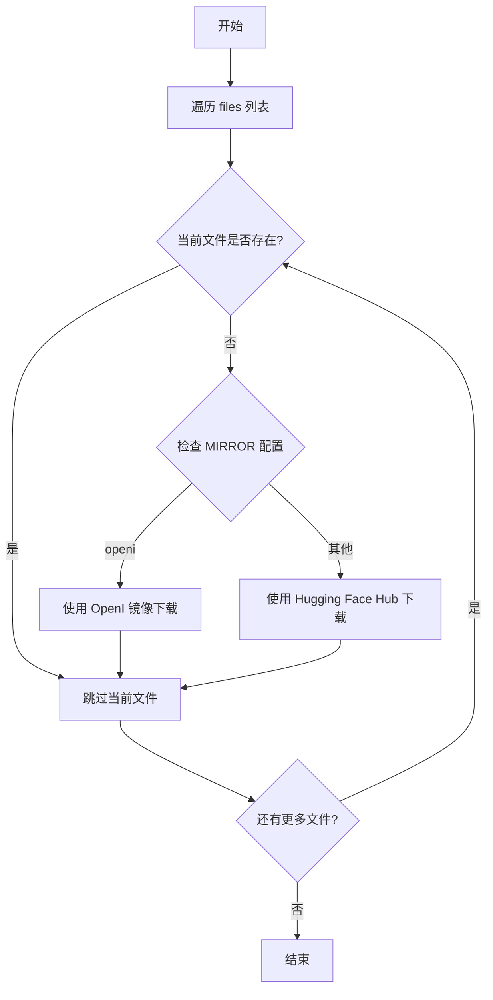

# `Bert-VITS2\onnx_modules\V200\text\bert_utils.py` 详细设计文档

该代码实现了一个BERT模型文件的检查和下载功能，通过检查本地路径中是否存在指定文件，如果文件缺失则根据配置的MIRROR（镜像源）选择从OpenI镜像或HuggingFace Hub下载模型文件。

## 整体流程

```mermaid
graph TD
    A[开始 _check_bert] --> B[遍历 files 列表]
    B --> C{文件是否存在?}
    C -- 是 --> D[跳过该文件]
    C -- 否 --> E{MIRROR == 'openi'?}
    E -- 是 --> F[使用 openi 库下载]
    E -- 否 --> G[使用 hf_hub_download 下载]
    F --> H[下载完成]
    G --> H
    D --> I{还有更多文件?]
    H --> I
    I -- 是 --> B
    I -- 否 --> J[结束]
```

## 类结构

```
全局变量
├── MIRROR (str)
│
全局函数
└── _check_bert(repo_id, files, local_path)
│
导入模块
├── Path (pathlib)
├── hf_hub_download (huggingface_hub)
└── config (本地配置模块)
```

## 全局变量及字段


### `MIRROR`
    
全局镜像源配置，从config模块获取，用于决定使用哪个模型下载源

类型：`str`
    


    

## 全局函数及方法


### `_check_bert`

该函数用于检查指定的BERT模型文件是否已存在于本地路径中，若文件缺失则根据MIRROR配置选择对应的下载源（OpenI镜像或Hugging Face Hub）进行模型文件的下载。

参数：

- `repo_id`：`str`，Hugging Face Hub上的模型仓库ID，格式为`namespace/model-name`
- `files`：`List[str]`，需要检查和下载的模型文件名列表
- `local_path`：`str`，本地存储模型文件的目录路径

返回值：`None`，该函数无返回值，执行完成后直接结束

#### 流程图



#### 带注释源码

```python
from pathlib import Path  # 导入路径处理模块

from huggingface_hub import hf_hub_download  # 导入Hugging Face Hub下载函数

from config import config  # 导入配置对象

# 全局变量：从配置中读取镜像源设置
MIRROR: str = config.mirror


def _check_bert(repo_id, files, local_path):
    """
    检查并下载BERT模型文件到本地路径
    
    参数:
        repo_id: Hugging Face仓库ID
        files: 需要检查的文件名列表
        local_path: 本地存储路径
    """
    # 遍历需要检查的每个文件
    for file in files:
        # 拼接完整路径并检查文件是否存在
        if not Path(local_path).joinpath(file).exists():
            # 判断是否使用OpenI镜像源
            if MIRROR.lower() == "openi":
                # 动态导入OpenI模块
                import openi
                
                # 使用OpenI下载模型
                # 参数: 模型仓库ID, 模型名称, 本地存储目录
                openi.model.download_model(
                    "Stardust_minus/Bert-VITS2",  # OpenI上的模型路径
                    repo_id.split("/")[-1],       # 从repo_id提取模型名
                    "./bert"                       # 下载到本地目录
                )
            else:
                # 使用Hugging Face Hub官方源下载
                # repo_id: 仓库ID
                # file: 文件名
                # local_dir: 本地目录
                # local_dir_use_symlinks: 禁用符号链接，使用实际文件
                hf_hub_download(
                    repo_id, file, local_dir=local_path, local_dir_use_symlinks=False
                )
```

## 关键组件


### MIRROR 全局变量

配置项，用于指定模型下载的镜像源，支持 HuggingFace Hub 或 OpenI 等镜像。

### _check_bert 函数

核心函数，用于检查本地是否存在指定的 BERT 模型文件，若不存在则根据 MIRROR 配置选择对应的下载方式从远程仓库获取。

### HuggingFace Hub 下载组件

使用 hf_hub_download 函数从 HuggingFace Hub 下载模型文件，支持 local_dir 和 local_dir_use_symlinks 参数配置。

### OpenI 镜像下载组件

当 MIRROR 配置为 "openi" 时，使用 openi.model.download_model 函数从 OpenI 镜像站下载模型，指定了 Stardust_minus/Bert-VITS2 仓库和本地 ./bert 目录。


## 问题及建议


### 已知问题

-   硬编码的repo_id：函数内部直接使用 `"Stardust_minus/Bert-VITS2"`，应作为参数或配置传入，提高可复用性
-   重复导入：在函数内部进行 `import openi`，每次调用都会触发导入操作，建议在模块顶部统一导入
-   缺少异常处理：文件下载过程没有 try-except 捕获网络异常、磁盘空间不足等错误
-   文件完整性无验证：下载完成后未验证文件是否完整或损坏
-   MIRROR 比较方式不健壮：使用 `MIRROR.lower() == "openi"` 字符串比较判断镜像源，可扩展性差
-   参数验证缺失：未对 `repo_id`、`files`、`local_path` 的有效性和类型进行检查
-   缺少日志记录：没有任何日志输出，难以追踪下载过程和排查问题
-   函数职责过重：同时承担检查和下载职责，建议拆分为独立函数
-   类型注解不完整：函数参数和返回值缺少类型提示
-   返回值不明确：函数无返回值，调用方无法得知下载是否成功

### 优化建议

-   将 `Stardust_minus/Bert-VITS2` 提取为函数参数或配置常量
-   将 `import openi` 移至模块顶部条件导入或延迟导入
-   添加 try-except 块处理网络异常、IO异常等，并返回下载结果状态
-   使用哈希校验或文件大小比对验证下载完整性
-   使用枚举或配置类管理 MIRROR 选项，避免字符串硬编码
-   在函数入口添加参数类型检查和必要的前置条件验证
-   使用 logging 模块添加不同级别的日志记录
-   拆分函数为 `_check_bert_exists()` 和 `_download_bert()` 单一职责函数
-   为函数参数和返回值添加完整的类型注解
-   返回布尔值或自定义结果对象告知调用方执行状态


## 其它


### 设计目标与约束

本模块的设计目标是实现BERT模型文件的自动化检查与下载功能，支持HuggingFace官方仓库和OpenI镜像站两种下载源，确保模型文件的可用性。约束条件包括：必须依赖config模块中的mirror配置项；仅支持特定的repo_id格式（如"Stardust_minus/Bert-VITS2"）；下载目录默认为"./bert"。

### 错误处理与异常设计

代码中未包含显式的异常处理机制，存在以下潜在风险：网络连接失败时会导致程序中断；Path对象操作失败会抛出异常；mirror配置为非法值时可能产生未知行为。建议增加异常捕获：网络超时异常（requests.exceptions.Timeout）、文件写入异常（IOError/OSError）、镜像站API调用异常（openi相关异常），并实现重试机制和友好的错误提示。

### 数据流与状态机

数据流为：config.mirror → MIRROR全局变量 → _check_bert函数判断分支 → 下载模型。无复杂状态机，仅包含两个状态分支：镜像站为"openi"时调用openi.model.download_model，否则调用hf_hub_download。建议增加日志输出以追踪下载状态。

### 外部依赖与接口契约

外部依赖包括：pathlib.Path（标准库）、huggingface_hub的hf_hub_download函数、config模块的config对象、openi库的model.download_model函数。接口契约：_check_bert函数接受repo_id（字符串）、files（文件列表）、local_path（本地路径）三个参数，无返回值，直接操作文件系统。

### 性能考虑

当前实现每次调用都会检查文件是否存在，频繁调用时会造成IO开销。建议增加缓存机制或提供批量检查接口。hf_hub_download的local_dir_use_symlinks=False参数会复制文件而非创建符号链接，大文件场景下会占用较多磁盘空间和时间。

### 安全性考虑

代码未对repo_id和local_path进行安全校验，可能存在路径遍历风险（如果local_path可被用户控制）。mirror参数未做白名单校验，直接用于字符串比较。建议增加输入验证：检查repo_id格式是否符合规范、验证local_path是否为合法目录路径、对mirror值进行枚举校验。

### 配置管理

MIRROR全局变量从config.config.mirror初始化，属于运行时配置。建议在模块级别增加默认值处理，当config.mirror未定义或为空时提供fallback策略（如默认使用HuggingFace官方源）。

### 使用示例

```python
# 检查并下载BERT模型
_check_bert(
    repo_id="bert-base-uncased",
    files=["config.json", "pytorch_model.bin"],
    local_path="./models/bert"
)

# 使用OpenI镜像站
# 需在config中设置 mirror="openi"
```

### 版本兼容性

代码使用Python 3.6+的f-string语法（f"{MIRROR.lower()}"），需确保Python版本 >= 3.6。huggingface_hub库版本需 >= 0.0.19以支持local_dir_use_symlinks参数。openi库的API稳定性无法保证，建议增加版本检测或try-except包装。


    