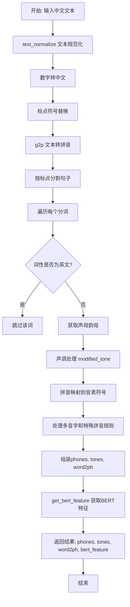
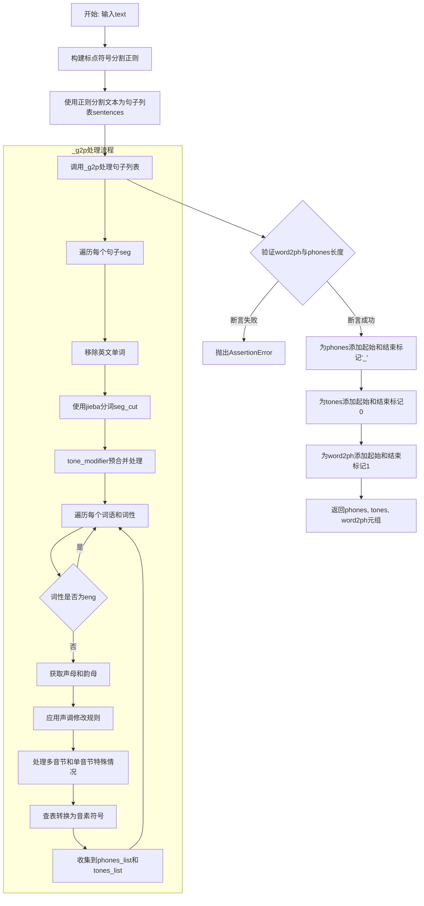
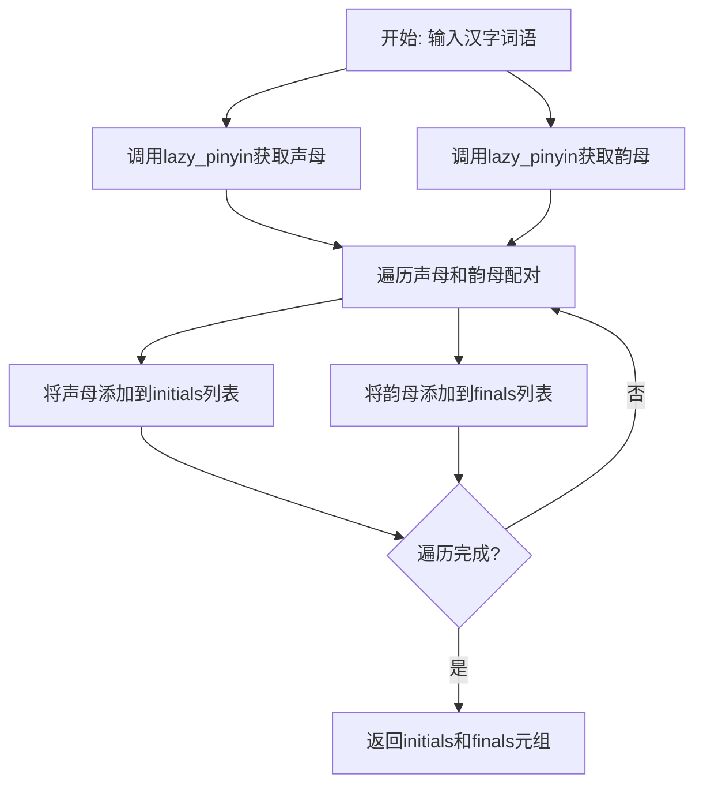
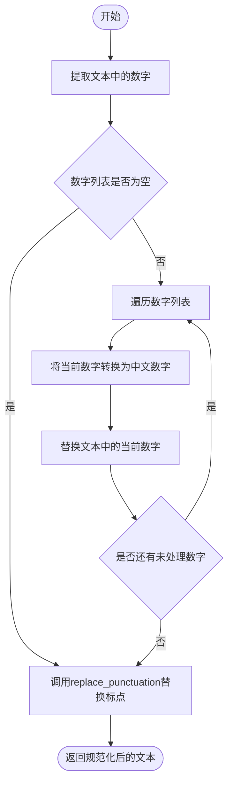
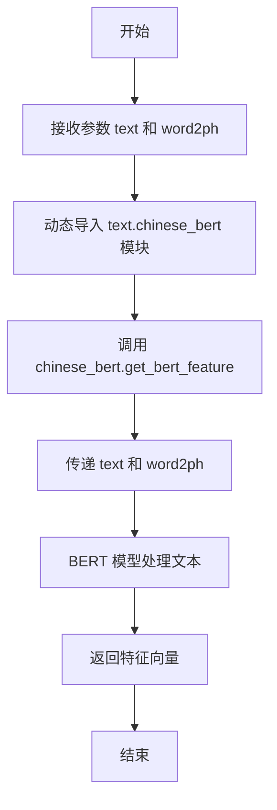

# `Bert-VITS2\onnx_modules\V200\text\chinese.py` 详细设计文档

这是一个中文文本转语音(TTS)前端处理模块，主要功能是将中文文本转换为拼音序列（包含声母、韵母、声调）以及对应的BERT文本特征，用于后续的语音合成模型输入。

## 整体流程



## 类结构

```
text module (文本处理模块)
├── 全局变量
│   ├── pinyin_to_symbol_map (拼音到音素符号映射)
│   ├── rep_map (标点符号替换映射)
│   └── tone_modifier (声调处理实例)
├── 核心函数
│   ├── text_normalize (文本规范化入口)
│   ├── replace_punctuation (标点符号替换)
│   ├── g2p (文本转拼音主函数)
│   ├── _g2p (内部转换实现)
│   ├── _get_initials_finals (获取声母韵母)
│   └── get_bert_feature (BERT特征提取)
└── 依赖模块
    ├── symbols (符号定义)
    ├── tone_sandhi (声调连读处理)
    └── chinese_bert (中文BERT模型)
```

## 全局变量及字段


### `current_file_path`
    
当前Python文件所在的目录路径，用于构建资源文件（如opencpop-strict.txt）的相对路径

类型：`str`
    


### `pinyin_to_symbol_map`
    
拼音到音素符号的映射字典，从opencpop-strict.txt文件加载，键为拼音（如'ni'），值为音素序列（如'n i'）

类型：`dict`
    


### `rep_map`
    
标点符号替换映射字典，用于将各种中文标点符号和特殊字符统一替换为标准符号

类型：`dict`
    


### `tone_modifier`
    
ToneSandhi声调处理类实例，用于处理中文声调变化规则，包括变调、轻声等处理

类型：`ToneSandhi`
    


    

## 全局函数及方法


### `replace_punctuation`

该函数用于将文本中的标点符号进行标准化处理，包括将特定汉字（如"嗯"、"呣"）替换为对应拼音形式，使用预定义的映射表替换各类标点符号，并移除非汉字和非指定标点符号的字符，以获得符合拼音转换系统要求的纯净文本。

参数：

- `text`：`str`，需要进行标点符号替换的原始文本

返回值：`str`，完成标点符号替换并移除无效字符后的文本

#### 流程图

```mermaid
flowchart TD
    A[开始] --> B[替换文本中的嗯为恩]
    B --> C[替换文本中的呣为母]
    C --> D[编译正则表达式: 将rep_map中所有标点符号用|连接并转义]
    D --> E[使用re.sub配合lambda函数进行标点符号批量替换]
    E --> F[编译正则表达式: 匹配非汉字和非指定标点符号的字符]
    F --> G[使用re.sub移除所有无效字符]
    G --> H{返回处理后的文本}
    H --> I[结束]
```

#### 带注释源码

```python
def replace_punctuation(text):
    """
    替换文本中的标点符号，将各种中文标点统一为英文标点，
    并移除非汉字和非指定标点符号的字符
    
    参数:
        text: 需要进行标点符号替换的原始文本
        
    返回值:
        完成标点符号替换并移除无效字符后的文本
    """
    # 第一步：将语气词"嗯"替换为"恩"，"呣"替换为"母"
    # 这是为了确保拼音转换时能正确识别这些字的读音
    text = text.replace("嗯", "恩").replace("呣", "母")
    
    # 第二步：构建标点符号替换的正则表达式
    # 使用re.escape转义特殊字符，用|连接所有需要替换的标点符号
    pattern = re.compile("|".join(re.escape(p) for p in rep_map.keys()))
    
    # 使用pattern.sub进行批量替换，将各种中文标点映射为英文/统一形式
    # lambda函数获取匹配的字符，然后从rep_map中查找对应的替换值
    replaced_text = pattern.sub(lambda x: rep_map[x.group()], text)
    
    # 第三步：移除所有非汉字和非指定标点符号的字符
    # \u4e00-\u9fa5 是汉字的Unicode范围
    # "".join(punctuation) 是从symbols模块导入的允许保留的标点符号
    # ^表示取反，即保留汉字和指定标点，移除其他所有字符
    replaced_text = re.sub(
        r"[^\u4e00-\u9fa5" + "".join(punctuation) + r"]+", "", replaced_text
    )
    
    # 返回处理后的干净文本
    return replaced_text
```


### `g2p`

该函数是中文文本转拼音序列的主入口函数，接收原始中文文本，经过标点符号处理、文本分句、拼音转换等步骤，最终输出带有起始/结束标记的音素序列（phones）、声调序列（tones）以及字符到音素的映射（word2ph）。

参数：

- `text`：`str`，待转换的中文文本输入

返回值：`tuple`，包含三个元素的元组 `(phones, tones, word2ph)`，其中 phones 是音素列表（str 类型），tones 是声调列表（int 类型），word2ph 是字符到音素的映射列表（int 类型）

#### 流程图



#### 带注释源码

```python
def g2p(text):
    """
    将中文文本转换为拼音序列的主函数
    
    处理流程：
    1. 使用标点符号对文本进行分割
    2. 调用_g2p进行拼音转换
    3. 验证转换结果的正确性
    4. 添加起始和结束标记
    
    参数:
        text: str - 待转换的中文文本
        
    返回:
        tuple: (phones, tones, word2ph)
            - phones: 音素列表，首尾添加静音符'_'
            - tones: 声调列表，首尾添加0
            - word2ph: 字到音素的映射，首尾添加1
    """
    # 构建基于标点符号的正则表达式分割模式
    # (?<=...) 是正向后查找断言，匹配标点符号后的零个或多个空格
    pattern = r"(?<=[{0}])\s*".format("".join(punctuation))
    
    # 使用正则分割文本为句子列表，过滤空字符串
    sentences = [i for i in re.split(pattern, text) if i.strip() != ""]
    
    # 调用_g2p函数进行核心的拼音转换处理
    phones, tones, word2ph = _g2p(sentences)
    
    # 验证word2ph总和是否等于phones长度（保证映射完整性）
    assert sum(word2ph) == len(phones)
    
    # 验证word2ph长度是否等于原始文本长度
    # 注意：有时会崩溃，可添加try-catch处理
    assert len(word2ph) == len(text)
    
    # 为音素序列添加起始和结束静音符标记
    phones = ["_"] + phones + ["_"]
    
    # 为声调序列添加起始和结束标记（0表示无声调）
    tones = [0] + tones + [0"]
    
    # 为字到音素映射添加起始和结束标记（每个标记对应一个音素）
    word2ph = [1] + word2ph + [1]
    
    # 返回转换结果元组
    return phones, tones, word2ph
```


### `_get_initials_finals`

该函数用于将汉字词语分解为声母（initials）和韵母（finals）列表，利用 pypinyin 库进行拼音转换，支持中性音调处理。

参数：

-  `word`：`str`，需要获取拼音的汉字词语

返回值：`Tuple[List[str], List[str]]`，返回两个列表——声母列表（initials）和韵母列表（finals）

#### 流程图



#### 带注释源码

```python
def _get_initials_finals(word):
    """
    将汉字词语分解为声母和韵母列表
    
    参数:
        word: str, 输入的汉字词语
    
    返回值:
        tuple: (声母列表, 韵母列表)
    """
    initials = []  # 存储声母的列表
    finals = []    # 存储韵母的列表
    
    # 获取声母，使用pypinyin库的lazy_pinyin函数
    # neutral_tone_with_five=True 表示使用五声调体系
    # Style.INITIALS 表示只提取声母部分
    orig_initials = lazy_pinyin(word, neutral_tone_with_five=True, style=Style.INITIALS)
    
    # 获取韵母，使用pypinyin库的lazy_pinyin函数
    # Style.FINALS_TONE3 表示提取带声调的韵母
    orig_finals = lazy_pinyin(
        word, neutral_tone_with_five=True, style=Style.FINALS_TONE3
    )
    
    # 使用zip函数将声母和韵母配对遍历
    for c, v in zip(orig_initials, orig_finals):
        initials.append(c)  # 添加声母到列表
        finals.append(v)    # 添加韵母到列表
    
    return initials, finals  # 返回声母和韵母的元组
```


### `_g2p`

这是内部实现文本到拼音转换的核心函数，负责将处理过的文本段落转换为音素序列、音调序列以及词到音素的映射关系。

参数：

-  `segments`：`List[str]`，需要转换的文本段落列表

返回值：`Tuple[List[str], List[int], List[int]]`，返回元组包含：
  - `phones_list`：音素列表
  - `tones_list`：音调列表
  - `word2ph`：词到音素的映射

#### 流程图

```mermaid
flowchart TD
    A[开始 _g2p] --> B[初始化空列表 phones_list, tones_list, word2ph]
    B --> C{遍历 segments 中的每个 seg}
    C --> D[使用正则表达式移除英文单词]
    D --> E[使用 jieba 分词 seg_cut = psg.lcut(seg)]
    E --> F[初始化空列表 initials, finals]
    F --> G[tone_modifier.pre_merge_for_modify 预处理分词结果]
    G --> H{遍历 seg_cut 中的每个 word, pos}
    H --> I{判断 pos == 'eng'}
    I -->|是| J[continue 跳过英文词]
    I -->|否| K[_get_initials_finals 获取初始音和韵母]
    K --> L[tone_modifier.modified_tone 调整韵母音调]
    L --> M[将 sub_initials 添加到 initials]
    M --> N[将 sub_finals 添加到 finals]
    N --> H
    H --> O{处理完所有词}
    O --> P[将 initials 和 finals 展平]
    P --> Q{遍历展平后的 initials 和 finals}
    Q --> R{c == v 且 c 在 punctuation 中?}
    R -->|是| S[处理标点符号: phone=[c], tone='0', word2ph.append(1)]
    R -->|否| T[提取韵母和音调: v_without_tone, tone]
    T --> U[拼接成 pinyin = c + v_without_tone]
    U --> V{c 是否为空?}
    V -->|是| W{多音节处理: v_without_tone 在 v_rep_map 中?}
    V -->|否| X{单音节处理: pinyin 在 p_rep_map 中?}
    W -->|是| Y[应用 v_rep_map 替换]
    W -->|否| X
    X -->|是| Z[应用 pinyin_rep_map 或 single_rep_map 替换]
    X -->|否| AA[不做替换]
    Z --> AB[验证 pinyin 在 pinyin_to_symbol_map 中]
    AA --> AB
    Y --> AB
    AB --> AC[从映射表获取 phone = pinyin_to_symbol_map[pinyin].split(' ')]
    AC --> AD[word2ph.append(len(phone))]
    S --> AE[将 phone 添加到 phones_list]
    AD --> AE
    AE --> AF[tones_list 添加对应数量的 tone]
    AF --> Q
    Q --> AG{处理完所有音节对}
    AG --> C
    C --> AH{遍历完所有段落}
    AH --> I[返回 phones_list, tones_list, word2ph]
```

#### 带注释源码

```python
def _g2p(segments):
    """
    将文本段落列表转换为音素序列、音调序列和词到音素的映射
    
    参数:
        segments: 文本段落列表
        
    返回:
        (phones_list, tones_list, word2ph): 音素列表、音调列表、词到音素映射
    """
    # 初始化返回列表
    phones_list = []  # 存储所有音素
    tones_list = []   # 存储所有音调
    word2ph = []      # 存储每个汉字对应的音素数量
    
    # 遍历每个文本段落
    for seg in segments:
        # 1. 替换段落中所有英文单词为空字符串
        seg = re.sub("[a-zA-Z]+", "", seg)
        
        # 2. 使用jieba进行词性标注分词
        seg_cut = psg.lcut(seg)
        
        # 3. 初始化当前段的声母和韵母列表
        initials = []
        finals = []
        
        # 4. 预处理：合并需要处理的词（如儿化音等）
        seg_cut = tone_modifier.pre_merge_for_modify(seg_cut)
        
        # 5. 遍历分词后的每个词及其词性
        for word, pos in seg_cut:
            # 跳过英文词（如英文单词、缩写等）
            if pos == "eng":
                continue
            
            # 6. 获取当前字的声母和韵母（包含声调）
            sub_initials, sub_finals = _get_initials_finals(word)
            
            # 7. 应用音调变化规则（如"不"的变调）
            sub_finals = tone_modifier.modified_tone(word, pos, sub_finals)
            
            # 8. 将当前字的声母和韵母添加到列表中
            initials.append(sub_initials)
            finals.append(sub_finals)
        
        # 9. 将嵌套列表展平为一维列表
        # 例如: [['b'], ['a']] -> ['b', 'a']
        initials = sum(initials, [])
        finals = sum(finals, [])
        
        # 10. 遍历每个声母-韵母对，处理成最终的音素
        for c, v in zip(initials, finals):
            # 原始拼音组合
            raw_pinyin = c + v
            
            # 11. 处理标点符号
            # 如果声母等于韵母且为标点符号
            if c == v:
                assert c in punctuation
                phone = [c]      # 标点符号作为独立音素
                tone = "0"       # 标点符号的音调设为0
                word2ph.append(1)
            else:
                # 12. 分离韵母和声调
                # 韵母的最后一个字符是声调数字(1-5)
                v_without_tone = v[:-1]  # 去掉声调后的韵母
                tone = v[-1]             # 声调数字
                
                # 13. 拼接成完整拼音（无声调）
                pinyin = c + v_without_tone
                assert tone in "12345"
                
                # 14. 根据声母是否存在进行不同处理
                if c:
                    # 多音节情况：声母不为空
                    v_rep_map = {
                        "uei": "ui",    # 威 -> 威
                        "iou": "iu",    # 优 -> 优
                        "uen": "un",    # 温 -> 温
                    }
                    # 应用多音节韵母替换规则
                    if v_without_tone in v_rep_map.keys():
                        pinyin = c + v_rep_map[v_without_tone]
                else:
                    # 单音节情况：声母为空（零声母）
                    pinyin_rep_map = {
                        "ing": "ying",  # ing -> ying
                        "i": "yi",       # i -> yi
                        "in": "yin",     # in -> yin
                        "u": "wu",       # u -> wu
                    }
                    
                    if pinyin in pinyin_rep_map.keys():
                        # 应用单音节拼音替换规则
                        pinyin = pinyin_rep_map[pinyin]
                    else:
                        # 进一步处理单字母韵母
                        single_rep_map = {
                            "v": "yu",  # v -> yu (ü)
                            "e": "e",   # e -> e
                            "i": "y",   # i -> y
                            "u": "w",   # u -> w
                        }
                        if pinyin[0] in single_rep_map.keys():
                            # 替换首字母
                            pinyin = single_rep_map[pinyin[0]] + pinyin[1:]
                
                # 15. 验证拼音是否在符号映射表中
                assert pinyin in pinyin_to_symbol_map.keys(), (pinyin, seg, raw_pinyin)
                
                # 16. 从映射表获取对应的音素序列（可能多个）
                phone = pinyin_to_symbol_map[pinyin].split(" ")
                
                # 17. 记录该汉字对应的音素数量
                word2ph.append(len(phone))
            
            # 18. 将处理后的音素添加到结果列表
            phones_list += phone
            
            # 19. 将对应音调添加到音调列表（每个音素一个音调值）
            tones_list += [int(tone)] * len(phone)
    
    # 20. 返回转换结果
    return phones_list, tones_list, word2ph
```


### `text_normalize`

该函数用于对文本进行规范化处理，将文本中的数字（整数和小数）转换为中文数字表示，并统一标点符号格式。

参数：

- `text`：`str`，待规范化的原始文本

返回值：`str`，规范化处理后的文本

#### 流程图



#### 带注释源码

```python
def text_normalize(text):
    """
    对文本进行规范化处理，包括数字转中文和标点符号统一
    
    处理流程：
    1. 提取文本中的所有数字（整数和小数）
    2. 将每个数字转换为中文数字表示
    3. 调用replace_punctuation统一标点符号
    
    参数:
        text: str, 待处理的原始文本
    
    返回:
        str, 规范化处理后的文本
    """
    # 使用正则表达式提取文本中的数字，支持整数和小数
    # \d+ 匹配一个或多个数字
    # (?:\.?\d+)? 可选的小数部分（.后跟数字）
    numbers = re.findall(r"\d+(?:\.?\d+)?", text)
    
    # 遍历找到的每个数字，将其转换为中文数字
    for number in numbers:
        # cn2an.an2cn() 将阿拉伯数字转换为中文数字
        # replace(..., 1) 表示只替换第一次出现的位置
        # 这样可以保证多个相同数字时按顺序替换
        text = text.replace(number, cn2an.an2cn(number), 1)
    
    # 调用replace_punctuation函数统一标点符号
    # 该函数会：
    # - 将各种中文标点转换为英文/统一格式
    # - 移除非中文和非标点符号的字符
    text = replace_punctuation(text)
    
    # 返回规范化处理后的文本
    return text
```


### `get_bert_feature`

该函数是一个封装函数，用于调用 Chinese BERT 模型获取文本的语义特征向量。它接收原始文本和字音对齐信息，返回与文本对应的 BERT 特征表示，可用于后续的语音合成或其他 NLP 任务。

参数：

- `text`：`str`，输入的文本字符串，通常是经过文本规范化（text_normalize）处理后的中文文本
- `word2ph`：`list[int]`，字到音素的映射列表，表示每个字符对应的音素数量，用于 BERT 特征与音素的对齐

返回值：`Tensor` 或 `ndarray`，BERT 模型提取的文本特征，通常形状为 `[seq_len, hidden_size]`，其中 seq_len 与 word2ph 的长度相关

#### 流程图



#### 带注释源码

```python
def get_bert_feature(text, word2ph):
    """
    获取文本的 BERT 特征表示
    
    这是一个封装函数，实际的 BERT 特征提取逻辑在 text.chinese_bert 模块中。
    该函数提供了统一的接口，用于将文本转换为 BERT 特征向量。
    
    参数:
        text (str): 输入的中文文本字符串
        word2ph (list[int]): 字到音素的映射列表，用于特征对齐
    
    返回:
        BERT 特征向量，形状为 [seq_len, hidden_size]
    """
    # 动态导入 chinese_bert 模块，避免循环依赖
    # 实际实现可能在 text 包下的 chinese_bert.py 文件中
    from text import chinese_bert

    # 调用 chinese_bert 模块中的 get_bert_feature 函数
    # 该函数内部会使用 BERT 模型（如 RoBERTa-wwm-ext）处理文本
    # 并根据 word2ph 进行特征对齐
    return chinese_bert.get_bert_feature(text, word2ph)
```

---

**补充说明**：

- 该函数是一个**代理/包装函数**，真正的实现逻辑位于 `text.chinese_bert` 模块中
- `word2ph` 参数用于将字符级别的 BERT 特征对齐到音素级别，确保语音合成时特征与音素的同步
- 返回的 BERT 特征通常用于后续的声学模型输入或韵律预测

## 关键组件


### 张量索引与字符-音素对齐 (word2ph)

word2ph 是一个列表，用于建立字符（汉字）与音素（phones）之间的映射关系。它记录每个汉字对应的音素数量，实现文本字符与语音音素的索引对齐，为后续 BERT 特征提取提供位置信息。

### 惰性加载与符号映射 (pinyin_to_symbol_map)

该映射在模块加载时通过读取外部文件 "opencpop-strict.txt" 构建，将拼音（如 "ni3"）映射到对应的音素符号序列（如 "n i3"）。采用惰性加载方式，仅在需要时从文件系统读取并解析。

### 声调修改与连读规则 (ToneSandhi)

ToneSandhi 类实现了中文声调的上下文感知修改，处理轻声、儿化等连读现象。通过 pre_merge_for_modify 和 modified_tone 方法，在音节级别动态调整声调，确保合成语音的自然度。

### 文本规范化与数字转换 (text_normalize)

该函数使用 cn2an 库将阿拉伯数字转换为中文数字（如 "123" → "一百二十三"），结合 replace_punctuation 完成标点符号标准化，为后续拼音转换提供统一输入。

### 标点符号统一映射 (rep_map)

定义了中英文标点符号到统一符号的映射表，将多种中文标点（"、" "。" "！"）和英文标点统一转换为标准形式，确保文本处理的一致性。

### 拼音音节后处理 (pinyin_rep_map / v_rep_map / single_rep_map)

包含多个拼音转换映射表，用于处理拼音库（pypinyin）输出的特殊情况：将复合韵母还原（如 "iou" → "iu"）、单字母韵母添加声母（如 "i" → "yi"）、以及特殊音节转换（如 "v" → "yu"），确保拼音与符号表的精确匹配。


## 问题及建议


### 已知问题

-   **文件资源未正确关闭**：`pinyin_to_symbol_map` 使用 `open()` 读取文件后未关闭，在 Python 中虽会自动 GC，但在高并发或资源受限环境下可能导致问题。
-   **模块级文件加载**：全局变量 `pinyin_to_symbol_map` 在模块导入时即加载外部文件 `opencpop-strict.txt`，若文件不存在或格式错误会导致整个模块无法导入，缺乏错误处理。
-   **正则表达式重复编译**：`replace_punctuation` 函数中每次调用都通过 `re.compile` 重新编译正则表达式，未复用已编译的模式。
-   **断言用于业务逻辑**：代码中多处使用 `assert` 进行业务校验（如 `assert sum(word2ph) == len(phones)`），但 assert 可被 Python 优化选项禁用，应使用明确的异常处理。
-   **硬编码路径和魔法值**：多处硬编码如 `"_"`, `[0]`, `[1]` 等，缺乏常量定义；文件路径 `opencpop-strict.txt` 直接拼接未做校验。
-   **缺乏输入验证**：`g2p` 和 `text_normalize` 等函数未对输入进行空值或类型校验，可能导致运行时错误。
-   **冗余的字符串操作**：`_g2p` 中存在大量字符串拼接和条件判断（如韵母映射替换），逻辑可进一步抽象。
-   **导入语句位置不当**：`import jieba.posseg as psg` 在模块顶部导入但仅在函数内使用，增加模块加载时间；`get_bert_feature` 中还存在重复导入 `from text import chinese_bert`。
-   **未使用的变量和代码**：`rep_map` 中部分映射项（如 `"·": ","`）在 `replace_punctuation` 的正则替换中未被使用；注释掉的示例代码未清理。

### 优化建议

-   **资源管理**：使用 `with open(...) as f` 读取文件，或封装为上下文管理器；考虑懒加载 `pinyin_to_symbol_map`。
-   **预编译正则表达式**：将 `replace_punctuation` 中的正则模式在模块级预编译，避免重复创建。
-   **错误处理**：为文件读取、数值转换、拼音映射等添加 try-except 块，捕获 `FileNotFoundError`, `KeyError`, `AssertionError` 等。
-   **常量定义**：提取魔法值如 `"_"`, `0`, `1` 为具名常量（如 `PAD`, `NEUTRAL_TONE`），提高可读性。
-   **输入校验**：在 `g2p`, `text_normalize` 等入口函数添加类型检查（如 `isinstance(text, str)`）和空值处理。
-   **代码重构**：将 `_g2p` 中的韵母映射逻辑封装为独立方法，减少函数长度；合并重复的映射字典（如 `v_rep_map`, `pinyin_rep_map`）。
-   **优化导入**：将 `jieba.posseg` 移至函数内部延迟导入；统一 `get_bert_feature` 的导入方式。
-   **清理代码**：删除未使用的 `rep_map` 键值和注释掉的代码段，保持代码整洁。

## 其它


### 1. 设计目标与约束

本模块的核心设计目标是将中文文本（包括中文汉字、标点符号和数字）转换为拼音序列（音素序列）、声调序列以及字符到音素的映射关系。主要约束包括：1）仅支持中文文本处理，非中文内容会被过滤或忽略；2）数字需要先转换为中文数字再进行拼音转换；3）结果需要保证word2ph长度与输入文本长度一致；4）依赖外部拼音符号表文件（opencpop-strict.txt）进行最终的音素映射。

### 2. 错误处理与异常设计

代码中的错误处理主要通过assert语句实现。在g2p函数中，断言验证word2ph总和等于phones长度，以及word2ph长度等于输入文本长度。拼音转换过程中，断言验证tone在"12345"范围内，以及pinyin在pinyin_to_symbol_map的键中。潜在问题是当断言失败时程序会直接崩溃，缺乏友好的错误提示和降级处理机制。建议添加try-except捕获并提供详细的错误上下文信息。

### 3. 数据流与状态机

数据流主要分为三条路径：主流程（text_normalize → replace_punctuation → g2p → _g2p → 分词处理 → 拼音转换 → 音素映射），辅助流程（数字转换通过cn2an），以及特征提取流程（get_bert_feature）。状态机方面，文本经过"原始文本 → 标准化文本 → 分词结果 → 声母韵母分离 → 声调处理 → 拼音映射 → 音素序列"的状态转换过程。

### 4. 外部依赖与接口契约

核心外部依赖包括：cn2an（数字转中文）、pypinyin（拼音获取，支持INITIALS和FINALS_TONE3风格）、jieba.posseg（中文分词及词性标注）、ToneSandhi类（声调处理，位于tone_sandhi模块）、opencpop-strict.txt文件（拼音到音素的映射表）、chinese_bert模块（BERT特征提取）。接口契约方面，g2p函数接收text字符串返回(phones列表, tones列表, word2ph列表)；text_normalize接收text字符串返回标准化后的字符串；replace_punctuation接收text返回替换后的文本；get_bert_feature接收text和word2ph返回BERT特征张量。

### 5. 配置与常量定义

rep_map定义了标点符号和特殊字符的替换规则，将各种中文标点统一转换为英文或简化形式。tone_modifier是ToneSandhi类的实例，用于处理声调变化。pinyin_to_symbol_map从外部文件加载，是关键的拼音到音素符号的映射表。punctuation来自symbols模块，定义了允许保留的标点符号集合。这些配置和常量是模块正常工作的基础。

### 6. 关键算法说明

核心算法包括：基于正则表达式的标点符号批量替换和文本清洗；基于jieba分词的词语切分和词性识别；基于pypinyin的声母韵母分离（INITIALS获取声母，FINALS_TONE3获取带声调的韵母）；拼音到音素的映射转换（处理iu/ui/ing等特殊拼写规则）；数字到中文的转换（cn2an库）；声调修正（ToneSandhi类处理连续变调）。这些算法共同实现了从文本到音素的完整转换。

### 7. 潜在技术债务与优化空间

1）文件读取未使用with语句，可能导致文件句柄泄漏；2）正则表达式在replace_punctuation中每次调用都重新编译，可缓存预编译模式；3）pinyin_to_symbol_map在模块加载时读取整个文件，可考虑延迟加载或缓存；4）缺乏日志记录，调试困难；5）assert用于生产代码不够优雅，应使用自定义异常；6）未处理静音符和停顿的显式标注；7）多音字处理依赖于jieba的分词结果，可能不够精确；8）代码注释较少，部分逻辑如v_rep_map和pinyin_rep_map的用途不够清晰。

### 8. 模块划分与职责

模块整体位于text包下，主要包含以下职责：text_normalize负责文本标准化（数字转中文、标点替换）；g2p系列函数负责拼音转换的核心逻辑；replace_punctuation负责标点符号的清洗和替换；_get_initials_finals负责声母韵母分离；get_bert_feature负责调用BERT模型提取文本特征。symbols模块提供标点符号定义，ToneSandhi类负责声调处理逻辑。

### 9. 输入输出规范

g2p函数的输入为经过text_normalize处理的中文文本字符串，输出为三个列表：phones（音素序列，首尾添加静音符"_"), tones（对应音素的声调，首尾添加0）, word2ph（每个汉字对应的音素数量，首尾添加1）。get_bert_feature输入为文本和word2ph，输出为BERT模型提取的特征张量。整体接口简洁，但缺乏输入验证和类型检查。

### 10. 测试与验证考量

当前代码在__main__块中包含简单的测试示例。验证要点包括：1）数字转换的正确性；2）各种标点符号的处理；3）多音字的处理效果；4）中英文混合文本的处理；5）word2ph与文本长度的对应关系；6）特殊韵母（如iu/ui/ing）的转换规则。建议补充单元测试覆盖各种边界情况。


    