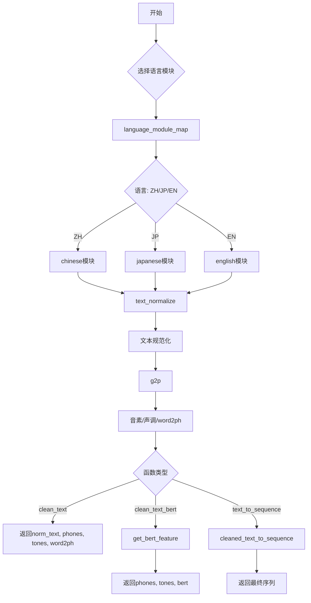
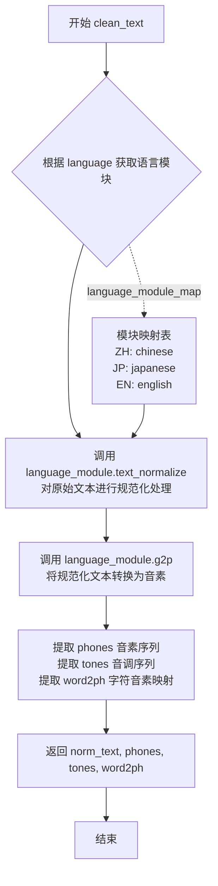
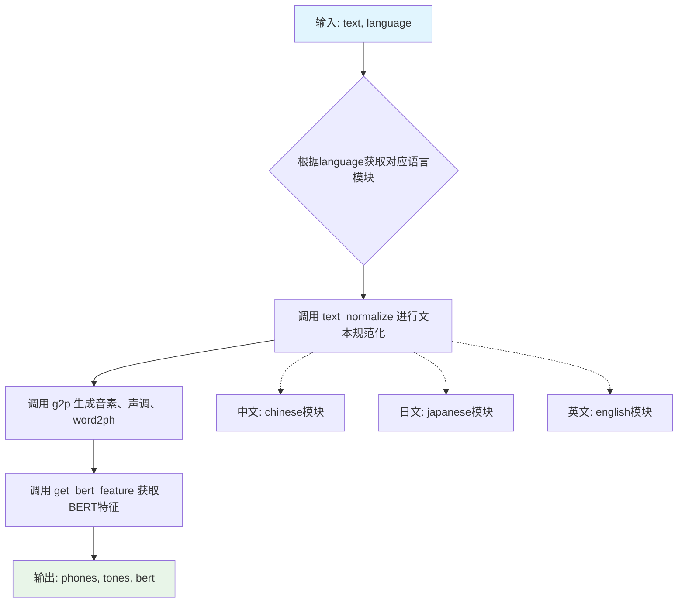
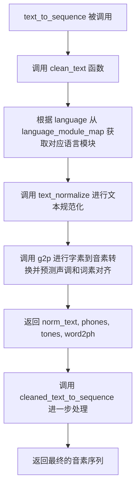

# `Bert-VITS2\onnx_modules\V200\text\cleaner.py` 详细设计文档

这是一个多语言文本处理模块，支持中文、日文和英文的文本规范化、音素转换和BERT特征提取，为语音合成提供前端处理能力。

## 整体流程



## 类结构

```
text_processor (模块)
├── language_module_map (全局变量)
├── clean_text (全局函数)
├── clean_text_bert (全局函数)
└── text_to_sequence (全局函数)
    └── 依赖模块:
        ├── chinese
        ├── japanese
        ├── english
        └── cleaned_text_to_sequence
```

## 全局变量及字段


### `language_module_map`
    
语言代码到语言模块的映射字典，用于根据语言代码动态调用对应的文本处理模块

类型：`dict`
    


    

## 全局函数及方法


### `clean_text`

文本规范化并转换为音素的核心函数，根据语言代码选择对应的语言处理模块，依次进行文本规范化、发音转换，最终返回规范化文本、音素序列、音调序列以及字符到音素的映射关系。

参数：

- `text`：`str`，需要处理的原始文本输入
- `language`：`str`，语言代码（如"ZH"、"JP"、"EN"），用于选择对应的语言处理模块

返回值：`tuple`，包含四个元素的元组

- `norm_text`：`str`，经过语言特定规范化处理后的文本
- `phones`：`list`，从文本转换得到的音素序列
- `tones`：`list`，与音素对应的声调序列
- `word2ph`：`list`，字符到音素的映射数组，用于对齐

#### 流程图



#### 带注释源码

```python
def clean_text(text, language):
    """
    文本规范化并转换为音素的核心函数
    
    参数:
        text: str - 需要处理的原始文本输入
        language: str - 语言代码，用于选择对应的语言处理模块
    
    返回:
        tuple: (norm_text, phones, tones, word2ph) - 规范化文本、音素序列、音调序列、字符音素映射
    """
    # 根据语言代码从映射表中获取对应的语言处理模块
    # 支持 ZH(中文)、JP(日文)、EN(英文)
    language_module = language_module_map[language]
    
    # 第一步：调用语言模块的文本规范化方法
    # 该方法执行语言特定的文本预处理，如数字转汉字、标点处理等
    norm_text = language_module.text_normalize(text)
    
    # 第二步：调用语言模块的 g2p (grapheme-to-phoneme) 方法
    # 将规范化后的文本转换为音素序列，同时生成音调和字符-音素映射
    phones, tones, word2ph = language_module.g2p(norm_text)
    
    # 返回四个结果：
    # - norm_text: 规范化后的文本
    # - phones: 音素序列列表
    # - tones: 对应的声调序列
    # - word2ph: 字符到音素的映射关系（用于对齐）
    return norm_text, phones, tones, word2ph
```


### `clean_text_bert`

该函数是文本处理流水线中的关键环节，负责将原始文本规范化后转换为语音合成所需的音素序列、声调信息以及BERT嵌入特征，支持中文、日文、英文三种语言的文本处理。

参数：

- `text`：`str`，待处理的原始输入文本
- `language`：`str`，文本所属语言标识，支持"ZH"(中文)、"JP"(日文)、"EN"(英文)

返回值：`(phones, tones, bert)`，其中 phones 为音素列表(`List[str]`)，tones 为声调列表(`List[int]`)，bert 为BERT特征矩阵(`numpy.ndarray` 或 `torch.Tensor`)

#### 流程图



#### 带注释源码

```python
def clean_text_bert(text, language):
    """
    文本规范化并获取BERT特征
    
    该函数是TTS文本前端处理的核心组件，完成从原始文本到
    声学特征（音素+声调+BERT）的完整转换流水线。
    
    参数:
        text: str, 输入的原始文本字符串
        language: str, 语言标识，"ZH"/"JP"/"EN"之一
    
    返回:
        tuple: (phones, tones, bert)
            - phones: 音素序列列表
            - tones: 对应的声调序列列表
            - bert: BERT embedding特征矩阵
    """
    # Step 1: 根据语言代码动态加载对应的语言处理模块
    # language_module_map 字典映射: ZH->chinese, JP->japanese, EN->english
    language_module = language_module_map[language]
    
    # Step 2: 文本规范化 - 繁简转换、全角半角处理、标点标准化等
    norm_text = language_module.text_normalize(text)
    
    # Step 3: Grapheme-to-Phoneme转换 - 将文本转换为音素序列
    # 同时输出声调信息(tones)和词到音素的对齐信息(word2ph)
    phones, tones, word2ph = language_module.g2p(norm_text)
    
    # Step 4: 获取BERT特征 - 基于规范文本和词音对齐信息
    # 生成用于后续声学模型的上下文表示
    bert = language_module.get_bert_feature(norm_text, word2ph)
    
    # Step 5: 返回处理结果三元组
    return phones, tones, bert
```


### `text_to_sequence`

该函数是文本到音素序列转换的核心入口函数，接收原始文本和语言代码，通过文本规范化、分词、韵母声调预测等步骤，最终将文本转换为可供语音合成模型使用的音素序列。

参数：

- `text`：`str`，待转换的原始文本输入
- `language`：`str`，语言代码，支持 "ZH"（中文）、"JP"（日文）、"EN"（英文）

返回值：`list`，转换后的音素序列

#### 流程图



#### 带注释源码

```python
def text_to_sequence(text, language):
    """
    将文本转换为音素序列的完整转换流程
    
    参数:
        text: str, 输入的原始文本
        language: str, 语言代码，支持 "ZH", "JP", "EN"
    
    返回:
        list: 处理后的音素序列
    """
    
    # 第一步：调用 clean_text 进行文本规范化、分词和韵母声调预测
    # 返回规范化后的文本(norm_text)、音素(phones)、声调(tones)和词素对齐信息(word2ph)
    norm_text, phones, tones, word2ph = clean_text(text, language)
    
    # 第二步：调用 cleaned_text_to_sequence 进行最终处理
    # 该函数会根据语言类型进一步处理音素和声调
    # 返回最终的音素序列
    return cleaned_text_to_sequence(phones, tones, language)
```

## 关键组件


### 语言模块映射 (language_module_map)

全局变量，用于根据语言代码动态加载对应的语言处理模块（chinese/japanese/english），实现多语言支持的解耦设计。

### clean_text 函数

核心文本清洗函数，接收文本和语言代码，调用对应语言模块进行文本规范化、g2p转换，返回规范化文本、音素序列、声调序列和词素对齐信息。

### clean_text_bert 函数

带BERT特征提取的文本清洗函数，与clean_text类似，但额外调用get_bert_feature获取文本的BERT嵌入表示，返回音素、声调和BERT特征。

### text_to_sequence 函数

顶层文本转序列接口，整合clean_text和cleaned_text_to_sequence，将原始文本转换为最终的ID序列，供声学模型使用。

### 语言模块接口抽象

通过language_module_map实现的模块化设计，各语言模块需统一实现text_normalize、g2p和get_bert_feature接口，保证多语言处理的扩展性。


## 问题及建议


### 已知问题

- **缺少错误处理**：当传入的 `language` 参数不在 `language_module_map` 中时，会直接抛出 `KeyError` 异常，缺乏友好的错误提示和异常处理机制
- **代码重复**：`clean_text` 和 `clean_text_bert` 函数中存在重复的代码逻辑（获取 language_module、调用 text_normalize 和 g2p），违反 DRY 原则
- **缺少输入验证**：没有对 `text` 参数进行空值或类型校验，可能导致后续处理失败
- **语言模块方法缺失风险**：未对 language_module 是否具有 `text_normalize`、`g2p`、`get_bert_feature` 等方法进行运行时检查
- **返回值不一致**：`clean_text` 返回 4 个值，`clean_text_bert` 返回 3 个值，接口设计不够统一
- **word2ph 资源浪费**：`clean_text_bert` 函数中调用 `g2p` 获取了 `word2ph` 但未使用，造成计算资源浪费
- **缺乏类型注解**：所有函数均缺少类型提示，降低了代码的可读性和可维护性
- **扩展性差**：新增语言需要修改 `language_module_map` 字典，硬编码方式不利于扩展

### 优化建议

- 添加语言参数校验，当传入无效语言时抛出自定义异常或返回默认值
- 抽取公共逻辑到内部辅助函数，如 `_get_normalized_text_and_phonemes`，减少代码重复
- 在函数入口添加输入验证，检查 text 是否为空或类型正确
- 使用 `hasattr` 或 `getattr` 检查 language_module 是否包含所需方法，提供更清晰的错误信息
- 统一返回值结构，可考虑返回命名元组或字典
- 在 `clean_text_bert` 中可选地跳过 word2ph 的计算以节省资源
- 添加函数类型注解和文档字符串，提升代码可读性
- 考虑将语言模块映射改为配置驱动或注册机制，便于动态扩展语言支持

## 其它


### 设计目标与约束

本模块的核心设计目标是为多语言文本转语音（TTS）系统提供统一的文本预处理接口，将原始文本转换为音素序列、声调序列和词素对齐信息。支持中文（ZH）、日文（JP）、英文（EN）三种语言的文本处理，所有语言模块需实现text_normalize、g2p、get_bert_feature三个标准接口。设计约束包括：语言代码必须为指定的枚举值（ZH/JP/EN）、输入文本需为有效字符串、输出格式需保持一致性。

### 错误处理与异常设计

模块主要通过KeyError处理未知语言，当传入非支持的语言代码时，Python会抛出KeyError并终止执行。语言模块内部的text_normalize和g2p方法可能抛出异常（如空输入、编码问题），但当前代码未进行捕获和包装。建议在clean_text、clean_text_bert、text_to_sequence函数外层增加try-except块，对语言模块返回空值或异常进行检测，确保程序健壮性。

### 数据流与状态机

数据流主要分为三条路径：1) clean_text流程：text→text_normalize→g2p→返回(norm_text, phones, tones, word2ph)；2) clean_text_bert流程：text→text_normalize→g2p→get_bert_feature→返回(phones, tones, bert)；3) text_to_sequence流程：调用clean_text后经cleaned_text_to_sequence转换为最终序列。无状态机设计，所有函数均为无状态函数，多次调用相互独立。

### 外部依赖与接口契约

外部依赖包括四个语言模块（chinese、japanese、english）和cleaned_text_to_sequence工具函数。每个语言模块需暴露三个方法：text_normalize(text)返回规范化字符串、g2p(text)返回(phones, tones, word2ph)三元组、get_bert_feature(text, word2ph)返回BERT特征向量。cleaned_text_to_sequence(phones, tones, language)需返回最终的整数序列。language_module_map字典为模块级全局变量，定义语言代码与模块的映射关系。

### 性能考虑

当前实现为同步调用，无缓存机制。重复调用相同文本时需重新计算，建议对规范化后的文本和g2p结果增加LRU缓存。对于大规模批处理场景，可考虑并行处理不同语言或使用生成器模式。BERT特征提取可能为性能瓶颈，建议在get_bert_feature中实现批量推理优化。

### 安全性考虑

当前代码未对输入进行安全校验，需防止恶意输入导致内存溢出或计算资源耗尽。建议对text长度增加上限限制（如10000字符）、对返回的phones/tones列表长度进行边界检查。语言模块可能涉及文件读取（如词典加载），需确保路径安全，防止路径遍历攻击。

### 测试策略

建议设计三层测试：单元测试覆盖各语言模块的text_normalize和g2p方法、集成测试验证clean_text等主函数的输入输出正确性、端到端测试验证text_to_sequence生成序列的有效性。需测试边界情况：空字符串、特殊字符、超长文本、混合语言文本等。

### 版本兼容性

当前代码使用Python 3模块导入语法（from . import），需确保运行在Python 3.5+环境。language_module_map为可编辑字典，如有新语言支持可直接追加。接口契约需保持向后兼容，新增语言模块需实现标准接口方法。

    