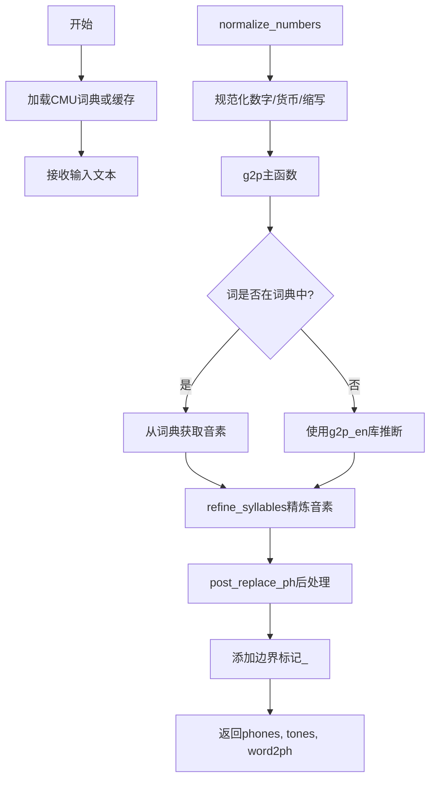
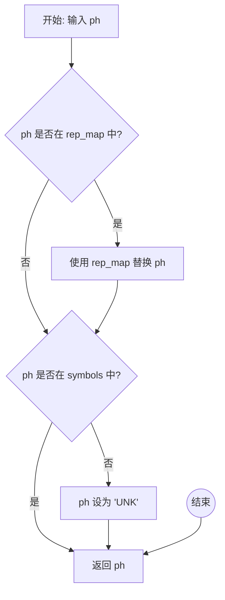
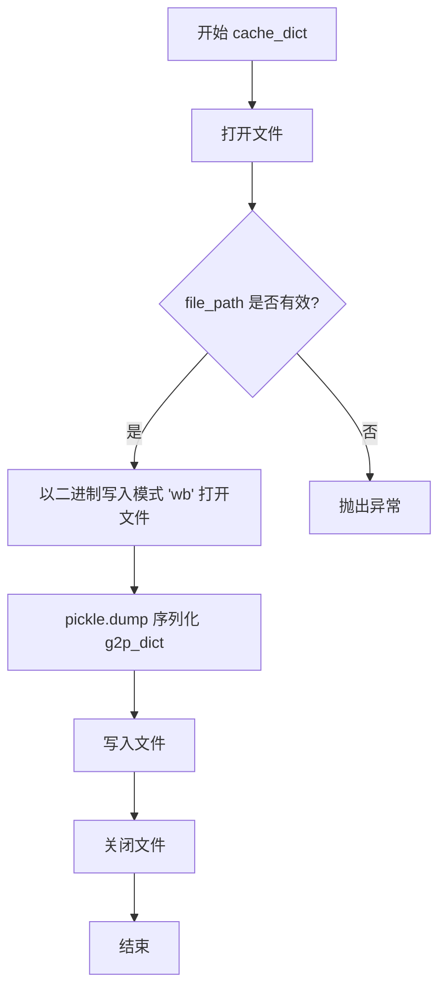
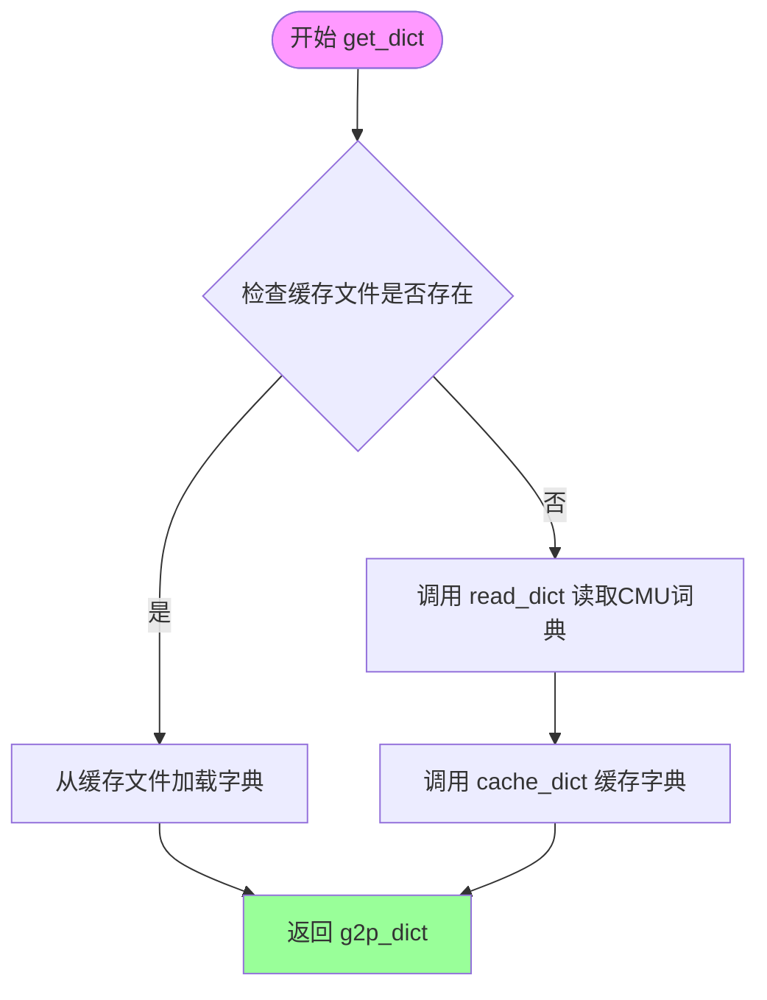
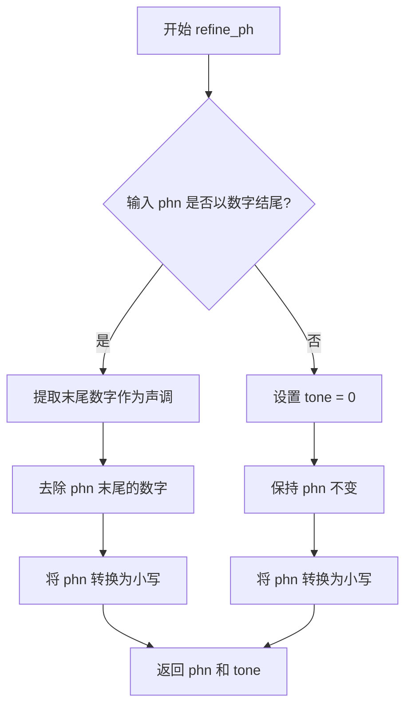
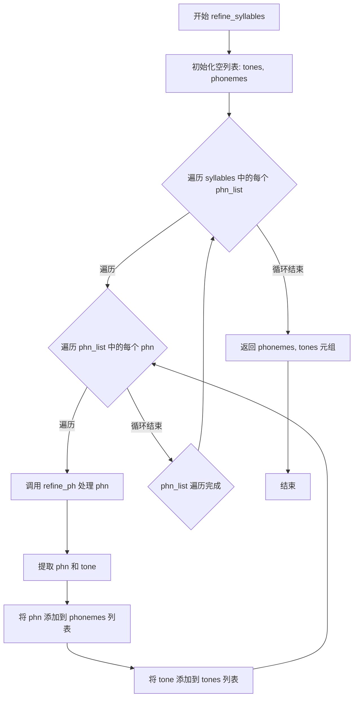
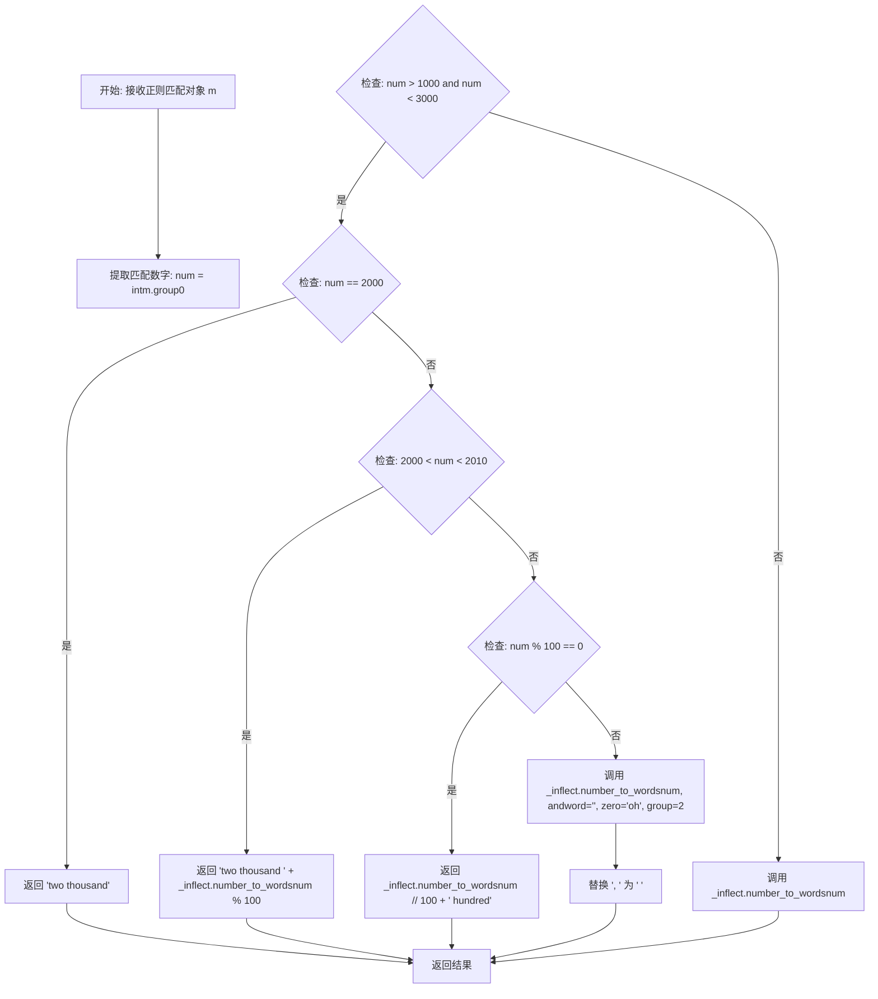
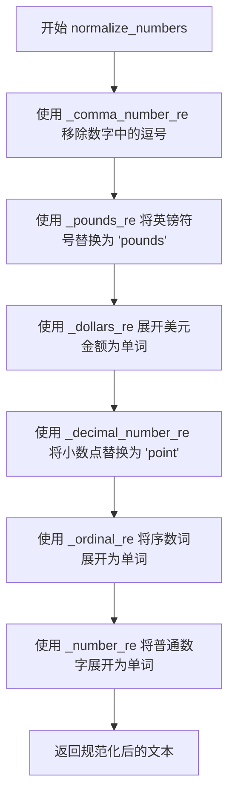
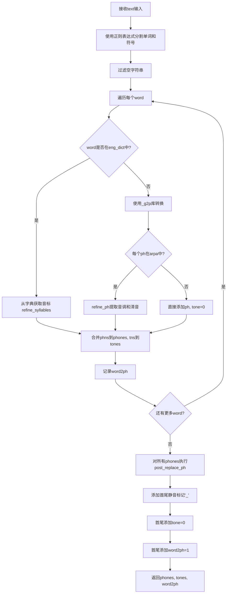
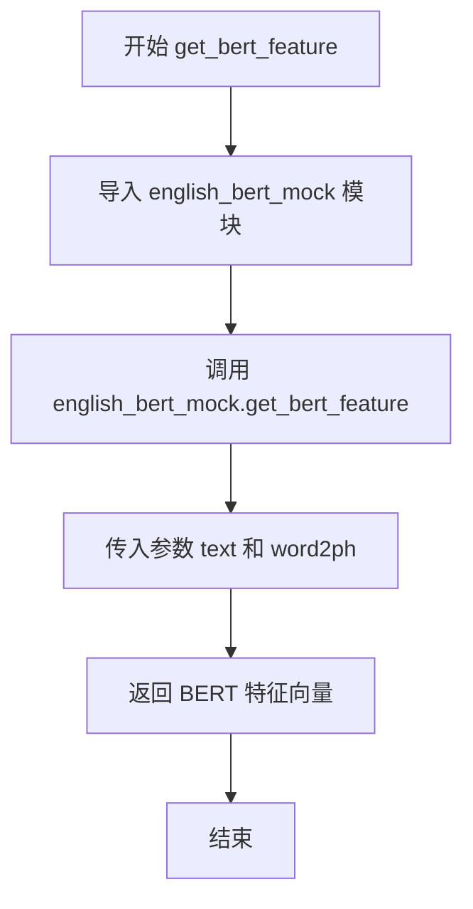

# `Bert-VITS2\onnx_modules\V200\text\english.py` 详细设计文档

这是一个英语文本到音素（Grapheme-to-Phoneme）的转换模块，通过加载CMU发音词典、规范化文本（数字、货币、缩写等）、并使用g2p_en库将文本转换为音素序列，同时处理音调信息，可用于Text-to-Speech (TTS) 系统的前端处理。

## 整体流程



## 类结构

```
无类层次结构（纯函数式模块）
主要模块: g2p_en
├── 工具函数组（正则匹配与替换）
│   ├── _expand_dollars
│   ├── _remove_commas
│   ├── _expand_ordinal
│   ├── _expand_number
│   └── _expand_decimal_point
├── 核心功能函数
│   ├── post_replace_ph
│   ├── read_dict
│   ├── cache_dict
│   ├── get_dict
│   ├── refine_ph
│   ├── refine_syllables
│   ├── normalize_numbers
│   ├── text_normalize
│   ├── g2p
│   └── get_bert_feature
└── 外部依赖
    ├── g2p_en.G2p
    ├── inflect.engine
    └── text.english_bert_mock
```

## 全局变量及字段


### `current_file_path`
    
当前Python文件的目录路径

类型：`str`
    


### `CMU_DICT_PATH`
    
CMU发音字典文件的完整路径

类型：`str`
    


### `CACHE_PATH`
    
CMU字典缓存pickle文件的完整路径

类型：`str`
    


### `_g2p`
    
g2p_en库的分词到音素转换器实例

类型：`G2p`
    


### `arpa`
    
ARPA音素符号集合，用于验证音素有效性

类型：`set`
    


### `eng_dict`
    
从CMU字典加载的英语单词到音素的映射字典

类型：`dict`
    


### `_inflect`
    
inflect引擎实例，用于数字和序数词的文字转换

类型：`inflect.engine`
    


### `_comma_number_re`
    
匹配带逗号的数字的正则表达式

类型：`re.Pattern`
    


### `_decimal_number_re`
    
匹配小数的正则表达式

类型：`re.Pattern`
    


### `_pounds_re`
    
匹配英镑金额的正则表达式

类型：`re.Pattern`
    


### `_dollars_re`
    
匹配美元金额的正则表达式

类型：`re.Pattern`
    


### `_ordinal_re`
    
匹配序数词的正则表达式

类型：`re.Pattern`
    


### `_number_re`
    
匹配整数的正则表达式

类型：`re.Pattern`
    


### `_abbreviations`
    
缩写词到完整形式映射的列表，用于文本规范化

类型：`list`
    


### `_lazy_ipa`
    
IPA音素到lazy IPA映射的正则表达式列表

类型：`list`
    


### `_lazy_ipa2`
    
IPA音素到lazy IPA2映射的正则表达式列表

类型：`list`
    


### `_ipa_to_ipa2`
    
IPA音素到IPA2映射的正则表达式列表

类型：`list`
    


    

## 全局函数及方法


### `post_replace_ph`

该函数用于对音素（phoneme）或文本符号进行后处理替换，将中文标点符号转换为英文标点，并将不在符号表中的未知符号映射为 "UNK"，确保输出的音素序列标准化且符合预期格式。

参数：

-  `ph`：`str`，需要处理的音素或符号

返回值：`str`，处理后的标准化音素或符号

#### 流程图



#### 带注释源码

```python
def post_replace_ph(ph):
    """
    对音素或符号进行后处理替换
    
    参数:
        ph (str): 需要处理的音素或符号
        
    返回值:
        str: 处理后的标准化音素或符号
    """
    # 定义符号替换映射表：将中文标点和其他特殊符号映射为标准英文符号
    rep_map = {
        "：": ",",   # 中文冒号 -> 英文逗号
        "；": ",",   # 中文分号 -> 英文逗号
        "，": ",",   # 中文逗号 -> 英文逗号
        "。": ".",   # 中文句号 -> 英文句号
        "！": "!",   # 中文感叹号 -> 英文感叹号
        "？": "?",   # 中文问号 -> 英文问号
        "\n": ".",   # 换行符 -> 英文句号
        "·": ",",    # 中间点 -> 英文逗号
        "、": ",",   # 中文顿号 -> 英文逗号
        "...": "…",  # 三个点 -> 省略号
        "v": "V",    # 小写v -> 大写V
    }
    
    # 步骤1: 如果输入符号在替换映射表中，则进行替换
    if ph in rep_map.keys():
        ph = rep_map[ph]
    
    # 步骤2: 如果处理后的符号在符号表中，直接返回
    if ph in symbols:
        return ph
    
    # 步骤3: 如果符号不在符号表中，返回未知标记 "UNK"
    if ph not in symbols:
        ph = "UNK"
    
    return ph
```


### `read_dict`

该函数用于从CMU发音字典文件中读取并解析字母到音素的映射关系，构建一个字典数据结构供后续G2P（Grapheme-to-Phoneme）转换使用。

参数：

- 无

返回值：`dict`，返回从CMU字典文件解析的字母到音素映射字典，键为单词（字符串），值为音素列表的列表。

#### 流程图

```mermaid
flowchart TD
    A([开始]) --> B[初始化空字典 g2p_dict]
    B --> C[设置 start_line = 49]
    C --> D[打开 CMU_DICT_PATH 文件]
    D --> E[读取第一行]
    E --> F[设置 line_index = 1]
    F --> G{line 是否存在?}
    G -->|Yes| H{line_index >= start_line?}
    H -->|Yes| I[去除行首尾空白]
    I --> J[按两个空格分割行]
    J --> K[提取单词 word]
    K --> L[按 " - " 分割音节部分]
    L --> M[初始化 g2p_dict[word] 为空列表]
    M --> N{遍历每个音节}
    N -->|Yes| O[按空格分割音素]
    O --> P[将音素列表添加到 g2p_dict[word]]
    P --> N
    N -->|No| Q[line_index + 1]
    Q --> R[读取下一行]
    R --> G
    H -->|No| Q
    G -->|No| S[返回 g2p_dict]
    S --> T([结束])
```

#### 带注释源码

```python
def read_dict():
    """
    从CMU发音字典文件中读取字母到音素的映射关系
    
    Returns:
        dict: 键为单词（str），值为该单词的音素列表的列表（list of list）
              例如: {'HELLO': [['HH', 'AH', 'L', 'OW'], ['HH', 'AH', 'L', 'OW']]}
    """
    # 初始化用于存储字典的空字典
    g2p_dict = {}
    
    # CMU字典文件前48行为注释和说明，从第49行开始为实际数据
    start_line = 49
    
    # 打开CMU发音字典文件
    with open(CMU_DICT_PATH) as f:
        # 读取第一行
        line = f.readline()
        # 初始化行索引为1
        line_index = 1
        
        # 遍历文件的每一行
        while line:
            # 当行号达到起始行时开始解析
            if line_index >= start_line:
                # 去除行首尾的空白字符
                line = line.strip()
                
                # 按两个空格分割，单词在前，音标在后
                word_split = line.split("  ")
                # 提取单词（如 "HELLO"）
                word = word_split[0]

                # 按 " - " 分割多个音节
                syllable_split = word_split[1].split(" - ")
                
                # 初始化该单词的音素列表
                g2p_dict[word] = []
                
                # 遍历每个音节
                for syllable in syllable_split:
                    # 按空格分割得到单个音素列表
                    phone_split = syllable.split(" ")
                    # 将音素列表添加到字典中
                    g2p_dict[word].append(phone_split)

            # 行索引递增
            line_index = line_index + 1
            # 读取下一行
            line = f.readline()

    # 返回构建好的字典
    return g2p_dict
```


### `cache_dict`

该函数负责将构建好的 g2p（grapheme-to-phoneme）字典对象序列化为二进制格式并写入指定路径，实现字典数据的持久化缓存，以便后续快速加载无需重新解析 CMU 词典。

参数：

- `g2p_dict`：`dict`，需要缓存的 g2p 字典，键为单词（字符串），值为对应的音素列表（嵌套列表结构）
- `file_path`：`str`，缓存文件的保存路径，用于指定 pickle 序列化文件的输出位置

返回值：`None`，无返回值。该函数通过 pickle 将字典写入文件，不返回任何数据。

#### 流程图



#### 带注释源码

```python
def cache_dict(g2p_dict, file_path):
    """
    将 g2p 字典序列化为 pickle 格式并保存到指定路径
    
    参数:
        g2p_dict: 需要缓存的 g2p 字典对象
        file_path: 缓存文件的保存路径
    返回:
        None
    """
    # 以二进制写入模式打开目标文件
    # 'wb' 模式确保以二进制格式写入，适合 pickle 序列化
    with open(file_path, "wb") as pickle_file:
        # 使用 pickle.dump 将字典对象序列化并写入文件
        # pickle.dump 会将 Python 对象转换为二进制格式
        # g2p_dict 通常是嵌套字典结构：{word: [[phonemes]]}
        pickle.dump(g2p_dict, pickle_file)
    
    # with 语句自动管理文件关闭，确保资源正确释放
```


### `get_dict`

该函数负责加载CMU发音词典，通过缓存机制提高性能。如果缓存文件存在，则直接从缓存加载；否则读取原始CMU词典文件，进行处理后缓存以供后续使用。

参数：该函数无参数

返回值：`dict`，返回一个字典，将英文单词映射到其音素表示（列表的列表形式）

#### 流程图



#### 带注释源码

```python
def get_dict():
    """
    加载CMU发音词典，使用缓存机制提高性能
    
    工作流程：
    1. 检查是否存在缓存文件(CACHE_PATH)
    2. 如果存在则直接从缓存加载(避免重复解析CMU词典)
    3. 如果不存在则读取原始CMU词典文件并缓存
    
    Returns:
        dict: 字典类型，键为英文单词(大写)，值为该单词的音素列表
              例如: {'HELLO': [['HH', 'AH', 'L', 'OW'], ['HH', 'EH', 'L', 'OW']]}
    """
    # 检查缓存文件是否存在
    if os.path.exists(CACHE_PATH):
        # 缓存存在，从pickle文件加载已处理的词典
        # 这大大加快了后续调用速度，避免重复解析CMU词典文件
        with open(CACHE_PATH, "rb") as pickle_file:
            g2p_dict = pickle.load(pickle_file)
    else:
        # 缓存不存在，调用read_dict函数读取原始CMU词典
        # read_dict会解析cmudict.rep文件并转换为字典格式
        g2p_dict = read_dict()
        # 将读取到的词典缓存到pickle文件
        # 下次调用时可以直接从缓存加载，提升性能
        cache_dict(g2p_dict, CACHE_PATH)

    # 返回最终的发音词典
    return g2p_dict
```

#### 相关全局变量与函数

**全局变量：**

- `CACHE_PATH`：`str`，指向CMU词典的pickle缓存文件路径
- `CMU_DICT_PATH`：`str`，指向原始CMU词典文件路径
- `os`、`pickle`：Python标准库模块，用于文件路径操作和对象序列化

**内部调用的函数：**

- `read_dict()`：无参数，返回`dict`，读取并解析CMU词典原始文件
- `cache_dict(g2p_dict, file_path)`：参数为`dict`和`str`，无返回值，将词典对象序列化到文件


### `refine_ph`

该函数用于处理单个音素（phoneme），从音素中提取声调信息，并将音素转换为小写形式。主要用于G2P（Grapheme-to-Phoneme）转换过程中处理CMU字典中的音素数据。

参数：

- `phn`：`str`，输入的音素字符串，可能包含末尾的数字表示声调（如"AH0"、"EY2"等）

返回值：`(str, int)`，返回元组包含处理后的音素（小写字符串）和提取的声调值（整数，无声调时为0）

#### 流程图



#### 带注释源码

```python
def refine_ph(phn):
    """
    处理单个音素，提取声调信息并转换为小写
    
    参数:
        phn: 输入的音素字符串，可能包含末尾的数字表示声调
             例如: "AH0", "EY2", "B", "S" 等
    
    返回值:
        tuple: (处理后的音素字符串, 声调值)
              - 音素被转换为小写
              - 声调值范围 1-3（如果原音素包含0-2的数字），
                无声调时为 0
    """
    # 初始化声调为0，表示无声调
    tone = 0
    
    # 使用正则表达式检查音素是否以数字结尾
    # \d$ 表示匹配字符串末尾的数字
    if re.search(r"\d$", phn):
        # 提取末尾数字并转换为声调值
        # CMU字典中声调标记: 0=非重音, 1=主要重音, 2=次要重音
        # 转换为声调值时加1，变为 1, 2, 3
        tone = int(phn[-1]) + 1
        
        # 去除音素末尾的数字部分，保留音素本身
        # 例如: "AH0" -> "AH", "EY2" -> "EY"
        phn = phn[:-1]
    
    # 将音素转换为小写并返回
    # CMU字典中的音素通常是大写（如"AH", "EH"）
    # 转换为小写以保持一致性
    return phn.lower(), tone
```


### `refine_syllables`

该函数用于处理音节数据，提取音素（phonemes）和声调（tones）。它遍历输入的音节列表，对每个音素调用`refine_ph`函数进行处理，将处理后的音素和对应的声调分别添加到列表中，最终返回两个列表。

参数：

- `syllables`：`List[List[str]]`，输入的音节列表，每个音节是一个包含音素的列表

返回值：`Tuple[List[str], List[int]]`，返回两个列表——第一个是处理后的音素列表，第二个是对应的声调列表

#### 流程图



#### 带注释源码

```python
def refine_syllables(syllables):
    """
    处理音节列表，提取音素和声调
    
    参数:
        syllables: 音节列表，每个音节是一个音素列表的列表
                   例如: [['AH0', 'B'], ['AH1', 'B']]
    
    返回:
        (phonemes, tones): 元组，包含处理后的音素列表和对应的声调列表
    """
    # 初始化空列表用于存储处理后的声调和音素
    tones = []
    phonemes = []
    
    # 遍历外层音节列表（每个单词可能有多个音节）
    for phn_list in syllables:
        # 遍历每个音节中的所有音素
        for i in range(len(phn_list)):
            # 获取当前音素
            phn = phn_list[i]
            
            # 调用 refine_ph 函数处理音素：
            # 1. 提取末尾的数字作为声调（0,1,2）并转换为 (1,2,3)
            # 2. 将音素转换为小写
            phn, tone = refine_ph(phn)
            
            # 将处理后的音素添加到音素列表
            phonemes.append(phn)
            
            # 将处理后的声调添加到声调列表
            tones.append(tone)
    
    # 返回音素列表和声调列表
    return phonemes, tones
```


### `_expand_dollars`

该函数是一个私有辅助函数，用于将匹配到的美元金额字符串转换为自然语言文字描述。它接收一个正则表达式匹配对象，解析其中的数字部分（包括美元整数部分和美分数部分），并根据数值大小正确使用单数或复数形式（dollar/dollars, cent/cents）。

参数：

- `m`：`re.Match`，正则表达式匹配对象，包含从文本中提取的美元金额字符串（如 "$10.50" 中的 "10.50"）

返回值：`str`，美元金额的文字描述（如 "10 dollars, 50 cents"）

#### 流程图

```mermaid
flowchart TD
    A[开始: 接收匹配对象m] --> B[提取匹配内容: match = m.group(1)]
    B --> C[按.分割字符串: parts = match.split('.']
    C --> D{parts长度>2?}
    D -->|是| E[返回: match + ' dollars']
    D -->|否| F[解析美元部分: dollars = int(parts[0]) if parts[0] else 0]
    F --> G[解析美分部分: cents = int(parts[1]) if len(parts>1 and parts[1] else 0]
    G --> H{dollars>0 且 cents>0?}
    H -->|是| I[确定单位: dollar_unit, cent_unit]
    I --> J[返回: 'dollars dollar_unit, cents cent_unit']
    H -->|否| K{dollars>0?}
    K -->|是| L[确定单位: dollar_unit]
    L --> M[返回: 'dollars dollar_unit']
    K -->|否| N{cents>0?}
    N -->|是| O[确定单位: cent_unit]
    O --> P[返回: 'cents cent_unit']
    N -->|否| Q[返回: 'zero dollars']
```

#### 带注释源码

```python
def _expand_dollars(m):
    """
    将美元金额字符串转换为文字描述
    
    参数:
        m: re.Match对象，包含从文本中通过正则表达式提取的美元金额字符串
        
    返回:
        str: 美元金额的文字描述
    """
    # 从匹配对象中提取捕获组的内容（如 "$10.50" 中的 "10.50"）
    match = m.group(1)
    
    # 按小数点分割字符串，得到美元部分和美分部分
    parts = match.split(".")
    
    # 如果分割后部分超过2个，说明格式异常，直接返回原字符串加"dollars"
    if len(parts) > 2:
        return match + " dollars"  # Unexpected format
    
    # 解析美元整数部分，如果为空则默认为0
    dollars = int(parts[0]) if parts[0] else 0
    
    # 解析美分部分，如果存在且不为空则转换为整数，否则默认为0
    cents = int(parts[1]) if len(parts) > 1 and parts[1] else 0
    
    # 根据金额的不同情况返回相应的文字描述
    if dollars and cents:
        # 既有美元又有美分的情况
        # 单数复数处理：1用单数"dollar/cent"，其他用复数"dollars/cents"
        dollar_unit = "dollar" if dollars == 1 else "dollars"
        cent_unit = "cent" if cents == 1 else "cents"
        return "%s %s, %s %s" % (dollars, dollar_unit, cents, cent_unit)
    elif dollars:
        # 仅有美元，没有美分
        dollar_unit = "dollar" if dollars == 1 else "dollars"
        return "%s %s" % (dollars, dollar_unit)
    elif cents:
        # 仅有美分，没有美元
        cent_unit = "cent" if cents == 1 else "cents"
        return "%s %s" % (cents, cent_unit)
    else:
        # 美元和美分都为0的情况
        return "zero dollars"
```


### `_remove_commas`

这是一个辅助正则表达式替换函数，用于移除数字字符串中的逗号分隔符，将格式化的数字（如 "1,000"）转换为纯数字字符串（"1000"），以便后续处理。

参数：

- `m`：`re.Match`，正则表达式匹配对象，包含需要处理的数字字符串

返回值：`str`，返回移除逗号后的数字字符串

#### 流程图

```mermaid
flowchart TD
    A[开始: 接收Match对象m] --> B[获取分组1的文本 m.group(1)]
    B --> C[调用replace方法移除所有逗号]
    C --> D[返回处理后的字符串]
```

#### 带注释源码

```python
def _remove_commas(m):
    """
    正则表达式替换回调函数：移除数字中的逗号
    
    参数:
        m: re.Match对象，正则表达式匹配结果，包含需要处理的字符串
        
    返回值:
        str: 移除逗号后的字符串
    """
    # m.group(1) 获取正则表达式中第一个捕获组的内容
    # .replace(",", "") 移除所有逗号字符
    return m.group(1).replace(",", "")
```


### `_expand_ordinal`

该函数是文本规范化模块中的一个辅助函数，用于将正则表达式匹配到的英文序数词（如1st、2nd、3rd、4th等）转换为对应的英文单词表达形式（one、two、three、four等）。它作为 `normalize_numbers` 函数中处理序数词的正则表达式替换回调函数使用。

参数：

- `m`：`re.Match`，正则表达式匹配对象，包含从文本中匹配到的序数词（如 "1st", "2nd", "3rd", "4th" 等）

返回值：`str`，将序数词转换为英文单词后的字符串

#### 流程图

```mermaid
flowchart TD
    A[开始] --> B[接收正则匹配对象 m]
    B --> C[调用 m.group(0) 获取匹配的序数词字符串]
    C --> D[调用 _inflect.number_to_words 转换为英文单词]
    D --> E[返回转换后的字符串]
```

#### 带注释源码

```python
def _expand_ordinal(m):
    """
    将匹配到的序数词转换为英文单词表达形式
    
    该函数作为正则表达式替换的回调函数使用，
    将形如 '1st', '2nd', '3rd', '4th' 等序数词
    转换为 'one', 'two', 'three', 'four' 等单词形式
    
    参数:
        m: re.Match 对象，正则表达式 _ordinal_re 匹配到的序数词
        
    返回值:
        str: 转换后的英文单词表达
    """
    # 使用 inflect 库的 number_to_words 方法将数字序数词转换为英文单词
    # m.group(0) 获取整个匹配项（即完整的序数词字符串，如 "1st"）
    return _inflect.number_to_words(m.group(0))
```


### `_expand_number`

该函数是一个私有辅助函数，用于将正则匹配的数字转换为英文文本表示形式。它是 `normalize_numbers` 函数中用于处理阿拉伯数字到英文单词转换的核心逻辑，支持特殊数字（如年份、整百数）的格式化处理。

参数：

-  `m`：`re.Match`，正则表达式匹配对象，包含待转换的数字

返回值：`str`，数字对应的英文文本表示

#### 流程图



#### 带注释源码

```python
def _expand_number(m):
    """
    将正则匹配的数字转换为英文文本表示。
    
    参数:
        m: re.Match对象，正则表达式匹配到的数字字符串
    
    返回:
        str: 数字的英文单词表示
    """
    # 从匹配对象中提取数字并转换为整数类型
    num = int(m.group(0))
    
    # 判断数字是否在1000-3000范围内（用于处理年份和特殊数字）
    if num > 1000 and num < 3000:
        # 处理2000年的特殊情况
        if num == 2000:
            return "two thousand"
        
        # 处理2001-2009之间的年份（如2005 -> "two thousand five"）
        elif num > 2000 and num < 2010:
            return "two thousand " + _inflect.number_to_words(num % 100)
        
        # 处理整百数（如1500 -> "fifteen hundred"）
        elif num % 100 == 0:
            return _inflect.number_to_words(num // 100) + " hundred"
        
        # 处理其他1000-3000之间的数字，使用inflect库转换
        # 参数说明：
        #   andword='': 移除百位和个位之间的"and"（如"one hundred five"而非"one hundred and five"）
        #   zero='oh': 将0读作"oh"而非"zero"
        #   group=2: 将数字分组处理以优化输出格式
        else:
            return _inflect.number_to_words(
                num, andword="", zero="oh", group=2
            ).replace(", ", " ")  # 移除数字间的逗号分隔符
    
    # 处理1000以下或3000及以上的数字，直接转换为英文
    else:
        return _inflect.number_to_words(num, andword="")
```


### `_expand_decimal_point`

将正则匹配到的小数中的小数点（"."）替换为英文单词 " point "，用于将数字小写格式转换为口语化表达。

参数：

- `m`：`re.Match`，正则表达式匹配对象，包含要处理的小数字符串（如 "3.14"）

返回值：`str`，替换后的字符串（如 "3 point 14"）

#### 流程图

```mermaid
flowchart TD
    A[开始] --> B[输入: match对象 m]
    B --> C[调用 m.group1 获取匹配的完整小数字符串]
    C --> D[使用 replace 方法将 \".\" 替换为 \" point \"]
    D --> E[返回转换后的字符串]
```

#### 带注释源码

```python
def _expand_decimal_point(m):
    """
    将正则匹配到的小数中的小数点替换为英文单词 'point'。
    
    参数:
        m: re.Match对象，由正则表达式 _decimal_number_re 匹配产生
        
    返回值:
        str: 将小数点替换为空格加point再加空格后的字符串
             例如: '3.14' -> '3 point 14'
    """
    # group(1) 获取正则表达式中第一个捕获组的内容（即小数点前后的数字）
    # replace(".", " point ") 将小数点替换为 " point " 字符串
    return m.group(1).replace(".", " point ")
```


### `normalize_numbers`

该函数用于将文本中的数字、货币符号和序数词转换为对应的英文单词表示，实现数字的文本规范化。它依次处理逗号分隔的数字、英镑、美元、小数、序数词和普通数字，将其转换为可读的英文单词形式。

参数：

- `text`：`str`，输入的需要进行数字规范化的文本

返回值：`str`，返回已将数字转换为英文单词表示的规范化文本

#### 流程图



#### 带注释源码

```
def normalize_numbers(text):
    # 1. 移除逗号分隔的数字中的逗号 (如 1,234 -> 1234)
    text = re.sub(_comma_number_re, _remove_commas, text)
    
    # 2. 将英镑符号替换为 'pounds' 单词 (如 £100 -> 100 pounds)
    text = re.sub(_pounds_re, r"\1 pounds", text)
    
    # 3. 将美元金额展开为英文单词表示
    #    支持美元和美分的多种形式: $100, $100.50, $1.99 等
    text = re.sub(_dollars_re, _expand_dollars, text)
    
    # 4. 将小数点替换为 'point' 单词 (如 3.14 -> 3 point 14)
    text = re.sub(_decimal_number_re, _expand_decimal_point, text)
    
    # 5. 将序数词展开为英文单词 (如 1st -> first, 2nd -> second)
    text = re.sub(_ordinal_re, _expand_ordinal, text)
    
    # 6. 将普通数字展开为英文单词 (如 100 -> one hundred)
    text = re.sub(_number_re, _expand_number, text)
    
    return text
```


### `text_normalize`

该函数是文本规范化的入口函数，负责将输入文本中的数字、货币、序数词等转换为对应的文字描述，以便后续的语音合成处理。

参数：

- `text`：`str`，需要规范化的原始文本

返回值：`str`，返回规范化处理后的文本

#### 流程图

```mermaid
flowchart TD
    A[开始 text_normalize] --> B[调用 normalize_numbers(text)]
    B --> C{正则匹配处理}
    C --> D[移除数字中的逗号]
    D --> E[扩展英镑货币]
    E --> F[扩展美元货币]
    F --> G[扩展小数点]
    G --> H[扩展序数词]
    H --> I[扩展普通数字]
    I --> J[返回规范化后的文本]
    J --> K[结束]
```

#### 带注释源码

```python
def text_normalize(text):
    """
    文本规范化入口函数
    
    该函数是文本规范化的主要接口，接收原始文本输入，
    通过调用 normalize_numbers 函数将文本中的数字、货币等
    转换为文字描述形式，便于后续语音合成处理。
    
    参数:
        text (str): 需要规范化的原始文本，包含数字、货币符号等
        
    返回:
        str: 规范化处理后的文本，数字已被转换为对应的文字描述
    """
    # 调用数字规范化函数，处理文本中的各类数字格式
    text = normalize_numbers(text)
    # 返回规范化后的文本
    return text
```


### `g2p`

将输入的英文文本转换为音素（phonemes）、声调（tones）以及每个词对应的音素数量的核心函数。该函数首先尝试从CMU发音字典中查找单词对应的音标，若词典中不存在该单词，则使用g2p_en库进行图到音的转换，最后对所有音素进行后处理并添加静音标记。

参数：
- `text`：`str`，需要进行图到音转换的英文文本

返回值：
- `phones`：`list[str]`，转换后的音素列表，首尾包含静音标记"_"
- `tones`：`list[int]`，对应每个音素的声调值，首尾为0
- `word2ph`：`list[int]`，每个词对应的音素数量，首尾为1

#### 流程图



#### 带注释源码

```python
def g2p(text):
    """
    将英文文本转换为音素序列
    
    Args:
        text: 输入的英文文本字符串
        
    Returns:
        phones: 音素列表，首尾包含静音标记"_"
        tones: 声调列表，与phones一一对应
        word2ph: 每个词对应的音素数量列表
    """
    phones = []      # 存储转换后的音素
    tones = []       # 存储对应的声调
    word2ph = []     # 存储每个词对应的音素数量
    
    # 使用正则表达式按标点和空白符分割文本，保留分隔符
    # 例如 "hello, world" -> ["hello", ",", " ", "world"]
    words = re.split(r"([,;.\-\?\!\s+])", text)
    
    # 过滤掉空字符串
    words = [word for word in words if word.strip() != ""]
    
    # 遍历处理每个"词"（包括标点符号）
    for word in words:
        # 尝试将单词转换为大写后在CMU字典中查找
        if word.upper() in eng_dict:
            # 字典中存在该单词，获取其音标和声调
            phns, tns = refine_syllables(eng_dict[word.upper()])
            # 将音素和声调添加到结果列表
            phones += phns
            tones += tns
            # 记录该词对应的音素数量
            word2ph.append(len(phns))
        else:
            # 字典中不存在，使用g2p_en库进行转换
            # filter过滤掉空格字符
            phone_list = list(filter(lambda p: p != " ", _g2p(word)))
            
            # 遍历转换后的每个音素
            for ph in phone_list:
                # 检查音素是否在ARPA音素集合中
                if ph in arpa:
                    # 如果是ARPA音素，提取声调并规范化
                    ph, tn = refine_ph(ph)
                    phones.append(ph)
                    tones.append(tn)
                else:
                    # 非ARPA音素直接添加，声调设为0
                    phones.append(ph)
                    tones.append(0)
            
            # 记录该词对应的音素数量
            word2ph.append(len(phone_list))

    # 对所有音素进行后处理替换（如将中文标点转换为英文）
    phones = [post_replace_ph(i) for i in phones]

    # 添加句首和句尾静音标记
    phones = ["_"] + phones + ["_"]
    # 句首句尾声调设为0
    tones = [0] + tones + [0]
    # 句首句尾词到音素映射设为1
    word2ph = [1] + word2ph + [1]

    return phones, tones, word2ph
```


### `get_bert_feature`

该函数是一个包装函数，用于调用 `english_bert_mock` 模块中的 `get_bert_feature` 方法，获取输入文本的 BERT 特征表示，主要用于将文本转换为与音素对齐的 BERT 嵌入向量。

参数：

- `text`：`str`，输入的英文文本字符串
- `word2ph`：`list[int]`，词到音素数量的映射列表，用于将 BERT 特征与音素进行对齐

返回值：`任意类型`，返回 `english_bert_mock.get_bert_feature` 的返回值，通常为与文本对应的 BERT 特征向量

#### 流程图



#### 带注释源码

```python
def get_bert_feature(text, word2ph):
    """
    获取输入文本的 BERT 特征表示。
    
    这是一个包装函数，实际实现位于 text 模块的 english_bert_mock 对象中。
    该函数主要用于将文本转换为 BERT 嵌入向量，并与音素序列进行对齐。
    
    参数:
        text (str): 输入的英文文本字符串，例如 "Hello world"
        word2ph (list[int]): 词到音素数量的映射列表，用于对齐 BERT 特征与音素
                            例如 [1, 2] 表示第一个词对应1个音素，第二个词对应2个音素
    
    返回:
        任意类型: 返回 BERT 特征向量，具体类型取决于 english_bert_mock 的实现
    """
    # 动态导入 english_bert_mock 模块，避免顶层循环依赖
    from text import english_bert_mock

    # 调用 english_bert_mock 中的实际实现，传入文本和词-音素映射
    return english_bert_mock.get_bert_feature(text, word2ph)
```

## 关键组件


### 字典加载与缓存机制

负责从CMU发音词典文件加载发音字典，并使用pickle进行缓存以提高后续加载速度，包含读取、缓存和加载逻辑。

### 音素后处理模块

对音素进行替换和规范化处理，支持标点符号映射和symbols符号表验证，将未知音素替换为UNK。

### 音素精炼与音调提取

从ARPA音素中提取声调信息，通过正则匹配数字后缀并转换为声调值，同时将音素转换为小写形式。

### 音节序列处理

遍历音节列表中的每个音素列表，调用refine_ph提取音素和声调，返回分离的音素列表和声调列表。

### 数字规范化模块

使用正则表达式匹配并转换数字、货币、序数等文本为单词形式，支持美元、英镑金额展开和小数点处理。

### 主文本规范化函数

整合数字规范化功能，对输入文本进行标准化预处理，为后续G2P转换做准备。

### 核心G2P转换函数

将输入文本转换为音素序列和声调数组，支持CMU词典查询和g2p_en库 fallback 处理，输出带有起始和结束标记的完整音素序列。

### BERT特征提取接口

调用english_bert_mock模块获取文本的BERT特征表示，建立文本与声学模型之间的桥梁。

### 词典数据

预加载的CMU发音词典缓存数据，包含英文单词到音素序列的映射关系。

### G2P引擎实例

g2p_en库的GraphemeToPhoneme转换器实例，用于处理词典中不存在的单词。

### 正则表达式模式集

用于数字、货币、序数等文本模式匹配的正则表达式集合，支持文本规范化处理。

### IPA映射规则

ARPA音素到IPA音素的转换映射表，支持标准IPA、懒加载IPA和IPA2三种格式的音素转换。

## 问题及建议


### 已知问题

- **硬编码的起始行号**：`read_dict()` 函数中 `start_line = 49` 是硬编码的，如果 CMU 字典文件格式发生变化或版本更新，该值需要手动修改，缺乏灵活性。
- **文件解析缺乏错误处理**：`read_dict()` 使用 `line.split("  ")` 假设文件格式完全正确，若文件格式异常（如空行、格式不统一）可能导致 `IndexError` 或其他异常。
- **缓存机制存在安全隐患**：使用 `pickle` 序列化缓存词典，pickle 可执行任意代码，存在安全风险，建议使用更安全的 JSON 或 msgpack 替代。
- **导入语句位置不规范**：`import inflect` 位于函数定义之后，而 `import pickle`、`import os` 等位于文件开头，导入顺序混乱影响可读性。
- **正则表达式重复编译**：`g2p()` 函数中 `re.split(r"([,;.\-\?\!\s+])", text)` 每次调用都会重新编译正则表达式，未预编译降低性能。
- **未使用的代码**：`text_normalize()` 函数仅简单封装 `normalize_numbers()`，未增加任何额外逻辑；`_lazy_ipa`、`_lazy_ipa2`、`_ipa_to_ipa2` 列表定义后未被任何函数使用。
- **重复的转换规则**：`_lazy_ipa` 和 `_lazy_ipa2` 中都包含 `("r", "ɹ")`、`("ð", "z")`、`("θ", "s")` 等相同映射，存在冗余。
- **动态导入缺乏保护**：`get_bert_feature()` 函数中直接 `from text import english_bert_mock`，若模块导入失败会抛出异常，没有异常处理。
- **全局变量初始化顺序依赖**：`eng_dict = get_dict()` 在模块加载时执行，若文件不存在或读取失败会导致整个模块无法导入，影响其他功能。
- **ARPA 音素集合硬编码**：`arpa` 集合中的音素手动列出，未从 `g2p_en` 模块动态获取，可能与实际使用的 G2P 模型音素集不同步。

### 优化建议

- 将 `start_line` 改为动态检测（例如跳过注释行直到数据行），或提供配置文件管理。
- 在 `read_dict()` 中添加 `try-except` 异常捕获和空行检查，提高健壮性。
- 替换 pickle 为 JSON 或 msgpack 等安全序列化方式，并添加缓存版本号或过期机制。
- 整理导入语句至文件头部，并按标准库、第三方库、本地模块分组。
- 预编译 `g2p()` 中使用的正则表达式为模块级常量，避免重复编译开销。
- 移除未使用的 `text_normalize()` 函数或为其添加实际功能；删除未引用的 `_lazy_ipa`、`_lazy_ipa2`、`_ipa_to_ipa2` 变量。
- 合并 `_lazy_ipa` 和 `_lazy_ipa2` 中的重复规则，消除冗余。
- 为 `get_bert_feature()` 中的动态导入添加 `try-except` 或使用依赖注入方式。
- 延迟 `eng_dict` 的加载或将其改为懒加载模式，避免模块加载时的 I/O 操作失败。
- 考虑从 `g2p_en.G2p` 实例中动态获取音素集，或从权威数据源加载 `arpa` 集合以保持一致性。

## 其它


### 设计目标与约束

**设计目标**：将输入的英文文本转换为音素序列（phonemes）、声调（tones）以及词到音素的映射（word2ph），为语音合成系统提供文本预处理能力。

**约束条件**：
- 主要支持英文文本处理
- 依赖于CMU发音词典作为主要查找源
- 对于词典中不存在的词，调用g2p_en库进行推测
- 输出格式需适配下游语音合成模型的输入要求（ phones以"_"开头和结尾，tones和word2ph添加起始/结束标记）

### 错误处理与异常设计

**文件读取异常**：
- `CMU_DICT_PATH` 或 `CACHE_PATH` 不存在时，`read_dict()` 和 `get_dict()` 会抛出 `FileNotFoundError`
- 建议增加文件存在性检查，词典加载失败时返回空字典或使用备用方案

**词典格式异常**：
- `read_dict()` 假设CMU词典文件格式固定（从第49行开始），格式不符会导致 `IndexError` 或 `KeyError`
- `word_split = line.split("  ")` 假设双空格分隔，若格式变化会解析失败

**正则表达式处理**：
- `_expand_dollars()` 中 `int(parts[0])` 和 `int(parts[1])` 可能抛出 `ValueError`（非数字字符串）
- `_expand_number()` 中 `int(m.group(0))` 可能抛出 `ValueError`

**g2p_en库异常**：
- 若 `g2p_en.G2p()` 初始化失败或返回非法音素，代码无捕获机制

### 数据流与状态机

**主数据流**：
```
输入文本 (text)
    ↓
normalize_numbers() → 数字/货币/序数规范化
    ↓
text_normalize() → 文本规范化
    ↓
g2p() → 分词 → 查词典/调用g2p_en → refine_syllables() → refine_ph()
    ↓
post_replace_ph() → 音素后处理
    ↓
添加起止标记 (_)
    ↓
输出: (phones, tones, word2ph)
```

**关键状态**：
1. **初始态**：模块加载，词典缓存初始化（`eng_dict = get_dict()`）
2. **查词典态**：对每个单词查CMU词典
3. **推断态**：词典未命中，调用g2p_en库推断发音
4. **规范化态**：音素和声调提取与规范化
5. **后处理态**：标点符号替换和UNK处理

### 外部依赖与接口契约

**外部依赖**：
| 依赖库 | 版本要求 | 用途 |
|--------|----------|------|
| g2p_en | 最新版 | 词典未命中时的音素推断 |
| inflect | 最新版 | 数字/序数转英文单词 |
| pickle | Python标准库 | 词典缓存序列化 |
| re | Python标准库 | 正则表达式处理 |
| os | Python标准库 | 文件路径处理 |
| symbols | 本地模块 | 有效音素符号集合 |

**接口契约**：
- `g2p(text: str) -> tuple(list[str], list[int], list[int])`：输入任意英文文本，返回(音素列表, 声调列表, 词到音素映射列表)
- `get_dict() -> dict`：返回CMU词典（已加载或从缓存读取）
- `normalize_numbers(text: str) -> str`：返回数字规范化后的文本
- `get_bert_feature(text: str, word2ph: list[int]) -> Any`：BERT特征提取（依赖english_bert_mock模块）

### 性能考虑与优化空间

**当前性能瓶颈**：
- `read_dict()` 每次调用需逐行读取并解析整个CMU词典文件（约13万词条）
- `g2p()` 中 `list(filter(lambda p: p != " ", _g2p(word)))` 每次调用g2p_en可能较慢
- 正则表达式在 `g2p()` 的 `re.split()` 每次调用都重新编译

**优化建议**：
- 将正则表达式预编译为模块级常量（当前 `_comma_number_re` 等已预编译，但 `g2p()` 中的分词正则未预编译）
- 考虑增加词典缓存的热失效机制或LRU缓存
- 对高频词可增加内存缓存层
- `refine_syllables()` 存在重复遍历，可合并循环

### 安全性考虑

**输入验证**：
- 无输入类型检查，`g2p(None)` 会导致异常
- 无输入长度限制，超长文本可能导致内存问题
- 无特殊字符过滤，可能导致正则表达式ReDoS攻击

**路径安全**：
- `CMU_DICT_PATH` 和 `CACHE_PATH` 使用 `__file__` 相对路径，安全
- 但 `os.path.join()` 未验证路径遍历攻击（当前场景不涉及用户输入路径）

### 测试策略建议

**单元测试**：
- `post_replace_ph()` 边界值测试（空字符串、UNK符号）
- `refine_ph()` 声调提取测试（有数字后缀/无数字后缀）
- `normalize_numbers()` 各种数字格式测试（货币、序数、小数）
- `g2p()` 主流场景测试（词典命中/未命中、混合文本）

**集成测试**：
- 完整流程测试：输入文本 → 输出格式验证
- 缓存机制测试：首次加载 vs 缓存加载结果一致性

### 使用示例

```python
# 基本用法
phones, tones, word2ph = g2p("Hello world")
# phones: ['_', 'HH', 'AH', 'L', 'OW', 'W', 'ER', 'L', 'D', '_']
# tones: [0, 0, 0, 0, 0, 0, 0, 0, 0, 0]
# word2ph: [1, 2, 1, 1, 1, 1, 1, 1, 1, 1]

# 数字文本
phones, tones, word2ph = g2p("I have 123 apples")
# 123会被扩展为 "one hundred twenty three"

# 混合文本
phones, tones, word2ph = g2p("The price is $5.99.")
```

### 配置信息

**内置配置**：
- `CMU_DICT_PATH`：CMU词典文件路径（相对路径）
- `CACHE_PATH`：词典缓存文件路径（pickle格式）
- `arpa`：ARPA音素集合（用于g2p_en结果过滤）
- `_abbreviations`：缩写词扩展映射（18项）
- `_lazy_ipa` / `_lazy_ipa2`：IPA音标简化映射（用于不同口音变体）
- `_ipa_to_ipa2`：IPA到IPA2的映射

**可配置项**（当前硬编码，建议提取）：
- 起始/结束标记符号（当前固定为 "_"）
- 声调默认值（当前为 0）
- 词典起始行号（当前为 49）


    