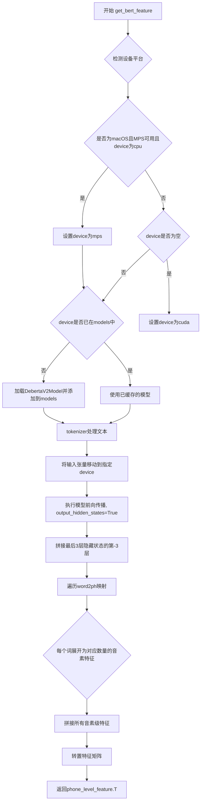

# `Bert-VITS2\onnx_modules\V200\text\english_bert_mock.py` 详细设计文档

基于DebertaV2模型的文本特征提取模块，支持多设备（CPU/MPS/CUDA）推理，根据文本和词到音素的映射关系提取音素级别的特征向量，主要用于语音合成等场景的文本特征处理

## 整体流程

```mermaid
graph TD
    A[开始 get_bert_feature] --> B[检查平台和设备]
    B --> C{darwin + MPS可用 + CPU?}
    C -- 是 --> D[device = mps]
    C -- 否 --> E{device为空?}
    E -- 是 --> F[device = cuda]
    E -- 否 --> G[保持原device]
    D --> H{device在models中?}
    F --> H
    G --> H
H -- 否 --> I[加载模型到device]
H -- 是 --> J[使用已缓存模型]
I --> J
J --> K[tokenizer编码文本]
K --> L[inputs移到device]
L --> M[模型前向传播]
M --> N[提取hidden_states[-3:-2]]
N --> O[遍历word2ph映射]
O --> P[重复特征扩展]
P --> Q[concat所有特征]
Q --> R[返回特征转置]
```

## 类结构

```
模块级
└── 全局函数: get_bert_feature
    ├── 全局变量: LOCAL_PATH
    ├── 全局变量: tokenizer
    └── 全局变量: models
```

## 全局变量及字段


### `LOCAL_PATH`
    
Deberta模型文件本地路径

类型：`str`
    


### `tokenizer`
    
全局tokenizer实例，已预加载

类型：`DebertaV2Tokenizer`
    


### `models`
    
模型缓存字典，键为设备名，值为对应device的模型实例

类型：`dict`
    


    

## 全局函数及方法


### `get_bert_feature`

该函数用于从预训练的 DeBERTa-v3-large 模型中提取文本的音素级别特征向量，通过获取隐藏状态并根据词到音素的映射关系将词级特征展开为音素级特征。

参数：

- `text`：`str`，待处理的输入文本
- `word2ph`：`list[int]` 或 `torch.Tensor`，词到音素数量的映射数组，用于将词级特征展开为音素级特征
- `device`：`str`，计算设备，默认为 `config.bert_gen_config.device`，支持 cpu/mps/cuda

返回值：`torch.Tensor`，形状为 `(特征维度, 音素数量)` 的特征矩阵，表示音素级别的特征向量

#### 流程图



#### 带注释源码

```python
def get_bert_feature(text, word2ph, device=config.bert_gen_config.device):
    """
    从DeBERTa模型提取文本的音素级别特征向量
    
    参数:
        text: 输入文本字符串
        word2ph: 词到音素数量的映射数组
        device: 计算设备, 默认为配置中的设备
    
    返回:
        音素级别的特征矩阵, 形状为(特征维度, 音素数量)
    """
    # 如果在macOS平台且MPS可用且当前device为cpu, 则自动切换到mps设备
    if (
        sys.platform == "darwin"
        and torch.backends.mps.is_available()
        and device == "cpu"
    ):
        device = "mps"
    
    # 如果未指定device, 默认使用cuda
    if not device:
        device = "cuda"
    
    # 根据device缓存模型, 避免重复加载
    if device not in models.keys():
        models[device] = DebertaV2Model.from_pretrained(LOCAL_PATH).to(device)
    
    # 禁用梯度计算以节省显存和计算资源
    with torch.no_grad():
        # 使用tokenizer将文本转换为模型输入
        inputs = tokenizer(text, return_tensors="pt")
        
        # 将所有输入张量移动到指定设备
        for i in inputs:
            inputs[i] = inputs[i].to(device)
        
        # 执行模型前向传播, 获取所有隐藏状态
        res = models[device](**inputs, output_hidden_states=True)
        
        # 提取倒数第3层的隐藏状态(-3:-2即倒数第3层), 并在最后一维拼接
        # 结果形状: (batch, seq_len, hidden_dim)
        res = torch.cat(res["hidden_states"][-3:-2], -1)[0].cpu()
    
    # word2phone保存词到音素的映射关系
    word2phone = word2ph
    
    # 用于存储每个音素的特征
    phone_level_feature = []
    
    # 遍历每个词, 根据其对应的音素数量重复特征
    for i in range(len(word2phone)):
        # 将第i个词的隐藏状态重复word2phone[i]次(每个音素一个)
        repeat_feature = res[i].repeat(word2phone[i], 1)
        phone_level_feature.append(repeat_feature)
    
    # 在维度0上拼接所有音素级特征
    # 结果形状: (总音素数, 特征维度)
    phone_level_feature = torch.cat(phone_level_feature, dim=0)
    
    # 转置以匹配后续处理需要的形状: (特征维度, 总音素数)
    return phone_level_feature.T
```

## 关键组件


### 模型加载与缓存机制

使用字典缓存已加载的模型，支持按设备（cpu/cuda/mps）分别缓存，实现模型的延迟加载和复用，避免重复加载模型带来的性能开销。

### 设备自动适配

自动检测并选择运行设备：优先使用MPS（Apple Silicon），其次CUDA，最后CPU。实现跨平台兼容性，特别针对Mac平台的MPS加速优化。

### DeBERTa特征提取器

调用DeBERTa-v3-large模型的前向传播，配置output_hidden_states=True获取所有隐藏层，选取倒数第三层（-3:-2）作为输出特征，用于TTS系统的文本表示。

### 词级到电话级特征映射

将词级别的隐藏状态特征按照word2ph（词到音素数量映射）展开为电话级别特征，通过repeat操作复制特征向量以匹配每个音素的时长需求。

### 文本预处理管道

使用DebertaV2Tokenizer将输入文本转换为PyTorch张量，并将张量移动到指定设备，为模型推理准备输入数据。

### 全局模型缓存字典

使用字典数据结构存储不同设备上的模型实例，键为设备字符串，值为对应的DebertaV2Model实例，实现模型状态的全局管理。


## 问题及建议


### 已知问题

- **全局状态管理风险**：`models` 全局字典无线程安全保护，多线程并发调用可能导致竞态条件；模型缓存无上限，长期运行可能引发内存泄漏
- **设备检测逻辑缺陷**：代码仅当 `device == "cpu"` 时才检查 MPS 可用性，但逻辑顺序不当可能导致设备选择不符合预期
- **模型重复加载**：`DebertaV2Model.from_pretrained()` 在不同设备间切换时会重新加载模型权重，未实现模型实例复用
- **输入验证缺失**：未对 `text` 和 `word2ph` 参数进行类型校验和边界检查，可能导致运行时错误
- **硬编码路径**：模型路径 `./bert/deberta-v3-large` 硬编码，破坏配置灵活性和可移植性
- **资源释放机制缺失**：模型加载后无显式释放接口，长期调用会增加 GPU 显存占用
- **断言被注释**：`assert len(word2phone) == len(text)+2` 被注释，表明输入长度一致性未得到保证
- **无错误处理**：tokenization 和模型推理失败时无异常捕获和传播机制

### 优化建议

- 引入 `threading.Lock` 或使用单例模式保护 `models` 缓存的并发访问
- 完善设备选择逻辑：优先检测 CUDA，其次 MPS，最后 CPU；增加设备参数校验
- 优化模型缓存策略：使用 `LRUCache` 或手动实现缓存淘汰机制
- 增加输入验证函数：`text` 应为非空字符串，`word2ph` 应为正整数列表且长度与文本 token 数匹配
- 将模型路径提取为配置项或函数参数，支持动态传入
- 添加 `cleanup()` 方法用于显式释放模型资源
- 恢复并完善断言逻辑，确保 `word2ph` 与 token 序列长度一致
- 在关键路径添加 `try-except` 捕获 `OSError`（模型加载失败）和 `RuntimeError`（推理异常），并记录日志

## 其它


### 设计目标与约束

本模块的设计目标是实现一个高效的文本到语音特征的提取功能，将输入的文本字符串转换为phone级别的特征向量，供后续语音合成模型使用。约束条件包括：1) 必须支持CPU、CUDA、MPS三种计算设备；2) 模型文件存储在本地指定路径；3) 输入文本长度需要与word2phone映射长度匹配；4) 需要保持与transformers库的版本兼容性。

### 错误处理与异常设计

代码中主要存在以下异常场景及处理方式：1) 设备获取异常：当MPS可用但指定device为"cpu"时，代码会自动切换到"mps"；当device为空时默认使用"cuda"；2) 模型加载异常：模型文件不存在或损坏时会抛出异常，需要确保LOCAL_PATH路径下模型文件完整；3) 分词异常：输入text为空或格式不正确时tokenizer可能返回异常；4) 设备不匹配异常：inputs移至device时如果tensor维度与device不兼容会报错。建议添加try-except块捕获具体异常类型，并添加日志记录便于排查。

### 数据流与状态机

数据流处理流程如下：1) 外部调用get_bert_feature(text, word2ph, device)；2) 设备协商：检查平台和MPS可用性，确定最终device；3) 模型加载/缓存：根据device获取或加载模型到对应设备；4) 分词处理：tokenizer对text进行分词，返回input_ids、attention_mask等；5) 设备迁移：将tokenizer输出的tensor移至目标device；6) 模型推理：调用DebertaV2Model获取hidden states；7) 特征提取：取倒数第三层hidden state，拼接最后维度；8) 特征扩展：根据word2phone映射，将word级特征扩展为phone级特征；9) 输出：返回转置后的phone级特征矩阵。状态机主要涉及模型缓存状态（models字典）和设备状态管理。

### 外部依赖与接口契约

外部依赖包括：1) torch：深度学习框架，需要CUDA或MPS支持；2) transformers：DebertaV2Model和DebertaV2Tokenizer；3) config模块：获取bert_gen_config.device配置。接口契约方面：get_bert_feature函数接收text（str类型）、word2ph（list[int]类型，标识每个word对应的phone数量）、device（str类型，可选）三个参数；返回torch.Tensor类型，形状为(特征维度, phone总数)的矩阵。调用方需确保text分词后的word数量与word2ph长度一致。

### 性能考虑与优化建议

当前实现存在以下性能优化空间：1) 模型缓存机制：当前使用全局字典缓存模型，但首次加载较慢，建议添加模型加载进度提示；2) 推理优化：可启用torch.compile或使用fp16推理加速；3) 批处理支持：当前仅支持单句处理，建议添加batch处理能力；4) 内存管理：模型长期驻留显存，建议添加模型卸载机制；5) feature重复操作：使用repeat操作效率较低，可考虑使用torch.repeat_interleave优化。

### 安全性考虑

1) 模型文件安全：LOCAL_PATH指向本地模型，需确保路径安全，防止路径遍历攻击；2) 输入验证：建议对text和word2ph进行长度和类型校验，防止异常输入导致显存溢出；3) 设备安全：device参数未做严格校验，建议添加白名单验证；4) 依赖安全：transformers库需从可信源下载，防止供应链攻击。

### 配置管理

配置通过config模块的bert_gen_config.device获取，默认为"cpu"。建议将LOCAL_PATH、模型版本号、特征层选择(-3:-2)等参数纳入配置管理，便于不同环境切换。当前硬编码的模型路径和特征层位置不利于维护，应提取为配置项。

### 版本兼容性

代码依赖的transformers版本需与DebertaV2Model兼容，建议锁定requirements.txt中transformers版本。torch版本需支持MPS后端（torch>=1.12.0）。DebertaV2Tokenizer的API在不同版本间可能有细微差异，需进行版本适配测试。

### 部署注意事项

1) 模型文件部署：需预先下载DebertaV2模型到./bert/deberta-v3-large目录；2) 磁盘空间：Deberta-v3-large模型约1.5GB，需确保存储空间充足；3) 显存要求：模型加载需约3GB显存，推理时需额外预留输入输出空间；4) 容器化部署：需安装对应版本的torch和transformers，MAC MPS支持需要特定镜像；5) 首次加载延迟：模型首次加载时间较长，建议在服务启动时预热。

### 使用示例

```python
# 基本用法
text = "Hello world"
word2ph = [2, 3]  # "Hello"对应2个phone，"world"对应3个phone
features = get_bert_feature(text, word2ph)
print(features.shape)  # 输出特征维度 x 5

# 指定设备
features = get_bert_feature(text, word2ph, device="cuda")

# 批量处理（需自行实现）
texts = ["Hello", "World"]
word2phs = [[2], [3]]
```

### 常见问题排查

1) 模型加载失败：检查./bert/deberta-v3-large路径下是否包含config.json、pytorch_model.bin等文件；2) MPS不可用：确认MAC系统版本和torch版本是否支持MPS；3) 显存不足：减小batch size或使用较小模型；4) 输出维度不匹配：检查text分词后word数量是否与word2ph长度一致；5) 设备兼容性问题：确认tensor已在正确设备上操作。


    