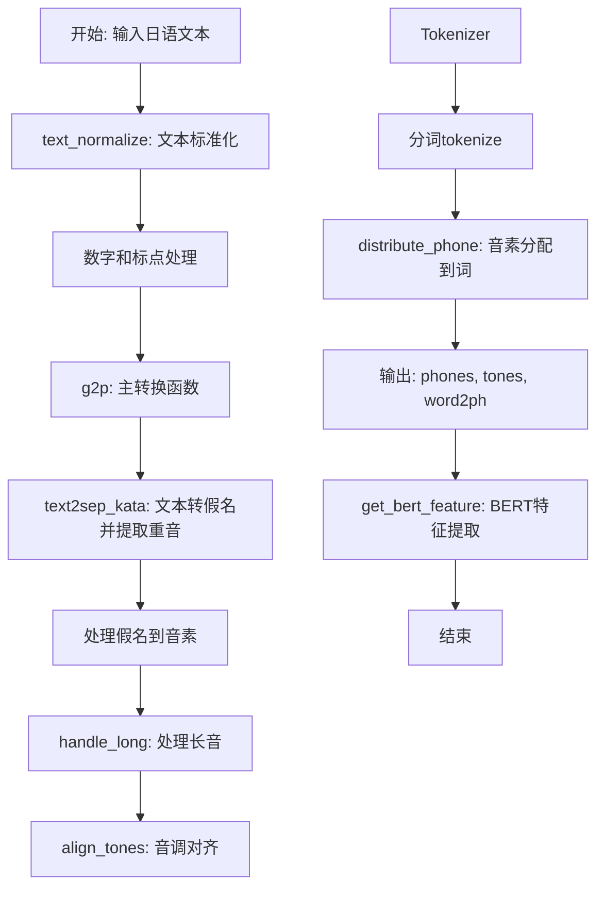
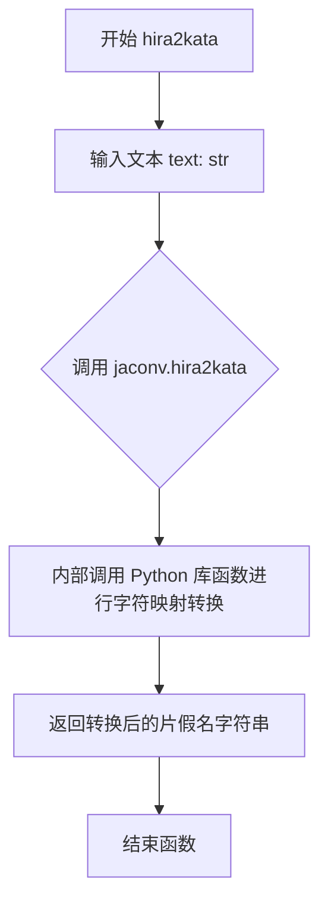
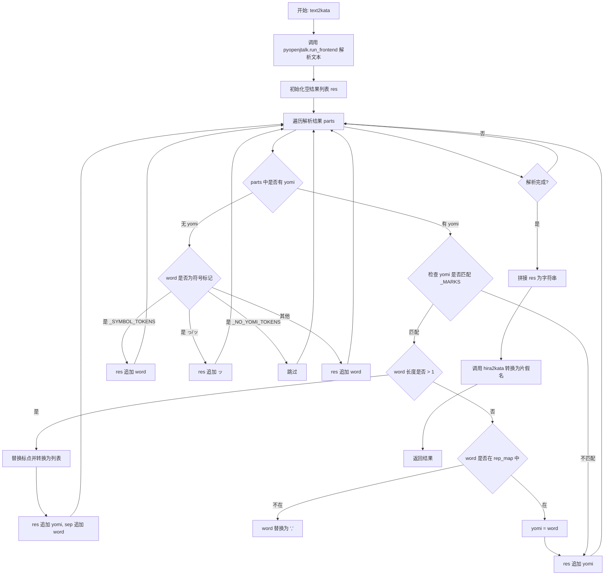
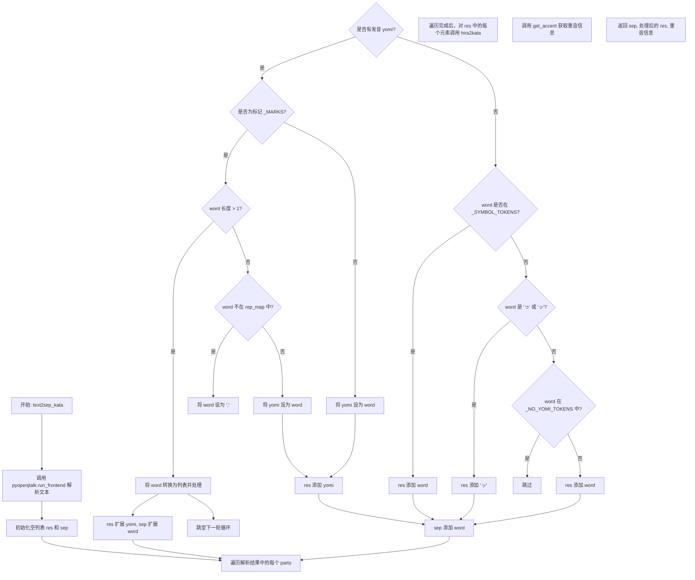
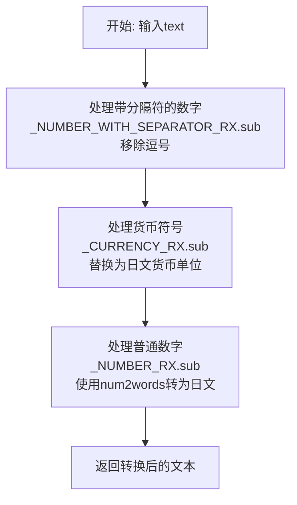
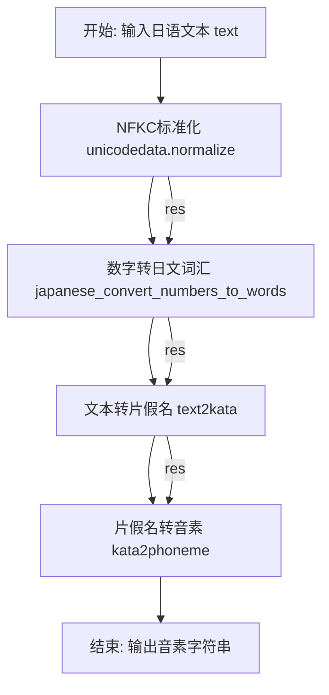
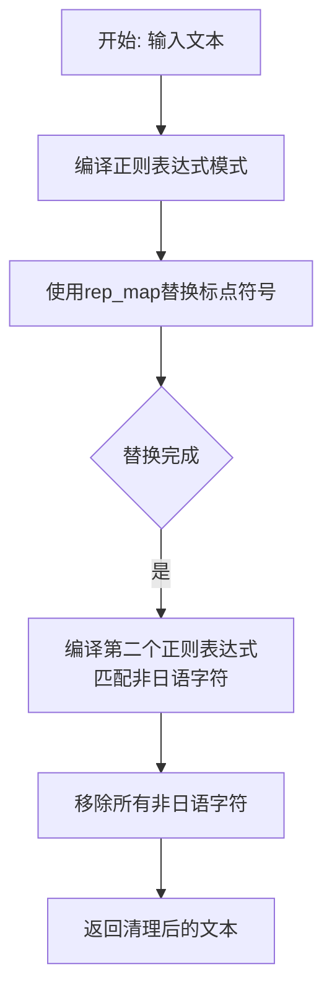
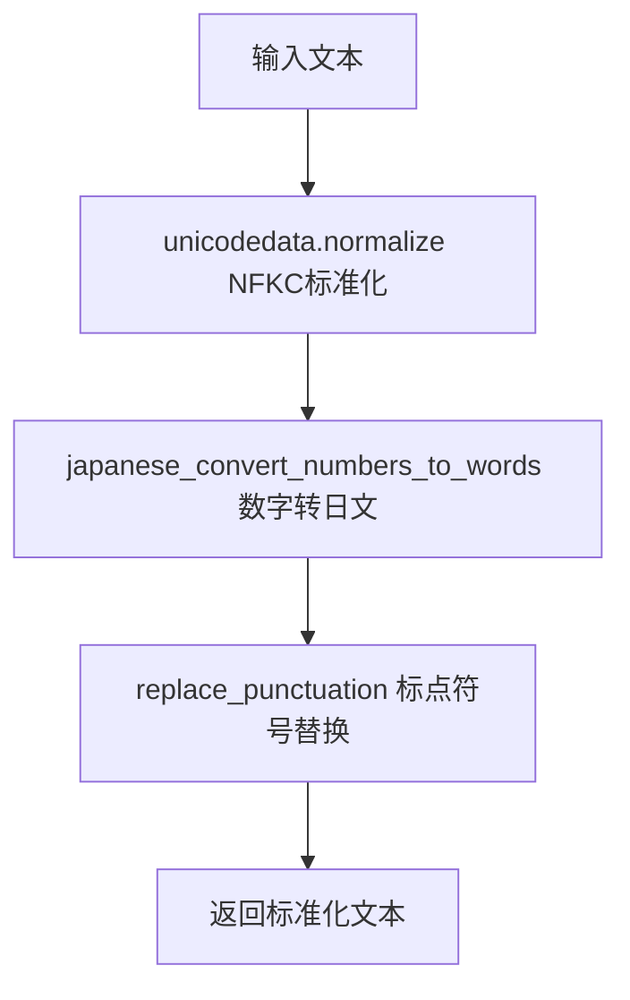
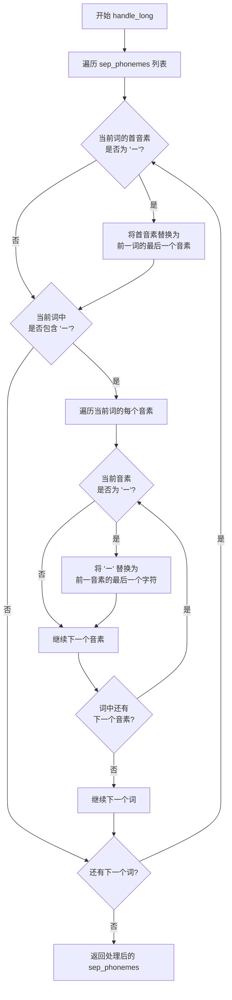

# `Bert-VITS2\onnx_modules\V200\text\japanese.py` 详细设计文档

该代码是一个日语文本转音素（Text-to-Phoneme）转换工具，主要功能是将日语文本转换为兼容Julius语音识别工具包的音素序列，支持数字、标点符号转换，提取重音信息，并生成与BERT特征对齐的音素和语调标注。

## 整体流程



## 类结构

```
Global Functions (模块级函数)
├── text2kata / text2sep_kata (假名转换)
├── kata2phoneme (假名转音素)
├── get_accent (重音提取)
├── japanese_convert_numbers_to_words (数字转日文)
├── japanese_convert_alpha_symbols_to_words (字母转日文)
├── replace_punctuation / text_normalize (文本标准化)
├── distribute_phone / handle_long / align_tones (音素处理)
└── g2p (主入口函数)
```

## 全局变量及字段


### `_MARKS`
    
用于匹配非日文字符的正则表达式模式

类型：`re.Pattern`
    


### `_SYMBOL_TOKENS`
    
符号token集合，包含常见的日语标点符号

类型：`set`
    


### `_NO_YOMI_TOKENS`
    
无读音符号集合，包含括号类符号

类型：`set`
    


### `_ALPHASYMBOL_YOMI`
    
字母符号到日文读音的映射字典，用于将英文字母和希腊字母转换为日文发音

类型：`dict`
    


### `_NUMBER_WITH_SEPARATOR_RX`
    
带分隔符数字的正则表达式，用于匹配如1,234这样的数字

类型：`re.Pattern`
    


### `_CURRENCY_MAP`
    
货币符号映射字典，将货币符号映射到对应的日文单位

类型：`dict`
    


### `_CURRENCY_RX`
    
货币正则表达式，用于匹配货币符号和数字的组合

类型：`re.Pattern`
    


### `_NUMBER_RX`
    
数字正则表达式，用于匹配整数和小数

类型：`re.Pattern`
    


### `rep_map`
    
标点符号替换映射表，用于将各种标点符号统一转换为简单符号

类型：`dict`
    


### `tokenizer`
    
BERT日文分词器实例，用于对日文文本进行分词处理

类型：`AutoTokenizer`
    


    

## 全局函数及方法


### `kata2phoneme`

将输入的片假名文本转换为音素列表，支持处理延长音符号「ー」和特殊标记符号，并使用 pyopenjtalk 进行假名到音素的转换。

参数：

-  `text`：`str`，待转换的片假名文本

返回值：`list`，音素字符串列表

#### 流程图

```mermaid
flowchart TD
    A[开始: 输入 text] --> B{text是否为空或仅空格}
    B -->|是| B1[返回空列表]
    B -->|否| C{text == 'ー'}
    C -->|是| D[返回 ['ー']]
    C -->|否| E{text是否以'ー'开头}
    E -->|是| F[返回 ['ー'] + kata2phoneme[text[1:]]]
    E -->|否| G{检查text是否匹配_MARKS}
    G -->|是| H[将text[0]加入res<br/>text = text[1:]]
    H --> G
    G -->|否| I{text是否以'ー'开头}
    I -->|是| J{prev存在}
    J -->|是| K[将prev[-1]加入res<br/>text = text[1:]]
    J -->|否| L[text = text[1:]]
    K --> I
    L --> I
    I -->|否| M[调用pyopenjtalk.g2p转换<br/>小写化、cl→q、分割空格]
    M --> N[将转换结果加入res<br/>break退出循环]
    N --> O[返回res]
```

#### 带注释源码

```
def kata2phoneme(text: str) -> str:
    """Convert katakana text to phonemes."""
    # 1. 去除首尾空白
    text = text.strip()
    
    # 2. 处理特殊情况：仅包含延长音符号'ー'
    if text == "ー":
        return ["ー"]
    
    # 3. 处理以延长音符号开头的情况（递归处理）
    elif text.startswith("ー"):
        return ["ー"] + kata2phoneme(text[1:])
    
    # 4. 初始化结果列表
    res = []
    prev = None
    
    # 5. 主循环：逐字符处理文本
    while text:
        # 5.1 处理标点符号和非日语字符（匹配_MARKS正则）
        if re.match(_MARKS, text):
            res.append(text)      # 保留标点符号
            text = text[1:]        # 跳过当前字符
            continue
        
        # 5.2 处理文本中间的延长音符号'ー'
        if text.startswith("ー"):
            if prev:
                # 延长前一个音素（取前一个音素的最后一个）
                res.append(prev[-1])
            text = text[1:]        # 跳过'ー'
            continue
        
        # 5.3 使用pyopenjtalk进行假名到音素转换
        # - pyopenjtalk.g2p(): 将假名文本转换为音素序列
        # - .lower(): 转换为小写
        # - .replace("cl", "q"): 将闭塞音cl替换为q（Julius语音识别格式）
        # - .split(" "): 按空格分割为音素列表
        res += pyopenjtalk.g2p(text).lower().replace("cl", "q").split(" ")
        break  # 转换完成后退出循环
    
    # 6. 返回音素列表
    return res
```


### `hira2kata`

该函数是日语文本处理管道中的一个基础转换工具，专门用于将输入文本中的平假名字符转换为对应的片假名字符，实现日语字符系统的规范化处理，是后续语音合成或音素分析的前置步骤。

参数：

- `text`：`str`，需要进行平假名到片假名转换的输入文本

返回值：`str`，转换后的片假名文本

#### 流程图



#### 带注释源码

```python
def hira2kata(text: str) -> str:
    """
    将平假名转换为片假名。
    
    该函数是日语文本处理流程中的基础转换组件，通过调用 jaconv 库的
    hira2kata 方法实现平假名到片假名的一对一字符映射转换。
    
    参数:
        text (str): 输入的包含平假名的日语文本
        
    返回:
        str: 转换后的片假名文本
    """
    # 调用外部库 jaconv 进行转换
    # jaconv.hira2kata() 会将文本中所有的平假名字符转换为片假名
    # 对于非平假名字符（如汉字、片假名、英文、数字等）会保持原样
    return jaconv.hira2kata(text)
```


### `text2kata`

将输入的日语文本转换为片假名字符串，处理标点符号和特殊字符的映射。

参数：

- `text`：`str`，需要转换的日语文本输入

返回值：`str`，转换后的片假名字符串

#### 流程图



#### 带注释源码

```python
def text2kata(text: str) -> str:
    """将日语文本转换为片假名字符串。
    
    Args:
        text: 输入的日语文本字符串
        
    Returns:
        转换后的片假名字符串
    """
    # 使用 pyopenjtalk 的 run_frontend 解析文本，获取词素和发音信息
    parsed = pyopenjtalk.run_frontend(text)

    # 存储最终结果的列表
    res = []
    for parts in parsed:
        # 获取当前分词单元的文本和假名发音
        # replace_punctuation 处理标点符号映射
        # parts["pron"] 获取发音信息，并去除单引号
        word, yomi = replace_punctuation(parts["string"]), parts["pron"].replace(
            "'", ""
        )
        
        # 如果存在假名发音 (yomi)
        if yomi:
            # 检查 yomi 是否匹配特殊标记（非假名/汉字/数字/字母）
            if re.match(_MARKS, yomi):
                # 如果原始词长度大于1
                if len(word) > 1:
                    # 对每个字符进行标点符号替换
                    word = [replace_punctuation(i) for i in list(word)]
                    yomi = word  # 使用处理后的字符作为发音
                    res += yomi  # 累加到结果
                    # sep += word  # 注意: 此处 sep 变量未定义，可能存在 bug
                    continue
                # 如果词不在替换映射中
                elif word not in rep_map.keys() and word not in rep_map.values():
                    word = ","  # 替换为逗号
                yomi = word  # 使用 word 作为 yomi
            res.append(yomi)  # 添加到结果列表
        else:
            # 没有发音信息时的处理
            if word in _SYMBOL_TOKENS:
                # 符号标记直接添加
                res.append(word)
            elif word in ("っ", "ッ"):
                # 促音添加ッ
                res.append("ッ")
            elif word in _NO_YOMI_TOKENS:
                # 无需发音的标记跳过
                pass
            else:
                # 其他词直接添加
                res.append(word)
    
    # 将结果列表拼接成字符串，并转换为片假名
    return hira2kata("".join(res))
```


### `text2sep_kata`

该函数将日语文本转换为分离的片假名数组，同时返回原始分词、重音信息。函数首先使用 pyopenjtalk 进行文本解析，然后遍历每个分词单元，根据发音和符号规则进行处理，最终返回包含分离文本、片假名列表和重音信息的元组。

参数：

-  `text`：`str`，需要转换的日语文本

返回值：`tuple`，返回包含三个元素的元组：(分离的文本列表, 片假名列表, 重音信息列表)

#### 流程图



#### 带注释源码

```python
def text2sep_kata(text: str) -> (list, list):
    """
    将日语文本转换为分离的片假名数组
    
    参数:
        text: 输入的日语文本字符串
    
    返回:
        tuple: (分离的文本列表, 片假名列表, 重音信息)
    """
    # 使用 pyopenjtalk 的 run_frontend 解析文本，获取词语和发音信息
    parsed = pyopenjtalk.run_frontend(text)

    # res: 存储处理后的发音/假名结果
    # sep: 存储分离的原始文本分词
    res = []
    sep = []
    
    # 遍历解析后的每个词语单元
    for parts in parsed:
        # 获取当前词语的原始文本，并替换标点符号
        # parts["string"]: 原始文本
        # parts["pron"]: 发音（平假名）
        word, yomi = replace_punctuation(parts["string"]), parts["pron"].replace(
            "'", ""
        )
        
        # 如果有发音信息
        if yomi:
            # 检查发音是否为特殊标记（非假名/汉字/数字等）
            if re.match(_MARKS, yomi):
                # 如果原文本长度大于1（多字符词）
                if len(word) > 1:
                    # 将每个字符单独处理，并替换标点
                    word = [replace_punctuation(i) for i in list(word)]
                    yomi = word
                    # 扩展结果列表
                    res += yomi
                    sep += word
                    continue  # 跳过后续处理，进入下一轮循环
                # 如果原文本不在替换映射表中
                elif word not in rep_map.keys() and word not in rep_map.values():
                    word = ","
                yomi = word
            # 将处理后的发音添加到结果列表
            res.append(yomi)
        else:
            # 没有发音时的处理
            # 符号标记直接添加
            if word in _SYMBOL_TOKENS:
                res.append(word)
            # 促音 'っ' 或 'ッ' 处理
            elif word in ("っ", "ッ"):
                res.append("ッ")
            # 无需发音的符号（如引号、括号等）
            elif word in _NO_YOMI_TOKENS:
                pass  # 跳过
            else:
                # 其他情况添加原词
                res.append(word)
        
        # 将原始词语添加到分离列表
        sep.append(word)
    
    # 将结果中的平假名转换为片假名，并获取重音信息
    # 返回: (分离文本列表, 片假名列表, 重音信息)
    return sep, [hira2kata(i) for i in res], get_accent(parsed)
```


### `get_accent`

该函数从pyopenjtalk解析结果中提取重音信息，通过解析Open JTalk的标签（labels）来识别每个音素的声调变化（升调、降调或平调），最终返回音素及其对应重音标记的元组列表。

参数：

- `parsed`：`list`，pyopenjtalk.run_frontend(text)的返回结果，包含了文本的分词和发音信息

返回值：`list`，返回由(phoneme, accent)元组组成的列表，其中phoneme是音素字符串，accent是重音标记（-1表示降调，1表示升调，0表示平调）

#### 流程图

```mermaid
flowchart TD
    A[开始: get_accent parsed] --> B[pyopenjtalk.make_label parsed 生成标签列表]
    B --> C[初始化空列表 phonemes 和 accents]
    C --> D{遍历 labels 中的每个 label}
    D --> E[正则提取音素: \-\([^\+]\*\)\+]
    E --> F{音素是否在 sil, pau 中?}
    F -->|是| G[跳过本次循环继续]
    F -->|否| H[将音素加入 phonemes 列表]
    H --> I[正则提取重音信息: /A:\(\-?[0-9]\+\)\+ 和 \+\(\d+\)\+]
    I --> J{判断下一个标签是否为静音?}
    J -->|是| K[a2_next = -1]
    J -->|否| L[正则提取下一个标签的 a2_next]
    K --> M{判断重音模式}
    L --> M
    M --> N{是降调: a1 == 0 且 a2_next == a2 + 1?}
    M --> O{是升调: a2 == 1 且 a2_next == 2?}
    N -->|是| P[accents.append -1]
    N -->|否| Q[继续判断]
    O -->|是| R[accents.append 1]
    O -->|否| S[accents.append 0]
    P --> T[返回 zip phonemes accents]
    R --> T
    Q --> S
    S --> T
    G --> D
    T --> U[结束: 返回 list[phoneme, accent]]
```

#### 带注释源码

```python
def get_accent(parsed):
    """
    从pyopenjtalk解析结果提取重音信息
    
    参数:
        parsed: pyopenjtalk.run_frontend返回的解析结果列表
        
    返回:
        包含(phoneme, accent)元组的列表
        accent取值: -1表示降调, 1表示升调, 0表示平调
    """
    # 使用pyopenjtalk.make_label将解析结果转换为标签列表
    labels = pyopenjtalk.make_label(parsed)

    phonemes = []  # 存储提取的音素
    accents = []   # 存储对应的重音标记
    
    # 遍历每个标签
    for n, label in enumerate(labels):
        # 使用正则表达式提取音素 (位于-和+之间的内容)
        # 例如: "xx sil+xx" -> 提取 "sil"
        phoneme = re.search(r"\-([^\+]*)\+", label).group(1)
        
        # 过滤掉静音标记sil和pau (句首句尾的静音)
        if phoneme not in ["sil", "pau"]:
            # 将cl替换为q, 并转为小写
            phonemes.append(phoneme.replace("cl", "q").lower())
        else:
            # 跳过静音标记
            continue
        
        # 提取重音信息
        # /A:xx+ 中的数字, 表示重音核的位置 (a1)
        a1 = int(re.search(r"/A:(\-?[0-9]+)\+", label).group(1))
        # +xx+ 中的数字, 表示音素在词中的位置 (a2)
        a2 = int(re.search(r"\+(\d+)\+", label).group(1))
        
        # 判断下一个标签是否为静音
        if re.search(r"\-([^\+]*)\+", labels[n + 1]).group(1) in ["sil", "pau"]:
            a2_next = -1
        else:
            # 提取下一个标签的a2值
            a2_next = int(re.search(r"\+(\d+)\+", labels[n + 1]).group(1))
        
        # Falling (降调): 重音核在词首(a1=0)且下一个音素位置增加
        if a1 == 0 and a2_next == a2 + 1:
            accents.append(-1)
        # Rising (升调): 当前在第一个音素(a2=1)且下一个是第二个(a2_next=2)
        elif a2 == 1 and a2_next == 2:
            accents.append(1)
        else:
            # 平调: 无重音变化
            accents.append(0)
            
    # 返回音素和重音的配对列表
    return list(zip(phonemes, accents))
```


### `japanese_convert_numbers_to_words`

该函数将日文文本中的数字和货币符号转换为对应的日文单词表示，支持带分隔符的数字、多种货币符号（$、¥、£、€）以及纯数字的转换。

参数：

- `text`：`str`，需要转换的日文文本，包含阿拉伯数字和可选的货币符号

返回值：`str`，转换后的文本，其中数字和货币已转换为日文单词形式

#### 流程图



#### 带注释源码

```python
# 正则表达式：匹配带分隔符的数字（如 1,000, 100,000）
_NUMBER_WITH_SEPARATOR_RX = re.compile("[0-9]{1,3}(,[0-9]{3})+")
# 货币符号到日文的映射字典
_CURRENCY_MAP = {"$": "ドル", "¥": "円", "£": "ポンド", "€": "ユーロ"}
# 正则表达式：匹配货币符号后跟数字（如 $100, ¥1000）
_CURRENCY_RX = re.compile(r"([$¥£€])([0-9.]*[0-9])")
# 正则表达式：匹配普通数字（包括小数）
_NUMBER_RX = re.compile(r"[0-9]+(\.[0-9]+)?")


def japanese_convert_numbers_to_words(text: str) -> str:
    """将日文文本中的数字和货币转换为日文单词"""
    # 步骤1：移除数字中的千位分隔符（逗号）
    # 例如： "1,000" -> "1000"
    res = _NUMBER_WITH_SEPARATOR_RX.sub(lambda m: m[0].replace(",", ""), text)
    
    # 步骤2：处理货币符号，将其替换为日文单位
    # 例如： "$100" -> "100ドル", "¥1000" -> "1000円"
    res = _CURRENCY_RX.sub(lambda m: m[2] + _CURRENCY_MAP.get(m[1], m[1]), res)
    
    # 步骤3：将剩余的数字转换为日文单词
    # 例如： "100" -> "百", "2023" -> "二千二十三"
    # 使用 num2words 库的日语支持
    res = _NUMBER_RX.sub(lambda m: num2words(m[0], lang="ja"), res)
    
    return res
```


### `japanese_convert_alpha_symbols_to_words`

该函数将输入文本中的字母和符号转换为对应的日文读音，通过查找预定义的映射字典 `_ALPHASYMBOL_YOMI` 来实现，适用于将英文或符号转换为日文语音合成的输入。

参数：

- `text`：`str`，需要转换的文本内容

返回值：`str`，转换后的文本，其中字母和符号已被替换为日文读音

#### 流程图

```mermaid
graph TD
    A[开始: 输入text] --> B[转换为小写: text.lower()]
    B --> C{遍历每个字符}
    C --> D{查找_ALPHASYMBOL_YOMI字典}
    D -->|找到| E[返回日文读音]
    D -->|未找到| F[保留原字符]
    E --> G[连接所有字符]
    F --> G
    G --> H[结束: 返回转换后的字符串]
```

#### 带注释源码

```python
# 定义字母和符号到日文读音的映射字典
_ALPHASYMBOL_YOMI = {
    "#": "シャープ",
    "%": "パーセント",
    "&": "アンド",
    "+": "プラス",
    "-": "マイナス",
    ":": "コロン",
    ";": "セミコロン",
    "<": "小なり",
    "=": "イコール",
    ">": "大なり",
    "@": "アット",
    "a": "エー",
    "b": "ビー",
    "c": "シー",
    "d": "ディー",
    "e": "イー",
    "f": "エフ",
    "g": "ジー",
    "h": "エイチ",
    "i": "アイ",
    "j": "ジェー",
    "k": "ケー",
    "l": "エル",
    "m": "エム",
    "n": "エヌ",
    "o": "オー",
    "p": "ピー",
    "q": "キュー",
    "r": "アール",
    "s": "エス",
    "t": "ティー",
    "u": "ユー",
    "v": "ブイ",
    "w": "ダブリュー",
    "x": "エックス",
    "y": "ワイ",
    "z": "ゼット",
    "α": "アルファ",
    "β": "ベータ",
    "γ": "ガンマ",
    "δ": "デルタ",
    "ε": "イプシロン",
    "ζ": "ゼータ",
    "η": "イータ",
    "θ": "シータ",
    "ι": "イオタ",
    "κ": "カッパ",
    "λ": "ラムダ",
    "μ": "ミュー",
    "ν": "ニュー",
    "ξ": "クサイ",
    "ο": "オミクロン",
    "π": "パイ",
    "ρ": "ロー",
    "σ": "シグマ",
    "τ": "タウ",
    "υ": "ウプシロン",
    "φ": "ファイ",
    "χ": "カイ",
    "ψ": "プサイ",
    "ω": "オメガ",
}


def japanese_convert_alpha_symbols_to_words(text: str) -> str:
    """将字母符号转换为日文读音"""
    # 将输入文本转换为小写，然后逐字符处理
    # 如果字符在映射字典中，则替换为日文读音；否则保留原字符
    return "".join([_ALPHASYMBOL_YOMI.get(ch, ch) for ch in text.lower()])
```

#### 关键组件信息

| 组件名称 | 描述 |
|---------|------|
| `_ALPHASYMBOL_YOMI` | 字典，包含字母(a-z)、希腊字母(α-ω)和常见符号(#、%等)到日文读音的映射 |
| `japanese_convert_alpha_symbols_to_words` | 全局函数，将输入文本中的字母符号转换为日文读音 |

#### 潜在的技术债务或优化空间

1. **未使用的函数**：该函数在 `japanese_text_to_phonemes` 中被注释掉，未实际调用，可能造成代码冗余
2. **大小写处理**：函数将文本转为小写处理，但映射字典只包含小写字母，可能导致大写字母的日文读音映射失效（虽然通过 `.lower()` 解决了这个问题）
3. **数字处理**：该函数不处理数字，数字转换由 `japanese_convert_numbers_to_words` 函数单独处理
4. **字典覆盖不全**：映射字典缺少部分常用符号如 `$`、`¥` 等（这些在 `_CURRENCY_MAP` 中处理）

#### 其它项目

**设计目标与约束**：
- 该函数是文本预处理管道的一部分，用于将拉丁字母和符号转换为日文读音
- 设计上假设输入主要是英文或包含符号的文本

**错误处理与异常设计**：
- 使用字典的 `.get(ch, ch)` 方法，如果字符不在映射中则保留原字符，无需额外异常处理

**数据流与状态机**：
- 该函数是纯函数，无状态，无副作用
- 在完整的数据处理流程中，接收文本输入，输出转换后的文本

**外部依赖与接口契约**：
- 依赖 `_ALPHASYMBOL_YOMI` 字典（模块级全局变量）
- 输入输出均为字符串类型


### `japanese_text_to_phonemes`

该函数是日语文本转音素的简化版入口函数，接收原始日语文本，经过NFKC标准化、数字转日文词汇、文本转片假名、片假名转音素四个处理步骤，最终输出适用于语音合成系统的音素序列。

参数：
- `text`：`str`，待转换的原始日语文本

返回值：`str`，转换后的音素序列字符串

#### 流程图



#### 带注释源码

```python
def japanese_text_to_phonemes(text: str) -> str:
    """
    将日语文本转换为音素序列的入口函数
    
    处理流程:
    1. NFKC标准化 - 统一Unicode表示形式
    2. 数字转换 - 将阿拉伯数字转为日文读法
    3. 假名转换 - 将日文文本转为片假名
    4. 音素转换 - 将片假名转为语音音素
    
    Args:
        text: 原始日语文本输入
        
    Returns:
        音素序列字符串,各音素用空格分隔
    """
    # Step 1: Unicode NFKC标准化,统一全角/半角等字符表示
    res = unicodedata.normalize("NFKC", text)
    
    # Step 2: 将数字转换为日文单词
    # 例如 "123" -> "百二十三"
    res = japanese_convert_numbers_to_words(res)
    
    # 注: 字母符号转日文功能被注释掉
    # res = japanese_convert_alpha_symbols_to_words(res)
    
    # Step 3: 将文本转换为片假名表示
    # 使用OpenJTalk进行词性分析和假名转换
    res = text2kata(res)
    
    # Step 4: 将片假名转换为音素序列
    # 使用OpenJTalk的g2p功能,并进行一些后处理
    res = kata2phoneme(res)
    
    # 返回结果,可能是列表或字符串,取决于kata2phoneme实现
    return res
```


### `is_japanese_character`

该函数通过检查字符的 Unicode 编码是否落在日语字符系统（包括平假名、片假名、汉字及其扩展区）的预定义范围内，来判断给定的单字符是否为日语字符。

参数：

- `char`：`str`，待检测的单个字符

返回值：`bool`，如果字符属于日语字符范围返回 True，否则返回 False

#### 流程图

```mermaid
flowchart TD
    A[开始: 输入字符 char] --> B[定义日语字符 Unicode 范围列表 japanese_ranges]
    B --> C[将字符转换为 Unicode 编码整数 char_code = ord(char)]
    D[遍历 japanese_ranges 中的每个范围] --> E{检查 char_code 是否在当前范围内}
    E -->|是| F[返回 True]
    E -->|否| D
    D --> G[遍历完成且未匹配到任何范围]
    G --> H[返回 False]
```

#### 带注释源码

```python
def is_japanese_character(char):
    # 定义日语文字系统的 Unicode 范围
    japanese_ranges = [
        (0x3040, 0x309F),  # 平假名: Hiragana
        (0x30A0, 0x30FF),  # 片假名: Katakana
        (0x4E00, 0x9FFF),  # 汉字 (CJK Unified Ideographs)
        (0x3400, 0x4DBF),  # 汉字扩展 A: CJK Unified Ideographs Extension A
        (0x20000, 0x2A6DF),  # 汉字扩展 B: CJK Unified Ideographs Extension B
        # 可以根据需要添加其他汉字扩展范围
    ]

    # 将字符的 Unicode 编码转换为整数
    char_code = ord(char)

    # 检查字符是否在任何一个日语范围内
    for start, end in japanese_ranges:
        if start <= char_code <= end:
            return True

    return False
```


### `replace_punctuation`

该函数用于将日语文本中的标点符号替换为统一的简化形式，并移除所有非日语字符（包括拉丁字母、数字、符号等），仅保留日文字符（平假名、片假名、汉字）和特定标点符号。

参数：

- `text`：`str`，需要进行标点符号替换和清理的日语文本

返回值：`str`，替换和清理后的日语文本

#### 流程图



#### 带注释源码

```python
def replace_punctuation(text):
    # 步骤1: 构建正则表达式模式，匹配rep_map中的所有标点符号键
    # re.escape(p) 用于转义特殊字符（如*、?等）
    # 使用"|"连接所有模式，实现"或"匹配
    pattern = re.compile("|".join(re.escape(p) for p in rep_map.keys()))

    # 步骤2: 使用lambda函数替换匹配到的标点符号
    # rep_map[x.group()] 获取映射后的替换值
    replaced_text = pattern.sub(lambda x: rep_map[x.group()], text)

    # 步骤3: 构建正则表达式，匹配所有非日语字符
    # \u3040-\u309F: 平假名范围
    # \u30A0-\u30FF: 片假名范围
    # \u4E00-\u9FFF: 汉字（CJK统一表意文字）范围
    # \u3400-\u4DBF: 汉字扩展A范围
    # \u3005: 长音符号（々）
    # punctuation: 从外部导入的标点符号列表
    replaced_text = re.sub(
        r"[^\u3040-\u309F\u30A0-\u30FF\u4E00-\u9FFF\u3400-\u4DBF\u3005"
        + "".join(punctuation)
        + r"]+",
        "",
        replaced_text,
    )

    # 步骤4: 返回清理后的文本
    return replaced_text
```


### `text_normalize`

文本标准化主函数，对日语文本进行Unicode标准化、数字转日文单词、标点符号替换等处理。

参数：

-  `text`：`str`，需要标准化的原始文本

返回值：`str`，标准化处理后的文本

#### 流程图



#### 带注释源码

```python
def text_normalize(text):
    """
    文本标准化主函数
    
    该函数对输入的日语文本进行以下处理：
    1. Unicode NFKC标准化 - 将文本统一为标准形式
    2. 数字转日文单词 - 将阿拉伯数字转换为日文读法
    3. 标点符号替换 - 将各种标点符号统一转换为英文标点
    """
    # 第一步：Unicode NFKC标准化
    # 将文本统一为NFKC规范化形式，处理全角半角字符统一等问题
    res = unicodedata.normalize("NFKC", text)
    
    # 第二步：数字转日文单词
    # 将阿拉伯数字（如123）转换为日文读法（如百二十三）
    res = japanese_convert_numbers_to_words(res)
    
    # 第三步：标点符号替换
    # 使用rep_map将各种全角/特殊标点转换为标准英文标点
    # 例如：，。！？等转换为.,!?
    # 注意：此行被注释的代码用于过滤非日文字符
    # res = "".join([i for i in res if is_japanese_character(i)])
    res = replace_punctuation(res)
    
    # 返回标准化后的文本
    return res
```


### `distribute_phone`

该函数用于将音素均匀分配到单词中，采用贪心策略确保每个单词分配的音素数量尽可能均衡，返回一个整数列表表示每个单词对应的音素数量。

参数：

- `n_phone`：`int`，需要分配的音素总数
- `n_word`：`int`，目标单词数量

返回值：`list`，返回一个长度为 `n_word` 的整数列表，其中每个元素表示对应单词分配到的音素数量

#### 流程图

```mermaid
flowchart TD
    A[开始: distribute_phone] --> B[初始化 phones_per_word = [0] * n_word]
    B --> C{遍历完成?}
    C -->|否| D[task = 当前任务序号]
    D --> E[min_tasks = min phones_per_word]
    E --> F[min_index = phones_per_word中最小值的索引]
    F --> G[phones_per_word[min_index] += 1]
    G --> C
    C -->|是| H[返回 phones_per_word]
    H --> I[结束]
```

#### 带注释源码

```python
def distribute_phone(n_phone: int, n_word: int) -> list:
    """
    将 n_phone 个音素均匀分配到 n_word 个词中。
    
    使用贪心策略：每次将下一个音素分配给当前拥有最少音素的词，
    从而实现尽可能均衡的分配。
    
    参数:
        n_phone: int - 需要分配的音素总数
        n_word: int - 目标单词数量（应与实际单词数一致）
    
    返回:
        list - 长度为 n_word 的列表，第 i 个元素表示第 i 个词分配到的音素数量
    """
    # 初始化每个词的音素计数数组，所有词初始音素数为0
    phones_per_word = [0] * n_word
    
    # 遍历每个音素，将其分配给当前拥有最少音素的词
    for task in range(n_phone):
        # 找到当前音素数量最少的词
        min_tasks = min(phones_per_word)
        
        # 找到该最小值对应的索引（如果有多个相同的最小值，返回第一个）
        min_index = phones_per_word.index(min_tasks)
        
        # 将该词的音素计数加1
        phones_per_word[min_index] += 1
    
    # 返回最终的分配结果
    return phones_per_word
```

#### 设计意图与约束

- **设计目标**：在语音合成中，将音素序列与词序列对齐，确保每个词获得合理数量的音素分配
- **约束条件**：
  - `n_word` 必须大于 0
  - 分配结果的总和等于 `n_phone`
  - 任意两个词之间的音素数量差值不超过 1（均衡分配）

#### 潜在优化空间

1. **算法复杂度**：当前实现每次循环都调用 `min()` 和 `index()`，时间复杂度为 O(n_phone × n_word)，可使用堆或计数排序优化至 O(n_phone × log n_word)
2. **均衡性保证**：当前实现无法保证完全均衡（当 n_phone 无法被 n_word 整除时，部分词会多分配一个音素），可根据需求调整分配策略

#### 错误处理与异常设计

- 未对 `n_word <= 0` 的情况进行校验，可能导致除零错误
- 未对 `n_phone < 0` 的负数输入进行校验


### `handle_long`

该函数用于处理日语假名音素序列中的长音符号（"ー"），将其替换为前一个假名的最后一个音素，以确保语音合成时长音的正确性。

参数：

-  `sep_phonemes`：`list`，输入的假名音素列表，每个元素是一个包含音素的列表（如 `[['a', 'ー'], ['i', 'k']]`）

返回值：`list`，处理后的假名音素列表，其中所有"ー"已被替换为对应的实际音素

#### 流程图



#### 带注释源码

```python
def handle_long(sep_phonemes):
    """
    处理假名长音符号，将 'ー' 替换为前一个假名的最后一个音素
    
    参数:
        sep_phonemes: 假名音素列表，每个元素是一个词的音素列表
                     例如: [['a', 'ー'], ['i', 'k', 'a']]
    
    返回:
        处理后的音素列表
    """
    # 遍历每个词（每个词是一个音素列表）
    for i in range(len(sep_phonemes)):
        # 处理词首的长音符号
        # 如果当前词的首音素是 'ー'，则将其替换为前一个词的最后一个音素
        # 例如: ['ー', 'k'] -> ['a', 'k']（假设前一个词最后一个音素是 'a'）
        if sep_phonemes[i][0] == "ー":
            # 获取前一词的最后一个音素
            sep_phonemes[i][0] = sep_phonemes[i - 1][-1]
        
        # 检查当前词中是否包含长音符号 'ー'
        if "ー" in sep_phonemes[i]:
            # 遍历当前词中的每个音素
            for j in range(len(sep_phonemes[i])):
                # 如果当前音素是 'ー'，替换为前一个音素的最后一个字符
                # 例如: ['i', 'ー'] -> ['i', 'i']
                if sep_phonemes[i][j] == "ー":
                    sep_phonemes[i][j] = sep_phonemes[i][j - 1][-1]
    
    # 返回处理后的音素列表
    return sep_phonemes
```


### `align_tones`

音调对齐处理函数，用于将文本的音调信息（来自语音分析）与音素序列进行对齐，生成每个音素对应的音调标记（0为平调，1为升调，-1为降调）。

参数：

- `phones`：`list`，音素列表，每个元素是一个音素列表（如 `[['a', 'i'], ['u', 'e']]`）
- `tones`：`list`，音调列表，每个元素是一个元组 `(phoneme, accent)`，其中 `phoneme` 是音素字符串，`accent` 是音调值（0、1、-1）

返回值：`list`，返回展平后的音调值列表，长度与所有音素总数相同

#### 流程图

```mermaid
flowchart TD
    A[开始 align_tones] --> B[初始化结果列表 res]
    B --> C[遍历 phones 中的每个 pho]
    C --> D[创建临时列表 temp, 长度与 pho 相同, 初始值为 0]
    D --> E[遍历 pho 中的每个音素 p 和索引 idx]
    E --> F{tones 列表是否为空?}
    F -->|是| H[跳出内层循环]
    F -->|否| G{p 是否等于 tones[0][0]?}
    G -->|否| E
    G -->|是| I[将 temp[idx] 设置为 tones[0][1]]
    I --> J{idx > 0?}
    J -->|是| K[temp[idx] += temp[idx - 1]]
    J -->|否| L[从 tones 列表头部移除第一个元素]
    K --> L
    L --> M[在 temp 开头添加 0]
    M --> N[移除 temp 最后一个元素]
    N --> O{temp 中是否包含 -1?}
    O -->|是| P[temp 中所有元素加 1]
    O -->|否| Q[将 temp 添加到 res]
    P --> Q
    Q --> R{phones 遍历完成?}
    R -->|否| C
    R -->|是| S[将 res 展平为一维列表]
    S --> T[断言验证: 所有值在 0-1 范围内]
    T --> U[返回结果列表]
```

#### 带注释源码

```python
def align_tones(phones, tones):
    """
    将音调信息与音素序列进行对齐
    
    参数:
        phones: 音素列表, 每个元素是一个音素列表
        tones: 音调列表, 每个元素是 (phoneme, accent) 元组
               accent: 0=平调, 1=升调, -1=降调
    
    返回:
        展平后的音调值列表
    """
    res = []  # 存储最终结果的列表
    
    # 遍历每个词/组的音素序列
    for pho in phones:
        temp = [0] * len(pho)  # 初始化临时数组,长度与当前音素组相同
        
        # 遍历当前音素组中的每个音素
        for idx, p in enumerate(pho):
            if len(tones) == 0:  # 如果音调信息已用完,跳出循环
                break
            
            # 尝试匹配音素与音调信息
            if p == tones[0][0]:
                temp[idx] = tones[0][1]  # 记录当前音素的音调值
                
                # 如果不是第一个音素,累加前一个音素的音调值
                # 这用于处理音调链(如从非重音到重音的过渡)
                if idx > 0:
                    temp[idx] += temp[idx - 1]
                
                tones.pop(0)  # 移走已匹配的音调信息
        
        # 在音素序列前后添加边界标记(用于后续处理)
        temp = [0] + temp   # 开头添加 0(静音/边界)
        temp = temp[:-1]    # 移除最后一个元素
        
        # 处理降调标记(-1): 将 -1 转换为 1,其它值加 1
        # 这是为了统一音调表示方式
        if -1 in temp:
            temp = [i + 1 for i in temp]
        
        res.append(temp)
    
    # 将二维结果列表展平为一维列表
    res = [i for j in res for i in j]
    
    # 断言验证: 确保所有音调值都在有效范围内 [0, 1]
    assert not any([i < 0 for i in res]) and not any([i > 1 for i in res])
    
    return res
```


### `g2p`

将标准化后的日语文本转换为音素（phonemes）、声调（tones）和词素到音素的映射（word2ph）。该函数是整个日语文本到语音合成的核心入口，整合了文本分词、片假名转换、音素生成、声调对齐和词素-音素对齐等步骤。

参数：

- `norm_text`：`str`，已经过标准化的日语文本输入

返回值：`tuple`，返回一个包含三个元素的元组 `(phones, tones, word2ph)`：
- `phones`：`list[str]`，音素序列，首尾以 `"_"` 作为静音标记
- `tones`：`list[int]`，声调序列，与 phones 等长，0 表示无声调，-1 表示降调，1 表示升调
- `word2ph`：`list[int]`，词素到音素的映射，表示每个词素对应的音素数量

#### 流程图

```mermaid
flowchart TD
    A[开始: g2p] --> B[调用 text2sep_kata]
    B --> C[获取 sep_text, sep_kata, acc]
    C --> D[使用 BERT Tokenizer 分词]
    D --> E[sep_tokenized = tokenizer.tokenize<br/>for each word in sep_text]
    E --> F[调用 kata2phoneme 转换]
    F --> G[sep_phonemes = handle_long<br/>for each kata in sep_kata]
    G --> H{检查异常: 音素是否在 symbols 中}
    H -->|是| I[继续]
    H -->|否| J[抛出 AssertionError]
    I --> K[调用 align_tones]
    K --> L[tones = align_tones<br/>sep_phonemes, acc]
    L --> M[计算 word2ph]
    M --> N[for each token, phoneme in zip<br/>sep_tokenized, sep_phonemes]
    N --> O[phone_len = len phoneme<br/>word_len = len token]
    O --> P[aaa = distribute_phone<br/>phone_len, word_len]
    P --> Q[word2ph += aaa]
    Q --> R{还有更多 token?}
    R -->|是| N
    R -->|否| S[构建最终输出]
    S --> T[phones = ['_'] + flat<br/>sep_phonemes + ['_']]
    T --> U[tones = [0] + tones + [0]]
    U --> V[word2ph = [1] + word2ph + [1]]
    V --> W{断言检查<br/>len(phones) == len(tones)}
    W -->|通过| X[返回 phones, tones, word2ph]
    W -->|失败| Y[抛出 AssertionError]
```

#### 带注释源码

```python
def g2p(norm_text):
    """
    将标准化后的日语文本转换为音素序列、声调序列和词素到音素的映射。
    
    参数:
        norm_text (str): 已经过标准化的日语文本
        
    返回:
        tuple: (phones, tones, word2ph) 三个列表
            - phones: 音素序列，首尾添加静音标记 "_"
            - tones: 声调序列，首尾添加无声调标记 0
            - word2ph: 词素到音素的映射，首尾添加填充值 1
    """
    # Step 1: 将文本分割为分词结果、片假名和声调信息
    # sep_text: 原始分词结果（按词语分开）
    # sep_kata: 对应的片假名读音
    # acc: 声调信息（从 OpenJTalk 获取）
    sep_text, sep_kata, acc = text2sep_kata(norm_text)
    
    # Step 2: 使用 BERT Tokenizer 对每个分词进行子词切分
    # 这为了后续与 BERT 特征对齐
    sep_tokenized = [tokenizer.tokenize(i) for i in sep_text]
    
    # Step 3: 将片假名转换为音素序列
    # kata2phoneme: 将片假名转换为音素（使用 pyopenjtalk）
    # handle_long: 处理长音符号 "ー"，将其替换为前一个音素
    sep_phonemes = handle_long([kata2phoneme(i) for i in sep_kata])
    
    # Step 4: 异常处理 - 确保所有生成的音素都在符号表中
    # 如果出现未知音素（可能是 MeCab 无法识别的生僻词），抛出断言错误
    for i in sep_phonemes:
        for j in i:
            assert j in symbols, (sep_text, sep_kata, sep_phonemes)
    
    # Step 5: 将声调信息与音素对齐
    # align_tones: 根据声调信息为每个音素分配声调值
    tones = align_tones(sep_phonemes, acc)
    
    # Step 6: 计算词素到音素的映射 word2ph
    # 目的是让 BERT 的每个子词 token 对应到具体的音素数量
    # 从而实现 BERT 特征与音素序列的对齐
    word2ph = []
    for token, phoneme in zip(sep_tokenized, sep_phonemes):
        phone_len = len(phoneme)  # 音素数量
        word_len = len(token)     # 子词 token 数量
        
        # 均匀分配音素到各个 token
        # distribute_phone: 将 n_phone 个音素分配到 n_word 个位置
        aaa = distribute_phone(phone_len, word_len)
        word2ph += aaa
    
    # Step 7: 添加首尾标记（句子边界）
    # phones: 开头和结尾添加静音符号 "_"
    phones = ["_"] + [j for i in sep_phonemes for j in i] + ["_"]
    
    # tones: 开头和结尾添加无声调标记 0
    tones = [0] + tones + [0]
    
    # word2ph: 开头和结尾添加填充值 1
    word2ph = [1] + word2ph + [1]
    
    # Step 8: 断言检查 - 确保 phones 和 tones 长度一致
    assert len(phones) == len(tones)
    
    # 返回最终结果：音素序列、声调序列、词素-音素映射
    return phones, tones, word2ph
```

## 关键组件


### 文本规范化 (Text Normalization)

负责对日语文本进行预处理，包括Unicode规范化、数字转文字、标点符号替换等操作，是整个流程的前置处理环节。

### 片假名转换 (Text to Katakana)

使用pyopenjtalk将日语文本转换为片假名表示，处理标点符号、特殊符号和无读音标记的字符。

### 音素转换 (Katakana to Phoneme)

将片假名转换为音素序列，处理长音符号"ー"的延长发音，并输出标准的音素表示。

### 重音提取 (Accent Extraction)

从pyopenjtalk的输出中提取每个音节的重音模式，识别升调、降调和平调特征，生成音素-重音对。

### 数字转换 (Number to Words)

将阿拉伯数字转换为日语文本表示，支持千位分隔符和货币符号的转换，使用num2words库实现。

### 标点符号替换 (Punctuation Replacement)

将各种日文、英文、中文标点符号统一替换为标准符号，建立映射表进行批量替换。

### 音素-音调对齐 (Tone Alignment)

将提取的重音模式与转换后的音素序列进行对齐处理，处理重音的上升和下降变化。

### BERT特征对齐 (BERT Token-Phoneme Alignment)

使用DeBERTa分词器对文本进行分词，然后将每个词符映射到对应的音素数量，实现文本与音素的同步。

### 主图音转换函数 (G2P Core Function)

整合上述所有组件的入口函数，协调文本规范化、片假名转换、音素生成、重音提取和特征对齐的完整流程。


## 问题及建议


### 已知问题

- **text2kata 函数中存在未定义变量引用**：函数内部使用 `sep += word`，但 `sep` 变量在该函数中未被定义，会导致 `NameError`；而 `text2sep_kata` 函数中 `sep` 才有定义，这表明 `text2kata` 函数可能是未完成的代码或从 `text2sep_kata` 复制后未清理干净
- **代码重复**：text2kata 和 text2sep_kata 两个函数包含大量重复的逻辑代码，仅在返回值上有所不同，应提取公共函数以减少维护成本
- **replace_punctuation 中正则表达式重复编译**：每次调用该函数时都会重新编译正则表达式 pattern，应将其提升为模块级常量
- **align_tones 中使用低效的列表操作**：tones.pop(0) 是 O(n) 操作，在循环中调用会导致性能问题，应使用 collections.deque 替代
- **assert 语句作为异常处理**：g2p 函数中使用 assert 检查音素是否在 symbols 中，这种方式在生产环境中不可靠（Python 运行时可用 -O 参数禁用），且错误信息不够友好
- **模块级副作用导入**：tokenizer 在模块加载时立即从 "./bert/deberta-v2-large-japanese" 路径加载，如果路径不存在会导致程序无法导入，且无法灵活处理初始化失败的情况
- **魔法数字和硬编码**：多处使用硬编码值如 "_" 作为静音标记，align_tones 中的 0 和 1 等魔法数字缺乏解释
- **未使用的导入和函数**：japanese_convert_alpha_symbols_to_words 函数被注释掉但仍保留，is_japanese_character 函数可能未被使用
- **类型标注不完整**：text2sep_kata 函数声明返回 (list, list) 但实际返回三个值 (sep, list, list)，与声明不符
- **潜在的边界情况处理不足**：kata2phoneme 函数对某些输入（如空字符串、仅包含 "-" 的情况）的处理逻辑不够清晰

### 优化建议

- 修复 text2kata 函数中的未定义变量问题，或删除该函数并统一使用 text2sep_kata
- 将重复的文本处理逻辑提取为私有辅助函数，如 _parse_frontend_result
- 将 replace_punctuation 中的 pattern 提升为模块级常量 _PUNCTUATION_PATTERN
- 使用 collections.deque 替代 align_tones 中的 tones 列表以提升性能
- 将 assert 语句替换为 raise ValueError 或自定义异常，提供更友好的错误信息
- 将 tokenizer 的加载改为延迟加载（lazy loading）或提供配置接口，使用 try-except 处理初始化失败
- 为常量定义明确的命名（如 SILENCE_PHONEME = "_"）以替代魔法数字
- 清理未使用的代码，包括被注释的函数和 is_japanese_character
- 完善类型标注，使用 Tuple[List, List, List] 替代 (list, list)
- 添加更完善的输入验证和边界情况处理，特别是对空输入和特殊字符的处理
- 考虑添加日志记录以便调试和监控
- 将 __main__ 块中的代码移到独立的测试函数中，避免模块导入时执行


## 其它


### 设计目标与约束

本模块的设计目标是提供一个高效、准确的日语文本转音素（Text-to-Phoneme）转换工具，能够将日语文本转换为语音合成系统兼容的音素序列，支持重音标注和音素-文字对齐功能。主要约束包括：依赖pyopenjtalk和jaconv等日语文本处理库，需要预先安装MeCab词典；处理结果需要与Julius语音识别工具兼容；需要使用预训练的日语BERT模型进行特征提取。

### 错误处理与异常设计

代码中的错误处理主要包括：1) 使用assert语句进行音素合法性检查，确保转换后的音素在预定义的symbols集合中；2) 对MeCab无法识别的稀有词汇进行异常捕获；3) align_tones函数中使用assert验证音调数组长度与音素数组长度一致；4) 正则表达式匹配可能返回None，需要进行None检查。当前实现中错误处理较为简单，缺乏对外部依赖（如pyopenjtalk、jaconv）调用失败的容错机制。

### 数据流与状态机

数据处理流程为：原始文本 → Unicode正规化(NFKC) → 数字转汉字 → 标点符号替换 → 文本转片假名 → 片假名转音素 → 重音计算 → 音素对齐。状态转换主要包括：text_normalize进行文本预处理，text2sep_kata进行分词和假名转换，kata2phoneme进行假名到音素的映射，get_accent计算重音模式，align_tones进行音素与文字对齐，g2p整合整个流程输出最终结果。

### 外部依赖与接口契约

主要外部依赖包括：pyopenjtalk（日语文本分析）、jaconv（日语字符转换）、transformers（BERT分词器）、num2words（数字转汉字）、punctuation和symbols模块（标点和音素符号定义）。核心接口包括：g2p(norm_text) -> (phones, tones, word2ph)返回音素列表、音调列表和文字-音素对齐；text_normalize(text) -> str返回正规化后的文本；japanese_text_to_phonemes(text) -> str返回音素字符串。

### 性能考虑与优化空间

性能瓶颈主要存在于：1) pyopenjtalk.run_frontend的多次调用；2) BERT分词器tokenizer.tokenize的逐词调用；3) 正则表达式的重复编译和使用。当前代码在处理长文本时效率较低，优化方向包括：缓存已处理的文本结果、合并多次pyopenjtalk调用、使用编译后的正则表达式对象、考虑使用批量处理机制。handle_long函数中存在重复的音素延长处理逻辑，存在优化空间。

### 安全性考虑

代码主要涉及文本处理，不涉及敏感数据操作。潜在安全风险包括：1) 使用eval或exec的可能性（当前未使用）；2) 文件路径操作（tokenizer加载路径"./bert/deberta-v2-large-japanese"可能被路径遍历攻击）；3) 正则表达式DoS风险（当前正则表达式较为简单，风险较低）。建议对外部输入进行验证，确保不包含恶意构造的字符序列。

### 配置与参数说明

关键配置参数包括：tokenizer路径（"./bert/deberta-v2-large-japanese"）、重音标记（-1表示降调，0表示平调，1表示升调）、音素边界标记（"_"作为静音符）、数字转换语言参数（lang="ja"）。rep_map字典定义了标点符号映射规则，_ALPHASYMBOL_YOMI字典定义了字母和符号的日语读音映射。

### 使用示例

```python
# 基本用法
from text.japanese_bert import get_bert_feature

text = "hello,こんにちは、世界ー！……"
text = text_normalize(text)
phones, tones, word2ph = g2p(text)
bert = get_bert_feature(text, word2ph)
print(phones, tones, word2ph, bert.shape)

# 输出示例
# phones: ['_', 'k', 'o', 'n', 'n', 'i', 'ch', 'i', 'w', 'a', 's', 'e', 'k', 'a', 'i', '_']
# tones: [0, 0, 0, 0, 0, 0, 0, 0, 0, 1, 0, 0, 0, 0, 0, 0]
# word2ph: [1, 2, 2, 1, 1, 1, 1, 1, 1, 3, 1, 1, 1, 1, 1, 1]
```

### 测试策略建议

建议添加以下测试用例：1) 常用日语短句的音素转换验证；2) 包含数字、标点、特殊符号的文本处理；3) 长文本性能测试；4) 边界情况测试（空字符串、单字符、纯符号等）；5) MeCab未登录词的处理；6) 重音标注准确性验证；7) 与Julius系统的集成兼容性测试。

    