# `Bert-VITS2\onnx_modules\V200\text\tone_sandhi.py` 详细设计文档

这是一个中文声调处理模块，用于处理汉语拼音中的声调变化（声调连读变调），包括轻声、不的变调、一的变调、三声连读变调等规则，通过jieba分词和pypinyin库实现汉字到带调拼音的转换。

## 整体流程

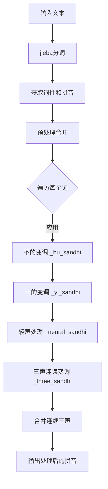

## 类结构

```
ToneSandhi (声调处理类)
├── 字段: must_neural_tone_words (必须读轻声的词语集合)
├── 字段: must_not_neural_tone_words (不应读轻声的词语集合)
├── 字段: punc (标点符号集合)
└── 方法: 多个声调处理方法
```

## 全局变量及字段


### `jieba`
    
结巴分词库

类型：`module`
    


### `lazy_pinyin`
    
拼音转换函数

类型：`function`
    


### `Style`
    
拼音风格枚举

类型：`Enum`
    


### `ToneSandhi.must_neural_tone_words`
    
必须读轻声的词语集合

类型：`Set[str]`
    


### `ToneSandhi.must_not_neural_tone_words`
    
不应读轻声的词语集合

类型：`Set[str]`
    


### `ToneSandhi.punc`
    
标点符号字符串

类型：`str`
    
    

## 全局函数及方法


### ToneSandhi._split_word

将输入的中文词汇使用结巴分词搜索模式进行切分，返回两个子词组成的列表，用于后续的声调处理流程。

参数：
- `word`：`str`，待切分的中文词汇

返回值：`List[str]`，切分后的子词列表，通常包含两个元素（第一个子词和剩余部分）

#### 流程图

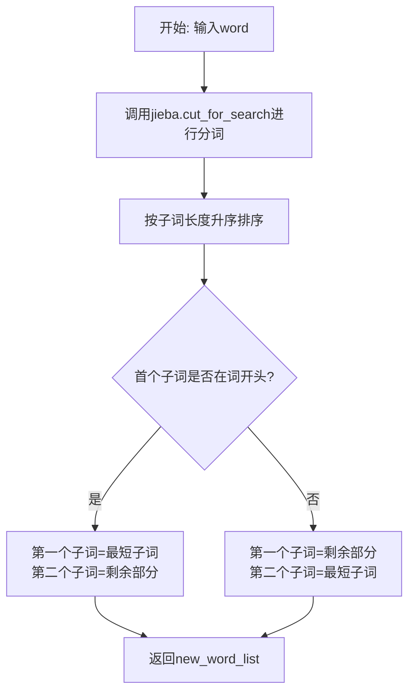

#### 带注释源码

```python
def _split_word(self, word: str) -> List[str]:
    """
    使用结巴分词搜索模式将单词分割成两个子词
    搜索模式会返回更细粒度的分词结果，便于处理复合词
    """
    # 使用jieba的搜索模式进行分词，返回可迭代的词语生成器
    word_list = jieba.cut_for_search(word)
    # 转换为列表并按词语长度升序排序，最短的排在前面
    word_list = sorted(word_list, key=lambda i: len(i), reverse=False)
    # 获取最短的子词（通常是词根或主要成分）
    first_subword = word_list[0]
    # 查找该子词在原词中的起始位置
    first_begin_idx = word.find(first_subword)
    
    # 根据子词位置判断分割方式
    if first_begin_idx == 0:
        # 子词在开头：第一个子词就是它本身，第二个是剩余部分
        second_subword = word[len(first_subword):]
        new_word_list = [first_subword, second_subword]
    else:
        # 子词在末尾：第一个是剩余部分，第二个是子词本身
        second_subword = word[:-len(first_subword)]
        new_word_list = [second_subword, first_subword]
    
    return new_word_list
```


### lazy_pinyin

lazy_pinyin是从pypinyin库导入的惰性拼音转换函数，用于将汉字字符串转换为拼音列表。该函数在ToneSandhi类中用于获取汉字的拼音形式（特别是finals形式），以支持三声连读等中文语音规则处理。

参数：

- `words`：`str`或`List[str]`，要转换的汉字或汉字列表
- `neutral_tone_with_five`：`bool`，是否使用5表示轻声（代码中传入`True`）
- `style`：`Style`，拼音风格（代码中使用`Style.FINALS_TONE3`）

返回值：`List[str]`，返回汉字对应的拼音列表

#### 流程图

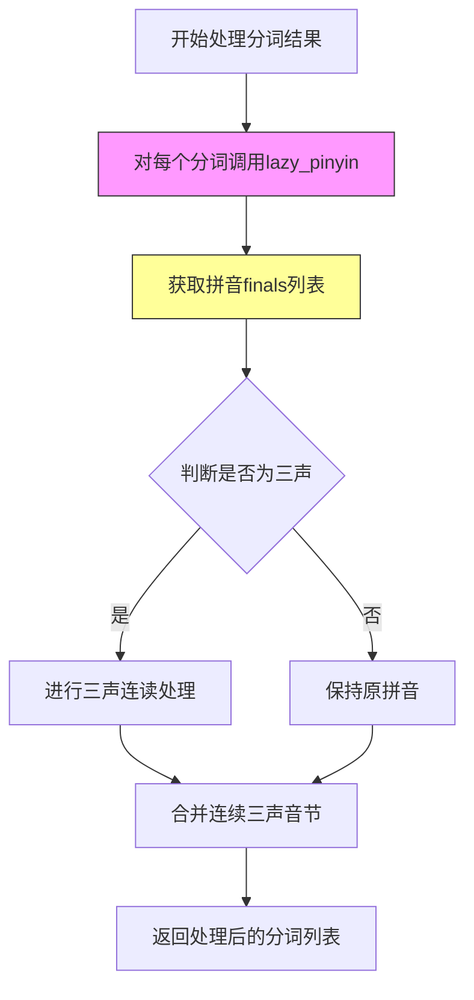

#### 带注释源码

```python
# 在 _merge_continuous_three_tones 方法中调用 lazy_pinyin
def _merge_continuous_three_tones(
    self, seg: List[Tuple[str, str]]
) -> List[Tuple[str, str]]:
    new_seg = []
    # 使用 lazy_pinyin 获取每个词的拼音finals形式
    # neutral_tone_with_five=True 表示用5表示轻声
    # style=Style.FINALS_TONE3 表示获取带声调的韵母
    sub_finals_list = [
        lazy_pinyin(word, neutral_tone_with_five=True, style=Style.FINALS_TONE3)
        for (word, pos) in seg
    ]
    assert len(sub_finals_list) == len(seg)
    merge_last = [False] * len(seg)
    for i, (word, pos) in enumerate(seg):
        if (
            i - 1 >= 0
            and self._all_tone_three(sub_finals_list[i - 1])
            and self._all_tone_three(sub_finals_list[i])
            and not merge_last[i - 1]
        ):
            # 如果前一个词和当前词都是三声，且前一个词不是重叠词
            # 且两个词总长度不超过3，则合并处理
            if (
                not self._is_reduplication(seg[i - 1][0])
                and len(seg[i - 1][0]) + len(seg[i][0]) <= 3
            ):
                new_seg[-1][0] = new_seg[-1][0] + seg[i][0]
                merge_last[i] = True
            else:
                new_seg.append([word, pos])
        else:
            new_seg.append([word, pos])

    return new_seg


# 在 _merge_continuous_three_tones_2 方法中同样调用 lazy_pinyin
def _merge_continuous_three_tones_2(
    self, seg: List[Tuple[str, str]]
) -> List[Tuple[str, str]]:
    new_seg = []
    # 同样使用 lazy_pinyin 获取拼音，但用于不同的判断逻辑
    sub_finals_list = [
        lazy_pinyin(word, neutral_tone_with_five=True, style=Style.FINALS_TONE3)
        for (word, pos) in seg
    ]
    assert len(sub_finals_list) == len(seg)
    merge_last = [False] * len(seg)
    for i, (word, pos) in enumerate(seg):
        if (
            i - 1 >= 0
            and sub_finals_list[i - 1][-1][-1] == "3"  # 前一个词的最后一个音节是三声
            and sub_finals_list[i][0][-1] == "3"       # 当前词的第一个音节是三声
            and not merge_last[i - 1]
        ):
            # 判断是否需要合并
            if (
                not self._is_reduplication(seg[i - 1][0])
                and len(seg[i - 1][0]) + len(seg[i][0]) <= 3
            ):
                new_seg[-1][0] = new_seg[-1][0] + seg[i][0]
                merge_last[i] = True
            else:
                new_seg.append([word, pos])
        else:
            new_seg.append([word, pos])
    return new_seg
```

**注意**：lazy_pinyin函数是从外部库pypinyin导入的，上述源码展示的是该函数在ToneSandhi类中的具体调用方式和使用上下文。该函数的主要作用是将汉字转换为拼音符号（特别是韵母形式），为后续的中文声调连读规则处理提供基础数据。


### `ToneSandhi.__init__`

该方法是 `ToneSandhi` 类的构造函数，负责初始化声调处理类所需的语言学资源，包括必须读轻声的词语集合、禁止读轻声的词语集合以及标点符号集合。

参数：

- 无（仅包含隐式参数 `self`）

返回值：`None`，无返回值（构造函数）

#### 流程图

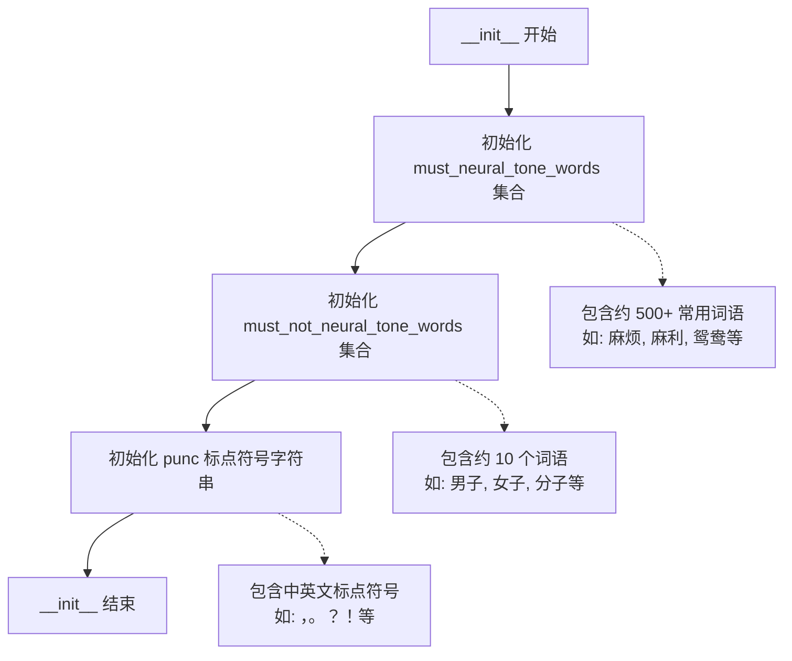

#### 带注释源码

```python
def __init__(self):
    """
    初始化 ToneSandhi 类的构造函数。
    
    初始化三个核心数据成员：
    1. must_neural_tone_words: 必须读轻声的词语集合（包含约 500+ 常用词语）
    2. must_not_neural_tone_words: 禁止读轻声的词语集合（包含约 10 个词语）
    3. punc: 标点符号集合（包含中英文标点）
    
    这些数据成员将用于后续的声调处理逻辑中判断词语是否应该读轻声。
    """
    # 必须读轻声的词语集合（中性变调）
    # 这些词语在汉语中习惯读轻声，如"麻烦"、"麻利"、"鸳鸯"等
    self.must_neural_tone_words = {
        "麻烦",
        "麻利",
        "鸳鸯",
        "高粱",
        "骨头",
        "骆驼",
        "马虎",
        "首饰",
        "馒头",
        "馄饨",
        "风筝",
        "难为",
        "队伍",
        "阔气",
        "闺女",
        "门道",
        "锄头",
        "铺盖",
        "铃铛",
        "铁匠",
        "钥匙",
        "里脊",
        "里头",
        "部分",
        "那么",
        "道士",
        "造化",
        "迷糊",
        "连累",
        "这么",
        "这个",
        "运气",
        "过去",
        "软和",
        "转悠",
        "踏实",
        "跳蚤",
        "跟头",
        "趔趄",
        "财主",
        "豆腐",
        "讲究",
        "记性",
        "记号",
        "认识",
        "规矩",
        "见识",
        "裁缝",
        "补丁",
        "衣裳",
        "衣服",
        "衙门",
        "街坊",
        "行李",
        "行当",
        "蛤蟆",
        "蘑菇",
        "薄荷",
        "葫芦",
        "葡萄",
        "萝卜",
        "荸荠",
        "苗条",
        "苗头",
        "苍蝇",
        "芝麻",
        "舒服",
        "舒坦",
        "舌头",
        "自在",
        "膏药",
        "脾气",
        "脑袋",
        "脊梁",
        "能耐",
        "胳膊",
        "胭脂",
        "胡萝",
        "胡琴",
        "胡同",
        "聪明",
        "耽误",
        "耽搁",
        "耷拉",
        "耳朵",
        "老爷",
        "老实",
        "老婆",
        "老头",
        "老太",
        "翻腾",
        "罗嗦",
        "罐头",
        "编辑",
        "结实",
        "红火",
        "累赘",
        "糨糊",
        "糊涂",
        "精神",
        "粮食",
        "簸箕",
        "篱笆",
        "算计",
        "算盘",
        "答应",
        "笤帚",
        "笑语",
        "笑话",
        "窟窿",
        "窝囊",
        "窗户",
        "稳当",
        "稀罕",
        "称呼",
        "秧歌",
        "秀气",
        "秀才",
        "福气",
        "祖宗",
        "砚台",
        "码头",
        "石榴",
        "石头",
        "石匠",
        "知识",
        "眼睛",
        "眯缝",
        "眨巴",
        "眉毛",
        "相声",
        "盘算",
        "白净",
        "痢疾",
        "痛快",
        "疟疾",
        "疙瘩",
        "疏忽",
        "畜生",
        "生意",
        "甘蔗",
        "琵琶",
        "琢磨",
        "琉璃",
        "玻璃",
        "玫瑰",
        "玄乎",
        "狐狸",
        "状元",
        "特务",
        "牲口",
        "牙碜",
        "牌楼",
        "爽快",
        "爱人",
        "热闹",
        "烧饼",
        "烟筒",
        "烂糊",
        "点心",
        "炊帚",
        "灯笼",
        "火候",
        "漂亮",
        "滑溜",
        "溜达",
        "温和",
        "清楚",
        "消息",
        "浪头",
        "活泼",
        "比方",
        "正经",
        "欺负",
        "模糊",
        "槟榔",
        "棺材",
        "棒槌",
        "棉花",
        "核桃",
        "栅栏",
        "柴火",
        "架势",
        "枕头",
        "枇杷",
        "机灵",
        "本事",
        "木头",
        "木匠",
        "朋友",
        "月饼",
        "月亮",
        "暖和",
        "明白",
        "时候",
        "新鲜",
        "故事",
        "收拾",
        "收成",
        "提防",
        "挖苦",
        "挑剔",
        "指甲",
        "指头",
        "拾掇",
        "拳头",
        "拨弄",
        "招牌",
        "招呼",
        "抬举",
        "护士",
        "折腾",
        "扫帚",
        "打量",
        "打算",
        "打点",
        "打扮",
        "打听",
        "打发",
        "扎实",
        "扁担",
        "戒指",
        "懒得",
        "意识",
        "意思",
        "情形",
        "悟性",
        "怪物",
        "思量",
        "怎么",
        "念头",
        "念叨",
        "快活",
        "忙活",
        "志气",
        "心思",
        "得罪",
        "张罗",
        "弟兄",
        "开通",
        "应酬",
        "庄稼",
        "干事",
        "帮手",
        "帐篷",
        "希罕",
        "师父",
        "师傅",
        "巴结",
        "巴掌",
        "差事",
        "工夫",
        "岁数",
        "屁股",
        "尾巴",
        "少爷",
        "小气",
        "小伙",
        "将就",
        "对头",
        "对付",
        "寡妇",
        "家伙",
        "客气",
        "实在",
        "官司",
        "学问",
        "学生",
        "字号",
        "嫁妆",
        "媳妇",
        "媒人",
        "婆家",
        "娘家",
        "委屈",
        "姑娘",
        "姐夫",
        "妯娌",
        "妥当",
        "妖精",
        "奴才",
        "女婿",
        "头发",
        "太阳",
        "大爷",
        "大方",
        "大意",
        "大夫",
        "多少",
        "多么",
        "外甥",
        "壮实",
        "地道",
        "地方",
        "在乎",
        "困难",
        "嘴巴",
        "嘱咐",
        "嘟囔",
        "嘀咕",
        "喜欢",
        "喇嘛",
        "喇叭",
        "商量",
        "唾沫",
        "哑巴",
        "哈欠",
        "哆嗦",
        "咳嗽",
        "和尚",
        "告诉",
        "告示",
        "含糊",
        "吓唬",
        "后头",
        "名字",
        "名堂",
        "合同",
        "吆喝",
        "叫唤",
        "口袋",
        "厚道",
        "厉害",
        "千斤",
        "包袱",
        "包涵",
        "匀称",
        "勤快",
        "动静",
        "动弹",
        "功夫",
        "力气",
        "前头",
        "刺猬",
        "刺激",
        "别扭",
        "利落",
        "利索",
        "利害",
        "分析",
        "出息",
        "凑合",
        "凉快",
        "冷战",
        "冤枉",
        "冒失",
        "养活",
        "关系",
        "先生",
        "兄弟",
        "便宜",
        "使唤",
        "佩服",
        "作坊",
        "体面",
        "位置",
        "似的",
        "伙计",
        "休息",
        "什么",
        "人家",
        "亲戚",
        "亲家",
        "交情",
        "云彩",
        "事情",
        "买卖",
        "主意",
        "丫头",
        "丧气",
        "两口",
        "东西",
        "东家",
        "世故",
        "不由",
        "不在",
        "下水",
        "下巴",
        "上头",
        "上司",
        "丈夫",
        "丈人",
        "一辈",
        "那个",
        "菩萨",
        "父亲",
        "母亲",
        "咕噜",
        "邋遢",
        "费用",
        "冤家",
        "甜头",
        "介绍",
        "荒唐",
        "大人",
        "泥鳅",
        "幸福",
        "熟悉",
        "计划",
        "扑腾",
        "蜡烛",
        "姥爷",
        "照顾",
        "喉咙",
        "吉他",
        "弄堂",
        "蚂蚱",
        "凤凰",
        "拖沓",
        "寒碜",
        "糟蹋",
        "倒腾",
        "报复",
        "逻辑",
        "盘缠",
        "喽啰",
        "牢骚",
        "咖喱",
        "扫把",
        "惦记",
    }
    
    # 禁止读轻声的词语集合
    # 这些词语在特定语境下不应读轻声，用于排除规则
    # 如"男子"、"女子"、"分子"等
    self.must_not_neural_tone_words = {
        "男子",
        "女子",
        "分子",
        "原子",
        "量子",
        "莲子",
        "石子",
        "瓜子",
        "电子",
        "人人",
        "虎虎",
    }
    
    # 标点符号集合，用于声调处理时的边界判断
    # 包含中文和英文常见标点符号
    self.punc = "：，；。？！""'''':,;?!\""
```


### `ToneSandhi._neural_sandhi`

该方法处理汉字词语的轻声变调规则，根据词性、词语结构以及预定义的轻声词词典，将拼音韵母转换为对应的轻声（5声）。

参数：

- `word`：`str`，待处理的汉字词语
- `pos`：`str`，jieba分词工具标注的词性标签（如"n"表示名词，"v"表示动词，"a"表示形容词等）
- `finals`：`List[str]`，汉字对应的拼音韵母列表，每个元素格式如"ia1"、"i3"等（末尾数字表示声调）

返回值：`List[str]`，处理后的拼音韵母列表，其中需要变调的韵母已将声调改为"5"表示轻声

#### 流程图

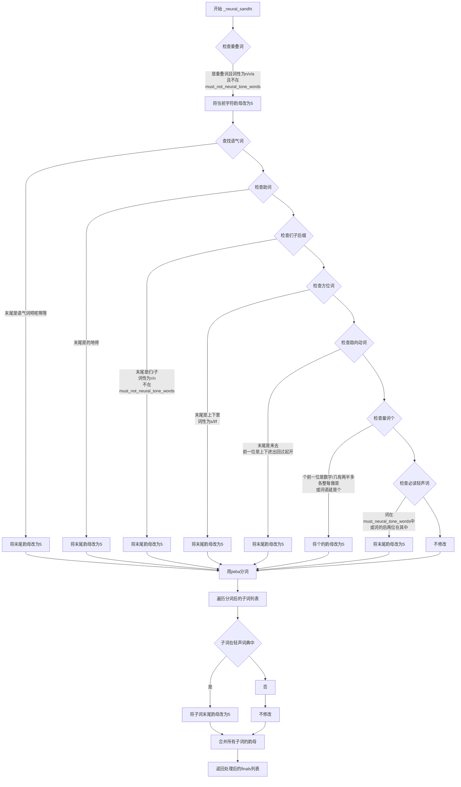

#### 带注释源码

```python
def _neural_sandhi(self, word: str, pos: str, finals: List[str]) -> List[str]:
    # 处理重叠词：名词、动词、形容词中的重叠词（如奶奶、试试、旺旺）
    # 叠词需要将重叠的第二个字变为轻声
    for j, item in enumerate(word):
        if (
            j - 1 >= 0  # 确保不是第一个字符
            and item == word[j - 1]  # 当前字符与前一个字符相同（重叠）
            and pos[0] in {"n", "v", "a"}  # 词性为名词、动词或形容词
            and word not in self.must_not_neural_tone_words  # 不在必须不发轻声的词表中
        ):
            # 将韵母末尾的声调改为5（轻声）
            finals[j] = finals[j][:-1] + "5"
    
    # 查找语气词"个"的位置，用于后续量词判断
    ge_idx = word.find("个")
    
    # 处理语气词：末尾为语气词时变为轻声
    # 包括：吧呢啊呐噻嘛吖嗨呐哦哒额滴哩哟喽啰耶喔诶
    if len(word) >= 1 and word[-1] in "吧呢啊呐噻嘛吖嗨呐哦哒额滴哩哟喽啰耶喔诶":
        finals[-1] = finals[-1][:-1] + "5"
    # 处理助词：末尾为"的地得"时变为轻声
    elif len(word) >= 1 and word[-1] in "的地得":
        finals[-1] = finals[-1][:-1] + "5"
    # 处理"了着过"等动态助词（代码中已注释）
    # elif len(word) == 1 and word in "了着过" and pos in {"ul", "uz", "ug"}:
    #     finals[-1] = finals[-1][:-1] + "5"
    # 处理后缀"们"和"子"：当词性为代词(r)或名词(n)时
    # 但排除must_not_neural_tone_words中的词（如"男子"、"女子"）
    elif (
        len(word) > 1
        and word[-1] in "们子"
        and pos in {"r", "n"}
        and word not in self.must_not_neural_tone_words
    ):
        finals[-1] = finals[-1][:-1] + "5"
    # 处理方位词：桌上、地下、家里等
    # 词性为s（方位）、l（介词）、f（方位词）
    elif len(word) > 1 and word[-1] in "上下里" and pos in {"s", "l", "f"}:
        finals[-1] = finals[-1][:-1] + "5"
    # 处理趋向动词：上来、下去、进来、回去等
    # 第二个字是"来"或"去"，前一位是方向动词
    elif len(word) > 1 and word[-1] in "来去" and word[-2] in "上下进出回过起开":
        finals[-1] = finals[-1][:-1] + "5"
    # 处理量词"个"：当前面有数字、量词或特定字时读轻声
    # 数字：几有两半多各整每做是
    elif (
        ge_idx >= 1
        and (
            word[ge_idx - 1].isnumeric()  # 前一个是数字
            or word[ge_idx - 1] in "几有两半多各整每做是"  # 前一个是特定量词或字
        )
    ) or word == "个":
        finals[ge_idx] = finals[ge_idx][:-1] + "5"
    else:
        # 处理必读轻声词：根据词典将词语最后一字变为轻声
        if (
            word in self.must_neural_tone_words  # 整个词在词典中
            or word[-2:] in self.must_neural_tone_words  # 词的后两位在词典中
        ):
            finals[-1] = finals[-1][:-1] + "5"

    # 使用jieba分词将词语分成子词
    word_list = self._split_word(word)
    # 根据分词结果将韵母列表也分成对应的两部分
    finals_list = [finals[: len(word_list[0])], finals[len(word_list[0]) :]]
    
    # 遍历每个子词，再次检查是否需要变轻声
    for i, word in enumerate(word_list):
        # 常规轻声词判断
        if (
            word in self.must_neural_tone_words
            or word[-2:] in self.must_neural_tone_words
        ):
            # 将该子词最后一个韵母改为轻声
            finals_list[i][-1] = finals_list[i][-1][:-1] + "5"
    
    # 合并两个子词的韵母列表
    finals = sum(finals_list, [])
    return finals
```


### `ToneSandhi._bu_sandhi`

该方法用于处理汉语中“不”字的变调规则。根据普通话变调规则，当“不”字位于去声（第四声）前时，“不”应变为阳平（第二声）；当“不”位于三字词中间且处于肯定否定并列格式时（如“看不懂”），，“不”应变为轻声（第五声）。

参数：

- `word`：`str`，需要处理的汉语词语
- `finals`：`List[str]`，包含词语中每个汉字的拼音韵母（带声调标记，如 "a1", "i4" 等）

返回值：`List[str]`，处理变调后的拼音韵母列表

#### 流程图

```mermaid
flowchart TD
    A[开始 _bu_sandhi] --> B{word长度是否为3<br/>且word[1]是否为'不'}
    B -->|是| C[将finals[1]的声调改为5<br/>即变为轻声<br/>例如: 看不懂]
    B -->|否| D[遍历word中的每个字符]
    D --> E{当前字符是否为'不'<br/>且下一个字符存在<br/>且下一个字符韵母声调为4}
    E -->|是| F[将当前'不'的声调改为2<br/>变为阳平<br/>例如: 不怕]
    E -->|否| G[继续遍历下一个字符]
    F --> H{是否还有下一个字符}
    H -->|是| E
    H -->|否| I[返回处理后的finals]
    C --> I
    G --> H
```

#### 带注释源码

```python
def _bu_sandhi(self, word: str, finals: List[str]) -> List[str]:
    """
    处理汉语中"不"字的变调规则
    
    变调规则:
    1. 当"不"位于三字词中间（肯定否定并列格式）时，读轻声(5)，如"看不懂"
    2. 当"不"位于去声(4)前面时，变调为阳平(2)，如"不怕"、"不错"
    
    参数:
        word: str - 输入的汉字词语
        finals: List[str] - 词语中每个汉字的拼音韵母列表，格式为["拼音1", "拼音2", ...]
    
    返回:
        List[str] - 处理变调后的拼音韵母列表
    """
    
    # 规则1: 处理三字词中的"不"，如"看不懂"、"来不及"、"好不好"
    # 这种情况下"不"读轻声(5)
    if len(word) == 3 and word[1] == "不":
        # 将"不"的韵母声调从原声调改为5（轻声）
        # 例如: finals[1] = "u4" -> "u5"
        finals[1] = finals[1][:-1] + "5"
    else:
        # 规则2: 处理"不"在去声(第四声)前的情况
        # 遍历词语中的每个字符
        for i, char in enumerate(word):
            # "不" before tone4 should be bu2, e.g. 不怕
            # 当"不"后面紧跟的汉字是第四声(去声)时，"不"变调为第二声(阳平)
            if char == "不" and i + 1 < len(word) and finals[i + 1][-1] == "4":
                # 将"不"的韵母声调改为2（阳平）
                # 例如: finals[i] = "u4" -> "u2"
                finals[i] = finals[i][:-1] + "2"
    
    return finals
```


### `ToneSandhi._yi_sandhi`

处理中文汉字“一”的变调规则，根据“一”在词中的位置和后续音节的声调来确定其实际读音（声调）。

参数：

- `word`：`str`，待处理的词语，包含汉字“一”
- `finals`：`List[str]`，词语的拼音韵母列表，与词语中的每个汉字对应

返回值：`List[str]`，处理后的拼音韵母列表，“一”的声调根据变调规则发生变化

#### 流程图

```mermaid
flowchart TD
    A[开始 _yi_sandhi] --> B{检查 '一' 是否在数字序列中}
    B -->|是| C[直接返回原 finals]
    B -->|否| D{检查是否为重叠词中的 '一'<br/>len==3 且 word[1]=='一' 且 word[0]==word[-1]}
    D -->|是| E[将 finals[1] 改为 5 声<br/>'一看一看' 中的 '一' 读轻声]
    D -->|否| F{检查是否为序数词<br/>word.startswith('第一')}
    F -->|是| G[将 finals[1] 改为 1 声<br/>'第一' 中的 '一' 读一声]
    F -->|否| H{遍历 word 查找 '一'}
    H --> I{'一' 后面是第4声?}
    I -->|是| J[将 finals[i] 改为 2 声<br/>如 '一段']
    I -->|否| K{'一' 后面是标点符号?}
    K -->|是| L[保持原声调 1 声]
    K -->|否| M[将 finals[i] 改为 4 声<br/>如 '一天']
    J --> N[返回处理后的 finals]
    E --> N
    G --> N
    L --> N
    M --> N
```

#### 带注释源码

```python
def _yi_sandhi(self, word: str, finals: List[str]) -> List[str]:
    """
    处理汉字"一"的变调规则
    
    变调规则：
    1. 在数字序列中保持原声调(一声)，如"一零零"、"二一零"
    2. 在重叠词中间读轻声(5声)，如"看一看"
    3. 在序数词中读一声，如"第一"
    4. 在第四声(去声)前读第二声，如"一段"
    5. 在非第四声前读第四声，如"一天"
    6. 后面是标点符号时保持原声调(一声)
    """
    
    # 场景1: "一"在数字序列中，如"一零零"、"二一零"
    # 检查word中除"一"以外的所有字符是否都是数字
    if word.find("一") != -1 and all(
        [item.isnumeric() for item in word if item != "一"]
    ):
        return finals  # 数字序列中的"一"保持一声，不变调
    
    # 场景2: "一"在重叠词中间，如"看一看"、"听一听"
    # 条件：词语长度为3，中间字符是"一"，首尾字符相同
    elif len(word) == 3 and word[1] == "一" and word[0] == word[-1]:
        finals[1] = finals[1][:-1] + "5"  # 将"一"改为轻声(5声)
    
    # 场景3: "一"在序数词中，如"第一"、"第十"
    # 序数词中的"一"必须读一声
    elif word.startswith("第一"):
        finals[1] = finals[1][:-1] + "1"  # 强制改为一声
    
    # 场景4-5: 其他情况，根据后续音节变调
    else:
        # 遍历词语中的每个字符，查找"一"
        for i, char in enumerate(word):
            if char == "一" and i + 1 < len(word):
                # "一"在第四声(去声)前，读第二声
                # 例如："一段"、"一致"、"一味"
                if finals[i + 1][-1] == "4":
                    finals[i] = finals[i][:-1] + "2"
                # "一"在非第四声前，读第四声
                # 例如："一天"、"一年"、"一心"
                else:
                    # 注意：如果"一"后面是标点符号，仍读一声
                    if word[i + 1] not in self.punc:
                        finals[i] = finals[i][:-1] + "4"
    
    return finals
```


### `ToneSandhi._split_word`

该函数是 `ToneSandhi` 类的私有方法，主要用于将一个汉语词汇拆分成两个子词。它利用 jieba 分词库进行最大正向匹配搜索，然后根据最短子词在原词中的位置，将词汇拆分为两部分返回。这一拆分过程主要用于辅助处理汉语三声连读变调等语音规则。

参数：

- `word`：`str`，需要拆分的汉语词汇

返回值：`List[str]`，包含两个子词的列表，顺序为 [前部分子词, 后部分子词]

#### 流程图

```mermaid
flowchart TD
    A[开始: _split_word] --> B[调用 jieba.cut_for_search 对 word 进行分词]
    B --> C[将分词结果按长度升序排序]
    C --> D[获取最短子词 first_subword]
    D --> E{判断 first_subword 在原词中的位置}
    E -->|位置为 0| F[second_subword = word[len(first_subword):]]
    E -->|位置非 0| G[second_subword = word[: -len(first_subword)]]
    F --> H[new_word_list = [first_subword, second_subword]]
    G --> H
    H --> I[返回 new_word_list]
```

#### 带注释源码

```python
def _split_word(self, word: str) -> List[str]:
    """
    将输入的词语拆分为两个子词，用于后续的声调处理
    
    该方法使用 jieba 的最大正向搜索模式进行分词，然后根据最短子词
    在原词中的位置，将词汇拆分成两部分返回。主要用于三声连读变调的
    辅助处理场景。
    
    参数:
        word: 需要拆分的汉语词汇
    
    返回:
        包含两个子词的列表 [前部分, 后部分]
    """
    # 使用 jieba 的 cut_for_search 进行最大正向匹配搜索分词
    # 返回一个生成器，包含所有可能的分词结果
    word_list = jieba.cut_for_search(word)
    
    # 将生成器转换为列表，并按长度升序排序
    # 这样最短的子词会排在最前面，便于后续处理
    word_list = sorted(word_list, key=lambda i: len(i), reverse=False)
    
    # 获取最短的子词（通常是单字）
    first_subword = word_list[0]
    
    # 查找该最短子词在原词中的起始位置
    first_begin_idx = word.find(first_subword)
    
    # 判断最短子词是否在词首
    if first_begin_idx == 0:
        # 如果在词首，则后半部分为从 first_subword 长度位置到末尾的子串
        second_subword = word[len(first_subword):]
        new_word_list = [first_subword, second_subword]
    else:
        # 如果不在词首，则前半部分为从开头到 first_subword 长度位置的子串
        second_subword = word[: -len(first_subword)]
        new_word_list = [second_subword, first_subword]
    
    # 返回拆分后的两个子词
    return new_word_list
```


### ToneSandhi._three_sandhi

处理三声连读变调的方法。当中文词汇中出现连续的两个或多个第三声（第三声）音节时，根据普通话变调规则，将第一个第三声音节调整为第二声。该方法分别处理双字词、三字词和四字词的变调情况。

参数：

- `word`：`str`，待处理的中文词汇
- `finals`：`List[str]`，包含词汇各音节韵母及声调的列表，例如 `['ia1', 'i3']`

返回值：`List[str]`，返回变调处理后的韵母列表

#### 流程图

```mermaid
flowchart TD
    A[开始 _three_sandhi] --> B{len(word) == 2?}
    B -->|Yes| C{_all_tone_three(finals)?}
    C -->|Yes| D[将 finals[0] 最后一个字符改为 '2']
    C -->|No| E[不处理]
    D --> Z[返回 finals]
    E --> Z
    B -->|No| F{len(word) == 3?}
    F -->|Yes| G[_split_word 拆分词汇]
    G --> H{_all_tone_three(finals)?}
    H -->|Yes| I{len(word_list[0]) == 2?}
    I -->|Yes| J[双音节+单音节模式<br/>finals[0] 和 finals[1] 改为 '2']
    I -->|No| K[单音节+双音节模式<br/>finals[1] 改为 '2']
    H -->|No| L[拆分 finals_list]
    L --> M{遍历 sub}
    M --> N{_all_tone_three(sub) 且 len(sub)==2?}
    N -->|Yes| O[sub[0] 改为 '2']
    N -->|No| P{条件组合<br/>i==1 且非全三声<br/>且末字符都是3?}
    P -->|Yes| Q[finals_list[0][-1] 改为 '2']
    P -->|No| R[继续下一个]
    O --> M
    Q --> M
    M --> S[合并 finals_list]
    S --> Z
    F -->|No| T{len(word) == 4?}
    T -->|Yes| U[拆分为两个双字词]
    U --> V[遍历每个双字词]
    V --> W{_all_tone_three(sub)?}
    W -->|Yes| X[sub[0] 改为 '2']
    W -->|No| Y[不变]
    X --> V
    Y --> V
    V --> Z
    T -->|No| Z
```

#### 带注释源码

```python
def _three_sandhi(self, word: str, finals: List[str]) -> List[str]:
    """
    处理三声连读变调
    在普通话中，连续的两个第三声音节相连时，前一个音节会变为第二声
    例如："蒙古" → ["meng2", "gu3"]
    
    参数:
        word: 待处理的中文词汇
        finals: 包含词汇各音节韵母及声调的列表，例如 ['ia1', 'i3']
    
    返回:
        变调处理后的韵母列表
    """
    
    # 处理双字词：两个都是第三声时，第一个变为第二声
    if len(word) == 2 and self._all_tone_three(finals):
        # 将第一音节的声调从3改为2
        finals[0] = finals[0][:-1] + "2"
    
    # 处理三字词
    elif len(word) == 3:
        # 使用 jieba 分词将三字词拆分为两个部分
        word_list = self._split_word(word)
        
        # 情况1：三个音节都是第三声
        if self._all_tone_three(finals):
            # 双音节 + 单音节模式，例如："蒙古/包"
            # 将前两个音节都变为第二声
            if len(word_list[0]) == 2:
                finals[0] = finals[0][:-1] + "2"
                finals[1] = finals[1][:-1] + "2"
            # 单音节 + 双音节模式，例如："纸/老虎"
            # 将后两个音节变为第二声
            elif len(word_list[0]) == 1:
                finals[1] = finals[1][:-1] + "2"
        
        # 情况2：不是全部都是第三声，但存在部分连续第三声
        else:
            # 将 finals 按照分词结果拆分为两个子列表
            finals_list = [finals[: len(word_list[0])], finals[len(word_list[0]) :]]
            
            if len(finals_list) == 2:
                # 遍历每个子部分
                for i, sub in enumerate(finals_list):
                    # 如果子部分有两个音节且都是第三声，则第一个变为第二声
                    # 例如："所有/人" → "所/人"
                    if self._all_tone_three(sub) and len(sub) == 2:
                        finals_list[i][0] = finals_list[i][0][:-1] + "2"
                    # 特殊变调模式：第一部分末尾和第二部分开头都是第三声
                    # 例如："好/喜欢" → "好/喜欢"
                    elif (
                        i == 1
                        and not self._all_tone_three(sub)
                        and finals_list[i][0][-1] == "3"
                        and finals_list[0][-1][-1] == "3"
                    ):
                        finals_list[0][-1] = finals_list[0][-1][:-1] + "2"
                
                # 合并处理后的子列表
                finals = sum(finals_list, [])
    
    # 处理四字词（成语）：拆分为两个双字词分别处理
    elif len(word) == 4:
        # 将四个音节按位置拆分为两个双字词
        finals_list = [finals[:2], finals[2:]]
        finals = []
        
        # 遍历每个双字词
        for sub in finals_list:
            # 如果双字词的两个音节都是第三声，第一个变为第二声
            if self._all_tone_three(sub):
                sub[0] = sub[0][:-1] + "2"
            finals += sub
    
    return finals
```


### `ToneSandhi._all_tone_three`

该函数用于检查给定的韵母列表（finals）中的所有韵母是否都是第三声。在中文语音变调处理中，"三声变调"是指当两个或多个第三声音节相连时，前一个或前几个音节会变为第二声。该函数正是用于判断是否满足触发三声变调的条件。

参数：

- `finals`：`List[str]`，韵母列表，每个元素是带声调的韵母字符串（如 'ia1', 'i3' 等），其中最后一个字符表示声调

返回值：`bool`，如果列表中所有韵母的声调都是 "3"（第三声），则返回 `True`；否则返回 `False`

#### 流程图

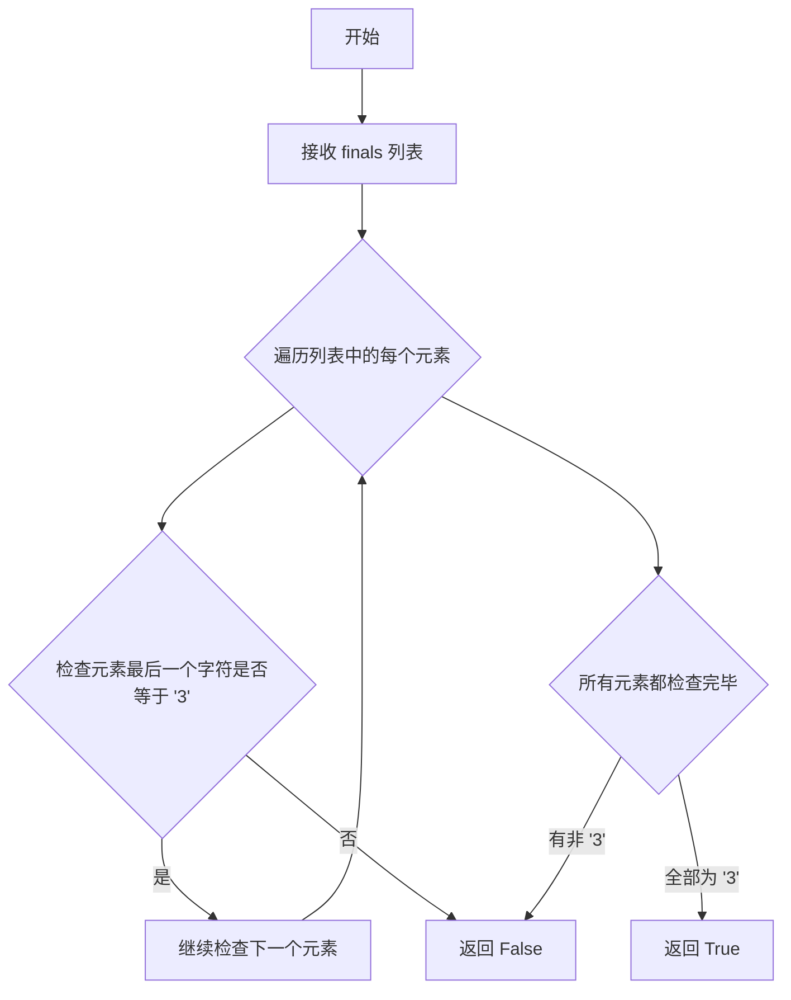

#### 带注释源码

```python
def _all_tone_three(self, finals: List[str]) -> bool:
    """
    检查韵母列表是否全部为第三声
    
    参数:
        finals: 韵母列表，每个元素是带声调的韵母字符串，
                声调信息存储在字符串最后一个字符
                例如：'ia1' 表示一声, 'i3' 表示三声
    
    返回值:
        bool: 如果所有韵母都是第三声返回 True，否则返回 False
    
    示例:
        >>> _all_tone_three(['i3', 'an3'])
        True
        >>> _all_tone_three(['i3', 'an2'])
        False
    """
    # 使用 all() 函数配合生成器表达式检查所有元素
    # x[-1] 获取字符串最后一个字符（即声调）
    # 判断是否等于 "3"（第三声）
    return all(x[-1] == "3" for x in finals)
```


### ToneSandhi._merge_bu

该方法用于合并分词列表中的“否”字符（“不”）与其后继词，以防止在后续的声调处理（sandhi）中，“不”单独出现导致声调计算错误。这是 ToneSandhi 类中预处理步骤的一部分，确保“ 不”与后续词语结合作为一个整体进行声调处理。

参数：
- `seg`：`List[Tuple[str, str]]`，输入的分词列表，每个元素为包含词语（word）及其词性标注（pos）的元组，例如 [('不', 'd'), ('好', 'a')]

返回值：`List[Tuple[str, str]]`，合并后的分词列表，其中“ 不”与相邻的后继词被合并为一个词条；若原列表以“ 不”结尾，则单独保留并标记为副词（词性 'd'）

#### 流程图

```mermaid
flowchart TD
    A([开始]) --> B[初始化 new_seg = [], last_word = '']
    B --> C{遍历 seg 中的每个 (word, pos)}
    C --> D{last_word == '不'}
    D -- 是 --> E[word = last_word + word]
    D -- 否 --> F{word != '不'}
    E --> F
    F -- 是 --> G[将 (word, pos) 添加到 new_seg]
    F -- 否 --> H[不添加，直接跳过]
    G --> I[更新 last_word = word 副本]
    H --> I
    I --> C
    C --> J{遍历结束?}
    J -- 否 --> C
    J -- 是 --> K{last_word == '不'}
    K -- 是 --> L[添加 (last_word, 'd') 到 new_seg]
    K -- 否 --> M([返回 new_seg])
    L --> M
```

#### 带注释源码

```python
# 合并"不"和其后面的词
# 如果不合并，"不"有时会根据jieba分词单独出现，可能导致声调错误（sandhi error）
def _merge_bu(self, seg: List[Tuple[str, str]]) -> List[Tuple[str, str]]:
    new_seg = []  # 用于存储合并后的分词结果
    last_word = ""  # 记录上一个处理的词语，初始为空
    
    # 遍历输入的分词列表，每个元素为 (word, pos) 元组
    for word, pos in seg:
        # 如果上一个词是"不"，则将当前词与"不"合并
        # 例如：上一步 last_word = "不"，当前 word = "好"，则合并为 "不好"
        if last_word == "不":
            word = last_word + word
        
        # 如果合并后的词不是单独的"不"，则添加到结果列表
        # 排除单独的"不"是为了避免将单独存在的"不"加入到new_seg中
        if word != "不":
            new_seg.append((word, pos))
        
        # 更新 last_word 为当前词的副本，用于下一次循环的判断
        last_word = word[:]
    
    # 遍历结束后，如果最后一个词仍然是"不"（例如输入以"不"结尾）
    # 将其作为副词（词性 'd'）添加到结果中
    if last_word == "不":
        new_seg.append((last_word, "d"))
        last_word = ""  # 重置，避免后续处理出错
    
    return new_seg  # 返回合并后的分词列表
```

#### 关键组件信息

- **ToneSandhi 类**：中文声调处理类，包含多个方法用于处理汉语声调变化（sandhi），包括“不”声调、“一”声调、轻声、三声连续等。
- **must_neural_tone_words**：类属性，包含必须读作轻声的词语集合（词典）。
- **must_not_neural_tone_words**：类属性，包含不应读作轻声的词语集合（词典）。
- **其他合并方法**：类中包含多个以 `_merge_` 开头的方法，用于合并“ 一”、“儿”化词、连续三声等，它们在 `pre_merge_for_modify` 方法中被顺序调用，形成预处理流水线。

#### 潜在的技术债务或优化空间

1. **硬编码的词语集合**：`must_neural_tone_words` 和 `must_not_neural_tone_words` 使用硬编码的字典方式维护，未来可以迁移至外部配置文件或数据库，以提高可维护性和扩展性。
2. **缺乏错误处理**：该方法未对输入进行严格校验（例如空列表、None 值等），虽然上层调用可能保证输入合法性，但在生产环境中建议添加防御性检查。
3. **重复逻辑**：合并“ 一”和“ 不”的逻辑在多个方法中类似，可以抽象出通用的合并辅助函数，减少代码重复。
4. **词性标注依赖**：该方法依赖于外部分词器（jieba）提供的词性标注，若分词结果不准确，会影响合并效果，可能需要引入更鲁棒的后处理机制。

#### 其它项目

- **设计目标与约束**：该方法的设计目标是在声调处理前，将某些需要合并的词语（如“ 不”与后续词）组合在一起，以确保声调计算的准确性。约束条件是输入必须为有效的分词列表，且词性标注应遵循 jieba 的标注规范。
- **错误处理与异常设计**：当前方法未显式抛出异常，但在调用 `_merge_yi` 时使用 try-except 捕获异常并打印错误信息，表明该模块在错误处理上较为宽松，可能导致静默失败。
- **数据流与状态机**：该方法作为预处理流程的一环，接收分词列表并输出合并后的列表。其状态机逻辑相对简单，主要通过维护 `last_word` 状态来决策是否合并。
- **外部依赖与接口契约**：该方法依赖 `jieba` 分词库进行分词和词性标注，依赖 `pypinyin` 库获取拼音韵母。接口契约要求输入为 `List[Tuple[str, str]]`，输出为同类型的列表，且不应修改原始输入列表。


### `ToneSandhi._merge_yi`

该函数用于合并中文拼音声调处理中的"一"与周围词语。主要实现两个功能：
1. 将"一"与左右重复的动词合并（如"听"、"一"、"听" → "听一听"）
2. 将单独的"一"与其后面的词语合并。若不进行合并，jieba分词后的"一"可能单独出现，导致声调变化错误。

参数：
- `seg`：`List[Tuple[str, str]]`，分词结果列表，每个元素为(词语, 词性)元组

返回值：`List[Tuple[str, str]]`，合并"一"后的分词结果列表

#### 流程图

```mermaid
flowchart TD
    A[开始: 输入 seg] --> B[初始化 new_seg = []]
    B --> C{遍历 seg 中的每个词 i}
    C -->|是功能1| D{检查条件:<br/>i-1 >= 0<br/>word == '一'<br/>i+1 < len(seg)<br/>seg[i-1][0] == seg[i+1][0]<br/>seg[i-1][1] == 'v'}
    C -->|否| G{检查功能2条件:<br/>i-2 >= 0<br/>seg[i-1][0] == '一'<br/>seg[i-2][0] == word<br/>pos == 'v'}
    D -->|满足| E[合并为 '词一词' 格式<br/>new_seg[i-1][0] = new_seg[i-1][0] + '一' + new_seg[i-1][0]]
    D -->|不满足| F{检查功能2条件}
    E --> F
    F -->|满足| H[continue 跳过当前词]
    F -->|不满足| I[new_seg.append([word, pos])]
    G -->|满足| H
    G -->|不满足| I
    I --> J[更新 seg = new_seg]
    J --> K[重新初始化 new_seg = []]
    K --> L{再次遍历 seg}
    L -->|新词前一个是'一'| M[合并: new_seg[-1][0] = new_seg[-1][0] + word]
    L -->|否则| N[new_seg.append([word, pos])]
    M --> O[返回 new_seg]
    N --> O
```

#### 带注释源码

```python
# 合并"一"与周围词
# 功能1: 将"一"与左右重复词合并，如"听","一","听" -> "听一听"
# 功能2: 合并单独的"一"和其后面的词
# 若不合并，jieba分词后"一"可能单独出现，导致声调错误
def _merge_yi(self, seg: List[Tuple[str, str]]) -> List[Tuple[str, str]]:
    new_seg = []
    
    # ---------- 功能1: 处理"词一词"结构 ----------
    # 遍历每个词及其位置
    for i, (word, pos) in enumerate(seg):
        # 检查是否满足"一"在两个相同动词中间的条件
        # i-1 >= 0: 前面有词
        # word == "一": 当前词是"一"
        # i+1 < len(seg): 后面有词
        # seg[i-1][0] == seg[i+1][0]: 前后的词相同
        # seg[i-1][1] == "v": 前面的词是动词
        if (
            i - 1 >= 0
            and word == "一"
            and i + 1 < len(seg)
            and seg[i - 1][0] == seg[i + 1][0]
            and seg[i - 1][1] == "v"
        ):
            # 将"一"合并到相邻的重复词中间，形成"听一听"格式
            new_seg[i - 1][0] = new_seg[i - 1][0] + "一" + new_seg[i - 1][0]
        else:
            # 检查是否符合"词一词"的另一种模式
            # 即"一"在前，前面是相同的动词
            if (
                i - 2 >= 0
                and seg[i - 1][0] == "一"
                and seg[i - 2][0] == word
                and pos == "v"
            ):
                # 跳过当前词，因为已经合并到前面的词中了
                continue
            else:
                # 正常添加到新分词结果中
                new_seg.append([word, pos])
    
    # 更新 seg 为第一轮处理结果
    seg = new_seg
    new_seg = []
    
    # ---------- 功能2: 处理单独的"一"与后面词的合并 ----------
    # 再次遍历，处理单个"一"与其后面词的合并
    for i, (word, pos) in enumerate(seg):
        # 如果前一个词是"一"，则将当前词合并到"一"后面
        if new_seg and new_seg[-1][0] == "一":
            new_seg[-1][0] = new_seg[-1][0] + word
        else:
            # 否则正常添加
            new_seg.append([word, pos])
    
    return new_seg
```


### `ToneSandhi._merge_continuous_three_tones`

该方法用于合并连续的三声音节。当相邻的两个词都是三声调（第三声）时，将它们合并为一个词，以避免三声连读时产生错误的声调变化。这是汉语普通话声调变调规则（三声变调）的实现之一。

参数：

- `seg`：`List[Tuple[str, str]]`，分词后的词语列表，每个元素为(词, 词性)的元组

返回值：`List[Tuple[str, str]]`，合并连续三声后的词语列表

#### 流程图

```mermaid
flowchart TD
    A[开始: 输入seg列表] --> B[为每个词计算拼音finals列表]
    B --> C[初始化merge_last标记数组, 长度与seg相同]
    C --> D[遍历seg中的每个词 i]
    D --> E{检查前置条件}
    E -->|不满足| F[将当前词加入new_seg]
    E -->|满足| G{检查是否为叠词且合并后长度≤3}
    G -->|不满足| F
    G -->|满足| H[将当前词合并到前一词]
    H --> I[标记merge_last[i] = True]
    I --> J{继续遍历}
    F --> J
    J --> K{是否遍历完毕}
    K -->|否| D
    K -->|是| L[返回new_seg]
    
    style A fill:#f9f,color:#333
    style L fill:#9f9,color:#333
```

#### 带注释源码

```python
def _merge_continuous_three_tones(
    self, seg: List[Tuple[str, str]]
) -> List[Tuple[str, str]]:
    """
    合并连续的三声音节
    
    当相邻的两个词都是第三声时，将它们合并为一个词。
    这是汉语声调三声变调规则的实现。
    
    参数:
        seg: 分词后的词语列表，每个元素为(词, 词性)的元组
    
    返回:
        合并连续三声后的词语列表
    """
    new_seg = []  # 存储合并后的结果
    
    # 为seg中的每个词计算拼音finals（带声调标记）
    # Style.FINALS_TONE3表示返回带声调的韵母形式
    # neutral_tone_with_fone=True表示使用5表示轻声
    sub_finals_list = [
        lazy_pinyin(word, neutral_tone_with_five=True, style=Style.FINALS_TONE3)
        for (word, pos) in seg
    ]
    
    # 断言确保拼音列表长度与输入词列表一致
    assert len(sub_finals_list) == len(seg)
    
    # merge_last用于标记哪些词已经被合并过，避免重复处理
    merge_last = [False] * len(seg)
    
    # 遍历每个词及其索引
    for i, (word, pos) in enumerate(seg):
        # 检查是否满足合并条件：
        # 1. 不是第一个词 (i - 1 >= 0)
        # 2. 前一个词的所有音节都是三声
        # 3. 当前词的所有音节都是三声
        # 4. 前一个词尚未被合并
        if (
            i - 1 >= 0
            and self._all_tone_three(sub_finals_list[i - 1])
            and self._all_tone_three(sub_finals_list[i])
            and not merge_last[i - 1]
        ):
            # 进一步检查：
            # 1. 前一个词不是叠词（如"奶奶"）
            # 2. 合并后的总长度不超过3个字符
            # 叠词需要保留，因为它们有特殊的变调规则(_neural_sandhi处理)
            if (
                not self._is_reduplication(seg[i - 1][0])
                and len(seg[i - 1][0]) + len(seg[i][0]) <= 3
            ):
                # 将当前词合并到前一个词的末尾
                new_seg[-1][0] = new_seg[-1][0] + seg[i][0]
                # 标记当前词已被合并
                merge_last[i] = True
            else:
                # 不满足合并条件，正常添加到结果列表
                new_seg.append([word, pos])
        else:
            # 不满足合并条件，正常添加到结果列表
            new_seg.append([word, pos])

    return new_seg
```


### `ToneSandhi._merge_continuous_three_tones_2`

该函数用于处理连续三声变调的合并逻辑，具体是当第一个词的最后一个字符和第二个词的第一个字符都是三声时，根据特定条件（两个词都不是叠词词且总长度不超过3个字符）决定是否将两个词合并为一个词进行后续的变调处理。

参数：

- `self`：`ToneSandhi` 类实例，隐含参数
- `seg`：`List[Tuple[str, str]]`，分词后的词列表，每个元素为词和词性标注的元组

返回值：`List[Tuple[str, str]]`，合并处理后的新词列表

#### 流程图

```mermaid
flowchart TD
    A[开始 _merge_continuous_three_tones_2] --> B[初始化 new_seg 为空列表]
    B --> C[使用 lazy_pinyin 获取每个词的带声调拼音finals]
    C --> D[初始化 merge_last 标记数组, 长度与 seg 相同, 全部置为 False]
    D --> E[遍历 seg 中的每个词和词性, 索引为 i]
    E --> F{判断条件: i - 1 >= 0<br/>并且前一个词的最后一个拼音以 '3' 结尾<br/>并且当前词的第一个拼音以 '3' 结尾<br/>并且前一个词未被合并}
    F -->|否| G[直接添加当前词到 new_seg]
    F -->|是| H{判断条件: 前一个词不是叠词<br/>并且两个词总长度 <= 3}
    H -->|否| G
    H -->|是| I[将当前词合并到前一个词的末尾<br/>设置 merge_last[i] = True]
    I --> J[检查是否还有未遍历的词]
    G --> J
    J -->|是| E
    J -->|否| K[返回 new_seg]
```

#### 带注释源码

```python
def _merge_continuous_three_tones_2(
    self, seg: List[Tuple[str, str]]
) -> List[Tuple[str, str]]:
    """
    合并连续三声变体的第二种情况：
    当第一个词的最后一个字符是三声，第二个词的第一个字符也是三声时，
    如果满足特定条件则合并这两个词。
    
    参数:
        seg: 分词后的词列表，每个元素为 (词, 词性) 元组
    返回:
        合并处理后的新词列表
    """
    # 初始化结果列表
    new_seg = []
    
    # 为每个词计算带声调拼音（FINALS_TONE3格式）
    # neutral_tone_with_five=True 表示轻声用 '5' 表示
    sub_finals_list = [
        lazy_pinyin(word, neutral_tone_with_five=True, style=Style.FINALS_TONE3)
        for (word, pos) in seg
    ]
    
    # 断言确保拼音列表长度与原始词列表长度一致
    assert len(sub_finals_list) == len(seg)
    
    # 标记数组，用于记录哪些词已经被合并（避免重复处理）
    merge_last = [False] * len(seg)
    
    # 遍历每个词
    for i, (word, pos) in enumerate(seg):
        # 检查是否满足连续三声的条件：
        # 1. 不是第一个词 (i - 1 >= 0)
        # 2. 前一个词的最后一个拼音以 '3' 结尾（三声）
        # 3. 当前词的第一个拼音以 '3' 结尾（三声）
        # 4. 前一个词没有被合并过
        if (
            i - 1 >= 0
            and sub_finals_list[i - 1][-1][-1] == "3"
            and sub_finals_list[i][0][-1] == "3"
            and not merge_last[i - 1]
        ):
            # 如果满足以下条件则合并：
            # 1. 前一个词不是叠词（如"奶奶"、"试试"等需要单独处理轻声）
            # 2. 两个词的总长度不超过3个字符（避免过长词组）
            if (
                not self._is_reduplication(seg[i - 1][0])
                and len(seg[i - 1][0]) + len(seg[i][0]) <= 3
            ):
                # 执行合并：将当前词合并到前一个词的末尾
                new_seg[-1][0] = new_seg[-1][0] + seg[i][0]
                # 标记当前词已被合并
                merge_last[i] = True
            else:
                # 不满足合并条件，正常添加
                new_seg.append([word, pos])
        else:
            # 不满足连续三声条件，正常添加
            new_seg.append([word, pos])
    
    return new_seg
```


### `ToneSandhi._merge_er`

该函数用于合并儿化音（"儿"字），将连续出现的"儿"字与前一个词语合并，形成儿化词。例如将["玩", "儿"]合并为["玩儿"]。这是中文语音合成中处理儿化音的关键步骤。

参数：

- `seg`：`List[Tuple[str, str]]`，分词后的词语列表，每个元素为(词语, 词性)元组

返回值：`List[Tuple[str, str]]`，合并儿化音后的词语列表

#### 流程图

```mermaid
flowchart TD
    A[开始] --> B[初始化 new_seg 为空列表]
    B --> C{遍历 seg 中的每个词语}
    C --> D{当前词语 == "儿" 且前一个词语存在 且前一个词语 != '#'}
    D -->|是| E[将"儿"合并到 new_seg 最后一个词语]
    D -->|否| F[将当前词语添加到 new_seg]
    E --> G{遍历是否结束}
    F --> G
    G -->|未结束| C
    G -->|已结束| H[返回 new_seg]
```

#### 带注释源码

```python
def _merge_er(self, seg: List[Tuple[str, str]]) -> List[Tuple[str, str]]:
    """
    合并儿化音，将"儿"字与前一个词语合并
    
    参数:
        seg: 分词后的词语列表，每个元素为(词语, 词性)元组
             例如: [('玩', 'v'), ('儿', 'n')]
    
    返回:
        合并儿化音后的词语列表
        例如: [('玩耍', 'v')] -> [('玩儿', 'v')]
    """
    # 创建新的分段列表，用于存储合并后的结果
    new_seg = []
    
    # 遍历分段中的每个词语及其词性
    for i, (word, pos) in enumerate(seg):
        # 判断条件：
        # 1. i - 1 >= 0: 确保前面有词语
        # 2. word == "儿": 当前词语是"儿"
        # 3. seg[i - 1][0] != "#": 前一个词语不是占位符"#"
        # （"#"通常用于标记边界或特殊位置）
        if i - 1 >= 0 and word == "儿" and seg[i - 1][0] != "#":
            # 将"儿"合并到前一个词语的末尾
            # 例如：("玩", "v") + ("儿", "n") -> ("玩耍", "v")
            new_seg[-1][0] = new_seg[-1][0] + seg[i][0]
        else:
            # 如果不满足合并条件，则将当前词语保持原样添加到结果中
            new_seg.append([word, pos])
    
    # 返回合并儿化音后的词语列表
    return new_seg
```


### `ToneSandhi._merge_reduplication`

这是一个用于合并重叠词的方法。它遍历分词结果，将连续的相同词合并为一个词，主要用于处理中文的重叠词现象，如"奶奶"、"试试"等。在中文语音合成中，合并重叠词有助于更准确地处理声调变化。

参数：

- `seg`：`List[Tuple[str, str]]`，输入的分词列表，每个元素是(词, 词性)的元组

返回值：`List[Tuple[str, str]]`，合并重叠词后的分词列表

#### 流程图

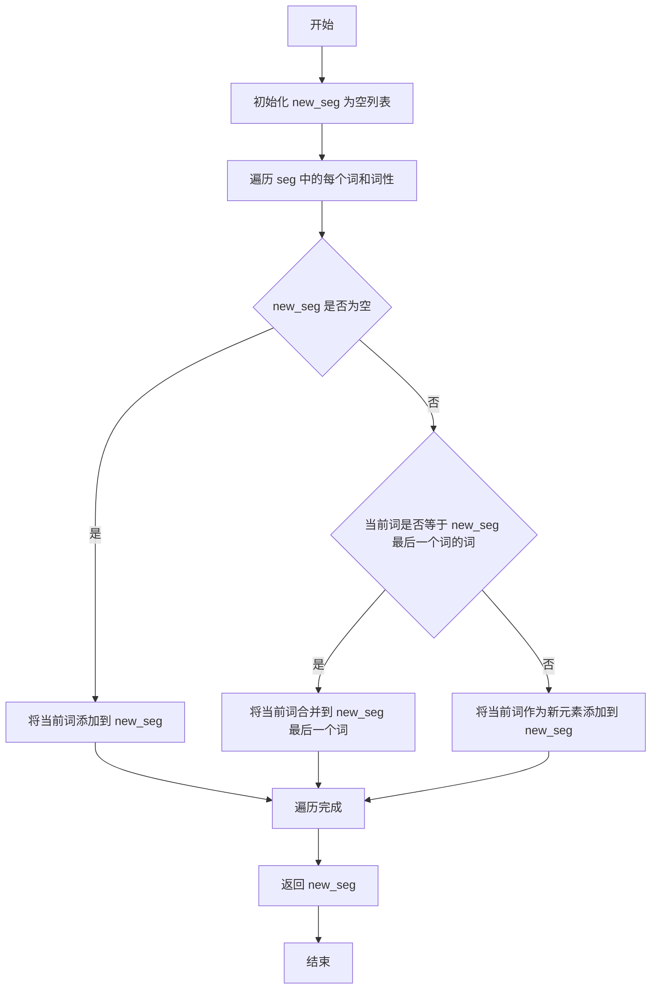

#### 带注释源码

```python
def _merge_reduplication(self, seg: List[Tuple[str, str]]) -> List[Tuple[str, str]]:
    """
    合并重叠词
    例如：['奶奶', 'n'], ['奶奶', 'n'] -> ['奶奶奶奶', 'n']
    
    参数:
        seg: 分词列表，每个元素是(词, 词性)的元组
    
    返回:
        合并重叠词后的分词列表
    """
    new_seg = []
    for i, (word, pos) in enumerate(seg):
        # 如果 new_seg 不为空，且当前词与 new_seg 最后一个词的词相同
        if new_seg and word == new_seg[-1][0]:
            # 将当前词合并到 new_seg 最后一个词
            new_seg[-1][0] = new_seg[-1][0] + seg[i][0]
        else:
            # 否则，将当前词作为新元素添加到 new_seg
            new_seg.append([word, pos])
    return new_seg
```


### `ToneSandhi.pre_merge_for_modify`

该方法是一个预处理合并操作，用于在音调修改（tone modification）之前，将中文分词结果中需要一起处理的字合并成更长的词素。这包括合并"不"字与其后面的词、合并"一"字与其周围的词、合并叠词、合并连续的三声调词组以及合并"儿"化音。这样可以减少分词错误导致的音调合并错误。

参数：

-  `seg`：`List[Tuple[str, str]]`，分词后的文本列表，每个元素为(词, 词性)的元组，如 [('听', 'v'), ('一', 'm'), ('听', 'v')]

返回值：`List[Tuple[str, str]]`，返回经过合并处理后的分词列表，每个元素仍为(词, 词性)的元组

#### 流程图

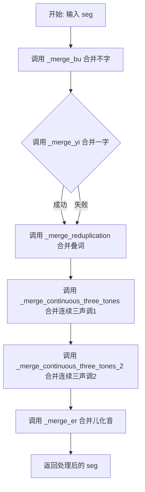

#### 带注释源码

```python
def pre_merge_for_modify(self, seg: List[Tuple[str, str]]) -> List[Tuple[str, str]]:
    """
    预处理合并操作，在音调修改前合并相关字词
    
    处理流程：
    1. 合并"不"和其后面的词 - 避免"不"单独出现导致音调错误
    2. 合并"一"和周围的重叠词/其后面的词 - 避免"一"单独出现导致音调错误
    3. 合并相邻的重复词（叠词）
    4. 合并连续两个都是三声调的词组
    5. 合并连续三声调的词语（首末字三声调）
    6. 合并"儿"化音
    """
    # 第一步：合并"不"和其后面的词
    # 例如："不" + "看" -> "不看"
    seg = self._merge_bu(seg)
    
    try:
        # 第二步：合并"一"和周围的词
        # 功能1：合并重叠词中间的"一"，如 "听"+"一"+"听" -> "听一听"
        # 功能2：合并单独的"一"和其后面的词
        seg = self._merge_yi(seg)
    except:
        # 如果合并失败，打印错误信息但继续执行
        print("_merge_yi failed")
    
    # 第三步：合并相邻的重复词（叠词）
    # 例如："看看" -> "看看"（保持原样，但确保连续相同词被识别）
    seg = self._merge_reduplication(seg)
    
    # 第四步：合并连续两个词都是三声调的情况
    # 例如："蒙古/包" -> "蒙古包"（两个三声调词合并）
    seg = self._merge_continuous_three_tones(seg)
    
    # 第五步：合并前一词末尾和后一词开头都是三声调的情况
    # 例如："好/喜欢" -> "好喜欢"
    seg = self._merge_continuous_three_tones_2(seg)
    
    # 第六步：合并"儿"化音
    # 例如："花"+"儿" -> "花儿"
    seg = self._merge_er(seg)
    
    # 返回合并处理后的分词结果
    return seg
```


### `ToneSandhi.modified_tone`

修改声调主方法，该方法是声调处理的入口点，按照特定顺序依次调用"不"字变调、"一"字变调、轻声处理和三声连读处理四个子方法，最终返回处理后的拼音韵母列表。

#### 参数

- `word`：`str`，输入的汉字词
- `pos`：`str`，词性标注（来自 jieba 分词）
- `finals`：`List[str]`，拼音韵母列表（如 `['ia1', 'i3']`）

#### 返回值

`List[str]`，处理后的拼音韵母列表

#### 流程图

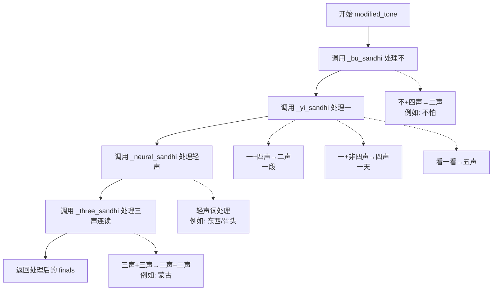

#### 带注释源码

```python
def modified_tone(self, word: str, pos: str, finals: List[str]) -> List[str]:
    """
    修改声调主方法
    
    按照特定顺序依次处理四种声调变化:
    1. "不"字变调 (Bu Sandhi)
    2. "一"字变调 (Yi Sandhi)  
    3. 轻声处理 (Neutral Tone Sandhi)
    4. 三声连读 (Three-tone Sandhi)
    
    Args:
        word: 输入的汉字词，如 "了不起"
        pos: 词性标注，如 "a" (形容词)
        finals: 原始拼音韵母列表，如 ['iao3', 'li3', 'qi3']
    
    Returns:
        处理后的拼音韵母列表，如 ['iao3', 'li2', 'qi2']
    """
    
    # 第一步：处理"不"的声调变化
    # 规则：
    #   - "不"在四声前读二声，如"不怕(bu4 -> bu2)"、"不要(bu4 -> bu2)"
    #   - 特殊情况："不"在复合词中不变调，如"不怕"作为一个词
    finals = self._bu_sandhi(word, finals)
    
    # 第二步：处理"一"的声调变化
    # 规则：
    #   - "一"在四声前读二声，如"一段(yi1 -> yi2)"
    #   - "一"在非四声前读四声，如"一天(yi1 -> yi4)"
    #   - "一"在重叠词中间读五声，如"看一看(yi1 -> yi5)"
    #   - "一"在序数词中读一声，如"第一(yi1)"
    finals = self._yi_sandhi(word, finals)
    
    # 第三步：处理轻声
    # 规则：
    #   - 重叠词第二个音节读轻声，如"奶奶(nai5 nai5)"
    #   - 助词"吧/呢/啊"等读轻声
    #   - 特定词汇必须读轻声，如"东西(dong1 xi)"、"骨头(gu2 tou)"
    #   - 方位词"上/下/里"等在某些词性下读轻声
    #   - 动词后"了/着/过"读轻声（代码中已注释）
    finals = self._neural_sandhi(word, pos, finals)
    
    # 第四步：处理三声连读
    # 规则：
    #   - 两个三声音节相连，前一个变二声，如"蒙古(meng2 gu3 -> meng2 gu2)"
    #   - 三个三声音节，按词语结构灵活处理
    #   - 四字成语按两字一组处理
    finals = self._three_sandhi(word, finals)
    
    # 返回处理后的韵母列表
    return finals
```


### `ToneSandhi.__init__`

这是`ToneSandhi`类的构造函数，负责初始化中文变调处理所需的词典数据和标点符号集合。该方法在对象创建时自动调用，配置中文语言处理中必需的词语规则集合，用于后续的声调变调处理。

参数：

- `self`：ToneSandhi，类的实例本身，无需显式传递

返回值：`None`，该方法为构造函数，不返回任何值

#### 流程图

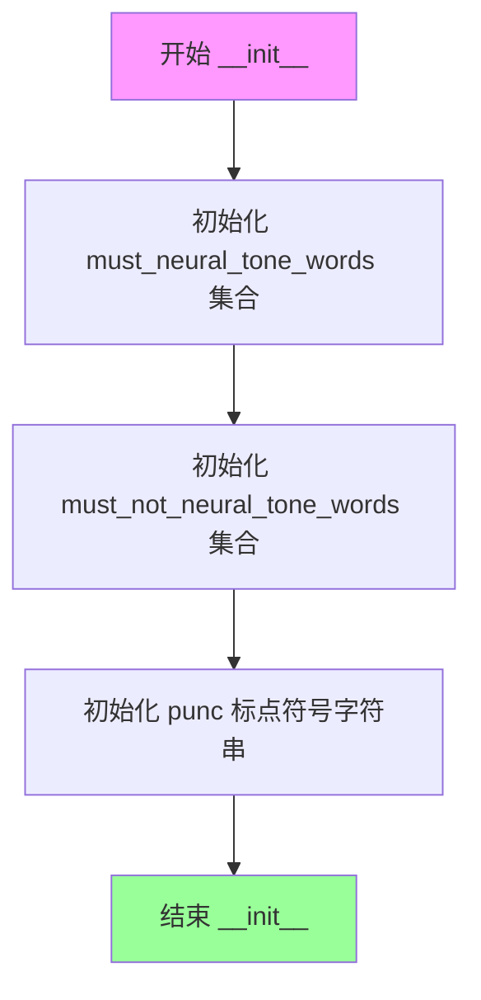

#### 带注释源码

```python
def __init__(self):
    """
    ToneSandhi 类的构造函数，初始化中文变调处理所需的词典数据。
    
    该构造函数初始化三个核心数据成员：
    1. must_neural_tone_words: 必须使用轻声的词语集合
    2. must_not_neural_tone_words: 不应使用轻声的词语集合  
    3. punc: 用于变调判断的标点符号集合
    """
    
    # 必须使用轻声的词语集合（大量中文词语在变调规则中需要读作轻声）
    # 这些词语在中文普通话中习惯上读作轻声，如"麻烦"、"麻利"、"鸳鸯"等
    self.must_neural_tone_words = {
        "麻烦",
        "麻利",
        "鸳鸯",
        "高粱",
        "骨头",
        "骆驼",
        "马虎",
        "首饰",
        "馒头",
        "馄饨",
        "风筝",
        "难为",
        "队伍",
        "阔气",
        "闺女",
        "门道",
        "锄头",
        "铺盖",
        "铃铛",
        "铁匠",
        "钥匙",
        "里脊",
        "里头",
        "部分",
        "那么",
        "道士",
        "造化",
        "迷糊",
        "连累",
        "这么",
        "这个",
        "运气",
        "过去",
        "软和",
        "转悠",
        "踏实",
        "跳蚤",
        "跟头",
        "趔趄",
        "财主",
        "豆腐",
        "讲究",
        "记性",
        "记号",
        "认识",
        "规矩",
        "见识",
        "裁缝",
        "补丁",
        "衣裳",
        "衣服",
        "衙门",
        "街坊",
        "行李",
        "行当",
        "蛤蟆",
        "蘑菇",
        "薄荷",
        "葫芦",
        "葡萄",
        "萝卜",
        "荸荠",
        "苗条",
        "苗头",
        "苍蝇",
        "芝麻",
        "舒服",
        "舒坦",
        "舌头",
        "自在",
        "膏药",
        "脾气",
        "脑袋",
        "脊梁",
        "能耐",
        "胳膊",
        "胭脂",
        "胡萝",
        "胡琴",
        "胡同",
        "聪明",
        "耽误",
        "耽搁",
        "耷拉",
        "耳朵",
        "老爷",
        "老实",
        "老婆",
        "老头",
        "老太",
        "翻腾",
        "罗嗦",
        "罐头",
        "编辑",
        "结实",
        "红火",
        "累赘",
        "糨糊",
        "糊涂",
        "精神",
        "粮食",
        "簸箕",
        "篱笆",
        "算计",
        "算盘",
        "答应",
        "笤帚",
        "笑语",
        "笑话",
        "窟窿",
        "窝囊",
        "窗户",
        "稳当",
        "稀罕",
        "称呼",
        "秧歌",
        "秀气",
        "秀才",
        "福气",
        "祖宗",
        "砚台",
        "码头",
        "石榴",
        "石头",
        "石匠",
        "知识",
        "眼睛",
        "眯缝",
        "眨巴",
        "眉毛",
        "相声",
        "盘算",
        "白净",
        "痢疾",
        "痛快",
        "疟疾",
        "疙瘩",
        "疏忽",
        "畜生",
        "生意",
        "甘蔗",
        "琵琶",
        "琢磨",
        "琉璃",
        "玻璃",
        "玫瑰",
        "玄乎",
        "狐狸",
        "状元",
        "特务",
        "牲口",
        "牙碜",
        "牌楼",
        "爽快",
        "爱人",
        "热闹",
        "烧饼",
        "烟筒",
        "烂糊",
        "点心",
        "炊帚",
        "灯笼",
        "火候",
        "漂亮",
        "滑溜",
        "溜达",
        "温和",
        "清楚",
        "消息",
        "浪头",
        "活泼",
        "比方",
        "正经",
        "欺负",
        "模糊",
        "槟榔",
        "棺材",
        "棒槌",
        "棉花",
        "核桃",
        "栅栏",
        "柴火",
        "架势",
        "枕头",
        "枇杷",
        "机灵",
        "本事",
        "木头",
        "木匠",
        "朋友",
        "月饼",
        "月亮",
        "暖和",
        "明白",
        "时候",
        "新鲜",
        "故事",
        "收拾",
        "收成",
        "提防",
        "挖苦",
        "挑剔",
        "指甲",
        "指头",
        "拾掇",
        "拳头",
        "拨弄",
        "招牌",
        "招呼",
        "抬举",
        "护士",
        "折腾",
        "扫帚",
        "打量",
        "打算",
        "打点",
        "打扮",
        "打听",
        "打发",
        "扎实",
        "扁担",
        "戒指",
        "懒得",
        "意识",
        "意思",
        "情形",
        "悟性",
        "怪物",
        "思量",
        "怎么",
        "念头",
        "念叨",
        "快活",
        "忙活",
        "志气",
        "心思",
        "得罪",
        "张罗",
        "弟兄",
        "开通",
        "应酬",
        "庄稼",
        "干事",
        "帮手",
        "帐篷",
        "希罕",
        "师父",
        "师傅",
        "巴结",
        "巴掌",
        "差事",
        "工夫",
        "岁数",
        "屁股",
        "尾巴",
        "少爷",
        "小气",
        "小伙",
        "将就",
        "对头",
        "对付",
        "寡妇",
        "家伙",
        "客气",
        "实在",
        "官司",
        "学问",
        "学生",
        "字号",
        "嫁妆",
        "媳妇",
        "媒人",
        "婆家",
        "娘家",
        "委屈",
        "姑娘",
        "姐夫",
        "妯娌",
        "妥当",
        "妖精",
        "奴才",
        "女婿",
        "头发",
        "太阳",
        "大爷",
        "大方",
        "大意",
        "大夫",
        "多少",
        "多么",
        "外甥",
        "壮实",
        "地道",
        "地方",
        "在乎",
        "困难",
        "嘴巴",
        "嘱咐",
        "嘟囔",
        "嘀咕",
        "喜欢",
        "喇嘛",
        "喇叭",
        "商量",
        "唾沫",
        "哑巴",
        "哈欠",
        "哆嗦",
        "咳嗽",
        "和尚",
        "告诉",
        "告示",
        "含糊",
        "吓唬",
        "后头",
        "名字",
        "名堂",
        "合同",
        "吆喝",
        "叫唤",
        "口袋",
        "厚道",
        "厉害",
        "千斤",
        "包袱",
        "包涵",
        "匀称",
        "勤快",
        "动静",
        "动弹",
        "功夫",
        "力气",
        "前头",
        "刺猬",
        "刺激",
        "别扭",
        "利落",
        "利索",
        "利害",
        "分析",
        "出息",
        "凑合",
        "凉快",
        "冷战",
        "冤枉",
        "冒失",
        "养活",
        "关系",
        "先生",
        "兄弟",
        "便宜",
        "使唤",
        "佩服",
        "作坊",
        "体面",
        "位置",
        "似的",
        "伙计",
        "休息",
        "什么",
        "人家",
        "亲戚",
        "亲家",
        "交情",
        "云彩",
        "事情",
        "买卖",
        "主意",
        "丫头",
        "丧气",
        "两口",
        "东西",
        "东家",
        "世故",
        "不由",
        "不在",
        "下水",
        "下巴",
        "上头",
        "上司",
        "丈夫",
        "丈人",
        "一辈",
        "那个",
        "菩萨",
        "父亲",
        "母亲",
        "咕噜",
        "邋遢",
        "费用",
        "冤家",
        "甜头",
        "介绍",
        "荒唐",
        "大人",
        "泥鳅",
        "幸福",
        "熟悉",
        "计划",
        "扑腾",
        "蜡烛",
        "姥爷",
        "照顾",
        "喉咙",
        "吉他",
        "弄堂",
        "蚂蚱",
        "凤凰",
        "拖沓",
        "寒碜",
        "糟蹋",
        "倒腾",
        "报复",
        "逻辑",
        "盘缠",
        "喽啰",
        "牢骚",
        "咖喱",
        "扫把",
        "惦记",
    }
    
    # 不应使用轻声的词语集合（这些词语虽然看起来是重复或复合词，但不应读作轻声）
    # 主要包括：男子、女子、分子等具有实际语义构词的词语
    self.must_not_neural_tone_words = {
        "男子",
        "女子",
        "分子",
        "原子",
        "量子",
        "莲子",
        "石子",
        "瓜子",
        "电子",
        "人人",
        "虎虎",
    }
    
    # 标点符号集合，用于变调规则中判断"一"后面是否为标点符号
    # 若是标点符号，"一"仍读一声
    self.punc = "：，；。？！""'''':,;.?!"
```


### `ToneSandhi._neural_sandhi`

该方法处理中文轻声（neutral tone）的声调变化，根据词性、词的结构特征（如重叠词、量词后缀、语气词等）以及预定义的必须读轻声的词汇集合，将符合规则的字的韵母声调转换为轻声（用"5"表示）。

参数：
- `word`：`str`，待处理的中文词语
- `pos`：`str`，jieba分词的词性标签（如"n"名词、"v"动词、"a"形容词、"r"代词等）
- `finals`：`List[str]`，词语的拼音韵母列表，每个元素如"ia1"、"i3"等，末尾数字表示声调

返回值：`List[str]`，处理后的拼音韵母列表，其中符合轻声规则的韵母声调被修改为"5"

#### 流程图

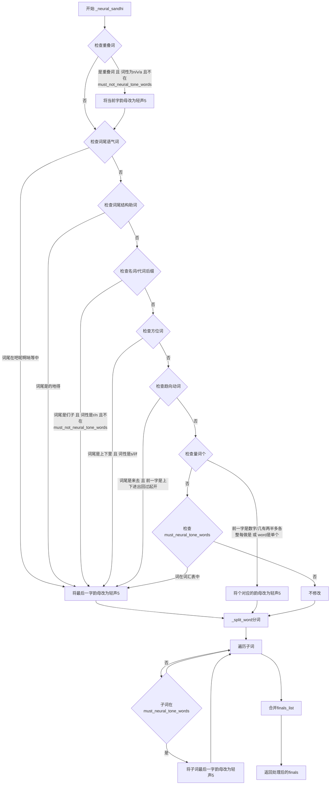

#### 带注释源码

```python
def _neural_sandhi(self, word: str, pos: str, finals: List[str]) -> List[str]:
    # 处理重叠词（如奶奶、试试、旺旺）
    # 对于名词(n)、动词(v)、形容词(a)，如果相邻字相同，且不在must_not_neural_tone_words中
    # 将后一个字的声调改为轻声5
    for j, item in enumerate(word):
        if (
            j - 1 >= 0
            and item == word[j - 1]
            and pos[0] in {"n", "v", "a"}
            and word not in self.must_not_neural_tone_words
        ):
            finals[j] = finals[j][:-1] + "5"
    
    # 查找"个"字的位置
    ge_idx = word.find("个")
    
    # 处理语气词结尾：将语气词的声调改为轻声5
    # 包括：吧呢啊呐噻嘛吖嗨呐哦哒额滴哩哟喽啰耶喔诶
    if len(word) >= 1 and word[-1] in "吧呢啊呐噻嘛吖嗨呐哦哒额滴哩哟喽啰耶喔诶":
        finals[-1] = finals[-1][:-1] + "5"
    # 处理结构助词结尾：将助词"的、地、得"的声调改为轻声5
    elif len(word) >= 1 and word[-1] in "的地得":
        finals[-1] = finals[-1][:-1] + "5"
    # 处理"了着过"等动态助词（已注释）
    # elif len(word) == 1 and word in "了着过" and pos in {"ul", "uz", "ug"}:
    #     finals[-1] = finals[-1][:-1] + "5"
    # 处理复数后缀"们"和名词后缀"子"
    # 条件：词长>1，词尾是"们"或"子"，词性是代词(r)或名词(n)，不在must_not_neural_tone_words中
    elif (
        len(word) > 1
        and word[-1] in "们子"
        and pos in {"r", "n"}
        and word not in self.must_not_neural_tone_words
    ):
        finals[-1] = finals[-1][:-1] + "5"
    # 处理方位词：桌上、地下、家里等
    # 词尾是"上下里"，词性是方位词(s)、处所词(l)、方向词(f)
    elif len(word) > 1 and word[-1] in "上下里" and pos in {"s", "l", "f"}:
        finals[-1] = finals[-1][:-1] + "5"
    # 处理复合趋向动词：上来、下去、进来、回去等
    # 词尾是"来"或"去"，且前一字是"上下进出回过起开"之一
    elif len(word) > 1 and word[-1] in "来去" and word[-2] in "上下进出回过起开":
        finals[-1] = finals[-1][:-1] + "5"
    # 处理量词"个"：当"个"作为量词时读轻声
    # 条件："个"前一个字是数字或特定量词/形容词，或整个词就是"个"
    elif (
        ge_idx >= 1
        and (
            word[ge_idx - 1].isnumeric()
            or word[ge_idx - 1] in "几有两半多各整每做是"
        )
    ) or word == "个":
        finals[ge_idx] = finals[ge_idx][:-1] + "5"
    else:
        # 处理必须读轻声的词汇：检查整个词或词的后两位是否在must_neural_tone_words中
        if (
            word in self.must_neural_tone_words
            or word[-2:] in self.must_neural_tone_words
        ):
            finals[-1] = finals[-1][:-1] + "5"

    # 使用jieba分词将词分割成子词
    word_list = self._split_word(word)
    # 将finals按子词长度分割成两个列表
    finals_list = [finals[: len(word_list[0])], finals[len(word_list[0]) :]]
    
    # 遍历每个子词，检查是否在必须读轻声的词汇表中
    for i, word in enumerate(word_list):
        # conventional neural in Chinese: 处理常规轻声词
        if (
            word in self.must_neural_tone_words
            or word[-2:] in self.must_neural_tone_words
        ):
            finals_list[i][-1] = finals_list[i][-1][:-1] + "5"
    
    # 合并处理后的韵母列表并返回
    finals = sum(finals_list, [])
    return finals
```


### `ToneSandhi._bu_sandhi`

该函数实现了汉语中"不"字的变调规则处理。当"不"字位于三字词中间位置（如"看不懂"）时，将"不"变调为轻声（5声）；当"不"字后面跟随第四声（去声）的字时，将"不"变调为第二声（如"不怕"）。

参数：

- `word`：`str`，待处理的汉字词组
- `finals`：`List[str]`，汉字对应的拼音韵母（含声调信息），如 `['u4', 'an3']`

返回值：`List[str]`，变调处理后的拼音韵母列表

#### 流程图

```mermaid
flowchart TD
    A[开始 _bu_sandhi] --> B{word长度是否等于3<br/>且word[1]是否为'不'}
    B -->|是| C[将finals[1]的声调改为5<br/>例如: u4 → u5]
    B -->|否| D[遍历word中的每个字符]
    D --> E{当前字符是否为'不'<br/>且下一字符存在<br/>且下一字符声调为4}
    E -->|是| F[将当前finals[i]的声调改为2<br/>例如: u4 → u2]
    E -->|否| G{是否还有未处理字符}
    G -->|是| D
    G -->|否| H[返回处理后的finals]
    C --> H
```

#### 带注释源码

```python
def _bu_sandhi(self, word: str, finals: List[str]) -> List[str]:
    """
    处理汉字"不"的变调规则
    
    变调规则：
    1. 当"不"位于三字词中间位置时，读轻声（5声），如"看不懂"
    2. 当"不"后面跟随第四声（去声）的字时，"不"读第二声，如"不怕"
    """
    # 情况一：三字词中"不"位于中间位置，读轻声
    # e.g. 看不懂
    if len(word) == 3 and word[1] == "不":
        # 将第二个音节的声调改为5（轻声）
        finals[1] = finals[1][:-1] + "5"
    else:
        # 情况二：遍历查找"不"字，根据后字声调决定变调
        for i, char in enumerate(word):
            # "不" before tone4 should be bu2, e.g. 不怕
            # 当"不"字后面跟随第四声的字时，"不"变为第二声
            if char == "不" and i + 1 < len(word) and finals[i + 1][-1] == "4":
                finals[i] = finals[i][:-1] + "2"
    return finals
```


### ToneSandhi._yi_sandhi

该函数是 ToneSandhi 类中的"一"变调处理方法，主要用于根据"一"在词中的位置和后续字的声调来修改其拼音韵母的声调。这是中文语音合成中实现自然语流的重要环节，涉及数词序列、叠词、序数词以及"一"与其他字的声调搭配规则。

参数：

- `word`：`str`，待处理的汉字词组，包含需要变调的"一"字
- `finals`：`List[str]`，该词组对应的拼音韵母列表（带声调），如 ["yi1", "tian1"]

返回值：`List[str]`，返回修改声调后的拼音韵母列表

#### 流程图

```mermaid
flowchart TD
    A[开始 _yi_sandhi] --> B{word 中是否包含"一"}
    B -->|否| C[直接返回 finals]
    B -->|是| D{"一"是否为数字序列的一部分}
    D -->|是| C
    D -->|否| E{word 长度为3<br/>且 word[1] == "一"<br/>且 word[0] == word[-1]}
    E -->|是| F[将 finals[1] 改为轻声 yi5]
    E -->|否| G{word 是否以"第一"开头}
    G -->|是| H[将 finals[1] 改为 yi1]
    G -->|否| I[遍历 word 中的每个字符]
    I --> J{找到"一"且<br/>i+1 < len(word)}
    J -->|否| K[返回 finals]
    J -->|是| L{finals[i+1][-1] == "4"}
    L -->|是| M[将 finals[i] 改为 yi2<br/>"一"在四声前变二声]
    L -->|否| N{word[i+1] 不是标点}
    N -->|是| O[将 finals[i] 改为 yi4<br/>"一"在非四声前变四声]
    N -->|否| P[保持一声]
    M --> K
    O --> K
    P --> K
```

#### 带注释源码

```python
def _yi_sandhi(self, word: str, finals: List[str]) -> List[str]:
    """
    处理汉字"一"的变调规则
    
    变调规则说明：
    1. 在数字序列中读原声调（一声），如"一零零"、"二一零"
    2. 在叠词中间读轻声（五声），如"看一看"、"试一试"
    3. 在序数词中读一声，如"第一"、"第一"
    4. 在四声（去声）前读二声，如"一段"、"一定"
    5. 在非四声前读四声，如"一天"、"一般"
    6. 在标点符号后保持一声
    """
    
    # 场景1："一"在数字序列中，如"一零零"、"二一零"
    # 检查word中除了"一"以外的字符是否全是数字
    if word.find("一") != -1 and all(
        [item.isnumeric() for item in word if item != "一"]
    ):
        return finals  # 数字序列中保持原声调，直接返回
    
    # 场景2："一"在叠词中间，如"看一看"、"试一试"
    # 条件：词长为3，"一"在中间位置，首尾字符相同
    elif len(word) == 3 and word[1] == "一" and word[0] == word[-1]:
        finals[1] = finals[1][:-1] + "5"  # 将"一"改为轻声（5声）
    
    # 场景3："一"作为序数词前缀，如"第一"、"第一个"
    elif word.startswith("第一"):
        finals[1] = finals[1][:-1] + "1"  # 序数词中"一"读一声
    
    # 场景4和5：处理其他情况下的"一"变调
    else:
        # 遍历词中的每个字符，查找"一"的位置
        for i, char in enumerate(word):
            if char == "一" and i + 1 < len(word):
                # "一"在四声（去声）前变二声，如"一段"、"一定"、"一致"
                if finals[i + 1][-1] == "4":
                    finals[i] = finals[i][:-1] + "2"
                # "一"在非四声前变四声
                else:
                    # 特殊处理：如果"一"后面是标点符号，仍读一声
                    if word[i + 1] not in self.punc:
                        finals[i] = finals[i][:-1] + "4"
    
    return finals
```


### `ToneSandhi._split_word`

该方法用于将一个中文词语拆分成两个子词，主要利用 jieba 的分词搜索功能获取可能的子词组合，然后根据子词在原词中的位置关系确定最终的拆分结果。

参数：

- `word`：`str`，需要拆分的中文词语

返回值：`List[str]`，拆分后得到的两个子词组成的列表

#### 流程图

```mermaid
flowchart TD
    A[开始: _split_word] --> B[使用 jieba.cut_for_search 对 word 分词]
    B --> C[按子词长度升序排序]
    C --> D[取最短的子词作为 first_subword]
    D --> E{first_subword 是否在词首位置?}
    E -->|是| F[second_subword = word[len(first_subword):]]
    E -->|否| G[second_subword = word[: -len(first_subword)]]
    F --> H[构建新词列表: [first_subword, second_subword]]
    G --> H
    H --> I[返回 new_word_list]
```

#### 带注释源码

```python
def _split_word(self, word: str) -> List[str]:
    """
    将一个词语拆分成两个子词
    
    使用 jieba 的分词搜索功能获取候选子词，按长度排序后取最短的作为第一个子词，
    然后根据该子词在原词中的位置确定第二个子词，形成两个子词的组合。
    
    参数:
        word: str，需要拆分的中文词语
    
    返回:
        List[str]: 包含两个子词的列表
    """
    # 使用 jieba 的 cut_for_search 获取可能的分词结果（包含子词）
    word_list = jieba.cut_for_search(word)
    # 将生成器转换为列表，并按子词长度升序排序
    # 这样最短的子词会排在前面
    word_list = sorted(word_list, key=lambda i: len(i), reverse=False)
    # 取最短的子词作为第一个子词
    first_subword = word_list[0]
    # 查找第一个子词在原词中的起始位置
    first_begin_idx = word.find(first_subword)
    
    # 判断第一个子词是否在词的开头
    if first_begin_idx == 0:
        # 如果在开头，第二个子词就是剩余部分
        second_subword = word[len(first_subword):]
        new_word_list = [first_subword, second_subword]
    else:
        # 如果不在开头，说明第一个子词是尾部，第二个子词是前缀部分
        second_subword = word[: -len(first_subword)]
        new_word_list = [second_subword, first_subword]
    
    return new_word_list
```


### ToneSandhi._three_sandhi

该方法实现汉语三声连读变调（tone sandhi）逻辑。当两个或三个连续汉字均为第三声时，按照汉语语音规则进行变调处理（如"蒙古"→"méng gǔ"变为"méng gǔ"实际读作"méng gǔ"第二个变二声），是中文语音处理的核心算法之一。

参数：
- `word`：`str`，需要处理变调的汉字词语
- `finals`：`List[str]`，汉字对应的拼音韵母列表（带声调标记，如["a3", "i3"]）

返回值：`List[str]`，处理后的拼音韵母列表，已完成三声连读变调

#### 流程图

```mermaid
flowchart TD
    A[开始 _three_sandhi] --> B{word长度 == 2?}
    B -->|Yes| C{所有韵母都是三声?}
    C -->|Yes| D[将第一个韵母变为二声]
    C -->|No| E[返回原finals]
    D --> Z[返回处理后的finals]
    E --> Z
    
    B -->|No| F{word长度 == 3?}
    F -->|Yes| G[使用_split_word分割词语]
    G --> H{所有韵母都是三声?}
    H -->|Yes| I{第一个子词长度 == 2?}
    I -->|Yes| J[将两个韵母都变为二声]
    I -->|No| K[将第二个韵母变为二声]
    H -->|No| L[按子词长度分割finals列表]
    L --> M{存在某个子词所有韵母都是三声且长度为2?}
    M -->|Yes| N[将该子词第一个韵母变为二声]
    M -->|No| O{第二个子词不是全三声且第一个子词末音是三声且第二个子词首音是三声?}
    O -->|Yes| P[将第一个子词最后一个韵母变为二声]
    O -->|No| Q[返回原finals]
    N --> R[合并所有子词的finals]
    P --> R
    Q --> Z
    R --> Z
    
    F -->|No| S{word长度 == 4?}
    S -->|Yes| T[将finals按位置2分割成两个子列表]
    T --> U[遍历每个子列表]
    U --> V{该子列表所有韵母都是三声?}
    V -->|Yes| W[将该子列表第一个韵母变为二声]
    V -->|No| X[不处理]
    W --> Y[合并所有子列表的finals]
    X --> Y
    Y --> Z
    
    S -->|No| Z
    
    Z[结束 _three_sandhi]
```

#### 带注释源码

```python
def _three_sandhi(self, word: str, finals: List[str]) -> List[str]:
    """
    处理三声连读变调
    
    汉语中的三声连读规则：
    - 两个第三声连续时，第一个变为第二声
    - 三个第三声连续时，前两个变为第二声（视词语结构而定）
    
    参数:
        word: 要处理的词语
        finals: 词语的拼音韵母列表，每个元素如 'a3' 表示第三声
    
    返回:
        处理后的韵母列表
    """
    
    # 情况1：词语长度为2
    if len(word) == 2 and self._all_tone_three(finals):
        # 如果两个字都是第三声，将第一个字变为第二声
        # 例如："蒙古" -> "méng gǔ" 实际读作 "méng gǔ"（第一个变二声）
        finals[0] = finals[0][:-1] + "2"
    
    # 情况2：词语长度为3
    elif len(word) == 3:
        # 使用分词方法将词语分成两部分（可能是双+单或单+双）
        word_list = self._split_word(word)
        
        if self._all_tone_three(finals):
            # 如果三个字都是第三声
            # 双音节 + 单音节，例如："蒙古/包"
            if len(word_list[0]) == 2:
                finals[0] = finals[0][:-1] + "2"
                finals[1] = finals[1][:-1] + "2"
            # 单音节 + 双音节，例如："纸/老虎"
            elif len(word_list[0]) == 1:
                finals[1] = finals[1][:-1] + "2"
        else:
            # 并非全部是第三声，需要根据具体情况处理
            # 将finals按子词长度分割成两个列表
            finals_list = [finals[: len(word_list[0])], finals[len(word_list[0]) :]]
            
            if len(finals_list) == 2:
                for i, sub in enumerate(finals_list):
                    # 例如："所有/人"，两个子词都是双字且全为三声
                    if self._all_tone_three(sub) and len(sub) == 2:
                        finals_list[i][0] = finals_list[i][0][:-1] + "2"
                    # 例如："好/喜欢"，第一个子词末尾是三声，第二个子词开头是三声
                    elif (
                        i == 1
                        and not self._all_tone_three(sub)
                        and finals_list[i][0][-1] == "3"
                        and finals_list[0][-1][-1] == "3"
                    ):
                        finals_list[0][-1] = finals_list[0][-1][:-1] + "2"
                # 合并处理后的两个子列表
                finals = sum(finals_list, [])
    
    # 情况3：词语长度为4（成语或双音节词）
    # 将成语分成两个双音节词分别处理三声连读
    elif len(word) == 4:
        finals_list = [finals[:2], finals[2:]]  # 按位置2分割成两个子列表
        finals = []
        for sub in finals_list:
            # 如果该子词所有韵母都是第三声，将其第一个变为第二声
            if self._all_tone_three(sub):
                sub[0] = sub[0][:-1] + "2"
            finals += sub

    return finals
```


### ToneSandhi._all_tone_three

该方法是一个辅助函数，用于检查给定的拼音韵母列表（finals）中的所有韵母是否都是第三声（tone three）。这是中文语音合成中三声连读变调规则判断的基础。

参数：

- `self`：ToneSandhi，类的实例本身
- `finals`：`List[str]`，拼音韵母列表，每个元素为带声调标记的韵母字符串（如"a1"、"i3"等）

返回值：`bool`，如果列表中所有韵母的最后一个字符都是"3"（即第三声），则返回True；否则返回False

#### 流程图

```mermaid
flowchart TD
    A[开始] --> B[遍历finals中的每个元素x]
    B --> C{x的最后一个字符 == '3'?}
    C -->|是| D{所有元素都已检查?}
    C -->|否| E[返回False]
    D -->|否| B
    D -->|是| F[返回True]
```

#### 带注释源码

```python
def _all_tone_three(self, finals: List[str]) -> bool:
    """
    检查给定的拼音韵母列表是否全部为第三声
    
    参数:
        finals: List[str] - 拼音韵母列表，每个元素为带声调标记的字符串
               例如：['a3', 'i3', 'u3'] 表示三个第三声韵母
    
    返回值:
        bool - 如果所有韵母都是第三声则返回True，否则返回False
    
    示例:
        >>> _all_tone_three(['a3', 'i3'])
        True
        >>> _all_tone_three(['a3', 'i4'])
        False
    """
    # 使用all()函数检查列表中的每一个元素
    # x[-1]获取字符串的最后一个字符（即声调标记）
    # 判断是否所有元素的声调都是"3"（第三声）
    return all(x[-1] == "3" for x in finals)
```


### `ToneSandhi._merge_bu`

该函数用于合并分词结果中的"不"字与其后面的词语，以避免因jieba分词导致"不"单独出现而产生声调（三声连读等）错误。

参数：

- `seg`：`List[Tuple[str, str]]`，输入的分词列表，每个元素为(词语, 词性标注)的元组

返回值：`List[Tuple[str, str]]`，合并"不"后的新分词列表

#### 流程图

```mermaid
flowchart TD
    A[开始: 输入seg列表] --> B[初始化new_seg为空列表, last_word为空字符串]
    C[遍历seg中的每个word和pos] --> D{last_word == "不"}
    D -->|是| E[word = last_word + word]
    D -->|否| F{word != "不"}
    F -->|是| G[将word和pos添加到new_seg]
    F -->|否| H[不添加, 保持跳过]
    E --> H
    H --> I[更新last_word = word]
    I --> J{还有更多元素?}
    J -->|是| C
    J -->|否| K{遍历结束后last_word == "不"}
    K -->|是| L[添加last_word和'd'到new_seg]
    K -->|否| M[返回new_seg]
    L --> M
```

#### 带注释源码

```python
# merge "不" and the word behind it
# if don't merge, "不" sometimes appears alone according to jieba, which may occur sandhi error
def _merge_bu(self, seg: List[Tuple[str, str]]) -> List[Tuple[str, str]]:
    """
    合并"不"和其后面的词语
    
    参数:
        seg: 分词列表，每个元素为(词语, 词性)的元组
    
    返回:
        合并后的分词列表
    """
    new_seg = []      # 存储合并后的新分词列表
    last_word = ""    # 记录上一个处理的词语
    
    # 遍历分词结果
    for word, pos in seg:
        # 如果上一个词是"不"，则与当前词合并
        if last_word == "不":
            word = last_word + word
        
        # 只有当词语不是单独的"不"时才添加到结果中
        # （单独的"不"会被合并到前一个词中）
        if word != "不":
            new_seg.append((word, pos))
        
        # 更新last_word为当前词（用于下一次迭代判断）
        last_word = word[:]  # 使用切片复制字符串
    
    # 处理最后一个词是"不"的情况
    # 例如："看不"这种词组，最后的"不"需要保留
    if last_word == "不":
        new_seg.append((last_word, "d"))  # "d"表示副词
        last_word = ""
    
    return new_seg
```


### `ToneSandhi._merge_yi`

该方法用于处理中文词组中"一"的合并问题，包含两个主要功能：一是将"一"与左右重复的动词合并（如"听"+"一"+"听"→"听一听"），二是将单独的"一"与其后面的词合并，以避免jieba分词后"一"单独出现导致声调错误。

参数：

- `self`：ToneSandhi类实例本身
- `seg`：`List[Tuple[str, str]]`，输入的分词结果列表，每个元素为(词, 词性)元组

返回值：`List[Tuple[str, str]]`，合并后的分词结果列表

#### 流程图

```mermaid
flowchart TD
    A[开始 _merge_yi] --> B[初始化 new_seg为空列表]
    B --> C{遍历 seg 中的每个词}
    C --> D{检查是否满足功能1条件<br/>word == '一' 且<br/>前后词相同 且<br/>前一个词是动词}
    D -->|是| E[将前一词与'一'合并<br/>形成 '前一词+一+前一词']
    D -->|否| F{检查是否满足跳过条件<br/>前两词为一且与当前词相同}
    F -->|是| G[跳过当前词不添加]
    F -->|否| H[将当前词添加到 new_seg]
    E --> I{继续遍历}
    G --> I
    H --> I
    I --> C
    C --> J{遍历完成?}
    J -->|否| C
    J --> K[重置 new_seg 为空列表]
    K --> L{遍历 seg 中的每个词}
    L --> M{检查 new_seg 最后一个词的第一个元素是否为'一'}
    M -->|是| N[将当前词合并到最后一个词后面<br/>形成 '一+当前词']
    M -->|否| O[将当前词添加到 new_seg]
    N --> P{继续遍历}
    O --> P
    P --> L
    L --> Q{遍历完成?}
    Q -->|否| L
    Q --> R[返回合并后的 new_seg]
    R --> Z[结束]
```

#### 带注释源码

```python
# 合并"一"和左右重复词，以及单独"一"和其后词语
# 功能1: 合并"一"和重叠词，如"听","一","听" -> "听一听"
# 功能2: 合并单独的"一"和它后面的词
# 如果不合并，jieba分词后"一"有时会单独出现，可能导致声调错误
def _merge_yi(self, seg: List[Tuple[str, str]]) -> List[Tuple[str, str]]:
    new_seg = []
    
    # ========== 功能1: 处理重叠词中的"一" ==========
    # 遍历分词结果，寻找"一"在两个相同词之间的情况
    # 例如: [('听', 'v'), ('一', 'm'), ('听', 'v')] -> ['听一听', 'v']
    for i, (word, pos) in enumerate(seg):
        # 检查是否满足合并条件:
        # 1. 当前词是"一"
        # 2. 前面有词(i-1 >= 0)
        # 3. 后面有词(i+1 < len(seg))
        # 4. 前面的词和后面的词相同
        # 5. 前面的词是动词(v)
        if (
            i - 1 >= 0
            and word == "一"
            and i + 1 < len(seg)
            and seg[i - 1][0] == seg[i + 1][0]
            and seg[i - 1][1] == "v"
        ):
            # 将"一"合并到重叠词中间，形成"A一A"形式
            new_seg[i - 1][0] = new_seg[i - 1][0] + "一" + new_seg[i - 1][0]
        else:
            # 检查是否需要跳过当前词(避免重复添加)
            # 情况: 前一个词是"一"，前前个词与当前词相同，且当前词是动词
            if (
                i - 2 >= 0
                and seg[i - 1][0] == "一"
                and seg[i - 2][0] == word
                and pos == "v"
            ):
                # 跳过当前词，因为已经在上面合并过了
                continue
            else:
                # 正常添加当前词到结果列表
                new_seg.append([word, pos])
    
    # 更新seg为第一阶段处理结果
    seg = new_seg
    # 重置new_seg用于第二阶段处理
    new_seg = []
    
    # ========== 功能2: 处理单独的"一" ==========
    # 合并"一"和它后面的词，如"一","听" -> "一听"
    for i, (word, pos) in enumerate(seg):
        if new_seg and new_seg[-1][0] == "一":
            # 如果前一个词是"一"，将当前词合并到"一"后面
            new_seg[-1][0] = new_seg[-1][0] + word
        else:
            # 否则正常添加当前词
            new_seg.append([word, pos])
    
    return new_seg
```


### ToneSandhi._merge_continuous_three_tones

该函数用于合并连续的三声调（tone three）词语。当相邻的两个词都是三声调时，如果满足特定条件（不是叠词且合并后总长度不超过3个字符），则将它们合并为一个词，以避免三声调连读时的声调变化错误。

参数：
- `seg`：`List[Tuple[str, str]]`，分词后的列表，每个元素为(词语, 词性)的元组

返回值：`List[Tuple[str, str]]`，合并连续三声调后的分词列表

#### 流程图

```mermaid
flowchart TD
    A[开始] --> B[初始化new_seg为空列表]
    B --> C[为seg中每个词语获取带声调的拼音finals]
    C --> D[创建merge_last标记数组,初始值为False]
    D --> E{遍历seg中的每个词语}
    E -->|是| F{i > 0 且 前一个词是三声调 且 当前词是三声调 且 前一个词未被合并}
    F -->|是| G{前一个词不是叠词 且 两词总长度 ≤ 3}
    G -->|是| H[将当前词合并到前一个词]
    G -->|否| I[将当前词作为新词加入new_seg]
    F -->|否| I
    E -->|否| I
    I --> J{遍历是否完成}
    J -->|否| E
    J -->|是| K[返回new_seg]
    K --> L[结束]
```

#### 带注释源码

```python
def _merge_continuous_three_tones(
    self, seg: List[Tuple[str, str]]
) -> List[Tuple[str, str]]:
    """
    合并连续的三声调词语
    当两个相邻的词语都是三声调时，如果满足条件则合并它们
    以避免三声调连读时的声调变化错误
    
    参数:
        seg: 分词后的列表，每个元素是(词语, 词性)的元组
    返回:
        合并连续三声调后的分词列表
    """
    new_seg = []
    # 使用lazy_pinyin获取每个词语的声调,neutral_tone_with_five=True表示用5表示轻声
    # Style.FINALS_TONE3表示返回带声调的韵母
    sub_finals_list = [
        lazy_pinyin(word, neutral_tone_with_five=True, style=Style.FINALS_TONE3)
        for (word, pos) in seg
    ]
    # 断言确保获取的声调数量与分词数量一致
    assert len(sub_finals_list) == len(seg)
    # 标记数组,记录每个位置的词是否已被合并
    merge_last = [False] * len(seg)
    # 遍历分词结果
    for i, (word, pos) in enumerate(seg):
        # 检查是否满足合并条件:
        # 1. i > 0: 不是第一个词
        # 2. 前一个词全是三声调
        # 3. 当前词全是三声调
        # 4. 前一个词未被合并过
        if (
            i - 1 >= 0
            and self._all_tone_three(sub_finals_list[i - 1])
            and self._all_tone_three(sub_finals_list[i])
            and not merge_last[i - 1]
        ):
            # 检查是否为叠词(叠词不能合并,因为叠词需要进行_neural_sandhi处理)
            # 且合并后总长度不超过3
            if (
                not self._is_reduplication(seg[i - 1][0])
                and len(seg[i - 1][0]) + len(seg[i][0]) <= 3
            ):
                # 将当前词合并到前一个词
                new_seg[-1][0] = new_seg[-1][0] + seg[i][0]
                merge_last[i] = True
            else:
                # 不满足合并条件,作为新词添加
                new_seg.append([word, pos])
        else:
            new_seg.append([word, pos])

    return new_seg
```


### `ToneSandhi._merge_continuous_three_tones_2`

该函数用于合并连续的上声音节（第三声），当第一个词的最后一个字符和第二个词的第一个字符都是第三声时，将这两个词合并为一个词。这是汉语连续变调规则的一部分，主要处理如"蒙古包"、"纸老虎"等词语的变调。

参数：

- `self`：`ToneSandhi`，ToneSandhi类的实例，包含变调规则所需的词典和配置
- `seg`：`List[Tuple[str, str]]`，分词后的词列表，每个元素为(word, pos)元组，其中word是词语，pos是词性标注

返回值：`List[Tuple[str, str]]`，合并连续上声后的新词列表

#### 流程图

```mermaid
flowchart TD
    A[开始] --> B[初始化new_seg和merge_last]
    B --> C[使用lazy_pinyin获取每个词的声调]
    C --> D[断言检查sub_finals_list与seg长度一致]
    D --> E{遍历seg中的每个词}
    E -->|i=0| F[直接添加到new_seg]
    E -->|i>0| G{检查合并条件}
    G --> H{前一词最后一个字符是第三声?}
    H -->|是| I{当前词第一个字符是第三声?}
    I -->|是| J{前一词未被合并?}
    J -->|是| K{前一词不是叠词?}
    K -->|是| L{两词总长度≤3?}
    L -->|是| M[合并两词到new_seg[-1], 标记merge_last[i]=True]
    L -->|否| N[不合并, 当前词添加到new_seg]
    K -->|否| N
    J -->|否| N
    I -->|否| N
    H -->|否| N
    N --> O{遍历是否结束?}
    O -->|未结束| E
    O -->|已结束| P[返回new_seg]
    F --> O
    M --> O
```

#### 带注释源码

```python
# 处理连续上声（第三声）合并的函数
# 规则：当第一个词的最后一个字和第二个词的第一个字都是第三声时，
# 在符合条件的情况下合并这两个词
def _merge_continuous_three_tones_2(
    self, seg: List[Tuple[str, str]]
) -> List[Tuple[str, str]]:
    """
    合并连续上声音节
    
    当第一个词的最后一个字是第三声，且第二个词的第一个字也是第三声时，
    根据变调规则合并这两个词。例如："蒙古/包" -> "蒙古包"，"纸/老虎" -> "纸老虎"
    
    Args:
        seg: 分词后的词列表，每个元素为(词语, 词性)元组
        
    Returns:
        合并连续上声后的新词列表
    """
    new_seg = []  # 存储合并后的新分词结果
    
    # 获取每个词的声调表示
    # 使用lazy_pinyin将汉字转换为带声调的拼音
    # neutral_tone_with_five=True 表示用5表示轻声
    # Style.FINALS_TONE3 表示返回带声调韵母格式
    sub_finals_list = [
        lazy_pinyin(word, neutral_tone_with_five=True, style=Style.FINALS_TONE3)
        for (word, pos) in seg
    ]
    
    # 断言检查：确保声调列表长度与原始分词结果一致
    assert len(sub_finals_list) == len(seg)
    
    # merge_last数组标记每个位置的词是否已被合并
    # 避免重复合并已处理的词
    merge_last = [False] * len(seg)
    
    # 遍历分词结果，处理每个词
    for i, (word, pos) in enumerate(seg):
        # 检查是否满足合并条件：
        # 1. 不是第一个词（i - 1 >= 0）
        # 2. 前一个词的最后一个字是第三声（sub_finals_list[i - 1][-1][-1] == "3"）
        # 3. 当前词的第一个字是第三声（sub_finals_list[i][0][-1] == "3"）
        # 4. 前一个词尚未被合并（not merge_last[i - 1]）
        if (
            i - 1 >= 0
            and sub_finals_list[i - 1][-1][-1] == "3"
            and sub_finals_list[i][0][-1] == "3"
            and not merge_last[i - 1]
        ):
            # 额外的合并条件检查：
            # 1. 前一个词不是叠词（如"奶奶"、"试试"等）
            #    因为叠词需要保留进行_neural_sandhi处理
            # 2. 两个词的总长度不超过3个字符
            if (
                not self._is_reduplication(seg[i - 1][0])
                and len(seg[i - 1][0]) + len(seg[i][0]) <= 3
            ):
                # 合并：将当前词添加到前一个词的末尾
                new_seg[-1][0] = new_seg[-1][0] + seg[i][0]
                # 标记当前词已被合并
                merge_last[i] = True
            else:
                # 不满足合并条件，正常添加当前词
                new_seg.append([word, pos])
        else:
            # 不满足合并条件，正常添加当前词
            new_seg.append([word, pos])
    
    return new_seg
```


### `ToneSandhi._merge_er`

该方法用于合并汉语分词结果中的"儿"化词，将"儿"字与其前面的词语合并，以避免拼音标注错误。

参数：

- `seg`：`List[Tuple[str, str]]`，分词后的词语列表，每个元素为(词语, 词性)元组

返回值：`List[Tuple[str, str]]`，合并"儿"化词后的词语列表

#### 流程图

```mermaid
flowchart TD
    A[开始] --> B[初始化 new_seg 为空列表]
    B --> C{遍历 seg 中的每个词语}
    C --> D{i - 1 >= 0 且 word == '儿' 且 seg[i-1][0] != '#'?}
    D -->|是| E[将 '儿' 合并到 new_seg 最后一个词的末尾]
    D -->|否| F[将当前词添加到 new_seg]
    E --> G{还有更多词语?}
    F --> G
    G -->|是| C
    G -->|否| H[返回 new_seg]
```

#### 带注释源码

```python
def _merge_er(self, seg: List[Tuple[str, str]]) -> List[Tuple[str, str]]:
    """
    合并"儿"化词
    将"儿"字与前面的词语合并，避免jieba分词后"儿"字单独出现导致拼音标注错误
    
    参数:
        seg: 分词后的词语列表，每个元素为(词语, 词性)元组
             例如: [('小孩', 'n'), ('儿', 'n')]
    返回:
        合并"儿"化词后的词语列表
             例如: [('小孩儿', 'n')]
    """
    new_seg = []
    for i, (word, pos) in enumerate(seg):
        # 判断条件：
        # 1. i - 1 >= 0: 不是第一个词
        # 2. word == "儿": 当前词是"儿"
        # 3. seg[i - 1][0] != "#": 前一个词不是占位符"#"
        if i - 1 >= 0 and word == "儿" and seg[i - 1][0] != "#":
            # 将"儿"合并到前一个词的末尾
            # 例如：['小孩', '儿'] -> ['小孩儿']
            new_seg[-1][0] = new_seg[-1][0] + seg[i][0]
        else:
            # 不需要合并，保持原样
            new_seg.append([word, pos])
    return new_seg
```


### `ToneSandhi._merge_reduplication`

该方法用于合并分词结果中连续出现的重叠词（重复词），例如将两个连续的“奶奶”合并为“奶奶奶奶”，以确保后续的声调处理（如轻声变调）能够正确识别和处理这类词汇。

参数：

- `seg`：`List[Tuple[str, str]]`，分词后的词语列表，每个元素为(词语, 词性)的元组

返回值：`List[Tuple[str, str]]`，合并重叠词后的新列表

#### 流程图

```mermaid
flowchart TD
    A[开始: 输入 seg 列表] --> B[初始化 new_seg 为空列表]
    B --> C{遍历 seg 中的每个词}
    C -->|是| D{new_seg 是否为空}
    D -->|否| E{当前词 word == new_seg 最后一个词的词语}
    E -->|是| F[将当前词追加到 new_seg 最后一个词后面]
    E -->|否| G[将当前词作为新元素添加到 new_seg]
    D -->|是| G
    F --> H{遍历是否结束}
    G --> H
    H -->|否| C
    H -->|是| I[返回 new_seg]
    I --> J[结束]
```

#### 带注释源码

```python
def _merge_reduplication(self, seg: List[Tuple[str, str]]) -> List[Tuple[str, str]]:
    """
    合并连续出现的重叠词（重复词）
    
    该方法遍历分词结果，将连续出现的相同词语合并为一个词。
    例如：["奶奶", "奶奶"] -> ["奶奶奶奶"]
    
    参数:
        seg: 分词后的词语列表，每个元素为(词语, 词性)的元组
        
    返回:
        合并重叠词后的新列表
    """
    # 初始化结果列表
    new_seg = []
    
    # 遍历输入的分词结果
    for i, (word, pos) in enumerate(seg):
        # 如果结果列表不为空，且当前词与前一个词相同
        if new_seg and word == new_seg[-1][0]:
            # 将当前词合并到前一个词的后面
            new_seg[-1][0] = new_seg[-1][0] + seg[i][0]
        else:
            # 否则，将当前词作为新元素添加到结果列表
            # 注意：这里使用append添加的是列表 [word, pos]，而不是元组
            new_seg.append([word, pos])
    
    # 返回合并后的结果
    return new_seg
```


### `ToneSandhi.pre_merge_for_modify`

该方法是音调合并的预处理函数，对输入的分词片段进行一系列合并操作，以解决中文音调变调（tone sandhi）问题。它按顺序调用多个合并方法，处理"不"、"一"、叠词、连续三声和"儿"化音等情况，为后续的声调修改做准备。

参数：

- `seg`：`List[Tuple[str, str]]`，输入的分词片段列表，每个元素为(词语, 词性)元组

返回值：`List[Tuple[str, str]]`，经过合并处理后的分词片段列表

#### 流程图

```mermaid
flowchart TD
    A[开始: pre_merge_for_modify] --> B[调用 _merge_bu 合并&#39;不&#39;和后续词]
    B --> C[调用 _merge_yi 合并&#39;一&#39;相关词语]
    C --> D[调用 _merge_reduplication 合并叠词]
    D --> E[调用 _merge_continuous_three_tones 合并连续三声词]
    E --> F[调用 _merge_continuous_three_tones_2 合并三声边界词]
    F --> G[调用 _merge_er 合并&#39;儿&#39;化音]
    G --> H[返回处理后的 seg]
```

#### 带注释源码

```python
def pre_merge_for_modify(self, seg: List[Tuple[str, str]]) -> List[Tuple[str, str]]:
    """
    预处理合并函数，对分词片段进行一系列合并操作以处理音调变调
    
    处理流程：
    1. 合并"不"与后面词语 - 避免"不"单独出现导致变调错误
    2. 合并"一"与重叠词或后面词语 - 如"听一听"、"看一下"
    3. 合并重叠词 - 如"奶奶"、"试试"
    4. 合并连续三声音节 - 三声连读变调
    5. 合并三声边界情况 - 最后一字与首字都是三声
    6. 合并儿化音 - "儿"字与前面词语合并
    
    参数:
        seg: 分词片段列表，每个元素为(词语, 词性)元组
        
    返回:
        合并处理后的分词片段列表
    """
    # 步骤1: 合并"不"和后面的词，如"不"+"怕" -> "不怕"
    seg = self._merge_bu(seg)
    
    # 步骤2: 合并"一"相关的词，可能抛出异常需要捕获
    try:
        seg = self._merge_yi(seg)
    except:
        print("_merge_yi failed")
    
    # 步骤3: 合并重叠词，如"奶奶"、"叔叔"
    seg = self._merge_reduplication(seg)
    
    # 步骤4: 合并连续三声音节，如"蒙古/包" -> "蒙古包"
    seg = self._merge_continuous_three_tones(seg)
    
    # 步骤5: 合并三声边界情况，如"好/喜欢"
    seg = self._merge_continuous_three_tones_2(seg)
    
    # 步骤6: 合并儿化音，如"小孩"+"儿" -> "小孩儿"
    seg = self._merge_er(seg)
    
    return seg
```


### `ToneSandhi.modified_tone`

该函数是ToneSandhi类的核心方法，负责对汉字词的拼音韵母进行声调修改处理。它按照特定顺序依次应用"不"变调、"一"变调、轻声变调和三声连读变调规则，最终返回修改后的拼音韵母列表。

参数：

- `word`：`str`，需要处理声调的汉字词
- `pos`：`str`，jieba分词后的词性标注
- `finals`：`List[str]`，汉字对应的拼音韵母（带声调），如['ia1', 'i3']

返回值：`List[str]`，经过声调变调规则处理后的拼音韵母列表

#### 流程图

```mermaid
flowchart TD
    A[开始: modified_tone] --> B[调用 _bu_sandhi]
    B --> C{根据"不"的位置和后字声调}
    C -->|后字是四声| D[将"不"改为二声 bu2]
    C -->|其他情况| E[保持原声调]
    D --> F[调用 _yi_sandhi]
    E --> F
    F --> G{处理"一"的多音情况}
    G -->|数词序列中的"一"| H[保持一声]
    G -->|重叠词中间的"一"| I[改为五声 yi5]
    G -->|序数词"第一"| J[保持一声 yi1]
    G -->|其他情况| K{判断后字声调}
    K -->|后字四声| L[改为二声 yi2]
    K -->|后字非四声| M[改为四声 yi4]
    H --> N[调用 _neural_sandhi]
    I --> N
    J --> N
    L --> N
    M --> N
    E --> N
    N --> O{处理轻声规则}
    O -->|重叠词| P[末字改为五声]
    O -->|语气词/助词| Q[末字改为五声]
    O -->|复数后缀| R[末字改为五声]
    O -->|方位词/趋向词| S[末字改为五声]
    O -->|特定词汇| T[末字改为五声]
    P --> U[调用 _three_sandhi]
    Q --> U
    R --> U
    S --> U
    T --> U
    U --> V{处理三声连读}
    V -->|两字词全三声| W[首字改为二声]
    V -->|三字词| X{根据词语结构}
    X -->|双音节+单音节| Y[前两字改为二声]
    X -->|单音节+双音节| Z[后两字改为二声]
    X -->|其他| AA[逐个判断]
    V -->|四字词| AB[按两字分组处理]
    W --> AC[返回修改后的 finals]
    Y --> AC
    Z --> AC
    AA --> AC
    AB --> AC
```

#### 带注释源码

```python
def modified_tone(self, word: str, pos: str, finals: List[str]) -> List[str]:
    """
    对汉字词的拼音韵母进行声调修改处理
    
    该方法是ToneSandhi类的核心入口，按顺序应用四个声调变调规则：
    1. 不变调规则 (_bu_sandhi)
    2. 一不变调规则 (_yi_sandhi)
    3. 轻声规则 (_neural_sandhi)
    4. 三声连读规则 (_three_sandhi)
    
    参数:
        word: str, 输入的汉字词，如"看不上"
        pos: str, jieba分词后的词性标注，如"v"
        finals: List[str], 原始拼音韵母列表，如['an4', 'shang4', 'shang5']
    
    返回:
        List[str]: 处理后的拼音韵母列表，如['an4', 'shang2', 'shang5']
    """
    # 第一步：应用"不"变调规则
    # 处理"不"在四声字前变为二声的情况，如"不怕"、"不要"
    finals = self._bu_sandhi(word, finals)
    
    # 第二步：应用"一"变调规则
    # 处理"一"的多音情况：数词序列中保持一声，
    # 重叠词中间变为五声，四声前变二声，非四声前变四声
    finals = self._yi_sandhi(word, finals)
    
    # 第三步：应用轻声规则
    # 处理需要读轻声的词语，包括重叠词、语气词、助词、方位词等
    finals = self._neural_sandhi(word, pos, finals)
    
    # 第四步：应用三声连读规则
    # 处理两个或三个三声字连读时，第一个或前几个变为二声的情况
    # 如"蒙古"、"完整"、"老虎"等
    finals = self._three_sandhi(word, finals)
    
    return finals
```

## 关键组件


### ToneSandhi 类

中文声调变调处理类，用于处理中文语音合成中的变调规则，包括轻声、"不"、"一"和三声连读等变调逻辑。

### must_neural_tone_words 字典

存储必须读轻声的词语集合，包含约400+个常用词，如"麻烦"、"麻利"、"鸳鸯"等。

### must_not_neural_tone_words 字典

存储不应该读轻声的词语集合，包含"男子"、"女子"、"分子"等词。

### punc 变量

存储标点符号集合，用于判断"一"后面的字符是否为标点符号。

### _neural_sandhi 方法

处理轻声变调规则，根据词性、位置和词语规则将某些音节调整为轻声（5声）。

### _bu_sandhi 方法

处理"不"字的变调规则：当"不"在第四声字前面时，"不"读第二声。

### _yi_sandhi 方法

处理"一"字的变调规则：根据位置和后续音节的声调，"一"可读一声、二声或四声。

### _three_sandhi 方法

处理三声连读变调规则：当两个或三个三声音节连读时，前一个或多个音节变为二声。

### _split_word 方法

使用jieba分词库将词语分割成子词，用于更精细的变调处理。

### _all_tone_three 方法

判断音节列表是否全部为三声的辅助函数。

### _merge_bu 方法

合并"不"与后续词语，防止分词错误导致的变调错误。

### _merge_yi 方法

合并"一"与重叠词或后续词语，如"听一听"、"看一下"等。

### _merge_continuous_three_tones 方法

合并连续三声音节，处理完整的双音节或三音节词组的变调。

### _merge_continuous_three_tones_2 方法

处理首尾相连的三声音节变调规则。

### _merge_er 方法

合并儿化音，如"花儿"。

### _merge_reduplication 方法

合并重叠词，如"奶奶"、"试试"。

### pre_merge_for_modify 方法

预处理合并操作，依次执行多种合并逻辑，为后续变调处理做准备。

### modified_tone 方法

主变调处理方法，按顺序执行"不"、"一"、轻声和三声连读变调处理。


## 问题及建议


### 已知问题

-   **硬编码词典问题**：大量词汇（must_neural_tone_words、must_not_neural_tone_words）硬编码在类中，无法动态扩展或从外部配置加载，修改时需要修改源代码
-   **代码重复**：_merge_continuous_three_tones 和 _merge_continuous_three_tones_2 方法存在大量重复代码，逻辑相似度高
-   **错误处理不足**：_merge_yi 方法中的 try-except 块仅打印错误消息，未进行实际的异常处理或错误恢复
-   **性能效率低下**：多个方法（_merge_continuous_three_tones、_merge_continuous_three_tones_2）在每次调用时都使用 lazy_pinyin 重新计算拼音，对于相同输入存在重复计算
-   **缺少输入验证**：方法参数（如 word、pos、finals）缺少有效性验证，可能导致运行时错误
-   **类型注解不完整**：部分方法返回类型标注不准确，如 _merge_yi 返回 List[List[str]] 而非声明的 List[Tuple[str, str]]
-   **文档缺失**：类和方法缺少文档字符串（docstring），难以理解其设计意图和使用方式
-   **命名不一致**：类中混合使用下划线命名（snake_case）和部分不符合 Python 风格的命名
-   **魔法数字/字符串**：声调标记（"5"、"4"、"2"、"1"）和词性标记散落在代码中，缺乏常量定义
-   **分词逻辑脆弱**：_split_word 方法依赖 jieba 分词结果，当分词结果不符合预期时（如 word_list 为空）可能导致索引越界

### 优化建议

-   将 must_neural_tone_words 和 must_not_neural_tone_words 抽取为外部配置文件（如 JSON/YAML），通过构造函数或配置模块加载
-   提取 _merge_continuous_three_tones 和 _merge_continuous_three_tones_2 的公共逻辑为独立方法，使用策略模式或参数化减少重复
-   实现完整的异常处理机制，根据错误类型进行相应恢复或回退处理
-   引入缓存机制（如 functools.lru_cache）存储已计算的拼音结果，避免重复计算
-   在方法入口添加参数校验，使用断言或显式检查确保输入合法性
-   完善类型注解，确保声明与实际返回类型一致
-   为类和关键方法添加文档字符串，说明功能、参数和返回值
-   定义声调常量类和词性常量类，统一管理魔法值
-   优化 _split_word 方法，添加空列表和异常情况的处理逻辑
-   考虑提取公共接口方法，简化外部调用流程


## 其它


### 设计目标与约束

该模块旨在实现中文拼音声调变化（Tone Sandhi）的自动化处理，主要服务于中文语音合成（TTS）系统，确保生成的中文发音符合自然语言的发音规则。设计约束包括：1）仅处理拼音的声调变化，不涉及音素层面的其他变换；2）依赖jieba分词和pypinyin库进行基础分词和拼音标注；3）遵循现代汉语普通话的声调连读规则。

### 错误处理与异常设计

代码中错误处理机制较为薄弱，主要体现在：1）`_merge_yi`方法中使用空except捕获所有异常并仅打印错误信息，可能导致静默失败；2）缺乏对输入参数的类型校验和边界检查；3）未对jieba或pypinyin库的异常进行专门处理。建议改进方向：建立统一的异常处理类，针对分词失败、拼音转换失败等场景设计具体的异常类型，并提供回退策略。

### 数据流与状态机

数据流处理遵循以下流程：输入文本经过jieba分词得到词序列 → 预处理合并（`_pre_merge_for_modify`）处理"不"、"一"、重叠词、连续三声等 → 对每个词调用`modified_tone`依次执行`_bu_sandhi`、`_yi_sandhi`、`_neural_sandhi`、`_three_sandhi`四类声调规则 → 输出修改后的拼音韵母序列。整个过程可视为有限状态机的状态转换，但当前实现未显式建模状态机。

### 外部依赖与接口契约

主要依赖：1）jieba库（`jieba.cut_for_search`）用于中文分词；2）pypinyin库（`lazy_pinyin`、`Style.FINALS_TONE3`）用于获取拼音和韵母。公开接口为`ToneSandhi`类的公开方法，但当前设计中`modified_tone`和`pre_merge_for_modify`为公开方法，而其他以下划线开头的方法为私有实现细节。接口契约不清晰，缺少文档注释说明输入输出格式。

### 性能考虑与优化空间

性能瓶颈：1）`_merge_continuous_three_tones`和`_merge_continuous_three_tones_2`方法中每次调用都使用`lazy_pinyin`重新计算韵母，重复计算开销大；2）`_split_word`方法每次都调用jieba分词，可考虑缓存；3）大量字符串操作（如`word.find()`、`word[-1]`）可优化。优化建议：引入缓存机制存储分词和拼音结果；使用列表推导式优化循环；考虑使用编译后的正则表达式替代字符串操作。

### 可扩展性设计

当前设计在可扩展性方面存在局限：1）声调规则硬编码在类方法中，新增规则需要修改源码；2）`must_neural_tone_words`和`must_not_neural_tone_words`词典以硬编码形式存在，未支持外部配置或动态加载；3）缺乏插件化机制支持不同方言或口音的声调规则。改进方向：设计规则引擎或策略模式，将声调规则抽象为可配置的数据结构，支持通过配置文件或数据库扩展规则集。

### 代码质量与测试

代码存在以下质量问题：1）部分注释为中文但不够规范，如"e.g."混用；2）缺乏单元测试和集成测试；3）`_neural_sandhi`方法过长（超过60行），违反单一职责原则；4）魔法数字和字符串散布各处，如`"5"`、`"4"`、`"3"`、`"2"`等声调标记缺乏常量定义。测试方面完全缺失，建议补充针对各类声调场景的单元测试，特别是边界条件和特殊字符处理。

### 版本兼容性与维护性

代码使用Python 3类型注解（`from typing import List, Tuple`），但未指定Python版本要求。依赖库jieba和pypinyin的版本兼容性未明确声明。建议：1）添加`__init__.py`或`__version__`变量；2）使用`requirements.txt`或`setup.py`声明依赖版本；3）添加类型注解的完整覆盖（当前部分方法缺少返回类型注解）。

### 国际化与本地化

该模块专注于中文语言处理，当前设计未考虑国际化需求。若需支持其他声调语言（如泰语、越南语），需重构为可插拔的语言处理器架构。

    