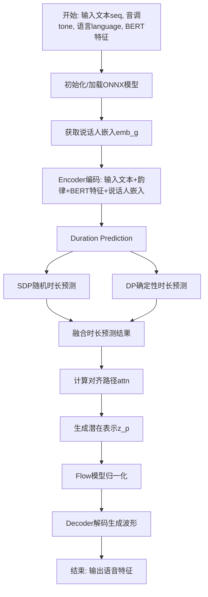
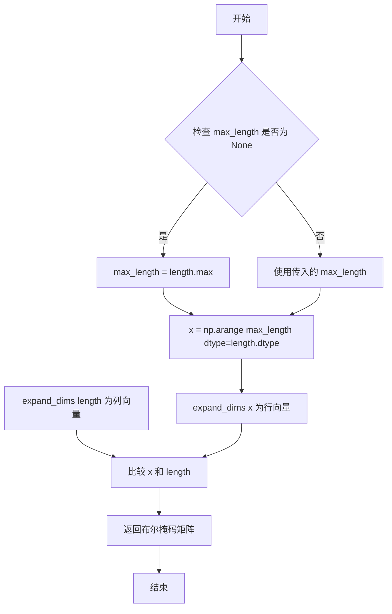
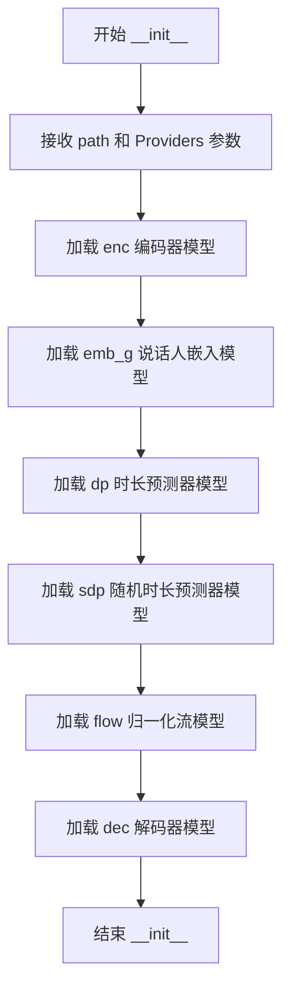

# `Bert-VITS2\onnx_modules\V200_OnnxInference\__init__.py` 详细设计文档

这是一个基于ONNX运行时的高质量语音合成(TTS)推理框架，通过多个神经网络模型(Encoder、Embedding、Duration Predictor、Stochastic Duration Predictor、Flow、Decoder)协作，将文本序列、音调、语言标识和多语言BERT特征转换为语音波形。

## 整体流程



## 类结构

```
全局函数
├── convert_pad_shape (形状转换)
├── sequence_mask (序列掩码生成)
└── generate_path (对齐路径生成)

OnnxInferenceSession (ONNX推理会话类)
├── 字段: enc, emb_g, dp, sdp, flow, dec (6个ONNX会话)
└── 方法: __init__, __call__
```

## 全局变量及字段


### `convert_pad_shape`
    
将pad_shape从[b, 2, n]格式转换为[n*2]列表

类型：`function`
    


### `sequence_mask`
    
生成序列掩码，用于标识有效位置

类型：`function`
    


### `generate_path`
    
根据duration和mask生成对齐路径

类型：`function`
    


### `OnnxInferenceSession.self.enc`
    
Encoder编码器模型会话

类型：`ort.InferenceSession`
    


### `OnnxInferenceSession.self.emb_g`
    
全局说话人嵌入模型会话

类型：`ort.InferenceSession`
    


### `OnnxInferenceSession.self.dp`
    
Duration Predictor持续时间预测模型会话

类型：`ort.InferenceSession`
    


### `OnnxInferenceSession.self.sdp`
    
Stochastic Duration Predictor随机持续时间预测模型会话

类型：`ort.InferenceSession`
    


### `OnnxInferenceSession.self.flow`
    
Flow归一化流模型会话

类型：`ort.InferenceSession`
    


### `OnnxInferenceSession.self.dec`
    
Decoder解码器模型会话

类型：`ort.InferenceSession`
    
    

## 全局函数及方法


### `convert_pad_shape`

该函数是一个工具函数，用于将嵌套的填充形状列表（例如 `[[1, 2], [3, 4]]`）反转并展平为单层列表（例如 `[3, 4, 1, 2]`），以适配特定的维度顺序要求（如音频处理中常用的 `[时间, 频率]` 转换为 `[频率, 时间]`）。

参数：

-  `pad_shape`：`List[List[int]]`，嵌套的整数列表，表示多维填充形状（例如 `[[left, right], [top, bottom]]`）。

返回值：`List[int]`，展平并反转后的单层整数列表。

#### 流程图

```mermaid
graph LR
    A[输入: pad_shape<br/>嵌套列表] --> B[操作: 列表反转 [::-1]]
    B --> C[操作: 嵌套列表展平<br/>item for sublist in layer]
    C --> D[输出: pad_shape<br/>单层列表]
```

#### 带注释源码

```python
def convert_pad_shape(pad_shape):
    """
    将嵌套的填充形状列表展平为单层列表。
    通常用于处理需要特定维度顺序（如 [W, H] -> [H, W]）的填充参数。

    参数:
        pad_shape (List): 嵌套的填充形状列表。

    返回:
        List: 展平后的填充形状列表。
    """
    # 步骤1: 反转列表顺序。
    # 这在处理图像或音频张量填充时常用，以确保维度顺序匹配
    # (例如将 [时间维, 频率维] 转换为 [频率维, 时间维])。
    layer = pad_shape[::-1]
    
    # 步骤2: 使用列表推导式将嵌套结构展平为单层列表。
    # 这会将 [[a, b], [c, d]] 转换为 [c, d, a, b] (假设前面已经反转过)。
    pad_shape = [item for sublist in layer for item in sublist]
    
    return pad_shape
```

#### 关键组件信息
- **输入适配器**: 该函数作为数据预处理器，负责清洗和格式化数据，以符合下游 ONNX 推理模块（如 `OnnxInferenceSession`）中可能对填充参数的特殊格式要求。

#### 潜在的技术债务或优化空间
1.  **缺乏输入验证**: 函数未检查 `pad_shape` 是否为空、是否为列表或是否为二维结构。传入错误类型可能导致运行时错误。
2.  **变量名覆盖**: 在函数内部直接使用 `pad_shape` 覆盖了输入参数，虽然节省内存，但在调试时可能造成混淆（建议重命名为 `flattened_pad_shape`）。
3.  **灵活性不足**: 目前的逻辑是固定“反转后展平”。如果后续需要不同的展平策略（如仅展平不反转），则需要修改函数体或新增函数。

#### 其它项目
- **设计目标**: 简洁的数据格式转换，确保数据符合特定顺序的算法需求。
- **错误处理**: 目前无显式错误处理，依赖调用方传入合法数据。建议添加类型检查（如 `isinstance(pad_shape, list)`）以提升鲁棒性。
- **数据流**: 该函数处于数据预处理阶段，接收原始配置参数，输出标准化的填充向量。


### `sequence_mask`

生成序列掩码矩阵，用于根据给定的序列长度生成布尔掩码，常用于变长序列处理。

参数：

- `length`：`np.ndarray`，表示序列长度的数组，形状为 (batch_size,) 或包含任意维度
- `max_length`：`Optional[np.ndarray]`，可选参数，指定掩码的最大长度。如果为 `None`，则使用 `length` 数组中的最大值

返回值：`np.ndarray`，布尔类型的掩码矩阵，形状为 (batch_size, max_length)，其中 `True` 表示该位置在序列长度内，`False` 表示超出序列长度

#### 流程图



#### 带注释源码

```python
def sequence_mask(length, max_length=None):
    """
    生成序列掩码矩阵
    
    参数:
        length: 序列长度数组
        max_length: 最大长度，默认为None则使用length中的最大值
    
    返回:
        布尔掩码矩阵，形状为 (batch_size, max_length)
    """
    # 如果未指定最大长度，则使用length数组中的最大值作为上界
    if max_length is None:
        max_length = length.max()
    
    # 生成从0到max_length-1的数组，dtype与length保持一致
    # 形状: (max_length,)
    x = np.arange(max_length, dtype=length.dtype)
    
    # 将x扩展为行向量: (1, max_length)
    # 将length扩展为列向量: (batch_size, 1)
    # 利用广播机制比较，得到 (batch_size, max_length) 的布尔矩阵
    return np.expand_dims(x, 0) < np.expand_dims(length, 1)
```

#### 使用示例

```python
import numpy as np

# 示例1: 简单使用
length = np.array([3, 5, 2])
mask = sequence_mask(length)
print(mask)
# 输出:
# [[ True  True  True False False]
#  [ True  True  True  True  True]
#  [ True  True False False False]]

# 示例2: 指定最大长度
length = np.array([3, 5, 2])
mask = sequence_mask(length, max_length=6)
print(mask)
# 输出:
# [[ True  True  True False False False]
#  [ True  True  True  True  True False]
#  [ True  True False False False False]]
```


### `generate_path`

该函数根据给定的音素持续时间（duration）和注意力掩码（mask）生成文本与音素之间的对齐路径（alignment path），输出一个二值矩阵，指示每个输出时间步对应哪个输入音素。

参数：

- `duration`：`np.ndarray`，形状为 [b, 1, t_x]，表示每个音素的持续时间（帧数），b 为批量大小，t_x 为音素序列长度
- `mask`：`np.ndarray`，形状为 [b, 1, t_y, t_x]，表示注意力掩码，t_y 为输出序列长度

返回值：`np.ndarray`，形状为 [1, b, t_x, t_y]（或等价的批处理形式），返回文本与音素的对齐路径矩阵，用于后续的注意力对齐操作

#### 流程图

```mermaid
flowchart TD
    A[开始: generate_path] --> B[从mask获取形状 b, _, t_y, t_x]
    B --> C[计算累积持续时间 cum_duration = np.cumsum(duration, axis=-1)]
    C --> D[将cum_duration展平为 b*t_x 长度]
    D --> E[调用sequence_mask生成基础路径矩阵 path]
    E --> F[将pathreshape回 b, t_x, t_y]
    F --> G[使用XOR和pad计算帧边界差分]
    G --> H[扩展维度并转置为 [1, b, t_x, t_y]]
    H --> I[返回对齐路径]
```

#### 带注释源码

```python
def generate_path(duration, mask):
    """
    根据音素持续时间和掩码生成文本与音素的对齐路径
    
    参数:
        duration: [b, 1, t_x] - 每个音素的持续时间（帧数）
        mask: [b, 1, t_y, t_x] - 注意力掩码
    返回:
        path: [1, b, t_x, t_y] - 对齐路径矩阵
    """
    
    # 从mask中提取批量大小b、输出长度t_y和输入长度t_x
    b, _, t_y, t_x = mask.shape
    
    # 计算累积持续时间，沿最后一个轴求和
    # 作用：将每个音素的持续时间转换为结束位置索引
    cum_duration = np.cumsum(duration, -1)
    
    # 展平累积持续时间以便生成sequence mask
    # 形状从 [b, 1, t_x] 变为 [b*t_x]
    cum_duration_flat = cum_duration.reshape(b * t_x)
    
    # 生成基础路径矩阵：用于指示每个累积位置是否达到
    # 返回 [b*t_x, t_y] 的布尔矩阵
    path = sequence_mask(cum_duration_flat, t_y)
    
    # 重新整形为 [b, t_x, t_y]
    path = path.reshape(b, t_x, t_y)
    
    # 使用XOR和pad计算帧边界差分
    # np.pad在第二个维度（t_x）前添加一行0，然后与原矩阵进行XOR操作
    # 效果：检测每个音素的开始和结束位置，创建离散的帧分配
    # path ^ np.pad(path, ((0, 0), (1, 0), (0, 0)))[:, :-1]
    # 这行操作将累积的mask转换为每个音素的独立区间
    path = path ^ np.pad(path, ((0, 0), (1, 0), (0, 0)))[:, :-1]
    
    # 扩展维度并转置，将输出转换为 [1, b, t_x, t_y] 格式
    # 转置将输出维度放在最后，便于后续matmul操作
    path = np.expand_dims(path, 1).transpose(0, 1, 3, 2)
    
    return path
```


### `OnnxInferenceSession.__init__`

该方法是 `OnnxInferenceSession` 类的构造函数，负责初始化并加载6个ONNX运行时推理会话，用于文本到语音（TTS）模型的不同组件，包括编码器(enc)、说话人嵌入(emb_g)、时长预测器(dp)、随机时长预测器(sdp)、归一化流(flow)和解码器(dec)。

参数：

- `self`：隐式参数，OnnxInferenceSession 实例本身
- `path`：`Dict[str, str]`，字典类型，包含6个ONNX模型文件路径的字典，键分别为 "enc"（编码器模型）、"emb_g"（说话人嵌入模型）、"dp"（时长预测器模型）、"sdp"（随机时长预测器模型）、"flow"（归一化流模型）、"dec"（解码器模型）
- `Providers`：`List[str]`，可选参数，列表类型，ONNX Runtime 执行提供者列表，默认为 ["CPUExecutionProvider"]

返回值：`None`，无返回值，作为构造函数初始化对象状态

#### 流程图



#### 带注释源码

```python
class OnnxInferenceSession:
    def __init__(self, path, Providers=["CPUExecutionProvider"]):
        """
        初始化 ONNX 推理会话，加载6个TTS模型
        
        参数:
            path: 包含6个ONNX模型文件路径的字典
            Providers: ONNX Runtime执行提供者列表，默认为CPU执行提供者
        """
        # 加载编码器(Encoder)模型，用于处理输入序列、韵母、声调和语言特征
        self.enc = ort.InferenceSession(path["enc"], providers=Providers)
        
        # 加载说话人嵌入(Embedding)模型，用于生成说话人特征向量
        self.emb_g = ort.InferenceSession(path["emb_g"], providers=Providers)
        
        # 加载时长预测器(Duration Predictor)模型，用于预测音素持续时间
        self.dp = ort.InferenceSession(path["dp"], providers=Providers)
        
        # 加载随机时长预测器(Stochastic Duration Predictor)模型，用于随机预测持续时间
        self.sdp = ort.InferenceSession(path["sdp"], providers=Providers)
        
        # 加载归一化流(Flow)模型，用于潜在变量转换
        self.flow = ort.InferenceSession(path["flow"], providers=Providers)
        
        # 加载解码器(Decoder)模型，用于从潜在表示生成最终音频
        self.dec = ort.InferenceSession(path["dec"], providers=Providers)
```


### OnnxInferenceSession.__call__

该方法是VITS TTS模型的核心推理方法，通过ONNX Runtime执行完整的文本到语音流程，包括说话人嵌入获取、编码器特征提取、时长预测（SDP/DP）、流归一化和解码器声码化，最终输出音频波形数据。

参数：

- `seq`：`np.ndarray`，输入文本序列，形状为[batch, seq_len]，值为词索引
- `tone`：`np.ndarray`，音调序列，形状为[batch, seq_len]，值为音调索引
- `language`：`np.ndarray`，语言序列，形状为[batch, seq_len]，值为语言索引
- `bert_zh`：`np.ndarray`，中文BERT嵌入特征，形状为[batch, seq_len, bert_dim]
- `bert_jp`：`np.ndarray`，日文BERT嵌入特征，形状为[batch, seq_len, bert_dim]
- `bert_en`：`np.ndarray`，英文BERT嵌入特征，形状为[batch, seq_len, bert_dim]
- `sid`：`np.ndarray`，说话人ID，形状为[batch]
- `seed`：`int`，随机种子，用于生成噪声，默认为114514
- `seq_noise_scale`：`float`，序列噪声缩放系数，用于控制z_p的随机噪声强度，默认为0.8
- `sdp_noise_scale`：`float`，SDP噪声缩放系数，用于控制zinput的随机噪声强度，默认为0.6
- `length_scale`：`float`，输出长度缩放系数，用于控制输出音频长度，默认为1.0
- `sdp_ratio`：`float`，SDP/DP混合比例，0.0表示完全使用DP，1.0表示完全使用SDP，默认为0.0

返回值：`np.ndarray`，生成的音频波形数据，形状为[batch, 1, wave_len]

#### 流程图

```mermaid
flowchart TD
    A[输入: seq, tone, language, bert_zh, bert_jp, bert_en, sid] --> B[维度扩展: 确保seq/tone/language为2D]
    B --> C[说话人嵌入: emb_g.run获取g]
    C --> D[编码器处理: enc.run输出x, m_p, logs_p, x_mask]
    D --> E[噪声生成: 使用seed生成zinput]
    E --> F[时长预测: sdp.run + dp.run加权计算logw]
    F --> G[时长扩展: 计算w, w_ceil, y_lengths, y_mask]
    G --> H[注意力路径: generate_path生成attn]
    H --> I[时长对齐: matmul计算m_p和logs_p的时间扩展]
    I --> J[噪声注入: z_p = m_p + randn * exp(logs_p) * seq_noise_scale]
    J --> K[流归一化: flow.run处理z_p得到z]
    K --> L[解码器声码化: dec.run输出最终音频]
    L --> M[返回音频波形]
```

#### 带注释源码

```python
def __call__(
    self,
    seq,
    tone,
    language,
    bert_zh,
    bert_jp,
    bert_en,
    sid,
    seed=114514,
    seq_noise_scale=0.8,
    sdp_noise_scale=0.6,
    length_scale=1.0,
    sdp_ratio=0.0,
):
    """
    VITS TTS主推理方法，执行完整的文本到语音流程
    
    参数:
        seq: 输入文本序列索引 [batch, seq_len]
        tone: 音调序列索引 [batch, seq_len]  
        language: 语言序列索引 [batch, seq_len]
        bert_zh/jp/en: 各语言BERT特征 [batch, seq_len, bert_dim]
        sid: 说话人ID [batch]
        seed: 随机种子
        seq_noise_scale: 序列噪声强度系数
        sdp_noise_scale: SDP噪声强度系数
        length_scale: 输出长度缩放因子
        sdp_ratio: SDP与DP的混合比例
    """
    
    # 维度扩展：确保输入为2D数组（batch维度）
    if seq.ndim == 1:
        seq = np.expand_dims(seq, 0)
    if tone.ndim == 1:
        tone = np.expand_dims(tone, 0)
    if language.ndim == 1:
        language = np.expand_dims(language, 0)
    
    # 维度断言：验证输入维度正确
    assert (seq.ndim == 2, tone.ndim == 2, language.ndim == 2)
    
    # 1. 说话人嵌入获取：将sid转换为说话人嵌入向量
    g = self.emb_g.run(
        None,
        {
            "sid": sid.astype(np.int64),
        },
    )[0]
    g = np.expand_dims(g, -1)  # [batch, embed_dim, 1]
    
    # 2. 编码器前向传播：提取文本语义特征
    enc_rtn = self.enc.run(
        None,
        {
            "x": seq.astype(np.int64),
            "t": tone.astype(np.int64),
            "language": language.astype(np.int64),
            "bert_0": bert_zh.astype(np.float32),
            "bert_1": bert_jp.astype(np.float32),
            "bert_2": bert_en.astype(np.float32),
            "g": g.astype(np.float32),
        },
    )
    x, m_p, logs_p, x_mask = enc_rtn[0], enc_rtn[1], enc_rtn[2], enc_rtn[3]
    # x: [batch, d_model, seq_len], m_p: 均值, logs_p: 对数方差, x_mask: 掩码
    
    # 3. 噪声生成：使用随机种子生成确定性噪声
    np.random.seed(seed)
    zinput = np.random.randn(x.shape[0], 2, x.shape[2]) * sdp_noise_scale
    
    # 4. 时长预测：混合SDP和DP的预测结果
    logw = self.sdp.run(
        None, {"x": x, "x_mask": x_mask, "zin": zinput.astype(np.float32), "g": g}
    )[0] * (sdp_ratio) + self.dp.run(None, {"x": x, "x_mask": x_mask, "g": g})[
        0
    ] * (
        1 - sdp_ratio
    )
    
    # 5. 时长扩展：计算扩展后的长度和掩码
    w = np.exp(logw) * x_mask * length_scale  # 指数化并应用掩码和长度缩放
    w_ceil = np.ceil(w)  # 上取整得到离散时长
    y_lengths = np.clip(np.sum(w_ceil, (1, 2)), a_min=1.0, a_max=100000).astype(
        np.int64
    )  # 计算每个样本的总输出长度
    y_mask = np.expand_dims(sequence_mask(y_lengths, None), 1)  # 输出掩码
    attn_mask = np.expand_dims(x_mask, 2) * np.expand_dims(y_mask, -1)  # 注意力掩码
    
    # 6. 注意力路径生成：建立输入序列到输出序列的对齐关系
    attn = generate_path(w_ceil, attn_mask)
    
    # 7. 特征时长对齐：将均值和方差沿时间轴扩展
    m_p = np.matmul(attn.squeeze(1), m_p.transpose(0, 2, 1)).transpose(
        0, 2, 1
    )  # [b, t', t], [b, t, d] -> [b, d, t']
    logs_p = np.matmul(attn.squeeze(1), logs_p.transpose(0, 2, 1)).transpose(
        0, 2, 1
    )  # [b, t', t], [b, t, d] -> [b, d, t']
    
    # 8. 潜在变量采样：从预测分布中采样
    z_p = (
        m_p
        + np.random.randn(m_p.shape[0], m_p.shape[1], m_p.shape[2])
        * np.exp(logs_p)
        * seq_noise_scale
    )
    
    # 9. 流归一化：通过可逆流变换
    z = self.flow.run(
        None,
        {
            "z_p": z_p.astype(np.float32),
            "y_mask": y_mask.astype(np.float32),
            "g": g,
        },
    )[0]
    
    # 10. 解码器声码化：将潜在变量转换为音频波形
    return self.dec.run(None, {"z_in": z.astype(np.float32), "g": g})[0]
```

## 关键组件


### 张量索引与形状操作

通过 `sequence_mask`、`convert_pad_shape` 和 `generate_path` 函数实现张量形状的转换、序列掩码生成以及注意力路径的计算，支持变长序列的对齐处理。

### 路径生成算法 (generate_path)

基于累积持续时间 (cum_duration) 和掩码 (mask) 计算帧级别的对齐路径，通过按位异或操作和转置生成用于注意力机制的对齐矩阵。

### ONNX 推理会话管理 (OnnxInferenceSession)

封装 six 个 ONNX 模型（enc、emb_g、dp、sdp、flow、dec）的加载与推理，提供统一的调用接口，支持 CPU/GPU 执行提供者配置。

### 嵌入与条件向量生成

使用 sid (speaker ID) 通过 emb_g 模型生成说话人嵌入向量 g，作为全局条件输入到后续所有模型中。

### 编码器特征提取

将音素序列 (seq)、音调 (tone)、语言标识 (language) 和 BERT 文本Embedding编码为隐层表示，输出 x、均值 m_p、对数方差 logs_p 和掩码 x_mask。

### 随机时长预测 (SDP)

结合高斯噪声 (zinput) 和 SDP 模型生成随机化的时长对数概率，通过 sdp_ratio 与 DP 结果加权融合，支持语音合成的多样性。

### 注意力对齐与特征传播

使用 generate_path 生成的路径将编码器特征 (m_p, logs_p) 通过矩阵乘法传播到目标时长维度，实现源序列到目标序列的特征对齐。

### 潜在向量采样

从高斯分布采样潜在向量 z_p，均值由 m_p 决定，标准差由 logs_p 控制，并叠加 seq_noise_scale 倍的噪声以增加随机性。

### 归一化流变换 (Flow)

使用 flow 模型将带噪声的潜在向量 z_p 转换为更符合分布的 z，提升生成质量。

### 解码器语音合成

使用 dec 模型将流变换后的潜在向量 z 解码为最终的梅尔频谱或语音特征，输出合成语音。

### 随机种子控制

通过 `np.random.seed(seed)` 固定随机数生成器种子，确保推理结果的可复现性。


## 问题及建议


### 已知问题

- **硬编码的随机种子**：使用 `np.random.seed(seed)` 影响全局随机状态，在多线程并发调用时会导致不确定行为，且 `seed=114514` 作为默认值缺乏灵活性
- **缺乏错误处理**：ONNX模型加载和推理过程没有任何异常捕获，模型文件缺失或推理失败时会直接崩溃
- **冗余的类型转换**：多处重复调用 `astype`，如 `sid.astype(np.int64)` 和多次 `np.float32` 转换，可合并优化
- **Magic Numbers 缺乏解释**：如 `seq_noise_scale=0.8`、`sdp_noise_scale=0.6`、`length_scale=1.0`、`sdp_ratio=0.0` 等关键参数无注释说明其作用
- **缺少类型注解**：函数参数和返回值均无类型提示，降低代码可读性和维护性
- **中间变量内存占用**：大量中间计算结果（如 `enc_rtn`、`attn`、`z_p`）未显式释放，在长序列推理时可能导致内存压力
- **模型输出未验证**：未对各模型输出进行空值或形状校验，若ONNX模型输出异常，后续计算可能产生难以追踪的错误
- **Provider 配置不够灵活**：硬编码默认使用 CPUExecutionProvider，未考虑 GPU 可用性的自动检测
- **reshape 顺序隐患**：`cum_duration.reshape(b * t_x)` 假设展平顺序正确，若维度顺序理解有误会导致隐藏 bug

### 优化建议

- **替换随机数生成方式**：使用 `numpy.random.Generator` 或 `numpy.random.default_rng(seed)` 替代全局 seed，避免影响其他模块的随机行为
- **添加完整的错误处理**：为模型加载和每次 `run()` 调用添加 try-except，捕获 `OrtSession` 异常并提供有意义的错误信息
- **合并类型转换**：在输入准备阶段统一进行类型转换，减少重复的 `astype` 调用
- **提取配置类**：将噪声比例、长度缩放等超参数封装为配置类或 dataclass，提供默认值和文档注释
- **添加类型注解**：为所有函数参数和返回值添加 `typing` 注解，提升代码可读性
- **显式管理内存**：在关键位置使用 `del` 释放不再使用的中间变量，或考虑使用 in-place 操作
- **增加输出验证**：在模型推理后添加基本的形状和数值范围检查，确保后续计算的安全性
- **动态 Provider 选择**：添加逻辑检测 CUDA 是否可用，优先使用 GPU provider
- **添加日志记录**：在关键步骤添加 logging，方便生产环境调试和问题追踪

## 其它


### 设计目标与约束

本代码设计目标为实现基于ONNX Runtime的高效语音合成推理系统，支持中英日三种语言的文本到语音转换。约束条件包括：输入序列长度受限于模型最大支持长度（100000），输出波形长度受内存和计算资源限制，模型推理需在CPU或指定加速器上执行，推理过程需保证低延迟以满足实时应用需求。

### 错误处理与异常设计

代码中的错误处理机制主要包括：输入维度检查（使用assert验证seq、tone、language的维度为2维），数值范围限制（使用np.clip限制y_lengths在1到100000之间），空值和类型检查隐含在ONNX Runtime的推理过程中。异常类型包括：维度不匹配异常（当输入为1维时自动扩展为2维），数值溢出异常（通过clip和ceil防止），模型加载异常（由ONNX Runtime抛出）。建议增加更详细的异常捕获和自定义异常类，为不同错误场景提供明确的错误码和错误信息。

### 数据流与状态机

数据流主要分为以下阶段：输入预处理阶段（维度扩展、类型转换）→ 说话人嵌入阶段（sid生成全局嵌入g）→ 编码器阶段（enc生成隐表示x、均值m_p、对数方差logs_p、掩码x_mask）→ 时长预测阶段（sdp和dp分别预测时长，加权合并后计算w）→ 路径生成阶段（generate_path生成注意力路径attn）→ 潜在变量生成阶段（z_p通过注意力机制和噪声生成）→ 流式归一化阶段（flow处理z_p生成z）→ 解码阶段（dec最终生成波形）。状态机表现为从左到右的顺序执行流程，各阶段输出作为下一阶段输入，形成单向数据流。

### 外部依赖与接口契约

主要外部依赖包括：numpy（数值计算，版本要求≥1.20）、onnxruntime（ONNX模型推理，版本要求≥1.10）。接口契约方面：convert_pad_shape接收list类型pad_shape，返回list类型；sequence_mask接收ndarray类型length和可选max_length，返回ndarray类型布尔值；generate_path接收ndarray类型duration和mask，返回ndarray类型路径；OnnxInferenceSession构造函数接收str类型path（字典结构，包含enc、emb_g、dp、sdp、flow、dec六个ONNX文件路径）和list类型Providers；__call__方法接收多个ndarray类型输入（seq、tone、language、bert_zh、bert_jp、bert_en、sid）和float/int类型参数（seed、seq_noise_scale、sdp_noise_scale、length_scale、sdp_ratio），返回ndarray类型波形数据。

### 性能考虑与优化建议

性能瓶颈主要体现在：numpy随机数生成（seed设置和zinput生成）、矩阵运算（matmul操作）、多次ONNX模型推理调用。优化方向包括：批量推理支持（当前主要针对单样本优化）、模型融合（将多个小模型合并减少推理次数）、内存预分配（复用中间结果缓冲区）、异步推理（对于支持并行执行的模型）、ONNX Runtime会话选项优化（设置GraphOptimizationLevel、execution providers配置）。可使用ONNX Runtime的Profiling工具进行性能分析。

### 安全性考虑

输入验证方面存在风险：未验证ONNX文件路径合法性、未检查输入数组的数值范围（bert特征值应控制在合理范围内）、未限制seq和tone的具体取值范围（应与词汇表大小匹配）。安全建议：添加路径存在性检查、输入数值范围校验、ONNX模型元数据验证、防止模型文件被篡改（可添加签名验证）。同时需要考虑sid（说话人ID）的合法性验证，避免越界访问。

### 配置参数详细说明

path参数：字典类型，必需，包含六个ONNX模型文件路径键（enc、emb_g、dp、sdp、flow、dec）。Providers参数：列表类型，默认值为["CPUExecutionProvider"]，指定ONNX Runtime执行提供者。seq参数：ndarray类型，文本序列（int64），维度应为[batch, seq_len]。tone参数：ndarray类型，韵律标注（int64），维度应为[batch, seq_len]。language参数：ndarray类型，语言标识（int64），维度应为[batch, seq_len]。bert_zh/bert_jp/bert_en参数：ndarray类型，各语言BERT特征（float32），维度应为[batch, seq_len, bert_dim]。sid参数：ndarray类型，说话人ID（int64）。seed参数：int类型，默认114514，随机数种子。seq_noise_scale参数：float类型，默认0.8，序列噪声缩放因子。sdp_noise_scale参数：float类型，默认0.6，SDP噪声缩放因子。length_scale参数：float类型，默认1.0，时长缩放因子。sdp_ratio参数：float类型，默认0.0，SDP与DP融合比例（0为全DP，1为全SDP）。

### 使用示例与集成指南

基础调用示例：首先准备ONNX模型文件路径字典，然后实例化OnnxInferenceSession，最后传入所需参数调用。示例代码：session = OnnxInferenceSession({"enc":"enc.onnx","emb_g":"emb_g.onnx","dp":"dp.onnx","sdp":"sdp.onnx","flow":"flow.onnx","dec":"dec.onnx"})，然后调用session(seq, tone, language, bert_zh, bert_jp, bert_en, sid)获取波形。集成建议：建议封装为独立服务或API，使用异步处理提高吞吐量，提供批量推理接口以提升效率，注意模型文件的版本管理和热更新。

### 版本历史与变更记录

当前版本为初始版本（v1.0），包含完整的ONNX推理流程实现。后续可考虑：添加混合精度推理支持（FP16）、增加ONNX Runtime GPU provider支持、添加流式推理模式支持（处理超长文本）、集成更多说话人嵌入方式、优化内存使用以支持更长序列。


    