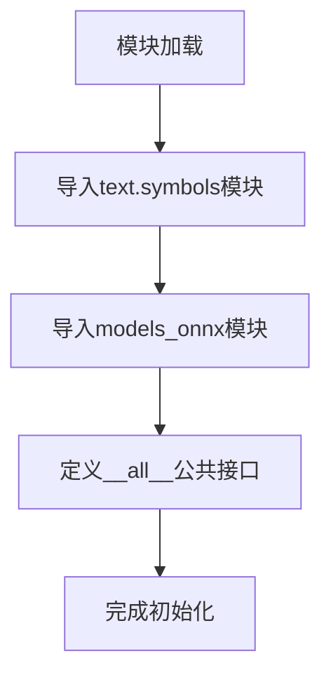

# `Bert-VITS2\onnx_modules\V210\__init__.py` 详细设计文档

这是VITS语音合成框架的初始化模块，负责导出核心的文本符号定义和ONNX推理模型，为上层应用提供统一的API访问入口。

## 整体流程



## 类结构

```
该文件为包初始化文件，不涉及类层次结构
主要导出模块:
├── text.symbols (文本符号定义)
└── models_onnx.SynthesizerTrn (ONNX推理模型)
```

## 全局变量及字段


### `symbols`
    
从.text.symbols模块导入的文本符号集合，用于语音合成中的字符映射

类型：`list/set`
    


### `SynthesizerTrn`
    
从.models_onnx模块导入的语音合成模型类，用于执行神经网络的推理生成

类型：`class`
    


### `__all__`
    
Python魔术变量，定义from module import *时公开导出的API列表

类型：`list`
    


    

## 全局函数及方法


## 关键组件


## 1. 代码核心功能概述

该模块是VITS（Variational Inference with adversarial learning for end-to-end Text-to-Speech）项目的ONNX导出版本的包初始化文件，主要负责导出文本符号定义和ONNX推理模型 SynthesizerTrn，提供统一的模块访问入口。

## 2. 文件整体运行流程

该文件为Python包的初始化模块，不包含可执行逻辑，仅作为模块导入的入口点。当其他模块导入该包时，Python解释器执行该文件，完成以下导入链：
1. 从 `text.symbols` 子模块导入符号表（symbols）
2. 从 `models_onnx` 子模块导入ONNX推理模型类（SynthesizerTrn）
3. 通过 `__all__` 显式声明公共API

## 3. 类详细信息

该文件中无类定义，无类字段，无类方法。

### 全局变量（模块级导入）

| 名称 | 类型 | 描述 |
|------|------|------|
| symbols | list/tuple | 文本到音素的符号映射表，包含音素、标点等符号定义 |
| SynthesizerTrn | class | VITS模型的ONNX推理封装类，支持TTS音频合成 |

### 全局函数

该文件无全局函数定义。

## 4. 关键组件信息

### symbols - 文本符号表

定义了TTS系统使用的文本符号集合，包括音素、字符、标点符号等，是文本到语音转换的基础符号集。

### SynthesizerTrn - ONNX推理模型类

VITS（TTS）模型的ONNX导出版本的核心推理类，负责加载ONNX模型并执行推理，将文本/音素转换为音频波形。

## 5. 潜在的技术债务或优化空间

1. **模块依赖耦合度高**：当前模块直接导入具体的实现类，若后续模型架构变更或ONNX实现重构，可能导致导入失败
2. **缺少版本管理**：未包含版本信息或模型元数据，不利于版本控制和兼容性追踪
3. **导出接口单一**：仅暴露两个基础对象，缺少模型配置、推理参数、预处理配置等辅助接口
4. **文档缺失**：模块级文档字符串（docstring）缺失，难以理解模块用途和使用方式

## 6. 其它项目

### 设计目标与约束
- **设计目标**：提供统一的模块导出入口，隐藏内部实现细节
- **约束**：遵循Python包规范，通过`__all__`控制公共API

### 错误处理与异常设计
- 该模块本身不涉及异常处理，异常由子模块（text.symbols、models_onnx）在导入或运行时抛出

### 数据流与状态机
- 数据流：外部模块 → 导入本模块 → 访问symbols/SynthesizerTrn → 子模块实现
- 状态机：不涉及

### 外部依赖与接口契约
- 依赖 `.text.symbols` 模块提供符号表
- 依赖 `.models_onnx` 模块提供ONNX推理能力
- 接口契约：通过`__all__`声明的symbols和SynthesizerTrn两个公共对象


## 问题及建议


### 已知问题

-   **缺少模块级文档字符串**：该模块作为公共 API 导出入口，但没有任何文档说明其用途和职责
-   **无导入错误处理**：如果 `.text.symbols` 或 `.models_onnx` 模块不存在或导入失败，会直接抛出异常，缺乏友好的错误提示
-   **无版本信息**：缺少 `__version__` 字段，无法追踪依赖版本
-   **无类型注解**：未使用类型提示（Type Hints），影响代码可读性和静态分析工具的效能
-   **功能单一且耦合度高**：仅做简单的重导出操作，未对 `symbols` 和 `SynthesizerTrn` 进行任何封装或增强，与内部模块紧耦合

### 优化建议

-   为模块添加文档字符串，说明该模块是 VITS 文本处理和 ONNX 模型合成器的公共导出接口
-   添加 `try-except` 包装导入语句，提供更具信息量的错误消息或定义空对象以保持模块可导入性
-   引入 `__version__` 字段，便于版本管理和兼容性追踪
-   为导入的对象添加类型注解（如 `symbols: list` 和 `SynthesizerTrn: type`），或使用 `from __future__ import annotations`
-   考虑增加重导出时的封装层或辅助函数，提升模块的可用性和扩展性，同时解耦对内部模块的直接依赖


## 其它


### 设计目标与约束

本模块作为VITS语音合成项目的公共接口模块，目标是封装底层音素符号定义和ONNX模型推理实现，为上层应用提供统一的API入口。设计约束包括：Python 3.7+兼容性、ONNX Runtime运行时依赖、模块级导入不应触发耗时计算保持轻量初始化。

### 错误处理与异常设计

本模块本身不直接处理异常，异常由下游的symbols和SynthesizerTrn模块产生。预期异常包括：ImportError（依赖模块缺失）、SymbolNotFoundError（symbols定义中无对应音素）、ONNXRuntimeError（模型推理失败）。建议上层调用时使用try-except包裹并提供友好的错误提示。

### 外部依赖与接口契约

本模块公开导出两个核心接口：symbols（符号集合对象）和SynthesizerTrn（ONNX合成器类）。symbols应为list或tuple类型，包含所有支持的音素符号；SynthesizerTrn应实现__call__方法接受文本输入返回音频数据。依赖的外部包包括numpy、onnxruntime、torch（可选用于模型转换）。

### 版本兼容性

当前模块接口版本为v1.0。symbols集合定义应保持向后兼容，新增符号应追加至列表末尾避免索引变化。SynthesizerTrn类的构造参数若发生变更应通过kwargs保持兼容或提供版本检测机制。

### 性能考量

模块导入时应避免加载大型模型权重，保持快速启动。SynthesizerTrn实例化时会加载ONNX模型，建议采用单例模式或连接池复用实例。推理阶段的计算瓶颈在ONNX Runtime，应根据硬件配置选择合适的执行providers（CPU/CUDA）。

### 测试策略

应编写单元测试验证symbols非空且为可迭代对象、SynthesizerTrn可正常实例化、__all__导出列表完整性。集成测试应验证完整的文本到语音流程，测试多种音素组合的合成效果。性能测试应记录首次推理延迟和批量推理吞吐量。

### 部署注意事项

生产环境部署需确保ONNX模型文件存在于正确路径、onnxruntime已正确安装且版本匹配、symbols定义与训练时使用的符号表完全一致。建议将模型文件与代码分离，通过环境变量或配置文件指定模型路径。

### 安全性考虑

本模块不直接处理用户输入验证，但SynthesizerTrn的文本输入应进行长度和字符集校验防止恶意输入导致模型异常。ONNX模型文件应作为可信来源加载，避免加载被篡改的模型。


    