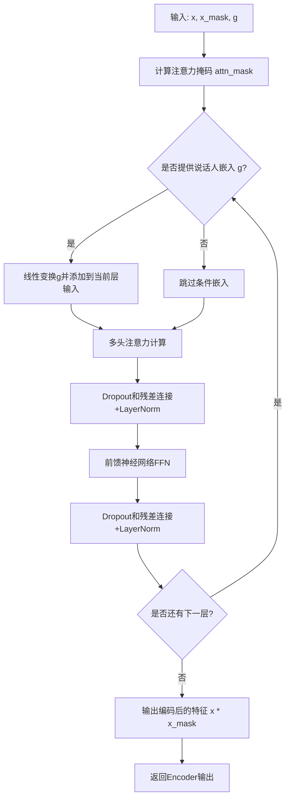
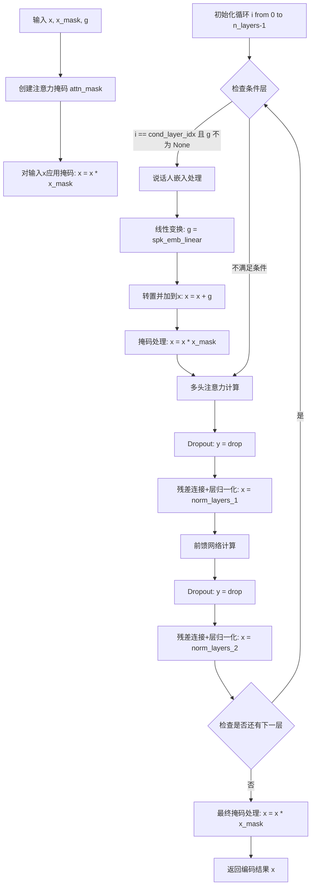
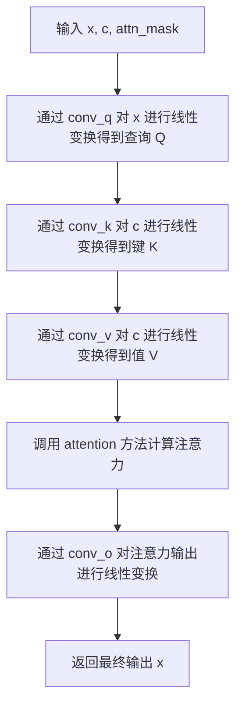
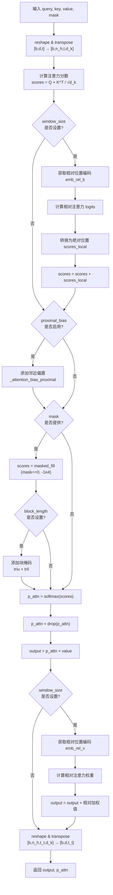
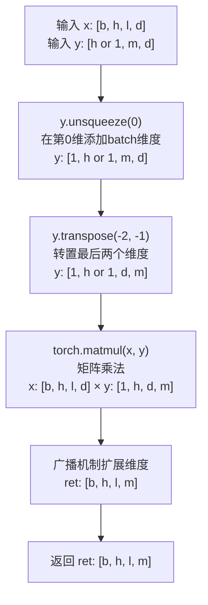
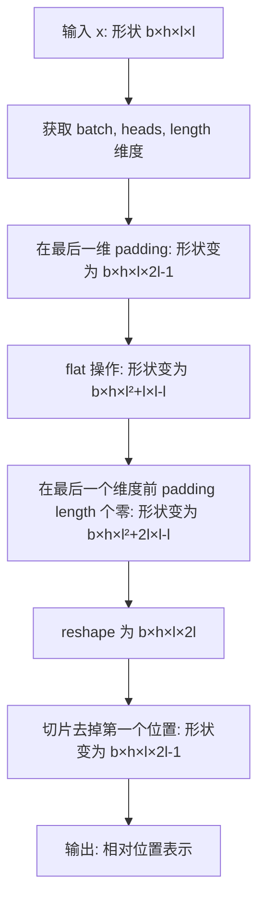

# `Bert-VITS2\onnx_modules\V210\attentions_onnx.py` 详细设计文档

这是一个基于Transformer架构的神经网络编码器模块，包含了LayerNorm层归一化、多头注意力机制(MultiHeadAttention)和前馈神经网络(FFN)，用于语音或音频特征的处理和编码，支持条件输入(说话人嵌入)和相对位置编码。

## 整体流程



## 类结构

```
nn.Module (PyTorch基类)
├── LayerNorm (层归一化)
├── Encoder (Transformer编码器)
│   ├── MultiHeadAttention (多头注意力)
│   │   └── _get_relative_embeddings (相对位置编码)
│   │   └── _matmul_with_relative_keys (相对键值乘法)
│   │   └── _matmul_with_relative_values (相对值乘法)
│   │   └── _relative_position_to_absolute_position
│   │   └── _absolute_position_to_relative_position
│   │   └── _attention_bias_proximal
│   └── FFN (前馈神经网络)
│       ├── _causal_padding (因果填充)
│       └── _same_padding (相同填充)
```

## 全局变量及字段


### `logger`
    
模块级日志记录器，用于记录调试和运行信息

类型：`logging.Logger`
    


### `math`
    
数学库导入，提供数学运算函数

类型：`module`
    


### `torch`
    
PyTorch主库，深度学习框架核心

类型：`module`
    


### `nn`
    
PyTorch神经网络模块，提供层和模型构建组件

类型：`module`
    


### `F`
    
PyTorch函数式API (torch.nn.functional)，提供函数式操作

类型：`module`
    


### `commons`
    
通用工具模块，提供辅助函数如形状转换等

类型：`module`
    


### `fused_add_tanh_sigmoid_multiply`
    
用于融合加法、tanh、sigmoid和乘法操作的JIT编译函数，提升推理效率

类型：`function`
    


### `LayerNorm.LayerNorm.channels`
    
输入通道数

类型：`int`
    


### `LayerNorm.LayerNorm.eps`
    
防止除零的小常数

类型：`float`
    


### `LayerNorm.LayerNorm.gamma`
    
缩放参数，用于归一化后的特征缩放

类型：`nn.Parameter`
    


### `LayerNorm.LayerNorm.beta`
    
偏置参数，用于归一化后的特征偏移

类型：`nn.Parameter`
    


### `Encoder.Encoder.hidden_channels`
    
隐藏层维度

类型：`int`
    


### `Encoder.Encoder.filter_channels`
    
FFN过滤器维度

类型：`int`
    


### `Encoder.Encoder.n_heads`
    
注意力头数

类型：`int`
    


### `Encoder.Encoder.n_layers`
    
编码器层数

类型：`int`
    


### `Encoder.Encoder.kernel_size`
    
卷积核大小

类型：`int`
    


### `Encoder.Encoder.p_dropout`
    
Dropout概率

类型：`float`
    


### `Encoder.Encoder.window_size`
    
相对注意力窗口大小

类型：`int`
    


### `Encoder.Encoder.cond_layer_idx`
    
条件嵌入层索引

类型：`int`
    


### `Encoder.Encoder.gin_channels`
    
说话人嵌入维度

类型：`int`
    


### `Encoder.Encoder.spk_emb_linear`
    
说话人嵌入线性层

类型：`nn.Linear`
    


### `Encoder.Encoder.drop`
    
Dropout层

类型：`nn.Dropout`
    


### `Encoder.Encoder.attn_layers`
    
多头注意力层列表

类型：`nn.ModuleList`
    


### `Encoder.Encoder.norm_layers_1`
    
注意力后归一化层

类型：`nn.ModuleList`
    


### `Encoder.Encoder.ffn_layers`
    
FFN层列表

类型：`nn.ModuleList`
    


### `Encoder.Encoder.norm_layers_2`
    
FFN后归一化层

类型：`nn.ModuleList`
    


### `MultiHeadAttention.MultiHeadAttention.channels`
    
输入通道数

类型：`int`
    


### `MultiHeadAttention.MultiHeadAttention.out_channels`
    
输出通道数

类型：`int`
    


### `MultiHeadAttention.MultiHeadAttention.n_heads`
    
注意力头数

类型：`int`
    


### `MultiHeadAttention.MultiHeadAttention.p_dropout`
    
Dropout概率

类型：`float`
    


### `MultiHeadAttention.MultiHeadAttention.window_size`
    
相对注意力窗口大小

类型：`int`
    


### `MultiHeadAttention.MultiHeadAttention.heads_share`
    
头是否共享相对位置编码

类型：`bool`
    


### `MultiHeadAttention.MultiHeadAttention.block_length`
    
局部注意力块长度

类型：`int`
    


### `MultiHeadAttention.MultiHeadAttention.proximal_bias`
    
是否使用近端偏置

类型：`bool`
    


### `MultiHeadAttention.MultiHeadAttention.proximal_init`
    
是否初始化k和q权重相同

类型：`bool`
    


### `MultiHeadAttention.MultiHeadAttention.attn`
    
保存注意力权重用于可视化

类型：`Tensor`
    


### `MultiHeadAttention.MultiHeadAttention.k_channels`
    
每个头的通道数

类型：`int`
    


### `MultiHeadAttention.MultiHeadAttention.conv_q`
    
查询卷积

类型：`nn.Conv1d`
    


### `MultiHeadAttention.MultiHeadAttention.conv_k`
    
键卷积

类型：`nn.Conv1d`
    


### `MultiHeadAttention.MultiHeadAttention.conv_v`
    
值卷积

类型：`nn.Conv1d`
    


### `MultiHeadAttention.MultiHeadAttention.conv_o`
    
输出卷积

类型：`nn.Conv1d`
    


### `MultiHeadAttention.MultiHeadAttention.drop`
    
Dropout层

类型：`nn.Dropout`
    


### `MultiHeadAttention.MultiHeadAttention.emb_rel_k`
    
相对位置键嵌入

类型：`nn.Parameter`
    


### `MultiHeadAttention.MultiHeadAttention.emb_rel_v`
    
相对位置值嵌入

类型：`nn.Parameter`
    


### `FFN.FFN.in_channels`
    
输入通道数

类型：`int`
    


### `FFN.FFN.out_channels`
    
输出通道数

类型：`int`
    


### `FFN.FFN.filter_channels`
    
隐藏层维度

类型：`int`
    


### `FFN.FFN.kernel_size`
    
卷积核大小

类型：`int`
    


### `FFN.FFN.p_dropout`
    
Dropout概率

类型：`float`
    


### `FFN.FFN.activation`
    
激活函数类型

类型：`str`
    


### `FFN.FFN.causal`
    
是否因果卷积

类型：`bool`
    


### `FFN.FFN.padding`
    
填充函数

类型：`callable`
    


### `FFN.FFN.conv_1`
    
第一层卷积

类型：`nn.Conv1d`
    


### `FFN.FFN.conv_2`
    
第二层卷积

类型：`nn.Conv1d`
    


### `FFN.FFN.drop`
    
Dropout层

类型：`nn.Dropout`
    
    

## 全局函数及方法


### `fused_add_tanh_sigmoid_multiply`

融合的tanh-sigmoid激活函数，用于WaveNet风格的网络，通过将输入分为两部分分别经过tanh和sigmoid激活后再相乘，实现门控机制，提升计算效率。

#### 参数

- `input_a`：`torch.Tensor`，第一个输入张量，通常为WaveNet残差块的输出
- `input_b`：`torch.Tensor`，第二个输入张量，通常为条件输入或前一层的输出
- `n_channels`：`int` 或 `torch.Tensor`，通道数，用于分割输入张量的维度

#### 返回值

- `torch.Tensor`，激活后的输出张量，形状与输入相同

#### 流程图

```mermaid
flowchart TD
    A[输入 input_a, input_b, n_channels] --> B[提取通道数 n_channels_int]
    B --> C[元素级相加 in_act = input_a + input_b]
    C --> D{分割输入}
    D -->|前n_channels_int| E[t_act = tanh in_act[:, :n_channels_int, :]]
    D -->|后n_channels_int| F[s_act = sigmoid in_act[:, n_channels_int:, :]]
    E --> G[acts = t_act * s_act]
    F --> G
    G --> H[返回 acts]
```

#### 带注释源码

```python
@torch.jit.script
def fused_add_tanh_sigmoid_multiply(input_a, input_b, n_channels):
    """
    融合的tanh-sigmoid激活函数，用于WaveNet风格的网络。
    
    该函数实现了WaveNet中的门控激活机制：
    1. 将两个输入张量相加
    2. 将结果按通道维度分为两部分
    3. 第一部分经过tanh激活
    4. 第二部分经过sigmoid激活
    5. 将两个激活结果相乘得到最终输出
    
    这种融合实现比分离调用tanh和sigmoid更高效，
    减少了内存访问开销，并且利于GPU并行计算。
    
    参数:
        input_a: 第一个输入张量，形状为 [batch, channels, time]
        input_b: 第二个输入张量，形状与input_a相同
        n_channels: 通道数，用于分割输入
    
    返回:
        激活后的输出张量，形状与输入相同
    """
    
    # 从n_channels参数中提取整数通道数
    # 注意：这里使用n_channels[0]暗示该参数可能是张量形式传入
    n_channels_int = n_channels[0]
    
    # 元素级相加：合并两个输入
    # 这对应于WaveNet中的残差连接和门控输入的组合
    in_act = input_a + input_b
    
    # 对前n_channels_int个通道应用tanh激活
    # tanh输出范围为[-1, 1]，负责学习有符号的特征
    t_act = torch.tanh(in_act[:, :n_channels_int, :])
    
    # 对后n_channels_int个通道应用sigmoid激活
    # sigmoid输出范围为[0, 1]，作为门控信号控制信息流
    s_act = torch.sigmoid(in_act[:, n_channels_int:, :])
    
    # 门控机制：将tanh激活和sigmoid门控相乘
    # 这种结构允许网络学习哪些特征应该被传递
    acts = t_act * s_act
    
    # 返回融合后的激活结果
    return acts
```

#### 技术说明

| 项目 | 说明 |
|------|------|
| JIT编译 | 使用`@torch.jit.script`装饰器将函数编译为TorchScript，可获得GPU优化 |
| 计算融合 | 将多个操作融合为一个核函数，减少内存带宽需求 |
| 内存效率 | 相比分离实现，避免了中间张量的存储开销 |
| 通道分割 | 输入按通道维度等分，前半为tanh路径，后半为sigmoid路径 |


### `LayerNorm.__init__`

这是`LayerNorm`类的初始化方法，用于实例化一个支持可学习缩放（gamma）和偏移（beta）参数的层归一化模块。

参数：

- `self`：`LayerNorm`实例本身，隐式参数
- `channels`：`int`，表示输入特征的通道数，用于初始化可学习参数 gamma 和 beta 的形状
- `eps`：`float`，默认为 `1e-5`，用于防止除零操作的小常数，传递给 PyTorch 的 `layer_norm` 函数

返回值：`None`，该方法仅初始化对象状态，不返回任何值

#### 流程图

```mermaid
graph TD
    A[开始 __init__] --> B[调用 super().__init__]
    B --> C[设置 self.channels = channels]
    C --> D[设置 self.eps = eps]
    D --> E[创建可学习参数 self.gamma: 全1向量, 形状为 channels]
    E --> F[创建可学习参数 self.beta: 全0向量, 形状为 channels]
    F --> G[结束 __init__]
```

#### 带注释源码

```python
def __init__(self, channels, eps=1e-5):
    """
    初始化 LayerNorm 层。
    
    参数:
        channels (int): 输入特征的通道数，决定 gamma 和 beta 参数的维度
        eps (float, optional): 防止除零的 epsilon 值，默认为 1e-5
    """
    # 调用父类 nn.Module 的初始化方法，完成 PyTorch 模块的基础配置
    super().__init__()
    
    # 保存通道数，用于后续 forward 方法中指定归一化的特征维度
    self.channels = channels
    
    # 保存 epsilon 值，用于数值稳定性（防止除零）
    self.eps = eps
    
    # --- 可学习参数 ---
    # gamma: 缩放系数，初始化为全1向量，用于对归一化后的特征进行线性变换
    # 注册为 nn.Parameter，使其能够被优化器更新
    self.gamma = nn.Parameter(torch.ones(channels))
    
    # beta: 偏移系数，初始化为全0向量，用于对归一化后的特征进行平移
    # 注册为 nn.Parameter，使其能够被优化器更新
    self.beta = nn.Parameter(torch.zeros(channels))
```


### `LayerNorm.forward`

该方法实现了层归一化（Layer Normalization），通过转置输入张量维度、应用PyTorch内置的F.layer_norm进行标准化处理，然后再转置回来，以支持不同的输入维度顺序。

参数：

- `self`：`LayerNorm`，LayerNorm类的实例，包含channels、eps、gamma（缩放参数）和beta（偏移参数）
- `x`：`torch.Tensor`，输入张量，形状为(batch, channels, time)或类似的3D张量

返回值：`torch.Tensor`，返回经过层归一化处理后的张量，形状与输入x相同

#### 流程图

```mermaid
flowchart TD
    A[开始 forward] --> B[输入张量 x]
    B --> C{transpose: 1, -1}
    C --> D[转置维度<br/>将channels维移到最后]
    D --> E[调用 F.layer_norm]
    E --> F[传入转置后的张量<br/>normalized_shape=(channels,)<br/>weight=gamma<br/>bias=beta<br/>eps=self.eps]
    F --> G[执行层归一化<br/>计算均值和方差<br/>进行标准化<br/>应用gamma缩放和beta偏移]
    G --> H{transpose: 1, -1}
    H --> I[转置回原始维度顺序]
    I --> J[返回归一化后的张量]
    J --> K[结束 forward]
```

#### 带注释源码

```python
def forward(self, x):
    """
    LayerNorm的前向传播方法
    
    参数:
        x: 输入张量，形状为(batch, channels, time)或(batch, time, channels)
           经过第一次转置后变为(batch, time, channels)
    
    返回:
        经过层归一化处理后的张量，形状与输入相同
    """
    # 第一次转置：将通道维度的位置从第1位（索引1）移动到最后一位（索引-1）
    # 输入形状: (batch, channels, time) -> (batch, time, channels)
    # 这样F.layer_norm可以将channels作为归一化的维度
    x = x.transpose(1, -1)
    
    # 调用PyTorch的layer_norm函数进行层归一化
    # 参数说明：
    #   - x: 输入张量（已转置）
    #   - (self.channels,): 归一化的形状，这里是通道数
    #   - self.gamma: 可学习的缩放参数（gamma），形状为(channels,)
    #   - self.beta: 可学习的偏移参数（beta），形状为(channels,)
    #   - self.eps: 防止除零的小常数，默认1e-5
    # layer_norm计算: y = (x - mean) / sqrt(var + eps) * gamma + beta
    x = F.layer_norm(x, (self.channels,), self.gamma, self.beta, self.eps)
    
    # 第二次转置：将维度顺序恢复到原始状态
    # (batch, time, channels) -> (batch, channels, time)
    return x.transpose(1, -1)
```


### `Encoder.__init__`

该方法是 `Encoder` 类的构造函数，负责初始化编码器模型的核心参数、注意力层、前馈网络层以及条件嵌入层等组件，构建完整的 Transformer 风格编码器架构。

参数：

- `hidden_channels`：`int`，隐藏层通道数，决定模型内部表示的维度
- `filter_channels`：`int`，前馈网络滤波器通道数，控制 FFN 中间层的宽度
- `n_heads`：`int`，多头注意力机制的头数，用于并行计算注意力
- `n_layers`：`int`，编码器层数，决定模型深度
- `kernel_size`：`int`，卷积核大小，默认为 1，用于前馈网络中的卷积操作
- `p_dropout`：`float`， dropout 概率，默认为 0.0，用于正则化
- `window_size`：`int`，窗口大小，默认为 4，用于相对位置注意力机制
- `isflow`：`bool`，流模型标志，默认为 True，用于控制条件流相关逻辑（当前未使用）
- `**kwargs`：`dict`，可变关键字参数，包含 `gin_channels`（说话人嵌入通道数）和 `cond_layer_idx`（条件注入层索引）等可选参数

返回值：`None`，构造函数无返回值，用于初始化对象状态

#### 流程图

```mermaid
flowchart TD
    A[开始 __init__] --> B[调用 super().__init__]
    B --> C[初始化基本属性]
    C --> D[设置 hidden_channels<br/>filter_channels<br/>n_heads<br/>n_layers<br/>kernel_size<br/>p_dropout<br/>window_size]
    D --> E[设置 cond_layer_idx = n_layers]
    E --> F{gin_channels<br/>在 kwargs 中?}
    F -->|是| G[获取 gin_channels]
    G --> H{gin_channels != 0?}
    H -->|是| I[创建 spk_emb_linear<br/>计算 cond_layer_idx]
    H -->|否| J[跳过条件嵌入层]
    F -->|否| J
    J --> K[创建 Dropout 层]
    K --> L[初始化 ModuleList]
    L --> M[循环 n_layers 次]
    M --> N[创建 MultiHeadAttention]
    N --> O[创建 LayerNorm]
    O --> P[创建 FFN]
    P --> Q[创建 LayerNorm]
    Q --> R{循环结束?}
    R -->|否| M
    R -->|是| S[结束]
```

#### 带注释源码

```python
def __init__(
    self,
    hidden_channels,    # int: 隐藏通道数，模型内部表示维度
    filter_channels,    # int: 前馈网络滤波器通道数
    n_heads,            # int: 多头注意力的头数
    n_layers,           # int: 编码器层数
    kernel_size=1,      # int: 卷积核大小，默认1
    p_dropout=0.0,      # float: dropout概率，默认0.0
    window_size=4,      # int: 注意力窗口大小，默认4
    isflow=True,        # bool: 是否为流模型，默认True（当前未使用）
    **kwargs            # dict: 额外参数，含gin_channels和cond_layer_idx
):
    """
    Encoder 类的构造函数，初始化编码器模型
    
    参数:
        hidden_channels: 隐藏层通道数
        filter_channels: 前馈网络滤波器通道数
        n_heads: 多头注意力头数
        n_layers: 编码器层数
        kernel_size: 卷积核大小
        p_dropout: dropout概率
        window_size: 相对位置注意力窗口大小
        isflow: 流模型标志
        **kwargs: 包含gin_channels（说话人嵌入维度）和cond_layer_idx（条件注入层索引）
    """
    # 调用父类 nn.Module 的初始化方法
    super().__init__()
    
    # 保存基本配置参数到实例属性
    self.hidden_channels = hidden_channels
    self.filter_channels = filter_channels
    self.n_heads = n_heads
    self.n_layers = n_layers
    self.kernel_size = kernel_size
    self.p_dropout = p_dropout
    self.window_size = window_size
    
    # 注释: isflow 参数预留用于条件流逻辑，当前未使用
    # if isflow:
    #  cond_layer = torch.nn.Conv1d(256, 2*hidden_channels*n_layers, 1)
    #  self.cond_pre = torch.nn.Conv1d(hidden_channels, 2*hidden_channels, 1)
    #  self.cond_layer = weight_norm(cond_layer, name='weight')
    #  self.gin_channels = 256
    
    # 设置默认条件注入层索引为最后一层
    self.cond_layer_idx = self.n_layers
    
    # 处理说话人嵌入相关的条件注入逻辑
    if "gin_channels" in kwargs:
        self.gin_channels = kwargs["gin_channels"]
        # 仅当 gin_channels 不为 0 时才创建相关层
        if self.gin_channels != 0:
            # 创建说话人嵌入的线性变换层: gin_channels -> hidden_channels
            self.spk_emb_linear = nn.Linear(self.gin_channels, self.hidden_channels)
            # vits2 默认在第3个block注入条件，所以默认索引为2
            self.cond_layer_idx = (
                kwargs["cond_layer_idx"] if "cond_layer_idx" in kwargs else 2
            )
            logging.debug(self.gin_channels, self.cond_layer_idx)
            # 断言确保条件注入层索引合法
            assert (
                self.cond_layer_idx < self.n_layers
            ), "cond_layer_idx should be less than n_layers"
    
    # 创建 Dropout 层用于正则化
    self.drop = nn.Dropout(p_dropout)
    
    # 初始化各层的 ModuleList，用于存储多个子层
    self.attn_layers = nn.ModuleList()      # 多头注意力层列表
    self.norm_layers_1 = nn.ModuleList()   # 注意力后的归一化层列表
    self.ffn_layers = nn.ModuleList()      # 前馈网络层列表
    self.norm_layers_2 = nn.ModuleList()   # FFN后的归一化层列表
    
    # 循环创建 n_layers 个编码器层
    for i in range(self.n_layers):
        # 创建多头注意力层
        self.attn_layers.append(
            MultiHeadAttention(
                hidden_channels,
                hidden_channels,
                n_heads,
                p_dropout=p_dropout,
                window_size=window_size,
            )
        )
        # 创建注意力后的层归一化
        self.norm_layers_1.append(LayerNorm(hidden_channels))
        
        # 创建前馈网络层
        self.ffn_layers.append(
            FFN(
                hidden_channels,
                hidden_channels,
                filter_channels,
                kernel_size,
                p_dropout=p_dropout,
            )
        )
        # 创建FFN后的层归一化
        self.norm_layers_2.append(LayerNorm(hidden_channels))
```


### `Encoder.forward`

该方法是VITS语音合成模型中Transformer编码器的核心前向传播函数，通过多层自注意力机制和前馈网络处理输入特征序列，同时支持说话人嵌入的条件注入，实现从声学特征到高级语义表示的转换。

参数：

- `self`：`Encoder`类实例，隐式参数，表示编码器对象本身
- `x`：`torch.Tensor`，输入张量，形状为 (batch, channels, time)，代表经过处理的声学特征序列
- `x_mask`：`torch.Tensor`，形状为 (batch, time)，用于掩码处理的有效序列标记，0表示填充位置
- `g`：`torch.Tensor` 或 `None`，可选的说话人嵌入向量，形状为 (batch, gin_channels)，用于条件化生成特定说话人的语音

返回值：`torch.Tensor`，经过多层注意力机制和前馈网络处理后的编码表示，形状为 (batch, hidden_channels, time)

#### 流程图



#### 带注释源码

```python
def forward(self, x, x_mask, g=None):
    """
    Encoder的前向传播方法
    
    参数:
        x: 输入特征张量 (batch, hidden_channels, time)
        x_mask: 输入掩码 (batch, time)，用于标识有效时间步
        g: 可选的说话人嵌入 (batch, gin_channels)
    
    返回:
        编码后的特征张量 (batch, hidden_channels, time)
    """
    # 创建注意力掩码：通过将x_mask在维度1和最后维度展开后相乘
    # 生成形状为 (batch, time, time) 的注意力掩码矩阵
    # 这样可以同时掩码源序列和目标序列中的填充位置
    attn_mask = x_mask.unsqueeze(2) * x_mask.unsqueeze(-1)
    
    # 对输入应用掩码，将填充位置置零
    x = x * x_mask
    
    # 遍历每一层编码器层
    for i in range(self.n_layers):
        # 条件处理：如果当前层是条件层且提供了说话人嵌入
        if i == self.cond_layer_idx and g is not None:
            # 对说话人嵌入进行线性变换: (batch, gin_channels) -> (batch, hidden_channels)
            g = self.spk_emb_linear(g.transpose(1, 2))
            # 调整维度以进行残差连接
            g = g.transpose(1, 2)
            # 将说话人嵌入加到当前特征上，实现条件注入
            x = x + g
            # 再次应用掩码，确保填充位置被清零
            x = x * x_mask
        
        # 多头自注意力层
        # 使用相同的x作为query、key、value，实现自注意力机制
        y = self.attn_layers[i](x, x, attn_mask)
        # 应用Dropout以防止过拟合
        y = self.drop(y)
        # 残差连接后接层归一化，帮助稳定训练
        x = self.norm_layers_1[i](x + y)
        
        # 前馈网络层（FFN），提供非线性变换
        y = self.ffn_layers[i](x, x_mask)
        # 应用Dropout
        y = self.drop(y)
        # 残差连接后接层归一化
        x = self.norm_layers_2[i](x + y)
    
    # 最终输出前再次应用掩码，确保输出不含填充信息
    x = x * x_mask
    return x
```


### `MultiHeadAttention.__init__`

该方法是 `MultiHeadAttention` 类的初始化方法，用于构建多头注意力机制的核心结构，包括查询、键、值的线性变换层，以及相对位置编码（可选）和dropout层。

参数：

- `self`：类的实例对象
- `channels`：`int`，输入特征的通道数
- `out_channels`：`int`，输出特征的通道数
- `n_heads`：`int`，多头注意力的头数
- `p_dropout`：`float`，dropout概率，默认为0.0
- `window_size`：`int` 或 `None`，相对位置编码的窗口大小，默认为None
- `heads_share`：`bool`，是否在多头之间共享相对位置编码，默认为True
- `block_length`：`int` 或 `None`，局部注意力的块长度，默认为None
- `proximal_bias`：`bool`，是否启用邻近偏置，默认为False
- `proximal_init`：`bool`，是否使用proximal初始化（即键和查询权重共享），默认为False

返回值：`None`，该方法为构造函数，不返回任何值

#### 流程图

```mermaid
flowchart TD
    A[开始 __init__] --> B[调用父类初始化 super().__init__]
    B --> C{channels % n_heads == 0?}
    C -->|断言失败| D[抛出 AssertionError]
    C -->|断言通过| E[保存 channels, out_channels, n_heads, p_dropout, window_size, heads_share, block_length, proximal_bias, proximal_init]
    E --> F[初始化 self.attn = None]
    F --> G[计算 k_channels = channels // n_heads]
    G --> H[创建卷积层 conv_q, conv_k, conv_v, conv_o]
    H --> I[创建 Dropout 层 drop]
    I --> J{window_size is not None?}
    J -->|是| K[计算 n_heads_rel = 1 if heads_share else n_heads]
    K --> L[初始化相对位置编码参数 emb_rel_k, emb_rel_v]
    L --> M[使用 Xavier Uniform 初始化 conv_q, conv_k, conv_v 权重]
    J -->|否| M
    M --> N{proximal_init == True?}
    N -->|是| O[将 conv_q 的权重和偏置复制到 conv_k]
    N -->|否| P[结束 __init__]
    O --> P
```

#### 带注释源码

```python
def __init__(
    self,
    channels,           # 输入通道数
    out_channels,       # 输出通道数
    n_heads,            # 多头注意力的头数
    p_dropout=0.0,      # Dropout 概率
    window_size=None,  # 相对位置编码的窗口大小
    heads_share=True,   # 是否在多头间共享相对位置编码
    block_length=None,  # 局部注意力块长度
    proximal_bias=False,    # 是否启用邻近偏置
    proximal_init=False,    # 是否使用proximal初始化
):
    super().__init__()  # 调用 nn.Module 的初始化方法
    
    # 断言：channels 必须能被 n_heads 整除，确保可以均匀分割
    assert channels % n_heads == 0

    # === 保存配置参数 ===
    self.channels = channels              # 输入通道数
    self.out_channels = out_channels       # 输出通道数
    self.n_heads = n_heads                 # 多头数量
    self.p_dropout = p_dropout             # Dropout 概率
    self.window_size = window_size         # 窗口大小（相对位置编码）
    self.heads_share = heads_share          # 是否共享相对位置编码
    self.block_length = block_length       # 局部块长度
    self.proximal_bias = proximal_bias      # 邻近偏置标志
    self.proximal_init = proximal_init      # 邻近初始化标志
    self.attn = None                        # 存储注意力权重（用于可视化或调试）

    # === 计算每个头的通道数 ===
    self.k_channels = channels // n_heads  # 每个头的通道数

    # === 创建 Q, K, V 的线性投影层（1D 卷积，核大小为1）===
    self.conv_q = nn.Conv1d(channels, channels, 1)  # Query 投影
    self.conv_k = nn.Conv1d(channels, channels, 1)  # Key 投影
    self.conv_v = nn.Conv1d(channels, channels, 1)  # Value 投影
    
    # === 输出投影层 ===
    self.conv_o = nn.Conv1d(channels, out_channels, 1)  # 输出投影

    # === Dropout 层 ===
    self.drop = nn.Dropout(p_dropout)  # 注意力权重的 Dropout

    # === 相对位置编码（可选） ===
    if window_size is not None:
        # 计算相对头数：如果 heads_share 为 True，则只有1个头，否则为 n_heads
        n_heads_rel = 1 if heads_share else n_heads
        
        # 计算相对位置编码的标准差（与注意力分数规模匹配）
        rel_stddev = self.k_channels**-0.5
        
        # 初始化相对位置键编码 [n_heads_rel, 2*window_size+1, k_channels]
        self.emb_rel_k = nn.Parameter(
            torch.randn(n_heads_rel, window_size * 2 + 1, self.k_channels)
            * rel_stddev
        )
        
        # 初始化相对位置值编码 [n_heads_rel, 2*window_size+1, k_channels]
        self.emb_rel_v = nn.Parameter(
            torch.randn(n_heads_rel, window_size * 2 + 1, self.k_channels)
            * rel_stddev
        )

    # === 权重初始化（Xavier Uniform） ===
    nn.init.xavier_uniform_(self.conv_q.weight)  # Query 权重
    nn.init.xavier_uniform_(self.conv_k.weight)  # Key 权重
    nn.init.xavier_uniform_(self.conv_v.weight)  # Value 权重

    # === Proximal 初始化（可选） ===
    if proximal_init:
        # 将 Key 投影的权重和偏置复制为 Query 的权重和偏置
        # 这是一种权重共享策略，可加速训练收敛
        with torch.no_grad():
            self.conv_k.weight.copy_(self.conv_q.weight)
            self.conv_k.bias.copy_(self.conv_q.bias)
```


### `MultiHeadAttention.forward`

这是多头注意力机制的前向传播方法，负责接收输入张量，通过查询、键、值的线性变换和注意力计算，输出经过注意力加权后的特征表示。

参数：

- `self`：隐式参数，MultiHeadAttention 实例本身
- `x`：`torch.Tensor`，查询（Query）的输入张量，形状为 [batch, channels, time]
- `c`：`torch.Tensor`，键（Key）和值（Value）的输入张量，形状为 [batch, channels, time]
- `attn_mask`：`torch.Tensor` 或 `None`，可选的注意力掩码，用于屏蔽某些位置的注意力权重，形状为 [batch, time, time]

返回值：`torch.Tensor`，经过多头注意力机制处理后的输出张量，形状为 [batch, out_channels, time]

#### 流程图



#### 带注释源码

```python
def forward(self, x, c, attn_mask=None):
    """
    多头注意力前向传播
    
    参数:
        x: 查询张量 [batch, channels, time]
        c: 键值张量 [batch, channels, time]
        attn_mask: 可选的注意力掩码 [batch, time, time]
    
    返回:
        输出张量 [batch, out_channels, time]
    """
    # 1. 对输入 x 进行查询(Q)变换: [batch, channels, time] -> [batch, channels, time]
    q = self.conv_q(x)
    
    # 2. 对上下文 c 进行键(K)变换: [batch, channels, time] -> [batch, channels, time]
    k = self.conv_k(c)
    
    # 3. 对上下文 c 进行值(V)变换: [batch, channels, time] -> [batch, channels, time]
    v = self.conv_v(c)
    
    # 4. 计算注意力权重并得到注意力输出
    #    同时保存注意力矩阵到 self.attn 供外部检查
    x, self.attn = self.attention(q, k, v, mask=attn_mask)
    
    # 5. 对注意力输出进行输出变换: [batch, channels, time] -> [batch, out_channels, time]
    x = self.conv_o(x)
    
    return x
```


### `MultiHeadAttention.attention`

该方法实现了多头注意力机制的核心计算逻辑，接收经过线性变换的 query、key、value 张量，计算注意力分数并加权求和得到输出，同时支持相对位置编码、邻近偏置、掩码遮蔽和局部注意力等高级特性。

参数：

- `query`：`torch.Tensor`，经过卷积变换后的查询向量，形状为 `[batch, channels, time]`
- `key`：`torch.Tensor`，经过卷积变换后的键向量，形状为 `[batch, channels, time]`
- `value`：`torch.Tensor`，经过卷积变换后的值向量，形状为 `[batch, channels, time]`
- `mask`：`torch.Tensor` 或 `None`，可选的注意力掩码，用于屏蔽特定位置的注意力分数，形状为 `[batch, 1, time, time]`

返回值：`(torch.Tensor, torch.Tensor)`，第一个为注意力输出张量形状 `[batch, channels, time]`，第二个为注意力权重矩阵形状 `[batch, n_heads, time, time]`

#### 流程图



#### 带注释源码

```python
def attention(self, query, key, value, mask=None):
    """
    多头注意力核心计算
    
    参数:
        query: 经过 conv_q 变换后的查询向量 [batch, channels, time]
        key: 经过 conv_k 变换后的键向量 [batch, channels, time]
        value: 经过 conv_v 变换后的值向量 [batch, channels, time]
        mask: 可选的注意力掩码 [batch, 1, time, time]
    
    返回:
        output: 注意力输出 [batch, channels, time]
        p_attn: 注意力权重 [batch, n_heads, time, time]
    """
    
    # ---------- 步骤1: 维度重塑 ----------
    # 将 [b, d, t] -> [b, n_h, t, d_k] 便于多头计算
    # b: batch size, d: channels, t: time step
    # n_h: number of heads, d_k: key dimension per head
    b, d, t_s, t_t = (*key.size(), query.size(2))
    
    # view 调整维度，transpose 交换最后两个维度
    query = query.view(b, self.n_heads, self.k_channels, t_t).transpose(2, 3)
    key = key.view(b, self.n_heads, self.k_channels, t_s).transpose(2, 3)
    value = value.view(b, self.n_heads, self.k_channels, t_s).transpose(2, 3)

    # ---------- 步骤2: 计算基础注意力分数 ----------
    # QK^T / sqrt(d_k) 缩放点积注意力
    scores = torch.matmul(query / math.sqrt(self.k_channels), key.transpose(-2, -1))
    
    # ---------- 步骤3: 相对位置编码 (可选) ----------
    # 当使用相对位置注意力时，需要添加相对位置偏置
    if self.window_size is not None:
        # 相对注意力仅支持自注意力 (t_s == t_t)
        assert (
            t_s == t_t
        ), "Relative attention is only available for self-attention."
        
        # 获取相对位置嵌入
        key_relative_embeddings = self._get_relative_embeddings(self.emb_rel_k, t_s)
        
        # 计算相对位置的注意力 logits
        rel_logits = self._matmul_with_relative_keys(
            query / math.sqrt(self.k_channels), key_relative_embeddings
        )
        
        # 将相对位置 logits 转换为绝对位置
        scores_local = self._relative_position_to_absolute_position(rel_logits)
        
        # 合并基础分数和相对位置分数
        scores = scores + scores_local
    
    # ---------- 步骤4: 邻近偏置 (可选) ----------
    # 鼓励模型更多关注相近位置
    if self.proximal_bias:
        assert t_s == t_t, "Proximal bias is only available for self-attention."
        scores = scores + self._attention_bias_proximal(t_s).to(
            device=scores.device, dtype=scores.dtype
        )
    
    # ---------- 步骤5: 掩码处理 ----------
    if mask is not None:
        # 将掩码为0的位置设为极小值，使其在 softmax 后接近0
        scores = scores.masked_fill(mask == 0, -1e4)
        
        # 局部注意力：限制每个位置只能关注一定范围内的 token
        if self.block_length is not None:
            assert (
                t_s == t_t
            ), "Local attention is only available for self-attention."
            
            # 创建块掩码：上三角矩阵，只保留 block_length 范围内的注意力
            block_mask = (
                torch.ones_like(scores)
                .triu(-self.block_length)    # 上三角 mask
                .tril(self.block_length)     # 下三角 mask
            )
            scores = scores.masked_fill(block_mask == 0, -1e4)
    
    # ---------- 步骤6: Softmax 归一化 ----------
    # 计算注意力权重
    p_attn = F.softmax(scores, dim=-1)  # [b, n_h, t_t, t_s]
    
    # 应用 Dropout (训练时随机丢弃注意力权重，防止过拟合)
    p_attn = self.drop(p_attn)
    
    # ---------- 步骤7: 加权求值 ----------
    # attention(Q, K, V) = softmax(QK^T / sqrt(d_k)) * V
    output = torch.matmul(p_attn, value)
    
    # ---------- 步骤8: 相对位置值编码 (可选) ----------
    if self.window_size is not None:
        # 将注意力权重从绝对位置转换为相对位置
        relative_weights = self._absolute_position_to_relative_position(p_attn)
        
        # 获取相对值嵌入
        value_relative_embeddings = self._get_relative_embeddings(
            self.emb_rel_v, t_s
        )
        
        # 相对位置值的加权求和
        output = output + self._matmul_with_relative_values(
            relative_weights, value_relative_embeddings
        )
    
    # ---------- 步骤9: 维度恢复 ----------
    # 从 [b, n_h, t_t, d_k] 转回 [b, d, t_t]
    output = (
        output.transpose(2, 3).contiguous().view(b, d, t_t)
    )
    
    return output, p_attn
```


### `MultiHeadAttention._matmul_with_relative_values`

该方法是 `MultiHeadAttention` 类中用于计算相对位置值（Relative Values）矩阵乘法的私有方法。它接收注意力权重和相对位置值嵌入，通过矩阵乘法将相对位置信息融入到注意力输出中，是相对位置编码注意力机制的核心组成部分。

参数：

- `self`：`MultiHeadAttention` 类实例，隐式参数
- `x`：`torch.Tensor`，形状为 `[b, h, l, m]`，其中 b 是批量大小，h 是注意力头数，l 是序列长度，m 是相对位置数量（2*window_size+1）
- `y`：`torch.Tensor`，形状为 `[h or 1, m, d]`，其中 h 或 1 是注意力头数，m 是相对位置数量，d 是每个头的键值维度（k_channels）

返回值：`torch.Tensor`，形状为 `[b, h, l, d]`，融合了相对位置信息的注意力输出张量

#### 流程图

```mermaid
flowchart TD
    A[输入 x: 相对注意力权重<br/>形状 [b, h, l, m]] --> B[输入 y: 相对位置值嵌入<br/>形状 [h or 1, m, d]]
    B --> C[y.unsqueeze(0)<br/>在第0维添加批次维度]
    C --> D[形状变为 [1, h, m, d]]
    D --> E[torch.matmul(x, y)<br/>矩阵乘法]
    E --> F[输出 ret: [b, h, l, d]]
```

#### 带注释源码

```python
def _matmul_with_relative_values(self, x, y):
    """
    执行相对位置值的矩阵乘法，将相对位置编码融入注意力输出
    
    参数:
        x: 相对注意力权重，形状 [b, h, l, m]
            b - batch size 批量大小
            h - number of heads 注意力头数
            l - sequence length 序列长度
            m - number of relative positions 相对位置数量 (2*window_size+1)
        y: 相对位置值嵌入，形状 [h or 1, m, d]
            h or 1 - 注意力头数（或共享时为1）
            m - number of relative positions 相对位置数量
            d - key/value dimension per head 每头的键值维度
    
    返回:
        ret: 融合相对位置信息后的输出，形状 [b, h, l, d]
    """
    # 使用 torch.matmul 进行矩阵乘法
    # y.unsqueeze(0) 将 y 从 [h, m, d] 扩展为 [1, h, m, d]
    # 以便与 x [b, h, l, m] 进行批量矩阵乘法
    # 结果形状为 [b, h, l, d]
    ret = torch.matmul(x, y.unsqueeze(0))
    return ret
```


### `MultiHeadAttention._matmul_with_relative_keys`

该方法用于计算相对位置编码的键（relative keys）的矩阵乘法，是Transformer中相对位置注意力机制的核心实现。它接收查询张量和相对位置嵌入，通过矩阵运算得到相对位置注意力分数。

参数：

- `self`：`MultiHeadAttention`，MultiHeadAttention 类的实例，包含注意力机制的参数和配置
- `x`：`torch.Tensor`，形状为 `[b, h, l, d]`，其中 b 是 batch size，h 是注意力头数，l 是序列长度，d 是每个头的维度（query/查询张量）
- `y`：`torch.Tensor`，形状为 `[h or 1, m, d]`，其中 h 是注意力头数（或1表示头之间共享），m 是相对位置的数量（通常为 2*window_size+1），d 是每个头的维度（relative key embeddings/相对位置键嵌入）

返回值：`torch.Tensor`，形状为 `[b, h, l, m]`，相对位置注意力分数张量

#### 流程图



#### 带注释源码

```python
def _matmul_with_relative_keys(self, x, y):
    """
    计算相对位置编码的键矩阵乘法
    
    参数:
        x: [b, h, l, d] - 查询张量，b=batch_size, h=head数, l=序列长度, d=每head维度
        y: [h or 1, m, d] - 相对位置键嵌入，m=相对位置数(通常2*window_size+1)
    
    返回:
        ret: [b, h, l, m] - 相对位置注意力分数
    """
    # 对y在第0维添加batch维度，形状从 [h, m, d] 变为 [1, h, m, d]
    # 这里的 unsqueeze(0) 是为了后续与 x 进行广播运算
    y_expanded = y.unsqueeze(0)
    
    # 转置最后两个维度，将 [1, h, m, d] 变为 [1, h, d, m]
    # 这样可以进行矩阵乘法: [b, h, l, d] × [1, h, d, m]
    y_transposed = y_expanded.transpose(-2, -1)
    
    # 执行矩阵乘法
    # x: [b, h, l, d] 与 y_transposed: [1, h, d, m]
    # 由于广播机制，1会被扩展为b，结果形状为 [b, h, l, m]
    ret = torch.matmul(x, y_transposed)
    
    return ret
```

#### 技术说明

该方法是相对位置编码（Relative Position Encoding）的核心组件，其工作原理：

1. **输入格式**：x 是经过缩放的查询张量（除以 √d_k），y 是预定义的相对位置键嵌入
2. **维度扩展**：通过 `unsqueeze(0)` 为 y 添加批次维度，利用 PyTorch 的广播机制使其能与不同批次大小的 x 进行运算
3. **矩阵运算**：转置 y 的最后两维以进行矩阵乘法，得到形状为 `[b, h, l, m]` 的相对位置 logits
4. **输出用途**：返回的 scores 将与标准注意力分数相加，最终影响注意力权重的计算


### `MultiHeadAttention._get_relative_embeddings`

该方法用于根据当前序列长度从预定义的相对位置嵌入矩阵中提取对应的嵌入向量，处理了滑动窗口边界情况下的填充和切片操作，确保相对位置编码能够正确应用到不同长度的序列上。

参数：

- `self`：`MultiHeadAttention`，MultiHeadAttention类的实例，包含窗口大小等配置信息
- `relative_embeddings`：`torch.Tensor`，形状为 `[n_heads_rel, 2*window_size+1, k_channels]` 的相对位置嵌入参数
- `length`：`int`，当前序列的时间步长，用于确定需要提取的相对位置嵌入范围

返回值：`torch.Tensor`，形状为 `[n_heads_rel, 2*length-1, k_channels]` 的使用了的相对位置嵌入向量

#### 流程图

```mermaid
flowchart TD
    A[开始] --> B[计算max_relative_position = 2 * window_size + 1]
    B --> C[计算pad_length = max(length - window_size - 1, 0)]
    C --> D[计算slice_start_position = max(window_size + 1 - length, 0)]
    D --> E[计算slice_end_position = slice_start_position + 2 * length - 1]
    E --> F{pad_length > 0?}
    F -->|是| G[对relative_embeddings进行填充]
    F -->|否| H[直接使用relative_embeddings]
    G --> I[获取切片: padded_relative_embeddings[:, slice_start_position:slice_end_position]]
    H --> I
    I --> J[返回used_relative_embeddings]
```

#### 带注释源码

```python
def _get_relative_embeddings(self, relative_embeddings, length):
    """
    从预定义的相对位置嵌入中提取指定长度的嵌入向量
    
    处理逻辑：
    - 当序列长度小于等于window_size+1时，不需要填充，直接从预定义嵌入中切片
    - 当序列长度大于window_size+1时，需要在预定义嵌入两端进行填充，然后再切片
    - 这种方式避免了条件分支（if-else）带来的梯度流中断问题
    
    参数:
        relative_embeddings: 预定义的相对位置嵌入，形状为 [n_heads_rel, 2*window_size+1, k_channels]
        length: 当前序列的实际长度
    
    返回:
        提取后的相对位置嵌入，形状为 [n_heads_rel, 2*length-1, k_channels]
    """
    # 获取最大相对位置范围（包含正负位置和0位置）
    max_relative_position = 2 * self.window_size + 1
    
    # 计算需要填充的长度，确保切片操作能够覆盖所有需要的相对位置
    # 当序列长度大于window_size+1时，需要在两端填充
    pad_length = max(length - (self.window_size + 1), 0)
    
    # 计算切片起始位置，处理序列长度较小的情况
    slice_start_position = max((self.window_size + 1) - length, 0)
    
    # 计算切片结束位置，确保覆盖[-length+1, length-1]的相对位置范围
    slice_end_position = slice_start_position + 2 * length - 1
    
    # 根据是否需要填充选择不同的处理路径
    if pad_length > 0:
        # 在相对位置嵌入的第二维（位置维）两端填充0
        # 这样可以保证切片操作总能获取到正确的相对位置编码
        padded_relative_embeddings = F.pad(
            relative_embeddings,
            commons.convert_pad_shape([[0, 0], [pad_length, pad_length], [0, 0]]),
        )
    else:
        padded_relative_embeddings = relative_embeddings
    
    # 从填充后的嵌入中切取出需要的长度范围
    # 切片的形状为 [n_heads_rel, 2*length-1, k_channels]
    used_relative_embeddings = padded_relative_embeddings[
        :, slice_start_position:slice_end_position
    ]
    return used_relative_embeddings
```

#### 设计意图说明

该方法的设计主要考虑了以下因素：

1. **避免条件操作**：通过预先计算填充长度和切片位置，将条件逻辑转化为索引操作，避免了填充操作中的条件分支，从而保证了梯度流的连续性。

2. **边界处理**：当序列长度小于等于 `window_size + 1` 时，不需要填充；当序列长度超过窗口大小时，需要在两端填充以保证切片的正确性。

3. **相对位置范围**：对于长度为 `length` 的序列，需要的相对位置范围是 `[-length+1, length-1]`，共 `2*length-1` 个位置。


### `MultiHeadAttention._relative_position_to_absolute_position`

该方法用于将相对位置编码（relative position embeddings）转换为绝对位置编码（absolute position embeddings）。在相对位置注意力机制中，注意力分数是基于token之间的相对位置计算的，此方法通过填充和reshape操作将形状为`[b, h, l, 2*l-1]`的相对位置logits转换为形状为`[b, h, l, l]`的绝对位置logits。

参数：

- `self`：`MultiHeadAttention`实例本身，类的隐式参数
- `x`：`torch.Tensor`，形状为`[batch, heads, length, 2*length-1]`的4维张量，表示相对位置注意力分数

返回值：`torch.Tensor`，形状为`[batch, heads, length, length]`的4维张量，表示转换后的绝对位置注意力分数

#### 流程图

```mermaid
flowchart TD
    A[输入 x: [b, h, l, 2*l-1]] --> B[在最后维度末尾填充1列零]
    B --> C[形状变为: [b, h, l, 2*l]]
    C --> D[reshape为二维: [b, h, length*2*length]]
    D --> E[在末尾填充length-1个零]
    E --> F[reshape回四维: [b, h, l+1, 2*l-1]]
    F --> G[切片取: [:, :, :l, l-1:]]
    G --> H[输出: [b, h, l, l]]
```

#### 带注释源码

```python
def _relative_position_to_absolute_position(self, x):
    """
    将相对位置编码转换为绝对位置编码
    
    x: [b, h, l, 2*l-1]  - 输入张量，b=batch, h=heads, l=length
    ret: [b, h, l, l]    - 输出张量，转换为绝对位置表示
    """
    # 获取输入张量的维度信息
    batch, heads, length, _ = x.size()
    
    # 步骤1: 在最后维度（2*l-1）末尾添加一列零padding
    # 将形状从 [b, h, l, 2*l-1] 变为 [b, h, l, 2*l]
    # 作用: 为后续shift操作预留空间，以便从相对位置索引转换到绝对位置索引
    x = F.pad(x, commons.convert_pad_shape([[0, 0], [0, 0], [0, 0], [0, 1]]))

    # 步骤2: 将张量展平为二维 [b, h, l*2*l]
    # 这里 l*2*l = 2*l*l，用于后续填充和reshape操作
    x_flat = x.view([batch, heads, length * 2 * length])
    
    # 步骤3: 在末尾填充length-1个零
    # 填充后形状变为 [b, h, l*2*l + l - 1]
    # 作用: 使总长度能够整除 (l+1)，便于reshape
    x_flat = F.pad(
        x_flat, commons.convert_pad_shape([[0, 0], [0, 0], [0, length - 1]])
    )

    # 步骤4: reshape回四维 [b, h, l+1, 2*l-1]
    # 然后切片取 [b, h, l, l]
    # 解释: 
    #   - 取前l行 [:length]
    #   - 从第l-1列开始取到末尾 [length-1:]
    #   这样就实现了从相对位置到绝对位置的转换
    x_final = x_flat.view([batch, heads, length + 1, 2 * length - 1])[
        :, :, :length, length - 1 :
    ]
    return x_final
```


### `MultiHeadAttention._absolute_position_to_relative_position`

该方法用于将注意力权重从绝对位置表示转换为相对位置表示。在相对位置注意力机制中，它接收形状为 [b, h, l, l] 的绝对位置注意力权重张量，并将其转换为形状为 [b, h, l, 2*l-1] 的相对位置表示，以便在计算相对位置编码时使用。

参数：

- `self`：`MultiHeadAttention`，MultiHeadAttention 类的实例自身
- `x`：`torch.Tensor`，输入张量，形状为 [b, h, l, l]，其中 b 是 batch size，h 是注意力头数，l 是序列长度，表示绝对位置注意力权重

返回值：`torch.Tensor`，输出张量，形状为 [b, h, l, 2*l-1]，表示相对位置注意力权重

#### 流程图



#### 带注释源码

```python
def _absolute_position_to_relative_position(self, x):
    """
    将绝对位置注意力权重转换为相对位置表示
    
    输入:
        x: [b, h, l, l] - 绝对位置注意力权重
            b: batch size
            h: 注意力头数
            l: 序列长度
            
    返回:
        ret: [b, h, l, 2*l-1] - 相对位置注意力权重
            表示从位置 i 到位置 j 的相对偏移量
    """
    # 获取输入张量的维度信息
    batch, heads, length, _ = x.size()
    
    # 在最后一个维度（列方向）padding，添加 length-1 个零
    # 形状从 [b, h, l, l] 变为 [b, h, l, 2*l-1]
    # 这样可以将方阵转换为可以flatten的长矩阵
    x = F.pad(
        x, commons.convert_pad_shape([[0, 0], [0, 0], [0, 0], [0, length - 1]])
    )
    
    # 展平为二维张量，便于后续重塑
    # 形状从 [b, h, l, 2*l-1] 变为 [b, h, l² + l×(l-1)]
    x_flat = x.view([batch, heads, length**2 + length * (length - 1)])
    
    # 在开头添加 length 个零，用于在reshape时产生偏移效果
    # 这相当于创建相对位置索引的起始偏移
    # 形状变为 [b, h, l² + 2×l×(l-1)]
    x_flat = F.pad(x_flat, commons.convert_pad_shape([[0, 0], [0, 0], [length, 0]]))
    
    # 重塑为 [b, h, l, 2*l] 的四维张量
    # 然后去掉第一个位置，得到最终的相对位置表示
    # 形状: [b, h, l, 2*l] -> [b, h, l, 2*l-1]
    x_final = x_flat.view([batch, heads, length, 2 * length])[:, :, :, 1:]
    
    return x_final
```


### `MultiHeadAttention._attention_bias_proximal`

该方法用于生成自注意力机制中的位置偏置，鼓励模型更多地关注接近的位置。通过计算位置之间的距离并应用负对数变换，生成一个对称的注意力偏置矩阵，距离越近的位置获得的偏置值越大（偏置值越接近0，即对数变换后越接近0）。

参数：

- `length`：`int`，序列长度，用于生成注意力偏置的矩阵维度

返回值：`torch.Tensor`，形状为 [1, 1, length, length] 的注意力偏置张量

#### 流程图

```mermaid
graph TD
    A[开始] --> B[创建位置向量r: torch.arange length]
    B --> C[计算位置差分diff: unsqueeze r在维度0和1]
    C --> D[计算绝对值: torch.abs diff]
    D --> E[计算对数变换: -torch.log1p 绝对值差分]
    E --> F[调整维度: 两次unsqueeze到4D]
    F --> G[返回偏置张量 shape=[1,1,length,length]]
```

#### 带注释源码

```
def _attention_bias_proximal(self, length):
    """Bias for self-attention to encourage attention to close positions.
    Args:
      length: an integer scalar.
    Returns:
      a Tensor with shape [1, 1, length, length]
    """
    # 创建从0到length-1的位置索引向量，形状为[length]
    r = torch.arange(length, dtype=torch.float32)
    
    # 通过unsqueeze操作计算每对位置之间的差异
    # r: [length] -> [1, length] 和 [length, 1]
    # diff: [length, length]，diff[i][j] = i - j
    diff = torch.unsqueeze(r, 0) - torch.unsqueeze(r, 1)
    
    # 对差分取绝对值后应用-log(1 + |diff|)变换
    # 当diff=0时，结果为0（无偏置）；当diff增大时，结果趋向负无穷
    # 这鼓励模型关注接近的位置
    # 最后通过两次unsqueeze将形状从[length, length]扩展为[1, 1, length, length]
    # 以匹配注意力分数的形状 [batch, heads, query_len, key_len]
    return torch.unsqueeze(torch.unsqueeze(-torch.log1p(torch.abs(diff)), 0), 0)
```


### `FFN.__init__`

FFN类的初始化方法，用于构建前馈神经网络（Feed-Forward Network）模块，包含两个卷积层、dropout层和自适应padding机制。

参数：

- `in_channels`：`int`，输入特征的通道数
- `out_channels`：`int`，输出特征的通道数
- `filter_channels`：`int`，隐藏层filter的通道数，决定中间层维度
- `kernel_size`：`int`，卷积核大小
- `p_dropout`：`float`，dropout概率，默认为0.0
- `activation`：`str`或`None`，激活函数类型，可选"gelu"或其他，默认为None
- `causal`：`bool`，是否使用因果卷积，默认为False

返回值：`None`，该方法为初始化方法，无返回值，仅完成对象属性的初始化

#### 流程图

```mermaid
flowchart TD
    A[开始 __init__] --> B[调用父类初始化 super().__init__()]
    B --> C[保存基本参数<br/>in_channels, out_channels, filter_channels<br/>kernel_size, p_dropout, activation, causal]
    C --> D{causal == True?}
    D -->|Yes| E[设置self.padding = _causal_padding]
    D -->|No| F[设置self.padding = _same_padding]
    E --> G[创建第一个卷积层 conv_1<br/>in_channels → filter_channels]
    F --> G
    G --> H[创建第二个卷积层 conv_2<br/>filter_channels → out_channels]
    H --> I[创建Dropout层 drop]
    I --> J[结束 __init__]
```

#### 带注释源码

```
def __init__(
    self,
    in_channels,       # int: 输入特征的通道数
    out_channels,      # int: 输出特征的通道数
    filter_channels,   # int: 中间层filter通道数
    kernel_size,       # int: 卷积核大小
    p_dropout=0.0,     # float: dropout概率，默认0.0
    activation=None,   # str|None: 激活函数类型，可选'gelu'
    causal=False,      # bool: 是否使用因果卷积
):
    # 调用父类nn.Module的初始化方法
    super().__init__()
    
    # 保存传入的初始化参数到实例属性
    self.in_channels = in_channels
    self.out_channels = out_channels
    self.filter_channels = filter_channels
    self.kernel_size = kernel_size
    self.p_dropout = p_dropout
    self.activation = activation
    self.causal = causal

    # 根据causal参数选择padding方法
    # 因果卷积：只保留左侧padding，确保输出只依赖于当前及之前的输入
    # 非因果卷积：使用对称padding
    if causal:
        self.padding = self._causal_padding
    else:
        self.padding = self._same_padding

    # 创建第一个卷积层：输入通道 -> filter通道
    self.conv_1 = nn.Conv1d(in_channels, filter_channels, kernel_size)
    
    # 创建第二个卷积层：filter通道 -> 输出通道
    self.conv_2 = nn.Conv1d(filter_channels, out_channels, kernel_size)
    
    # 创建Dropout层，用于正则化
    self.drop = nn.Dropout(p_dropout)
```


### `FFN.forward`

该方法是前馈神经网络（FFN）的前向传播函数，接受输入张量和掩码，经过两层卷积、激活函数和dropout处理后输出特征。

参数：

- `self`：`FFN`类的实例，隐式参数
- `x`：`torch.Tensor`，输入特征张量，形状为 [batch, channels, time]
- `x_mask`：`torch.Tensor`，掩码张量，用于标识有效时间步，形状为 [batch, 1, time]

返回值：`torch.Tensor`，经过FFN处理后的输出张量，形状为 [batch, out_channels, time]

#### 流程图

```mermaid
graph TD
    A[开始] --> B[应用掩码: x * x_mask]
    B --> C[填充padding]
    C --> D[第一层卷积: conv_1]
    D --> E{activation == 'gelu'?}
    E -->|Yes| F[GELU激活: x * sigmoid(1.702 * x)]
    E -->|No| G[ReLU激活: relu(x)]
    F --> H[Dropout]
    G --> H
    H --> I[填充padding]
    I --> J[第二层卷积: conv_2]
    J --> K[应用掩码: x * x_mask]
    K --> L[返回输出]
```

#### 带注释源码

```python
def forward(self, x, x_mask):
    """
    FFN的前向传播方法
    
    参数:
        x: 输入特征张量 [batch, channels, time]
        x_mask: 掩码张量 [batch, 1, time]
    
    返回:
        处理后的输出张量 [batch, out_channels, time]
    """
    # 第一步：应用掩码并将输入填充后通过第一个卷积层
    # 将输入与掩码相乘，屏蔽无效位置
    x = self.conv_1(self.padding(x * x_mask))
    
    # 第二步：应用激活函数
    if self.activation == "gelu":
        # 如果是GELU激活，使用近似实现
        # 公式: x * sigmoid(1.702 * x)，这是GELU的近似
        x = x * torch.sigmoid(1.702 * x)
    else:
        # 默认使用ReLU激活函数
        x = torch.relu(x)
    
    # 第三步：应用Dropout防止过拟合
    x = self.drop(x)
    
    # 第四步：将激活后的结果填充后通过第二个卷积层
    x = self.conv_2(self.padding(x * x_mask))
    
    # 第五步：再次应用掩码，确保无效位置输出为0
    # 返回最终结果
    return x * x_mask
```


### `FFN._causal_padding`

该方法实现了因果卷积（causal convolution）所需的填充（padding）操作，通过在时间序列的左侧（过去）添加适当的零填充，确保卷积输出在时间维度上不会泄露未来信息。

参数：

- `self`：`FFN` 类实例，表示当前的前馈网络层对象
- `x`：`torch.Tensor`，输入的张量，通常是经过掩码处理后的特征序列，形状为 `[batch, channels, time]`

返回值：`torch.Tensor`，返回填充后的张量，形状与输入相同

#### 流程图

```mermaid
flowchart TD
    A[开始] --> B{检查 kernel_size 是否为 1?}
    B -->|是| C[直接返回输入 x]
    B -->|否| D[计算左侧填充宽度 pad_l = kernel_size - 1]
    D --> E[设置右侧填充宽度 pad_r = 0]
    E --> F[构建填充形状 [[0, 0], [0, 0], [pad_l, pad_r]]]
    F --> G[使用 F.pad 进行填充]
    G --> H[返回填充后的张量]
```

#### 带注释源码

```python
def _causal_padding(self, x):
    """
    对输入张量进行因果padding（causal padding）。
    因果padding确保卷积的输出在时间维度上只依赖于当前及之前的输入，
    不会泄露未来的信息，这对于自回归模型（如Transformer）非常重要。
    
    参数:
        x (torch.Tensor): 输入张量，形状为 [batch, channels, time]
    
    返回:
        torch.Tensor: 填充后的张量，形状与输入相同
    """
    # 如果卷积核大小为1，不需要填充（1x1卷积不改变时间维度）
    if self.kernel_size == 1:
        return x
    
    # 计算左侧填充：在序列开始处填充 (kernel_size - 1) 个零
    # 这是为了确保第 t 时刻的输出只依赖于第 t 时刻及之前的输入
    pad_l = self.kernel_size - 1
    
    # 右侧不填充，保持因果性
    pad_r = 0
    
    # 定义填充形状：[batch维度, channel维度, 时间维度]
    # 时间维度左侧填充 pad_l，右侧填充 pad_r
    padding = [[0, 0], [0, 0], [pad_l, pad_r]]
    
    # 使用 PyTorch 的 F.pad 进行零填充
    # commons.convert_pad_shape 将填充列表转换为 F.pad 所需的格式
    x = F.pad(x, commons.convert_pad_shape(padding))
    
    return x
```


### `FFN._same_padding`

对输入张量进行"SAME"类型的填充，使卷积操作后输出序列长度与输入保持一致。

参数：

- `self`：`FFN` 类实例，FFN 神经网络层对象
- `x`：`torch.Tensor`，需要进行填充的输入张量，通常形状为 [batch, channels, time]

返回值：`torch.Tensor`，填充后的张量，形状与输入相同

#### 流程图

```mermaid
flowchart TD
    A[开始 _same_padding] --> B{kernel_size == 1?}
    B -->|是| C[直接返回 x]
    B -->|否| D[计算 pad_l = (kernel_size - 1) // 2]
    D --> E[计算 pad_r = kernel_size // 2]
    E --> F[构建 padding 列表: [[0, 0], [0, 0], [pad_l, pad_r]]]
    F --> G[调用 F.pad 进行填充]
    G --> H[返回填充后的张量]
```

#### 带注释源码

```python
def _same_padding(self, x):
    """
    对输入进行 'SAME' 类型的填充，使得卷积后序列长度保持不变。
    
    对于 kernel_size 为 k 的卷积，要在前后各填充 (k-1)//2 和 k//2，
    这样卷积输出与输入的序列长度相同（假设 stride=1）。
    """
    # 如果卷积核大小为1，则不需要填充（1x1卷积不改变序列长度）
    if self.kernel_size == 1:
        return x
    
    # 计算左侧填充量：kernel_size 减1后整除2
    # 例如：kernel_size=3 时，pad_l = (3-1)//2 = 1
    #      kernel_size=5 时，pad_l = (5-1)//2 = 2
    pad_l = (self.kernel_size - 1) // 2
    
    # 计算右侧填充量：kernel_size 整除2
    # 例如：kernel_size=3 时，pad_r = 3//2 = 1
    #      kernel_size=5 时，pad_r = 5//2 = 2
    pad_r = self.kernel_size // 2
    
    # 构建填充形状列表，格式为 [[left, right], ...]
    # 维度顺序为 [batch, channel, time]，time维度在最后
    # 前两个维度不需要填充（0, 0）
    padding = [[0, 0], [0, 0], [pad_l, pad_r]]
    
    # 使用 PyTorch 的 F.pad 进行填充
    #commons.convert_pad_shape 将列表转换为 F.pad 需要的 tuple 格式
    x = F.pad(x, commons.convert_pad_shape(padding))
    
    return x
```

## 关键组件


### LayerNorm

层归一化模块，对输入张量的通道维度进行归一化，使用可学习的gamma和beta参数，支持任意序列长度的张量处理。

### fused_add_tanh_sigmoid_multiply

融合的tanh-sigmoid激活函数，用于流模型中同时计算tanh和sigmoid激活并相乘，减少内存访问开销，支持通道维度的分割计算。

### Encoder

Transformer编码器核心类，集成多头注意力机制和前馈网络，支持说话人嵌入条件注入、相对位置编码和因果/非因果注意力掩码，用于音频/语音特征的编码处理。

### MultiHeadAttention

多头注意力机制实现，支持相对位置编码（Relative Position Encoding）、局部块状注意力（Block Attention）、近端偏置（Proximal Bias）和因果注意力，适用于自回归和非自回归模型。

### FFN

前馈神经网络模块，支持因果和非因果卷积padding，集成GELU和ReLU激活函数，用于增强模型的特征表达能力。


## 问题及建议


### 已知问题

- **条件编码初始化缺陷**：Encoder类中`self.cond_layer_idx = self.n_layers`在未传入`gin_channels`时会被覆盖为2，但`self.spk_emb_linear`可能未定义，导致后续调用时可能抛出AttributeError
- **注释代码未清理**：Encoder.__init__中有一段被注释掉的条件层相关代码（cond_layer、cond_pre等），影响代码可读性
- **日志使用不当**：使用了`logging.debug()`但未确保日志级别配置，且参数传递不符合debug函数签名
- **GELU激活函数实现错误**：FFN中使用了硬编码近似`x * torch.sigmoid(1.702 * x)`，这不是标准GELU实现，且使用了魔数1.702缺乏说明
- **Attention中value mask未处理**：`attention`方法只处理了query/key的mask，但value序列的mask未被应用，可能导致无效位置参与计算
- **proximal_bias设备兼容性**：`self._attention_bias_proximal(t_s).to(device=scores.device, dtype=scores.dtype)`在CUDA上可能存在性能问题，应预先确定设备
- **实例状态副作用**：MultiHeadAttention将self.attn保存为实例变量，这在训练时是不必要的内存占用，且可能在推理时导致不必要的状态保留
- **张量reshape效率问题**：相对位置编码的变换函数（_relative_position_to_absolute_position等）包含多次view、pad、reshape操作，可以融合优化

### 优化建议

- 移除Encoder中的注释代码块，或使用配置管理替代
- 将GELU实现替换为`torch.nn.functional.gelu`或`F.gelu`，提高准确性和可维护性
- 修复logging.debug调用，或替换为logger.info/warning
- 在Encoder.__init__中添加条件检查，确保g参数存在时spk_emb_linear也已初始化
- 考虑在attention方法中添加value mask处理逻辑
- 预计算proximal_bias的设备并缓存，避免每次前向传播都进行to()操作
- 移除MultiHeadAttention中的self.attn实例变量保存，改为返回attention权重即可
- 优化相对位置编码的计算图，减少中间张量创建
- 添加详细的文档字符串说明各模块功能、参数含义和返回值
- 统一代码风格，将多层嵌套的attention计算逻辑拆分为更小的辅助函数


## 其它


### 设计目标与约束

本模块是VITS（Variational Inference with adversarial learning for end-to-end Text-to-Speech）语音合成模型的编码器部分，负责将输入的语音特征转换为高维隐表示。设计目标包括：(1) 实现高效的Self-Attention机制，支持相对位置编码和局部注意力；(2) 支持说话人嵌入条件注入，实现多说话人合成；(3) 保证因果推理能力以支持流式推理场景；(4) 通过JIT编译优化推理性能。约束条件包括：输入必须为3D张量[B, channels, time]，channel数必须能被head数整除，当使用相对位置编码时必须为自注意力模式。

### 错误处理与异常设计

代码中的错误处理主要依赖assert语句进行参数校验。在MultiHeadAttention中：assert channels % n_heads == 0确保通道数能被注意力头数整除；assert t_s == t_t在相对位置编码和proximal bias使用时检查自注意力条件；assert t_s == t_t在block_length相关逻辑中验证序列长度一致性。在Encoder中：assert cond_layer_idx < n_layers确保条件注入层索引有效。异常处理缺失：未对张量形状不匹配、None值、NaN/Inf值、gin_channels配置错误等情况进行处理，建议增加validate输入函数并在forward开始时进行防御性检查。

### 数据流与状态机

数据流主要分为两条路径。主路径：输入x [B, C, T] → 乘以x_mask [B, 1, T]进行mask → 依次通过n_layers个Block → 输出编码后的x [B, C, T]。每个Block内部：MultiHeadAttention → LayerNorm → FFN → LayerNorm。条件注入路径：当g（说话人嵌入）不为None且到达cond_layer_idx层时：g [B, gin_channels] → spk_emb_linear → 转置 → 广播加到x对应位置。状态机主要涉及attn矩阵的保存：self.attn在forward中通过attention方法更新，用于可视化或后续分析，但不参与反向传播。

### 外部依赖与接口契约

主要依赖包括：(1) torch >= 1.0：核心张量运算；(2) torch.nn：神经网络模块基类；(3) torch.nn.functional：F.layer_norm、F.softmax、F.pad等函数；(4) commons模块：提供convert_pad_shape辅助函数用于处理padding维度。接口契约：Encoder.forward(x, x_mask, g=None) → 输入x需为[B, hidden_channels, T]的3D FloatTensor，x_mask需为[B, 1, T]的3D FloatTensor（用于标识有效帧），g可选为[B, gin_channels]的说话人嵌入，返回[B, hidden_channels, T]的编码结果。MultiHeadAttention.forward(x, c, attn_mask=None) → x和c通常为相同张量（自注意力），attn_mask可选用于屏蔽padding位置。FFN.forward(x, x_mask) → 输入需配合x_mask使用以屏蔽padding。

### 性能考虑与优化空间

性能优化点包括：(1) fused_add_tanh_sigmoid_multiply已使用@torch.jit.script装饰器进行JIT编译，可融合Tanh、Sigmoid、Multiply三个操作；(2) LayerNorm使用F.layer_norm而非nn.LayerNorm，减少模块封装开销；(3) 相对位置编码计算涉及的pad和slice操作可进一步优化；(4) 可考虑使用torch.compile进行动态图编译优化；(5) MultiHeadAttention中可使用torch.backends.cudnn.enabled = True配合torch.backends.cudnn.benchmark = True启用CUDA优化；(6) 内存优化：当前保存了self.attn用于调试，若生产环境不需要可设为不保存以节省显存。

### 配置参数说明

关键超参数说明：hidden_channels（默认未指定，需外部传入）：隐层维度，决定模型容量；filter_channels（默认未指定）：FFN中间层维度，通常为hidden_channels的2-4倍；n_heads（默认未指定）：注意力头数，必须整除hidden_channels；n_layers（默认未指定）：Encoder block堆叠层数；kernel_size（默认1）：FFN卷积核大小，影响感受野和计算量；p_dropout（默认0.0）：Dropout概率，用于正则化；window_size（默认4）：相对位置编码的窗口大小，控制局部注意力范围；gin_channels（默认0）：说话人嵌入维度，0表示不使用说话人条件；cond_layer_idx（默认2）：条件注入的层索引。

### 测试策略建议

单元测试应覆盖：(1) 各模块输出形状正确性验证；(2) 前向传播无NaN/Inf产生；(3) 梯度反向传播完整性检查；(4) 随机输入下的确定性测试（固定seed）；(5) Encoder在有无说话人嵌入条件下的输出差异验证；(6) 因果模式下FFN的padding方向正确性验证；(7) 相对位置编码的边界情况测试（不同window_size和序列长度组合）。集成测试应验证与上下游模块（如decoder、discriminator）的对接正确性。

### 版本兼容性与迁移说明

PyTorch版本兼容性：代码使用torch.jit.script装饰器，需PyTorch 1.0+；F.layer_norm在PyTorch 1.2+可用；torch.compile在PyTorch 2.0+可用。迁移注意事项：(1) 若升级到PyTorch 2.0+，可考虑使用torch.compile替代部分手动优化；(2) 若需支持PyTorch 1.x，需将F.layer_norm替换为nn.LayerNorm并调整接口；(3) 相对位置编码的实现依赖F.pad和view操作，需注意不同版本的行为差异。

### 安全考虑

当前代码无用户输入校验和沙箱隔离，主要安全考量包括：(1) 内存消耗：超长序列可能触发OOM，需在调用前进行序列长度限制；(2) 模型文件安全：加载预训练模型时需校验文件完整性和来源；(3) 信息泄露：self.attn保存的注意力权重可能包含敏感信息，需注意内存管理。

    