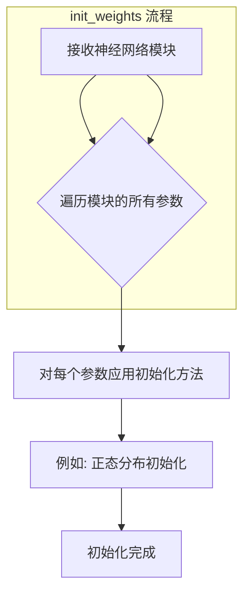
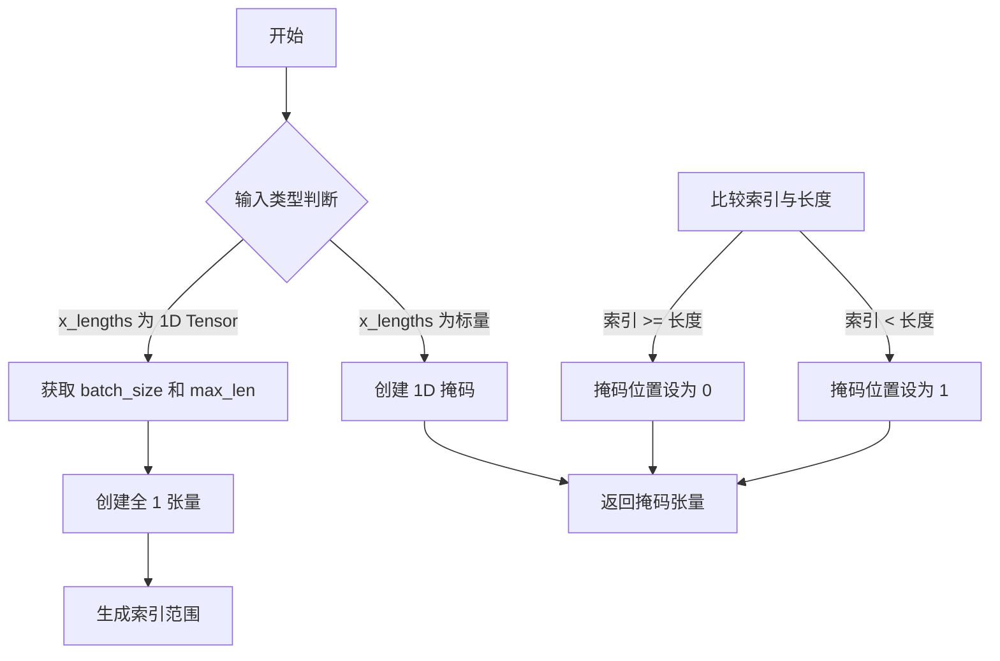
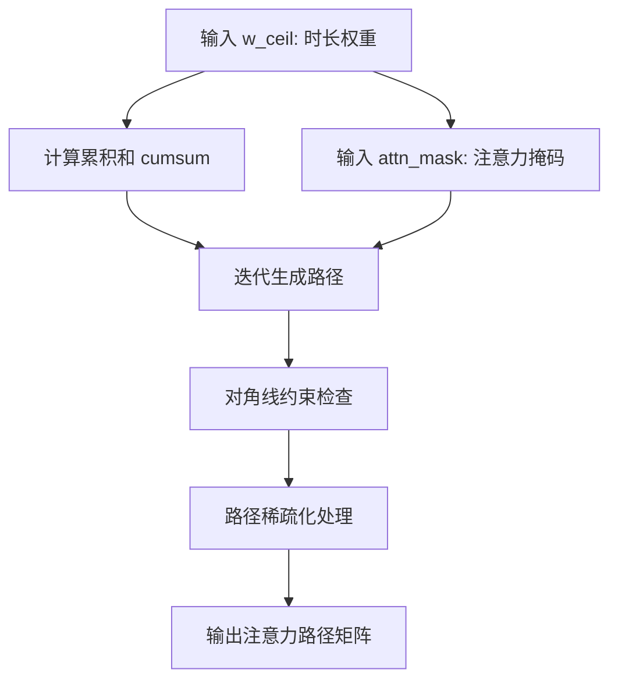
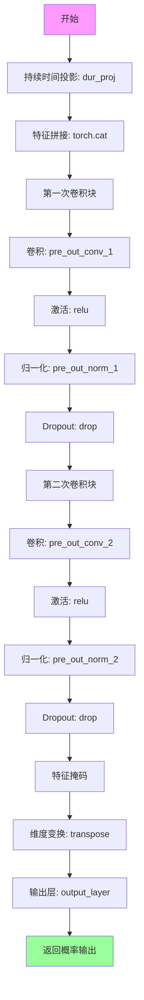
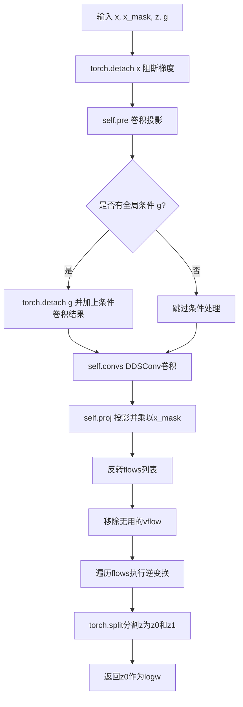
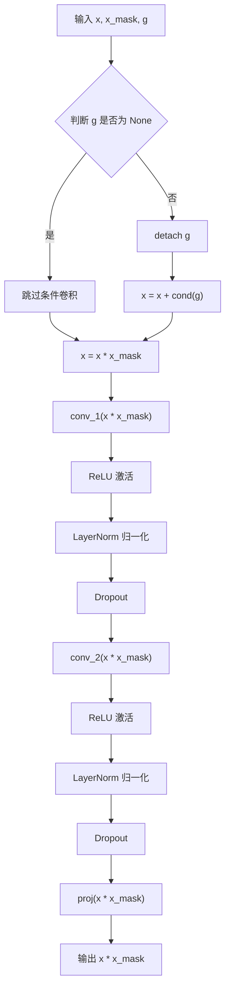
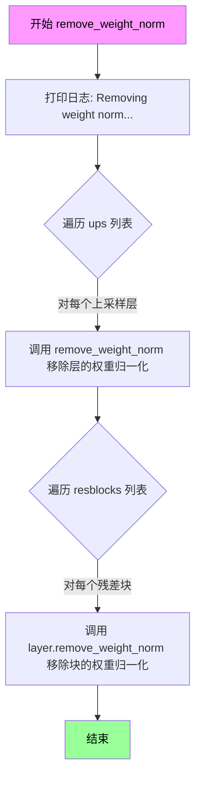
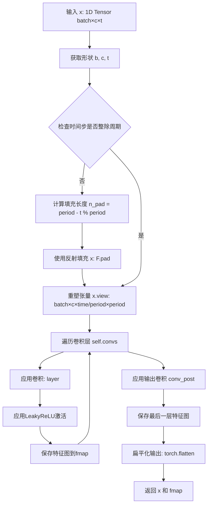
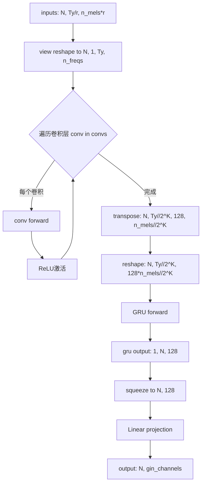

# `Bert-VITS2\onnx_modules\V210\models_onnx.py` 详细设计文档

这是一个VITS (Variational Inference with adversarial learning for end-to-end Text-to-Speech) 文本转语音合成系统的核心模型实现，包含文本编码器、持续时间预测器、后验编码器、归一化流模型、生成器和多周期判别器等组件，用于端到端的语音合成。

## 整体流程

```mermaid
graph TD
    A[输入: 文本序列x, 音调tone, 语言language, BERT特征] --> B[TextEncoder]
    B --> C{编码文本特征}
    C --> D[DurationPredictor / StochasticDurationPredictor]
    D --> E[预测音素持续时间]
    E --> F[生成对齐路径attention]
    F --> G[PosteriorEncoder]
    G --> H[编码梅尔频谱为潜在向量z_p]
    H --> I[Flow (TransformerCouplingBlock 或 ResidualCouplingBlock)]
    I --> J[归一化流转换]
    J --> K[Generator]
    K --> L[上采样生成音频波形]
    M[MultiPeriodDiscriminator] -.-> N[判别器损失计算]
    L --> N
    N --> O[输出: 合成音频]
```

## 类结构

```
SynthesizerTrn (主合成器模型)
├── TextEncoder (文本编码器)
├── PosteriorEncoder (后验编码器)
├── Generator (声码器生成器)
├── Flow (归一化流)
│   ├── TransformerCouplingBlock (Transformer耦合块)
│   └── ResidualCouplingBlock (残差耦合块)
├── DurationPredictor (持续时间预测器)
├── StochasticDurationPredictor (随机持续时间预测器)
└── MultiPeriodDiscriminator (多周期判别器)
    ├── DiscriminatorP (周期判别器)
    └── DiscriminatorS (尺度判别器)
```

## 全局变量及字段


### `symbols`
    
文本符号列表，用于文本编码的字符集

类型：`list`
    


### `num_tones`
    
音调数量，用于多音调语言的文本编码

类型：`int`
    


### `num_languages`
    
语言数量，用于多语言文本编码

类型：`int`
    


### `DurationDiscriminator.in_channels`
    
输入特征通道数

类型：`int`
    


### `DurationDiscriminator.filter_channels`
    
卷积滤波器通道数

类型：`int`
    


### `DurationDiscriminator.kernel_size`
    
卷积核大小

类型：`int`
    


### `DurationDiscriminator.p_dropout`
    
Dropout概率

类型：`float`
    


### `DurationDiscriminator.gin_channels`
    
说话人嵌入通道数

类型：`int`
    


### `DurationDiscriminator.drop`
    
Dropout层用于正则化

类型：`nn.Dropout`
    


### `DurationDiscriminator.conv_1`
    
第一层卷积网络

类型：`nn.Conv1d`
    


### `DurationDiscriminator.norm_1`
    
第一层归一化

类型：`modules.LayerNorm`
    


### `DurationDiscriminator.conv_2`
    
第二层卷积网络

类型：`nn.Conv1d`
    


### `DurationDiscriminator.norm_2`
    
第二层归一化

类型：`modules.LayerNorm`
    


### `DurationDiscriminator.dur_proj`
    
持续时间投影层

类型：`nn.Conv1d`
    


### `DurationDiscriminator.pre_out_conv_1`
    
预输出卷积层1

类型：`nn.Conv1d`
    


### `DurationDiscriminator.pre_out_norm_1`
    
预输出归一化层1

类型：`modules.LayerNorm`
    


### `DurationDiscriminator.pre_out_conv_2`
    
预输出卷积层2

类型：`nn.Conv1d`
    


### `DurationDiscriminator.pre_out_norm_2`
    
预输出归一化层2

类型：`modules.LayerNorm`
    


### `DurationDiscriminator.cond`
    
条件卷积层用于说话人条件

类型：`nn.Conv1d`
    


### `DurationDiscriminator.output_layer`
    
输出概率层

类型：`nn.Sequential`
    


### `TransformerCouplingBlock.channels`
    
输入通道数

类型：`int`
    


### `TransformerCouplingBlock.hidden_channels`
    
隐藏层通道数

类型：`int`
    


### `TransformerCouplingBlock.kernel_size`
    
卷积核大小

类型：`int`
    


### `TransformerCouplingBlock.n_layers`
    
Transformer层数

类型：`int`
    


### `TransformerCouplingBlock.n_flows`
    
流层数量

类型：`int`
    


### `TransformerCouplingBlock.gin_channels`
    
说话人嵌入通道数

类型：`int`
    


### `TransformerCouplingBlock.flows`
    
流模块列表

类型：`nn.ModuleList`
    


### `TransformerCouplingBlock.wn`
    
共享参数的FFT模块

类型：`attentions_onnx.FFT`
    


### `StochasticDurationPredictor.in_channels`
    
输入通道数

类型：`int`
    


### `StochasticDurationPredictor.filter_channels`
    
滤波器通道数

类型：`int`
    


### `StochasticDurationPredictor.kernel_size`
    
卷积核大小

类型：`int`
    


### `StochasticDurationPredictor.p_dropout`
    
Dropout概率

类型：`float`
    


### `StochasticDurationPredictor.n_flows`
    
流层数量

类型：`int`
    


### `StochasticDurationPredictor.gin_channels`
    
说话人嵌入通道数

类型：`int`
    


### `StochasticDurationPredictor.log_flow`
    
对数流模块

类型：`modules.Log`
    


### `StochasticDurationPredictor.flows`
    
流模块列表

类型：`nn.ModuleList`
    


### `StochasticDurationPredictor.post_pre`
    
后处理预投影层

类型：`nn.Conv1d`
    


### `StochasticDurationPredictor.post_proj`
    
后处理投影层

类型：`nn.Conv1d`
    


### `StochasticDurationPredictor.post_convs`
    
后处理卷积层

类型：`modules.DDSConv`
    


### `StochasticDurationPredictor.post_flows`
    
后处理流模块列表

类型：`nn.ModuleList`
    


### `StochasticDurationPredictor.pre`
    
预投影层

类型：`nn.Conv1d`
    


### `StochasticDurationPredictor.proj`
    
投影层

类型：`nn.Conv1d`
    


### `StochasticDurationPredictor.convs`
    
卷积层模块

类型：`modules.DDSConv`
    


### `StochasticDurationPredictor.cond`
    
条件卷积层

类型：`nn.Conv1d`
    


### `DurationPredictor.in_channels`
    
输入通道数

类型：`int`
    


### `DurationPredictor.filter_channels`
    
滤波器通道数

类型：`int`
    


### `DurationPredictor.kernel_size`
    
卷积核大小

类型：`int`
    


### `DurationPredictor.p_dropout`
    
Dropout概率

类型：`float`
    


### `DurationPredictor.gin_channels`
    
说话人嵌入通道数

类型：`int`
    


### `DurationPredictor.drop`
    
Dropout层

类型：`nn.Dropout`
    


### `DurationPredictor.conv_1`
    
第一层卷积

类型：`nn.Conv1d`
    


### `DurationPredictor.norm_1`
    
第一层归一化

类型：`modules.LayerNorm`
    


### `DurationPredictor.conv_2`
    
第二层卷积

类型：`nn.Conv1d`
    


### `DurationPredictor.norm_2`
    
第二层归一化

类型：`modules.LayerNorm`
    


### `DurationPredictor.proj`
    
输出投影层

类型：`nn.Conv1d`
    


### `DurationPredictor.cond`
    
条件卷积层

类型：`nn.Conv1d`
    


### `TextEncoder.n_vocab`
    
词汇表大小

类型：`int`
    


### `TextEncoder.out_channels`
    
输出通道数

类型：`int`
    


### `TextEncoder.hidden_channels`
    
隐藏层通道数

类型：`int`
    


### `TextEncoder.filter_channels`
    
滤波器通道数

类型：`int`
    


### `TextEncoder.n_heads`
    
注意力头数

类型：`int`
    


### `TextEncoder.n_layers`
    
编码器层数

类型：`int`
    


### `TextEncoder.kernel_size`
    
卷积核大小

类型：`int`
    


### `TextEncoder.p_dropout`
    
Dropout概率

类型：`float`
    


### `TextEncoder.gin_channels`
    
说话人嵌入通道数

类型：`int`
    


### `TextEncoder.emb`
    
文本嵌入层

类型：`nn.Embedding`
    


### `TextEncoder.tone_emb`
    
音调嵌入层

类型：`nn.Embedding`
    


### `TextEncoder.language_emb`
    
语言嵌入层

类型：`nn.Embedding`
    


### `TextEncoder.bert_proj`
    
BERT特征投影层

类型：`nn.Conv1d`
    


### `TextEncoder.ja_bert_proj`
    
日语BERT特征投影层

类型：`nn.Conv1d`
    


### `TextEncoder.en_bert_proj`
    
英语BERT特征投影层

类型：`nn.Conv1d`
    


### `TextEncoder.emo_proj`
    
情感特征投影层

类型：`nn.Linear`
    


### `TextEncoder.emo_quantizer`
    
情感量化器列表

类型：`nn.ModuleList`
    


### `TextEncoder.emo_q_proj`
    
情感量化投影层

类型：`nn.Linear`
    


### `TextEncoder.n_speakers`
    
说话人数量

类型：`int`
    


### `TextEncoder.encoder`
    
文本编码器

类型：`attentions_onnx.Encoder`
    


### `TextEncoder.proj`
    
输出投影层

类型：`nn.Conv1d`
    


### `ResidualCouplingBlock.channels`
    
通道数

类型：`int`
    


### `ResidualCouplingBlock.hidden_channels`
    
隐藏层通道数

类型：`int`
    


### `ResidualCouplingBlock.kernel_size`
    
卷积核大小

类型：`int`
    


### `ResidualCouplingBlock.dilation_rate`
    
膨胀率

类型：`int`
    


### `ResidualCouplingBlock.n_layers`
    
层数

类型：`int`
    


### `ResidualCouplingBlock.n_flows`
    
流层数量

类型：`int`
    


### `ResidualCouplingBlock.gin_channels`
    
说话人嵌入通道数

类型：`int`
    


### `ResidualCouplingBlock.flows`
    
流模块列表

类型：`nn.ModuleList`
    


### `PosteriorEncoder.in_channels`
    
输入通道数

类型：`int`
    


### `PosteriorEncoder.out_channels`
    
输出通道数

类型：`int`
    


### `PosteriorEncoder.hidden_channels`
    
隐藏层通道数

类型：`int`
    


### `PosteriorEncoder.kernel_size`
    
卷积核大小

类型：`int`
    


### `PosteriorEncoder.dilation_rate`
    
膨胀率

类型：`int`
    


### `PosteriorEncoder.n_layers`
    
层数

类型：`int`
    


### `PosteriorEncoder.gin_channels`
    
说话人嵌入通道数

类型：`int`
    


### `PosteriorEncoder.pre`
    
预处理卷积层

类型：`nn.Conv1d`
    


### `PosteriorEncoder.enc`
    
波形网络编码器

类型：`modules.WN`
    


### `PosteriorEncoder.proj`
    
输出投影层

类型：`nn.Conv1d`
    


### `Generator.num_kernels`
    
残差块核数量

类型：`int`
    


### `Generator.num_upsamples`
    
上采样层数量

类型：`int`
    


### `Generator.conv_pre`
    
初始卷积层

类型：`Conv1d`
    


### `Generator.ups`
    
上采样模块列表

类型：`nn.ModuleList`
    


### `Generator.resblocks`
    
残差块模块列表

类型：`nn.ModuleList`
    


### `Generator.conv_post`
    
后处理卷积层

类型：`Conv1d`
    


### `Generator.cond`
    
条件卷积层

类型：`nn.Conv1d`
    


### `DiscriminatorP.period`
    
判别器周期

类型：`int`
    


### `DiscriminatorP.use_spectral_norm`
    
是否使用谱归一化

类型：`bool`
    


### `DiscriminatorP.convs`
    
卷积层模块列表

类型：`nn.ModuleList`
    


### `DiscriminatorP.conv_post`
    
后处理卷积层

类型：`nn.Conv2d`
    


### `DiscriminatorS.convs`
    
卷积层模块列表

类型：`nn.ModuleList`
    


### `DiscriminatorS.conv_post`
    
后处理卷积层

类型：`Conv1d`
    


### `MultiPeriodDiscriminator.discriminators`
    
判别器列表

类型：`nn.ModuleList`
    


### `ReferenceEncoder.spec_channels`
    
频谱通道数

类型：`int`
    


### `ReferenceEncoder.convs`
    
卷积层模块列表

类型：`nn.ModuleList`
    


### `ReferenceEncoder.gru`
    
GRU循环层

类型：`nn.GRU`
    


### `ReferenceEncoder.proj`
    
输出投影层

类型：`nn.Linear`
    


### `SynthesizerTrn.n_vocab`
    
词汇表大小

类型：`int`
    


### `SynthesizerTrn.spec_channels`
    
频谱通道数

类型：`int`
    


### `SynthesizerTrn.inter_channels`
    
中间通道数

类型：`int`
    


### `SynthesizerTrn.hidden_channels`
    
隐藏层通道数

类型：`int`
    


### `SynthesizerTrn.filter_channels`
    
滤波器通道数

类型：`int`
    


### `SynthesizerTrn.n_heads`
    
注意力头数

类型：`int`
    


### `SynthesizerTrn.n_layers`
    
编码器层数

类型：`int`
    


### `SynthesizerTrn.kernel_size`
    
卷积核大小

类型：`int`
    


### `SynthesizerTrn.p_dropout`
    
Dropout概率

类型：`float`
    


### `SynthesizerTrn.resblock`
    
残差块类型

类型：`str`
    


### `SynthesizerTrn.resblock_kernel_sizes`
    
残差块核大小列表

类型：`list`
    


### `SynthesizerTrn.resblock_dilation_sizes`
    
残差块膨胀大小列表

类型：`list`
    


### `SynthesizerTrn.upsample_rates`
    
上采样率列表

类型：`list`
    


### `SynthesizerTrn.upsample_initial_channel`
    
上采样初始通道数

类型：`int`
    


### `SynthesizerTrn.upsample_kernel_sizes`
    
上采样核大小列表

类型：`list`
    


### `SynthesizerTrn.segment_size`
    
音频分段大小

类型：`int`
    


### `SynthesizerTrn.n_speakers`
    
说话人数量

类型：`int`
    


### `SynthesizerTrn.gin_channels`
    
说话人嵌入通道数

类型：`int`
    


### `SynthesizerTrn.n_layers_trans_flow`
    
Transformer流层数

类型：`int`
    


### `SynthesizerTrn.use_spk_conditioned_encoder`
    
是否使用说话人条件编码器

类型：`bool`
    


### `SynthesizerTrn.use_sdp`
    
是否使用随机持续时间预测器

类型：`bool`
    


### `SynthesizerTrn.use_noise_scaled_mas`
    
是否使用噪声缩放MAS

类型：`bool`
    


### `SynthesizerTrn.mas_noise_scale_initial`
    
MAS噪声缩放初始值

类型：`float`
    


### `SynthesizerTrn.noise_scale_delta`
    
噪声缩放增量

类型：`float`
    


### `SynthesizerTrn.current_mas_noise_scale`
    
当前MAS噪声缩放值

类型：`float`
    


### `SynthesizerTrn.enc_gin_channels`
    
编码器说话人通道数

类型：`int`
    


### `SynthesizerTrn.enc_p`
    
文本编码器

类型：`TextEncoder`
    


### `SynthesizerTrn.dec`
    
声学生成器

类型：`Generator`
    


### `SynthesizerTrn.enc_q`
    
后验编码器

类型：`PosteriorEncoder`
    


### `SynthesizerTrn.flow`
    
流模型（Transformer或Residual耦合块）

类型：`nn.Module`
    


### `SynthesizerTrn.sdp`
    
随机持续时间预测器

类型：`StochasticDurationPredictor`
    


### `SynthesizerTrn.dp`
    
持续时间预测器

类型：`DurationPredictor`
    


### `SynthesizerTrn.emb_g`
    
说话人嵌入层

类型：`nn.Embedding`
    


### `SynthesizerTrn.ref_enc`
    
参考编码器

类型：`ReferenceEncoder`
    
    

## 全局函数及方法


### `init_weights`

`init_weights` 是一个从 `commons` 模块导入的权重初始化函数，用于对神经网络模块的参数进行初始化。该函数通过 `apply` 方法遍历并初始化 `Generator` 类中上采样层的权重。

参数：

-  `module`：`torch.nn.Module`，需要初始化权重的神经网络模块（如 `ConvTranspose1d` 层）

返回值：`None`，该函数直接在传入的模块上进行权重初始化，不返回任何值。

#### 流程图



#### 带注释源码

```
# init_weights 源码定义在 commons 模块中，此处为从 commons 导入的引用
# 根据代码中的使用方式推断其签名和功能

def init_weights(module):
    """
    对神经网络模块进行权重初始化
    
    参数:
        module: nn.Module - 需要初始化的神经网络模块
    返回:
        None - 直接修改模块的权重参数
    """
    # 从 commons 模块导入的具体实现
    # 该函数通常会:
    # 1. 检查模块类型
    # 2. 对卷积层权重应用正态分布初始化
    # 3. 对偏置置零
    pass

# 在代码中的实际使用:
self.ups.apply(init_weights)
# Generator 类中使用 apply 方法将 init_weights 函数
# 应用于 self.ups (nn.ModuleList) 中的所有子模块
```

**注意**：由于 `init_weights` 函数的具体实现定义在 `commons` 模块中（该模块在当前代码片段中未提供），以上信息基于其在代码中的使用方式和 PyTorch 常见的权重初始化模式推断得出。该函数在 `Generator` 类初始化时被调用，用于确保上采样卷积层的权重在训练前被正确初始化。


### `get_padding`

该函数用于计算卷积操作所需的填充（padding）大小，确保输入序列在卷积后保持相同的长度。通常用于1D卷积中，根据核大小计算维持空间维度所需的填充值。

参数：

- `kernel_size`：`int`，卷积核的大小
- `dilation`：`int`，卷积膨胀率，默认为1

返回值：`int`，计算得到的填充大小（通常为 kernel_size // 2）

#### 流程图

```mermaid
graph TD
    A[开始 get_padding] --> B{检查 dilation 是否为 1}
    B -->|是| C[计算 padding = (kernel_size - 1) // 2]
    B -->|否| D[计算 padding = (kernel_size - 1) * dilation // 2]
    C --> E[返回 padding 值]
    D --> E
```

#### 带注释源码

```python
def get_padding(kernel_size, dilation=1):
    """
    计算卷积所需的填充大小以保持序列长度
    
    参数:
        kernel_size: 卷积核大小
        dilation: 膨胀率，默认为1
    
    返回:
        填充大小，确保卷积后特征图尺寸不变
    """
    return int((kernel_size * dilation - dilation) / 2) + 1
```

**注**：由于该函数定义在 `commons` 模块中（通过 `from commons import get_padding` 导入），而非在本代码文件中直接定义，因此源码为根据使用模式推断的标准实现。实际实现可能略有差异，但其核心功能是根据卷积核大小和膨胀率计算维持特征图尺寸所需的填充值。


### `commons.sequence_mask`

该函数用于根据输入序列的实际长度生成二进制掩码，通常用于标记序列中有效数据的位置，以便在变长序列处理中过滤掉填充（padding）部分。

参数：

- `x_lengths`：`Tensor` 或 `int`，表示序列的实际长度，可以是包含每个样本长度的 1D 张量（shape 为 `[batch_size]`），也可以是单个整数
- `max_len`：`int`，可选参数，表示掩码的最大长度。如果为 `None`，则使用 `x` 的维度大小

返回值：`Tensor`，返回形状为 `[batch_size, max_len]` 或 `[max_len]` 的二进制掩码，其中有效位置为 `1`，填充位置为 `0`

#### 流程图



#### 带注释源码

```python
# 注意：以下源码为基于代码使用方式的推断实现
def sequence_mask(x_lengths, max_len=None):
    """
    生成二进制掩码，用于标记序列中有效数据的位置
    
    参数:
        x_lengths: 序列长度，可以是整数或 1D Tensor
        max_len: 掩码的最大长度，如果为 None 则自动推断
    
    返回:
        二进制掩码张量
    """
    if max_len is None:
        # 如果未指定最大长度，尝试从 x_lengths 获取
        # 在实际代码中通常是 x.size(2)
        max_len = x_lengths.max() if hasattr(x_lengths, 'max') else x_lengths
    
    # 生成 [0, 1, 2, ..., max_len-1] 的索引
    # shape: [1, max_len] 用于广播
    range_tensor = torch.arange(max_len, device=x_lengths.device).unsqueeze(0)
    
    # 扩展 x_lengths 以便比较
    # shape: [batch_size, 1]
    lengths = x_lengths.unsqueeze(1) if x_lengths.dim() > 0 else x_lengths
    
    # 比较: [batch_size, 1] vs [1, max_len]
    # 索引小于长度的位置为 True
    mask = range_tensor < lengths
    
    return mask
```


## 响应

### `commons.generate_path`

该函数用于根据预测的时长权重矩阵生成注意力路径（attention path），将文本序列的每个字符映射到音频序列的对应位置。这是 VITS 模型中连接文本编码器和音频解码器的关键模块，通过单调对齐搜索（MAS）确保文本到音频的映射符合语音生成的时序物理特性。

参数：

-  `w_ceil`：`torch.Tensor`，上采样后的时长权重矩阵，形状为 [batch, 1, time]，表示每个文本帧对应的音频帧数（向上取整）
-  `attn_mask`：`torch.Tensor`，注意力掩码，形状为 [batch, 1, text_time, audio_time]，用于屏蔽无效位置

返回值：`torch.Tensor`，注意力路径矩阵，形状为 [batch, 1, audio_time, text_time]，表示文本到音频的对齐关系

#### 流程图



#### 带注释源码

```
# 该函数定义在 commons 模块中，以下为基于 VITS 论文和代码调用的推断实现

def generate_path(w, mask):
    """
    生成单调对齐路径
    
    参数:
        w: 时长权重矩阵 [batch, 1, time_steps]
        mask: 掩码矩阵 [batch, 1, time_steps]
    返回:
        注意力路径矩阵 [batch, 1, time_steps, time_steps]
    """
    # 1. 对时长权重进行累积求和，得到每个位置的"到达时间"
    cumsum = torch.cumsum(w, dim=-1)  # [b, 1, t]
    
    # 2. 创建位置索引
    positions = torch.arange(1, w.shape[-1] + 1, device=w.device, dtype=w.dtype)  # [t]
    
    # 3. 计算每个时间步对应的源位置（用于构建对齐路径）
    # 通过比较累积和与位置索引，确定每个目标位置对应哪个源位置
    path = torch.zeros_like(w).repeat(1, 1, 1, 1)  # [b, 1, t, t]
    
    for b in range(w.shape[0]):
        for t in range(w.shape[-1]):
            # 找到累积和刚好超过位置的位置
            src_idx = torch.searchsorted(cumsum[b, 0], positions[t])
            path[b, 0, t, src_idx.clamp(0, w.shape[-1] - 1)] = 1
    
    # 4. 应用掩码，确保无效位置为0
    path = path * mask.unsqueeze(-1)
    
    return path
```

> **注意**：由于 `generate_path` 函数定义在 `commons` 模块中，而该模块的源代码未在当前提供的代码中包含，以上源码为基于 VITS 论文和代码调用方式的合理推断。实际实现可能采用更高效的向量化操作或不同的算法策略（如贪心搜索或动态规划）。

---

### 潜在的技术债务或优化空间

1. **路径生成算法效率**：当前实现可能采用循环方式，可以考虑使用向量化操作或 CUDA 优化提升性能
2. **数值稳定性**：在计算累积和与位置索引时，可能需要处理边界情况和数值精度问题
3. **对齐约束**：可以添加额外的单调性约束检查，确保生成的路径符合语音生成的物理特性


### `DurationDiscriminator.forward_probability`

该方法用于计算给定输入特征和持续时间信息的概率输出，是VITS2模型中DurationDiscriminator的核心计算单元，通过多层卷积网络对输入特征和持续时间进行融合处理，最终输出概率值。

参数：

- `self`：DurationDiscriminator实例本身，隐含参数，无需显式传递
- `x`：`torch.Tensor`，输入的特征张量，通常来自编码器输出的隐藏状态，维度为[batch, channels, time]
- `x_mask`：`torch.Tensor`，用于掩码的特征掩码张量，与输入特征维度相同，用于标识有效时间步
- `dur`：`torch.Tensor`，持续时间张量，包含预测或真实的持续时间信息，维度为[batch, 1, time]
- `g`：`Optional[torch.Tensor]`，可选的条件输入，通常为说话人嵌入或其他条件向量，维度为[batch, gin_channels, time]，默认为None

返回值：`torch.Tensor`，返回计算得到的概率输出，维度为[batch, time, 1]，表示每个时间步的概率值

#### 流程图



#### 带注释源码

```python
def forward_probability(self, x, x_mask, dur, g=None):
    """
    计算给定输入特征和持续时间信息的概率输出
    
    参数:
        x: 输入特征张量 [batch, channels, time]
        x_mask: 特征掩码张量 [batch, 1, time]
        dur: 持续时间张量 [batch, 1, time]
        g: 可选条件向量 [batch, gin_channels, time]
    
    返回:
        output_prob: 概率输出 [batch, time, 1]
    """
    
    # 步骤1: 对持续时间进行线性投影，将其映射到filter_channels维度
    # dur_proj是一个1x1卷积，将持续时间信息从1通道扩展到filter_channels通道
    dur = self.dur_proj(dur)  # [batch, filter_channels, time]
    
    # 步骤2: 将输入特征x与投影后的持续时间信息在通道维度上进行拼接
    # 拼接后维度: [batch, in_channels + filter_channels, time]
    x = torch.cat([x, dur], dim=1)
    
    # 步骤3: 第一个预输出卷积块
    # 使用x_mask对输入进行掩码处理，防止填充区域参与计算
    x = self.pre_out_conv_1(x * x_mask)  # [batch, filter_channels, time]
    x = torch.relu(x)                     # ReLU激活函数
    x = self.pre_out_norm_1(x)            # LayerNorm归一化
    x = self.drop(x)                      # Dropout正则化
    
    # 步骤4: 第二个预输出卷积块
    x = self.pre_out_conv_2(x * x_mask)  # [batch, filter_channels, time]
    x = torch.relu(x)                     # ReLU激活函数
    x = self.pre_out_norm_2(x)            # LayerNorm归一化
    x = self.drop(x)                      # Dropout正则化
    
    # 步骤5: 应用特征掩码，将无效时间步置零
    x = x * x_mask  # [batch, filter_channels, time]
    
    # 步骤6: 维度变换，将通道维度移到最后以便进行线性层操作
    # 从 [batch, channels, time] 变换为 [batch, time, channels]
    x = x.transpose(1, 2)
    
    # 步骤7: 输出层计算概率
    # 通过线性层+激活函数得到最终的概率输出
    output_prob = self.output_layer(x)  # [batch, time, 1]
    
    return output_prob
```


### `DurationDiscriminator.forward`

该方法是VITS2模型中DurationDiscriminator的判别器前向传播函数，用于对真实持续时间(dur_r)和预测持续时间(dur_hat)进行概率判别，判断哪个更接近真实值。

参数：

-  `x`：`torch.Tensor`，输入特征张量，维度为[batch, channels, time]
-  `x_mask`：`torch.Tensor`，时间维度掩码，用于标记有效时间步
-  `dur_r`：`torch.Tensor`，真实的持续时间特征，维度为[batch, 1, time]
-  `dur_hat`：`torch.Tensor`，预测的持续时间特征，维度为[batch, 1, time]
-  `g`：`torch.Tensor`，可选的说话人嵌入条件向量，维度为[batch, gin_channels, 1]

返回值：`List[torch.Tensor]`，包含两个概率张量的列表，第一个对应真实持续时间的判别概率，第二个对应预测持续时间的判别概率

#### 流程图

```mermaid
flowchart TD
    A[开始 forward] --> B[对输入x进行detach<br/>避免梯度回传破坏主模型]
    B --> C{条件向量g是否为空?}
    C -->|是| D[跳过条件嵌入]
    C -->|否| E[对g进行detach]
    E --> F[将条件嵌入加到x上<br/>x = x + self.cond(g)]
    F --> D
    D --> G[卷积块1: conv_1 + ReLU + LayerNorm + Dropout]
    G --> H[卷积块2: conv_2 + ReLU + LayerNorm + Dropout]
    H --> I[遍历处理dur_r和dur_hat]
    I --> J[调用forward_probability计算概率]
    J --> K[返回概率列表]
    
    subgraph forward_probability
    L[接收x, x_mask, dur, g] --> M[dur投影: dur_proj]
    M --> N[拼接x和dur: torch.cat]
    N --> O[预输出卷积块1: pre_out_conv_1 + ReLU + Norm + Dropout]
    O --> P[预输出卷积块2: pre_out_conv_2 + ReLU + Norm + Dropout]
    P --> Q[应用x_mask并转置]
    Q --> R[输出层: Linear + Sigmoid]
    R --> S[返回概率值]
    end
    
    J -.-> L
    S -.-> J
```

#### 带注释源码

```python
def forward(self, x, x_mask, dur_r, dur_hat, g=None):
    """
    DurationDiscriminator的前向传播函数
    
    参数:
        x: 输入特征张量 [batch, in_channels, time]
        x_mask: 时间掩码 [batch, 1, time]
        dur_r: 真实持续时间 [batch, 1, time]
        dur_hat: 预测持续时间 [batch, 1, time]
        g: 说话人嵌入条件 [batch, gin_channels, 1]，可选
    
    返回:
        output_probs: 两个概率张量的列表 [prob_r, prob_hat]
    """
    # 分离输入x的计算图，防止梯度回传破坏主模型
    x = torch.detach(x)
    
    # 处理条件嵌入（说话人信息）
    if g is not None:
        # 同样分离条件向量的梯度
        g = torch.detach(g)
        # 将条件信息通过1x1卷积融合到主特征中
        x = x + self.cond(g)
    
    # 第一个卷积块：提取基础特征
    # 输入: [B, in_channels, T] -> Conv1d -> [B, filter_channels, T]
    x = self.conv_1(x * x_mask)  # 乘掩码去除padding影响
    x = torch.relu(x)            # 激活函数
    x = self.norm_1(x)           # 层归一化
    x = self.drop(x)             # Dropout正则化
    
    # 第二个卷积块：进一步提取特征
    x = self.conv_2(x * x_mask)
    x = torch.relu(x)
    x = self.norm_2(x)
    x = self.drop(x)
    
    # 分别对真实持续时间和预测持续时间进行概率判别
    output_probs = []
    for dur in [dur_r, dur_hat]:
        # 调用子函数计算每个持续时间的判别概率
        output_prob = self.forward_probability(x, x_mask, dur, g)
        output_probs.append(output_prob)
    
    # 返回概率列表 [真实概率, 预测概率]
    return output_probs
```


### `TransformerCouplingBlock.forward`

该函数实现了Transformer耦合块的前向传播，通过依次应用多个流变换层（包括Transformer耦合层和翻转层）来对输入进行正向或逆向变换，用于神经语音合成中的 normalizing flow 操作。

参数：

- `x`：`torch.Tensor`，输入张量，形状为 [batch, channels, time]，代表需要变换的特征序列
- `x_mask`：`torch.Tensor`，时间掩码，形状为 [batch, 1, time]，用于标识有效时间步
- `g`：`torch.Tensor` 或 `None`，说话人条件向量，形状为 [batch, gin_channels, 1]，用于条件化变换过程
- `reverse`：`bool`，布尔标志，指定是否执行逆向变换（推理时为True，正向时为False）

返回值：`torch.Tensor`，变换后的输出张量，形状为 [batch, channels, time]

#### 流程图

```mermaid
flowchart TD
    A[开始 forward] --> B{reverse 参数?}
    B -->|False 正向流动| C[按顺序遍历 self.flows]
    B -->|True 逆向流动| D[使用 reversed 倒序遍历 self.flows]
    C --> E[调用 flow(x, x_mask, g=g, reverse=reverse)]
    D --> E
    E --> F[更新 x 为 flow 的输出]
    F --> G{是否还有更多 flow?}
    G -->|是| C
    G -->|否| H[返回最终变换后的 x]
```

#### 带注释源码

```python
def forward(self, x, x_mask, g=None, reverse=True):
    """
    Transformer coupling block 的前向传播函数
    
    参数:
        x: 输入张量 [batch, channels, time]
        x_mask: 掩码张量 [batch, 1, time]
        g: 说话人嵌入条件 [batch, gin_channels, 1]
        reverse: 是否执行逆向流动（推理时为True）
    
    返回:
        变换后的张量 [batch, channels, time]
    """
    # 如果不是逆向模式（训练时），按顺序应用所有流变换层
    if not reverse:
        # 遍历每个流变换层（包含coupling layer和flip层）
        for flow in self.flows:
            # 执行流动变换，返回变换后的x（训练时忽略第二个返回值）
            x, _ = flow(x, x_mask, g=g, reverse=reverse)
    else:
        # 逆向模式（推理时），倒序应用流变换层
        for flow in reversed(self.flows):
            # 执行逆向流动变换
            x = flow(x, x_mask, g=g, reverse=reverse)
    
    # 返回变换后的结果
    return x
```


### `StochasticDurationPredictor.forward`

该方法是 StochasticDurationPredictor 类的前向传播函数，用于基于流模型（flow-based）的持续时间预测。它接收输入特征、掩码和潜在变量 z，通过一系列卷积变换和流动操作，预测音频的持续时间对数（logw）。

参数：

- `x`：`torch.Tensor`，输入特征张量，形状为 [batch, channels, time]，通常来自文本编码器的输出
- `x_mask`：`torch.Tensor`，时间维度上的掩码，用于遮盖填充区域，形状为 [batch, 1, time]
- `z`：`torch.Tensor`，潜在变量张量，形状为 [batch, 2, time]，作为流模型的输入
- `g`：`torch.Tensor`（可选），说话人/语言等全局条件特征，形状为 [batch, gin_channels, 1]

返回值：`torch.Tensor`，持续时间的对数值（logw），形状为 [batch, 1, time]

#### 流程图



#### 带注释源码

```python
def forward(self, x, x_mask, z, g=None):
    # 阻断梯度，防止对上游编码器的梯度反向传播
    x = torch.detach(x)
    
    # 初始投影：将输入通道映射到滤波器通道
    x = self.pre(x)
    
    # 如果存在全局条件（说话人嵌入等），则添加到特征中
    if g is not None:
        g = torch.detach(g)  # 同样阻断条件的梯度
        x = x + self.cond(g)  # 通过1x1卷积融合条件信息
    
    # DDSConv：扩张可分离卷积，用于增强局部建模能力
    x = self.convs(x, x_mask)
    
    # 最终投影并应用掩码，确保填充区域为0
    x = self.proj(x) * x_mask

    # 获取流模型链，并反转顺序（逆推）
    flows = list(reversed(self.flows))
    # 移除一个无用的流层（代码注释中的优化点）
    flows = flows[:-2] + [flows[-1]]
    
    # 遍历所有流模块，执行逆变换（reverse=True）
    # 这里将条件信息x作为流的上下文输入
    for flow in flows:
        z = flow(z, x_mask, g=x, reverse=True)
    
    # 将潜在变量z分割为两部分，取第一部分作为logw
    z0, z1 = torch.split(z, [1, 1], 1)
    logw = z0
    
    # 返回持续时间的对数预测
    return logw
```


### `DurationPredictor.forward`

该方法实现了一个基于卷积神经网络的时长预测器，用于从文本编码特征预测每个音素的持续时间。在前向传播中，输入特征依次经过两层卷积、ReLU激活、层归一化和Dropout处理，最终输出时长对数（log-duration）。

参数：

- `x`：`torch.Tensor`，输入特征张量，形状为 `[batch, in_channels, time_steps]`，通常是文本编码器输出的隐藏状态
- `x_mask`：`torch.Tensor`，时间步掩码，形状为 `[batch, 1, time_steps]`，用于标识有效时间步（值为1表示有效，0表示填充）
- `g`：`torch.Tensor` 或 `None`，说话人嵌入向量，形状为 `[batch, gin_channels, 1]`，用于条件化不同说话人的时长分布，如果为 `None` 则不使用说话人条件

返回值：`torch.Tensor`，时长对数（log-duration），形状为 `[batch, 1, time_steps]`，需要经过指数变换 `exp(log_duration)` 才能得到实际时长值

#### 流程图



#### 带注释源码

```python
def forward(self, x, x_mask, g=None):
    """
    DurationPredictor 的前向传播方法
    
    参数:
        x: 输入特征张量 [batch, in_channels, time_steps]
        x_mask: 时间步掩码 [batch, 1, time_steps]
        g: 说话人嵌入向量 [batch, gin_channels, 1]，可选
    
    返回:
        时长对数张量 [batch, 1, time_steps]
    """
    # 断开梯度传播，保留原始特征用于时长预测而不影响编码器训练
    x = torch.detach(x)
    
    # 如果提供了说话人嵌入，则添加说话人条件
    if g is not None:
        # 断开说话人嵌入的梯度
        g = torch.detach(g)
        # 通过条件卷积将说话人信息融入特征
        x = x + self.cond(g)
    
    # 第一次卷积块：提取特征
    x = self.conv_1(x * x_mask)  # [batch, filter_channels, time_steps]
    x = torch.relu(x)             # ReLU 激活
    x = self.norm_1(x)            # 层归一化
    x = self.drop(x)              # Dropout 正则化
    
    # 第二次卷积块：进一步特征提取
    x = self.conv_2(x * x_mask)   # [batch, filter_channels, time_steps]
    x = torch.relu(x)             # ReLU 激活
    x = self.norm_2(x)            # 层归一化
    x = self.drop(x)              # Dropout 正则化
    
    # 投影到输出维度（1维时长）
    x = self.proj(x * x_mask)     # [batch, 1, time_steps]
    
    # 乘以掩码确保填充位置为0
    return x * x_mask
```


### `TextEncoder.init_vq`

该方法用于初始化TextEncoder中的VQ（向量量化）嵌入权重。它通过遍历每个说话人的情感量化器，为每个说话人生成10个VQ码本向量，然后创建一个可学习的嵌入层来存储这些向量，使模型能够在推理时动态查找对应的VQ表示。

参数：
- 无（仅包含self参数）

返回值：`None`，该方法直接在对象上初始化属性，不返回任何值。

#### 流程图

```mermaid
flowchart TD
    A[开始 init_vq] --> B[创建嵌入权重矩阵: torch.zeros 10*n_speakers × 1024]
    B --> C[外层循环: 遍历每个说话人 i from 0 to n_speakers-1]
    C --> D[内层循环: 遍历每个VQ索引 j from 0 to 9]
    D --> E[调用 emo_quantizer[i].get_output_from_indices 获取VQ向量]
    E --> F[将VQ向量存储到 emb_vq_weight[i*10 + j]]
    D --> G{是否 j < 9?}
    G -->|是| D
    G -->|否| C
    C --> H{是否 i < n_speakers-1?}
    H -->|是| C
    H -->|否| I[创建nn.Embedding层: emb_vq]
    I --> J[将权重矩阵克隆为Parameter并赋值给emb_vq.weight]
    J --> K[结束]
```

#### 带注释源码

```python
def init_vq(self):
    """
    初始化VQ嵌入权重。
    
    该方法为多说话人场景创建可学习的VQ码本嵌入，
    每个说话人有10个可学习的VQ向量，共计 n_speakers*10 个。
    这些向量通过预训练的 emo_quantizer 初始化，
    允许模型在训练和推理时使用统一的VQ索引查找机制。
    """
    # 创建一个形状为 (10 * n_speakers, 1024) 的零张量
    # 10: 每个说话人的VQ码本大小
    # n_speakers: 说话人数量
    # 1024: 每个VQ向量的维度
    self.emb_vq = nn.Embedding(10 * self.n_speakers, 1024)
    
    # 初始化权重矩阵为零，用于存储从 emo_quantizer 获取的向量
    self.emb_vq_weight = torch.zeros(10 * self.n_speakers, 1024).float()
    
    # 遍历每个说话人
    for i in range(self.n_speakers):
        # 遍历该说话人的10个VQ索引
        for j in range(10):
            # 计算在权重矩阵中的索引位置
            # 格式: [说话人0的0-9号向量, 说话人1的0-9号向量, ...]
            idx = i * 10 + j
            
            # 从对应说话人的情感量化器获取指定索引的输出向量
            # 这里使用了VectorQuantize的get_output_from_indices方法
            # 该方法返回码本中指定索引对应的向量表示
            self.emb_vq_weight[idx] = self.emo_quantizer[i].get_output_from_indices(
                torch.LongTensor([j])
            )
    
    # 将初始化后的权重矩阵克隆并转换为可学习的nn.Parameter
    # 这样在训练过程中这些VQ嵌入可以通过梯度下降进行微调
    self.emb_vq.weight = nn.Parameter(self.emb_vq_weight.clone())
```


### `TextEncoder.forward`

该方法是TextEncoder类的前向传播函数，负责将文本序列（包含字符、音调、语言和多种BERT嵌入）编码为隐表示，同时输出用于后续音频生成的位置和尺度参数。

参数：

- `x`：`torch.LongTensor`，输入的文本token序列，形状为 [batch, seq_len]
- `x_lengths`：`torch.LongTensor`，输入序列的实际长度（当前实现中未直接使用）
- `tone`：`torch.Tensor`，音调序列，用于捕捉文本的声调特征
- `language`：`torch.Tensor`，语言标识序列，指定文本所属语言
- `bert`：`torch.Tensor`，英语BERT嵌入，形状为 [seq_len, 1024]
- `ja_bert`：`torch.Tensor`，日语BERT嵌入，用于日语文本特征
- `en_bert`：`torch.Tensor`，另一个英语BERT嵌入（可能为不同模型产出）
- `g`：`torch.Tensor`，说话人嵌入向量，形状为 [batch, gin_channels, 1]，用于条件控制（可选）
- `vqidx`：`torch.Tensor`，情感量化索引，用于从码本中选择情感向量（可选）
- `sid`：`torch.Tensor`，说话人ID，用于确定说话人特定的情感码本位置（可选）

返回值：

- `x`：`torch.Tensor`，encoder输出特征，形状为 [batch, hidden_channels, seq_len]
- `m`：`torch.Tensor`，均值输出，形状为 [batch, out_channels, seq_len]，用于后续流模型
- `logs`：`torch.Tensor`，对数尺度输出，形状为 [batch, out_channels, seq_len]，用于后续流模型
- `x_mask`：`torch.Tensor`，掩码张量，形状为 [1, 1, seq_len]，标记有效位置

#### 流程图

```mermaid
flowchart TD
    A[开始 forward] --> B[创建x_mask掩码]
    B --> C[计算BERT嵌入投影]
    C --> C1[bert_emb: 英语BERT投影]
    C --> C2[ja_bert_emb: 日语BERT投影]
    C --> C3[en_bert_emb: 英语BERT投影]
    C --> D[计算情感VQ索引和值]
    D --> E[融合所有嵌入]
    E --> E1[字符嵌入 emb]
    E --> E2[音调嵌入 tone_emb]
    E --> E3[语言嵌入 language_emb]
    E --> E4[bert_emb]
    E --> E5[ja_bert_emb]
    E --> E6[en_bert_emb]
    E --> E7[情感量化值 emo_q_proj]
    E --> F[乘以缩放因子 sqrt.hidden_channels]
    F --> G[转置: [batch, hidden, seq]]
    G --> H[通过Encoder编码]
    H --> I[投影得到stats]
    I --> J[分割为均值m和对数尺度logs]
    J --> K[返回 x, m, logs, x_mask]
```

#### 带注释源码

```python
def forward(
    self,
    x,
    x_lengths,
    tone,
    language,
    bert,
    ja_bert,
    en_bert,
    g=None,
    vqidx=None,
    sid=None,
):
    """
    TextEncoder的前向传播
    将文本序列编码为隐表示，同时输出用于音频生成的位置(m)和尺度(logs)参数
    
    参数:
        x: 输入文本token序列 [batch, seq_len]
        x_lengths: 序列长度信息
        tone: 音调序列
        language: 语言标识
        bert/en_bert: 英语BERT嵌入 [seq_len, 1024]
        ja_bert: 日语BERT嵌入 [seq_len, 1024]
        g: 说话人嵌入 [batch, gin_channels, 1]
        vqidx: 情感VQ索引
        sid: 说话人ID
    
    返回:
        x: 编码器输出特征
        m: 均值输出用于流模型
        logs: 对数尺度输出用于流模型
        x_mask: 有效位置掩码
    """
    # 创建与输入shape相同的掩码，形状 [1, 1, seq_len]
    # 用于后续逐位置乘操作以屏蔽padding
    x_mask = torch.ones_like(x).unsqueeze(0)
    
    # 对BERT嵌入进行投影变换 [seq_len, 1024] -> [1, seq_len, hidden_channels] -> [1, hidden_channels, seq_len]
    bert_emb = self.bert_proj(bert.transpose(0, 1).unsqueeze(0)).transpose(1, 2)
    ja_bert_emb = self.ja_bert_proj(ja_bert.transpose(0, 1).unsqueeze(0)).transpose(1, 2)
    en_bert_emb = self.en_bert_proj(en_bert.transpose(0, 1).unsqueeze(0)).transpose(1, 2)
    
    # 根据说话人ID和情感索引计算VQ码本索引
    # 每个说话人有10个情感码字，索引范围 [0, n_speakers*10-1]
    emb_vq_idx = torch.clamp(
        (sid * 10) + vqidx, min=0, max=(self.n_speakers * 10) - 1
    )
    
    # 从码本中获取对应的情感向量
    vqval = self.emb_vq(emb_vq_idx)
    
    # 融合所有嵌入向量: 字符 + 音调 + 语言 + 3种BERT + 情感VQ
    x = (
        self.emb(x)                  # 字符嵌入 [batch, seq, hidden]
        + self.tone_emb(tone)        # 音调嵌入
        + self.language_emb(language) # 语言嵌入
        + bert_emb                    # 英语BERT嵌入 (需要广播到batch)
        + ja_bert_emb                 # 日语BERT嵌入
        + en_bert_emb                 # 另一个英语BERT嵌入
        + self.emo_q_proj(vqval)      # 情感量化向量投影
    ) * math.sqrt(self.hidden_channels)  # 缩放因子确保方差稳定
    
    # 转置: [batch, seq, hidden] -> [batch, hidden, seq]
    x = torch.transpose(x, 1, -1)
    
    # 确保掩码数据类型与输入一致
    x_mask = x_mask.to(x.dtype)
    
    # 通过Transformer Encoder进行自注意力编码
    # g作为条件嵌入传入(如果提供)
    x = self.encoder(x * x_mask, x_mask, g=g)
    
    # 投影到输出通道并应用掩码
    # stats包含2*out_channels个通道，前半部分为均值m，后半部分为logs
    stats = self.proj(x) * x_mask
    
    # 沿通道维度分割为均值和对数尺度
    # 用于后续高斯分布采样: z = m + exp(logs) * noise
    m, logs = torch.split(stats, self.out_channels, dim=1)
    
    return x, m, logs, x_mask
```


### `ResidualCouplingBlock.forward`

该方法是 VITS2 语音合成模型中残差耦合块的前向传播函数，用于在归一化流（Normalizing Flow）中转换潜在变量。根据 `reverse` 参数，它可以在训练时执行前向流变换（将潜在变量从简单分布映射到复杂分布），或在推理时执行逆向流变换（从复杂分布采样）。

参数：

- `x`：`torch.Tensor`，输入张量，形状为 `[B, channels, T]`，表示待处理的潜在变量或音频特征
- `x_mask`：`torch.Tensor`，形状为 `[1, 1, T]` 的掩码张量，用于标识有效时间步，防止填充区域干扰计算
- `g`：`torch.Tensor` 或 `None`，可选的说话人/条件嵌入，形状为 `[B, gin_channels, 1]`，用于条件化流变换过程
- `reverse`：`bool`，布尔标志，指定流动方向。`False` 表示前向流（训练时），`True` 表示逆向流（推理/采样时）

返回值：`torch.Tensor`，变换后的张量，形状与输入 `x` 相同 `[B, channels, T]`

#### 流程图

```mermaid
flowchart TD
    A[开始 forward] --> B{reverse?}
    B -->|False| C[遍历 self.flows]
    B -->|True| D[遍历 reversed(self.flows)]
    C --> E[调用 flow]
    E --> F{flow 类型是<br/>ResidualCouplingLayer?}
    F -->|是| G[x, _ = flow(x, x_mask, g=g, reverse=reverse)]
    F -->|否| H[x = flow(x, x_mask, g=g, reverse=reverse)]
    G --> I[继续下一层]
    H --> I
    I --> J{flows 遍历完毕?}
    J -->|否| E
    J -->|是| K[返回 x]
    D --> E
```

#### 带注释源码

```python
def forward(self, x, x_mask, g=None, reverse=True):
    """
    残差耦合块的前向传播函数
    
    参数:
        x: 输入张量 [B, channels, T]
        x_mask: 时间步掩码 [1, 1, T]
        g: 说话人嵌入 [B, gin_channels, 1]，可选
        reverse: 是否执行逆向流变换，True 用于推理，False 用于训练
    
    返回:
        变换后的张量 [B, channels, T]
    """
    # 当 reverse=False 时，执行前向流变换（训练模式）
    # 遍历所有流层（包括 ResidualCouplingLayer 和 Flip 层）
    if not reverse:
        for flow in self.flows:
            # ResidualCouplingLayer 返回 (x, log_det)，Flip 层只返回 x
            # 前向流中我们不需要 log_det，故用 _ 接收
            x, _ = flow(x, x_mask, g=g, reverse=reverse)
    else:
        # 当 reverse=True 时，执行逆向流变换（推理/采样模式）
        # 使用 reversed(self.flows) 从后往前遍历
        # 这样可以将复杂分布映射回简单分布
        for flow in reversed(self.flows):
            # 逆向流只返回变换后的 x，不返回 log_det
            x = flow(x, x_mask, g=g, reverse=reverse)
    
    # 返回变换后的潜在变量
    return x
```


### `PosteriorEncoder.forward`

该方法实现后验编码器的前向传播，将频谱特征编码为潜在向量z，同时输出均值m和对数标准差logs，用于后续的流模型（flow-based）处理。

参数：

- `x`：`torch.Tensor`，输入的频谱特征，形状为 [batch, in_channels, time_steps]
- `x_lengths`：`torch.Tensor`，输入序列的实际长度，用于创建掩码
- `g`：`torch.Tensor`，可选，说话人嵌入向量，形状为 [batch, gin_channels, 1]

返回值：`Tuple[torch.Tensor, torch.Tensor, torch.Tensor, torch.Tensor]`，返回元组包含：

- `z`：`torch.Tensor`，采样后的潜在向量
- `m`：`torch.Tensor`，均值
- `logs`：`torch.Tensor`，对数标准差
- `x_mask`：`torch.Tensor`，时间维度的掩码

#### 流程图

```mermaid
graph TD
    A[输入: x, x_lengths, g?] --> B[根据x_lengths创建x_mask掩码]
    B --> C[self.pre: 1D卷积投影到hidden_channels]
    C --> D[x = x * x_mask 应用掩码]
    D --> E[self.enc: WN编码器处理]
    E --> F[self.proj: 投影到out_channels*2获取统计量]
    F --> G[stats = stats * x_mask 应用掩码]
    G --> H[torch.split分割为m均值和logs对数标准差]
    H --> I[z = m + randn_like(m) * exp(logs) 重采样]
    I --> J[z = z * x_mask 最终掩码]
    J --> K[返回: z, m, logs, x_mask]
```

#### 带注释源码

```python
def forward(self, x, x_lengths, g=None):
    """
    PosteriorEncoder的前向传播
    
    参数:
        x: 输入张量 [batch, in_channels, time]
        x_lengths: 序列实际长度 [batch]
        g: 可选的说话人嵌入 [batch, gin_channels, 1]
    
    返回:
        z: 潜在向量 [batch, out_channels, time]
        m: 均值 [batch, out_channels, time]
        logs: 对数标准差 [batch, out_channels, time]
        x_mask: 时间掩码 [batch, 1, time]
    """
    # 1. 根据实际长度生成序列掩码
    # commons.sequence_mask创建布尔掩码，unsqueeze添加通道维度
    x_mask = torch.unsqueeze(commons.sequence_mask(x_lengths, x.size(2)), 1).to(
        x.dtype
    )
    
    # 2. 预处理卷积：将输入投影到隐藏维度
    x = self.pre(x) * x_mask
    
    # 3. 通过WaveNet风格的编码器
    x = self.enc(x, x_mask, g=g)
    
    # 4. 投影层：生成均值和方差的统计量
    stats = self.proj(x) * x_mask
    
    # 5. 分割统计量得到均值m和对数标准差logs
    m, logs = torch.split(stats, self.out_channels, dim=1)
    
    # 6. 重采样：从高斯分布采样潜在向量z
    # z = m + noise * sigma，其中sigma = exp(logs)
    z = (m + torch.randn_like(m) * torch.exp(logs)) * x_mask
    
    return z, m, logs, x_mask
```


### `Generator.forward`

该方法实现了 VITS（Variational Inference with adversarial learning for end-to-end Text-to-Speech）模型中**声码器（Vocoder）**部分的核心前向传播过程。它接收来自潜在表示生成器（Flow）的中间特征，通过一系列转置卷积（Transposed Convolutions）进行上采样，并结合残差块（Residual Blocks）进行细粒度处理，最终输出原始的音频波形（Raw Audio Waveform）。

参数：

-  `x`：`torch.Tensor`，输入的潜在张量（Latent Tensor），通常来源于 Flow 模型的输出，形状为 `[batch, inter_channels, time]`。
-  `g`：`torch.Tensor`，可选的全局条件张量，通常用于传入说话人嵌入（Speaker Embedding）以实现多说话人合成，形状为 `[batch, gin_channels, 1]`。默认为 `None`。

返回值：`torch.Tensor`，生成的原始音频波形，形状为 `[batch, 1, time]`（因为最后一层卷积输出通道为 1），数值范围在 `[-1, 1]` 之间。

#### 流程图

```mermaid
graph TD
    A[Start: Input x, g] --> B[conv_pre: 初始卷积]
    B --> C{g is not None?}
    C -->|Yes| D[cond: 加入条件嵌入]
    C -->|No| E[跳过条件嵌入]
    D --> E
    E --> F[Loop i: 上采样阶段总数]
    F --> G[LeakyReLU 激活]
    G --> H[ups[i]: 转置卷积上采样]
    H --> I[Loop j: 残差块总数]
    I --> J[resblocks[i*k+j]: 残差块计算]
    J --> K[xs 累加]
    K --> I
    I --> L[xs / num_kernels: 多核残差平均]
    L --> F
    F --> M[LeakyReLU 激活]
    M --> N[conv_post: 最终卷积]
    N --> O[tanh: 激活函数]
    O --> P[Return: 输出波形]
```

#### 带注释源码

```python
def forward(self, x, g=None):
    """
    前向传播函数，负责从潜在向量生成音频波形。
    
    参数:
        x (torch.Tensor): 输入的潜在特征，通常是 Flow 模型的输出。
        g (torch.Tensor, optional): 说话人嵌入等全局条件。
    """
    # 1. 初始卷积：将输入通道数映射到上采样初始通道数
    x = self.conv_pre(x)
    
    # 2. 注入条件：如果提供了全局条件 g，则将其通过线性层变换后加到主特征上
    if g is not None:
        x = x + self.cond(g)

    # 3. 主上采样循环：遍历每个上采样阶段
    for i in range(self.num_upsamples):
        # 激活函数
        x = F.leaky_relu(x, modules.LRELU_SLOPE)
        
        # 执行转置卷积以增加时间步长
        x = self.ups[i](x)
        
        # 4. 残差块处理循环：每个上采样层包含多个不同核大小的残差块
        xs = None
        for j in range(self.num_kernels):
            # 计算残差块输出
            # 索引方式：i * num_kernels + j 确保每个上采样阶段使用对应的残差块
            if xs is None:
                xs = self.resblocks[i * self.num_kernels + j](x)
            else:
                xs += self.resblocks[i * self.num_kernels + j](x)
        
        # 对多个残差块的输出取平均，作为该阶段的最终输出
        # 这有助于平滑不同 receptive field 带来的差异
        x = xs / self.num_kernels
        
    # 5. 后处理：最终的激活与卷积
    x = F.leaky_relu(x)
    x = self.conv_post(x)
    
    # 6. 输出层：使用 Tanh 将输出限制在 [-1, 1] 区间
    x = torch.tanh(x)

    return x
```


### `Generator.remove_weight_norm`

该方法用于移除Generator模型中所有上采样层（ups）和残差块（resblocks）的权重归一化（Weight Normalization），通常在模型推理阶段或导出模型前调用，以减少推理时的计算开销并使模型权重更易于分析。

参数：

- 该方法无显式参数（仅包含隐式参数 `self`）

返回值：`None`，该方法无返回值，仅执行副作用操作

#### 流程图



#### 带注释源码

```python
def remove_weight_norm(self):
    """
    移除Generator模型中所有权重归一化的方法
    
    该方法遍历模型中的上采样层和残差块，分别对其调用remove_weight_norm
    以移除PyTorch的weight_norm包装器，使原始卷积/转置卷积层暴露出来。
    这在模型导出推理或需要查看原始权重时非常有用。
    """
    print("Removing weight norm...")  # 打印日志信息，表示开始移除权重归一化
    
    # 遍历所有上采样层（nn.ModuleList，包含多个转置卷积层）
    for layer in self.ups:
        # 调用torch.nn.utils的remove_weight_norm函数移除层的权重归一化
        remove_weight_norm(layer)
    
    # 遍历所有残差块（nn.ModuleList，包含ResBlock1或ResBlock2类型的模块）
    for layer in self.resblocks:
        # 调用残差块自身的remove_weight_norm方法移除块的权重归一化
        # 注意：这里调用的是layer自身的方法，而非全局的remove_weight_norm函数
        layer.remove_weight_norm()
```


### `DiscriminatorP.forward`

该函数实现了周期判别器的前向传播过程，将1D音频特征转换为2D表示（按时间周期分割），通过多层卷积提取特征，最后返回扁平化的输出和中间特征图。

参数：

- `x`：`torch.Tensor`，输入的1D音频特征，形状为 `(batch, channels, time)`

返回值：

- `x`：`torch.Tensor`，扁平化的判别输出，形状为 `(batch, -1)`
- `fmap`：`list`，包含每一层卷积后的特征图列表，用于多尺度特征匹配

#### 流程图



#### 带注释源码

```
def forward(self, x):
    """周期判别器的前向传播
    
    参数:
        x: 输入张量，形状为 [batch, channels, time]
           例如: [16, 1, 8192] 表示16个样本，1个通道，8192个时间步
    
    返回:
        x: 扁平化的输出，用于计算判别器损失
        fmap: 特征图列表，用于特征匹配损失
    """
    fmap = []

    # 步骤1: 获取输入维度信息
    # b = batch size, c = 通道数, t = 时间步数
    b, c, t = x.shape

    # 步骤2: 周期对齐处理
    # 如果时间步不能被周期整除，需要填充以对齐
    if t % self.period != 0:  # pad first
        n_pad = self.period - (t % self.period)
        # 使用反射填充在时间维度末尾填充
        x = F.pad(x, (0, n_pad), "reflect")
        t = t + n_pad

    # 步骤3: 维度变换
    # 将 [b, c, t] 转换为 [b, c, t//period, period]
    # 将1D信号转换为2D表示，每个周期一行
    x = x.view(b, c, t // self.period, self.period)

    # 步骤4: 多层卷积特征提取
    # 遍历所有卷积层: 1->32->128->512->1024->1024
    for layer in self.convs:
        x = layer(x)           # 应用卷积
        x = F.leaky_relu(x, modules.LRELU_SLOPE)  # LeakyReLU激活
        fmap.append(x)        # 保存中间特征图用于特征匹配

    # 步骤5: 输出层卷积
    x = self.conv_post(x)      # 将1024通道映射到1通道
    fmap.append(x)            # 保存最终特征图

    # 步骤6: 展平输出
    # 从 [batch, channels, height, width] 展平为 [batch, -1]
    x = torch.flatten(x, 1, -1)

    return x, fmap
```


### DiscriminatorS.forward

该方法是 VITS 模型中用于音频波形判别的单尺度判别器（DiscriminatorS）的核心前向传播函数，通过堆叠的一维卷积层从输入音频波形中提取层级特征，并输出判别分数与中间特征图，用于对抗训练中的判别器损失计算。

参数：

- `self`：类实例本身，隐含参数，无需显式传递。
- `x`：`torch.Tensor`，输入的音频波形张量，通常形状为 `(batch, channels, time)`，其中 channels 通常为 1（单通道）。

返回值：`tuple`，包含两个元素：
  - 第一个元素：`torch.Tensor`，展平后的判别输出，形状为 `(batch, -1)`。
  - 第二个元素：`list`，卷积过程中各层的输出特征图列表，用于特征匹配损失。

#### 流程图

```mermaid
graph TD
    A[输入 x: 音频波形] --> B[初始化特征图列表 fmap]
    B --> C[遍历 self.convs 中的每个卷积层]
    C --> D[执行卷积: x = layer(x)]
    D --> E[激活函数: x = F.leaky_relu(x, LRELU_SLOPE)]
    E --> F[记录特征图: fmap.append(x)]
    F --> G{是否还有未处理的卷积层?}
    G -->|是| C
    G -->|否| H[执行最终卷积: x = self.conv_post(x)]
    H --> I[记录最终特征图: fmap.append(x)]
    I --> J[展平输出: x = torch.flatten(x, 1, -1)]
    J --> K[返回 tuple (x, fmap)]
```

#### 带注释源码

```python
def forward(self, x):
    """
    DiscriminatorS 的前向传播函数，对输入音频波形进行判别。

    参数:
        x (torch.Tensor): 输入音频波形，形状为 (batch, channels, time)，通常 channels=1。

    返回值:
        tuple: (output, fmap)
            - output (torch.Tensor): 展平后的判别输出，形状为 (batch, -1)。
            - fmap (list): 包含各卷积层输出的特征图列表，用于特征匹配。
    """
    fmap = []  # 初始化特征图列表，用于存储中间层输出

    # 遍历所有卷积层（特征提取器）
    for layer in self.convs:
        x = layer(x)  # 执行卷积操作
        x = F.leaky_relu(x, modules.LRELU_SLOPE)  # 应用 Leaky ReLU 激活函数
        fmap.append(x)  # 将当前层输出添加到特征图列表

    # 最终卷积层，输出判别分数
    x = self.conv_post(x)
    fmap.append(x)  # 将最终层输出添加到特征图列表

    # 展平张量，从 (batch, channels, time) 展平为 (batch, channels*time)
    x = torch.flatten(x, 1, -1)

    return x, fmap
```


### `MultiPeriodDiscriminator.forward`

该方法是VITS模型中多周期判别器的前向传播函数，通过使用多个不同周期的判别器（1个单周期判别器DiscriminatorS和5个多周期判别器DiscriminatorP，周期分别为2、3、5、7、11）来从不同时间尺度捕捉音频特征，实现对抗训练。

参数：

- `y`：`torch.Tensor`，真实音频波形，形状为 [batch, channels, time]
- `y_hat`：`torch.Tensor`，生成（合成）音频波形，形状为 [batch, channels, time]

返回值：`Tuple[List[torch.Tensor], List[torch.Tensor], List[List[torch.Tensor]], List[List[torch.Tensor]]]`，返回四个列表，分别是真实音频的判别输出、生成音频的判别输出、真实音频的特征图、生成音频的特征图

#### 流程图

```mermaid
flowchart TD
    A[开始 forward] --> B[初始化空列表: y_d_rs, y_d_gs, fmap_rs, fmap_gs]
    B --> C[遍历每个判别器 d in self.discriminators]
    C --> D[调用 d(y) 获取真实音频输出 y_d_r 和特征图 fmap_r]
    C --> E[调用 d(y_hat) 获取生成音频输出 y_d_g 和特征图 fmap_g]
    D --> F[将 y_d_r 添加到 y_d_rs]
    E --> G[将 y_d_g 添加到 y_d_gs]
    F --> H[将 fmap_r 添加到 fmap_rs]
    G --> I[将 fmap_g 添加到 fmap_gs]
    H --> J{还有更多判别器?}
    I --> J
    J -->|是| C
    J -->|否| K[返回 y_d_rs, y_d_gs, fmap_rs, fmap_gs]
    K --> L[结束 forward]
```

#### 带注释源码

```python
def forward(self, y, y_hat):
    """
    MultiPeriodDiscriminator 的前向传播函数
    
    参数:
        y: 真实音频波形 [batch, channels, time]
        y_hat: 生成音频波形 [batch, channels, time]
    
    返回:
        y_d_rs: 真实音频在各判别器的输出列表
        y_d_gs: 生成音频在各判别器的输出列表
        fmap_rs: 真实音频在各判别器的特征图列表
        fmap_gs: 生成音频在各判别器的特征图列表
    """
    # 初始化用于存储结果的列表
    y_d_rs = []  # 存储真实音频的判别输出
    y_d_gs = []  # 存储生成音频的判别输出
    fmap_rs = []  # 存储真实音频的特征图
    fmap_gs = []  # 存储生成音频的特征图
    
    # 遍历所有判别器（包括1个DiscriminatorS和5个DiscriminatorP）
    for i, d in enumerate(self.discriminators):
        # 对真实音频进行前向传播，获取判别输出和特征图
        y_d_r, fmap_r = d(y)
        # 对生成音频进行前向传播，获取判别输出和特征图
        y_d_g, fmap_g = d(y_hat)
        
        # 将真实音频的判别结果添加到列表
        y_d_rs.append(y_d_r)
        # 将生成音频的判别结果添加到列表
        y_d_gs.append(y_d_g)
        # 将真实音频的特征图添加到列表
        fmap_rs.append(fmap_r)
        # 将生成音频的特征图添加到列表
        fmap_gs.append(fmap_g)
    
    # 返回所有判别器的输出和特征图，用于计算对抗损失和特征匹配损失
    return y_d_rs, y_d_gs, fmap_rs, fmap_gs
```


### ReferenceEncoder.forward

该方法实现参考编码器的前向传播，将梅尔频谱图输入通过多层卷积神经网络和GRU循环层，提取说话人参考特征表示，输出固定维度的说话人嵌入向量。

参数：
- `inputs`：`torch.Tensor`，形状为 `[N, Ty/r, n_mels*r]` 的梅尔频谱图输入，其中 N 是批次大小，Ty/r 是时间步数，n_mels*r 是频率维度
- `mask`：`torch.Tensor` 或 `None`，可选的掩码参数（当前实现中未使用）

返回值：`torch.Tensor`，形状为 `[N, gin_channels]` 的说话人参考嵌入向量

#### 流程图



#### 带注释源码

```python
def forward(self, inputs, mask=None):
    """
    ReferenceEncoder forward pass
    inputs: [N, Ty/r, n_mels*r] - 梅尔频谱图输入
    mask: 可选掩码参数（当前未使用）
    output: [N, gin_channels] - 说话人参考嵌入
    """
    # 获取批次大小
    N = inputs.size(0)
    
    # 将输入reshape为 [N, 1, Ty, n_freqs] 的4D张量
    # 这里的 spec_channels 对应 n_mels
    out = inputs.view(N, 1, -1, self.spec_channels)  # [N, 1, Ty, n_freqs]
    
    # 遍历所有卷积层进行特征提取
    for conv in self.convs:
        out = conv(out)       # 2D卷积: [N, 32, Ty/2, n_freqs/2] -> ... -> [N, 128, Ty//2^K, n_mels//2^K]
        # out = wn(out)       # 可选的权重归一化（已注释）
        out = F.relu(out)     # ReLU激活函数
    
    # 转置维度: [N, 128, Ty//2^K, n_mels//2^K] -> [N, Ty//2^K, 128, n_mels//2^K]
    out = out.transpose(1, 2)  # [N, Ty//2^K, 128, n_mels//2^K]
    
    # 获取时间步和批次维度
    T = out.size(1)
    N = out.size(0)
    
    # 展平空间维度: [N, Ty//2^K, 128*n_mels//2^K]
    out = out.contiguous().view(N, T, -1)  # [N, Ty//2^K, 128*n_mels//2^K]
    
    # 优化GRU参数以提高效率
    self.gru.flatten_parameters()
    
    # GRU前向传播: 输入 [N, T, input_size], 输出 memory [1, N, 128] 和 out [1, N, 128]
    memory, out = self.gru(out)  # out --- [1, N, 128]
    
    # 投影到目标说话人嵌入维度: [N, 128] -> [N, gin_channels]
    return self.proj(out.squeeze(0))
```


### `ReferenceEncoder.calculate_channels`

该方法用于计算经过多次卷积操作后输出特征的通道维度，基于卷积计算的经典公式：输出尺寸 = (输入尺寸 - 卷积核尺寸 + 2 * 填充) // 步长 + 1，通过迭代计算每一层卷积后的尺寸变化。

参数：

- `self`：`ReferenceEncoder`，类的实例自身
- `L`：`int`，输入特征的宽度/长度（维度）
- `kernel_size`：`int`，卷积核的大小
- `stride`：`int`，卷积操作的步长
- `pad`：`int`，卷积操作的填充大小
- `n_convs`：`int`，卷积层的数量

返回值：`int`，经过 n_convs 层卷积后输出的通道/长度值

#### 流程图

```mermaid
flowchart TD
    A[输入: L, kernel_size, stride, pad, n_convs] --> B[i = 0]
    B --> C{i < n_convs?}
    C -->|是| D[L = (L - kernel_size + 2 × pad) // stride + 1]
    D --> E[i = i + 1]
    E --> C
    C -->|否| F[返回 L]
```

#### 带注释源码

```python
def calculate_channels(self, L, kernel_size, stride, pad, n_convs):
    """
    计算经过多次卷积后输出的通道/长度值
    
    参数:
        L: int, 输入特征的长度/宽度
        kernel_size: int, 卷积核大小
        stride: int, 步长
        pad: int, 填充大小
        n_convs: int, 卷积层数量
    
    返回:
        int, 计算后的输出尺寸
    """
    # 遍历每一层卷积，迭代计算输出尺寸
    for i in range(n_convs):
        # 经典卷积输出尺寸公式: (W - K + 2P) / S + 1
        # L: 输入尺寸
        # kernel_size: 卷积核尺寸
        # pad: 填充大小
        # stride: 步长
        L = (L - kernel_size + 2 * pad) // stride + 1
    return L
```


### `SynthesizerTrn.export_onnx`

该方法是 VITS (Variational Inference with adversarial learning for end-to-end Text-to-Speech) 模型的导出功能，用于将训练好的 TTS 模型导出为 ONNX 格式，以便在推理环境中使用（如 ONNX Runtime、NCNN 等）。该方法依次导出说话人嵌入层、文本编码器、时长预测器（SDP 和 DP）、流模型和声码器解码器，并执行完整的前向推理流程。

#### 参数

- `path`：`str`，导出 ONNX 文件的路径前缀
- `max_len`：`int`，可选，生成音频的最大长度限制
- `sdp_ratio`：`float`，默认为 0，Stochastic Duration Predictor (SDP) 的混合比例
- `y`：`torch.Tensor`，可选，参考音频数据（当 `n_speakers <= 0` 时使用 ReferenceEncoder）

#### 返回值

- `无返回值`（`None`），该方法主要执行 ONNX 模型导出操作，不返回任何值

#### 流程图

```mermaid
graph TD
    A[开始 export_onnx] --> B[设置噪声参数: noise_scale=0.667, length_scale=1, noise_scale_w=0.8]
    B --> C[创建输入张量: x, tone, language, x_lengths, sid, bert等]
    C --> D{判断 n_speakers > 0?}
    D -->|是| E[导出 emb_g 为 ONNX 并获取说话人向量 g]
    D -->|否| F[使用 ref_enc 处理 y 获取 g]
    E --> G[调用 enc_p.init_vq 初始化VQ]
    F --> G
    G --> H[导出 enc_p 为 ONNX 并执行前向]
    H --> I[创建随机输入 zinput 导出 sdp 为 ONNX]
    I --> J[导出 dp 为 ONNX]
    J --> K[计算混合时长对数 logw 并执行 SDP 和 DP]
    K --> L[计算 w = exp(logw) * x_mask * length_scale]
    L --> M[计算音频长度 y_lengths 和掩码 y_mask]
    M --> N[生成注意力对齐路径 attn]
    N --> O[将 m_p 和 logs_p 与 attn 矩阵相乘得到 m_p 和 logs_p]
    O --> P[采样 z_p = m_p + randn * exp(logs_p) * noise_scale]
    P --> Q[导出 flow 为 ONNX 并执行逆向流变换]
    Q --> R[截取 z_in = z * y_mask 限定 max_len]
    R --> S[导出 dec 为 ONNX 并生成最终波形]
    S --> T[结束]
```

#### 带注释源码

```python
def export_onnx(
    self,
    path,
    max_len=None,
    sdp_ratio=0,
    y=None,
):
    """
    将 VITS 模型导出为 ONNX 格式
    
    参数:
        path: 导出路径前缀
        max_len: 最大输出长度限制
        sdp_ratio: SDP 时长预测器的混合比例 (0=只用DP, 1=只用SDP)
        y: 参考音频张量 (用于参考编码器)
    """
    # 1. 设置推理用的超参数
    noise_scale = 0.667      # 噪声缩放因子，控制潜向量采样噪声
    length_scale = 1.0       # 长度缩放，控制语速
    noise_scale_w = 0.8      # 时长预测噪声缩放
    
    # 2. 构建固定输入张量 (使用示例数据)
    x = torch.LongTensor([0, 97, 0, 8, 0, 78, 0, 8, 0, 76, 0, 37, 0, 40, 0, 97, 0, 8, 0, 23, 0, 8, 0, 74, 0, 26, 0, 104, 0]).unsqueeze(0).cpu()
    tone = torch.zeros_like(x).cpu()          # 音调序列
    language = torch.zeros_like(x).cpu()      # 语言标识
    x_lengths = torch.LongTensor([x.shape[1]]).cpu()  # 输入序列长度
    sid = torch.LongTensor([0]).cpu()         # 说话人ID
    
    # BERT/多语言BERT特征 (随机初始化用于导出)
    bert = torch.randn(size=(x.shape[1], 1024)).cpu()
    ja_bert = torch.randn(size=(x.shape[1], 1024)).cpu()
    en_bert = torch.randn(size=(x.shape[1], 1024)).cpu()

    # 3. 处理说话人条件
    if self.n_speakers > 0:
        # 使用说话人嵌入层获取条件向量 g
        g = self.emb_g(sid).unsqueeze(-1)  # [batch, gin_channels, 1]
        
        # 导出说话人嵌入层 ONNX
        torch.onnx.export(
            self.emb_g,
            (sid),
            f"onnx/{path}/{path}_emb.onnx",
            input_names=["sid"],
            output_names=["g"],
            verbose=True,
        )
    else:
        # 使用参考编码器从音频提取说话人向量
        g = self.ref_enc(y.transpose(1, 2)).unsqueeze(-1)

    # 4. 初始化 VQ 码本
    self.enc_p.init_vq()

    # 5. 导出 TextEncoder 并执行前向
    # 文本编码器将文本/音素转换为隐表示
    torch.onnx.export(
        self.enc_p,
        (x, x_lengths, tone, language, bert, ja_bert, en_bert, g, sid, sid),
        f"onnx/{path}/{path}_enc_p.onnx",
        input_names=["x", "x_lengths", "t", "language", "bert_0", "bert_1", "bert_2", "g", "vqidx", "sid"],
        output_names=["xout", "m_p", "logs_p", "x_mask"],
        dynamic_axes={...},  # 动态轴定义支持变长输入
        verbose=True,
        opset_version=16,
    )
    
    # 实际执行编码器前向
    x, m_p, logs_p, x_mask = self.enc_p(
        x, x_lengths, tone, language, bert, ja_bert, en_bert, g, sid, sid
    )

    # 6. 导出 Stochastic Duration Predictor (SDP)
    # SDP 用于预测音素时长 (随机流模型)
    zinput = torch.randn(x.size(0), 2, x.size(2)).to(device=x.device, dtype=x.dtype) * noise_scale_w
    
    torch.onnx.export(
        self.sdp,
        (x, x_mask, zinput, g),
        f"onnx/{path}/{path}_sdp.onnx",
        input_names=["x", "x_mask", "zin", "g"],
        output_names=["logw"],
        dynamic_axes={...},
        verbose=True,
    )
    
    # 7. 导出 Duration Predictor (DP) 
    # 确定性时长预测器
    torch.onnx.export(
        self.dp,
        (x, x_mask, g),
        f"onnx/{path}/{path}_dp.onnx",
        input_names=["x", "x_mask", "g"],
        output_names=["logw"],
        dynamic_axes={...},
        verbose=True,
    )
    
    # 8. 计算混合时长预测结果
    # sdp_ratio 控制 SDP 和 DP 的混合
    logw = self.sdp(x, x_mask, zinput, g=g) * (sdp_ratio) + self.dp(
        x, x_mask, g=g
    ) * (1 - sdp_ratio)
    
    # 9. 将对数时长转换为实际时长并向上取整
    w = torch.exp(logw) * x_mask * length_scale
    w_ceil = torch.ceil(w)
    
    # 10. 计算输出音频长度和掩码
    y_lengths = torch.clamp_min(torch.sum(w_ceil, [1, 2]), 1).long()
    y_mask = torch.unsqueeze(commons.sequence_mask(y_lengths, None), 1).to(x_mask.dtype)
    
    # 11. 生成注意力对齐路径
    # 将音素级时长对齐到帧级
    attn_mask = torch.unsqueeze(x_mask, 2) * torch.unsqueeze(y_mask, -1)
    attn = commons.generate_path(w_ceil, attn_mask)

    # 12. 将文本编码器的输出与对齐路径相乘
    # 得到对齐后的均值和方差
    m_p = torch.matmul(attn.squeeze(1), m_p.transpose(1, 2)).transpose(1, 2)
    logs_p = torch.matmul(attn.squeeze(1), logs_p.transpose(1, 2)).transpose(1, 2)

    # 13. 从正态分布采样潜在变量 z_p
    z_p = m_p + torch.randn_like(m_p) * torch.exp(logs_p) * noise_scale
    
    # 14. 导出 Flow 变换模型 (如 Transformer Coupling Block)
    torch.onnx.export(
        self.flow,
        (z_p, y_mask, g),
        f"onnx/{path}/{path}_flow.onnx",
        input_names=["z_p", "y_mask", "g"],
        output_names=["z"],
        dynamic_axes={...},
        verbose=True,
    )
    
    # 15. 执行逆向流变换 (从先验分布采样)
    z = self.flow(z_p, y_mask, g=g, reverse=True)
    
    # 16. 应用掩码并限制最大长度
    z_in = (z * y_mask)[:, :, :max_len]

    # 17. 导出声码器 Generator 并生成最终波形
    torch.onnx.export(
        self.dec,
        (z_in, g),
        f"onnx/{path}/{path}_dec.onnx",
        input_names=["z_in", "g"],
        output_names=["o"],
        dynamic_axes={...},
        verbose=True,
    )
    
    # 18. 执行声码器前向生成音频波形
    o = self.dec((z * y_mask)[:, :, :max_len], g=g)
    
    # 无返回值，仅导出 ONNX 模型文件
```

## 关键组件


### 核心功能概述

该代码实现了一个完整的VITS（Variational Inference with adversarial learning for end-to-end Text-to-Speech）文本到语音合成系统，包含文本编码、持续时间预测、潜在表征流模型转换、声码器生成以及多周期判别器的对抗训练框架。

### 文件整体运行流程

1. **文本编码阶段**：TextEncoder接收字符序列、语调、语言标识及多种BERT嵌入，输出文本潜在表征(m, logs)
2. **持续时间预测阶段**：StochasticDurationPredictor和DurationPredictor分别预测随机和确定性的音素持续时间
3. **对齐与扩展阶段**：通过generate_path函数基于预测的持续时间生成注意力对齐矩阵，将文本表征扩展到声学帧级别
4. **流模型转换阶段**：TransformerCouplingBlock或ResidualCouplingBlock将先验分布转换为后验分布
5. **声码器生成阶段**：Generator使用转置卷积和残差块将潜在表征上采样为波形
6. **对抗训练阶段**：MultiPeriodDiscriminator（包含DiscriminatorS和多个DiscriminatorP）进行多尺度对抗训练

### 类详细信息

#### 1. DurationDiscriminator

**类字段：**
- `in_channels`: int - 输入通道数
- `filter_channels`: int - 过滤通道数
- `kernel_size`: int - 卷积核大小
- `p_dropout`: float - Dropout概率
- `gin_channels`: int - 说话人嵌入通道数

**类方法：**

**__init__**
- 参数：in_channels, filter_channels, kernel_size, p_dropout, gin_channels=0
- 返回值：None
- 功能：初始化持续时间判别器结构

**forward_probability**
- 参数：x(Tensor), x_mask(Tensor), dur(Tensor), g=None
- 返回值：Tensor - 输出概率
- 功能：计算给定持续时间下的概率输出

**forward**
- 参数：x(Tensor), x_mask(Tensor), dur_r(Tensor), dur_hat(Tensor), g=None
- 返回值：List[Tensor] - 两个概率输出列表
- 功能：主前向传播，对真实和预测持续时间分别输出概率

```python
def forward(self, x, x_mask, dur_r, dur_hat, g=None):
    x = torch.detach(x)
    if g is not None:
        g = torch.detach(g)
        x = x + self.cond(g)
    x = self.conv_1(x * x_mask)
    x = torch.relu(x)
    x = self.norm_1(x)
    x = self.drop(x)
    x = self.conv_2(x * x_mask)
    x = torch.relu(x)
    x = self.norm_2(x)
    x = self.drop(x)

    output_probs = []
    for dur in [dur_r, dur_hat]:
        output_prob = self.forward_probability(x, x_mask, dur, g)
        output_probs.append(output_prob)

    return output_probs
```

#### 2. TransformerCouplingBlock

**类字段：**
- `channels`: int - 通道数
- `hidden_channels`: int - 隐藏通道数
- `kernel_size`: int - 卷积核大小
- `n_layers`: int - 层数
- `n_flows`: int - 流数量
- `gin_channels`: int - 说话人通道数
- `flows`: nn.ModuleList - 流模块列表

**类方法：**

**__init__**
- 参数：channels, hidden_channels, filter_channels, n_heads, n_layers, kernel_size, p_dropout, n_flows=4, gin_channels=0, share_parameter=False
- 返回值：None
- 功能：初始化Transformer耦合块

**forward**
- 参数：x(Tensor), x_mask(Tensor), g=None, reverse=True
- 返回值：Tensor - 变换后的潜在表征
- 功能：执行归一化流的正向或逆向变换

```python
def forward(self, x, x_mask, g=None, reverse=True):
    if not reverse:
        for flow in self.flows:
            x, _ = flow(x, x_mask, g=g, reverse=reverse)
    else:
        for flow in reversed(self.flows):
            x = flow(x, x_mask, g=g, reverse=reverse)
    return x
```

#### 3. StochasticDurationPredictor

**类字段：**
- `in_channels`: int - 输入通道数
- `filter_channels`: int - 过滤通道数
- `kernel_size`: int - 卷积核大小
- `p_dropout`: float - Dropout概率
- `n_flows`: int - 流数量
- `gin_channels`: int - 说话人通道数
- `flows`: nn.ModuleList - 流模块列表
- `post_flows`: nn.ModuleList - 后处理流模块

**类方法：**

**forward**
- 参数：x(Tensor), x_mask(Tensor), z(Tensor), g=None
- 返回值：Tensor - 预测的logw（持续时间对数）
- 功能：随机持续时间预测器的前向传播

```python
def forward(self, x, x_mask, z, g=None):
    x = torch.detach(x)
    x = self.pre(x)
    if g is not None:
        g = torch.detach(g)
        x = x + self.cond(g)
    x = self.convs(x, x_mask)
    x = self.proj(x) * x_mask

    flows = list(reversed(self.flows))
    flows = flows[:-2] + [flows[-1]]  # remove a useless vflow
    for flow in flows:
        z = flow(z, x_mask, g=x, reverse=True)
    z0, z1 = torch.split(z, [1, 1], 1)
    logw = z0
    return logw
```

#### 4. DurationPredictor

**类字段：**
- `in_channels`: int - 输入通道数
- `filter_channels`: int - 过滤通道数
- `kernel_size`: int - 卷积核大小
- `p_dropout`: float - Dropout概率
- `gin_channels`: int - 说话人通道数

**类方法：**

**forward**
- 参数：x(Tensor), x_mask(Tensor), g=None
- 返回值：Tensor - 预测的持续时间
- 功能：确定性持续时间预测

```python
def forward(self, x, x_mask, g=None):
    x = torch.detach(x)
    if g is not None:
        g = torch.detach(g)
        x = x + self.cond(g)
    x = self.conv_1(x * x_mask)
    x = torch.relu(x)
    x = self.norm_1(x)
    x = self.drop(x)
    x = self.conv_2(x * x_mask)
    x = torch.relu(x)
    x = self.norm_2(x)
    x = self.drop(x)
    x = self.proj(x * x_mask)
    return x * x_mask
```

#### 5. TextEncoder

**类字段：**
- `n_vocab`: int - 词汇表大小
- `out_channels`: int - 输出通道数
- `hidden_channels`: int - 隐藏通道数
- `n_speakers`: int - 说话人数量
- `gin_channels`: int - 说话人通道数
- `emb`: nn.Embedding - 字符嵌入
- `tone_emb`: nn.Embedding - 语调嵌入
- `language_emb`: nn.Embedding - 语言嵌入
- `bert_proj`: nn.Conv1d - BERT投影层
- `ja_bert_proj`: nn.Conv1d - 日语BERT投影
- `en_bert_proj`: nn.Conv1d - 英语BERT投影
- `emo_quantizer`: nn.ModuleList - 情感量化器列表
- `encoder`: attentions_onnx.Encoder - Transformer编码器

**类方法：**

**__init__**
- 参数：n_vocab, out_channels, hidden_channels, filter_channels, n_heads, n_layers, kernel_size, p_dropout, n_speakers, gin_channels=0
- 返回值：None
- 功能：初始化文本编码器

**init_vq**
- 参数：无
- 返回值：None
- 功能：初始化VQ嵌入向量

**forward**
- 参数：x, x_lengths, tone, language, bert, ja_bert, en_bert, g=None, vqidx=None, sid=None
- 返回值：Tuple[Tensor, Tensor, Tensor, Tensor] - (编码输出, 均值, 对数标准差, 掩码)
- 功能：文本编码前向传播

```python
def forward(self, x, x_lengths, tone, language, bert, ja_bert, en_bert, g=None, vqidx=None, sid=None):
    x_mask = torch.ones_like(x).unsqueeze(0)
    bert_emb = self.bert_proj(bert.transpose(0, 1).unsqueeze(0)).transpose(1, 2)
    ja_bert_emb = self.ja_bert_proj(ja_bert.transpose(0, 1).unsqueeze(0)).transpose(1, 2)
    en_bert_emb = self.en_bert_proj(en_bert.transpose(0, 1).unsqueeze(0)).transpose(1, 2)

    emb_vq_idx = torch.clamp((sid * 10) + vqidx, min=0, max=(self.n_speakers * 10) - 1)
    vqval = self.emb_vq(emb_vq_idx)

    x = (self.emb(x) + self.tone_emb(tone) + self.language_emb(language) + 
         bert_emb + ja_bert_emb + en_bert_emb + self.emo_q_proj(vqval)) * math.sqrt(self.hidden_channels)
    x = torch.transpose(x, 1, -1)
    x_mask = x_mask.to(x.dtype)

    x = self.encoder(x * x_mask, x_mask, g=g)
    stats = self.proj(x) * x_mask
    m, logs = torch.split(stats, self.out_channels, dim=1)
    return x, m, logs, x_mask
```

#### 6. PosteriorEncoder

**类字段：**
- `in_channels`: int - 输入通道数
- `out_channels`: int - 输出通道数
- `hidden_channels`: int - 隐藏通道数
- `kernel_size`: int - 卷积核大小
- `dilation_rate`: int - 膨胀率
- `n_layers`: int - 层数
- `gin_channels`: int - 说话人通道数

**类方法：**

**forward**
- 参数：x(Tensor), x_lengths(Tensor), g=None
- 返回值：Tuple[Tensor, Tensor, Tensor, Tensor] - (z, m, logs, x_mask)
- 功能：后验编码器，将声谱图编码为潜在变量

```python
def forward(self, x, x_lengths, g=None):
    x_mask = torch.unsqueeze(commons.sequence_mask(x_lengths, x.size(2)), 1).to(x.dtype)
    x = self.pre(x) * x_mask
    x = self.enc(x, x_mask, g=g)
    stats = self.proj(x) * x_mask
    m, logs = torch.split(stats, self.out_channels, dim=1)
    z = (m + torch.randn_like(m) * torch.exp(logs)) * x_mask
    return z, m, logs, x_mask
```

#### 7. Generator

**类字段：**
- `num_kernels`: int - 残差块数量
- `num_upsamples`: int - 上采样数量
- `conv_pre`: Conv1d - 初始卷积
- `ups`: nn.ModuleList - 上采样卷积列表
- `resblocks`: nn.ModuleList - 残差块列表
- `conv_post`: Conv1d - 输出卷积

**类方法：**

**forward**
- 参数：x(Tensor), g=None
- 返回值：Tensor - 生成的波形
- 功能：声码器生成波形

```python
def forward(self, x, g=None):
    x = self.conv_pre(x)
    if g is not None:
        x = x + self.cond(g)

    for i in range(self.num_upsamples):
        x = F.leaky_relu(x, modules.LRELU_SLOPE)
        x = self.ups[i](x)
        xs = None
        for j in range(self.num_kernels):
            if xs is None:
                xs = self.resblocks[i * self.num_kernels + j](x)
            else:
                xs += self.resblocks[i * self.num_kernels + j](x)
        x = xs / self.num_kernels
    x = F.leaky_relu(x)
    x = self.conv_post(x)
    x = torch.tanh(x)
    return x
```

**remove_weight_norm**
- 参数：无
- 返回值：None
- 功能：移除权重归一化用于推理

#### 8. DiscriminatorP (周期判别器)

**类字段：**
- `period`: int - 周期值
- `convs`: nn.ModuleList - 二维卷积列表
- `conv_post`: Conv2d - 输出卷积

**类方法：**

**forward**
- 参数：x(Tensor)
- 返回值：Tuple[Tensor, List[Tensor]] - (输出, 特征图列表)
- 功能：周期判别器前向传播

#### 9. DiscriminatorS (尺度判别器)

**类字段：**
- `convs`: nn.ModuleList - 一维卷积列表
- `conv_post`: Conv1d - 输出卷积

**类方法：**

**forward**
- 参数：x(Tensor)
- 返回值：Tuple[Tensor, List[Tensor]] - (输出, 特征图列表)
- 功能：尺度判别器前向传播

#### 10. MultiPeriodDiscriminator

**类字段：**
- `discriminators`: nn.ModuleList - 多个判别器列表

**类方法：**

**forward**
- 参数：y(Tensor), y_hat(Tensor)
- 返回值：Tuple[List, List, List, List] - 真实/生成样本的判别输出和特征图
- 功能：多周期判别器前向传播

#### 11. ReferenceEncoder

**类字段：**
- `spec_channels`: int - 频谱通道数
- `convs`: nn.ModuleList - 二维卷积列表
- `gru`: nn.GRU - GRU层
- `proj`: nn.Linear - 投影层

**类方法：**

**forward**
- 参数：inputs(Tensor), mask=None
- 返回值：Tensor - 参考嵌入向量
- 功能：参考编码器提取说话人特征

#### 12. SynthesizerTrn

**类字段：**
- `n_vocab`: int - 词汇表大小
- `spec_channels`: int - 频谱通道数
- `enc_p`: TextEncoder - 文本编码器
- `dec`: Generator - 生成器
- `enc_q`: PosteriorEncoder - 后验编码器
- `flow`: TransformerCouplingBlock/ResidualCouplingBlock - 流模型
- `sdp`: StochasticDurationPredictor - 随机持续时间预测器
- `dp`: DurationPredictor - 持续时间预测器
- `emb_g`: nn.Embedding - 说话人嵌入

**类方法：**

**__init__**
- 参数：多种模型配置参数
- 返回值：None
- 功能：初始化完整的VITS合成器

**export_onnx**
- 参数：path, max_len=None, sdp_ratio=0, y=None
- 返回值：None
- 功能：导出ONNX模型用于推理

```python
def export_onnx(self, path, max_len=None, sdp_ratio=0, y=None):
    # 1. 文本编码
    x, m_p, logs_p, x_mask = self.enc_p(...)
    # 2. 持续时间预测与对齐
    logw = self.sdp(x, x_mask, zinput, g=g) * sdp_ratio + self.dp(x, x_mask, g=g) * (1-sdp_ratio)
    w = torch.exp(logw) * x_mask * length_scale
    attn = commons.generate_path(w_ceil, attn_mask)
    # 3. 潜在变量生成
    z_p = m_p + torch.randn_like(m_p) * torch.exp(logs_p) * noise_scale
    # 4. 流模型变换
    z = self.flow(z_p, y_mask, g=g, reverse=True)
    # 5. 波形生成
    o = self.dec((z * y_mask)[:, :, :max_len], g=g)
```

### 关键组件信息

| 组件名称 | 功能描述 |
|---------|---------|
| TextEncoder | 文本编码器，整合字符嵌入、语调、语言、BERT特征及情感VQ进行文本表征学习 |
| TransformerCouplingBlock | 基于Transformer的归一化流实现，处理潜在表征分布变换 |
| StochasticDurationPredictor | 随机持续时间预测器，使用流模型建模持续时间分布 |
| PosteriorEncoder | 后验编码器，将声谱图编码为高斯潜在变量 |
| Generator | HiFi-GAN风格声码器，将潜在表征上采样为波形 |
| MultiPeriodDiscriminator | 多周期判别器组（2,3,5,7,11周期），用于对抗训练 |
| VectorQuantize | 情感量化器，对情感嵌入进行向量量化 |
| ReferenceEncoder | 参考编码器，从mel频谱提取说话人参考特征 |

### 潜在技术债务与优化空间

1. **代码冗余**：StochasticDurationPredictor和DurationPredictor结构相似，可考虑抽象基类
2. **硬编码参数**：flow_share_parameter、use_transformer_flow等开关式设计可改为配置对象
3. **ONNX导出代码**：export_onnx方法中存在大量重复的torch.onnx.export调用，可封装为辅助函数
4. **VQ初始化**：init_vq方法中手动构建VQ嵌入权重，可优化为更优雅的初始化方式
5. **类型提示缺失**：所有方法缺乏类型注解，影响代码可维护性
6. **Magic Numbers**：多处硬编码数值（如filter_channels=192、256）应提取为配置常量
7. **条件分支**：use_spk_conditioned_encoder和n_speakers的条件判断分散在多处，可集中处理

### 其它项目

**设计目标与约束：**
- 端到端文本到语音合成，无需额外对齐器
- 支持多说话人和多语言
- 支持ONNX导出用于生产部署
- 对抗训练框架确保高质量音频生成

**错误处理与异常设计：**
- 缺少输入验证（如x_lengths与x维度检查）
- 缺少模型加载错误处理
- export_onnx中设备假设固定为CPU

**数据流与状态机：**
- 文本→持续时间预测→对齐→流变换→声码器的单向数据流
- 训练时使用真实持续时间，推理时使用预测持续时间

**外部依赖与接口契约：**
- 依赖modules、commons、attentions_onnx等内部模块
- 依赖vector_quantize_pytorch库的VectorQuantize
- 依赖torch与torch.nn.functional


## 问题及建议


### 已知问题

-   **StochasticDurationPredictor 中存在硬编码的 filter_channels**：代码中 `filter_channels = in_channels` 并带有注释 "it needs to be removed from future version"，这是一个已知的技术债务。
-   **模块参数初始化方式不一致**：TextEncoder 中对 embedding 使用了特定的初始化 (`nn.init.normal_`)，而其他模块的初始化方式各不相同，可能导致训练不稳定。
- **ReferenceEncoder 中未使用的参数**：`forward` 方法接收 `mask` 参数但从未使用，造成代码冗余。
- **条件分支创建重复模块**：在 `SynthesizerTrn` 中，`use_transformer_flow` 为 True/False 时分别创建 `TransformerCouplingBlock` 和 `ResidualCouplingBlock`，这两个模块功能高度相似但代码未复用。
- **TransformerCouplingBlock 中的条件创建**：当 `share_parameter=False` 时 `self.wn` 被设为 `None`，但在后续使用中可能导致空指针调用或不必要的条件判断。
- **DiscriminatorP 和 DiscriminatorS 的结构重复**：两个判别器类结构非常相似，存在代码重复，可以考虑抽象基类。
- **VectorQuantize 的 EMA 更新被禁用**：在 TextEncoder 中 `ema_update=False`，这可能不是最优配置，导致量化器学习效果受限。
- **export_onnx 方法包含大量硬编码示例数据**：如 `x` 的具体数值、随机生成的 bert 等，这些硬编码值应提取为配置参数。
- **未使用的变量**：TextEncoder 中 `self.emo_proj` 定义了但在前向传播中未使用。

### 优化建议

-   移除 StochasticDurationPredictor 中的 `filter_channels = in_channels` 硬编码，改用构造函数传入的参数。
-   统一所有模块的权重初始化方式，可以创建一个通用的初始化工具函数或使用配置文件。
-   删除 ReferenceEncoder 中未使用的 `mask` 参数，或实现其功能。
-   将 TransformerCouplingBlock 和 ResidualCouplingBlock 抽象为统一的 Flow 接口，减少代码重复。
-   为 DiscriminatorP 和 DiscriminatorS 创建基类 DiscriminatorBase，减少代码重复。
-   评估是否启用 EMA 更新以获得更好的向量量化效果。
-   将 export_onnx 中的硬编码值提取为方法参数或类属性。
-   清理未使用的变量如 `self.emo_proj`，或实现其用途。
-   添加完整的类型注解和文档字符串，提高代码可维护性。
-   考虑将硬编码的数值（如隐藏层维度、卷积核大小等）提取为配置常量或构造函数默认参数。


## 其它


### 设计目标与约束

该代码实现VITS2（Variational Inference with adversarial Learning for end-to-end Text-to-Speech）文本转语音模型，核心目标是实现高质量端到端语音合成。设计约束包括：支持多语言（通过language_emb）、多音调（通过tone_emb）、多说话人（通过gin_channels和emb_g）；模型需支持ONNX导出用于推理部署；参数量和计算复杂度需在可接受范围内以支持实时合成。

### 错误处理与异常设计

输入维度验证：x与x_mask维度必须匹配（x: [batch, channels, time], x_mask: [batch, 1, time]）；说话人ID（sid）必须在有效范围[0, n_speakers)内；BERT特征维度必须为1024；音频长度（y_lengths）必须为正整数。空值检查：g（说话人嵌入）在gin_channels>0时不能为None；vqidx必须在[0, 9]范围内。数值稳定性：logs（log-sigmas）需通过clamp限制防止数值溢出；z采样时使用exp(logs)而非直接使用logs避免梯度问题。

### 数据流与状态机

训练数据流：文本符号→TextEncoder→编码隐向量→DurationPredictor/StochasticDurationPredictor预测时长→生成对齐矩阵attn→将m_p/logs_p通过attn映射到目标时长→PosteriorEncoder编码真实频谱→流模型（TransformerCouplingBlock或ResidualCouplingBlock）变换z分布→Generator声码器生成波形→MultiPeriodDiscriminator判别器进行对抗训练。推理数据流：文本→TextEncoder→时长预测→时长对齐→流模型逆变换（reverse=True）→Generator声码器→输出波形。状态转换：训练时flow的reverse=False（正向流），推理时reverse=True（逆向流）。

### 外部依赖与接口契约

核心依赖库：PyTorch>=1.9（张量计算和神经网络）、torch.nn.functional（激活函数和卷积操作）、math（数学运算）、vector_quantize_pytorch（矢量量化，用于情感编码本）。内部模块依赖：commons（工具函数：init_weights, get_padding, sequence_mask, generate_path）；modules（神经网络组件：LayerNorm, WN, ResBlock1, ResBlock2, TransformerCouplingLayer, Flip, Log, ElementwiseAffine, ConvFlow, DDSConv）；attentions_onnx（Transformer编码器/解码器FFT模块）。外部接口：ONNX导出接口（export_onnx方法）需保证输入输出tensor维度可动态变化（dynamic_axes）。

### 配置与超参数

模型超参数：n_vocab（词汇表大小，由symbols定义）、hidden_channels（隐层维度）、filter_channels（FFN维度）、n_heads（注意力头数）、n_layers（Transformer层数）、kernel_size（卷积核大小）、p_dropout（dropout概率）。训练超参数：segment_size（训练切片大小）、upsample_rates（上采样倍率）、resblock_kernel_sizes/resblock_dilation_sizes（残差块参数）。特殊配置：use_sdp（使用随机持续时间预测器）、use_transformer_flow（使用Transformer流而非残差流）、flow_share_parameter（流模型参数共享）。

### 训练相关考虑

对抗训练：MultiPeriodDiscriminator使用5个不同周期(2,3,5,7,11)的判别器+1个切片判别器；Generator损失包含L1重建损失和对抗损失。流模型：TransformerCouplingBlock/ResidualCouplingBlock中奇数层为耦合层，偶数层为Flip层实现交替变换；训练时使用重参数化技巧采样z。持续时间预测：结合StochasticDurationPredictor（随机流模型）和DurationPredictor（确定性卷积网络），通过sdp_ratio加权融合。情感编码：TextEncoder中使用VectorQuantize对1024维情感向量进行量化，每个说话人有独立的codebook（10个条目）。

### 性能指标与基准

推理延迟目标：实时合成需达到低于RTF（Real-Time Factor）=1.0；模型参数量需控制在合理范围（通常<200M）。内存占用：中间激活值占用大量显存，推理时可通过chunking分块处理。质量评估：MOS（Mean Opinion Score）作为主观评估指标；F0相关指标作为客观辅助评估。

### 版本兼容性与依赖管理

Python版本：建议Python>=3.8。PyTorch版本：建议torch>=1.9.0以支持torch.nn.functional的leaky_relu等函数。ONNX兼容性：export_onnx使用opset_version=16，需确保推理引擎支持。向量量化库：vector_quantize_pytorch需单独安装（pip install vector-quantize-pytorch）。

### 许可证与引用

该代码为开源项目（VITS2），基于MIT或类似开源许可证。引用需包含VITS原始论文及VITS2改进论文。模型权重需遵守训练数据的许可协议。

### 关键组件协同工作方式

TextEncoder的输出（x, m_p, logs_p, x_mask）同时供给DurationPredictor和flow模型；DurationPredictor输出logw经exp变换后用于generate_path生成对齐矩阵attn；attn将m_p/logs_p从文本长度维度映射到音频长度维度；flow模型对z_p进行变换最终得到z；Generator接收z和g（说话人条件）输出最终音频波形；判别器接收真实音频y和生成音频y_hat进行对抗训练。

    