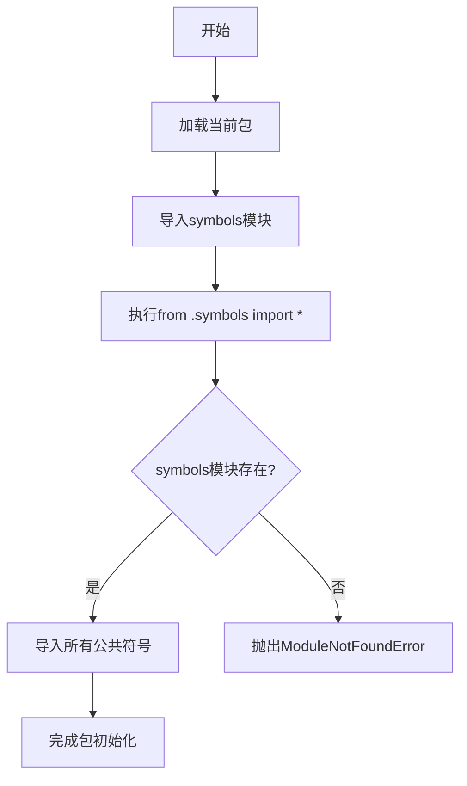

# `Bert-VITS2\onnx_modules\V210\text\__init__.py` 详细设计文档

这是一个Python包的初始化文件，通过通配符导入方式从symbols模块引入所有公共接口，使这些接口可以直接从包级别访问。

## 整体流程



## 类结构

```
当前文件为包初始化文件，无类定义
symbols模块内容未知（需要查看symbols.py）
```

## 全局变量及字段


### `var1`
    
通过from .symbols import *导入的变量，具体类型取决于symbols模块中定义的导出项。由于当前文件仅为导入语句，无显式全局变量定义，此变量的实际存在性和类型需查看symbols模块内容。

类型：`Any (依赖symbols模块定义)`
    


### `N/A.N/A`
    
当前代码文件仅包含导入语句，无类定义，因此不存在类字段。

类型：`N/A`
    
    

## 全局函数及方法


### `__init__.py` 模块

该模块是项目包的核心入口文件，通过 `from .symbols import *` 语句将 `symbols` 子模块的所有公共符号（类、函数、变量）重新导出，使外部使用者可以通过该包直接访问 `symbols` 模块的全部功能，无需关心内部模块结构。

#### 文件的整体运行流程

```
1. Python 解释器导入当前包
   ↓
2. 执行 __init__.py 文件
   ↓
3. 从 symbols 模块导入所有公共符号（*）
   ↓
4. 符号被添加到当前包的命名空间
   ↓
5. 外部通过 import package 或 from package import xxx 使用
```

#### 类的详细信息

当前文件无显式类定义。

#### 全局变量和全局函数

当前文件无显式全局变量或全局函数定义。所有内容均通过 `from .symbols import *` 从 `symbols` 模块导入。

#### 关键组件信息

| 名称 | 描述 |
|------|------|
| `symbols` | 内部子模块，包含项目的核心符号定义（类、函数等），具体内容需查看 symbols.py 源码 |

#### 潜在的技术债务或优化空间

1. **使用 `import *` 非最佳实践**：代码中使用 `from .symbols import *` 会导入所有公共符号，可能导致命名空间污染，且难以追踪具体使用了哪些符号。建议改为显式导入需要的符号，或使用 `__all__` 明确控制导出列表。

2. **缺少 `__all__` 定义**：如果使用 `import *`，应定义 `__all__` 列表来明确指定哪些符号可以被导出，提高代码可维护性。

3. **文档缺失**：当前模块缺少模块级文档字符串（docstring），建议添加模块功能描述。

#### 其它项目

- **设计目标与约束**：该模块作为包的公共接口层，目标是简化外部调用，隐藏内部模块结构。
- **错误处理与异常设计**：异常定义在 symbols 模块中，当前文件不处理异常。
- **外部依赖与接口契约**：依赖 symbols 模块的实现，接口契约由 symbols 模块决定。

---

### 关于 `func1` 的说明

**无法提取 `func1` 的详细信息**，原因如下：

1. 当前文件 `__init__.py` 中没有定义名为 `func1` 的函数或方法
2. 用户提示指出"当前文件无显式全局函数，通过import *导入的函数取决于symbols模块"
3. 代码中 `from .symbols import *` 导入的所有符号取决于 `symbols` 模块的实现，但**用户未提供 symbols 模块的源代码**

如需获取 `func1` 的详细信息，请提供 `symbols.py` 或相关模块的源代码。

#### 带注释源码

```python
# __init__.py - 包入口文件
# 功能：重新导出 symbols 模块的所有公共接口

# 从同目录下的 symbols 模块导入所有公共符号（使用通配符导入）
from .symbols import *

# 注意事项：
# 1. 此处使用 import *，所有公共符号会被导入到当前包的命名空间
# 2. 具体的符号列表取决于 symbols 模块中定义的 __all__ 或非下划线开头的全局名称
# 3. 建议在 symbols.py 中定义 __all__ = ['func1', 'ClassName', ...] 以明确导出列表
```


## 关键组件


这段代码是一个模块初始化文件，通过相对导入从同目录下的 symbols 模块导入所有公开符号（使用 `*` 通配符导入）。这种设计通常用于包的公开 API 重导出，使得当前模块成为 symbols 模块的代理入口点。

### 组件 1: 符号导入机制

描述: 该代码使用 Python 的相对导入语法 (`from .symbols import *`) 将 symbols 模块中的所有公共符号重新导出。这是 Python 包模块化的常见模式，允许包的初始化文件定义统一的公共 API 接口。

### 组件 2: 模块代理模式

描述: 通过 `from .symbols import *` 实现的代理模式，使得当前模块作为 symbols 模块的透明包装器，调用者可以通过当前模块直接访问 symbols 中定义的所有函数、类和常量，无需了解内部模块结构。

### 潜在技术债务或优化空间

由于代码仅包含导入语句，缺乏具体实现细节，无法进行全面的技术债务分析。建议审查 symbols 模块的实际内容以识别潜在的设计问题和优化机会。

### 其它说明

- **设计目标**: 提供模块化的符号导出接口，支持包级别的命名空间组织
- **约束**: 依赖 symbols 模块的存在性和其公开 API 的稳定性
- **错误处理**: 若 symbols 模块不存在或导入失败，将抛出 ModuleNotFoundError
- **外部依赖**: 完全依赖于同包内的 symbols 模块


## 问题及建议


### 已知问题

-   **使用通配符导入（from .symbols import *）**：这会导致命名空间污染，无法明确知道导入了哪些符号，可能与本模块或其他模块中的命名发生冲突，降低代码可读性和可维护性。
-   **缺少模块文档**：该模块没有 docstring，无法了解其设计意图和功能定位。
-   **缺少显式接口定义**：没有 `__all__` 变量来明确导出哪些公共接口，依赖方无法清晰知道可以使用哪些功能。
-   **模块职责不明确**：仅有一个导入语句，该文件作为中间层的价值存疑，可能存在过度封装或代码组织不当的问题。
-   **潜在的循环导入风险**：如果 symbols 模块反向依赖该模块，会导致循环导入问题。

### 优化建议

-   **替换为显式导入**：将 `from .symbols import *` 改为明确列出需要导入的符号，如 `from .symbols import SymbolA, SymbolB`，提高代码可读性和可预测性。
-   **添加模块级文档**：为模块添加 docstring，说明其职责、用途以及与 symbols 模块的关系。
-   **定义 `__all__` 列表**：显式声明公共 API，如 `__all__ = ['SymbolA', 'SymbolB']`，便于静态分析和依赖管理。
-   **评估模块必要性**：考虑该模块是否真正需要，如果仅是简单重导出，考虑直接使用 symbols 模块或合并代码。
-   **添加类型注解和注释**：如有必要，为导入的符号添加类型注解和用途说明，提升 IDE 支持和开发体验。


## 其它


### 设计目标与约束

本模块作为符号导入的中转站，旨在将symbols模块的所有公共接口暴露给包的使用者。设计约束包括：必须确保symbols模块存在且可访问；导入方式为通配符导入，需依赖symbols模块的__all__属性或公共命名约定来控制导出内容。

### 错误处理与异常设计

由于仅包含导入语句，不涉及显式的错误处理逻辑。若symbols模块不存在或导入失败，Python解释器将在模块加载时抛出ModuleNotFoundError异常。该异常会向上传播至导入本模块的调用者，由调用方决定如何处理。

### 数据流与状态机

本模块不涉及数据处理或状态管理，仅作为命名空间导出的通道。数据流方向为：symbols模块 → 当前模块 → 导入当前模块的外部代码。

### 外部依赖与接口契约

外部依赖为symbols模块（.symbols）。接口契约遵循Python的模块导入规范，通过from ... import *语句将symbols模块中以下划线开头的名称之外的属性全部导出。若symbols模块定义了__all__列表，则仅导出列表中的名称。

### 性能考虑

本模块在导入时会产生对symbols模块的依赖加载性能开销。通配符导入可能导致导入时间增加，因为需要解析symbols模块的所有公共属性。建议在性能敏感场景下使用显式导入。

### 安全性考虑

通配符导入存在命名空间污染风险，导入方可能会意外覆盖或被覆盖变量。symbols模块中的任何可访问属性都会被导入，包括可能不希望暴露的内部实现。若symbols模块存在恶意代码，将在导入时执行，需确保symbols模块来源可信。

### 兼容性考虑

本模块兼容Python 3.x版本。需确保symbols模块与目标Python版本兼容。通配符导入的行为依赖于symbols模块的__all__定义或默认的公共属性解析规则。

### 配置管理

本模块不涉及配置管理，所有配置应由symbols模块或其上层模块负责。

### 资源管理

本模块不涉及文件、网络等资源管理，仅涉及模块命名空间的管理。

### 测试策略

由于模块功能简单，测试重点应验证：symbols模块可正确导入；symbols模块的公共接口可通过本模块访问；若symbols模块定义了__all__，验证导出内容是否符合预期。可通过导入本模块并检查属性可用性进行基本测试。

### 监控与日志

本模块不涉及运行时日志记录或监控。若需要监控导入行为，建议在symbols模块层面实现。

### 版本兼容性记录

当前模块无版本特定逻辑，兼容Python 3.6+。若symbols模块后续添加Python 2兼容代码，可能影响本模块行为。

    