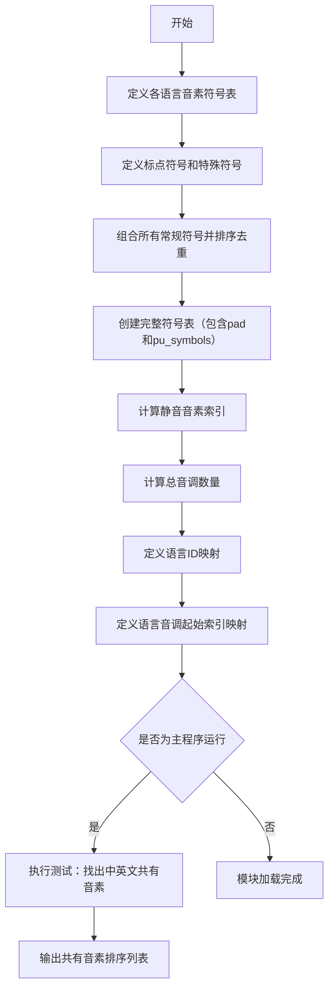

# `Bert-VITS2\onnx_modules\V210\text\symbols.py` 详细设计文档

这是一个多语言音素符号表定义模块，用于TTS（文本转语音）系统，支持中文、日文和英文的音素处理。通过定义各语言的音素符号、标点符号、音调数量以及语言映射关系，为后续的语音合成提供基础符号集。

## 整体流程



## 类结构

```
模块级别数据定义（无类层次结构）
├── 全局变量定义区域
│   ├── 标点符号定义
│   ├── 中文音素符号
│   ├── 日文音素符号
│   ├── 英文音素符号
│   └── 组合符号表
├── 映射字典定义
│   ├── language_id_map
│   └── language_tone_start_map
└── 主程序入口（可选执行）
```

## 全局变量及字段


### `punctuation`
    
常见标点符号列表，包含感叹号、问号、省略号、逗号、句号、单引号和连字符

类型：`list[str]`
    


### `pu_symbols`
    
标点符号集合，包含punctuation中的标点加上空格符(SP)和未知符(UNK)

类型：`list[str]`
    


### `pad`
    
填充符号，用于序列padding操作，值为下划线'_'

类型：`str`
    


### `zh_symbols`
    
中文音素符号列表，包含汉语拼音的声母、韵母和特殊标记如E、En、i0等

类型：`list[str]`
    


### `ja_symbols`
    
日语音素符号列表，包含假名的罗马字表示及浊化、半浊音标记如N、a、a:、by、gy等

类型：`list[str]`
    


### `en_symbols`
    
英文音素符号列表，使用ARPABET音素集表示英语发音如aa、ae、ah、b、ch等

类型：`list[str]`
    


### `normal_symbols`
    
规范化符号集合，对三种语言音素去重并排序后的统一符号表

类型：`list[str]`
    


### `symbols`
    
完整符号表，由填充符pad、规范化符号normal_symbols和标点符号pu_symbols按顺序拼接而成

类型：`list[str]`
    


### `sil_phonemes_ids`
    
标点符号在symbols列表中的索引位置，用于识别静音或标点音素

类型：`list[int]`
    


### `num_zh_tones`
    
中文声调数量，值为6（包含4个声调加轻声和轻声变体）

类型：`int`
    


### `num_ja_tones`
    
日语音调数量，值为2（区分重音和flat调）

类型：`int`
    


### `num_en_tones`
    
英文声调数量，值为4（用于语调标注）

类型：`int`
    


### `num_tones`
    
总声调数量，为中文、日文和英文声调数之和

类型：`int`
    


### `language_id_map`
    
语言标识映射表，将ZH(中文)、JP(日文)、EN(英文)映射到对应的数字ID

类型：`dict[str, int]`
    


### `num_languages`
    
支持的语言种类数量，通过language_id_map的键数量计算得出

类型：`int`
    


### `language_tone_start_map`
    
各语言声调ID起始位置映射，用于在统一声调空间中定位特定语言的声调范围

类型：`dict[str, int]`
    


    

## 全局函数及方法


## 关键组件


### 符号定义与索引映射

定义了中、英、日三种语言的音素符号集合，通过`sorted(set(...))`实现去重合并，并建立符号到ID的映射机制，支持张量索引操作。

### 标点符号与静音音素

包含标点符号列表（punctuation）和特殊符号（pu_symbols），用于处理句末停顿和未知字符，通过索引映射生成静音音素ID列表（sil_phonemes_ids）。

### 多语言音调系统

分别定义中文（num_zh_tones=6）、日文（num_ja_tones=2）、英文（num_en_tones=4）的音调数量，通过累加计算总音调数（num_tones=12），实现多语言音调的统一管理。

### 语言标识映射

建立语言ID映射表（language_id_map），将ZH/JP/EN三种语言映射为0/1/2的整型ID，支持跨语言处理的向量化表示。

### 音调起始偏移映射

通过language_tone_start_map定义各语言音调在统一音调空间中的起始位置，支持反量化操作，将统一音调ID映射回具体语言的相对音调。

### 集合交集分析模块

包含调试代码（if __name__ == "__main__"），用于分析中英共享音素，为跨语言音素对齐提供参考依据。

### 填充符号定义

定义pad="_"作为序列填充符号，支持变长序列的批处理训练。


## 问题及建议


### 已知问题

-   **全局变量污染**：symbols、sil_phonemes_ids、num_tones 等全局变量直接暴露，缺乏封装，可能导致命名空间冲突和意外的修改。
-   **硬编码数据**：所有音素符号集（zh_symbols、ja_symbols、en_symbols）以列表形式硬编码，缺乏结构化管理，扩展和维护困难，且容易引入重复或遗漏。
-   **缺少类型注解**：代码未使用 Python 类型提示（Type Hints），降低了代码的可读性和 IDE 支持，影响静态分析和重构效率。
-   **耦合的映射关系**：language_id_map、language_tone_start_map 和 num_tones 之间存在隐式耦合，人工维护容易出错，添加新语言时需要同步修改多处。
-   **调试代码残留**：__main__ 块中的调试代码（打印中英共享符号）不应存在于生产代码中。
-   **潜在的运行时错误**：symbols.index(i) 在符号不存在时抛出 ValueError，缺乏错误处理机制。
-   **排序结果的隐式依赖**：sorted() 的结果依赖于元素的原始顺序，在某些边界情况下可能导致不确定行为。

### 优化建议

-   **引入配置结构**：使用数据类（dataclass）或 Pydantic 模型定义语言和音素结构，将硬编码数据迁移至配置文件或数据库。
-   **添加类型注解**：为所有变量、函数参数和返回值添加明确的类型提示，提升代码可读性和静态检查能力。
-   **解耦映射逻辑**：设计一个 Language 类或配置类，统一管理语言 ID、音素集、音调范围等属性，通过自动计算而非人工维护映射关系。
-   **封装为模块**：将全局变量封装为模块级私有变量（如 _symbols），提供只读访问接口（get_symbols()），防止意外修改。
-   **移除调试代码**：删除 __main__ 块中的调试代码，或将其移至独立的测试文件。
-   **增强错误处理**：使用字典映射（symbols.index -> id）代替 list.index()，或添加异常处理，提高鲁棒性。
-   **添加文档字符串**：为各符号列表和全局变量添加 docstring，说明来源、用途和版本信息。

## 其它


### 设计目标与约束

本模块的设计目标是构建一个统一的多语言音素符号表管理系统，支持中文、日语、英语三种语言的音素符号统一编码，为后续的语音合成或语音识别系统提供基础数据支撑。设计约束包括：1）符号表必须保证唯一性且有序；2）语言ID和音调索引必须连续且不冲突；3）保留足够的扩展性以支持未来新增语言。

### 错误处理与异常设计

由于本模块为纯数据初始化模块，不涉及运行时错误处理。潜在的静态错误包括：1）各语言符号列表中存在重复元素（通过set去重解决）；2）language_id_map中的键名与language_tone_start_map中的键名不一致（需人工保证一致性）；3）符号索引计算错误。若发生索引越界，应在调用方进行边界检查。

### 数据流与状态机

本模块为无状态模块，仅提供静态数据配置。数据流为：语言符号列表(zh_symbols/ja_symbols/en_symbols) → 合并去重(normal_symbols) → 添加特殊符号(symbols) → 生成索引映射(sil_phonemes_ids) → 语言音调区间映射(language_tone_start_map)。无状态机设计。

### 外部依赖与接口契约

本模块无外部依赖，仅使用Python标准库(set/sorted)。接口契约包括：symbols列表索引从0开始，0号为pad符号；language_id_map的返回值用于表示语言类别；sil_phonemes_ids列表包含所有标点/静音符号的索引；调用方可通过symbols.index()获取符号对应ID，也可直接使用预计算的sil_phonemes_ids。

### 性能考虑

当前实现在模块加载时进行集合去重和排序操作，时间复杂度为O(n log n)，其中n为总符号数（<200），性能开销可忽略。symbols列表查询使用list.index()为O(n)操作，如需高频查询建议在调用方构建字典映射{符号: 索引}以获得O(1)查询效率。

### 配置管理与扩展性

当前配置以硬编码方式定义于代码中。扩展新语言需：1）在对应语言符号列表中添加新符号；2）更新num_xx_tones变量；3）更新language_id_map；4）更新language_tone_start_map中的起始索引。建议未来将配置迁移至JSON/YAML文件以提升可维护性。

### 测试策略建议

当前if __name__ == "__main__"块仅用于调试目的。建议补充：1）符号唯一性验证测试；2）各语言tone数量与符号列表一致性测试；3）language_tone_start_map区间连续性测试；4）sil_phonemes_ids不与普通符号索引冲突的验证测试。

### 安全考虑

本模块不涉及用户输入、文件IO或网络通信，无安全风险。symbols列表内容为音素符号文本，建议确保数据来源可信。

### 维护建议

1. 建议为每种语言的符号列表添加注释说明音素来源（如IPA国际音标或特定语音库）；2. 建议将特殊符号pu_symbols的索引预计算改为字典形式提升可读性；3. 建议使用枚举类替代字符串形式的语言键名；4. 建议添加__all__显式导出接口。

    