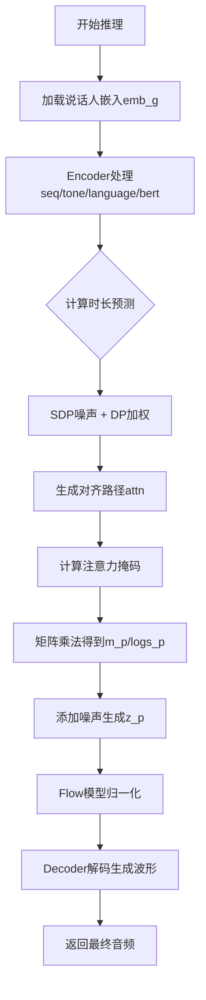
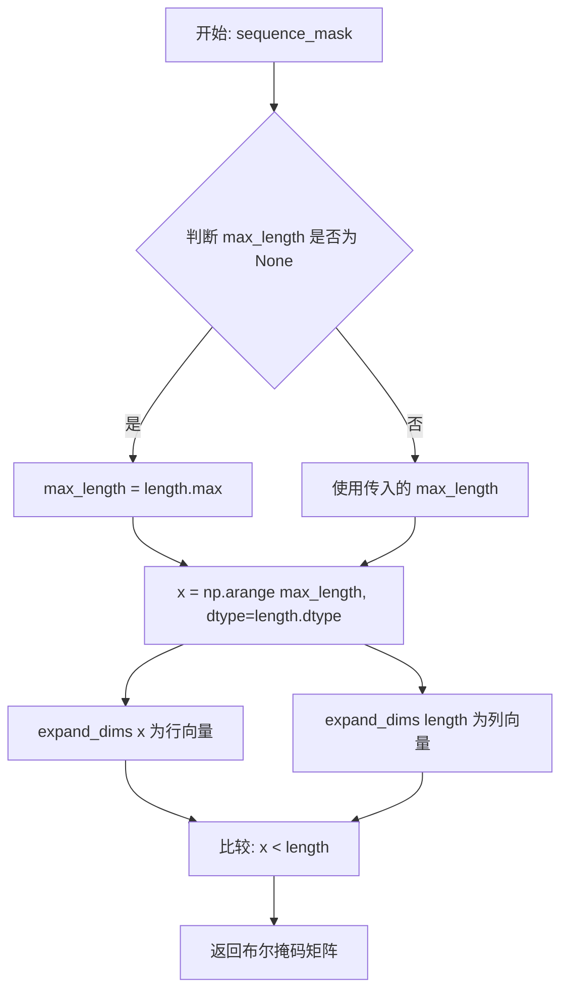
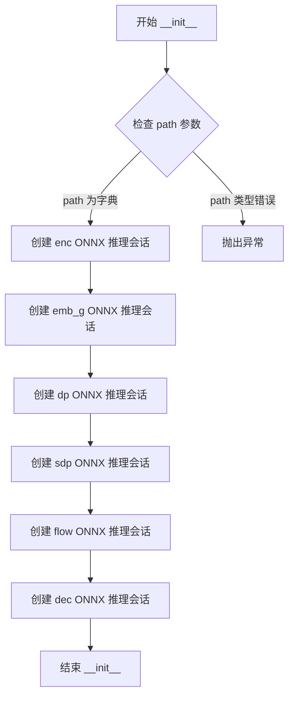
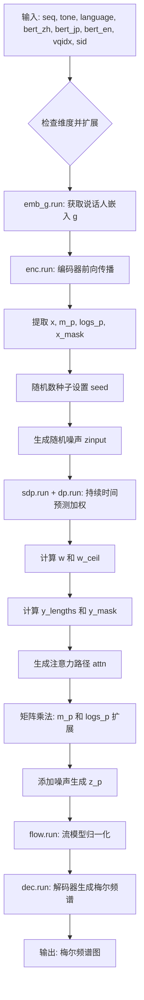

# `Bert-VITS2\onnx_modules\V210_OnnxInference\__init__.py` 详细设计文档

这是一个基于ONNX的语音合成(TTS)推理模块，通过串联多个ONNX模型(Encoder、Embedding、Duration Predictor、Flow、Decoder)将文本序列、音调、语言特征和BERT embeddings转换为最终的音频波形输出。

## 整体流程



## 类结构

```
Global Functions
├── convert_pad_shape()
├── sequence_mask()
└── generate_path()

OnnxInferenceSession (主类)
├── __init__() - 模型加载
└── __call__() - 推理流程
```

## 全局变量及字段


### `convert_pad_shape`
    
将填充形状从嵌套列表转换为扁平列表并翻转顺序。

类型：`function`
    


### `sequence_mask`
    
根据序列长度生成布尔掩码，用于指示有效位置。

类型：`function`
    


### `generate_path`
    
根据持续时间矩阵和掩码生成对齐路径矩阵。

类型：`function`
    


### `np`
    
NumPy库，提供高效的数值数组操作功能。

类型：`module`
    


### `ort`
    
ONNX Runtime库，用于加载并运行ONNX模型进行推理。

类型：`module`
    


### `OnnxInferenceSession.self.enc`
    
Encoder模型会话

类型：`InferenceSession`
    


### `OnnxInferenceSession.self.emb_g`
    
说话人嵌入模型会话

类型：`InferenceSession`
    


### `OnnxInferenceSession.self.dp`
    
Duration Predictor模型会话

类型：`InferenceSession`
    


### `OnnxInferenceSession.self.sdp`
    
Stochastic Duration Predictor模型会话

类型：`InferenceSession`
    


### `OnnxInferenceSession.self.flow`
    
Normalizing Flow模型会话

类型：`InferenceSession`
    


### `OnnxInferenceSession.self.dec`
    
Decoder模型会话

类型：`InferenceSession`
    
    

## 全局函数及方法


### `convert_pad_shape`

该函数用于将嵌套的填充形状数组（pad_shape）进行反向并展平处理，常用于深度学习模型的padding处理，将多维嵌套结构转换为一维列表形式。

参数：

- `pad_shape`：list，嵌套的填充形状列表，例如 `[[1, 2], [3, 4]]`

返回值：`list`，展平并反转后的一维列表

#### 流程图

```mermaid
flowchart TD
    A[开始] --> B[输入: pad_shape 嵌套列表]
    B --> C[layer = pad_shape[::-1]]
    C --> D[将嵌套列表展平为单层列表]
    D --> E[返回展平后的列表]
```

#### 带注释源码

```python
def convert_pad_shape(pad_shape):
    """
    将嵌套的填充形状数组进行反转并展平
    
    参数:
        pad_shape: 嵌套的填充形状列表，例如 [[1, 2], [3, 4]]
    
    返回:
        展平后的一维列表
    """
    # 第一步：将输入列表反转
    # 例如：[[1, 2], [3, 4]] -> [[3, 4], [1, 2]]
    layer = pad_shape[::-1]
    
    # 第二步：将嵌套列表展平为单层列表
    # 使用列表推导式遍历子列表中的每个元素
    # 例如：[[3, 4], [1, 2]] -> [3, 4, 1, 2]
    pad_shape = [item for sublist in layer for item in sublist]
    
    # 返回展平后的列表
    return pad_shape
```


### `sequence_mask`

该函数用于生成序列掩码矩阵，根据输入的序列长度数组生成布尔掩码，用于标识有效位置。通常用于变长序列处理，如注意力机制中的padding mask或序列生成任务中的长度控制。

参数：

- `length`：`numpy.ndarray`，一维数组，表示每个序列的长度
- `max_length`：`int` 或 `None`，掩码的最大长度，默认值为 `None`。当为 `None` 时，自动取 `length` 数组中的最大值

返回值：`numpy.ndarray`，二维布尔数组，形状为 `(length.shape[0], max_length)`，其中元素 `[i, j]` 为 `True` 表示第 `i` 个序列的第 `j` 个位置是有效的（即 `j < length[i]`）

#### 流程图



#### 带注释源码

```python
def sequence_mask(length, max_length=None):
    """
    生成序列掩码矩阵
    
    参数:
        length: numpy.ndarray - 一维数组，包含每个序列的长度
        max_length: int 或 None - 掩码的最大长度，默认为 None
    
    返回:
        numpy.ndarray - 二维布尔掩码矩阵，形状为 (batch_size, max_length)
    """
    # 如果未指定最大长度，则使用输入长度数组中的最大值
    if max_length is None:
        max_length = length.max()
    
    # 创建从 0 到 max_length-1 的数组，数据类型与 length 相同
    # 例如: length.dtype 为 int32，则 x 也是 int32
    x = np.arange(max_length, dtype=length.dtype)
    
    # 将 x 扩展为行向量 (1, max_length)
    # 将 length 扩展为列向量 (batch_size, 1)
    # 利用广播机制比较，生成 (batch_size, max_length) 的布尔矩阵
    return np.expand_dims(x, 0) < np.expand_dims(length, 1)
```


### `generate_path`

该函数根据输入的持续时间（duration）和掩码（mask）生成对齐路径矩阵，常用于语音合成中计算注意力对齐关系。通过累积持续时间并利用序列掩码生成路径矩阵，再经过维度变换得到最终的对齐路径。

参数：

- `duration`：`numpy.ndarray`，形状为 [b, 1, t_x]，表示每个时间步的持续时间
- `mask`：`numpy.ndarray`，形状为 [b, 1, t_y, t_x]，表示输入序列的掩码信息

返回值：`numpy.ndarray`，返回形状为 [b, 1, t_y, t_x] 的路径矩阵，表示输入序列与输出序列之间的对齐关系

#### 流程图

```mermaid
flowchart TD
    A[开始] --> B[获取mask形状: b, _, t_y, t_x]
    B --> C[计算累积持续时间: cum_duration = cumsum(duration)]
    C --> D[展平cum_duration: b * t_x]
    D --> E[生成基础路径: sequence_mask cum_duration_flat, t_y]
    E --> F[重塑路径: (b, t_x, t_y)]
    F --> G[XOR与移位操作: path ^ pad(path)]
    G --> H[扩展维度并转置: (b, 1, t_y, t_x)]
    H --> I[返回路径矩阵]
```

#### 带注释源码

```python
def generate_path(duration, mask):
    """
    duration: [b, 1, t_x]
    mask: [b, 1, t_y, t_x]
    """
    # 从mask中获取批次大小b、输出序列长度t_y和输入序列长度t_x
    b, _, t_y, t_x = mask.shape
    
    # 计算累积持续时间，在最后一个维度上累加
    # 例如：[1, 2, 3] -> [1, 3, 6]
    cum_duration = np.cumsum(duration, -1)
    
    # 将累积持续时间展平为一维数组，形状变为 (b * t_x,)
    # 便于后续批量处理生成序列掩码
    cum_duration_flat = cum_duration.reshape(b * t_x)
    
    # 生成序列掩码，形状为 (b * t_x, t_y)
    # 用于指示每个位置是否在有效范围内
    path = sequence_mask(cum_duration_flat, t_y)
    
    # 重新形状为 (b, t_x, t_y)
    path = path.reshape(b, t_x, t_y)
    
    # 执行XOR操作实现路径对齐
    # 先对path在t_x维度前面填充0，然后与原path进行XOR操作
    # 这样可以确保每个输出位置只对应一个输入位置
    # pad参数((0,0), (1,0), (0,0))表示在第二个维度前添加一行0
    # [:, :-1] 去掉最后一行，保持形状一致
    path = path ^ np.pad(path, ((0, 0), (1, 0), (0, 0)))[:, :-1]
    
    # 扩展维度并转置，最终形状为 (b, 1, t_y, t_x)
    # 转置将t_x和t_y维度交换，便于后续矩阵运算
    path = np.expand_dims(path, 1).transpose(0, 1, 3, 2)
    
    return path
```


### `OnnxInferenceSession.__init__`

这是 `OnnxInferenceSession` 类的构造函数，负责初始化多个 ONNX Runtime 推理会话，分别用于语音合成流水线中的不同模型组件（编码器、嵌入、时长预测器、流模型、解码器等）。

参数：

- `path`：`dict`，包含模型文件路径的字典，必须包含 'enc'（编码器）、'emb_g'（说话人嵌入）、'dp'（时长预测器）、'sdp'（流式时长预测器）、'flow'（归一化流）、'dec'（解码器）键
- `Providers`：`list`，ONNX Runtime 执行提供者列表，默认为 ["CPUExecutionProvider"]

返回值：`None`，构造函数无返回值

#### 流程图



#### 带注释源码

```python
def __init__(self, path, Providers=["CPUExecutionProvider"]):
    """
    初始化 ONNX 推理会话管理器
    
    参数:
        path: 字典，包含各个 ONNX 模型文件的路径
              必须包含键: 'enc', 'emb_g', 'dp', 'sdp', 'flow', 'dec'
        Providers: ONNX Runtime 执行提供者列表，默认为 CPU 执行提供者
    
    返回:
        无返回值（构造函数）
    """
    # 创建编码器(Encoder) ONNX 推理会话
    # 负责处理音素序列、韵母特征、语言特征和 BERT 嵌入
    self.enc = ort.InferenceSession(path["enc"], providers=Providers)
    
    # 创建说话人嵌入(Speaker Embedding) ONNX 推理会话
    # 根据说话人 ID 生成说话人向量
    self.emb_g = ort.InferenceSession(path["emb_g"], providers=Providers)
    
    # 创建时长预测器(Duration Predictor) ONNX 推理会话
    # 预测每个音素的持续时间
    self.dp = ort.InferenceSession(path["dp"], providers=Providers)
    
    # 创建流式时长预测器(Stochastic Duration Predictor) ONNX 推理会话
    # 使用归一化流预测时长分布
    self.sdp = ort.InferenceSession(path["sdp"], providers=Providers)
    
    # 创建归一化流(Normalizing Flow) ONNX 推理会话
    # 将潜在表示转换为符合特定分布的表示
    self.flow = ort.InferenceSession(path["flow"], providers=Providers)
    
    # 创建声码器解码器(Decoder) ONNX 推理会话
    # 将声学特征转换为最终音频波形
    self.dec = ort.InferenceSession(path["dec"], providers=Providers)
```


### OnnxInferenceSession.__call__

该方法是 VITS（Variational Inference with adversarial learning for end-to-end Text-to-Speech）模型的 ONNX 推理入口，接收文本序列、音调、语言标识和多语言 BERT 嵌入等输入，通过编码器、持续时间预测器、流模型和解码器的级联处理，最终输出合成语音的梅尔频谱图。

#### 参数

- `seq`：`np.ndarray`，输入文本序列（整数值编码），形状为 `[batch, seq_len]` 或 `[seq_len]`
- `tone`：`np.ndarray`，音调序列，形状为 `[batch, seq_len]` 或 `[seq_len]`
- `language`：`np.ndarray`，语言标识序列，形状为 `[batch, seq_len]` 或 `[seq_len]`
- `bert_zh`：`np.ndarray`，中文 BERT 嵌入，形状为 `[batch, seq_len, bert_dim]`
- `bert_jp`：`np.ndarray`，日文 BERT 嵌入，形状为 `[batch, seq_len, bert_dim]`
- `bert_en`：`np.ndarray`，英文 BERT 嵌入，形状为 `[batch, seq_len, bert_dim]`
- `vqidx`：`np.ndarray`，向量量化索引，用于指定说话人
- `sid`：`np.ndarray`，说话人 ID，用于嵌入查找
- `seed`：`int`，随机种子，默认为 114514，用于控制噪声生成
- `seq_noise_scale`：`float`，序列噪声缩放因子，默认为 0.8，控制高斯噪声强度
- `sdp_noise_scale`：`float`，随机持续时间预测器噪声缩放因子，默认为 0.6
- `length_scale`：`float`，长度缩放因子，默认为 1.0，用于调整输出时长
- `sdp_ratio`：`float`，随机与确定性持续时间预测器的混合比例，默认为 0.0

#### 返回值

- `np.ndarray`，合成语音的梅尔频谱图，形状为 `[batch, mel_dim, time_steps]`，数据类型为 float32

#### 流程图



#### 带注释源码

```python
def __call__(
    self,
    seq,               # 输入文本序列 [batch, seq_len] 或 [seq_len]
    tone,              # 音调序列 [batch, seq_len]
    language,          # 语言标识序列 [batch, seq_len]
    bert_zh,           # 中文BERT嵌入 [batch, seq_len, bert_dim]
    bert_jp,           # 日文BERT嵌入 [batch, seq_len, bert_dim]
    bert_en,           # 英文BERT嵌入 [batch, seq_len, bert_dim]
    vqidx,             # 向量量化索引 [batch, seq_len]
    sid,               # 说话人ID [batch]
    seed=114514,       # 随机种子
    seq_noise_scale=0.8,   # 序列噪声缩放
    sdp_noise_scale=0.6,   # SDP噪声缩放
    length_scale=1.0,     # 长度缩放
    sdp_ratio=0.0,        # SDP/DP混合比例
):
    """
    VITS模型的ONNX推理入口，执行完整的文本到语音合成流程
    """
    # === 1. 输入维度标准化 ===
    # 确保所有输入为2D数组（batch维度）
    if seq.ndim == 1:
        seq = np.expand_dims(seq, 0)
    if tone.ndim == 1:
        tone = np.expand_dims(tone, 0)
    if language.ndim == 1:
        language = np.expand_dims(language, 0)
    
    # 验证输入维度正确
    assert (seq.ndim == 2, tone.ndim == 2, language.ndim == 2)

    # === 2. 说话人嵌入获取 ===
    # 通过嵌入网络将说话人ID转换为嵌入向量
    g = self.emb_g.run(
        None,
        {"sid": sid.astype(np.int64)},
    )[0]
    # 扩展维度为 [batch, embed_dim, 1] 用于后续广播
    g = np.expand_dims(g, -1)

    # === 3. 编码器前向传播 ===
    # 处理文本序列、音调、语言和多语言BERT特征
    enc_rtn = self.enc.run(
        None,
        {
            "x": seq.astype(np.int64),        # 文本ID
            "t": tone.astype(np.int64),       # 音调
            "language": language.astype(np.int64),  # 语言ID
            "bert_0": bert_zh.astype(np.float32),   # 中文BERT
            "bert_1": bert_jp.astype(np.float32),   # 日文BERT
            "bert_2": bert_en.astype(np.float32),   # 英文BERT
            "g": g.astype(np.float32),              # 说话人嵌入
            "vqidx": vqidx.astype(np.int64),        # VQ索引
            "sid": sid.astype(np.int64),            # 说话人ID
        },
    )
    # 解包编码器输出
    x, m_p, logs_p, x_mask = enc_rtn[0], enc_rtn[1], enc_rtn[2], enc_rtn[3]

    # === 4. 持续时间预测 ===
    # 设置随机种子确保可复现性
    np.random.seed(seed)
    # 生成随机噪声输入用于随机持续时间预测器
    zinput = np.random.randn(x.shape[0], 2, x.shape[2]) * sdp_noise_scale
    
    # 计算对数持续时间：SDP和DP的加权混合
    logw = self.sdp.run(
        None, {"x": x, "x_mask": x_mask, "zin": zinput.astype(np.float32), "g": g}
    )[0] * (sdp_ratio) + self.dp.run(None, {"x": x, "x_mask": x_mask, "g": g})[0] * (1 - sdp_ratio)
    
    # 指数运算得到持续时间，乘以掩码和长度缩放
    w = np.exp(logw) * x_mask * length_scale
    # 向上取整得到整数持续时间
    w_ceil = np.ceil(w)
    
    # 计算输出序列长度
    y_lengths = np.clip(np.sum(w_ceil, (1, 2)), a_min=1.0, a_max=100000).astype(np.int64)
    # 生成输出序列掩码
    y_mask = np.expand_dims(sequence_mask(y_lengths, None), 1)
    # 计算注意力掩码
    attn_mask = np.expand_dims(x_mask, 2) * np.expand_dims(y_mask, -1)
    # 生成单调对齐路径
    attn = generate_path(w_ceil, attn_mask)

    # === 5. 潜在变量扩展 ===
    # 使用注意力路径对均值和日志方差进行扩展
    m_p = np.matmul(attn.squeeze(1), m_p.transpose(0, 2, 1)).transpose(0, 2, 1)
    logs_p = np.matmul(attn.squeeze(1), logs_p.transpose(0, 2, 1)).transpose(0, 2, 1)

    # === 6. 采样潜在变量 z_p ===
    # 从高斯分布采样：均值=m_p，标准差=exp(logs_p)
    z_p = (
        m_p
        + np.random.randn(m_p.shape[0], m_p.shape[1], m_p.shape[2])
        * np.exp(logs_p)
        * seq_noise_scale
    )

    # === 7. 流模型归一化 ===
    # 通过规范化流将潜在变量转换为标准高斯分布
    z = self.flow.run(
        None,
        {
            "z_p": z_p.astype(np.float32),
            "y_mask": y_mask.astype(np.float32),
            "g": g,
        },
    )[0]

    # === 8. 解码器生成梅尔频谱 ===
    # 最终将潜在表示解码为梅尔频谱图
    return self.dec.run(None, {"z_in": z.astype(np.float32), "g": g})[0]
```

## 关键组件


### convert_pad_shape 函数
将填充形状从后向前展开并展平，用于处理卷积操作的填充参数。

### sequence_mask 函数
生成序列掩码，根据给定长度生成布尔掩码，用于指示有效时间步。

### generate_path 函数
根据预测的时长和注意力掩码生成对齐路径，用于将输入序列映射到输出序列。

### OnnxInferenceSession 类
语音合成推理核心类，负责加载和运行多个ONNX模型（编码器、说话人嵌入、时长预测器、流模型、解码器），并执行完整的语音合成流程。

### 编码器模型 (enc)
处理输入序列、音调、语言和BERT嵌入，输出隐状态表示、均值、对数方差和掩码。

### 说话人嵌入模型 (emb_g)
根据说话人ID获取说话人嵌入向量，用于条件控制。

### 时长预测模型 (dp 和 sdp)
预测输入序列中每个元素的持续时间，sdp用于噪声预测，dp用于确定性预测。

### 流模型 (flow)
对预测的隐状态进行非线性变换，增强表达性并生成最终隐状态。

### 解码器模型 (dec)
将隐状态转换为音频波形，输出最终合成语音。

### 推理流程
包括输入处理、嵌入获取、编码、时长预测、路径生成、流变换和解码等步骤，最终输出音频波形。


## 问题及建议


### 已知问题

-   **全局随机状态污染**：使用`np.random.seed(seed)`会影响全局numpy随机状态，可能导致其他代码产生不可预测的结果
-   **缺乏错误处理**：整个推理流程没有try-except块捕获ONNX推理可能的异常（如模型加载失败、输入shape不匹配等）
-   **Magic Numbers**：代码中包含`114514`、`0.8`、`0.6`、`1.0`等硬编码数值，缺乏注释说明其含义
-   **重复的astype转换**：多处使用`.astype()`进行类型转换（如`seq.astype(np.int64)`），每次推理都会重新分配内存
-   **中间变量冗余**：`enc_rtn`解包出4个变量但只使用了前3个，`x`变量未被使用
-   **Numpy实现的核心逻辑**：`generate_path`函数使用numpy而非ONNX实现，在Python层面执行效率较低
-   **缺少输入验证**：未对输入数组的shape、dtype进行有效性校验，可能导致运行时错误
-   **默认仅使用CPU**：`Providers`默认只使用`CPUExecutionProvider`，未充分利用GPU加速

### 优化建议

-   使用`numpy.random.Generator`替代全局随机状态，或在类中维护独立的随机生成器实例
-   为ONNX模型加载和推理添加异常处理，捕获并妥善处理可能的错误
-   将超参数提取为类属性或配置参数，提供更灵活的接口
-   在输入预处理阶段一次性完成所有astype转换，避免推理循环中的重复转换
-   移除未使用的中间变量`enc_rtn[0]`（即`x`）
-   考虑将`generate_path`逻辑迁移至ONNX模型或使用onnxruntime的GPU执行
-   添加输入shape和dtype的验证逻辑，确保符合模型要求
-   考虑支持多Provider配置（GPU可选），或提供配置接口让用户选择

## 其它


### 设计目标与约束

本模块旨在实现一个高效的基于ONNX Runtime的文本到语音（TTS）推理框架，支持多语言（中文、日文、英文）语音合成，通过预训练的ONNX模型进行快速推理。设计约束包括：模型输入必须为特定格式的整数序列（seq、tone、language）和BERT嵌入向量；输出为浮点型音频特征；必须使用ONNXRuntime作为推理引擎；仅支持CPU执行Provider。

### 错误处理与异常设计

输入维度检查：代码中对seq、tone、language进行了ndim检查，若为一维则expand_dims扩展为二维，否则抛出AssertionError。模型加载异常：OnnxInferenceSession初始化时，若ONNX文件路径不存在或损坏，ort.InferenceSession会抛出异常。数值范围约束：y_lengths使用np.clip限制在1到100000之间，防止内存溢出。类型转换安全：所有输入均显式转换为np.int64或np.float32，确保与ONNX模型输入类型匹配。

### 数据流与状态机

数据流分为以下阶段：Embedding阶段→Encoder阶段→Duration/Pitch预测阶段→Path生成阶段→Flow归一化阶段→Decoder阶段。状态机转换：输入序列(seq, tone, language)经过embedding生成全局条件g；encoder输出隐状态x、均值m_p、方差logs_p；sdp和dp分别预测duration；generate_path生成对齐路径；flow进行特征归一化；decoder最终生成音频特征z。

### 外部依赖与接口契约

核心依赖包括numpy（数值计算）、onnxruntime（模型推理）。ONNX模型文件契约：enc、emb_g、dp、sdp、flow、dec六个ONNX模型文件必须存在且输入输出张量维度匹配。输入契约：seq/tone/language为int64二维张量，bert_zh/bert_jp/bert_en为float32三维张量，vqidx/sid为int64张量。输出契约：返回float32类型的音频特征张量。

### 性能考虑与优化建议

模型预加载：所有ONNX模型在初始化时加载，避免推理时延迟。随机数种子控制：通过np.random.seed固定种子确保可复现性。内存优化：使用inplace操作如np.clip、astype减少内存复制。缓存建议：可缓存emb_g的speaker embedding结果避免重复推理。并行化：多batch推理时可并行运行各模型session。

### 安全性考虑

输入验证：需验证seq、tone、language长度一致性，防止索引越界。模型文件安全：确保ONNX模型文件来源可信，防止恶意模型注入攻击。数值安全：sdp_noise_scale和seq_noise_scale参数需限制范围，防止过大噪声导致数值不稳定。

### 配置管理与扩展性

模型路径通过字典path传递，支持自定义模型文件路径。Providers参数支持切换推理设备（如CUDAExecutionProvider）。可通过继承OnnxInferenceSession类扩展预处理/后处理逻辑。

### 版本兼容性与依赖要求

numpy版本需兼容onnxruntime，建议numpy>=1.19，onnxruntime>=1.8。ONNX模型版本需与onnxruntime版本匹配，不同版本可能存在算子兼容性问题。

### 测试考虑

单元测试应覆盖：convert_pad_shape函数的各种输入形式；sequence_mask的边界条件；generate_path的对齐矩阵生成逻辑；OnnxInferenceSession的模型加载和推理流程。集成测试应验证完整TTS流程的输出维度正确性。

### 资源管理与监控

内存峰值出现在flow和dec推理阶段，需监控大规模batch时的内存使用。长期运行时应定期释放不再使用的ONNX session资源。

    