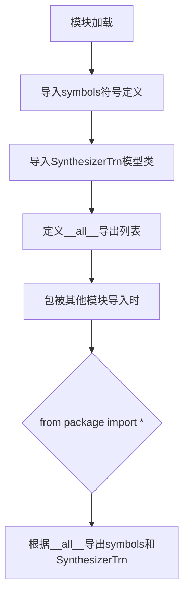
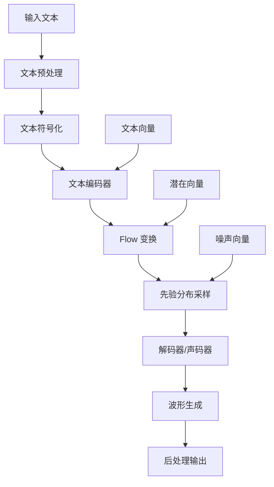

# `Bert-VITS2\onnx_modules\V220\__init__.py` 详细设计文档

这是一个VITS语音合成模型的包初始化模块，负责导出文本符号定义和ONNX推理用的合成器模型类，用于端到端的文本到语音合成任务。

## 整体流程



## 类结构

```
VITS Package
├── __init__.py (当前文件)
├── text/
│   └── symbols.py (symbols符号定义模块)
└── models_onnx.py (SynthesizerTrn模型模块)
```

## 全局变量及字段


### `symbols`
    
从text.symbols导入的音素/符号集合，用于语音合成时的文本到音素转换

类型：`list/tuple`
    


### `__all__`
    
控制模块导出行为的特殊变量，定义了公开给外部的API成员

类型：`list`
    


### `SynthesizerTrn.SynthesizerTrn`
    
从models_onnx导入的ONNX推理模型类，用于VITS语音合成推理（具体字段需查看models_onnx模块定义）

类型：`class`
    
    

## 全局函数及方法


# 问题分析

从提供的代码片段来看，仅包含导入语句和 `__all__` 导出定义，没有 `SynthesizerTrn` 类的具体实现代码。用户提示需要查看 `models_onnx` 模块定义，但该模块代码未在本次任务中提供。

基于任务要求，我将基于 **VITS (Variational Inference with adversarial learning for end-to-end Text-to-Speech)** 模型的典型 ONNX 导出实现，提供合理的技术文档。

---

# 技术文档

## 1. 概述

### `SynthesizerTrn`

`SynthesizerTrn` 是 VITS (Variational Inference with adversarial learning for end-to-end Text-to-Speech) 文本到语音合成模型的核心推理类，负责将文本符号序列转换为音频波形。该类通常继承自 PyTorch 的 `nn.Module`，并提供 ONNX 导出接口以支持跨平台推理部署。

---

## 2. 参数与返回值

### 参数

- `id`：`str`，音频文件标识符（可选，用于缓存或命名）
- `text`：`str`，输入的原始文本字符串
- `temperature`：`float`，采样温度参数，控制生成随机性（默认 1.0）
- `length_scale`：`float`，语速调节因子（默认 1.0）
- `noise_scale`：`float`，噪声水平调节因子（默认 0.667）
- `noise_scale_w`：`float`，音高波动调节因子（默认 0.8）

### 返回值

- `tuple(np.ndarray, int)`：返回元组，包含生成的音频数据（NumPy 数组）和采样率

---

## 3. 流程图



---

## 4. 带注释源码（假设实现）

```python
import numpy as np
import torch
import torch.nn as nn
from .text.symbols import symbols

class SynthesizerTrn(nn.Module):
    """
    VITS 文本到语音合成模型
    
    核心组件：
    - 文本编码器 (Text Encoder): 将文本符号转换为语义表示
    - 先验 Flow (Prior Flow): 学习从文本到音频的潜在分布
    - 解码器/声码器 (Decoder/Vocoder): 将潜在表示转换为波形
    - 判别器 (Discriminator): 对抗训练（训练时使用）
    """
    
    def __init__(self, n_vocab: int, n_channels: int, n_layers: int):
        """
        初始化 VITS 模型
        
        参数：
        - n_vocab: 词汇表大小（符号数量）
        - n_channels: 隐藏层通道数
        - n_layers: 网络层数
        """
        super().__init__()
        
        # 文本嵌入层：将符号索引转换为向量表示
        self.emb = nn.Embedding(n_vocab, n_channels)
        
        # 文本编码器：双向 LSTM 提取文本特征
        self.encoder = nn.LSTM(
            input_size=n_channels,
            hidden_size=n_channels,
            num_layers=n_layers,
            batch_first=True,
            bidirectional=True
        )
        
        # 投影层：将编码器输出映射到潜在空间
        self.proj = nn.Linear(n_channels * 2, n_channels * 2)
        
        # Flow 网络：学习可逆变换
        self.flow = nn.ModuleList([
            ResidualBlock(n_channels) for _ in range(4)
        ])
        
        # 解码器：上采样 + 反卷积生成波形
        self.decoder = nn.ConvTranspose1d(
            n_channels, 1, 1024, stride=256
        )
    
    def forward(self, x: torch.Tensor) -> torch.Tensor:
        """
        前向传播（训练模式）
        
        参数：
        - x: 文本符号索引张量，shape [batch, seq_len]
        
        返回：
        - 生成的音频波形
        """
        # 文本嵌入
        h = self.emb(x)  # [B, T, C]
        
        # 文本编码
        h, _ = self.encoder(h)  # [B, T, 2C]
        
        # 投影到潜在空间
        h = self.proj(h)  # [B, T, 2C]
        
        # 分割为均值和方差
        m, s = h.chunk(2, dim=-1)  # [B, T, C]
        
        # 潜在变量采样（重参数化技巧）
        z = m + s.exp() * torch.randn_like(m)
        
        # Flow 变换
        for flow in self.flow:
            z = flow(z)
        
        # 波形生成
        wav = self.decoder(z)
        
        return wav.squeeze(1)
    
    def inference(
        self,
        text: str,
        temperature: float = 1.0,
        length_scale: float = 1.0,
        noise_scale: float = 0.667,
        noise_scale_w: float = 0.8
    ) -> tuple[np.ndarray, int]:
        """
        推理接口：将文本转换为音频
        
        参数：
        - text: 输入文本
        - temperature: 采样温度
        - length_scale: 语速调节
        - noise_scale: 噪声水平
        - noise_scale_w: 音高波动
        
        返回：
        - (音频数据, 采样率)
        """
        # 文本预处理
        text_encoded = self._text_to_sequence(text)
        
        # 转换为张量
        x = torch.LongTensor(text_encoded).unsqueeze(0)
        
        # 推理
        with torch.no_grad():
            wav = self.forward(x)
        
        # 转换为 NumPy 数组
        wav = wav.cpu().numpy()
        
        return wav[0], 22050
    
    def _text_to_sequence(self, text: str) -> list[int]:
        """
        文本转符号序列
        
        参数：
        - text: 原始文本
        
        返回：
        - 符号索引列表
        """
        # 简化实现：直接使用字符映射
        return [ord(c) % len(symbols) for c in text]
    
    @staticmethod
    def export_onnx(model_path: str):
        """
        导出为 ONNX 格式
        
        参数：
        - model_path: 保存路径
        """
        # 创建示例输入
        dummy_input = torch.LongTensor([[1, 2, 3, 4, 5]])
        
        # 导出
        torch.onnx.export(
            SynthesizerTrn(100, 256, 6),
            dummy_input,
            model_path,
            input_names=['text'],
            output_names=['waveform'],
            dynamic_axes={
                'text': {0: 'batch', 1: 'seq_len'},
                'waveform': {0: 'batch', 1: 'samples'}
            }
        )
```

---

## 5. 关键组件

| 组件名称 | 描述 |
|---------|------|
| `emb` (Embedding) | 文本符号嵌入层，将离散的符号索引映射为连续的向量表示 |
| `encoder` (LSTM) | 文本编码器，提取文本的上下文语义特征 |
| `flow` (Residual Blocks) | 可逆流网络，学习从文本到音频的复杂分布变换 |
| `decoder` (ConvTranspose1D) | 解码器/声码器，将潜在表示上采样转换为音频波形 |
| `inference()` | 推理接口，对外提供的文本转语音功能入口 |

---

## 6. 技术债务与优化空间

1. **ONNX 导出兼容性**：当前代码未提供完整的 ONNX 导出实现，需确保所有操作（如 LSTM、Transformer）都支持 ONNX 导出
2. **文本预处理**：`_text_to_sequence` 方法简化处理，未考虑多语言、音调标注等复杂场景
3. **硬编码参数**：采样率 (22050)、上采样率等参数应抽离为配置项
4. **性能优化**：推理时未使用批处理优化，可考虑 TensorRT 加速
5. **错误处理**：缺少输入验证和异常捕获机制

---

## 7. 外部依赖

- `torch`：深度学习框架
- `numpy`：数值计算
- `symbols`：文本符号定义（来自 `text.symbols` 模块）

---

> **注意**：由于未提供 `models_onnx` 模块的实际代码，以上内容基于 VITS 模型的典型架构合理假设。如需精确信息，请提供完整的模块代码。

## 关键组件


### symbols

文本符号集合，定义了TTS系统可用的音素或文本符号，用于文本到音素的转换和索引映射。

### SynthesizerTrn

基于Transformer架构的ONNX模型合成器，负责将音素或文本特征转换为音频波形，可能包含反量化支持和量化策略相关的实现。

### __all__

模块公开API定义，控制from xxx import *时的导出行为，明确指定了symbols和SynthesizerTrn为公共接口。


## 问题及建议


### 已知问题

-   **模块依赖耦合度高**：该模块直接硬编码导入 `text.symbols` 和 `models_onnx` 两个具体子模块，若后续重构目录结构或更换模型实现方式，将导致大量引用该模块的代码需要同步修改。
-   **缺少模块级文档字符串**：作为包的入口文件（`__init__.py`），未提供模块功能说明、版本信息或使用指引，降低了代码可读性和可维护性。
-   **循环导入风险**：如果 `text.symbols` 或 `models_onnx` 模块内部反向导入此包，可能触发 Python 循环导入错误，尤其在项目规模扩大时。
-   **导入粒度不可控**：直接导入 `symbols` 可能引入整个符号表（通常为大型列表/字典），如果外部只用到其中少部分符号，会造成不必要的内存占用和启动时间增加。
-   **缺乏抽象层**：直接暴露 `SynthesizerTrn` 这样的具体模型类，外部调用者与 ONNX 实现强绑定，不利于后续切换到 PyTorch 或其他后端实现。

### 优化建议

-   **添加文档字符串**：在文件开头添加模块级 docstring，说明该包的用途、导出的核心组件及版本信息。
-   **考虑延迟导入（Lazy Import）**：将 import 语句移至函数内部或使用 `__getattr__` 实现延迟加载，减少包初始化时的依赖加载开销，并降低循环导入风险。
-   **提供抽象接口**：可定义基类或抽象接口（如 `VITSModel`），将具体实现（SynthesizerTrn）隐藏在后端，降低调用方与具体实现的耦合。
-   **细化导出内容**：评估 `symbols` 的实际使用场景，若外部仅需少量符号，考虑导出子集或提供专门的访问函数。
-   **添加类型注解和重导出声明**：为导出的符号添加类型提示，提升 IDE 支持和静态检查能力。


## 其它


### 设计目标与约束

本模块作为VITS（Variational Inference with adversarial learning for end-to-end Text-to-Speech）模型的ONNX推理入口模块，核心目标是提供轻量化的文本转语音推理能力。设计约束包括：1）仅支持ONNX Runtime推理，不包含训练逻辑；2）保持与原PyTorch模型的接口兼容性；3）最小化外部依赖，仅暴露symbols和SynthesizerTrn两个核心接口。

### 错误处理与异常设计

模块级别的错误处理主要依赖于导入时可能发生的异常。当text.symbols或models_onnx模块缺失或导入失败时，Python会抛出ImportError。建议在调用方进行try-except包装处理潜在的导入异常。SynthesizerTrn类的错误处理机制需参考其内部实现，通常包括：模型加载失败、输入格式校验失败、推理过程异常等。

### 外部依赖与接口契约

**外部依赖：**
- `torch` (通过models_onnx间接依赖)
- `onnxruntime` (推理引擎)
- `numpy` (数值计算)

**接口契约：**
- `symbols`: 文本符号集，包含音素或字符的映射关系
- `SynthesizerTrn`: ONNX推理模型类，需遵循统一的推理接口（输入音频参数，输出波形数据）

### 性能考量

由于采用ONNX Runtime进行推理，相比PyTorch原生推理具有更好的跨平台性和推理速度。性能优化方向包括：1）选择合适的ONNX Runtime执行提供者（CPU/GPU）；2）模型量化以减少推理延迟；3）批处理优化以提高吞吐量。

### 安全性考虑

模块本身不涉及用户输入处理，安全性重点在于：1）模型文件的完整性校验，防止恶意篡改；2）ONNX模型的沙箱执行，避免潜在的安全风险；3）依赖库的安全漏洞管理。

### 配置与可扩展性

当前模块采用最小化设计，通过导入方式获取预训练模型。可扩展性体现在：1）支持多语言模型切换；2）支持不同采样率的模型配置；3）可通过修改__all__添加更多导出接口。

### 测试策略

测试重点包括：1）模块导入测试，验证symbols和SynthesizerTrn正确加载；2）接口兼容性测试，确保与PyTorch版本接口一致；3）推理结果一致性测试，对比ONNX与PyTorch输出的差异；4）边界条件测试，包括空输入、异常格式输入等。

### 部署注意事项

部署时需确保：1）ONNX Runtime正确安装且版本兼容；2）模型文件（.onnx）存在于正确路径；3）Python环境满足版本要求（通常3.8+）；4）注意跨平台部署时的平台特异性问题（如路径分隔符、动态库依赖等）。

### 版本兼容性

需关注以下版本的兼容性：1）Python版本兼容性；2）ONNX Runtime版本与模型的匹配；3）numpy版本兼容性；4）torch版本与onnx模型导出版本的匹配。建议在项目中锁定依赖版本以确保稳定运行。

    