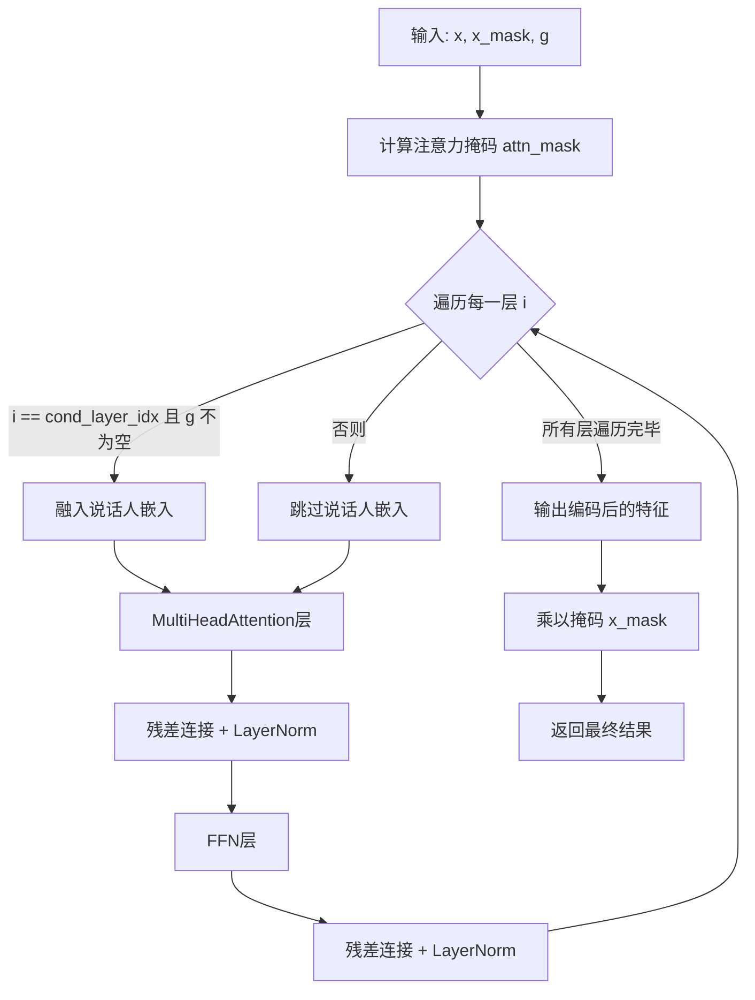
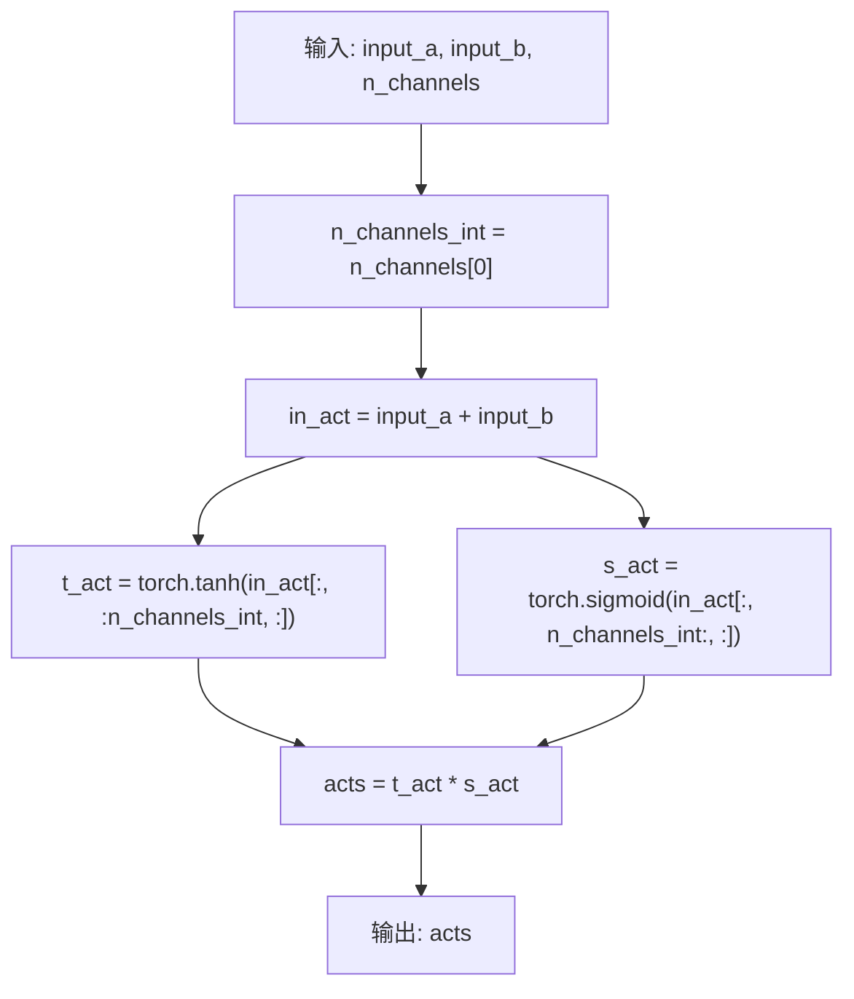
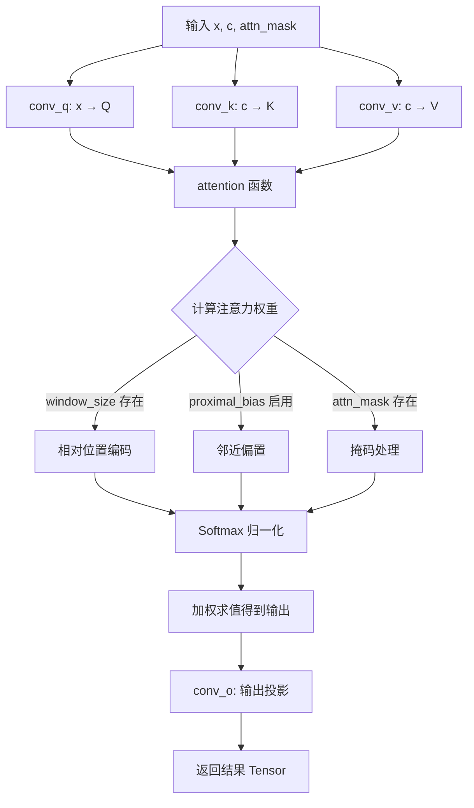
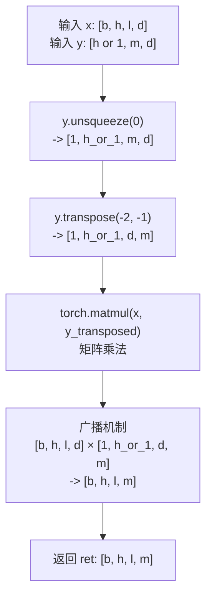
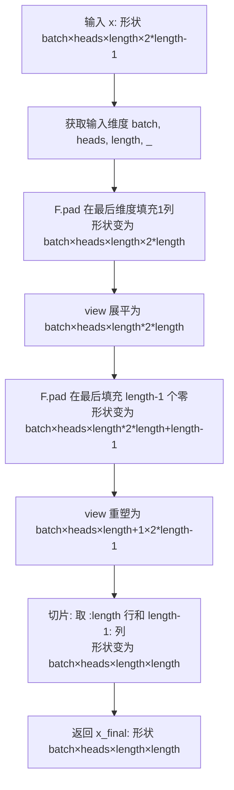

# `Bert-VITS2\onnx_modules\V220\attentions_onnx.py` 详细设计文档

这是一个基于PyTorch的神经网络编码器模块，实现了多头注意力机制（MultiHeadAttention）和前馈网络（FFN），用于语音合成或自然语言处理任务中的特征编码，支持相对位置编码、因果卷积和说话人嵌入等高级功能。

## 整体流程



## 类结构

```
nn.Module (PyTorch基类)
├── LayerNorm (层归一化)
├── Encoder (编码器)
│   ├── MultiHeadAttention (多头注意力)
│   └── FFN (前馈神经网络)
└── 全局函数
    └── fused_add_tanh_sigmoid_multiply
```

## 全局变量及字段


### `logger`
    
模块级日志记录器

类型：`logging.Logger`
    


### `LayerNorm.channels`
    
输入通道数

类型：`int`
    


### `LayerNorm.eps`
    
防止除零的小常数

类型：`float`
    


### `LayerNorm.gamma`
    
缩放参数

类型：`nn.Parameter`
    


### `LayerNorm.beta`
    
偏置参数

类型：`nn.Parameter`
    


### `Encoder.hidden_channels`
    
隐藏层通道数

类型：`int`
    


### `Encoder.filter_channels`
    
滤波器通道数

类型：`int`
    


### `Encoder.n_heads`
    
注意力头数

类型：`int`
    


### `Encoder.n_layers`
    
层数

类型：`int`
    


### `Encoder.kernel_size`
    
卷积核大小

类型：`int`
    


### `Encoder.p_dropout`
    
Dropout概率

类型：`float`
    


### `Encoder.window_size`
    
相对注意力窗口大小

类型：`int`
    


### `Encoder.cond_layer_idx`
    
条件嵌入层索引

类型：`int`
    


### `Encoder.gin_channels`
    
说话人嵌入通道数

类型：`int`
    


### `Encoder.spk_emb_linear`
    
说话人嵌入线性层

类型：`nn.Linear`
    


### `Encoder.drop`
    
Dropout层

类型：`nn.Dropout`
    


### `Encoder.attn_layers`
    
注意力层列表

类型：`nn.ModuleList`
    


### `Encoder.norm_layers_1`
    
归一化层列表1

类型：`nn.ModuleList`
    


### `Encoder.ffn_layers`
    
前馈网络层列表

类型：`nn.ModuleList`
    


### `Encoder.norm_layers_2`
    
归一化层列表2

类型：`nn.ModuleList`
    


### `MultiHeadAttention.channels`
    
输入通道数

类型：`int`
    


### `MultiHeadAttention.out_channels`
    
输出通道数

类型：`int`
    


### `MultiHeadAttention.n_heads`
    
注意力头数

类型：`int`
    


### `MultiHeadAttention.p_dropout`
    
Dropout概率

类型：`float`
    


### `MultiHeadAttention.window_size`
    
相对位置编码窗口大小

类型：`int`
    


### `MultiHeadAttention.heads_share`
    
头之间是否共享参数

类型：`bool`
    


### `MultiHeadAttention.block_length`
    
局部注意力块长度

类型：`int`
    


### `MultiHeadAttention.proximal_bias`
    
是否使用近端偏置

类型：`bool`
    


### `MultiHeadAttention.proximal_init`
    
是否近端初始化

类型：`bool`
    


### `MultiHeadAttention.attn`
    
注意力权重缓存

类型：`Optional[Tensor]`
    


### `MultiHeadAttention.k_channels`
    
每个头的通道数

类型：`int`
    


### `MultiHeadAttention.conv_q`
    
查询卷积层

类型：`nn.Conv1d`
    


### `MultiHeadAttention.conv_k`
    
键卷积层

类型：`nn.Conv1d`
    


### `MultiHeadAttention.conv_v`
    
值卷积层

类型：`nn.Conv1d`
    


### `MultiHeadAttention.conv_o`
    
输出卷积层

类型：`nn.Conv1d`
    


### `MultiHeadAttention.drop`
    
Dropout层

类型：`nn.Dropout`
    


### `MultiHeadAttention.emb_rel_k`
    
相对位置键嵌入

类型：`nn.Parameter`
    


### `MultiHeadAttention.emb_rel_v`
    
相对位置值嵌入

类型：`nn.Parameter`
    


### `FFN.in_channels`
    
输入通道数

类型：`int`
    


### `FFN.out_channels`
    
输出通道数

类型：`int`
    


### `FFN.filter_channels`
    
滤波器通道数

类型：`int`
    


### `FFN.kernel_size`
    
卷积核大小

类型：`int`
    


### `FFN.p_dropout`
    
Dropout概率

类型：`float`
    


### `FFN.activation`
    
激活函数类型

类型：`str`
    


### `FFN.causal`
    
是否使用因果卷积

类型：`bool`
    


### `FFN.padding`
    
填充函数

类型：`Callable`
    


### `FFN.conv_1`
    
第一个卷积层

类型：`nn.Conv1d`
    


### `FFN.conv_2`
    
第二个卷积层

类型：`nn.Conv1d`
    


### `FFN.drop`
    
Dropout层

类型：`nn.Dropout`
    
    

## 全局函数及方法


### `fused_add_tanh_sigmoid_multiply`

该函数是一个经过 PyTorch JIT 编译优化的融合激活函数，典型应用于 WaveNet、VITS 等音频生成模型的门控激活机制。它将输入张量的前 n_channels 通道进行 tanh 激活，后 n_channels 通道进行 sigmoid 激活，然后将两者相乘得到门控输出，实现了将加法、激活函数和乘法融合为一个原子操作，显著减少内存访问开销和计算耗时。

参数：

- `input_a`：`Tensor`，第一个输入张量，通常为上一层的输出特征
- `input_b`：`Tensor`，第二个输入张量，通常为残差连接或条件输入
- `n_channels`：`Tensor`，通道数张量（注意：类型为 Tensor 而非 int，是为兼容 TorchScript 而采用的设计），用于分割激活区间

返回值：`Tensor`，返回经过门控激活后的输出张量，形状与输入相同

#### 流程图



#### 带注释源码

```python
@torch.jit.script
def fused_add_tanh_sigmoid_multiply(input_a, input_b, n_channels):
    """
    融合的tanh-sigmoid乘法运算
    
    这是一个典型的WaveNet门控激活函数实现，通过JIT编译将多个操作融合为
    一个内核，减少内存访问和中间张量分配，提升推理性能。
    
    核心思想：
    - 将输入分为两半，前半部分做tanh激活，后半部分做sigmoid激活
    - 两部分相乘形成门控机制，控制信息流动
    """
    
    # 从Tensor中提取通道数（兼容TorchScript的设计）
    n_channels_int = n_channels[0]
    
    # 残差连接：两个输入相加
    in_act = input_a + input_b
    
    # 对前半部分通道应用tanh激活（值域：-1, 1）
    t_act = torch.tanh(in_act[:, :n_channels_int, :])
    
    # 对后半部分通道应用sigmoid激活（值域：0, 1）
    s_act = torch.sigmoid(in_act[:, n_channels_int:, :])
    
    # 门控乘法：tanh输出与sigmoid输出逐元素相乘
    acts = t_act * s_act
    
    return acts
```


### `LayerNorm.forward`

该方法实现了层归一化（Layer Normalization）。由于 PyTorch 的 `F.layer_norm` 默认在最后一个维度进行归一化，而该模块通常用于处理形状为 `[B, C, T]`（批大小、通道、时间步）的输入（如音频特征），因此方法内部首先将输入张量的通道维移至最后，执行归一化，再将维度恢复。

参数：

-  `x`：`Tensor`，输入张量，形状通常为 `[Batch, Channels, Time]`。

返回值：`Tensor`，归一化后的张量，形状与输入 `x` 相同。

#### 流程图

```mermaid
graph LR
    A[输入 x<br/>[B, C, T]] --> B[transpose(1, -1)<br/>[B, T, C]]
    B --> C[F.layer_norm<br/>归一化通道 C]
    C --> D[transpose(1, -1)<br/>[B, C, T]]
    D --> E[输出 x<br/>[B, C, T]]
```

#### 带注释源码

```python
class LayerNorm(nn.Module):
    def __init__(self, channels, eps=1e-5):
        """
        初始化层归一化模块。
        :param channels: int，输入张量的通道数 C
        :param eps: float，防止除零的极小值
        """
        super().__init__()
        self.channels = channels
        self.eps = eps

        # 可学习的缩放参数 (Scale)
        self.gamma = nn.Parameter(torch.ones(channels))
        # 可学习的偏移参数 (Bias)
        self.beta = nn.Parameter(torch.zeros(channels))

    def forward(self, x):
        """
        执行前向传播：层归一化。
        :param x: Tensor，输入张量 [B, C, T]
        :return: Tensor，归一化后的张量 [B, C, T]
        """
        # 1. 置换维度：将通道维 C (index 1) 移到最后 (index -1)
        #    变换形状从 [B, C, T] 到 [B, T, C]
        x = x.transpose(1, -1)
        
        # 2. 执行 PyTorch 原生层归一化
        #    normalized_shape 为 (C,)，即对最后一个维度 C 进行归一化
        x = F.layer_norm(x, (self.channels,), self.gamma, self.beta, self.eps)
        
        # 3. 恢复维度：将 T 维移回 index 1
        #    变换形状从 [B, T, C] 回 [B, C, T]
        return x.transpose(1, -1)
```


### `Encoder.forward`

该方法是VITS/神经语音编码器的核心前向传播函数，通过多层自注意力（MultiHeadAttention）和前馈网络（FFN）结构处理输入序列，并在指定层级注入说话人嵌入（speaker embedding）以实现条件化，最终输出编码后的特征表示。

参数：

- `x`：`Tensor`，输入特征张量，形状为 [batch, channels, time]，需要编码的序列特征
- `x_mask`：`Tensor`，时间维度掩码，形状为 [batch, time]，用于标识有效时间步（1为有效，0为填充）
- `g`：`Optional[Tensor]`（可选），说话人嵌入张量，形状为 [batch, gin_channels, 1] 或 [batch, gin_channels]，用于条件化编码过程，可为 None

返回值：`Tensor`，编码后的特征张量，形状为 [batch, hidden_channels, time]，与输入 x 的时间维度相同

#### 流程图

```mermaid
flowchart TD
    A[输入 x, x_mask, g] --> B[计算注意力掩码 attn_mask = x_mask.unsqueeze 2 * x_mask.unsqueeze -1]
    B --> C[应用输入掩码 x = x * x_mask]
    C --> D{i &lt; n_layers}
    D -->|是| E{i == cond_layer_idx 且 g 不为 None?}
    D -->|否| I[继续后续层]
    E -->|是| F[说话人嵌入线性变换 g = spk_emb_linear g.transpose 1,2]
    E -->|否| H[跳过说话人嵌入]
    F --> G[融合说话人嵌入 x = x + g; x = x * x_mask]
    G --> I
    H --> I
    I --> J[自注意力层 y = attn_layers[i] x, x, attn_mask]
    J --> K[Dropout y = drop y]
    K --> L[残差连接和归一化 x = norm_layers_1[i] x + y]
    L --> M[前馈网络层 y = ffn_layers[i] x, x_mask]
    M --> N[Dropout y = drop y]
    N --> O[残差连接和归一化 x = norm_layers_2[i] x + y]
    O --> P{下一层?}
    P -->|是| D
    P -->|否| Q[最终掩码 x = x * x_mask]
    Q --> R[输出编码特征 Tensor]
```

#### 带注释源码

```python
def forward(self, x, x_mask, g=None):
    """
    编码器前向传播
    
    参数:
        x: 输入特征 [batch, hidden_channels, time]
        x_mask: 掩码 [batch, time]
        g: 可选的说话人嵌入 [batch, gin_channels, 1] 或 [batch, gin_channels]
    
    返回:
        编码后的特征 [batch, hidden_channels, time]
    """
    # 1. 计算注意力掩码：将x_mask扩展为二维掩码矩阵
    # [batch, time] -> [batch, 1, time] * [batch, time, 1] -> [batch, time, time]
    attn_mask = x_mask.unsqueeze(2) * x_mask.unsqueeze(-1)
    
    # 2. 应用输入掩码，将填充位置置零
    x = x * x_mask
    
    # 3. 遍历每一层编码器块
    for i in range(self.n_layers):
        # 4. 条件注入：在指定层（cond_layer_idx）且提供了说话人嵌入时
        if i == self.cond_layer_idx and g is not None:
            # 说话人嵌入线性变换: [batch, gin_channels, 1] -> [batch, hidden_channels, 1]
            g = self.spk_emb_linear(g.transpose(1, 2))
            g = g.transpose(1, 2)
            # 残差相加并应用掩码
            x = x + g
            x = x * x_mask
        
        # 5. 自注意力层（MultiHeadAttention）
        # 输入: x, x, attn_mask -> 输出: y
        y = self.attn_layers[i](x, x, attn_mask)
        # Dropout
        y = self.drop(y)
        # 残差连接 + LayerNorm
        x = self.norm_layers_1[i](x + y)
        
        # 6. 前馈网络层（FFN）
        y = self.ffn_layers[i](x, x_mask)
        # Dropout
        y = self.drop(y)
        # 残差连接 + LayerNorm
        x = self.norm_layers_2[i](x + y)
    
    # 7. 最终输出前再次应用掩码，确保填充位置为零
    x = x * x_mask
    return x
```


### `MultiHeadAttention.forward`

该方法实现了多头注意力机制的前向传播，接收输入张量 x 和上下文张量 c，通过三个卷积层分别生成 Query、Key、Value，随后调用注意力计算函数生成注意力输出，最后通过输出卷积层生成最终结果。

参数：

-  `x`：`Tensor`，输入张量，维度为 [batch, channels, time]，用于生成 Query
-  `c`：`Tensor`，上下文张量，维度为 [batch, channels, time]，用于生成 Key 和 Value，在自注意力场景下通常与 x 相同
-  `attn_mask`：`Optional[Tensor]`，可选的注意力掩码，用于掩盖无效位置，维度需与注意力分数兼容

返回值：`Tensor`，经过多头注意力机制处理后的输出张量，维度为 [batch, out_channels, time]

#### 流程图



#### 带注释源码

```python
def forward(self, x, c, attn_mask=None):
    """
    多头注意力机制的前向传播
    
    参数:
        x: 输入张量 [batch, channels, time]，用于生成 Query
        c: 上下文张量 [batch, channels, time]，用于生成 Key 和 Value
        attn_mask: 可选的注意力掩码，用于屏蔽无效位置
    
    返回:
        经过注意力机制处理后的输出张量 [batch, out_channels, time]
    """
    # 第一步：通过卷积层将输入 x 映射为 Query
    # conv_q: Conv1d (channels -> channels)
    q = self.conv_q(x)
    
    # 第二步：通过卷积层将上下文 c 映射为 Key
    # conv_k: Conv1d (channels -> channels)
    k = self.conv_k(c)
    
    # 第三步：通过卷积层将上下文 c 映射为 Value
    # conv_v: Conv1d (channels -> channels)
    v = self.conv_v(c)
    
    # 第四步：调用注意力计算函数，生成注意力输出和注意力权重
    # x: 注意力输出 [batch, channels, time]
    # self.attn: 注意力权重矩阵 [batch, n_heads, time, time]
    x, self.attn = self.attention(q, k, v, mask=attn_mask)
    
    # 第五步：通过输出卷积层将注意力输出映射到目标维度
    # conv_o: Conv1d (channels -> out_channels)
    x = self.conv_o(x)
    
    # 返回最终输出
    return x
```


### `MultiHeadAttention.attention`

该方法实现了多头注意力机制的核心计算逻辑，接收查询、键、值张量以及可选的掩码张量，通过计算注意力分数、加权求和得到输出张量，同时返回注意力权重矩阵以供后续分析或可视化使用。

参数：

- `query`：`torch.Tensor`，查询张量，形状为 [batch, channels, time]，用于计算注意力查询向量
- `key`：`torch.Tensor`，键张量，形状为 [batch, channels, time]，用于计算注意力分数
- `value`：`torch.Tensor`，值张量，形状为 [batch, channels, time]，用于加权求和得到输出
- `mask`：`Optional[torch.Tensor]`，可选的注意力掩码张量，用于屏蔽某些位置的注意力计算

返回值：`Tuple[torch.Tensor, torch.Tensor]`，第一个为输出张量（形状 [batch, channels, time]），第二个为注意力权重矩阵（形状 [batch, n_heads, query_time, key_time]）

#### 流程图

```mermaid
flowchart TD
    A[开始 attention] --> B[reshape和transpose<br/>query/key/value]
    B --> C[计算基础注意力分数<br/>scores = Q * K^T / sqrt{d_k}]
    D{是否使用相对位置编码?} -->|是| E[获取相对位置嵌入]
    D -->|否| F
    E --> G[计算相对位置logits]
    G --> H[转换为绝对位置]
    H --> F[合并到scores]
    F --> I{是否使用proximal bias?}
    I -->|是| J[添加邻近位置偏置]
    I -->|否| K
    J --> K{是否提供mask?}
    K -->|是| L[应用mask: scores = -1e4]
    K -->|否| M
    L --> N{是否使用block mask?}
    N -->|是| O[添加block mask限制局部注意力]
    N -->|否| P
    O --> P[softmax得到注意力权重p_attn]
    P --> Q[dropout正则化]
    Q --> R[加权求和: output = p_attn * V]
    R --> S{使用相对位置编码?}
    S -->|是| T[计算值的相对嵌入]
    S -->|否| U
    T --> V[添加到output]
    V --> U[reshape回原始形状]
    U --> W[返回output和p_attn]
```

#### 带注释源码

```python
def attention(self, query, key, value, mask=None):
    # 将张量从 [batch, channels, time] 重塑为 [batch, n_heads, time, k_channels]
    # 其中 k_channels = channels // n_heads
    b, d, t_s, t_t = (*key.size(), query.size(2))  # batch, channels, key_time, query_time
    query = query.view(b, self.n_heads, self.k_channels, t_t).transpose(2, 3)
    key = key.view(b, self.n_heads, self.k_channels, t_s).transpose(2, 3)
    value = value.view(b, self.n_heads, self.k_channels, t_s).transpose(2, 3)

    # 计算基础注意力分数: Q * K^T / sqrt(d_k)
    # 这是标准的scaled dot-product attention
    scores = torch.matmul(query / math.sqrt(self.k_channels), key.transpose(-2, -1))
    
    # 如果使用相对位置编码（window-based attention）
    if self.window_size is not None:
        # 确保key和query的时间维度相同（仅支持self-attention）
        assert (
            t_s == t_t
        ), "Relative attention is only available for self-attention."
        # 获取相对位置嵌入
        key_relative_embeddings = self._get_relative_embeddings(self.emb_rel_k, t_s)
        # 计算query与相对键嵌入的乘积
        rel_logits = self._matmul_with_relative_keys(
            query / math.sqrt(self.k_channels), key_relative_embeddings
        )
        # 将相对位置logits转换为绝对位置
        scores_local = self._relative_position_to_absolute_position(rel_logits)
        # 合并相对位置分数到基础分数
        scores = scores + scores_local
    
    # 如果启用邻近偏置（鼓励关注邻近位置）
    if self.proximal_bias:
        assert t_s == t_t, "Proximal bias is only available for self-attention."
        scores = scores + self._attention_bias_proximal(t_s).to(
            device=scores.device, dtype=scores.dtype
        )
    
    # 应用外部提供的mask（如padding mask）
    if mask is not None:
        scores = scores.masked_fill(mask == 0, -1e4)  # 将mask为0的位置设为极负值
        # 如果使用block限制（局部注意力）
        if self.block_length is not None:
            assert (
                t_s == t_t
            ), "Local attention is only available for self-attention."
            # 创建上三角矩阵来限制注意力范围
            block_mask = (
                torch.ones_like(scores)
                .triu(-self.block_length)  # 下移对角线
                .tril(self.block_length)  # 上移对角线，形成带状矩阵
            )
            scores = scores.masked_fill(block_mask == 0, -1e4)
    
    # 对最后一个维度进行softmax得到注意力权重
    p_attn = F.softmax(scores, dim=-1)  # [b, n_h, t_t, t_s]
    # 应用dropout进行正则化
    p_attn = self.drop(p_attn)
    
    # 注意力权重乘以value得到输出
    output = torch.matmul(p_attn, value)
    
    # 如果使用相对位置编码，还需要加上值相对嵌入的贡献
    if self.window_size is not None:
        # 将注意力权重从绝对位置转换到相对位置
        relative_weights = self._absolute_position_to_relative_position(p_attn)
        # 获取值的相对嵌入
        value_relative_embeddings = self._get_relative_embeddings(
            self.emb_rel_v, t_s
        )
        # 加上相对值的贡献
        output = output + self._matmul_with_relative_values(
            relative_weights, value_relative_embeddings
        )
    
    # 将输出从 [b, n_h, t_t, d_k] 转换回 [b, d, t_t]
    output = (
        output.transpose(2, 3).contiguous().view(b, d, t_t)
    )
    return output, p_attn
```


### `MultiHeadAttention._matmul_with_relative_values`

该方法用于在多头注意力机制中计算相对位置值的矩阵乘法，将相对位置嵌入信息融入到注意力输出中，支持相对位置注意力计算。

参数：

- `x`：`Tensor`，形状为 `[b, h, l, m]`，表示注意力权重（batch size b、头数 h、序列长度 l、相对位置范围 m）
- `y`：`Tensor`，形状为 `[h or 1, m, d]`，表示相对位置值嵌入（头数 h 或 1、相对位置范围 m、每头维度 d）

返回值：`Tensor`，形状为 `[b, h, l, d]`，融合相对位置信息后的注意力输出

#### 流程图

```mermaid
flowchart TD
    A[输入 x: 注意力权重<br/>形状 [b, h, l, m]] --> B[对 y 进行维度扩展]
    B --> C[y.unsqueeze(0)<br/>将 y 从 [h, m, d] 扩展为 [1, h, m, d]]
    C --> D[torch.matmul<br/>矩阵乘法]
    D --> E[输出 ret: [b, h, l, d]]
```

#### 带注释源码

```python
def _matmul_with_relative_values(self, x, y):
    """
    x: [b, h, l, m]
    y: [h or 1, m, d]
    ret: [b, h, l, d]
    """
    # 对 y 进行维度扩展，在最前面添加一个批次维度
    # y 形状: [h, m, d] -> [1, h, m, d]
    # 这样可以广播到与 x 的批次维度匹配
    ret = torch.matmul(x, y.unsqueeze(0))
    return ret
```


### `MultiHeadAttention._matmul_with_relative_keys`

该函数实现了相对位置注意力机制中的键（keys）相对位置矩阵乘法运算，通过对输入的查询张量与相对位置嵌入进行矩阵乘法，计算查询与相对位置键之间的相似度得分。

参数：

- `self`：`MultiHeadAttention`，隐式参数，调用该方法的注意力层实例本身
- `x`：`Tensor`，形状为 `[b, h, l, d]`，其中 b 是批次大小，h 是注意力头数，l 是序列长度，d 是每个头的键维度
- `y`：`Tensor`，形状为 `[h or 1, m, d]`，其中 h 是注意力头数（若 heads_share 为 True 则为 1），m 是相对位置范围（通常为 2*window_size+1），d 是键维度

返回值：`Tensor`，形状为 `[b, h, l, m]`，表示查询与相对位置键之间的注意力分数矩阵

#### 流程图



#### 带注释源码

```python
def _matmul_with_relative_keys(self, x, y):
    """
    执行相对键的矩阵乘法运算，用于计算相对位置注意力分数
    
    参数说明:
        x: [b, h, l, d] - 查询张量，b=批次大小, h=头数, l=序列长度, d=键维度
        y: [h or 1, m, d] - 相对位置键嵌入，h=头数(若共享则为1), m=相对位置数, d=维度
        ret: [b, h, l, m] - 注意力分数矩阵
    
    返回值:
        Tensor: 形状为 [b, h, l, m] 的注意力相对位置分数
    """
    # 对 y 增加批次维度，使其从 [h, m, d] 或 [1, m, d] 变为 [1, h_or_1, m, d]
    # unsqueeze(0) 在维度 0 处添加一个大小为 1 的批次维度
    y_unsqueezed = y.unsqueeze(0)  # [1, h_or_1, m, d]
    
    # 转置最后两个维度，将 [1, h_or_1, m, d] 变为 [1, h_or_1, d, m]
    # 这样做是为了让矩阵乘法能够正确执行：x @ y^T
    # 转置后维度变为 [1, h_or_1, d, m]，便于与 x [b, h, l, d] 进行批次矩阵乘法
    y_transposed = y_unsqueezed.transpose(-2, -1)  # [1, h_or_1, d, m]
    
    # 执行矩阵乘法:
    # x: [b, h, l, d]
    # y_transposed: [1, h_or_1, d, m]
    # 结果通过广播机制得到: [b, h, l, m]
    # 其中 h 与 h_or_1 如果不相等（h > 1 且 heads_share=False），广播会正确处理
    ret = torch.matmul(x, y_transposed)  # [b, h, l, m]
    
    return ret
```


### `MultiHeadAttention._get_relative_embeddings`

该函数用于处理相对位置编码的嵌入向量，根据序列长度和窗口大小对预定义的相对位置嵌入进行适当的填充和切片，以确保在不同长度的序列中正确提取相对位置信息。

参数：

- `relative_embeddings`：`Tensor`，输入的相对位置嵌入向量，形状为 `[n_heads_rel, window_size * 2 + 1, k_channels]` 或类似的嵌入矩阵
- `length`：`int`，目标序列的长度，用于确定需要提取的嵌入范围

返回值：`Tensor`，处理后的相对位置嵌入向量，形状为 `[n_heads_rel, 2*length-1, k_channels]`

#### 流程图

```mermaid
flowchart TD
    A[开始: _get_relative_embeddings] --> B[计算 max_relative_position = 2 * window_size + 1]
    B --> C[计算 pad_length = max(length - (window_size + 1), 0)]
    C --> D[计算 slice_start_position = max((window_size + 1) - length, 0)]
    D --> E[计算 slice_end_position = slice_start_position + 2 * length - 1]
    E --> F{pad_length > 0?}
    F -->|是| G[使用 F.pad 对 relative_embeddings 进行填充]
    F -->|否| H[padded_relative_embeddings = relative_embeddings]
    G --> I[切片: used_relative_embeddings = padded_relative_embeddings[:, slice_start_position:slice_end_position]]
    H --> I
    I --> J[返回 used_relative_embeddings]
```

#### 带注释源码

```python
def _get_relative_embeddings(self, relative_embeddings, length):
    """
    获取用于相对位置编码的嵌入向量。
    
    该方法根据序列长度对预定义的相对位置嵌入进行裁剪或填充，
    以适应不同长度的输入序列。
    
    Args:
        relative_embeddings: 原始的相对位置嵌入，形状为 [n_heads_rel, 2*window_size+1, k_channels]
        length: 目标序列长度
    
    Returns:
        处理后的相对位置嵌入，形状为 [n_heads_rel, 2*length-1, k_channels]
    """
    # 计算最大相对位置范围（窗口大小）
    max_relative_position = 2 * self.window_size + 1
    
    # 计算需要填充的长度（当序列长度大于窗口大小时需要填充）
    # 如果 length <= window_size + 1，则 pad_length = 0
    pad_length = max(length - (self.window_size + 1), 0)
    
    # 计算切片起始位置
    # 当序列长度小于窗口大小时，需要从嵌入中跳过部分位置
    slice_start_position = max((self.window_size + 1) - length, 0)
    
    # 计算切片结束位置
    # 最终需要的长度为 2*length-1（覆盖从 -length+1 到 length-1 的相对位置）
    slice_end_position = slice_start_position + 2 * length - 1
    
    # 根据是否需要填充选择处理方式
    if pad_length > 0:
        # 当序列长度超过窗口大小时，需要在嵌入两侧填充
        # 使用 commons.convert_pad_shape 将填充参数转换为正确的格式
        padded_relative_embeddings = F.pad(
            relative_embeddings,
            commons.convert_pad_shape([[0, 0], [pad_length, pad_length], [0, 0]]),
        )
    else:
        # 序列长度在窗口范围内，无需填充
        padded_relative_embeddings = relative_embeddings
    
    # 从填充后的嵌入中提取所需的切片
    used_relative_embeddings = padded_relative_embeddings[
        :, slice_start_position:slice_end_position
    ]
    
    return used_relative_embeddings
```


### `MultiHeadAttention._relative_position_to_absolute_position`

该方法用于将相对位置编码（形状为 `[batch, heads, length, 2*length-1]`）转换为绝对位置编码（形状为 `[batch, heads, length, length]`）。在相对位置注意力机制中，通过填充、平坦化、重塑和切片操作，实现从相对位置索引到绝对位置索引的映射。

参数：

- `x`：`Tensor`，输入张量，形状为 `[batch, heads, length, 2*length-1]`，表示相对位置注意力分数

返回值：`Tensor`，输出张量，形状为 `[batch, heads, length, length]`，表示绝对位置注意力分数

#### 流程图



#### 带注释源码

```python
def _relative_position_to_absolute_position(self, x):
    """
    将相对位置编码转换为绝对位置编码
    
    x: [b, h, l, 2*l-1]  输入的相对位置注意力分数
    ret: [b, h, l, l]    输出的绝对位置注意力分数
    """
    # 获取输入张量的维度信息
    batch, heads, length, _ = x.size()
    
    # 步骤1：在最后维度（2*l-1）后面填充1列0
    # 形状从 [b, h, l, 2*l-1] 变为 [b, h, l, 2*l]
    # 这一步是为了方便后续的相对到绝对位置转换
    x = F.pad(x, commons.convert_pad_shape([[0, 0], [0, 0], [0, 0], [0, 1]]))

    # 步骤2：将张量展平为2D，便于填充操作
    # 形状从 [b, h, l, 2*l] 变为 [b, h, l*2*l]
    x_flat = x.view([batch, heads, length * 2 * length])
    
    # 步骤3：在展平后的最后维度填充 length-1 个零
    # 为下一步重塑做准备，使总长度符合 (length+1)*(2*length-1) 的要求
    x_flat = F.pad(
        x_flat, commons.convert_pad_shape([[0, 0], [0, 0], [0, length - 1]])
    )

    # 步骤4：重塑回4D张量，并切片提取所需部分
    # 先重塑为 [b, h, length+1, 2*length-1]
    # 然后切片：取前length行，从第length-1列开始到末尾
    # 最终得到形状 [b, h, length, length]
    x_final = x_flat.view([batch, heads, length + 1, 2 * length - 1])[
        :, :, :length, length - 1 :
    ]
    return x_final
```


### `MultiHeadAttention._absolute_position_to_relative_position`

该函数用于将注意力权重从绝对位置索引转换为相对位置索引，是相对位置编码机制中的核心操作。它接收形状为 [b, h, l, l] 的输入张量（绝对位置注意力权重），并输出形状为 [b, h, l, 2*l-1] 的张量（相对位置注意力权重）。

参数：

- `x`：`Tensor`，形状为 [batch, heads, length, length]，表示绝对位置索引的注意力权重矩阵

返回值：`Tensor`，形状为 [batch, heads, length, 2*length-1]，表示相对位置索引的注意力权重矩阵

#### 流程图

```mermaid
flowchart TD
    A[输入 x: 形状 [b, h, l, l]] --> B[获取 batch, heads, length 维度]
    B --> C[在最后一个维度末尾填充 length-1 个零]
    C --> D[将张量展平为形状 [b, h, l² + l×(l-1)]]
    D --> E[在开头填充 length 个零以进行偏移]
    E --> F[重新 reshape 为 [b, h, l, 2×l]]
    F --> G[切片去除第一个元素, 保留 2×l-1 列]
    G --> H[输出: 形状 [b, h, l, 2×l-1]]
```

#### 带注释源码

```python
def _absolute_position_to_relative_position(self, x):
    """
    将绝对位置注意力权重转换为相对位置注意力权重
    
    参数:
        x: 输入张量, 形状 [batch, heads, length, length]
    
    返回:
        输出张量, 形状 [batch, heads, length, 2*length-1]
    """
    # 获取输入张量的维度信息
    batch, heads, length, _ = x.size()
    
    # 步骤1: 在最后一个维度（列）末尾填充 length-1 个零
    # 填充后的形状: [b, h, l, l + (l-1)] = [b, h, l, 2*l-1]
    # 这样可以为后续的相对位置转换提供足够的空间
    x = F.pad(
        x, commons.convert_pad_shape([[0, 0], [0, 0], [0, 0], [0, length - 1]])
    )
    
    # 步骤2: 将填充后的张量展平为二维张量
    # 展平后的形状: [b, h, l*(2*l-1)] = [b, h, l² + l*(l-1)]
    x_flat = x.view([batch, heads, length**2 + length * (length - 1)])
    
    # 步骤3: 在开头填充 length 个零
    # 这一步是为了在重新reshape后，使元素产生偏移，从而实现相对位置编码
    # 填充后的形状: [b, h, l² + l*(l-1) + l] = [b, h, l*(l+1) + l*(l-1)] = [b, h, l*(2*l)]
    x_flat = F.pad(x_flat, commons.convert_pad_shape([[0, 0], [0, 0], [length, 0]]))
    
    # 步骤4: 重新reshape为 [b, h, l, 2*l]，然后切片去除第一个元素
    # 这样得到的形状为 [b, h, l, 2*l-1]，即相对位置编码的形状
    x_final = x_flat.view([batch, heads, length, 2 * length])[:, :, :, 1:]
    
    return x_final
```


### `MultiHeadAttention._attention_bias_proximal`

该方法用于生成自注意力机制中的邻近位置偏向矩阵（proximal bias），通过计算位置索引之间的对数衰减距离矩阵，鼓励模型在计算注意力分数时更多地关注相近位置的内容，增强局部依赖建模能力。

参数：

- `length`：`int`，需要生成偏差矩阵的序列长度（即时间步数）

返回值：`Tensor`，形状为 `[1, 1, length, length]` 的二维矩阵，表示每个位置对之间的邻近偏向分数

#### 流程图

```mermaid
flowchart TD
    A[开始] --> B[创建位置索引向量 r]
    B --> C[计算位置差值矩阵 diff: r - r^T]
    C --> D[计算绝对差值并取对数: -log1p(abs(diff))]
    D --> E[添加两个维度维度: [1, 1, length, length]]
    F[结束]
```

#### 带注释源码

```python
def _attention_bias_proximal(self, length):
    """Bias for self-attention to encourage attention to close positions.
    Args:
      length: an integer scalar.
    Returns:
      a Tensor with shape [1, 1, length, length]
    """
    # 1. 创建从 0 到 length-1 的位置索引向量，形状为 [length]
    r = torch.arange(length, dtype=torch.float32)
    
    # 2. 计算位置之间的差值矩阵
    #    torch.unsqueeze(r, 0) 形状: [1, length]
    #    torch.unsqueeze(r, 1) 形状: [length, 1]
    #    相减后得到 [length, length] 的差值矩阵
    #    diff[i][j] = i - j
    diff = torch.unsqueeze(r, 0) - torch.unsqueeze(r, 1)
    
    # 3. 计算邻近偏向分数
    #    - log1p(|diff|) 实现了距离衰减：距离越近，偏向分数越大（接近 0）
    #    例如：距离为 0 时，-log1p(0) = 0（最大偏向）
    #          距离为 1 时，-log1p(1) = -log(2) ≈ -0.693
    #          距离越大，分数越负（趋向 -∞）
    #    使用 torch.unsqueeze 两次扩展维度到 [1, 1, length, length]
    return torch.unsqueeze(torch.unsqueeze(-torch.log1p(torch.abs(diff)), 0), 0)
```


### `FFN.forward`

该方法是前馈神经网络（Feed-Forward Network）的核心前向传播逻辑，通过两层卷积结构对输入特征进行非线性变换，并支持 GELU 和 ReLU 两种激活函数选择，同时利用掩码机制实现变长序列处理。

参数：

- `x`：`Tensor`，输入特征张量，形状为 `[batch, channels, time]`
- `x_mask`：`Tensor`，输入掩码张量，形状为 `[batch, time]`，用于遮盖填充位置

返回值：`Tensor`，经过前馈网络处理后的输出张量，形状为 `[batch, out_channels, time]`

#### 流程图

```mermaid
flowchart TD
    A[输入 x, x_mask] --> B[掩码处理: x * x_mask]
    B --> C[Padding 填充]
    C --> D[conv_1 卷积]
    D --> E{activation == 'gelu'?}

    E -->|是| F[GELU 激活: x * sigmoid(1.702 * x)]
    E -->|否| G[ReLU 激活: relu(x)]

    F --> H[Dropout 正则化]
    G --> H
    H --> I[Padding 填充]
    I --> J[conv_2 卷积]
    J --> K[掩码处理: x * x_mask]
    K --> L[输出 Tensor]
```

#### 带注释源码

```python
def forward(self, x, x_mask):
    """
    前馈网络的前向传播

    Args:
        x: 输入特征张量 [batch, in_channels, time]
        x_mask: 输入掩码 [batch, time]

    Returns:
        输出张量 [batch, out_channels, time]
    """
    # 第一步：掩码处理 - 将填充位置置零
    x = self.conv_1(self.padding(x * x_mask))

    # 第二步：激活函数选择
    if self.activation == "gelu":
        # GELU 激活函数的近似实现
        x = x * torch.sigmoid(1.702 * x)
    else:
        # 默认使用 ReLU 激活函数
        x = torch.relu(x)

    # 第三步：Dropout 正则化
    x = self.drop(x)

    # 第四步：第二次卷积变换
    x = self.conv_2(self.padding(x * x_mask))

    # 第五步：输出掩码处理并返回
    return x * x_mask
```


### `FFN._causal_padding`

对输入的Tensor进行因果填充（causal padding），即在时间序列的左侧进行填充，右侧不填充，以确保当前时间步只能看到之前的信息，符合自回归模型的因果性约束。

参数：

- `x`：`Tensor`，输入的多维张量，通常为三维张量 [batch, channels, time]

返回值：`Tensor`，填充后的张量

#### 流程图

```mermaid
flowchart TD
    A[开始 _causal_padding] --> B{kernel_size == 1?}
    B -->|是| C[直接返回输入 x]
    B -->|否| D[计算左填充长度: pad_l = kernel_size - 1]
    D --> E[设置右填充长度: pad_r = 0]
    E --> F[构建填充维度: [[0, 0], [0, 0], [pad_l, pad_r]]]
    F --> G[调用 F.pad 进行填充]
    G --> H[返回填充后的张量]
```

#### 带注释源码

```python
def _causal_padding(self, x):
    """
    对输入进行因果填充（causal padding）。
    因果填充确保当前时间步只能看到之前的时间步信息，
    常用于自回归模型中保持时间顺序的因果性。
    
    参数:
        x: 输入的Tensor，通常为 [batch, channels, time] 形状
    
    返回:
        填充后的Tensor
    """
    # 如果卷积核大小为1，不需要填充（1x1卷积不改变时间维度）
    if self.kernel_size == 1:
        return x
    
    # 计算左侧填充长度：kernel_size - 1
    # 例如 kernel_size=3 时，左侧填充2个时间步
    pad_l = self.kernel_size - 1
    
    # 右侧不填充（pad_r = 0），保持因果性
    pad_r = 0
    
    # 构建填充形状 [[batch维度左, batch维度右], [channel维度左, channel维度右], [时间维度左, 时间维度右]]
    # 前两个维度不填充，只有时间维度需要填充
    padding = [[0, 0], [0, 0], [pad_l, pad_r]]
    
    # 使用 PyTorch 的 F.pad 进行填充
    # commons.convert_pad_shape 将嵌套列表转换为 F.pad 需要的元组格式
    x = F.pad(x, commons.convert_pad_shape(padding))
    
    return x
```


### `FFN._same_padding`

该方法实现卷积的"SAME"填充策略，根据kernel_size自动计算左右填充量，使卷积后输出序列长度与输入保持一致（当kernel_size为1时不做填充）。

参数：

-  `x`：`Tensor`，输入的张量，通常为三维张量 [batch, channels, time]

返回值：`Tensor`，填充后的张量，形状为 [batch, channels, time + padding]

#### 流程图

```mermaid
flowchart TD
    A[开始 _same_padding] --> B{kernel_size == 1?}
    B -->|Yes| C[直接返回输入 x]
    B -->|No| D[计算 pad_l = (kernel_size - 1) // 2]
    D --> E[计算 pad_r = kernel_size // 2]
    E --> F[构建 padding 列表: [[0, 0], [0, 0], [pad_l, pad_r]]]
    F --> G[调用 F.pad 进行填充]
    G --> H[返回填充后的张量]
```

#### 带注释源码

```python
def _same_padding(self, x):
    """
    对输入进行 'SAME' 填充，使卷积输出保持与输入相同的时间维度长度。
    这种填充方式在特征提取时能有效保留序列边缘信息。
    
    参数:
        x: 输入张量，形状为 [batch, channels, time]
    
    返回:
        填充后的张量，形状为 [batch, channels, time + padding_total]
    """
    # 如果卷积核大小为1，则不需要填充（1x1卷积不改变序列长度）
    if self.kernel_size == 1:
        return x
    
    # 计算左侧填充量：核大小减1的整数除以2
    # 例如 kernel_size=3 时，pad_l = 1; kernel_size=5 时，pad_l = 2
    pad_l = (self.kernel_size - 1) // 2
    
    # 计算右侧填充量：核大小的整数除以2
    # 例如 kernel_size=3 时，pad_r = 1; kernel_size=5 时，pad_r = 2
    pad_r = self.kernel_size // 2
    
    # 构建填充形状：[[前后填充, 上下填充, 左右填充], ...]
    # 这里的维度顺序对应 Conv1d 的 (batch, channel, time) 维度
    padding = [[0, 0], [0, 0], [pad_l, pad_r]]
    
    # 使用 PyTorch 的 F.pad 进行填充
    # commons.convert_pad_shape 将嵌套列表转换为 F.pad 所需的格式
    x = F.pad(x, commons.convert_pad_shape(padding))
    
    return x
```

## 关键组件


### LayerNorm

层归一化模块，对输入张量进行通道级别的归一化处理，支持可学习的缩放(gamma)和偏移(beta)参数

### fused_add_tanh_sigmoid_multiply

融合的tanh-sigmoid乘法函数，通过torch.jit.script装饰器实现JIT编译优化，将输入分成两半分别进行tanh和sigmoid激活后相乘，用于WaveNet等模型的高效推理

### Encoder

序列编码器模块，基于Transformer架构构建，包含多头注意力层和前馈网络层，支持说话人嵌入(gin_channels)条件注入和相对位置编码

### MultiHeadAttention

多头注意力机制实现，支持相对位置编码(relative position encoding)、局部块注意力(block attention)、邻近偏置(proximal bias)等高级特性，内部维护注意力权重用于可视化分析

### FFN

前馈神经网络模块，采用卷积实现，支持因果卷积(causal convolution)和GELU激活选项，用于特征变换和非线性映射

### 关键组件信息

| 名称 | 描述 |
|------|------|
| 张量索引与形状变换 | 多处使用transpose、view、reshape进行维度重排以适应注意力计算 |
| 相对位置编码 | 通过emb_rel_k和emb_rel_v参数实现可学习的相对位置嵌入 |
| 条件注入机制 | 支持在指定层(cond_layer_idx)注入说话人嵌入实现条件生成 |
| 因果卷积支持 | FFN模块根据causal参数选择不同的padding策略 |
| 局部注意力 | 通过block_length参数实现局部窗口注意力限制 |

### 潜在技术债务

1. **硬编码超参数**: filter_channels、kernel_size等魔法数字分散在代码中
2. **注释代码**: Encoder中存在大段被注释的条件卷积代码(iscflow相关)
3. **重复计算**: 多次调用commons.convert_pad_shape进行形状转换，可缓存结果
4. **类型注解缺失**: 函数参数缺少类型注解，影响代码可维护性

### 其它说明

**设计目标**: 高效的音频/序列建模编码器，支持可变长度输入和条件生成

**数据流**: 输入x → 位置编码(隐式) → 多层注意力+FFN → 条件注入 → 输出

**错误处理**: 大量使用assert进行形状和参数校验，缺乏运行时错误恢复机制


## 问题及建议


### 已知问题

- **硬编码的超参数和魔数**：代码中多处出现硬编码的数值，如attention mask使用的`-1e4`、GELU近似中的`1.702`、`window_size`相关的初始化方式等，这些magic numbers缺乏解释，影响可读性和可维护性。
- **未使用的代码和参数**：`Encoder.__init__`中存在大量注释掉的代码（`isflow`相关逻辑），`kwargs`中传入的某些参数未被使用，造成代码冗余。
- **不安全的字典访问**：`Encoder.__init__`中使用`kwargs["gin_channels"]`直接访问字典key，未做健壮性检查，若key不存在会直接抛出KeyError。
- **attention weights的无效存储**：`MultiHeadAttention.attention`方法计算后存储`self.attn = p_attn`，但在后续流程中从未使用，可能导致内存泄漏和不必要的内存开销。
- **类型注解缺失**：整个代码库中几乎没有类型提示（Type Hints），降低了代码的可读性和静态分析能力。
- **不规范的activation处理**：`FFN`中使用字符串`"gelu"`比较来选择激活函数，而不是使用`nn.GELU`等标准模块，违背了PyTorch的最佳实践。
- **冗余的变量赋值**：`Encoder.forward`中对speaker embedding `g`的处理存在冗余的转置操作，且在每次循环中都进行条件判断和计算，效率较低。
- **命名不一致**：`MultiHeadAttention.forward`接收参数`x`和`c`（context），但实际使用中命名含义不清晰，参数命名与实际用途不匹配。
- **缺少文档注释**：关键方法如`Encoder.forward`、`MultiHeadAttention.attention`等缺少docstring，影响代码理解。

### 优化建议

- **提取魔数为常量**：将`-1e4`、`1.702`等硬编码值定义为类级别或模块级别的常量，并添加注释说明其用途。
- **清理未使用代码**：删除`Encoder`中注释掉的代码和不必要的`kwargs`参数传递，保持代码整洁。
- **使用字典的安全访问**：改用`kwargs.get("gin_channels", 0)`等安全访问方式，避免KeyError。
- **移除无效的attention存储**：如果不需要保存attention权重，删除`self.attn`的赋值操作；如需保存，应提供选项控制。
- **添加类型注解**：为所有函数和方法的参数、返回值添加类型提示，提升代码可读性。
- **使用标准激活函数**：将`FFN`中的字符串比较改为直接使用`nn.GELU()`或`F.gelu()`，提升代码规范性和性能。
- **优化变量处理**：将speaker embedding的处理提前到循环外部，避免重复计算；使用更清晰的变量命名。
- **统一参数命名**：将`MultiHeadAttention.forward`中的`x`、`c`改为更明确的`query`、`key`或`x`、`context`。
- **补充文档注释**：为关键类和方法添加docstring，描述输入输出、功能逻辑和注意事项。

## 其它


### 设计目标与约束

本模块作为VITS（Variational Inference with adversarial learning for end-to-end Text-to-Speech）语音合成模型的编码器核心组件，目标是实现高效的语音特征编码，支持说话人嵌入条件化，并提供相对位置编码以增强模型对局部关系的建模能力。设计约束包括：必须与PyTorch深度集成，支持动态计算图和JIT编译优化，兼容CUDA设备加速，内存占用需控制在合理范围内以支持长序列处理。

### 错误处理与异常设计

代码中的错误处理主要依赖断言（assert）进行参数校验，包括：cond_layer_idx必须小于n_layers以确保条件层索引合法；相对注意力机制要求输入序列长度相等（t_s == t_t）；局部注意力同样要求序列长度匹配。对于外部依赖（如commons模块），假设其提供convert_pad_shape等工具函数，若缺失将抛出ImportError。空值处理通过x_mask实现，确保mask为0的位置不参与计算。运行时异常主要来自维度不匹配或CUDA内存不足，需在上层调用捕获。

### 数据流与状态机

数据流主要分为三条路径：主输入路径（x→MultiHeadAttention→FFN→输出）、条件嵌入路径（g→spk_emb_linear→与x融合）、掩码路径（x_mask→attn_mask生成）。Encoder内部为单向顺序执行状态机，每个layer依次经过注意力计算、残差连接、前馈网络、残差连接，最后输出。MultiHeadAttention内部包含查询/键/值投影、注意力权重计算、相对位置编码融合、输出投影等状态转换。FFN根据causal标志选择因果padding或相同padding策略。

### 外部依赖与接口契约

本模块依赖以下外部组件：torch.nn、torch.nn.functional（PyTorch核心库）、math（标准库）、commons模块（需提供convert_pad_shape函数）、logging模块（标准库）。Encoder类的forward方法接受三个张量输入：x（形状为[B, C, T]的语音特征）、x_mask（形状为[B, 1, T]的二进制掩码）、g（可选的说话人嵌入，形状为[B, gin_channels]）。输出为形状[B, hidden_channels, T]的编码后特征。MultiHeadAttention支持relative_position编码和proximal_bias优化，需保证window_size参数正确设置。

### 性能考虑与优化空间

性能优化措施包括：使用@torch.jit.script装饰器加速fused_add_tanh_sigmoid_multiply函数；LayerNorm采用F.layer_norm而非手动实现以利用CUDA内核优化；注意力计算中reshape和transpose操作经过优化减少复制。潜在优化空间：MultiHeadAttention中的attention方法可进一步融合矩阵运算减少中间变量；FFN的gelu激活可替换为torch.nn.functional.gelu获得更优性能；可考虑使用torch.backends.cudnn.enabled = True并设置torch.backends.cudnn.deterministic = True以获得可重复性能；相对位置编码的_pad操作可预先分配缓冲区避免每次调用时分配。

### 安全性考虑

代码本身不直接处理用户输入或敏感数据，安全性风险较低。需注意：logging.debug在生产环境可能泄露配置信息；kwargs字典未做白名单校验，可能传入未预期参数导致隐藏bug；gin_channels非零时假设kwargs包含正确的gin_channels值，若缺失将触发KeyError；条件层索引cond_layer_idx若设置不当可能导致越界访问。

### 版本兼容性

本代码依赖PyTorch，需确保torch版本≥1.0.0以支持F.layer_norm。部分API（如nn.Parameter的初始化、Xavier_uniform初始化）在旧版本PyTorch中可能有细微差别。torch.jit.script装饰器需要torch≥1.0.0。代码未显式检查torch版本，建议在requirements.txt中声明torch>=1.0.0或>=1.7.0以确保所有功能正常。

### 测试策略建议

单元测试应覆盖：LayerNorm对不同通道数和eps值的输出正确性；Encoder单层和多层前向传播的维度一致性；MultiHeadAttention的相对位置编码在window_size变化时的正确性；FFN的因果padding与same_padding输出形状验证；fused_add_tanh_sigmoid_multiply函数的数值精度。集成测试应验证：Encoder与完整VITS模型的连接；不同batch_size和序列长度下的内存使用；CPU与CUDA设备上的数值一致性；JIT编译后的推理速度提升。

### 部署注意事项

部署时需确保：目标设备安装对应版本的PyTorch和CUDA；gin_channels参数正确配置以支持说话人条件化；模型推理时保持训练时的dropout策略（或使用model.eval()关闭）；多说话人场景下需预先计算并缓存说话人嵌入；对于长序列输入（如>2000帧），建议分批处理以避免CUDA内存溢出；生产环境建议将logging级别调至WARNING以上。

    